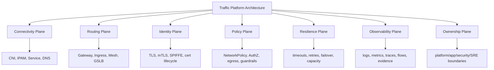
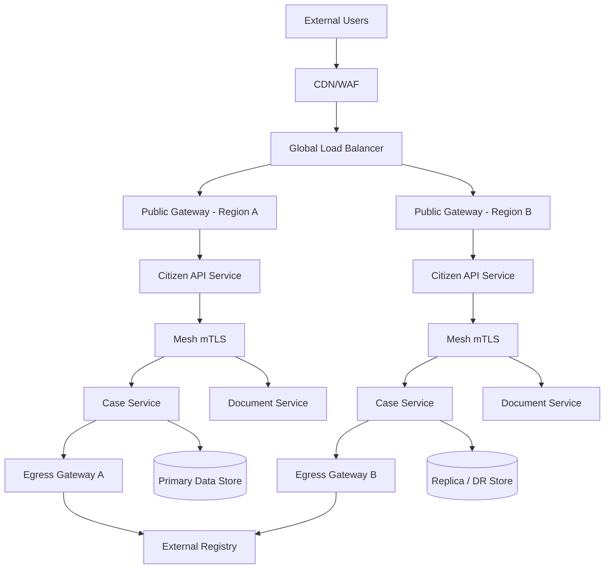

# Part 034 — Production Architecture Review and Decision Framework

## 1. Tujuan Part Ini

Part 033 membahas failure models, chaos testing, dan debugging playbooks. Part ini menjawab pertanyaan yang lebih strategis:

> Bagaimana menilai apakah arsitektur Kubernetes networking layak produksi, aman dioperasikan, scalable, dapat diaudit, dan dapat berkembang tanpa berubah menjadi tumpukan exception?

Target part ini:

> Anda mampu memimpin architecture review untuk Kubernetes networking platform yang mencakup CNI, Service, DNS, Gateway API, ingress, service mesh, mTLS, NetworkPolicy, egress, multi-cluster, observability, ownership, migration, cost, risk, dan regulatory defensibility.

Part ini bukan template checklist biasa. Ini adalah **decision framework**.

Kita akan membangun cara berpikir untuk menjawab:

- Apakah kita butuh service mesh?
- Apakah Gateway API cukup, atau tetap butuh API gateway eksternal?
- Apakah multi-cluster menyelesaikan reliability, atau hanya menambah failure mode?
- CNI mana yang cocok dengan security dan traffic model kita?
- Di mana TLS terminate?
- Bagaimana egress dikontrol tanpa membunuh developer productivity?
- Bagaimana platform team memberi guardrail tanpa menjadi bottleneck?
- Bagaimana membuktikan desain ini defensible untuk audit/regulatory case?

---

## 2. Source Anchors

Materi ini memakai referensi utama berikut:

- Kubernetes Services, Load Balancing, and Networking — `https://kubernetes.io/docs/concepts/services-networking/`
- Kubernetes Gateway API — `https://kubernetes.io/docs/concepts/services-networking/gateway/`
- Gateway API official docs — `https://gateway-api.sigs.k8s.io/`
- Gateway API Conformance — `https://gateway-api.sigs.k8s.io/concepts/conformance/`
- Gateway API Policy Attachment — `https://gateway-api.sigs.k8s.io/reference/policy-attachment/`
- Kubernetes NetworkPolicy — `https://kubernetes.io/docs/concepts/services-networking/network-policies/`
- Kubernetes EndpointSlices — `https://kubernetes.io/docs/concepts/services-networking/endpoint-slices/`
- SIG Multicluster MCS API — `https://multicluster.sigs.k8s.io/concepts/multicluster-services-api/`
- Istio Traffic Management — `https://istio.io/latest/docs/concepts/traffic-management/`
- Istio Security — `https://istio.io/latest/docs/concepts/security/`
- Istio Deployment Models — `https://istio.io/latest/docs/ops/deployment/deployment-models/`
- Linkerd Architecture — `https://linkerd.io/2-edge/reference/architecture/`
- Cilium Service Mesh — `https://docs.cilium.io/en/stable/network/servicemesh/`
- AWS Well-Architected Framework — `https://aws.amazon.com/architecture/well-architected/`
- AWS Well-Architected Reliability Pillar — `https://docs.aws.amazon.com/wellarchitected/latest/reliability-pillar/welcome.html`

Fakta penting yang menjadi anchor:

- Kubernetes networking primitives tidak otomatis menentukan security, observability, or ownership model; itu perlu didesain.
- Gateway API adalah model role-oriented dan extensible untuk routing dan infrastructure provisioning, tetapi behavior tetap bergantung pada implementation/controller.
- NetworkPolicy mengontrol L3/L4 traffic hanya jika CNI mendukung enforcement.
- Service mesh menambahkan policy, traffic management, telemetry, dan identity, tetapi juga menambah control plane, data plane, dan operational cost.
- Multi-cluster adalah boundary design; bukan automatic high availability tanpa data, identity, routing, and operational readiness.

---

## 3. Kaufman Framing: Architecture Review as Deliberate Practice

Dalam framework Kaufman, tujuan belajar bukan menumpuk pengetahuan pasif. Tujuan belajar adalah mencapai level performa yang jelas.

Untuk part ini, target performa adalah:

```txt
Given a Kubernetes networking proposal,
you can identify hidden assumptions,
separate mandatory requirements from nice-to-have features,
compare options using explicit criteria,
predict failure modes,
define guardrails,
and produce a decision record that another senior engineer can audit.
```

Architecture review adalah deliberate practice karena memaksa Anda melakukan empat hal:

1. **Deconstruct** problem menjadi boundary, traffic class, identity, policy, reliability, and ownership.
2. **Compare** options berdasarkan constraints, bukan hype.
3. **Predict** failure modes sebelum production incident.
4. **Encode** decisions menjadi ADR, runbook, guardrail, and test.

---

## 4. Review Model: Seven Planes

Gunakan seven-plane model untuk menilai desain.



A design is weak if it optimizes only one plane.

Example:

```txt
“We use a mesh, so traffic is secure.”
```

This is incomplete. Mesh might help identity and policy, but you still need:

- certificate lifecycle
- enrollment boundaries
- bypass prevention
- observability
- emergency break-glass
- policy ownership
- performance budget
- upgrade model

---

## 5. Architecture Review Intake

Before comparing tools, collect requirements.

### 5.1 Workload Profile

| Question | Why It Matters |
|---|---|
| Is traffic mostly HTTP/gRPC, TCP, UDP, or mixed? | Determines Gateway/mesh/L4 needs |
| Are connections short-lived or long-lived? | Affects draining, retries, load balancing |
| Are requests idempotent? | Affects retry safety |
| Is latency-sensitive? | Affects proxy overhead and cross-zone routing |
| Is traffic internal, external, partner, or regulated? | Affects trust boundaries |
| Does service call graph change often? | Affects policy automation |
| Are clients inside or outside mesh? | Affects mTLS and routing design |
| Are there legacy protocols? | Affects L7 routing and observability |

### 5.2 Organizational Profile

| Question | Why It Matters |
|---|---|
| Who owns cluster networking? | CNI and dataplane operations |
| Who owns public routes? | Gateway and DNS governance |
| Who owns service-to-service policy? | Security/app/platform split |
| Who approves egress? | Compliance and vendor dependency |
| Who handles incidents? | Runbook and access model |
| Who can create cross-namespace references? | Multi-tenant safety |
| Who can change global traffic weights? | Failover and blast radius |

### 5.3 Non-Functional Requirements

Capture explicit targets:

```txt
availability: 99.9 / 99.95 / 99.99
p95 latency budget: <ms>
p99 latency budget: <ms>
RTO: <minutes>
RPO: <minutes>
max regional failover time: <minutes>
max route rollout blast radius: <% traffic>
source IP audit requirement: yes/no
mTLS requirement: none/internal/all/regulated-only
egress allowlist requirement: domain/IP/proxy/vendor-specific
log retention: <days>
trace sampling: <%>
```

Without numbers, architecture review becomes preference debate.

---

## 6. Decision 1: CNI and Dataplane

### 6.1 Core Question

> What dataplane capabilities do we need, and who can operate them under failure?

### 6.2 Decision Criteria

| Criteria | Why It Matters |
|---|---|
| Kubernetes NetworkPolicy support | baseline microsegmentation |
| egress policy support | external dependency control |
| L7 policy support | HTTP/gRPC/Kafka/DNS-aware controls |
| eBPF visibility | flow-level debugging |
| kube-proxy replacement | performance and dataplane simplification |
| cloud-native IPAM | VPC integration and routability |
| encryption | node-to-node/pod-to-pod traffic protection |
| BGP support | bare-metal/on-prem routing |
| multi-cluster support | cluster mesh and global service discovery |
| operational maturity | upgrade, debug, and incident response |

### 6.3 Option Pattern

| Option | Strength | Risk |
|---|---|---|
| Simple overlay CNI | easy to understand | limited policy/visibility/performance |
| Cloud VPC CNI | native cloud routability | IP exhaustion, cloud-specific coupling |
| Calico-style policy/routing | strong policy and BGP patterns | operational complexity |
| Cilium/eBPF | observability, policy, kube-proxy replacement | eBPF/kernel/debug maturity requirement |

### 6.4 Review Questions

- Can we enforce default-deny policies?
- Can we debug dropped packets with evidence?
- Can app teams understand failure messages?
- Can we roll back CNI upgrades safely?
- What kernel versions are supported?
- What happens when CNI agent fails on one node?
- Do we need source IP preservation?
- Do we rely on implementation-specific CRDs?

### 6.5 Red Flags

```txt
- “We chose it because it is fastest” without operational evidence.
- No test for NetworkPolicy enforcement.
- No rollback plan for CNI upgrade.
- No node-level troubleshooting access.
- No IPAM exhaustion alert.
- No flow visibility for production incidents.
```

---

## 7. Decision 2: Ingress, Gateway API, and API Gateway

### 7.1 Core Question

> Which layer owns external request admission, routing, security, and API product concerns?

Do not collapse these into one word: “gateway”.

There are at least three concerns:

| Concern | Typical Tool |
|---|---|
| Kubernetes route programming | Gateway API / Ingress |
| Edge security and global traffic | CDN/WAF/cloud LB/GSLB |
| API product management | API gateway/developer portal/quota/API keys |

### 7.2 Ingress vs Gateway API

| Dimension | Ingress | Gateway API |
|---|---|---|
| API shape | simple HTTP ingress | role-oriented resource model |
| Extensibility | annotations | typed resources, policy attachment, extensions |
| Multi-tenancy | weaker | stronger listener/route/delegation model |
| Protocol support | mostly HTTP/HTTPS | HTTP, gRPC, TLS, TCP, UDP depending on support |
| Status model | controller-specific | more explicit conditions |
| Portability | annotation-dependent | conformance-oriented, still implementation-dependent |

### 7.3 Gateway API Review Questions

- Which `GatewayClass` is platform-approved?
- Who can create `Gateway` objects?
- Who can attach `Route` objects?
- Is cross-namespace attachment controlled?
- Are `ReferenceGrant` objects reviewed?
- Are policies inherited or direct?
- Which features are Core, Extended, or implementation-specific?
- How is conformance tested before upgrades?
- How do we detect conflicting routes?
- How do we roll back route changes?

### 7.4 API Gateway Still Needed?

Gateway API may not replace an API gateway if you need:

- developer portal
- API product lifecycle
- subscription plans
- API keys
- monetization
- request/response transformation at product layer
- partner onboarding workflows
- detailed consumer analytics
- schema validation as product contract
- legacy auth integration

But avoid duplicating policy in too many layers:

```txt
CDN/WAF denies
API gateway rewrites
Gateway API routes
mesh authorizes
application authorizes
```

This can be valid, but only if each layer has clear ownership and evidence.

---

## 8. Decision 3: Service Mesh

### 8.1 Core Question

> Do we need a service mesh, or do we need one mesh capability?

Common mesh capabilities:

- mTLS
- workload identity
- authorization
- traffic splitting
- retries/timeouts
- circuit breaking
- telemetry
- egress control
- service discovery extension
- multi-cluster connectivity

Do not adopt a full mesh only because one feature is attractive.

### 8.2 Mesh Fit Matrix

| Requirement | Mesh Fit |
|---|---|
| all internal service-to-service traffic must use mTLS | strong fit |
| app teams need consistent retries/timeouts | medium/strong fit |
| only public ingress routing needed | weak fit |
| traffic is mostly raw TCP/UDP | depends on mesh implementation |
| strict identity-based auth between services | strong fit |
| team cannot operate proxy/control plane | weak fit |
| latency budget is extremely tight | requires benchmark |
| many legacy non-mesh clients | migration complexity |

### 8.3 Sidecar vs Ambient vs Sidecarless

| Model | Strength | Risk |
|---|---|---|
| Sidecar | mature L7 feature isolation per workload | resource overhead, injection complexity |
| Ambient/waypoint | reduced sidecar overhead, simpler enrollment | policy placement complexity, newer operations |
| eBPF/node-assisted | efficient dataplane, strong visibility potential | implementation-specific behavior, kernel coupling |
| Lightweight sidecar | low overhead, simpler semantics | fewer advanced L7 features |

### 8.4 Mesh Review Questions

- What exact mesh features are mandatory?
- Which traffic remains outside mesh?
- How is bypass prevented or detected?
- How are certificates issued and rotated?
- How do we handle non-mesh clients?
- Who owns mesh policy?
- Who owns mesh upgrades?
- How are proxy resources budgeted?
- How is xDS/config staleness detected?
- What happens if the mesh control plane is unavailable?
- How do we roll back a bad mesh policy?

### 8.5 Mesh Red Flags

```txt
- Mesh installed before ownership model exists.
- STRICT mTLS enabled without dependency inventory.
- App teams cannot read proxy errors.
- No resource budget for sidecars/waypoints.
- No emergency exception process.
- No plan for long-lived connections.
- No compatibility test for batch/cron jobs.
```

---

## 9. Decision 4: Identity, TLS, mTLS, and Trust Domains

### 9.1 Core Question

> What identity does a workload present, who vouches for it, and who trusts it?

IP address is a weak identity in dynamic Kubernetes environments.

### 9.2 Identity Layers

| Layer | Example |
|---|---|
| User identity | end-user JWT/session |
| Client app identity | OAuth client/service account |
| Workload identity | SPIFFE ID / mesh identity |
| Node identity | cloud instance identity / kubelet cert |
| Cluster identity | cluster trust domain |
| External partner identity | client certificate/API credential |

### 9.3 TLS Termination Review

| Termination Point | Benefit | Risk |
|---|---|---|
| CDN/WAF | edge protection | plaintext after edge unless re-encrypted |
| Cloud LB | managed cert/LB integration | limited app context |
| Gateway | Kubernetes route-level control | Secret ownership and controller blast radius |
| Mesh proxy | service-to-service identity | proxy dependency |
| App | end-to-end app control | duplicated TLS operations |

### 9.4 Review Questions

- Where does TLS terminate for public traffic?
- Is backend traffic re-encrypted?
- Is mTLS required internally?
- What is the trust domain naming scheme?
- How are trust bundles distributed?
- How are cert expiry and rotation monitored?
- How do we revoke a compromised workload identity?
- How are cross-cluster identities federated?
- What evidence proves traffic was encrypted?

### 9.5 Red Flags

```txt
- “TLS is handled by the load balancer” but backend is plaintext across untrusted networks.
- `curl -k` used in production checks.
- no certificate expiry alert.
- no owner for trust bundle rotation.
- mTLS exceptions undocumented.
- namespace name used as sole security identity.
```

---

## 10. Decision 5: NetworkPolicy and Microsegmentation

### 10.1 Core Question

> What is the minimum network access each workload needs, and how do we prove policy is enforced?

### 10.2 Policy Maturity Levels

| Level | Description |
|---|---|
| 0 | default allow, no visibility |
| 1 | default allow, observe flows |
| 2 | default deny for selected namespaces |
| 3 | default deny broadly, explicit service dependencies |
| 4 | automated policy generation/review with drift detection |
| 5 | identity-aware and L7-aware policy with audit evidence |

### 10.3 Review Questions

- Does the CNI enforce NetworkPolicy?
- Are namespaces labeled consistently?
- Is default-deny applied gradually?
- Are DNS, metrics, health checks, and mesh dependencies allowed?
- Are policies generated from observed flows or manually written?
- How are unused allows removed?
- How are emergency exceptions created and expired?
- How are policy decisions audited?

### 10.4 Microsegmentation Design

Recommended rollout:

```txt
observe → model dependencies → simulate → default deny non-critical namespace → test → enforce → expand → audit drift
```

Do not start with all namespaces at once.

### 10.5 Red Flags

```txt
- default deny applied without DNS exception.
- selectors depend on unstable labels.
- namespace selectors too broad.
- policy YAML reviewed without traffic evidence.
- no way to tell whether a packet was denied by policy.
```

---

## 11. Decision 6: Egress Control

### 11.1 Core Question

> How do workloads reach external dependencies, and how do we prevent uncontrolled data movement?

Egress is usually harder than ingress because external dependencies are less standardized.

### 11.2 Egress Options

| Option | Strength | Risk |
|---|---|---|
| Node SNAT only | simple | weak audit, source IP drift |
| NAT gateway | stable-ish cloud path | port exhaustion, cost, limited identity |
| Static egress IP | vendor allowlist friendly | scaling and failover complexity |
| HTTP proxy | strong audit and policy | app compatibility, proxy bottleneck |
| Mesh egress gateway | identity-aware egress | mesh dependency and config complexity |
| Private connectivity | avoids public internet | provider-specific, route complexity |
| FQDN policy | developer-friendly | DNS drift and wildcard risk |

### 11.3 Review Questions

- Which workloads can access the internet?
- Are external dependencies inventoried?
- Is source IP stable where vendors require allowlisting?
- Are domains validated beyond DNS names?
- Is TLS inspection used? If yes, how is trust handled?
- How is NAT port exhaustion monitored?
- How are emergency egress exceptions approved?
- Are egress logs retained for audit?
- Does egress route through a single bottleneck?

### 11.4 Red Flags

```txt
- all pods can reach internet by default.
- vendor allowlist uses node IPs that autoscale unpredictably.
- wildcard FQDN allows broad exfiltration.
- no egress logs.
- no ownership for external dependency registry.
```

---

## 12. Decision 7: Multi-Cluster

### 12.1 Core Question

> What boundary does multi-cluster create, and what failure does it actually solve?

Multi-cluster can solve:

- regional availability
- blast radius isolation
- compliance/data residency
- cluster upgrade isolation
- team/environment separation
- capacity scaling

Multi-cluster can create:

- split-brain
- inconsistent policy
- stale service discovery
- cross-region latency
- data consistency conflict
- certificate federation complexity
- failover that overloads surviving region

### 12.2 Multi-Cluster Pattern Matrix

| Pattern | Use Case | Risk |
|---|---|---|
| Active-passive | DR, strict primary data ownership | failover rehearsal required |
| Active-active stateless | global latency, availability | capacity and routing complexity |
| Active-active stateful | rare and hard | data consistency and conflict |
| Cluster per region | locality and isolation | global governance complexity |
| Cluster per tenant | isolation | operational sprawl |
| Cluster per lifecycle | upgrade safety | environment drift |

### 12.3 Review Questions

- Why do we need multiple clusters?
- Are Pod/Service CIDRs non-overlapping?
- Is namespace sameness required?
- Is service discovery MCS-based, DNS-based, mesh-based, or custom?
- How does failover work?
- What health signal triggers failover?
- Does data fail over too?
- Is spare capacity reserved?
- How are policies synchronized?
- How are trust domains federated?
- Can we test regional isolation safely?

### 12.4 Red Flags

```txt
- “Multi-cluster means HA” with no data/RTO/RPO plan.
- global DNS failover based only on Gateway health.
- no capacity in secondary region.
- cross-cluster mTLS not tested.
- overlapping CIDRs.
- manual failover runbook not rehearsed.
```

---

## 13. Decision 8: Resilience Policies

### 13.1 Core Question

> Where are timeouts, retries, circuit breakers, and load shedding defined, and are they consistent with application semantics?

### 13.2 Policy Ownership

| Policy | Owner Candidates |
|---|---|
| global edge timeout | platform/SRE |
| route timeout | app/platform shared |
| service retry | app owner with platform guardrail |
| circuit breaker | app/SRE shared |
| rate limit | platform/API/security |
| load shedding | app/SRE |
| failover | platform/SRE/business owner |

### 13.3 Review Questions

- Are all retries idempotency-aware?
- Is there a retry budget?
- Are timeouts ordered correctly from client to backend?
- Is circuit breaker configured by observed capacity?
- Are load shedding responses explicit?
- Are retry storms visible in metrics?
- Are policies applied in app, mesh, gateway, or all three?
- Is there a documented precedence model?

### 13.4 Timeout Ladder

Example:

```txt
client request timeout: 10s
edge gateway timeout: 9s
internal gateway timeout: 8s
service mesh request timeout: 7s
application handler timeout: 6s
database query timeout: 5s
```

The exact values depend on workload. The invariant is:

> Inner dependencies should fail before outer callers give up, otherwise capacity is wasted and errors become ambiguous.

---

## 14. Decision 9: Observability and Evidence

### 14.1 Core Question

> Can we prove what happened to a request across route, service, workload, node, cluster, and policy boundary?

### 14.2 Required Dimensions

Every production request log/metric/trace should be able to answer:

- source identity
- source namespace
- destination service
- route name
- Gateway name
- backend version
- cluster
- region/zone
- response code
- response flag
- latency
- retry count
- policy decision
- mTLS mode
- trace ID

Not every signal must include every field, but the observability model must allow correlation.

### 14.3 Observability Review Questions

- Can we identify which `HTTPRoute` served a request?
- Can we identify backend version for canary traffic?
- Can we identify policy denies?
- Can we identify DNS latency separately from app latency?
- Can we identify cross-zone/cross-region traffic?
- Can we distinguish Gateway 503 from app 503?
- Can we debug one user request end-to-end?
- Can we export an incident evidence bundle?

### 14.4 Red Flags

```txt
- app metrics only, no gateway/proxy metrics.
- high-cardinality labels added without budget.
- traces sampled so aggressively that incidents disappear.
- no flow logs for policy denied traffic.
- no route/backend labels in access logs.
```

---

## 15. Decision 10: Ownership and Governance

### 15.1 Core Question

> Who is allowed to change traffic behavior, and how is that change reviewed, limited, and audited?

### 15.2 Ownership Matrix

| Resource | Platform | App Team | Security | SRE |
|---|---|---|---|---|
| CNI config | owner | consulted | consulted | consulted |
| GatewayClass | owner | consumer | consulted | consulted |
| Shared Gateway | owner | attach routes | consulted | consulted |
| HTTPRoute | guardrail | owner | consulted for public/sensitive | consulted |
| ReferenceGrant | approve/control | request | approve sensitive refs | consulted |
| NetworkPolicy | guardrail | define dependency | approve model | observe |
| AuthZ policy | platform/security | service owner input | owner | consulted |
| Egress allowlist | platform/security | request | owner | observe |
| Failover weights | platform/SRE | consulted | consulted | owner |
| Mesh config | platform | service owner input | consulted | consulted |

### 15.3 Governance Controls

Use:

- RBAC.
- admission policy.
- namespace labels.
- GitOps review.
- policy-as-code.
- automated conformance tests.
- route linting.
- emergency exception expiry.
- audit logs.
- periodic drift review.

### 15.4 Red Flags

```txt
- any app team can attach to public Gateway.
- app team can reference Secrets in platform namespace.
- no approval for cross-namespace ReferenceGrant.
- route weights changed manually with no audit trail.
- emergency NetworkPolicy exception never expires.
```

---

## 16. Cost and Capacity Model

Networking architecture has cost beyond cloud bills.

### 16.1 Cost Categories

| Category | Examples |
|---|---|
| Proxy compute | sidecars, waypoints, gateways, API gateway |
| Cross-zone traffic | topology-unaware load balancing |
| Cross-region traffic | active-active or failover testing |
| NAT cost | NAT gateway processing and hourly cost |
| Logging cost | access logs, flow logs, traces |
| Cardinality cost | metrics dimensions route/pod/user |
| Operational cost | upgrades, debugging, on-call load |
| Cognitive cost | multiple policy layers and hidden interactions |

### 16.2 Capacity Questions

- How many RPS per Gateway replica?
- What is p99 latency added by proxy layers?
- How many active connections per proxy?
- What is CPU/memory per sidecar/waypoint?
- What is NAT connection tracking limit?
- What is DNS QPS under deploy/load test?
- What is max EndpointSlice update rate during scale event?
- What happens during regional failover when traffic doubles?

### 16.3 Red Flags

```txt
- no load test through real Gateway/mesh path.
- capacity test bypasses TLS/mTLS.
- log volume cost not estimated.
- cross-zone traffic not measured.
- failover capacity not reserved.
```

---

## 17. Security and Threat Model

### 17.1 Threats

| Threat | Control |
|---|---|
| route hijacking | listener allowedRoutes, RBAC, admission |
| Secret reference abuse | ReferenceGrant review, namespace isolation |
| lateral movement | NetworkPolicy, mTLS, AuthorizationPolicy |
| egress exfiltration | egress gateway/proxy/FQDN policy/logging |
| plaintext internal traffic | mTLS or backend TLS |
| identity spoofing | SPIFFE/mTLS, workload attestation |
| policy bypass | sidecar/ambient enrollment validation, CNI policy |
| public accidental exposure | route admission and public/private Gateway split |
| stale cert | rotation monitoring and expiry alerts |
| debug access abuse | ephemeral access controls and audit |

### 17.2 Security Review Questions

- What is the trust boundary between namespaces?
- What is the trust boundary between clusters?
- Are public and private routes physically/logically separated?
- Are app teams allowed to create public exposure directly?
- How is Secret reference controlled?
- Can a compromised pod reach metadata services or internet?
- Can a compromised namespace attach to shared Gateway?
- Can policy be bypassed by direct Pod IP?
- Are emergency debug pods restricted?

---

## 18. Migration Framework

Most real platforms migrate from something already running.

### 18.1 Migration Principles

```txt
- Migrate behavior, not only YAML.
- Preserve rollback path.
- Move one traffic class at a time.
- Keep user-visible probes active.
- Compare old and new telemetry.
- Avoid changing routing, identity, and policy simultaneously.
```

### 18.2 Ingress to Gateway API

Phases:

```txt
1. Inventory Ingress objects and annotations.
2. Classify annotations: core routing, TLS, auth, rewrite, rate limit, controller-specific.
3. Select Gateway controller and conformance profile.
4. Create shared Gateway and listener model.
5. Migrate low-risk internal route.
6. Migrate public route with parallel hostname or weighted DNS.
7. Validate status, telemetry, rollback.
8. Deprecate old Ingress gradually.
```

### 18.3 Service Mesh Adoption

Phases:

```txt
1. Observe service graph.
2. Enroll non-critical namespace.
3. Enable permissive mTLS.
4. Validate telemetry and proxy overhead.
5. Add authorization policies for selected services.
6. Move to STRICT mTLS for known-good boundary.
7. Expand by domain.
8. Add egress/traffic shaping after base identity is stable.
```

### 18.4 Multi-Cluster Adoption

Phases:

```txt
1. Define why multi-cluster exists.
2. Ensure CIDR/IPAM compatibility.
3. Establish cluster identity and trust model.
4. Test service discovery across clusters.
5. Test non-critical failover.
6. Test capacity and data dependencies.
7. Add global routing guardrails.
8. Run game day before production dependency.
```

### 18.5 Migration Red Flags

```txt
- adopting mesh and multi-cluster simultaneously.
- enabling STRICT mTLS globally in first phase.
- replacing ingress controller and DNS/GSLB at same time.
- no rollback route.
- no telemetry comparison between old and new path.
```

---

## 19. Architecture Decision Record Template

Use this ADR format for every major networking decision.

```md
# ADR-XXX: <Decision Title>

## Status
Proposed | Accepted | Deprecated | Superseded

## Context
What problem are we solving?
What constraints exist?
What is out of scope?

## Requirements
- functional requirements
- non-functional requirements
- security requirements
- compliance requirements
- operational requirements

## Options Considered
1. Option A
2. Option B
3. Option C

## Decision
What option did we choose?

## Rationale
Why this option?
Why not the alternatives?

## Consequences
Positive consequences.
Negative consequences.
Operational burden.
Cost implications.

## Failure Modes
What can go wrong?
How will we detect it?
How will we mitigate it?

## Rollout Plan
Phases.
Validation.
Rollback.

## Ownership
Who owns config, incident, upgrades, exceptions?

## Audit Evidence
What logs/events/metrics prove behavior?
```

---

## 20. Production Review Checklist

### 20.1 Connectivity

```txt
[ ] Pod CIDR and Service CIDR planned.
[ ] IPAM exhaustion monitored.
[ ] CNI supports required policy.
[ ] Node-level dataplane debugging available.
[ ] MTU validated.
[ ] kube-proxy/eBPF mode documented.
[ ] cross-node traffic tested.
```

### 20.2 Service Discovery

```txt
[ ] CoreDNS capacity tested.
[ ] NodeLocal DNSCache decision documented.
[ ] DNS policy exceptions defined.
[ ] service FQDN conventions documented.
[ ] headless/stateful discovery reviewed.
[ ] external DNS dependency modeled.
```

### 20.3 Gateway and Routing

```txt
[ ] GatewayClass selected and approved.
[ ] public/private Gateway separated.
[ ] listener ownership documented.
[ ] AllowedRoutes configured.
[ ] ReferenceGrant reviewed.
[ ] route conflicts detected.
[ ] rollback strategy exists.
[ ] conformance tested.
```

### 20.4 TLS and Identity

```txt
[ ] TLS termination points documented.
[ ] backend encryption decision documented.
[ ] mTLS mode documented.
[ ] certificate rotation monitored.
[ ] trust domain defined.
[ ] cross-cluster trust reviewed.
[ ] emergency cert replacement runbook exists.
```

### 20.5 Policy

```txt
[ ] default-deny rollout plan exists.
[ ] DNS/health/metrics/mesh exceptions modeled.
[ ] policy enforcement tested.
[ ] policy deny observability exists.
[ ] emergency exception expiry enforced.
[ ] cross-namespace references controlled.
```

### 20.6 Resilience

```txt
[ ] timeout ladder defined.
[ ] retry budget defined.
[ ] circuit breaker/load shedding reviewed.
[ ] rollout/canary abort conditions defined.
[ ] failover behavior tested.
[ ] capacity under failover tested.
```

### 20.7 Observability

```txt
[ ] route/backend labels in logs/metrics.
[ ] Gateway metrics captured.
[ ] mesh/proxy metrics captured.
[ ] CNI/flow visibility available.
[ ] DNS latency visible.
[ ] policy deny visible.
[ ] trace correlation available.
[ ] evidence bundle process defined.
```

### 20.8 Multi-Cluster

```txt
[ ] explicit reason for multi-cluster documented.
[ ] CIDR non-overlap verified.
[ ] namespace sameness policy defined.
[ ] service export/import governance defined.
[ ] global routing health signal validated.
[ ] trust federation tested.
[ ] data dependency failover tested.
[ ] regional game day completed.
```

---

## 21. Risk Register Template

```md
| Risk | Likelihood | Impact | Detection | Mitigation | Owner | Review Date |
|---|---:|---:|---|---|---|---|
| Gateway route conflict exposes wrong backend | Medium | High | admission + route status alert | hostname ownership policy | Platform | monthly |
| DNS saturation during deploy | Medium | High | CoreDNS QPS/latency alert | NodeLocal DNSCache + cache tuning | SRE | quarterly |
| NAT port exhaustion | Low | High | NAT conn metrics | egress gateway scaling + connection reuse | Platform | quarterly |
| mTLS cert rotation failure | Low | Critical | expiry alert + synthetic probe | rotation runbook | Security/Platform | monthly |
```

Risk review should be tied to ownership and date. A risk without owner is a wish.

---

## 22. Regulatory Defensibility

For enforcement lifecycle, case management, financial, healthcare, or other regulated systems, networking architecture must support explanation.

### 22.1 Defensible Claims

Weak claim:

```txt
Traffic is secure because we use Kubernetes and TLS.
```

Defensible claim:

```txt
Public traffic terminates at the edge WAF, is re-encrypted to the cluster Gateway, and service-to-service traffic for regulated namespaces uses mTLS with workload identity. Authorization policies restrict access by service identity. NetworkPolicy denies non-declared east-west traffic. Egress requires approved proxy path. Route, policy, and egress changes are GitOps-reviewed and auditable.
```

### 22.2 Evidence Needed

| Claim | Evidence |
|---|---|
| traffic encrypted | TLS/mTLS config, cert telemetry, packet/proxy evidence |
| access restricted | AuthorizationPolicy/NetworkPolicy, deny logs |
| public exposure controlled | Gateway/Route inventory, RBAC, admission logs |
| egress controlled | egress proxy logs, allowlist, policy |
| changes reviewed | Git history, approval workflow |
| incidents traceable | logs, metrics, traces, timeline |
| failover tested | game day report, synthetic probe results |

### 22.3 Audit Questions

- Who can expose a new public endpoint?
- Who approved the route?
- What backend received traffic?
- Was traffic encrypted at every required hop?
- Which workloads could call this service?
- Could this service call the internet?
- Where are deny logs stored?
- How long are access logs retained?
- How was failover tested?
- How were emergency changes approved and reverted?

---

## 23. Anti-Pattern Catalog

### 23.1 “One Gateway to Rule Them All”

A single shared Gateway handles every public/private/internal/partner route with weak delegation.

Risk:

- route conflict
- blast radius expansion
- unclear ownership
- policy coupling

Better:

```txt
Separate public, private, partner, and internal Gateway boundaries.
Use listener and namespace attachment controls.
```

### 23.2 “Mesh as Magic Security”

Installing mesh but not defining identity, bypass prevention, or policy ownership.

Better:

```txt
Define mesh threat model and enrollment invariants first.
```

### 23.3 “Default Allow Forever”

Relying on application auth only for all lateral movement.

Better:

```txt
Start with observability, then default-deny by domain.
```

### 23.4 “Multi-Cluster as Disaster Recovery”

Deploying to two clusters but not testing data failover, identity, or capacity.

Better:

```txt
Define RTO/RPO and run regional game days.
```

### 23.5 “Policy in Five Places”

WAF, API gateway, Gateway controller, mesh, app, and CNI all enforce overlapping auth/rate/headers with no precedence model.

Better:

```txt
Assign each layer a clear purpose.
Document precedence and evidence.
```

### 23.6 “Observability Later”

Shipping routing/security architecture before route/backend/policy visibility exists.

Better:

```txt
Observability is part of architecture readiness, not a backlog nice-to-have.
```

---

## 24. Example Architecture Review: Regulated Case Platform

### 24.1 Scenario

A regulated case management platform runs on Kubernetes. It has:

- public citizen APIs
- internal enforcement APIs
- admin console
- document processing workers
- case event stream
- external registry integrations
- strict audit requirement
- regional DR requirement

### 24.2 Proposed Architecture



### 24.3 Review Findings

| Area | Finding | Decision |
|---|---|---|
| Gateway | public and internal traffic separated | accept |
| mTLS | regulated services require mTLS | accept with staged rollout |
| egress | registry calls through egress gateway | accept |
| multi-cluster | active-passive for write path | require DR game day |
| observability | missing route/backend labels | block launch |
| policy | default-deny not yet tested | launch only for non-regulated namespace |
| failover | DB RPO unclear | block production DR claim |

### 24.4 Launch Gate

```txt
Must pass before production:
[ ] public route inventory reviewed
[ ] TLS chain validated
[ ] mTLS enabled for regulated service path
[ ] egress allowlist approved
[ ] NetworkPolicy deny logs visible
[ ] route/backend metrics present
[ ] failover game day completed
[ ] emergency rollback tested
[ ] ADR approved by platform/security/SRE/app owner
```

---

## 25. Final Architecture Scorecard

Use a 0–3 score.

| Score | Meaning |
|---|---|
| 0 | absent or unknown |
| 1 | exists but manual/fragile |
| 2 | defined and partially automated |
| 3 | production-ready, tested, observable, owned |

Score areas:

```txt
Connectivity: __ / 3
Service discovery: __ / 3
Gateway/routing: __ / 3
TLS/identity: __ / 3
NetworkPolicy: __ / 3
Egress control: __ / 3
Service mesh: __ / 3
Resilience policy: __ / 3
Observability: __ / 3
Multi-cluster: __ / 3
Ownership/governance: __ / 3
Cost/capacity: __ / 3
Migration/rollback: __ / 3
Regulatory evidence: __ / 3
```

Interpretation:

| Total | Interpretation |
|---:|---|
| 0–15 | not production-ready |
| 16–25 | usable for low-risk/internal workloads only |
| 26–34 | production candidate with known gaps |
| 35–42 | strong production posture |

The exact total is less important than the lowest-scoring critical area. One `0` in identity, egress, or observability can invalidate the design for regulated workloads.

---

## 26. Review Meeting Format

### 26.1 Participants

- platform/networking owner
- application owner
- SRE/on-call owner
- security representative
- compliance/regulatory representative when applicable
- data/storage owner for multi-cluster/failover decisions

### 26.2 Agenda

```txt
1. Problem statement and non-goals
2. Traffic classes and trust boundaries
3. Architecture diagram
4. Seven-plane review
5. Failure modes
6. Decision comparison
7. Operational readiness
8. Security/regulatory evidence
9. Migration and rollback
10. Open risks and launch gate
```

### 26.3 Output

Meeting must produce:

- accepted decisions
- rejected options and rationale
- risk register
- launch blockers
- required tests
- owner per follow-up
- review date

If no decision artifact exists, the review did not happen in a durable way.

---

## 27. Part 034 Completion Check

Anda selesai dengan Part 034 jika dapat:

- Mengevaluasi CNI, Gateway API, mesh, policy, egress, observability, dan multi-cluster menggunakan explicit criteria.
- Membedakan Gateway API, API gateway, CDN/WAF, cloud LB, dan service mesh berdasarkan responsibility.
- Menentukan kapan service mesh layak, kapan terlalu mahal, dan kapan cukup memakai Gateway/API/CNI policy.
- Mendesain ownership model lintas platform, app team, security, dan SRE.
- Membuat ADR untuk keputusan networking besar.
- Menilai risiko multi-cluster secara jujur, termasuk data, identity, capacity, and failover readiness.
- Membuat scorecard production readiness.
- Menghubungkan architecture decision dengan evidence untuk audit/regulatory defensibility.

Part berikutnya adalah **Part 035 — Capstone Design: Top 1% Kubernetes Networking Handbook**. Itu akan menjadi bagian terakhir seri ini, menyatukan semua materi menjadi desain end-to-end, diagram, policy model, runbook, SLO, risk register, dan self-assessment.
