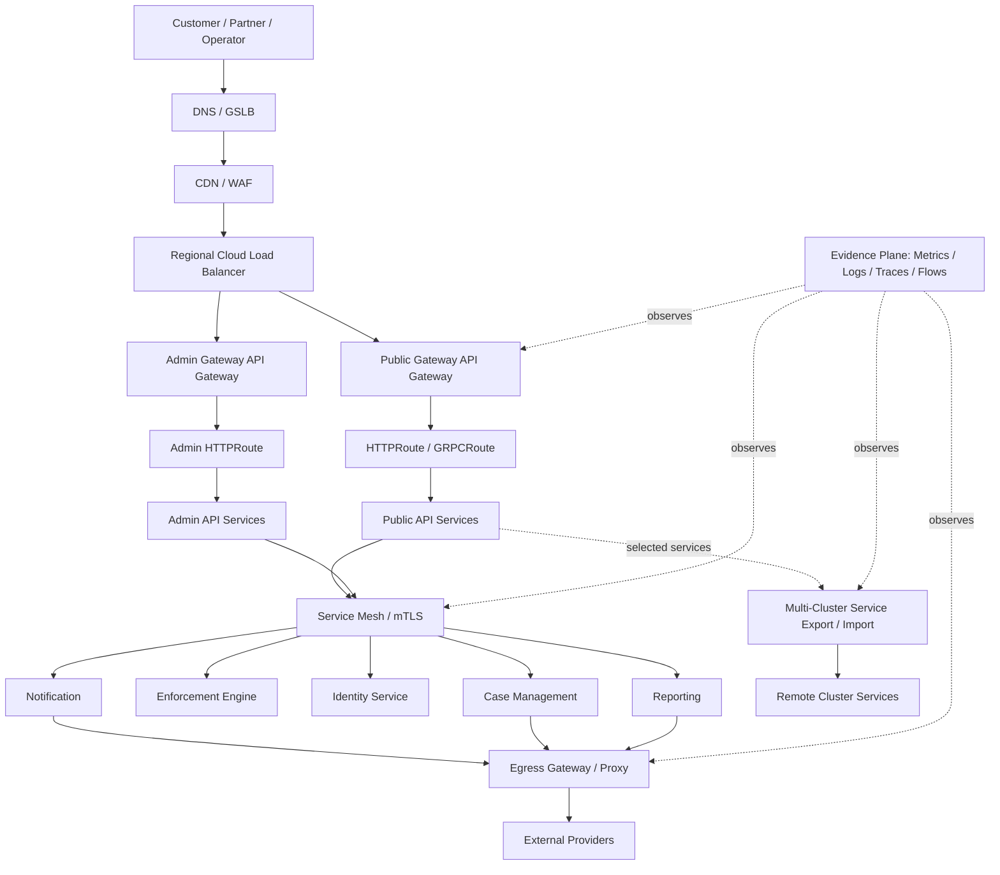
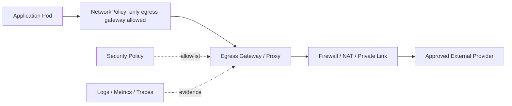
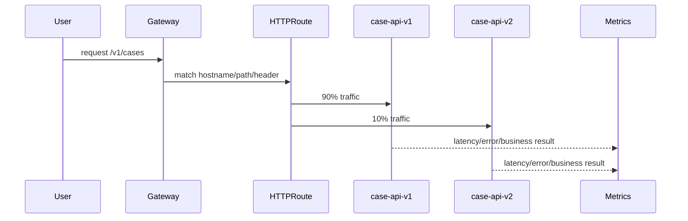
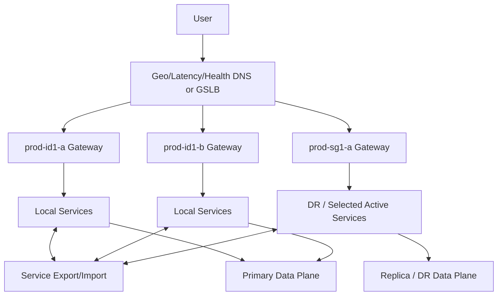
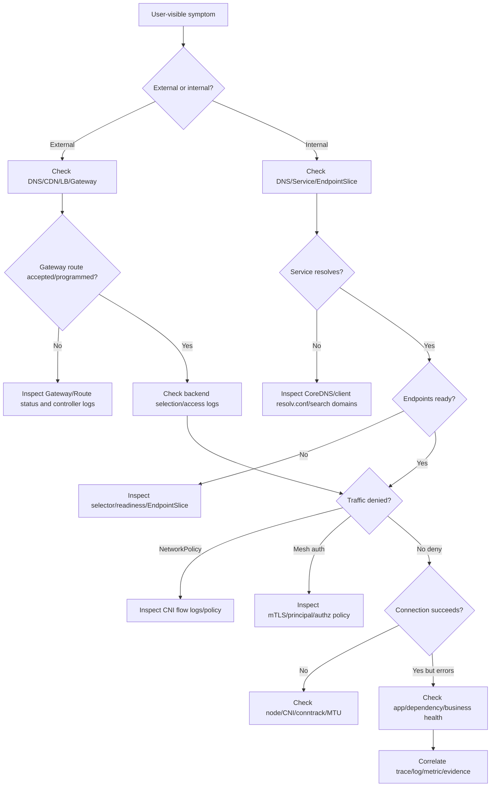
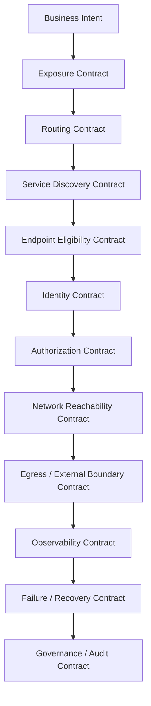

# Part 035 — Capstone Design: Top 1% Kubernetes Networking Handbook

This is the final part of the series.

The goal is not to memorize every object, controller, mesh option, or vendor-specific feature. The goal is to prove that we can design, explain, defend, operate, and debug a production-grade Kubernetes traffic platform under real constraints.

A top-tier engineer does not think in isolated objects:

- `Service`
- `Ingress`
- `Gateway`
- `HTTPRoute`
- `VirtualService`
- `NetworkPolicy`
- `AuthorizationPolicy`
- `ServiceExport`
- `ServiceImport`
- `EndpointSlice`

They think in contracts:

- who is allowed to expose traffic,
- who is allowed to receive traffic,
- who owns certificates,
- which identity is trusted,
- which traffic can cross namespace, cluster, zone, region, or external boundary,
- what happens during failure,
- what evidence exists during incident review,
- how changes are reviewed, rolled out, reverted, and audited.

This capstone is a production handbook. It combines the previous 34 parts into one end-to-end architecture.

---

## 1. Kaufman Framing: What We Are Proving

Josh Kaufman's learning model starts by defining the target performance level, deconstructing the skill, learning enough to self-correct, removing practice barriers, and practicing deliberately.

For this series, the target performance level is:

> Given a production system with public APIs, internal APIs, sensitive workloads, multi-team ownership, controlled egress, service-to-service security, observability, progressive delivery, and multi-cluster failover, design a Kubernetes networking architecture that is explainable, operable, portable enough, secure by default, and debuggable under incident pressure.

The capstone is built around five capability tests.

| Capability | What must be demonstrated |
|---|---|
| Traffic architecture | Explain north-south, east-west, egress, and multi-cluster flows without hiding behind implementation names. |
| Boundary design | Separate public/private, namespace/team, identity, certificate, policy, and cluster boundaries. |
| Operational control | Define how routing, rollout, rollback, observability, and incident response work. |
| Failure reasoning | Predict failure modes before they happen and define detection/recovery mechanisms. |
| Governance | Make it clear who can change what, how changes are reviewed, and what evidence supports compliance. |

The capstone uses Kubernetes-native concepts where possible and introduces implementation-specific features only when the native abstraction is insufficient.

---

## 2. Scenario: Regulated Multi-Tenant SaaS Platform

We will design the network platform for a regulated SaaS product.

The platform has these domains:

| Domain | Description |
|---|---|
| Public API | Customer-facing REST/gRPC APIs. |
| Admin API | Internal operator/admin APIs with stricter authentication. |
| Case Management | Core business workflow services. |
| Enforcement Engine | Sensitive workflow engine that applies business rules and escalations. |
| Notification Service | Sends email, SMS, webhook, and event notifications. |
| Reporting | Reads operational and audit data. |
| Identity Service | Handles user/service authorization integration. |
| External Integrations | Connects to payment, regulator, document, email, and webhook providers. |

The platform runs on Kubernetes across two regions:

| Cluster | Region | Role |
|---|---:|---|
| `prod-id1-a` | Indonesia region 1 | Primary active cluster. |
| `prod-id1-b` | Indonesia region 1 | Secondary active cluster in same region. |
| `prod-sg1-a` | Singapore region | Disaster recovery / selective active-active for public read APIs. |

The design must support:

- public and private gateways,
- Gateway API for ingress and internal route contracts,
- service mesh for mTLS, identity, telemetry, and selected L7 policy,
- default-deny network posture,
- controlled egress with stable source identity,
- canary and blue-green releases,
- request mirroring for safe read-only shadowing,
- multi-cluster service discovery for selected services,
- global traffic routing with failover,
- incident evidence bundle,
- architecture decision records,
- regulatory defensibility.

---

## 3. Non-Goals and Sharp Boundaries

A strong design is explicit about what it does not do.

This design does not assume:

- every workload must be exposed through the same Gateway,
- every service requires L7 mesh routing,
- every external dependency can be controlled by DNS policy alone,
- multi-cluster is automatically more reliable,
- service mesh replaces NetworkPolicy,
- Gateway API replaces API management entirely,
- mTLS alone provides authorization,
- observability exists just because metrics exist,
- public health checks prove business readiness.

These boundaries prevent the most common architectural mistakes.

---

## 4. Architecture Overview

At a high level, the system has five planes.

| Plane | Purpose | Primary mechanisms |
|---|---|---|
| Edge plane | Accept external customer/operator traffic. | DNS, CDN/WAF, cloud LB, Gateway API, HTTPRoute/GRPCRoute/TLS. |
| Service plane | Route service-to-service traffic inside the platform. | Kubernetes Service, EndpointSlice, internal Gateway API, mesh. |
| Identity plane | Authenticate workload-to-workload communication. | mTLS, SPIFFE-like identity, mesh CA, trust domain. |
| Policy plane | Decide allowed traffic and allowed route ownership. | NetworkPolicy, mesh authorization, Gateway policy, admission control. |
| Evidence plane | Prove what happened. | Gateway status, logs, metrics, traces, flow logs, audit logs, runbooks. |



The key point: each layer has a reason to exist.

- CDN/WAF handles internet-facing abuse patterns before traffic reaches Kubernetes.
- Gateway API handles Kubernetes-native route ownership and edge traffic programming.
- Mesh handles workload identity, service-to-service security, telemetry, and selected routing policy.
- NetworkPolicy handles L3/L4 blast-radius control even if mesh is bypassed or misconfigured.
- Egress gateway/proxy creates a governable external access boundary.
- Multi-cluster is used only for services with explicit availability and data consistency design.

---

## 5. Namespace and Ownership Model

Namespace design is not merely organizational. It is a security and traffic ownership primitive.

| Namespace | Owner | Purpose | Exposure |
|---|---|---|---|
| `platform-gateway` | Platform team | Public/private Gateways and GatewayClasses. | External. |
| `platform-mesh` | Platform team | Mesh control plane and shared data plane components. | Internal. |
| `platform-egress` | Platform + Security | Egress gateways, proxies, external service policies. | External outbound. |
| `observability` | SRE | Metrics, logs, traces, flow visibility. | Internal. |
| `identity` | Identity team | AuthN/AuthZ services. | Internal + controlled public callback. |
| `case-mgmt` | Product team | Case workflow APIs. | Internal. |
| `enforcement` | Regulatory systems team | Enforcement lifecycle and escalation engine. | Highly restricted internal. |
| `notification` | Product platform team | Email/SMS/webhook integration. | Internal + egress. |
| `reporting` | Analytics team | Reporting APIs and batch readers. | Internal/admin. |

The ownership rule:

> Platform teams own shared traffic infrastructure. Application teams own route intent inside delegated boundaries. Security teams own policy baselines. SRE owns evidence and operational readiness.

This prevents a common anti-pattern: application teams creating arbitrary public exposure by shipping one YAML object.

---

## 6. Gateway API Design

Gateway API is used as the primary Kubernetes-native interface for ingress and selected internal routing.

The design uses multiple Gateways instead of one global catch-all Gateway.

| Gateway | Namespace | Purpose | Exposure |
|---|---|---|---|
| `public-web-gateway` | `platform-gateway` | Customer-facing APIs and web entrypoints. | Public. |
| `partner-api-gateway` | `platform-gateway` | Partner integrations with stricter rate/auth policies. | Public restricted. |
| `admin-gateway` | `platform-gateway` | Operator/admin APIs. | Private network / VPN / ZTNA. |
| `internal-api-gateway` | `platform-gateway` | Optional internal L7 routing contract. | Internal only. |

Why multiple Gateways?

- Different risk profile.
- Different certificate scope.
- Different allowed route namespaces.
- Different WAF/rate-limit/auth policy.
- Different blast radius.
- Different operational SLO.

### 6.1 GatewayClass Contract

The `GatewayClass` is treated as a platform contract, not a casual controller selector.

Example contract:

```yaml
apiVersion: gateway.networking.k8s.io/v1
kind: GatewayClass
metadata:
  name: platform-public-l7
  labels:
    platform.example.com/tier: production
spec:
  controllerName: gateway.example.com/envoy-gateway-controller
  parametersRef:
    group: platform.example.com
    kind: GatewayClassParameters
    name: public-l7-standard
    namespace: platform-gateway
```

Operational invariant:

> A `GatewayClass` represents a lifecycle, conformance, policy, observability, and support contract.

An application team should not choose a random `GatewayClass` to unlock features. If a required feature is not available in the platform class, the team requests a platform capability review.

### 6.2 Public Gateway

```yaml
apiVersion: gateway.networking.k8s.io/v1
kind: Gateway
metadata:
  name: public-web-gateway
  namespace: platform-gateway
spec:
  gatewayClassName: platform-public-l7
  listeners:
    - name: https-public
      protocol: HTTPS
      port: 443
      hostname: "*.api.example.com"
      tls:
        mode: Terminate
        certificateRefs:
          - kind: Secret
            name: wildcard-api-example-com
      allowedRoutes:
        namespaces:
          from: Selector
          selector:
            matchLabels:
              platform.example.com/allow-public-routes: "true"
```

Important properties:

- TLS is terminated at the Gateway.
- Only namespaces explicitly labeled for public route delegation can attach routes.
- Certificate ownership remains in the platform namespace.
- Application teams do not directly own the public listener.

### 6.3 Route Delegation

Application route example:

```yaml
apiVersion: gateway.networking.k8s.io/v1
kind: HTTPRoute
metadata:
  name: public-case-api
  namespace: case-mgmt
spec:
  parentRefs:
    - name: public-web-gateway
      namespace: platform-gateway
      sectionName: https-public
  hostnames:
    - case.api.example.com
  rules:
    - matches:
        - path:
            type: PathPrefix
            value: /v1/cases
      filters:
        - type: RequestHeaderModifier
          requestHeaderModifier:
            set:
              - name: x-platform-route
                value: case-api-v1
      backendRefs:
        - name: case-api-v1
          port: 8080
          weight: 90
        - name: case-api-v2
          port: 8080
          weight: 10
```

This route exposes the canary distribution in the route object itself. That is good for transparency but dangerous without guardrails.

Policy requirement:

- traffic splits above 10% require automated analysis,
- route changes touching public hostnames require code review by service owner and platform approver,
- route status must show accepted/programmed before release promotion,
- backend readiness must be validated independently.

---

## 7. Internal Service Routing

Not all internal service-to-service calls need Gateway API or mesh L7 routing. Most internal traffic should be boring.

Default path:

```text
client Pod -> Service DNS -> ClusterIP -> EndpointSlice -> ready Pod endpoint
```

Use internal L7 routing only when there is a clear requirement:

| Requirement | Recommended mechanism |
|---|---|
| Simple stable call | Kubernetes Service. |
| Service identity and encryption | Mesh mTLS. |
| Fine-grained traffic split | Mesh route or Gateway API GAMMA-style route. |
| Header-based canary | Mesh L7 routing / internal HTTPRoute. |
| Cross-namespace delegated internal API | Internal Gateway or explicit mesh policy. |
| Cross-cluster service abstraction | MCS API or mesh multi-cluster service discovery. |

Internal routing anti-pattern:

```text
Every service call goes through an internal gateway because it looks clean on a diagram.
```

Why it is bad:

- central bottleneck,
- increased latency,
- harder debugging,
- unnecessary blast radius,
- route policy becomes global coupling,
- service ownership becomes unclear.

Better invariant:

> Internal gateways are for explicit platform boundaries, not for every hop.

---

## 8. Service Mesh Design

The mesh is used for four purposes:

1. workload identity,
2. mutual TLS,
3. service-to-service authorization,
4. telemetry and selected traffic policy.

The mesh is not used to hide bad application contracts.

### 8.1 Mesh Adoption Boundary

| Namespace | Mesh mode | Reason |
|---|---|---|
| `case-mgmt` | Enabled | Core service-to-service dependencies. |
| `enforcement` | Enabled with strict policy | Sensitive workflow engine. |
| `identity` | Enabled | Identity-sensitive service calls. |
| `notification` | Enabled | Controlled egress and provider integrations. |
| `reporting` | Enabled selectively | Reads sensitive data; batch path tuned separately. |
| `observability` | Partial | Avoid circular dependency with telemetry stack. |
| `platform-gateway` | Controller-specific | Gateway integration depends on implementation. |

### 8.2 mTLS Mode

Production invariant:

> Sensitive namespaces use strict mTLS. Transitional permissive mode must have an expiry date and owner.

Example policy concept:

```yaml
apiVersion: security.istio.io/v1
kind: PeerAuthentication
metadata:
  name: strict-mtls
  namespace: enforcement
spec:
  mtls:
    mode: STRICT
```

This only proves channel authentication. It does not prove authorization.

Authorization must be explicit.

```yaml
apiVersion: security.istio.io/v1
kind: AuthorizationPolicy
metadata:
  name: allow-case-api-to-enforcement
  namespace: enforcement
spec:
  selector:
    matchLabels:
      app: enforcement-engine
  action: ALLOW
  rules:
    - from:
        - source:
            principals:
              - cluster.local/ns/case-mgmt/sa/case-api
      to:
        - operation:
            methods: ["POST"]
            paths: ["/internal/v1/evaluations"]
```

Security invariant:

> mTLS answers “who is connecting?” Authorization policy answers “what are they allowed to do?”

---

## 9. Identity Model

The platform identity model separates human identity, workload identity, and network location.

| Identity type | Example | Used for |
|---|---|---|
| Human identity | user/operator/service account in IdP | User authentication and authorization. |
| Workload identity | service account / SPIFFE-like principal | Service-to-service authentication. |
| Network identity | source IP / subnet / VPC | Coarse boundary and legacy integration. |

Network identity is never the strongest proof.

A valid workload identity must include:

- namespace,
- service account,
- trust domain,
- certificate/SVID lifecycle,
- revocation/rotation path,
- observable principal in logs/traces.

Identity anti-pattern:

```text
Allow traffic because it comes from the cluster CIDR.
```

Better:

```text
Allow traffic because it comes from an authenticated workload identity, inside an expected namespace, using an expected method/path, through an expected route, with traceable evidence.
```

---

## 10. NetworkPolicy and Microsegmentation Design

Mesh policy is not a substitute for NetworkPolicy. NetworkPolicy remains important because it constrains the blast radius at L3/L4.

### 10.1 Default-Deny Baseline

Every sensitive namespace starts with deny-by-default.

```yaml
apiVersion: networking.k8s.io/v1
kind: NetworkPolicy
metadata:
  name: default-deny-ingress-egress
  namespace: enforcement
spec:
  podSelector: {}
  policyTypes:
    - Ingress
    - Egress
```

Then allow only required traffic.

```yaml
apiVersion: networking.k8s.io/v1
kind: NetworkPolicy
metadata:
  name: allow-case-api-to-enforcement
  namespace: enforcement
spec:
  podSelector:
    matchLabels:
      app: enforcement-engine
  policyTypes:
    - Ingress
  ingress:
    - from:
        - namespaceSelector:
            matchLabels:
              kubernetes.io/metadata.name: case-mgmt
          podSelector:
            matchLabels:
              app: case-api
      ports:
        - protocol: TCP
          port: 8080
```

### 10.2 Required Infrastructure Allows

A default-deny rollout must account for infrastructure dependencies:

- DNS,
- metrics scraping,
- admission webhook calls,
- service mesh control plane,
- mesh data plane ports,
- health checks,
- egress gateway,
- time synchronization if applicable,
- image pull path if runtime networking is involved,
- database access,
- message broker access.

A policy that blocks DNS is not secure. It is broken.

### 10.3 NetworkPolicy vs Mesh Authorization

| Layer | Strength | Weakness |
|---|---|---|
| NetworkPolicy | Blocks unwanted L3/L4 connectivity. | Does not understand HTTP method/path/user intent. |
| Mesh authorization | Understands workload identity and L7 attributes. | Can be bypassed if traffic escapes mesh or policy is misplaced. |
| Gateway policy | Good at ingress ownership and edge rules. | Not enough for internal lateral movement. |
| Admission policy | Prevents invalid configuration. | Does not enforce runtime traffic by itself. |

Defense-in-depth invariant:

> Sensitive services require NetworkPolicy allowlist + mTLS + identity-based authorization + route governance + audit evidence.

---

## 11. Egress Control Design

Egress is where many production systems lose defensibility.

Ingress is usually visible. Egress is often hidden inside application code, DNS resolution, SDK retries, and NAT behavior.

### 11.1 Egress Classes

| Class | Examples | Control mechanism |
|---|---|---|
| Public HTTP API | Payment provider, email API, document API. | Egress proxy/gateway, allowlist, TLS verification. |
| Private provider endpoint | Cloud private endpoint, partner private link. | Private routing, security group/firewall, fixed source. |
| Webhook delivery | Customer endpoints. | Dedicated webhook egress, rate limit, audit logs. |
| Package/update access | Container registry, OS packages. | Build-time only where possible, restricted runtime access. |
| Unknown internet | Anything else. | Deny by default. |

### 11.2 Egress Gateway Pattern



Production invariant:

> Application namespaces cannot directly reach the open internet. They reach approved egress controls.

### 11.3 Egress Policy Record

Every external dependency must have a record:

| Field | Example |
|---|---|
| Provider | `payment-provider-x` |
| Owner | `payments-platform` |
| Business reason | payment authorization and settlement |
| Source namespace | `case-mgmt`, `notification` |
| Source workload | `case-api`, `notification-worker` |
| Destination | provider domain / private endpoint |
| Protocol | HTTPS |
| TLS verification | required |
| Authentication | OAuth2 client credentials / mTLS / API key vault reference |
| Data classification | customer financial metadata |
| Retry policy | bounded retries with idempotency key |
| Evidence | egress access log + trace id + request classification |
| Expiry/review | quarterly |

---

## 12. Progressive Delivery Design

Progressive delivery is treated as traffic control plus safety evidence.

### 12.1 Canary Pattern



Promotion requires:

- route status accepted/programmed,
- endpoints ready/serving,
- no abnormal p95/p99 regression,
- no elevated 5xx,
- no elevated business rejection rate,
- no unexpected downstream dependency increase,
- no policy deny spike,
- no egress anomaly,
- rollback tested.

### 12.2 Canary Guardrails

| Risk | Guardrail |
|---|---|
| Percentage not equal user risk | Segment high-risk users separately. |
| Sticky sessions distort traffic | Measure unique users and request classes, not only request count. |
| Mirrored write traffic causes side effects | Mirror only safe read or explicitly sandboxed write. |
| Rollback leaves long-lived connections | Drain and observe connection age. |
| Canary depends on new downstream behavior | Include dependency-specific metrics. |
| Route is correct but app is not ready | Gate on readiness and business health. |

### 12.3 Blue-Green Pattern

Blue-green is useful when the entire environment must switch as a unit.

Do not use blue-green as an excuse to skip compatibility.

Invariant:

> Blue and green must both be compatible with shared dependencies during the transition window, or the switch is not safe.

---

## 13. Multi-Cluster Design

Multi-cluster is not a magic availability button. It introduces identity, data, discovery, routing, policy, and operational complexity.

The design uses multi-cluster selectively.

| Service | Multi-cluster mode | Reason |
|---|---|---|
| Public read API | Active-active | Latency and availability. |
| Case write API | Active-primary, warm standby | Data consistency. |
| Enforcement engine | Region-local active with DR | Regulatory workflow consistency. |
| Notification delivery | Active-active workers with idempotency | Queue-backed workload. |
| Reporting | Read replica aware | Read-only, lower criticality. |
| Identity service | Active-active with external IdP dependency | Authentication availability. |

### 13.1 Service Export/Import

Only approved Services can be exported.

```yaml
apiVersion: multicluster.x-k8s.io/v1alpha1
kind: ServiceExport
metadata:
  name: identity-api
  namespace: identity
```

Imported service consumers must understand that remote endpoint availability does not equal business readiness.

### 13.2 Namespace Sameness

MCS-style service discovery depends on namespace sameness. That is a governance contract.

Invariant:

> A namespace name shared across clusters must represent the same ownership and service meaning across the ClusterSet.

Bad:

```text
identity namespace in cluster A owned by identity team.
identity namespace in cluster B used by test team for unrelated workloads.
```

Good:

```text
identity namespace means the identity platform namespace everywhere in the production ClusterSet.
```

### 13.3 Global Routing



Global routing health checks must be layered:

| Health level | Meaning |
|---|---|
| Gateway health | Listener and proxy are alive. |
| Route health | Route is accepted/programmed. |
| Service health | Backends exist and are ready. |
| Dependency health | Required data/auth/dependency path works. |
| Business health | Real operation succeeds within SLO. |

If global routing only checks `/healthz` on the Gateway, failover may send users into a broken region.

---

## 14. Observability and Evidence Design

Observability is not just dashboards. It is the ability to answer precise questions during pressure.

### 14.1 Core Questions

| Question | Evidence source |
|---|---|
| Did traffic reach the Gateway? | LB metrics, Gateway access logs. |
| Which route matched? | Gateway logs, route labels, request headers. |
| Was the route accepted and programmed? | Gateway API status conditions. |
| Which backend was selected? | Gateway/Envoy access log, trace span. |
| Was the backend endpoint ready? | EndpointSlice, Pod readiness, service metrics. |
| Was traffic denied by policy? | NetworkPolicy/CNI flow logs, mesh authorization logs. |
| Was mTLS used? | Mesh telemetry, peer principal, certificate metrics. |
| Was DNS involved? | CoreDNS metrics, node-local DNS metrics, client errors. |
| Did egress happen? | Egress gateway logs, NAT/firewall logs, proxy logs. |
| Did multi-cluster failover occur? | GSLB logs, route metrics, cluster labels in telemetry. |

### 14.2 Required Labels

All telemetry must carry enough dimensions to reconstruct traffic.

Minimum labels:

- cluster,
- region,
- namespace,
- workload,
- service,
- route name,
- gateway name,
- response code,
- response flags,
- source workload identity,
- destination workload identity,
- trace id,
- request class,
- deployment version,
- canary stage.

Cardinality warning:

> Do not put customer IDs, case IDs, full URLs with unbounded parameters, or raw tokens into metric labels.

Use logs/traces for high-cardinality evidence. Use metrics for bounded aggregation.

### 14.3 Incident Evidence Bundle

Every serious network incident should produce an evidence bundle:

```text
incident-YYYYMMDD-shortname/
  00-summary.md
  01-timeline.md
  02-symptom-and-impact.md
  03-topology.md
  04-gateway-status.txt
  05-routes.yaml
  06-services-endpointslices.yaml
  07-networkpolicy.yaml
  08-mesh-config.yaml
  09-egress-policy.yaml
  10-metrics-snapshots.md
  11-logs-samples.md
  12-traces.md
  13-flow-logs.md
  14-root-cause.md
  15-corrective-actions.md
```

This turns incident response from memory-based storytelling into evidence-based analysis.

---

## 15. Failure Model Catalog

A production traffic platform must model failures before production teaches them expensively.

### 15.1 Edge Failure

| Failure | Symptom | Detection | Recovery |
|---|---|---|---|
| CDN/WAF misrule | valid customers blocked | WAF deny spike, support tickets | rollback rule, bypass emergency path |
| LB health passes but app broken | traffic routed to bad region | synthetic business probe fails | remove region from GSLB |
| Gateway listener not programmed | route unreachable | Gateway condition not programmed | fix listener/cert/controller |
| Hostname conflict | wrong route handles request | route status conflict, access log mismatch | route ownership review |

### 15.2 Service Failure

| Failure | Symptom | Detection | Recovery |
|---|---|---|---|
| Service has no endpoints | 503/connection refused | EndpointSlice empty | fix selector/readiness/deployment |
| Endpoint ready too early | partial errors after rollout | app metrics fail while readiness OK | strengthen readiness gate |
| Stale client DNS | traffic to old path | client logs, DNS TTL mismatch | client config/restart/cache tuning |
| Topology skew | one zone overloaded | zone-level metrics | topology-aware routing/scale |

### 15.3 Mesh Failure

| Failure | Symptom | Detection | Recovery |
|---|---|---|---|
| mTLS mode mismatch | connection failures | mesh auth errors | align PeerAuthentication/DestinationRule |
| Authorization too broad | unexpected access | audit review, policy diff | tighten identity/path policy |
| Proxy config stale | old route behavior | xDS/config dump mismatch | restart proxy/control plane remediation |
| Sidecar resource pressure | latency and OOM | proxy memory/CPU metrics | tune resources/scope/reduce config |
| Waypoint missing/bypassed | L7 policy not enforced | waypoint telemetry gap | enforce enrollment/admission checks |

### 15.4 Policy Failure

| Failure | Symptom | Detection | Recovery |
|---|---|---|---|
| DNS blocked | broad connection failures | DNS timeout metrics | allow DNS path |
| Default deny applied without infra allows | workloads fail suddenly | flow denies spike | staged rollout and policy simulation |
| Selector too broad | unauthorized traffic allowed | policy review, flow logs | selector hardening |
| Selector too narrow | valid traffic denied | denied flow logs | fix labels/selectors |

### 15.5 Egress Failure

| Failure | Symptom | Detection | Recovery |
|---|---|---|---|
| NAT port exhaustion | intermittent external failures | NAT metrics, connection errors | scale NAT, pool IPs, reduce connection churn |
| Provider IP drift | external calls fail | provider DNS/firewall mismatch | domain-based policy or update allowlist |
| Proxy bypass | unlogged external traffic | flow logs, firewall logs | NetworkPolicy deny direct egress |
| TLS verification disabled | silent MITM risk | config audit | enforce TLS policy/admission |

### 15.6 Multi-Cluster Failure

| Failure | Symptom | Detection | Recovery |
|---|---|---|---|
| Split brain | conflicting writes | data consistency monitors | isolate writer, enforce leader/primary |
| Overlapping CIDR | unreachable remote pods | routing table/flow failure | redesign IPAM or gateway-mediated routing |
| ServiceImport stale | traffic to dead remote service | imported endpoint mismatch | refresh controller/fail closed |
| Global failover too slow | prolonged outage | synthetic global probe | reduce TTL, active health routing |
| DR region lacks dependency | failover succeeds technically but business fails | business probe | DR dependency readiness testing |

---

## 16. Debugging Decision Tree

Top-tier debugging is hypothesis-driven. Do not randomly edit YAML.



Golden rule:

> Always identify the failing boundary: name resolution, route attachment, endpoint selection, packet delivery, identity/authz, TLS, application dependency, or global routing.

---

## 17. Production SLOs and SLIs

A traffic platform needs SLOs, not just application SLOs.

### 17.1 Gateway SLO

| SLI | Target example |
|---|---:|
| Gateway successful request rate excluding valid 4xx | 99.95% monthly |
| p99 Gateway processing latency overhead | < 50 ms regional |
| Route programming latency | p95 < 60 seconds |
| Certificate expiry risk | no cert < 14 days remaining without alert |
| Config rejection detection | alert within 5 minutes |

### 17.2 Mesh SLO

| SLI | Target example |
|---|---:|
| mTLS handshake success | 99.99% |
| Authorization policy evaluation success | 99.99% |
| Proxy config convergence | p95 < 60 seconds |
| Proxy-caused 5xx rate | < defined error budget |
| Telemetry freshness | p95 < 2 minutes |

### 17.3 Egress SLO

| SLI | Target example |
|---|---:|
| Approved provider connection success | per provider target |
| Egress gateway availability | 99.95% |
| NAT port exhaustion incidents | zero tolerated for critical providers |
| External dependency classification coverage | 100% for production egress |
| Unclassified direct internet egress | zero |

### 17.4 Multi-Cluster SLO

| SLI | Target example |
|---|---:|
| Global routing decision correctness | no known-bad region receives traffic after health fail threshold |
| Failover detection time | < 2 minutes for public read API |
| Failover completion time | < 5 minutes, service-dependent |
| Cross-cluster service discovery freshness | p95 < defined controller SLA |
| DR business probe success | scheduled and alerting |

---

## 18. Change Management Model

Traffic changes are high-risk because they can alter production behavior without changing application code.

### 18.1 Change Classes

| Change class | Examples | Review requirement |
|---|---|---|
| Low risk | Add internal route for non-critical service. | service owner review. |
| Medium risk | Canary 1–10%, egress allow for existing provider. | service + platform review. |
| High risk | Public hostname, TLS changes, auth changes, default-deny rollout. | platform + security + owner review. |
| Critical risk | Multi-cluster failover, global DNS, public admin exposure. | architecture review + incident rollback plan. |

### 18.2 Pre-Merge Checklist

Before merging any traffic change:

- Does the route have an owner?
- Is the hostname approved?
- Is the Gateway attachment expected?
- Are `status.conditions` observable after apply?
- Are certificates valid and owned by the right namespace?
- Are backend Services and ports correct?
- Are endpoints readiness-gated correctly?
- Is NetworkPolicy compatible?
- Is mesh policy compatible?
- Does observability identify this route/service/version?
- Is rollback simple and tested?
- Does the change affect egress?
- Does the change affect multi-cluster routing?

### 18.3 Post-Deploy Validation

```bash
kubectl get gateway -n platform-gateway public-web-gateway -o yaml
kubectl get httproute -A
kubectl get svc,endpointslice -n case-mgmt
kubectl get networkpolicy -n case-mgmt
kubectl get pods -n case-mgmt -l app=case-api -o wide
```

Then validate from three perspectives:

| Perspective | Validation |
|---|---|
| Kubernetes API | Gateway/Route/Service/EndpointSlice status. |
| Data plane | access logs, flow logs, proxy config, packet delivery. |
| Business | synthetic request, real transaction sample, error budget. |

---

## 19. Architecture Decision Records

Use ADRs for traffic architecture because traffic decisions become invisible institutional knowledge if not written down.

### ADR-001: Adopt Gateway API for Kubernetes-Native Routing

**Decision**: Use Gateway API as the default Kubernetes-native abstraction for public and selected internal L7 routing.

**Rationale**:

- role-oriented ownership,
- better route attachment model than annotation-heavy Ingress,
- explicit status conditions,
- protocol-aware resources,
- improved portability compared to controller-specific Ingress annotations.

**Consequences**:

- teams must learn Gateway/Route semantics,
- implementation-specific policy extensions still require governance,
- conformance testing becomes part of platform lifecycle.

### ADR-002: Use Service Mesh for Sensitive Service-to-Service Traffic

**Decision**: Enable mesh for core namespaces requiring mTLS, workload identity, authorization, and telemetry.

**Rationale**:

- service identity is stronger than IP-based trust,
- mesh provides consistent telemetry and policy hooks,
- sensitive workflows need explicit service-to-service authorization.

**Consequences**:

- proxy/control plane becomes part of production reliability,
- resource overhead must be budgeted,
- mesh bypass must be prevented or detected.

### ADR-003: Use Default-Deny NetworkPolicy for Sensitive Namespaces

**Decision**: Sensitive namespaces start from default-deny ingress and egress, then add explicit allows.

**Rationale**:

- reduces lateral movement,
- complements mesh policy,
- produces clearer network intent.

**Consequences**:

- requires staged rollout,
- requires DNS/control-plane/telemetry allows,
- policy testing becomes mandatory.

### ADR-004: Centralize Egress Through Governed Egress Controls

**Decision**: Production workloads must use egress gateway/proxy/private connectivity for external dependencies.

**Rationale**:

- stable source identity,
- auditability,
- provider allowlist compatibility,
- data exfiltration control.

**Consequences**:

- egress gateway becomes critical infrastructure,
- NAT/proxy capacity planning is required,
- provider-specific failure handling must be documented.

### ADR-005: Use Multi-Cluster Selectively

**Decision**: Multi-cluster exposure is approved per service, not enabled globally.

**Rationale**:

- multi-cluster can improve availability only if data, identity, policy, and health are designed,
- not all services are safe for active-active,
- export/import governance prevents accidental exposure.

**Consequences**:

- requires namespace sameness governance,
- requires failover game days,
- requires cluster/region labels in telemetry.

---

## 20. Risk Register

| Risk | Likelihood | Impact | Mitigation |
|---|---:|---:|---|
| Public route accidentally attached to shared Gateway | Medium | High | `AllowedRoutes`, namespace labels, admission policy, review. |
| Mesh policy bypass | Medium | High | NetworkPolicy, ambient/sidecar enrollment checks, flow logs. |
| Certificate expiry | Medium | High | cert-manager monitoring, expiry alerts, rotation game day. |
| DNS overload | Medium | Medium | NodeLocal DNSCache, CoreDNS metrics, client `ndots` review. |
| Retry storm during provider outage | Medium | High | retry budget, circuit breaker, idempotency, load shedding. |
| NAT port exhaustion | Medium | High | NAT metrics, connection pooling, gateway scaling. |
| Cross-cluster split brain | Low/Medium | Critical | service-specific active-active approval, data consistency design. |
| Controller implementation drift | Medium | Medium | conformance testing, version pinning, release notes review. |
| Overbroad NetworkPolicy selectors | Medium | High | policy tests, flow review, labels governance. |
| Observability cardinality explosion | Medium | Medium | bounded labels, logs/traces for high-cardinality data. |

---

## 21. Regulatory Defensibility Model

A regulated platform must answer not only “did it work?” but also “can we prove why it was allowed?”

For every sensitive traffic flow, maintain this evidence:

| Evidence | Purpose |
|---|---|
| Architecture diagram | Shows intended boundaries and trust zones. |
| Route manifest | Shows who exposed the route and to what backend. |
| Gateway status | Shows whether route was accepted/programmed. |
| Service/EndpointSlice state | Shows actual eligible backends. |
| NetworkPolicy | Shows L3/L4 allowed path. |
| Mesh auth policy | Shows workload identity authorization. |
| mTLS telemetry | Shows authenticated encrypted channel. |
| Egress record | Shows approved external destination and business purpose. |
| Access logs | Shows request-level evidence. |
| Trace IDs | Links user request to internal service calls. |
| Change record | Shows review, approval, and rollback path. |
| Incident record | Shows impact, root cause, and correction. |

Defensibility invariant:

> If a sensitive request crosses a boundary, the platform must be able to explain the boundary, the authorization, the route, the identity, the evidence, and the failure behavior.

---

## 22. Capstone Design Review Checklist

Use this as the final design review before approving a production traffic platform.

### 22.1 Edge

- Are public and private Gateways separated?
- Are hostnames owned and reviewed?
- Are certificates rotated and monitored?
- Are route attachment rules restrictive?
- Are WAF/CDN/LB/Gateway responsibilities clear?
- Are health checks business-aware enough?
- Is source IP handling understood?
- Are Gateway status conditions monitored?

### 22.2 Service-to-Service

- Which calls use plain Service discovery?
- Which calls require mesh identity?
- Which calls require L7 routing?
- Are retries/timeouts aligned between clients/proxies/apps?
- Are internal canaries observable?
- Are service owners clear?

### 22.3 Identity and Security

- Is mTLS strict where required?
- Are workload identities stable and auditable?
- Are authorization policies least-privilege?
- Are NetworkPolicies default-deny for sensitive namespaces?
- Are selectors reviewed?
- Are bypass paths detected?

### 22.4 Egress

- Is all production egress classified?
- Are direct internet paths blocked?
- Are source IPs stable where providers require them?
- Are provider dependencies observable?
- Are retries/idempotency policies safe?
- Are external TLS policies enforced?

### 22.5 Multi-Cluster

- Which services are exported?
- Who approves export/import?
- Is namespace sameness guaranteed?
- Is active-active data-safe?
- Are failover probes business-aware?
- Are regional dependency failures tested?

### 22.6 Observability

- Can we answer which route/backend/version handled a request?
- Can we identify policy denies?
- Can we identify mTLS identity?
- Can we correlate gateway logs, mesh telemetry, app logs, and traces?
- Are dashboards SLO-based, not vanity-based?
- Is cardinality controlled?

### 22.7 Operations

- Is rollback documented?
- Are game days scheduled?
- Are controller upgrades tested?
- Are emergency bypasses documented and audited?
- Are ownership boundaries clear?
- Are ADRs current?

---

## 23. Deliberate Practice Lab

To internalize the series, build a local or cloud lab with this sequence.

### Stage 1 — Baseline Cluster Traffic

Create:

- two namespaces,
- two services,
- one public Gateway,
- one HTTPRoute,
- readiness-gated backend,
- access logs.

Practice:

- break the Service selector,
- break readiness,
- break route attachment,
- break hostname matching,
- diagnose each failure without guessing.

### Stage 2 — Policy and Mesh

Add:

- default-deny NetworkPolicy,
- DNS allow,
- service allow,
- mesh mTLS,
- authorization policy.

Practice:

- block DNS accidentally,
- mismatch mTLS mode,
- deny valid workload identity,
- detect policy bypass.

### Stage 3 — Traffic Shaping

Add:

- v1 and v2 deployment,
- weighted HTTPRoute,
- header-based canary,
- request mirroring for safe read endpoint,
- rollback path.

Practice:

- promote canary gradually,
- inject latency,
- trigger rollback,
- verify route and business metrics.

### Stage 4 — Egress

Add:

- mock external provider,
- egress gateway/proxy,
- NetworkPolicy deny direct egress,
- provider logs.

Practice:

- direct egress bypass attempt,
- provider outage,
- retry storm simulation,
- NAT/proxy capacity reasoning.

### Stage 5 — Multi-Cluster

Add:

- second cluster or simulated cluster,
- service export/import,
- global routing simulation,
- failover test.

Practice:

- stale imported endpoint,
- broken remote dependency,
- split-brain scenario discussion,
- health check tuning.

---

## 24. Final Mental Model

A production Kubernetes traffic platform is not a pile of YAML.

It is a set of layered contracts:



When troubleshooting, ask:

1. What contract was supposed to exist?
2. Which object represents that contract?
3. Which controller programs it?
4. Which data plane enforces it?
5. Which status/log/metric proves it?
6. Which failure mode invalidates it?
7. Which rollback restores safety?

This is the difference between someone who knows Kubernetes networking syntax and someone who can operate a real platform.

---

## 25. Top 1% Self-Assessment

You are ready to call yourself strong in Kubernetes networking when you can answer these without hand-waving.

### Architecture

- When should we use Gateway API instead of Ingress?
- When should we use mesh routing instead of native Service routing?
- When should we avoid service mesh?
- When is multi-cluster worth the operational cost?
- Where should TLS terminate, and why?
- Where should authorization be enforced?

### Debugging

- A route is accepted but users get 503. What do you check?
- DNS resolves but TCP fails. What do you check?
- A canary receives too much traffic. What do you check?
- mTLS is strict but some calls still succeed unexpectedly. What do you check?
- Egress logs are missing for a provider call. What do you check?
- Failover sends traffic to a broken region. What do you check?

### Security

- How do you prove a workload was allowed to call another workload?
- How do you prevent route hijacking across namespaces?
- How do you stop direct internet egress?
- How do you detect mesh bypass?
- How do you audit certificate trust boundaries?

### Operations

- How do you roll out a default-deny policy safely?
- How do you validate Gateway controller upgrades?
- How do you test DR without causing split brain?
- How do you design route rollback?
- How do you build an incident evidence bundle?

If you can answer these with object-level, controller-level, data-plane-level, and failure-level reasoning, you have moved beyond template knowledge.

---

## 26. Final Takeaways

The deepest lesson of this series is simple:

> Kubernetes networking is not about making packets move. It is about making traffic movement intentional, constrained, observable, recoverable, and defensible.

The recurring invariants are:

- A route is not valid until it is accepted, programmed, observed, and backed by ready endpoints.
- A Service is not a dependency contract unless its readiness, policy, identity, and failure behavior are understood.
- A mesh is not security unless identity and authorization are enforced correctly.
- NetworkPolicy is not complete security, but without it lateral movement is too easy.
- Egress is a compliance boundary, not an afterthought.
- Multi-cluster is an availability strategy only when data, health, routing, identity, and operations agree.
- Observability is not dashboards; it is evidence under uncertainty.
- Production architecture is not the prettiest diagram; it is the design that survives failure and can explain itself afterward.

---

## 27. References for Further Deepening

Use these primary references when validating implementation-specific behavior:

- Kubernetes Services: https://kubernetes.io/docs/concepts/services-networking/service/
- Kubernetes EndpointSlices: https://kubernetes.io/docs/concepts/services-networking/endpoint-slices/
- Kubernetes DNS for Services and Pods: https://kubernetes.io/docs/concepts/services-networking/dns-pod-service/
- Kubernetes NetworkPolicy: https://kubernetes.io/docs/concepts/services-networking/network-policies/
- Kubernetes Gateway API overview: https://kubernetes.io/docs/concepts/services-networking/gateway/
- Gateway API specification and guides: https://gateway-api.sigs.k8s.io/
- Gateway API HTTPRoute: https://gateway-api.sigs.k8s.io/api-types/httproute/
- Gateway API ReferenceGrant: https://gateway-api.sigs.k8s.io/api-types/referencegrant/
- Gateway API Policy Attachment: https://gateway-api.sigs.k8s.io/geps/gep-713/
- SIG Multicluster MCS API: https://multicluster.sigs.k8s.io/concepts/multicluster-services-api/
- Istio data plane modes: https://istio.io/latest/docs/overview/dataplane-modes/
- Istio ambient mesh overview: https://istio.io/latest/docs/ambient/overview/
- Istio traffic management: https://istio.io/latest/docs/concepts/traffic-management/
- Linkerd architecture: https://linkerd.io/2/reference/architecture/
- Cilium service mesh and Gateway API: https://docs.cilium.io/en/stable/network/servicemesh/
- SPIFFE concepts: https://spiffe.io/docs/latest/spiffe-about/spiffe-concepts/
- SPIRE documentation: https://spiffe.io/docs/latest/spire-about/

---

## 28. Series Completion Marker

This is the final part of the series.

Series completed:

```text
learn-kubernetes-networking-traffic
Parts: 001–035
Status: COMPLETE
Final part: learn-kubernetes-networking-traffic-part-035-capstone-design-top-1-percent-networking-handbook.mdx
```

At this point, the next useful step is not more passive reading. The next useful step is implementation: build the lab, intentionally break the platform, collect evidence, and write architecture decision records from what you learn.
