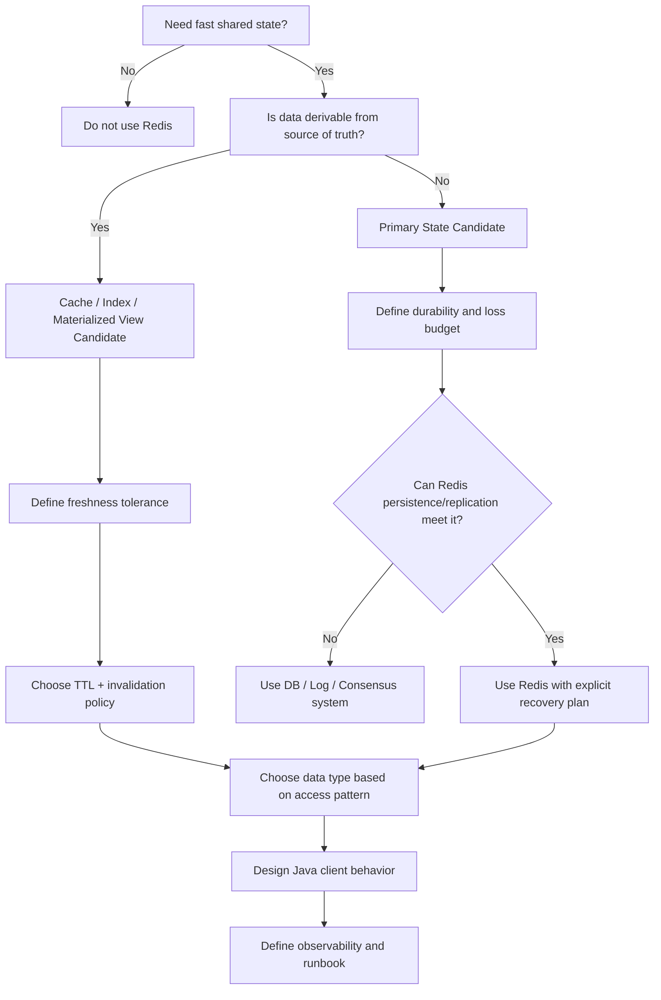
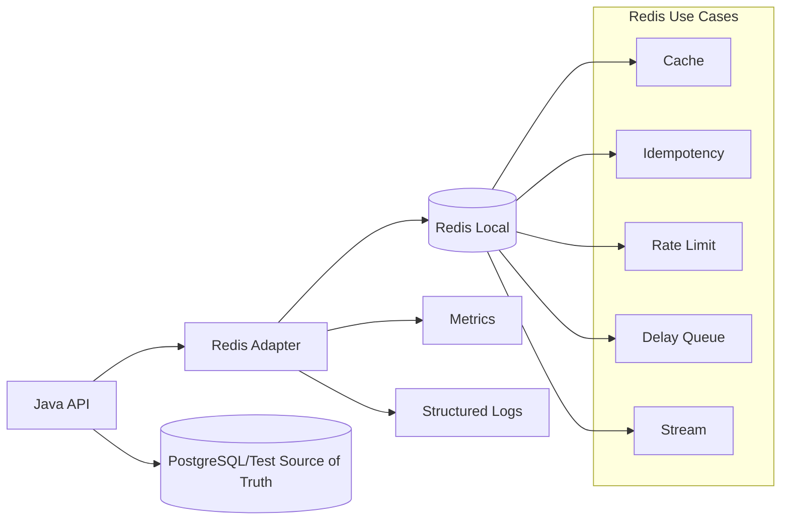

------
title: Learn Java Redis In Action - Part 001
description: Kaufman-style skill map for learning Redis as a production Java engineering skill, including scope, target outcomes, practice loop, capability matrix, and failure-aware evaluation.
series: learn-java-redis
seriesTitle: Learn Java Redis In Action
order: 1
partTitle: Kaufman Skill Map
tags:
- java
- redis
- backend
- distributed-systems
- cache
- performance
- production-engineering
- series
date: 2026-07-02
---

# Part 001 — Kaufman Skill Map: Redis as a Production Engineering Skill

Redis yang dipakai di sistem produksi bukan sekadar `SET key value` dan `GET key`.
Bagi Java engineer, Redis adalah kombinasi dari:

1. **remote in-memory data structure server**,
2. **latency-sensitive dependency**,
3. **coordination and acceleration layer**,
4. **operational system with persistence, replication, clustering, security, and failure modes**,
5. **application design primitive** untuk cache, idempotency, rate limiting, session, queue ringan, stream processing ringan, realtime presence, secondary index, search, probabilistic checks, dan AI-adjacent retrieval.

Tujuan part ini bukan menghafal command Redis. Tujuannya adalah membangun peta belajar yang membuat setiap command, pattern, dan deployment decision punya tempat yang jelas dalam mental model.

> Working thesis: **Redis skill yang bernilai tinggi adalah kemampuan memilih struktur data, consistency envelope, TTL policy, client behavior, dan operational topology yang tepat untuk problem yang tepat.**

---

## 1. Learning Outcome

Setelah menyelesaikan seri ini, target kemampuan bukan “bisa pakai Redis”, tetapi:

- mampu mendesain keyspace Redis untuk domain production;
- mampu memilih data type berdasarkan access pattern, bukan kebiasaan;
- mampu membedakan Redis sebagai cache, database, queue, stream, lock, index, counter, dan realtime bus;
- mampu mengintegrasikan Redis dengan Java secara aman: timeout, retry, pooling, serialization, pipelining, observability;
- mampu memodelkan failure mode Redis: stale data, lost write, lock expiry, hot key, large key, replication lag, failover gap, cluster resharding, memory pressure;
- mampu membuat runbook Redis untuk incident nyata;
- mampu menjelaskan trade-off Redis kepada backend engineer, SRE, security, product, dan auditor.

Kita akan memakai framework Josh Kaufman dari *The First 20 Hours* sebagai learning engine:

1. **Define target performance level.**
2. **Deconstruct skill into sub-skills.**
3. **Research just enough to self-correct.**
4. **Remove practice barriers.**
5. **Practice deliberately for at least 20 focused hours.**

Dalam konteks Redis, “20 jam” bukan berarti menjadi Redis expert penuh. Artinya: dalam 20 jam pertama, kita membangun kemampuan minimal yang cukup untuk membuat desain Redis yang tidak naif, tidak membahayakan production, dan bisa dikembangkan lebih jauh.

---

## 2. Redis Skill Boundary

Sebelum belajar, kita harus membatasi skill agar tidak melebar ke semua hal.

### 2.1 Yang Termasuk Dalam Seri Ini

Seri ini mencakup:

- Redis core data types: String, Hash, List, Set, Sorted Set, Stream;
- Redis modern data types and engines: JSON, Search, Time Series, probabilistic structures, vector-oriented usage;
- Redis Java client usage: Lettuce, Jedis, Spring Data Redis, Redisson comparison;
- Redis patterns: cache-aside, invalidation, idempotency, rate limit, delayed job, lock, presence, leaderboard, secondary index;
- Redis operations: persistence, replication, Sentinel, Cluster, security, backup, restore, observability, deployment;
- Redis-specific failure modelling.

### 2.2 Yang Tidak Akan Diulang

Kita tidak akan mengulang:

- Java syntax, OOP, generics, collections, concurrency basic;
- Spring Boot controller/service/repository boilerplate;
- PostgreSQL indexing, transaction, normalization, query planning;
- Kafka/RabbitMQ sebagai broker utama;
- Kubernetes umum, Docker umum, atau cloud networking umum.

Pembelajaran dibuat efisien. Redis akan dibahas sebagai Redis, bukan sebagai alasan untuk mengulang semua backend engineering basics.

---

## 3. Redis as Skill Bundle

Kaufman menekankan bahwa skill besar harus dipecah menjadi sub-skill. Redis juga begitu. Kesalahan umum engineer adalah menganggap Redis sebagai satu skill tunggal: “bisa Redis”. Itu terlalu kasar.

Redis production skill terdiri dari beberapa lapisan:

```mermaid
flowchart TD
    A[Redis Production Skill] --> B[Data Structure Thinking]
    A --> C[Access Pattern Design]
    A --> D[Java Client Engineering]
    A --> E[Consistency and Failure Model]
    A --> F[Performance and Memory Engineering]
    A --> G[Operations and Deployment]
    A --> H[Security and Governance]

    B --> B1[String, Hash, List, Set, Sorted Set, Stream]
    B --> B2[JSON, Search, Time Series, Probabilistic, Vector]

    C --> C1[Key Design]
    C --> C2[TTL Policy]
    C --> C3[Read/Write Path]
    C --> C4[Hot Key and Large Key Avoidance]

    D --> D1[Lettuce]
    D --> D2[Jedis]
    D --> D3[Spring Data Redis]
    D --> D4[Serialization]
    D --> D5[Timeout, Retry, Pooling]

    E --> E1[Stale Read]
    E --> E2[Lost Write]
    E --> E3[Idempotency]
    E --> E4[Lock Expiry]
    E --> E5[Failover Gap]

    F --> F1[Pipelining]
    F --> F2[Batching]
    F --> F3[Eviction]
    F --> F4[Fragmentation]
    F --> F5[Command Complexity]

    G --> G1[RDB/AOF]
    G --> G2[Replication]
    G --> G3[Sentinel]
    G --> G4[Cluster]
    G --> G5[Backup/Restore]

    H --> H1[ACL]
    H --> H2[TLS]
    H --> H3[Secret Rotation]
    H --> H4[Tenant Boundary]
```



Jika kita hanya belajar command, kita hanya menyentuh cabang paling kiri. Production skill butuh seluruh tree.

---

## 4. Target Performance Level

Target seri ini dibagi menjadi empat level. Kita tidak mengejar semuanya sekaligus.

| Level | Nama | Kemampuan | Risiko Jika Berhenti di Level Ini |
|---|---|---|---|
| 1 | Command User | Bisa `GET`, `SET`, `HSET`, `EXPIRE`, `ZADD` | Mudah membuat key kacau, TTL kacau, dan cache invalidation salah |
| 2 | Pattern User | Bisa cache-aside, rate limit, lock, queue sederhana | Bisa pakai pattern tanpa memahami failure mode |
| 3 | Production Designer | Bisa memilih data type, topology, client behavior, consistency envelope | Masih perlu dukungan SRE untuk operasi kompleks |
| 4 | Redis Systems Engineer | Bisa debug latency, failover, memory, replication, cluster, incident | Butuh jam terbang real production |

Seri ini menargetkan **Level 3 kuat** dan fondasi menuju **Level 4**.

---

## 5. Core Mental Shift

Redis sering disalahgunakan karena engineer membawa mental model database relasional atau message broker ke Redis.

### 5.1 Redis Bukan Relational Database

Redis tidak memberi:

- join relational;
- query planner seperti SQL;
- foreign key;
- multi-row transaction semantics seperti RDBMS;
- durable write guarantee yang sama dengan database disk-first;
- schema enforcement bawaan.

Redis memberi:

- struktur data server-side;
- operasi atomik per command;
- latency rendah;
- data access by key;
- TTL native;
- high-throughput simple operations;
- programmable atomic workflow via Lua/Functions;
- berbagai mode persistence dan replication dengan trade-off eksplisit.

### 5.2 Redis Bukan Selalu Cache

Redis bisa menjadi cache, tetapi Redis juga bisa menjadi:

- session store;
- rate limiter;
- idempotency store;
- distributed lease coordinator;
- lightweight queue;
- stream log;
- ranking system;
- presence tracker;
- search-backed document index;
- approximate analytics layer;
- realtime feature substrate.

Kesalahan production biasanya terjadi ketika semua use case diperlakukan seperti cache biasa.

### 5.3 Redis Bukan Kafka/RabbitMQ

Redis Streams dan Pub/Sub berguna, tetapi tidak identik dengan Kafka atau RabbitMQ.

- Pub/Sub bersifat ephemeral dan cocok untuk notification/signal yang boleh hilang.
- Streams menyediakan append-only log dan consumer group, tetapi durability, retention, replay, partitioning, ecosystem, dan operational semantics berbeda dari Kafka.
- List-based queue sederhana bisa berguna, tetapi perlu visibility timeout, retry, dan dead-letter design jika dipakai untuk job processing.

Redis bisa mengisi celah dengan sangat baik, tetapi harus dipasang di tempat yang tepat.

---

## 6. Redis Production Decision Model

Setiap kali ingin memakai Redis, gunakan pertanyaan berikut:



Redis adoption harus selalu dimulai dari **data ownership**:

- Apakah Redis hanya menyimpan salinan?
- Apakah Redis menjadi source of truth?
- Jika Redis kosong, apakah sistem bisa rebuild?
- Jika Redis kehilangan 5 detik write terakhir, apakah bisnis masih aman?
- Jika Redis return stale data, apa dampaknya?
- Jika Redis down, apakah sistem degrade atau stop?

Tanpa jawaban ini, pattern Redis akan tampak benar tetapi rapuh.

---

## 7. Redis Use Case Taxonomy

Berikut taxonomy awal yang akan dipakai sepanjang seri.

### 7.1 Acceleration Use Cases

Digunakan untuk mempercepat akses ke data yang sumber kebenarannya ada di tempat lain.

Contoh:

- cache profile user;
- cache product price;
- cache entitlement;
- cache permission;
- cache computed recommendation;
- materialized read model.

Pertanyaan kunci:

- Berapa toleransi stale data?
- Siapa yang invalidasi?
- TTL saja cukup atau perlu event invalidation?
- Bagaimana menghindari stampede?

### 7.2 Coordination Use Cases

Digunakan untuk mengkoordinasikan proses terdistribusi.

Contoh:

- distributed lock;
- idempotency key;
- deduplication window;
- rate limit;
- quota enforcement;
- leader election ringan;
- workflow guard.

Pertanyaan kunci:

- Apakah coordination ini untuk efficiency atau correctness?
- Apa yang terjadi jika lease expired saat worker masih bekerja?
- Apakah perlu fencing token?
- Apakah Redis cukup, atau perlu database transaction/consensus?

### 7.3 State Use Cases

Redis menyimpan state yang dipakai langsung oleh aplikasi.

Contoh:

- session;
- shopping cart;
- OTP/token;
- temporary verification state;
- realtime presence;
- queue state;
- leaderboard.

Pertanyaan kunci:

- Apakah state boleh hilang?
- Apakah state perlu restore?
- Berapa TTL dan lifecycle-nya?
- Apakah memory budget cukup?

### 7.4 Event and Stream Use Cases

Redis dipakai untuk message/event flow.

Contoh:

- notification stream;
- lightweight event processing;
- audit-ish transient stream;
- consumer group task fanout;
- retry pipeline.

Pertanyaan kunci:

- Apakah event boleh hilang?
- Perlu replay berapa lama?
- Bagaimana trimming?
- Bagaimana pending entries ditangani?
- Bagaimana poison message diisolasi?

### 7.5 Index and Search Use Cases

Redis dipakai sebagai lookup/index layer.

Contoh:

- secondary index via Sorted Set;
- full-text search;
- JSON document query;
- geospatial lookup;
- vector similarity retrieval.

Pertanyaan kunci:

- Index dibangun dari source of truth mana?
- Apakah index eventually consistent?
- Bagaimana rebuild?
- Bagaimana schema/index migration?

---

## 8. Redis Engineering Invariants

Dalam sistem produksi, kita butuh invariants. Invariant adalah aturan yang harus tetap benar walaupun terjadi retry, timeout, failover, dan load spike.

### 8.1 Keyspace Invariants

Contoh invariant:

- Semua key multi-tenant harus mengandung `tenantId`.
- Semua temporary key harus punya TTL.
- Semua idempotency key harus punya TTL sesuai replay window.
- Semua lock key harus punya random owner token.
- Semua stream harus punya trimming policy.
- Semua cache value harus punya schema version.

### 8.2 Client Invariants

Contoh invariant:

- Semua Redis call harus punya timeout eksplisit.
- Redis timeout tidak boleh lebih besar dari request SLA service.
- Retry hanya boleh dilakukan untuk operasi yang aman atau idempotent.
- Pipeline tidak boleh membuat payload tak terbatas.
- Serialization harus backward compatible.
- Client harus topology-aware jika memakai Sentinel atau Cluster.

### 8.3 Operational Invariants

Contoh invariant:

- Memory usage harus punya headroom.
- Eviction policy harus sesuai use case.
- Persistence mode harus sesuai data loss budget.
- Backup restore harus diuji, bukan hanya dikonfigurasi.
- Replication lag harus dimonitor.
- Slowlog dan latency spike harus masuk alert strategy.

---

## 9. First 20 Hours Plan

Kita desain latihan 20 jam pertama agar tidak jatuh ke tutorial hell.

### Hour 0–2: Setup and Redis Shape

Output:

- Redis local berjalan via Docker Compose;
- Redis CLI bisa dipakai;
- Java project minimal bisa connect via Lettuce atau Jedis;
- memahami basic command dan data type shape.

Latihan:

- `SET`, `GET`, `EXPIRE`, `TTL`, `DEL`;
- `HSET`, `HGETALL`;
- `LPUSH`, `BRPOP`;
- `SADD`, `SISMEMBER`;
- `ZADD`, `ZRANGE`;
- `XADD`, `XREADGROUP`.

### Hour 3–5: Key Design and TTL

Output:

- membuat key naming convention;
- membuat TTL policy untuk 3 use case;
- memahami masalah stale data dan orphan key.

Latihan:

- session key;
- OTP key;
- cache profile key;
- tenant-aware key;
- schema-versioned key.

### Hour 6–8: Java Client and Serialization

Output:

- Redis connection lifecycle;
- timeout eksplisit;
- JSON serialization dengan version envelope;
- error handling Redis down.

Latihan:

- `RedisClient` wrapper;
- `CacheRepository<T>`;
- fallback behavior;
- metric per command group.

### Hour 9–12: Core Patterns

Output:

- cache-aside;
- negative cache;
- idempotency key;
- fixed/sliding rate limit;
- sorted-set delay queue.

Latihan:

- implementasi dengan Java;
- unit test dengan Testcontainers;
- concurrency test sederhana.

### Hour 13–15: Atomicity and Lua

Output:

- memahami race condition;
- memakai Lua untuk operasi multi-step atomik;
- membedakan transaction, pipeline, dan script.

Latihan:

- atomic release lock;
- rate limit Lua;
- idempotency claim/complete state machine.

### Hour 16–18: Observability and Failure

Output:

- membaca `INFO`, `SLOWLOG`, latency symptom;
- simulasi Redis restart;
- simulasi timeout;
- simulasi memory pressure kecil.

Latihan:

- dashboard metric minimal;
- log structured untuk Redis errors;
- chaos test local.

### Hour 19–20: Design Review

Output:

- memilih satu use case domain nyata;
- membuat Redis design doc;
- menulis failure model;
- menulis runbook pendek.

Template design review:

```md
# Redis Design Review

## Use Case

## Source of Truth

## Redis Role

## Data Types

## Key Design

## TTL and Lifecycle

## Consistency Model

## Java Client Behavior

## Failure Modes

## Observability

## Recovery and Rebuild

## Rollout Plan
```

---

## 10. Practice Project

Selama seri ini, kita akan memakai satu practice project konseptual:

**Java Redis Control Plane for Commerce/Regulatory-Style Workflows**

Fitur yang akan kita bangun secara bertahap:

- session store;
- user permission cache;
- product/policy lookup cache;
- idempotent command submission;
- rate limiter per tenant;
- delayed retry queue;
- Redis Streams event handoff;
- real-time notification presence;
- leaderboard/ranking simulation;
- search/index materialization;
- operational dashboard and runbook.

Kenapa domain ini cocok?

Karena Redis paling menarik ketika sistem punya:

- banyak read path latency-sensitive;
- workflow state sementara;
- retry dan idempotency;
- event-driven integration;
- multi-tenant concern;
- compliance-ish audit expectation;
- operational failure yang tidak boleh dianggap sepele.

---

## 11. Redis Design Smells

Saat review desain Redis, cari smell berikut.

### 11.1 “Everything Is a String” Smell

Jika semua data disimpan sebagai JSON string tunggal, mungkin engineer belum memanfaatkan Redis sebagai data structure server.

Kadang JSON string benar. Tetapi jika butuh update field kecil, counter field, sorted access, membership check, atau atomic operation, data type lain bisa lebih tepat.

### 11.2 “No TTL” Smell

Temporary data tanpa TTL adalah memory leak yang menunggu terjadi.

Contoh berbahaya:

- OTP tanpa TTL;
- idempotency key tanpa TTL;
- lock tanpa TTL;
- retry marker tanpa TTL;
- cache key tanpa TTL dan tanpa invalidation.

### 11.3 “Redis Is Always Fast” Smell

Redis cepat, tetapi tidak kebal latency.

Penyebab umum latency:

- network round-trip berlebihan;
- command dengan kompleksitas besar;
- large key;
- hot key;
- slow script;
- fork saat persistence;
- memory pressure;
- client pool exhaustion;
- TLS overhead yang tidak diukur;
- cross-region access.

### 11.4 “Lock Means Correctness” Smell

Redis lock bisa berguna, tetapi lock dengan expiry tidak otomatis memberi correctness. Jika proses memegang lock lalu pause lama, lock bisa expired, proses lain masuk, dan proses pertama masih melakukan write. Untuk critical correctness, sering dibutuhkan fencing token atau database-level invariant.

### 11.5 “Cache Invalidation Is Just DEL” Smell

`DEL key` terlihat sederhana, tetapi invalidation production memiliki banyak edge case:

- delete sebelum commit database;
- delete setelah commit tetapi event hilang;
- concurrent read rebuild stale value;
- multiple key derived dari satu entity;
- consumer lag;
- partial invalidation;
- deployment dengan schema value baru.

---

## 12. Redis Capability Matrix

| Capability | Redis Fit | Caveat |
|---|---:|---|
| Low-latency key-value lookup | Excellent | Watch hot keys, serialization, network RTT |
| Cache-aside | Excellent | Hard part is invalidation and stampede control |
| Session/token store | Excellent | Define TTL and persistence requirement |
| Rate limiting | Excellent | Need atomicity and fairness model |
| Idempotency | Excellent | TTL must match replay/business window |
| Distributed lock | Conditional | Good for efficiency; correctness needs fencing/stronger coordination |
| Durable event broker | Conditional | Streams help, but not Kafka replacement by default |
| Primary database | Conditional | Must accept Redis durability/replication trade-offs |
| Full-text/vector search | Good for certain workloads | Need index lifecycle and rebuild plan |
| Analytics warehouse | Poor | Use analytical store instead |
| Relational query engine | Poor | Use RDBMS/search engine/document DB as appropriate |

---

## 13. Evaluation Rubric

Gunakan rubric ini untuk menilai desain Redis.

| Area | Basic | Good | Strong |
|---|---|---|---|
| Data type choice | Mengikuti tutorial | Berdasarkan access pattern | Berdasarkan access pattern + failure + memory |
| Key design | Ad hoc | Ada namespace | Ada tenant, version, lifecycle, cluster awareness |
| TTL | Random | Sesuai use case | Ada jitter, lifecycle, cleanup, observability |
| Java client | Default config | Timeout dan serialization jelas | Backpressure, retry discipline, metrics, topology-aware |
| Consistency | Tidak dibahas | Stale tolerance disebut | Race/failure path dimodelkan |
| Performance | Asumsi Redis cepat | Pipelining/batching dipakai | Command complexity, hot key, payload, memory dihitung |
| Operations | Tidak ada | Basic monitoring | Runbook, backup restore, failover drill |
| Security | Password saja | TLS/ACL | Least privilege, rotation, tenant boundary |

---

## 14. What To Build First

Untuk 20 jam pertama, build minimal lab berikut:



Minimal repository structure:

```txt
java-redis-in-action/
  docker-compose.yml
  src/main/java/com/example/redis/
    RedisConfig.java
    RedisKey.java
    RedisValueCodec.java
    CacheRepository.java
    IdempotencyRepository.java
    RateLimiter.java
    DelayQueueRepository.java
    StreamConsumer.java
  src/test/java/com/example/redis/
    CacheRepositoryTest.java
    IdempotencyConcurrencyTest.java
    RateLimiterTest.java
    RedisFailureTest.java
```

Kita tidak akan menghabiskan waktu dengan UI. Fokusnya backend, correctness, dan operability.

---

## 15. Part 001 Checklist

Sebelum lanjut ke Part 002, pastikan kamu bisa menjawab:

- Apa perbedaan Redis sebagai cache dan Redis sebagai source of truth?
- Apa risiko memakai Redis untuk lock correctness?
- Kenapa key naming adalah design decision, bukan detail kecil?
- Kenapa TTL termasuk bagian dari domain lifecycle?
- Apa bedanya acceleration, coordination, state, event, dan index use case?
- Apa minimal observability Redis yang harus ada di service Java?
- Apa yang harus ditulis dalam Redis design review?

Jika belum bisa menjawab, jangan lanjut ke command dulu. Command Redis mudah. Menempatkan command pada desain yang benar jauh lebih sulit.

---

## 16. References

- Redis Docs — Data types.
- Redis Docs — Pipelining.
- Redis Docs — Diagnosing latency issues.
- Redis Docs — Persistence.
- Redis Docs — Replication.
- Redis Docs — Redis Cluster.
- Redis Docs — Lettuce guide for Java.
- Redis Docs — Jedis guide for Java.
- Josh Kaufman — *The First 20 Hours* rapid skill acquisition framework.
