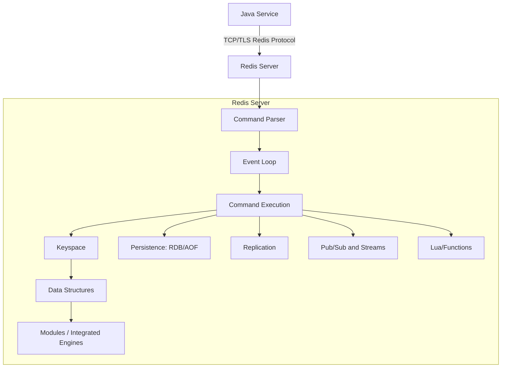
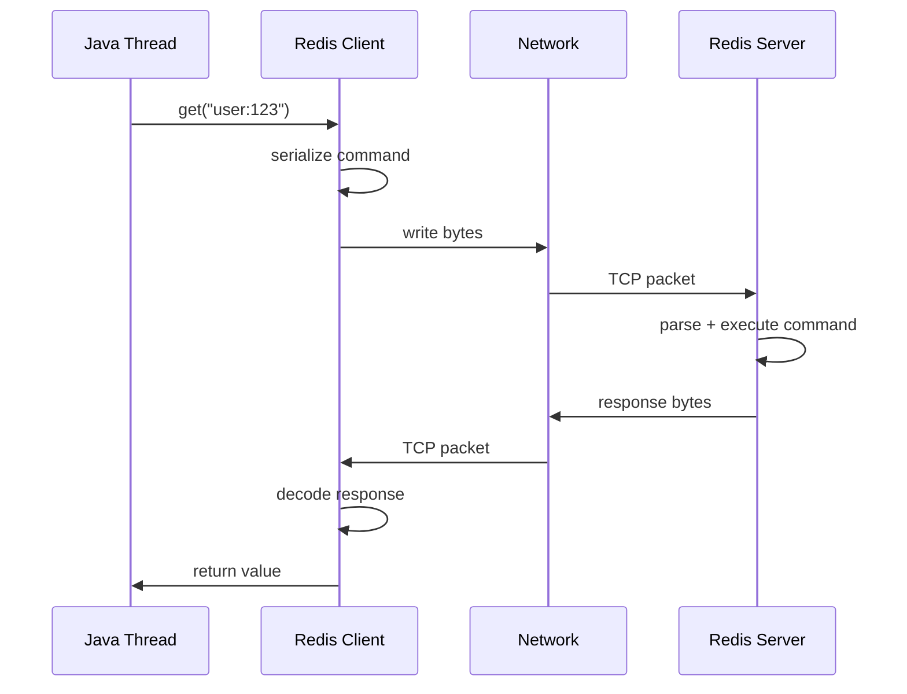
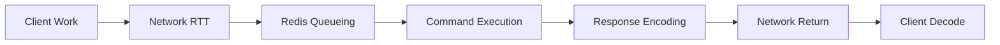
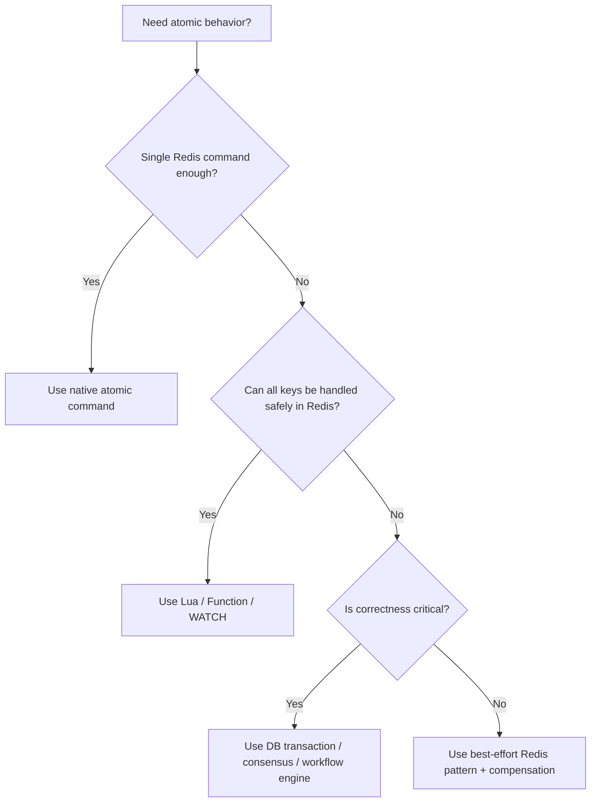
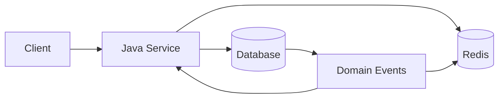
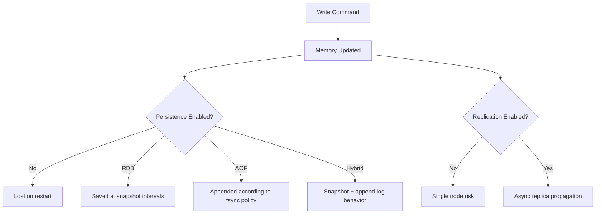
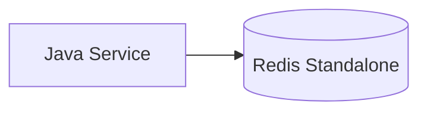
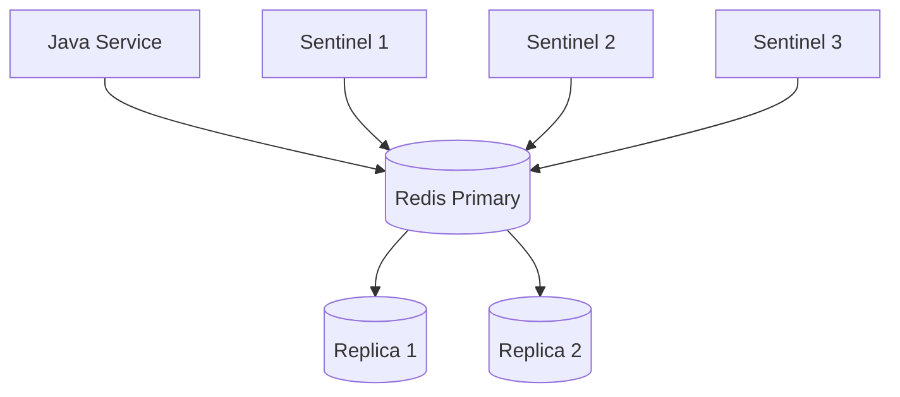
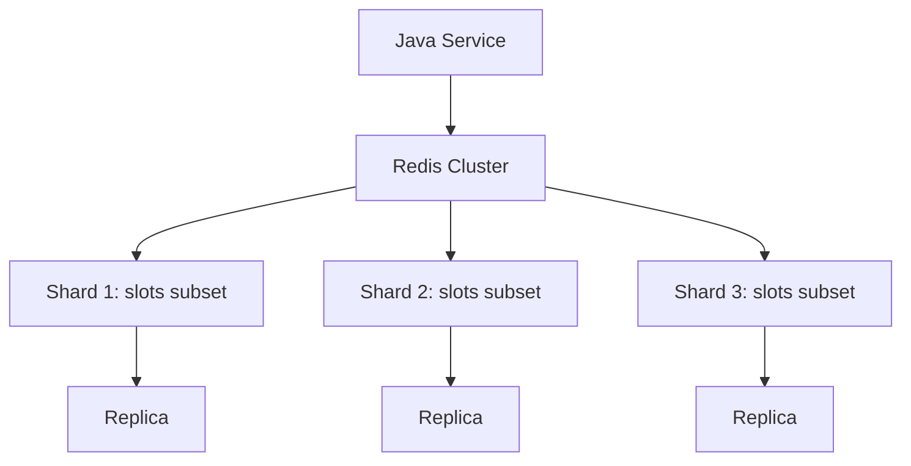
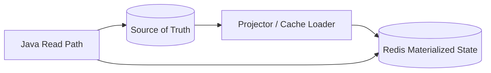

------
title: Learn Java Redis In Action - Part 002
description: A production-grade mental model of Redis as an in-memory data structure server, covering execution model, keyspace, data types, latency, atomicity, durability, and where Redis fits or does not fit.
series: learn-java-redis
seriesTitle: Learn Java Redis In Action
order: 2
partTitle: Redis Mental Model
tags:
- java
- redis
- backend
- distributed-systems
- data-structures
- cache
- latency
- production-engineering
- series
date: 2026-07-02
---

# Part 002 — Redis Mental Model: Data Structure Server, Not Just Cache

Redis sering dijelaskan sebagai “in-memory cache”. Penjelasan itu benar, tetapi terlalu kecil. Untuk engineer produksi, Redis lebih tepat dipahami sebagai:

> **remote, in-memory, single-key-oriented data structure server with atomic commands, optional persistence, replication, clustering, programmable server-side workflows, and explicit consistency trade-offs.**

Kalimat itu padat. Part ini akan membedahnya satu per satu.

---

## 1. Redis in One System Diagram



Yang perlu diperhatikan:

- Java service tidak memanggil object lokal. Ia melakukan network call.
- Redis command cepat, tetapi tetap membayar biaya network, serialization, scheduling, dan queueing.
- Redis data structure hidup di server, bukan di heap JVM.
- Atomicity Redis terutama kuat pada command tunggal dan script server-side.
- Durability dan availability bergantung pada konfigurasi, bukan otomatis setara database tradisional.

---

## 2. Redis Is Remote Memory, Not Local Memory

Redis terasa seperti map:

```java
value = redis.get("user:123");
```

Tetapi secara sistem, ini bukan `HashMap.get()`.



Implikasi:

1. **Round-trip time matters.** Banyak command kecil bisa lebih mahal daripada satu batch/pipeline.
2. **Timeout wajib eksplisit.** Redis call adalah dependency eksternal.
3. **Serialization adalah bagian performa.** JSON besar atau object binary besar bisa mengalahkan kecepatan Redis.
4. **Connection behavior penting.** Pooling, multiplexing, reconnect, dan backpressure adalah desain, bukan detail library.
5. **Cross-region Redis access hampir selalu smell.** Redis sebaiknya dekat dengan service yang memakai Redis.

---

## 3. Redis Keyspace Mental Model

Redis menyimpan mapping dari key ke value. Value punya tipe. Key sendiri adalah byte string.

Secara mental:

```txt
keyspace = Map<Key, RedisObject>

RedisObject =
  String |
  Hash |
  List |
  Set |
  SortedSet |
  Stream |
  JSON |
  TimeSeries |
  ProbabilisticStructure |
  VectorSet |
  ...
```

Redis tidak punya schema formal seperti database relasional. Karena itu, schema Redis harus dibawa oleh aplikasi melalui:

- naming convention;
- value envelope;
- versioning;
- TTL;
- access rules;
- migration scripts;
- observability.

Contoh key yang buruk:

```txt
123
user
session
cart
lock
```

Contoh key yang lebih baik:

```txt
tenant:t-001:user:u-123:profile:v2
tenant:t-001:session:s-9x2a
tenant:t-001:rate-limit:api:create-order:user:u-123:2026-07-02T10:15
tenant:t-001:idempotency:payment:cmd-789
tenant:t-001:lock:order:o-456:pricing
```

Key Redis bukan hanya identifier. Key adalah bagian dari:

- domain model;
- tenant isolation;
- observability;
- debugging;
- deletion strategy;
- cluster slot strategy;
- security boundary;
- lifecycle policy.

---

## 4. Data Type Selection: Access Pattern First

Redis data type harus dipilih berdasarkan operasi yang paling penting.

| Need | Usually Consider | Why |
|---|---|---|
| single opaque value | String | simple get/set, JSON/blob, counter |
| object with field updates | Hash | partial update, grouped counters |
| FIFO/LIFO queue | List | push/pop semantics |
| unique membership | Set | `SISMEMBER`, dedup, tags |
| ranking/range by score | Sorted Set | leaderboard, sliding window, schedule |
| append log + consumer group | Stream | durable-ish event consumption |
| hierarchical document | JSON | structured document update/query |
| full-text/filter query | Search | secondary index/query engine |
| time bucket metrics | Time Series | temporal measurement and rollup |
| approximate membership/count | Bloom/CMS/Top-K/etc | memory-efficient approximation |
| semantic similarity | Vector/Search/Vector Set | vector retrieval |

### 4.1 Selection Example: Rate Limiter

Problem: “Limit user to 100 requests per minute.”

Possible designs:

| Design | Data Type | Trade-off |
|---|---|---|
| Fixed window counter | String counter | simple, fast, boundary burst possible |
| Sliding window log | Sorted Set | more accurate, more memory/cleanup |
| Token bucket | String/Hash + Lua | smooth, requires atomic script |
| Distributed quota | Hash/String + Lua | more complex, depends on fairness model |

Tidak ada satu jawaban benar. Jawaban yang benar bergantung pada fairness, cost, memory, and correctness requirement.

### 4.2 Selection Example: Shopping Cart

Possible designs:

| Design | Data Type | Trade-off |
|---|---|---|
| Entire cart as JSON String | String | simple, but full rewrite each update |
| Cart as Hash itemId -> quantity | Hash | efficient partial update, flat only |
| Cart as JSON document | JSON | hierarchical, query/update path, more engine-specific |
| Cart in database + Redis cache | String/Hash cache | safer source of truth, invalidation needed |

Jika cart harus recoverable dan financial-impacting, Redis-only design harus dievaluasi sangat hati-hati. Jika cart temporary dan boleh rebuild dari event/database, Redis cocok.

---

## 5. Redis Command Execution Model

Redis dikenal memiliki command execution yang sederhana dan cepat. Namun, mental model yang aman bukan “semua command gratis”.

Gunakan tiga lapisan:



Latency bisa muncul di semua titik.

### 5.1 Command Complexity Matters

Command seperti `GET` pada key kecil biasanya murah. Command yang memindai banyak element, menghapus large key, membaca range besar, atau menjalankan script berat bisa mahal.

Mental model:

```txt
observed_latency = client_overhead
                 + network_round_trip
                 + queue_wait_on_server
                 + command_execution_time
                 + response_size_transfer
                 + decode_time
```

Redis cepat jika:

- command kecil;
- payload kecil;
- key tidak terlalu besar;
- network dekat;
- client tidak bottleneck;
- persistence/fork/memory pressure terkendali;
- tidak ada slow script;
- tidak ada hot key parah.

### 5.2 Single Thread Mental Model, With Nuance

Banyak operasi Redis dieksekusi dalam model event-loop yang membuat command atomic secara natural pada server. Namun jangan menyederhanakan menjadi “Redis hanya single-threaded” untuk semua hal modern. Redis modern memiliki mekanisme I/O threading dan background work untuk beberapa pekerjaan. Yang penting untuk aplikasi:

- command execution pada data structure memberi atomicity yang kuat untuk command tunggal;
- command lama/berat tetap bisa mengganggu latency command lain;
- operasi background seperti persistence, replication, expiry, dan memory management tetap punya dampak operasional;
- client tetap harus mengontrol command size dan command frequency.

---

## 6. Atomicity Mental Model

Redis command tunggal atomic terhadap command lain. Contoh:

```txt
INCR tenant:t-001:counter:login
```

Tidak ada dua client yang akan membuat increment hilang karena race pada command tunggal.

Tetapi race muncul ketika workflow terdiri dari banyak command.

Contoh tidak aman:

```txt
GET balance:user:u-1
// application checks value
SET balance:user:u-1 newValue
```

Dua client bisa membaca nilai sama lalu menulis hasil yang saling menimpa.

Solusi tergantung kasus:

- pakai command atomik bawaan seperti `INCR`, `HINCRBY`, `ZADD`;
- pakai `WATCH` + `MULTI/EXEC` untuk optimistic transaction;
- pakai Lua/Redis Functions untuk multi-step atomic workflow;
- pindahkan invariant ke database jika butuh transactional correctness lebih kuat.

### 6.1 Atomicity Ladder



---

## 7. TTL Is Domain Semantics

TTL sering dianggap detail cache. Itu salah. TTL adalah bagian dari lifecycle domain.

Contoh:

| Use Case | TTL Meaning |
|---|---|
| session | maximum inactivity/validity window |
| OTP | security validity window |
| idempotency key | duplicate replay protection window |
| rate limit key | enforcement window |
| lock key | lease duration |
| cache key | freshness budget |
| presence key | heartbeat freshness |
| retry marker | retry scheduling/lifecycle |

TTL yang salah bisa menyebabkan:

- user logout terlalu cepat;
- OTP masih valid terlalu lama;
- duplicate payment diproses ulang;
- rate limit tidak adil;
- lock expired sebelum pekerjaan selesai;
- stale cache menyebabkan keputusan bisnis salah;
- memory bengkak karena key tidak pernah hilang.

### 7.1 TTL Design Questions

Untuk setiap key, tanyakan:

- Apakah key ini wajib punya TTL?
- TTL berasal dari aturan bisnis, keamanan, atau performa?
- Apakah TTL perlu diperpanjang saat read/write?
- Apakah TTL perlu jitter untuk menghindari avalanche?
- Apa yang terjadi jika key expired terlalu cepat?
- Apa yang terjadi jika key expired terlalu lambat?
- Apakah key perlu cleanup tambahan selain expiry?

---

## 8. Redis Consistency Model

Redis sering ditempatkan di antara aplikasi dan source of truth.



Pertanyaan consistency utama:

1. Jika database berubah, kapan Redis berubah?
2. Jika Redis berubah, apakah database juga harus berubah?
3. Jika Redis dan database berbeda, siapa yang menang?
4. Berapa lama mismatch boleh terjadi?
5. Apakah mismatch berbahaya atau hanya sedikit stale?

### 8.1 Common Consistency Envelopes

| Envelope | Meaning | Example |
|---|---|---|
| Strong source-of-truth elsewhere | Redis derivable | product cache |
| Eventually consistent cache | Redis may be stale temporarily | profile cache |
| TTL-bounded correctness | Redis correctness valid within window | idempotency key |
| Best-effort coordination | Redis improves efficiency | duplicate job suppression |
| Critical coordination | Redis must prevent bad outcome | financial lock; usually needs stronger design |

Redis design harus menyebut envelope secara eksplisit. Jangan biarkan pembaca menebak.

---

## 9. Redis Durability Mental Model

Redis adalah memory-first. Persistence bersifat configurable.

Secara umum, Redis menyediakan beberapa mode:

- no persistence;
- RDB snapshot;
- AOF append-only file;
- hybrid approaches.

Mental model:



Implikasi:

- Write dianggap sukses setelah Redis menerima dan memproses command, bukan setelah semua replica durable seperti database quorum write.
- RDB bisa kehilangan perubahan setelah snapshot terakhir.
- AOF durability tergantung fsync policy.
- Replication default asynchronous, sehingga failover bisa kehilangan write yang belum sampai ke replica.
- Redis bisa sangat reliable jika dikonfigurasi dan dioperasikan benar, tetapi reliability bukan magic.

---

## 10. Redis Availability Mental Model

Ada tiga topology besar yang akan kita bahas detail di part operations.

### 10.1 Standalone



Cocok untuk:

- local development;
- non-critical cache;
- small internal tooling;
- ephemeral state yang bisa hilang.

Risiko:

- single point of failure;
- maintenance downtime;
- no automatic failover.

### 10.2 Sentinel



Cocok untuk:

- HA for non-sharded Redis;
- primary-replica failover;
- deployments yang belum butuh cluster sharding.

Risiko:

- failover gap;
- client discovery harus benar;
- asynchronous replication write-loss window;
- split-brain risk jika quorum/network salah.

### 10.3 Cluster



Cocok untuk:

- dataset lebih besar dari satu node;
- throughput horizontal;
- multiple shard availability.

Risiko:

- multi-key command dibatasi oleh hash slot;
- client harus cluster-aware;
- resharding dan MOVED/ASK redirects;
- key design harus memikirkan hash tags;
- failover tetap punya write-loss window karena replication asynchronous.

---

## 11. Redis and Java: Dependency Boundary

Dalam Java service, Redis harus diperlakukan sebagai dependency eksternal dengan kontrak jelas.

Buruk:

```java
redisTemplate.opsForValue().get(key);
```

Dipakai langsung di banyak service class tanpa timeout, metric, key convention, atau fallback.

Lebih baik:

```java
public interface PermissionCache {
    Optional<CachedPermission> get(UserId userId, TenantId tenantId);
    void put(UserId userId, TenantId tenantId, CachedPermission value, Duration ttl);
    void invalidate(UserId userId, TenantId tenantId);
}
```

Lalu implementasi Redis disembunyikan di adapter:

```txt
Domain Service
  -> PermissionCache interface
      -> RedisPermissionCache adapter
          -> RedisKeyFactory
          -> RedisCodec
          -> RedisClient
          -> Metrics
```

Manfaat:

- domain tidak bocor ke key string ad hoc;
- mudah mengganti serializer;
- mudah menambah metrics;
- mudah test failure;
- mudah menegakkan TTL;
- mudah audit Redis usage.

---

## 12. Redis Value Boundary

Value Redis harus dirancang sebagai kontrak. Jangan asal serialize object Java.

Contoh value envelope:

```json
{
  "schemaVersion": 2,
  "cachedAt": "2026-07-02T10:15:30Z",
  "sourceVersion": "permission-policy-2026-07-01",
  "payload": {
    "userId": "u-123",
    "tenantId": "t-001",
    "permissions": ["CASE_READ", "CASE_ASSIGN"]
  }
}
```

Envelope membantu:

- migration;
- debugging;
- stale analysis;
- schema compatibility;
- cache invalidation;
- audit explanation;
- partial rollout.

Anti-pattern:

- native Java serialization;
- class name embedded tanpa versioning strategy;
- payload besar tanpa compression threshold;
- object graph kompleks;
- value tidak bisa dibaca manusia padahal perlu debugging;
- tidak ada `cachedAt` atau source version untuk data yang sensitif terhadap freshness.

---

## 13. Redis Failure Modes

Redis failure bukan hanya “Redis down”. Banyak failure lebih halus.

| Failure | Symptom | Design Response |
|---|---|---|
| Redis down | connection refused/timeouts | fallback, degrade, circuit breaker |
| Redis slow | request latency naik | timeout, bulkhead, pipelining review, slowlog |
| stale cache | keputusan pakai data lama | TTL, invalidation, version check |
| hot key | satu key overload | sharding key, local cache, request coalescing |
| large key | latency spike saat read/delete | split structure, limit cardinality, async unlink |
| memory pressure | eviction/denied writes | maxmemory policy, capacity budget, alerts |
| replication lag | stale replica read | primary read for critical path, lag metric |
| failover | short outage/write loss | retry discipline, idempotency, reconciliation |
| cluster redirect | MOVED/ASK errors | cluster-aware client, topology refresh |
| script too slow | server stalls | script budget, test complexity, kill strategy |
| serializer mismatch | decode failure | version envelope, compatibility tests |

Top 1% Redis engineer tidak hanya tahu pattern; mereka bisa menjelaskan failure path pattern tersebut.

---

## 14. Redis Latency Budget

Misalkan API punya SLA p95 150 ms.

Jangan membiarkan Redis call tumbuh liar:

```txt
HTTP request budget: 150 ms
  auth middleware: 10 ms
  permission Redis cache: 8 ms
  DB query: 60 ms
  idempotency Redis: 8 ms
  response serialization: 15 ms
  network/app overhead: 20 ms
  buffer: 29 ms
```

Jika service melakukan 20 Redis round-trip sequential, Redis yang cepat tetap bisa membuat endpoint lambat.

Rule praktis:

- Hindari Redis N+1.
- Batch/pipeline read independent.
- Gunakan data type yang memungkinkan operasi server-side.
- Jangan ambil ribuan element jika hanya butuh 20.
- Ukur payload, bukan hanya command count.
- Set timeout di bawah request deadline.

---

## 15. Redis as a System of Trade-offs

Redis bukan “lebih baik” atau “lebih buruk” dari database/broker lain. Redis adalah sistem dengan trade-off yang sangat tajam.

### 15.1 Redis Wins When

Redis sangat kuat ketika:

- access by key dominan;
- latency rendah penting;
- data structure operation sederhana tetapi sering;
- data bisa diberi TTL;
- data bisa direbuild atau loss budget jelas;
- workload cocok dengan memory budget;
- atomic command/script cukup untuk invariant;
- operational team memahami persistence/replication/topology.

### 15.2 Redis Becomes Risky When

Redis menjadi berbahaya ketika:

- dijadikan relational database terselubung;
- keyspace tidak punya lifecycle;
- lock dipakai untuk correctness critical tanpa fencing;
- semua data disimpan sebagai giant JSON blob;
- memory budget tidak dihitung;
- Redis dipanggil cross-region;
- retry Redis command tidak idempotent;
- cache invalidation dianggap trivial;
- replication dianggap strong consistency;
- backup restore tidak pernah diuji.

---

## 16. Mental Model by Analogy

### 16.1 Redis as Shared Data Structure Heap

Bayangkan Redis seperti heap bersama yang bisa diakses semua service, tetapi lewat network dan dengan lifecycle eksplisit.

Keuntungan:

- cepat;
- shared;
- atomic primitive;
- TTL native.

Kerugian:

- tidak type-safe secara domain;
- bisa bocor memory;
- bisa menjadi coupling global;
- perlu governance.

### 16.2 Redis as Materialized State Layer

Redis sering menyimpan state turunan dari database/event.



Pertanyaan penting:

- Bagaimana materialized state dibuat?
- Bagaimana diperbarui?
- Bagaimana diverifikasi?
- Bagaimana dihapus?
- Bagaimana direbuild?

### 16.3 Redis as Latency Amplifier or Latency Reducer

Redis bisa mengurangi latency jika mengganti operasi mahal dengan lookup cepat.

Redis bisa menambah latency jika:

- dipanggil terlalu banyak;
- payload besar;
- network jauh;
- client bottleneck;
- command salah;
- fallback salah.

Redis bukan otomatis acceleration. Redis adalah acceleration jika desain aksesnya benar.

---

## 17. Practical Design Exercise

Ambil use case berikut:

> Service menerima command `SubmitCaseAction`. Command harus idempotent selama 24 jam. User tidak boleh submit lebih dari 10 action per menit. Permission user perlu dicek cepat. Setelah action diterima, worker async perlu memproses action dengan retry.

Desain Redis awal:

| Concern | Redis Pattern |
|---|---|
| idempotency 24 jam | String/Hash key dengan TTL 24 jam |
| rate limit 10/minute | String counter fixed window atau Sorted Set sliding window |
| permission lookup | cache-aside dengan TTL pendek + invalidation event |
| async retry | Stream atau Sorted Set delayed queue |
| worker dedup | idempotency marker atau processing lease |

Pertanyaan review:

- Apakah idempotency value hanya marker atau menyimpan response?
- Apakah command yang sama saat sedang processing harus return apa?
- Apakah rate limit fixed window cukup adil?
- Jika permission cache stale, apa dampaknya?
- Jika worker mengambil job lalu mati, siapa mengambil ulang?
- Jika Redis failover saat command diterima, apakah action bisa double processed?
- Apakah source of truth tetap database?

---

## 18. Redis Design Template

Gunakan template berikut sebelum implementasi.

```md
# Redis Usage Design

## 1. Problem
Apa problem yang diselesaikan Redis?

## 2. Redis Role
Cache, state store, coordination, queue, stream, index, atau hybrid?

## 3. Source of Truth
Apakah Redis source of truth atau derived state?

## 4. Data Types
Data type apa yang dipilih dan kenapa?

## 5. Key Design
Format key, namespace, tenant, version, hash tag jika cluster.

## 6. Value Design
Serializer, schema version, payload limit, compression threshold.

## 7. TTL and Lifecycle
TTL, refresh behavior, cleanup, orphan prevention.

## 8. Consistency Model
Freshness, stale tolerance, invalidation, rebuild.

## 9. Atomicity
Command tunggal, transaction, Lua, function, atau DB transaction?

## 10. Java Client Behavior
Client library, timeout, retry, pooling/multiplexing, error mapping.

## 11. Performance
Expected QPS, payload size, command complexity, hot key risk.

## 12. Operations
Persistence, replication, memory policy, backup, restore.

## 13. Observability
Metrics, logs, slowlog, tracing, alerts.

## 14. Failure Modes
Redis down, slow, stale, failover, memory pressure, partial writes.

## 15. Rollout
Feature flag, migration, shadow read, backfill, rollback.
```

---

## 19. Part 002 Checklist

Sebelum lanjut ke Part 003, pastikan kamu bisa menjawab:

- Kenapa Redis call bukan `HashMap.get()`?
- Apa arti keyspace dalam Redis?
- Bagaimana memilih data type berdasarkan access pattern?
- Kapan Redis command tunggal cukup atomic?
- Kapan butuh Lua/Functions?
- Kenapa TTL adalah semantic design, bukan tuning random?
- Apa perbedaan RDB, AOF, replication, dan availability?
- Kenapa Redis Cluster mempengaruhi key design?
- Apa saja failure mode Redis selain “down”?

Jika kamu bisa menjawab ini, Part 003 tentang key design akan jauh lebih mudah.

---

## 20. References

- Redis Docs — What is Redis.
- Redis Docs — Data types.
- Redis Docs — Redis pipelining.
- Redis Docs — Diagnosing latency issues.
- Redis Docs — Redis persistence.
- Redis Docs — Redis replication.
- Redis Docs — Redis Cluster specification.
- Redis Docs — Redis 8.0 release notes and integrated data structures.
- Redis Docs — Lettuce and Jedis Java client guides.
