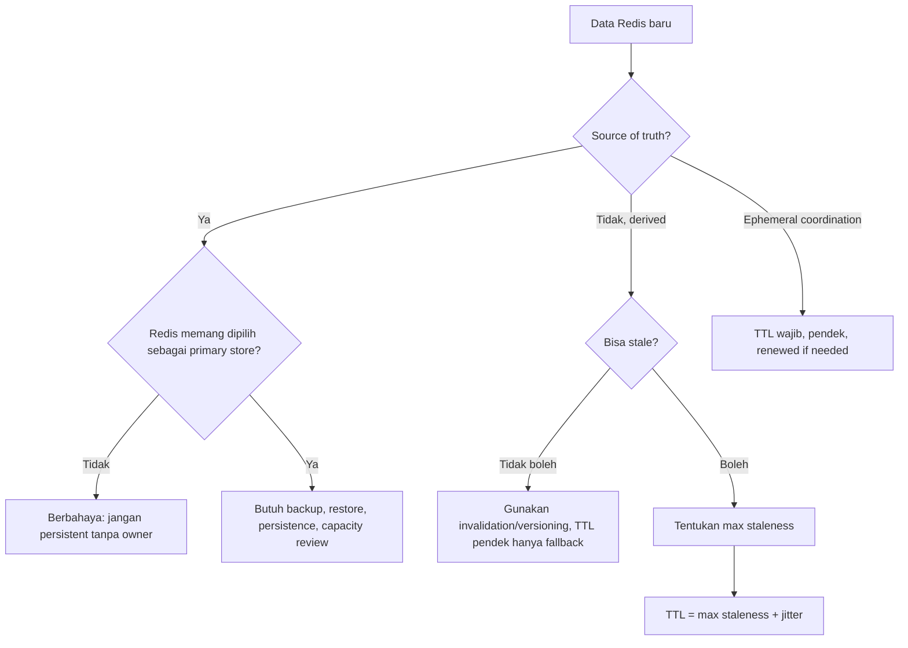
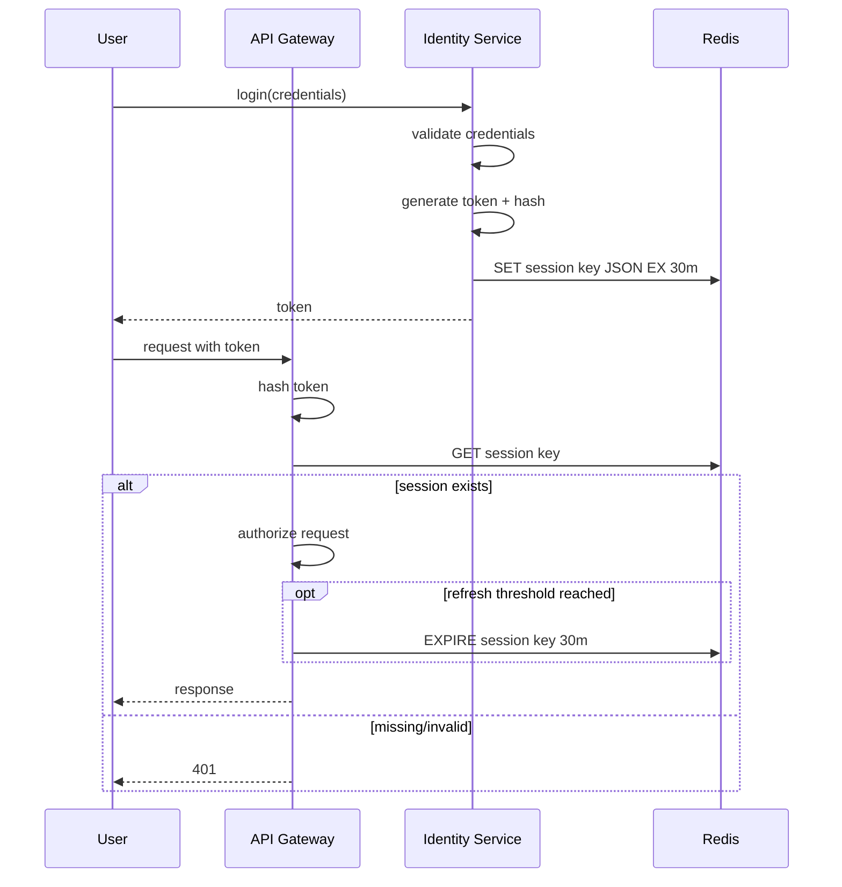

------
title: Learn Java Redis In Action - Part 003
description: Production-grade Redis data modeling fundamentals for Java engineers, covering key design, TTL, namespaces, versioning, cardinality, hot keys, large keys, cluster-aware design, and repository patterns.
series: learn-java-redis
seriesTitle: Learn Java Redis In Action
order: 3
partTitle: Data Modeling Fundamentals
tags:
- java
- redis
- data-modeling
- ttl
- cache
- distributed-systems
- production-engineering
- series
date: 2026-07-02
---

# Part 003 — Redis Data Modeling Fundamentals: Keys, Values, TTL, Namespaces

Redis data modeling bukan versi kecil dari relational modeling.
Redis tidak punya foreign key, query planner, secondary index default, normalized schema, atau transaction isolation seperti database relasional.
Redis memberi kita sesuatu yang berbeda:

> **keyspace yang sangat cepat, data structures yang kaya, atomic command per server, dan lifecycle eksplisit melalui TTL.**

Karena itu, desain Redis yang bagus tidak dimulai dari entity diagram.
Desain Redis yang bagus dimulai dari **access pattern**, **lifecycle**, **consistency need**, **memory budget**, dan **failure mode**.

Part ini membahas fondasi yang akan dipakai oleh semua part berikutnya.
Kalau key design dan TTL policy salah, pattern seperti cache-aside, idempotency, rate limiting, queue, lock, atau presence akan terlihat bekerja di development, tetapi rapuh di production.

---

## 1. Learning Outcome

Setelah menyelesaikan part ini, kita ingin mampu:

- mendesain key Redis sebagai kontrak teknis, bukan string random;
- memilih struktur key berdasarkan access pattern dan ownership service;
- menentukan TTL sebagai lifecycle policy, bukan angka asal;
- membedakan volatile key, persistent key, derived key, ephemeral key, dan index key;
- menghindari hot key, large key, unbounded keyspace, dan namespace collision;
- membuat key builder Java yang type-safe dan reviewable;
- membuat Redis repository yang menyembunyikan detail command tanpa menyembunyikan trade-off;
- melakukan review desain Redis sebelum masuk production.

Kita belum masuk detail tiap data type secara penuh.
Part ini adalah “grammar” desain.
Part berikutnya akan masuk ke String, Counter, Bitmap, dan atomic primitive.

---

## 2. Redis Data Modeling Starts From Access Pattern

Di relational database, kita sering mulai dari:

- entity;
- attribute;
- relation;
- normalization;
- constraint;
- query.

Di Redis, urutannya lebih aman kalau seperti ini:

1. **Apa pertanyaan yang ingin dijawab dengan latency rendah?**
2. **Apa unit data yang akan dibaca atau ditulis bersama?**
3. **Apakah data ini source of truth atau derived data?**
4. **Berapa lama data ini valid?**
5. **Apakah data ini boleh stale? Berapa lama?**
6. **Apa key cardinality-nya?**
7. **Apa command complexity-nya?**
8. **Apa failure mode terburuk jika key hilang, stale, atau duplicated?**

Contoh buruk:

```text
Kita punya entity User, jadi simpan user di Redis.
```

Contoh lebih baik:

```text
Untuk request authentication, service butuh membaca session by token dalam <2 ms network-side.
Session berasal dari login flow, punya TTL 30 menit idle, dan kehilangan session acceptable karena user bisa login ulang.
Key harus tenant-aware, token hash tidak boleh berupa raw token, dan value harus versioned.
```

Perbedaannya besar.
Contoh pertama hanya menyebut entity.
Contoh kedua menyebut access pattern, latency, source, lifecycle, security, dan failure behavior.

---

## 3. Keyspace Is an Application Contract

Redis key adalah API internal antar beberapa hal:

- application code;
- Redis server;
- monitoring;
- incident response;
- migration script;
- data repair tool;
- security review;
- future engineers.

Karena itu, key tidak boleh dianggap detail kecil.
Key adalah **contract surface**.

### 3.1 Key yang Baik Harus Bisa Dibaca Saat Incident

Bayangkan SRE melihat slow command, memory spike, atau hot key.
Key seperti ini menyulitkan:

```text
u:98213
s:a87fb1
x:1:2:98342
```

Key seperti ini lebih mudah di-debug:

```text
prod:identity:session:v1:tenant:acme:token_sha256:8f2a...
prod:catalog:price_cache:v3:tenant:acme:sku:SKU-12345:currency:IDR
prod:order:idempotency:v1:tenant:acme:operation:create-order:key:9cd2...
```

Namun key juga tidak boleh terlalu panjang tanpa alasan.
Redis menyimpan key di memory.
Key yang terlalu verbose pada cardinality jutaan bisa punya biaya memory nyata.

Prinsipnya:

> **Readable enough for operation, compact enough for scale.**

### 3.2 Key Grammar yang Direkomendasikan

Gunakan grammar konsisten.
Misalnya:

```text
<env>:<bounded-context>:<purpose>:v<schema-version>:<scope-type>:<scope-id>:<entity-type>:<entity-id>[:<qualifier-name>:<qualifier-value>]
```

Contoh:

```text
prod:identity:session:v1:tenant:acme:token:sha256_8f2a
prod:pricing:quote_snapshot:v2:tenant:acme:quote:Q-20260702-0001
prod:rating:quota_counter:v1:tenant:acme:api:submit-order:window:202607021430
prod:notification:presence:v1:tenant:acme:user:U-98213
```

Tidak semua key harus sepanjang ini.
Untuk sistem internal kecil, bisa lebih ringkas:

```text
identity:session:v1:{acme}:sha256_8f2a
pricing:quote:v2:{acme}:Q-20260702-0001
```

Kurung kurawal pada contoh terakhir sengaja ditampilkan karena nanti Redis Cluster memakai **hash tag** untuk memaksa bagian tertentu dari key masuk slot yang sama.
Detailnya dibahas lebih dalam di part Cluster.
Untuk sekarang, pahami dulu bahwa cluster-aware key design harus dipikirkan sejak awal jika kita akan memakai Redis Cluster.

---

## 4. Key Design Dimensions

Setiap key Redis sebaiknya direview dari beberapa dimensi berikut.

| Dimension | Pertanyaan Review | Contoh |
|---|---|---|
| Ownership | Service mana yang boleh menulis key ini? | `identity` owns session key |
| Purpose | Key ini cache, lock, index, token, counter, atau queue? | `price_cache`, `idempotency`, `presence` |
| Scope | Per tenant, per user, per order, global? | `tenant:acme:user:U-1` |
| Version | Apakah value schema bisa berubah? | `v1`, `v2` |
| Lifecycle | Persistent, TTL, refreshed, atau event-derived? | TTL 30 menit idle |
| Cardinality | Jumlah key kira-kira berapa? | 10M session keys |
| Size | Ukuran rata-rata value dan maksimum? | 2 KB avg, 32 KB max |
| Access | Read-heavy, write-heavy, scan, batch? | `GET` by token, no scan |
| Consistency | Boleh stale? Perlu invalidation? | stale price max 5 menit |
| Security | Mengandung PII/token/secrets? | token harus hash |
| Cluster | Perlu multi-key atomicity? | gunakan hash tag `{tenant:acme}` |

Review ini terlihat formal, tetapi sangat praktis.
Sebagian besar incident Redis dimulai dari satu dimensi yang tidak pernah dibahas:

- key tidak punya TTL;
- cardinality tidak dibatasi;
- value terlalu besar;
- key terlalu hot;
- invalidation tidak jelas;
- migration tidak punya versioning;
- multi-tenant key bocor antar tenant;
- cluster multi-key command gagal karena cross-slot.

---

## 5. Namespace Strategy

Namespace adalah cara kita menghindari collision dan membuat keyspace bisa dipahami.

### 5.1 Minimal Namespace

Untuk aplikasi single environment kecil:

```text
<service>:<purpose>:v<version>:<id>
```

Contoh:

```text
identity:session:v1:sha256_8f2a
catalog:product_cache:v1:SKU-12345
```

### 5.2 Production Namespace

Untuk production enterprise:

```text
<env>:<region>:<service>:<purpose>:v<version>:<tenant>:<entity>:<id>
```

Contoh:

```text
prod:ap-southeast-3:identity:session:v1:tenant:acme:token:sha256_8f2a
prod:ap-southeast-3:catalog:product_cache:v2:tenant:acme:sku:SKU-12345
```

Namun, memasukkan `env` dan `region` ke semua key tidak selalu wajib kalau environment sudah dipisah secara Redis instance atau database.
Trade-off-nya:

| Approach | Kelebihan | Risiko |
|---|---|---|
| Env di key | Mudah dibaca saat dump/migration | Key lebih panjang |
| Env di Redis instance | Key lebih pendek | Dump antar env harus hati-hati |
| Region di key | Debug multi-region lebih jelas | Bisa redundant jika Redis regional |
| Region di topology | Lebih bersih | Butuh discipline operational |

Rule of thumb:

> Kalau Redis instance dipakai oleh banyak bounded context atau banyak tenant, namespace harus eksplisit. Kalau Redis dedicated per service dan per environment, key bisa lebih pendek tetapi tetap harus versioned.

### 5.3 Jangan Pakai Namespace yang Terlalu Generic

Buruk:

```text
cache:123
user:123
lock:123
```

Lebih baik:

```text
catalog:product_cache:v2:tenant:acme:sku:SKU-123
identity:user_profile_cache:v1:tenant:acme:user:U-123
order:submit_lock:v1:tenant:acme:order:O-123
```

Key generic membuat incident sulit karena tidak jelas:

- siapa owner-nya;
- apa lifecycle-nya;
- boleh dihapus atau tidak;
- command apa yang aman;
- apakah key termasuk cache atau source-of-truth.

---

## 6. Purpose Prefix

Setiap key harus punya purpose yang jelas.
Purpose berbeda dari entity.

Satu entity `order` bisa punya banyak key berbeda:

```text
order:snapshot_cache:v1:tenant:acme:order:O-123
order:idempotency:v1:tenant:acme:operation:create:key:abc
order:processing_lock:v1:tenant:acme:order:O-123
order:retry_queue:v1:tenant:acme
order:status_index:v1:tenant:acme:status:PENDING
```

Mereka semua berhubungan dengan order, tetapi purpose-nya berbeda:

- cache;
- idempotency;
- lock;
- queue;
- index.

Jangan menyatukan semua ke satu key hanya karena entity-nya sama.
Redis data modeling harus mengikuti access pattern.

---

## 7. Versioning Key dan Value

Redis value sering berisi serialized object.
Jika schema berubah, key lama bisa masih ada sampai TTL habis atau bahkan persistent.
Tanpa versioning, kita menciptakan bug runtime yang sulit direproduksi.

### 7.1 Key Versioning

Contoh:

```text
catalog:product_cache:v1:tenant:acme:sku:SKU-123
catalog:product_cache:v2:tenant:acme:sku:SKU-123
```

Kelebihan:

- migration lebih aman;
- cache lama bisa dibiarkan expire;
- rollback lebih mudah;
- tidak perlu mass delete selalu.

Kekurangan:

- selama transisi, memory bisa naik;
- aplikasi harus jelas membaca versi mana;
- dashboard harus mengerti beberapa versi.

### 7.2 Value Envelope Versioning

Selain key versioning, value juga sebaiknya punya envelope:

```json
{
  "schemaVersion": 2,
  "sourceVersion": "product-service:2026-07-02T10:15:30Z",
  "cachedAt": "2026-07-02T10:15:35Z",
  "expiresAt": "2026-07-02T10:20:35Z",
  "payload": {
    "sku": "SKU-123",
    "name": "Enterprise Router",
    "status": "ACTIVE"
  }
}
```

Envelope berguna untuk:

- debugging stale data;
- audit internal;
- cache invalidation;
- stale-while-revalidate;
- migration;
- partial fallback.

Tidak semua key butuh envelope.
Counter, lock, bitmap, dan simple marker biasanya tidak perlu JSON envelope.
Tapi untuk object cache production, envelope sering menyelamatkan incident.

---

## 8. TTL Is a Lifecycle Policy

TTL bukan sekadar “biar key hilang”.
TTL adalah pernyataan tentang validitas dan ownership data.

Redis mendukung key expiration: key diberi timeout/time-to-live dan akan dihancurkan otomatis setelah masa hidupnya lewat.
`TTL` mengembalikan sisa waktu hidup key dalam detik, `-1` jika key ada tetapi tidak punya expiry, dan `-2` jika key tidak ada.
`EXPIRE` juga mendukung opsi seperti `NX`, `XX`, `GT`, dan `LT` untuk mengontrol kapan expiry boleh dipasang atau diubah.

### 8.1 TTL Classes

| Class | Arti | Contoh | Typical TTL |
|---|---|---|---|
| Ephemeral | Hilang cepat, tidak durable | lock, presence heartbeat | 5s-5m |
| Session | Valid selama aktivitas user | login session | 15m-24h |
| Derived cache | Bisa dibangun ulang dari source | product cache, pricing cache | 30s-1h |
| Idempotency marker | Mencegah replay dalam window bisnis | payment request key | 24h-30d |
| Rate counter | Mengikuti window limit | API quota bucket | window + buffer |
| Negative cache | Cache miss/failure terkendali | product not found | 10s-5m |
| Persistent index | Dipakai sebagai lookup utama | secondary index manual | no TTL atau managed TTL |

TTL harus berasal dari domain dan failure budget, bukan angka favorit.

### 8.2 TTL Decision Tree



### 8.3 TTL Harus Punya Alasan

Buruk:

```java
Duration ttl = Duration.ofHours(1); // default aja
```

Lebih baik:

```java
Duration ttl = ProductCachePolicy.maxStalenessForCustomerFacingPrice();
```

Atau:

```java
Duration ttl = Duration.ofMinutes(5)
    .plus(jitter.betweenSeconds(0, 45));
```

Komentar yang baik:

```java
// Price cache max stale = 5 minutes because upstream price book publishes updates
// every 1 minute, but checkout revalidates final price against pricing-service.
// Jitter prevents synchronized expiry during catalog refresh.
```

### 8.4 TTL Jitter

Kalau banyak key dibuat bersamaan dengan TTL sama, expiry bisa terjadi bersamaan.
Ini bisa menyebabkan cache avalanche.

Buruk:

```text
1,000,000 product keys expire exactly at 10:00:00
```

Lebih baik:

```text
base TTL 30 minutes + random jitter 0..5 minutes
```

Java utility:

```java
public final class TtlJitter {
    private final ThreadLocalRandom random = ThreadLocalRandom.current();

    public Duration addJitter(Duration base, Duration maxJitter) {
        long extraMillis = random.nextLong(maxJitter.toMillis() + 1);
        return base.plusMillis(extraMillis);
    }
}
```

### 8.5 Sliding TTL vs Absolute TTL

Ada dua model umum:

| Model | Behavior | Cocok Untuk | Risiko |
|---|---|---|---|
| Absolute TTL | Expire sejak dibuat | cache object, idempotency | bisa expire saat masih sering dipakai |
| Sliding TTL | Expire diperpanjang saat aktivitas | session, presence | key bisa hidup terlalu lama |

Session biasanya sliding TTL.
Cache biasanya absolute TTL.
Idempotency marker biasanya absolute TTL sesuai replay window.
Lock biasanya short lease, bukan sliding sembarangan.

---

## 9. Redis Expiration Is Not a Scheduler

TTL membuat key expire, tetapi Redis expiration bukan job scheduler presisi.
Expired event juga tidak boleh dijadikan satu-satunya mekanisme bisnis kritikal.

Konsep yang benar:

- TTL adalah lifecycle cleanup;
- expired event adalah notification best-effort untuk observability atau cleanup ringan;
- deadline bisnis harus dimodelkan dengan data structure yang bisa dipoll/retry, misalnya Sorted Set atau Stream;
- untuk job penting, gunakan durable workflow engine/message broker/job scheduler yang sesuai.

Contoh salah:

```text
Buat key order:payment_deadline:<id> TTL 15 menit.
Saat expired, kirim cancel order.
```

Masalah:

- event bisa tidak diterima;
- subscriber bisa down;
- failover bisa membuat behavior tidak sesuai ekspektasi;
- tidak ada replay yang aman;
- cancellation menjadi hidden side effect dari key expiry.

Lebih baik:

```text
ZADD order:payment_deadline:v1 <deadlineEpochMillis> <orderId>
Worker poll due item secara idempotent.
Key TTL boleh dipakai sebagai cleanup tambahan, bukan trigger utama.
```

---

## 10. Cardinality Planning

Cardinality adalah jumlah key atau member yang mungkin tercipta.
Redis sangat cepat, tetapi memory finite.
Key design tanpa cardinality planning akan gagal saat traffic naik.

### 10.1 Pertanyaan Cardinality

Untuk setiap desain key, tanya:

- Berapa key per tenant?
- Berapa key per user?
- Berapa key per request?
- Berapa key per hari?
- Apakah key punya TTL?
- Kalau upstream retry 10 kali, apakah key bertambah 10 kali?
- Kalau tenant besar punya 10 juta user, apakah desain masih masuk akal?
- Kalau attacker mengirim request dengan ID random, apakah keyspace bisa meledak?

### 10.2 Contoh Estimasi

Misalnya session key:

```text
active users       = 5,000,000
avg sessions/user  = 1.2
key count          = 6,000,000
avg key length     = 80 bytes
avg value length   = 700 bytes
rough raw payload  = 4.68 GB
```

Angka raw payload bukan total memory Redis.
Redis punya overhead object, allocator, dictionary, metadata, replication buffer, fragmentation, persistence overhead, dan client buffer.
Karena itu capacity planning tidak boleh hanya menghitung payload JSON.

Rule kasar untuk review awal:

```text
estimated_redis_memory = raw_payload * overhead_factor
```

Dengan overhead factor konservatif 2x-4x untuk estimasi awal sampai ada benchmark nyata.

### 10.3 Unbounded Keyspace

Anti-pattern:

```text
search:query_cache:v1:<raw query string>
api:request_cache:v1:<full URL including random tracking params>
failed_login:v1:<email typed by attacker>
```

Risiko:

- cardinality tidak terbatas;
- attacker bisa mengisi memory;
- key sulit dihapus selektif;
- cache hit ratio buruk;
- privacy risk jika key mengandung data sensitif.

Mitigasi:

- normalize input;
- hash high-cardinality raw value;
- whitelist parameter;
- apply admission control;
- set TTL pendek;
- limit per tenant/user/IP;
- jangan cache query yang tidak repetitif.

---

## 11. Hot Key dan Large Key

Dua masalah klasik Redis production:

1. **hot key**: satu key diakses terlalu sering;
2. **large key**: satu key berisi value/member terlalu besar.

Keduanya berbeda, tetapi sama-sama bisa membuat Redis latency naik.

### 11.1 Hot Key

Contoh hot key:

```text
catalog:homepage:v1
feature_flags:global:v1
pricing:currency_rate:v1:USD_IDR
```

Hot key terjadi saat banyak client membaca/menulis key yang sama.
Dalam Redis Cluster, hot key tetap hanya berada pada satu shard, sehingga cluster tidak otomatis menyelesaikan hot key.

Mitigasi:

- local in-process cache untuk data sangat hot dan read-mostly;
- client-side caching/invalidation jika cocok;
- key sharding untuk counter/write-heavy key;
- precompute dan replicate ke beberapa logical key;
- batasi refresh stampede;
- hindari write contention pada satu key.

### 11.2 Large Key

Contoh large key:

```text
tenant:all_users:set -> 50M members
product:all_skus:list -> 20M items
cache:big_json_report -> 50 MB string
```

Masalah large key:

- command bisa lambat;
- network payload besar;
- deletion bisa mahal jika tidak memakai strategi aman;
- resharding/migration lebih berat;
- memory fragmentation bisa naik;
- backup/restore lebih lama;
- client bisa timeout saat membaca.

Mitigasi:

- pecah berdasarkan bucket;
- gunakan pagination data structure;
- gunakan `SCAN`-style iteration, bukan command blocking seperti mengambil semua member;
- hindari value JSON besar;
- pakai `UNLINK` untuk deletion async pada key besar jika sesuai;
- tetapkan maximum value/member count per key.

### 11.3 Bucketed Key Pattern

```text
analytics:user_activity:v1:tenant:acme:bucket:20260702
analytics:user_activity:v1:tenant:acme:bucket:20260703
```

Atau untuk shard manual:

```text
counter:api_hits:v1:tenant:acme:shard:00
counter:api_hits:v1:tenant:acme:shard:01
counter:api_hits:v1:tenant:acme:shard:02
...
```

Shard count harus dipilih berdasarkan throughput write dan biaya read aggregation.

---

## 12. Key Type as an Invariant

Redis key punya type runtime.
Kalau key `foo` pernah diisi String, lalu code lain menganggapnya Hash, Redis akan memberi WRONGTYPE error.
Ini bukan bug Redis; ini bug ownership dan naming.

Buruk:

```text
user:123 -> String JSON profile
user:123 -> Hash profile fields
```

Lebih baik:

```text
identity:user_profile_cache_json:v1:tenant:acme:user:U-123
identity:user_profile_hash:v1:tenant:acme:user:U-123
```

Atau jangan campur format dalam purpose yang sama.

### 12.1 Type Manifest

Untuk sistem besar, buat manifest sederhana:

| Key Pattern | Redis Type | Owner | TTL | Notes |
|---|---|---|---|---|
| `identity:session:v1:{tenant}:token:{hash}` | String/JSON | identity-service | sliding 30m | no raw token |
| `order:idempotency:v1:{tenant}:op:{op}:key:{hash}` | String | order-service | 7d | SET NX PX |
| `quota:api:v1:{tenant}:user:{id}:window:{minute}` | String counter | gateway | 2m | INCR + EXPIRE |
| `presence:user:v1:{tenant}:user:{id}` | String | realtime-service | 60s | heartbeat |

Manifest bisa berupa dokumen markdown di repo.
Untuk platform besar, manifest bisa menjadi source untuk linting key builder.

---

## 13. Derived Data vs Source of Truth

Redis sering dipakai untuk derived data.
Masalah muncul saat derived data diperlakukan seperti source of truth tanpa durability, recovery, atau ownership yang jelas.

### 13.1 Derived Cache

Contoh:

```text
catalog:product_cache:v2:tenant:acme:sku:SKU-123
```

Source of truth: PostgreSQL / product-service.
Redis hanya akselerator.
Kalau key hilang, service bisa rebuild.

Properti:

- TTL wajib atau invalidation jelas;
- stale window harus didefinisikan;
- value schema versioned;
- miss path harus aman;
- rebuild tidak boleh menyebabkan stampede.

### 13.2 Redis as Primary Store

Redis bisa dipakai sebagai primary store untuk beberapa use case, tetapi itu keputusan operasional serius.

Jika Redis menjadi source of truth, kita butuh:

- persistence policy;
- backup/restore drill;
- replication/failover plan;
- write durability expectation;
- data migration tooling;
- memory capacity governance;
- disaster recovery;
- data retention policy.

Jangan menyebut “cuma simpan di Redis dulu” untuk data yang tidak boleh hilang.

---

## 14. Multi-Tenant Modeling

Untuk sistem enterprise, tenant boundary harus tampak dalam key.

Contoh:

```text
pricing:quote_cache:v1:tenant:acme:quote:Q-1
pricing:quote_cache:v1:tenant:globex:quote:Q-1
```

Tanpa tenant:

```text
pricing:quote_cache:v1:quote:Q-1
```

Masalah:

- ID collision antar tenant;
- security review sulit;
- delete per tenant sulit;
- export/import tenant sulit;
- throttling per tenant sulit;
- cluster placement per tenant mustahil dikontrol.

### 14.1 Tenant Deletion

Jangan membuat satu-satunya strategi delete tenant bergantung pada `KEYS tenant:*` di production.
Untuk cardinality besar, pattern itu berbahaya.

Pilihan lebih aman:

- maintain tenant index key yang bounded;
- gunakan predictable namespace + offline SCAN job dengan rate limit;
- gunakan TTL untuk derived keys;
- buat deletion workflow idempotent;
- gunakan version bump untuk cutover cepat;
- pisahkan Redis instance untuk tenant besar jika perlu.

### 14.2 Tenant Hash Tag untuk Cluster

Jika beberapa key tenant perlu multi-key operation di Redis Cluster, gunakan hash tag secara sengaja:

```text
pricing:quote:v1:{tenant:acme}:quote:Q-1
pricing:quote_items:v1:{tenant:acme}:quote:Q-1
```

Semua key dengan substring hash tag yang sama masuk slot yang sama.
Namun jangan memasukkan semua tenant ke satu hash tag global, karena bisa menciptakan shard imbalance.

---

## 15. Security-Sensitive Key Design

Key sering muncul di:

- log;
- metrics;
- slowlog;
- traces;
- error message;
- operational dashboard;
- backup tooling;
- developer console.

Karena itu, jangan letakkan data sensitif mentah di key.

Buruk:

```text
session:token:eyJhbGciOiJIUzI1NiJ9...
password-reset:user:alice@example.com
otp:+6281234567890
```

Lebih baik:

```text
session:token_sha256:8f2a9c...
password-reset:email_sha256:71af...
otp:phone_sha256:09bc...
```

Hash harus memakai canonicalization:

```java
public String hashIdentifier(String raw) {
    String normalized = raw.trim().toLowerCase(Locale.ROOT);
    return sha256Hex(normalized).substring(0, 32);
}
```

Untuk identifier yang sangat sensitif, pertimbangkan HMAC dengan secret agar tidak mudah brute-force dari key dump.

---

## 16. Negative Cache

Negative cache menyimpan fakta bahwa data tidak ditemukan atau tidak valid untuk waktu pendek.
Ini berguna untuk mencegah cache penetration.

Contoh:

```text
catalog:product_negative_cache:v1:tenant:acme:sku:UNKNOWN-123 -> NOT_FOUND
TTL = 30 seconds
```

Tanpa negative cache, attacker atau traffic buruk bisa menyebabkan banyak request miss langsung ke database.

Namun negative cache berbahaya jika TTL terlalu panjang.
Kalau product baru dibuat, cache `NOT_FOUND` bisa membuat product terlihat tidak ada.

Rule:

- TTL negative cache lebih pendek daripada positive cache;
- value harus membedakan `not found` vs `upstream error`;
- jangan cache error 500 terlalu lama;
- gunakan invalidation saat entity dibuat jika memungkinkan.

---

## 17. Tombstone Pattern

Tombstone adalah marker bahwa entity pernah ada tetapi sekarang deleted.
Ini berbeda dari negative cache.

Contoh:

```text
catalog:product_tombstone:v1:tenant:acme:sku:SKU-OLD -> deletedAt=...
```

Kapan berguna:

- mencegah resurrection dari event lama;
- menjaga idempotency delete;
- membantu asynchronous projection;
- membedakan never-existed vs deleted.

TTL tombstone tergantung kebutuhan replay event dan audit.
Untuk event-driven projection, tombstone TTL harus lebih panjang dari kemungkinan delayed event.

---

## 18. Manual Index Key

Redis tidak otomatis memberi secondary index untuk data core structures.
Kalau butuh lookup selain primary key, kita harus membuat index manual atau memakai Redis Search.

Contoh manual index:

```text
identity:user_by_email:v1:tenant:acme:email_sha256:abc -> userId U-123
identity:user_profile:v1:tenant:acme:user:U-123 -> profile payload
```

Invariant:

```text
user_by_email(email) points to existing user_profile(userId)
```

Problem:

- update harus menjaga dua key;
- delete harus menghapus index;
- race condition bisa membuat stale index;
- migration butuh rebuild.

Untuk index manual, tulis invariant secara eksplisit dan test dengan failure injection.

---

## 19. Java Key Builder

Jangan menyusun key dengan string concatenation tersebar di seluruh codebase.

Buruk:

```java
String key = "user:" + tenant + ":" + userId;
```

Masalah:

- tidak ada validation;
- format tidak konsisten;
- versioning sulit;
- raw PII mudah masuk;
- cluster hash tag bisa salah;
- refactor risk tinggi.

Lebih baik gunakan key builder per bounded context.

```java
public final class RedisKeys {
    private RedisKeys() {}

    public static String sessionByToken(String tenantId, String tokenHash) {
        return "identity:session:v1:{tenant:" + safe(tenantId) + "}:token:" + safe(tokenHash);
    }

    public static String productCache(String tenantId, String sku) {
        return "catalog:product_cache:v2:{tenant:" + safe(tenantId) + "}:sku:" + safe(sku);
    }

    public static String idempotency(String tenantId, String operation, String idempotencyHash) {
        return "order:idempotency:v1:{tenant:" + safe(tenantId) + "}:op:" + safe(operation) + ":key:" + safe(idempotencyHash);
    }

    private static String safe(String value) {
        if (value == null || value.isBlank()) {
            throw new IllegalArgumentException("Redis key segment must not be blank");
        }
        if (value.contains(" ") || value.contains("\n") || value.contains("\r")) {
            throw new IllegalArgumentException("Redis key segment contains unsafe whitespace");
        }
        return value;
    }
}
```

Untuk production, `safe` sebaiknya lebih ketat:

- allowlist character;
- max length per segment;
- canonicalization;
- hashing for PII/high-cardinality raw input;
- optional metric for rejected key segment.

### 19.1 Typed Key Object

Untuk codebase besar, pakai typed key:

```java
public record RedisKey(String value) {
    public RedisKey {
        if (value == null || value.isBlank()) {
            throw new IllegalArgumentException("Redis key must not be blank");
        }
        if (value.length() > 256) {
            throw new IllegalArgumentException("Redis key too long: " + value.length());
        }
    }

    @Override
    public String toString() {
        return value;
    }
}
```

Lalu:

```java
public final class IdentityRedisKeys {
    public RedisKey sessionByToken(TenantId tenantId, TokenHash tokenHash) {
        return new RedisKey("identity:session:v1:{tenant:" + tenantId.value() + "}:token:" + tokenHash.value());
    }
}
```

Typed key membuat review lebih mudah karena semua akses Redis melewati boundary eksplisit.

---

## 20. TTL Policy Object

TTL juga jangan disebar sebagai angka literal.

Buruk:

```java
redis.setex(key, 3600, payload);
```

Lebih baik:

```java
public final class RedisTtlPolicy {
    private RedisTtlPolicy() {}

    public static Duration productCacheTtl() {
        return Duration.ofMinutes(30);
    }

    public static Duration productNegativeCacheTtl() {
        return Duration.ofSeconds(45);
    }

    public static Duration idempotencyTtl() {
        return Duration.ofDays(7);
    }

    public static Duration presenceHeartbeatTtl() {
        return Duration.ofSeconds(60);
    }
}
```

Lebih baik lagi, TTL policy bisa dikonfigurasi per tenant atau per environment, tetapi default-nya tetap terdokumentasi.

---

## 21. Repository Boundary

Redis repository sebaiknya mengekspresikan business intent, bukan command mentah.

Buruk:

```java
public String get(String key) { ... }
public void set(String key, String value, int ttl) { ... }
```

Lebih baik:

```java
public interface ProductCacheRepository {
    Optional<ProductCacheEntry> findBySku(TenantId tenantId, Sku sku);
    void put(TenantId tenantId, Sku sku, ProductCacheEntry entry);
    void evict(TenantId tenantId, Sku sku);
}
```

Implementation boleh memakai Redis command, tetapi interface menyatakan domain behavior.

```java
public final class RedisProductCacheRepository implements ProductCacheRepository {
    private final RedisCommands<String, String> redis;
    private final ObjectMapper objectMapper;
    private final IdentityRedisKeys keys;
    private final TtlJitter ttlJitter;

    @Override
    public Optional<ProductCacheEntry> findBySku(TenantId tenantId, Sku sku) {
        String raw = redis.get(keys.productCache(tenantId.value(), sku.value()).value());
        if (raw == null) {
            return Optional.empty();
        }
        return Optional.of(read(raw));
    }

    @Override
    public void put(TenantId tenantId, Sku sku, ProductCacheEntry entry) {
        Duration ttl = ttlJitter.addJitter(Duration.ofMinutes(30), Duration.ofMinutes(5));
        redis.setex(keys.productCache(tenantId.value(), sku.value()).value(), ttl.toSeconds(), write(entry));
    }

    @Override
    public void evict(TenantId tenantId, Sku sku) {
        redis.del(keys.productCache(tenantId.value(), sku.value()).value());
    }

    private ProductCacheEntry read(String raw) {
        try {
            return objectMapper.readValue(raw, ProductCacheEntry.class);
        } catch (Exception e) {
            throw new IllegalStateException("Invalid product cache payload", e);
        }
    }

    private String write(ProductCacheEntry entry) {
        try {
            return objectMapper.writeValueAsString(entry);
        } catch (Exception e) {
            throw new IllegalStateException("Cannot serialize product cache payload", e);
        }
    }
}
```

Catatan:

- contoh ini sengaja sederhana;
- timeout, circuit breaker, metrics, tracing, dan serialization strategy akan dibahas di part client dan observability;
- jangan menyembunyikan failure Redis seolah-olah tidak mungkin terjadi.

---

## 22. Data Modeling Review Template

Sebelum merge desain Redis baru, isi template ini.

```md
## Redis Key Design Review

### Purpose
- What problem does this key solve?
- Is Redis used as source of truth or derived data?

### Key Pattern
- Pattern:
- Example:
- Owner service:
- Redis type:

### Lifecycle
- TTL:
- TTL reason:
- Refresh behavior:
- Deletion behavior:

### Cardinality and Size
- Estimated key count:
- Average value size:
- Max value size:
- Max members per key:
- Growth driver:

### Access Pattern
- Read commands:
- Write commands:
- Expected QPS:
- Batch/pipeline need:

### Consistency
- Max staleness:
- Invalidation strategy:
- Race condition handling:

### Security
- PII in key?
- PII in value?
- Tenant boundary:
- ACL implication:

### Cluster/HA
- Multi-key command?
- Hash tag needed?
- Behavior during failover:

### Observability
- Metrics:
- Alerts:
- Debug command:

### Failure Mode
- If key is missing:
- If key is stale:
- If Redis is unavailable:
- If key cardinality explodes:
```

Template ini bukan birokrasi.
Ini mencegah desain Redis yang hanya “jalan di laptop”.

---

## 23. Common Anti-Patterns

### 23.1 Raw Entity Dump

```text
user:<id> -> full user JSON with all fields
```

Masalah:

- payload besar;
- field sensitif ikut tersimpan;
- invalidation sulit;
- schema berubah tanpa versioning;
- tidak jelas use case-nya.

Lebih baik buat purpose-specific projection:

```text
identity:auth_user_snapshot:v1:tenant:acme:user:U-123
```

Hanya berisi field yang dibutuhkan auth path.

### 23.2 Forever Cache

```text
SET product:SKU-123 {...}
```

Tanpa TTL dan tanpa invalidation.
Ini bukan cache; ini stale database liar.

### 23.3 Key Per Request Tanpa TTL

```text
request:<uuid> -> payload
```

Jika tidak ada TTL, memory akan bocor.

### 23.4 Scan as Product Feature

```text
Find all user keys using SCAN user:* for every API request.
```

SCAN berguna untuk maintenance dan background iteration, bukan query path utama yang latency-sensitive.
Kalau butuh query, desain index atau gunakan Redis Search bila cocok.

### 23.5 Multi-Key Atomicity Tanpa Cluster Awareness

```text
MSET keyA keyB keyC
```

Di Redis Cluster, multi-key command hanya aman kalau key berada pada slot yang sama.
Desain key harus mengantisipasi ini.

---

## 24. Worked Example: Session Key

### Requirement

- User login menghasilkan session token.
- API gateway harus validasi token cepat.
- Session expire 30 menit setelah aktivitas terakhir.
- Logout harus menghapus session.
- Token mentah tidak boleh ada di Redis key.
- Redis unavailable tidak boleh membuat user privilege naik.

### Design

```text
identity:session:v1:{tenant:acme}:token_sha256:8f2a...
```

Type:

```text
String JSON envelope
```

Value:

```json
{
  "schemaVersion": 1,
  "userId": "U-123",
  "tenantId": "acme",
  "roles": ["ORDER_VIEWER"],
  "issuedAt": "2026-07-02T10:00:00Z",
  "lastRefreshedAt": "2026-07-02T10:10:00Z"
}
```

TTL:

```text
30 minutes sliding TTL
```

Read behavior:

- `GET key`;
- if exists, validate payload;
- refresh TTL only if refresh interval threshold passed to avoid writing on every request;
- if missing, reject or fallback to auth service depending architecture.

Failure behavior:

- Redis timeout -> fail closed for privileged request;
- invalid payload -> delete key and reject;
- tenant mismatch -> reject and alert.

Mermaid lifecycle:



---

## 25. Worked Example: Product Cache

### Requirement

- Product detail read-heavy.
- Source of truth ada di catalog database.
- Stale max 10 menit untuk browse page.
- Checkout tetap revalidate harga dan availability.
- Product not found boleh di-negative-cache 30 detik.

### Keys

```text
catalog:product_cache:v2:{tenant:acme}:sku:SKU-123
catalog:product_negative_cache:v1:{tenant:acme}:sku:SKU-404
```

Positive TTL:

```text
10 minutes + jitter 0..2 minutes
```

Negative TTL:

```text
30 seconds
```

Value envelope:

```json
{
  "schemaVersion": 2,
  "cachedAt": "2026-07-02T10:10:00Z",
  "sourceVersion": "catalog:1720000000",
  "payload": {
    "sku": "SKU-123",
    "name": "Enterprise Router",
    "displayPrice": "1250000.00",
    "currency": "IDR"
  }
}
```

Key invariant:

```text
Positive cache and negative cache for the same SKU must not both exist.
```

Write path should delete negative key before writing positive cache.

---

## 26. Worked Example: Idempotency Marker

### Requirement

- Prevent duplicate create order for same client idempotency key.
- Replay window 7 days.
- If duplicate request arrives, return previous result or conflict depending API contract.

Key:

```text
order:idempotency:v1:{tenant:acme}:operation:create-order:key:sha256_abcd
```

Type:

```text
String JSON
```

Initial command:

```text
SET key PROCESSING NX PX <7 days millis>
```

Then update after success:

```text
SET key COMPLETED:<orderId> XX KEEPTTL
```

Caveat:

- this simple flow is not enough if process crashes between order creation and marker update;
- robust idempotency needs state machine and durable source-of-truth alignment;
- deeper discussion is in Part 016.

---

## 27. Practical Exercises

### Exercise 1 — Design Five Keys

Design Redis key patterns for:

1. login session;
2. product detail cache;
3. payment idempotency key;
4. API rate counter;
5. online presence heartbeat.

For each, write:

- key pattern;
- example key;
- Redis type;
- TTL;
- cardinality estimate;
- failure behavior.

### Exercise 2 — TTL Justification

For each TTL below, explain whether it is good or bad:

```text
session TTL = 365 days
product cache TTL = no TTL
idempotency TTL = 1 minute
negative cache TTL = 24 hours
presence TTL = 5 minutes
rate counter TTL = exactly window size
```

The goal is not to find one universal answer.
The goal is to connect TTL to domain risk.

### Exercise 3 — Key Review

Review these keys:

```text
user:123
cache:product:SKU-1
lock:order:O-1
session:raw-token-value
query:SELECT * FROM users WHERE email='alice@example.com'
```

Rewrite them with:

- owner;
- purpose;
- version;
- tenant;
- safe identifier;
- TTL decision.

---

## 28. Production Checklist

Sebelum memakai key Redis baru di production, pastikan:

- [ ] key pattern terdokumentasi;
- [ ] owner service jelas;
- [ ] Redis type jelas;
- [ ] purpose jelas;
- [ ] TTL jelas atau alasan no-TTL jelas;
- [ ] cardinality diperkirakan;
- [ ] max value size diperkirakan;
- [ ] PII tidak muncul di key;
- [ ] tenant boundary eksplisit;
- [ ] schema version ada jika payload bisa berubah;
- [ ] invalidation strategy jelas;
- [ ] behavior saat Redis unavailable jelas;
- [ ] hot key risk direview;
- [ ] large key risk direview;
- [ ] cluster multi-key constraints direview;
- [ ] metrics dan alerts disiapkan;
- [ ] deletion/migration strategy jelas.

---

## 29. Mental Model Summary

Redis data modeling bisa diringkas menjadi satu kalimat:

> **A Redis key is not just an address; it is a lifecycle-bound, access-pattern-specific, operationally visible contract.**

Kalau kita mendesain Redis seperti database relasional mini, kita akan membuat model yang sulit dijaga.
Kalau kita mendesain Redis dari access pattern, TTL, cardinality, dan failure mode, Redis menjadi tool yang sangat kuat.

Part berikutnya akan memakai fondasi ini untuk membahas primitive paling dasar Redis:

- String;
- counter;
- bitmap;
- bitfield;
- atomic marker;
- simple Lua compare-and-set.

---

## 30. References

- Redis Docs — Keys and values: https://redis.io/docs/latest/develop/using-commands/keyspace/
- Redis Docs — EXPIRE command: https://redis.io/docs/latest/commands/expire/
- Redis Docs — TTL command: https://redis.io/docs/latest/commands/ttl/
- Redis Docs — Keyspace notifications: https://redis.io/docs/latest/develop/pubsub/keyspace-notifications/
- Redis Docs — Redis Cluster scaling: https://redis.io/docs/latest/operate/oss_and_stack/management/scaling/
