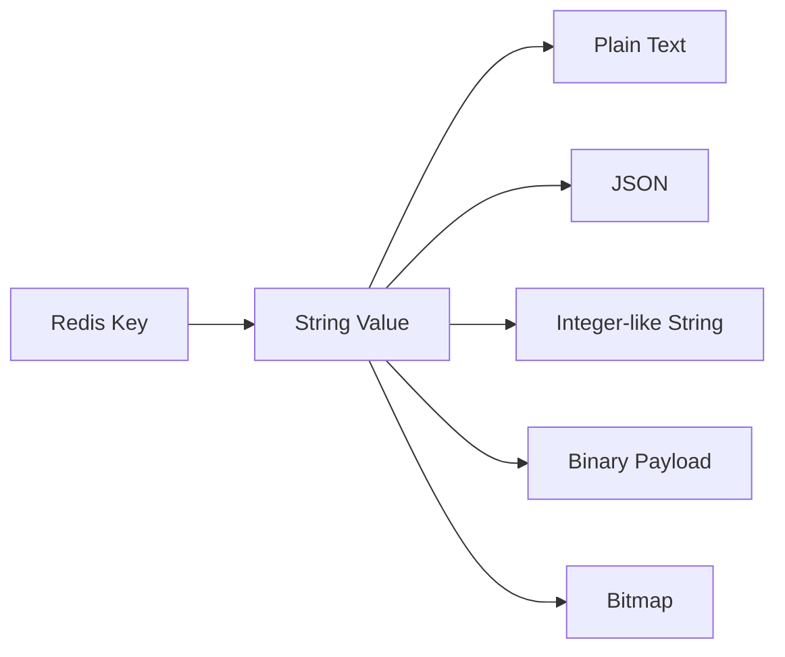
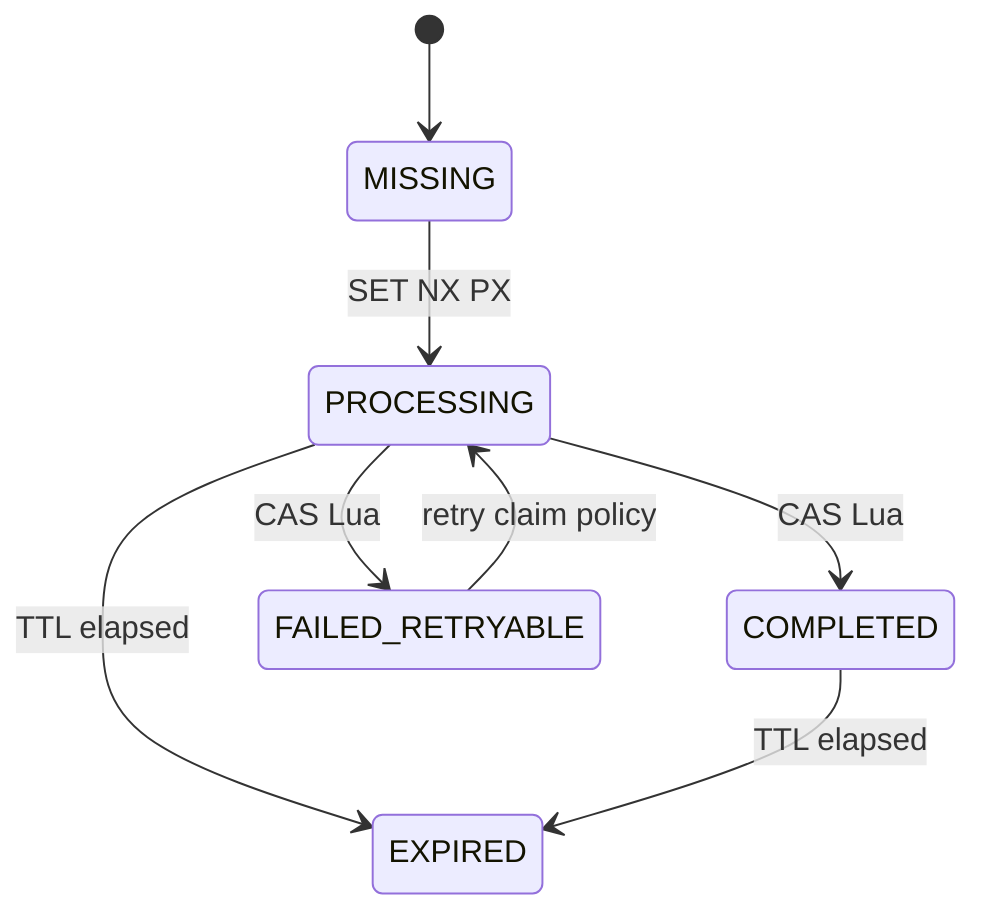
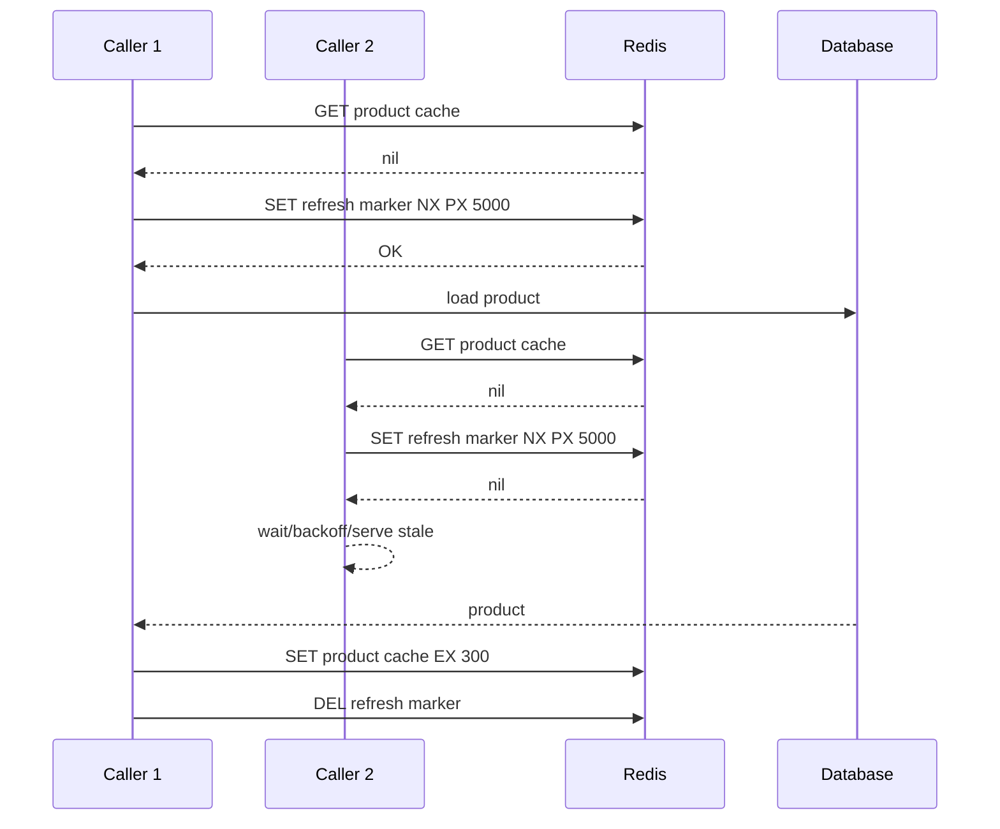

------
title: Learn Java Redis In Action - Part 004
description: Deep practical guide to Redis Strings, counters, bitmaps, bitfields, and atomic primitives for Java engineers, including SET options, INCR patterns, idempotency markers, bitmap analytics, and Lua-based compare-and-set.
series: learn-java-redis
seriesTitle: Learn Java Redis In Action
order: 4
partTitle: Strings, Counters, Bitmaps, and Atomic Primitives
tags:
- java
- redis
- strings
- counters
- bitmaps
- atomicity
- lua
- distributed-systems
- production-engineering
- series
date: 2026-07-02
---

# Part 004 — Strings, Counters, Bitmaps, and Atomic Primitives

Redis String adalah data type paling sederhana, tetapi bukan data type paling dangkal.
Di production, String menjadi fondasi untuk:

- cache value;
- session token;
- idempotency marker;
- distributed lease marker;
- counter;
- quota bucket;
- bitmap;
- compact analytics;
- feature state;
- small state machine;
- atomic primitive berbasis `SET`, `INCR`, dan Lua.

Redis String menyimpan sequence of bytes.
Karena itu, String bisa berisi plain text, JSON, binary payload, integer-like value, atau bit array.
Redis tidak punya tipe integer khusus; operasi seperti `INCR` bekerja pada String yang isinya diinterpretasikan sebagai integer.

Part ini tidak membahas cache pattern secara lengkap.
Cache pattern akan punya part sendiri.
Di sini kita fokus pada primitive kecil yang sering menjadi building block sistem besar.

---

## 1. Learning Outcome

Setelah part ini, kita ingin mampu:

- memakai Redis String dengan opsi `SET` yang benar;
- membedakan `SET`, `SET EX/PX`, `SET NX`, `SET XX`, `GETSET`/`SET GET`, dan `KEEPTTL` style usage;
- mendesain counter yang aman secara TTL dan cardinality;
- menghindari race condition saat `INCR` + `EXPIRE`;
- memakai bitmap untuk membership/activity tracking yang compact;
- memahami kapan `BITFIELD` lebih cocok daripada banyak key kecil;
- membuat idempotency marker sederhana dengan `SET NX PX`;
- membuat compare-and-set kecil dengan Lua;
- menulis Java boundary yang jelas untuk primitive Redis.

---

## 2. Redis String Mental Model

String di Redis adalah value paling general.
Satu key menunjuk ke satu byte sequence.



Yang sering membingungkan:

> Bitmap di Redis bukan data type terpisah. Bitmap adalah operasi bit-level di atas String.

Counter juga bukan data type terpisah.
Counter adalah String yang berisi integer dan dimodifikasi dengan command atomic seperti `INCR` atau `INCRBY`.

---

## 3. Core String Commands

Command utama:

| Command | Use Case | Catatan |
|---|---|---|
| `GET` | baca value | returns nil jika key tidak ada |
| `SET` | tulis value | banyak opsi modern |
| `MGET` | batch read banyak key | hati-hati payload besar |
| `MSET` | batch write | cluster constraint jika multi-key |
| `DEL` | delete key | sync delete |
| `UNLINK` | async delete | berguna untuk key besar |
| `EXPIRE` / `PEXPIRE` | pasang TTL | detik / milidetik |
| `TTL` / `PTTL` | introspeksi TTL | detik / milidetik |
| `INCR` / `INCRBY` | integer counter | atomic per command |
| `DECR` / `DECRBY` | decrement counter | atomic per command |
| `SETBIT` / `GETBIT` | bitmap bit mutation/read | offset berbasis bit |
| `BITCOUNT` | hitung bit 1 | analytics compact |
| `BITFIELD` | packed integer field | compact counters/flags |

Dalam Java, command ini biasanya diakses lewat:

- Jedis synchronous API;
- Lettuce synchronous/async/reactive API;
- Spring Data Redis template;
- Redisson abstraction.

Client-specific detail akan dibahas di part 009-012.
Di sini contoh Java dibuat agar mental model command-nya jelas.

---

## 4. SET Is a State Transition

`SET key value` terlihat sederhana, tetapi di production ia adalah state transition.
Pertanyaan yang harus dijawab:

- apakah key boleh overwrite value lama?
- apakah key harus hanya dibuat jika belum ada?
- apakah key harus hanya update jika sudah ada?
- apakah TTL harus dipasang bersama value?
- apakah TTL lama harus dipertahankan?
- apakah caller perlu previous value?

Redis `SET` modern mendukung opsi yang membuat banyak command lama tidak perlu dipakai.
Misalnya `SETNX` sudah dianggap deprecated untuk code baru karena bisa digantikan oleh `SET` dengan opsi `NX`.

### 4.1 Common SET Forms

```text
SET key value
SET key value EX 60
SET key value PX 5000
SET key value NX EX 60
SET key value XX KEEPTTL
SET key value GET
```

Makna umum:

| Form | Makna |
|---|---|
| `SET key value` | overwrite tanpa TTL baru |
| `SET key value EX 60` | set value dengan TTL 60 detik |
| `SET key value PX 5000` | set value dengan TTL 5000 ms |
| `SET key value NX EX 60` | create-only dengan TTL |
| `SET key value XX` | update-only jika key sudah ada |
| `SET key value KEEPTTL` | update value tanpa menghapus TTL lama |
| `SET key value GET` | set value dan return old value |

Production rule:

> Jika key harus expire, pasang TTL di command yang sama dengan write jika memungkinkan.

Jangan lakukan ini jika atomicity penting:

```text
SET key value
EXPIRE key 60
```

Karena jika aplikasi crash di antara dua command, key bisa hidup tanpa TTL.

Lebih aman:

```text
SET key value EX 60
```

---

## 5. Atomic Create Marker: SET NX PX

Pattern paling penting dari Redis String:

```text
SET key value NX PX <ttlMillis>
```

Maknanya:

- buat key hanya jika belum ada;
- pasang TTL dalam command yang sama;
- return sukses hanya untuk caller pertama;
- caller lain tahu bahwa marker sudah ada.

Use case:

- idempotency start marker;
- duplicate suppression;
- single-flight refresh marker;
- lightweight lease;
- job claim marker;
- password reset token registration;
- OTP attempt marker.

### 5.1 Example: Idempotency Start Marker

```text
SET order:idempotency:v1:{tenant:acme}:op:create-order:key:abc PROCESSING NX PX 604800000
```

Interpretasi:

- jika result `OK`, request ini owner pertama;
- jika result nil/null, request duplicate atau sedang diproses;
- TTL 7 hari mencegah marker hidup selamanya.

Java-like boundary:

```java
public enum ClaimResult {
    CLAIMED,
    ALREADY_EXISTS
}

public interface IdempotencyMarkerRepository {
    ClaimResult tryClaim(TenantId tenantId, OperationName operation, IdempotencyKey key, Duration ttl);
}
```

Implementation dengan Lettuce-style sync command:

```java
public final class RedisIdempotencyMarkerRepository implements IdempotencyMarkerRepository {
    private final RedisCommands<String, String> redis;
    private final OrderRedisKeys keys;

    @Override
    public ClaimResult tryClaim(
            TenantId tenantId,
            OperationName operation,
            IdempotencyKey idempotencyKey,
            Duration ttl
    ) {
        String redisKey = keys.idempotency(tenantId, operation, idempotencyKey).value();

        SetArgs args = SetArgs.Builder
                .nx()
                .px(ttl.toMillis());

        String result = redis.set(redisKey, "PROCESSING", args);
        return "OK".equals(result) ? ClaimResult.CLAIMED : ClaimResult.ALREADY_EXISTS;
    }
}
```

Catatan:

- class `SetArgs` adalah konsep Lettuce;
- API detail bisa berbeda antar client;
- prinsip command-nya tetap sama.

---

## 6. SET NX Is Not a Complete Distributed Lock

`SET key value NX PX ttl` sering dipakai untuk lock.
Itu boleh untuk beberapa use case, tetapi jangan terlalu percaya diri.

Problem utama:

- lease bisa expire saat holder masih bekerja;
- client pause/GC bisa membuat holder lama melanjutkan kerja setelah lease hilang;
- Redis failover bisa mengganti visibility lock;
- tanpa fencing token, downstream resource tidak tahu request mana yang lebih baru;
- clock dan timeout tidak menyelesaikan correctness penuh.

Untuk lock yang hanya mencegah duplicate expensive work, pattern ini sering cukup.
Untuk correctness lock yang melindungi uang, inventory, legal state, atau irreversible mutation, kita butuh model lebih kuat.
Pembahasan detail ada di Part 018.

Untuk sekarang, rule-nya:

> Use `SET NX PX` as a lease marker, not as magic correctness guarantee.

---

## 7. Counter Fundamentals

Counter Redis dibangun dari String integer.
`INCR` atomic menambah value 1.
Jika key belum ada, Redis menganggap value awal 0 lalu melakukan increment.
Operasi integer Redis dibatasi signed 64-bit integer.

Contoh:

```text
INCR api:request_count:v1:{tenant:acme}:minute:202607021430
```

Use case:

- request counter;
- login attempt;
- quota usage;
- sequence number ringan;
- retry count;
- error count;
- rolling metric sederhana.

### 7.1 Counter With TTL

Naive:

```text
INCR key
EXPIRE key 60
```

Race risk:

- if process crashes after `INCR` before `EXPIRE`, key becomes persistent;
- repeated `EXPIRE` can extend window unintentionally;
- multiple writers can make TTL semantics inconsistent.

Better pattern for simple fixed-window counter:

```text
value = INCR key
if value == 1:
    EXPIRE key window + buffer
```

Still not perfectly atomic unless wrapped in Lua, but good enough for some non-critical metrics.
For stricter correctness, use Lua.

### 7.2 Lua Atomic INCR + EXPIRE If First

```lua
local current = redis.call('INCR', KEYS[1])
if current == 1 then
  redis.call('PEXPIRE', KEYS[1], ARGV[1])
end
return current
```

Java boundary:

```java
public interface WindowCounterRepository {
    long incrementAndExpireOnFirstWrite(String key, Duration ttl);
}
```

Lettuce-style implementation:

```java
public final class RedisWindowCounterRepository implements WindowCounterRepository {
    private static final String SCRIPT = """
        local current = redis.call('INCR', KEYS[1])
        if current == 1 then
          redis.call('PEXPIRE', KEYS[1], ARGV[1])
        end
        return current
        """;

    private final RedisCommands<String, String> redis;

    @Override
    public long incrementAndExpireOnFirstWrite(String key, Duration ttl) {
        Object result = redis.eval(
                SCRIPT,
                ScriptOutputType.INTEGER,
                new String[] { key },
                String.valueOf(ttl.toMillis())
        );
        return ((Number) result).longValue();
    }
}
```

Script ini memastikan `INCR` dan `PEXPIRE` adalah satu atomic server-side workflow.

---

## 8. Fixed Window Counter

Pattern:

```text
quota:api:v1:{tenant:acme}:user:U-123:route:submit-order:window:202607021430
```

Window per menit:

```text
202607021430
```

Command:

```text
INCR key
EXPIRE key 120
```

TTL 120 detik untuk window 60 detik memberi buffer observability dan late request.

### 8.1 Kelebihan

- sederhana;
- cepat;
- memory predictable jika TTL benar;
- cocok untuk low/medium precision quota.

### 8.2 Kekurangan

- boundary effect: request di akhir window dan awal window bisa double burst;
- fairness kurang;
- tidak cocok untuk strict sliding limit;
- key cardinality bisa tinggi.

Part rate limiting akan membahas sliding window dan token bucket lebih detail.

---

## 9. Counter Key Design

Counter key harus menjawab:

- siapa yang dihitung?
- untuk aksi apa?
- dalam window apa?
- untuk tenant mana?
- TTL-nya berapa?

Contoh baik:

```text
gateway:rate_counter:v1:{tenant:acme}:user:U-123:route:create-order:window:202607021430
```

Contoh buruk:

```text
counter:U-123
```

Masalah contoh buruk:

- tidak tahu tenant;
- tidak tahu route;
- tidak tahu window;
- tidak tahu owner;
- raw cardinality tidak terlihat.

---

## 10. Counter Overflow and Domain Limit

Karena Redis integer operation memakai signed 64-bit integer, counter bisa overflow secara teoritis.
Di banyak aplikasi, ini tidak terjadi.
Namun untuk high-throughput global counter, tetap perlu guard.

Jangan gunakan satu global counter untuk semua traffic besar jika:

- throughput sangat tinggi;
- key menjadi hot;
- counter tidak harus exact real-time;
- agregasi bisa dilakukan per shard/bucket.

Gunakan sharded counter:

```text
metrics:request_count:v1:{tenant:acme}:day:20260702:shard:00
metrics:request_count:v1:{tenant:acme}:day:20260702:shard:01
...
metrics:request_count:v1:{tenant:acme}:day:20260702:shard:63
```

Write memilih shard random atau berdasarkan hash request.
Read menjumlahkan semua shard.

Trade-off:

- write scalability naik;
- read lebih mahal;
- exact value butuh aggregation;
- memory lebih banyak karena banyak key.

---

## 11. Sequence Number Caveat

`INCR sequence:key` bisa membuat sequence number.
Namun hati-hati:

- Redis failover dan persistence policy mempengaruhi durability sequence;
- gap pasti mungkin terjadi;
- duplicate bisa terjadi jika write hilang saat failover/persistence tertentu;
- sequence global bisa jadi hot key;
- legal invoice/order number mungkin butuh database transaction atau dedicated ID service.

Redis counter cocok untuk:

- non-critical monotonic-ish number;
- temporary sequence;
- sharded ID component;
- debug counter;
- metrics.

Redis counter harus direview keras untuk:

- invoice number;
- ledger entry number;
- legal document number;
- financial ordering;
- strict exactly-once ID.

---

## 12. Bitmap Fundamentals

Bitmap adalah cara menyimpan banyak boolean sebagai bit dalam Redis String.
Satu bit merepresentasikan status true/false untuk offset tertentu.

Command utama:

```text
SETBIT key offset 1
GETBIT key offset
BITCOUNT key
BITOP AND/OR/XOR/NOT dest key1 key2 ...
BITPOS key bit
```

Contoh activity tracking:

```text
user:daily_active_bitmap:v1:{tenant:acme}:date:20260702
```

Offset = user numeric id atau mapped dense index.

```text
SETBIT user:daily_active_bitmap:v1:{tenant:acme}:date:20260702 98213 1
BITCOUNT user:daily_active_bitmap:v1:{tenant:acme}:date:20260702
```

Kalau bit ke-98213 diset, user tersebut aktif pada tanggal itu.
`BITCOUNT` memberi jumlah user aktif jika offset mapping unik.

---

## 13. Bitmap Memory Model

Bitmap sangat compact jika offset padat.
Memory kira-kira:

```text
highest_offset / 8 bytes
```

Kalau highest offset 10,000,000:

```text
10,000,000 bits / 8 = ~1.25 MB
```

Itu sangat efisien untuk 10 juta boolean.

Tapi jika offset sparse dan sangat besar:

```text
offset = 9,000,000,000
```

Redis harus allocate string sampai offset itu.
Ini bisa sangat berbahaya.

Rule:

> Bitmap cocok untuk dense numeric index, bukan random 64-bit ID langsung.

Jika user ID adalah UUID, jangan jadikan UUID sebagai offset.
Buat mapping dense index atau gunakan Set/Bloom filter/probabilistic structure sesuai kebutuhan.

---

## 14. Bitmap Use Cases

### 14.1 Daily Active User

```text
activity:dau_bitmap:v1:{tenant:acme}:date:20260702
```

Set activity:

```text
SETBIT activity:dau_bitmap:v1:{tenant:acme}:date:20260702 <denseUserIndex> 1
```

Count:

```text
BITCOUNT activity:dau_bitmap:v1:{tenant:acme}:date:20260702
```

TTL:

```text
90 days or based on analytics retention
```

### 14.2 Feature Exposure

```text
experiment:exposure_bitmap:v1:{tenant:acme}:experiment:checkout-v3:variant:A
```

Offset = dense user index.

Benefit:

- compact exposure tracking;
- fast count;
- easy intersection via `BITOP AND` if comparing cohorts.

### 14.3 Permission Snapshot Flag

Untuk permission, bitmap bisa dipakai jika:

- permission universe kecil;
- user/entity mapping jelas;
- bit index versioned;
- readability tidak dikorbankan.

Namun permission security-critical biasanya lebih baik dimodelkan dengan explicit structure agar audit lebih mudah.
Bitmap terlalu opaque jika dipakai sembarangan.

---

## 15. Bitmap Cohort Operations

Misalnya kita punya:

```text
activity:dau_bitmap:v1:{tenant:acme}:date:20260701
activity:dau_bitmap:v1:{tenant:acme}:date:20260702
```

User aktif di dua hari:

```text
BITOP AND activity:retained_bitmap:v1:{tenant:acme}:from:20260701:to:20260702 \
  activity:dau_bitmap:v1:{tenant:acme}:date:20260701 \
  activity:dau_bitmap:v1:{tenant:acme}:date:20260702

BITCOUNT activity:retained_bitmap:v1:{tenant:acme}:from:20260701:to:20260702
```

Caveat:

- output key bisa besar;
- TTL output key harus dipasang;
- operasi pada bitmap besar bisa mempengaruhi latency;
- jalankan analytics berat di replica atau batch window jika sesuai;
- jangan lakukan `BITOP` besar di hot production path.

---

## 16. Bitmap Java Boundary

```java
public interface UserActivityBitmapRepository {
    void markActive(TenantId tenantId, LocalDate date, DenseUserIndex userIndex);
    boolean wasActive(TenantId tenantId, LocalDate date, DenseUserIndex userIndex);
    long countActive(TenantId tenantId, LocalDate date);
}
```

Implementation outline:

```java
public final class RedisUserActivityBitmapRepository implements UserActivityBitmapRepository {
    private final RedisCommands<String, String> redis;
    private final ActivityRedisKeys keys;

    @Override
    public void markActive(TenantId tenantId, LocalDate date, DenseUserIndex userIndex) {
        String key = keys.dailyActiveBitmap(tenantId, date).value();
        redis.setbit(key, userIndex.value(), 1);
        redis.expire(key, Duration.ofDays(90).toSeconds());
    }

    @Override
    public boolean wasActive(TenantId tenantId, LocalDate date, DenseUserIndex userIndex) {
        String key = keys.dailyActiveBitmap(tenantId, date).value();
        return redis.getbit(key, userIndex.value()) == 1;
    }

    @Override
    public long countActive(TenantId tenantId, LocalDate date) {
        String key = keys.dailyActiveBitmap(tenantId, date).value();
        return redis.bitcount(key);
    }
}
```

Improve production version:

- set TTL only when key newly created or via periodic job, not every write if write QPS high;
- validate max offset;
- avoid sparse offset;
- add metrics for highest offset and bitmap memory estimate;
- batch activity writes if traffic extremely high.

---

## 17. BITFIELD Fundamentals

`BITFIELD` treats a Redis String as an array of bits and allows reading, setting, and incrementing integer fields of arbitrary bit width.
It can operate on multiple fields in one command and has explicit overflow behavior.

Use case:

- compact counters;
- small bounded integer arrays;
- packed state;
- real-time analytics where many small values are stored together.

Example:

```text
BITFIELD game:tile_counts:v1:{tenant:acme}:board:B-1 \
  INCRBY u8 #0 1 \
  INCRBY u8 #1 1 \
  GET u8 #0
```

Here `u8 #0` means unsigned 8-bit integer at logical index 0.
The `#` offset form multiplies index by encoding width.

### 17.1 Overflow Modes

`BITFIELD` supports overflow behavior:

| Mode | Meaning |
|---|---|
| `WRAP` | wrap around default |
| `SAT` | saturate at min/max |
| `FAIL` | fail operation on overflow/underflow |

Example:

```text
BITFIELD quota:packed:v1:{tenant:acme}:user:U-123 \
  OVERFLOW SAT \
  INCRBY u8 #0 1
```

If counter max is 255, `SAT` keeps it at 255.

### 17.2 When BITFIELD Is Useful

BITFIELD is attractive when:

- many tiny bounded counters exist;
- memory is more important than readability;
- access pattern touches adjacent/known offsets;
- value ranges are known;
- overflow behavior is intentionally designed.

Avoid BITFIELD when:

- team cannot debug packed state;
- values need ad-hoc query;
- offset mapping is unstable;
- counters can exceed width unexpectedly;
- audit/readability matters more than memory.

---

## 18. Atomic Compare-and-Set with Lua

Redis commands are atomic individually, but multi-step logic needs server-side composition if race matters.

Example requirement:

```text
Update state from PROCESSING to COMPLETED only if current state is PROCESSING.
Keep existing TTL.
```

Naive client-side:

```text
GET key
if value == PROCESSING:
  SET key COMPLETED KEEPTTL
```

Race:

- another client can modify key between `GET` and `SET`.

Lua:

```lua
local current = redis.call('GET', KEYS[1])
if current == ARGV[1] then
  redis.call('SET', KEYS[1], ARGV[2], 'KEEPTTL')
  return 1
end
return 0
```

Java boundary:

```java
public interface AtomicStateRepository {
    boolean compareAndSetKeepingTtl(String key, String expected, String next);
}
```

Implementation outline:

```java
public final class RedisAtomicStateRepository implements AtomicStateRepository {
    private static final String CAS_KEEP_TTL = """
        local current = redis.call('GET', KEYS[1])
        if current == ARGV[1] then
          redis.call('SET', KEYS[1], ARGV[2], 'KEEPTTL')
          return 1
        end
        return 0
        """;

    private final RedisCommands<String, String> redis;

    @Override
    public boolean compareAndSetKeepingTtl(String key, String expected, String next) {
        Object result = redis.eval(
                CAS_KEEP_TTL,
                ScriptOutputType.INTEGER,
                new String[] { key },
                expected,
                next
        );
        return ((Number) result).longValue() == 1L;
    }
}
```

This pattern is small but powerful.
It appears in:

- idempotency state transition;
- job claim state;
- single-flight refresh;
- lease release safety;
- request deduplication.

---

## 19. Lua Script Design Rules

Lua can make Redis workflows atomic, but it can also create production risk.

Rules:

1. Keep scripts small.
2. Keep scripts deterministic.
3. Avoid long loops over large collections.
4. Pass all keys through `KEYS`, not hidden in `ARGV`.
5. For Redis Cluster, all keys in a script must be in the same hash slot.
6. Return simple values.
7. Version scripts in code.
8. Test nil/missing/wrong-state behavior.
9. Add metrics around script success/failure.
10. Do not turn Redis into an application server.

Bad Lua script:

```lua
-- loops over thousands/millions of keys and performs business workflow
```

Good Lua script:

```lua
-- atomically transition one marker key with TTL preservation
```

---

## 20. String Value Envelope

For object-like String values, use envelope when debugging matters.

```json
{
  "schemaVersion": 1,
  "state": "COMPLETED",
  "createdAt": "2026-07-02T10:00:00Z",
  "updatedAt": "2026-07-02T10:00:02Z",
  "payload": {
    "orderId": "O-123"
  }
}
```

But for high-QPS primitive marker, plain value can be better:

```text
PROCESSING
```

Trade-off:

| Value Form | Kelebihan | Kekurangan |
|---|---|---|
| Plain string | fast, compact | low context |
| JSON envelope | debuggable, evolvable | bigger payload |
| Binary | compact/fast | harder to debug |
| Bit-packed | very compact | operationally opaque |

Rule:

> Use the simplest representation that preserves correctness and operability.

---

## 21. Idempotency Marker State Machine

Simple idempotency marker can be modeled as String state.



Possible value:

```text
PROCESSING
COMPLETED:O-123
FAILED_RETRYABLE:UPSTREAM_TIMEOUT
```

For production API, prefer structured value if response replay is needed:

```json
{
  "schemaVersion": 1,
  "state": "COMPLETED",
  "operation": "create-order",
  "requestHash": "sha256_abc",
  "response": {
    "orderId": "O-123",
    "status": "CREATED"
  }
}
```

Important caveat:

- Redis marker alone does not solve crash after database commit before marker update;
- robust idempotency often needs durable table plus Redis acceleration;
- Redis marker can be front-line duplicate suppression, not always final correctness source.

---

## 22. Single-Flight Cache Refresh Marker

Problem:

- many requests miss same cache key;
- all hit database/upstream;
- upstream overloads.

Primitive:

```text
SET cache_refresh_lock:product:SKU-123 <workerId> NX PX 5000
```

Flow:



This is not a correctness lock.
It is stampede reduction.
If marker expires and two refreshers run, result is usually acceptable for cache.

---

## 23. Feature Flag Primitive

Small feature flag can be stored as String:

```text
feature:flag:v1:{tenant:acme}:name:new-checkout -> ENABLED
```

But production flag systems need:

- targeting rules;
- audit;
- rollout percentage;
- kill switch;
- SDK cache;
- consistency expectations;
- admin UI.

Redis String can be a fast distribution/cache layer, not necessarily the flag source of truth.

---

## 24. OTP Attempt Counter

Example:

```text
auth:otp_attempt_counter:v1:{tenant:acme}:phone_hmac:09bc:window:202607021430
```

Flow:

1. Normalize phone.
2. HMAC phone to avoid raw PII in key.
3. Increment counter with TTL.
4. Reject if count exceeds threshold.
5. Keep TTL aligned with OTP risk window.

Lua:

```lua
local current = redis.call('INCR', KEYS[1])
if current == 1 then
  redis.call('PEXPIRE', KEYS[1], ARGV[1])
end
return current
```

Java service:

```java
public final class OtpAttemptLimiter {
    private final WindowCounterRepository counters;
    private final AuthRedisKeys keys;

    public void checkAndIncrement(TenantId tenantId, PhoneNumber phoneNumber) {
        String key = keys.otpAttemptCounter(tenantId, phoneNumber.hmac()).value();
        long count = counters.incrementAndExpireOnFirstWrite(key, Duration.ofMinutes(10));
        if (count > 5) {
            throw new TooManyOtpAttemptsException();
        }
    }
}
```

This is a simple fixed-window guard.
For more precise throttling, use sliding window or token bucket in Part 017.

---

## 25. Password Reset Token Marker

Key:

```text
auth:password_reset:v1:{tenant:acme}:token_sha256:abcd
```

Value:

```json
{
  "schemaVersion": 1,
  "userId": "U-123",
  "issuedAt": "2026-07-02T10:00:00Z",
  "used": false
}
```

Creation:

```text
SET key value NX PX 900000
```

Consume token atomically:

```lua
local current = redis.call('GET', KEYS[1])
if not current then
  return 0
end
redis.call('DEL', KEYS[1])
return current
```

This gives single-use behavior.
But for security-sensitive systems, also store durable audit event outside Redis.

---

## 26. Wrong Patterns to Avoid

### 26.1 SET Then EXPIRE for Required TTL

Bad:

```text
SET key value
EXPIRE key 60
```

If crash happens after `SET`, key leaks.
Use:

```text
SET key value EX 60
```

### 26.2 INCR Without TTL for Windowed Counter

Bad:

```text
INCR login_attempt:email_hash
```

This key never disappears.
Use windowed key and TTL:

```text
INCR login_attempt:email_hash:window:202607021430
EXPIRE ...
```

Or Lua.

### 26.3 Raw User ID as Bitmap Offset Without Density Check

Bad:

```text
SETBIT dau 987654321987654321 1
```

This can allocate enormous memory.
Use dense mapping or another structure.

### 26.4 Global Counter for High-QPS Writes

Bad:

```text
INCR global:request_count
```

At high QPS, this becomes hot key.
Use sharded counters or metrics pipeline.

### 26.5 Complex Business Logic in Lua

Bad:

```text
Lua script validates order, updates inventory, calculates discount, writes several keys, emits state.
```

Redis Lua should protect small atomic transitions, not replace service/domain layer.

---

## 27. Testing Redis Primitives

Testing should cover:

- missing key;
- existing key;
- wrong state;
- TTL presence;
- TTL preserved or changed as intended;
- duplicate request;
- concurrent claim;
- expired marker;
- serialization error;
- Redis timeout behavior;
- script return type.

Example test cases for `SET NX PX` marker:

```java
@Test
void firstCallerClaimsMarker() {
    ClaimResult result = repository.tryClaim(tenant, operation, key, Duration.ofMinutes(5));
    assertThat(result).isEqualTo(ClaimResult.CLAIMED);
}

@Test
void secondCallerDoesNotClaimMarker() {
    repository.tryClaim(tenant, operation, key, Duration.ofMinutes(5));
    ClaimResult second = repository.tryClaim(tenant, operation, key, Duration.ofMinutes(5));
    assertThat(second).isEqualTo(ClaimResult.ALREADY_EXISTS);
}

@Test
void markerHasTtl() {
    repository.tryClaim(tenant, operation, key, Duration.ofMinutes(5));
    long ttl = redis.pttl(redisKey);
    assertThat(ttl).isGreaterThan(0);
}
```

For concurrency, use multiple threads or stress test.
But remember: unit tests do not prove distributed correctness.
They only verify local behavior.

---

## 28. Observability for String Primitives

Metrics to add:

- claim success count;
- claim conflict count;
- counter increment count;
- counter threshold exceeded count;
- Lua CAS success/failure count;
- Redis command latency;
- Redis timeout count;
- marker TTL missing count;
- bitmap highest offset observed;
- approximate key cardinality per pattern.

Log carefully.
Do not log raw token, raw phone, raw email, or full sensitive key.

Good log:

```json
{
  "event": "idempotency_claim_conflict",
  "tenantId": "acme",
  "operation": "create-order",
  "keyHashPrefix": "sha256_abcd",
  "redisPattern": "order:idempotency:v1"
}
```

Bad log:

```json
{
  "redisKey": "auth:password_reset:v1:tenant:acme:token:raw-secret-token"
}
```

---

## 29. Performance Notes

String commands are generally fast, but production latency depends on:

- network round trip;
- payload size;
- serialization cost;
- client connection pool/backpressure;
- hot key pressure;
- Redis CPU;
- persistence configuration;
- replication traffic;
- slow Lua scripts;
- large bitmap operations;
- cluster redirection.

Do not benchmark Redis by only running `redis-benchmark` and assuming application latency.
Benchmark the full path:

```text
Java object -> serialization -> client command -> network -> Redis -> network -> deserialization -> domain handling
```

---

## 30. Practice Lab

### Lab 1 — Idempotency Claim

Implement:

```java
ClaimResult tryClaim(TenantId tenantId, String operation, String key, Duration ttl)
```

Requirements:

- uses `SET NX PX`;
- hashes raw idempotency key;
- no raw PII in key;
- has test for duplicate claim;
- has test for TTL.

### Lab 2 — Fixed Window Counter

Implement:

```java
long increment(TenantId tenantId, UserId userId, String route, Instant now)
```

Requirements:

- key includes minute window;
- TTL = window + buffer;
- uses Lua to avoid missing TTL;
- exposes threshold decision in service layer.

### Lab 3 — Daily Active Bitmap

Implement:

```java
void markActive(TenantId tenantId, LocalDate date, DenseUserIndex userIndex)
long countActive(TenantId tenantId, LocalDate date)
```

Requirements:

- validates max offset;
- TTL = retention period;
- no UUID as offset;
- has metric for max offset observed.

### Lab 4 — CAS State Transition

Implement:

```java
boolean completeIfProcessing(String markerKey, String completedValue)
```

Requirements:

- uses Lua;
- preserves TTL;
- returns false if current state is not `PROCESSING`;
- has test for wrong state.

---

## 31. Production Checklist

For Redis String primitive:

- [ ] key pattern has owner, purpose, version, scope;
- [ ] sensitive identifiers are hashed/HMACed;
- [ ] required TTL is set atomically with value;
- [ ] `SET NX` use has clear duplicate behavior;
- [ ] `SET XX` use has clear missing-key behavior;
- [ ] `KEEPTTL` use is intentional;
- [ ] counter has bounded window or bounded lifecycle;
- [ ] counter hot key risk reviewed;
- [ ] bitmap offset is dense and bounded;
- [ ] bitfield width and overflow behavior are documented;
- [ ] Lua script is small and deterministic;
- [ ] Redis Cluster hash slot constraints are considered;
- [ ] observability exists for success, conflict, timeout, and abnormal TTL;
- [ ] tests cover missing/existing/wrong-state/expired cases.

---

## 32. Mental Model Summary

Redis String is not just a string.
It is a flexible byte container with atomic server-side operations.

The powerful primitives are:

```text
SET key value EX/PX ttl
SET key value NX PX ttl
SET key value XX KEEPTTL
INCR key
SETBIT / GETBIT / BITCOUNT
BITFIELD
EVAL small atomic logic
```

Used well, these primitives support idempotency, counters, quota windows, single-flight refresh, compact analytics, and small state machines.
Used carelessly, they create leaked keys, hot counters, sparse bitmap memory explosions, fake locks, and hidden race conditions.

Part berikutnya akan membahas Hashes sebagai object storage: session, profile, token, partial update, field-level modeling, dan Redis 8 field expiration patterns.

---

## 33. References

- Redis Docs — Strings: https://redis.io/docs/latest/develop/data-types/strings/
- Redis Docs — SET command: https://redis.io/docs/latest/commands/set/
- Redis Docs — SETNX command: https://redis.io/docs/latest/commands/setnx/
- Redis Docs — INCR command: https://redis.io/docs/latest/commands/incr/
- Redis Docs — BITFIELD command: https://redis.io/docs/latest/commands/bitfield/
- Redis Docs — Distributed locks with Redis: https://redis.io/docs/latest/develop/clients/patterns/distributed-locks/
