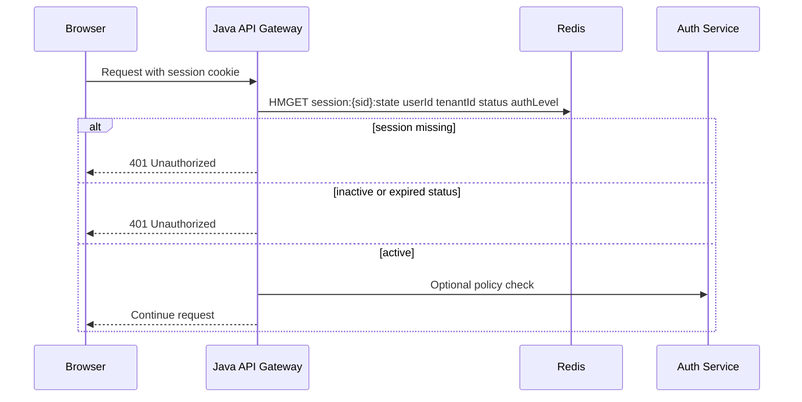

# Part 005 — Hashes as Object Storage: Session, Profile, Token, and Partial Expiry

Redis Hashes are one of the most frequently mis-modeled Redis structures.
They look simple: a key contains field-value pairs.
But in production, the decision to use a Hash is really a decision about **object boundaries, update granularity, TTL semantics, memory shape, and failure behavior**.

This part builds the mental model for using Redis Hashes as object-like storage from Java systems.
We will avoid treating Hashes as a generic mini-database.
Instead, we will learn when they are the right tool, when they become dangerous, and how to build predictable Java access layers around them.

---

## 1. Kaufman Skill Decomposition

The practical skill we want is not “know Redis Hash commands”.
The practical skill is:

> Given a real Java service object, decide whether Redis Hash is the correct representation, design its key/field/TTL lifecycle, implement safe reads and writes, and identify the failure modes before launch.

Break that into sub-skills:

| Sub-skill | What you must be able to do |
|---|---|
| Object boundary design | Decide what belongs in one hash and what must be separate keys |
| Field modeling | Represent scalar fields, counters, timestamps, version markers, flags, and references |
| TTL modeling | Choose key-level TTL, field-level TTL, or external expiry index |
| Partial update | Update one field without rewriting the whole object |
| Read shape design | Use `HGET`, `HMGET`, `HGETALL`, or `HSCAN` appropriately |
| Java mapping | Convert domain DTOs to Redis-safe string/binary field maps |
| Concurrency | Use atomic field commands or Lua when multiple-field invariants matter |
| Schema evolution | Add, rename, deprecate, and migrate fields safely |
| Failure modeling | Handle stale fields, partially missing fields, old schema, hot hash, and large hash |

The target is production fluency: after this part, you should be able to design a Redis-backed session/profile/token state object without accidentally creating an unbounded key, a stale authorization bug, or a hidden consistency trap.

---

## 2. Redis Hash Mental Model

A Redis Hash is:

```text
Redis key -> field -> value
```

Example:

```text
session:{sid}:state
  userId        -> 98172
  tenantId      -> telco-id
  status        -> ACTIVE
  authLevel     -> MFA
  createdAtMs   -> 1783012145000
  lastSeenAtMs  -> 1783012441000
  schemaVersion -> 3
```

The important thing is that the outer key has Redis key behavior, while the inner fields have Hash behavior.

```mermaid
flowchart LR
    A[Redis key: session:{sid}:state] --> B[userId]
    A --> C[tenantId]
    A --> D[status]
    A --> E[lastSeenAtMs]
    A --> F[schemaVersion]

    B --> Bv[98172]
    C --> Cv[telco-id]
    D --> Dv[ACTIVE]
    E --> Ev[1783012441000]
    F --> Fv[3]
```

This means:

- The hash itself can have a key-level TTL.
- Individual fields can be updated independently.
- Reads can fetch only selected fields.
- Atomicity is per Redis command unless you use transactions, Lua, or Redis Functions.
- A hash can still become a large key if you let it grow without bound.

A Hash is best understood as a **bounded object aggregate**, not as a table.

Bad mental model:

```text
Redis Hash = database table
```

Better mental model:

```text
Redis Hash = one bounded mutable object with named attributes
```

---

## 3. When a Hash Is the Right Tool

Use a Redis Hash when all of these are mostly true:

| Condition | Why it matters |
|---|---|
| One Redis key maps to one logical object | Hash fields describe one aggregate, not many unrelated records |
| Field count is bounded | Prevents large-key operational problems |
| Partial updates are valuable | You need to update one field without rewriting the whole value |
| Partial reads are common | You often need only a few fields |
| The object lifecycle is shared | Most fields can expire or be deleted together |
| The data is operational state | Session, token metadata, rate state, workflow scratchpad, small profile cache |

Good candidates:

```text
session:{sid}:state
user:{userId}:profile-cache
quote:{quoteId}:draft-state
order:{orderId}:processing-state
api-token:{tokenId}:metadata
tenant:{tenantId}:feature-flags
cart:{cartId}:summary
```

Poor candidates:

```text
all-users
all-sessions
all-orders-by-tenant:{tenantId}
event-log:{aggregateId}
large-cart:{cartId}:items
permissions:{tenantId}:all-users-all-roles
```

The bad examples are either unbounded, table-like, or collection-like.
For those, prefer Sets, Sorted Sets, Streams, RedisJSON, a relational database, or another specialized structure.

---

## 4. Hash vs String vs JSON vs Relational Table

A common design question: should we store an object as a Redis Hash, a serialized JSON String, RedisJSON, or PostgreSQL row?

| Representation | Best for | Weakness |
|---|---|---|
| Redis String containing JSON | Whole-object read/write cache | Partial updates require rewriting the whole payload |
| Redis Hash | Bounded object with scalar fields and partial update | Nested object modeling becomes awkward |
| RedisJSON | Document-like object with nested paths and query/index use cases | More operational complexity than plain Hash |
| PostgreSQL row | Source of truth with relational constraints and transactions | Higher latency and not memory-first |

Rule of thumb:

```text
If Redis is only caching a full API response -> String JSON is often enough.
If Redis is storing mutable operational state -> Hash is often better.
If you need nested document paths or secondary indexing -> RedisJSON/Search may fit.
If correctness depends on relational constraints -> PostgreSQL remains source of truth.
```

A Hash is not automatically better than JSON.
It is better only when **field-level access** and **field-level mutation** are valuable.

---

## 5. Command Surface You Actually Need

You do not need every Hash command at once.
You need a small reliable command set.

### 5.1 Basic field writes

```redis
HSET session:{sid}:state userId 98172 tenantId telco-id status ACTIVE
```

`HSET` creates or modifies fields.
It returns the number of fields that were newly added.

Use it for normal upsert-style writes.

### 5.2 Basic field reads

```redis
HGET session:{sid}:state status
HMGET session:{sid}:state userId tenantId status authLevel
HGETALL session:{sid}:state
```

Read guidance:

| Command | Use when |
|---|---|
| `HGET` | You need one field |
| `HMGET` | You need a known subset |
| `HGETALL` | The hash is small and bounded |
| `HSCAN` | The hash may be large or you are doing maintenance/inspection |

A frequent production issue is using `HGETALL` because it is convenient, then silently allowing the hash to grow until every request pulls a large object over the network.

### 5.3 Field existence and conditional creation

```redis
HEXISTS session:{sid}:state userId
HSETNX session:{sid}:state createdAtMs 1783012145000
```

Use `HSETNX` for one-time initialization of a field.
Do not use it for multi-field invariants unless a single field is the invariant boundary.

### 5.4 Numeric fields

```redis
HINCRBY user:{id}:profile-cache loginCount 1
HINCRBYFLOAT quote:{id}:draft-state discountAmount 2.50
```

Use numeric field increments for counters embedded inside bounded object state.

Examples:

```text
loginCount
failedMfaAttempts
version
retryCount
lockAttemptCount
```

Do not store money as floating point.
For monetary amounts, store minor units:

```text
discountAmountMinor -> 250
currency            -> IDR
```

### 5.5 Field deletion

```redis
HDEL session:{sid}:state temporaryChallengeId temporaryChallengeCreatedAtMs
```

Use `HDEL` when a field has ended its lifecycle but the parent object remains alive.

---

## 6. Key-Level TTL vs Field-Level TTL

Hash expiration has two layers:

```text
Key-level TTL:
  EXPIRE session:{sid}:state 1800

Field-level TTL:
  HEXPIRE session:{sid}:state 300 FIELDS 1 temporaryChallengeId
```

Key-level TTL removes the entire hash.
Field-level TTL removes individual fields.

### 6.1 Key-level TTL

Use key-level TTL when the object has one lifecycle.

Example: session state.

```redis
HSET session:{sid}:state userId 98172 status ACTIVE lastSeenAtMs 1783012441000
EXPIRE session:{sid}:state 1800
```

This says:

```text
The whole session object should disappear after 30 minutes.
```

Key-level TTL is simple and operationally predictable.
Prefer it unless you truly need field-level lifecycle.

### 6.2 Field-level TTL

Use field-level TTL when some fields are temporary but the parent object lives longer.

Example: MFA challenge inside an active session.

```redis
HSET session:{sid}:state status MFA_REQUIRED userId 98172
HSETEX session:{sid}:state EX 300 FIELDS 1 mfaChallengeId c-456
```

Conceptually:

```text
session:{sid}:state
  userId         -> 98172                    # session lifecycle
  status         -> MFA_REQUIRED             # session lifecycle
  mfaChallengeId -> c-456, TTL 5 minutes      # field lifecycle
```

Useful field-level expiry cases:

| Field | Why field-level TTL helps |
|---|---|
| `mfaChallengeId` | Challenge expires before session |
| `passwordResetNonce` | Short-lived nonce attached to longer object |
| `temporaryBlockReason` | Temporary enforcement state |
| `checkoutLockOwner` | Lock-like metadata inside cart/quote state |
| `lastPromotionEligibility` | Cached decision that expires independently |

### 6.3 Compatibility warning

Hash field expiration is a modern Redis capability.
If your production environment is older, or a managed provider does not support the command set you expect, you need an alternative.

Fallback patterns:

| Need | Fallback |
|---|---|
| Field expires independently | Store it as a separate key with its own TTL |
| Need to find expired fields | Maintain a Sorted Set expiry index |
| Need atomic read and expiry update | Use Lua around normal Hash + TTL/index commands |
| Need nested per-field lifecycle | Reconsider whether one hash is the correct aggregate |

Example fallback:

```text
session:{sid}:state                       # main hash
session:{sid}:mfa-challenge               # separate key with 5-minute TTL
```

This is often cleaner than forcing too many lifecycle rules into one hash.

---

## 7. Object Boundary Design

A Redis Hash should be designed around an object boundary.

Ask these questions:

1. Does every field belong to the same logical object?
2. Does every field have a bounded cardinality?
3. Does the object have a clear owner service?
4. Does the object have a clear TTL/deletion lifecycle?
5. Can the object be reconstructed if Redis loses it?
6. What is the maximum expected serialized size?

If any answer is unclear, the hash is probably too broad.

### 7.1 Good object boundary

```text
api-token:{tokenId}:metadata
  tenantId
  subjectUserId
  scopeHash
  issuedAtMs
  expiresAtMs
  revoked
  revokedAtMs
  schemaVersion
```

This is one object: token metadata.
The number of fields is bounded.
The lifecycle is clear.

### 7.2 Bad object boundary

```text
tenant:{tenantId}:tokens
  token-1 -> metadata-json
  token-2 -> metadata-json
  token-3 -> metadata-json
  ... unbounded
```

This is not one object.
It is an unbounded collection of objects.
Use individual token keys and optionally maintain a Set or Sorted Set index.

Better:

```text
api-token:{tokenId}:metadata       # Hash per token
tenant:{tenantId}:tokens           # Set or Sorted Set index of token IDs
```

---

## 8. Field Naming Design

Field names are part of your schema.
Treat them with the same discipline as column names.

Good field names:

```text
userId
tenantId
status
authLevel
createdAtMs
updatedAtMs
schemaVersion
retryCount
lastErrorCode
```

Avoid:

```text
u
s
x1
field_1
json
payload
misc
```

Short names save memory but hurt operability.
In production, debuggability usually matters more than a few bytes unless the dataset is huge.

### 8.1 Field naming conventions

Recommended conventions:

| Concept | Convention | Example |
|---|---|---|
| Timestamp | Milliseconds suffix | `createdAtMs` |
| Boolean | Positive wording | `revoked`, `mfaVerified` |
| Money | Minor unit suffix | `amountMinor` |
| Currency | ISO-like string | `currency` |
| Version | Explicit version field | `schemaVersion`, `stateVersion` |
| External reference | ID suffix | `customerId`, `quoteId` |
| Count | Count suffix | `retryCount` |

### 8.2 Avoid ambiguous null semantics

Redis Hash fields can be missing.
That gives you at least three states:

```text
missing field
field exists with empty string
field exists with sentinel value
```

Be explicit.

Bad:

```text
approvedBy -> ""
```

Better:

```text
approvalStatus -> PENDING
approvedByUserId -> missing until approved
```

Or:

```text
approvedByUserId -> NONE
```

Choose one convention per service.

---

## 9. Schema Evolution for Hashes

Redis has no schema registry for plain Hashes.
Your application must own schema evolution.

Minimum fields for mutable operational state:

```text
schemaVersion
createdAtMs
updatedAtMs
```

For stateful workflows, add:

```text
stateVersion
lastTransitionAtMs
lastTransitionReason
```

Example:

```redis
HSET quote:{quoteId}:draft-state \
  schemaVersion 3 \
  stateVersion 17 \
  status PRICE_CALCULATED \
  updatedAtMs 1783012441000
```

### 9.1 Additive change

Adding a new optional field is usually safe.

```text
Before:
  status
  updatedAtMs

After:
  status
  updatedAtMs
  riskBand
```

Reader rule:

```java
String riskBand = fieldOrDefault(hash, "riskBand", "UNKNOWN");
```

### 9.2 Rename field

Field rename is riskier.
Use a transitional reader:

```java
String customerId = firstNonBlank(
    hash.get("customerId"),
    hash.get("accountId")
);
```

Migration plan:

```text
1. Write both old and new field.
2. Deploy readers that prefer the new field and fallback to old.
3. Backfill old records.
4. Stop writing old field.
5. Remove fallback after TTL or migration horizon.
```

### 9.3 Breaking change

If the meaning of an object changes, do not silently reuse the same key.
Version the key namespace.

```text
v1:session:{sid}:state
v2:session:{sid}:state
```

Or add a service namespace:

```text
auth:v2:session:{sid}:state
```

Use namespace versioning when readers cannot safely interpret older fields.

---

## 10. Java Mapping Strategy

A Redis Hash is a map.
Java domain objects are typed.
The mapping layer is where many subtle bugs happen.

Avoid letting arbitrary reflection serializers directly control Hash field names.
Prefer explicit mapping.

### 10.1 Domain record

```java
public record SessionState(
    String sessionId,
    String userId,
    String tenantId,
    String status,
    String authLevel,
    long createdAtMs,
    long updatedAtMs,
    int schemaVersion
) {}
```

### 10.2 Explicit mapper

```java
import java.util.HashMap;
import java.util.Map;

public final class SessionStateHashMapper {

    private SessionStateHashMapper() {}

    public static Map<String, String> toHash(SessionState state) {
        Map<String, String> hash = new HashMap<>();
        hash.put("userId", state.userId());
        hash.put("tenantId", state.tenantId());
        hash.put("status", state.status());
        hash.put("authLevel", state.authLevel());
        hash.put("createdAtMs", Long.toString(state.createdAtMs()));
        hash.put("updatedAtMs", Long.toString(state.updatedAtMs()));
        hash.put("schemaVersion", Integer.toString(state.schemaVersion()));
        return hash;
    }

    public static SessionState fromHash(String sessionId, Map<String, String> hash) {
        require(hash, "userId");
        require(hash, "tenantId");
        require(hash, "status");

        return new SessionState(
            sessionId,
            hash.get("userId"),
            hash.get("tenantId"),
            hash.get("status"),
            hash.getOrDefault("authLevel", "NONE"),
            parseLong(hash.getOrDefault("createdAtMs", "0")),
            parseLong(hash.getOrDefault("updatedAtMs", "0")),
            parseInt(hash.getOrDefault("schemaVersion", "1"))
        );
    }

    private static void require(Map<String, String> hash, String field) {
        if (!hash.containsKey(field) || hash.get(field) == null || hash.get(field).isBlank()) {
            throw new IllegalStateException("Missing required Redis hash field: " + field);
        }
    }

    private static long parseLong(String value) {
        try {
            return Long.parseLong(value);
        } catch (NumberFormatException ex) {
            throw new IllegalStateException("Invalid long value in Redis hash: " + value, ex);
        }
    }

    private static int parseInt(String value) {
        try {
            return Integer.parseInt(value);
        } catch (NumberFormatException ex) {
            throw new IllegalStateException("Invalid int value in Redis hash: " + value, ex);
        }
    }
}
```

Why explicit mapping is better:

| Benefit | Explanation |
|---|---|
| Stable field names | Refactoring Java fields does not accidentally break Redis data |
| Controlled defaults | Missing fields are handled intentionally |
| Easier migration | Old and new schemas can be read explicitly |
| Better debugging | Field names remain human-readable |
| Safer serialization | No accidental Java serialization payloads |

---

## 11. Lettuce Repository Example

The following example uses Lettuce-style synchronous commands.
The same design can be adapted to async or reactive APIs later.

```java
import io.lettuce.core.api.sync.RedisCommands;
import java.time.Duration;
import java.time.Instant;
import java.util.Map;
import java.util.Optional;

public final class RedisSessionStateRepository {

    private static final int SCHEMA_VERSION = 3;

    private final RedisCommands<String, String> redis;
    private final Duration sessionTtl;

    public RedisSessionStateRepository(
        RedisCommands<String, String> redis,
        Duration sessionTtl
    ) {
        this.redis = redis;
        this.sessionTtl = sessionTtl;
    }

    public void save(SessionState state) {
        String key = key(state.sessionId());
        redis.hset(key, SessionStateHashMapper.toHash(state));
        redis.expire(key, sessionTtl.toSeconds());
    }

    public Optional<SessionState> findById(String sessionId) {
        String key = key(sessionId);
        Map<String, String> hash = redis.hgetall(key);
        if (hash == null || hash.isEmpty()) {
            return Optional.empty();
        }
        return Optional.of(SessionStateHashMapper.fromHash(sessionId, hash));
    }

    public void updateLastSeen(String sessionId, Instant now) {
        String key = key(sessionId);
        redis.hset(key, "lastSeenAtMs", Long.toString(now.toEpochMilli()));
        redis.expire(key, sessionTtl.toSeconds());
    }

    public long incrementFailedMfaAttempt(String sessionId) {
        String key = key(sessionId);
        return redis.hincrby(key, "failedMfaAttempts", 1L);
    }

    private static String key(String sessionId) {
        return "session:{" + sessionId + "}:state";
    }
}
```

### 11.1 Why the key uses braces

```text
session:{sid}:state
```

In Redis Cluster, hash tags can force related keys to the same slot.
Using braces around the stable identifier helps later if you add sibling keys:

```text
session:{sid}:state
session:{sid}:mfa-challenge
session:{sid}:events
```

Do not add braces casually everywhere.
Use them when you intentionally need related keys co-located.

---

## 12. Partial Reads: Avoid Accidental Large Reads

If the application only needs authorization context, do not read the whole session hash.

Bad:

```java
Map<String, String> hash = redis.hgetall(key);
String userId = hash.get("userId");
String tenantId = hash.get("tenantId");
String authLevel = hash.get("authLevel");
```

Better:

```java
import java.util.List;

List<KeyValue<String, String>> fields = redis.hmget(
    key,
    "userId",
    "tenantId",
    "authLevel",
    "status"
);
```

Design read models by endpoint.

| Endpoint/workflow | Fields needed |
|---|---|
| Authentication filter | `userId`, `tenantId`, `status`, `authLevel` |
| Session details API | Most fields |
| Heartbeat | `status`, `lastSeenAtMs` |
| MFA verification | `mfaChallengeId`, `mfaChallengeHash`, `mfaAttemptCount` |

This keeps Redis network payloads bounded and makes large-hash growth easier to notice.

---

## 13. Partial Updates and Lost Invariants

Partial updates are powerful, but they can break invariants.

Example invariant:

```text
If status = MFA_VERIFIED, then mfaVerifiedAtMs must exist.
```

Unsafe update:

```redis
HSET session:{sid}:state status MFA_VERIFIED
```

If the application crashes before setting `mfaVerifiedAtMs`, the object becomes inconsistent.

Safer single-command update:

```redis
HSET session:{sid}:state status MFA_VERIFIED mfaVerifiedAtMs 1783012441000
```

This is atomic as one Redis command.

But if the invariant requires conditions, use Lua.

Example condition:

```text
Only transition from MFA_REQUIRED to MFA_VERIFIED when challenge matches.
```

Lua sketch:

```lua
local key = KEYS[1]
local expected = ARGV[1]
local now = ARGV[2]

local actual = redis.call('HGET', key, 'mfaChallengeId')
if actual ~= expected then
  return {err = 'CHALLENGE_MISMATCH'}
end

redis.call('HSET', key,
  'status', 'MFA_VERIFIED',
  'mfaVerifiedAtMs', now,
  'mfaChallengeId', '',
  'updatedAtMs', now
)
redis.call('HDEL', key, 'mfaChallengeHash')
return 'OK'
```

The general rule:

```text
If the update only changes independent fields -> HSET is fine.
If the update must preserve cross-field invariant -> use one multi-field HSET or Lua.
If the invariant spans Redis and database -> use a workflow/outbox/idempotency design, not blind Redis writes.
```

---

## 14. Session State Pattern

Session state is a good Hash use case because it is bounded, mutable, and expires.



### 14.1 Suggested fields

```text
userId
tenantId
status
authLevel
createdAtMs
lastSeenAtMs
lastRotatedAtMs
ipHash
userAgentHash
schemaVersion
```

Optional fields:

```text
mfaChallengeId
mfaChallengeCreatedAtMs
mfaAttemptCount
riskBand
logoutReason
revokedAtMs
```

### 14.2 Session TTL rules

Common policies:

| Policy | Redis design |
|---|---|
| Absolute timeout | Store `createdAtMs`, expire key at absolute deadline |
| Idle timeout | Refresh key TTL on activity |
| MFA challenge timeout | Field-level TTL or separate key |
| Forced logout | `HSET status REVOKED`, optionally reduce TTL |
| Token rotation | Update `lastRotatedAtMs` and token metadata atomically |

Be careful with sliding TTL.
Refreshing TTL on every request increases write load.
A common optimization is refreshing only when the remaining TTL is below a threshold.

```text
If TTL < 25% of sessionTtl -> refresh TTL
Else -> do not write
```

---

## 15. Profile Cache Pattern

A profile cache is different from session state.
A session is operational authority.
A profile cache is usually a derived read optimization.

Example:

```text
user:{userId}:profile-cache
  displayName
  emailMasked
  locale
  timezone
  avatarUrl
  updatedAtMs
  sourceVersion
```

Guidelines:

| Concern | Recommendation |
|---|---|
| Source of truth | Keep in database or identity provider |
| TTL | Use moderate TTL plus invalidation event |
| Partial update | Only if source event updates a known field |
| Missing field | Treat as cache miss or default depending on endpoint |
| Sensitive data | Avoid storing raw PII unless necessary and protected |

Profile cache should be rebuildable.
If Redis loses it, the system should fetch from the source of truth.

---

## 16. Token Metadata Pattern

Token metadata often needs fast lookup and revocation.

Example:

```text
api-token:{tokenId}:metadata
  tenantId
  subjectUserId
  tokenType
  scopeHash
  issuedAtMs
  expiresAtMs
  revoked
  revokedAtMs
  revokedReason
```

TTL:

```text
key TTL = expiresAtMs - now + safetyWindow
```

Why safety window?

Distributed systems have clock drift, retry windows, and delayed cleanup.
A short safety window can help preserve observability after expiry.

### 16.1 Revocation check

```java
List<KeyValue<String, String>> fields = redis.hmget(
    key,
    "revoked",
    "expiresAtMs",
    "tenantId",
    "scopeHash"
);
```

Do not fetch all token fields on every API request if only four fields are needed.

### 16.2 Security note

Do not store raw bearer token values as Redis keys or fields.
Store a token ID or cryptographic hash.

Bad:

```text
api-token:eyJhbGciOiJIUzI1NiIs...
```

Better:

```text
api-token:{sha256(token)}:metadata
```

Or:

```text
api-token:{jti}:metadata
```

depending on the token design.

---

## 17. Cart or Quote Draft State Pattern

For CPQ/order workflows, Redis Hashes can hold draft state that is expensive to recompute but not yet committed.

Example:

```text
quote:{quoteId}:draft-state
  tenantId
  customerId
  salesChannel
  status
  currency
  subtotalMinor
  discountMinor
  taxMinor
  totalMinor
  pricingVersion
  eligibilityVersion
  stateVersion
  updatedAtMs
```

This works only if line items are not stored as unbounded fields inside the same hash.

Bad:

```text
quote:{quoteId}:draft-state
  item:1 -> json
  item:2 -> json
  item:3 -> json
  ... unbounded
```

Better options:

```text
quote:{quoteId}:draft-state              # bounded summary hash
quote:{quoteId}:items                    # RedisJSON, List, or database depending on use case
quote:{quoteId}:pricing-events           # Stream if event history matters
```

Separate summary state from unbounded collections.

---

## 18. Handling Missing and Partially Missing Hashes

In production, you will see:

```text
missing key
empty hash
hash missing one required field
hash with old schema
hash with corrupted numeric field
hash with expired temporary field
```

Your Java repository should classify these states.

```java
public sealed interface SessionLookupResult {
    record Found(SessionState state) implements SessionLookupResult {}
    record Missing() implements SessionLookupResult {}
    record Corrupt(String reason) implements SessionLookupResult {}
    record ExpiredChallenge(SessionState partialState) implements SessionLookupResult {}
}
```

Do not collapse every abnormal state into `Optional.empty()`.
That destroys observability and makes production incidents harder to diagnose.

Suggested behavior:

| State | Behavior |
|---|---|
| Missing key | Treat as cache miss/session expired |
| Required field missing | Count as corrupt state; rebuild or reject depending on domain |
| Optional field missing | Apply default |
| Old schema | Read with compatibility mapper |
| Numeric parse failure | Treat as corrupt; increment metric |
| Expired temporary field | Trigger re-challenge or fallback flow |

---

## 19. HSCAN and Operational Inspection

For bounded hashes, `HGETALL` is fine.
For potentially large hashes, use `HSCAN`.

```redis
HSCAN user:{id}:large-state 0 COUNT 100
```

But do not use `HSCAN` as a normal application query mechanism unless you have a strong reason.
It is usually a sign that the hash is being used as a collection or table.

Good uses:

```text
manual inspection
migration job
repair job
administrative export
limited maintenance
```

Bad uses:

```text
normal API endpoint pagination
search feature
query by field value
real-time list page
```

For query features, use proper indexes, Sets, Sorted Sets, Redis Search, or a database.

---

## 20. Memory and Large-Hash Engineering

Redis Hashes are memory efficient for small objects, but that does not mean unlimited.

Risks:

| Risk | Cause | Mitigation |
|---|---|---|
| Large key | Unbounded field count | Keep one hash per bounded object |
| Network spike | `HGETALL` on large hash | Use `HMGET`, enforce max fields |
| Hot key | One hash used by many requests | Shard by natural entity or redesign |
| Fragmentation | Churn in large mutable hash | Avoid highly volatile huge hashes |
| Slow maintenance | Deleting huge hash | Bound size or cleanup incrementally |

A production rule worth writing down:

```text
Every Redis Hash must have an expected maximum field count and expected maximum serialized size.
```

Example:

```text
session:{sid}:state
  max fields: 40
  max value bytes per field: 512
  max total payload: 8 KB
```

Put this in service docs.
Add tests or runtime metrics if the boundary matters.

---

## 21. Hashes and Hot Keys

A hot hash is a single hash key receiving too much traffic.

Example:

```text
tenant:{tenantId}:global-counters
  requestsToday
  failedLoginsToday
  quoteCreatedToday
  orderSubmittedToday
```

For a large tenant, this can become a write hotspot.

Better:

```text
tenant:{tenantId}:counter:{yyyyMMdd}:{bucket}
```

or use per-dimension keys:

```text
counter:{tenantId}:requests:{yyyyMMdd}:{bucket}
counter:{tenantId}:failed-logins:{yyyyMMdd}:{bucket}
```

Then aggregate periodically.

Rule:

```text
Hashes are good for object locality.
They are bad when locality turns into a bottleneck.
```

---

## 22. Atomic Multi-Field State Transition

Consider an order enforcement workflow state:

```text
enforcement-case:{caseId}:state
  status
  assignedTeam
  escalationLevel
  dueAtMs
  updatedAtMs
  stateVersion
```

Transition invariant:

```text
Only escalate from OPEN to ESCALATED if escalationLevel < 3.
Increment escalationLevel and stateVersion together.
```

This is not safe as separate commands.

Use Lua:

```lua
local key = KEYS[1]
local now = ARGV[1]
local maxLevel = tonumber(ARGV[2])

local status = redis.call('HGET', key, 'status')
if status ~= 'OPEN' then
  return {err = 'INVALID_STATUS'}
end

local level = tonumber(redis.call('HGET', key, 'escalationLevel') or '0')
if level >= maxLevel then
  return {err = 'MAX_ESCALATION'}
end

local newLevel = level + 1
local newVersion = redis.call('HINCRBY', key, 'stateVersion', 1)
redis.call('HSET', key,
  'status', 'ESCALATED',
  'escalationLevel', tostring(newLevel),
  'updatedAtMs', now,
  'lastTransitionReason', 'AUTO_ESCALATION'
)

return { 'OK', tostring(newLevel), tostring(newVersion) }
```

From Java, wrap this behind a method named after the domain operation:

```java
EscalationResult escalateCase(String caseId, Instant now)
```

Do not expose low-level Redis scripting details across your codebase.

---

## 23. Hashes in a Clean Architecture Boundary

A common mistake is letting Redis commands leak into business services.

Bad:

```java
public class CheckoutService {
    private final RedisCommands<String, String> redis;

    public void applyDiscount(String cartId, Money discount) {
        redis.hset("cart:" + cartId + ":summary", "discountMinor", discount.minorUnits());
    }
}
```

Better:

```java
public interface CartDraftStateRepository {
    Optional<CartDraftState> find(String cartId);
    void save(CartDraftState state);
    ApplyDiscountResult applyDiscount(String cartId, Money discount, long expectedVersion);
}
```

Then Redis is an implementation detail:

```java
public final class RedisCartDraftStateRepository implements CartDraftStateRepository {
    // Redis-specific implementation here
}
```

This lets you test business logic without Redis and test Redis behavior at the repository boundary.

---

## 24. Testing Strategy

### 24.1 Unit tests

Test pure mapping:

```text
SessionState -> Map<String, String>
Map<String, String> -> SessionState
missing required field
old schema fallback
invalid numeric field
```

### 24.2 Integration tests

Use a real Redis container for:

```text
HSET/HGETALL behavior
TTL behavior
field-level TTL if supported
Lua transition behavior
concurrent update behavior
large payload boundary
```

### 24.3 Contract tests

For critical objects, define expected fields:

```java
Set<String> expectedFields = Set.of(
    "userId",
    "tenantId",
    "status",
    "authLevel",
    "createdAtMs",
    "updatedAtMs",
    "schemaVersion"
);
```

Then assert mapper compatibility.

---

## 25. Observability for Hash-Based Objects

Add metrics around the repository, not around every command randomly.

Suggested metrics:

```text
redis.session.find.count
redis.session.find.miss.count
redis.session.find.corrupt.count
redis.session.hgetall.payload.bytes
redis.session.hmget.latency
redis.session.ttl.refresh.count
redis.session.schema.old.count
redis.session.lua.transition.error.count
```

Suggested logs for corrupt state:

```json
{
  "event": "redis_hash_corrupt",
  "objectType": "session",
  "keyPattern": "session:{sid}:state",
  "missingFields": ["userId", "status"],
  "schemaVersion": "unknown"
}
```

Never log raw tokens, secrets, or sensitive PII.

---

## 26. Common Anti-Patterns

### 26.1 Hash as table

```text
users
  1 -> json
  2 -> json
  3 -> json
```

Problem:

```text
Unbounded growth, poor lifecycle, hard deletion, bad hot-key risk.
```

Use one key per user or a real database.

### 26.2 Hash as event log

```text
order:{id}:events
  1783012145000 -> CREATED
  1783012146000 -> VALIDATED
```

Use Streams or database event table instead.

### 26.3 Hidden nested JSON field

```text
profile -> { huge nested JSON blob }
```

If you only store one giant JSON field, ask why this is a Hash at all.
A String JSON or RedisJSON may be clearer.

### 26.4 Unbounded dynamic fields

```text
feature:{featureId}:user-flags
  user:1 -> true
  user:2 -> true
  user:3 -> true
  ... millions
```

Use Sets, Bitmaps, or database-backed segmentation.

### 26.5 Missing TTL on ephemeral objects

```text
session:{sid}:state     # no TTL
```

This creates permanent garbage.
Every ephemeral hash must have a lifecycle.

---

## 27. Decision Checklist

Before using a Redis Hash, answer:

```text
1. What is the object represented by this hash?
2. What is the maximum field count?
3. What is the maximum total size?
4. Which fields are required?
5. Which fields are optional?
6. What is the key-level TTL?
7. Do any fields need independent TTL?
8. What is the schema version?
9. Can the object be rebuilt if Redis loses it?
10. Which fields are read on the hot path?
11. Which updates must be atomic together?
12. What happens if Redis has old schema data?
13. What metrics identify corruption, misses, and large payloads?
```

If you cannot answer these, the design is not production-ready.

---

## 28. Practice: Build a Session State Repository

Spend 60-90 minutes building this deliberately.

### Requirements

Implement a Java repository for:

```text
session:{sid}:state
```

Fields:

```text
userId
tenantId
status
authLevel
createdAtMs
lastSeenAtMs
schemaVersion
failedMfaAttempts
```

Operations:

```text
create session
find authorization context only
find full session
update lastSeenAtMs with TTL refresh threshold
increment failedMfaAttempts
mark MFA verified with multi-field atomic update
revoke session
```

### Constraints

```text
Do not use HGETALL on the authorization hot path.
Do not store raw token values.
Do not let the session key live forever.
Use explicit mapper code.
Classify missing vs corrupt hash.
```

### Feedback questions

After implementation, inspect:

```text
How many Redis commands per request?
How many bytes are read on the hot path?
What happens if only half the fields exist?
What happens after schemaVersion changes?
What happens if TTL expires between read and write?
```

---

## 29. Summary

Redis Hashes are excellent for bounded mutable objects.
They are dangerous when used as tables, logs, unbounded maps, or invisible mini-databases.

The production-grade Hash model is:

```text
bounded object
explicit fields
explicit lifecycle
explicit schema version
bounded read shape
atomic invariant updates
observable failure modes
```

Use Hashes for things like session state, token metadata, profile cache, quote draft summary, and workflow scratchpad.
Avoid them for unbounded collections, search, event history, and relational source-of-truth state.

In the next part, we move from object-like storage to collection structures:

```text
Lists  -> order-preserving queues and stacks
Sets   -> membership and uniqueness
ZSets  -> ranking, scheduling, and score-ordered indexes
```

---

## References

- Redis Docs — Hashes: https://redis.io/docs/latest/develop/data-types/hashes/
- Redis Docs — HSET: https://redis.io/docs/latest/commands/hset/
- Redis Docs — HSETEX: https://redis.io/docs/latest/commands/hsetex/
- Redis Docs — HGETEX: https://redis.io/docs/latest/commands/hgetex/
- Redis Docs — HEXPIRE: https://redis.io/docs/latest/commands/hexpire/
- Redis Docs — Key and field expiration behavior: https://redis.io/docs/latest/develop/ai/search-and-query/advanced-concepts/expiration/
