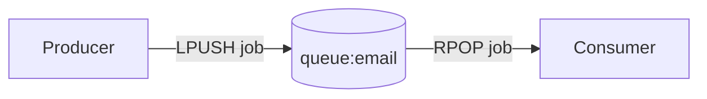
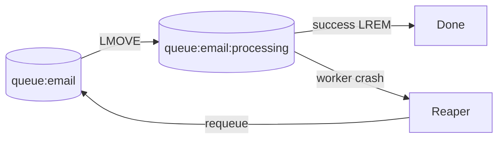
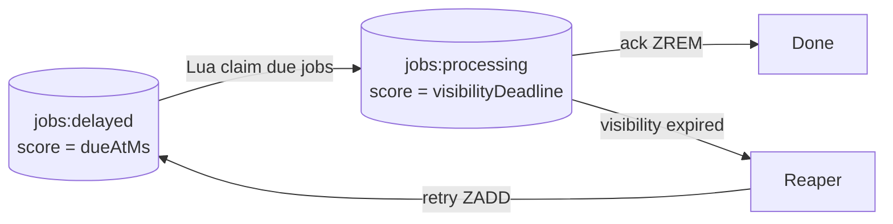
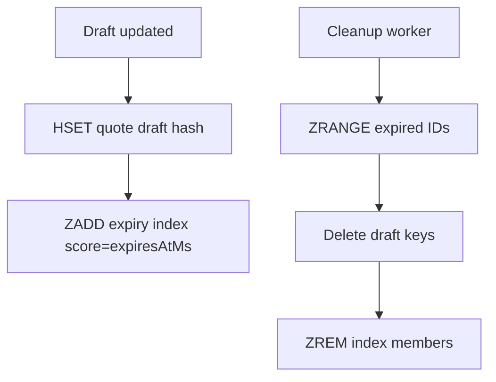

# Part 006 — Lists, Sets, and Sorted Sets: Queues, Membership, Ranking, Scheduling

Part 005 covered Redis Hashes as bounded object-like storage.
This part covers Redis collection structures that model **ordering, uniqueness, and score-based ordering**.

The three structures are:

```text
List       -> ordered sequence, duplicate values allowed
Set        -> unordered unique membership
Sorted Set -> unique membership ordered by numeric score
```

These three structures power many production patterns:

```text
job queues
deduplication
presence
feature membership
leaderboards
sliding windows
delayed jobs
expiry indexes
scheduler indexes
ranking tables
```

The goal is not to memorize commands.
The goal is to choose the right collection shape, keep it bounded, make failure behavior explicit, and implement safe Java access patterns.

---

## 1. Kaufman Skill Decomposition

The target skill:

> Given a collection-like requirement in a Java service, choose List, Set, Sorted Set, Stream, Hash, or database intentionally, then design its write/read/cleanup/failure behavior.

Sub-skills:

| Sub-skill | What you must be able to do |
|---|---|
| Structure selection | Choose List vs Set vs Sorted Set based on semantics |
| Queue modeling | Model FIFO/LIFO and understand reliability limits |
| Membership modeling | Represent uniqueness, dedupe, tags, and relation indexes |
| Score modeling | Use timestamps, ranks, priorities, deadlines, and composite members |
| Bound management | Prevent collection keys from growing forever |
| Java access | Implement repository methods with safe command usage |
| Atomic workflows | Use Lua for multi-step claim/ack/trim patterns |
| Failure modeling | Handle lost workers, duplicate jobs, stale membership, hot keys, and large keys |

A senior engineer does not ask “which Redis command?” first.
They ask:

```text
What invariant does the collection need to preserve?
```

---

## 2. Quick Decision Matrix

| Requirement | Best Redis structure | Why |
|---|---|---|
| FIFO queue with simple semantics | List | Maintains insertion order, cheap push/pop |
| Stack | List | Push and pop from same side |
| Unique membership | Set | Member exists or does not exist |
| Deduplicate event IDs | Set | Idempotency by membership |
| Random member sampling | Set | Native random member operations |
| Leaderboard | Sorted Set | Unique member ordered by score |
| Delayed job scheduler | Sorted Set | Score is due timestamp |
| Sliding window rate limit | Sorted Set | Score is request timestamp |
| Expiry index | Sorted Set | Score is expiration timestamp |
| Durable multi-consumer stream | Stream | Consumer groups and pending entries |
| Object fields | Hash | Named attributes of bounded object |

A compact mental model:

```text
Need order only?             List
Need uniqueness only?        Set
Need uniqueness + ordering?  Sorted Set
Need replay/consumer group?  Stream
Need object fields?          Hash
```

---

## 3. Redis Lists

A Redis List is an ordered sequence of string elements.
It supports pushing and popping from both ends.

```text
left/head                                      right/tail
  [ job-3, job-2, job-1, job-0 ]
```

Common commands:

| Command | Meaning |
|---|---|
| `LPUSH` | Push to left/head |
| `RPUSH` | Push to right/tail |
| `LPOP` | Pop from left/head |
| `RPOP` | Pop from right/tail |
| `BLPOP` | Blocking pop from left |
| `BRPOP` | Blocking pop from right |
| `LLEN` | List length |
| `LRANGE` | Read range |
| `LTRIM` | Keep only a range |
| `LMOVE` | Atomically move element between lists |
| `BLMOVE` | Blocking move between lists |

### 3.1 FIFO queue with List

A simple FIFO queue:

```redis
LPUSH queue:email job-1
LPUSH queue:email job-2
RPOP queue:email
```

Or:

```redis
RPUSH queue:email job-1
RPUSH queue:email job-2
LPOP queue:email
```

Pick one convention and document it.

```text
Producer: LPUSH
Consumer: RPOP
```

This gives FIFO behavior because older items move toward the right.



### 3.2 Blocking workers

Consumers can block until work arrives:

```redis
BRPOP queue:email 5
```

This avoids tight polling.

Operational notes:

| Concern | Recommendation |
|---|---|
| Timeout | Use finite timeout, not infinite, so worker can check shutdown signal |
| Payload | Store job ID or compact payload, not huge JSON blobs |
| Backpressure | Monitor `LLEN` |
| Poison jobs | Simple List queues do not solve this alone |
| Reliability | Use Streams or a reliable-queue pattern if jobs must not be lost |

### 3.3 Java worker sketch

```java
import io.lettuce.core.KeyValue;
import io.lettuce.core.api.sync.RedisCommands;
import java.time.Duration;

public final class EmailJobWorker implements Runnable {

    private final RedisCommands<String, String> redis;
    private final EmailJobHandler handler;
    private volatile boolean running = true;

    public EmailJobWorker(RedisCommands<String, String> redis, EmailJobHandler handler) {
        this.redis = redis;
        this.handler = handler;
    }

    @Override
    public void run() {
        while (running) {
            KeyValue<String, String> item = redis.brpop(5, "queue:email");
            if (item == null || !item.hasValue()) {
                continue;
            }

            String jobId = item.getValue();
            try {
                handler.handle(jobId);
            } catch (Exception ex) {
                // Do not silently drop failures in real systems.
                // Send to retry queue, dead-letter set, or a Stream-based pipeline.
                redis.lpush("queue:email:failed", jobId);
            }
        }
    }

    public void stop() {
        running = false;
    }
}
```

This is intentionally simple.
It is not a fully reliable job system.

---

## 4. Reliability Limits of List Queues

A basic pop removes the job before processing:

```redis
RPOP queue:email
```

Failure window:

```text
1. Worker pops job.
2. Redis removes job from queue.
3. Worker crashes before processing.
4. Job is lost unless stored elsewhere.
```

If losing a job is unacceptable, use one of these:

| Requirement | Better design |
|---|---|
| Simple retry but not perfect | List + processing list + reaper |
| Delayed retry | Sorted Set scheduler + worker |
| Multi-consumer durability | Redis Streams consumer groups |
| Business-critical workflow | Database/outbox/workflow engine plus Redis only as accelerator |

### 4.1 Processing-list pattern

Use `LMOVE` to atomically move a job from ready queue to processing queue.

```redis
LMOVE queue:email queue:email:processing RIGHT LEFT
```

Flow:



A worker claims work:

```redis
LMOVE queue:email queue:email:processing RIGHT LEFT
```

After success:

```redis
LREM queue:email:processing 1 job-123
```

But this still has problems:

- The processing list needs timestamps or external metadata.
- Reaper logic needs to know which jobs are stale.
- `LREM` can become expensive if the processing list is large.
- Duplicate processing is still possible.

For serious job processing, Streams are usually a better Redis-native fit.
Lists are good for simple bounded queues, local work buffers, and lightweight pipelines.

---

## 5. Lists for Recent Activity Windows

Lists are useful for keeping the most recent N items.

Example: last 100 viewed product IDs.

```redis
LPUSH user:{userId}:recent-products product-9
LTRIM user:{userId}:recent-products 0 99
```

Read:

```redis
LRANGE user:{userId}:recent-products 0 19
```

This is a bounded list pattern.

Important:

```text
LPUSH + LTRIM should be treated as one logical operation.
```

If consistency matters, use Lua or a transaction.

Lua version:

```lua
local key = KEYS[1]
local value = ARGV[1]
local maxLen = tonumber(ARGV[2])

redis.call('LPUSH', key, value)
redis.call('LTRIM', key, 0, maxLen - 1)
return redis.call('LLEN', key)
```

Use cases:

```text
recent products
recent searches
recent failed login IP hashes
recent validation errors
recent notification IDs
```

Do not use this for audit logs or compliance logs.
Redis Lists are not a compliance-grade source of truth.

---

## 6. Redis Sets

A Redis Set is an unordered collection of unique string members.

```text
feature:{featureId}:enabled-tenants
  tenant-a
  tenant-b
  tenant-c
```

Common commands:

| Command | Meaning |
|---|---|
| `SADD` | Add one or more members |
| `SREM` | Remove one or more members |
| `SISMEMBER` | Check membership |
| `SMISMEMBER` | Check multiple memberships |
| `SCARD` | Count members |
| `SMEMBERS` | Return all members |
| `SSCAN` | Incremental scan |
| `SINTER` | Intersection |
| `SUNION` | Union |
| `SDIFF` | Difference |
| `SPOP` | Remove random member |
| `SRANDMEMBER` | Read random member |

### 6.1 Membership pattern

Feature enabled for tenants:

```redis
SADD feature:advanced-pricing:tenants tenant-a tenant-b
SISMEMBER feature:advanced-pricing:tenants tenant-a
```

Java repository:

```java
public final class RedisFeatureMembershipRepository {

    private final RedisCommands<String, String> redis;

    public RedisFeatureMembershipRepository(RedisCommands<String, String> redis) {
        this.redis = redis;
    }

    public boolean isEnabledForTenant(String feature, String tenantId) {
        String key = "feature:" + feature + ":tenants";
        return redis.sismember(key, tenantId);
    }

    public void enableForTenant(String feature, String tenantId) {
        redis.sadd("feature:" + feature + ":tenants", tenantId);
    }

    public void disableForTenant(String feature, String tenantId) {
        redis.srem("feature:" + feature + ":tenants", tenantId);
    }
}
```

### 6.2 Deduplication pattern

Deduplicate event IDs for a bounded time window:

```redis
SADD dedupe:order-events:{yyyyMMddHH} event-123
EXPIRE dedupe:order-events:{yyyyMMddHH} 900
```

If `SADD` returns `1`, this is the first time the event appeared in that bucket.
If it returns `0`, it is a duplicate.

Java sketch:

```java
public boolean firstSeen(String bucketKey, String eventId, long ttlSeconds) {
    Long added = redis.sadd(bucketKey, eventId);
    redis.expire(bucketKey, ttlSeconds);
    return added != null && added == 1L;
}
```

But the `SADD` + `EXPIRE` sequence has a small failure window:

```text
SADD succeeds.
Application crashes before EXPIRE.
Set can live forever.
```

Use Lua for stronger lifecycle:

```lua
local key = KEYS[1]
local member = ARGV[1]
local ttl = tonumber(ARGV[2])

local added = redis.call('SADD', key, member)
redis.call('EXPIRE', key, ttl)
return added
```

### 6.3 Set as secondary index

Example: order IDs by customer.

```text
customer:{customerId}:open-orders
  order-1
  order-2
  order-3
```

Commands:

```redis
SADD customer:{customerId}:open-orders order-1
SREM customer:{customerId}:open-orders order-1
SMEMBERS customer:{customerId}:open-orders
```

This is fine only when cardinality is bounded.
If a customer can have millions of orders, this is not a safe hot-path `SMEMBERS` pattern.

Use:

```redis
SSCAN customer:{customerId}:open-orders 0 COUNT 100
```

or better, a database index/search system for pagination and filtering.

---

## 7. Set Algebra for Real Systems

Sets can answer useful questions cheaply when sets are bounded.

Example:

```text
user:{userId}:roles
  APPROVER
  SALES_ADMIN
  QUOTE_MANAGER

permission:approve-discount:roles
  APPROVER
  FINANCE_MANAGER
```

Check overlap:

```redis
SINTER user:{userId}:roles permission:approve-discount:roles
```

But be careful: role/permission checks on every request may be better represented as compact cached authorization context rather than repeated set algebra.

Good set algebra use cases:

```text
admin tooling
small feature flags
small cohort intersection
debugging and reconciliation
bounded tenant segments
```

Poor set algebra use cases:

```text
large user segmentation on every request
real-time analytics over huge sets
pagination by arbitrary filters
source-of-truth authorization decisions without auditability
```

---

## 8. Set Cardinality and Large-Key Risk

`SCARD` is safe for cardinality.
`SMEMBERS` can be dangerous for large sets.

Bad:

```redis
SMEMBERS tenant:big-tenant:all-users
```

This can return millions of members.

Better:

```redis
SSCAN tenant:big-tenant:all-users 0 COUNT 500
```

But if your normal application flow needs pagination, filtering, sorting, and stable page tokens, Redis Set is not enough.
Use a database/search index.

Rule:

```text
Use Sets for membership and bounded relation indexes.
Do not use Sets as your primary query engine.
```

---

## 9. Redis Sorted Sets

A Sorted Set is a set of unique members ordered by score.

```text
leaderboard:daily
  user-7  -> 9910
  user-2  -> 8820
  user-9  -> 1200
```

Properties:

```text
member is unique
score is numeric
ordering is by score
members with equal score are ordered lexicographically
```

Common commands:

| Command | Meaning |
|---|---|
| `ZADD` | Add or update member score |
| `ZSCORE` | Get member score |
| `ZINCRBY` | Increment score |
| `ZRANGE` | Read by rank, score, or lex range depending on options |
| `ZREVRANGE` | Older command style for reverse rank reads |
| `ZRANK` | Rank low-to-high |
| `ZREVRANK` | Rank high-to-low |
| `ZREM` | Remove member |
| `ZCARD` | Count members |
| `ZCOUNT` | Count score range |
| `ZPOPMIN` | Pop lowest-score members |
| `ZPOPMAX` | Pop highest-score members |
| `ZREMRANGEBYSCORE` | Remove score range |

Sorted Sets are the most versatile Redis structure after Strings and Hashes.
They are also easy to abuse.

---

## 10. Score Design

The score gives a Sorted Set its meaning.

Common score types:

| Use case | Score |
|---|---|
| Leaderboard | Points |
| Delayed job | Due timestamp in milliseconds |
| Rate limit | Request timestamp in milliseconds |
| Expiry index | Expiration timestamp |
| Priority queue | Priority number |
| Aging priority queue | Computed priority + time component |
| Recent activity | Activity timestamp |

### 10.1 Timestamp score

```redis
ZADD jobs:delayed 1783012441000 job-123
```

This means:

```text
job-123 becomes eligible at timestamp 1783012441000
```

### 10.2 Leaderboard score

```redis
ZINCRBY leaderboard:daily 50 user-98172
```

This means:

```text
increase user's score by 50
```

### 10.3 Tie handling

If multiple members have the same score, Redis orders by member lexicographically.
If that is unacceptable, encode a tie-breaker in the member or score model.

Example member:

```text
1783012441000:job-123
```

But avoid making score math unreadable.
For scheduling, duplicate scores are usually acceptable.

### 10.4 Score precision

Sorted Set scores are floating-point numbers.
Timestamp-in-milliseconds is safe for ordinary modern timestamps because it is below the exact integer limit of IEEE 754 double precision for now.
But do not pack too much information into the score.

Bad:

```text
score = timestampMs * 1000000 + priority * 1000 + shard
```

This can create precision and readability problems.

Better:

```text
score = dueAtMs
member = priority:jobId or jobId with metadata elsewhere
```

If priority is essential, use separate queues per priority or a carefully documented score scheme.

---

## 11. Leaderboard Pattern

Daily leaderboard:

```redis
ZINCRBY leaderboard:game:{yyyyMMdd} 100 user-1
ZINCRBY leaderboard:game:{yyyyMMdd} 70 user-2
ZINCRBY leaderboard:game:{yyyyMMdd} 30 user-3
```

Top 10 high-to-low:

```redis
ZRANGE leaderboard:game:{yyyyMMdd} 0 9 REV WITHSCORES
```

User rank high-to-low:

```redis
ZREVRANK leaderboard:game:{yyyyMMdd} user-1
```

TTL:

```redis
EXPIRE leaderboard:game:{yyyyMMdd} 604800
```

### 11.1 Java example

```java
import io.lettuce.core.ScoredValue;
import io.lettuce.core.Range;
import io.lettuce.core.api.sync.RedisCommands;
import java.util.List;

public final class RedisLeaderboardRepository {

    private final RedisCommands<String, String> redis;

    public RedisLeaderboardRepository(RedisCommands<String, String> redis) {
        this.redis = redis;
    }

    public double addScore(String leaderboardKey, String userId, double delta) {
        return redis.zincrby(leaderboardKey, delta, userId);
    }

    public List<ScoredValue<String>> top(String leaderboardKey, int limit) {
        return redis.zrevrangeWithScores(leaderboardKey, 0, limit - 1);
    }

    public Long rank(String leaderboardKey, String userId) {
        return redis.zrevrank(leaderboardKey, userId);
    }
}
```

### 11.2 Production notes

| Concern | Recommendation |
|---|---|
| Reset period | Use period in key name |
| Historical query | Persist final result to database/object storage |
| Cheating/fraud | Do not let Redis score be the only fraud-resistant source |
| Huge leaderboard | Page with rank ranges; avoid full reads |
| Multi-region | Define whether score update ordering matters |

---

## 12. Delayed Job Scheduler with Sorted Set

A delayed job is naturally modeled as:

```text
member = jobId
score  = dueAtMs
```

Add job:

```redis
ZADD jobs:delayed 1783012441000 job-123
```

Find due jobs:

```redis
ZRANGE jobs:delayed -inf 1783012441000 BYSCORE LIMIT 0 100
```

Remove after claim:

```redis
ZREM jobs:delayed job-123
```

But the two-step read/remove has a race.
Multiple workers can see the same job.
Use Lua to claim due jobs atomically.

### 12.1 Atomic claim Lua

```lua
local delayedKey = KEYS[1]
local processingKey = KEYS[2]
local now = tonumber(ARGV[1])
local limit = tonumber(ARGV[2])
local visibilityUntil = tonumber(ARGV[3])

local jobs = redis.call('ZRANGE', delayedKey, '-inf', now, 'BYSCORE', 'LIMIT', 0, limit)
for _, job in ipairs(jobs) do
  redis.call('ZREM', delayedKey, job)
  redis.call('ZADD', processingKey, visibilityUntil, job)
end
return jobs
```

This moves due jobs from delayed to processing.



### 12.2 Job metadata

Do not store huge payload as ZSet member.
Use job ID as member and store metadata elsewhere.

```text
jobs:delayed                     # ZSet: jobId -> dueAtMs
job:{jobId}:payload              # String/Hash/JSON with TTL
jobs:processing                  # ZSet: jobId -> visibilityDeadlineMs
```

This separates scheduling from payload.

### 12.3 When to avoid this

Do not build a full enterprise workflow engine from ZSets if you need:

```text
audit history
human approvals
complex compensation
multi-step state machine
exact transition log
cross-service transactional workflow
```

Use a workflow engine, database-backed job system, Kafka/RabbitMQ, or Redis Streams depending on the requirement.
Sorted Set scheduling is excellent for lightweight due-time selection.

---

## 13. Sliding Window Rate Limiter with Sorted Set

A precise sliding window can be modeled as:

```text
key    = rate:{subject}:{windowName}
member = unique request ID
score  = request timestamp in milliseconds
```

Algorithm:

```text
1. Remove entries older than window.
2. Count remaining entries.
3. If count < limit, add current request.
4. Set/refresh TTL.
5. Return allowed/denied.
```

This must be atomic.

Lua:

```lua
local key = KEYS[1]
local now = tonumber(ARGV[1])
local windowMs = tonumber(ARGV[2])
local limit = tonumber(ARGV[3])
local member = ARGV[4]
local ttlSeconds = tonumber(ARGV[5])

local minScore = now - windowMs
redis.call('ZREMRANGEBYSCORE', key, '-inf', minScore)

local count = redis.call('ZCARD', key)
if count >= limit then
  return {0, count}
end

redis.call('ZADD', key, now, member)
redis.call('EXPIRE', key, ttlSeconds)
return {1, count + 1}
```

Trade-offs:

| Dimension | Consequence |
|---|---|
| Accuracy | Precise per request |
| Memory | Stores one member per request in window |
| Cost | Cleanup and count per request |
| Hot key risk | High for popular subjects |
| Alternatives | Token bucket with counters, approximate counters, local pre-limit |

This is correct but can be expensive at very high QPS.
Part 017 will go deeper into rate limiting strategies.

---

## 14. Expiry Index with Sorted Set

Sometimes you need to find records whose expiration time has passed.
Redis key TTL deletes keys, but it does not give you an ordered query of “which items are due”.

Use a Sorted Set index:

```text
quote:draft:expiry-index
  quote-1 -> expiresAtMs
  quote-2 -> expiresAtMs
```

Add/update:

```redis
ZADD quote:draft:expiry-index 1783012441000 quote-1
```

Find expired:

```redis
ZRANGE quote:draft:expiry-index -inf 1783012441000 BYSCORE LIMIT 0 100
```

Cleanup:

```redis
ZREM quote:draft:expiry-index quote-1
DEL quote:{quote-1}:draft-state
```

Use Lua if the cleanup must be atomic per item.

Pattern:



This is useful for:

```text
draft quote expiration
temporary reservation cleanup
pending approval timeout
forgotten checkout cleanup
soft workflow deadline scanning
```

---

## 15. Presence with Sets and Sorted Sets

Presence has two different meanings:

```text
currently connected
recently active
```

Use Set for connected membership:

```redis
SADD room:{roomId}:connections connection-1
SREM room:{roomId}:connections connection-1
```

Use Sorted Set for last-seen:

```redis
ZADD user:presence:last-seen 1783012441000 user-98172
```

Query active within last 30 seconds:

```redis
ZRANGE user:presence:last-seen 1783012411000 +inf BYSCORE
```

Do not rely only on disconnect events.
Connections disappear without graceful cleanup.
Use heartbeat timestamps and cleanup thresholds.

---

## 16. Java Repository Design for Collections

Avoid exposing raw Redis commands across business logic.
Create domain repositories.

Bad:

```java
redis.zadd("jobs:delayed", dueAtMs, jobId);
```

Better:

```java
public interface DelayedJobScheduler {
    void schedule(JobId jobId, Instant dueAt);
    List<JobId> claimDueJobs(Instant now, int limit, Duration visibilityTimeout);
    void ack(JobId jobId);
    void retry(JobId jobId, Instant nextDueAt);
}
```

Implementation can use Sorted Sets, Streams, or database later without changing business logic.

### 16.1 Keep commands behind methods named by intent

| Redis command | Domain method |
|---|---|
| `SADD` | `markEventSeen(eventId)` |
| `SISMEMBER` | `hasSeenEvent(eventId)` |
| `ZADD` | `schedule(jobId, dueAt)` |
| `ZPOPMIN` | `claimLowestPriority(limit)` |
| `LPUSH` | `appendRecentActivity(activityId)` |
| `LTRIM` | hidden inside `appendRecentActivity` |

This keeps Redis a storage mechanism, not your domain language.

---

## 17. Bounded Collection Rules

Every Redis collection key needs a bound strategy.

| Structure | Bound strategy |
|---|---|
| List | `LTRIM`, TTL, max enqueue policy |
| Set | TTL, bucket by time, max cardinality, cleanup job |
| Sorted Set | `ZREMRANGEBYSCORE`, TTL, period keys, max rank trim |

Examples:

```redis
LTRIM user:{id}:recent-searches 0 99
EXPIRE dedupe:events:{yyyyMMddHH} 7200
ZREMRANGEBYSCORE rate:{userId}:api -inf 1783012145000
ZREMRANGEBYRANK leaderboard:daily 0 -10001
```

Production invariant:

```text
No Redis collection may grow forever unless it is explicitly approved as a capacity-managed index.
```

---

## 18. Hot Key and Sharding Patterns

Collection keys often become hot.

Example:

```text
leaderboard:global
```

Every score update hits one key.

Mitigations:

| Problem | Mitigation |
|---|---|
| High write QPS leaderboard | Shard by game/region/time bucket, merge periodically |
| Popular queue | Partition queue by shard/key range |
| Huge dedupe set | Bucket by time and shard |
| Large presence set | Partition by room/server/tenant |
| Hot rate limit key | Local pre-limit + Redis global limit, or subject sharding when valid |

Example sharded dedupe:

```text
dedupe:payment-events:{yyyyMMddHH}:00
dedupe:payment-events:{yyyyMMddHH}:01
dedupe:payment-events:{yyyyMMddHH}:02
```

Choose shard by stable hash of event ID.

Do not shard when exact global ordering is required unless you also design a merge model.

---

## 19. Multi-Key and Redis Cluster Constraints

Many collection workflows involve multiple keys:

```text
queue ready -> processing
job metadata -> scheduler index
session state -> recent activity list
```

In Redis Cluster, multi-key operations require keys to be in the same hash slot.
Use hash tags intentionally.

Example:

```text
job:{jobId}:payload
job:{jobId}:attempts
```

These two keys are co-located because `{jobId}` is the hash tag.

For a scheduler, however, this may not help because the scheduler index is global:

```text
jobs:delayed
job:{jobId}:payload
```

If a Lua script touches both, it may not be cluster-safe.

Options:

| Option | Trade-off |
|---|---|
| Keep scheduler per shard | More operational complexity, cluster-safe locality |
| Keep payload embedded in member | Simpler but payload size risk |
| Use database for payload | More durable and cluster-safe if Redis only stores IDs |
| Use Streams | Better for consumer group processing |

Cluster thinking must happen during data modeling, not after production traffic arrives.

---

## 20. Lists vs Streams for Queues

Lists can implement queues.
Streams are often better for durable multi-consumer event/job pipelines.

| Need | List | Stream |
|---|---|---|
| Simple FIFO | Good | Good |
| Blocking read | Good | Good |
| Consumer groups | No | Yes |
| Pending entries | Manual | Built-in |
| Replay | Manual | Built-in-ish by ID |
| Message IDs | Manual | Built-in |
| Operational simplicity | Simple | More concepts |
| Serious retry pipeline | Manual | Better fit |

Use Lists when:

```text
queue is simple
loss or duplicate is acceptable or externally handled
single-consumer or simple worker pool is enough
payload is small
operational scope is limited
```

Use Streams when:

```text
consumer groups matter
replay matters
pending entries matter
job processing status matters
multiple independent consumers need the same event
```

Part 007 covers Streams deeply.

---

## 21. Failure Modeling

### 21.1 List failure modes

| Failure | Result | Mitigation |
|---|---|---|
| Worker crashes after `RPOP` | Job lost | Use `LMOVE` processing list or Streams |
| Worker stuck after claim | Job never completes | Visibility timeout and reaper |
| Queue grows faster than workers | Memory pressure | Backpressure, autoscaling, reject policy |
| Poison job retries forever | Infinite churn | Retry count and dead-letter |
| Huge payload in list | Memory/network spike | Store job ID and payload elsewhere |

### 21.2 Set failure modes

| Failure | Result | Mitigation |
|---|---|---|
| `SADD` without TTL | Permanent dedupe garbage | Lua with `EXPIRE` |
| Unbounded set | Large key | Bucket, shard, TTL, database |
| `SMEMBERS` on huge set | Latency spike | Use `SSCAN` or different storage |
| Stale membership | Wrong authorization/feature decision | TTL/invalidation/source-of-truth check |

### 21.3 Sorted Set failure modes

| Failure | Result | Mitigation |
|---|---|---|
| Non-atomic due job claim | Duplicate processing | Lua claim or Streams |
| Old items never removed | Memory growth | `ZREMRANGEBYSCORE` cleanup |
| Score precision abuse | Wrong ordering | Keep score simple |
| Huge global ZSet | Hot key and memory pressure | Shard or periodize |
| Clock skew | Early/late scheduling | Use server-side time or bounded clock assumptions |

---

## 22. Observability

Metrics by structure:

### 22.1 Lists

```text
redis.queue.email.length
redis.queue.email.pop.latency
redis.queue.email.failed.count
redis.queue.email.processing.length
redis.queue.email.requeue.count
```

### 22.2 Sets

```text
redis.set.dedupe.cardinality
redis.set.dedupe.first_seen.count
redis.set.dedupe.duplicate.count
redis.set.membership.lookup.latency
redis.set.large_key.detected.count
```

### 22.3 Sorted Sets

```text
redis.zset.scheduler.delayed.count
redis.zset.scheduler.due.count
redis.zset.scheduler.claim.latency
redis.zset.scheduler.processing.count
redis.zset.scheduler.visibility_expired.count
redis.zset.leaderboard.cardinality
```

Also log key pattern, not raw full key when it may contain identifiers or sensitive data.

Example:

```json
{
  "event": "redis_zset_due_jobs_claimed",
  "keyPattern": "jobs:delayed:{shard}",
  "claimedCount": 100,
  "nowMs": 1783012441000
}
```

---

## 23. Production Recipes

### 23.1 Recent searches

```text
user:{userId}:recent-searches
```

Commands:

```redis
LPUSH user:{userId}:recent-searches "redis cluster"
LTRIM user:{userId}:recent-searches 0 19
EXPIRE user:{userId}:recent-searches 2592000
```

Use Lua to combine push/trim/expire.

### 23.2 Idempotency dedupe bucket

```text
idempotency:{service}:{yyyyMMddHH}:{shard}
```

Commands:

```redis
SADD idempotency:payment:2026070210:03 event-123
EXPIRE idempotency:payment:2026070210:03 7200
```

Use Lua to avoid missing TTL.

### 23.3 Leaderboard

```text
leaderboard:{gameId}:{yyyyMMdd}
```

Commands:

```redis
ZINCRBY leaderboard:game-1:20260702 25 user-7
ZRANGE leaderboard:game-1:20260702 0 9 REV WITHSCORES
```

### 23.4 Delayed retry

```text
retry:{pipeline}:delayed
```

Commands:

```redis
ZADD retry:quote-pricing:delayed 1783012441000 job-123
ZRANGE retry:quote-pricing:delayed -inf 1783012441000 BYSCORE LIMIT 0 100
```

Use Lua claim.

### 23.5 Online presence

```text
room:{roomId}:connections
user:presence:last-seen
```

Commands:

```redis
SADD room:{roomId}:connections connection-123
ZADD user:presence:last-seen 1783012441000 user-98172
```

Use heartbeat and cleanup.

---

## 24. Practice: Build Three Collection Components

Spend 90-120 minutes.

### Component A — Recent activity list

Implement:

```java
void addRecentActivity(UserId userId, ActivityId activityId);
List<ActivityId> recentActivities(UserId userId, int limit);
```

Constraints:

```text
max 100 activities
TTL 30 days
atomic LPUSH + LTRIM + EXPIRE
no duplicate removal required
```

### Component B — Event dedupe set

Implement:

```java
boolean firstSeen(EventId eventId, Instant eventTime);
```

Constraints:

```text
bucket by hour
shard by event ID hash
TTL 2 hours
SADD and EXPIRE must be atomic
```

### Component C — Delayed retry scheduler

Implement:

```java
void schedule(JobId jobId, Instant dueAt);
List<JobId> claimDue(Instant now, int limit, Duration visibilityTimeout);
void ack(JobId jobId);
void retry(JobId jobId, Instant nextDueAt);
```

Constraints:

```text
Sorted Set score = dueAtMs
claim must be atomic
processing set uses visibility deadline
payload is not stored in ZSet member
```

### Feedback questions

```text
What is the maximum size of each Redis key?
What happens if the worker crashes after claim?
What happens if Redis loses the collection?
What metrics show backlog, duplicates, and stale processing jobs?
Is this still valid under Redis Cluster?
```

---

## 25. Summary

Lists, Sets, and Sorted Sets are Redis collection primitives.
They become production-grade only when paired with clear invariants and cleanup rules.

Use this model:

```text
List       -> ordered sequence, simple queues, recent N items
Set        -> uniqueness, membership, dedupe, bounded relation indexes
Sorted Set -> score-ordered uniqueness, ranking, scheduling, expiry indexes, sliding windows
```

The two most important operational rules:

```text
1. Every collection needs a bound strategy.
2. Every multi-step collection workflow needs explicit failure handling.
```

Next, we move to Redis Streams, which are built for append-only event-like data, consumer groups, pending entries, replay, and more serious worker pipelines.

---

## References

- Redis Docs — Lists: https://redis.io/docs/latest/develop/data-types/lists/
- Redis Docs — LPUSH: https://redis.io/docs/latest/commands/lpush/
- Redis Docs — Sets: https://redis.io/docs/latest/develop/data-types/sets/
- Redis Docs — Sorted Sets: https://redis.io/docs/latest/develop/data-types/sorted-sets/
- Redis Docs — ZADD: https://redis.io/docs/latest/commands/zadd/
- Redis Docs — ZRANGE: https://redis.io/docs/latest/commands/zrange/
