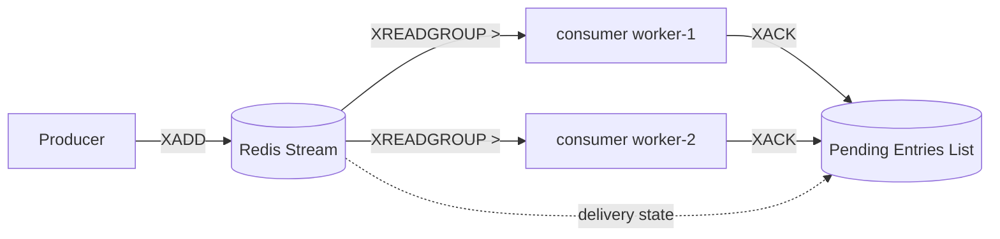
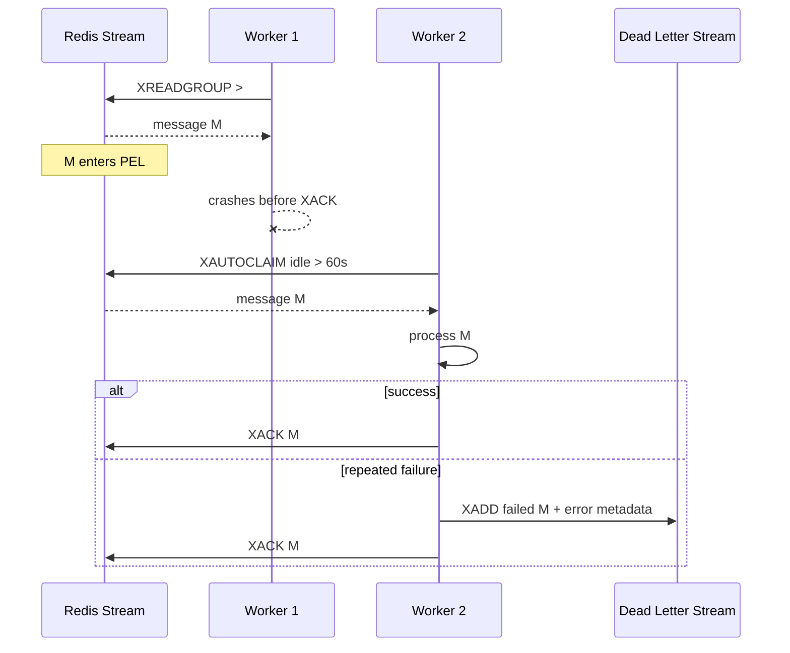
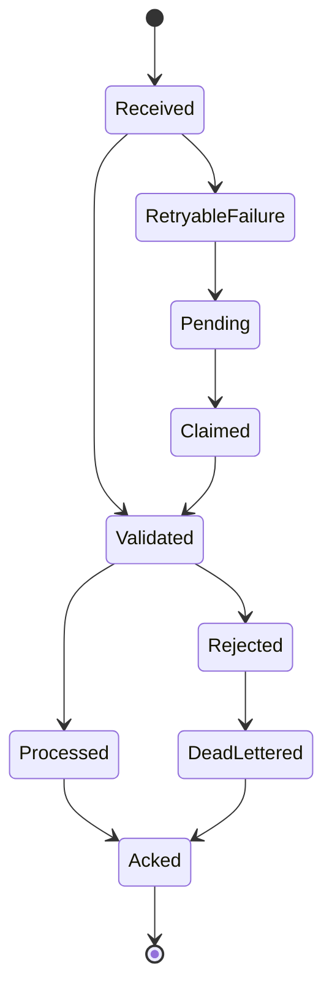
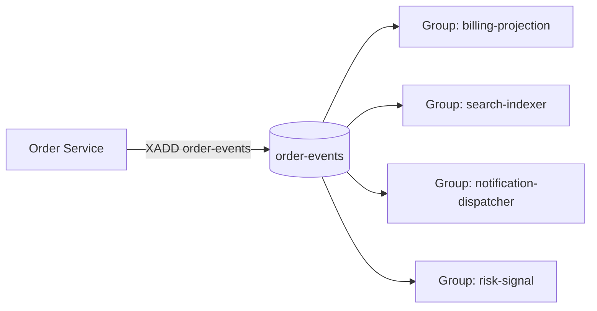
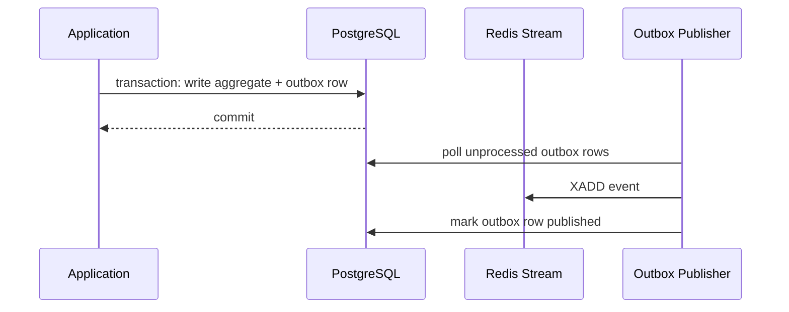

# Part 007 — Streams Deep Dive: Event Log, Consumer Group, Pending Entries, Replay

Part 006 covered Lists, Sets, and Sorted Sets.
Those structures are powerful, but when the requirement becomes:

```text
append event
consume independently
track acknowledgement
recover failed consumers
replay recent history
inspect pending work
```

then Redis Streams become the more natural Redis primitive.

A Redis Stream is not just a queue.
It is an **append-only log-like data structure** with message IDs, field-value entries, range reads, consumer groups, a pending entries list, explicit acknowledgement, and trimming.

The production question is not:

```text
Can Redis Streams replace Kafka?
```

The better question is:

```text
For this bounded workflow, do I need lightweight durable-ish stream processing inside Redis,
or do I need a full event streaming platform with long retention, partition governance,
large-scale replay, schema registry, ecosystem tooling, and independent storage scaling?
```

This part teaches Redis Streams as a practical Java engineering tool.

---

## 1. Kaufman Skill Decomposition

Target skill:

> Given a workflow that needs event-like delivery, choose Redis Streams intentionally, design the stream key model, write/read/ack/retry/dead-letter lifecycle, and operate it without unbounded memory, hidden duplicate processing, or unrecoverable pending messages.

Sub-skills:

| Sub-skill | What you must be able to do |
|---|---|
| Stream modeling | Choose stream key, message ID, fields, version, tenant boundary, retention |
| Producer design | Append with `XADD`, enforce max length, publish stable event envelopes |
| Consumer design | Use `XREAD` or `XREADGROUP` correctly |
| Consumer group design | Model competing consumers, independent groups, and ownership |
| Ack lifecycle | Understand when messages enter and leave the Pending Entries List |
| Replay | Re-read history by ID and support deterministic recovery |
| Retry | Claim idle pending messages with `XAUTOCLAIM` or `XCLAIM` |
| Poison handling | Move toxic messages to dead-letter streams without blocking healthy flow |
| Backpressure | Limit batch size, blocking wait, pending size, and handler concurrency |
| Java integration | Implement safe producer/consumer loops with Lettuce/Spring Data Redis style APIs |
| Operations | Monitor length, lag, pending entries, idle consumers, memory, and trimming |

Redis Streams are easy to start and easy to misuse.
A senior engineer treats them as a **workflow state machine**, not merely a command API.

---

## 2. The Mental Model

A stream contains ordered entries.
Each entry has:

```text
stream key
entry id
a set of field-value pairs
```

Example:

```bash
XADD order-events * \
  eventType OrderSubmitted \
  orderId ord-1001 \
  customerId cust-77 \
  schemaVersion 1 \
  occurredAt 2026-07-02T10:15:00Z
```

Redis returns an ID such as:

```text
1751441700000-0
```

The ID has two parts:

```text
milliseconds-sequence
```

Conceptually:

```text
1751441700000-0
|             |
|             sequence for same millisecond
milliseconds timestamp
```

Do not depend on stream IDs as business timestamps unless you intentionally accept server-time behavior.
For business events, include `occurredAt` as a field.

---

## 3. Stream vs List vs Pub/Sub vs Kafka

Redis gives several messaging-ish options.
They are not interchangeable.

| Need | Better Redis primitive | Why |
|---|---|---|
| Fire-and-forget live notification | Pub/Sub | Lowest ceremony, no persistence, no replay |
| Simple local queue with minimal reliability | List | `LPUSH`/`BRPOP` style queue |
| Delayed execution | Sorted Set | Score as scheduled time |
| Durable-ish recent event workflow | Stream | Append log, consumer group, ack, replay |
| Long-retention distributed event backbone | Kafka/Pulsar/etc. | Partition governance, retention, replay, ecosystem |

A useful heuristic:

```text
If missing the message is acceptable -> Pub/Sub may be enough.
If every item must be handled at least once -> Stream or external broker.
If replay/history is a product/platform requirement -> usually Kafka-like system.
If the workflow is bounded and Redis is already operationally accepted -> Stream may be a good fit.
```

Redis Streams are often excellent for:

```text
small-to-medium internal event fanout
background job pipelines
cache invalidation with replay
webhook delivery buffers
short-retention audit-ish operational events
real-time ingestion before batch flush
notification dispatch pipelines
retryable side effects
local stream bridge between services
```

They are usually not enough for:

```text
multi-day or multi-month canonical event log
enterprise event mesh
cross-team data contracts with schema registry
unbounded analytics ingestion
large replay by many independent historical consumers
strict ordering across arbitrary entities
exactly-once transactional processing
```

---

## 4. Basic Commands

### Append

```bash
XADD mystream * field1 value1 field2 value2
```

### Read from ID

```bash
XREAD COUNT 10 STREAMS mystream 0
```

Read new entries only:

```bash
XREAD BLOCK 5000 COUNT 10 STREAMS mystream $
```

`$` means:

```text
Only entries added after this command starts waiting.
```

That is useful for live tailing, but dangerous for recovery because old messages are skipped.

### Range query

```bash
XRANGE mystream - + COUNT 10
```

Reverse range:

```bash
XREVRANGE mystream + - COUNT 10
```

### Trim

```bash
XTRIM mystream MAXLEN ~ 100000
```

Approximate trimming with `~` is usually preferred for performance.

### Delete entry

```bash
XDEL mystream 1751441700000-0
```

Deleting an entry does not automatically mean your consumer group state is clean.
For normal processing, use acknowledgement.

---

## 5. Stream Entry Design

A stream entry is a field-value map.
The shape matters.

A weak event:

```bash
XADD order-events * orderId 123 status PAID
```

A production-oriented event:

```bash
XADD order-events MAXLEN ~ 1000000 * \
  eventId evt-01JZ8RE0A5QA4T8MZQWJR7MZ6F \
  eventType OrderPaymentCaptured \
  schemaVersion 3 \
  aggregateType Order \
  aggregateId ord-1001 \
  tenantId tenant-a \
  producer billing-service \
  occurredAt 2026-07-02T10:15:00.123Z \
  traceId 4bf92f3577b34da6a3ce929d0e0e4736 \
  payload '{"paymentId":"pay-777","amount":"149000","currency":"IDR"}'
```

Recommended envelope fields:

| Field | Purpose |
|---|---|
| `eventId` | Idempotency and correlation independent of Redis stream ID |
| `eventType` | Routing and handler selection |
| `schemaVersion` | Compatibility during evolution |
| `aggregateType` | Domain grouping |
| `aggregateId` | Entity identity |
| `tenantId` | Multi-tenant boundary and auditability |
| `producer` | Ownership and debugging |
| `occurredAt` | Domain/event time |
| `traceId` | Distributed tracing |
| `payload` | Structured body, commonly JSON |

Do not make handlers depend on a fragile positional payload.
Streams are field-value oriented; use that to make messages inspectable.

---

## 6. Key Design for Streams

A stream key is a routing and scaling decision.

Possible models:

```text
order-events
order-events:{tenant-a}
order-events:{tenant-a}:payments
service:billing:outbox
notification-dispatch:{region-apac}
```

### Single Global Stream

```text
stream: order-events
```

Pros:

```text
simple
single ordering scope
one place to inspect
simple consumer group setup
```

Cons:

```text
hot key risk
all tenants/workflows share backlog
harder isolation
limited horizontal distribution in Redis Cluster
```

### Per-Tenant Stream

```text
stream: order-events:{tenantId}
```

Pros:

```text
tenant isolation
clearer deletion/retention
smaller per-key streams
```

Cons:

```text
more keys
consumer orchestration becomes harder
must discover active tenant streams
```

### Per-Workflow Stream

```text
stream: billing:webhook-delivery
stream: fulfillment:shipment-events
stream: notification:email-dispatch
```

Pros:

```text
bounded operational responsibility
clear handler ownership
different retention per workflow
```

Cons:

```text
cross-workflow ordering not guaranteed
requires contract discipline
```

### Cluster Hash Tags

Redis Cluster places keys by hash slot.
If a Lua script or transaction needs multiple keys, use hash tags carefully:

```text
stream:order:{tenant-a}
dlq:order:{tenant-a}
retry:index:{tenant-a}
```

The part inside `{}` controls slot placement.
Do not overuse hash tags to force everything into one slot; that can create a hot shard.

---

## 7. Consumer Groups

Without consumer groups, each reader tracks its own last-read ID.
With consumer groups, Redis tracks delivery state for a group.

Create group:

```bash
XGROUP CREATE order-events billing-workers $ MKSTREAM
```

Meaning:

```text
stream: order-events
group: billing-workers
start at: $
create stream if missing: yes
```

Use `0` instead of `$` if the group should process existing history.

```bash
XGROUP CREATE order-events billing-workers 0 MKSTREAM
```

Read as a consumer in a group:

```bash
XREADGROUP GROUP billing-workers worker-1 COUNT 10 BLOCK 5000 STREAMS order-events >
```

The `>` means:

```text
Give me messages never delivered to any consumer in this group.
```

When a message is delivered through `XREADGROUP`, it enters the group Pending Entries List.
It remains pending until acknowledged:

```bash
XACK order-events billing-workers 1751441700000-0
```

Consumer group model:



Important invariant:

```text
Within one consumer group, a new message is assigned to one consumer at a time.
Across different consumer groups, each group receives its own independent view.
```

This means a stream can support fanout by using multiple groups:

```text
order-events
  group billing-projection
  group search-indexer
  group notification-dispatcher
  group fraud-signal-ingestion
```

Each group has independent delivery and acknowledgement state.

---

## 8. Pending Entries List

The Pending Entries List, often called PEL, is the state that makes consumer groups useful.

A message becomes pending when delivered:

```text
XREADGROUP -> pending
```

A message leaves pending when acknowledged:

```text
XACK -> no longer pending
```

A message stays pending when the worker crashes after receiving it but before `XACK`.

Inspect pending summary:

```bash
XPENDING order-events billing-workers
```

Detailed pending entries:

```bash
XPENDING order-events billing-workers - + 10
```

Typical fields include:

```text
message id
consumer name
idle time
delivery count
```

This is operationally critical.
A growing PEL usually means one of these:

```text
handler is failing
handler is too slow
workers crashed
ack is missing
poison messages block progress
consumer concurrency too high
external dependency is degraded
```

A stream with a large PEL is not healthy just because producers can still append.
Backlog and pending are different problems.

```text
Backlog: messages not yet delivered to the group.
Pending: messages delivered but not acknowledged.
```

---

## 9. Claiming Failed Work

If a consumer dies, its pending messages do not automatically become new messages.
Another consumer must claim them after they have been idle long enough.

Modern Redis supports `XAUTOCLAIM`:

```bash
XAUTOCLAIM order-events billing-workers worker-2 60000 0-0 COUNT 100
```

Meaning:

```text
stream: order-events
group: billing-workers
claiming consumer: worker-2
minimum idle time: 60 seconds
start scanning at: 0-0
batch: 100
```

High-level retry loop:

```text
1. Read new messages with XREADGROUP ... >
2. Process messages.
3. XACK successful messages.
4. Periodically XAUTOCLAIM old pending messages.
5. Retry claimed messages.
6. If delivery count exceeds threshold, move to DLQ and XACK original.
```

Failure recovery flow:



Do not immediately claim messages with tiny idle times.
That creates duplicate processing while the original worker may still be legitimately working.

Claiming threshold should consider:

```text
p99 handler time
external dependency p99
GC pause budget
network timeout
shutdown grace period
maximum acceptable duplicate delay
```

---

## 10. Processing Semantics

Redis Streams with consumer groups are normally used for **at-least-once** processing.

At-least-once means:

```text
A message may be delivered again if the worker fails before acknowledgement.
```

Therefore handlers must be idempotent.

Bad handler:

```text
on PaymentCaptured event:
  send receipt email
  XACK
```

If the worker sends the email and crashes before `XACK`, another worker may send another email.

Better handler:

```text
on PaymentCaptured event:
  claim idempotency key receipt:{eventId}
  if already processed -> XACK
  send receipt email
  persist receipt delivery record
  XACK
```

Example idempotency marker:

```bash
SET receipt-sent:evt-123 1 NX EX 2592000
```

If the side effect is external and non-idempotent, Redis Streams alone do not solve correctness.
You need domain-level idempotency, transactional outbox, fencing, unique constraints, or downstream idempotent APIs.

---

## 11. Stream Handler State Machine

A production consumer should be modeled explicitly.



Key transitions:

| Transition | Redis operation | Notes |
|---|---|---|
| Produce | `XADD` | Include envelope and bounded retention |
| Receive | `XREADGROUP` | Message enters PEL |
| Success | `XACK` | Message leaves PEL |
| Crash | none | Message stays pending |
| Recovery | `XAUTOCLAIM` | Ownership moves to new consumer |
| Poison | `XADD` to DLQ + `XACK` original | Avoid infinite retry loop |

This state machine prevents the common misconception that a consumer group is automatically self-healing.
It is not.
You must run the recovery path.

---

## 12. Java Producer Design

A Java producer should publish stable event envelopes.
The stream should not receive arbitrary domain object serialization without versioning.

Example domain event record:

```java
public record RedisStreamEvent(
        String eventId,
        String eventType,
        int schemaVersion,
        String aggregateType,
        String aggregateId,
        String tenantId,
        String producer,
        Instant occurredAt,
        String traceId,
        String payloadJson
) {}
```

Repository-style publisher:

```java
public interface RedisStreamPublisher {
    String publish(String streamKey, RedisStreamEvent event);
}
```

Pseudo-implementation shape:

```java
public final class OrderEventPublisher implements RedisStreamPublisher {

    private final RedisCommands<String, String> redis;
    private final String streamKey;

    public OrderEventPublisher(RedisCommands<String, String> redis, String streamKey) {
        this.redis = redis;
        this.streamKey = streamKey;
    }

    @Override
    public String publish(String streamKey, RedisStreamEvent event) {
        Map<String, String> body = Map.of(
                "eventId", event.eventId(),
                "eventType", event.eventType(),
                "schemaVersion", Integer.toString(event.schemaVersion()),
                "aggregateType", event.aggregateType(),
                "aggregateId", event.aggregateId(),
                "tenantId", event.tenantId(),
                "producer", event.producer(),
                "occurredAt", event.occurredAt().toString(),
                "traceId", event.traceId(),
                "payload", event.payloadJson()
        );

        // Actual Lettuce APIs vary by version and command interface.
        // The important design is: XADD with bounded retention and explicit envelope.
        return redis.xadd(streamKey, body);
    }
}
```

For production, wrap this with:

```text
command timeout
metric: publish latency
metric: publish failures
metric: payload size
metric: stream key
trace attributes
bounded stream length policy
```

Avoid letting application code call `XADD` directly from random places.
Use a repository/gateway so stream contracts are centralized.

---

## 13. Java Consumer Loop Design

A naive consumer loop:

```java
while (true) {
    var messages = readGroup();
    for (var message : messages) {
        handle(message);
        ack(message);
    }
}
```

A production consumer loop needs more structure:

```text
initialize group if missing
start live read loop
start pending-claim loop
limit batch size
limit handler concurrency
use bounded executor
apply shutdown flag
stop reading on shutdown
finish or abandon in-flight work
ack only after successful handling
DLQ poison messages
emit metrics
```

Pseudo-code:

```java
public final class StreamWorker implements Runnable {

    private final AtomicBoolean running = new AtomicBoolean(true);
    private final StreamConsumerClient client;
    private final EventHandler handler;
    private final DeadLetterPublisher deadLetters;

    @Override
    public void run() {
        ensureGroupExists();

        while (running.get()) {
            List<StreamMessage> batch = client.readNewMessages(
                    "billing-workers",
                    consumerName(),
                    Duration.ofSeconds(5),
                    50
            );

            for (StreamMessage message : batch) {
                processOne(message);
            }
        }
    }

    private void processOne(StreamMessage message) {
        try {
            handler.handle(message);
            client.ack(message);
        } catch (ValidationException e) {
            deadLetters.publish(message, e, "validation_failed");
            client.ack(message);
        } catch (RetryableException e) {
            // Do not ack. Let the pending recovery loop claim later.
            client.recordFailureMetric(message, e);
        } catch (Exception e) {
            // Decide whether unknown exceptions are retryable or DLQ-worthy.
            client.recordFailureMetric(message, e);
        }
    }

    public void stop() {
        running.set(false);
    }
}
```

The important rule:

```text
Ack is a business decision, not a finally block.
```

Do not do this:

```java
try {
    handler.handle(message);
} finally {
    ack(message); // dangerous
}
```

That turns failures into message loss.

---

## 14. Pending Recovery Loop

Run pending recovery separately from live consumption.

```java
public final class PendingRecoveryWorker implements Runnable {

    private final StreamConsumerClient client;
    private final EventHandler handler;
    private final DeadLetterPublisher deadLetters;
    private final Duration minIdleTime = Duration.ofMinutes(2);
    private final int maxDeliveryCount = 5;

    @Override
    public void run() {
        String cursor = "0-0";

        while (!Thread.currentThread().isInterrupted()) {
            AutoClaimResult result = client.autoClaim(
                    "billing-workers",
                    consumerName(),
                    minIdleTime,
                    cursor,
                    100
            );

            cursor = result.nextCursor();

            for (StreamMessage message : result.messages()) {
                if (message.deliveryCount() > maxDeliveryCount) {
                    deadLetters.publish(message, null, "max_delivery_exceeded");
                    client.ack(message);
                    continue;
                }

                try {
                    handler.handle(message);
                    client.ack(message);
                } catch (RetryableException e) {
                    // Leave pending again.
                    client.recordRetryFailure(message, e);
                } catch (Exception e) {
                    deadLetters.publish(message, e, "unexpected_error");
                    client.ack(message);
                }
            }

            sleepBrieflyIfCursorWrapped(cursor);
        }
    }
}
```

Recovery should be observable:

```text
claimed count
claimed age
delivery count distribution
DLQ count
handler success after claim
handler failure after claim
oldest pending age
```

If pending recovery is not monitored, your system may look healthy while silently accumulating unprocessed messages.

---

## 15. Dead-Letter Stream Design

A dead-letter queue is not a trash bin.
It is a diagnostic and remediation contract.

Recommended DLQ key:

```text
dlq:billing:order-events
```

DLQ entry fields:

```bash
XADD dlq:billing:order-events MAXLEN ~ 100000 * \
  originalStream order-events \
  originalId 1751441700000-0 \
  group billing-workers \
  consumer worker-2 \
  eventId evt-123 \
  eventType OrderPaymentCaptured \
  reason max_delivery_exceeded \
  errorClass java.net.SocketTimeoutException \
  errorMessage 'payment provider timeout' \
  failedAt 2026-07-02T10:30:00Z \
  payload '{...}'
```

DLQ rules:

```text
include original stream and ID
include reason category
include delivery count
include trace ID if available
include compact error information
preserve original payload
bound DLQ length
alert on rate, not just existence
provide replay/remediation tooling
```

Never build a DLQ without an owner.
A DLQ nobody inspects is just delayed data loss.

---

## 16. Trimming and Retention

Streams live in memory.
Unbounded streams are outages waiting to happen.

Common retention strategies:

| Strategy | Command shape | Use case |
|---|---|---|
| Max length approximate | `XADD key MAXLEN ~ N * ...` | Most common bounded stream |
| Explicit trim | `XTRIM key MAXLEN ~ N` | Scheduled cleanup |
| Min ID trim | `XTRIM key MINID ~ id` | Time-like retention by stream ID |
| Domain archive | Copy to database/object storage | Long-term audit/history |

Example:

```bash
XADD order-events MAXLEN ~ 1000000 * eventType OrderSubmitted orderId ord-1
```

Do not pick `MAXLEN` randomly.
Estimate:

```text
messages per second
average serialized entry size
required replay window
number of streams
available Redis memory
replication overhead
AOF/RDB persistence impact
```

Example capacity sketch:

```text
2,000 events/sec
average entry 700 bytes logical payload
retain 2 hours
2,000 * 7,200 = 14,400,000 events
14,400,000 * 700 bytes ~= 10 GB logical payload before overhead
```

This is already large for Redis.
The correct answer may be Kafka, database partitioning, object storage, or shorter Redis retention.

---

## 17. Ordering Model

Redis Streams preserve entry order within a stream key.
But processing order can be affected by:

```text
multiple consumers in a group
handler latency variation
retry and claim behavior
DLQ movement
multiple stream keys
Redis Cluster sharding
```

If strict per-order processing is required, model the key carefully.

Options:

### One Stream per Aggregate

```text
stream:order:{orderId}
```

Pros:

```text
strong per-aggregate ordering
small local history
```

Cons:

```text
many stream keys
hard worker orchestration
hard global scan
```

### One Stream per Workflow, Handler Enforces Per-Aggregate Lock

```text
stream:order-events
lock:order:{orderId}
```

Pros:

```text
simple stream topology
centralized processing
```

Cons:

```text
lock complexity
duplicate/timeout concerns
throughput impacted by hot aggregates
```

### One Stream per Shard

```text
stream:order-events:{shard-00}
stream:order-events:{shard-01}
...
```

Pros:

```text
bounded number of streams
parallelism by shard
stable routing by aggregateId hash
```

Cons:

```text
requires shard router
resharding complexity
```

For most Java service workflows, shard-by-aggregate is a pragmatic middle ground.

---

## 18. Backpressure

A stream can absorb events faster than consumers can process them.
That is not automatically good.
Backlog is deferred work.
Deferred work has memory, latency, and business consequences.

Backpressure controls:

```text
producer-side rate limits
bounded stream length
consumer COUNT size
consumer BLOCK duration
handler concurrency cap
connection pool limits
external dependency circuit breaker
retry delay
DLQ threshold
alert on lag and pending age
```

Consumer loop anti-pattern:

```java
while (true) {
    List<Message> messages = readCount(10_000);
    messages.parallelStream().forEach(handler::handle);
}
```

Problems:

```text
unbounded parallelism
external dependency overload
ack order confusion
huge memory spike in JVM
GC pressure
timeouts cause pending explosion
```

Better shape:

```text
COUNT 50
bounded executor size 8-32 depending on handler profile
bulkhead per downstream dependency
retryable failures left pending or scheduled carefully
handler timeout shorter than claim idle threshold
```

---

## 19. Multi-Group Fanout

Streams support independent consumer groups.
This is useful when different parts of the system need the same event.



Each group has its own:

```text
last delivered ID
pending entries
consumers
ack state
lag
```

This is powerful, but it also creates governance obligations:

```text
who owns each group?
what is each group's lag SLO?
what happens if one group is dead for 3 days?
can trimming delete data before a slow group consumes it?
who approves new groups?
```

Redis does not magically enforce organizational discipline.
You must define stream ownership.

---

## 20. Streams and the Transactional Outbox Pattern

A common mistake:

```text
write database row
XADD event to Redis
```

If the database write succeeds and `XADD` fails, the event is missing.
If `XADD` succeeds and the database transaction rolls back, the event is false.

For critical domain events, use an outbox.



Redis Streams can be the delivery substrate after the outbox.
They should not replace the atomicity of your primary database transaction.

For non-critical ephemeral workflows, direct `XADD` may be acceptable.
Make that decision explicit.

---

## 21. Idempotent Consumer Pattern

Use the event ID as the idempotency key.

```text
processed:{group}:{eventId}
```

Basic pattern:

```bash
SET processed:billing-workers:evt-123 1 NX EX 2592000
```

If `SET` returns success, process.
If it returns null, the event was already processed.

But be careful with ordering:

```text
SET idempotency marker before side effect:
  crash after marker before side effect -> side effect skipped forever

SET idempotency marker after side effect:
  crash after side effect before marker -> side effect may duplicate
```

Therefore the correct design depends on side-effect semantics.

Better for database writes:

```text
use unique constraint on event_id in the target table
process in database transaction
ack after commit
```

Better for external APIs:

```text
use provider's idempotency key when available
persist delivery attempt record
ack only after confirmed outcome
```

Redis idempotency markers are useful, but they are not a substitute for domain-level correctness.

---

## 22. Java Error Taxonomy

Classify handler failures.

| Failure type | Example | Action |
|---|---|---|
| Validation failure | missing required field | DLQ + ack |
| Schema unsupported | unknown `schemaVersion` | DLQ or park until deploy |
| Retryable dependency | timeout, 503 | leave pending or retry later |
| Permanent domain failure | invalid state transition | DLQ + ack after audit |
| Duplicate | idempotency marker exists | ack |
| Poison bug | handler always crashes | DLQ after threshold |
| Infrastructure failure | Redis/client/network | do not falsely ack |

A handler that catches all exceptions and returns success is a data-loss system.
A handler that retries forever without DLQ is a backlog-amplification system.

---

## 23. Schema Evolution

Streams can contain old and new messages at the same time.
Consumers must handle compatible versions.

Envelope:

```json
{
  "eventType": "OrderSubmitted",
  "schemaVersion": 2,
  "payload": {
    "orderId": "ord-1001",
    "customerId": "cust-77",
    "totalAmount": "149000",
    "currency": "IDR"
  }
}
```

Evolution rules:

```text
add optional fields first
never rename without compatibility layer
never change meaning under same schemaVersion
make consumers tolerant of unknown fields
keep old handlers until old messages are drained or expired
include version in metrics and DLQ
```

For internal systems, JSON may be enough.
For larger platforms, consider Avro/Protobuf + schema registry, but remember Redis stores bytes/strings; schema governance is outside Redis.

---

## 24. Observability

Minimum stream metrics:

```text
producer publish count
producer publish latency
producer publish failures
stream length
consumer group lag
pending count
oldest pending age
pending delivery count distribution
handler success count
handler failure count by type
ack latency
claim count
DLQ count
DLQ reason distribution
message payload size
consumer heartbeat/last seen
```

Useful Redis commands:

```bash
XLEN order-events
XINFO STREAM order-events
XINFO GROUPS order-events
XINFO CONSUMERS order-events billing-workers
XPENDING order-events billing-workers
```

Dashboards should separate:

```text
input rate
processing rate
backlog
pending
failure rate
retry rate
DLQ rate
memory usage
```

A single “Redis is up” metric is useless for Streams reliability.

---

## 25. Operational Runbook

### Symptom: Stream length keeps growing

Likely causes:

```text
consumer stopped
consumer too slow
new consumer group created at wrong offset
external dependency slow
producer spike
```

Actions:

```text
check XINFO GROUPS
check consumer process health
compare producer vs consumer rate
inspect oldest message age
scale consumers if safe
apply upstream throttling if needed
```

### Symptom: Pending count keeps growing

Likely causes:

```text
handlers fail before ack
ack code path missing
worker crashes
timeouts too short
poison messages
```

Actions:

```text
check XPENDING
inspect delivery count
check handler exceptions
run XAUTOCLAIM recovery
DLQ poison messages
fix ack semantics
```

### Symptom: Duplicate processing

Likely causes:

```text
worker crash after side effect before ack
idle claim threshold too low
handler timeout longer than claim threshold
manual replay
```

Actions:

```text
validate idempotency design
increase min idle claim threshold
align handler timeout and lease settings
add downstream idempotency keys
```

### Symptom: Messages disappear

Possible causes:

```text
stream trimming too aggressive
consumer group started at $
wrong stream key
handler acked on failure
manual XDEL
Redis data loss due persistence/replication config
```

Actions:

```text
check XTRIM/MAXLEN policy
check group creation ID
check deployment logs
check persistence and failover event
review handler finally blocks
```

---

## 26. Practice: Build a Reliable Webhook Dispatch Stream

Scenario:

```text
Your Java service must send webhooks to merchants when orders change.
Webhooks can fail temporarily.
You need retry, DLQ, and observability.
```

Design:

```text
stream: webhook:order-events
group: webhook-dispatchers
dlq: webhook:order-events:dlq
idempotency: webhook-delivery:{merchantId}:{eventId}
```

Producer entry:

```bash
XADD webhook:order-events MAXLEN ~ 500000 * \
  eventId evt-123 \
  eventType OrderStatusChanged \
  schemaVersion 1 \
  merchantId m-77 \
  orderId ord-1001 \
  occurredAt 2026-07-02T10:00:00Z \
  payload '{"status":"PAID"}'
```

Consumer behavior:

```text
read new messages
validate event
load merchant webhook endpoint
send webhook with eventId as idempotency key
ack on HTTP 2xx or known duplicate
leave pending on timeout/5xx
DLQ on 4xx config errors or max delivery exceeded
```

Metrics:

```text
webhook delivery latency
HTTP status distribution
pending count
oldest pending age
DLQ count by merchant
```

Acceptance tests:

```text
worker crash after read -> message is later claimed
worker crash after send before ack -> duplicate is suppressed by idempotency
merchant endpoint returns 500 -> message remains retryable
merchant endpoint returns 400 -> message goes to DLQ
stream reaches max length -> old entries are trimmed within retention expectation
```

---

## 27. Common Anti-Patterns

### Anti-pattern 1: Using Streams as Infinite Event Store

Redis is memory-first.
If you need long-term canonical history, use another storage layer.

### Anti-pattern 2: No Ack Discipline

Acking in `finally` loses failed messages.
Never do it.

### Anti-pattern 3: No Pending Recovery

Consumer groups do not automatically retry dead consumers.
You need claiming logic.

### Anti-pattern 4: No DLQ

A poison message can create endless retries and hide real throughput.

### Anti-pattern 5: Unbounded Message Size

Do not put giant documents in stream entries.
Store large payloads elsewhere and put references in the stream.

### Anti-pattern 6: Creating Consumer Names Randomly Forever

If every deploy creates new consumer names and never cleans old ones, `XINFO CONSUMERS` becomes noisy.
Use stable instance identity and cleanup dead consumers deliberately.

### Anti-pattern 7: Starting Group at `$` by Accident

`$` means future messages only.
If existing backlog matters, start at `0` or a known ID.

---

## 28. Decision Checklist

Use Redis Streams when most of these are true:

```text
retention window is short/bounded
Redis memory budget can handle backlog
consumer count is moderate
workflow benefits from ack/retry
Java service owns both producer/consumer contract
replay need is operational, not historical analytics
```

Prefer Kafka/RabbitMQ/database/outbox when:

```text
retention is long
many independent teams consume events
schema governance is critical
throughput is very high
backlog can be huge
you need broker-level delivery policies
routing/exchange semantics are central
strict durability is required
```

---

## 29. Mental Model Summary

Redis Streams provide:

```text
append-only entries
entry IDs
range reads
blocking reads
consumer groups
pending tracking
acknowledgement
claiming failed work
bounded trimming
```

They do not automatically provide:

```text
exactly-once processing
infinite retention
schema governance
transactional integration with your database
automatic poison-message handling
auto-retry without design
strong ordering under parallel consumers
```

The core invariant:

```text
A message is not done when read.
A message is done when the business side effect is safely completed and the message is acknowledged.
```

That one sentence prevents most Redis Stream mistakes.

---

## 30. References

- Redis Docs — Streams: https://redis.io/docs/latest/develop/data-types/streams/
- Redis Command — XADD: https://redis.io/docs/latest/commands/xadd/
- Redis Command — XREADGROUP: https://redis.io/docs/latest/commands/xreadgroup/
- Redis Command — XPENDING: https://redis.io/docs/latest/commands/xpending/
- Redis Command — XAUTOCLAIM: https://redis.io/docs/latest/commands/xautoclaim/
- Redis Command — XACK: https://redis.io/docs/latest/commands/xack/
