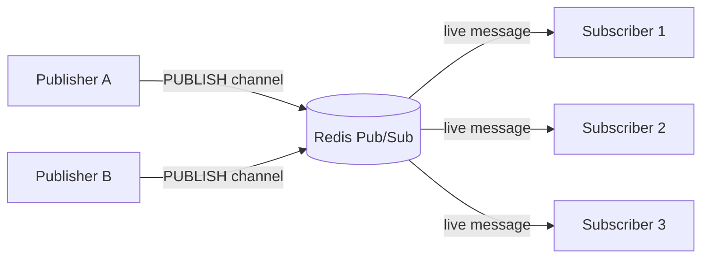
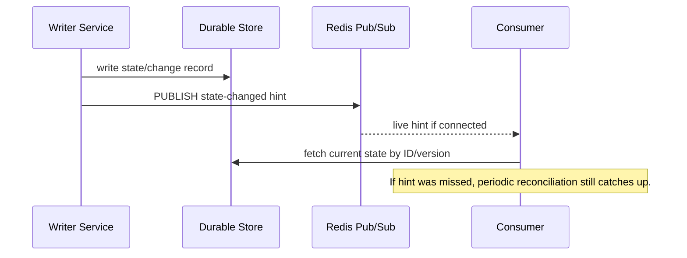
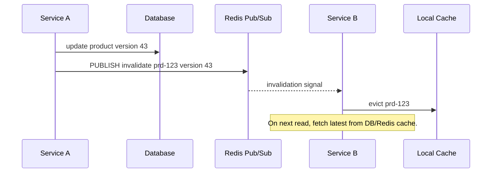
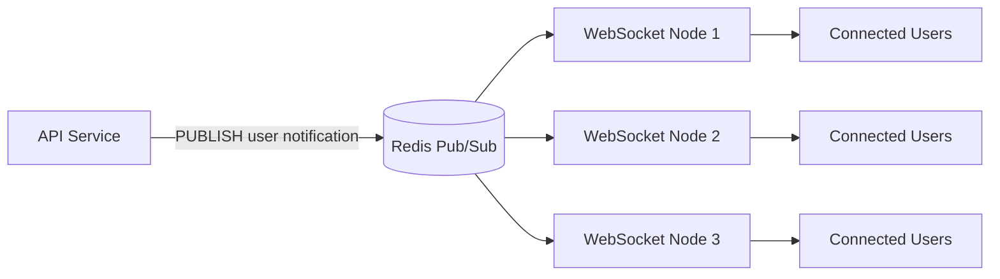
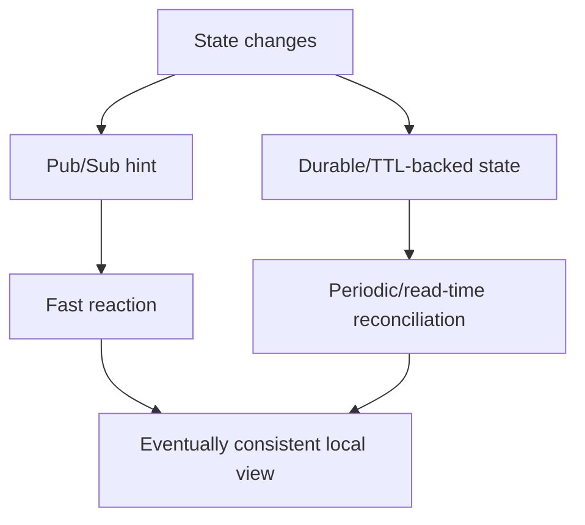

# Part 008 — Pub/Sub, Keyspace Notifications, and Ephemeral Messaging

Part 007 covered Redis Streams for durable-ish, replayable, acknowledged workflows.
This part covers Redis Pub/Sub and keyspace notifications.

Redis Pub/Sub is a **live signal bus**.
It is not a queue.
It is not a durable broker.
It does not retain messages for disconnected subscribers.
It is useful precisely because it is simple and low ceremony.

The production skill is knowing when that simplicity is acceptable.

---

## 1. Kaufman Skill Decomposition

Target skill:

> Given a real-time notification requirement in a Java system, decide whether Redis Pub/Sub, keyspace notifications, Streams, or another broker is appropriate, then implement Redis Pub/Sub without accidentally depending on durability, replay, or exactly-once delivery.

Sub-skills:

| Sub-skill | What you must be able to do |
|---|---|
| Delivery semantics | Explain at-most-once behavior and its consequences |
| Channel design | Name channels, pattern channels, tenant channels, and invalidation channels safely |
| Subscriber lifecycle | Handle reconnect, resubscribe, duplicate node instances, and graceful shutdown |
| Java integration | Use dedicated subscriber connections and non-blocking handlers |
| Cache invalidation | Use Pub/Sub as a signal, not as the source of truth |
| Keyspace notifications | Enable and consume key events intentionally |
| Failure modeling | Design for missed messages, subscriber downtime, and network disconnects |
| Operational control | Monitor subscriber count, handler lag, publish rate, and reconcilers |
| Hybrid pattern | Combine durable state/Streams with Pub/Sub notification when needed |

A senior engineer does not ask:

```text
Can I use Pub/Sub to send messages?
```

They ask:

```text
What happens if the subscriber is offline exactly when this message is published?
```

If the answer is unacceptable, Pub/Sub alone is the wrong primitive.

---

## 2. Pub/Sub Mental Model

Redis Pub/Sub has three concepts:

```text
publisher
channel
subscriber
```

Publisher:

```bash
PUBLISH notifications:tenant-a '{"type":"ORDER_UPDATED","orderId":"ord-1"}'
```

Subscriber:

```bash
SUBSCRIBE notifications:tenant-a
```

Pattern subscriber:

```bash
PSUBSCRIBE notifications:*
```

Flow:



There is no message storage in the channel.
A subscriber either receives the message while connected or misses it.

Core invariant:

```text
Pub/Sub message delivery is an optimization for immediacy, not a correctness boundary.
```

---

## 3. Delivery Semantics: At-Most-Once

Redis Pub/Sub uses at-most-once delivery.

Meaning:

```text
A published message may be delivered once, or not delivered at all.
It will not be retried by Redis if the subscriber misses it.
```

Miss scenarios:

```text
subscriber process is down
network disconnect occurs
subscriber is reconnecting
handler throws and drops message
client output buffer overflows
Redis failover interrupts connection
subscriber subscribed to wrong channel
```

Therefore Pub/Sub is appropriate for:

```text
cache invalidation hints
live UI notifications that can be reconciled
presence updates
local process wakeups
low-value telemetry fanout
best-effort cluster coordination
```

Pub/Sub alone is not appropriate for:

```text
payment processing
order fulfillment
audit logs
security-critical events
workflow steps that must happen
long-running job queues
state changes with no reconciliation path
```

The safe design pattern:

```text
Store durable state somewhere.
Publish a Pub/Sub signal to wake live consumers.
On reconnect, consumers reconcile from durable state.
```

---

## 4. Pub/Sub vs Streams

| Dimension | Pub/Sub | Streams |
|---|---|---|
| Persistence | No | Yes, while stream entry retained |
| Replay | No | Yes by ID/range/group |
| Consumer acknowledgement | No | Yes with consumer groups |
| Missed messages | Lost | Can be recovered if retained |
| Fanout | All live subscribers | Independent consumer groups or normal reads |
| Operational complexity | Low | Medium |
| Best use | Live signal | Retryable workflow/event buffer |

Decision shortcut:

```text
Need to know later what happened? Use Streams or durable storage.
Need only to wake someone now? Pub/Sub may be enough.
```

Hybrid pattern:



In this pattern, Pub/Sub does not carry correctness.
The database/change table/version key carries correctness.

---

## 5. Channel Design

Channels are strings.
Poor channel design causes security leakage, noisy subscriptions, and operational confusion.

Bad channel:

```text
updates
```

Better channels:

```text
cache-invalidate:product:{productId}
cache-invalidate:tenant:{tenantId}
realtime:tenant:{tenantId}:user:{userId}
presence:tenant:{tenantId}
config-changed:service:{serviceName}
```

Recommended channel dimensions:

| Dimension | Example | Reason |
|---|---|---|
| Domain | `order`, `product`, `config` | Ownership |
| Purpose | `invalidate`, `notify`, `presence` | Semantics |
| Tenant | `tenant-a` | Isolation |
| Scope | `user`, `room`, `service` | Fanout control |
| Version | `v1` when needed | Migration safety |

Example:

```text
pubsub:v1:cache-invalidate:catalog:tenant-a
pubsub:v1:presence:tenant-a:room-123
pubsub:v1:config:pricing-service
```

Do not put sensitive data in channel names.
Treat channel names as observable operational metadata.

---

## 6. Payload Design

A Pub/Sub payload should be small and self-describing.

Weak payload:

```json
{"id":"123"}
```

Better payload:

```json
{
  "messageId": "msg-01JZ8X0C2F3FS9Z4F9T1",
  "type": "PRODUCT_CACHE_INVALIDATED",
  "schemaVersion": 1,
  "tenantId": "tenant-a",
  "entityType": "Product",
  "entityId": "prd-123",
  "version": 42,
  "publishedAt": "2026-07-02T11:00:00Z",
  "traceId": "4bf92f3577b34da6a3ce929d0e0e4736"
}
```

But do not make the payload too large.
For Pub/Sub, prefer:

```text
identity
version
reason
traceability
```

Instead of:

```text
entire aggregate document
large binary payload
sensitive PII
critical state that exists nowhere else
```

The subscriber should usually fetch current state from the source of truth.

---

## 7. Java Subscriber Lifecycle

A Pub/Sub subscriber is long-lived.
Design it like an infrastructure component, not a request handler.

Lifecycle:

```text
create dedicated connection
subscribe to channels/patterns
receive messages
hand off to bounded executor
handle reconnect
resubscribe after reconnect
stop gracefully
close connection
```

Do not process slow business logic directly inside the Redis client callback if it blocks the subscription thread/event loop.

Bad shape:

```java
listener.onMessage(channel, message -> {
    slowHttpCall(message);      // blocks subscriber path
    updateDatabase(message);    // may block for seconds
});
```

Better shape:

```java
listener.onMessage(channel, message -> {
    if (!executor.offer(() -> handleMessage(channel, message))) {
        metrics.incrementDropped("subscriber_executor_full");
        // For Pub/Sub, dropping is acceptable only if reconciliation exists.
    }
});
```

Use a bounded executor.
An unbounded executor converts Pub/Sub spikes into JVM memory pressure.

---

## 8. Publisher Design in Java

A publisher should be a small gateway.

```java
public interface DomainSignalPublisher {
    void publishCacheInvalidated(CacheInvalidationSignal signal);
}
```

Payload record:

```java
public record CacheInvalidationSignal(
        String messageId,
        String type,
        int schemaVersion,
        String tenantId,
        String entityType,
        String entityId,
        long version,
        Instant publishedAt,
        String traceId
) {}
```

Gateway shape:

```java
public final class RedisCacheInvalidationPublisher implements DomainSignalPublisher {

    private final RedisCommands<String, String> redis;
    private final ObjectMapper objectMapper;
    private final String channelPrefix;

    @Override
    public void publishCacheInvalidated(CacheInvalidationSignal signal) {
        String channel = channelPrefix + ":" + signal.tenantId();
        String payload = toJson(signal);

        long subscribers = redis.publish(channel, payload);

        metrics.counter("redis_pubsub_publish_total", "channel", channel).increment();
        metrics.timer("redis_pubsub_publish_latency", "channel", channel).record(...);
        metrics.gauge("redis_pubsub_last_subscriber_count", subscribers);
    }

    private String toJson(CacheInvalidationSignal signal) {
        try {
            return objectMapper.writeValueAsString(signal);
        } catch (JsonProcessingException e) {
            throw new IllegalArgumentException("Invalid Pub/Sub payload", e);
        }
    }
}
```

`PUBLISH` returns the number of clients that received the message.
Do not treat that count as a durability guarantee.
It only tells you how many subscribers were connected to that Redis node/channel at publish time.

---

## 9. Cache Invalidation Pattern

Redis Pub/Sub is commonly used for cache invalidation across JVM instances.

Problem:

```text
Service instance A updates Product prd-123.
Instance B has prd-123 in local Caffeine cache.
Instance B must invalidate its local cache quickly.
```

Pattern:



Payload:

```json
{
  "type": "PRODUCT_INVALIDATED",
  "tenantId": "tenant-a",
  "entityId": "prd-123",
  "version": 43,
  "reason": "PRICE_CHANGED"
}
```

Failure model:

```text
If B is connected, it evicts quickly.
If B is disconnected, it misses the signal.
Therefore B must not rely only on Pub/Sub for correctness.
```

Correctness supports:

```text
short local cache TTL
versioned cache keys
read-time version check
periodic reconciliation
write-through central Redis cache invalidation
```

Production invariant:

```text
Pub/Sub improves freshness latency.
It does not replace TTL or version correctness.
```

---

## 10. Versioned Invalidation

Versioned invalidation is safer than blind invalidation.

Local cache value:

```java
public record CachedProduct(Product product, long version, Instant loadedAt) {}
```

Signal:

```json
{
  "entityId": "prd-123",
  "version": 43
}
```

Subscriber logic:

```java
void onInvalidation(Signal signal) {
    CachedProduct current = localCache.getIfPresent(signal.entityId());
    if (current == null) {
        return;
    }

    if (current.version() <= signal.version()) {
        localCache.invalidate(signal.entityId());
    }
}
```

Why this matters:

```text
messages can arrive out of expected application context
multiple updates may happen rapidly
local cache may already have newer data
blind invalidation can cause unnecessary stampede
```

For very high-write entities, combine:

```text
TTL jitter
versioned keys
request coalescing
stale-while-revalidate
```

---

## 11. Presence Pattern

Presence is naturally ephemeral.
Pub/Sub can be useful because missing one presence event is often acceptable if state has TTL.

State keys:

```text
presence:user:{tenantId}:{userId} -> connection metadata, TTL 60s
presence:room:{tenantId}:{roomId} -> set of user IDs, TTL/cleanup
```

Signal channel:

```text
pubsub:v1:presence:{tenantId}:{roomId}
```

On WebSocket connect:

```bash
SET presence:user:tenant-a:user-7 '{"node":"ws-3","connectedAt":"..."}' EX 60
SADD presence:room:tenant-a:room-1 user-7
PUBLISH pubsub:v1:presence:tenant-a:room-1 '{"type":"JOINED","userId":"user-7"}'
```

On heartbeat:

```bash
EXPIRE presence:user:tenant-a:user-7 60
```

On disconnect:

```bash
DEL presence:user:tenant-a:user-7
SREM presence:room:tenant-a:room-1 user-7
PUBLISH pubsub:v1:presence:tenant-a:room-1 '{"type":"LEFT","userId":"user-7"}'
```

If disconnect event is missed, TTL eventually cleans the presence key.
This is a good fit for Pub/Sub because correctness is backed by expiring state.

---

## 12. WebSocket Fanout Pattern

A common architecture:



Each WebSocket node subscribes to relevant channels.
When it receives a message, it sends to local connected sockets.

For user-specific messages:

```text
pubsub:v1:user-notification:{tenantId}:{userId}
```

For room messages:

```text
pubsub:v1:room:{tenantId}:{roomId}
```

Important boundary:

```text
If notification must be delivered eventually, persist it first.
Then use Pub/Sub only to wake currently connected WebSocket nodes.
```

Reliable notification flow:

```text
1. Insert notification row/status into database.
2. Publish Pub/Sub hint with notification ID.
3. WebSocket node receives hint.
4. Node fetches notification by ID.
5. Node sends to connected user.
6. Client acknowledgement updates notification delivery state if needed.
7. On reconnect, client fetches missed notifications from database.
```

---

## 13. Keyspace Notifications Mental Model

Keyspace notifications let clients receive Pub/Sub messages when Redis keys are affected by operations.

Examples:

```text
a key expired
a key was deleted
a key received LPUSH
a key received SET
a key was evicted
```

They are delivered through Pub/Sub channels.
Therefore they inherit Pub/Sub limitations.

Core rule:

```text
Keyspace notifications are observation hints, not a reliable audit log.
```

They are useful for:

```text
local cache invalidation experiments
session expiry hints
debugging key lifecycle
best-effort cleanup triggers
reactive dashboards
```

They are risky for:

```text
billing triggers
legal audit
security enforcement
must-run workflows after expiration
critical job scheduling
```

If an expiration must trigger a critical action, prefer an explicit scheduler, stream, sorted set, database job table, or external workflow engine.

---

## 14. Enabling Keyspace Notifications

Keyspace notifications are controlled by `notify-keyspace-events`.

Check current config:

```bash
CONFIG GET notify-keyspace-events
```

Enable keyevent expired notifications:

```bash
CONFIG SET notify-keyspace-events Ex
```

Meaning:

```text
E -> keyevent channel notifications
x -> expired events
```

Subscribe to expired events in database 0:

```bash
SUBSCRIBE __keyevent@0__:expired
```

Example received payload:

```text
session:tenant-a:user-7
```

Keyspace vs keyevent style:

```text
__keyspace@0__:mykey     -> channel names the key, payload names the event
__keyevent@0__:expired   -> channel names the event, payload names the key
```

Example:

```bash
PSUBSCRIBE __keyevent@0__:expired
```

Be careful enabling broad notifications in production.
More notifications mean more Pub/Sub traffic and more client processing.

---

## 15. Notification Classes

The configuration string controls which event families Redis emits.
Common flags include:

| Flag | Meaning |
|---|---|
| `K` | Keyspace events, published with key in channel |
| `E` | Keyevent events, published with event in channel |
| `g` | Generic commands such as `DEL`, `EXPIRE`, `RENAME` |
| `$` | String commands |
| `l` | List commands |
| `s` | Set commands |
| `h` | Hash commands |
| `z` | Sorted set commands |
| `t` | Stream commands |
| `x` | Expired events |
| `e` | Evicted events |
| `A` | Alias for common event classes |

Example broad config:

```bash
CONFIG SET notify-keyspace-events KEA
```

This is convenient for development, but often too noisy for production.
Prefer the narrowest set that supports the use case.

Examples:

```bash
# only expired keyevent notifications
CONFIG SET notify-keyspace-events Ex

# generic keyevent notifications, e.g. DEL/EXPIRE
CONFIG SET notify-keyspace-events Eg

# list command keyspace notifications
CONFIG SET notify-keyspace-events Kl
```

---

## 16. Session Expiry Hint Pattern

Scenario:

```text
When a user session expires, a service wants to update an online dashboard.
```

Key:

```text
session:tenant-a:user-7
```

Set session:

```bash
SET session:tenant-a:user-7 '{"userId":"user-7"}' EX 1800
```

Subscribe:

```bash
SUBSCRIBE __keyevent@0__:expired
```

Handler:

```java
void onExpired(String expiredKey) {
    if (!expiredKey.startsWith("session:")) {
        return;
    }

    SessionKey key = SessionKey.parse(expiredKey);
    dashboardSignals.publishSessionExpired(key.tenantId(), key.userId());
}
```

Failure model:

```text
If subscriber is down, it misses expiry notification.
If Redis evicts key before TTL expiry, event type may differ.
If notification config changes, handler stops receiving events.
```

Therefore this is acceptable for dashboard hints.
It is not acceptable as the only logout/security mechanism.

---

## 17. Expiration Is Not a Scheduler

Using key expiry as a scheduler is tempting:

```bash
SET job:123 payload EX 300
# wait for expired event to run job
```

This is fragile.

Problems:

```text
expiration notifications are Pub/Sub hints
subscriber downtime loses events
expiry timing is not an exact scheduler guarantee
expired key payload is gone unless stored elsewhere
eviction and deletion behave differently
failover/restart behavior must be understood
```

Better delayed job patterns:

```text
Sorted Set with score = runAt timestamp
Redis Stream with retry metadata
database job table
workflow engine
message broker with delay support
```

Keyspace expiry notifications are fine for:

```text
best-effort cleanup
UI update
metrics
local side cache cleanup
```

They are not reliable job scheduling.

---

## 18. Reconciliation Pattern

Every Pub/Sub or keyspace-notification system that matters should have reconciliation.

Example: cache invalidation.

```text
Pub/Sub path:
  receive invalidation -> evict local cache quickly

Reconciliation path:
  local cache TTL expires
  read-time version check detects stale value
  scheduled refresh checks version table
```

Example: WebSocket notifications.

```text
Pub/Sub path:
  live user receives notification immediately

Reconciliation path:
  on reconnect, client fetches notifications after last seen ID
```

Example: presence.

```text
Pub/Sub path:
  JOINED/LEFT event updates UI immediately

Reconciliation path:
  presence keys have TTL and room membership is periodically cleaned
```

Pattern diagram:



If there is no reconciliation path, Pub/Sub loss becomes correctness loss.

---

## 19. Subscriber Scaling

Redis Pub/Sub broadcasts to all matching subscribers.
This differs from competing consumer queues.

If three service instances subscribe to the same channel:

```text
all three receive the message
```

That is correct for local cache invalidation.
It is wrong for single-worker job processing.

For jobs, use:

```text
Streams consumer group
List queue with reliability caveats
external broker
```

For fanout, Pub/Sub is appropriate:

```text
each app instance must update local state
each WebSocket node may have relevant local clients
each cache node needs invalidation signal
```

Pattern subscriptions can be powerful:

```bash
PSUBSCRIBE pubsub:v1:cache-invalidate:catalog:*
```

But pattern subscriptions increase routing work and can accidentally subscribe to too much.
Use precise channels where possible.

---

## 20. Cluster and Deployment Considerations

In Redis Cluster, Pub/Sub behavior has special topology considerations depending on Redis version and client support.
Java clients may need topology-aware handling.

Practical guidelines:

```text
understand whether your client uses normal Pub/Sub or sharded Pub/Sub
use a client that supports your Redis deployment topology
keep subscriber connections separate from command connections
verify resubscription behavior during failover
chaos test reconnect and missed-message reconciliation
```

For high-scale channel fanout, consider:

```text
channel cardinality
subscriber count
message rate
payload size
client output buffer limits
Redis node CPU/network
cross-node forwarding behavior
```

Pub/Sub is simple at small scale.
At very high fanout, network and subscriber processing dominate.

---

## 21. Java Connection Model

Pub/Sub usually requires a dedicated connection because a subscribed connection is in subscription mode.
Do not reuse the same connection for normal commands unless your client explicitly supports the mode safely.

Recommended shape:

```text
Redis command connection pool
Redis pub/sub subscriber connection
Redis pub/sub publisher command connection
```

In a Spring-ish application:

```text
RedisConnectionFactory
  -> RedisTemplate for commands
  -> RedisMessageListenerContainer for subscriptions
```

In Lettuce-ish application:

```text
StatefulRedisConnection for commands
StatefulRedisPubSubConnection for pub/sub
RedisPubSubListener for callbacks
```

Do not let slow handlers block the Redis I/O thread.
Always hand off to application-controlled execution when work is non-trivial.

---

## 22. Backpressure and Drop Policy

Pub/Sub has no durable backlog.
Your subscriber must choose a drop policy when overloaded.

Possible policies:

| Policy | Use case | Risk |
|---|---|---|
| Drop newest | low-value telemetry | latest signal may be missed |
| Drop oldest | UI updates | old state may be irrelevant |
| Coalesce by key | cache invalidation | requires map/buffer logic |
| Trigger full reconciliation | invalidation storm | heavier recovery load |
| Fail fast process | strict internal service | causes restart loops if abused |

For cache invalidation, coalescing is often good:

```text
multiple invalidations for product prd-123 -> one eviction is enough
```

For WebSocket live updates, dropping may be acceptable if client resyncs.

For critical events, do not use Pub/Sub alone.

---

## 23. Cache Invalidation Storms

A bulk update can publish millions of invalidation messages.
That can overload Redis, subscribers, and local caches.

Better bulk invalidation approaches:

### Namespace Version Bump

Instead of invalidating each key:

```text
product:tenant-a:version -> 44
```

Local cache key includes version:

```text
product:{tenantId}:{version}:{productId}
```

Publish one signal:

```json
{
  "type": "CATALOG_NAMESPACE_VERSION_CHANGED",
  "tenantId": "tenant-a",
  "version": 44
}
```

### Prefix Epoch

Keep an epoch per domain:

```text
cache-epoch:tenant-a:catalog -> 20260702-01
```

Effective cache key:

```text
catalog:{tenantId}:{epoch}:product:{productId}
```

Old keys expire naturally.
This trades memory for lower invalidation fanout.

### Coalesced Debounce

Buffer invalidation IDs for a short window:

```text
collect product IDs for 100-500ms
publish compact batch
```

Use carefully; batching adds latency and complexity.

---

## 24. Security and Multi-Tenant Boundaries

Pub/Sub messages can leak data if channel design is sloppy.

Rules:

```text
include tenant scope in channel names
avoid sensitive values in channel names
avoid PII in payloads
validate subscriber authorization outside Redis if needed
use Redis ACLs to restrict channel access where supported
separate environments and tenants when risk requires it
```

Example risky channel:

```text
user:alice@example.com:password-reset
```

Better:

```text
pubsub:v1:user-notification:tenant-a:user-7
```

Payload should contain minimal data:

```json
{
  "type": "USER_NOTIFICATION_AVAILABLE",
  "notificationId": "ntf-123"
}
```

Subscriber fetches details from authorized application API/store.

---

## 25. Observability

Minimum Pub/Sub metrics:

```text
publish count by channel family
publish latency
publish error count
subscriber connected gauge
resubscribe count
message received count
message handler success/failure count
handler latency
executor queue depth
executor rejected count
message decode failure count
last message timestamp by channel family
```

Useful Redis commands:

```bash
PUBSUB CHANNELS
PUBSUB NUMSUB channel1 channel2
PUBSUB NUMPAT
```

For keyspace notifications, track:

```text
notification receive rate by event type
ignored key count
handler failure count
expired key processing latency
notification config drift
```

Alert examples:

```text
subscriber disconnected > 60 seconds
handler failure rate > 1%
executor rejection > 0 for 5 minutes
publish failures > 0
no invalidation messages seen for unusually long period while writes continue
```

Remember: absence of Pub/Sub messages can mean no activity or a broken subscription.
Correlate with producer-side metrics.

---

## 26. Testing Strategy

Test beyond happy path.

### Unit Tests

```text
payload serialization/deserialization
channel naming
version comparison
handler filtering
invalid payload behavior
```

### Integration Tests

```text
publisher sends to expected channel
subscriber receives message
pattern subscription matches intended channels
keyspace notification fires when enabled
subscriber reconnects and resubscribes
```

### Failure Tests

```text
subscriber down during publish -> message missed
subscriber handler throws -> reconciliation still correct
executor full -> drop policy is applied
Redis restart/failover -> subscriber reconnects
bulk invalidation -> subscriber does not OOM
```

A correct Pub/Sub design should pass this test:

```text
Turn off the subscriber for 10 minutes.
Keep producing state changes.
Turn the subscriber back on.
The system should become correct again through reconciliation.
```

If not, Pub/Sub is carrying too much correctness.

---

## 27. Anti-Patterns

### Anti-pattern 1: Pub/Sub as Job Queue

If only one worker should process each message, Pub/Sub is wrong because all subscribers receive it.
Use Streams consumer groups or a proper queue.

### Anti-pattern 2: Pub/Sub as Audit Log

Messages are not retained.
Use database, object storage, Kafka, or Streams with explicit retention.

### Anti-pattern 3: No Reconnect Handling

Long-running subscribers will disconnect eventually.
If resubscription is not tested, production will test it for you.

### Anti-pattern 4: Slow Callback Handler

Blocking the subscriber callback causes message handling delays and client instability.
Hand off to bounded execution.

### Anti-pattern 5: Keyspace Expiry as Critical Scheduler

Expiry notifications are best-effort observations.
Use an explicit scheduler for critical jobs.

### Anti-pattern 6: Payload Contains Full Sensitive Entity

Pub/Sub payloads are easy to log and hard to govern.
Publish IDs and versions instead.

### Anti-pattern 7: Invalidation Without Version or TTL

A missed invalidation can leave stale cache forever.
Use TTL, versioning, or reconciliation.

---

## 28. Practice: Cross-Instance Cache Invalidation

Build this exercise in a Java service with two local instances.

Requirement:

```text
When instance A updates a product, instance B must evict local cache within seconds.
If B misses the message, stale data must not live forever.
```

Design:

```text
Source of truth: PostgreSQL product table with version column
Distributed cache: Redis String/Hash product cache with TTL
Local cache: Caffeine with 1-5 minute TTL
Pub/Sub channel: pubsub:v1:cache-invalidate:catalog:{tenantId}
Payload: entityId + version + reason
```

Update flow:

```text
1. Update database product and increment version.
2. Delete or update Redis distributed cache.
3. Publish invalidation signal.
4. Other instances evict local cache if current version <= signal version.
```

Subscriber flow:

```text
1. Decode payload.
2. Validate tenant/entity/version.
3. Evict local cache entry if stale.
4. Record metric.
```

Reconciliation:

```text
local cache TTL
read-time version check for sensitive reads
scheduled sample validation comparing local version to DB/Redis version
```

Test cases:

```text
B receives invalidation -> evicts immediately
B offline during invalidation -> stale value disappears by TTL
two invalidations arrive rapidly -> newer version wins
invalid payload -> ignored and counted
executor saturated -> coalesced invalidation or reconciliation triggered
```

---

## 29. Practice: Presence with TTL and Pub/Sub

Requirement:

```text
Show online users in a collaboration room.
Updates should be fast, but occasional missed events are acceptable.
```

Design:

```text
presence:user:{tenantId}:{userId} -> metadata, TTL 60s
presence:room:{tenantId}:{roomId} -> Set of user IDs
pubsub:v1:presence:{tenantId}:{roomId} -> live JOINED/LEFT/HEARTBEAT_MISSED signal
```

Important cleanup:

```text
heartbeat refreshes user TTL
room set is periodically reconciled against user presence keys
expired user keys may emit best-effort notification
UI periodically refreshes full room presence
```

Why this works:

```text
Pub/Sub gives low-latency UI hints.
TTL-backed presence keys provide eventual cleanup.
Periodic reconciliation handles missed notifications.
```

---

## 30. Decision Checklist

Use Pub/Sub when:

```text
message loss is acceptable or reconcilable
all live subscribers should receive the message
low latency matters more than durability
payload is small
subscriber logic is fast or safely handed off
```

Use Streams when:

```text
messages must be processed at least once
consumers need acknowledgement
failed work must be claimed/retried
replay is needed within a retention window
competing consumers should divide work
```

Use external broker/platform when:

```text
retention is long
routing semantics are complex
many teams consume independently
delivery guarantees are central
message volume is high
operational ecosystem matters
```

Use database/job table when:

```text
workflow must be transactionally coupled with domain state
auditability is required
human remediation is important
queries over job state are needed
```

---

## 31. Mental Model Summary

Redis Pub/Sub provides:

```text
live broadcast
simple channels
pattern subscriptions
low operational ceremony
excellent cache-invalidation signaling
useful real-time fanout
```

It does not provide:

```text
message persistence
replay
acknowledgement
competing consumer delivery
exactly-once processing
reliable scheduling
critical workflow guarantees
```

Keyspace notifications provide:

```text
best-effort observation of Redis key events through Pub/Sub
```

They do not provide:

```text
reliable audit log
critical expiration trigger
strong workflow scheduler
```

The core production invariant:

```text
Pub/Sub may wake a consumer, but durable state must tell the consumer what is true.
```

If you remember only one thing from this part, remember that.

---

## 32. References

- Redis Docs — Pub/Sub: https://redis.io/docs/latest/develop/pubsub/
- Redis Docs — Keyspace Notifications: https://redis.io/docs/latest/develop/pubsub/keyspace-notifications/
- Redis Command — PUBLISH: https://redis.io/docs/latest/commands/publish/
- Redis Command — SUBSCRIBE: https://redis.io/docs/latest/commands/subscribe/
- Redis Command — PSUBSCRIBE: https://redis.io/docs/latest/commands/psubscribe/
- Redis Command — PUBSUB: https://redis.io/docs/latest/commands/pubsub/
