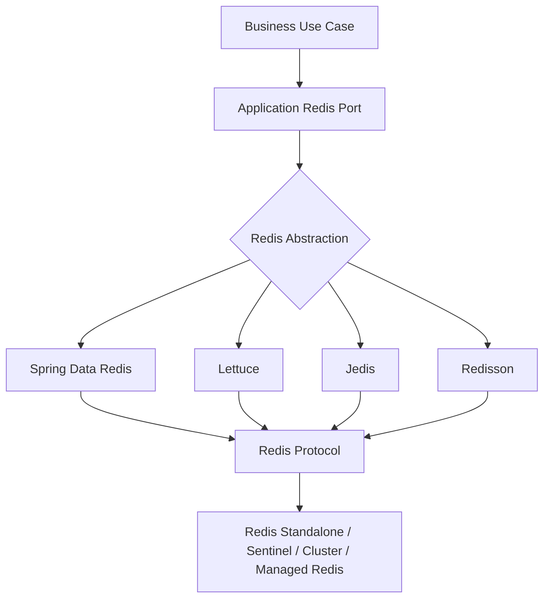
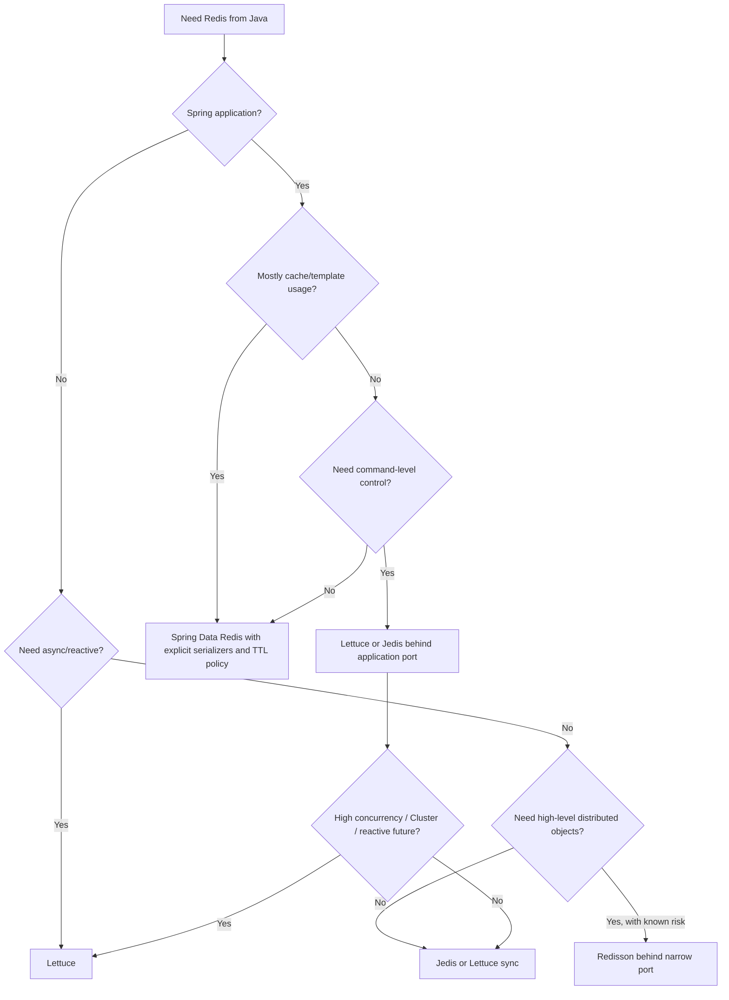
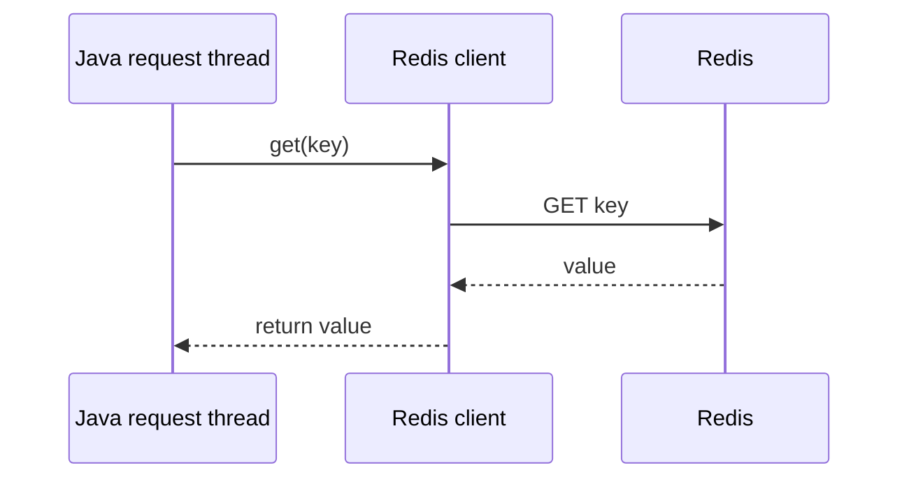
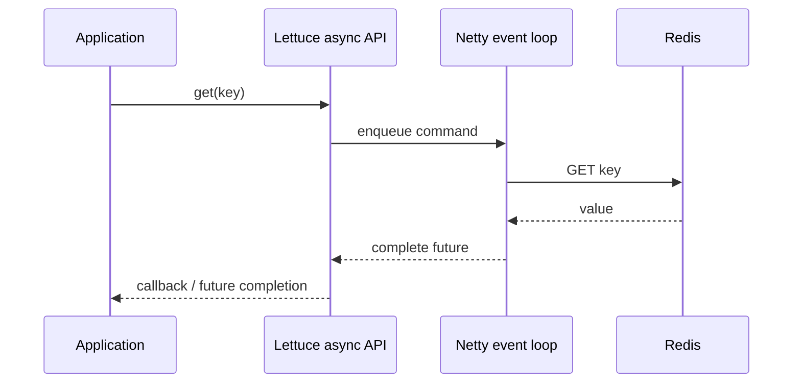
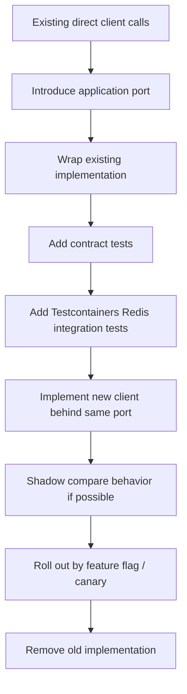
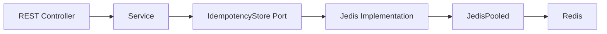
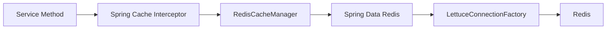
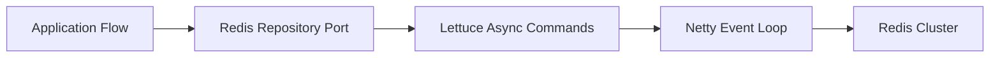
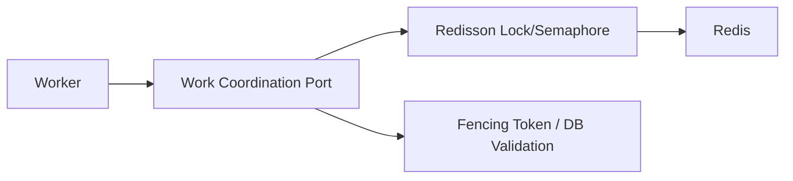

# Part 009 — Java Client Landscape: Jedis, Lettuce, Spring Data Redis, Redisson

Parts 001–008 built the Redis mental model and the core Redis data structure vocabulary.
This part moves into the Java integration layer.

The most common Redis production mistake in Java systems is not choosing the "wrong" client.
It is choosing a client without understanding what the client is hiding.

A Redis client is not just a dependency.
It defines:

- how commands are executed;
- how connections are shared;
- how timeouts are enforced;
- how reconnect behaves during failure;
- how cluster topology is discovered;
- how values are serialized;
- how much Redis behavior leaks into application code;
- how much operational visibility you retain.

The goal of this part is to make client selection a deliberate engineering decision.

---

## 1. Kaufman Skill Decomposition

Target skill:

> Given a Java service requirement, choose the Redis client abstraction that fits the workload, consistency boundary, topology, team capability, and operational risk — then justify the choice clearly.

Sub-skills:

| Sub-skill | What you must be able to do |
|---|---|
| Execution model | Distinguish synchronous, asynchronous, and reactive Redis usage |
| Connection model | Understand shared connections, pools, dedicated connections, and blocking-command boundaries |
| Abstraction model | Know when low-level commands are safer than high-level convenience APIs |
| Serialization model | Choose value encoding intentionally and avoid Java native serialization as a default |
| Topology model | Know how the client handles standalone, Sentinel, Cluster, TLS, and managed Redis |
| Failure model | Predict behavior during timeout, reconnect, failover, partial write, and command retry |
| Performance model | Use batching/pipelining without overloading Redis or hiding latency problems |
| Observability model | Expose metrics, command latency, error classes, pool state, and command mix |
| Migration model | Move between clients or abstractions without rewriting business logic everywhere |

A top engineer does not ask only:

```text
Which Java Redis client is fastest?
```

They ask:

```text
Which client makes the failure modes of my workload explicit enough that I can operate it safely?
```

---

## 2. The Java Redis Client Stack

A Java service usually accesses Redis through one of four layers:



Think in layers:

| Layer | Responsibility |
|---|---|
| Business use case | Session lookup, quota check, idempotency, leaderboard update, stream consumption |
| Application Redis port | Your own interface that expresses business intent |
| Client abstraction | Lettuce, Jedis, Spring Data Redis, Redisson |
| Protocol execution | RESP command execution, pipelining, reconnect, topology handling |
| Redis topology | Standalone, Sentinel, Cluster, Redis Cloud, ElastiCache, Memorystore, Azure Cache |

The important architectural move is the **application Redis port**.

Do not scatter client-specific calls across business code.
For example, avoid this:

```java
@Service
public class CheckoutService {
    private final RedisTemplate<String, Object> redisTemplate;

    public void checkout(String orderId) {
        redisTemplate.opsForValue().set("checkout:" + orderId, "processing");
        // business logic mixed with Redis implementation details
    }
}
```

Prefer this:

```java
public interface CheckoutAttemptStore {
    boolean registerAttempt(String orderId, Duration ttl);
    void markCompleted(String orderId, Duration ttl);
}
```

Then implement the port with Lettuce, Jedis, or Spring Data Redis.
This keeps Redis usage deliberate, testable, and replaceable.

---

## 3. The Four Main Options

### 3.1 Jedis

Jedis is a straightforward Java client with a synchronous programming model.
It maps closely to Redis commands and is easy to reason about in imperative services.

Good fit:

- synchronous Java services;
- simple Redis command usage;
- teams that prefer explicit pooling;
- low abstraction overhead;
- migration from older Redis Java codebases;
- small-to-medium throughput workloads where blocking threads are acceptable.

Weak fit:

- reactive stacks;
- very high concurrency with limited platform threads;
- workloads that need async command composition;
- systems where connection usage is not carefully controlled.

Mental model:

```text
application thread -> Jedis call -> socket write/read -> application thread waits
```

This is simple.
That simplicity is often valuable.
But simple does not mean free.
Every Redis call occupies a Java thread until the command returns or times out.

### 3.2 Lettuce

Lettuce is a Netty-based Redis client supporting synchronous, asynchronous, and reactive APIs.
It is often the default underlying driver for Spring Data Redis in modern Spring Boot applications.

Good fit:

- services needing async Redis calls;
- reactive applications;
- high-concurrency workloads;
- Redis Cluster/Sentinel usage;
- shared connections for non-blocking commands;
- topology-aware managed Redis deployments;
- richer client-side configuration.

Weak fit:

- teams unfamiliar with async/reactive failure modes;
- codebases that accidentally block Netty/event-loop threads;
- workloads using blocking Redis commands on shared connections;
- business code that treats async retries as harmless.

Mental model:

```text
application thread -> Lettuce command dispatch -> Netty event loop -> Redis -> future/reactive signal
```

Lettuce can expose sync commands too, but sync Lettuce is still built on the asynchronous engine.
That means configuration and failure behavior are still governed by the underlying async client model.

### 3.3 Spring Data Redis

Spring Data Redis is an abstraction layer over Redis access.
It provides `RedisTemplate`, `StringRedisTemplate`, repository support, cache abstraction integration, serializers, transactions integration, pub/sub support, and reactive Redis access.

Good fit:

- Spring applications;
- cache abstraction with `@Cacheable`, `@CachePut`, `@CacheEvict`;
- teams already using Spring Boot configuration conventions;
- services needing consistent serialization and bean-level configuration;
- simple key-value/hash/list/set/zset operations without direct protocol plumbing.

Weak fit:

- Redis-heavy systems where command-level behavior must be explicit;
- advanced Lua/function workflows where abstraction adds friction;
- cases where default serialization or cache naming is not controlled;
- teams assuming annotations automatically solve consistency.

Mental model:

```text
business code -> Spring abstraction -> serializer -> RedisConnectionFactory -> client driver -> Redis
```

Spring Data Redis is convenient, but convenience increases the distance between business code and Redis command semantics.
That distance must be managed.

### 3.4 Redisson

Redisson provides high-level distributed Java objects and services backed by Redis: maps, locks, semaphores, queues, topics, executor-like constructs, and more.

Good fit:

- teams needing high-level Redis-backed primitives;
- distributed lock/lease convenience where correctness requirements are understood;
- Java object-style APIs;
- replacing local concurrent data structures with distributed variants in limited cases.

Weak fit:

- teams that treat distributed objects like local objects;
- correctness-critical coordination without fencing tokens or external validation;
- systems where hidden Redis commands make performance/debugging difficult;
- use cases where Redis data model should stay explicit.

Mental model:

```text
Java object facade -> Redisson protocol behavior -> Redis data structures/scripts/pubsub
```

Redisson can be valuable, but it is dangerous when it makes distributed systems feel local.
Remote state is not local memory.
A network round trip is not a method call.
A Redis lock is not a JVM monitor.

---

## 4. Comparison Matrix

| Dimension | Jedis | Lettuce | Spring Data Redis | Redisson |
|---|---:|---:|---:|---:|
| Primary style | Synchronous | Sync, async, reactive | Spring abstraction | High-level distributed objects |
| Learning curve | Low | Medium | Medium | Medium to high |
| Command visibility | High | High | Medium | Low to medium |
| Async support | Limited / not primary | Strong | Via reactive support | Supported internally / API-specific |
| Reactive support | No primary model | Yes | Yes | Not the main reason to choose it |
| Spring Boot fit | Good | Excellent | Excellent | Good |
| Cluster support | Yes | Strong | Depends on driver | Yes |
| Sentinel support | Yes | Strong | Depends on driver | Yes |
| Serialization control | Manual | Codec-based/manual | Serializer-based | Codec-based/object abstraction |
| Best for | Simple imperative Redis | High-concurrency Redis | Spring cache/template integration | Distributed object convenience |
| Biggest risk | Thread/pool exhaustion | Async misuse, reconnect assumptions | Hidden serialization/cache semantics | Treating remote objects as local |

This table is not a ranking.
It is a risk map.

---

## 5. Selection Heuristics

### 5.1 Use Jedis when simplicity is the dominant constraint

Choose Jedis when:

- your service is imperative;
- Redis calls are short and bounded;
- concurrency is moderate;
- you want command-level control;
- a pool-based mental model is acceptable;
- the team values straightforward debugging over async flexibility.

Example use cases:

- idempotency key store;
- small cache-aside repository;
- quota counter;
- feature flag lookup;
- simple sorted-set leaderboard update;
- maintenance/admin utility.

A Jedis-based repository can be excellent when it is narrow and explicit.

```java
public final class RedisIdempotencyStore implements IdempotencyStore {
    private final JedisPooled jedis;

    public RedisIdempotencyStore(JedisPooled jedis) {
        this.jedis = jedis;
    }

    @Override
    public boolean reserve(String key, Duration ttl) {
        String result = jedis.set(
            key,
            "reserved",
            new SetParams().nx().px(ttl.toMillis())
        );
        return "OK".equals(result);
    }
}
```

The code is simple because the workflow is simple.
Do not add reactive complexity where there is no need.

### 5.2 Use Lettuce when concurrency, async, or topology matters

Choose Lettuce when:

- you need async command composition;
- you run a reactive stack;
- you need robust Cluster/Sentinel integration;
- connection sharing is helpful;
- you want strong client configuration control;
- Redis is a high-throughput component in the service.

Example use cases:

- high-QPS read cache;
- reactive gateway session lookup;
- batch invalidation;
- stream consumer pipeline;
- cluster-aware multi-shard access;
- latency-sensitive fanout.

Lettuce gives you more control, but more control means more responsibility.

### 5.3 Use Spring Data Redis when Spring integration is the dominant concern

Choose Spring Data Redis when:

- you want Spring Boot configuration;
- you need `@Cacheable` integration;
- you need `RedisTemplate` or `ReactiveRedisTemplate`;
- the team already standardizes on Spring data abstractions;
- Redis is one infrastructure component among many.

Example use cases:

- application-level cache;
- token/session lookup;
- simple Redis data access service;
- cache manager with per-cache TTL;
- Spring event listener invalidation.

But never accept the defaults blindly.
The two default-risk areas are:

1. serialization;
2. cache key naming.

### 5.4 Use Redisson when high-level primitives are worth the hidden complexity

Choose Redisson when:

- the team needs distributed object APIs;
- you understand the Redis commands and scripts underneath;
- operational visibility is still acceptable;
- the primitive is not correctness-critical beyond Redis guarantees;
- locks/leases are paired with fencing or validation where required.

Example use cases:

- non-critical distributed semaphore;
- duplicate worker suppression;
- distributed map with clear TTL boundary;
- simple leader-like coordination where correctness loss is tolerable.

Avoid Redisson when it is chosen because the team wants distributed systems to feel like local Java collections.
That is exactly when it becomes dangerous.

---

## 6. Client Selection Decision Tree



The decision tree deliberately ends in "behind application port".
The business layer should not care whether the implementation is Jedis, Lettuce, or Spring Data Redis.

---

## 7. The Client Abstraction Boundary

A good Redis abstraction is not generic.
Generic Redis wrappers leak Redis everywhere.

Bad abstraction:

```java
public interface RedisService {
    String get(String key);
    void set(String key, String value, Duration ttl);
    Long increment(String key);
    void delete(String key);
}
```

This looks clean but still exposes Redis as a generic key-value bag.
It does not capture business invariants.

Better abstraction:

```java
public interface LoginRateLimitStore {
    RateLimitDecision registerFailedAttempt(
        TenantId tenantId,
        UserId userId,
        Instant now
    );
}
```

Why better?

- It hides key naming.
- It owns TTL policy.
- It owns script/atomicity decisions.
- It can expose domain-specific outcomes.
- It can be tested with fake, embedded, or testcontainer-backed implementations.
- It gives you one place to migrate client libraries.

Redis usage should be explicit, but not scattered.

---

## 8. Connection Model Differences

### 8.1 Synchronous blocking model

In synchronous clients, every command blocks a Java thread.



This is easy to reason about.
The failure mode is also easy to reason about:

```text
slow Redis -> blocked request threads -> pool exhaustion -> cascading latency
```

Mitigations:

- small command timeout;
- bounded thread pools;
- bulkheading;
- circuit breaker for non-critical use cases;
- fallback policy;
- caching policy that does not retry infinitely;
- metrics for Redis latency and pool wait time.

### 8.2 Async model

In async clients, command submission does not block the caller until you wait on the future.



The common trap:

```java
String value = asyncCommands.get(key).get(); // turns async into blocking
```

This may be acceptable at an adapter boundary, but it defeats async composition if used everywhere.

### 8.3 Reactive model

Reactive Redis access is useful when the entire request pipeline is reactive.

It is not useful when:

- the rest of the service blocks;
- JDBC calls block inside the same flow;
- the team has no backpressure discipline;
- Redis commands are immediately `.block()`ed.

Reactive is an execution contract, not a performance decoration.

### 8.4 Dedicated connection boundaries

Some workloads should not share general-purpose connections:

| Workload | Why dedicated connection helps |
|---|---|
| Blocking commands | `BLPOP`, `BRPOP`, blocking stream reads can occupy the connection |
| Pub/Sub | Subscribed connection enters a special mode and is not a normal command connection |
| Transactions | `MULTI`/`EXEC` state is connection-scoped |
| Long-running Lua/functions | Can delay unrelated commands on the same connection |
| Bulk pipelines | Can create response backlog and head-of-line blocking |
| Administrative scans | `SCAN` jobs can distort latency of request-path commands |

A production-grade service usually has multiple Redis access paths, not one global connection for everything.

---

## 9. Serialization Strategy Is Part of Client Selection

Serialization is not a minor detail.
It is the schema of your Redis data.

Bad default:

```text
whatever the framework serializes by default
```

Better default:

```text
explicit key type + explicit value codec + explicit versioned envelope
```

Example envelope:

```json
{
  "schemaVersion": 2,
  "type": "customer-session",
  "createdAt": "2026-07-02T13:00:00Z",
  "expiresAt": "2026-07-02T14:00:00Z",
  "payload": {
    "customerId": "cus_123",
    "tenantId": "tenant_a",
    "riskLevel": "LOW"
  }
}
```

Trade-offs:

| Format | Pros | Cons | Good for |
|---|---|---|---|
| Plain string | Human-readable, simple | Limited structure | counters, flags, status |
| JSON | Debuggable, language-neutral | Larger payload, parse overhead | sessions, profiles, workflow state |
| Binary JSON / CBOR / Smile | Smaller than JSON, structured | Less inspectable | high-volume structured objects |
| Protobuf | Compact, schema-driven | Requires schema tooling | cross-service contract values |
| Java native serialization | Easy by default in some stacks | Unsafe history, brittle, opaque | generally avoid |
| Custom binary | Fast/small when done well | Hard to evolve/debug | extreme hot paths only |

Serialization decisions affect:

- memory usage;
- network bandwidth;
- latency;
- debugging;
- cross-language compatibility;
- schema evolution;
- migration complexity;
- incident response.

For most production teams, JSON with explicit versioning is a strong default until measurement proves otherwise.

---

## 10. Spring Data Redis: Default Convenience and Hidden Risk

Spring Data Redis can be excellent, but it deserves special caution because it is easy to start using Redis without really designing Redis usage.

### 10.1 RedisTemplate

`RedisTemplate<K, V>` centralizes Redis operations and serialization.

Typical configuration:

```java
@Configuration
public class RedisConfig {

    @Bean
    RedisTemplate<String, SessionEnvelope> sessionRedisTemplate(
            RedisConnectionFactory connectionFactory,
            ObjectMapper objectMapper) {

        RedisTemplate<String, SessionEnvelope> template = new RedisTemplate<>();
        template.setConnectionFactory(connectionFactory);
        template.setKeySerializer(new StringRedisSerializer());
        template.setHashKeySerializer(new StringRedisSerializer());
        template.setValueSerializer(new Jackson2JsonRedisSerializer<>(objectMapper, SessionEnvelope.class));
        template.setHashValueSerializer(new Jackson2JsonRedisSerializer<>(objectMapper, Object.class));
        template.afterPropertiesSet();
        return template;
    }
}
```

The key point is not the exact serializer class.
The key point is that the serializer is explicit.

### 10.2 Cache abstraction

Spring cache annotations are convenient:

```java
@Cacheable(cacheNames = "product-by-id", key = "#productId")
public ProductView getProduct(String productId) {
    return productRepository.findProductView(productId);
}
```

But `@Cacheable` does not answer:

- What is the TTL?
- Are nulls cached?
- How is the key prefixed?
- How is the value serialized?
- What happens on Redis timeout?
- How is cache invalidated after write?
- Can stale data violate business rules?
- Is the cache local, remote, or layered?

For serious systems, cache annotation usage must be backed by a written cache policy.

Example per-cache policy:

| Cache | TTL | Null caching | Consistency target | Invalidation |
|---|---:|---:|---|---|
| `product-by-id` | 10 minutes | Yes, 30 seconds only | Eventual | Product change event |
| `tenant-config` | 60 seconds | No | Soft real-time | Version token + TTL |
| `user-risk` | 5 seconds | No | Conservative | Bypass on critical action |
| `exchange-rate` | 15 minutes | No | Time-bounded | Scheduled refresh |

Without such a policy, annotation-based caching becomes accidental distributed state.

---

## 11. Redisson: Distributed Objects Are Not Local Objects

Redisson can expose APIs that feel familiar to Java developers:

```java
RMap<String, CustomerSession> sessions = redisson.getMap("sessions");
CustomerSession session = sessions.get(sessionId);
```

This reads well.
But the mental model must be:

```text
remote Redis command(s), serialization, network latency, topology, retry, failure, consistency limit
```

Not:

```text
HashMap.get()
```

### 11.1 Lock example caution

A Redisson lock may look like this:

```java
RLock lock = redisson.getLock("order-lock:" + orderId);
boolean acquired = lock.tryLock(100, 10, TimeUnit.SECONDS);
```

This hides a lot:

- lock key creation;
- lease timeout;
- renewal/watchdog behavior;
- unlock script;
- client crash behavior;
- Redis failover behavior;
- duplicate owner possibility under extreme failure;
- lack of fencing unless you add it.

For efficiency locks, this may be fine.
For correctness locks, you need deeper design.
Part 018 will cover this in detail.

### 11.2 Redisson fit rule

Use Redisson when:

```text
The high-level primitive reduces implementation risk more than it hides operational risk.
```

Do not use it when:

```text
The high-level primitive lets the team avoid understanding the distributed behavior.
```

---

## 12. Topology Awareness

Redis access differs across topologies.

| Topology | Client responsibility |
|---|---|
| Standalone | Connect to one endpoint, handle reconnect |
| Replica | Decide whether reads can go to replica and tolerate staleness |
| Sentinel | Discover current primary, reconnect after failover |
| Cluster | Route commands by hash slot, follow redirects, handle topology refresh |
| Managed Redis | Respect provider endpoints, TLS, IAM/auth model, failover behavior, maintenance windows |

Client choice matters more when topology is not standalone.

### 12.1 Cluster-specific concerns

Redis Cluster routes keys by slot.
That has consequences for Java clients:

- client must understand MOVED/ASK redirects;
- multi-key commands must target the same slot unless using client-side scatter/gather;
- hash tags can force related keys into one slot;
- topology refresh must detect resharding/failover;
- pipeline behavior is more complex across shards.

A client that works fine in standalone mode can still be misused in cluster mode.

### 12.2 Sentinel-specific concerns

For Sentinel, the client must discover the current primary.
After failover, stale connections must reconnect.
The application must expect a short period of errors, timeouts, or retries.

Do not set retries so aggressively that all services stampede the new primary.

---

## 13. Timeout, Retry, and Reconnect Policy

Every Redis client usage must answer these questions:

| Question | Why it matters |
|---|---|
| What is the command timeout? | Prevents request threads/futures from hanging too long |
| What happens when the connection is down? | Queue, fail fast, reconnect, or drop? |
| Are commands retried? | Retrying non-idempotent commands can duplicate effects |
| Are writes idempotent? | Determines whether retry is safe |
| Is Redis critical or optional for this request? | Determines fallback behavior |
| Is the client allowed to buffer commands during outage? | Prevents memory buildup and surprise replay |

A dangerous policy:

```text
Long timeout + unlimited retry + non-idempotent command + no circuit breaker
```

A safer policy:

```text
Short timeout + bounded retry only for idempotent reads + fallback or fail-closed per use case
```

### 13.1 Retry classification

| Command/workflow | Retry safe? | Notes |
|---|---:|---|
| `GET key` | Usually yes | Unless timing itself matters |
| `SET key value` | Usually yes | Depends on overwrite semantics |
| `SET key value NX PX ttl` | Usually yes-ish | Response ambiguity after timeout still matters |
| `INCR key` | No by default | Retry can double increment |
| `LPUSH queue item` | No by default | Retry can duplicate item |
| `XADD stream * ...` | No by default | Retry can duplicate event unless idempotency is external |
| Lua idempotency script | Usually yes | If script itself encodes idempotency |
| `DEL key` | Often yes | But can delete newly-created value if key reused incorrectly |

Timeout is not proof of failure.
The command may have reached Redis and the response may have been lost.
This is central to distributed systems.

---

## 14. Pooling and Resource Management

### 14.1 When pooling helps

Pooling helps when:

- connections are not safe to share for the workload;
- calls are synchronous and blocking;
- transactions or blocking commands need isolated connections;
- framework integration expects pooled resources;
- you need bounded concurrency into Redis.

Pooling does not make Redis faster by itself.
It mostly controls concurrency and avoids connection creation overhead.

### 14.2 Pool sizing mental model

For synchronous Redis usage:

```text
needed connections ≈ concurrent Redis operations during peak
```

But do not size the pool only to eliminate wait time.
A very large pool can overload Redis.

Better:

```text
pool size = controlled concurrency budget
```

If the pool saturates, that is a signal.
It means the application is trying to send more Redis work than its budget allows.

### 14.3 Metrics to expose

| Metric | Why it matters |
|---|---|
| Active connections | Indicates concurrency pressure |
| Idle connections | Indicates sizing efficiency |
| Pool wait time | Detects app-side backpressure |
| Borrow timeout count | Early sign of saturation |
| Command timeout count | Redis/network/server-side issue |
| Reconnect count | Network/topology instability |
| Command latency histogram | True user-facing impact |
| Error class count | Separates timeout, auth, moved, no-script, OOM, read-only |

A Redis outage should be visible as a shaped failure, not as random application slowness.

---

## 15. Observability by Client Type

| Client | What to monitor |
|---|---|
| Jedis | pool active/idle/wait, command latency, timeout/error count, connection creation |
| Lettuce | command latency, event loop health, reconnect count, pending command queue, topology refresh, timeout/error count |
| Spring Data Redis | underlying driver metrics, cache hits/misses, serialization errors, cache null count, per-cache latency |
| Redisson | lock wait/hold time, watchdog/renewal failures, command latency, object operation count, retries |

Do not monitor only Redis server.
Client-side behavior can be the bottleneck.

Example incident:

```text
Redis server CPU: 15%
Redis server latency: low
Application Redis timeout: high
Root cause: exhausted Jedis pool due to slow downstream thread holding pooled resources
```

Another example:

```text
Redis server healthy
Application latency spikes
Root cause: large async command queue during reconnect, then burst replay after connection returns
```

Both incidents are client-side operational problems.

---

## 16. Dependency and Version Strategy

### 16.1 Avoid dependency drift

Redis clients are infrastructure dependencies.
Treat them like database drivers.

Rules:

- pin versions intentionally;
- read release notes before major upgrades;
- test against your Redis server version/topology;
- run integration tests for failover/cluster redirects;
- include serialization compatibility tests;
- include Lua/function compatibility tests;
- do not upgrade Spring Boot and Redis driver blindly together.

### 16.2 Maven examples

Jedis:

```xml
<dependency>
    <groupId>redis.clients</groupId>
    <artifactId>jedis</artifactId>
    <version>${jedis.version}</version>
</dependency>
```

Lettuce:

```xml
<dependency>
    <groupId>io.lettuce</groupId>
    <artifactId>lettuce-core</artifactId>
    <version>${lettuce.version}</version>
</dependency>
```

Spring Data Redis through Spring Boot starter:

```xml
<dependency>
    <groupId>org.springframework.boot</groupId>
    <artifactId>spring-boot-starter-data-redis</artifactId>
</dependency>
```

Redisson:

```xml
<dependency>
    <groupId>org.redisson</groupId>
    <artifactId>redisson</artifactId>
    <version>${redisson.version}</version>
</dependency>
```

Do not copy versions from old blog posts.
Use the versions aligned with your runtime, Spring Boot BOM, Redis server version, and security baseline.

---

## 17. Production Configuration Checklist

Regardless of client, define these explicitly:

| Configuration | Required decision |
|---|---|
| Endpoint | standalone, Sentinel, Cluster, managed endpoint |
| TLS | enabled/disabled, certificate verification, trust store |
| Authentication | username/password or provider-specific auth mechanism |
| Database index | avoid relying on logical DBs in Cluster; prefer namespace prefixes |
| Command timeout | per workload, not arbitrary global default |
| Connect timeout | fail fast enough for service startup/readiness |
| Retry policy | command-aware, bounded, idempotency-aware |
| Reconnect behavior | queue vs fail fast during disconnect |
| Pool size | concurrency budget, not infinite capacity |
| Serialization | explicit, versioned, and tested |
| Key prefix | service, environment, tenant, domain boundary |
| Metrics | client + server + cache-level metrics |
| Logging | sanitized endpoint, error class, command family, not secrets |
| Health check | command-level readiness, not only socket connect |

A Redis client should never be configured only by default values in a production system.

---

## 18. Anti-Patterns

### 18.1 One global generic Redis utility

```java
@Component
public class RedisUtil {
    public Object get(String key) { ... }
    public void set(String key, Object value) { ... }
    public void del(String key) { ... }
}
```

Why bad:

- no domain ownership;
- no TTL policy;
- no serialization boundary;
- no observability by use case;
- impossible to reason about consistency;
- encourages Redis as a shared junk drawer.

### 18.2 Blind `@Cacheable`

```java
@Cacheable("users")
public User getUser(String id) { ... }
```

What is missing:

- TTL;
- key prefix;
- null policy;
- tenant isolation;
- invalidation;
- stale data tolerance;
- serialization contract;
- fallback behavior.

### 18.3 Reactive wrapper over blocking usage

```java
Mono.fromCallable(() -> jedis.get(key))
```

This is not true non-blocking Redis.
It may be acceptable with bounded scheduler isolation, but it is not the same as Lettuce reactive.

### 18.4 Async command firehose

```java
for (String key : keys) {
    async.get(key); // no bound, no backpressure, no tracking
}
```

This creates an unbounded client-side queue.
Bound concurrency.
Batch intentionally.
Measure pending commands.

### 18.5 Distributed object illusion

```java
RMap<String, Order> orders = redisson.getMap("orders");
orders.get(orderId).markPaid();
```

This can imply local mutation semantics that do not exist.
Remote objects should be treated as serialized state transitions.

---

## 19. Migration Strategy Between Clients

You may start with Spring Data Redis and later need Lettuce directly.
Or you may have old Jedis code and migrate to Lettuce.
Or you may remove Redisson from correctness-critical paths.

A safe migration strategy:



Contract test example:

```java
public interface IdempotencyStoreContract {

    IdempotencyStore store();

    @Test
    default void reserveReturnsTrueOnlyOnce() {
        String key = "test:idempotency:" + UUID.randomUUID();

        assertThat(store().reserve(key, Duration.ofMinutes(5))).isTrue();
        assertThat(store().reserve(key, Duration.ofMinutes(5))).isFalse();
    }
}
```

Every implementation must satisfy the same behavior.
That is how you prevent client migration from changing business semantics.

---

## 20. Reference Architectures

### 20.1 Simple imperative service



Good when:

- request volume is moderate;
- each Redis operation is short;
- the workflow is simple;
- command behavior must be explicit.

### 20.2 Spring application cache



Good when:

- method-level cache is appropriate;
- stale data tolerance is documented;
- per-cache TTL is configured;
- serializer is explicit;
- errors/fallbacks are understood.

### 20.3 High-concurrency async service



Good when:

- high concurrency matters;
- command composition is async;
- pending command pressure is measured;
- topology refresh is configured;
- blocking operations use separate connections.

### 20.4 Redisson distributed primitive



Good when:

- the primitive reduces implementation complexity;
- the correctness boundary is externalized when needed;
- lock duration and failure behavior are tested;
- operational metrics exist.

---

## 21. Practical Exercises

### Exercise 1 — Client selection memo

Write a one-page decision memo for each workload:

1. user session cache;
2. payment idempotency marker;
3. search result cache;
4. WebSocket presence map;
5. delayed retry queue;
6. distributed lock for nightly job;
7. reactive API gateway rate limiter.

For each, answer:

- client choice;
- execution model;
- topology assumption;
- serialization format;
- timeout policy;
- retry policy;
- fallback behavior;
- metrics required.

### Exercise 2 — Build application ports

Define Java interfaces for:

- `SessionStore`;
- `RateLimitStore`;
- `IdempotencyStore`;
- `LeaderboardStore`;
- `NotificationSignalBus`.

The interface must not expose Redis terms unless Redis is the actual domain concept.

### Exercise 3 — Failure table

For one Redis use case, create a table:

| Failure | Expected behavior | Test method |
|---|---|---|
| Redis timeout | ? | ? |
| Redis unavailable | ? | ? |
| Partial write ambiguity | ? | ? |
| Failover | ? | ? |
| Serialization error | ? | ? |
| Hot key | ? | ? |

This exercise forces client selection to include operations, not just API preference.

---

## 22. Summary

Java Redis client choice is not about popularity.
It is about matching client behavior to workload behavior.

Use this rule of thumb:

| Need | Likely choice |
|---|---|
| Simple imperative command usage | Jedis or Lettuce sync |
| High concurrency / async / reactive | Lettuce |
| Spring cache/template integration | Spring Data Redis, usually backed by Lettuce |
| High-level distributed objects | Redisson, behind narrow ports and with failure discipline |
| Maximum command transparency | Jedis or direct Lettuce |
| Maximum Spring convention | Spring Data Redis |
| Correctness-critical coordination | Do not rely on client abstraction alone; design fencing/validation |

The core engineering invariant:

> Client libraries reduce protocol work. They do not remove distributed systems failure modes.

Part 010 will go deep into Lettuce because it is the most flexible Java Redis client and is commonly used directly or indirectly through Spring Data Redis.
