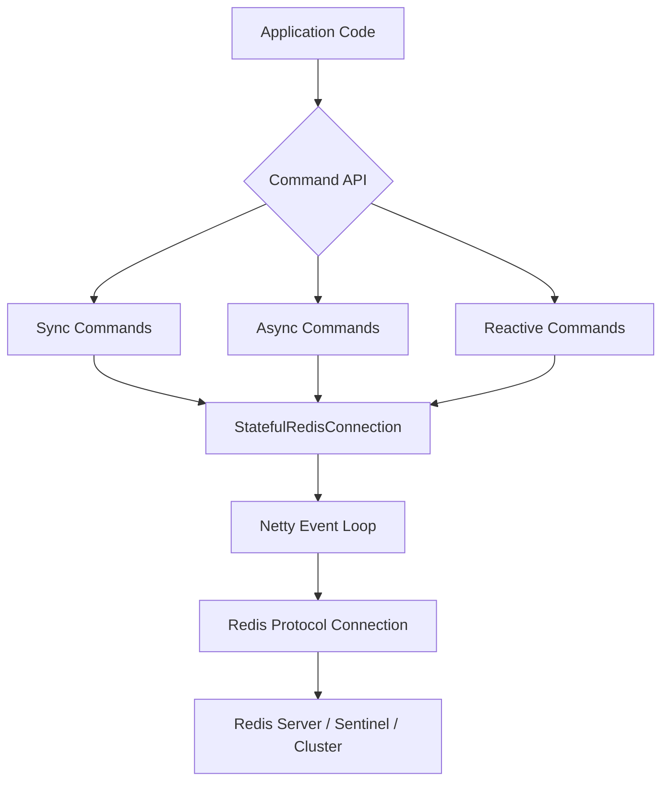

# Part 010 — Lettuce In Action: Connection, Async, Reactive, Timeout, Retry

Part 009 compared the Java Redis client landscape.
This part goes deep into Lettuce.

Lettuce matters because it is one of the most capable Java Redis clients and is commonly used directly or under Spring Data Redis.
It supports synchronous, asynchronous, and reactive access patterns, and it is built on Netty.

That power is useful only when you understand the execution model.

This part is not a copy-paste tutorial.
It is a production engineering guide.

---

## 1. Kaufman Skill Decomposition

Target skill:

> Implement Redis access using Lettuce in a Java service with explicit connection lifecycle, timeouts, reconnect behavior, async/reactive boundaries, batching strategy, topology handling, and observable failure modes.

Sub-skills:

| Sub-skill | What you must be able to do |
|---|---|
| Client lifecycle | Create and shut down `RedisClient`, `RedisClusterClient`, connections, and resources safely |
| API style | Choose sync, async, or reactive commands based on the surrounding application architecture |
| Connection sharing | Know when sharing is safe and when dedicated connections are required |
| Timeout policy | Configure command/connect timeout and classify timeout impact |
| Reconnect policy | Understand queued commands, auto-reconnect, and fail-fast options |
| Backpressure | Prevent unbounded async command firehose |
| Batching | Use pipelining/auto-flush control intentionally |
| Topology | Configure Sentinel/Cluster/managed Redis awareness where needed |
| Serialization | Use codecs deliberately and avoid accidental object encoding |
| Observability | Capture command latency, errors, reconnects, and pending command pressure |
| Testing | Test timeout, disconnect, failover, and serialization compatibility |

A senior Lettuce user does not merely know this:

```java
connection.sync().get("key");
```

They know what happens when Redis is slow, the connection is down, the topology changes, or 10,000 commands are queued at once.

---

## 2. Lettuce Mental Model

Lettuce has three major layers:



Key concepts:

| Concept | Meaning |
|---|---|
| `RedisClient` | Client object for standalone/Sentinel-style access |
| `RedisClusterClient` | Client object for Redis Cluster |
| `StatefulRedisConnection<K,V>` | Thread-safe connection abstraction for many non-blocking workloads |
| `RedisCommands<K,V>` | Synchronous command API |
| `RedisAsyncCommands<K,V>` | Future-based command API |
| `RedisReactiveCommands<K,V>` | Reactive Streams API |
| `RedisURI` | Endpoint, auth, TLS, timeout, DB, and topology hints |
| `ClientResources` | Shared Netty/event executor/timer/metrics resources |
| `ClientOptions` | Reconnect, request queue, protocol, timeout-related behavior |

Important invariant:

> Sync, async, and reactive APIs are different faces over the same networked Redis connection model.

Calling the sync API does not turn Redis into local memory.
Using the reactive API does not remove the need for backpressure.

---

## 3. Dependency Baseline

Maven:

```xml
<dependency>
    <groupId>io.lettuce</groupId>
    <artifactId>lettuce-core</artifactId>
    <version>${lettuce.version}</version>
</dependency>
```

With Spring Boot, Lettuce is often pulled transitively by:

```xml
<dependency>
    <groupId>org.springframework.boot</groupId>
    <artifactId>spring-boot-starter-data-redis</artifactId>
</dependency>
```

Production rule:

```text
Do not treat the transitive Lettuce version as invisible.
```

You still need to know:

- which Lettuce version is used;
- which Redis server version/topology is targeted;
- which Netty version is present;
- whether Spring Boot overrides defaults;
- whether metrics/tracing are enabled;
- whether TLS/auth/cluster behavior is compatible.

---

## 4. Basic Standalone Connection

Minimal example:

```java
import io.lettuce.core.RedisClient;
import io.lettuce.core.RedisURI;
import io.lettuce.core.api.StatefulRedisConnection;
import io.lettuce.core.api.sync.RedisCommands;

import java.time.Duration;

public final class LettuceBasicExample {

    public static void main(String[] args) {
        RedisURI redisUri = RedisURI.builder()
            .withHost("localhost")
            .withPort(6379)
            .withTimeout(Duration.ofMillis(500))
            .build();

        RedisClient client = RedisClient.create(redisUri);

        try (StatefulRedisConnection<String, String> connection = client.connect()) {
            RedisCommands<String, String> redis = connection.sync();
            redis.set("learn:redis:hello", "world");
            String value = redis.get("learn:redis:hello");
            System.out.println(value);
        } finally {
            client.shutdown();
        }
    }
}
```

This is fine for a small example.
It is not a full production lifecycle.

Production services usually create:

- one client per Redis topology/configuration;
- long-lived connections or a connection provider;
- dedicated connections for special workloads;
- graceful shutdown hooks;
- metrics and health checks.

---

## 5. Production Lifecycle Pattern

A simple dependency-injection-friendly lifecycle:

```java
public final class RedisLettuceModule implements AutoCloseable {

    private final RedisClient client;
    private final StatefulRedisConnection<String, String> commandConnection;

    public RedisLettuceModule(RedisConfig config) {
        RedisURI uri = RedisURI.builder()
            .withHost(config.host())
            .withPort(config.port())
            .withAuthentication(config.username(), config.password())
            .withSsl(config.tlsEnabled())
            .withTimeout(config.commandTimeout())
            .build();

        this.client = RedisClient.create(uri);
        this.commandConnection = client.connect();
    }

    public RedisCommands<String, String> sync() {
        return commandConnection.sync();
    }

    public io.lettuce.core.api.async.RedisAsyncCommands<String, String> async() {
        return commandConnection.async();
    }

    public io.lettuce.core.api.reactive.RedisReactiveCommands<String, String> reactive() {
        return commandConnection.reactive();
    }

    @Override
    public void close() {
        commandConnection.close();
        client.shutdown();
    }
}
```

This is a reasonable starting point, but it is still incomplete for advanced workloads.
You may need separate connections for:

- Pub/Sub;
- blocking stream reads;
- transactions;
- heavy pipelines;
- admin/background jobs;
- tenant-isolated workloads;
- different timeout policies.

---

## 6. Connection Sharing: Safe Enough Is Not Universal

Lettuce connections are designed to be shared across threads for many normal command workloads.
But there are exceptions.

Do not blindly share one connection for everything.

| Workload | Shared general connection? | Better approach |
|---|---:|---|
| Simple `GET`/`SET`/`HGET` | Usually yes | Shared command connection |
| High-QPS async reads | Usually yes, with metrics | Shared connection or bounded connection set |
| Pub/Sub | No | Dedicated pub/sub connection |
| Blocking list pop | No | Dedicated blocking connection |
| Blocking stream read | Avoid | Dedicated consumer connection |
| `MULTI`/`EXEC` transactions | Avoid sharing | Dedicated transaction-scoped connection |
| Large pipeline/bulk import | Avoid | Dedicated bulk connection |
| Long-running Lua/function | Avoid on request path | Dedicated or controlled path |

Why?

Redis connections are ordered streams.
If one usage mode changes connection state or creates head-of-line blocking, unrelated commands can suffer.

---

## 7. Synchronous Commands

Synchronous commands are easiest to read:

```java
public final class LettuceSessionStore {
    private final RedisCommands<String, String> redis;
    private final ObjectMapper objectMapper;

    public LettuceSessionStore(
            RedisCommands<String, String> redis,
            ObjectMapper objectMapper) {
        this.redis = redis;
        this.objectMapper = objectMapper;
    }

    public Optional<SessionEnvelope> findById(String sessionId) {
        String key = "session:{" + sessionId + "}";
        String json = redis.get(key);
        if (json == null) {
            return Optional.empty();
        }
        try {
            return Optional.of(objectMapper.readValue(json, SessionEnvelope.class));
        } catch (JsonProcessingException e) {
            throw new CorruptRedisValueException(key, e);
        }
    }
}
```

Synchronous usage is fine when:

- Redis is not called excessively per request;
- command timeout is short;
- thread pools are bounded;
- fallback behavior is known;
- pool/connection usage is observable;
- no blocking command is mixed into the shared connection.

The main mistake is doing many sequential Redis calls:

```java
for (String id : ids) {
    sessions.add(redis.get("session:{" + id + "}"));
}
```

This creates N network round trips.
Prefer batching, multi-get when slot-compatible, or data model changes.

---

## 8. Asynchronous Commands

Async commands return `RedisFuture<T>`.

```java
RedisAsyncCommands<String, String> async = connection.async();
RedisFuture<String> future = async.get("session:{abc}");

future.whenComplete((value, error) -> {
    if (error != null) {
        // classify timeout, connection, command, serialization, etc.
        return;
    }
    // use value
});
```

### 8.1 Compose futures deliberately

```java
public CompletionStage<Optional<SessionEnvelope>> findByIdAsync(String sessionId) {
    String key = "session:{" + sessionId + "}";

    return async.get(key).thenApply(json -> {
        if (json == null) {
            return Optional.empty();
        }
        return Optional.of(readSession(key, json));
    });
}
```

Avoid this inside request processing:

```java
String value = async.get(key).get();
```

If you block immediately, you pay the complexity cost of async without getting composition benefits.

### 8.2 Bound async concurrency

Bad:

```java
List<RedisFuture<String>> futures = ids.stream()
    .map(id -> async.get("session:{" + id + "}"))
    .toList();
```

If `ids` is 100,000, this can enqueue 100,000 commands.

Better:

```java
public CompletionStage<List<String>> getSessionsBounded(
        List<String> ids,
        int maxInFlight) {

    Semaphore permits = new Semaphore(maxInFlight);
    List<CompletableFuture<String>> results = new ArrayList<>();

    for (String id : ids) {
        permits.acquireUninterruptibly();

        CompletableFuture<String> result = async.get("session:{" + id + "}")
            .toCompletableFuture()
            .whenComplete((v, e) -> permits.release());

        results.add(result);
    }

    return CompletableFuture.allOf(results.toArray(new CompletableFuture[0]))
        .thenApply(ignored -> results.stream().map(CompletableFuture::join).toList());
}
```

This example is intentionally simple.
In production, prefer a reusable bounded executor/concurrency utility and avoid blocking acquisition on event-loop threads.

The invariant:

> Async does not mean unbounded.

---

## 9. Reactive Commands

Reactive Lettuce works well when the application pipeline is already reactive.

Example:

```java
public Mono<SessionEnvelope> findByIdReactive(String sessionId) {
    String key = "session:{" + sessionId + "}";

    return reactive.get(key)
        .switchIfEmpty(Mono.empty())
        .map(json -> readSession(key, json));
}
```

### 9.1 Reactive is not magic

Avoid:

```java
SessionEnvelope session = reactive.get(key)
    .map(json -> readSession(key, json))
    .block();
```

Blocking is sometimes necessary at system boundaries, but if most of the application blocks, the reactive client may not be the right choice.

### 9.2 Backpressure and fanout

Bad:

```java
Flux.fromIterable(keys)
    .flatMap(key -> reactive.get(key)) // default concurrency may be too high
```

Better:

```java
Flux.fromIterable(keys)
    .flatMap(key -> reactive.get(key), 64)
    .timeout(Duration.ofMillis(500));
```

Still better: ask whether the data model should avoid thousands of individual Redis lookups.

---

## 10. Timeout Policy

Timeouts need to be explicit.

Example URI-level timeout:

```java
RedisURI uri = RedisURI.builder()
    .withHost("redis.internal")
    .withPort(6379)
    .withTimeout(Duration.ofMillis(300))
    .build();
```

A timeout policy should be based on use case criticality.

| Use case | Typical policy |
|---|---|
| Non-critical cache read | short timeout, fallback to source or stale value |
| Idempotency write | short timeout, fail closed or return retryable error |
| Rate limiter | short timeout, fail open or fail closed depending on abuse/risk model |
| Session lookup | short timeout, maybe fail closed for auth-sensitive systems |
| Metrics counter | very short timeout, drop or buffer locally if safe |
| Stream consumer | longer read timeout may be acceptable on dedicated connection |

Do not use one arbitrary timeout for all Redis usage.

### 10.1 Timeout ambiguity

A command timeout means:

```text
The client did not receive a successful response within the timeout.
```

It does not prove:

```text
Redis did not execute the command.
```

That distinction is critical.

Example:

```java
try {
    redis.incr("quota:{tenant-a}:2026-07-02T13:00");
} catch (RedisCommandTimeoutException e) {
    // Did Redis increment or not?
    // You do not know from the timeout alone.
}
```

For non-idempotent commands, blind retry can duplicate effects.

---

## 11. Reconnect Behavior

During a disconnect, the client may:

- reconnect automatically;
- queue commands;
- fail commands immediately;
- replay queued commands after reconnect;
- drop commands depending on configuration.

The right behavior depends on use case.

### 11.1 At-least-once-style risk

If commands are queued during disconnect and later sent, your application may observe surprising behavior:

```text
request timed out at API layer
Redis connection returns
queued command executes later
client sees old future complete after caller gave up
```

This can be acceptable for idempotent cache reads.
It can be dangerous for writes with side effects.

### 11.2 Fail-fast-style risk

If commands fail immediately during disconnect:

```text
Redis blip -> command errors -> application must handle fallback/fail-closed
```

This is often better for request-path correctness.
It prevents hidden command backlog.

### 11.3 Design rule

For every Redis port, define:

```java
public enum RedisFailurePolicy {
    FAIL_OPEN,
    FAIL_CLOSED,
    FALLBACK_TO_SOURCE,
    RETURN_RETRYABLE_ERROR,
    IGNORE_BEST_EFFORT
}
```

Then make the implementation match the policy.

---

## 12. ClientOptions Baseline

A realistic configuration starts with explicit options.
Exact APIs can vary by Lettuce version, so treat this as a structural template.

```java
import io.lettuce.core.ClientOptions;
import io.lettuce.core.SocketOptions;
import io.lettuce.core.TimeoutOptions;

ClientOptions options = ClientOptions.builder()
    .autoReconnect(true)
    .socketOptions(SocketOptions.builder()
        .connectTimeout(Duration.ofMillis(300))
        .keepAlive(true)
        .build())
    .timeoutOptions(TimeoutOptions.enabled())
    .build();

RedisClient client = RedisClient.create(redisUri);
client.setOptions(options);
```

Questions this config still does not answer:

- Should commands be queued while disconnected?
- How large can the request queue be?
- Are queued writes safe?
- Are timeouts per command or global?
- Should auto-reconnect be enabled for this workload?
- What is the fallback when commands fail?

Configuration is not policy.
It must be tied to the use case.

---

## 13. Batching and Pipelining

Redis pipelining reduces round-trip overhead by sending multiple commands without waiting for each response.
Lettuce can pipeline naturally through async commands because commands can be issued before waiting for results.

Example async batch:

```java
List<RedisFuture<String>> futures = keys.stream()
    .map(async::get)
    .toList();

List<String> values = futures.stream()
    .map(RedisFuture::toCompletableFuture)
    .map(CompletableFuture::join)
    .toList();
```

This improves round-trip efficiency, but it can still create too many in-flight commands.

### 13.1 Manual flush control

For controlled batching, Lettuce supports disabling auto-flush and flushing commands manually.

```java
connection.setAutoFlushCommands(false);
try {
    List<RedisFuture<String>> futures = new ArrayList<>();

    for (String key : keys) {
        futures.add(async.get(key));
    }

    connection.flushCommands();

    for (RedisFuture<String> future : futures) {
        future.toCompletableFuture().join();
    }
} finally {
    connection.setAutoFlushCommands(true);
}
```

This pattern must be isolated.
Do not toggle auto-flush on a shared connection used by unrelated request threads.
Use a dedicated bulk connection.

### 13.2 Batch sizing

Batch size should be bounded by:

- payload size;
- expected response size;
- Redis command complexity;
- client memory;
- server output buffer;
- latency target;
- fairness to other workloads.

A good starting discipline:

```text
batch small, measure, increase only with evidence
```

---

## 14. Codecs and Serialization

Lettuce uses codecs to encode/decode keys and values.
The default simple examples often use `StringCodec`.

```java
StatefulRedisConnection<String, String> connection = client.connect();
```

This is equivalent to string key/value usage.

For binary-safe values, use byte arrays:

```java
import io.lettuce.core.codec.ByteArrayCodec;

StatefulRedisConnection<byte[], byte[]> connection =
    client.connect(ByteArrayCodec.INSTANCE);
```

### 14.1 Recommended pattern

Use string keys and explicit serialization at repository boundary:

```java
public final class JsonRedisValueCodec<T> {
    private final ObjectMapper objectMapper;
    private final Class<T> type;

    public JsonRedisValueCodec(ObjectMapper objectMapper, Class<T> type) {
        this.objectMapper = objectMapper;
        this.type = type;
    }

    public String encode(T value) {
        try {
            return objectMapper.writeValueAsString(value);
        } catch (JsonProcessingException e) {
            throw new RedisSerializationException("Failed to encode " + type.getSimpleName(), e);
        }
    }

    public T decode(String key, String json) {
        try {
            return objectMapper.readValue(json, type);
        } catch (JsonProcessingException e) {
            throw new CorruptRedisValueException(key, e);
        }
    }
}
```

Why not hide everything in a magic codec?

Because repository-level serialization lets you:

- include schema version;
- include domain-specific validation;
- produce better error messages;
- handle old versions;
- meter corrupt values per key family;
- migrate fields intentionally.

---

## 15. Error Classification

Do not catch `Exception` around Redis and call it "cache miss".

Classify errors.

| Error type | Meaning | Typical response |
|---|---|---|
| Timeout | No response within deadline | fallback, fail closed, or retryable error by use case |
| Connection error | Cannot connect/read/write | fallback or fail closed/open |
| Authentication error | Bad credentials/ACL | fail fast, alert |
| Read-only error | Wrote to replica during failover/topology issue | refresh topology, retry if safe |
| MOVED/ASK | Cluster redirection | client should handle; alert if persistent |
| NOSCRIPT | Script cache missing | reload script or use safe script execution path |
| OOM/maxmemory | Redis memory pressure | alert, shed load, review eviction/capacity |
| Serialization error | Bad payload or incompatible schema | quarantine/delete/migrate depending on data class |
| Command syntax/type error | Application bug or key type conflict | fail fast, fix code/data model |

Example boundary:

```java
public Optional<SessionEnvelope> findSession(String sessionId) {
    String key = keyFor(sessionId);
    try {
        String json = redis.get(key);
        return json == null ? Optional.empty() : Optional.of(codec.decode(key, json));
    } catch (RedisCommandTimeoutException e) {
        metrics.increment("redis.session.timeout");
        throw new SessionStoreUnavailableException("Session Redis timed out", e);
    } catch (RedisConnectionException e) {
        metrics.increment("redis.session.connection_error");
        throw new SessionStoreUnavailableException("Session Redis unavailable", e);
    } catch (CorruptRedisValueException e) {
        metrics.increment("redis.session.corrupt_value");
        throw e;
    }
}
```

The service layer can decide whether `SessionStoreUnavailableException` means fail-open, fail-closed, or retryable response.

---

## 16. Health Checks

A Redis health check should answer:

```text
Can this application perform the Redis operation it depends on within its deadline?
```

Not merely:

```text
Can a TCP socket open?
```

### 16.1 Basic health check

```java
public RedisHealth check() {
    long start = System.nanoTime();
    try {
        String pong = redis.ping();
        long millis = Duration.ofNanos(System.nanoTime() - start).toMillis();
        return "PONG".equals(pong)
            ? RedisHealth.up(millis)
            : RedisHealth.down("Unexpected PING response: " + pong);
    } catch (RuntimeException e) {
        return RedisHealth.down(e.getClass().getSimpleName());
    }
}
```

This is only a baseline.

For critical Redis ports, prefer operation-specific checks:

| Port | Health check |
|---|---|
| Session store | `SET` temp key with TTL + `GET` + `DEL` if allowed |
| Cache read-only | `PING` may be enough if fallback exists |
| Idempotency store | script dry-run against namespaced test key |
| Stream consumer | `XINFO STREAM` / consumer lag check |
| Cluster access | slot-aware check across representative slots |

Do not make readiness checks so heavy that they become a production workload.

---

## 17. Cluster Usage

For Redis Cluster, use `RedisClusterClient`.

```java
import io.lettuce.core.RedisURI;
import io.lettuce.core.cluster.RedisClusterClient;
import io.lettuce.core.cluster.api.StatefulRedisClusterConnection;
import io.lettuce.core.cluster.api.sync.RedisAdvancedClusterCommands;

List<RedisURI> nodes = List.of(
    RedisURI.create("redis://redis-1.internal:6379"),
    RedisURI.create("redis://redis-2.internal:6379"),
    RedisURI.create("redis://redis-3.internal:6379")
);

RedisClusterClient clusterClient = RedisClusterClient.create(nodes);

try (StatefulRedisClusterConnection<String, String> connection = clusterClient.connect()) {
    RedisAdvancedClusterCommands<String, String> redis = connection.sync();
    redis.set("session:{abc}", "value");
}
```

### 17.1 Cluster design constraints still apply

Lettuce can route commands.
It cannot remove Redis Cluster semantics.

You still need to design for:

- hash slots;
- cross-slot multi-key limitations;
- hash tags;
- topology refresh;
- replica reads and staleness;
- resharding behavior;
- slot migration during deployment;
- different latency per shard;
- hot key/hot slot.

Example hash-tagged keys:

```text
cart:{tenant-a:user-123}:items
cart:{tenant-a:user-123}:meta
cart:{tenant-a:user-123}:version
```

All keys sharing the same hash tag go to the same slot.
This enables multi-key operations but can create hot slots if overused.

---

## 18. Topology Refresh

Cluster clients need topology awareness.
During failover or resharding, a stale topology view creates redirects, retries, and latency.

Structural configuration example:

```java
import io.lettuce.core.cluster.ClusterClientOptions;
import io.lettuce.core.cluster.ClusterTopologyRefreshOptions;

ClusterTopologyRefreshOptions topologyRefreshOptions = ClusterTopologyRefreshOptions.builder()
    .enablePeriodicRefresh(Duration.ofSeconds(30))
    .enableAllAdaptiveRefreshTriggers()
    .build();

ClusterClientOptions clusterOptions = ClusterClientOptions.builder()
    .topologyRefreshOptions(topologyRefreshOptions)
    .autoReconnect(true)
    .build();

RedisClusterClient clusterClient = RedisClusterClient.create(nodes);
clusterClient.setOptions(clusterOptions);
```

Operational questions:

- How quickly should clients learn about topology change?
- Can all clients refresh at once and overload the cluster?
- Are MOVED/ASK rates monitored?
- Are retries bounded?
- Does the managed Redis provider use stable configuration endpoints?
- Are DNS changes respected?

Topology refresh is not just a client setting.
It is part of failover behavior.

---

## 19. Replica Reads

Lettuce can support read routing strategies for cluster/replica setups.
But replica reads are a consistency decision, not only a performance decision.

Use replica reads for:

- stale-tolerant cache data;
- analytics-ish reads;
- non-critical UI views;
- read-heavy data with natural lag tolerance.

Avoid replica reads for:

- idempotency checks;
- authorization decisions;
- payment state;
- recently written workflow state;
- rate limit counters;
- anything needing read-your-write behavior.

Mental model:

```text
replica read = possible stale read
```

Do not hide that behind a repository called `StrongSessionStore`.

---

## 20. Pub/Sub with Lettuce

Pub/Sub should use a dedicated connection.

```java
import io.lettuce.core.pubsub.StatefulRedisPubSubConnection;
import io.lettuce.core.pubsub.RedisPubSubListener;

StatefulRedisPubSubConnection<String, String> pubSub = client.connectPubSub();

pubSub.addListener(new RedisPubSubListener<>() {
    @Override
    public void message(String channel, String message) {
        // Keep handler short. Offload heavy work.
    }

    @Override
    public void message(String pattern, String channel, String message) {}
    @Override
    public void subscribed(String channel, long count) {}
    @Override
    public void psubscribed(String pattern, long count) {}
    @Override
    public void unsubscribed(String channel, long count) {}
    @Override
    public void punsubscribed(String pattern, long count) {}
});

pubSub.sync().subscribe("cache-invalidation:product");
```

Handler rule:

```text
Do not perform slow business work directly in the Pub/Sub listener callback.
```

Instead:

```java
@Override
public void message(String channel, String message) {
    notificationExecutor.execute(() -> handleInvalidation(channel, message));
}
```

But the executor must be bounded.
Otherwise Pub/Sub bursts become local memory pressure.

---

## 21. Blocking Commands with Lettuce

Blocking Redis commands include:

- `BLPOP`;
- `BRPOP`;
- `BZPOPMIN`;
- blocking stream reads using `XREAD BLOCK` / `XREADGROUP BLOCK`.

Use dedicated connections.

```java
StatefulRedisConnection<String, String> workerConnection = client.connect();
RedisCommands<String, String> workerRedis = workerConnection.sync();

while (running.get()) {
    KeyValue<String, String> item = workerRedis.blpop(5, "queue:email");
    if (item != null) {
        handle(item.getValue());
    }
}
```

Never run this on the same connection used by request-path cache reads.

For Streams, prefer a carefully designed consumer loop with:

- consumer name;
- group name;
- block duration;
- batch count;
- acknowledgement discipline;
- pending entry recovery;
- dead-letter handling;
- shutdown wake-up.

Part 007 covered stream semantics; Part 019 will cover work queues and retry pipelines.

---

## 22. Lua Scripts with Lettuce

Lua scripts are useful for atomic multi-command workflows.

Example rate limiter script invocation:

```java
String script = """
local current = redis.call('INCR', KEYS[1])
if current == 1 then
  redis.call('PEXPIRE', KEYS[1], ARGV[1])
end
return current
""";

Long count = redis.eval(
    script,
    ScriptOutputType.INTEGER,
    new String[] { "rate:{tenant-a}:login:20260702T1300" },
    "60000"
);
```

Production rules:

- keep scripts small;
- make scripts deterministic;
- avoid long loops over large keys;
- pass keys through `KEYS`, not hidden in `ARGV`;
- ensure all keys are same-slot in Redis Cluster;
- version scripts;
- test scripts independently;
- classify `NOSCRIPT` behavior if using `EVALSHA`.

Do not use Lua to hide bad data modeling.
Lua is for atomicity, not for turning Redis into an application server.

---

## 23. Bounded Repository Example: Idempotency Store

A production-ish port:

```java
public interface IdempotencyStore {
    ReservationResult reserve(String operation, String idempotencyKey, Duration ttl);
}

public enum ReservationResult {
    RESERVED,
    ALREADY_RESERVED,
    STORE_UNAVAILABLE
}
```

Lettuce sync implementation:

```java
public final class LettuceIdempotencyStore implements IdempotencyStore {
    private final RedisCommands<String, String> redis;
    private final IdempotencyKeyFactory keys;
    private final MeterRegistry metrics;

    public LettuceIdempotencyStore(
            RedisCommands<String, String> redis,
            IdempotencyKeyFactory keys,
            MeterRegistry metrics) {
        this.redis = redis;
        this.keys = keys;
        this.metrics = metrics;
    }

    @Override
    public ReservationResult reserve(String operation, String idempotencyKey, Duration ttl) {
        String redisKey = keys.key(operation, idempotencyKey);
        try {
            String result = redis.set(
                redisKey,
                "reserved",
                SetArgs.Builder.nx().px(ttl.toMillis())
            );

            if ("OK".equals(result)) {
                metrics.counter("redis.idempotency.reserved").increment();
                return ReservationResult.RESERVED;
            }

            metrics.counter("redis.idempotency.already_reserved").increment();
            return ReservationResult.ALREADY_RESERVED;
        } catch (RedisCommandTimeoutException | RedisConnectionException e) {
            metrics.counter("redis.idempotency.unavailable", "error", e.getClass().getSimpleName()).increment();
            return ReservationResult.STORE_UNAVAILABLE;
        }
    }
}
```

The service layer chooses policy:

```java
ReservationResult result = idempotencyStore.reserve("payment-capture", key, Duration.ofHours(24));

switch (result) {
    case RESERVED -> capturePayment();
    case ALREADY_RESERVED -> returnPreviousResponseOrConflict();
    case STORE_UNAVAILABLE -> throw new RetryableServiceException("Idempotency store unavailable");
}
```

Notice the important design choice:

```text
Redis error is not silently treated as "key absent".
```

That would be dangerous for idempotency.

---

## 24. Bounded Repository Example: Cache-Aside Read

For non-critical cache reads, fallback may be acceptable.

```java
public final class ProductViewCache {
    private final RedisCommands<String, String> redis;
    private final ProductRepository repository;
    private final JsonRedisValueCodec<ProductView> codec;

    public ProductView getProductView(String productId) {
        String key = "product-view:{" + productId + "}:v1";

        try {
            String cached = redis.get(key);
            if (cached != null) {
                return codec.decode(key, cached);
            }
        } catch (RedisCommandTimeoutException | RedisConnectionException e) {
            // cache miss by failure is acceptable only because this cache is non-critical
            metrics().counter("redis.product_view_cache.bypass", "reason", e.getClass().getSimpleName()).increment();
        }

        ProductView loaded = repository.loadProductView(productId);

        try {
            redis.setex(key, 300, codec.encode(loaded));
        } catch (RuntimeException e) {
            metrics().counter("redis.product_view_cache.populate_failed").increment();
        }

        return loaded;
    }
}
```

This is acceptable only because the policy is explicit:

```text
Redis unavailable -> bypass cache -> source of truth remains database/search service
```

The same fallback would be wrong for rate limiting or idempotency.

---

## 25. Observability

At minimum, emit metrics by Redis port/use case.

| Metric | Dimensions |
|---|---|
| command latency | use case, command family, outcome |
| timeout count | use case, error class |
| connection error count | use case, endpoint/topology |
| serialization error count | value type, schema version |
| cache hit/miss | cache name |
| fallback count | use case, fallback type |
| pending async commands | connection/use case |
| reconnect count | endpoint/topology |
| cluster redirect count | MOVED/ASK if exposed |
| pub/sub handler lag | channel, handler |

Example timing wrapper:

```java
public <T> T recordRedisCall(String useCase, String commandFamily, Supplier<T> call) {
    Timer.Sample sample = Timer.start(meterRegistry);
    try {
        T result = call.get();
        sample.stop(timer(useCase, commandFamily, "success"));
        return result;
    } catch (RuntimeException e) {
        sample.stop(timer(useCase, commandFamily, "error"));
        meterRegistry.counter(
            "redis.command.error",
            "use_case", useCase,
            "command_family", commandFamily,
            "error", e.getClass().getSimpleName()
        ).increment();
        throw e;
    }
}
```

Do not put raw keys into metrics.
Keys can contain sensitive or high-cardinality values.
Use key family names instead.

---

## 26. Testing Lettuce Integrations

### 26.1 Contract tests

Every Redis repository should have contract tests.

```java
interface IdempotencyStoreContract {
    IdempotencyStore store();

    @Test
    default void reserveIsSuccessfulOnlyOnce() {
        String key = UUID.randomUUID().toString();
        assertThat(store().reserve("test", key, Duration.ofMinutes(5)))
            .isEqualTo(ReservationResult.RESERVED);
        assertThat(store().reserve("test", key, Duration.ofMinutes(5)))
            .isEqualTo(ReservationResult.ALREADY_RESERVED);
    }
}
```

### 26.2 Integration tests with real Redis

Use a real Redis in tests for:

- TTL behavior;
- Lua script behavior;
- serialization compatibility;
- stream consumer group behavior;
- cluster slot behavior where relevant;
- Pub/Sub behavior;
- command error behavior.

Mocks are not enough for Redis semantics.

### 26.3 Failure tests

Test:

| Failure | How to simulate |
|---|---|
| Redis unavailable | stop container / block port |
| Timeout | inject network delay or use proxy/toxiproxy |
| Corrupt value | write invalid JSON manually |
| Key type conflict | write string where hash expected |
| Cluster redirect | integration environment with cluster |
| Pub/Sub disconnect | restart Redis/subscriber |
| Reconnect queue | disconnect during async command burst |

Production confidence comes from failure tests, not just happy-path examples.

---

## 27. Common Lettuce Anti-Patterns

### 27.1 Creating a client per request

Bad:

```java
public String get(String key) {
    RedisClient client = RedisClient.create("redis://localhost:6379");
    try (var connection = client.connect()) {
        return connection.sync().get(key);
    } finally {
        client.shutdown();
    }
}
```

This repeatedly creates network/client resources.
Use long-lived clients/connections.

### 27.2 One shared connection for blocking and non-blocking work

Bad:

```java
connection.sync().blpop(0, "queue");
// same connection used elsewhere for request GETs
```

Use dedicated blocking connections.

### 27.3 Unbounded async fanout

Bad:

```java
keys.forEach(async::get);
```

Bound concurrency.
Track pending commands.

### 27.4 Blocking event-loop threads

Bad:

```java
future.whenComplete((value, error) -> {
    slowJdbcCall();
});
```

Do not run blocking work on callback/event-loop execution paths.
Offload intentionally.

### 27.5 Treating timeout as not executed

Bad:

```java
try {
    redis.incr(key);
} catch (RedisCommandTimeoutException e) {
    redis.incr(key); // blind retry
}
```

Use idempotent scripts/workflows or accept ambiguity.

### 27.6 Toggling auto-flush on shared connections

Bad:

```java
sharedConnection.setAutoFlushCommands(false);
// other threads now queue unexpectedly
```

Use dedicated pipeline/bulk connections.

---

## 28. Production Readiness Checklist

Before using Lettuce in production, verify:

- [ ] Client and server versions are documented.
- [ ] Redis topology is explicit: standalone, Sentinel, Cluster, or managed.
- [ ] TLS/auth configuration is tested.
- [ ] Command timeout is defined per use case.
- [ ] Connect timeout is defined.
- [ ] Reconnect behavior is understood.
- [ ] Request queue behavior is understood.
- [ ] Blocking commands use dedicated connections.
- [ ] Pub/Sub uses dedicated connections.
- [ ] Transaction/Lua workflows are tested.
- [ ] Serialization format is explicit and versioned.
- [ ] Metrics exist by Redis use case.
- [ ] Errors are classified, not swallowed.
- [ ] Fallback/fail-open/fail-closed behavior is documented.
- [ ] Async/reactive concurrency is bounded.
- [ ] Cluster topology refresh is configured if using Cluster.
- [ ] Replica-read consistency is documented if enabled.
- [ ] Integration tests run against real Redis.
- [ ] Failure tests cover timeout and disconnect.
- [ ] Shutdown closes connections and client resources.

---

## 29. Practical Exercises

### Exercise 1 — Build a Lettuce module

Create a reusable module with:

- `RedisClient` lifecycle;
- configurable Redis URI;
- command timeout;
- sync and async command access;
- dedicated Pub/Sub connection factory;
- graceful shutdown;
- health check.

### Exercise 2 — Implement two ports

Implement:

1. `IdempotencyStore` with fail-closed behavior;
2. `ProductViewCache` with fallback-to-source behavior.

Use different error policies.
Do not treat Redis failures the same way.

### Exercise 3 — Test timeout ambiguity

Create a test or simulation showing why retrying `INCR` after timeout can over-count.
Then redesign using an idempotency key or Lua script.

### Exercise 4 — Bound async concurrency

Given 50,000 keys, fetch values with:

- unbounded async fanout;
- bounded concurrency of 64;
- batched pipeline of 500;
- data model redesign using grouped keys.

Measure memory, latency, and Redis command rate.

---

## 30. Summary

Lettuce is powerful because it supports multiple execution styles and production topologies.
But the real engineering skill is not calling commands.
It is controlling boundaries.

Core invariants:

- A long-lived client is normal; a client per request is not.
- Shared connections are useful, but not for every workload.
- Pub/Sub, blocking commands, transactions, and bulk pipelines deserve isolation.
- Async must be bounded.
- Reactive must match the surrounding architecture.
- Timeout does not prove non-execution.
- Reconnect and request queue behavior are correctness concerns.
- Cluster topology awareness does not remove cluster data modeling constraints.
- Serialization belongs to the contract, not the default.
- Errors must be classified by use case.

Part 011 will cover Jedis in action: a simpler synchronous model, pooling discipline, pipelining, transactions, and where Jedis is still an excellent production choice.
