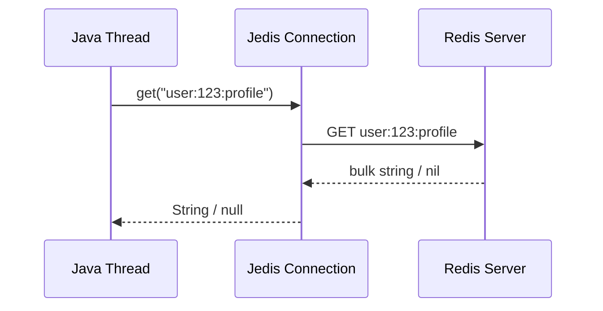
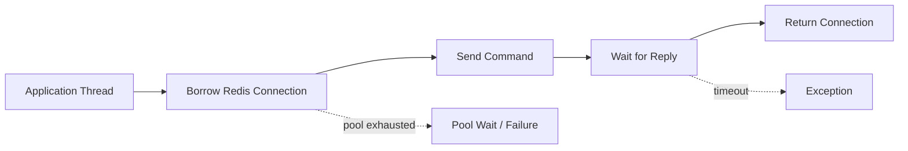
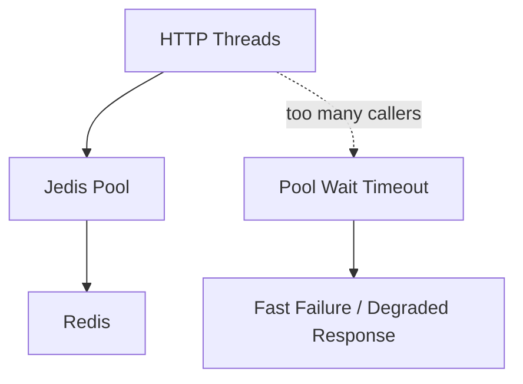
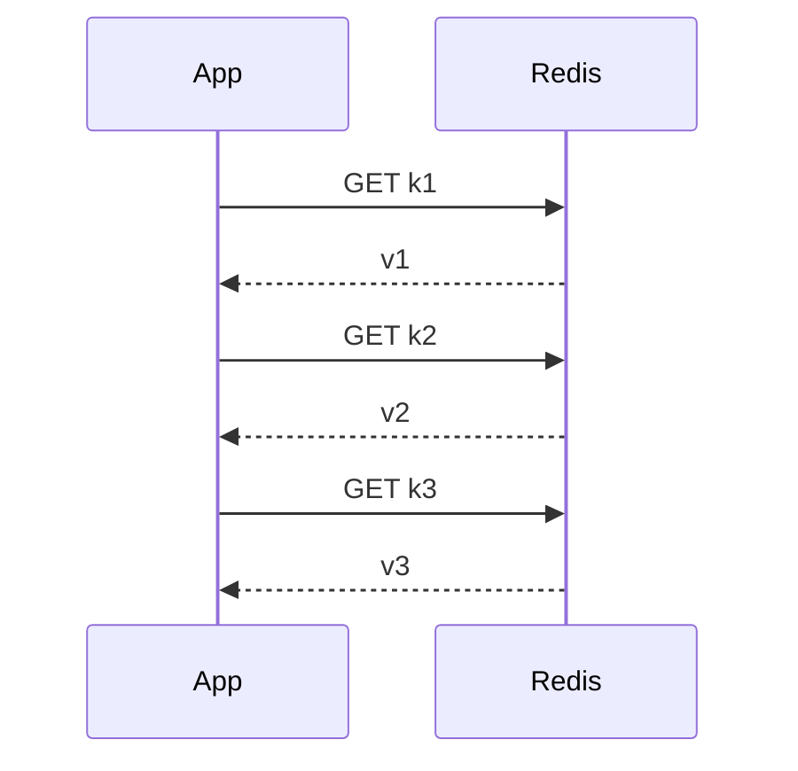
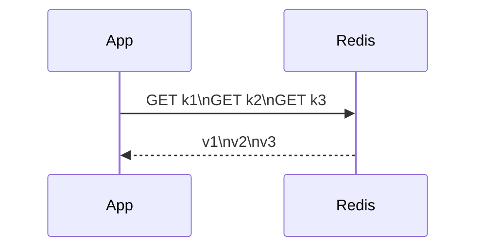
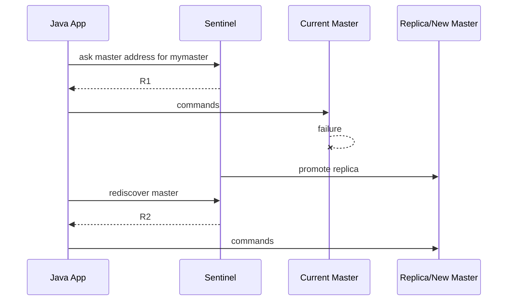
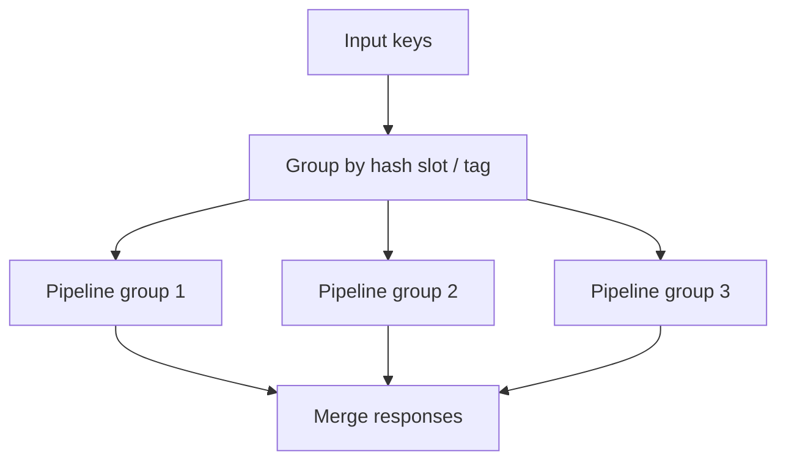
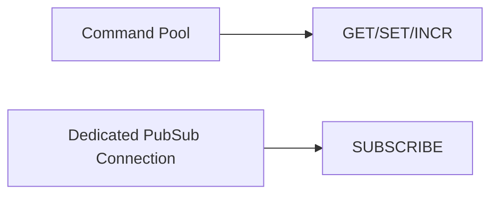
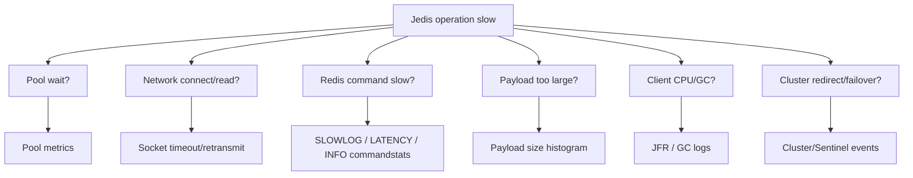
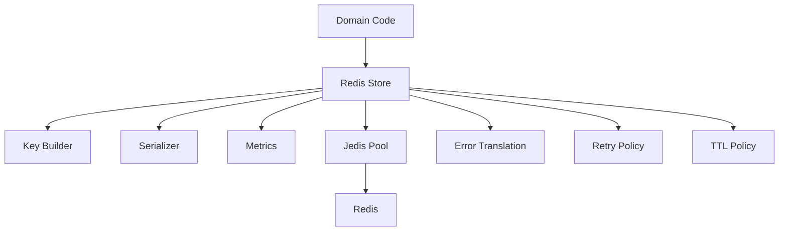

# Part 011 — Jedis In Action: Simplicity, Pooling, Pipeline, and Operational Boundaries

Part 010 covered Lettuce.
This part covers Jedis.

Jedis is important because it gives Java engineers a direct, synchronous, low-surprise API for Redis.
That simplicity is useful in many production systems: REST services, scheduled jobs, workers, command handlers, admin tools, migration scripts, and infrastructure utilities.

But synchronous does not mean naive.
A production-grade Jedis integration still needs explicit decisions about connection pooling, timeouts, pipelining, transactions, retry behavior, topology, serialization, and observability.

This part is not about memorizing every command wrapper.
It is about using Jedis safely as a production Redis client.

---

## 1. Kaufman Skill Decomposition

Target skill:

> Use Jedis in a Java service with safe synchronous Redis access, bounded connection usage, explicit timeout policy, intentional pipelining, correct transaction/Lua boundaries, and observable failure behavior.

Sub-skills:

| Sub-skill | What you must be able to do |
|---|---|
| Client selection | Decide when Jedis is better than Lettuce, Spring Data Redis, or Redisson |
| Connection lifecycle | Use pooled connections safely and close borrowed resources correctly |
| Threading | Avoid sharing non-thread-safe per-connection state across threads |
| Timeout policy | Configure connect/read/write/command-relevant timeouts through client configuration |
| Pool sizing | Size the pool based on concurrency, Redis latency, command mix, and failure behavior |
| Pipelining | Batch commands to reduce round trips without accidentally creating memory spikes |
| Transactions | Use `MULTI`/`EXEC` and `WATCH` only for the right atomicity model |
| Lua | Move small critical multi-command logic to Redis atomically when needed |
| Cluster | Understand slot routing, hash tags, cross-slot constraints, and topology redirects |
| Sentinel | Connect through Sentinel when using Redis Sentinel HA |
| Retry boundary | Know which commands can be retried and which must not be retried blindly |
| Observability | Measure pool pressure, command latency, timeout rate, and Redis-side slow commands |

A senior engineer using Jedis should be able to answer:

- How many concurrent Redis operations can this JVM issue?
- What happens when Redis takes 500 ms instead of 1 ms?
- What happens when the pool is exhausted?
- Which commands are safe to retry?
- Which Redis keys can be used together in a Cluster transaction/script?
- How do we detect hot keys, slow commands, and command fanout?

---

## 2. Jedis Mental Model

Jedis is best understood as:

> A synchronous Redis command client that maps Java method calls closely to Redis commands.

A call such as:

```java
String value = jedis.get("user:123:profile");
```

has this shape:



The calling thread waits until a reply arrives or a timeout/failure happens.
There is no hidden reactive pipeline unless you explicitly use pipeline-like APIs.

That gives Jedis three strengths:

1. It is easy to reason about.
2. It matches blocking service flows naturally.
3. It keeps Redis command semantics visible.

It also creates three risks:

1. A slow Redis call blocks an application thread.
2. Too many concurrent calls can exhaust pool/server resources.
3. Naive loops can create huge round-trip overhead.

The mental model is simple:



A Jedis design is mostly about bounding this flow.

---

## 3. When Jedis Is the Right Choice

Use Jedis when the system wants direct synchronous Redis access.

Good fits:

| Scenario | Why Jedis fits |
|---|---|
| Servlet/blocking REST service | One request thread can execute a small number of Redis commands |
| Worker service | Worker threads already follow synchronous job processing |
| Admin CLI/tool | Simplicity matters more than reactive throughput |
| Migration script | Direct command mapping is easier to verify |
| Low-latency cache lookup | Simple `GET`/`SETEX` style operations are easy to keep bounded |
| Explicit Redis command usage | You do not want Spring abstraction hiding Redis semantics |
| Small platform utility | Operational simplicity matters more than API flexibility |

Avoid Jedis as the primary client when:

| Scenario | Better direction |
|---|---|
| You need native reactive streams | Lettuce or Spring reactive Redis |
| You need large async fanout | Lettuce async with explicit backpressure |
| You want high-level distributed objects/locks | Redisson, with careful correctness review |
| You want Spring Cache integration | Spring Data Redis |
| You need transparent repository/object mapping | Spring Data Redis or Redis OM, with caveats |

This is not a maturity ranking.
It is an architectural fit question.

Jedis is not “less production-grade” because it is synchronous.
It is production-grade when the application concurrency model is also synchronous and bounded.

---

## 4. Dependency and Version Discipline

Use one source of truth for Jedis versioning.
In Maven:

```xml
<dependency>
    <groupId>redis.clients</groupId>
    <artifactId>jedis</artifactId>
    <version>${jedis.version}</version>
</dependency>
```

For Gradle:

```kotlin
dependencies {
    implementation("redis.clients:jedis:${jedisVersion}")
}
```

Production rule:

> Do not let application code depend on dozens of Jedis call sites directly.

Create a small internal gateway around Redis access.
That gateway should own:

- key naming
- serialization
- timeouts
- error translation
- metrics
- retry policy
- pipeline batching rules
- Lua script loading
- cluster hash tag decisions

Example package boundary:

```text
com.example.platform.redis
├── RedisClientConfig.java
├── RedisKey.java
├── RedisCodec.java
├── RedisMetrics.java
├── RedisOperationException.java
├── UserSessionRedisStore.java
├── IdempotencyRedisStore.java
└── RateLimitRedisStore.java
```

The rest of the application should talk to domain-specific stores, not to raw Jedis everywhere.

---

## 5. Connection Options in Modern Jedis

Jedis has evolved over time.
Modern code commonly uses one of these shapes:

| Shape | Typical use |
|---|---|
| `JedisPooled` / unified high-level client | Simple pooled synchronous access |
| `JedisPool` + borrowed `Jedis` | Explicit pool lifecycle and borrowed connection control |
| `JedisCluster` | Redis Cluster topology |
| Sentinel-aware client/pool | Redis Sentinel deployments |
| Direct `Jedis` connection | Short-lived scripts/tests/tools, not shared concurrent app usage |

For many services, the safest default is a pooled client abstraction.

Conceptual example:

```java
import redis.clients.jedis.JedisPooled;

public final class RedisHealthStore {
    private final JedisPooled jedis;

    public RedisHealthStore(JedisPooled jedis) {
        this.jedis = jedis;
    }

    public String ping() {
        return jedis.ping();
    }
}
```

This hides connection borrow/return mechanics from application code.

If you use `JedisPool` directly, enforce try-with-resources:

```java
import redis.clients.jedis.Jedis;
import redis.clients.jedis.JedisPool;

public final class UserSessionStore {
    private final JedisPool pool;

    public UserSessionStore(JedisPool pool) {
        this.pool = pool;
    }

    public String findSessionJson(String sessionId) {
        String key = "session:{" + sessionId + "}";
        try (Jedis jedis = pool.getResource()) {
            return jedis.get(key);
        }
    }
}
```

The `close()` call on a borrowed pooled resource returns it to the pool.
Treat missing `close()` as a production incident waiting to happen.

---

## 6. The Thread-Safety Rule

The safe rule:

> Do not share a single low-level `Jedis` connection instance concurrently across multiple threads.

Instead:

- use `JedisPooled`, or
- use `JedisPool` and borrow per operation/unit of work, or
- use a dedicated connection for a dedicated long-lived mode such as Pub/Sub.

Bad:

```java
public final class UnsafeRedisStore {
    private final Jedis jedis;

    public UnsafeRedisStore(Jedis jedis) {
        this.jedis = jedis;
    }

    public String get(String key) {
        return jedis.get(key); // unsafe if called concurrently by many threads
    }
}
```

Better:

```java
public final class SafeRedisStore {
    private final JedisPool pool;

    public SafeRedisStore(JedisPool pool) {
        this.pool = pool;
    }

    public String get(String key) {
        try (Jedis jedis = pool.getResource()) {
            return jedis.get(key);
        }
    }
}
```

A pooled design also gives you a place to enforce maximum concurrency.
Without a pool, the JVM can create uncontrolled pressure against Redis.

---

## 7. Pool Sizing Mental Model

Pool sizing is not guesswork.
Use this approximation:

```text
required_connections ≈ concurrent_redis_operations
                     ≈ request_concurrency × redis_calls_per_request × redis_call_duration / request_duration
```

But the practical approach is simpler:

1. Count expected concurrent application workers/HTTP request threads.
2. Estimate Redis calls per request/job.
3. Set a maximum pool size below the number that would harm Redis.
4. Set a bounded pool wait timeout.
5. Measure pool borrow latency and exhaustion.

Example:

| Parameter | Value |
|---|---:|
| HTTP worker threads | 200 |
| Redis calls per request | 1–3 |
| Expected p99 Redis call | 5 ms |
| Request p99 | 200 ms |
| Initial pool max | 32–64 |

Do not blindly set pool max to 200 just because the HTTP server has 200 threads.
That allows request bursts to turn into Redis bursts.

Pool max is a bulkhead.
It protects Redis and downstream dependencies.



Production rule:

> Pool exhaustion should be visible, bounded, and recoverable.

It should not silently block request threads for seconds.

---

## 8. Pool Configuration Principles

A pool has four major operational dimensions:

| Dimension | Meaning | Production concern |
|---|---|---|
| Max total | Maximum borrowed connections | Redis pressure ceiling |
| Max idle | Idle connections retained | Avoid connection churn |
| Min idle | Warm spare connections | Reduce cold path latency |
| Max wait | How long caller waits for connection | Prevent thread starvation |

Conceptual setup:

```java
import org.apache.commons.pool2.impl.GenericObjectPoolConfig;
import redis.clients.jedis.Jedis;
import redis.clients.jedis.JedisPool;

import java.time.Duration;

public final class JedisPoolFactory {
    public static JedisPool create(String host, int port) {
        GenericObjectPoolConfig<Jedis> poolConfig = new GenericObjectPoolConfig<>();
        poolConfig.setMaxTotal(64);
        poolConfig.setMaxIdle(32);
        poolConfig.setMinIdle(8);
        poolConfig.setMaxWait(Duration.ofMillis(50));
        poolConfig.setTestOnBorrow(false);
        poolConfig.setTestWhileIdle(true);

        int connectionTimeoutMillis = 500;
        int soTimeoutMillis = 500;

        return new JedisPool(
            poolConfig,
            host,
            port,
            connectionTimeoutMillis,
            soTimeoutMillis
        );
    }
}
```

Important details:

- `maxWait` should usually be small for request-serving systems.
- `testOnBorrow=true` can add latency; prefer idle validation unless you have a specific reason.
- Low timeouts expose problems earlier, but can create false failures under GC/network noise.
- High timeouts hide problems and consume application threads.

A good timeout is tied to the user-facing SLO.

Example:

| Endpoint SLO | Redis timeout starting point |
|---|---:|
| p99 100 ms | 20–50 ms for cache lookup |
| p99 300 ms | 50–100 ms for non-critical Redis call |
| worker job | 250–1000 ms depending on retry model |
| migration/admin task | seconds may be acceptable |

Do not copy these numbers blindly.
Use them as starting points for load testing.

---

## 9. Timeout Taxonomy

Jedis users often say “Redis timeout” too broadly.
Separate these cases:

| Timeout | Meaning | Likely cause |
|---|---|---|
| Connect timeout | Could not establish TCP/TLS connection | network, DNS, Redis down, firewall |
| Socket/read timeout | Command reply did not arrive in time | slow command, overloaded Redis, network issue |
| Pool wait timeout | No connection became available | local concurrency, leaked connection, Redis slowness |
| Application timeout | Caller cancelled before Redis returned | upstream deadline exceeded |

Each requires different action.

Bad incident analysis:

> Redis timed out.

Good incident analysis:

> p99 pool borrow latency exceeded 50 ms because all 64 pooled connections were blocked on socket read timeout after a Redis-side latency spike caused by `KEYS` in an admin job.

Operationally, the second version is actionable.

---

## 10. Error Translation Boundary

Do not leak raw Redis/Jedis exceptions throughout the domain layer.

Create a small exception taxonomy:

```java
public sealed class RedisOperationException extends RuntimeException
        permits RedisUnavailableException, RedisTimeoutException, RedisSerializationException {

    protected RedisOperationException(String message, Throwable cause) {
        super(message, cause);
    }
}

public final class RedisUnavailableException extends RedisOperationException {
    public RedisUnavailableException(String message, Throwable cause) {
        super(message, cause);
    }
}

public final class RedisTimeoutException extends RedisOperationException {
    public RedisTimeoutException(String message, Throwable cause) {
        super(message, cause);
    }
}

public final class RedisSerializationException extends RedisOperationException {
    public RedisSerializationException(String message, Throwable cause) {
        super(message, cause);
    }
}
```

Then translate at the gateway:

```java
public Optional<String> safeGet(String key) {
    try (Jedis jedis = pool.getResource()) {
        return Optional.ofNullable(jedis.get(key));
    } catch (redis.clients.jedis.exceptions.JedisConnectionException e) {
        throw new RedisUnavailableException("Redis connection failure while reading " + key, e);
    } catch (redis.clients.jedis.exceptions.JedisException e) {
        throw new RedisOperationException("Redis operation failed for " + key, e) {};
    }
}
```

In real code, avoid logging raw keys when they contain PII, tokens, or tenant-sensitive identifiers.
Use sanitized key labels:

```text
redis.operation=get redis.key_family=session redis.error=timeout
```

not:

```text
redis.key=session:{user@example.com}:jwt:abc123
```

---

## 11. Key Builder for Jedis Stores

Never concatenate Redis keys casually across a codebase.
Centralize key creation.

Example:

```java
public final class RedisKeys {
    private RedisKeys() {}

    public static String session(String sessionId) {
        return "session:v1:{" + requireSafe(sessionId) + "}";
    }

    public static String idempotency(String tenantId, String key) {
        return "idem:v1:{tenant:" + requireSafe(tenantId) + "}:" + requireSafe(key);
    }

    public static String userProfile(String tenantId, String userId) {
        return "user-profile:v2:{tenant:" + requireSafe(tenantId) + "}:" + requireSafe(userId);
    }

    private static String requireSafe(String value) {
        if (value == null || value.isBlank()) {
            throw new IllegalArgumentException("Redis key component is blank");
        }
        if (value.contains(" ") || value.contains("\n") || value.contains("\r")) {
            throw new IllegalArgumentException("Redis key component contains unsafe whitespace");
        }
        return value;
    }
}
```

Cluster-aware note:

- text inside `{...}` is the hash tag used to select slot;
- keys that must be used in the same multi-key operation should share the same hash tag;
- keys that should distribute across tenants/users should not all share one global hash tag.

Good:

```text
cart:v1:{tenant:acme:user:42}
cart-index:v1:{tenant:acme:user:42}
```

Dangerous:

```text
cart:v1:{global}:tenant:acme:user:42
cart-index:v1:{global}:tenant:acme:user:42
```

The second design can concentrate unrelated keys into one Cluster slot.

---

## 12. Serialization: String API vs Binary API

Jedis exposes convenient string methods and binary-safe methods.

String-oriented example:

```java
jedis.setex("session:v1:{abc}", 1800, json);
String json = jedis.get("session:v1:{abc}");
```

Binary-oriented example:

```java
byte[] key = keyBytes("session:v1:{abc}");
byte[] value = objectMapper.writeValueAsBytes(session);
jedis.setex(key, 1800L, value);
byte[] stored = jedis.get(key);
```

Use string APIs when:

- values are JSON strings;
- keys and values must be manually inspectable;
- Redis CLI/debugging simplicity matters;
- payloads are small.

Use binary APIs when:

- values are compressed;
- values are a binary protocol like CBOR/Smile/Protobuf;
- you need strict byte-level control;
- you want to avoid accidental charset transformations.

Production rule:

> Pick one serialization envelope per key family and document it.

Example envelope:

```json
{
  "schema": "session.v2",
  "createdAt": "2026-07-02T12:00:00Z",
  "expiresAt": "2026-07-02T12:30:00Z",
  "data": {
    "userId": "u-123",
    "tenantId": "acme",
    "roles": ["ADMIN"]
  }
}
```

Even when Redis TTL is used, putting logical expiration inside the value helps debugging and stale-object detection.

---

## 13. Basic Store Example: Session Cache

A clean Jedis store hides Redis details behind domain methods.

```java
import com.fasterxml.jackson.databind.ObjectMapper;
import redis.clients.jedis.JedisPooled;

import java.time.Duration;
import java.util.Optional;

public final class SessionRedisStore {
    private final JedisPooled jedis;
    private final ObjectMapper objectMapper;
    private final Duration ttl;

    public SessionRedisStore(JedisPooled jedis, ObjectMapper objectMapper, Duration ttl) {
        this.jedis = jedis;
        this.objectMapper = objectMapper;
        this.ttl = ttl;
    }

    public void save(Session session) {
        try {
            String key = RedisKeys.session(session.sessionId());
            String value = objectMapper.writeValueAsString(session);
            jedis.setex(key, ttl.toSeconds(), value);
        } catch (Exception e) {
            throw new RedisSerializationException("Failed to save session", e);
        }
    }

    public Optional<Session> find(String sessionId) {
        try {
            String key = RedisKeys.session(sessionId);
            String value = jedis.get(key);
            if (value == null) {
                return Optional.empty();
            }
            return Optional.of(objectMapper.readValue(value, Session.class));
        } catch (Exception e) {
            throw new RedisSerializationException("Failed to read session", e);
        }
    }

    public void delete(String sessionId) {
        jedis.del(RedisKeys.session(sessionId));
    }
}
```

This example is intentionally simple.
For production, add:

- metrics around each command;
- redacted key family logging;
- explicit error handling;
- schema versioning;
- payload size guard;
- integration tests using real Redis.

---

## 14. Pipelining Mental Model

Without pipelining:



With pipelining:



Pipelining reduces network round trips.
It does not make commands atomic.

Use pipelining when:

- you need many independent commands;
- command order does not require previous replies;
- batch size is bounded;
- response memory can be bounded;
- partial failure behavior is understood.

Do not use pipelining when:

- each command depends on previous output;
- you need all-or-nothing semantics;
- the batch can grow unbounded;
- large responses could exceed memory budget;
- you need per-command real-time timeout handling.

---

## 15. Jedis Pipeline Example

Example: load many profiles by ID.

```java
import redis.clients.jedis.Jedis;
import redis.clients.jedis.JedisPool;
import redis.clients.jedis.Pipeline;
import redis.clients.jedis.Response;

import java.util.*;

public final class UserProfileRedisStore {
    private final JedisPool pool;

    public UserProfileRedisStore(JedisPool pool) {
        this.pool = pool;
    }

    public Map<String, String> findProfiles(String tenantId, List<String> userIds) {
        if (userIds.isEmpty()) {
            return Map.of();
        }
        if (userIds.size() > 500) {
            throw new IllegalArgumentException("Too many user IDs for one Redis pipeline");
        }

        try (Jedis jedis = pool.getResource()) {
            Pipeline pipeline = jedis.pipelined();
            Map<String, Response<String>> responses = new LinkedHashMap<>();

            for (String userId : userIds) {
                String key = RedisKeys.userProfile(tenantId, userId);
                responses.put(userId, pipeline.get(key));
            }

            pipeline.sync();

            Map<String, String> result = new LinkedHashMap<>();
            for (Map.Entry<String, Response<String>> entry : responses.entrySet()) {
                String value = entry.getValue().get();
                if (value != null) {
                    result.put(entry.getKey(), value);
                }
            }
            return result;
        }
    }
}
```

Key points:

- preserve request order with `LinkedHashMap`;
- cap batch size;
- do not pipeline arbitrary user-supplied cardinality;
- one bad large batch can create latency spikes for everyone;
- measure payload size, not just command count.

Pipeline batch sizing is workload-specific.
A good first limit is often 100–500 small commands per pipeline.
For large values, use smaller batches.

---

## 16. Pipeline Is Not Atomic

This is a common misunderstanding.

Pipeline:

```text
send command A
send command B
send command C
read replies later
```

Transaction:

```text
MULTI
queue command A
queue command B
queue command C
EXEC
```

Lua/function:

```text
run server-side script atomically
```

Comparison:

| Mechanism | Reduces round trips | Atomic | Can read intermediate results in same client flow |
|---|---:|---:|---:|
| Pipeline | yes | no | not before sync |
| MULTI/EXEC | partially | yes for execution block | no conditional logic except WATCH/client-side |
| Lua | yes | yes | yes inside script |
| Redis Function | yes | yes | yes inside function |

Use pipeline for performance.
Use transaction/script/function for correctness.

---

## 17. Transactions with MULTI/EXEC

Redis transactions queue commands and execute them sequentially when `EXEC` is called.
They provide isolation from interleaving commands during execution, but they are not SQL transactions.

Example: set two related keys atomically.

```java
try (Jedis jedis = pool.getResource()) {
    var tx = jedis.multi();
    tx.setex("user:v1:{u-1}:profile", 3600, profileJson);
    tx.setex("user:v1:{u-1}:permissions", 3600, permissionJson);
    var replies = tx.exec();
}
```

This is useful when both keys need to be updated together from Redis' perspective.

But ask:

- Are both keys in the same Cluster slot?
- Is all-or-nothing at Redis layer enough?
- What happens if the database commit fails after Redis transaction succeeds?
- What happens if Redis succeeds and application crashes before response?

Redis transaction atomicity is local to Redis command execution.
It is not distributed transaction atomicity across your database, message broker, and Redis.

---

## 18. Optimistic Locking with WATCH

`WATCH` supports optimistic concurrency.
If watched keys change before `EXEC`, the transaction aborts.

Example: update JSON only if key was not modified concurrently.

```java
public boolean updateSessionRole(String sessionId, String expectedVersion, String newJson) {
    String key = RedisKeys.session(sessionId);

    try (Jedis jedis = pool.getResource()) {
        jedis.watch(key);
        String current = jedis.get(key);
        if (current == null || !current.contains("\"version\":\"" + expectedVersion + "\"")) {
            jedis.unwatch();
            return false;
        }

        var tx = jedis.multi();
        tx.setex(key, 1800, newJson);
        var result = tx.exec();
        return result != null;
    }
}
```

This example is deliberately simplified.
In production, do not inspect JSON using `contains`.
Deserialize and compare structured version fields.

Use `WATCH` when:

- contention is low;
- retry is cheap;
- logic is easier in Java than Lua;
- all watched keys share a Cluster slot when using Cluster.

Avoid `WATCH` when:

- contention is high;
- you need strict low latency;
- multiple application instances will retry aggressively;
- the logic can be safely expressed in Lua.

High-contention optimistic locking can create retry storms.

---

## 19. Lua with Jedis

Lua is often better than `WATCH` when the operation is small and must be atomic.

Example: acquire idempotency marker.

```lua
-- KEYS[1] = idempotency key
-- ARGV[1] = owner/request hash
-- ARGV[2] = ttl seconds

local existing = redis.call('GET', KEYS[1])
if existing then
  return existing
end

redis.call('SETEX', KEYS[1], tonumber(ARGV[2]), ARGV[1])
return ARGV[1]
```

Jedis usage:

```java
private static final String IDEMPOTENCY_SCRIPT = """
local existing = redis.call('GET', KEYS[1])
if existing then
  return existing
end
redis.call('SETEX', KEYS[1], tonumber(ARGV[2]), ARGV[1])
return ARGV[1]
""";

public String acquireIdempotency(String tenantId, String idemKey, String requestHash) {
    String key = RedisKeys.idempotency(tenantId, idemKey);
    try (Jedis jedis = pool.getResource()) {
        Object result = jedis.eval(
            IDEMPOTENCY_SCRIPT,
            List.of(key),
            List.of(requestHash, "86400")
        );
        return (String) result;
    }
}
```

Production improvements:

- load script with `SCRIPT LOAD` and execute using `EVALSHA`;
- handle `NOSCRIPT` by reloading;
- expose script SHA/version in metrics;
- keep scripts small and deterministic;
- avoid long-running scripts;
- test scripts against real Redis.

Lua should not become a hidden business logic platform.
Use it for small atomic data-structure operations.

---

## 20. Retry Policy: The Dangerous Part

A synchronous Redis command can fail in ambiguous states.

Example:

```text
Client sends INCR
Redis applies INCR
Network fails before reply reaches client
Client sees timeout
```

Did the command happen?
Maybe yes.

That means blind retry is unsafe for many commands.

Retry classification:

| Command pattern | Blind retry safe? | Reason |
|---|---:|---|
| `GET key` | usually yes | read-only |
| `EXISTS key` | usually yes | read-only |
| `SET key value` for deterministic full replacement | often yes | same value replacement is idempotent |
| `SET key value NX` | usually safe-ish | retry may observe already-created key |
| `INCR key` | no | duplicate increments change state |
| `LPUSH queue item` | no | duplicate queue item |
| `XADD stream * item` | no | duplicate event |
| Lua script with idempotency key | depends | script must be designed idempotently |

Production rule:

> Retry read operations and explicitly idempotent writes. Do not blindly retry non-idempotent Redis writes.

For non-idempotent operations, add an idempotency key or accept at-least-once behavior explicitly.

---

## 21. Cache Read Pattern with Degradation

For cache-aside reads, Redis failure should usually degrade to source-of-truth read.

```java
public Optional<UserProfile> findUserProfile(String tenantId, String userId) {
    String key = RedisKeys.userProfile(tenantId, userId);

    try (Jedis jedis = pool.getResource()) {
        String cached = jedis.get(key);
        if (cached != null) {
            return Optional.of(decodeProfile(cached));
        }
    } catch (RedisOperationException e) {
        metrics.increment("redis.cache.read.failure", "cache", "user-profile");
        // degrade: do not fail the request solely because optional cache failed
    }

    return database.findUserProfile(tenantId, userId)
        .map(profile -> {
            tryWriteCache(key, profile);
            return profile;
        });
}
```

But degradation is not always correct.

| Redis use | Failure behavior |
|---|---|
| Optional cache | degrade to database |
| Session store | fail or require re-authentication |
| Rate limiter | fail open or fail closed depending risk |
| Idempotency store | often fail closed for financial operations |
| Distributed lock | fail safe; do not proceed if correctness lock unavailable |

The Redis gateway should make this explicit per use case.

---

## 22. Write Pattern: Bounded Cache Fill

Do not let cache fill become an unbounded side effect.

Bad:

```java
database.findMany(ids).forEach(profile -> jedis.set(profile.key(), profile.json()));
```

Better:

```java
public void cacheProfiles(List<UserProfile> profiles) {
    if (profiles.isEmpty()) return;

    int batchSize = 100;
    for (int i = 0; i < profiles.size(); i += batchSize) {
        List<UserProfile> batch = profiles.subList(i, Math.min(i + batchSize, profiles.size()));
        cacheProfileBatch(batch);
    }
}

private void cacheProfileBatch(List<UserProfile> batch) {
    try (Jedis jedis = pool.getResource()) {
        Pipeline pipeline = jedis.pipelined();
        for (UserProfile profile : batch) {
            pipeline.setex(profile.redisKey(), 3600, profile.toJson());
        }
        pipeline.sync();
    } catch (Exception e) {
        metrics.increment("redis.cache.fill.failure", "cache", "user-profile");
    }
}
```

Cache fill should have:

- batch limit;
- timeout;
- non-fatal failure mode where appropriate;
- metrics;
- payload guard;
- TTL jitter if many keys are filled together.

---

## 23. TTL Jitter with Jedis

Avoid synchronized expiration.

```java
import java.util.concurrent.ThreadLocalRandom;

public long ttlWithJitterSeconds(long baseSeconds, double jitterRatio) {
    long jitter = Math.round(baseSeconds * jitterRatio);
    return baseSeconds + ThreadLocalRandom.current().nextLong(-jitter, jitter + 1);
}
```

Usage:

```java
long ttl = ttlWithJitterSeconds(3600, 0.10);
jedis.setex(key, ttl, value);
```

This spreads expiry times.
It reduces cache avalanche risk when many keys are written at once.

Use jitter for:

- cache-aside values;
- computed aggregates;
- profile/session-like objects if exact expiry is not legally/security critical;
- negative cache entries.

Do not use random jitter where exact expiry is required by policy.
For example, security token expiry may need a strict deadline.

---

## 24. Sentinel with Jedis

Redis Sentinel provides monitoring and failover for non-Cluster Redis deployments.
A Jedis application should connect through Sentinel-aware configuration, not hardcode one master IP forever.

Conceptual flow:



Production concerns:

- configure multiple Sentinel addresses;
- use authentication for both Sentinel and Redis when required;
- set sane timeouts;
- expect brief failures during failover;
- ensure retry behavior does not duplicate non-idempotent writes;
- measure reconnect/failover windows.

Failover is not invisible.
Your application must tolerate a short period of errors or timeouts.

---

## 25. Redis Cluster with Jedis

Redis Cluster partitions keys across hash slots.
A Cluster-aware client routes commands to the right node and follows redirects.

Use Cluster when:

- dataset exceeds one primary node memory budget;
- write/read throughput must scale horizontally;
- you can design keys around hash slot constraints;
- operational team is ready for resharding/failover complexity.

Cluster-specific rules:

| Rule | Why it matters |
|---|---|
| Multi-key commands require same slot | Redis Cluster cannot atomically operate across arbitrary shards |
| Hash tags control slot grouping | `{...}` part determines slot hash input |
| Do not overuse one hash tag | Can create slot hotspot |
| Pipelines may need slot grouping | Cross-node batching is more complex |
| Lua scripts with multiple keys need same slot | Cluster must know keys are local to one shard |

Example hash tags:

```text
cart:v1:{tenant:acme:user:u-1}
cart-total:v1:{tenant:acme:user:u-1}
cart-coupon:v1:{tenant:acme:user:u-1}
```

These can be used together in a multi-key operation.

But this is dangerous if the tag is too broad:

```text
tenant-cache:v1:{tenant:acme}:user:u-1
tenant-cache:v1:{tenant:acme}:user:u-2
tenant-cache:v1:{tenant:acme}:user:u-3
```

All tenant keys land in one slot.
For a large tenant, that can create a hot shard.

---

## 26. Cluster Pipeline Strategy

Naive pipeline batching across random keys can be inefficient in Cluster.
A better pattern is group commands by slot or by key family/hash tag.

Conceptual design:



In many business systems, you do not need arbitrary cross-slot pipeline.
You need domain-specific batch APIs.

Example:

```java
Map<String, String> findCartRelatedKeys(String tenantId, String userId) {
    // all keys intentionally use same hash tag
}
```

This keeps Cluster constraints visible in the domain API.

---

## 27. Pub/Sub Boundary with Jedis

Pub/Sub uses a long-lived subscription mode.
Do not run normal commands on a connection that is blocked in subscription mode.
Use a dedicated connection/thread.

Conceptual shape:



Production notes:

- Pub/Sub is ephemeral;
- subscriber reconnect must resubscribe;
- messages can be lost during disconnect;
- do not use Pub/Sub for durable workflow;
- do not consume pool connections indefinitely for subscriptions.

If you need durable consumer recovery, prefer Streams or a real broker depending workload.

---

## 28. Blocking Commands Boundary

Commands like blocking list pop or stream blocking read can hold a connection.

Examples:

- `BLPOP`
- `BRPOP`
- `XREAD BLOCK`
- `XREADGROUP BLOCK`

Do not mix blocking consumers with general command pool traffic unless carefully sized.

Better:

```text
general-command-pool: max 64
queue-consumer-pool: max 16
pubsub-dedicated: 1 per subscriber group
```

Why?

If blocking workers consume all connections, request-serving cache calls may fail due to pool exhaustion.

Use separate pools for separate behavior classes:

| Pool | Commands | Timeout style |
|---|---|---|
| cache pool | `GET`, `SETEX`, `MGET` | short |
| write/control pool | idempotency, rate limit, scripts | short/medium |
| blocking worker pool | `BLPOP`, `XREADGROUP BLOCK` | long/blocking |
| admin pool | scan/debug/migration | isolated |

This is a production-grade bulkhead.

---

## 29. SCAN, Not KEYS

Never run `KEYS pattern` in production request paths.
It can block Redis over large keyspaces.

Use `SCAN` for incremental iteration.

Example:

```java
import redis.clients.jedis.ScanParams;
import redis.clients.jedis.ScanResult;

public void scanSessions() {
    try (Jedis jedis = pool.getResource()) {
        String cursor = ScanParams.SCAN_POINTER_START;
        ScanParams params = new ScanParams()
            .match("session:v1:*")
            .count(500);

        do {
            ScanResult<String> result = jedis.scan(cursor, params);
            for (String key : result.getResult()) {
                handleKey(key);
            }
            cursor = result.getCursor();
        } while (!"0".equals(cursor));
    }
}
```

Important:

- `SCAN` can return duplicates;
- `COUNT` is a hint, not a guarantee;
- keyspace changes during scan affect results;
- scan jobs should run in admin/maintenance paths;
- protect scans with rate limits and operational windows.

A production Redis design should not require frequent global scans.
If you need to find objects by attribute, maintain an index structure explicitly.

---

## 30. Metrics for Jedis Integration

At minimum, instrument:

| Metric | Type | Why |
|---|---|---|
| `redis.command.duration` | timer | command latency by operation/key family |
| `redis.command.errors` | counter | classify timeouts, connection failures, Redis errors |
| `redis.pool.active` | gauge | borrowed connections |
| `redis.pool.idle` | gauge | idle capacity |
| `redis.pool.wait.duration` | timer | pool pressure |
| `redis.pool.exhausted` | counter | hard failure indicator |
| `redis.pipeline.batch.size` | distribution | detect accidental huge batches |
| `redis.payload.bytes` | distribution | detect large value/key families |
| `redis.script.duration` | timer | slow Lua detection |
| `redis.cluster.redirects` | counter | topology/hash-slot issue signal |

Example wrapper:

```java
public <T> T redisCall(String operation, String keyFamily, Supplier<T> supplier) {
    long start = System.nanoTime();
    try {
        T result = supplier.get();
        metrics.timer("redis.command.duration", operation, keyFamily)
            .record(System.nanoTime() - start);
        return result;
    } catch (Exception e) {
        metrics.counter("redis.command.errors", operation, keyFamily, classify(e)).increment();
        throw e;
    }
}
```

Do not tag metrics with raw keys.
Tag by key family:

```text
key_family=session
key_family=rate-limit
key_family=idempotency
key_family=user-profile
```

Raw key tags explode cardinality and may leak sensitive data.

---

## 31. Slow Command Diagnosis

When a Jedis call is slow, the problem may be:



Do not assume Redis is slow simply because the Java Redis call is slow.
The delay may be pool wait or client-side serialization.

Incident checklist:

1. Check pool active/idle/wait.
2. Check command duration by operation.
3. Check error classification.
4. Check Redis `SLOWLOG`.
5. Check Redis `INFO commandstats`.
6. Check key/value payload size.
7. Check app GC and thread dumps.
8. Check network and failover events.
9. Check recent deployments changing command fanout.

---

## 32. Testing Jedis Code

Do not mock Redis for behavior that depends on Redis semantics.

Use real Redis in integration tests.

Test categories:

| Test | Purpose |
|---|---|
| key format test | prevent accidental key changes |
| TTL test | verify expiration behavior |
| serialization test | verify backward/forward compatibility |
| pipeline test | verify ordering and batch limits |
| Lua test | verify atomic script behavior |
| timeout test | verify degradation path |
| pool exhaustion test | verify bounded failure |
| Cluster slot test | verify hash tag design |

Example key test:

```java
import static org.assertj.core.api.Assertions.assertThat;

class RedisKeysTest {
    @Test
    void sessionKeyUsesVersionAndHashTag() {
        assertThat(RedisKeys.session("s-123"))
            .isEqualTo("session:v1:{s-123}");
    }
}
```

Example TTL test:

```java
@Test
void sessionSaveAppliesTtl() {
    store.save(new Session("s-123", "u-1"));

    try (Jedis jedis = pool.getResource()) {
        long ttl = jedis.ttl(RedisKeys.session("s-123"));
        assertThat(ttl).isBetween(1L, 1800L);
    }
}
```

For Cluster designs, test slot compatibility using the client utility or an integration test against Cluster.
Do not discover cross-slot errors only in production.

---

## 33. Load Testing Jedis Access

A Redis integration is not production-ready until it has been tested under concurrency.

Load-test these dimensions:

| Dimension | Why |
|---|---|
| request concurrency | exposes pool sizing and thread blocking |
| command fanout | exposes N+1 Redis calls |
| value size | exposes network/serialization overhead |
| pipeline batch size | exposes memory and fairness issues |
| Redis latency injection | exposes timeout/degradation behavior |
| failover | exposes reconnect/retry behavior |
| pool exhaustion | verifies fast failure |

Measure:

- endpoint latency with Redis healthy;
- endpoint latency with Redis slow;
- endpoint error rate during Redis restart;
- pool wait time;
- database fallback pressure if cache fails;
- Redis ops/sec and CPU;
- command-level p95/p99.

The goal is not maximum Redis throughput.
The goal is stable application behavior under Redis stress.

---

## 34. Common Jedis Anti-Patterns

### Anti-pattern 1 — One global `Jedis` connection

Problem:

- unsafe concurrent usage;
- broken connection poisons many operations;
- no bulkhead.

Fix:

- use `JedisPooled` or `JedisPool`;
- borrow per operation/unit of work.

### Anti-pattern 2 — Pool max equals web thread count

Problem:

- Redis gets overloaded during traffic bursts;
- pool no longer protects Redis.

Fix:

- size pool as a downstream concurrency budget;
- fail fast when pool is exhausted.

### Anti-pattern 3 — Pipeline unbounded user input

Problem:

- memory spike;
- long event-loop occupancy;
- unfairness to other clients.

Fix:

- cap batch size;
- chunk large requests;
- measure batch size and payload.

### Anti-pattern 4 — Retry all Redis exceptions

Problem:

- duplicate writes;
- duplicate queue/event entries;
- incorrect counters.

Fix:

- retry only reads/idempotent writes;
- design idempotency for non-idempotent operations.

### Anti-pattern 5 — Hidden Redis calls in loops

Problem:

```java
for (String userId : userIds) {
    store.findProfile(userId); // each does GET
}
```

Fix:

- batch API;
- pipeline;
- MGET when keys are simple strings and slot-compatible.

### Anti-pattern 6 — Using Redis as source of truth accidentally

Problem:

- no persistence/durability design;
- eviction can delete business-critical data;
- backup/restore not tested.

Fix:

- classify each key family as cache, derived data, coordination, or state;
- set eviction and persistence expectations explicitly.

---

## 35. Production Store Template

A strong Jedis store should look like this:

```java
public final class RedisBackedThingStore {
    private final JedisPool pool;
    private final ObjectMapper objectMapper;
    private final RedisMetrics metrics;
    private final Duration ttl;

    public RedisBackedThingStore(
        JedisPool pool,
        ObjectMapper objectMapper,
        RedisMetrics metrics,
        Duration ttl
    ) {
        this.pool = pool;
        this.objectMapper = objectMapper;
        this.metrics = metrics;
        this.ttl = ttl;
    }

    public Optional<Thing> find(String tenantId, String id) {
        String key = RedisKeys.thing(tenantId, id);
        return instrument("get", "thing", () -> {
            try (Jedis jedis = pool.getResource()) {
                String json = jedis.get(key);
                if (json == null) return Optional.empty();
                return Optional.of(objectMapper.readValue(json, Thing.class));
            } catch (Exception e) {
                throw translate("find thing", e);
            }
        });
    }

    public void save(String tenantId, Thing thing) {
        String key = RedisKeys.thing(tenantId, thing.id());
        instrument("setex", "thing", () -> {
            try (Jedis jedis = pool.getResource()) {
                String json = objectMapper.writeValueAsString(thing);
                jedis.setex(key, ttl.toSeconds(), json);
                return null;
            } catch (Exception e) {
                throw translate("save thing", e);
            }
        });
    }

    private <T> T instrument(String operation, String keyFamily, Supplier<T> action) {
        long start = System.nanoTime();
        try {
            return action.get();
        } finally {
            metrics.record(operation, keyFamily, System.nanoTime() - start);
        }
    }

    private RuntimeException translate(String action, Exception e) {
        return new RedisOperationException("Redis failed to " + action, e) {};
    }
}
```

This template encodes the core production shape:

- domain-specific method;
- centralized key;
- bounded TTL;
- borrowed connection;
- serialization boundary;
- instrumentation;
- error translation.

---

## 36. Decision Checklist

Before approving a Jedis integration, ask:

| Question | Required answer |
|---|---|
| What key families are used? | documented names, TTLs, ownership |
| Is the client pooled? | yes, with max/wait/idle settings |
| Are low-level connections shared across threads? | no |
| Are timeouts tied to SLO? | yes |
| Are command calls hidden in loops? | no, batch APIs exist |
| Are pipelines bounded? | yes |
| Are retries safe? | only read/idempotent writes |
| Are non-idempotent writes protected? | idempotency key or explicit at-least-once acceptance |
| Are Cluster hash tags intentional? | yes, tested |
| Are metrics available? | command duration, errors, pool pressure |
| Are keys sanitized in logs? | yes |
| Are integration tests using real Redis? | yes |
| Is Redis failure mode defined per use case? | yes |

---

## 37. Practice Plan

### Hour 1–2: Basic Jedis gateway

Build:

- `RedisKeys`
- `SessionRedisStore`
- `JedisPoolFactory`
- integration test with TTL

Goal:

- no raw Jedis outside Redis package.

### Hour 3–4: Pool and timeout behavior

Build:

- pool config;
- low max pool in test;
- pool exhaustion test;
- error translation.

Goal:

- understand local bulkhead behavior.

### Hour 5–6: Pipeline batching

Build:

- `findProfiles(List<String>)` using pipeline;
- batch size guard;
- payload metric.

Goal:

- remove N+1 Redis calls safely.

### Hour 7–8: Atomic idempotency script

Build:

- Lua script for idempotency marker;
- Java wrapper;
- duplicate request test.

Goal:

- understand Redis-side atomicity.

### Hour 9–10: Failure drills

Run:

- Redis restart during requests;
- socket timeout scenario;
- pool exhaustion;
- duplicate retry test.

Goal:

- classify safe and unsafe retry behavior.

---

## 38. Summary

Jedis is a strong choice when your Java application wants simple, synchronous Redis access.
Its strength is directness.
Its risk is that directness can leak into uncontrolled command fanout, blocking threads, unsafe retries, and pool exhaustion.

The production model is:



If you remember only one thing:

> Jedis is safe in production when Redis access is centralized, pooled, bounded, observable, and explicit about retry/atomicity semantics.

---

## 39. References

- Redis Docs — Jedis guide: https://redis.io/docs/latest/develop/clients/jedis/
- Redis Docs — Jedis pipelines and transactions: https://redis.io/docs/latest/develop/clients/jedis/transpipe/
- Jedis project: https://github.com/redis/jedis
- Jedis advanced usage: https://redis.github.io/jedis/advanced-usage/
- Redis Docs — Distributed locks: https://redis.io/docs/latest/develop/clients/patterns/distributed-locks/
- Redis Docs — Redis Cluster scaling: https://redis.io/docs/latest/operate/oss_and_stack/management/scaling/
