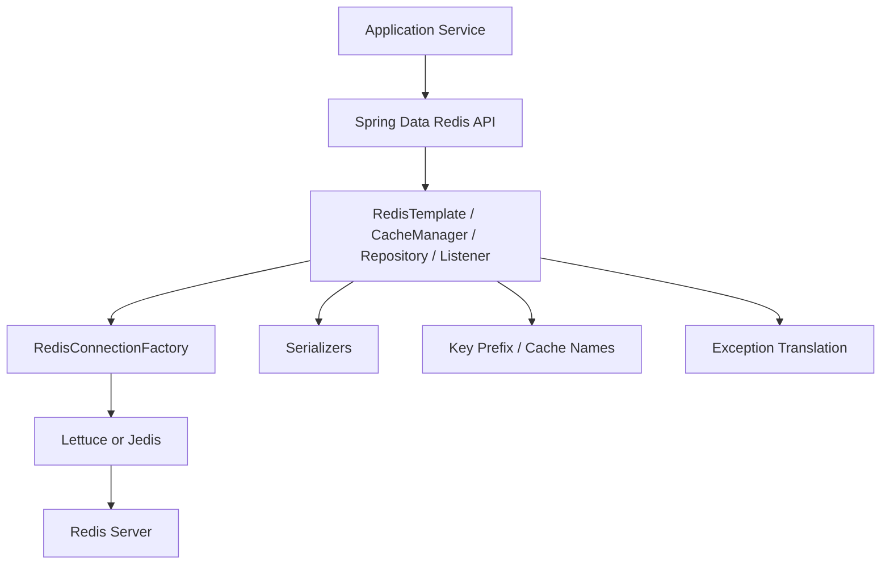
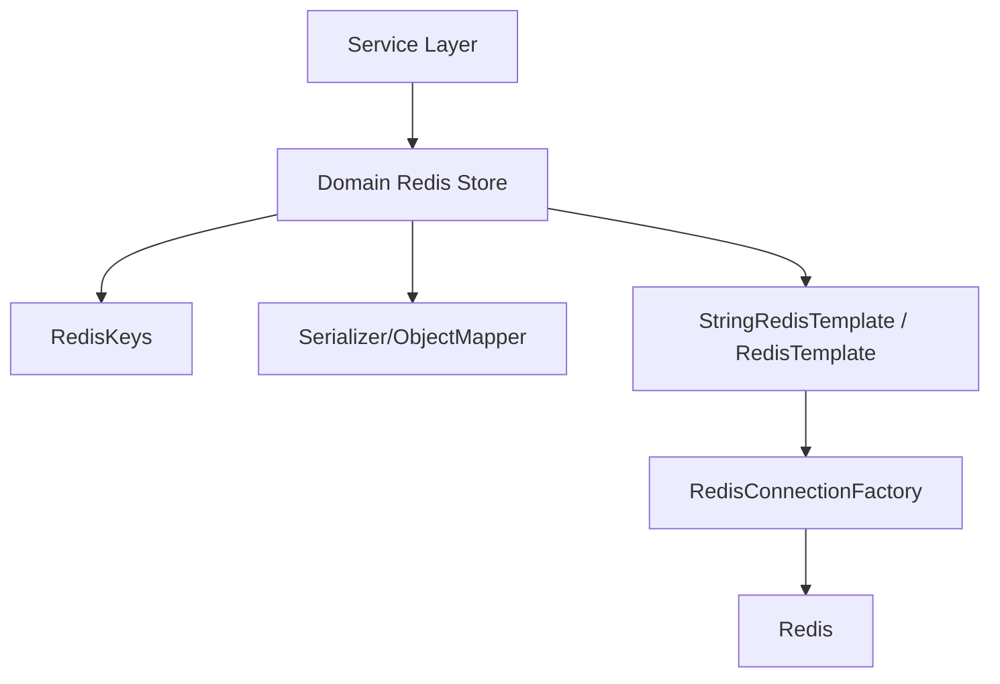
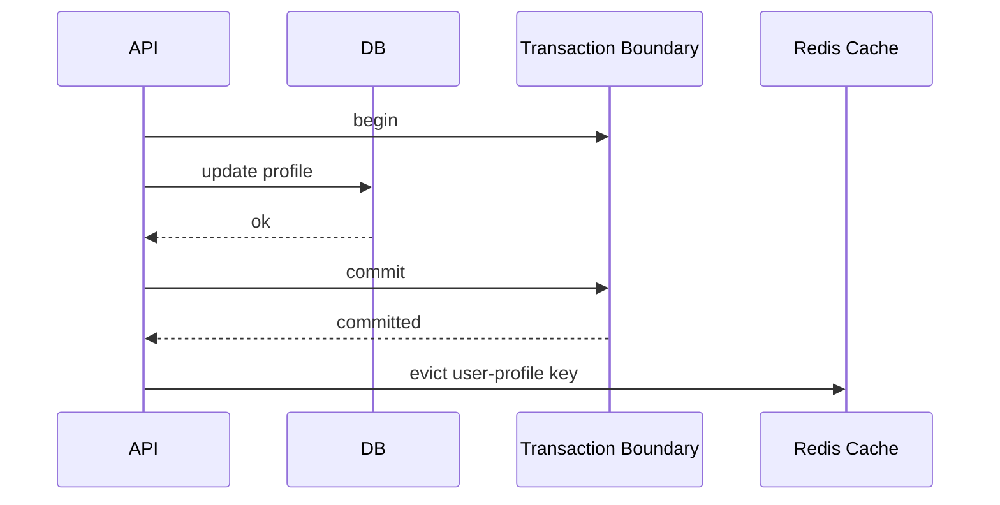
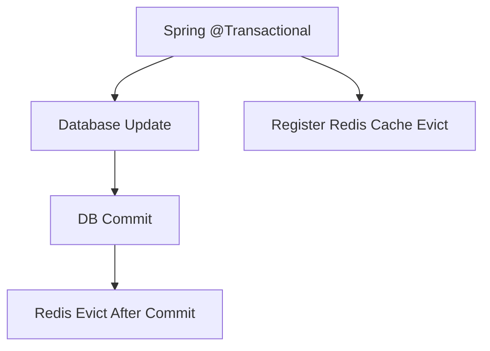
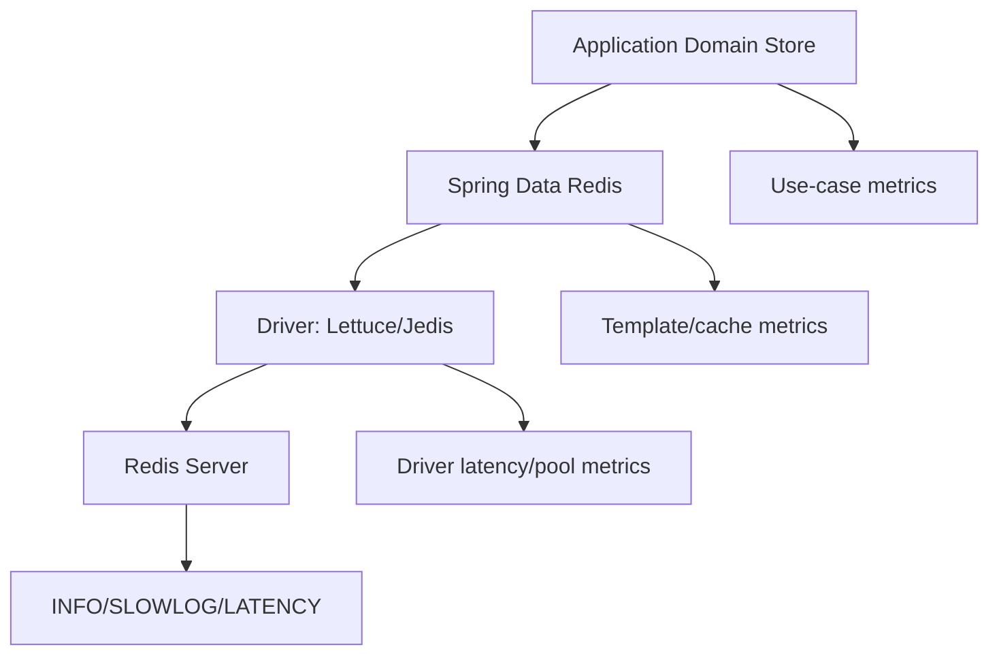
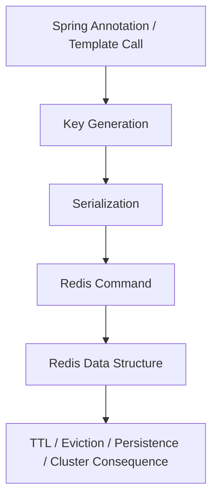

# Part 012 — Spring Data Redis: Template, Repository, Serialization, Cache Abstraction

Part 009 compared Java Redis clients.
Part 010 covered Lettuce.
Part 011 covered Jedis.

This part covers Spring Data Redis.

Spring Data Redis is not “just a Redis client.”
It is an abstraction layer over Redis connectivity, serialization, data access helpers, cache integration, repositories, pub/sub, scripting, and more.

That abstraction is useful, but it is also dangerous when it hides Redis semantics that matter in production.

This part focuses on how to use Spring Data Redis as an engineering tool, not as magic.

---

## 1. Kaufman Skill Decomposition

Target skill:

> Use Spring Data Redis in a production Java service while preserving explicit control over serialization, key naming, TTL, cache behavior, connection configuration, error handling, and Redis-specific correctness boundaries.

Sub-skills:

| Sub-skill | What you must be able to do |
|---|---|
| Connection factory | Configure Lettuce/Jedis-backed `RedisConnectionFactory` intentionally |
| Template selection | Choose `StringRedisTemplate`, `RedisTemplate<K,V>`, or lower-level connection APIs |
| Serialization | Avoid unsafe/default serialization and design stable key/value encoding |
| Operations API | Use `opsForValue`, `opsForHash`, `opsForSet`, `opsForZSet`, `opsForStream` deliberately |
| Cache abstraction | Configure `RedisCacheManager`, TTL, key prefix, null caching, serializers |
| Repository abstraction | Understand when Redis repositories help and when they hide too much |
| Transactions | Know the boundary of Spring transaction synchronization with Redis |
| Scripting | Execute Lua through `RedisScript` with typed results |
| Messaging | Use listener containers without confusing Pub/Sub with durable messaging |
| Streams | Use Spring abstractions without forgetting Redis Streams semantics |
| Testing | Validate TTL, serialization, cache names, and key output against real Redis |
| Operations | Expose metrics, trace command latency, and diagnose abstraction leakage |

The senior-level skill is not “knowing annotations.”
It is being able to answer:

- What exact Redis keys will this code produce?
- What exact bytes will be stored?
- What TTL will each key have?
- What happens when Redis is unavailable?
- Does this abstraction preserve the semantics required by the domain?

---

## 2. Spring Data Redis Mental Model

Spring Data Redis sits between application code and Redis client libraries.



The core abstraction is not Redis itself.
The core abstraction is:

> Redis access through Spring-managed connection, serialization, and operation templates.

That means every production Spring Data Redis design has two layers:

1. Spring layer decisions.
2. Redis layer consequences.

You need both.

---

## 3. What Spring Data Redis Gives You

Spring Data Redis provides:

| Capability | Why it matters |
|---|---|
| `RedisConnectionFactory` | Driver-neutral connection abstraction over Lettuce/Jedis |
| `RedisTemplate` | High-level Redis operation API with serializers |
| `StringRedisTemplate` | Convenience template for string keys and string values |
| Operation views | Typed access to values, hashes, lists, sets, sorted sets, streams |
| Cache abstraction | Spring `@Cacheable`, `@CachePut`, `@CacheEvict` with Redis backend |
| Repositories | Object mapping style over Redis Hashes and secondary indexes |
| Pub/Sub listener container | Message listener management |
| Scripting support | Lua execution with `RedisScript` |
| Exception translation | Spring `DataAccessException` hierarchy |
| Transaction synchronization | Participation in Spring-managed transaction lifecycle, with caveats |

This is useful when you want Spring-managed Redis access.

But every feature has a boundary.

---

## 4. First Production Rule: Do Not Accept Serialization Defaults Blindly

Spring Data Redis can use Java native serialization by default in some configurations.
This is rarely a good production default.

Problems with Java native serialization:

- unreadable in Redis CLI;
- brittle across class/package changes;
- larger payloads;
- security risk if untrusted data is deserialized;
- poor interoperability with non-Java systems;
- difficult debugging during incidents.

Production rule:

> Always configure key and value serializers explicitly.

Preferred default for many services:

- keys: `StringRedisSerializer`
- hash keys: `StringRedisSerializer`
- values: JSON serializer or explicit binary serializer
- cache values: JSON serializer with stable type handling or service-owned envelope

Example configuration:

```java
import com.fasterxml.jackson.databind.ObjectMapper;
import org.springframework.context.annotation.Bean;
import org.springframework.context.annotation.Configuration;
import org.springframework.data.redis.connection.RedisConnectionFactory;
import org.springframework.data.redis.core.RedisTemplate;
import org.springframework.data.redis.serializer.GenericJackson2JsonRedisSerializer;
import org.springframework.data.redis.serializer.RedisSerializationContext;
import org.springframework.data.redis.serializer.StringRedisSerializer;

@Configuration
public class RedisTemplateConfig {

    @Bean
    RedisTemplate<String, Object> redisTemplate(
        RedisConnectionFactory connectionFactory,
        ObjectMapper objectMapper
    ) {
        StringRedisSerializer stringSerializer = new StringRedisSerializer();
        GenericJackson2JsonRedisSerializer jsonSerializer =
            new GenericJackson2JsonRedisSerializer(objectMapper);

        RedisTemplate<String, Object> template = new RedisTemplate<>();
        template.setConnectionFactory(connectionFactory);
        template.setKeySerializer(stringSerializer);
        template.setHashKeySerializer(stringSerializer);
        template.setValueSerializer(jsonSerializer);
        template.setHashValueSerializer(jsonSerializer);
        template.afterPropertiesSet();
        return template;
    }
}
```

This is still not automatically perfect.
You must review type metadata, compatibility, payload size, and security posture.

For strict production contracts, many teams prefer a domain-specific JSON envelope rather than generic object serialization.

---

## 5. `StringRedisTemplate`: The Most Honest Template

`StringRedisTemplate` uses string keys and string values.
It is often the best starting point for production systems because it keeps Redis data inspectable.

Example:

```java
import org.springframework.data.redis.core.StringRedisTemplate;
import java.time.Duration;
import java.util.Optional;

public final class TokenRedisStore {
    private final StringRedisTemplate redis;

    public TokenRedisStore(StringRedisTemplate redis) {
        this.redis = redis;
    }

    public void saveToken(String tokenId, String tokenJson, Duration ttl) {
        redis.opsForValue().set(RedisKeys.token(tokenId), tokenJson, ttl);
    }

    public Optional<String> findToken(String tokenId) {
        return Optional.ofNullable(redis.opsForValue().get(RedisKeys.token(tokenId)));
    }

    public void deleteToken(String tokenId) {
        redis.delete(RedisKeys.token(tokenId));
    }
}
```

Benefits:

- easy to inspect using `redis-cli`;
- easy to debug incidents;
- language-neutral;
- explicit JSON parsing can be placed in the domain store;
- avoids generic object serializer surprises.

Trade-off:

- you write serialization/deserialization code yourself;
- type safety is at your boundary, not the template.

For critical systems, that trade-off is often worth it.

---

## 6. `RedisTemplate<K,V>` Operation Views

`RedisTemplate` exposes operation views mapped to Redis data structures.

| Spring API | Redis shape | Typical usage |
|---|---|---|
| `opsForValue()` | String | cache value, token, counter, flag |
| `opsForHash()` | Hash | object fields, session fields, small maps |
| `opsForList()` | List | simple queue, recent items |
| `opsForSet()` | Set | membership, deduplication, tag sets |
| `opsForZSet()` | Sorted Set | leaderboard, scheduling, sliding window |
| `opsForStream()` | Stream | consumer group, event log-like workflows |
| `boundValueOps(key)` | key-bound String ops | repeated operations on one key |
| `boundHashOps(key)` | key-bound Hash ops | repeated operations on one hash |

Example:

```java
public void addRecentItem(String userId, String itemId) {
    String key = RedisKeys.recentItems(userId);
    redis.opsForList().leftPush(key, itemId);
    redis.opsForList().trim(key, 0, 49);
    redis.expire(key, Duration.ofDays(7));
}
```

This is simple, but not atomic.
A crash between `leftPush`, `trim`, and `expire` can leave partial state.
If atomicity matters, use Lua.

Spring Data Redis makes commands convenient.
It does not remove Redis correctness questions.

---

## 7. Key Design Still Belongs to You

Spring does not save you from bad Redis keys.

Do not do this:

```java
String key = "user:" + userId;
```

Use key builders:

```java
public final class RedisKeys {
    private RedisKeys() {}

    public static String userProfile(String tenantId, String userId) {
        return "user-profile:v2:{tenant:" + safe(tenantId) + ":user:" + safe(userId) + "}";
    }

    public static String cacheUserProfile(String tenantId, String userId) {
        return "cache:user-profile:v1:{tenant:" + safe(tenantId) + ":user:" + safe(userId) + "}";
    }

    private static String safe(String value) {
        if (value == null || value.isBlank()) {
            throw new IllegalArgumentException("Blank Redis key component");
        }
        if (value.contains(" ") || value.contains("\n") || value.contains("\r")) {
            throw new IllegalArgumentException("Unsafe Redis key component");
        }
        return value;
    }
}
```

For Redis Cluster, hash tags remain your responsibility.
Spring Data Redis will not magically make cross-slot multi-key operations valid.

---

## 8. Domain Store Pattern with Spring Data Redis

The clean architecture pattern is the same as with raw clients:



Example:

```java
import com.fasterxml.jackson.databind.ObjectMapper;
import org.springframework.data.redis.core.StringRedisTemplate;
import org.springframework.stereotype.Repository;

import java.time.Duration;
import java.util.Optional;

@Repository
public class UserProfileCache {
    private final StringRedisTemplate redis;
    private final ObjectMapper objectMapper;
    private final Duration ttl = Duration.ofMinutes(30);

    public UserProfileCache(StringRedisTemplate redis, ObjectMapper objectMapper) {
        this.redis = redis;
        this.objectMapper = objectMapper;
    }

    public Optional<UserProfile> find(String tenantId, String userId) {
        String key = RedisKeys.cacheUserProfile(tenantId, userId);
        String json = redis.opsForValue().get(key);
        if (json == null) {
            return Optional.empty();
        }
        try {
            return Optional.of(objectMapper.readValue(json, UserProfile.class));
        } catch (Exception e) {
            redis.delete(key); // quarantine bad cached value
            return Optional.empty();
        }
    }

    public void put(String tenantId, UserProfile profile) {
        try {
            String key = RedisKeys.cacheUserProfile(tenantId, profile.userId());
            String json = objectMapper.writeValueAsString(profile);
            redis.opsForValue().set(key, json, ttlWithJitter(ttl));
        } catch (Exception ignored) {
            // cache fill failure should not break source-of-truth read path
        }
    }

    private Duration ttlWithJitter(Duration base) {
        long seconds = base.toSeconds();
        long jitter = Math.max(1, Math.round(seconds * 0.10));
        long actual = seconds + java.util.concurrent.ThreadLocalRandom.current()
            .nextLong(-jitter, jitter + 1);
        return Duration.ofSeconds(actual);
    }
}
```

This pattern is boring in the best way:

- explicit keys;
- explicit TTL;
- explicit serialization;
- explicit failure behavior;
- no Redis details leaking into business services.

---

## 9. Cache Abstraction: Useful but Dangerous

Spring Cache lets you write:

```java
@Cacheable(cacheNames = "user-profile", key = "#tenantId + ':' + #userId")
public UserProfile getProfile(String tenantId, String userId) {
    return database.loadProfile(tenantId, userId);
}
```

This is productive.
It can also be dangerous.

Hidden questions:

- What is the exact Redis key?
- What serializer stores the value?
- What TTL does this cache use?
- Are null values cached?
- Are exceptions cached?
- Is the cache per tenant?
- Is the key stable across refactoring?
- Does cache eviction happen on writes?
- What happens during Redis outage?

The annotation is not the design.
It is only a syntax layer.

---

## 10. Redis Cache Manager Configuration

Configure cache behavior explicitly.

```java
import com.fasterxml.jackson.databind.ObjectMapper;
import org.springframework.cache.CacheManager;
import org.springframework.context.annotation.Bean;
import org.springframework.context.annotation.Configuration;
import org.springframework.data.redis.cache.RedisCacheConfiguration;
import org.springframework.data.redis.cache.RedisCacheManager;
import org.springframework.data.redis.connection.RedisConnectionFactory;
import org.springframework.data.redis.serializer.GenericJackson2JsonRedisSerializer;
import org.springframework.data.redis.serializer.RedisSerializationContext;
import org.springframework.data.redis.serializer.StringRedisSerializer;

import java.time.Duration;
import java.util.Map;

@Configuration
public class RedisCacheConfig {

    @Bean
    CacheManager cacheManager(
        RedisConnectionFactory connectionFactory,
        ObjectMapper objectMapper
    ) {
        var keySerializer = new StringRedisSerializer();
        var valueSerializer = new GenericJackson2JsonRedisSerializer(objectMapper);

        RedisCacheConfiguration defaultConfig = RedisCacheConfiguration.defaultCacheConfig()
            .disableCachingNullValues()
            .serializeKeysWith(RedisSerializationContext.SerializationPair.fromSerializer(keySerializer))
            .serializeValuesWith(RedisSerializationContext.SerializationPair.fromSerializer(valueSerializer))
            .entryTtl(Duration.ofMinutes(10))
            .prefixCacheNameWith("cache:v1:");

        Map<String, RedisCacheConfiguration> cacheConfigs = Map.of(
            "user-profile", defaultConfig.entryTtl(Duration.ofMinutes(30)),
            "product-price", defaultConfig.entryTtl(Duration.ofMinutes(5)),
            "permission", defaultConfig.entryTtl(Duration.ofMinutes(2))
        );

        return RedisCacheManager.builder(connectionFactory)
            .cacheDefaults(defaultConfig)
            .withInitialCacheConfigurations(cacheConfigs)
            .transactionAware()
            .build();
    }
}
```

Important decisions:

| Decision | Why |
|---|---|
| disable null caching | prevents long-lived negative mistakes unless explicitly desired |
| prefix cache names | separates cache keys from other Redis key families |
| per-cache TTL | avoids one-size-fits-all expiry |
| explicit serializer | avoids Java native serialization surprises |
| transaction-aware | defers cache puts/evicts until Spring transaction commit where applicable |

Transaction awareness does not make Redis and the database one atomic system.
It only coordinates cache operation timing with Spring transaction lifecycle.

---

## 11. Cache Key Generation

SpEL keys can become fragile.

Bad:

```java
@Cacheable(cacheNames = "user-profile", key = "#userId")
```

This ignores tenant boundary.

Better:

```java
@Cacheable(cacheNames = "user-profile", key = "#tenantId + ':' + #userId")
```

Better still: centralize key generation.

```java
import org.springframework.cache.interceptor.KeyGenerator;
import org.springframework.context.annotation.Bean;

@Bean("tenantAwareKeyGenerator")
KeyGenerator tenantAwareKeyGenerator() {
    return (target, method, params) -> {
        if (params.length < 2) {
            throw new IllegalArgumentException("Expected tenantId and entity id");
        }
        return "tenant:" + params[0] + ":id:" + params[1];
    };
}
```

Usage:

```java
@Cacheable(cacheNames = "user-profile", keyGenerator = "tenantAwareKeyGenerator")
public UserProfile getProfile(String tenantId, String userId) {
    return database.loadProfile(tenantId, userId);
}
```

Cache keys are API contracts.
Treat them like database schema.

---

## 12. Cache Invalidation with Spring Cache

Typical write path:

```java
@CacheEvict(cacheNames = "user-profile", key = "#tenantId + ':' + #userId")
@Transactional
public void updateProfile(String tenantId, String userId, UpdateProfileCommand command) {
    database.updateProfile(tenantId, userId, command);
}
```

This looks correct but has timing implications.

Questions:

- Does eviction happen before or after DB commit?
- What if DB update succeeds and Redis eviction fails?
- What if Redis eviction succeeds and DB update rolls back?
- What if another request repopulates stale data during the write?

Safer write-side design often uses:

- transaction-aware cache manager;
- explicit after-commit invalidation;
- versioned cache values;
- short TTL for high-churn data;
- event-driven invalidation when multiple services cache the same object.

Example after-commit event pattern:



This still has a failure window.
That is why TTL and versioning remain important.

---

## 13. `@Cacheable(sync = true)` Is Not a Distributed Lock

Spring has cache synchronization options that can reduce local duplicate computation.
But do not assume it prevents stampede across a fleet.

If 50 application instances miss the same Redis key at once, local synchronization on one JVM is not enough.

For distributed stampede control, consider:

- Redis mutex with lease and fencing where correctness matters;
- stale-while-revalidate;
- probabilistic early refresh;
- request coalescing at service layer;
- short lock timeout and fallback to stale value.

Spring Cache is a cache API.
It is not a distributed coordination framework.

---

## 14. Repository Abstraction

Spring Data Redis repositories let you map objects to Redis structures.

Conceptual example:

```java
import org.springframework.data.annotation.Id;
import org.springframework.data.redis.core.RedisHash;

@RedisHash(value = "people", timeToLive = 3600)
public class Person {
    @Id
    private String id;
    private String firstname;
    private String lastname;
}
```

Repository:

```java
import org.springframework.data.repository.CrudRepository;

public interface PersonRepository extends CrudRepository<Person, String> {
}
```

This is useful for:

- small object-like aggregates;
- prototypes where object mapping is acceptable;
- internal tools;
- simple TTL-backed state;
- non-critical lookup storage.

But repositories can hide details:

- generated key format;
- secondary index keys;
- TTL behavior;
- object mapping format;
- cleanup of index entries;
- memory cost;
- Cluster slot behavior;
- query limitations.

Production rule:

> Use Redis repositories only when you can explain the exact Redis keys and structures they create.

If you cannot, use explicit templates.

---

## 15. When Not to Use Redis Repositories

Avoid repositories for:

| Use case | Why explicit template is better |
|---|---|
| high-throughput hot path | less abstraction and fewer hidden keys |
| strict key naming | repositories generate structure conventions |
| complex TTL lifecycle | explicit commands are clearer |
| Cluster slot-sensitive logic | key layout must be controlled |
| atomic multi-key operations | Lua/template with hash tags is clearer |
| memory-sensitive systems | hidden indexes may surprise you |
| interoperability with non-Java services | explicit JSON/key contracts are better |

Repositories are not bad.
They are just a higher-level abstraction with hidden operational consequences.

---

## 16. Hash Operations with `RedisTemplate`

Hashes are common for object-like storage.

```java
public void saveSessionFields(String sessionId, Session session) {
    String key = RedisKeys.session(sessionId);
    var hash = redis.opsForHash();

    hash.put(key, "userId", session.userId());
    hash.put(key, "tenantId", session.tenantId());
    hash.put(key, "createdAt", session.createdAt().toString());
    hash.put(key, "schema", "session.v1");

    redis.expire(key, Duration.ofMinutes(30));
}
```

This is readable, but multiple `put` calls are multiple Redis commands unless pipelined or executed in a transaction.

Alternative:

```java
Map<String, String> fields = Map.of(
    "userId", session.userId(),
    "tenantId", session.tenantId(),
    "createdAt", session.createdAt().toString(),
    "schema", "session.v1"
);
redis.opsForHash().putAll(key, fields);
redis.expire(key, Duration.ofMinutes(30));
```

Still not atomic with the TTL unless wrapped in Lua/transaction.
For session-like cache, that may be acceptable.
For correctness-critical state, be explicit.

---

## 17. Sorted Set Operations Example: Sliding Window

Spring Data Redis can express sorted set patterns clearly.

Example: simple sliding window request tracker.

```java
public long recordRequest(String tenantId, String userId, long nowMillis) {
    String key = RedisKeys.rateLimitWindow(tenantId, userId);
    long windowMillis = 60_000;
    long cutoff = nowMillis - windowMillis;

    var zset = redis.opsForZSet();
    zset.removeRangeByScore(key, 0, cutoff);
    zset.add(key, String.valueOf(nowMillis), nowMillis);
    redis.expire(key, Duration.ofMinutes(2));

    Long count = zset.count(key, cutoff + 1, nowMillis);
    return count == null ? 0 : count;
}
```

This demonstrates the pattern but is not fully atomic.
A production rate limiter should use Lua so remove/add/count/expire happen as one server-side operation.

Spring Template does not eliminate Lua.
It makes command access convenient.

---

## 18. Lua Scripting with Spring Data Redis

Spring Data Redis supports script execution through `RedisScript`.

Example sliding window script:

```lua
-- KEYS[1] = rate limit key
-- ARGV[1] = now millis
-- ARGV[2] = window millis
-- ARGV[3] = limit
-- ARGV[4] = ttl seconds
-- ARGV[5] = member id

local now = tonumber(ARGV[1])
local window = tonumber(ARGV[2])
local limit = tonumber(ARGV[3])
local ttl = tonumber(ARGV[4])
local member = ARGV[5]
local cutoff = now - window

redis.call('ZREMRANGEBYSCORE', KEYS[1], 0, cutoff)
redis.call('ZADD', KEYS[1], now, member)
redis.call('EXPIRE', KEYS[1], ttl)

local count = redis.call('ZCOUNT', KEYS[1], cutoff + 1, now)
if count > limit then
  return 0
end
return 1
```

Spring usage:

```java
import org.springframework.core.io.ClassPathResource;
import org.springframework.data.redis.core.StringRedisTemplate;
import org.springframework.data.redis.core.script.DefaultRedisScript;
import org.springframework.data.redis.core.script.RedisScript;

public final class RateLimiter {
    private final StringRedisTemplate redis;
    private final RedisScript<Long> script;

    public RateLimiter(StringRedisTemplate redis) {
        this.redis = redis;
        DefaultRedisScript<Long> redisScript = new DefaultRedisScript<>();
        redisScript.setLocation(new ClassPathResource("redis/rate-limit.lua"));
        redisScript.setResultType(Long.class);
        this.script = redisScript;
    }

    public boolean allow(String tenantId, String userId) {
        long now = System.currentTimeMillis();
        String key = RedisKeys.rateLimitWindow(tenantId, userId);
        String member = now + ":" + java.util.UUID.randomUUID();

        Long result = redis.execute(
            script,
            java.util.List.of(key),
            String.valueOf(now),
            "60000",
            "100",
            "120",
            member
        );
        return Long.valueOf(1L).equals(result);
    }
}
```

Production notes:

- keep scripts in versioned resources;
- test scripts against real Redis;
- keep all keys in the same Cluster slot;
- avoid long-running scripts;
- expose script result and latency metrics;
- treat script changes like API/schema changes.

---

## 19. Pipelining with Spring Data Redis

Spring Data Redis supports pipelining through callback APIs.

Conceptual example:

```java
List<Object> results = redis.executePipelined((connection) -> {
    for (String key : keys) {
        connection.stringCommands().get(key.getBytes(StandardCharsets.UTF_8));
    }
    return null;
});
```

But beware:

- serializer behavior can affect result decoding;
- large batches can consume memory;
- pipeline is not atomic;
- pipeline result ordering must be preserved;
- error handling may be less obvious than direct template calls.

For most application code, prefer domain-specific batch methods that hide pipeline details:

```java
public Map<String, UserProfile> findProfiles(String tenantId, List<String> userIds) {
    if (userIds.size() > 500) {
        throw new IllegalArgumentException("Too many IDs for one Redis batch");
    }
    // pipeline internally
}
```

Application services should not decide pipeline mechanics repeatedly.

---

## 20. Transactions with Spring Data Redis

Spring Data Redis can support Redis transactions and can also participate in Spring transaction synchronization.
These are not the same concept.

Redis transaction:

```text
MULTI / EXEC on Redis connection
```

Spring transaction synchronization:

```text
run cache operation after surrounding DB transaction commits
```

Do not confuse them.

Example conceptual flow:



This improves timing.
It does not guarantee atomic commit across DB and Redis.

If Redis eviction fails after DB commit, the DB is already committed.
Use TTL, versioned cache, retryable invalidation event, or outbox pattern if this matters.

---

## 21. Pub/Sub with Spring Data Redis

Spring provides listener containers for Redis Pub/Sub.

Conceptual setup:

```java
import org.springframework.context.annotation.Bean;
import org.springframework.data.redis.connection.MessageListener;
import org.springframework.data.redis.connection.RedisConnectionFactory;
import org.springframework.data.redis.listener.PatternTopic;
import org.springframework.data.redis.listener.RedisMessageListenerContainer;

@Bean
RedisMessageListenerContainer redisMessageListenerContainer(
    RedisConnectionFactory connectionFactory,
    MessageListener listener
) {
    RedisMessageListenerContainer container = new RedisMessageListenerContainer();
    container.setConnectionFactory(connectionFactory);
    container.addMessageListener(listener, new PatternTopic("cache-invalidate:*"));
    return container;
}
```

Use this for:

- cache invalidation hints;
- local in-memory cache clearing;
- ephemeral notifications;
- lightweight control signals.

Do not use it for:

- payment workflow;
- audit events;
- durable business process;
- exactly-once processing;
- replay-dependent consumers.

Redis Pub/Sub is ephemeral.
Spring listener containers do not make it durable.

---

## 22. Streams with Spring Data Redis

Spring Data Redis includes Stream operations.
This can be useful for Redis Streams use cases.

But the semantics remain Redis Streams semantics:

- consumer groups;
- pending entries;
- acknowledgement;
- claiming idle messages;
- trimming;
- poison message handling;
- replay design.

Do not treat Spring Streams support as equivalent to Kafka.

A strong Spring Streams design still needs:

| Concern | Required design |
|---|---|
| consumer identity | stable consumer names per worker instance |
| acknowledgement | after successful processing only |
| retry | pending entry handling |
| poison messages | DLQ or quarantine stream |
| trimming | memory retention policy |
| idempotency | consumer-side deduplication when needed |
| monitoring | lag, pending count, idle age |

Spring makes the API familiar.
Redis still defines the failure model.

---

## 23. Connection Factory: Lettuce vs Jedis Under Spring

Spring Data Redis can use Lettuce or Jedis underneath.

Most Spring Boot applications default to Lettuce unless configured otherwise.
That is usually a good default because Lettuce supports scalable connection handling and async internals.

But the decision should be explicit.

| Driver | Good fit under Spring |
|---|---|
| Lettuce | default choice, Cluster/Sentinel, scalable connection model, reactive support |
| Jedis | simple synchronous usage, teams already standardized on Jedis, explicit pooling preference |

Spring layer does not remove driver behavior.
Timeouts, pooling, topology refresh, reconnect behavior, and command execution model still matter.

Configuration should answer:

- standalone, Sentinel, Cluster, or managed Redis?
- TLS or plaintext?
- username/password/ACL user?
- command timeout?
- connect timeout?
- pool enabled or not?
- database index? only for standalone, not Cluster style assumptions.

---

## 24. Spring Boot Property Configuration

A typical Spring Boot configuration may look like:

```yaml
spring:
  data:
    redis:
      host: redis.internal
      port: 6379
      username: app_user
      password: ${REDIS_PASSWORD}
      timeout: 500ms
      ssl:
        enabled: true
      lettuce:
        pool:
          enabled: true
          max-active: 64
          max-idle: 32
          min-idle: 8
          max-wait: 50ms
```

For Cluster:

```yaml
spring:
  data:
    redis:
      cluster:
        nodes:
          - redis-1.internal:6379
          - redis-2.internal:6379
          - redis-3.internal:6379
      username: app_user
      password: ${REDIS_PASSWORD}
      timeout: 500ms
```

For Sentinel:

```yaml
spring:
  data:
    redis:
      sentinel:
        master: mymaster
        nodes:
          - sentinel-1.internal:26379
          - sentinel-2.internal:26379
          - sentinel-3.internal:26379
      username: app_user
      password: ${REDIS_PASSWORD}
      timeout: 500ms
```

Exact property names may differ by Spring Boot version.
Pin the version and verify generated configuration metadata.

Do not treat YAML as the architecture.
It is only the final expression of connection decisions.

---

## 25. Timeout and Failure Behavior

Spring Redis calls can fail through:

- connection timeout;
- command timeout;
- pool exhaustion;
- serialization error;
- Redis command error;
- cluster redirect/topology issue;
- authentication/TLS failure;
- application-level deadline exceeded.

A domain store should classify behavior by Redis use case.

| Use case | Redis failure handling |
|---|---|
| optional cache | degrade to DB/source of truth |
| session store | fail request or force login |
| rate limiter | fail open/closed based on risk |
| idempotency | often fail closed in financial workflows |
| notification pub/sub | log and continue if non-critical |
| stream consumer | pause/retry with idempotency |

Spring exceptions should be translated into domain behavior.
Do not let every Redis outage become the same generic `500` unless that is truly the intended behavior.

---

## 26. Observability with Spring Data Redis

You need visibility at three layers:



Recommended metrics:

| Metric | Tags |
|---|---|
| `redis.operation.duration` | operation, key_family, outcome |
| `redis.operation.errors` | operation, key_family, error_class |
| `redis.cache.hit` | cache_name |
| `redis.cache.miss` | cache_name |
| `redis.cache.put` | cache_name |
| `redis.cache.evict` | cache_name |
| `redis.serialization.failure` | key_family, schema |
| `redis.payload.bytes` | key_family |
| `redis.script.duration` | script_name |
| `redis.stream.pending` | stream, group |

Avoid high-cardinality tags:

- raw Redis key;
- user ID;
- session ID;
- token;
- email;
- request ID as metric tag.

Use logs/traces for request-specific correlation.

---

## 27. Cache Metrics Are Not Enough

Spring Cache metrics can tell you hit/miss behavior.
They cannot fully tell you:

- whether cached values are semantically stale;
- whether invalidation is correct;
- whether values are too large;
- whether one cache key is hot;
- whether Redis-side eviction removed entries;
- whether cache population creates DB stampede;
- whether serialization compatibility broke after deployment.

Add domain-level signals:

| Signal | Example |
|---|---|
| stale detection | cached version lower than DB version |
| payload size | profile cache p99 size |
| fill source | cache filled from DB/read model/API |
| stampede | concurrent source loads per key family |
| invalidation lag | DB commit to cache evict duration |

The goal is not just “high hit rate.”
The goal is correct, bounded, useful caching.

---

## 28. Testing Spring Data Redis

Use real Redis integration tests for behavior.

Test checklist:

| Test | Why |
|---|---|
| key generation | prevents accidental production key changes |
| serializer output | verifies data can be read after refactoring |
| TTL per cache | prevents immortal cache entries |
| null caching | verifies negative cache policy |
| cache key tenant boundary | prevents data leak across tenants |
| eviction after write | verifies update path |
| Lua script result | verifies atomic workflow |
| repository key layout | reveals hidden keys |
| Redis outage | verifies degradation/fail behavior |
| Cluster slot grouping | catches cross-slot errors |

Example test:

```java
@Test
void userProfileCacheUsesTtl() {
    cache.put("acme", new UserProfile("u-1", "Alice"));

    String key = RedisKeys.cacheUserProfile("acme", "u-1");
    Long ttl = stringRedisTemplate.getExpire(key);

    assertThat(ttl).isNotNull();
    assertThat(ttl).isBetween(1L, 1800L + 180L);
}
```

Example serializer regression test:

```java
@Test
void cachedProfileCanReadPreviousSchema() throws Exception {
    String oldJson = """
      {"schema":"user-profile.v1","userId":"u-1","displayName":"Alice"}
      """;

    stringRedisTemplate.opsForValue()
        .set(RedisKeys.cacheUserProfile("acme", "u-1"), oldJson, Duration.ofMinutes(10));

    Optional<UserProfile> profile = cache.find("acme", "u-1");

    assertThat(profile).isPresent();
}
```

---

## 29. Avoiding Abstraction Leakage

Spring Data Redis abstraction leaks when application code assumes generic collection-like behavior and forgets Redis cost.

Example:

```java
redis.opsForSet().members(key);
```

If the set has 10 elements, fine.
If it has 10 million elements, this is an incident.

Prefer bounded APIs:

```java
public Set<String> findSomeMembers(String tenantId, int limit) {
    // use scan-like approach or bounded model
}
```

Other dangerous calls:

| Call style | Risk |
|---|---|
| `members` on huge set | returns everything |
| `range` on huge list without limits | memory/latency spike |
| `keys(pattern)` | can block Redis over large keyspaces |
| unbounded `findAll()` repository call | hidden full scan |
| cache all large objects | memory blow-up |
| default serializer | unreadable/unsafe data |

Abstractions should not hide cardinality.
Make cardinality explicit in API names and limits.

---

## 30. Spring Data Redis and Multi-Tenancy

Multi-tenant systems need explicit Redis boundary design.

Decisions:

| Concern | Recommended practice |
|---|---|
| key namespace | include tenant ID in key family |
| cache name | separate tenant-aware keys, not necessarily separate cache managers |
| ACL | restrict command/key patterns if Redis ACL strategy supports it |
| TTL | tenant-specific TTL only if needed and bounded |
| eviction impact | prevent one tenant from creating global memory pressure |
| metrics | tag by tenant tier, not raw tenant ID unless cardinality is bounded |
| hot tenant | detect tenant/key-family pressure |

Example key:

```text
cache:user-profile:v1:{tenant:acme:user:u-1}
```

For very large tenants, avoid hash-tagging all tenant data into one slot.
Use narrower hash tags.

---

## 31. Security Concerns

Spring Data Redis security is not only username/password.

Review:

- TLS enabled where required;
- ACL user with least privileges;
- secrets not logged;
- raw Redis keys not exposing PII;
- serialized values not containing unnecessary sensitive data;
- cache entries expire according to policy;
- no Java native deserialization of untrusted data;
- admin commands not available to application user;
- tenant boundary encoded in keys;
- backups and snapshots protected.

For cache values, consider data minimization:

Bad cache value:

```json
{
  "userId": "u-1",
  "email": "alice@example.com",
  "fullAddress": "...",
  "dateOfBirth": "...",
  "identityDocument": "..."
}
```

Better:

```json
{
  "schema": "user-summary.v1",
  "userId": "u-1",
  "displayName": "Alice",
  "status": "ACTIVE"
}
```

Cache only what the read path needs.

---

## 32. Production Configuration Review

Before deploying Spring Data Redis, review:

| Area | Question |
|---|---|
| connection | standalone, Sentinel, Cluster, managed? |
| driver | Lettuce or Jedis, and why? |
| timeout | tied to endpoint/job SLO? |
| pool | max active, max wait, idle behavior? |
| serializer | explicitly configured? |
| key prefix | stable, versioned, tenant-safe? |
| TTL | per key family/cache? |
| null caching | intentional? |
| cache failure | degrade/fail behavior defined? |
| invalidation | write path and event path reviewed? |
| transaction sync | used where needed, understood where insufficient? |
| metrics | cache and command-level metrics available? |
| tests | real Redis tests validate key/TTL/serializer? |
| operations | Redis INFO/SLOWLOG/latency dashboards available? |

---

## 33. Common Spring Data Redis Anti-Patterns

### Anti-pattern 1 — Default serializer in production

Problem:

- unreadable keys/values;
- fragile payload compatibility;
- security concern.

Fix:

- configure string key serializer;
- configure JSON/binary value serializer explicitly;
- version payload schema.

### Anti-pattern 2 — `@Cacheable` everywhere

Problem:

- hidden stale data;
- unclear TTL;
- accidental caching of huge objects;
- inconsistent invalidation.

Fix:

- define cache policy per use case;
- review key/TTL/value size;
- add metrics.

### Anti-pattern 3 — Tenant-unaware cache keys

Problem:

- cross-tenant data leak.

Fix:

- always include tenant boundary in key or cache key generator.

### Anti-pattern 4 — Repository for hot path state

Problem:

- hidden key/index behavior;
- less control over memory and Cluster slots.

Fix:

- use explicit `StringRedisTemplate` or `RedisTemplate` store.

### Anti-pattern 5 — Assuming transaction-aware cache is distributed atomicity

Problem:

- Redis and DB can still diverge after commit.

Fix:

- use TTL, versioning, retryable invalidation, or outbox where needed.

### Anti-pattern 6 — Using Pub/Sub for durable workflows

Problem:

- message loss during disconnect;
- no replay.

Fix:

- use Redis Streams or a broker depending workflow.

---

## 34. Practice Plan

### Hour 1–2: Template configuration

Build:

- explicit `StringRedisTemplate` usage;
- explicit `RedisTemplate<String,Object>` serializer config;
- key builder tests.

Goal:

- understand exactly what bytes are stored.

### Hour 3–4: Cache manager

Build:

- two caches with different TTLs;
- disabled null caching;
- tenant-aware key generator;
- cache TTL test.

Goal:

- make annotation caching explicit.

### Hour 5–6: Domain store

Build:

- `UserProfileCache` with JSON envelope;
- TTL jitter;
- corrupt value quarantine;
- database fallback.

Goal:

- avoid raw Redis calls in service layer.

### Hour 7–8: Lua through Spring

Build:

- sliding window rate limiter script;
- integration test for atomic allow/deny;
- metrics around script execution.

Goal:

- use Spring convenience without losing Redis atomicity.

### Hour 9–10: Failure and invalidation drills

Run:

- Redis down during optional cache read;
- DB update with cache eviction failure;
- serializer schema change;
- tenant key collision test.

Goal:

- know where the abstraction leaks.

---

## 35. Summary

Spring Data Redis is powerful because it standardizes Redis usage across Spring applications.
It gives templates, serializers, cache abstraction, repositories, scripting, listeners, and driver integration.

The danger is that Redis remains Redis underneath.

The production mental model is:



If you remember only one rule:

> Spring Data Redis is production-safe when you make keys, serializers, TTL, failure behavior, and Redis data-structure semantics explicit instead of letting annotations and defaults decide them accidentally.

---

## 36. References

- Spring Data Redis Reference: https://docs.spring.io/spring-data/redis/reference/redis.html
- Spring Data Redis — Working with Objects through RedisTemplate: https://docs.spring.io/spring-data/redis/reference/redis/template.html
- Spring Data Redis GitHub project: https://github.com/spring-projects/spring-data-redis
- Redis Docs — Spring Data Redis cache integration: https://redis.io/docs/latest/integrate/spring-framework-cache/
- Redis Docs — Redis data types: https://redis.io/docs/latest/develop/data-types/
- Redis Docs — Redis Pub/Sub: https://redis.io/docs/latest/develop/pubsub/
- Redis Docs — Redis Streams: https://redis.io/docs/latest/develop/data-types/streams/
