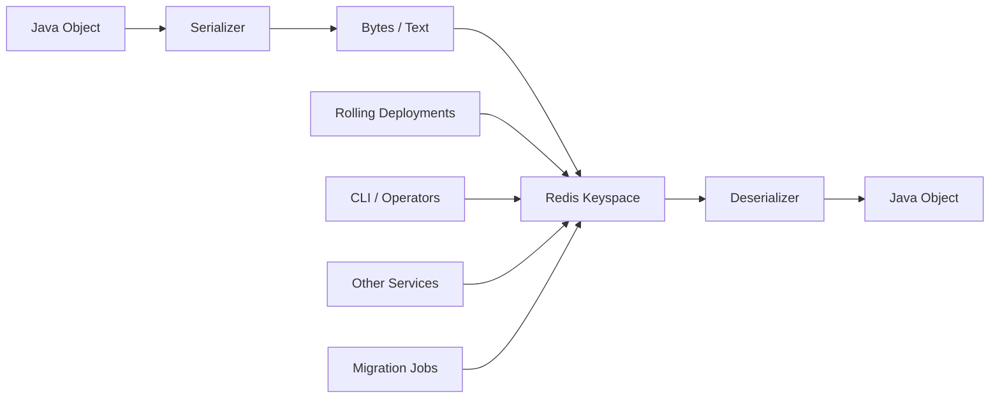
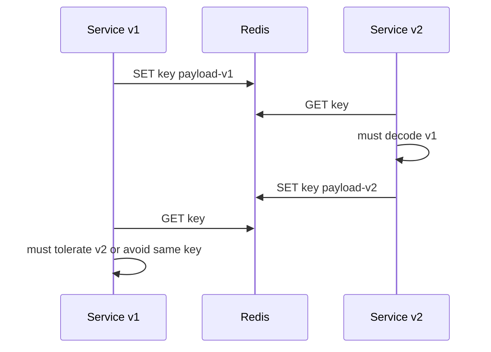
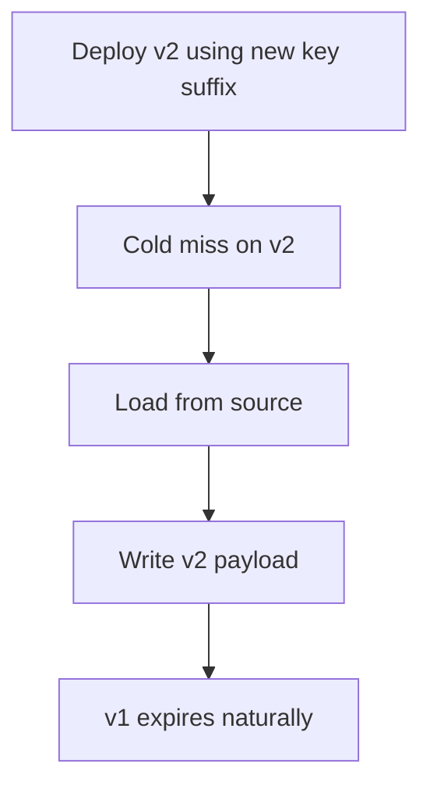
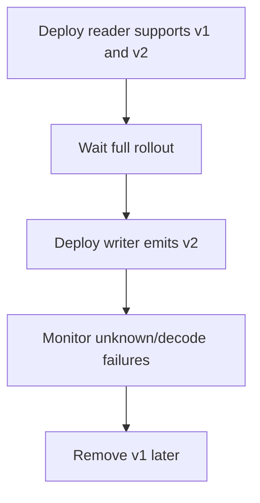

# Part 013 — Serialization Strategy: JSON, Binary, Compression, Compatibility

Part 009 compared Java Redis client choices.
Part 010 covered Lettuce.
Part 011 covered Jedis.
Part 012 covered Spring Data Redis.

This part focuses on one of the most underestimated production concerns:

> What exact bytes do we put into Redis, and can future versions of our services still read them safely?

Redis does not store Java objects.
Redis stores byte-oriented values and data structures.
The moment a Java application writes an object into Redis, we have created a storage contract.
If that contract is accidental, the system becomes fragile.

Serialization is not a library choice.
It is a compatibility, operability, security, performance, and migration decision.

---

## 1. Kaufman Skill Decomposition

Target skill:

> Design and operate Redis serialization contracts for Java services so that cached/session/ephemeral/coordination data remains readable, observable, safe, evolvable, and efficient across deployments.

Sub-skills:

| Sub-skill | What you must be able to do |
|---|---|
| Byte contract thinking | Treat every Redis value as an externalized data contract |
| Format selection | Choose String, JSON, typed JSON, binary, compressed, or native Redis structures intentionally |
| Key serialization | Keep Redis keys readable, stable, safe, and cluster-compatible |
| Value serialization | Encode values with compatibility and observability in mind |
| Hash field mapping | Decide between hash fields, nested JSON, or split keys |
| Schema evolution | Add, remove, rename, and migrate fields without breaking rolling deployments |
| Type safety | Avoid unsafe polymorphic deserialization and hidden class coupling |
| Spring integration | Configure `RedisTemplate`, `RedisCacheManager`, and serializers explicitly |
| Lettuce/Jedis integration | Use codecs or explicit conversion without hiding the byte contract |
| Compression | Apply compression only when payload size justifies CPU and complexity |
| Testing | Maintain golden payload tests, backward compatibility tests, and migration tests |
| Operations | Decode production values, inspect versions, and debug corrupt payloads quickly |

The senior-level habit is this:

> Before choosing a serializer, first decide the lifecycle and compatibility requirement of the data.

A 30-second idempotency marker and a 30-day session object should not be serialized with the same level of ceremony.

---

## 2. Redis Serialization Mental Model

Redis data structures are not Java data structures.



A serializer sits at the boundary between:

- Java runtime objects
- Redis bytes
- future service versions
- other services
- operational tools
- migration scripts
- incident response

If we serialize accidentally, we lose control over all of those boundaries.

### 2.1 The Core Rule

A Redis value is not just data.
It is a contract with these dimensions:

| Dimension | Question |
|---|---|
| Format | Is the value String, JSON, binary, compressed, encrypted, or native Redis structure? |
| Type identity | Does the stored value carry type information? Should it? |
| Version | Can we tell which schema version produced it? |
| Compatibility | Can old and new services read it during rolling deployment? |
| Debuggability | Can an engineer inspect it with `redis-cli` during an incident? |
| Size | Does it fit memory and network budget? |
| CPU | Is serialization/deserialization cheap enough for the path? |
| Safety | Can untrusted data trigger unsafe deserialization? |
| Ownership | Which service owns the contract? |
| Lifecycle | Is this cache, session, event, coordination marker, or materialized read model? |

---

## 3. What Gets Serialized in Redis?

Serialization does not only apply to values.

| Redis element | Example | Serialization concern |
|---|---|---|
| Key | `user:{123}:profile:v1` | naming, tenant, version, cluster hash tag |
| String value | JSON session payload | payload format and compatibility |
| Hash key | `cart:{c-123}` | object identity |
| Hash field | `totalAmount` | field naming stability |
| Hash value | `129900` | scalar conversion and units |
| List element | job payload | retry-safe payload contract |
| Set member | user id | canonical string representation |
| Sorted set member | order id | stable identity |
| Sorted set score | epoch millis | time unit precision |
| Stream field | `eventType=ORDER_CREATED` | event envelope |
| Stream value | JSON payload | durable-ish message schema |
| Lua arg | `ARGV[1]` | explicit string/bytes conversion |

The common mistake is to treat only String values as serialized.
In production, every boundary has a representation.

---

## 4. Serialization Design Principles

### 4.1 Prefer Explicit Over Magical

Bad:

```java
redisTemplate.opsForValue().set("user:123", userObject);
```

The code hides:

- key serializer
- value serializer
- class metadata
- null behavior
- date/time encoding
- enum encoding
- payload size
- schema compatibility

Better:

```java
String key = UserProfileKeys.byUserId(userId);
UserProfileCacheV1 payload = UserProfileCacheV1.from(domainProfile);
String json = objectMapper.writeValueAsString(payload);
stringRedisTemplate.opsForValue().set(key, json, Duration.ofMinutes(30));
```

This is more verbose, but it exposes the contract.

### 4.2 Optimize for Lifecycle, Not Fashion

| Data lifecycle | Recommended representation |
|---|---|
| Very short marker | String scalar, often `"1"` or request id |
| Counter | Redis integer string via `INCR`/`DECR` |
| Token/session | JSON envelope or Redis Hash depending update pattern |
| Cached API response | JSON DTO with versioned key or envelope |
| Internal queue job | JSON envelope with job type/version |
| Cross-service event | Formal event schema, not arbitrary Java object |
| High-volume numeric metric | Native Redis counter/time-series structure |
| Large compressible document | JSON or binary + compression threshold |
| Security-sensitive value | Encryption handled separately from serialization |

### 4.3 Make Production Values Inspectable Unless There Is a Strong Reason Not To

Redis is often debugged during live incidents.
Inspectable values reduce mean time to understand.

Prefer values that operators can inspect:

```bash
GET cache:user-profile:{u-123}:v1
HGETALL session:{s-456}
XRANGE stream:orders - + COUNT 5
```

Binary formats are valid, but the observability cost must be intentional.

### 4.4 Do Not Leak Java Implementation Types Into Redis

Bad payload smell:

```json
{
  "@class": "com.company.order.internal.persistence.JpaOrderEntity",
  "id": "o-123",
  "status": "PAID"
}
```

Problems:

- Redis value depends on package/class name
- refactoring can break deserialization
- domain model leaks persistence internals
- polymorphic deserialization can become a security risk
- other services cannot consume the value safely

Better:

```json
{
  "schemaVersion": 1,
  "orderId": "o-123",
  "status": "PAID",
  "paidAt": "2026-07-02T10:15:30Z"
}
```

---

## 5. Serialization Format Options

### 5.1 Plain String

Best for:

- ids
- statuses
- flags
- counters
- timestamps
- simple config values
- idempotency marker
- lock token

Example:

```text
key:    idempotency:{tenant-a}:payment:req-123
value:  completed:pay_789
ttl:    24h
```

Pros:

- easy to inspect
- minimal overhead
- compatible with Redis atomic commands
- works across all clients

Cons:

- not expressive for nested data
- parsing convention can drift
- no schema version unless explicitly encoded

Use String for primitive contracts.
Do not wrap everything in JSON just because JSON is familiar.

### 5.2 JSON DTO

Best for:

- cache payloads
- session payloads
- job payloads
- event payloads
- read models
- object-like data with moderate size

Example:

```json
{
  "schemaVersion": 1,
  "userId": "u-123",
  "displayName": "Alya",
  "tier": "GOLD",
  "updatedAt": "2026-07-02T09:30:00Z"
}
```

Pros:

- human-readable
- language-neutral
- easy to evolve additively
- easy to debug
- can be indexed if using Redis JSON/Search patterns

Cons:

- bigger payload
- parsing cost
- date/time and enum semantics must be explicit
- polymorphism is dangerous if handled loosely

### 5.3 Typed JSON With Class Metadata

Some serializers store type metadata in JSON.
This can be convenient for heterogeneous caches, but it couples Redis data to Java types.

Use it only when:

- the cache is strictly owned by one Java application
- data is short-lived
- package/class names are stable enough
- you understand the security implications
- you have tests that cover refactoring and rolling deployment

Avoid it for:

- long-lived sessions
- cross-service data
- event streams
- external contracts
- durable workflows

### 5.4 Binary Formats

Examples include Smile, CBOR, MessagePack, Protocol Buffers, Avro, or custom binary codecs.

Best for:

- high-throughput paths
- large payloads
- strict schema governance
- cross-language systems with mature schema tooling
- payloads not frequently inspected manually

Pros:

- smaller than JSON in many cases
- faster in some workloads
- stronger schema discipline with Protobuf/Avro

Cons:

- harder to inspect in Redis CLI
- requires tooling
- schema registry or versioning discipline may be needed
- operational debugging becomes more expensive

Binary is a valid optimization.
It should not be the default unless the team has tooling and operational maturity.

### 5.5 Java Native Serialization

Avoid Java native serialization for Redis application data.

It has several poor properties for Redis contracts:

- payloads are not human-readable
- payloads are tightly coupled to Java classes
- refactoring can break reads
- cross-language use is poor
- operational inspection is difficult
- deserialization has a long history of security risk when used carelessly

Spring Data Redis documentation has historically warned that Java native serialization can allow remote code execution in vulnerable environments and points users toward safer formats such as JSON. Treat that warning seriously.

### 5.6 Redis Native Structures Instead of Serialized Objects

Do not serialize an object if Redis already has a structure matching the access pattern.

Example: session stored as JSON:

```text
SET session:{s-123} '{"userId":"u-1","tenantId":"t-1","lastSeenAt":"..."}' EX 1800
```

Alternative: session stored as hash:

```text
HSET session:{s-123} userId u-1 tenantId t-1 lastSeenAt 2026-07-02T10:00:00Z
EXPIRE session:{s-123} 1800
```

Hash is better when:

- fields are updated independently
- partial reads are common
- values are scalar
- operational inspection matters

JSON is better when:

- object is read/written as a whole
- nested structure is important
- schema versioning is easier as one payload
- indexing via Redis JSON/Search is planned

---

## 6. Decision Matrix

| Use case | Recommended format | Why |
|---|---|---|
| Rate limit counter | Redis String integer | Native atomic `INCR` |
| Lock token | Plain String UUID/random token | Release safety and inspectability |
| Idempotency started marker | Plain String or small JSON | Fast, TTL-bound, inspectable |
| Idempotency completed result | JSON envelope | Need status/result/error metadata |
| User profile cache | JSON DTO or Hash | Depends partial update/read pattern |
| Session | Hash or JSON envelope | Hash for partial updates, JSON for atomic full object |
| Leaderboard member | String id | Sorted set score carries ranking |
| Delayed job | JSON job envelope | Retry and poison handling need metadata |
| Stream event | Field envelope + JSON payload | Durable-ish event schema |
| Embedding cache | Binary float array or Redis vector structure | Size and vector semantics |
| Feature flags | Plain String/Hash | Easy operational override |
| Large document cache | JSON + compression threshold | Readability until size forces compression |

---

## 7. Payload Envelope Pattern

For values that may live across deployments or require debugging, use an envelope.

```json
{
  "schemaVersion": 1,
  "type": "UserProfileCache",
  "producer": "identity-service",
  "createdAt": "2026-07-02T10:15:30Z",
  "payload": {
    "userId": "u-123",
    "displayName": "Alya",
    "tier": "GOLD"
  }
}
```

### 7.1 Minimal Envelope

For cache values:

```json
{
  "v": 1,
  "data": {
    "userId": "u-123",
    "displayName": "Alya"
  }
}
```

### 7.2 Operational Envelope

For jobs or stream events:

```json
{
  "schemaVersion": 3,
  "messageId": "msg-01J1...",
  "messageType": "ORDER_REPRICE_REQUESTED",
  "tenantId": "tenant-a",
  "correlationId": "corr-789",
  "createdAt": "2026-07-02T10:15:30Z",
  "producer": "cpq-service",
  "payload": {
    "quoteId": "q-123",
    "pricingPolicyVersion": "2026.07"
  }
}
```

Use operational envelope when the value participates in a workflow.

### 7.3 What Not To Put In Every Envelope

Avoid putting too much into all payloads:

- stack traces
- huge debug context
- full user profile when only id is needed
- full request body when only canonical command is needed
- secrets
- access tokens
- raw PII unless explicitly required and governed

A good envelope is small enough to be cheap and rich enough to debug.

---

## 8. Java DTO Design For Redis

A Redis DTO is not necessarily the same as a REST DTO, database entity, or domain aggregate.

Bad:

```java
@Entity
public class UserEntity {
    @Id
    private Long id;
    private String email;
    private String passwordHash;
    private String internalRiskFlag;
}
```

Using this as a cache payload leaks persistence and sensitive fields.

Better:

```java
public record UserProfileCacheV1(
    int schemaVersion,
    String userId,
    String displayName,
    String tier,
    Instant updatedAt
) {
    public static UserProfileCacheV1 from(UserProfile profile) {
        return new UserProfileCacheV1(
            1,
            profile.userId().value(),
            profile.displayName(),
            profile.tier().name(),
            profile.updatedAt()
        );
    }
}
```

Advantages:

- explicit field list
- explicit version
- no JPA lazy-loading surprise
- no accidental sensitive fields
- easier compatibility tests
- stable Redis contract

---

## 9. Jackson Configuration For Redis DTOs

A typical ObjectMapper baseline:

```java
ObjectMapper redisObjectMapper = JsonMapper.builder()
    .addModule(new JavaTimeModule())
    .disable(SerializationFeature.WRITE_DATES_AS_TIMESTAMPS)
    .disable(DeserializationFeature.FAIL_ON_UNKNOWN_PROPERTIES)
    .enable(MapperFeature.ACCEPT_CASE_INSENSITIVE_ENUMS)
    .build();
```

Production considerations:

| Concern | Recommendation |
|---|---|
| Dates | Use ISO-8601 UTC strings unless there is a strong reason for epoch millis |
| Money | Store amount and currency explicitly; avoid floating point |
| Enum | Prefer stable external code if enum names may change |
| Unknown fields | Usually ignore on read to allow additive evolution |
| Missing fields | Define default behavior explicitly |
| Polymorphism | Avoid default typing for Redis contracts unless tightly controlled |
| Nulls | Be explicit: omit nulls or preserve nulls consistently |
| BigDecimal | Serialize as string or exact JSON number depending consumer expectations |

Example money DTO:

```java
public record MoneyJson(
    String currency,
    String amount
) {}
```

Do not store monetary values as floating point numbers:

```json
{ "amount": 12.3 }
```

Prefer:

```json
{ "currency": "USD", "amount": "12.30" }
```

or minor units:

```json
{ "currency": "USD", "minorUnits": 1230 }
```

---

## 10. Spring Data Redis Serializer Configuration

### 10.1 StringRedisTemplate For Explicit JSON

```java
@Service
public class UserProfileCache {
    private final StringRedisTemplate redis;
    private final ObjectMapper objectMapper;

    public UserProfileCache(StringRedisTemplate redis, ObjectMapper objectMapper) {
        this.redis = redis;
        this.objectMapper = objectMapper;
    }

    public void put(UserProfile profile) throws JsonProcessingException {
        String key = "cache:user-profile:{" + profile.userId().value() + "}:v1";
        UserProfileCacheV1 payload = UserProfileCacheV1.from(profile);
        String json = objectMapper.writeValueAsString(payload);

        redis.opsForValue().set(key, json, Duration.ofMinutes(30));
    }

    public Optional<UserProfileCacheV1> get(UserId userId) throws JsonProcessingException {
        String key = "cache:user-profile:{" + userId.value() + "}:v1";
        String json = redis.opsForValue().get(key);

        if (json == null) {
            return Optional.empty();
        }

        return Optional.of(objectMapper.readValue(json, UserProfileCacheV1.class));
    }
}
```

This style is explicit and easy to debug.
It is often better than hiding everything behind generic object serialization.

### 10.2 RedisTemplate With Explicit Serializers

```java
@Bean
RedisTemplate<String, UserProfileCacheV1> userProfileRedisTemplate(
    RedisConnectionFactory connectionFactory,
    ObjectMapper objectMapper
) {
    RedisTemplate<String, UserProfileCacheV1> template = new RedisTemplate<>();
    template.setConnectionFactory(connectionFactory);

    template.setKeySerializer(StringRedisSerializer.UTF_8);
    template.setHashKeySerializer(StringRedisSerializer.UTF_8);

    Jackson2JsonRedisSerializer<UserProfileCacheV1> valueSerializer =
        new Jackson2JsonRedisSerializer<>(objectMapper, UserProfileCacheV1.class);

    template.setValueSerializer(valueSerializer);
    template.setHashValueSerializer(valueSerializer);
    template.afterPropertiesSet();
    return template;
}
```

Important rule:

> Never rely on an implicit default serializer for production Redis data.

### 10.3 RedisCacheManager With Explicit Serialization

```java
@Bean
RedisCacheManager redisCacheManager(
    RedisConnectionFactory connectionFactory,
    ObjectMapper objectMapper
) {
    GenericJackson2JsonRedisSerializer serializer =
        new GenericJackson2JsonRedisSerializer(objectMapper);

    RedisCacheConfiguration defaults = RedisCacheConfiguration.defaultCacheConfig()
        .entryTtl(Duration.ofMinutes(10))
        .disableCachingNullValues()
        .serializeKeysWith(
            RedisSerializationContext.SerializationPair.fromSerializer(StringRedisSerializer.UTF_8)
        )
        .serializeValuesWith(
            RedisSerializationContext.SerializationPair.fromSerializer(serializer)
        )
        .computePrefixWith(cacheName -> "cache:" + cacheName + ":");

    return RedisCacheManager.builder(connectionFactory)
        .cacheDefaults(defaults)
        .withCacheConfiguration(
            "userProfile",
            defaults.entryTtl(Duration.ofMinutes(30))
        )
        .withCacheConfiguration(
            "productCatalog",
            defaults.entryTtl(Duration.ofHours(2))
        )
        .build();
}
```

Caution:

- generic serializers may include type metadata
- type metadata can couple cache data to Java class structure
- short-lived internal caches tolerate this better than long-lived contracts
- explicit per-cache serializers are safer for important data

---

## 11. Lettuce Codecs

Lettuce uses codecs to map keys and values.

Common options:

| Codec | Usage |
|---|---|
| `StringCodec.UTF8` | String keys and values |
| `ByteArrayCodec` | Raw binary values |
| Custom `RedisCodec<K,V>` | Explicit conversion between Java type and Redis bytes |

Example with `StringCodec`:

```java
RedisClient client = RedisClient.create("redis://localhost:6379");
try (StatefulRedisConnection<String, String> connection = client.connect(StringCodec.UTF8)) {
    RedisCommands<String, String> commands = connection.sync();
    commands.setex("cache:user:{u-123}:v1", 300, json);
}
```

Example with raw bytes:

```java
try (StatefulRedisConnection<byte[], byte[]> connection = client.connect(ByteArrayCodec.INSTANCE)) {
    RedisCommands<byte[], byte[]> commands = connection.sync();
    commands.set(keyBytes, valueBytes);
}
```

Raw bytes are appropriate when:

- compression is used
- encryption is used
- binary schema format is used
- performance-critical path has custom serialization

But raw bytes require better tooling.
At minimum, provide a CLI/debug utility to decode production values safely.

---

## 12. Jedis Serialization Style

Jedis often exposes both String and binary command variants.

String-oriented style:

```java
try (Jedis jedis = pool.getResource()) {
    jedis.setex(key, 300, json);
}
```

Binary-oriented style:

```java
try (Jedis jedis = pool.getResource()) {
    jedis.setex(keyBytes, 300, compressedValueBytes);
}
```

Avoid spreading serialization logic across call sites.
Wrap it:

```java
public final class RedisJsonCodec {
    private final ObjectMapper objectMapper;

    public RedisJsonCodec(ObjectMapper objectMapper) {
        this.objectMapper = objectMapper;
    }

    public <T> String encode(T value) {
        try {
            return objectMapper.writeValueAsString(value);
        } catch (JsonProcessingException e) {
            throw new RedisSerializationFailure("Failed to encode Redis value", e);
        }
    }

    public <T> T decode(String json, Class<T> type) {
        try {
            return objectMapper.readValue(json, type);
        } catch (IOException e) {
            throw new RedisSerializationFailure("Failed to decode Redis value as " + type.getName(), e);
        }
    }
}
```

Do not let every repository invent its own ObjectMapper.

---

## 13. Hash Mapping Strategy

Redis Hash is useful, but hash mapping also needs a contract.

Example:

```text
HSET session:{s-123} \
  schemaVersion 1 \
  userId u-123 \
  tenantId tenant-a \
  authLevel MFA \
  lastSeenAt 2026-07-02T10:15:30Z
EXPIRE session:{s-123} 1800
```

### 13.1 Field Naming Rules

Prefer stable external names:

```text
userId
lastSeenAt
authLevel
```

Avoid Java internal names that may change:

```text
usrId
lastSeenTimestampInternal
authenticationLevelEnumName
```

### 13.2 Scalar Conversion Rules

| Java type | Redis hash value recommendation |
|---|---|
| `String` | UTF-8 string |
| `Instant` | ISO-8601 UTC or epoch millis; choose one globally |
| `UUID` | canonical lowercase string |
| `BigDecimal` | string or minor units |
| `boolean` | `true`/`false` or `1`/`0`; choose one globally |
| `enum` | stable external code |
| list/map | avoid unless encoded as JSON field intentionally |

### 13.3 Hash vs JSON Decision

Use Hash when:

- fields are updated independently
- partial reads matter
- values are mostly scalar
- operational debugging matters
- field-level expiration is useful in your Redis version/deployment

Use JSON when:

- nested object structure is meaningful
- object is read/written as a whole
- schema versioning is simpler as one payload
- Redis JSON/Search indexing is part of the design

---

## 14. Key Serialization

Keys are part of serialization.

A key is a serialized identifier.

Good key:

```text
cache:user-profile:{tenant-a:u-123}:v1
```

Properties:

- stable prefix
- purpose visible
- entity visible
- tenant boundary visible
- hash tag controls Redis Cluster slot when needed
- version visible

Bad key:

```text
UserProfileCache::SimpleKey [u-123, tenant-a]
```

Problems:

- framework-specific formatting
- hard to search
- unstable under refactoring
- not obviously cluster-aware
- not operationally friendly

### 14.1 Key Builder Pattern

```java
public final class UserProfileKeys {
    private UserProfileKeys() {}

    public static String cacheKey(TenantId tenantId, UserId userId) {
        return "cache:user-profile:{" + tenantId.value() + ":" + userId.value() + "}:v1";
    }
}
```

Do not concatenate keys randomly across codebase.
Centralize key construction.

---

## 15. Schema Evolution

Redis schema evolution is easy to ignore because Redis has no schema.
That is exactly why teams get hurt.

### 15.1 Additive Change

Version 1:

```json
{
  "schemaVersion": 1,
  "userId": "u-123",
  "displayName": "Alya"
}
```

Version 2 adds `tier`:

```json
{
  "schemaVersion": 2,
  "userId": "u-123",
  "displayName": "Alya",
  "tier": "GOLD"
}
```

Safe if:

- old readers ignore unknown fields
- new readers provide default when missing
- field is not mandatory for correctness until old data expires/migrates

### 15.2 Breaking Change

Version 1:

```json
{ "status": "ACTIVE" }
```

Version 2:

```json
{ "lifecycleState": "ENABLED" }
```

Safe migration options:

| Strategy | Use when |
|---|---|
| Versioned key | Cache data can be repopulated naturally |
| Dual read | New service can read v2 then v1 fallback |
| Dual write | Both old and new services must coexist |
| Lazy migration | Migrate value when read |
| Background migration | Large long-lived keyspace must be transformed |
| Drop and rebuild | Cache is fully derived and safe to flush |

### 15.3 Versioned Key Pattern

```text
cache:user-profile:{tenant-a:u-123}:v1
cache:user-profile:{tenant-a:u-123}:v2
```

Use when:

- old and new formats can coexist
- cache can be repopulated
- memory overhead is acceptable during migration

Advantages:

- simplest correctness story
- avoids ambiguous payload interpretation
- rolling deploy safe

Disadvantage:

- temporary duplicate memory
- cold cache for new version

### 15.4 Envelope Version Pattern

```json
{
  "schemaVersion": 2,
  "data": { ... }
}
```

Use when:

- key must remain stable
- migration logic can handle multiple versions
- stored value may live longer than one deployment

Example decoder:

```java
public UserProfileCache decode(String json) throws IOException {
    JsonNode root = objectMapper.readTree(json);
    int version = root.path("schemaVersion").asInt(1);

    return switch (version) {
        case 1 -> decodeV1(root);
        case 2 -> decodeV2(root);
        default -> throw new UnsupportedRedisSchemaVersion("UserProfileCache", version);
    };
}
```

---

## 16. Rolling Deployment Compatibility

Redis data can outlive the pod or JVM that wrote it.
During rolling deploy, old and new versions run together.



Compatibility rules:

1. New readers must read old values.
2. Old readers must not be forced to read incompatible new values unless key is versioned.
3. Writers must not switch format before all readers are ready.
4. Cache TTL does not eliminate the need for compatibility unless TTL is shorter than deployment overlap and failure rollback window.

### 16.1 Safe Deployment Sequence

For same-key schema migration:

1. Deploy readers that can read v1 and v2.
2. Wait until all instances are updated.
3. Deploy writers that write v2.
4. Wait until v1 TTL expires or migration completes.
5. Remove v1 read support later.

For versioned-key cache migration:

1. Deploy v2 key readers/writers.
2. Allow v1 to expire naturally.
3. Remove v1 code later if no longer used.

---

## 17. Compression Strategy

Compression can reduce memory and network usage, but adds CPU and operational complexity.

Use compression when:

- payloads are large
- payloads are repetitive/compressible
- network or Redis memory is a bottleneck
- latency budget can tolerate CPU cost
- tooling exists to decode compressed values

Avoid compression when:

- payloads are tiny
- path is CPU-bound
- values must be frequently inspected manually
- format is already compact binary
- debugging speed matters more than memory saving

### 17.1 Threshold-Based Compression

Do not compress every value blindly.

```java
public final class RedisPayloadCodec {
    private static final int COMPRESSION_THRESHOLD_BYTES = 2048;

    public EncodedPayload encode(byte[] rawJson) {
        if (rawJson.length < COMPRESSION_THRESHOLD_BYTES) {
            return new EncodedPayload("json", rawJson);
        }

        byte[] compressed = compress(rawJson);
        return new EncodedPayload("json+zstd", compressed);
    }
}
```

The encoding marker must be stored somewhere:

- key suffix: `:zstd`
- envelope field: `encoding=json+zstd`
- binary header/magic byte
- sidecar metadata key

Envelope example:

```json
{
  "schemaVersion": 1,
  "encoding": "json+zstd",
  "contentType": "application/vnd.company.user-profile+json",
  "payload": "base64-or-external-binary"
}
```

For Redis values, prefer binary payload with a small header over base64 if size matters.
Base64 increases payload size.

---

## 18. Encryption Is Not Serialization

Serialization converts object to bytes.
Encryption protects bytes.
Compression reduces bytes.

The ordering usually matters:

```text
object -> serialize -> compress -> encrypt -> store
```

Do not compress after encryption; encrypted data should look random and compress poorly.

Operational concerns:

- key management
- rotation
- envelope metadata
- decrypt failure handling
- partial migration
- audit and access control
- PII minimization

Redis ACL and TLS are still needed.
Application-level encryption does not replace transport security or least privilege.

---

## 19. Negative Cache Serialization

A common bug is ambiguous missing/null handling.

Cases:

| Case | Meaning |
|---|---|
| Redis key missing | cache miss |
| Redis key exists with `null` payload | source returned no entity |
| Redis key exists with error marker | source failed or result suppressed |
| Redis key exists with stale marker | serve stale while refresh occurs |

Represent them explicitly.

Example:

```json
{
  "schemaVersion": 1,
  "kind": "NOT_FOUND",
  "sourceCheckedAt": "2026-07-02T10:15:30Z"
}
```

or:

```json
{
  "schemaVersion": 1,
  "kind": "FOUND",
  "data": {
    "userId": "u-123",
    "displayName": "Alya"
  }
}
```

Do not let Java `null` semantics leak into Redis accidentally.

---

## 20. Stream and Job Payload Serialization

For Redis Streams and job queues, payloads need more than domain fields.

Bad:

```json
{
  "quoteId": "q-123"
}
```

Better:

```json
{
  "schemaVersion": 1,
  "jobId": "job-01J1...",
  "jobType": "REPRICE_QUOTE",
  "tenantId": "tenant-a",
  "correlationId": "corr-123",
  "createdAt": "2026-07-02T10:15:30Z",
  "attempt": 1,
  "payload": {
    "quoteId": "q-123",
    "pricingPolicyVersion": "2026.07"
  }
}
```

Why:

- retry needs identity
- poison handling needs type and attempts
- tracing needs correlation id
- migration needs schema version
- replay needs created time
- multi-tenant workers need tenant id

---

## 21. Error Handling and Corrupt Payloads

Serialization failures are not all the same.

| Failure | Example | Response |
|---|---|---|
| Encode failure | DTO contains unsupported type | fail request or fallback to source without cache write |
| Decode unknown version | `schemaVersion=99` | treat as miss, log, metric, maybe delete key |
| Decode malformed JSON | truncated/corrupt value | treat as miss, quarantine/delete with caution |
| Missing required field | old payload missing new field | default, fallback, or miss depending correctness |
| Unsafe type | unexpected class metadata | reject and alert |
| Compression failure | invalid compressed bytes | treat as corrupt payload |

For cache values, a decode failure often becomes a cache miss.
For workflow/job values, a decode failure may need dead-letter handling, not silent drop.

Example cache-safe read:

```java
public Optional<UserProfileCacheV1> safeGet(UserId userId) {
    String key = UserProfileKeys.cacheKey(userId);
    String json = redis.opsForValue().get(key);

    if (json == null) {
        return Optional.empty();
    }

    try {
        return Optional.of(objectMapper.readValue(json, UserProfileCacheV1.class));
    } catch (Exception e) {
        metrics.counter("redis.decode.failure", "cache", "userProfile").increment();
        log.warn("Failed to decode Redis cache key={}, treating as miss", key, e);
        redis.delete(key);
        return Optional.empty();
    }
}
```

Caution:

- deleting corrupt values is fine for derived cache
- deleting workflow state can cause data loss
- know the lifecycle before deciding

---

## 22. Observability For Serialization

Expose metrics:

| Metric | Why |
|---|---|
| encode latency | detect serialization CPU regression |
| decode latency | detect expensive reads |
| payload size | memory and network budget |
| decode failures | compatibility/corruption signal |
| unknown schema version | migration safety |
| compression ratio | validate compression benefit |
| cache value content type | detect accidental serializer changes |

Example Micrometer wrapper:

```java
public <T> String encode(String cacheName, T value) {
    return Timer.builder("redis.serialization.encode")
        .tag("cache", cacheName)
        .register(meterRegistry)
        .recordCallable(() -> objectMapper.writeValueAsString(value));
}
```

For payload size:

```java
byte[] bytes = json.getBytes(StandardCharsets.UTF_8);
meterRegistry.summary("redis.payload.size", "cache", cacheName).record(bytes.length);
```

Do not log full payloads by default.
They may contain sensitive data.
Log type, version, key prefix, size, and correlation id.

---

## 23. Testing Strategy

### 23.1 Golden Payload Tests

Golden tests protect compatibility.

```java
@Test
void shouldDecodeV1GoldenPayload() throws Exception {
    String json = Files.readString(Path.of("src/test/resources/redis/user-profile-v1.json"));

    UserProfileCacheV1 decoded = codec.decode(json, UserProfileCacheV1.class);

    assertThat(decoded.userId()).isEqualTo("u-123");
    assertThat(decoded.displayName()).isEqualTo("Alya");
}
```

Commit golden payloads.
Treat changes as contract changes.

### 23.2 Round-Trip Tests Are Necessary But Insufficient

Round-trip test:

```java
T decoded = decode(encode(original));
assertThat(decoded).isEqualTo(original);
```

This only proves current writer and current reader agree.
It does not prove compatibility with old payloads.

You also need:

- old payload -> new reader
- new payload -> old reader, when same key is shared
- missing optional field
- unknown additional field
- unknown enum value
- malformed payload
- compressed payload
- maximum expected payload size

### 23.3 Integration Test Against Real Redis

Use Testcontainers or equivalent.

Test:

- exact key produced
- TTL is set
- stored value is decodable outside abstraction
- hash fields match expected names
- cache manager prefix is correct
- no Java native serialization header appears accidentally

Example smell check:

```java
assertThat(rawValue).doesNotStartWith("\u00AC\u00ED");
```

Java serialization streams often start with magic bytes `AC ED`.
If you see that in Redis by accident, investigate.

---

## 24. Migration Playbooks

### 24.1 Cache Format Migration With Versioned Keys

Use when cache is derived and safe to rebuild.



Advantages:

- simplest
- no destructive migration
- rollback safe

### 24.2 Same-Key Migration With Dual Reader

Use when key identity must remain stable.



### 24.3 Long-Lived State Migration

Use when Redis stores long-lived sessions, jobs, or materialized views.

Steps:

1. Add schema version if missing.
2. Build read path that supports old and new.
3. Build migration command or background worker.
4. Rate limit migration to avoid Redis latency spikes.
5. Track progress by SCAN pattern, count, and errors.
6. Keep rollback strategy.
7. Remove old reader after retention window.

Never run a large blocking `KEYS` migration in production.
Use cursor-based scanning and operational throttling.

---

## 25. Common Anti-Patterns

### 25.1 “Just Cache the Entity”

Symptoms:

- JPA lazy fields in Redis
- sensitive columns accidentally cached
- object graph too large
- schema changes break cache
- cache payload is not a read model

Fix:

- create Redis DTOs
- map explicitly
- keep payload minimal

### 25.2 “Serializer Defaults Are Fine”

Symptoms:

- unreadable values
- unexpected class metadata
- inconsistent serializers per template/cache
- migration surprises

Fix:

- configure all serializers explicitly
- test exact bytes/key output

### 25.3 “TTL Solves Compatibility”

TTL helps, but does not solve:

- rolling deploy overlap
- rollback
- long-running jobs
- sessions
- keys with refreshed TTL
- stale values that are continuously extended

Fix:

- use versioned keys or dual readers

### 25.4 “Compression Everywhere”

Symptoms:

- CPU regression
- impossible CLI debugging
- tiny values larger after compression header
- decode tooling missing

Fix:

- use threshold-based compression
- measure ratio and latency

### 25.5 “One Generic Cache For Everything”

Symptoms:

- one serializer handles all types
- long TTL and short TTL share config
- class metadata everywhere
- cache names become hidden data contracts

Fix:

- define per-cache contracts
- document key/value format
- configure TTL per cache

---

## 26. Production Checklist

Before approving a Redis serialization design, answer:

- What is the key format?
- Who owns the key namespace?
- What exact value format is stored?
- Is there a schema version?
- Can new readers read old values?
- Can old readers tolerate new values during rolling deployment?
- Is the value inspectable with CLI?
- Does payload contain secrets or unnecessary PII?
- What is the typical and maximum payload size?
- What happens on decode failure?
- Is the value safe to delete if corrupt?
- Is TTL part of correctness or only cache freshness?
- Are serializers configured explicitly?
- Are golden payload tests committed?
- Are payload size and decode failure metrics available?

---

## 27. Practice: Build A Redis Serialization Contract

Design a contract for `QuoteSummaryCache`.

Requirements:

- key by tenant and quote id
- TTL 15 minutes
- rolling deployment compatible
- source of truth is PostgreSQL
- cache can be deleted safely
- payload includes quote status, total amount, currency, updated time
- future versions may add discount breakdown

Recommended key:

```text
cache:quote-summary:{tenant-a:q-123}:v1
```

Recommended DTO:

```java
public record QuoteSummaryCacheV1(
    int schemaVersion,
    String tenantId,
    String quoteId,
    String status,
    String currency,
    String totalAmount,
    Instant updatedAt
) {}
```

Recommended JSON:

```json
{
  "schemaVersion": 1,
  "tenantId": "tenant-a",
  "quoteId": "q-123",
  "status": "APPROVED",
  "currency": "USD",
  "totalAmount": "1299.00",
  "updatedAt": "2026-07-02T10:15:30Z"
}
```

Why this is safe:

- versioned key avoids old/new collision
- source of truth can rebuild cache
- amount is exact string
- DTO is not database entity
- JSON is inspectable
- future fields can be added safely

---

## 28. Part Summary

Serialization strategy is a production design decision.

Key takeaways:

- Redis stores bytes and data structures, not Java objects.
- Every Redis key/value/hash field/stream field is a representation contract.
- Prefer explicit DTOs over cached entities.
- Prefer readable formats unless performance and tooling justify binary.
- Avoid Java native serialization for Redis application data.
- Use versioned keys or versioned envelopes for compatibility.
- Treat rolling deployment as a first-class serialization constraint.
- Compression is a measured optimization, not a default.
- Decode failures must be lifecycle-aware: cache can often be treated as miss; workflow state cannot.
- Golden payload tests are more valuable than round-trip tests alone.

Next part:

> Part 014 — Cache-Aside, Read-Through, Write-Through, Write-Behind

---

## References

- Redis Docs — Data Types: https://redis.io/docs/latest/develop/data-types/
- Redis Docs — SET command: https://redis.io/docs/latest/commands/set/
- Redis Docs — EXPIRE command: https://redis.io/docs/latest/commands/expire/
- Spring Data Redis Reference — Serializers and Template: https://docs.spring.io/spring-data/redis/reference/redis/template.html
- Spring Data Redis Reference — Redis Cache: https://docs.spring.io/spring-data/redis/reference/redis/redis-cache.html
- Lettuce Reference: https://redis.github.io/lettuce/
- Jackson Databind Documentation: https://github.com/FasterXML/jackson-databind
