# Part 014 — Cache-Aside, Read-Through, Write-Through, Write-Behind

Part 013 covered serialization strategy.
Now we can talk about cache patterns properly.

Caching is not only about making reads faster.
It changes the behavior of the system.
It introduces derived state, staleness, invalidation, race conditions, failure modes, and operational obligations.

A senior engineer does not ask only:

> Can Redis make this faster?

A senior engineer asks:

> What consistency envelope are we accepting, and what failure modes can the business tolerate?

This part covers Redis cache patterns for Java services in production.

---

## 1. Kaufman Skill Decomposition

Target skill:

> Use Redis as a production cache in Java systems while explicitly controlling staleness, invalidation, stampede, write consistency, failure behavior, and operational observability.

Sub-skills:

| Sub-skill | What you must be able to do |
|---|---|
| Cache mental model | Treat cache as derived state, not source of truth |
| Cache-aside | Implement explicit read-through-on-miss in application code |
| Read-through | Understand abstraction-based cache loading and its hidden costs |
| Write-through | Update cache during write path safely when appropriate |
| Write-behind | Buffer writes intentionally without pretending durability is free |
| Invalidation | Delete/update keys after source changes without race blindness |
| TTL strategy | Choose TTL from staleness tolerance, not arbitrary convention |
| Negative cache | Cache not-found safely without poisoning correctness |
| Stampede control | Prevent thundering herd during hot-key expiration |
| Consistency envelope | Define tolerated stale read windows per use case |
| Failure mode | Decide what happens when Redis is slow/down/corrupt |
| Observability | Measure hit ratio, latency, payload size, stale serving, and fallback |

The practical skill is to design cache behavior as part of system correctness, not as a decorator.

---

## 2. Cache Mental Model

A cache is a derived, partial, temporary copy of data.

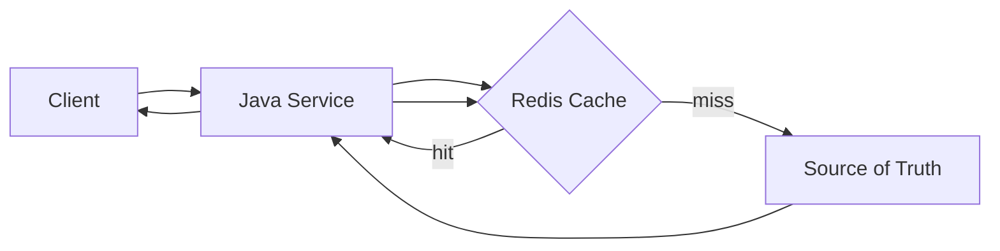

The source of truth might be:

- PostgreSQL
- another service
- external API
- computed result
- object storage
- search index
- model inference result

Redis cache is usually not the source of truth.
If it is the source of truth, this is no longer a cache design problem; it is a data store design problem.

### 2.1 The Three Cache Questions

For every cache, answer:

1. **Freshness:** How stale can this value be?
2. **Rebuild:** Can the value be recomputed if deleted?
3. **Failure:** What happens if Redis is unavailable?

If the answer is unclear, the cache design is incomplete.

---

## 3. Cache Correctness Vocabulary

| Term | Meaning |
|---|---|
| Cache hit | Value found in Redis |
| Cache miss | Value absent or treated as invalid |
| Stale value | Cache value older than source-of-truth state |
| Invalidation | Removing or marking cache value after source changes |
| Expiration | Redis automatically deletes key after TTL |
| Eviction | Redis deletes key due to memory policy |
| Stampede | Many requests rebuild the same missing/expired key simultaneously |
| Penetration | Repeated requests for absent data hit source repeatedly |
| Avalanche | Many keys expire at same time and overload source |
| Breakdown | One very hot key expires and causes source overload |
| Negative cache | Caching not-found result |
| Soft TTL | Application-level freshness time before hard Redis TTL |
| Hard TTL | Redis-enforced deletion time |
| Stale-while-revalidate | Serve old value while one worker refreshes |

---

## 4. Pattern 1: Cache-Aside

Cache-aside is the most common Redis cache pattern.
The application explicitly manages cache reads and writes.

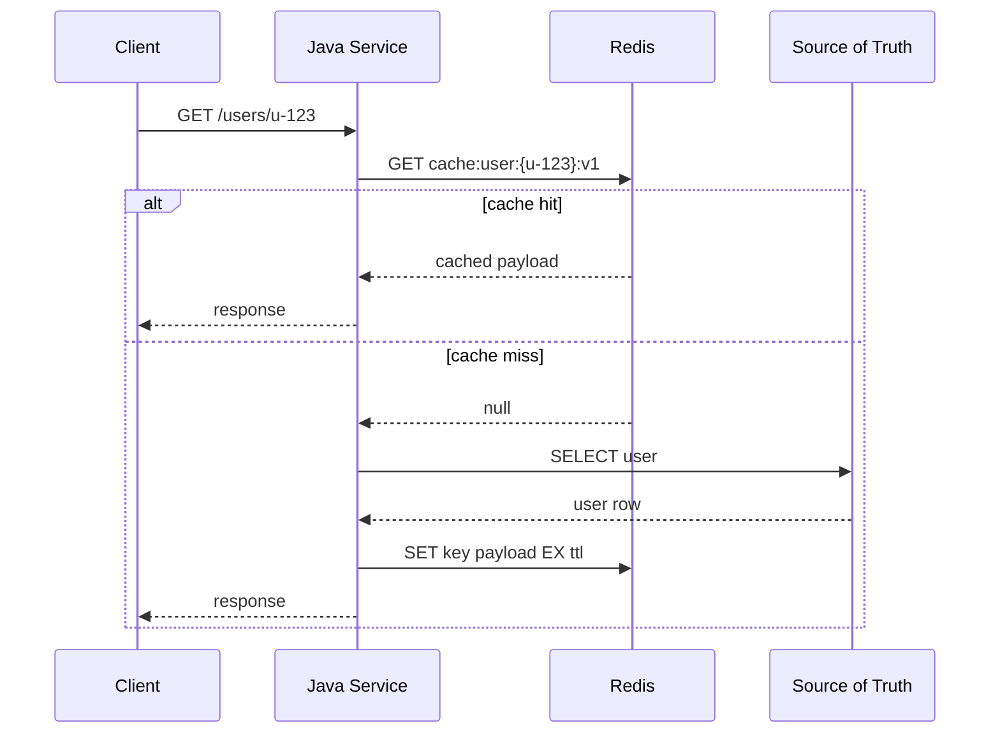

### 4.1 Java Implementation

```java
@Service
public class UserProfileReadService {
    private static final Duration TTL = Duration.ofMinutes(30);

    private final StringRedisTemplate redis;
    private final UserRepository repository;
    private final ObjectMapper objectMapper;

    public UserProfileReadService(
        StringRedisTemplate redis,
        UserRepository repository,
        ObjectMapper objectMapper
    ) {
        this.redis = redis;
        this.repository = repository;
        this.objectMapper = objectMapper;
    }

    public UserProfileDto getUserProfile(UserId userId) {
        String key = UserProfileKeys.cacheKey(userId);

        UserProfileDto cached = readCache(key);
        if (cached != null) {
            return cached;
        }

        UserProfile profile = repository.findById(userId)
            .orElseThrow(() -> new UserNotFoundException(userId));

        UserProfileDto dto = UserProfileDto.from(profile);
        writeCache(key, dto);
        return dto;
    }

    private UserProfileDto readCache(String key) {
        String json = redis.opsForValue().get(key);
        if (json == null) {
            return null;
        }

        try {
            return objectMapper.readValue(json, UserProfileDto.class);
        } catch (Exception e) {
            redis.delete(key);
            return null;
        }
    }

    private void writeCache(String key, UserProfileDto dto) {
        try {
            String json = objectMapper.writeValueAsString(dto);
            redis.opsForValue().set(key, json, TTL.plus(jitter(Duration.ofMinutes(5))));
        } catch (Exception e) {
            // Cache write failure should usually not fail the main read path.
            // Record metric and continue.
        }
    }

    private Duration jitter(Duration maxJitter) {
        long millis = ThreadLocalRandom.current().nextLong(maxJitter.toMillis() + 1);
        return Duration.ofMillis(millis);
    }
}
```

### 4.2 Cache-Aside Strengths

- simple mental model
- source of truth remains authoritative
- Redis failure can often degrade gracefully
- cache can be deleted/rebuilt
- works well with TTL and explicit invalidation
- easy to apply per use case

### 4.3 Cache-Aside Weaknesses

- first request after miss pays source latency
- many concurrent misses can stampede
- stale data exists until TTL or invalidation
- write path must remember to invalidate
- repeated not-found requests can penetrate source
- cache population logic is duplicated if not abstracted carefully

### 4.4 When To Use Cache-Aside

Use cache-aside for:

- read-heavy data
- derived responses
- data that can tolerate bounded staleness
- expensive computations
- source-of-truth protection
- external API response caching

Avoid cache-aside when:

- reads must always reflect latest write
- data cannot be reconstructed
- cache miss cannot hit source safely
- stale data creates regulatory or financial correctness issues

---

## 5. Pattern 2: Read-Through

In read-through caching, application code asks a cache abstraction for data, and the abstraction loads from source on miss.

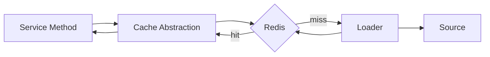

Spring `@Cacheable` is often used as a read-through-like abstraction.

```java
@Cacheable(cacheNames = "userProfile", key = "#userId.value")
public UserProfileDto getUserProfile(UserId userId) {
    UserProfile profile = repository.findById(userId)
        .orElseThrow(() -> new UserNotFoundException(userId));

    return UserProfileDto.from(profile);
}
```

### 5.1 Strengths

- low boilerplate
- consistent cache access pattern
- good for simple derived reads
- integrates with Spring Cache

### 5.2 Weaknesses

- hidden key generation
- hidden serialization
- hidden TTL behavior
- hard to handle negative cache correctly
- hard to implement advanced stampede control
- self-invocation pitfalls in proxy-based frameworks
- can hide source load during incidents

### 5.3 Production Guidance

Use abstraction only when you explicitly configure:

- cache name
- key format
- TTL per cache
- key prefix
- value serializer
- null caching behavior
- metrics
- failure behavior

Do not use annotation caching for high-risk domain workflows unless you can clearly explain the generated key, serialized value, TTL, invalidation, and failure semantics.

---

## 6. Pattern 3: Write-Through

In write-through caching, the write path updates the source of truth and cache together.

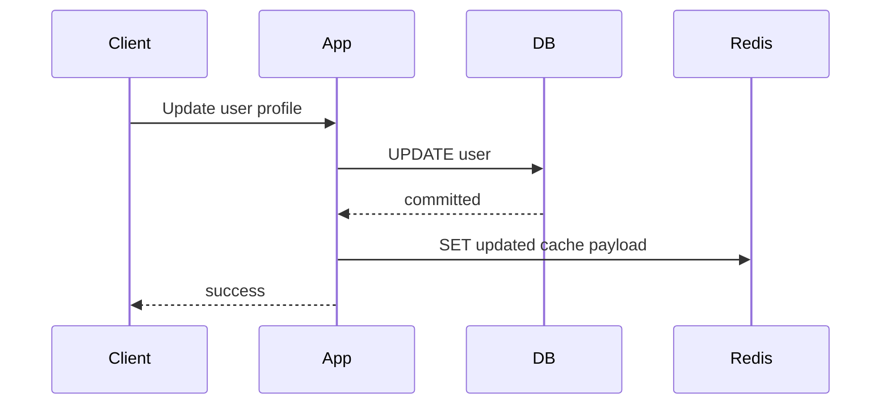

### 6.1 Basic Implementation

```java
@Transactional
public void updateDisplayName(UserId userId, String displayName) {
    UserProfile profile = repository.findByIdForUpdate(userId)
        .orElseThrow(() -> new UserNotFoundException(userId));

    profile.changeDisplayName(displayName);
    repository.save(profile);

    afterCommit(() -> {
        UserProfileDto dto = UserProfileDto.from(profile);
        cache.put(userId, dto);
    });
}
```

Important detail:

> Update Redis after the database transaction commits, not before.

If Redis is updated before DB commit and the DB transaction rolls back, cache can expose data that never committed.

### 6.2 After-Commit Hook

```java
public static void afterCommit(Runnable action) {
    if (TransactionSynchronizationManager.isSynchronizationActive()) {
        TransactionSynchronizationManager.registerSynchronization(new TransactionSynchronization() {
            @Override
            public void afterCommit() {
                action.run();
            }
        });
    } else {
        action.run();
    }
}
```

### 6.3 Strengths

- cache is warm after write
- read-after-write is often faster
- reduces stale window compared with TTL-only
- useful for frequently read entities

### 6.4 Weaknesses

- write path now depends on Redis latency/failure decision
- DB commit and cache update are not atomic together
- cache update can fail after DB commit
- multiple writers can race
- serialized payload must match read model exactly

### 6.5 Failure Options After DB Commit

If DB commit succeeds but Redis update fails:

| Option | Behavior | Use when |
|---|---|---|
| Ignore and rely on TTL | stale cache may remain | low-risk stale data |
| Delete key instead of set | next read rebuilds | common safest default |
| Retry async | eventual cache repair | cache important but not critical |
| Publish invalidation event | other consumers delete/update | multi-service cache ownership |
| Fail request | dangerous after commit | rarely appropriate |

A practical default:

> After source write, delete cache key. Let next read rebuild.

This is often safer than trying to write the new value because deletion avoids ordering bugs where an older writer overwrites a newer cache payload.

---

## 7. Pattern 4: Write-Behind

Write-behind means the application writes to cache/queue first and source of truth later.

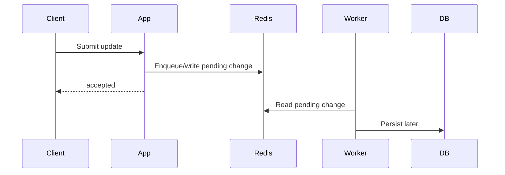

This is not just caching.
This is asynchronous write architecture.

### 7.1 Valid Use Cases

Use write-behind for:

- non-critical analytics counters
- event buffering with acceptable loss/duplication controls
- batched materialized view updates
- high-volume telemetry
- user activity signals
- eventually consistent projections

Be careful for:

- payment state
- order state
- entitlement state
- regulatory records
- inventory deduction
- financial ledger entries

### 7.2 Risks

- data can be lost if Redis is not durable enough for the requirement
- retries can duplicate writes
- ordering can break
- worker failure delays persistence
- source-of-truth semantics become ambiguous
- backpressure must be designed

### 7.3 Write-Behind Checklist

Before using write-behind, define:

- durability requirement
- retry behavior
- idempotency key
- ordering requirement
- dead-letter handling
- worker concurrency
- backpressure behavior
- max acceptable lag
- reconciliation process

If those are missing, the design is not ready.

---

## 8. Invalidation Strategies

Invalidation is the hardest part of caching because writes and reads race.

### 8.1 TTL-Only

```text
SET cache:user:{u-123}:v1 payload EX 1800
```

Pros:

- simple
- no explicit write integration
- resilient to missed invalidations

Cons:

- stale until TTL
- stale window may be too large
- hot keys expire and stampede
- many keys expiring together can avalanche

Use when:

- stale data is acceptable
- source changes infrequently
- correctness does not depend on immediate freshness

### 8.2 Delete On Write

After source change:

```text
DEL cache:user:{u-123}:v1
```

Pros:

- simple
- next read rebuilds from source
- avoids writing stale payload from write path

Cons:

- delete can fail
- race can still occur
- first read after write pays miss cost

### 8.3 Update On Write

After source change:

```text
SET cache:user:{u-123}:v1 new-payload EX 1800
```

Pros:

- cache remains warm
- read-after-write latency improves

Cons:

- DB and Redis update not atomic
- older writer can overwrite newer cache
- write path must construct exact read model
- more coupling between write and read projections

### 8.4 Versioned Cache Key

Instead of invalidating, change the version token.

```text
cache:user:{u-123}:version -> 42
cache:user:{u-123}:v42 -> payload
```

or use source version:

```text
cache:user:{u-123}:updatedAt:20260702T101530Z
```

Pros:

- avoids stale overwrite
- old values become unreachable
- useful with immutable read models

Cons:

- old keys consume memory until TTL
- readers need version lookup or version included in request
- more Redis calls unless optimized

---

## 9. Race Conditions In Cache-Aside

### 9.1 Classic Stale Repopulation Race

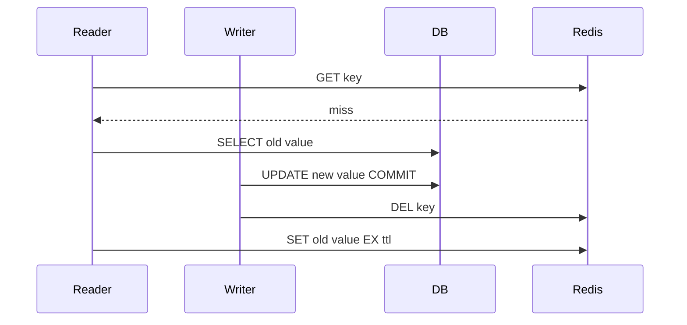

The reader repopulates old data after the writer invalidates.

### 9.2 Mitigations

| Mitigation | How it helps | Trade-off |
|---|---|---|
| Short TTL | stale race expires quickly | more source load |
| Double delete | delete before and after write delay | heuristic, not perfect |
| Version in value | reader detects older source version | source must expose version |
| Versioned key | old write writes old version key | extra key/version handling |
| Compare-and-set Lua | only set if version is current | requires version source in Redis |
| Stale tolerance | accept bounded race | business must tolerate |

The best mitigation depends on correctness requirement.
There is no universal invalidation trick.

---

## 10. Double Delete Pattern

Double delete attempts to reduce stale repopulation.

Flow:

1. Delete cache key before DB write.
2. Write DB.
3. Delete cache key again after a short delay.

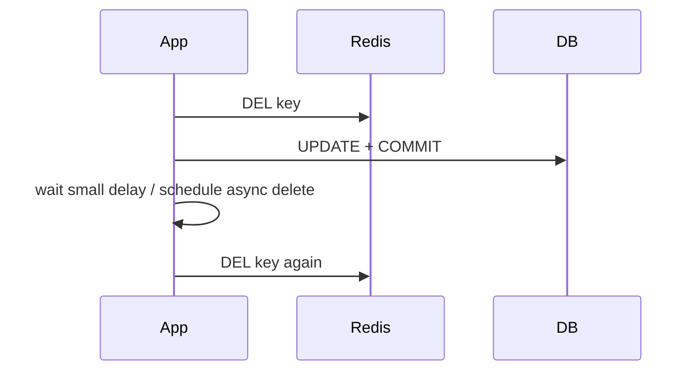

Implementation sketch:

```java
public void updateUser(UserId userId, UpdateCommand command) {
    String key = UserProfileKeys.cacheKey(userId);

    redis.delete(key);

    transactionTemplate.executeWithoutResult(status -> {
        UserProfile profile = repository.findByIdForUpdate(userId).orElseThrow();
        profile.apply(command);
        repository.save(profile);
    });

    delayedExecutor.schedule(
        () -> redis.delete(key),
        500,
        TimeUnit.MILLISECONDS
    );
}
```

Caution:

- delay is heuristic
- too short may miss slow readers
- too long leaves stale data longer
- async delete can fail
- does not provide formal correctness

Use double delete for pragmatic stale reduction, not for strict correctness.

---

## 11. Negative Caching

Negative caching stores “not found” results.

Without negative cache:

```text
GET cache:product:unknown -> miss
DB lookup -> not found
repeat many times -> DB repeatedly hit
```

With negative cache:

```text
SET cache:product:unknown:not-found "1" EX 60
```

### 11.1 JSON Negative Cache

```json
{
  "schemaVersion": 1,
  "kind": "NOT_FOUND",
  "checkedAt": "2026-07-02T10:15:30Z"
}
```

### 11.2 TTL Guidance

Negative cache TTL should usually be shorter than positive cache TTL.

| Entity type | Negative TTL suggestion |
|---|---|
| User typed wrong id | 30 seconds to 2 minutes |
| Product id not found | 1 to 5 minutes |
| External API not found | depends provider and business |
| Permission denied | be very careful; authorization can change |

### 11.3 Risks

- newly created entity may remain invisible until negative TTL expires
- authorization changes can be hidden
- attacker can poison absent-key space if key design is not controlled

Mitigations:

- short TTL
- namespace by tenant/user where appropriate
- invalidate on create
- do not negative-cache ambiguous errors
- limit high-cardinality attacker-controlled keys

---

## 12. Cache Stampede Control

Stampede occurs when many requests rebuild the same key at once.

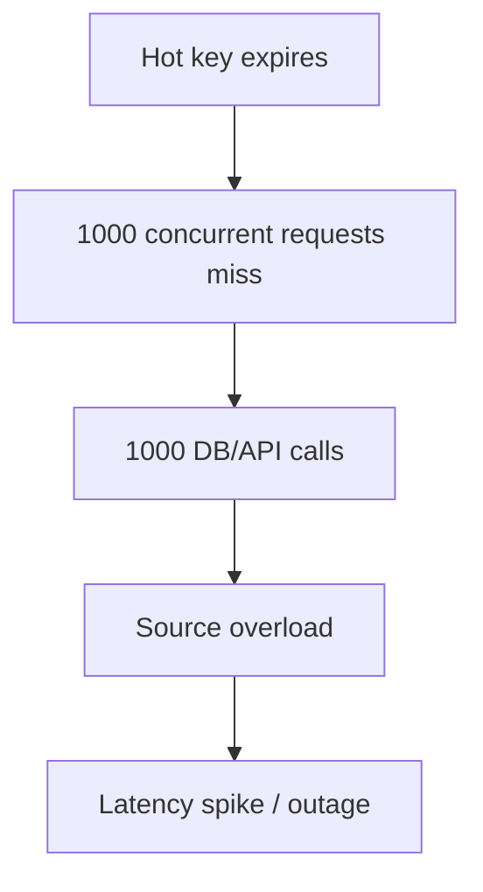

### 12.1 TTL Jitter

Add random jitter so keys do not expire together.

```java
Duration ttl = Duration.ofMinutes(30)
    .plus(Duration.ofSeconds(ThreadLocalRandom.current().nextInt(0, 300)));
```

Use for:

- large groups of similar keys
- scheduled cache warming
- startup repopulation

### 12.2 Single-Flight Lock

Only one request rebuilds; others wait or serve fallback.

```java
public UserProfileDto get(UserId userId) {
    String cacheKey = UserProfileKeys.cacheKey(userId);
    UserProfileDto cached = cache.get(cacheKey);
    if (cached != null) {
        return cached;
    }

    String lockKey = cacheKey + ":refresh-lock";
    String token = UUID.randomUUID().toString();

    boolean acquired = Boolean.TRUE.equals(redis.opsForValue().setIfAbsent(
        lockKey,
        token,
        Duration.ofSeconds(5)
    ));

    if (acquired) {
        try {
            UserProfileDto loaded = loadFromSource(userId);
            cache.put(cacheKey, loaded, ttlWithJitter());
            return loaded;
        } finally {
            releaseLockSafely(lockKey, token);
        }
    }

    sleepBriefly();
    UserProfileDto afterWait = cache.get(cacheKey);
    if (afterWait != null) {
        return afterWait;
    }

    return loadFromSourceWithRateLimit(userId);
}
```

Safe release Lua:

```lua
if redis.call('get', KEYS[1]) == ARGV[1] then
  return redis.call('del', KEYS[1])
else
  return 0
end
```

This is a lock for efficiency, not a correctness lock.
For cache refresh, that is usually acceptable.

### 12.3 Stale-While-Revalidate

Store soft expiry inside payload and hard expiry in Redis.

```json
{
  "schemaVersion": 1,
  "freshUntil": "2026-07-02T10:20:00Z",
  "hardExpireAt": "2026-07-02T10:50:00Z",
  "data": { ... }
}
```

Flow:

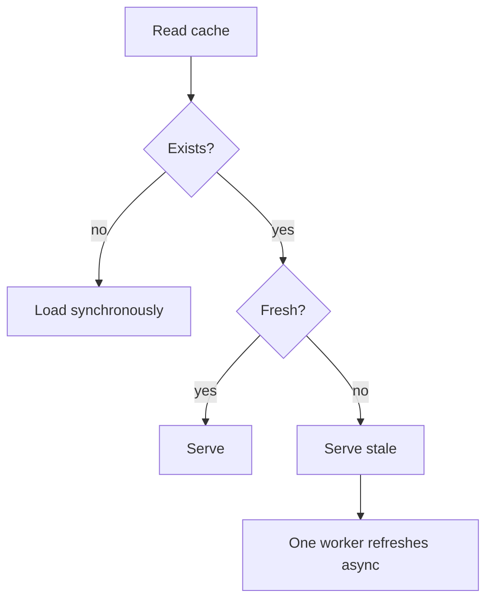

Use when:

- stale data is better than outage
- source is expensive
- hot keys must remain available
- small staleness is acceptable

Avoid when:

- stale data can violate correctness
- response must reflect latest authorization/entitlement
- legal/regulatory accuracy is required

### 12.4 Probabilistic Early Refresh

Refresh before expiry with increasing probability as TTL approaches zero.

Simple heuristic:

```java
boolean shouldRefresh(Duration remainingTtl, Duration baseTtl) {
    double remaining = remainingTtl.toMillis();
    double total = baseTtl.toMillis();
    double ageRatio = 1.0 - (remaining / total);
    double probability = Math.pow(ageRatio, 3);
    return ThreadLocalRandom.current().nextDouble() < probability;
}
```

This spreads refresh work across time.
Use only when team understands and can observe it.

---

## 13. Cache Avalanche Control

Avalanche occurs when many keys expire around the same time.

Mitigations:

- TTL jitter
- staggered warmup
- limit concurrent rebuilds
- request coalescing
- circuit breaker around source
- bulkhead source calls
- pre-warm critical keys
- degrade gracefully with stale data

Example warmup caution:

```java
for (ProductId id : popularProductIds) {
    warmupExecutor.submit(() -> cacheWarmup.warmProduct(id));
}
```

Do not warm millions of keys at full speed.
Warmup must be throttled.

---

## 14. Cache Penetration Control

Penetration occurs when requests for nonexistent keys repeatedly hit the source.

Mitigations:

| Technique | Use case |
|---|---|
| Negative cache | legitimate not-found repeated |
| Bloom filter | large known-id set before DB lookup |
| Input validation | malformed ids |
| Rate limit | hostile high-cardinality probing |
| Request authentication | prevent anonymous enumeration |
| Short TTL | avoid hiding newly created data too long |

For untrusted user input, do not create unlimited negative cache keys.
An attacker can create high-cardinality Redis memory pressure.

---

## 15. Cache Breakdown Control

Breakdown is hot-key expiration.

Example:

```text
cache:homepage:recommendations:v1
cache:global-pricing-rules:v3
cache:tenant:{tenant-a}:feature-config:v5
```

Mitigations:

- no-expire plus explicit invalidation for some config keys
- stale-while-revalidate
- single-flight refresh
- proactive refresh
- replicated local in-process cache for ultra-hot values
- source circuit breaker

Do not rely on simple TTL for a key that receives thousands of requests per second.

---

## 16. Local Cache + Redis Two-Level Cache

Sometimes Redis is still too far away for ultra-hot data.

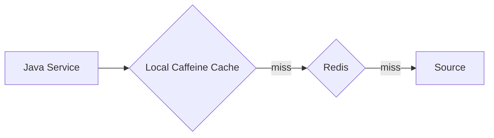

Use two-level cache for:

- feature flags
- tenant config
- reference data
- high-QPS stable values
- small values with very high read frequency

Risks:

- local stale data
- invalidation fanout complexity
- memory per instance
- inconsistent view across pods

Pattern:

- local TTL short
- Redis TTL longer
- source authoritative
- Pub/Sub/keyspace notification only as invalidation hint, not correctness guarantee

---

## 17. Write Path Patterns

### 17.1 Delete Cache After Commit

Recommended default for many systems.

```java
@Transactional
public void approveQuote(QuoteId quoteId) {
    Quote quote = quoteRepository.findByIdForUpdate(quoteId).orElseThrow();
    quote.approve();
    quoteRepository.save(quote);

    afterCommit(() -> redis.delete(QuoteCacheKeys.summary(quoteId)));
}
```

Why:

- DB remains source of truth
- cache rebuilds on next read
- avoids write path needing read model construction
- reduces stale update overwrite risk

### 17.2 Update Cache After Commit

Use when:

- read-after-write latency matters
- write service can construct exact read model
- stale overwrite is controlled by version

Version-aware Lua example:

```lua
local existing = redis.call('GET', KEYS[1])
if not existing then
  return redis.call('SET', KEYS[1], ARGV[1], 'EX', ARGV[2])
end

local existingVersion = tonumber(ARGV[3]) -- placeholder; real code must parse or store separately
return 0
```

In practice, parsing JSON in Lua is not ideal unless cjson usage is carefully controlled.
A simpler version strategy is to store source version separately or use versioned keys.

### 17.3 Invalidation Event

For multi-service systems:

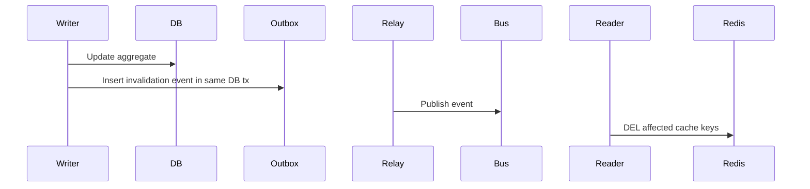

This avoids tying DB transaction to Redis directly.
It also gives retry and audit path.

---

## 18. Cache Failure Modes

Redis failures must be designed explicitly.

| Failure | Possible behavior |
|---|---|
| Redis read timeout | bypass cache and hit source, or fail fast if source cannot handle load |
| Redis write timeout | return response and record metric if cache is optional |
| Redis unavailable | degrade to source with circuit breaker |
| Redis slow | shed cache calls, reduce timeout, protect request threads |
| Decode failure | treat as miss for derived cache, delete/quarantine |
| Source unavailable on miss | serve stale if available, else fail/degrade |
| Stampede lock unavailable | fallback to bounded source load or stale |

### 18.1 Timeout Discipline

Cache calls should usually have tighter timeouts than source calls.

Bad:

```text
HTTP request timeout: 2s
Redis timeout: 5s
DB timeout: 1s
```

Redis timeout greater than request timeout is operationally incoherent.

Better:

```text
HTTP request budget: 800ms
Redis GET budget: 20ms
Redis SET budget: 20ms async/best-effort
DB budget: 300ms
```

Exact numbers depend on environment.
The principle is what matters:

> Optional cache should not consume the whole request budget.

---

## 19. Cache Metrics

Measure at least:

| Metric | Why |
|---|---|
| hit count | cache value exists and decoded |
| miss count | source load pressure |
| hit ratio | usefulness indicator, not sufficient alone |
| Redis latency | cache health |
| source load on miss | stampede and penetration signal |
| cache write failure | hidden degradation |
| decode failure | serializer/compatibility bug |
| payload size | memory/network pressure |
| stale served count | stale-while-revalidate visibility |
| refresh lock acquired/contended | stampede control signal |
| negative cache hits | penetration control signal |
| eviction count | memory pressure |

Hit ratio alone is misleading.
A cache with 99% hit ratio can still fail if the 1% miss path stampedes a fragile source.

---

## 20. Cache Design By Use Case

### 20.1 Product Catalog Cache

Properties:

- read-heavy
- source changes less frequently
- stale tolerance often minutes
- cache rebuild safe

Recommended:

- cache-aside
- positive TTL 10-60 minutes
- TTL jitter
- invalidate on product update
- negative cache for unknown product ids
- versioned key if response schema changes

### 20.2 User Session Cache

Properties:

- cache may be operational source for session state
- TTL is lifecycle, not only performance
- security-sensitive

Recommended:

- Redis Hash or JSON session envelope
- sliding TTL only if intended
- explicit logout deletion
- avoid storing raw secrets
- strong observability
- consider persistence/HA implications

This is not a simple derived cache.
Treat it as state.

### 20.3 Pricing Rule Cache

Properties:

- correctness-sensitive
- rule changes must propagate quickly
- stale pricing can cause financial exposure

Recommended:

- short local TTL
- Redis versioned ruleset key
- source version in calculation
- explicit invalidation event
- fallback policy defined by business
- audit rule version used in quote/order

Do not hide pricing correctness behind generic cache annotations.

### 20.4 Authorization Cache

Properties:

- stale allow can be dangerous
- stale deny can break user experience

Recommended:

- very short TTL
- include subject, tenant, scope, policy version in key
- invalidate on role/policy change
- prefer fail-closed for high-risk operations
- avoid broad shared entries unless policy versioned

### 20.5 External API Response Cache

Properties:

- protects latency/cost/rate limit
- source may be unavailable
- stale may be acceptable depending API

Recommended:

- cache-aside
- store response metadata
- negative cache carefully
- stale-while-revalidate if business allows
- circuit breaker around external API
- distinguish not-found from provider error

---

## 21. Spring Cache Abstraction Guidance

`@Cacheable` is acceptable for simple cases.

Example:

```java
@Cacheable(
    cacheNames = "productSummary",
    key = "#tenantId.value + ':' + #productId.value",
    unless = "#result == null"
)
public ProductSummary getProductSummary(TenantId tenantId, ProductId productId) {
    return productRepository.findSummary(tenantId, productId)
        .orElse(null);
}
```

But for advanced behavior, prefer explicit cache component.

Use explicit cache component when you need:

- negative cache
- stale-while-revalidate
- single-flight
- version-aware invalidation
- custom serialization envelope
- source fallback policy
- metrics around decode and payload size
- multi-key invalidation

A good compromise:

- use Spring Cache for low-risk, simple derived reads
- use explicit Redis cache components for domain-critical or high-QPS paths

---

## 22. Cache Key Design

A cache key must encode the dimensions that affect the value.

Example bad key:

```text
cache:price:q-123
```

Missing:

- tenant
- currency
- customer segment
- pricing policy version
- locale if formatted
- schema version

Better:

```text
cache:quote-price:{tenant-a:q-123}:currency:USD:policy:2026.07:v1
```

Rule:

> If changing an input would change the result, that input must either be in the key or in a version token that the key references.

Common dimensions:

- tenant
- user/customer id
- locale
- currency
- authorization scope
- feature flag version
- policy/rule version
- schema version
- source data version
- request parameters

---

## 23. TTL Strategy

TTL should come from staleness tolerance and rebuild cost.

| Data | TTL guidance |
|---|---|
| Product summary | minutes to hours depending update frequency |
| User profile display | minutes |
| Authorization decision | seconds to very few minutes |
| Pricing calculation | very short or versioned by policy/source |
| External API success | provider/business dependent |
| External API failure | usually very short, if cached at all |
| Negative not-found | shorter than positive |
| Feature config | short local TTL, longer Redis TTL, explicit invalidation |

Avoid arbitrary TTLs like “everything is 1 hour.”

### 23.1 TTL Jitter Function

```java
public static Duration withJitter(Duration base, double maxJitterRatio) {
    long baseMillis = base.toMillis();
    long maxJitterMillis = Math.round(baseMillis * maxJitterRatio);
    long jitter = ThreadLocalRandom.current().nextLong(maxJitterMillis + 1);
    return Duration.ofMillis(baseMillis + jitter);
}
```

Use positive jitter to spread expiration.
Use bounded jitter so freshness guarantee remains understandable.

---

## 24. Cache Warmup

Cache warmup preloads values before traffic needs them.

Useful for:

- known hot products
- tenant config
- homepage data
- pricing rules
- feature flags

Risks:

- warms unused data
- overloads source at startup
- creates synchronized expirations
- hides broken miss path

Warmup rules:

- throttle source reads
- add TTL jitter
- observe warmup errors
- never depend solely on warmup
- keep miss path correct

---

## 25. Circuit Breakers and Backpressure

Cache miss path can overload source.
Protect it.

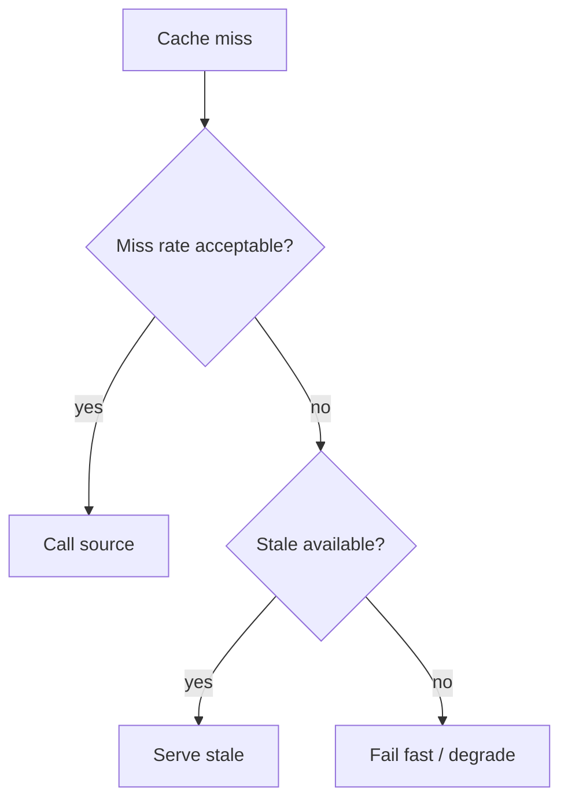

Controls:

- source call bulkhead
- max concurrent rebuilds
- rate limit per key/prefix
- circuit breaker on source
- fallback to stale
- load shedding

Cache is not a substitute for backpressure.
A bad cache miss storm is a source DDoS from your own service.

---

## 26. Testing Cache Behavior

Test more than happy path.

### 26.1 Basic Tests

- miss loads source
- hit avoids source
- write sets TTL
- decode failure becomes miss
- source not found creates negative cache if intended
- invalidation deletes expected key

### 26.2 Race Tests

Use concurrency tests for:

- stampede lock
- multiple concurrent misses
- writer invalidation during reader rebuild
- stale-while-revalidate refresh contention

### 26.3 Failure Tests

Simulate:

- Redis unavailable
- Redis timeout
- source unavailable
- corrupt payload
- cache write failure
- Redis delete failure after DB commit

The test should assert policy, not only exception behavior.

Example:

```java
@Test
void shouldReturnSourceValueWhenRedisReadFails() {
    redisStub.failGetsWithTimeout();
    repository.save(userProfile);

    UserProfileDto result = service.getUserProfile(userId);

    assertThat(result.userId()).isEqualTo(userId.value());
    assertThat(metrics.cacheReadFailures()).isEqualTo(1);
}
```

---

## 27. Production Cache Review Template

For each cache, document:

| Field | Example |
|---|---|
| Cache name | `userProfile` |
| Owner | `identity-service` |
| Source of truth | `users` table |
| Key format | `cache:user-profile:{tenant:user}:v1` |
| Value format | JSON `UserProfileCacheV1` |
| Positive TTL | 30 minutes + 0-5 minute jitter |
| Negative TTL | 1 minute |
| Invalidation | delete after user update commit |
| Staleness tolerance | display name can be stale <= 30 minutes; auth fields not cached here |
| Redis failure behavior | bypass cache and query DB with bulkhead |
| Source failure on miss | fail request; no stale support |
| Stampede control | single-flight for hot users |
| Metrics | hit/miss/decode/source load/payload size |
| Runbook | delete by key pattern using SCAN-based tool |

If this table cannot be filled, the cache is not production-ready.

---

## 28. Common Anti-Patterns

### 28.1 Cache Without Staleness Requirement

Symptom:

> “We cache it for performance.”

Missing:

- how stale can it be?
- who invalidates it?
- what happens on write?

Fix:

- define staleness envelope first

### 28.2 Generic Cache Annotation On Critical Logic

Symptom:

```java
@Cacheable("price")
public Price calculatePrice(...) { ... }
```

Problems:

- key may miss important dimensions
- pricing policy version may be absent
- stale price can leak into quotes/orders
- no audit of rule version

Fix:

- explicit cache component
- include pricing inputs and policy version
- audit calculation version

### 28.3 No Jitter

Symptom:

- deployment warms many keys at once
- all expire after exactly 30 minutes
- source load spikes periodically

Fix:

- add TTL jitter
- stagger warmup

### 28.4 Treating Redis Failure As Application Failure

For optional cache, Redis failure should usually degrade, not fail the business request.

But this depends on lifecycle.
Session/lock/workflow state is different.

Fix:

- classify cache vs state
- define failure policy per keyspace

### 28.5 Caching Errors As Negative Results

Do not confuse source failure with not-found.

Bad:

```java
catch (ExternalApiException e) {
    cache.putNotFound(key);
}
```

This can poison the cache.

Fix:

- cache not-found only when source confirms not-found
- treat timeout/5xx separately

---

## 29. Implementation Blueprint: Production Cache Component

```java
public final class RedisCacheResult<T> {
    private final T value;
    private final boolean hit;
    private final boolean stale;

    // constructor/getters omitted
}
```

```java
@Component
public class QuoteSummaryCache {
    private final StringRedisTemplate redis;
    private final ObjectMapper objectMapper;
    private final MeterRegistry meterRegistry;

    public Optional<QuoteSummaryCacheV1> get(String key) {
        Timer.Sample sample = Timer.start(meterRegistry);
        try {
            String json = redis.opsForValue().get(key);
            if (json == null) {
                meterRegistry.counter("cache.miss", "cache", "quoteSummary").increment();
                return Optional.empty();
            }

            QuoteSummaryCacheV1 value = objectMapper.readValue(json, QuoteSummaryCacheV1.class);
            meterRegistry.counter("cache.hit", "cache", "quoteSummary").increment();
            return Optional.of(value);
        } catch (Exception e) {
            meterRegistry.counter("cache.failure", "cache", "quoteSummary").increment();
            safeDelete(key);
            return Optional.empty();
        } finally {
            sample.stop(meterRegistry.timer("cache.get.latency", "cache", "quoteSummary"));
        }
    }

    public void put(String key, QuoteSummaryCacheV1 value, Duration ttl) {
        try {
            String json = objectMapper.writeValueAsString(value);
            redis.opsForValue().set(key, json, withJitter(ttl, 0.10));
            meterRegistry.summary("cache.payload.size", "cache", "quoteSummary")
                .record(json.getBytes(StandardCharsets.UTF_8).length);
        } catch (Exception e) {
            meterRegistry.counter("cache.write.failure", "cache", "quoteSummary").increment();
        }
    }

    public void invalidate(String key) {
        try {
            redis.delete(key);
        } catch (Exception e) {
            meterRegistry.counter("cache.invalidate.failure", "cache", "quoteSummary").increment();
        }
    }

    private void safeDelete(String key) {
        try {
            redis.delete(key);
        } catch (Exception ignored) {
            // already in failure path
        }
    }
}
```

This is intentionally explicit.
It gives hooks for metrics, decode handling, TTL, and operational behavior.

---

## 30. Practice: Design A Cache For Product Availability

Requirements:

- high read volume
- source is inventory service
- stale availability can oversell if used for checkout
- product page can tolerate 30 seconds stale
- checkout cannot tolerate stale

Design:

| Path | Cache policy |
|---|---|
| Product page | Redis cache-aside, TTL 15-30s with jitter, stale allowed in UI label |
| Checkout | bypass cache or use source-confirmed reservation flow |
| Invalidation | inventory update event deletes product page availability cache |
| Negative cache | only for product not found, not for out-of-stock unless business accepts |
| Failure | product page can show “availability updating”; checkout fails/asks retry |

Key:

```text
cache:product-availability:{tenant-a:p-123}:v1
```

Important insight:

> The same data may need different cache behavior depending on the user journey.

Do not use one cache decision for all paths.

---

## 31. Part Summary

Cache patterns are consistency and failure-mode decisions.

Key takeaways:

- Cache is derived state unless explicitly designed otherwise.
- Cache-aside is the safest default for many Redis use cases.
- Read-through abstractions reduce boilerplate but hide key/TTL/serializer/failure semantics.
- Write-through can keep cache warm but DB and Redis are not atomically updated together.
- Write-behind is asynchronous write architecture, not a simple cache trick.
- Delete-after-commit is often safer than update-after-commit.
- TTL must come from staleness tolerance and source rebuild cost.
- Add TTL jitter to prevent synchronized expiration.
- Negative cache prevents penetration but can hide newly created data.
- Stampede control is mandatory for hot keys.
- Stale-while-revalidate is powerful when stale data is better than outage.
- Cache key dimensions must include every input that changes the result.
- Hit ratio alone is not enough; observe miss load, latency, decode failure, and stale serving.

Next part:

> Part 015 — Consistency Patterns: Invalidation, Versioned Cache, Stampede Control

---

## References

- Redis Docs — Cache-aside use case: https://redis.io/docs/latest/develop/use-cases/cache-aside/
- Redis Docs — SET command: https://redis.io/docs/latest/commands/set/
- Redis Docs — EXPIRE command: https://redis.io/docs/latest/commands/expire/
- Redis Docs — Distributed locks pattern: https://redis.io/docs/latest/develop/clients/patterns/distributed-locks/
- Spring Data Redis Reference — Redis Cache: https://docs.spring.io/spring-data/redis/reference/redis/redis-cache.html
- Spring Framework Reference — Cache Abstraction: https://docs.spring.io/spring-framework/reference/integration/cache.html
