# Part 015 — Consistency Patterns: Invalidation, Versioned Cache, Stampede Control

Part 014 introduced major cache patterns.
This part goes deeper into the hardest part of caching:

> How do we keep Redis useful without letting it silently corrupt business behavior?

The main enemy is not stale data by itself.
The real enemy is **unbounded, invisible, unjustified staleness**.

A senior engineer does not say:

> Redis is eventually consistent.

A senior engineer says:

> This Redis projection may be stale for at most 30 seconds under normal operation, may serve stale for 5 minutes during source outage, is invalidated by these domain events, and is never used for payment authorization.

That is the difference between using Redis as a speed hack and using Redis as a production engineering component.

---

## 1. Kaufman Skill Decomposition

Target skill:

> Design Redis cache consistency behavior explicitly, including invalidation, freshness bounds, stampede control, stale fallback, and operational failure modes.

Sub-skills:

| Sub-skill | What you must be able to do |
|---|---|
| Consistency envelope | Define allowed staleness per user journey |
| Invalidation design | Decide delete, update, version bump, or event-driven refresh |
| Versioned cache | Prevent stale overwrite and cross-version pollution |
| Stampede control | Stop hot misses from overwhelming source systems |
| Logical expiry | Separate usability expiry from Redis physical expiry |
| Single-flight | Ensure only one request refreshes a hot key |
| Stale fallback | Serve controlled stale data during source failures |
| Negative consistency | Prevent not-found poisoning and creation races |
| Observability | Measure staleness, refresh failures, and miss amplification |
| Failure modeling | Know what happens during Redis, DB, and event bus failures |

Practice rule for this part:

> Every cache pattern must answer: what can be stale, for how long, who refreshes it, who invalidates it, and what happens when refresh fails?

---

## 2. The Core Problem: Redis and the Source of Truth Are Separate Systems

Most Java services cache data from a durable source:

- PostgreSQL
- MySQL
- Oracle
- MongoDB
- Elasticsearch/OpenSearch
- external HTTP service
- another microservice
- event-derived projection

Redis is usually not updated in the same atomic transaction as the source.

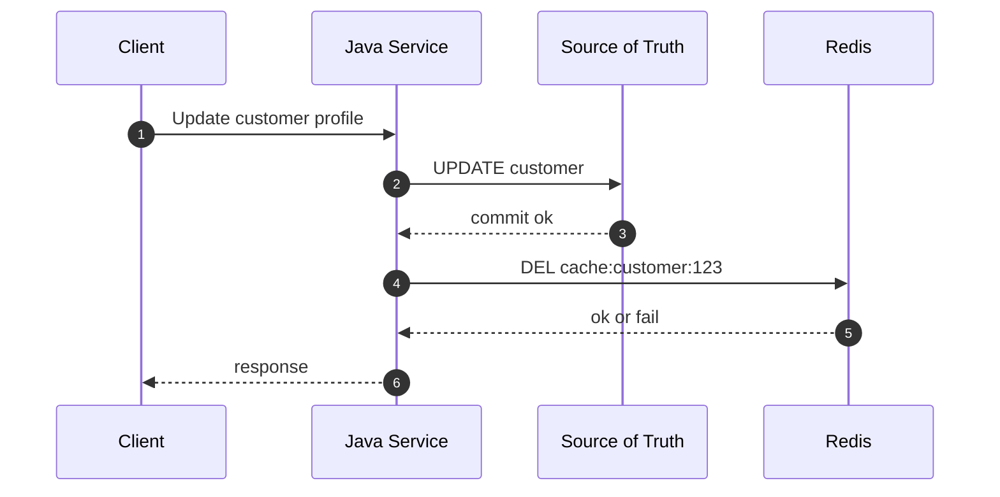

The weak point is obvious:

```text
DB commit and Redis invalidation are not one atomic operation.
```

If DB commit succeeds but Redis deletion fails, cache may remain stale.
If Redis deletion succeeds but DB commit later fails, cache may be unnecessarily cold.
If two writes race, a stale writer may overwrite a fresh cache value.
If hot data expires at once, many clients may hit the DB together.

Therefore consistency must be designed, not assumed.

---

## 3. Taxonomy of Cache Consistency Requirements

Not every cache needs the same correctness.

| Use case | Correctness need | Example Redis behavior |
|---|---:|---|
| Product description | Low/medium | TTL + event invalidation |
| User display name | Medium | TTL + delete after update |
| Authorization permission | High | short TTL or direct source check for critical actions |
| Pricing quote | Very high | do not trust cache for final price confirmation |
| Inventory badge | Medium | stale allowed for browse, not checkout |
| Feature flag | High | versioned config + short TTL + fallback policy |
| Fraud/risk decision | High | cache intermediate features, not final irreversible decision |
| Search result | Medium | index version + TTL + rebuild path |
| Dashboard stats | Low/medium | precomputed projection + freshness timestamp |

A useful rule:

> Redis can accelerate decisions, but it should not secretly become the authority for decisions whose wrongness has high business cost.

Ask these questions before choosing a pattern:

1. What is the source of truth?
2. Is stale data acceptable?
3. How stale is acceptable?
4. Is stale data acceptable during outage?
5. Can users see stale data, or only internal services?
6. Can stale data cause financial, legal, security, or compliance damage?
7. Is read latency more important than freshness?
8. How expensive is source recomputation?
9. How often does the data change?
10. How many clients may request the same key simultaneously?

---

## 4. Consistency Envelope

A **consistency envelope** is a written contract around cached data.

Example:

```yaml
cache: customer-profile
source: customer_db.customer
owner: customer-service
read_path: customer-service GET /customers/{id}
write_path: customer-service PATCH /customers/{id}
normal_freshness: <= 60 seconds
max_stale_during_source_outage: <= 10 minutes
physical_ttl: 15 minutes
logical_ttl: 60 seconds
refresh_policy: single-flight stale-while-revalidate
invalidation_policy: delete-after-commit on profile update event
critical_paths:
  - never use for KYC enforcement
  - never use for billing address validation
```

This looks heavy, but for important caches it prevents months of ambiguous production behavior.

### Minimal Envelope Template

```text
Cache name:
Source of truth:
Owner service:
Key pattern:
Value schema version:
Allowed normal staleness:
Allowed degraded staleness:
Invalidation trigger:
Refresh trigger:
Fallback when Redis unavailable:
Fallback when source unavailable:
Forbidden usage:
Observability metrics:
```

If a cache cannot be described this way, the team probably does not understand the cache.

---

## 5. Four Kinds of Expiry

Many Redis cache bugs come from mixing different meanings of “expired”.

| Expiry type | Meaning |
|---|---|
| Physical TTL | Redis automatically removes the key |
| Logical TTL | Application considers value stale after timestamp |
| Business validity | Domain rule says the value is no longer valid |
| Client freshness | The caller’s journey requires data no older than X |

These are not equivalent.

Example:

```json
{
  "schemaVersion": 3,
  "loadedAtEpochMs": 1783000000000,
  "freshUntilEpochMs": 1783000060000,
  "staleUntilEpochMs": 1783000600000,
  "sourceVersion": 928172,
  "payload": {
    "customerId": "c-123",
    "tier": "GOLD"
  }
}
```

Redis key TTL may be 15 minutes.
Logical freshness may be 60 seconds.
Business validity may end when customer tier changes.
Client freshness may differ between journeys.

The pattern:

```text
physical TTL > staleUntil > freshUntil
```

Why?

- `freshUntil` controls normal freshness.
- `staleUntil` allows degraded serving during source failure.
- physical TTL bounds memory and cleans abandoned keys.

---

## 6. Basic Invalidation: Delete After Commit

The safest default for many write paths:

```text
1. Write source of truth.
2. Commit transaction.
3. Delete Redis cache key.
4. Next read reloads from source.
```

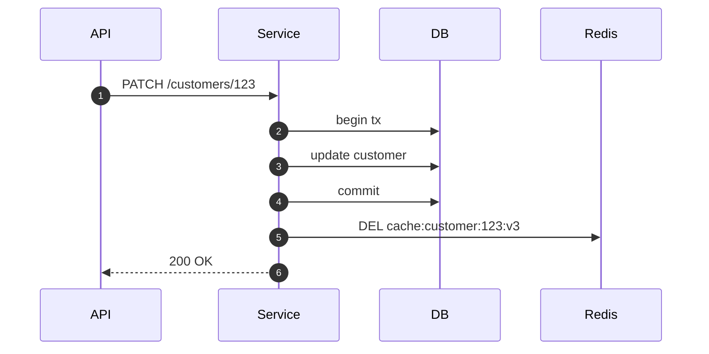

Why delete instead of update?

Updating the cache after write looks attractive, but delete is often safer:

| Approach | Benefit | Risk |
|---|---|---|
| Update cache after DB write | Keeps cache warm | stale writer can overwrite fresh value; incomplete projection risk |
| Delete cache after DB write | Forces fresh reload | next read pays source cost |
| Version bump | Avoids old key pollution | needs version lookup and cleanup |
| Event-driven invalidation | decouples writer/read model | event delay/loss must be handled |

Delete-after-commit makes the next read rebuild from the actual source.

### Java Pseudocode

```java
@Transactional
public Customer updateCustomer(String customerId, PatchCustomerCommand command) {
    Customer updated = customerRepository.patch(customerId, command);

    // DB transaction commits when method exits.
    // In Spring, prefer after-commit hook for Redis invalidation.
    TransactionSynchronizationManager.registerSynchronization(new TransactionSynchronization() {
        @Override
        public void afterCommit() {
            redisTemplate.delete("cache:customer:v3:" + customerId);
        }
    });

    return updated;
}
```

Important:

> Do not delete before commit unless you deliberately accept refill-before-commit races.

---

## 7. The Classic Race: Delete Then Stale Refill

Consider this sequence:

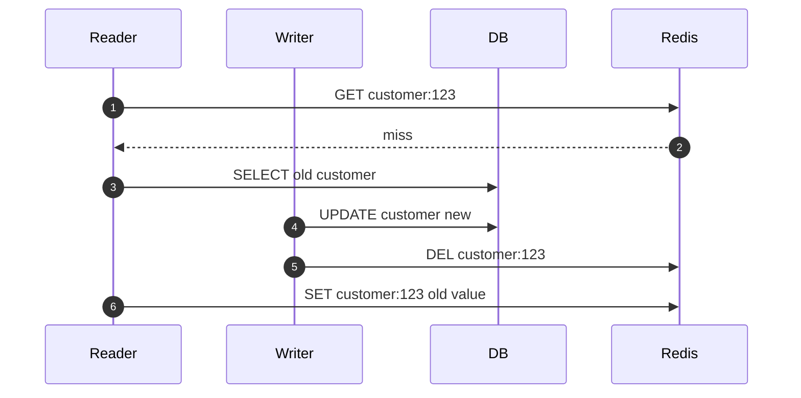

Result:

```text
Redis contains stale old value after writer invalidated it.
```

This happens when a reader loads old data before the writer commits and writes it after invalidation.

Solutions:

1. short TTL only
2. double delete
3. versioned cache
4. compare source version before setting cache
5. logical timestamp check in Lua
6. cache only after reading committed source version

There is no universal answer.
Choose based on data criticality and write/read concurrency.

---

## 8. Double Delete Pattern

Pattern:

```text
1. Delete cache.
2. Write DB.
3. Delete cache again after a small delay.
```

Or safer in many Java services:

```text
1. Write DB.
2. Commit.
3. Delete cache.
4. Schedule second delete after expected stale refill window.
```

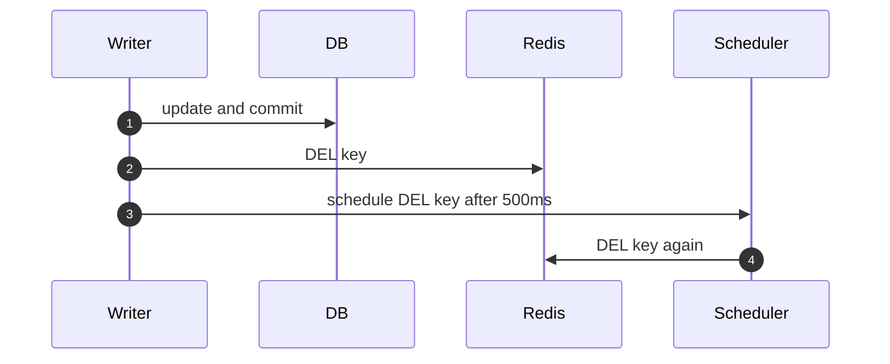

When it helps:

- read-through cache can refill stale data during write race
- no source version available
- stale risk is moderate
- delayed second delete is cheap

When it is weak:

- delay is guessed
- long source query can exceed delay
- event scheduler may fail
- repeated writes complicate behavior
- it is mitigation, not proof

Double delete is a pragmatic patch.
It is not a strong correctness protocol.

### Java Sketch

```java
public void invalidateCustomerAfterCommit(String customerId) {
    String key = customerKey(customerId);

    redisTemplate.delete(key);

    delayedExecutor.schedule(
        () -> redisTemplate.delete(key),
        Duration.ofMillis(750)
    );
}
```

Better version:

```text
Delay should be based on observed p99 source-read + p99 cache-set latency, not folklore.
```

---

## 9. Versioned Cache Keys

Versioned keys avoid stale overwrite by changing the key namespace when source changes.

Example:

```text
cache:customer:{c-123}:v42
```

A separate version pointer tells readers which key to use:

```text
cachever:customer:{c-123} = 42
cache:customer:{c-123}:v42 = payload
```

Flow:

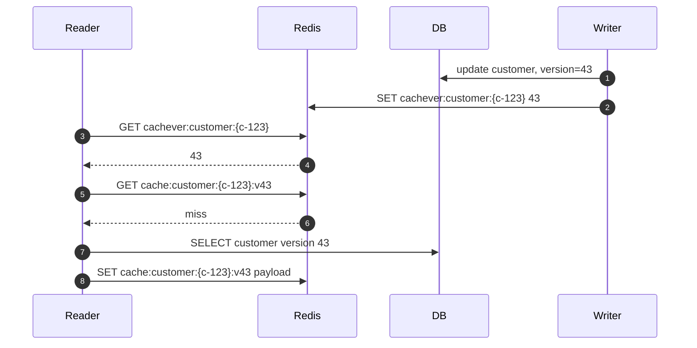

Advantages:

- old refills write to old key only
- latest pointer selects new version
- avoids stale overwrite on the active key
- useful for materialized projections

Costs:

- two Redis reads unless pipelined
- old keys require TTL cleanup
- version pointer consistency matters
- source must expose version or update counter

### Version Sources

| Source | Suitability |
|---|---|
| DB row `version` column | strong and simple |
| `updated_at` timestamp | useful but watch clock precision |
| monotonically increasing sequence | best for strict ordering |
| domain event offset | good for projection caches |
| Redis `INCR` version | ok if Redis drives invalidation, weak if DB is source |

### Java Key Builder

```java
public final class CustomerCacheKeys {
    public static String versionKey(String customerId) {
        return "cachever:customer:{" + customerId + "}";
    }

    public static String payloadKey(String customerId, long version) {
        return "cache:customer:{" + customerId + "}:v" + version;
    }
}
```

In Redis Cluster, the hash tag `{customerId}` keeps related keys in the same hash slot.
This matters for Lua and multi-key operations.

---

## 10. Value-Level Version Guard

If you cannot version the key, version the value.

Payload envelope:

```json
{
  "schemaVersion": 3,
  "sourceVersion": 43,
  "loadedAtEpochMs": 1783000000000,
  "payload": {
    "customerId": "c-123",
    "name": "Ari"
  }
}
```

Before writing cache:

```text
Only set payload if existing sourceVersion is missing or <= candidate sourceVersion.
```

This should be atomic.
Use Lua or Redis Functions.

### Lua Version Guard

```lua
-- KEYS[1] = cache key
-- ARGV[1] = candidate source version
-- ARGV[2] = candidate payload
-- ARGV[3] = ttl seconds

local current = redis.call('GET', KEYS[1])
if current then
  local currentVersion = tonumber(string.match(current, '"sourceVersion"%s*:%s*(%d+)'))
  local candidateVersion = tonumber(ARGV[1])

  if currentVersion and currentVersion > candidateVersion then
    return 0
  end
end

redis.call('SET', KEYS[1], ARGV[2], 'EX', ARGV[3])
return 1
```

Do not parse large JSON in Lua in a hot path if avoidable.
A more practical design stores version separately:

```text
cache:customer:{c-123}:value
cache:customer:{c-123}:version
```

Then a script can compare numeric version cheaply.

---

## 11. Event-Driven Invalidation

When writes happen in one service and reads happen in another, direct invalidation is insufficient.

Pattern:

```text
1. Writer commits source change.
2. Writer emits domain event.
3. Cache-owning service consumes event.
4. Cache-owning service invalidates or refreshes Redis keys.
```

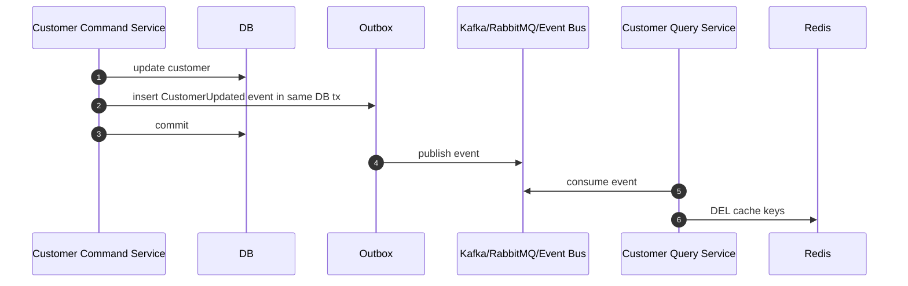

Important:

> Use outbox if losing invalidation events would create unacceptable stale behavior.

Do not rely on “publish event after commit” without a retryable mechanism if correctness matters.

### Invalidate or Refresh?

| Strategy | When useful | Risk |
|---|---|---|
| Invalidate on event | common, simple, source reloads on demand | first read after event pays miss |
| Refresh on event | hot data stays warm | event consumer may overload source |
| Version bump on event | strong stale avoidance | needs version pointer and cleanup |
| Refresh-ahead | predictable hot keys | extra compute and stale scheduling |

For most systems:

```text
invalidate on event + refresh on demand
```

is safer than eager refresh everything.

---

## 12. Invalidation Fanout

One source change may affect many cache keys.

Example: product price update affects:

```text
cache:product:{p-1}:detail:v3
cache:category:{cat-7}:products:page:1:v5
cache:search:q:{hash}:page:1:v2
cache:recommendation:user:{u-9}:v4
cache:quote-preview:{tenant}:{cart-hash}:v1
```

This is where naive caching collapses.

You need a dependency model.

### Options

| Approach | How it works | Trade-off |
|---|---|---|
| Direct key invalidation | writer knows all affected keys | tight coupling, brittle |
| Tag/index invalidation | maintain reverse index of affected keys | extra write/memory overhead |
| Version namespace | bump domain version used in key | simple, may orphan old keys |
| Short TTL | avoid explicit dependency tracking | stale window and source load |
| Rebuild projection | async refresh derived views | eventual freshness |

### Version Namespace Example

```text
cachever:product:p-1 = 18
cachever:category:cat-7 = 81
cache:category:{cat-7}:products:v81:page:1
```

When category membership changes:

```text
INCR cachever:category:cat-7
```

Old pages become unreachable and expire physically later.

This is often simpler than tracking every page key.

---

## 13. Cache Stampede Mental Model

A cache stampede happens when many requests miss at the same time and all recompute the same value.

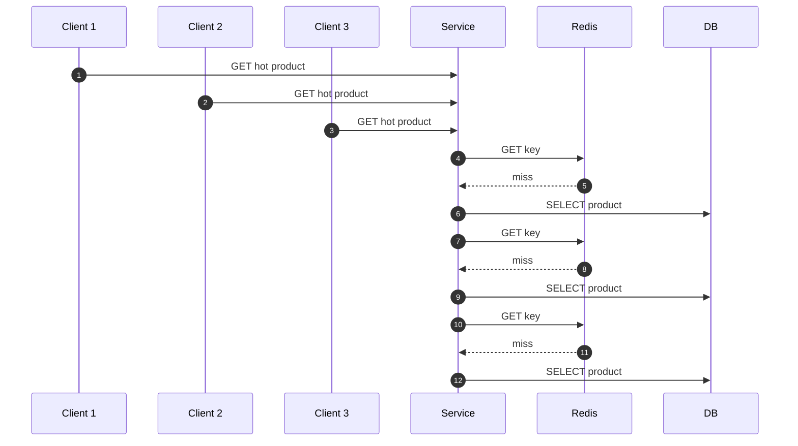

Miss amplification:

```text
source_load = miss_count * rebuild_cost
```

For hot keys, a single expiration can become a backend outage.

Stampede causes:

- synchronized TTL
- Redis restart flushes hot keys
- deploy changes cache namespace
- source outage causes refresh failures
- high-cardinality keys with uneven traffic
- manual invalidation of many hot keys
- short TTL on expensive values

A top engineer treats stampede as a capacity problem, not only a cache problem.

---

## 14. TTL Jitter

Without jitter:

```text
10,000 product keys loaded at 10:00
all expire at 10:15
backend spike at 10:15
```

With jitter:

```text
ttl = baseTtl + random(0, jitterRange)
```

Example:

```java
Duration ttlWithJitter(Duration base, Duration jitter) {
    long jitterMs = ThreadLocalRandom.current().nextLong(jitter.toMillis() + 1);
    return base.plusMillis(jitterMs);
}
```

Better for some cases:

```text
ttl = baseTtl * random(0.8, 1.2)
```

Guideline:

| Situation | Jitter |
|---|---:|
| low traffic, cheap source | optional |
| many keys loaded in batch | mandatory |
| hot keys with same TTL | mandatory |
| scheduled refresh job | mandatory |
| cache namespace migration | mandatory |

Jitter spreads load.
It does not solve hot-key recomputation by itself.

---

## 15. Single-Flight Refresh

Single-flight means:

> For a given key, only one caller rebuilds the value; others wait, return stale, or fail fast.

Basic lock-based flow:

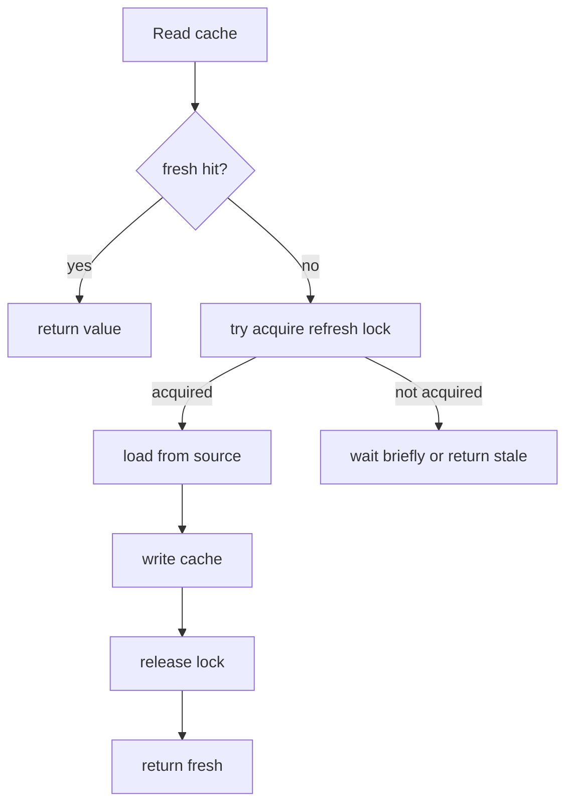

Redis lock:

```text
SET lock:refresh:customer:{c-123} <token> NX PX 5000
```

Rules:

- lock TTL must be longer than expected refresh p99
- lock token must be random
- release only if token matches
- never block request threads indefinitely
- define fallback for lock wait timeout

### Safe Unlock Lua

```lua
if redis.call('GET', KEYS[1]) == ARGV[1] then
  return redis.call('DEL', KEYS[1])
else
  return 0
end
```

This prevents one worker from deleting another worker’s lock after timeout/reacquire.

---

## 16. Single-Flight Java Sketch

```java
public Optional<CustomerDto> getCustomer(String customerId) {
    String cacheKey = customerKey(customerId);
    String lockKey = "lock:refresh:customer:{" + customerId + "}";

    Optional<CacheEnvelope<CustomerDto>> cached = redisCache.get(cacheKey, customerType);
    if (cached.isPresent() && cached.get().isFresh(clock)) {
        return Optional.of(cached.get().payload());
    }

    String token = UUID.randomUUID().toString();
    boolean lockAcquired = redisLock.tryAcquire(lockKey, token, Duration.ofSeconds(5));

    if (lockAcquired) {
        try {
            // Double-check after acquiring lock.
            Optional<CacheEnvelope<CustomerDto>> afterLock = redisCache.get(cacheKey, customerType);
            if (afterLock.isPresent() && afterLock.get().isFresh(clock)) {
                return Optional.of(afterLock.get().payload());
            }

            CustomerDto loaded = customerRepository.findDto(customerId)
                .orElseThrow(() -> new NotFoundException(customerId));

            CacheEnvelope<CustomerDto> envelope = CacheEnvelope.fresh(
                loaded,
                clock.instant(),
                Duration.ofSeconds(60),
                Duration.ofMinutes(10)
            );

            redisCache.set(cacheKey, envelope, Duration.ofMinutes(15));
            return Optional.of(loaded);
        } finally {
            redisLock.releaseIfTokenMatches(lockKey, token);
        }
    }

    if (cached.isPresent() && cached.get().isUsablyStale(clock)) {
        metrics.increment("redis.cache.stale_served", "cache", "customer");
        return Optional.of(cached.get().payload());
    }

    // Last resort: short local wait then retry cache.
    sleepSmallBoundedDelay();
    return redisCache.get(cacheKey, customerType).map(CacheEnvelope::payload);
}
```

Key points:

- read before lock
- acquire lock only on miss/stale
- double-check after lock
- stale fallback if another worker refreshes
- bounded wait only
- no infinite retry loop

---

## 17. Stale-While-Revalidate

Stale-while-revalidate separates response availability from refresh latency.

State model:

```text
fresh      -> return immediately
stale      -> return stale and trigger refresh
too stale  -> block on refresh or fail
missing    -> block on refresh or fail
```

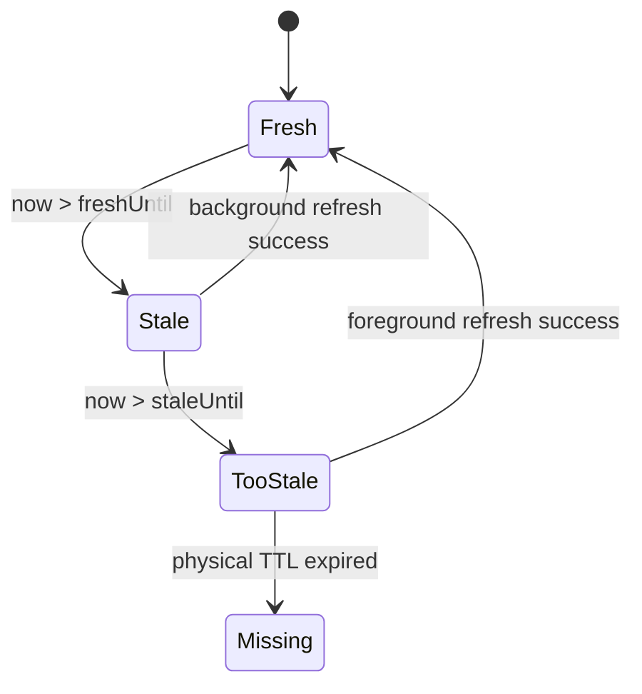

Value envelope:

```json
{
  "loadedAtEpochMs": 1783000000000,
  "freshUntilEpochMs": 1783000060000,
  "staleUntilEpochMs": 1783000600000,
  "payload": {}
}
```

Behavior:

| State | Action |
|---|---|
| fresh | return value |
| stale but usable | return stale; one worker refreshes async |
| too stale | try foreground refresh |
| refresh fails and stale usable | return stale with metric |
| refresh fails and too stale | fail or degraded response |

This pattern is excellent for:

- profile summary
- product detail
- CMS page
- dashboard widgets
- risk features that tolerate degraded freshness
- external API response cache

It is dangerous for:

- final price authorization
- payment state
- permission revocation
- inventory reservation
- compliance decision

---

## 18. Refresh-Ahead

Refresh-ahead means refreshing hot keys before clients observe expiry.

Example:

```text
if now > freshUntil - refreshAheadWindow:
    trigger refresh in background
```

Use it for:

- known hot keys
- expensive source queries
- predictable dashboards
- product homepage data
- configuration snapshots

Avoid it for:

- unbounded high-cardinality keyspace
- rarely used keys
- source systems with tight capacity
- data where refresh does not matter until requested

Refresh-ahead requires admission control.
Without admission control it becomes a cache warming DDoS against your own database.

### Hot-Key Refresh Queue

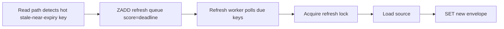

Sorted set key:

```text
cache-refresh:customer-profile:due
```

Member:

```text
customer:{c-123}
```

Score:

```text
epoch millis refresh due time
```

---

## 19. Negative Cache Consistency

Negative cache stores “not found” results.

Example:

```text
cache:customer:{c-404}:negative = { "reason": "not_found" }
```

Benefits:

- blocks repeated DB hits for missing IDs
- protects source from malicious/random probes
- reduces expensive external API calls

Risks:

- newly created record hidden until negative TTL expires
- permission-sensitive not-found may leak semantics
- invalidation on creation is often forgotten

Rules:

| Rule | Why |
|---|---|
| Use short TTL | not-found can become found |
| Include scope | tenant/user/permission affects visibility |
| Invalidate on create | creation must remove negative marker |
| Separate not-found vs forbidden | avoid security confusion |
| Do not cache transient source errors as not-found | prevents false negative poisoning |

Negative key pattern:

```text
cache:customer:{tenant-a:c-123}:neg:v1
```

TTL examples:

| Data | Negative TTL |
|---|---:|
| random ID lookup | 30s-5m |
| external API missing object | 1m-15m |
| user-created object | 5s-30s |
| security-sensitive resource | often do not cache negative result |

---

## 20. Permission-Aware Cache Keys

One of the worst cache consistency bugs is missing authorization dimensions.

Bad key:

```text
cache:case-detail:{case-123}
```

If the payload depends on the viewer, this is wrong.

Better:

```text
cache:case-detail:{tenant-a:case-123}:viewer-role:{role-hash}:v4
```

Or split the cache:

```text
cache:case-public-summary:{tenant-a:case-123}:v2
cache:case-sensitive-fields:{tenant-a:case-123}:permission-snapshot:{hash}:v1
```

A cache key must include every input that changes the output:

- tenant
- locale
- currency
- role
- entitlement snapshot
- experiment bucket
- API version
- projection version
- source version
- feature flag version

Invariant:

> If two requests can legitimately receive different responses, they must not share the same cached value unless the cached value contains only their common subset.

---

## 21. Local In-Process Cache + Redis Cache

Many Java systems use two levels:

```text
Caffeine local cache -> Redis -> DB
```

This improves latency, but complicates invalidation.

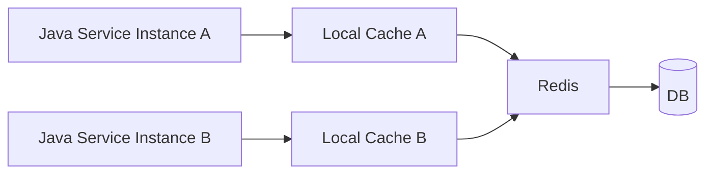

Problems:

- Redis invalidation does not automatically clear local caches
- local cache may serve stale after Redis changed
- instance restart changes behavior
- Pub/Sub invalidation is at-most-once

Safer design:

| Layer | TTL | Role |
|---|---:|---|
| local Caffeine | very short, e.g. 1-5 seconds | absorb microbursts |
| Redis | longer, e.g. 1-15 minutes | distributed cache |
| DB/source | authoritative | correctness |

Do not put long TTL in local memory unless you have reliable invalidation.

### Local Cache Rule

```text
local_ttl <= smallest acceptable staleness window
```

For permission/security data, local cache should often be extremely short or disabled.

---

## 22. Cache Rebuild Admission Control

When Redis misses, you need to protect the source.

Admission strategies:

| Strategy | Behavior |
|---|---|
| single-flight per key | one rebuild per key |
| global rebuild semaphore | cap total concurrent source loads |
| per-tenant rebuild limit | prevent noisy tenant overload |
| priority queue | rebuild critical caches first |
| fail fast | reject low-priority rebuilds during pressure |
| stale fallback | serve stale instead of rebuilding |

Java sketch:

```java
public <T> T loadWithAdmission(String cacheName, Supplier<T> loader) {
    if (!rebuildLimiter.tryAcquire()) {
        throw new CacheRebuildRejectedException(cacheName);
    }
    try {
        return loader.get();
    } finally {
        rebuildLimiter.release();
    }
}
```

Metric:

```text
cache_rebuild_rejected_total{cache="customer-profile"}
```

If this metric is non-zero, Redis is protecting the source by degrading cache refresh.
That is often better than taking the source down.

---

## 23. Cache Miss Is Not One Thing

Do not observe only `hit` and `miss`.

A miss can mean:

| Miss type | Meaning | Action |
|---|---|---|
| cold miss | never loaded | normal load |
| expired miss | physical TTL removed key | maybe stampede risk |
| invalidated miss | writer deleted key | expected source load |
| version miss | new version pointer, payload absent | rebuild latest |
| negative miss | no negative marker | source check needed |
| decode miss | value exists but cannot decode | delete and reload |
| too-stale miss | logical stale limit exceeded | foreground refresh |
| Redis error miss | cache unavailable | fallback or fail |

Use reason codes in cache abstraction:

```java
public enum CacheReadStatus {
    FRESH_HIT,
    STALE_HIT,
    MISS_ABSENT,
    MISS_TOO_STALE,
    MISS_DECODE_ERROR,
    MISS_REDIS_ERROR,
    NEGATIVE_HIT
}
```

Without reason codes, cache metrics become misleading.

---

## 24. Stale Overwrite Prevention

The stale overwrite problem:

```text
Old reader loads source version 10 slowly.
New writer updates source to version 11.
Fast reader caches version 11.
Old reader finishes and overwrites cache with version 10.
```

Prevention options:

| Option | Strength | Cost |
|---|---:|---|
| versioned key | high | version pointer + old key cleanup |
| Lua compare version | high | envelope/version management |
| short TTL | low | stale window remains |
| delete on write | medium | race remains |
| double delete | medium | guessed delay |

Preferred for important data:

```text
sourceVersion + atomic set-if-newer
```

### Separate Version Key Lua

```lua
-- KEYS[1] = value key
-- KEYS[2] = version key
-- ARGV[1] = candidate version
-- ARGV[2] = payload
-- ARGV[3] = ttl seconds

local currentVersion = redis.call('GET', KEYS[2])
local candidateVersion = tonumber(ARGV[1])

if currentVersion and tonumber(currentVersion) > candidateVersion then
  return 0
end

redis.call('SET', KEYS[1], ARGV[2], 'EX', ARGV[3])
redis.call('SET', KEYS[2], ARGV[1], 'EX', ARGV[3])
return 1
```

Cluster note:

```text
cache:customer:{c-123}:value
cache:customer:{c-123}:version
```

The hash tag ensures both keys are in the same slot.

---

## 25. Freshness Budget

A freshness budget is the maximum age tolerated by a path.

Example:

| Path | Allowed age |
|---|---:|
| product browse | 5 minutes |
| product detail price preview | 30 seconds |
| checkout price confirmation | 0 seconds or source-authoritative |
| admin config page | 10 seconds |
| homepage recommendation | 15 minutes |
| fraud feature cache | 1-5 minutes depending on feature |

Do not attach one TTL to an entity globally.
The same entity may have different freshness budgets in different journeys.

Better:

```text
cache:product-summary:{p-1}:browse:v3        TTL 10m
cache:product-price-preview:{p-1}:v5         TTL 30s
no-cache final checkout price authority      source read
```

This avoids over-constraining cheap paths and under-protecting critical paths.

---

## 26. Cache Key Versioning for Deployments

Schema changes require cache versioning.

Bad:

```text
cache:customer:{id}
```

Better:

```text
cache:customer:v3:{id}
```

But with Redis Cluster:

```text
cache:customer:{id}:v3
```

because `{id}` is the hash tag.

Use version bump when:

- serialized schema changes incompatibly
- value meaning changes
- key dimension changes
- source query changes materially
- permission model changes

Do not use version bump casually for every deploy.
It can cold-start your entire cache.

### Migration Strategy

| Strategy | Behavior |
|---|---|
| read old, write new | gradual migration |
| dual write | higher write cost |
| namespace cutover | simple but cold start risk |
| prewarm | reduces cold start, adds source load |
| fallback decoder | supports mixed versions |

For high traffic caches, use gradual migration:

```text
GET v3 -> if miss GET v2 -> transform -> SET v3
```

Then expire v2 naturally.

---

## 27. Redis Unavailable: What Should Happen?

Every cache user needs a Redis failure policy.

| Cache role | Redis down behavior |
|---|---|
| performance-only cache | bypass Redis, read source with admission control |
| source-protecting cache | degrade or fail fast to avoid DB collapse |
| coordination lock | do not pretend lock succeeded |
| idempotency marker | fail closed or use source uniqueness |
| rate limiter | fail open or fail closed based on risk |
| feature flag cache | use last-known-good local snapshot |

For cache consistency, the most dangerous policy is accidental:

```text
catch RedisException -> call DB with no limit
```

Under Redis outage, every service instance may stampede the DB.

Safer:

- circuit breaker around Redis
- bounded source fallback
- per-cache fallback policy
- stale local snapshot for selected caches
- global rebuild semaphore
- degraded response for non-critical data

---

## 28. Source Unavailable: What Should Happen?

If source is down and Redis has stale value, should you serve it?

Depends.

| Data | Serve stale during source outage? |
|---|---|
| product content | yes, bounded |
| customer display profile | often yes |
| permissions | rarely, or very short bounded |
| payment status | usually no |
| rate plan definition | maybe, if effective date included |
| fraud rule | maybe last-known-good if governed |
| final quote price | no unless business explicitly accepts |

Stale serving should be logged and measured:

```text
cache_stale_served_total{cache="product-detail", reason="source_failure"}
cache_stale_age_seconds{cache="product-detail"}
```

Alert not on any stale serve, but on excessive stale age or volume.

---

## 29. Testing Cache Consistency

Unit tests are not enough.
You need concurrency and failure tests.

### Test Cases

| Test | What it proves |
|---|---|
| concurrent read miss single-flight | only one source call |
| read/write race | stale overwrite prevented or bounded |
| Redis delete failure after DB commit | stale bounded by TTL/event repair |
| source failure with stale value | stale fallback policy works |
| source failure without stale value | correct failure response |
| decode failure | cache is deleted/reloaded |
| namespace migration | old value not decoded incorrectly |
| negative cache create race | creation invalidates negative marker |
| Redis cluster cross-slot | Lua/multi-key script keys co-located |

### Deterministic Race Test Sketch

```java
@Test
void staleReaderMustNotOverwriteNewerCacheValue() throws Exception {
    CountDownLatch readerLoadedOld = new CountDownLatch(1);
    CountDownLatch writerCommittedNew = new CountDownLatch(1);

    CompletableFuture<Void> oldReader = CompletableFuture.runAsync(() -> {
        CustomerDto old = repository.loadVersion(10);
        readerLoadedOld.countDown();
        await(writerCommittedNew);
        cache.putIfNewer("c-123", 10, old);
    });

    CompletableFuture<Void> writer = CompletableFuture.runAsync(() -> {
        await(readerLoadedOld);
        repository.updateToVersion(11);
        cache.putIfNewer("c-123", 11, repository.loadVersion(11));
        writerCommittedNew.countDown();
    });

    CompletableFuture.allOf(oldReader, writer).join();

    assertThat(cache.get("c-123").sourceVersion()).isEqualTo(11);
}
```

This is the kind of test that reveals senior-level cache bugs.

---

## 30. Operational Metrics

Minimum metrics:

```text
cache_read_total{cache,status}
cache_write_total{cache,status}
cache_delete_total{cache,status}
cache_hit_ratio{cache}
cache_stale_served_total{cache,reason}
cache_stale_age_seconds{cache}
cache_rebuild_total{cache,status}
cache_rebuild_duration_seconds{cache}
cache_rebuild_inflight{cache}
cache_lock_acquire_total{cache,status}
cache_lock_wait_duration_seconds{cache}
cache_decode_failure_total{cache,schemaVersion}
cache_payload_bytes{cache}
cache_negative_hit_total{cache}
cache_source_fallback_total{cache,reason}
```

Redis/server-side signals:

```text
instantaneous_ops_per_sec
used_memory
evicted_keys
expired_keys
keyspace_hits
keyspace_misses
connected_clients
blocked_clients
cmdstat_get/usec_per_call
cmdstat_set/usec_per_call
slowlog_len
latency_spike_events
```

Business-facing signals:

```text
checkout_price_revalidation_failure_total
permission_cache_stale_denied_total
permission_cache_stale_allowed_total
quote_preview_stale_age_seconds
customer_profile_cache_age_seconds
```

Do not stop at hit ratio.
A high hit ratio can still hide stale, wrong, or oversized values.

---

## 31. Pattern Selection Matrix

| Problem | Recommended pattern |
|---|---|
| normal product read cache | cache-aside + TTL jitter + delete-after-commit |
| hot expensive key | stale-while-revalidate + single-flight |
| source version available | versioned key or set-if-newer |
| many derived keys affected | namespace version bump |
| creation race with missing objects | short negative cache + invalidate on create |
| cache schema migration | versioned key + read-old/write-new |
| cross-service writes | outbox event invalidation |
| Redis outage risk to DB | source fallback admission control |
| stale overwrite unacceptable | atomic version guard |
| local cache above Redis | very short local TTL + invalidation hint only |

---

## 32. Production Checklist

Before approving a Redis cache in a serious Java system:

- [ ] Source of truth is explicit.
- [ ] Cache owner is explicit.
- [ ] Key pattern includes tenant/security/version dimensions.
- [ ] Value schema is versioned.
- [ ] Normal freshness budget is defined.
- [ ] Degraded staleness budget is defined.
- [ ] Physical TTL is greater than logical stale window.
- [ ] TTL jitter is applied where relevant.
- [ ] Invalidation trigger is documented.
- [ ] Write path uses after-commit invalidation.
- [ ] Stale overwrite race is either prevented or accepted explicitly.
- [ ] Hot keys have single-flight or stale-while-revalidate.
- [ ] Redis outage policy is defined.
- [ ] Source outage policy is defined.
- [ ] Negative cache TTL is short and create invalidation exists.
- [ ] Metrics include stale age and rebuild pressure.
- [ ] Tests include concurrency and failure cases.
- [ ] Cache cannot be used accidentally in forbidden critical paths.

---

## 33. Anti-Patterns

### Anti-pattern 1 — TTL as a Guess

```text
TTL = 1 hour because it feels reasonable
```

Better:

```text
TTL = based on freshness budget + source load + stale fallback policy
```

### Anti-pattern 2 — Cache Key Missing Security Context

```text
cache:case:{caseId}
```

Better:

```text
cache:case-summary:{tenantId:caseId}:visibility:{permissionHash}:v2
```

### Anti-pattern 3 — Redis Exception Means Unlimited DB Fallback

```java
catch (RedisException e) {
    return db.load(id);
}
```

Better:

```java
catch (RedisException e) {
    return sourceFallbackLimiter.executeOrDegrade(() -> db.load(id));
}
```

### Anti-pattern 4 — Hit Ratio as the Only Cache KPI

A cache can have 99% hit ratio and still serve unauthorized or stale data.

Add:

- stale age
- decode failures
- source fallback rate
- lock contention
- rebuild duration
- forbidden-path usage guard

### Anti-pattern 5 — Pub/Sub as Reliable Invalidation

Redis Pub/Sub is an ephemeral signaling mechanism.
Treat Pub/Sub invalidation as a hint unless you have another repair mechanism such as TTL, versioning, or event replay.

---

## 34. Engineering Heuristics

Use these defaults unless you have a reason not to:

- Prefer cache-aside for simple derived reads.
- Prefer delete-after-commit over update-after-commit.
- Prefer versioned keys for high-write/high-read race-prone caches.
- Prefer short local cache TTL above Redis.
- Prefer stale-while-revalidate for hot expensive reads where stale is acceptable.
- Prefer source-authoritative reads for final irreversible decisions.
- Prefer outbox-driven invalidation when writer and reader are separate services.
- Prefer TTL jitter on all batch-loaded or hot cache families.
- Prefer explicit degraded behavior over accidental best effort.

The top 1% skill is not knowing many cache patterns.
The top 1% skill is knowing which pattern is safe under the actual failure modes.

---

## 35. Part Summary

Cache consistency is not binary.
It is an envelope containing freshness, invalidation, refresh, fallback, and observability.

Key takeaways:

- Redis and the source of truth are usually not updated atomically together.
- Define consistency envelope per cache and per user journey.
- Physical TTL, logical TTL, business validity, and client freshness are different concepts.
- Delete-after-commit is often the safest default invalidation strategy.
- Double delete reduces some races but is not strong correctness.
- Versioned keys and version-guarded writes prevent stale overwrites.
- Event-driven invalidation needs reliable publication, often via outbox.
- Stampede control is mandatory for hot keys.
- Stale-while-revalidate improves availability when stale data is acceptable.
- Negative cache must be short-lived and invalidated on create.
- Cache keys must include security and personalization dimensions.
- Redis outage must not become uncontrolled DB fallback.
- Measure stale age, rebuild pressure, decode errors, and fallback behavior.

Next part:

> Part 016 — Idempotency, Deduplication, and Exactly-Once Illusions

---

## References

- Redis Docs — SET command: https://redis.io/docs/latest/commands/set/
- Redis Docs — EXPIRE command and options: https://redis.io/docs/latest/commands/expire/
- Redis Docs — TTL command: https://redis.io/docs/latest/commands/ttl/
- Redis Docs — Scripting with Lua: https://redis.io/docs/latest/develop/programmability/eval-intro/
- Redis Docs — Redis Functions: https://redis.io/docs/latest/develop/programmability/functions-intro/
- Redis Docs — Distributed locks with Redis: https://redis.io/docs/latest/develop/clients/patterns/distributed-locks/
- Redis Blog — Thundering herd/cache stampede: https://redis.io/blog/how-to-tame-the-thundering-herd-problem/
