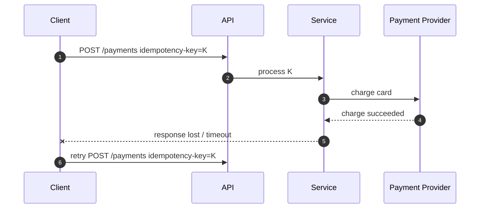
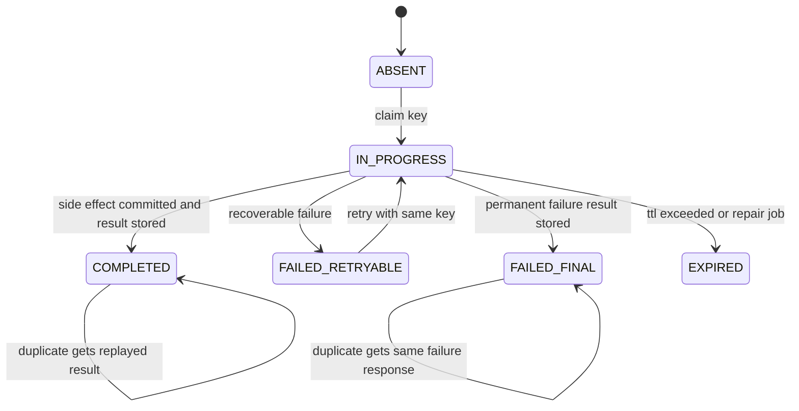
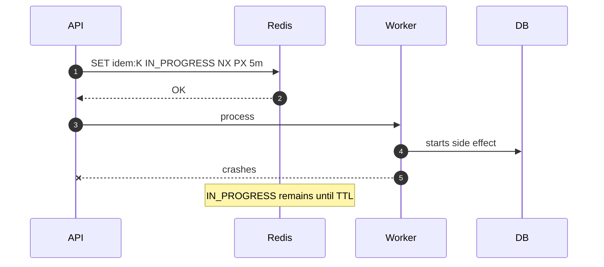
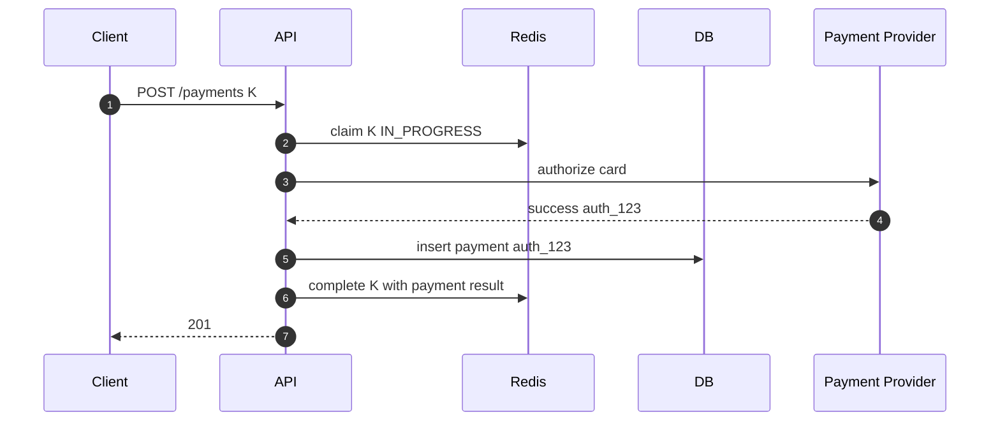
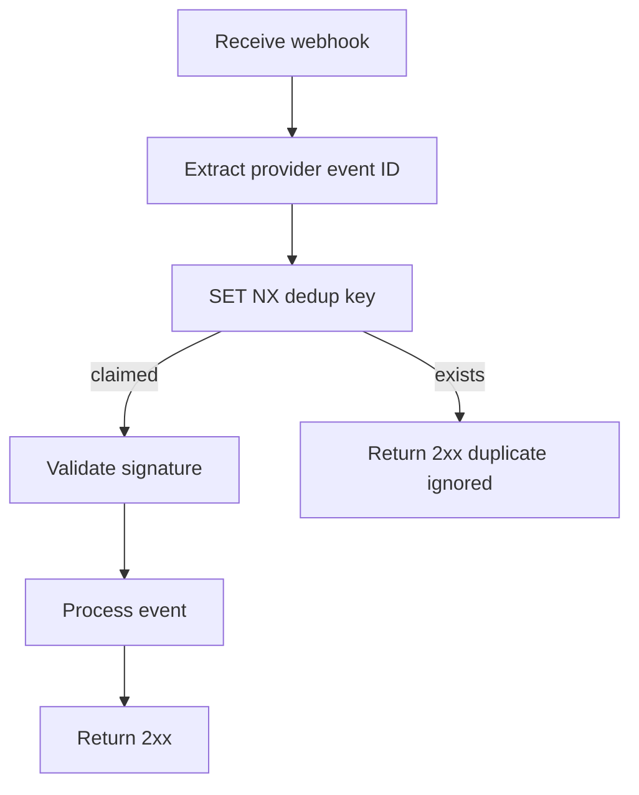
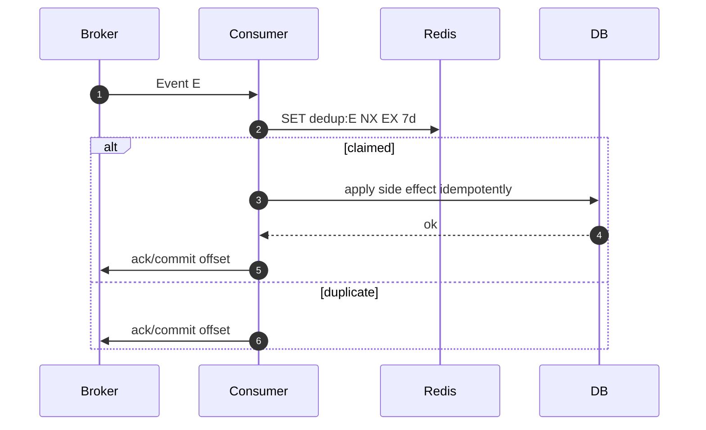
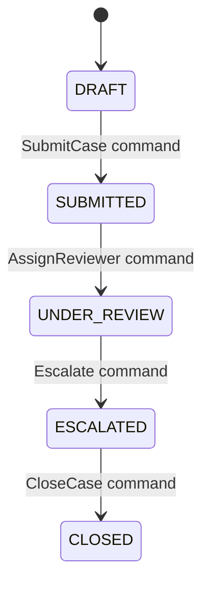

# Part 016 — Idempotency, Deduplication, and Exactly-Once Illusions

Part 015 covered cache consistency.
Now we move to a different but related problem:

> How do we make retry-heavy distributed systems safe when the same command, event, or webhook may arrive more than once?

Redis is frequently used for:

- idempotency keys
- duplicate request suppression
- webhook deduplication
- event ingestion guards
- distributed retry protection
- temporary uniqueness windows
- exactly-once-like user experience

But Redis does not magically give exactly-once business semantics.
It gives fast atomic primitives that can help you build **bounded idempotency**.

Bounded idempotency is honest engineering.
Exactly-once is usually a slogan.

---

## 1. Kaufman Skill Decomposition

Target skill:

> Use Redis to design idempotent Java workflows that remain safe under retries, duplicate delivery, client timeouts, worker crashes, and partial failures.

Sub-skills:

| Sub-skill | What you must be able to do |
|---|---|
| Idempotency mental model | Distinguish duplicate suppression from business idempotency |
| Key design | Build stable idempotency keys from correct scope and intent |
| Atomic claim | Use Redis `SET NX` or Lua to claim work safely |
| In-progress state | Represent started, completed, failed, and expired states |
| Result replay | Return same response for duplicate successful requests |
| Retry safety | Avoid double side effects when clients retry |
| Dedup window | Choose TTL from retry horizon and business risk |
| Event dedup | Handle duplicate message/event/webhook delivery |
| Failure recovery | Repair stuck in-progress markers |
| Source authority | Know when DB uniqueness must complement Redis |

Practice rule:

> Do not ask “can Redis block duplicates?” Ask “which duplicates, for how long, at which boundary, and what response should duplicate callers receive?”

---

## 2. Idempotency vs Deduplication

These terms are related but not identical.

| Concept | Meaning |
|---|---|
| Idempotency | Repeating the same operation has the same intended effect |
| Deduplication | Detecting and suppressing duplicate inputs |
| Replay | Returning stored result for a repeated request |
| Exactly-once | A system-level claim that an effect happens once despite failures |
| Effect-once | Business side effect is committed at most once |
| Response-once | Caller receives same response for same idempotency key |
| Delivery-once | Transport delivers message once; rare in real systems |

Example:

```http
POST /payments
Idempotency-Key: payreq_abc123
```

If the client retries because of timeout:

- duplicate request should not charge twice
- duplicate request should receive the original payment result if available
- if original request is still processing, duplicate should not start another charge

That is idempotency.

Dedup alone would only say:

```text
I have seen this key before, reject it.
```

That may be insufficient because the client may need the original result.

---

## 3. Why Retries Create Duplicates

Distributed systems create duplicates naturally.



The retry is correct from the client’s perspective.
The service must decide whether this is:

- same request replay
- conflicting request using same key
- concurrent duplicate
- old expired duplicate
- malicious replay

Idempotency is not optional in systems with:

- mobile clients
- browser retries
- load balancer timeouts
- payment providers
- webhook delivery
- async workers
- message brokers
- distributed sagas
- external API calls

---

## 4. The Most Important Invariant

For command idempotency:

> The idempotency key must represent the caller’s intent, not merely a technical request attempt.

Bad key:

```text
random UUID generated by server per received request
```

This does not deduplicate client retries because every retry gets a different key.

Better:

```text
client-provided idempotency key scoped to tenant/user/operation
```

Example key:

```text
idem:payment-create:{tenant-a:user-42}:payreq_abc123
```

But the key alone is not enough.
You must store a fingerprint of the request payload.

Why?

The same idempotency key reused with different payload should not replay old result silently.
It should return a conflict.

Payload fingerprint:

```text
sha256(method + path + canonical_json_body + tenant + account)
```

Stored value:

```json
{
  "state": "COMPLETED",
  "requestHash": "sha256:...",
  "statusCode": 201,
  "responseBody": {...},
  "startedAtEpochMs": 1783000000000,
  "completedAtEpochMs": 1783000001200
}
```

---

## 5. Idempotency State Machine

Simple `SET NX` dedup is not enough for commands that produce responses.
Use a state machine.



Important states:

| State | Meaning | Duplicate behavior |
|---|---|---|
| absent | no known request | attempt claim |
| in_progress | request currently running | return 409/202 or wait bounded |
| completed | successful result stored | replay same result |
| failed_retryable | transient failure | allow retry or return retryable status |
| failed_final | permanent failure | replay failure response |
| expired | too old to trust | policy-specific |

For high-risk workflows, store the final authoritative result in the database too.
Redis should not be the only evidence of a payment or order command.

---

## 6. Basic Atomic Claim with SET NX

Redis `SET` supports conditional set with expiry:

```text
SET idem:payment:{scope}:K <in-progress-envelope> NX PX 300000
```

Meaning:

- `NX`: only set if key does not exist
- `PX`: expiry in milliseconds
- value: in-progress marker
- TTL: max time before marker is considered abandoned

Java sketch with Lettuce-style API:

```java
public ClaimResult claim(IdempotencyKey key, RequestFingerprint fingerprint) {
    String redisKey = key.toRedisKey();
    String value = json.writeValueAsString(IdempotencyRecord.inProgress(fingerprint, clock.instant()));

    SetArgs args = SetArgs.Builder.nx().px(Duration.ofMinutes(5).toMillis());
    String result = redisCommands.set(redisKey, value, args);

    if ("OK".equals(result)) {
        return ClaimResult.claimed();
    }

    IdempotencyRecord existing = readRecord(redisKey);
    return ClaimResult.alreadyExists(existing);
}
```

This is good for initial claim.
It is not sufficient for finalization because finalization must validate owner/state.

---

## 7. Why the In-Progress TTL Matters

If a worker crashes after claiming the key, the marker remains.



TTL defines the maximum lockout window.

Too short:

```text
original work still running, marker expires, duplicate starts second side effect
```

Too long:

```text
crashed work blocks legitimate retry for too long
```

Choose TTL from:

```text
max expected processing duration + retry jitter + operational repair margin
```

For payment/order workflows:

- do not rely only on Redis TTL
- use DB unique constraint or provider idempotency when possible
- use reconciliation if uncertainty remains

---

## 8. Result Replay Pattern

When command completes, store the final result.

```text
idem:payment:{tenant-a:user-42}:payreq_abc123 = COMPLETED envelope
```

Envelope:

```json
{
  "state": "COMPLETED",
  "requestHash": "sha256:abc",
  "resourceType": "payment",
  "resourceId": "pay_789",
  "statusCode": 201,
  "responseBody": {
    "paymentId": "pay_789",
    "status": "AUTHORIZED"
  },
  "startedAtEpochMs": 1783000000000,
  "completedAtEpochMs": 1783000001500
}
```

Duplicate behavior:

```text
same key + same request hash + completed -> return stored response
same key + different request hash -> 409 conflict
same key + in progress -> 202/409/wait bounded
same key + failed final -> replay stored failure
```

### Why Store Response?

Without response replay, duplicate callers may see inconsistent outcomes:

- original got 201 but retry gets 409
- original created resource but retry says duplicate without resource id
- client cannot recover after timeout

Idempotency should be caller-friendly:

```text
same command identity => same observable result where possible
```

---

## 9. Atomic Finalization with Lua

Finalization should verify:

- key exists
- state is `IN_PROGRESS`
- request hash matches
- optional owner token matches
- then replace with completed result and longer TTL

Why owner token?

If an in-progress marker expires and another worker claims the same key, the old worker must not finalize over the new claim.

Claim envelope:

```json
{
  "state": "IN_PROGRESS",
  "requestHash": "sha256:abc",
  "ownerToken": "worker-token-123",
  "startedAtEpochMs": 1783000000000
}
```

Lua finalization sketch:

```lua
-- KEYS[1] = idempotency key
-- ARGV[1] = expected request hash
-- ARGV[2] = expected owner token
-- ARGV[3] = completed envelope json
-- ARGV[4] = completed ttl seconds

local current = redis.call('GET', KEYS[1])
if not current then
  return 'MISSING'
end

if string.find(current, '"state"%s*:%s*"IN_PROGRESS"') == nil then
  return 'NOT_IN_PROGRESS'
end

if string.find(current, '"requestHash"%s*:%s*"' .. ARGV[1] .. '"') == nil then
  return 'HASH_MISMATCH'
end

if string.find(current, '"ownerToken"%s*:%s*"' .. ARGV[2] .. '"') == nil then
  return 'OWNER_MISMATCH'
end

redis.call('SET', KEYS[1], ARGV[3], 'EX', ARGV[4])
return 'COMPLETED'
```

Production improvement:

- avoid fragile JSON parsing in Lua for hot paths
- store state/hash/token in a Redis Hash
- use a Lua script over hash fields

Hash layout:

```text
HSET idem:payment:{scope}:K state IN_PROGRESS requestHash ... ownerToken ... startedAt ...
EXPIRE idem:payment:{scope}:K 300
```

Then finalization script uses `HGET`.

---

## 10. Hash-Based Idempotency Record

Redis Hash is often better than JSON string for idempotency metadata.

Fields:

```text
state
requestHash
ownerToken
startedAtEpochMs
completedAtEpochMs
statusCode
resourceType
resourceId
responseBody
errorCode
```

Claim script:

```lua
-- KEYS[1] = idempotency key
-- ARGV[1] = request hash
-- ARGV[2] = owner token
-- ARGV[3] = now epoch ms
-- ARGV[4] = in-progress ttl seconds

if redis.call('EXISTS', KEYS[1]) == 1 then
  return 'EXISTS'
end

redis.call('HSET', KEYS[1],
  'state', 'IN_PROGRESS',
  'requestHash', ARGV[1],
  'ownerToken', ARGV[2],
  'startedAtEpochMs', ARGV[3]
)
redis.call('EXPIRE', KEYS[1], ARGV[4])
return 'CLAIMED'
```

Complete script:

```lua
-- KEYS[1] = idempotency key
-- ARGV[1] = request hash
-- ARGV[2] = owner token
-- ARGV[3] = completed epoch ms
-- ARGV[4] = status code
-- ARGV[5] = resource id
-- ARGV[6] = response body json
-- ARGV[7] = completed ttl seconds

local state = redis.call('HGET', KEYS[1], 'state')
if not state then return 'MISSING' end
if state ~= 'IN_PROGRESS' then return state end

if redis.call('HGET', KEYS[1], 'requestHash') ~= ARGV[1] then
  return 'HASH_MISMATCH'
end

if redis.call('HGET', KEYS[1], 'ownerToken') ~= ARGV[2] then
  return 'OWNER_MISMATCH'
end

redis.call('HSET', KEYS[1],
  'state', 'COMPLETED',
  'completedAtEpochMs', ARGV[3],
  'statusCode', ARGV[4],
  'resourceId', ARGV[5],
  'responseBody', ARGV[6]
)
redis.call('EXPIRE', KEYS[1], ARGV[7])
return 'COMPLETED'
```

This is clearer, more efficient for metadata checks, and easier to inspect during incidents.

---

## 11. Request Hash Conflict

Same idempotency key with different payload is not a duplicate.
It is a conflict.

Example:

```text
Request A:
Idempotency-Key: K
amount: 100000
currency: IDR

Request B:
Idempotency-Key: K
amount: 200000
currency: IDR
```

Do not replay A for B.
Return conflict:

```http
HTTP/1.1 409 Conflict
Content-Type: application/json

{
  "error": "IDEMPOTENCY_KEY_REUSED_WITH_DIFFERENT_REQUEST",
  "message": "The provided idempotency key was already used for a different request payload."
}
```

Canonicalize before hashing:

- sort JSON object fields
- normalize numeric representation
- exclude volatile headers
- include tenant/account scope
- include method/path/operation
- include critical body fields
- include API version if semantics changed

Do not hash raw JSON string directly if clients can vary field order or whitespace.

---

## 12. Idempotency Key Scope

Key scope determines what duplicates are considered identical.

Bad:

```text
idem:{idempotencyKey}
```

Collision risk across tenants/users/operations.

Better:

```text
idem:{operation}:{tenantId}:{actorId}:{idempotencyKey}
```

Cluster-friendly:

```text
idem:payment-create:{tenant-a:user-42}:payreq_abc123
```

Scope dimensions:

| Dimension | Reason |
|---|---|
| tenant | prevent cross-tenant collision |
| actor/account | prevent user key collision |
| operation | same key can be used for different endpoints |
| API version | request semantics may change |
| resource parent | e.g. order under account/cart |
| region | if Redis is region-local |

Invariant:

> Two different business intents must not share the same idempotency record.

---

## 13. Choosing Idempotency TTL

TTL is not only memory cleanup.
It is the dedup correctness window.

```text
idempotency TTL >= maximum retry horizon
```

Consider:

- client retry duration
- load balancer timeout
- mobile offline retry
- webhook provider retry schedule
- message broker redelivery window
- business dispute/reconciliation period
- operational replay jobs

Examples:

| Workflow | TTL |
|---|---:|
| UI form submit | 10 minutes - 24 hours |
| payment create | 24 hours - several days, often DB-backed longer |
| order submit | 24 hours - 7 days |
| webhook provider event | provider retry horizon + margin |
| internal event dedup | retention/replay window |
| high-volume telemetry dedup | seconds-minutes |
| approximate click dedup | minutes-hours |

Memory impact:

```text
memory = records_per_second * ttl_seconds * avg_record_size
```

At 1,000 requests/sec, 24-hour TTL, and 1 KB record:

```text
1000 * 86400 * 1024 ~= 88 GB raw payload before Redis overhead
```

Therefore high-throughput idempotency needs:

- compact records
- DB-backed final result for critical commands
- shorter Redis TTL where acceptable
- sharding/cluster capacity planning
- cleanup and compression strategy

---

## 14. Redis Alone vs DB Unique Constraint

Redis is fast, but not always sufficient.

| Requirement | Redis only | DB uniqueness |
|---|---:|---:|
| low-latency duplicate suppression | excellent | ok |
| survives Redis data loss | no, unless persistent and restored | yes |
| transactional with business row | no | yes |
| long-term audit | weak | strong |
| cross-region strong uniqueness | weak | depends on DB architecture |
| high throughput temporary window | excellent | can be expensive |

For critical workflows:

```text
Redis idempotency guard + DB unique constraint = better than either alone
```

Example DB table:

```sql
CREATE TABLE payment_request_idempotency (
    tenant_id        text NOT NULL,
    actor_id         text NOT NULL,
    idempotency_key  text NOT NULL,
    request_hash     text NOT NULL,
    payment_id       text,
    state            text NOT NULL,
    created_at       timestamptz NOT NULL,
    completed_at     timestamptz,
    PRIMARY KEY (tenant_id, actor_id, idempotency_key)
);
```

Redis handles fast path.
DB enforces durable uniqueness.

---

## 15. Side Effects and Commit Ordering

The hardest part is not claiming the idempotency key.
The hardest part is side-effect ordering.

Example payment flow:



Failure windows:

| Window | Failure | Risk |
|---|---|---|
| after Redis claim, before PSP | stuck in progress | retry blocked until TTL |
| after PSP success, before DB insert | external charge exists but DB missing | reconciliation needed |
| after DB insert, before Redis complete | duplicate retry sees in-progress | can recover from DB |
| after Redis complete, before client response | retry can replay | good |

Correctness strategy:

- external provider should also receive idempotency key if supported
- DB must record provider transaction ID uniquely
- Redis completion can be rebuilt from DB if missing
- reconciliation job handles uncertain side effects

Redis is part of the workflow.
It is not the entire correctness proof.

---

## 16. Recovering from IN_PROGRESS

When duplicate arrives and state is `IN_PROGRESS`, options:

| Policy | Behavior |
|---|---|
| return 409 Conflict | client retries later |
| return 202 Accepted | operation still processing |
| wait bounded | useful for quick operations |
| lookup DB by idempotency key | recover completed result |
| steal after timeout | risky unless owner/lease model supports it |
| mark retryable failure | repair job transitions state |

Recommended for command APIs:

```text
1. If IN_PROGRESS and young: return 202/409 with Retry-After.
2. If IN_PROGRESS and old: check authoritative DB.
3. If DB has completed result: update Redis to COMPLETED and replay.
4. If DB has no result: allow retry only if side effects are safe or reconciled.
```

Java sketch:

```java
public IdempotencyDecision handleExisting(IdempotencyRecord record, Command command) {
    if (!record.requestHash().equals(command.fingerprint())) {
        return IdempotencyDecision.conflict();
    }

    if (record.isCompleted()) {
        return IdempotencyDecision.replay(record.response());
    }

    if (record.isInProgress() && record.age(clock).compareTo(Duration.ofSeconds(30)) < 0) {
        return IdempotencyDecision.processing(Duration.ofSeconds(2));
    }

    Optional<CommandResult> recovered = authoritativeStore.findByIdempotencyKey(command.scope(), command.key());
    if (recovered.isPresent()) {
        idempotencyStore.completeFromRecoveredResult(command.key(), recovered.get());
        return IdempotencyDecision.replay(recovered.get().response());
    }

    return IdempotencyDecision.retryAllowedWithCaution();
}
```

---

## 17. Webhook Deduplication

Webhook providers often deliver the same event multiple times.

Dedup key:

```text
dedup:webhook:{provider}:{tenant}:event:{eventId}
```

Basic pattern:

```text
SET dedup:webhook:{stripe}:{tenant-a}:event:evt_123 seen NX EX 604800
```

If result is OK, process.
If not, duplicate; acknowledge without processing.



Important ordering:

> Validate webhook signature before trusting event identity for security decisions.

But dedup sometimes happens before expensive processing after minimal safe parsing.
The exact ordering depends on threat model.

For financial events, store event ID in DB too.
Redis dedup TTL only covers recent duplicates.

---

## 18. Event Consumer Deduplication

Message brokers may redeliver.
Consumers must be idempotent.

Dedup key:

```text
dedup:event:{consumerName}:{topic}:{partition}:{offset}
```

But offset-based dedup only identifies delivery, not business event identity.
Often better:

```text
dedup:event:{consumerName}:{eventType}:{eventId}
```

Rules:

- dedup per consumer, not globally, if multiple consumers need to process same event
- dedup event ID, not payload hash, when event ID is reliable
- store processing state for long-running handlers
- commit broker offset only after side effects are safe

### Consumer Flow



If side effect succeeds but Redis fails before marking processed, duplicate may process again.
Therefore the side effect itself should also be idempotent where important.

---

## 19. Dedup Before or After Processing?

Two common patterns:

### Claim Before Processing

```text
SET dedup key NX
process side effect
```

Benefit:

- prevents concurrent duplicate processing

Risk:

- crash after claim before processing may suppress legitimate retry until TTL

### Mark After Processing

```text
process side effect
SET dedup key
```

Benefit:

- no false suppression before work

Risk:

- concurrent duplicates can process simultaneously

Better for serious workflows:

```text
IN_PROGRESS -> COMPLETED state machine
```

or use DB transaction:

```text
INSERT processed_event(event_id) unique
apply side effect in same transaction
commit
```

Redis claim is best when:

- side effect is safe to retry
- short duplicate window is enough
- low latency matters
- DB unique table is too expensive for all events

DB idempotency is best when:

- side effect must be durable and exactly once within DB boundary
- audit is required
- long replay windows exist

---

## 20. Approximate Deduplication

Not all dedup requires exactness.

Examples:

- click deduplication
- impression fraud filtering
- telemetry dedup
- analytics event collapse
- repeated search query suppression

Exact set:

```text
SADD dedup:clicks:2026-07-02 fingerprint
```

Problem:

```text
memory grows with number of unique fingerprints
```

Alternatives:

- bitmap with hashed position
- Bloom filter
- Cuckoo filter
- Count-Min Sketch for frequency

Trade-off:

| Structure | False positives | False negatives | Use case |
|---|---:|---:|---|
| Set | no | no | exact dedup, bounded volume |
| Bitmap hash | yes | possible by collision | rough dedup |
| Bloom filter | yes | no for inserted item under normal assumptions | large-scale membership |
| Cuckoo filter | yes | no under normal assumptions, supports deletion in some variants | dynamic membership |
| Count-Min Sketch | overestimates count | no undercount in model | frequency estimate |

Approximate dedup must never be used when false positive means dropping a payment/order/security event.

---

## 21. Idempotency for REST APIs

HTTP semantics matter.

| Method | Natural idempotency |
|---|---|
| GET | should be safe/idempotent |
| PUT | usually idempotent if replacing resource |
| DELETE | usually idempotent depending response semantics |
| POST | often not idempotent without key |
| PATCH | depends on operation semantics |

Idempotency key is most useful for POST commands:

```http
POST /orders
Idempotency-Key: ordreq_123
```

Response cases:

| Existing state | Response |
|---|---|
| absent | process normally |
| in progress same hash | 202 or 409 with Retry-After |
| completed same hash | replay stored status/body |
| failed final same hash | replay stored failure |
| same key different hash | 409 conflict |
| expired | policy-specific; often treat as new or reject |

Header design:

```http
Idempotency-Key: <client-generated-key>
Idempotency-Replayed: true
Retry-After: 2
```

Do not require clients to infer replay from response body only.

---

## 22. Idempotency for Internal Commands

Internal services need idempotency too.

Example command:

```json
{
  "commandId": "cmd_123",
  "commandType": "ApproveCaseEscalation",
  "tenantId": "tenant-a",
  "caseId": "case-7",
  "actorId": "user-42",
  "expectedCaseVersion": 18
}
```

Key:

```text
idem:command:ApproveCaseEscalation:{tenant-a:case-7}:cmd_123
```

Important:

- command ID dedups retries
- expected version protects business race
- DB state transition should still be conditional

Example DB update:

```sql
UPDATE case_escalation
SET status = 'APPROVED', version = version + 1
WHERE case_id = :caseId
  AND status = 'PENDING_APPROVAL'
  AND version = :expectedVersion;
```

Redis prevents duplicate command work.
DB guards business state transition.

---

## 23. Idempotency and State Machines

For lifecycle systems, idempotency should align with state transitions.

Bad thinking:

```text
If duplicate command arrives, ignore it.
```

Better thinking:

```text
If duplicate command arrives, return the current result of the same transition attempt.
```

Example case lifecycle:



`SubmitCase` idempotency:

- same command ID, same payload: replay submitted result
- different command ID but case already submitted: return domain conflict or current state depending API contract
- same command ID with different payload: idempotency conflict

This distinction matters:

| Scenario | Meaning |
|---|---|
| same idempotency key | retry of same intent |
| different key, same desired transition | separate intent; may be conflict or no-op |
| current state already advanced | command may be obsolete |
| expected version mismatch | concurrency conflict |

Redis idempotency does not replace domain state validation.

---

## 24. Rate of Duplicate Detection vs Memory

High-volume dedup needs capacity math.

Formula:

```text
records = events_per_second * dedup_window_seconds
memory ~= records * average_record_overhead
```

Example:

```text
50,000 events/sec
1 hour dedup window
180,000,000 records
```

Exact Redis keys may be too expensive.

Better options:

- bucketed sets per minute/hour
- Bloom filter per time bucket
- Redis Cluster sharding
- event log compaction elsewhere
- DB uniqueness only for critical subset
- dedup at producer plus consumer

Bucketed key:

```text
dedup:webhook:stripe:2026-07-02T15:00
```

Member:

```text
eventId
```

Set TTL:

```text
EXPIRE dedup:webhook:stripe:2026-07-02T15:00 604800
```

This reduces key count but set cardinality must be monitored.

---

## 25. Sharding Idempotency Keys

In Redis Cluster, keys are automatically distributed by hash slot.
But hot scope can still create hot shards.

Bad if all operations use same hash tag:

```text
idem:payment:{tenant-a}:K1
idem:payment:{tenant-a}:K2
idem:payment:{tenant-a}:K3
```

All keys with `{tenant-a}` go to one slot.

Better if per actor/order locality is not needed:

```text
idem:payment:{hash(K)}:tenant-a:user-42:K
```

But if multi-key Lua needs related keys together, use a stable hash tag for that idempotency group:

```text
idem:payment:{tenant-a:user-42:payreq_abc123}:record
idem:payment:{tenant-a:user-42:payreq_abc123}:lock
```

Rule:

> Use hash tags for multi-key atomicity, not casually for readability.

---

## 26. Handling Redis Persistence and Data Loss

If Redis loses idempotency records, duplicates may pass through.

Risk depends on workflow:

| Workflow | Redis data loss impact |
|---|---|
| UI duplicate form | maybe duplicate record |
| payment | possible double charge unless DB/provider protects |
| webhook | reprocess recent event |
| analytics | duplicate metric |
| order creation | duplicate order unless DB uniqueness protects |

Mitigation:

- enable appropriate Redis persistence if Redis is part of correctness window
- use DB unique constraints for irreversible side effects
- use provider idempotency key downstream
- make consumers idempotent at state transition level
- reconcile external side effects

Honest rule:

> If losing Redis idempotency keys would cause unacceptable damage, Redis cannot be the only guard.

---

## 27. Multi-Region Idempotency

Multi-region active-active systems complicate idempotency.

If each region has local Redis:

```text
same idempotency key can be claimed in two regions concurrently
```

Options:

| Approach | Trade-off |
|---|---|
| route same key to same home region | simpler, adds routing dependency |
| globally replicated datastore | stronger, higher latency/complexity |
| downstream provider idempotency | useful for external side effects |
| DB global uniqueness | depends on DB architecture |
| accept duplicate and reconcile | only for low-risk workflows |

For payment/order creation, prefer a single authority for the idempotency decision.
Regional Redis alone is not enough for global uniqueness.

---

## 28. Client Contract

Clients must participate.

API documentation should say:

```text
For POST /payments, clients must send Idempotency-Key.
The key must be unique per intended payment creation attempt.
Retries of the same attempt must reuse the same key.
Do not reuse a key with a different payload.
Keys are retained for 48 hours.
During processing, duplicate requests may return 202 with Retry-After.
After completion, duplicate requests return the original response with Idempotency-Replayed: true.
```

Without a clear client contract, the backend cannot infer intent reliably.

Bad client behavior:

- generate new key on retry
- reuse one key for all requests
- change payload while reusing key
- retry forever beyond retention window
- hide timeout/error from user but keep retrying in background

Server should detect and reject the most dangerous cases.

---

## 29. Observability

Metrics:

```text
idempotency_claim_total{operation,status}
idempotency_existing_total{operation,state}
idempotency_replay_total{operation}
idempotency_conflict_total{operation}
idempotency_in_progress_total{operation}
idempotency_recovery_total{operation,status}
idempotency_record_age_seconds{operation,state}
idempotency_finalize_total{operation,status}
idempotency_redis_error_total{operation,phase}
dedup_claim_total{consumer,status}
dedup_duplicate_total{consumer,eventType}
```

Logs should include:

```text
operation
idempotencyKey hash, not raw if sensitive
tenant/account
requestHash
state
ownerToken hash
resourceId
replay flag
conflict reason
```

Tracing:

```text
span: idempotency.claim
span attributes:
  idempotency.operation
  idempotency.status
  idempotency.state
  idempotency.replayed
```

Alert examples:

- conflict rate spike
- in-progress age exceeds threshold
- finalize owner mismatch spike
- Redis error during claim
- dedup duplicate rate spike
- replay rate unusual drop after Redis flush

---

## 30. Testing Idempotency

You need tests for duplicates, races, timeouts, and partial failure.

### Core Test Cases

| Test | Expected outcome |
|---|---|
| same request repeated after completion | same response replayed |
| same key different payload | 409 conflict |
| concurrent same key requests | one processes, others wait/202/replay |
| crash after claim before side effect | retry blocked until repair/TTL |
| crash after side effect before Redis completion | retry recovers from DB/provider |
| Redis unavailable during claim | policy-specific fail closed/open |
| finalization with wrong owner token | rejected |
| marker expires while worker still running | stale worker cannot finalize |
| webhook duplicate | only one processing side effect |
| event redelivery | idempotent consumer behavior |

### Concurrent Test Sketch

```java
@Test
void onlyOneConcurrentRequestExecutesSideEffect() throws Exception {
    int concurrency = 20;
    ExecutorService executor = Executors.newFixedThreadPool(concurrency);
    CountDownLatch start = new CountDownLatch(1);
    AtomicInteger sideEffects = new AtomicInteger();

    List<Future<ApiResponse>> futures = IntStream.range(0, concurrency)
        .mapToObj(i -> executor.submit(() -> {
            start.await();
            return paymentService.createPayment(
                new CreatePaymentRequest("payreq_abc", 100_000),
                () -> sideEffects.incrementAndGet()
            );
        }))
        .toList();

    start.countDown();

    List<ApiResponse> responses = new ArrayList<>();
    for (Future<ApiResponse> future : futures) {
        responses.add(future.get(5, TimeUnit.SECONDS));
    }

    assertThat(sideEffects.get()).isEqualTo(1);
    assertThat(responses).allMatch(r -> r.statusCode() == 201 || r.statusCode() == 202);
}
```

### Failure Injection

Inject failures at these points:

```text
before Redis claim
immediately after Redis claim
after DB insert before external call
after external call before DB insert
after DB commit before Redis completion
after Redis completion before HTTP response
```

If you cannot describe expected behavior for each point, the design is incomplete.

---

## 31. Security Considerations

Idempotency keys can become an attack surface.

Risks:

| Risk | Mitigation |
|---|---|
| key guessing | use sufficiently random client keys |
| cross-tenant replay | include tenant/account in key scope |
| payload substitution | store request hash and reject mismatch |
| sensitive response in Redis | encrypt/minimize stored response |
| key flooding | rate limit and max key length |
| memory exhaustion | TTL, quotas, max payload size |
| raw key leakage in logs | hash or redact keys |

Do not store full sensitive payloads in idempotency records unless necessary.
Prefer storing:

```text
statusCode
resourceId
minimal response fields
requestHash
state metadata
```

Then reconstruct full response from authoritative source when possible.

---

## 32. Production Design Patterns

### Pattern A — Lightweight API Idempotency

Use for moderate-risk POST actions.

```text
Redis SET NX in-progress
process command
store completed response in Redis
replay duplicates
```

Good for:

- profile update commands
- support ticket creation
- notification send request
- non-financial resource creation

Not enough for:

- money movement
- irreversible external side effects

### Pattern B — Redis + DB Idempotency

Use for critical workflows.

```text
Redis fast claim
DB idempotency table unique constraint
side effect with provider idempotency key
Redis completion record
```

Good for:

- payment
- order creation
- subscription change
- regulatory case transition

### Pattern C — Event Consumer Dedup

Use for at-least-once messages.

```text
Redis dedup quick check
DB transition idempotent by eventId/sourceVersion
ack only after safe side effect
```

Good for:

- projections
- notification processing
- external webhook ingestion

### Pattern D — Approximate Dedup

Use for analytics/noisy data.

```text
Bloom/bitmap/time-bucketed structures
accept false positive risk
never use for critical commands
```

Good for:

- clicks
- impressions
- telemetry
- recommendation signal cleanup

---

## 33. Decision Matrix

| Scenario | Redis pattern | Extra guard |
|---|---|---|
| client retries POST create order | idempotency state machine | DB unique table |
| payment authorization | Redis guard | provider idempotency + DB unique + reconciliation |
| webhook duplicate event | SET NX or state machine | DB processed event for critical providers |
| Kafka-like consumer redelivery | per-consumer dedup key | idempotent DB transition |
| temporary duplicate button click | SET NX short TTL | UX disable button |
| notification send once | SET NX per notification ID | provider message ID log |
| high-volume telemetry | approximate dedup | accept false positives |
| case lifecycle command | command idempotency key | expected version/state transition guard |

---

## 34. Common Anti-Patterns

### Anti-pattern 1 — “We Have Redis SET NX, So It Is Exactly Once”

No.
`SET NX` only claims a key in Redis.
It does not atomically include DB commit, external side effect, message ack, and HTTP response.

### Anti-pattern 2 — No Request Hash

Same idempotency key with different payload silently replays old response.
This is data corruption from the caller’s perspective.

### Anti-pattern 3 — TTL Too Short for Real Retry Window

If mobile clients retry for 24 hours but Redis TTL is 10 minutes, duplicates can pass after 10 minutes.

### Anti-pattern 4 — Redis as Only Guard for Money Movement

If Redis loses keys or expires them too early, duplicate money movement may occur.
Use durable uniqueness and provider idempotency.

### Anti-pattern 5 — One Global Idempotency Key Namespace

Cross-tenant or cross-operation collision is possible.
Always scope keys.

### Anti-pattern 6 — Ignoring IN_PROGRESS

Returning generic duplicate error for in-progress commands leaves clients stuck.
Provide retry semantics or recovery.

### Anti-pattern 7 — Dedup Per Broker Offset Only

Offset dedup does not prevent the same business event from being published twice with different offsets.
Use event ID when available.

---

## 35. Engineering Checklist

Before shipping Redis-backed idempotency:

- [ ] Operation requiring idempotency is explicit.
- [ ] Client contract is documented.
- [ ] Idempotency key scope includes tenant/account/operation.
- [ ] Request fingerprint is canonicalized and stored.
- [ ] Same key different payload returns conflict.
- [ ] State machine includes in-progress and completed states.
- [ ] In-progress TTL is based on real processing time.
- [ ] Completion TTL covers retry horizon.
- [ ] Duplicate completed request replays result.
- [ ] Duplicate in-progress request has deterministic behavior.
- [ ] Owner token prevents stale finalization.
- [ ] Redis failure policy is defined.
- [ ] Source/DB recovery path exists for critical workflows.
- [ ] DB/provider uniqueness exists where side effects are irreversible.
- [ ] Webhook/event dedup is per consumer where needed.
- [ ] Metrics cover claim, replay, conflict, in-progress, recovery.
- [ ] Failure injection tests cover partial commits and timeouts.
- [ ] Sensitive data is not over-stored in Redis.

---

## 36. Mental Model: The Idempotency Boundary

Draw this for every workflow:


Each boundary has different guarantees.
Redis usually protects one boundary.
It does not automatically protect all boundaries.

For example:

```text
API Redis idempotency prevents two API handlers from starting the same command.
DB uniqueness prevents duplicate durable command records.
Provider idempotency prevents duplicate external charge.
Consumer dedup prevents duplicate projection side effects.
```

A robust system layers idempotency boundaries.

---

## 37. Part Summary

Redis is excellent for fast, atomic, TTL-bound duplicate suppression.
But idempotency is a workflow design problem, not only a Redis command problem.

Key takeaways:

- Idempotency is about same intent producing same effect/result under retry.
- Deduplication is only one mechanism inside idempotency.
- Use client-provided idempotency keys for retryable POST commands.
- Scope keys by tenant/account/operation.
- Store canonical request hash and reject mismatches.
- Use an explicit state machine: in-progress, completed, failed, expired.
- Use `SET NX PX` or Lua for atomic claim.
- Use owner tokens to prevent stale finalization.
- Replay completed responses for duplicate successful requests.
- TTL defines the dedup correctness window, not just memory cleanup.
- Redis alone is not enough for irreversible side effects like payment.
- Combine Redis with DB uniqueness, provider idempotency, and reconciliation where needed.
- Event/webhook dedup should use event identity and per-consumer scope.
- Approximate dedup is useful only when false positives are acceptable.
- Test concurrency, crash windows, Redis loss, and replay behavior.

Next part:

> Part 017 — Rate Limiting and Quota Enforcement

---

## References

- Redis Docs — SET command: https://redis.io/docs/latest/commands/set/
- Redis Docs — EXPIRE command and options: https://redis.io/docs/latest/commands/expire/
- Redis Docs — TTL command: https://redis.io/docs/latest/commands/ttl/
- Redis Docs — Scripting with Lua: https://redis.io/docs/latest/develop/programmability/eval-intro/
- Redis Docs — Redis Functions: https://redis.io/docs/latest/develop/programmability/functions-intro/
- Redis Tutorial — Data deduplication with Redis: https://redis.io/tutorials/data-deduplication-with-redis/
- Redis Tutorial — Slack bot distributed locking/idempotency: https://redis.io/tutorials/chat-sdk-slackbot-distributed-locking/
