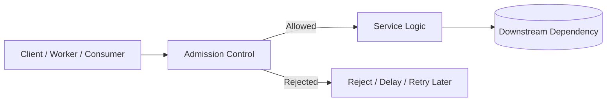
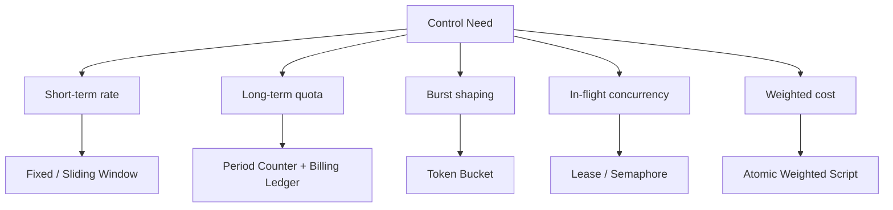
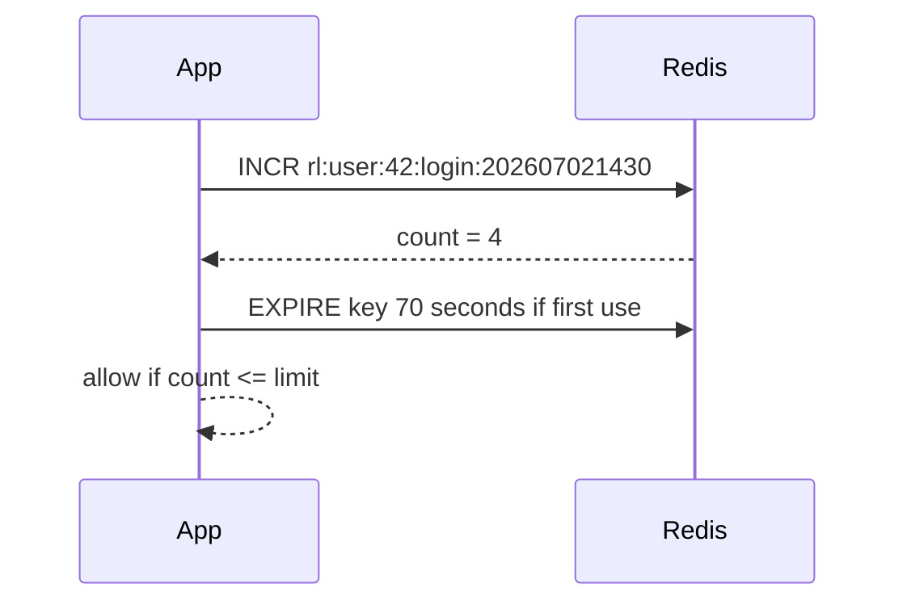
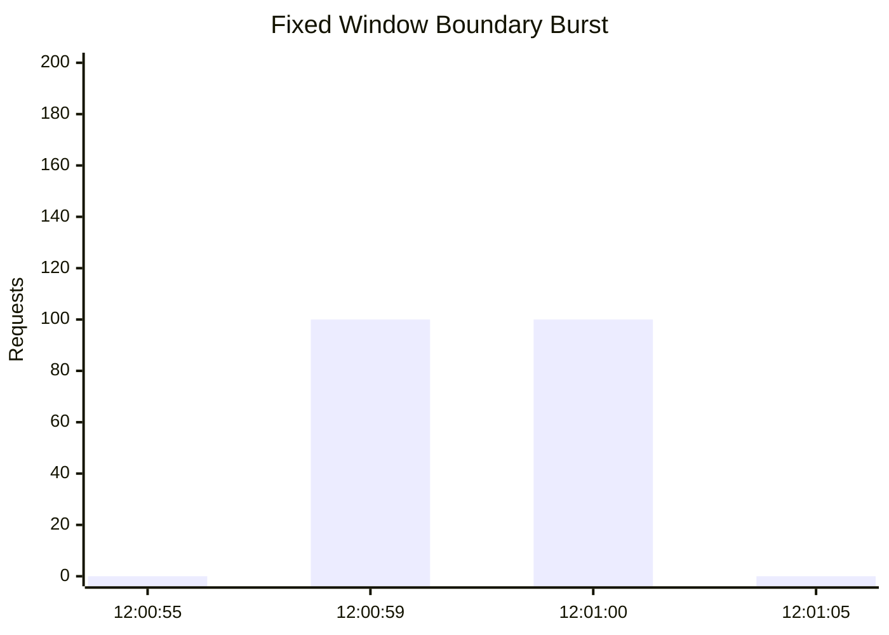
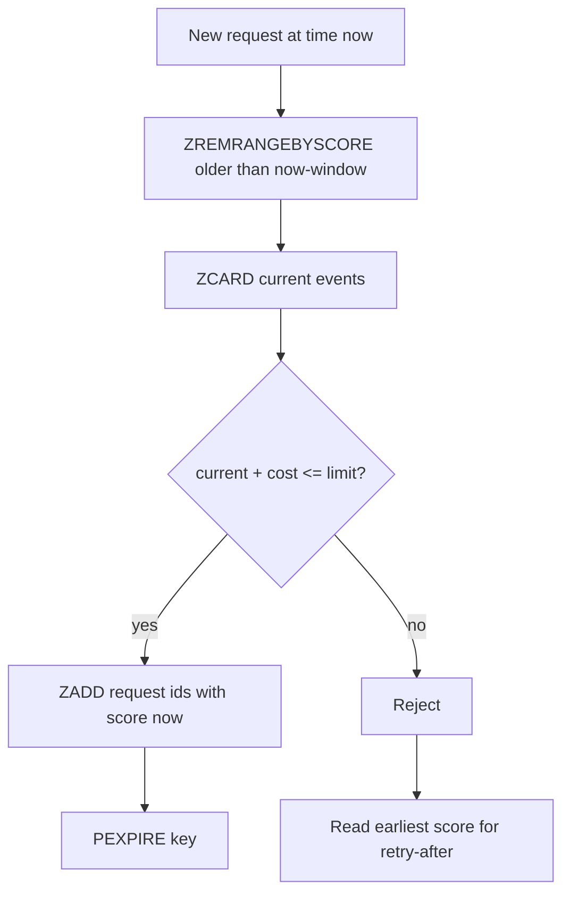
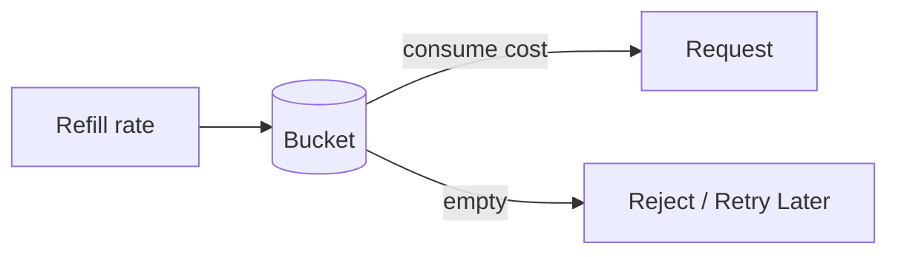
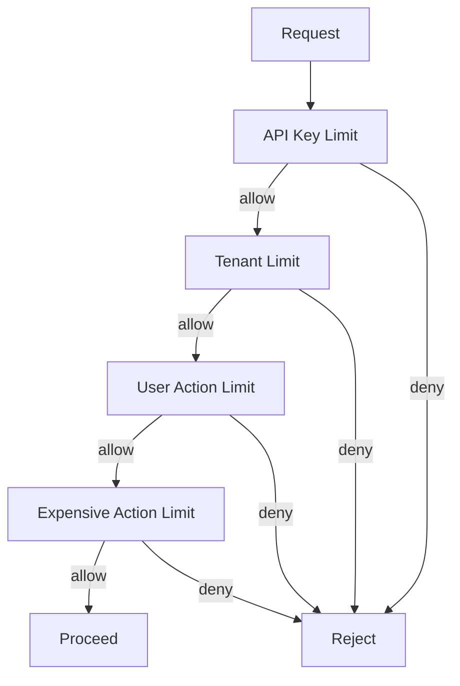
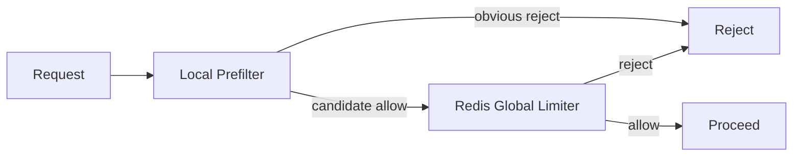
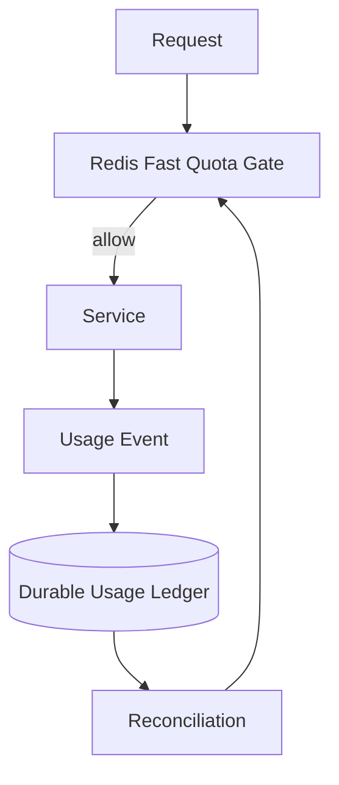

# Part 017 — Rate Limiting and Quota Enforcement

Part 016 covered idempotency and deduplication.
Now we move to one of the most common production uses of Redis:

> Deciding whether a request, command, event, or background action is allowed to proceed **right now**.

Rate limiting is not just a security feature.
It is a control mechanism for system stability.

A mature engineering team uses rate limiting to:

- protect downstream dependencies
- enforce tenant contracts
- prevent accidental traffic explosions
- reduce brute-force and scraping abuse
- shape background workloads
- guard expensive endpoints
- isolate noisy tenants
- protect write paths during incidents
- slow retry storms
- keep user experience predictable

Redis is a strong fit because rate limiting usually needs:

- low latency
- atomic read-decide-write
- TTL-based cleanup
- simple counters
- sorted time windows
- small state per subject
- high concurrency support
- centralized decision state across app instances

But Redis is also easy to misuse.
A naive `INCR` limiter can be good enough for some paths and dangerously unfair for others.
A precise sorted-set limiter can be correct but memory-heavy.
A token bucket can handle bursts but needs careful time arithmetic.
A distributed quota can look easy until tenant hierarchy, retry behavior, fail-open policy, and clock semantics enter the design.

This part builds the mental model and implementation patterns for production-grade Java systems.

---

## 1. Kaufman Skill Decomposition

The skill is not “know a rate limiter algorithm”.
The skill is:

> Given a business and technical constraint, design, implement, operate, and evolve a Redis-backed admission-control mechanism whose fairness, latency, failure mode, and memory cost are explicit.

Break the skill into sub-skills:

| Sub-skill | What You Must Be Able To Do |
|---|---|
| Limit modeling | Define who is limited, what action is limited, and what cost model applies. |
| Algorithm choice | Choose fixed window, sliding window, token bucket, leaky bucket, or hybrid. |
| Atomicity | Keep read-decide-update atomic under concurrency. |
| Key design | Build cluster-safe, tenant-safe, memory-aware keys. |
| Java integration | Expose a clean decision API to filters, interceptors, consumers, and workers. |
| HTTP/API contract | Return clear `429`, retry metadata, and user-safe error semantics. |
| Quota governance | Support plan limits, override rules, hierarchy, and rollout. |
| Failure behavior | Decide fail-open, fail-closed, degraded local limiter, or bypass. |
| Observability | Measure allowed, rejected, near-limit, Redis latency, hot keys, and script failures. |
| Testing | Prove concurrent correctness, boundary behavior, and memory cleanup. |

The practice goal for this part:

> Implement three Redis-backed limiters in Java: fixed window, sliding window log, and token bucket. Then stress-test them with concurrent traffic and explain which one you would deploy for each endpoint class.

---

## 2. Mental Model: Admission Control

A rate limiter is an **admission controller**.

It does not process the request.
It decides whether the request should be allowed to enter the expensive part of the system.



This means the limiter must run before expensive work:

- before DB writes
- before external API calls
- before CPU-heavy computation
- before fanout
- before message publication when publication itself causes load
- before authentication brute-force-sensitive actions when possible

The limiter answers a small but important question:

```text
Given this subject, action, cost, and time, may this operation proceed?
```

A production decision usually includes more than allow/deny:

```java
public record RateLimitDecision(
    boolean allowed,
    String ruleId,
    String subject,
    long limit,
    long remaining,
    long retryAfterMillis,
    long resetAtEpochMillis,
    String algorithm
) {}
```

That metadata matters because upstream code needs to decide whether to:

- return `429 Too Many Requests`
- enqueue for later
- reduce batch size
- switch to degraded behavior
- reject only optional features
- attach rate-limit headers
- emit metrics

---

## 3. Rate Limit vs Quota

These terms are often mixed.
Keep them separate.

| Concept | Meaning | Example |
|---|---|---|
| Rate limit | Maximum rate over a short time window. | 100 requests per minute. |
| Quota | Maximum consumption over a longer accounting period. | 1 million API calls per month. |
| Burst limit | Temporary allowance above average rate. | Allow 20 requests instantly, refill 5/sec. |
| Concurrency limit | Maximum simultaneous in-flight work. | 10 active exports per tenant. |
| Cost limit | Limit based on weighted units, not request count. | Search query costs 5 units, simple lookup costs 1. |
| Budget | A shared allowance consumed by multiple actions. | Tenant has 10,000 compute units/day. |

Redis can support all of them, but not with the same data structure.



Do not use one generic limiter for every case.
Different constraints imply different failure and fairness behavior.

---

## 4. The Core Invariant

Every rate limiter has the same core invariant:

> For a defined subject and action, the allowed cost within the relevant control period must not exceed the configured allowance beyond the explicitly accepted error bound.

This sounds abstract, but it is the difference between engineering and copy-pasting.

Examples:

```text
Invariant A:
A user may perform at most 5 login attempts per 60 seconds per account.

Invariant B:
A tenant may consume at most 1,000 write units per minute across all app instances.

Invariant C:
A webhook sender may create at most 50 pending jobs per second, with burst capacity 200.

Invariant D:
A free-plan tenant may consume at most 100,000 API units per calendar month.
```

The hidden parts are:

- what is the subject?
- what is the action?
- what is the cost unit?
- what is the window?
- what is the allowed error?
- what happens if Redis is unavailable?
- what happens under concurrency?
- what happens when config changes?
- what happens near boundary times?

A top-tier engineer makes these explicit.

---

## 5. Define the Limiting Dimension

Before choosing an algorithm, define the limiting key.

A limiter dimension is usually a tuple:

```text
environment + product + tenant + subject + action + rule + time/window
```

Examples:

```text
rl:{prod}:tenant:acme:user:42:login:fixed:202607021430
rl:{prod}:tenant:acme:api-key:k_123:search:sliding
rl:{prod}:tenant:acme:global:write:token-bucket
quota:{prod}:tenant:acme:monthly:2026-07
```

A good limiter key has these properties:

- stable across app instances
- scoped enough to avoid cross-tenant interference
- specific enough to reflect the real business rule
- compact enough to avoid memory waste
- cluster-safe when multiple keys are used atomically
- versioned when algorithm semantics change
- does not contain raw PII where avoidable

Bad key:

```text
rate:user@example.com
```

Better key:

```text
rl:v1:{tenant-acme}:login:user:sha256_8f23:60s
```

For Redis Cluster, hash tags are important.
All keys inside one Lua script must live in the same hash slot.
Use `{tenant-acme}` or another common hash tag when a script touches multiple keys.

---

## 6. Algorithm Selection Matrix

| Algorithm | Accuracy | Burst Handling | Memory | Fairness | Complexity | Best For |
|---|---:|---:|---:|---:|---:|---|
| Fixed window | Low/medium | Poor near boundary | Very low | Boundary unfairness | Low | Simple endpoint protection. |
| Fixed window with sub-buckets | Medium | Better | Low/medium | Better | Medium | Cheap approximate sliding limits. |
| Sliding window log | High | Precise | High | High | Medium | Security-sensitive low/medium volume limits. |
| Sliding window counter | Medium/high | Good | Medium | Good | Medium | API limits requiring smoother behavior. |
| Token bucket | Medium/high | Excellent | Low | Configurable | Medium/high | Burst-friendly throughput shaping. |
| Leaky bucket | Medium | Smooth output | Low/medium | Smooth but queue-sensitive | Medium | Worker dispatch shaping. |
| Concurrency semaphore | Exact active count if implemented safely | Not rate-based | Low | Depends on lease cleanup | Medium/high | Limit in-flight jobs. |

There is no best algorithm.
There is only the algorithm that fits the invariant.

---

## 7. Fixed Window Counter

Fixed window is the simplest Redis limiter.

For each subject and time bucket:

1. increment counter
2. set expiry if this is first use
3. allow if count is within limit



The problem: `INCR` and `EXPIRE` must be coupled.
If the app crashes after `INCR` and before `EXPIRE`, the key may live forever.
Use Lua to make the mutation atomic.

### Fixed Window Lua

```lua
-- fixed_window.lua
-- KEYS[1] = counter key
-- ARGV[1] = limit
-- ARGV[2] = ttl millis
-- ARGV[3] = cost

local limit = tonumber(ARGV[1])
local ttl = tonumber(ARGV[2])
local cost = tonumber(ARGV[3])

local current = redis.call('INCRBY', KEYS[1], cost)

if current == cost then
  redis.call('PEXPIRE', KEYS[1], ttl)
end

local pttl = redis.call('PTTL', KEYS[1])
local allowed = current <= limit
local remaining = limit - current
if remaining < 0 then remaining = 0 end

return {
  allowed and 1 or 0,
  current,
  remaining,
  pttl
}
```

### Java Wrapper

```java
public final class FixedWindowRateLimiter {
    private final RedisCommands<String, String> redis;
    private final String scriptSha;

    public FixedWindowRateLimiter(RedisCommands<String, String> redis, String scriptSha) {
        this.redis = redis;
        this.scriptSha = scriptSha;
    }

    public RateLimitDecision check(
            String key,
            long limit,
            Duration ttl,
            long cost,
            String ruleId,
            String subject
    ) {
        @SuppressWarnings("unchecked")
        List<Object> result = redis.evalsha(
            scriptSha,
            ScriptOutputType.MULTI,
            new String[] { key },
            Long.toString(limit),
            Long.toString(ttl.toMillis()),
            Long.toString(cost)
        );

        boolean allowed = ((Number) result.get(0)).longValue() == 1L;
        long current = ((Number) result.get(1)).longValue();
        long remaining = ((Number) result.get(2)).longValue();
        long retryAfterMs = Math.max(0, ((Number) result.get(3)).longValue());

        return new RateLimitDecision(
            allowed,
            ruleId,
            subject,
            limit,
            remaining,
            allowed ? 0 : retryAfterMs,
            System.currentTimeMillis() + retryAfterMs,
            "fixed-window"
        );
    }
}
```

### Fixed Window Boundary Problem

Fixed window is unfair at boundaries.

Assume limit = 100/minute.
A user can send:

- 100 requests at `12:00:59`
- 100 requests at `12:01:00`

That is 200 requests in roughly 1 second.



This is acceptable for many coarse protections.
It is not acceptable for brute-force login, expensive write paths, or strict fairness.

---

## 8. Fixed Window Key Construction

A fixed window key usually includes the bucket timestamp.

```java
public final class RateLimitKeys {
    public static String fixedWindowKey(
            String env,
            String tenantId,
            String subjectType,
            String subjectHash,
            String action,
            Instant now,
            Duration window
    ) {
        long bucket = now.toEpochMilli() / window.toMillis();
        return "rl:v1:{tenant:" + tenantId + "}:" + env
            + ":" + subjectType
            + ":" + subjectHash
            + ":" + action
            + ":fw:" + bucket;
    }
}
```

Why include `{tenant:<id>}`?

- cluster scripts stay slot-local for tenant-level multi-key rules
- tenant hotness can be observed
- rule migration can be tenant-scoped

Why hash subject?

- avoid storing raw email/API key/IP where possible
- reduce accidental PII leakage in Redis dumps/logs
- keep key length controlled

---

## 9. Sliding Window Log

Sliding window log gives precise rolling-window enforcement.

For each request:

1. remove entries older than window
2. count current entries
3. if under limit, add current request timestamp
4. set TTL
5. return decision

Redis Sorted Set fits this because scores can be timestamps.



### Sliding Window Log Lua

For unit-cost requests:

```lua
-- sliding_window_log.lua
-- KEYS[1] = sorted set key
-- ARGV[1] = now millis
-- ARGV[2] = window millis
-- ARGV[3] = limit
-- ARGV[4] = member id
-- ARGV[5] = ttl millis

local now = tonumber(ARGV[1])
local window = tonumber(ARGV[2])
local limit = tonumber(ARGV[3])
local member = ARGV[4]
local ttl = tonumber(ARGV[5])

local min = now - window
redis.call('ZREMRANGEBYSCORE', KEYS[1], '-inf', min)

local count = redis.call('ZCARD', KEYS[1])

if count < limit then
  redis.call('ZADD', KEYS[1], now, member)
  redis.call('PEXPIRE', KEYS[1], ttl)
  return {1, count + 1, limit - count - 1, 0}
end

local oldest = redis.call('ZRANGE', KEYS[1], 0, 0, 'WITHSCORES')
local retryAfter = window
if oldest[2] ~= nil then
  retryAfter = math.max(0, tonumber(oldest[2]) + window - now)
end

return {0, count, 0, retryAfter}
```

### Java Member ID

The sorted-set member must be unique.
If two requests use the same member, `ZADD` overwrites instead of adding.

Use:

```java
String member = now.toEpochMilli() + ":" + requestId + ":" + randomSuffix;
```

For security-sensitive limiters, prefer a request ID from your ingress layer.
For internal worker limiters, a monotonic local sequence plus instance ID is often enough.

### Memory Cost

Sliding window log stores one member per accepted request within the window.

Memory rough model:

```text
memory ≈ active_subjects × limit_per_window × average_member_overhead
```

If you allow 10,000 requests/minute for 10,000 active API keys, a precise log can be expensive.
Use it where precision matters.

Good use cases:

- login attempts
- password reset attempts
- OTP verification attempts
- expensive export requests
- abuse-sensitive endpoints

Less ideal:

- very high QPS generic API gateway limits
- monthly quota
- massive low-risk traffic shaping

---

## 10. Sliding Window Counter

Sliding window counter approximates the rolling window with buckets.
Instead of storing every request, store counts per sub-window.

Example:

- limit: 1,000 requests/minute
- bucket size: 10 seconds
- retain 6 buckets

```text
12:00:00-12:00:09 => 120
12:00:10-12:00:19 => 180
12:00:20-12:00:29 => 160
12:00:30-12:00:39 => 150
12:00:40-12:00:49 => 200
12:00:50-12:00:59 => 170
```

This reduces memory from one entry per request to one counter per active bucket.

You can implement it as:

- multiple string counters
- one hash with bucket fields
- sorted set of bucket ids

A hash version:

```text
key: rl:v1:{tenant:acme}:api-key:abc:search:swc
field: 29411522 -> 120
field: 29411523 -> 180
```

In Redis 8, hash field expiration can simplify field-level cleanup for some designs, but you still need to design for compatibility if your deployment includes older Redis versions.

### Approximation Trade-off

Sliding counter is not exact unless bucket size approaches request granularity.
Smaller buckets improve accuracy but increase operations and memory.

| Bucket Size | Accuracy | Redis Work | Memory |
|---:|---:|---:|---:|
| 1 second | High | Higher | Higher |
| 5 seconds | Good | Medium | Medium |
| 10 seconds | Medium | Lower | Lower |
| 30 seconds | Low | Low | Low |

A practical choice is often:

```text
bucket_size = window / 6 to window / 12
```

For a 60-second window, use 5s or 10s buckets.

---

## 11. Token Bucket

Token bucket is the most useful algorithm when you want to allow bursts while enforcing an average rate.

Mental model:

- bucket has capacity
- tokens refill over time
- each request consumes tokens
- if enough tokens exist, allow
- otherwise reject or delay



Example:

```text
capacity = 100 tokens
refill = 10 tokens/second
request cost = 1 token
```

This permits a burst of 100 requests, then settles at 10 requests/second.

### Redis State

Use one hash:

```text
key: rl:v1:{tenant:acme}:api-key:abc:search:tb
fields:
  tokens = 73.5
  updatedAt = 1783010400123
```

### Token Bucket Lua

```lua
-- token_bucket.lua
-- KEYS[1] = bucket key
-- ARGV[1] = now millis
-- ARGV[2] = capacity
-- ARGV[3] = refill tokens per second
-- ARGV[4] = cost
-- ARGV[5] = ttl millis

local now = tonumber(ARGV[1])
local capacity = tonumber(ARGV[2])
local refillPerSecond = tonumber(ARGV[3])
local cost = tonumber(ARGV[4])
local ttl = tonumber(ARGV[5])

local data = redis.call('HMGET', KEYS[1], 'tokens', 'updatedAt')
local tokens = tonumber(data[1])
local updatedAt = tonumber(data[2])

if tokens == nil then
  tokens = capacity
  updatedAt = now
end

if updatedAt == nil then
  updatedAt = now
end

local elapsedMillis = math.max(0, now - updatedAt)
local refill = (elapsedMillis / 1000.0) * refillPerSecond
tokens = math.min(capacity, tokens + refill)

local allowed = tokens >= cost
local retryAfter = 0

if allowed then
  tokens = tokens - cost
else
  local missing = cost - tokens
  retryAfter = math.ceil((missing / refillPerSecond) * 1000.0)
end

redis.call('HSET', KEYS[1], 'tokens', tokens, 'updatedAt', now)
redis.call('PEXPIRE', KEYS[1], ttl)

local remaining = math.floor(tokens)
return {
  allowed and 1 or 0,
  remaining,
  retryAfter,
  tokens
}
```

### Time Source

Use application time or Redis server time?

Options:

| Time Source | Pros | Cons |
|---|---|---|
| Application clock | Simple, no extra Redis command | Clock skew between app instances. |
| Redis `TIME` inside script | Single authoritative Redis time | Script depends on Redis wall clock; harder to simulate. |
| Gateway-provided ingress time | Consistent per request path | Requires ingress infrastructure. |

For single-region Java services, app clock with NTP discipline is usually acceptable for non-financial rate limiting.
For high-stakes shared tenant quotas, prefer server-side time or a single time authority.

### Token Bucket Failure Edge

If `now` moves backward, refill becomes negative unless guarded.
Use:

```lua
local elapsedMillis = math.max(0, now - updatedAt)
```

But that means a skewed app instance may temporarily under-refill.
That is safer than over-refill.

---

## 12. Leaky Bucket

Leaky bucket shapes output at a steady rate.
It is commonly modeled as a queue draining at fixed speed.

For synchronous HTTP APIs, token bucket is usually easier.
For background dispatch, leaky bucket can be useful.

Example:

```text
External provider allows 5 calls/sec.
Your system receives 200 webhook events/sec.
You queue events and release 5/sec to provider workers.
```

Redis implementation options:

- sorted set scheduled by eligible time
- stream consumer with delayed scheduling
- list queue plus worker sleep
- token bucket at worker dispatch time

For production, prefer explicit queue/scheduler semantics over pretending a rate limiter is a durable job queue.
Part 019 covers Redis work queues and delayed jobs in more depth.

---

## 13. Weighted Rate Limits

Not all requests cost the same.

Examples:

| Action | Cost |
|---|---:|
| GET `/profile` | 1 |
| GET `/search?q=...` | 5 |
| POST `/bulk-import` | 100 |
| Export CSV | 500 |
| AI embedding request | variable by tokens |

A production limiter should support cost.

Fixed window:

```lua
INCRBY key cost
```

Token bucket:

```lua
if tokens >= cost then tokens = tokens - cost end
```

Sliding window log is harder for weighted requests because one member represents one request.
Options:

1. Store one member per unit cost. Precise but memory-heavy.
2. Store member payload with cost and sum scores manually. Expensive.
3. Use bucketed counters instead of log.
4. Use token bucket for weighted actions.

Rule of thumb:

> Use sorted-set sliding logs for request-count limits. Use token buckets or counters for weighted consumption.

---

## 14. Multi-Dimensional Limits

Real systems often need multiple rules at once.

Example:

```text
API key:
- 100 requests/minute per API key
- 1,000 requests/minute per tenant
- 20 writes/minute per user
- 10 expensive exports/hour per tenant
```

The request is allowed only if all relevant rules allow it.



### Atomicity Challenge

If you evaluate and mutate four independent Redis keys sequentially:

1. rule A consumes token and allows
2. rule B consumes token and allows
3. rule C rejects

Now A and B have consumed capacity even though the request was rejected.

Solutions:

| Approach | Trade-off |
|---|---|
| Check-only then commit | Race unless implemented carefully. |
| Reserve all, rollback on reject | Rollback may fail and complicates correctness. |
| One Lua script with all keys | Atomic but keys must be same slot in Cluster. |
| Hierarchical coarse-to-fine | Some token waste accepted. |
| Evaluate most restrictive first | Reduces waste but not perfect. |
| Use local prefilter + Redis final limiter | Reduces Redis load but adds approximation. |

For high-value quota, use one atomic script or a database ledger.
For low-risk rate shaping, small token waste may be acceptable.

---

## 15. Multi-Rule Token Bucket Pattern

If all keys are in one Redis Cluster slot, one Lua script can evaluate multiple token buckets.

Key idea:

```text
rl:v1:{tenant:acme}:api-key:k123:search:tb
rl:v1:{tenant:acme}:tenant:global:search:tb
rl:v1:{tenant:acme}:user:u42:search:tb
```

All share hash tag `{tenant:acme}`.

Pseudo-flow:

```text
for each bucket:
  refill
  if tokens < cost:
    reject without mutating any bucket

for each bucket:
  consume cost
  persist new state

return most restrictive remaining/retryAfter
```

This avoids partial consumption.

However, it concentrates tenant-level keys into one slot.
For very large tenants, this may create a hot shard.
You may need per-action sharding or a dedicated Redis deployment for rate limiting.

---

## 16. HTTP Contract

For HTTP APIs, rate limiting must become a clear client contract.

Status:

```text
429 Too Many Requests
```

Useful headers:

```text
RateLimit-Limit: 100
RateLimit-Remaining: 0
RateLimit-Reset: 1783010460
Retry-After: 12
```

Response body:

```json
{
  "error": "rate_limit_exceeded",
  "message": "Too many search requests. Please retry later.",
  "ruleId": "search-per-api-key-minute",
  "retryAfterMillis": 12000
}
```

Rules:

- Do not expose internal Redis keys.
- Do not expose sensitive tenant configuration.
- Include stable error code.
- Include retry metadata when safe.
- Avoid saying “try again immediately”.
- Make client retry behavior explicit.

For authentication endpoints, be careful not to reveal whether an account exists.

Bad:

```json
{"message":"User alice@example.com has exceeded login attempts"}
```

Better:

```json
{"message":"Too many attempts. Please retry later."}
```

---

## 17. Java API Design

A clean domain-level API prevents Redis details from leaking into controllers.

```java
public interface RateLimiter {
    RateLimitDecision check(RateLimitRequest request);
}

public record RateLimitRequest(
    String ruleId,
    String tenantId,
    String subjectType,
    String subjectHash,
    String action,
    long cost,
    Instant now
) {}
```

A config object:

```java
public sealed interface RateLimitRule permits FixedWindowRule, SlidingWindowRule, TokenBucketRule {
    String id();
    String action();
    boolean enabled();
}

public record FixedWindowRule(
    String id,
    String action,
    long limit,
    Duration window,
    boolean enabled
) implements RateLimitRule {}

public record TokenBucketRule(
    String id,
    String action,
    long capacity,
    double refillPerSecond,
    Duration idleTtl,
    boolean enabled
) implements RateLimitRule {}
```

Do not make controllers know about:

- Redis scripts
- key naming
- Redis Cluster hash tags
- TTL decisions
- serializer details
- fallback policy

Controllers should only know:

```java
RateLimitDecision decision = limiter.check(request);
if (!decision.allowed()) {
    throw new TooManyRequestsException(decision);
}
```

---

## 18. Spring Web Filter Example

```java
@Component
public final class RateLimitFilter extends OncePerRequestFilter {
    private final RateLimiter rateLimiter;
    private final SubjectResolver subjectResolver;
    private final RateLimitRuleResolver ruleResolver;

    public RateLimitFilter(
            RateLimiter rateLimiter,
            SubjectResolver subjectResolver,
            RateLimitRuleResolver ruleResolver
    ) {
        this.rateLimiter = rateLimiter;
        this.subjectResolver = subjectResolver;
        this.ruleResolver = ruleResolver;
    }

    @Override
    protected void doFilterInternal(
            HttpServletRequest request,
            HttpServletResponse response,
            FilterChain filterChain
    ) throws ServletException, IOException {
        Optional<RateLimitRule> rule = ruleResolver.resolve(request);
        if (rule.isEmpty()) {
            filterChain.doFilter(request, response);
            return;
        }

        Subject subject = subjectResolver.resolve(request);
        RateLimitRequest check = new RateLimitRequest(
            rule.get().id(),
            subject.tenantId(),
            subject.type(),
            subject.hash(),
            rule.get().action(),
            estimateCost(request),
            Instant.now()
        );

        RateLimitDecision decision = rateLimiter.check(check);
        addHeaders(response, decision);

        if (!decision.allowed()) {
            response.setStatus(429);
            response.setContentType("application/json");
            response.getWriter().write("""
                {"error":"rate_limit_exceeded","message":"Too many requests. Please retry later."}
                """);
            return;
        }

        filterChain.doFilter(request, response);
    }

    private long estimateCost(HttpServletRequest request) {
        return switch (request.getMethod()) {
            case "GET" -> 1L;
            case "POST", "PUT", "PATCH" -> 3L;
            default -> 1L;
        };
    }

    private void addHeaders(HttpServletResponse response, RateLimitDecision decision) {
        response.setHeader("RateLimit-Limit", Long.toString(decision.limit()));
        response.setHeader("RateLimit-Remaining", Long.toString(decision.remaining()));
        response.setHeader("RateLimit-Reset", Long.toString(decision.resetAtEpochMillis() / 1000));
        if (!decision.allowed()) {
            response.setHeader("Retry-After", Long.toString(Math.max(1, decision.retryAfterMillis() / 1000)));
        }
    }
}
```

In production, `SubjectResolver` must handle:

- authenticated user
- anonymous IP
- API key
- service account
- tenant
- trusted proxy headers
- internal calls
- test traffic

Never trust raw `X-Forwarded-For` unless your proxy boundary is well-defined.

---

## 19. Async and Reactive Considerations

Rate limiting sits on the hot path.
If your service is reactive, avoid blocking Redis calls.

Bad reactive design:

```java
boolean allowed = blockingRedisLimiter.check(request).allowed();
return allowed ? next.handle(exchange) : reject(exchange);
```

Better:

```java
public interface ReactiveRateLimiter {
    Mono<RateLimitDecision> check(RateLimitRequest request);
}
```

But do not use reactive Redis only because it looks modern.
Use it when your request path is already non-blocking and you understand backpressure.

Failure risk:

- Redis latency increases
- pending reactive commands accumulate
- application memory grows
- timeout settings are too generous
- gateway thread starvation shifts to event-loop pressure

Limit Redis command concurrency if needed.

---

## 20. Fail-Open vs Fail-Closed

What happens if Redis is unavailable?

| Policy | Meaning | Use When |
|---|---|---|
| Fail-open | Allow request if limiter unavailable. | User-facing low-risk availability-sensitive paths. |
| Fail-closed | Reject request if limiter unavailable. | Security-critical or cost-critical paths. |
| Local fallback | Use in-memory limiter temporarily. | Moderate protection needed during Redis incident. |
| Degraded mode | Disable expensive features but allow basic request. | Product supports reduced behavior. |
| Static emergency limit | Apply coarse local cap by instance. | Incident containment. |

There is no universal answer.

Examples:

```text
Login brute force limiter unavailable -> fail closed or local fallback.
Public product listing read limiter unavailable -> fail open.
Expensive AI inference quota unavailable -> fail closed or degraded.
Payment submission limiter unavailable -> do not rely only on Redis; use DB/business idempotency.
```

Make this a rule property:

```java
public enum RateLimitFailurePolicy {
    FAIL_OPEN,
    FAIL_CLOSED,
    LOCAL_FALLBACK,
    DEGRADED
}
```

---

## 21. Local Prefilter Pattern

At very high traffic, Redis can become the bottleneck.
A local prefilter can reduce load.

Pattern:

1. local in-memory approximate limiter catches obvious excess
2. Redis global limiter makes authoritative decision for remaining requests



This is useful for:

- abusive IPs
- bots
- high-volume public endpoints
- gateway-level protection

But local prefilters are not globally fair.
They are a load-shedding optimization, not a quota source of truth.

---

## 22. Quota Enforcement

Long-term quota differs from short-term rate limiting.

Example:

```text
Tenant ACME may consume 10,000,000 API units in July 2026.
```

A Redis counter can track usage:

```text
quota:v1:{tenant:acme}:api-units:2026-07 -> 734928
```

But quota is often business-critical.
Questions:

- Does quota affect billing?
- Must usage survive Redis loss?
- Are corrections/audits needed?
- Can admins override quota?
- Does quota reset by UTC, tenant timezone, or contract timezone?
- Are there grace allowances?
- Are quota units eventually reconciled?

For billing-grade quota, Redis should usually be a fast gate plus write-through/async ledger to a durable database.



Redis gives hot-path speed.
The durable ledger gives auditability.

---

## 23. Quota With Reservation

For expensive async jobs, do not merely count after execution.
Reserve quota before work starts.

State model:

```text
AVAILABLE -> RESERVED -> CONSUMED
                     -> RELEASED
```

Example:

- export job estimated cost: 500 units
- reserve 500 units before enqueue
- consume when job succeeds
- release if job is cancelled before execution
- adjust if actual cost differs

Redis can store reservation state temporarily, but durable job/quota state should live in the database if business-critical.

---

## 24. Concurrency Limit Is Not Rate Limit

A concurrency limit controls active work, not rate over time.

Example:

```text
Tenant may run at most 3 active report exports.
```

A Redis counter with TTL is tempting:

```text
INCR active_exports:{tenant}
DECR when done
```

But if the worker crashes, the counter leaks.
You need a lease/semaphore pattern:

- acquire slot with owner token
- heartbeat or TTL
- release only by owner
- recover expired slots

Part 018 covers locks/leases.
Part 019 covers queues/workers.

---

## 25. Redis Cluster Considerations

Lua scripts in Redis Cluster can only access keys in the same hash slot.

Bad multi-key script keys:

```text
rl:v1:tenant:acme:user:42:search
rl:v1:tenant:acme:global:search
```

They may map to different slots.

Better:

```text
rl:v1:{tenant:acme}:user:42:search
rl:v1:{tenant:acme}:global:search
```

But beware hot tenant concentration.
For very large tenants, a single hash tag can overload one shard.

Strategies:

| Strategy | Benefit | Cost |
|---|---|---|
| Tenant hash tag | Easy atomic multi-rule scripts | Hot tenant risk. |
| Action-specific hash tag | Spreads some traffic | Harder tenant-wide atomicity. |
| Dedicated rate-limit Redis | Isolates limiter load | More infrastructure. |
| Approximate distributed counters | Better spread | Weaker exactness. |
| Gateway-level local limit + Redis global | Reduces Redis pressure | Approximation and complexity. |

---

## 26. Hot Key Mitigation

A global limiter key can become hot.

Example:

```text
rl:v1:{global}:public-search:tb
```

Every request hits the same key.

Mitigation options:

1. shard counter into N keys and approximate aggregate
2. local prefilter per instance
3. gateway-level limiter
4. per-tenant/per-api-key limiter instead of global
5. use Redis Enterprise / managed shard scaling where appropriate
6. add admission control before Redis for known bad traffic

For exact global rate limiting, a hot key may be unavoidable.
Then the real question is whether Redis capacity and latency budget support it.

---

## 27. TTL and Memory Cleanup

Rate limiter keys must self-clean.

For fixed windows:

```text
ttl = window + safety_margin
```

For sliding logs:

```text
ttl = window + inactivity_margin
```

For token buckets:

```text
ttl = time_to_full_refill + inactivity_margin
```

Example:

```text
capacity = 100
refill = 10/sec
time_to_full = 10 sec
idle_ttl = 60 sec
```

Do not keep idle token bucket keys forever.

Memory failure pattern:

```text
You deploy per-IP rate limiting.
Attackers generate millions of random IP-like subjects.
Redis fills with limiter keys.
Eviction begins.
Important cache keys disappear.
```

Mitigations:

- hash or normalize subjects
- cap unauthenticated subject cardinality
- use local prefilter
- shorter TTL for anonymous limits
- separate Redis deployment/db for abuse-control data
- monitor key cardinality

---

## 28. Rule Configuration and Rollout

Rate limit rules change often.
Treat them as configuration with lifecycle.

Rule fields:

```yaml
id: search-per-api-key-minute
algorithm: token-bucket
action: search
scope: api-key
capacity: 120
refillPerSecond: 2
costExpression: default
failurePolicy: fail-open
enabled: true
shadowMode: false
```

Support:

- disabled mode
- shadow mode
- tenant override
- plan override
- emergency override
- gradual rollout
- audit trail

Shadow mode is critical.
It records whether a request would have been rejected without actually rejecting it.

```text
allowed = true
shadowWouldReject = true
```

This lets you tune limits before enforcement.

---

## 29. Security and Abuse Considerations

Rate limiting often touches security-sensitive flows.

For login:

- limit by account identifier
- limit by IP or IP prefix
- limit by device/session fingerprint where safe
- limit by tenant
- avoid user enumeration
- use exponential backoff when appropriate

For API keys:

- limit by API key hash, not raw key
- support revoked/disabled key fast path
- separate user and machine limits

For public endpoints:

- normalize IP through trusted proxy boundary
- consider ASN/country/risk signals outside Redis
- avoid unlimited cardinality from spoofable headers

For admin endpoints:

- lower limits for destructive actions
- higher limits for read-only screens
- audit rejections

Redis is one layer.
Do not replace authentication, authorization, bot detection, WAF, or business validation with Redis rate limiting.

---

## 30. Observability

Metrics to emit:

| Metric | Labels |
|---|---|
| `rate_limit_checks_total` | rule, algorithm, outcome |
| `rate_limit_rejected_total` | rule, subject_type, reason |
| `rate_limit_shadow_rejected_total` | rule |
| `rate_limit_redis_latency_ms` | command/script, outcome |
| `rate_limit_script_errors_total` | script, error_type |
| `rate_limit_fallback_total` | policy |
| `rate_limit_near_limit_total` | rule |
| `rate_limit_remaining` | sampled, rule |

Do not label by raw user ID, API key, or IP in high-cardinality metrics.
Use logs or traces for specific subject diagnostics.

Structured log example:

```json
{
  "event": "rate_limit_rejected",
  "ruleId": "search-per-api-key-minute",
  "tenantId": "acme",
  "subjectType": "api-key",
  "subjectHashPrefix": "8f23ab",
  "algorithm": "token-bucket",
  "limit": 120,
  "remaining": 0,
  "retryAfterMillis": 800,
  "redisLatencyMillis": 2
}
```

Dashboard panels:

- rejection rate by rule
- allowed vs rejected
- Redis latency percentile
- Redis errors
- fallback activations
- top rejecting rules
- shadow-mode would-reject
- hot key warnings
- memory used by limiter key namespace

---

## 31. Testing Strategy

### Unit Tests

Test pure key and config logic:

- key includes tenant scope
- subject is hashed
- bucket calculation is stable
- TTL is derived correctly
- cost expression works
- fail policy maps correctly

### Script Tests

Run Lua scripts against real Redis in Testcontainers.

Test cases:

- first request allowed
- request at limit allowed
- request above limit rejected
- TTL is set
- retry-after is positive when rejected
- weighted cost works
- no partial mutation in multi-rule script
- script handles missing state
- script handles backward time safely

### Concurrent Tests

For fixed window:

```java
int threads = 64;
int attempts = 10_000;
long limit = 1_000;

// Run attempts concurrently against same key.
// Assert allowed count <= limit.
```

For sliding log:

- all concurrent accepted members must be unique
- accepted count must not exceed limit
- old entries are removed

For token bucket:

- burst capacity is respected
- refill rate works over simulated time
- negative elapsed time does not over-refill

### Boundary Tests

- fixed window edge burst
- window rollover
- TTL expiry
- Redis reconnect
- script cache miss
- Redis timeout
- config change during traffic

---

## 32. Failure Injection

Inject failures before production.

| Failure | Expected Behavior |
|---|---|
| Redis timeout | Apply rule failure policy. |
| Redis unavailable | Fail-open/closed/local fallback as configured. |
| High Redis latency | Requests should timeout quickly, not pile up forever. |
| Script NOSCRIPT | Reload script and retry safely. |
| Cluster MOVED/ASK | Client handles topology. |
| App clock jumps backward | No over-refill. |
| App instance restart | No local-only state needed for global correctness. |
| Massive new subject cardinality | TTL/memory limits prevent Redis meltdown. |

Rate limiter failure should never be surprising during an incident.

---

## 33. Common Anti-Patterns

### Anti-pattern 1 — One Limit for Everything

```text
100 requests/minute/user
```

This ignores action cost.
A profile lookup and bulk export are not equivalent.

### Anti-pattern 2 — Non-Atomic Check Then Increment

```text
GET count
if count < limit:
  INCR count
```

Concurrent requests can all observe below-limit and exceed allowance.
Use Lua or atomic primitives.

### Anti-pattern 3 — No Expiry

Limiter keys accumulate forever.
This becomes a memory incident.

### Anti-pattern 4 — Raw PII in Keys

Keys are visible in Redis inspection, dumps, logs, and metrics.
Hash sensitive subjects.

### Anti-pattern 5 — Treating Redis Quota as Billing Truth

Redis can help enforce hot-path quota.
Billing-grade usage needs durable ledger and reconciliation.

### Anti-pattern 6 — Boundary-Blind Fixed Window

Fixed window may allow 2x bursts near boundaries.
That may or may not be acceptable.
Document it.

### Anti-pattern 7 — No Failure Policy

If Redis is down, the app behavior becomes accidental.
Make it explicit per rule.

### Anti-pattern 8 — High-Cardinality Metrics

Labeling metrics with user ID or IP can break the metrics backend.

---

## 34. Pattern Catalog

### Pattern A — Simple Endpoint Protection

Use fixed window.

```text
GET /public/products
Limit: 600/minute/IP
Failure: fail open
```

Good enough because boundary bursts are tolerable.

### Pattern B — Login Attempt Protection

Use sliding window log or strict counter + progressive backoff.

```text
POST /login
Limit: 5/10 minutes/account + 20/10 minutes/IP
Failure: fail closed or local fallback
```

Avoid user enumeration.

### Pattern C — API Gateway Tenant Limit

Use token bucket.

```text
Tenant ACME Pro Plan
Capacity: 1,000
Refill: 100/sec
Failure: fail open for reads, fail closed for expensive writes
```

Allows bursts but controls average.

### Pattern D — Expensive Async Export

Use quota reservation + concurrency lease.

```text
Max active exports: 3
Daily export units: 10,000
```

Redis can help, but durable DB state should own business truth.

### Pattern E — Webhook Provider Protection

Use token bucket at dispatch worker.

```text
External provider rate: 10/sec
Burst: 50
```

Rejecting incoming webhook may be wrong; queue it and shape outbound calls.

---

## 35. Production Checklist

Before shipping a Redis rate limiter:

- [ ] The subject dimension is explicit.
- [ ] The action dimension is explicit.
- [ ] The cost model is explicit.
- [ ] The algorithm is chosen for the invariant, not familiarity.
- [ ] Key format is versioned.
- [ ] Sensitive subjects are hashed.
- [ ] TTL cleanup is guaranteed.
- [ ] Redis Cluster hash tags are correct for multi-key scripts.
- [ ] Lua scripts are loaded and reloadable.
- [ ] Script timeout/latency is monitored.
- [ ] Failure policy is defined per rule.
- [ ] Shadow mode exists for rollout.
- [ ] Rejection response is stable and documented.
- [ ] Metrics avoid high-cardinality labels.
- [ ] Concurrent tests prove no limit overshoot beyond accepted error.
- [ ] Memory estimate exists.
- [ ] Hot key risk is evaluated.
- [ ] Quota vs billing truth is separated.

---

## 36. Decision Framework

Ask these questions in order:

1. Is this a short-term rate, long-term quota, burst policy, or concurrency limit?
2. Is exactness required or is approximation acceptable?
3. Is burst allowed?
4. Is the request cost always 1 or variable?
5. What is the maximum subject cardinality?
6. What is the memory budget?
7. What happens when Redis is unavailable?
8. Does this affect billing, legal entitlement, or security?
9. Does the limiter need to be globally consistent across instances?
10. Will multiple rules be checked atomically?

Mapping:

| Answer | Likely Choice |
|---|---|
| Simple, low-risk, count-based | Fixed window. |
| Security-sensitive low volume | Sliding window log. |
| High-QPS smooth API shaping | Token bucket. |
| Weighted cost | Token bucket or counter quota. |
| Billing-grade quota | Redis fast gate + durable ledger. |
| In-flight limit | Lease/semaphore, not rate limiter. |
| Multi-rule exactness | Same-slot Lua script or durable transaction. |

---

## 37. Practice Exercises

### Exercise 1 — Fixed Window

Implement a fixed-window limiter with Lettuce and Lua.

Requirements:

- `cost` supported
- TTL is set atomically
- returns `allowed`, `remaining`, `retryAfterMillis`
- tested with 64 concurrent threads

### Exercise 2 — Sliding Log

Implement a sorted-set sliding window limiter.

Requirements:

- unique member IDs
- old entries are trimmed
- rejected response includes retry-after
- memory usage is estimated for 1 million active subjects

### Exercise 3 — Token Bucket

Implement a token bucket limiter.

Requirements:

- capacity and refill rate configurable
- weighted request supported
- clock skew does not over-refill
- idle bucket expires

### Exercise 4 — Multi-Rule Evaluation

Design a limiter for:

```text
100 req/min/api-key
1,000 req/min/tenant
10 export/hour/user
```

Explain whether your design is atomic, approximate, or intentionally wasteful.

---

## 38. Part Summary

Redis rate limiting is not a single pattern.
It is a family of admission-control patterns.

Key points:

- Fixed window is cheap but boundary-unfair.
- Sliding window log is precise but memory-heavy.
- Sliding window counter is a useful approximation.
- Token bucket is strong for burst-friendly throughput shaping.
- Weighted limits require explicit cost modeling.
- Long-term quota often needs durable ledger reconciliation.
- Multi-rule atomicity is harder than single-key examples show.
- Redis Cluster key design matters for Lua scripts.
- Failure policy must be explicit.
- Observability must include rejections, Redis latency, fallback, and near-limit signals.

A senior engineer does not ask, “Which rate limiter is best?”
A senior engineer asks:

> What invariant am I enforcing, what error can I tolerate, and how will the system behave when Redis, traffic, or time behaves badly?

Next, Part 018 covers **distributed coordination: locks, leases, fencing tokens, and the Redlock debate**.

---

## References

- Redis Docs — Rate limiter use case: https://redis.io/docs/latest/develop/use-cases/rate-limiter/
- Redis Tutorial — Build 5 Rate Limiters with Redis: https://redis.io/tutorials/howtos/ratelimiting/
- Redis Docs — Strings and `INCR`: https://redis.io/docs/latest/develop/data-types/strings/
- Redis Docs — Sorted Sets: https://redis.io/docs/latest/develop/data-types/sorted-sets/
- Redis Docs — `EXPIRE`: https://redis.io/docs/latest/commands/expire/
- Redis Docs — `SET`: https://redis.io/docs/latest/commands/set/
- Redis Docs — Programmability / Lua: https://redis.io/docs/latest/develop/programmability/eval-intro/
