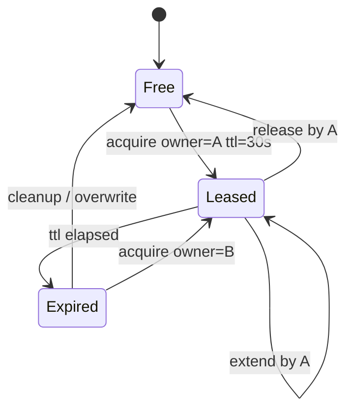
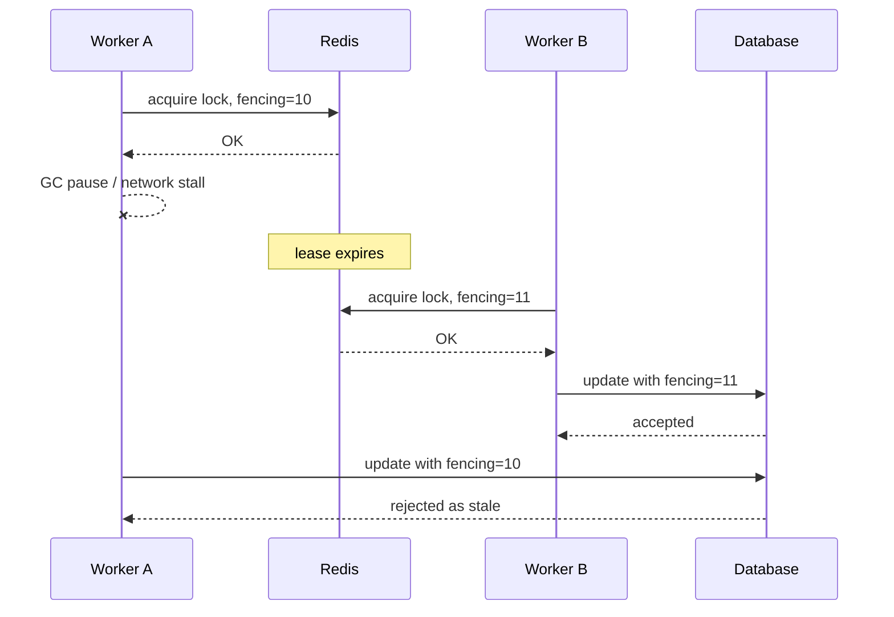
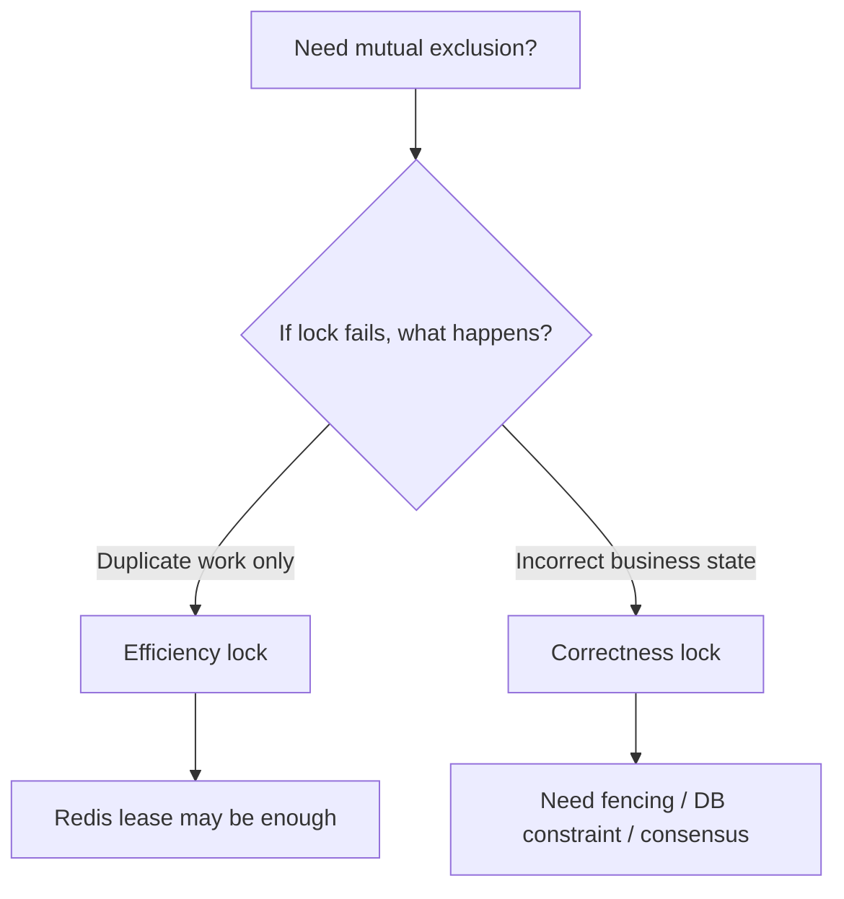
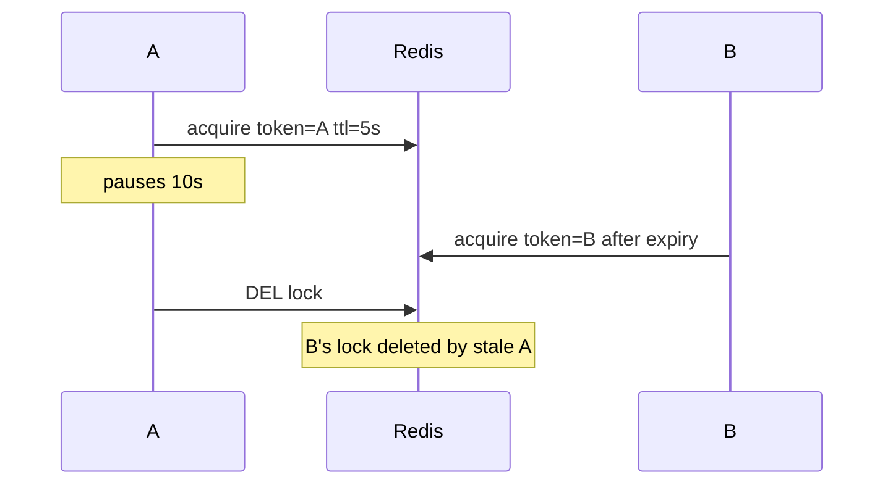
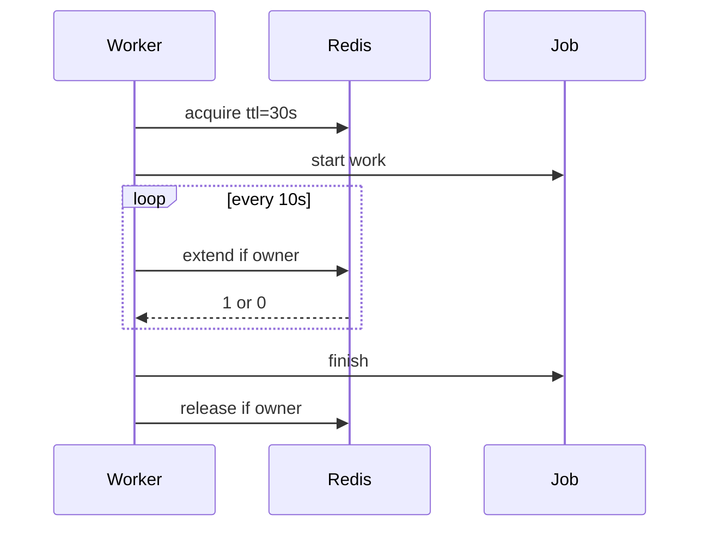
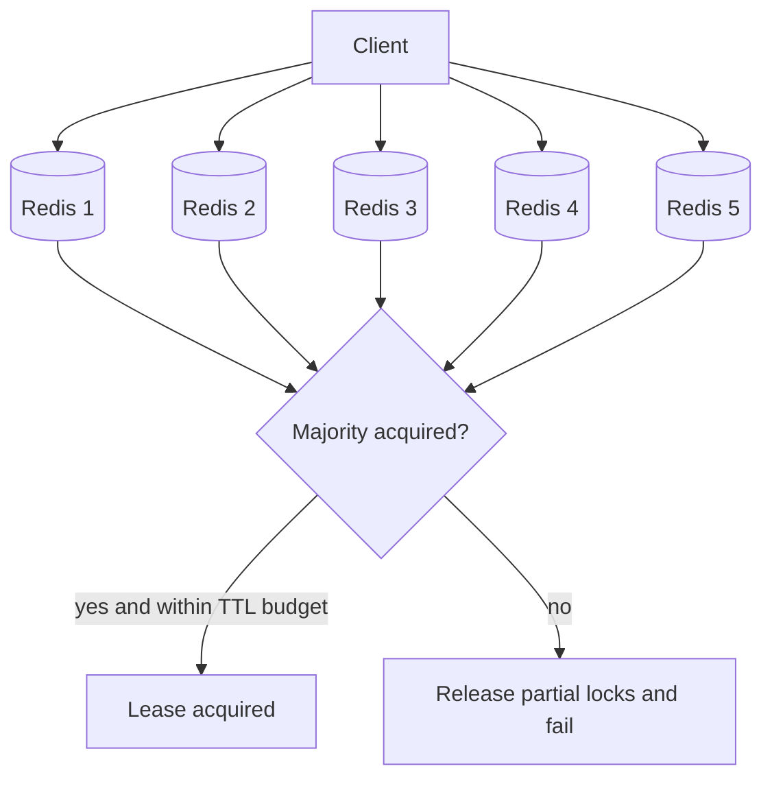
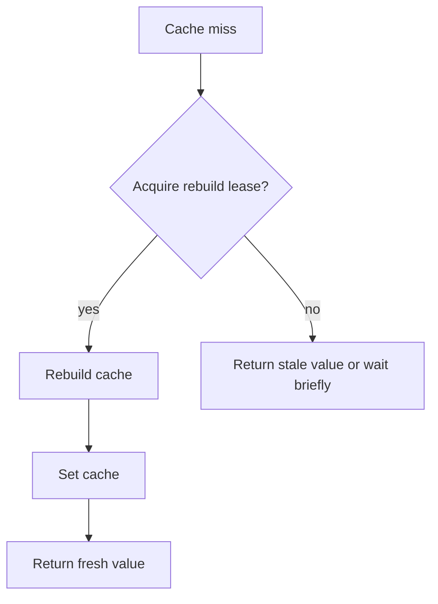

# Part 018 — Distributed Coordination: Locks, Leases, Fencing Tokens, and Redlock Debate

Part 017 covered rate limiting and quota enforcement.
Now we address one of the most misunderstood Redis use cases:

> Using Redis to coordinate work across multiple processes.

This includes:

- distributed locks
- leases
- leader election-like behavior
- singleton jobs
- duplicate worker prevention
- resource ownership
- coarse-grained mutual exclusion
- concurrency caps
- fencing tokens

Redis can be useful here.
Redis can also be dangerously over-trusted here.

The main lesson:

> A Redis lock is not a transaction, not a consensus protocol, and not a universal correctness guarantee.

It is a time-bounded lease over a key.
Whether that is enough depends on the consequence of failure.

---

## 1. Kaufman Skill Decomposition

The real skill is not “use `SET NX PX`”.
The real skill is:

> Decide whether Redis coordination is appropriate for a given invariant, then implement a lease protocol whose ownership, expiry, release, renewal, and downstream side effects remain safe under pauses, retries, network delay, process crash, and failover.

Breakdown:

| Sub-skill | What You Must Be Able To Do |
|---|---|
| Classify use case | Separate efficiency locks from correctness locks. |
| Understand leases | Model lock ownership as time-bounded, not permanent. |
| Safe acquire | Use unique owner token and expiration. |
| Safe release | Release only if owner token matches. |
| Safe extend | Extend only if still owner. |
| Fencing | Generate monotonic tokens and make downstream systems reject stale owners. |
| Failure modeling | Reason about GC pauses, network delay, Redis failover, replica lag, and clock issues. |
| Redlock judgment | Understand what Redlock claims and what its debate means in practice. |
| Java implementation | Encapsulate lock lifecycle without leaking Redis commands everywhere. |
| Testing | Prove behavior under concurrency and failure injection. |

Practice target:

> Implement a Redis lease service in Java with acquire, release, extend, fencing token support, and tests that simulate crash, timeout, stale owner, and GC pause-like delay.

---

## 2. Lock vs Lease vs Fencing Token

These terms must be precise.

| Term | Meaning |
|---|---|
| Lock | A mutual exclusion mechanism: one actor should own a resource. |
| Lease | A lock with expiration; ownership is valid only for a bounded time. |
| Owner token | A unique random value proving which actor acquired the lease. |
| Fencing token | A monotonic number issued on acquisition; downstream systems use it to reject stale actors. |
| Renewal | Extending lease TTL while still owner. |
| Stale owner | A process that believes it owns the resource but whose lease has expired or been superseded. |

Redis locks should be treated as **leases**.
If you call them locks, you may accidentally assume stronger semantics than they provide.



The dangerous case is not the normal path.
The dangerous case is:

```text
A acquires lease.
A pauses for 60 seconds.
Lease expires.
B acquires lease.
A resumes and writes stale data.
```

Fencing tokens exist to stop that stale write.

---

## 3. The Core Invariant

A lock invariant is usually written informally:

```text
Only one worker may process this job.
Only one node may run this cron.
Only one service instance may update this resource.
```

But the real invariant must include side effects:

> No stale owner may successfully perform a side effect after a newer owner has acquired the resource.

Redis alone cannot enforce that against external systems.
It can only help produce ownership metadata.
The downstream system must participate.

Example:



Without the DB rejection, the lock did not protect correctness.

---

## 4. Efficiency Lock vs Correctness Lock

This distinction decides whether Redis is appropriate.

### Efficiency Lock

Failure causes duplicate work but not incorrect state.

Examples:

- two workers rebuild same cache
- two schedulers send same non-critical refresh task
- two instances run same metrics aggregation and one result is ignored
- duplicate background optimization job

Redis is usually acceptable here.

### Correctness Lock

Failure causes data corruption, money loss, legal issue, or irreversible side effects.

Examples:

- charge a payment once
- transfer funds
- allocate scarce inventory
- assign legal case ownership
- mutate regulatory decision state
- send irreversible external command
- perform exactly-once business transition

Redis alone is usually not enough.
Use database transactions, unique constraints, compare-and-set state transitions, fencing tokens, or a consensus-backed system.



---

## 5. Basic Single-Redis Lease

The basic Redis lease acquisition uses `SET` with:

- `NX`: set only if key does not exist
- `PX`: TTL in milliseconds
- random owner token as value

```text
SET lock:resource-123 <owner-token> NX PX 30000
```

If result is `OK`, the lease is acquired.
If result is nil/null, someone else owns it.

Why not `SETNX`?
Modern Redis recommends `SET key value NX PX ttl` instead of old `SETNX`-style patterns because TTL and acquisition must be atomic.

### Owner Token

Owner token must be unique and unguessable enough.

```java
String ownerToken = UUID.randomUUID().toString();
```

Better for observability:

```java
String ownerToken = instanceId + ":" + threadId + ":" + ULID.random();
```

Do not use only instance ID.
One instance can acquire multiple locks and stale releases can collide.

---

## 6. Safe Release

Never release a Redis lease with blind `DEL`.

Bad:

```text
DEL lock:resource-123
```

Why?



Release must check owner token atomically.

### Release Lua

```lua
-- release_lock.lua
-- KEYS[1] = lock key
-- ARGV[1] = expected owner token

if redis.call('GET', KEYS[1]) == ARGV[1] then
  return redis.call('DEL', KEYS[1])
end

return 0
```

Return value:

- `1`: released
- `0`: not owner or already expired

A return of `0` is not always an error.
It may mean your lease expired before release.
That is operationally important.

---

## 7. Safe Renewal

For work that may take longer than the initial TTL, renew the lease.

Renewal must also check owner token.

```lua
-- extend_lock.lua
-- KEYS[1] = lock key
-- ARGV[1] = expected owner token
-- ARGV[2] = new ttl millis

if redis.call('GET', KEYS[1]) == ARGV[1] then
  return redis.call('PEXPIRE', KEYS[1], tonumber(ARGV[2]))
end

return 0
```

Rules:

- renew before TTL is close to expiry
- stop work if renewal fails
- do not assume renewal thread always runs
- renewal does not fix stale side effects unless downstream checks fencing token

Renewal schedule example:

```text
lease ttl = 30s
renew every 10s
stop work if remaining ttl < 5s and renewal fails
```

---

## 8. Java Lease API

Do not expose Redis commands directly to business code.

```java
public interface DistributedLeaseService {
    Optional<LeaseHandle> tryAcquire(LeaseRequest request);
    boolean release(LeaseHandle handle);
    boolean extend(LeaseHandle handle, Duration ttl);
}

public record LeaseRequest(
    String resourceType,
    String resourceId,
    Duration ttl,
    boolean fencingRequired
) {}

public record LeaseHandle(
    String lockKey,
    String ownerToken,
    long fencingToken,
    Instant acquiredAt,
    Duration ttl
) {}
```

Business code should look like:

```java
Optional<LeaseHandle> lease = leaseService.tryAcquire(new LeaseRequest(
    "report-export",
    reportId,
    Duration.ofSeconds(30),
    true
));

if (lease.isEmpty()) {
    return WorkerResult.skipped("owned_by_another_worker");
}

try {
    reportExporter.export(reportId, lease.get().fencingToken());
} finally {
    leaseService.release(lease.get());
}
```

This makes the correctness boundary visible.

---

## 9. Lettuce Implementation Sketch

```java
public final class RedisLeaseService implements DistributedLeaseService {
    private final RedisCommands<String, String> redis;
    private final String releaseScriptSha;
    private final String extendScriptSha;
    private final String instanceId;

    public RedisLeaseService(
            RedisCommands<String, String> redis,
            String releaseScriptSha,
            String extendScriptSha,
            String instanceId
    ) {
        this.redis = redis;
        this.releaseScriptSha = releaseScriptSha;
        this.extendScriptSha = extendScriptSha;
        this.instanceId = instanceId;
    }

    @Override
    public Optional<LeaseHandle> tryAcquire(LeaseRequest request) {
        String lockKey = lockKey(request.resourceType(), request.resourceId());
        String ownerToken = instanceId + ":" + UUID.randomUUID();

        SetArgs args = SetArgs.Builder.nx().px(request.ttl().toMillis());
        String result = redis.set(lockKey, ownerToken, args);

        if (!"OK".equals(result)) {
            return Optional.empty();
        }

        long fencingToken = 0L;
        if (request.fencingRequired()) {
            fencingToken = redis.incr(fencingKey(request.resourceType(), request.resourceId()));
        }

        return Optional.of(new LeaseHandle(
            lockKey,
            ownerToken,
            fencingToken,
            Instant.now(),
            request.ttl()
        ));
    }

    @Override
    public boolean release(LeaseHandle handle) {
        Long result = redis.evalsha(
            releaseScriptSha,
            ScriptOutputType.INTEGER,
            new String[] { handle.lockKey() },
            handle.ownerToken()
        );
        return result != null && result == 1L;
    }

    @Override
    public boolean extend(LeaseHandle handle, Duration ttl) {
        Long result = redis.evalsha(
            extendScriptSha,
            ScriptOutputType.INTEGER,
            new String[] { handle.lockKey() },
            handle.ownerToken(),
            Long.toString(ttl.toMillis())
        );
        return result != null && result == 1L;
    }

    private String lockKey(String resourceType, String resourceId) {
        return "lock:v1:{" + resourceType + ":" + resourceId + "}:owner";
    }

    private String fencingKey(String resourceType, String resourceId) {
        return "lock:v1:{" + resourceType + ":" + resourceId + "}:fence";
    }
}
```

Important issue in this sketch:

```text
SET lock succeeds, then INCR fencing key fails.
```

If fencing is required, acquire lock and fencing token should be one Lua script touching both keys in the same Cluster slot.
The above code is intentionally easy to understand, not the final correctness version.

---

## 10. Atomic Acquire with Fencing Token

Use one script:

```lua
-- acquire_lock_with_fence.lua
-- KEYS[1] = lock key
-- KEYS[2] = fencing counter key
-- ARGV[1] = owner token
-- ARGV[2] = ttl millis

local acquired = redis.call('SET', KEYS[1], ARGV[1], 'NX', 'PX', ARGV[2])

if acquired then
  local fence = redis.call('INCR', KEYS[2])
  return {1, fence}
end

local pttl = redis.call('PTTL', KEYS[1])
return {0, pttl}
```

Keys must be same slot in Redis Cluster:

```text
lock:v1:{resource:123}:owner
lock:v1:{resource:123}:fence
```

Acquire result:

```java
public record AcquireResult(
    boolean acquired,
    long fencingTokenOrRetryAfterMillis
) {}
```

Now either both happen or neither happens.

---

## 11. Fencing Tokens

A fencing token is a monotonically increasing number issued when a lease is acquired.

The token must be checked by the downstream resource.

Example database table:

```sql
CREATE TABLE report_job_state (
    report_id UUID PRIMARY KEY,
    status TEXT NOT NULL,
    last_fencing_token BIGINT NOT NULL DEFAULT 0,
    updated_at TIMESTAMP NOT NULL
);
```

Update with fencing:

```sql
UPDATE report_job_state
SET status = ?,
    last_fencing_token = ?,
    updated_at = now()
WHERE report_id = ?
  AND ? > last_fencing_token;
```

If row count is 0, the actor is stale.
Stop.

Java sketch:

```java
int updated = jdbc.update("""
    UPDATE report_job_state
    SET status = ?, last_fencing_token = ?, updated_at = now()
    WHERE report_id = ? AND ? > last_fencing_token
    """,
    "RUNNING",
    fencingToken,
    reportId,
    fencingToken
);

if (updated == 0) {
    throw new StaleLeaseOwnerException(reportId, fencingToken);
}
```

The Redis lock does not prevent stale owner writes.
The database condition does.

---

## 12. Why Owner Token Is Not Fencing

Owner token proves identity.
Fencing token proves ordering.

| Token | Purpose | Example |
|---|---|---|
| Owner token | “I am the process that acquired this lease instance.” | `instance-a:uuid` |
| Fencing token | “My lease acquisition happened after all lower tokens.” | `42` |

A stale owner can still have a valid owner token for its expired lease value in memory.
It cannot produce a newer fencing token unless it reacquires.

Downstream systems need ordering, not just identity.

---

## 13. GC Pauses and Stop-The-World Risk

Java services can pause.
Reasons:

- GC stop-the-world pause
- CPU starvation
- container throttling
- VM suspension
- long blocking call
- deadlocked thread pool
- overloaded event loop
- safepoint bias

Timeline:

```text
T0: A acquires lease TTL=30s fencing=10
T5: A starts side effect
T6: A pauses for 60s
T30: lease expires
T31: B acquires lease fencing=11
T40: B commits update
T66: A resumes and tries to commit
```

If A's commit is accepted, the lease failed to protect correctness.

This is why “my work usually finishes in 5 seconds” is not a correctness argument.
Use fencing tokens when stale writes matter.

---

## 14. Network Delay and Split Brain Thinking

Distributed systems fail by delaying messages, not only by crashing.

A process can be alive but disconnected.
A Redis command can timeout on the client but still execute on the server.
A release can fail because the network failed after Redis applied it.
A renewal can be delayed until after TTL expiry.

Design assumptions:

- client timeout does not prove command did not execute
- lease expiry does not kill the process
- releasing lock does not undo side effects
- Redis replication may be asynchronous
- failover can lose recently acknowledged writes depending on topology/durability

Lock code must be conservative.

---

## 15. Renewal Watchdog Pattern

A renewal watchdog extends a lease while work continues.



Rules:

- watchdog must stop if business work stops
- business work must stop if watchdog cannot renew
- use bounded retries
- renewal failure must be visible in logs/metrics
- still use fencing for correctness-critical side effects

A watchdog improves liveness.
It does not make Redis a consensus system.

---

## 16. Lock TTL Selection

TTL is a risk budget.

Too short:

- valid owners expire during normal work
- duplicate workers start
- stale writes become likely

Too long:

- crashed owner blocks work for too long
- recovery is slow
- incident blast radius grows

A practical TTL design:

```text
ttl = p99.9 expected critical section time + pause margin + network margin
renew_interval = ttl / 3
stop_work_threshold = ttl / 6
```

But do not set TTL to hours for convenience.
If work takes hours, use durable job ownership with heartbeat in a database or workflow engine, not only Redis lock TTL.

---

## 17. Redis Persistence and Failover Risk

Redis locks are stored in Redis memory and may be persisted/replicated depending on configuration.
That does not automatically make them safe under all failover scenarios.

Important facts:

- Redis replication is commonly asynchronous.
- A primary can acknowledge a lock write before replica receives it.
- If primary fails immediately, failover may promote a replica without the lock.
- Another client may acquire what appears to be a free lock.

This matters for correctness locks.

For efficiency locks, duplicate work may be acceptable.
For correctness locks, use downstream fencing or a stronger coordination system.

---

## 18. Redlock Overview

Redlock is a Redis distributed lock algorithm designed to acquire locks across multiple independent Redis masters.

Simplified:

1. get current time
2. try to acquire lock with same key/token on N independent Redis nodes
3. require majority success
4. ensure acquisition completed within TTL budget
5. consider lock acquired if majority and time constraints hold
6. release on all nodes when done



The important part is not memorizing Redlock.
The important part is understanding what guarantee you need.

---

## 19. The Redlock Debate

There is a well-known debate around Redlock.

The simplified positions:

### Redis Documentation / Antirez Position

Redlock provides better guarantees than a single Redis instance and can be useful for distributed locking when implemented correctly with random tokens, TTLs, majority acquisition, and cleanup.

### Kleppmann Critique

For correctness-critical use cases, Redlock does not provide the same guarantees as a consensus system, and without fencing tokens it cannot prevent stale clients from performing side effects after pauses or delays.

### Practical Engineering Conclusion

Do not reduce the debate to “Redlock good” or “Redlock bad”.
Use this decision:

| Use Case | Redis Single Lease | Redlock | Consensus / DB Transaction |
|---|---:|---:|---:|
| Avoid duplicate cache rebuild | Usually enough | Usually overkill | Not needed |
| Avoid duplicate non-critical cron | Usually enough | Maybe | Not needed |
| Single worker for idempotent job | Often enough with idempotency | Maybe | Maybe |
| Payment charge correctness | Not enough alone | Not enough alone | Required |
| Inventory allocation correctness | Not enough alone | Not enough alone | Required |
| Legal/regulatory state transition | Not enough alone | Not enough alone | Required |
| External side effect with stale risk | Needs fencing | Needs fencing | Often required |

Fencing tokens are the key practical mitigation.

---

## 20. When Redis Lock Is Appropriate

Redis locks are appropriate when:

- duplicate work is tolerable
- operation is idempotent
- stale side effects are rejected elsewhere
- TTL expiry behavior is acceptable
- lock loss does not corrupt durable state
- you have metrics and recovery
- you can tolerate Redis availability characteristics

Examples:

```text
Cache rebuild single-flight
Scheduled cleanup job
Avoid duplicate email digest generation when send is idempotency-guarded
Prevent multiple workers from compacting same temporary resource
Limit one active expensive computation per tenant where duplicate is only cost issue
```

---

## 21. When Redis Lock Is Not Enough

Redis lock alone is not enough when:

- stale owner can corrupt state
- operation is irreversible
- external system cannot check fencing token
- money/legal/inventory correctness depends on exclusivity
- operation takes much longer than reasonable lease TTL
- multi-region partitions are expected
- auditability is required
- business state already lives in a transactional database

Use alternatives:

| Need | Better Tool |
|---|---|
| Single row/resource transition | DB transaction + optimistic lock. |
| Unique command processing | DB unique constraint / idempotency table. |
| Workflow ownership | Workflow engine / durable job table. |
| Strong distributed coordination | ZooKeeper, etcd, Consul, database advisory locks depending context. |
| Message processing | Broker consumer group + idempotent handler. |

Redis can still be a fast pre-guard, but not the source of truth.

---

## 22. Database Optimistic Lock Alternative

For state transitions, a database conditional update is often simpler and stronger.

```sql
UPDATE cases
SET status = 'ASSIGNED',
    assigned_to = ?,
    version = version + 1
WHERE case_id = ?
  AND status = 'READY'
  AND version = ?;
```

If row count is 1, you won.
If row count is 0, someone else changed the state.

This is often better than:

1. acquire Redis lock
2. read DB
3. update DB
4. release lock

Because the invariant lives where the durable state lives.

---

## 23. Single-Flight Cache Rebuild Pattern

Good Redis lock use case.

Problem:

```text
Hot cache key expires.
1,000 requests all try to rebuild it.
```

Pattern:



Use Redis lease because duplicate rebuild is cost, not correctness.

If rebuild owner pauses and another rebuild starts, worst case is duplicate work or later cache overwrite.
Usually acceptable if cache value has version or short TTL.

---

## 24. Singleton Cron Pattern

Use case:

```text
Only one service instance should run daily cleanup.
```

Redis lease can be acceptable if cleanup is idempotent.

Rules:

- cron work must be idempotent
- each item processed should have durable state transition
- lock prevents waste, not correctness
- lock TTL should cover scheduler overlap risk
- each batch should commit progress durably

Bad singleton cron:

```text
Delete all expired legal records without item-level transaction guard.
```

Good singleton cron:

```text
For each expired candidate, perform DB conditional transition and audit record.
```

---

## 25. Job Ownership Pattern

For a durable job queue stored in a database, Redis can reduce duplicate pickup but DB must own job state.

Better pattern:

```sql
UPDATE jobs
SET status = 'RUNNING',
    worker_id = ?,
    lease_until = ?,
    version = version + 1
WHERE job_id = ?
  AND status = 'READY';
```

Redis lock can be used as prefilter:

```text
Try Redis lease -> if acquired, attempt DB transition -> if DB fails, release Redis lease.
```

The DB transition decides ownership.
Redis only reduces contention.

---

## 26. Semaphore Pattern

Sometimes you need N concurrent owners, not one.

Example:

```text
Tenant may run at most 3 exports concurrently.
```

This is a distributed semaphore.

Redis implementation options:

- sorted set of owner tokens with expiry timestamps
- Lua script to remove expired owners, count current owners, add new owner if count < limit
- release by removing owner token

### Semaphore Acquire Lua

```lua
-- semaphore_acquire.lua
-- KEYS[1] = semaphore zset key
-- ARGV[1] = now millis
-- ARGV[2] = ttl millis
-- ARGV[3] = limit
-- ARGV[4] = owner token

local now = tonumber(ARGV[1])
local ttl = tonumber(ARGV[2])
local limit = tonumber(ARGV[3])
local owner = ARGV[4]

redis.call('ZREMRANGEBYSCORE', KEYS[1], '-inf', now)

local count = redis.call('ZCARD', KEYS[1])
if count >= limit then
  return {0, count}
end

redis.call('ZADD', KEYS[1], now + ttl, owner)
redis.call('PEXPIRE', KEYS[1], ttl + 60000)
return {1, count + 1}
```

This is useful for in-flight limits.
But again, if the work is correctness-critical, durable state should participate.

---

## 27. Lock Key Design

A lock key must encode the resource identity.

```text
lock:v1:{tenant:acme}:resource:report:123:owner
lock:v1:{tenant:acme}:resource:report:123:fence
```

Rules:

- include version
- include tenant if relevant
- hash PII or sensitive resource ids where needed
- use Cluster hash tag when owner/fence keys are scripted together
- avoid one global lock for unrelated resources
- keep lock names observable but safe

Bad:

```text
lock:process
```

Better:

```text
lock:v1:{tenant:acme}:invoice-close:period:2026-07
```

---

## 28. Lock Acquisition Backoff

Do not spin aggressively.

Bad:

```java
while (lease.isEmpty()) {
    lease = leaseService.tryAcquire(request);
}
```

This can melt Redis.

Use bounded retry with jitter:

```java
Duration base = Duration.ofMillis(50);
Duration max = Duration.ofSeconds(2);

for (int attempt = 0; attempt < 5; attempt++) {
    Optional<LeaseHandle> lease = leaseService.tryAcquire(request);
    if (lease.isPresent()) return lease;

    long sleepMillis = Math.min(max.toMillis(), base.toMillis() * (1L << attempt));
    sleepMillis = ThreadLocalRandom.current().nextLong(sleepMillis / 2, sleepMillis + 1);
    Thread.sleep(sleepMillis);
}

return Optional.empty();
```

For HTTP requests, waiting for locks is often bad.
Return conflict, retry-later, or use async workflow.

---

## 29. Lock Loss Handling

What should business code do when renewal fails?

Wrong:

```java
if (!leaseService.extend(handle, ttl)) {
    log.warn("lost lease, but continuing");
}
```

Better:

```java
if (!leaseService.extend(handle, ttl)) {
    cancellationToken.cancel();
    throw new LeaseLostException(handle.lockKey());
}
```

But cancellation is cooperative.
If the thread is blocked in external I/O, it may still complete.
That external side effect needs idempotency or fencing.

---

## 30. Observability

Metrics:

| Metric | Labels |
|---|---|
| `redis_lease_acquire_total` | resource_type, outcome |
| `redis_lease_release_total` | resource_type, outcome |
| `redis_lease_extend_total` | resource_type, outcome |
| `redis_lease_lost_total` | resource_type |
| `redis_lease_stale_release_total` | resource_type |
| `redis_lease_fencing_rejected_total` | resource_type, downstream |
| `redis_lease_acquire_latency_ms` | resource_type |
| `redis_lease_contention_total` | resource_type |

Important log fields:

```json
{
  "event": "lease_acquired",
  "resourceType": "report-export",
  "resourceIdHash": "7a93d2",
  "ownerTokenPrefix": "worker-4",
  "fencingToken": 42,
  "ttlMillis": 30000
}
```

Do not log full sensitive resource IDs or full owner tokens if they can be abused.

Dashboards:

- acquisition success rate
- contention rate
- stale release count
- renewal failure count
- lease lost events
- average lock hold time
- long-held locks
- downstream fencing rejections

Fencing rejection is not always bad.
It means your stale-owner protection worked.

---

## 31. Testing Locks

### Unit Tests

- key builder creates same hash tag for owner and fence keys
- owner token is unique
- TTL validation rejects zero/negative TTL
- resource ID normalization is stable

### Integration Tests with Redis

- acquire succeeds when key absent
- second acquire fails while key exists
- release succeeds for owner
- release fails for non-owner
- extend succeeds for owner
- extend fails for non-owner
- lock expires after TTL
- fencing token increments on each acquisition
- acquire script does not increment fencing token on failed acquisition

### Concurrency Tests

Run 100 threads attempting to acquire same lock.
Assert only one acquired before TTL expiry.

```java
ExecutorService pool = Executors.newFixedThreadPool(64);
CountDownLatch start = new CountDownLatch(1);
AtomicInteger acquired = new AtomicInteger();

for (int i = 0; i < 100; i++) {
    pool.submit(() -> {
        start.await();
        leaseService.tryAcquire(request).ifPresent(lock -> acquired.incrementAndGet());
        return null;
    });
}

start.countDown();
pool.shutdown();
pool.awaitTermination(10, TimeUnit.SECONDS);

assertThat(acquired.get()).isEqualTo(1);
```

### Failure Tests

- acquire then sleep past TTL; release should return false
- acquire then another owner acquires after expiry; old owner release should not delete new lock
- simulate renewal failure; worker stops
- downstream DB rejects stale fencing token
- Redis timeout during release; release retried safely or ignored with TTL fallback

---

## 32. Model the Stale Owner Case

A good test explicitly simulates stale owner.

```java
LeaseHandle a = leaseService.tryAcquire(request).orElseThrow();
long tokenA = a.fencingToken();

Thread.sleep(ttl.toMillis() + 100);

LeaseHandle b = leaseService.tryAcquire(request).orElseThrow();
long tokenB = b.fencingToken();

assertThat(tokenB).isGreaterThan(tokenA);

repository.updateWithFence(resourceId, tokenB, "B update");
int staleRows = repository.updateWithFence(resourceId, tokenA, "A stale update");

assertThat(staleRows).isZero();
```

This test is more important than testing `SET NX` itself.

---

## 33. Common Anti-Patterns

### Anti-pattern 1 — Blind `DEL`

Blind delete can remove another owner's lock.
Use compare-and-delete Lua.

### Anti-pattern 2 — No TTL

A crashed owner can block the resource forever.

### Anti-pattern 3 — TTL Too Long

A crashed owner blocks recovery for too long.

### Anti-pattern 4 — TTL Too Short

Normal work exceeds TTL and creates duplicate owners.

### Anti-pattern 5 — Assuming Expiry Stops Work

Redis expiry only removes the key.
It does not stop the process.

### Anti-pattern 6 — No Fencing for Correctness

Without fencing, stale owners can still write.

### Anti-pattern 7 — Lock Around DB State Instead of DB Conditional Update

If the invariant is in the DB, enforce it in the DB.

### Anti-pattern 8 — Infinite Retry Loop

Lock contention can become Redis traffic amplification.

### Anti-pattern 9 — One Global Lock

A global lock serializes unrelated work and creates unnecessary bottlenecks.

### Anti-pattern 10 — Treating Redlock as Magic

Redlock does not remove the need to understand stale clients and fencing.

---

## 34. Decision Framework

Ask:

1. What side effect is the lock protecting?
2. What happens if two actors run at once?
3. Can duplicate work be tolerated?
4. Can the side effect be made idempotent?
5. Can downstream reject stale fencing tokens?
6. Is lock state required to survive Redis failover/loss?
7. How long can work take?
8. Can work be split into smaller durable transitions?
9. Would a DB conditional update be simpler?
10. Is a consensus system warranted?

Decision mapping:

| Situation | Recommended Approach |
|---|---|
| Duplicate cache rebuild | Redis lease. |
| Duplicate non-critical scheduled job | Redis lease + idempotent work. |
| Expensive async task per tenant | Redis lease/semaphore + durable job state. |
| DB row state transition | DB optimistic lock/transaction. |
| Payment/inventory/legal correctness | DB/consensus + idempotency + audit; Redis only as optimization. |
| Long-running workflow | Workflow engine or durable lease table. |
| External side effect supports fencing | Redis lease + fencing token may be acceptable. |
| External side effect does not support fencing | Use idempotency, durable state, or stronger coordination. |

---

## 35. Production Checklist

Before using Redis coordination:

- [ ] Use `SET key token NX PX ttl` or equivalent atomic acquire.
- [ ] Owner token is unique per acquisition.
- [ ] Release uses compare-and-delete Lua.
- [ ] Renewal uses compare-and-expire Lua.
- [ ] TTL is chosen from measured work duration and pause budget.
- [ ] Business code stops when renewal fails.
- [ ] Fencing token is used when stale writes matter.
- [ ] Downstream system enforces fencing token monotonicity.
- [ ] Redis Cluster hash tags are correct for multi-key scripts.
- [ ] Lock contention uses bounded backoff with jitter.
- [ ] Duplicate work is idempotent or harmless.
- [ ] Correctness-critical state is protected by DB/consensus where appropriate.
- [ ] Metrics capture acquire/release/extend/lost/stale outcomes.
- [ ] Integration tests cover stale owner release.
- [ ] Failure injection covers Redis timeout, process crash, and TTL expiry.
- [ ] Runbook explains how to inspect and, if safe, manually clear lock keys.

---

## 36. Runbook Notes

During incidents, engineers may see a stuck process and want to delete a lock key.
Manual deletion can be dangerous.

Runbook should include:

1. Identify lock key.
2. Inspect TTL.
3. Inspect owner token metadata if stored.
4. Confirm owner process is dead or stale.
5. Confirm downstream state is safe.
6. Prefer waiting for TTL if possible.
7. If manually deleting, record audit event.
8. Watch for duplicate work after deletion.

For correctness-sensitive workflows, manual Redis lock deletion should not be the only recovery mechanism.
The durable state machine should support recovery.

---

## 37. Practice Exercises

### Exercise 1 — Safe Lease

Implement:

- acquire with `SET NX PX`
- release with Lua compare-and-delete
- extend with Lua compare-and-expire
- test stale release cannot delete new lock

### Exercise 2 — Fencing

Add atomic fencing token generation.

Requirements:

- acquire returns monotonic token
- failed acquire does not increment token
- database update rejects lower token

### Exercise 3 — Lease Watchdog

Implement a watchdog that renews every `ttl / 3`.

Requirements:

- stop work when renewal fails
- emits renewal failure metric
- shutdown releases lock when still owner

### Exercise 4 — Case Classification

Classify these:

```text
cache rebuild
monthly invoice generation
payment capture
report export
legal case assignment
background search index refresh
```

For each, decide:

- Redis lease acceptable?
- fencing required?
- DB transaction required?
- duplicate work acceptable?

---

## 38. Part Summary

Redis coordination is useful, but only when its semantics match the problem.

Key points:

- Treat Redis locks as leases.
- Use atomic acquire with TTL.
- Use unique owner tokens.
- Never release with blind `DEL`.
- Renewal must verify ownership.
- Lease expiry does not stop the old process.
- Fencing tokens protect downstream systems from stale owners.
- Redis locks are often fine for efficiency.
- Correctness-critical workflows need DB constraints, fencing, idempotency, or consensus.
- Redlock is not a substitute for understanding failure semantics.

The production mental model:

> Redis can tell you who probably owns a time-bounded lease. It cannot, by itself, prevent a stale process from performing an external side effect after the lease expires.

Next, Part 019 covers **work queues, delayed jobs, schedulers, retry pipelines, visibility timeout, and dead-letter patterns with Redis**.

---

## References

- Redis Docs — Distributed locks with Redis: https://redis.io/docs/latest/develop/clients/patterns/distributed-locks/
- Redis Docs — `SET`: https://redis.io/docs/latest/commands/set/
- Redis Docs — `SETNX` deprecation note: https://redis.io/docs/latest/commands/setnx/
- Redis Docs — Lua scripting introduction: https://redis.io/docs/latest/develop/programmability/eval-intro/
- Redis Docs — Replication: https://redis.io/docs/latest/operate/oss_and_stack/management/replication/
- Martin Kleppmann — How to do distributed locking: https://martin.kleppmann.com/2016/02/08/how-to-do-distributed-locking.html
- Antirez — Is Redlock safe?: https://antirez.com/news/101
