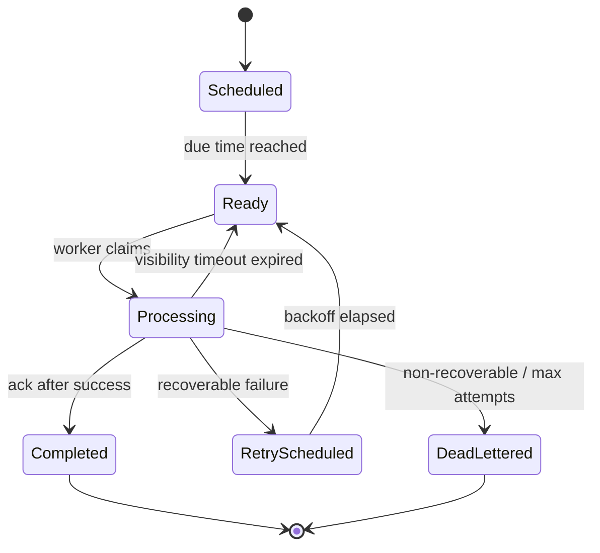
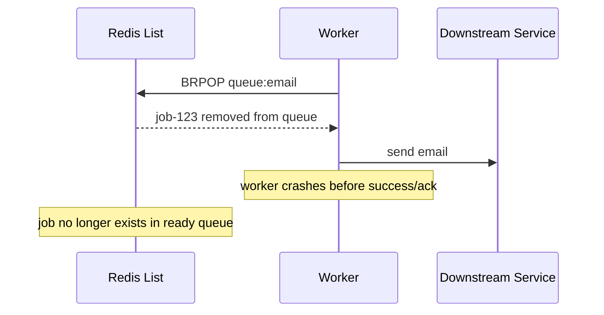
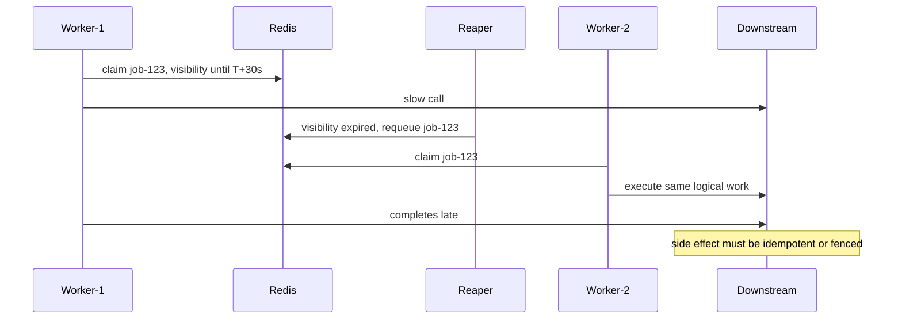
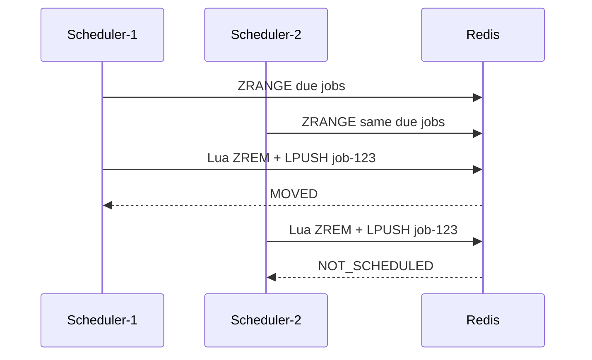
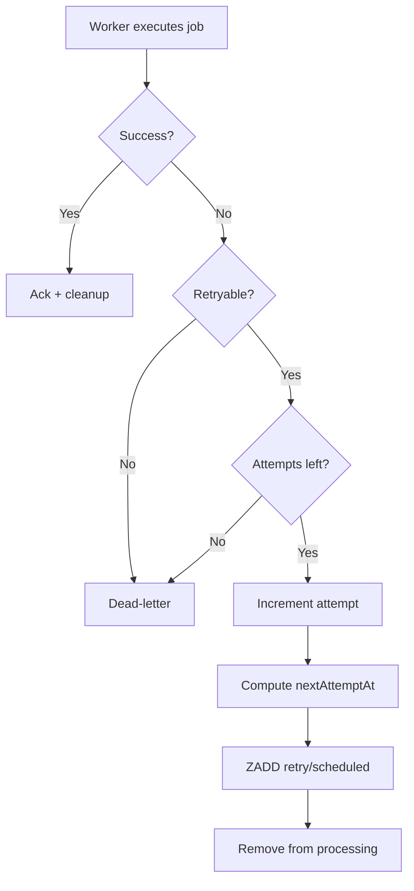
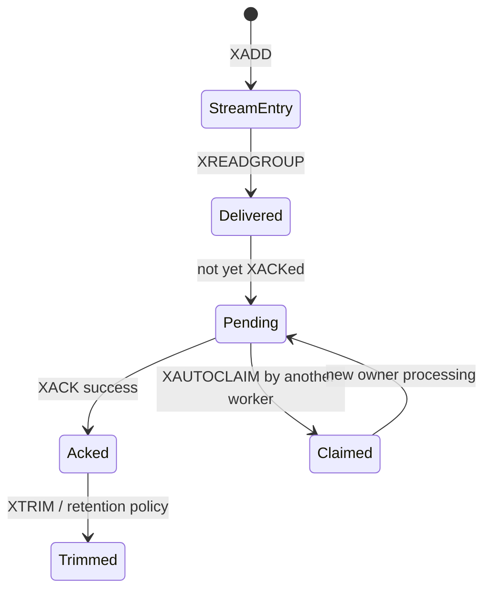
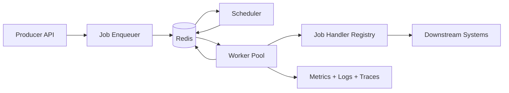
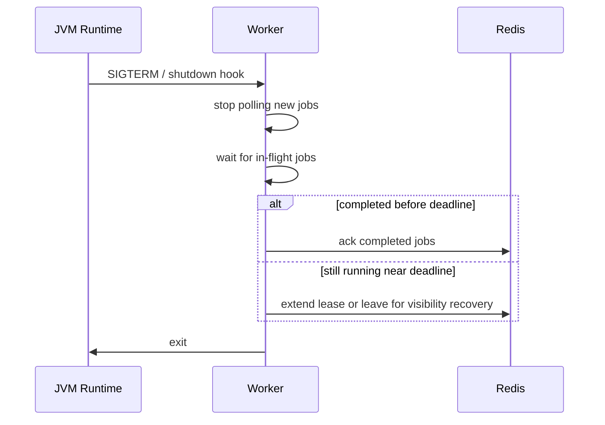
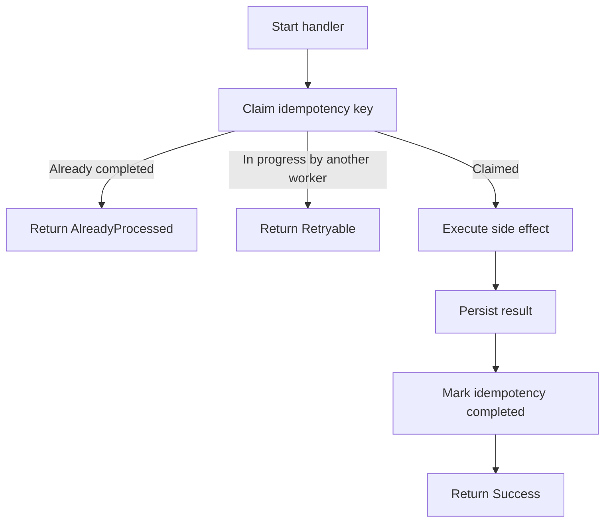

# Part 019 — Work Queues, Delayed Jobs, Schedulers, and Retry Pipelines

Part 018 covered Redis-based coordination: locks, leases, fencing tokens, and the limits of using Redis as a correctness primitive.
Now we apply those lessons to a common production need:

> Running background work reliably across multiple Java workers.

Redis can support several queue-like designs:

- simple FIFO queues with Lists
- blocking worker queues with `BLPOP`, `BRPOP`, or `BLMOVE`
- reliable-ish processing queues with ready and processing lists
- delayed jobs with Sorted Sets
- retry and dead-letter pipelines
- Stream-backed durable-ish job consumption with consumer groups
- Pub/Sub-triggered wakeups for scheduler efficiency

But Redis is not magically a job system.
A production job system needs explicit decisions for:

- ownership
- acknowledgement
- retry
- visibility timeout
- idempotency
- poison messages
- backpressure
- queue isolation
- payload compatibility
- worker shutdown
- observability
- operational replay

This part is about those decisions.

---

## 1. Kaufman Skill Decomposition

The skill is not “push a JSON object into Redis”.
The real skill is:

> Design a Redis-backed work execution pipeline where job state, retry state, ownership state, and side effects remain understandable under crash, duplicate execution, delay, overload, and partial failure.

Break it down into sub-skills:

| Sub-skill | What you must be able to do |
|---|---|
| Queue model selection | Choose List, Sorted Set, Stream, or external broker based on semantics |
| Job envelope design | Define job identity, type, version, attempts, idempotency key, trace context, and deadline |
| Worker lifecycle | Poll, claim, execute, acknowledge, retry, dead-letter, and shut down safely |
| Delayed scheduling | Use time-scored Sorted Sets or Streams without losing due work |
| Retry policy | Implement bounded retries, backoff, jitter, poison classification, and DLQ |
| Visibility timeout | Recover jobs from crashed workers without double-execution surprises |
| Atomic state transition | Use Lua/functions or single Redis commands to avoid split-brain job movement |
| Backpressure | Prevent Redis, workers, downstream services, and databases from melting down |
| Observability | Expose queue depth, age, attempt distribution, stuck jobs, DLQ rate, and worker lag |
| Operational recovery | Replay, inspect, purge, pause, drain, migrate, and re-drive safely |

Kaufman-style practice goal:

> In the first 20 hours, build three queues: a simple list queue, a reliable delayed retry queue, and a Stream consumer group queue. Then break each one deliberately with worker crashes, Redis restarts, slow downstream calls, and poison messages.

You are not finished when the happy path works.
You are finished when the failure behavior is boring.

---

## 2. Redis Queue Mental Model

A queue is a state machine.
Redis only gives you primitives.
You must design the state machine.

A job usually moves through states like this:



Redis primitives map to parts of this lifecycle:

| State | Common Redis structure |
|---|---|
| Ready | List, Stream, or Sorted Set score <= now |
| Scheduled | Sorted Set scored by due timestamp |
| Processing | List, Hash, Stream PEL, or owner key |
| Retry scheduled | Sorted Set scored by next attempt timestamp |
| Dead letter | List, Stream, Sorted Set, or Hash index |
| Job payload | String, Hash, JSON document, or external DB row |
| Job metadata | Hash, JSON, or encoded payload envelope |
| Dedup/idempotency | String `SET NX PX`, Set, or Hash |

The most important mental shift:

> Redis is good at atomic movement between simple states. It does not define your workflow semantics for you.

---

## 3. When Redis Is a Good Queue Choice

Redis can be a good fit when:

- the queue is close to application runtime concerns
- the job payload is small
- the job throughput is high but retention needs are limited
- the queue needs low latency
- jobs are idempotent or duplicate-tolerant
- Redis is already part of the runtime platform
- operational replay requirements are modest
- backlog size is bounded and observable
- the team understands Redis persistence and failover semantics

Examples:

- sending websocket notifications
- refreshing cache asynchronously
- issuing non-critical email/webhook tasks
- retrying temporary API calls
- fanout to local worker pools
- background materialized view refresh
- delayed follow-up checks
- short-lived workflow timers

Redis becomes a weaker fit when:

- you need long-term event retention
- you need partitioned replay at large scale
- you need strict audit trails
- you need cross-region ordered processing
- you need strong exactly-once semantics
- job execution is not idempotent
- queue backlog can become enormous
- regulatory traceability requires immutable history
- operational teams expect broker-like tooling

For those cases, Kafka, RabbitMQ, cloud queues, workflow engines, or database-backed outbox patterns may be better.

---

## 4. Queue Design Decision Matrix

| Requirement | List queue | Reliable List queue | Sorted Set delayed queue | Stream consumer group | External broker |
|---|---:|---:|---:|---:|---:|
| Simple FIFO | Excellent | Good | Needs ready queue | Good | Good |
| Blocking worker pop | Excellent | Excellent with `BLMOVE` | No, needs scheduler | Yes with `XREADGROUP BLOCK` | Yes |
| Delayed execution | Weak | Weak alone | Excellent | Possible with separate schedule | Depends |
| Ack/retry visibility | Weak | Manual | Manual | Built-in PEL concept | Usually built-in |
| Replay | Weak | Weak/manual | Manual | Better | Stronger |
| Retention | Weak | Weak | Manual | Good but must trim | Usually stronger |
| Consumer groups | No | No | No | Yes | Usually yes |
| Operational simplicity | High | Medium | Medium | Medium/high | Varies |
| Correctness clarity | Low unless idempotent | Medium | Medium | Medium/high | Usually higher |

Rule of thumb:

- use **simple List** only for best-effort or easily repeatable work
- use **reliable List + processing list** for small systems needing simple ack/recovery
- use **Sorted Set + ready queue** for delayed scheduling
- use **Streams** when consumer-group ownership and replay matter
- use **Kafka/RabbitMQ/cloud queue/workflow engine** when Redis semantics are not enough

---

## 5. Job Envelope Design

Do not put arbitrary DTOs directly into a queue.
Define a stable job envelope.

Example:

```json
{
  "jobId": "job_01JZ4SZ3MXWZK7WQR0STV9Q3WZ",
  "jobType": "invoice.email.send",
  "jobVersion": 3,
  "tenantId": "tenant_123",
  "idempotencyKey": "invoice-email:tenant_123:invoice_987:v3",
  "createdAtEpochMs": 1782972000000,
  "notBeforeEpochMs": 1782972060000,
  "deadlineEpochMs": 1782975600000,
  "attempt": 0,
  "maxAttempts": 8,
  "traceId": "0af7651916cd43dd8448eb211c80319c",
  "correlationId": "order_456",
  "payloadRef": null,
  "payload": {
    "invoiceId": "invoice_987",
    "recipientUserId": "user_555"
  }
}
```

A production envelope should contain:

| Field | Reason |
|---|---|
| `jobId` | Unique execution object identity |
| `jobType` | Dispatch to correct handler |
| `jobVersion` | Payload compatibility and migration |
| `tenantId` | Isolation, rate limit, observability, quota |
| `idempotencyKey` | Side-effect deduplication |
| `createdAt` | Queue age and SLO |
| `notBefore` | Delayed execution |
| `deadline` | Avoid executing stale jobs |
| `attempt` | Retry policy and poison detection |
| `maxAttempts` | Bounded failure |
| `traceId` | Observability correlation |
| `payloadRef` | Use external storage for large payloads |
| `payload` | Small command parameters |

Avoid large payloads.
If the payload grows beyond a small threshold, store it in durable storage and put only a reference in Redis.

Bad:

```json
{
  "jobType": "generate-report",
  "payload": "20MB of nested report data"
}
```

Better:

```json
{
  "jobId": "job_...",
  "jobType": "generate-report",
  "payloadRef": "s3://reports-input/tenant_123/report_789.json"
}
```

---

## 6. Pattern 1 — Simple FIFO List Queue

The simplest queue:

```text
producer: LPUSH queue:email <job-json>
worker:   BRPOP queue:email 5
```

Or reversed:

```text
producer: RPUSH queue:email <job-json>
worker:   BLPOP queue:email 5
```

Keep the direction consistent.

### Java Sketch with Lettuce

```java
public final class SimpleListWorker implements Runnable {
    private final RedisCommands<String, String> redis;
    private final JobHandler handler;
    private final AtomicBoolean running = new AtomicBoolean(true);

    public SimpleListWorker(RedisCommands<String, String> redis, JobHandler handler) {
        this.redis = redis;
        this.handler = handler;
    }

    @Override
    public void run() {
        while (running.get()) {
            KeyValue<String, String> item = redis.brpop(5, "queue:email");
            if (item == null || !item.hasValue()) {
                continue;
            }

            JobEnvelope job = JobEnvelope.fromJson(item.getValue());
            handler.handle(job);
        }
    }

    public void stop() {
        running.set(false);
    }
}
```

This is simple.
It is also unsafe for many production workflows.

### Failure Problem

With `BRPOP`, Redis removes the job before the worker executes it.
If the worker crashes after pop but before success, the job is lost.



Use this only when loss is acceptable or the operation is recoverable elsewhere.

Good uses:

- best-effort cache warmup
- non-critical fanout hint
- metrics aggregation hint
- local ephemeral work

Bad uses:

- charging payment
- issuing refund
- regulatory notice
- irreversible external side effect
- mission-critical workflow transition

---

## 7. Pattern 2 — Reliable List Queue with Processing List

A stronger list-based pattern uses two lists:

```text
queue:{email}:ready
queue:{email}:processing
```

A worker atomically moves a job from ready to processing, then acknowledges by removing it from processing after success.

Modern Redis supports `LMOVE` and blocking `BLMOVE` for atomic movement between lists.

```text
BLMOVE queue:{email}:ready queue:{email}:processing RIGHT LEFT 5
```

This means:

- take from the right of ready
- push to the left of processing
- block for up to 5 seconds

After success:

```text
LREM queue:{email}:processing 1 <job-json-or-job-id>
```

### Problem: Removing by Full JSON Is Fragile

If the processing list stores the entire JSON payload, `LREM` must match the exact bytes.
That is brittle.

Better:

- ready list stores `jobId`
- processing list stores `jobId`
- job payload stored in `job:{jobId}` hash/string

Keys:

```text
queue:{email}:ready              list of jobId
queue:{email}:processing         list of jobId
job:{email}:job_123              job payload / metadata
job:{email}:job_123:owner        owner lease
```

The `{email}` hash tag keeps related keys in the same Redis Cluster slot.

### Producer

```text
SET job:{email}:job_123 <job-json> EX 86400 NX
LPUSH queue:{email}:ready job_123
```

For stronger atomicity, wrap creation + enqueue in Lua.

```lua
-- KEYS[1] = job key
-- KEYS[2] = ready list
-- ARGV[1] = job id
-- ARGV[2] = payload
-- ARGV[3] = ttl seconds

local created = redis.call('SET', KEYS[1], ARGV[2], 'EX', ARGV[3], 'NX')
if not created then
  return {err = 'DUPLICATE_JOB'}
end
redis.call('LPUSH', KEYS[2], ARGV[1])
return 'OK'
```

### Worker Claim

```text
BLMOVE queue:{email}:ready queue:{email}:processing RIGHT LEFT 5
```

Then load payload:

```text
GET job:{email}:job_123
```

Then execute.

Then ack:

```text
LREM queue:{email}:processing 1 job_123
DEL job:{email}:job_123
```

For correctness, ack should be atomic enough for your model.
If payload deletion succeeds but processing removal fails, recovery sees stale processing ID.
If processing removal succeeds but payload deletion fails, storage leaks.
A Lua ack can make cleanup deterministic.

```lua
-- KEYS[1] = processing list
-- KEYS[2] = job payload key
-- ARGV[1] = job id

local removed = redis.call('LREM', KEYS[1], 1, ARGV[1])
if removed == 1 then
  redis.call('DEL', KEYS[2])
end
return removed
```

---

## 8. Visibility Timeout for List Queues

The reliable list pattern still needs recovery.
If a worker crashes while a job sits in `processing`, nothing automatically moves it back to `ready`.

A visibility timeout marks how long a worker may hold a job before the system assumes it is stuck.

Add a processing metadata sorted set:

```text
queue:{email}:processing              list of jobId
queue:{email}:processing:deadline     zset jobId -> visibilityDeadlineEpochMs
job:{email}:job_123                   payload/metadata
```

When claiming a job:

```text
ZADD queue:{email}:processing:deadline <now + visibilityMs> job_123
```

When acking:

```text
LREM queue:{email}:processing 1 job_123
ZREM queue:{email}:processing:deadline job_123
DEL job:{email}:job_123
```

A reaper periodically finds expired processing jobs:

```text
ZRANGE queue:{email}:processing:deadline -inf <now> BYSCORE LIMIT 0 100
```

For each expired job, atomically remove from processing and requeue.

```lua
-- KEYS[1] = processing list
-- KEYS[2] = processing deadline zset
-- KEYS[3] = ready list
-- KEYS[4] = job key
-- ARGV[1] = job id
-- ARGV[2] = now epoch ms

local score = redis.call('ZSCORE', KEYS[2], ARGV[1])
if not score then
  return 'NOT_PENDING'
end

if tonumber(score) > tonumber(ARGV[2]) then
  return 'NOT_EXPIRED'
end

local exists = redis.call('EXISTS', KEYS[4])
if exists == 0 then
  redis.call('ZREM', KEYS[2], ARGV[1])
  redis.call('LREM', KEYS[1], 1, ARGV[1])
  return 'MISSING_PAYLOAD'
end

local removed = redis.call('LREM', KEYS[1], 1, ARGV[1])
if removed == 1 then
  redis.call('ZREM', KEYS[2], ARGV[1])
  redis.call('LPUSH', KEYS[3], ARGV[1])
  return 'REQUEUED'
end

return 'NOT_IN_PROCESSING_LIST'
```

This design gives you at-least-once execution.
It does not give exactly-once execution.
A slow worker may finish after the reaper has requeued the job.
Therefore, handlers must be idempotent.



---

## 9. Pattern 3 — Delayed Jobs with Sorted Sets

Redis Lists are good for ready work.
Sorted Sets are good for scheduled work.

Use score as due timestamp:

```text
queue:{email}:scheduled    zset jobId -> dueEpochMs
queue:{email}:ready        list jobId
job:{email}:job_123        payload
```

Producer:

```text
SET job:{email}:job_123 <payload> EX 86400 NX
ZADD queue:{email}:scheduled <dueEpochMs> job_123
```

A scheduler scans due jobs:

```text
ZRANGE queue:{email}:scheduled -inf <now> BYSCORE LIMIT 0 100
```

Then atomically moves each due job to ready:

```lua
-- KEYS[1] = scheduled zset
-- KEYS[2] = ready list
-- KEYS[3] = job key
-- ARGV[1] = job id
-- ARGV[2] = now epoch ms

local score = redis.call('ZSCORE', KEYS[1], ARGV[1])
if not score then
  return 'NOT_SCHEDULED'
end

if tonumber(score) > tonumber(ARGV[2]) then
  return 'NOT_DUE'
end

if redis.call('EXISTS', KEYS[3]) == 0 then
  redis.call('ZREM', KEYS[1], ARGV[1])
  return 'MISSING_PAYLOAD'
end

local removed = redis.call('ZREM', KEYS[1], ARGV[1])
if removed == 1 then
  redis.call('LPUSH', KEYS[2], ARGV[1])
  return 'MOVED'
end

return 'RACE_LOST'
```

### Why Not Use `ZRANGEBYSCORE`?

New code should prefer `ZRANGE ... BYSCORE` because `ZRANGEBYSCORE` is deprecated as of Redis 6.2.

```text
ZRANGE queue:{email}:scheduled -inf <now> BYSCORE LIMIT 0 100
```

### Scheduler Race

Multiple scheduler instances may scan the same due job.
That is okay if the move script uses `ZREM` as the atomic ownership step.
Only one scheduler wins.



---

## 10. Retry Pipeline

Retry is not just “push it again”.
A retry pipeline must answer:

- What failures are retryable?
- How many attempts are allowed?
- What backoff strategy is used?
- Is the job still valid by the time it retries?
- Does retry preserve ordering?
- Does retry create duplicate side effects?
- Where do poison messages go?
- How are retry storms prevented?

Recommended job metadata:

```json
{
  "jobId": "job_123",
  "jobType": "webhook.deliver",
  "attempt": 3,
  "maxAttempts": 8,
  "createdAtEpochMs": 1782972000000,
  "lastAttemptAtEpochMs": 1782972300000,
  "nextAttemptAtEpochMs": 1782972600000,
  "lastErrorCode": "HTTP_503",
  "lastErrorMessage": "upstream unavailable"
}
```

Backoff example:

```java
static long computeBackoffMillis(int attempt) {
    long base = 1_000L;
    long max = 5 * 60_000L;
    long exponential = Math.min(max, base * (1L << Math.min(attempt, 10)));
    long jitter = ThreadLocalRandom.current().nextLong(0, exponential / 4 + 1);
    return exponential + jitter;
}
```

Retry classifications:

| Failure | Retry? | Example |
|---|---:|---|
| Network timeout | Yes | downstream temporarily unavailable |
| HTTP 429 | Yes with backoff | rate limited |
| HTTP 503 | Yes | service unavailable |
| HTTP 400 validation | No | invalid payload |
| Entity not found but expected eventual | Maybe | read-after-write delay |
| Permission denied | Usually no | wrong credential |
| Serialization error | No | incompatible payload version |
| Deadline exceeded | No | stale job |
| Duplicate idempotency key | Treat as success or no-op | already processed |

### Retry State Transition



### Atomic Retry Script

```lua
-- KEYS[1] = processing list
-- KEYS[2] = processing deadline zset
-- KEYS[3] = scheduled zset
-- KEYS[4] = job key
-- ARGV[1] = job id
-- ARGV[2] = updated payload
-- ARGV[3] = next attempt epoch ms
-- ARGV[4] = payload ttl seconds

local pendingRemoved = redis.call('LREM', KEYS[1], 1, ARGV[1])
redis.call('ZREM', KEYS[2], ARGV[1])

if pendingRemoved == 0 then
  return 'NOT_PROCESSING'
end

redis.call('SET', KEYS[4], ARGV[2], 'EX', ARGV[4])
redis.call('ZADD', KEYS[3], ARGV[3], ARGV[1])
return 'RETRY_SCHEDULED'
```

### Dead Letter Script

```lua
-- KEYS[1] = processing list
-- KEYS[2] = processing deadline zset
-- KEYS[3] = dead list
-- KEYS[4] = job key
-- ARGV[1] = job id
-- ARGV[2] = dead payload
-- ARGV[3] = payload ttl seconds

local removed = redis.call('LREM', KEYS[1], 1, ARGV[1])
redis.call('ZREM', KEYS[2], ARGV[1])

if removed == 0 then
  return 'NOT_PROCESSING'
end

redis.call('SET', KEYS[4], ARGV[2], 'EX', ARGV[3])
redis.call('LPUSH', KEYS[3], ARGV[1])
return 'DEAD_LETTERED'
```

---

## 11. Stream-Backed Job Queue

Redis Streams provide a richer queue model than Lists.
A Stream stores entries.
Consumer groups track which entries have been delivered but not acknowledged.

Typical keys:

```text
stream:{email}:jobs
```

Producer:

```text
XADD stream:{email}:jobs * jobId job_123 jobType email.send payload <json>
```

Consumer group creation:

```text
XGROUP CREATE stream:{email}:jobs workers $ MKSTREAM
```

Worker read:

```text
XREADGROUP GROUP workers worker-1 COUNT 10 BLOCK 5000 STREAMS stream:{email}:jobs >
```

Ack:

```text
XACK stream:{email}:jobs workers <entry-id>
```

Recovery:

```text
XAUTOCLAIM stream:{email}:jobs workers worker-2 60000 0-0 COUNT 100
```

### Stream Job Lifecycle



### Why Streams Are Useful

Streams give you:

- append-only-ish job history
- consumer groups
- pending entries list
- explicit acknowledgement
- recovery using `XPENDING`, `XCLAIM`, or `XAUTOCLAIM`
- blocking reads
- batch reads
- better introspection than pure Lists

But Streams do not solve everything:

- duplicate processing is still possible
- side effects must still be idempotent
- retention/trimming must be configured
- large payloads still hurt memory
- delayed jobs still usually need a schedule structure
- ordering is per stream, but consumer parallelism can reorder completion
- long PELs become operational debt

---

## 12. List Queue vs Stream Queue

| Concern | Reliable List Queue | Stream Consumer Group |
|---|---|---|
| Basic worker queue | Good | Good |
| Ack model | Manual | Native `XACK` |
| Pending visibility | Manual list/zset | Native PEL |
| Claim stuck work | Manual reaper | `XAUTOCLAIM` / `XCLAIM` |
| Replay history | Weak | Better |
| Trimming | Manual payload TTL | `XTRIM` / min-id/length strategy |
| Payload shape | External payload recommended | Entry fields or external payload |
| Simplicity | Simple but custom | More concepts |
| Operational introspection | Custom | Better with `XPENDING`, `XINFO` |
| Delayed execution | Needs zset | Still usually needs zset |

Rule:

> Use Streams when job ownership and replay visibility matter more than absolute simplicity.

---

## 13. Delayed Streams Pattern

Streams do not directly mean “execute this entry at time T”.
A common pattern is:

```text
queue:{email}:scheduled    zset jobId -> dueEpochMs
stream:{email}:jobs        stream ready for workers
job:{email}:job_123        payload
```

Scheduler moves due job IDs into the stream:

```lua
-- KEYS[1] = scheduled zset
-- KEYS[2] = stream key
-- KEYS[3] = job payload key
-- ARGV[1] = job id
-- ARGV[2] = now epoch ms

local score = redis.call('ZSCORE', KEYS[1], ARGV[1])
if not score then
  return 'NOT_SCHEDULED'
end
if tonumber(score) > tonumber(ARGV[2]) then
  return 'NOT_DUE'
end
if redis.call('EXISTS', KEYS[3]) == 0 then
  redis.call('ZREM', KEYS[1], ARGV[1])
  return 'MISSING_PAYLOAD'
end

local removed = redis.call('ZREM', KEYS[1], ARGV[1])
if removed == 1 then
  local streamId = redis.call('XADD', KEYS[2], '*', 'jobId', ARGV[1])
  return streamId
end
return 'RACE_LOST'
```

Workers read from the stream and load payload by job ID.

This avoids embedding large payloads in stream entries and allows payload TTL management.

---

## 14. Java Worker Architecture

A robust Java worker should separate these roles:



Recommended components:

| Component | Responsibility |
|---|---|
| `JobEnvelope` | Stable job metadata contract |
| `JobCodec` | Serialize/deserialize envelope safely |
| `JobRepository` | Store/load payload and metadata |
| `JobQueue` | Enqueue, claim, ack, retry, dead-letter |
| `JobScheduler` | Move due jobs into ready queue/stream |
| `JobWorker` | Poll and execute jobs |
| `JobHandlerRegistry` | Map job type/version to handler |
| `RetryPolicy` | Classify failure and compute next attempt |
| `IdempotencyService` | Prevent duplicate side effects |
| `QueueMetrics` | Record queue health and worker health |
| `DeadLetterService` | Inspect and re-drive failed jobs |

### Handler Interface

```java
public interface JobHandler<T> {
    String jobType();
    int supportedVersion();
    JobResult handle(JobContext context, T payload) throws Exception;
}
```

Result model:

```java
public sealed interface JobResult {
    record Success() implements JobResult {}
    record RetryableFailure(String code, String message) implements JobResult {}
    record PermanentFailure(String code, String message) implements JobResult {}
    record AlreadyProcessed() implements JobResult {}
}
```

### Worker Loop Sketch

```java
public final class RedisJobWorker implements Runnable {
    private final JobQueue queue;
    private final JobHandlerRegistry handlers;
    private final RetryPolicy retryPolicy;
    private final AtomicBoolean running = new AtomicBoolean(true);

    @Override
    public void run() {
        while (running.get()) {
            ClaimedJob claimed = queue.claim(Duration.ofSeconds(5));
            if (claimed == null) {
                continue;
            }

            JobEnvelope envelope = claimed.envelope();

            try {
                if (isExpired(envelope)) {
                    queue.deadLetter(claimed, "DEADLINE_EXCEEDED", "Job deadline passed");
                    continue;
                }

                JobHandler<?> handler = handlers.resolve(envelope.jobType(), envelope.jobVersion());
                JobResult result = handler.handle(JobContext.from(envelope), envelope.payload());

                switch (result) {
                    case JobResult.Success ignored -> queue.ack(claimed);
                    case JobResult.AlreadyProcessed ignored -> queue.ack(claimed);
                    case JobResult.RetryableFailure failure -> retryOrDeadLetter(claimed, failure);
                    case JobResult.PermanentFailure failure -> queue.deadLetter(claimed, failure.code(), failure.message());
                }
            } catch (Exception ex) {
                retryOrDeadLetter(claimed, RetryPolicy.classify(ex));
            }
        }
    }

    public void shutdown() {
        running.set(false);
    }
}
```

The exact Java types depend on Lettuce/Jedis/Spring Data Redis.
The architecture is the invariant.

---

## 15. Graceful Shutdown

A worker must not claim new jobs once shutdown starts.
It should either:

- finish current jobs before the shutdown deadline
- extend visibility while finishing
- abandon current job so another worker can recover it later
- explicitly retry/requeue if safe

Typical shutdown sequence:



Rules:

- Use finite blocking reads so the worker can observe shutdown.
- Do not block forever in `BRPOP`/`XREADGROUP BLOCK`.
- Track in-flight job IDs.
- Make handler timeout explicit.
- Do not rely only on Kubernetes termination grace period.
- Log unacked jobs during shutdown.

---

## 16. Idempotency Integration

Every queue in this part is at-least-once under recovery.
Therefore every side-effect handler must be idempotent.

Pattern:

```text
idempotency:{job-type}:{business-key} -> result metadata
```

Handler flow:



Do not use `jobId` alone as the idempotency key.
If the same business operation gets re-enqueued as a new job, `jobId` changes.
Use a business identity:

```text
invoice-email:{tenantId}:{invoiceId}:{templateVersion}
webhook-delivery:{tenantId}:{eventId}:{endpointId}
payment-capture:{merchantId}:{paymentIntentId}:{captureSequence}
```

---

## 17. Backpressure and Load Shedding

A queue hides latency.
It does not remove work.

Production queues need backpressure signals:

| Signal | Meaning |
|---|---|
| ready queue length | immediate backlog |
| scheduled queue size | future backlog |
| oldest ready age | user-visible delay risk |
| processing count | active concurrency |
| retry queue size | downstream instability |
| DLQ growth | poison message or integration bug |
| attempts histogram | retry storm detection |
| handler latency | worker saturation |
| Redis command latency | Redis or network saturation |

Controls:

- cap enqueue rate per tenant/job type
- cap worker concurrency per queue
- pause low-priority queues during incidents
- reject non-critical jobs when queue is too deep
- use separate queues for critical and non-critical work
- use retry jitter to avoid synchronized retry storms
- apply circuit breakers to unstable downstream dependencies
- use deadlines to avoid executing stale work

Example policy:

```text
if oldest_ready_age > 5 minutes:
  pause non-critical producers
  reduce retry concurrency
  increase workers only if downstream is healthy
  alert owning team
```

Scaling workers is not always the answer.
If downstream is the bottleneck, more workers amplify the outage.

---

## 18. Priority Queues

A simple priority design uses one ready list per priority:

```text
queue:{email}:ready:p0
queue:{email}:ready:p1
queue:{email}:ready:p2
```

Workers poll in priority order:

```text
BRPOP queue:{email}:ready:p0 queue:{email}:ready:p1 queue:{email}:ready:p2 5
```

But strict priority can starve low-priority work.

Alternative: weighted polling.

```java
List<String> pollOrder = weightedRoundRobin(List.of(
    "queue:{email}:ready:p0",
    "queue:{email}:ready:p0",
    "queue:{email}:ready:p0",
    "queue:{email}:ready:p1",
    "queue:{email}:ready:p1",
    "queue:{email}:ready:p2"
));
```

For scheduled jobs, use separate scheduled sets per priority or encode priority into score carefully.
Prefer separate structures if you need clear observability.

---

## 19. Tenant Isolation

Multi-tenant queues must prevent one tenant from dominating capacity.

Options:

### Shared Queue

```text
queue:{email}:ready
```

Pros:

- simple
- high worker utilization

Cons:

- noisy neighbor risk
- harder tenant-specific throttling
- hard to pause one tenant

### Per-Tenant Queue

```text
queue:{tenant_123}:email:ready
queue:{tenant_456}:email:ready
```

Pros:

- isolation
- per-tenant quota
- pause/re-drive per tenant

Cons:

- many keys
- worker scheduling is harder
- discovery of active tenants required

### Hybrid

```text
queue:{email}:ready:high
queue:{email}:ready:normal
queue:{email}:tenant-active
tenant:{tenantId}:queue-depth
```

Hybrid designs often work best:

- central ready queues for common work
- per-tenant counters and rate limits
- per-tenant dead-letter tagging
- per-tenant pause flags

---

## 20. Redis Cluster Key Design

Redis Cluster requires multi-key operations in Lua to target keys in the same hash slot.
Use hash tags intentionally.

Good:

```text
queue:{email}:ready
queue:{email}:processing
queue:{email}:processing:deadline
queue:{email}:scheduled
queue:{email}:dead
job:{email}:job_123
```

But this puts all email jobs in one slot.
That may become a hotspot.

For sharding:

```text
queue:{email:00}:ready
queue:{email:00}:scheduled
job:{email:00}:job_123

queue:{email:01}:ready
queue:{email:01}:scheduled
job:{email:01}:job_456
```

Shard by stable hash:

```java
int shard = Math.floorMod(jobId.hashCode(), 64);
String tag = "email:%02d".formatted(shard);
String readyKey = "queue:{%s}:ready".formatted(tag);
```

Trade-off:

- fewer shards = simpler operations but more hot-spot risk
- more shards = better distribution but more worker/scheduler complexity

---

## 21. Observability Model

Expose metrics per queue, job type, tenant, and priority.

### Core Metrics

| Metric | Type | Meaning |
|---|---|---|
| `redis_job_ready_depth` | gauge | jobs ready to claim |
| `redis_job_scheduled_depth` | gauge | delayed jobs waiting |
| `redis_job_processing_depth` | gauge | in-flight jobs |
| `redis_job_dead_depth` | gauge | dead-lettered jobs |
| `redis_job_oldest_ready_age_ms` | gauge | latency pressure |
| `redis_job_claim_total` | counter | claimed jobs |
| `redis_job_success_total` | counter | completed jobs |
| `redis_job_retry_total` | counter | retry scheduled |
| `redis_job_dead_total` | counter | dead-lettered jobs |
| `redis_job_execution_duration_ms` | histogram | handler runtime |
| `redis_job_attempts` | histogram | retry attempt distribution |
| `redis_job_recovered_total` | counter | visibility timeout recovery |
| `redis_job_duplicate_total` | counter | idempotency duplicate detected |

### Logs

Log structured fields:

```json
{
  "event": "job_failed_retry_scheduled",
  "jobId": "job_123",
  "jobType": "webhook.deliver",
  "tenantId": "tenant_123",
  "attempt": 4,
  "nextAttemptAt": 1782972600000,
  "errorCode": "HTTP_503",
  "traceId": "0af7651916cd43dd8448eb211c80319c"
}
```

### Traces

Use trace propagation:

```text
producer HTTP request span
  -> enqueue job span
      -> worker claim span
          -> handler span
              -> downstream call span
```

The worker span should link to the producer trace if the job executes asynchronously.

---

## 22. Dead Letter Queue Operations

Dead-lettering is not the end.
It is a recovery interface.

DLQ entry should preserve:

- original payload
- attempts
- final error code
- final error message
- stack trace hash, not necessarily entire huge trace
- timestamps
- tenant
- handler version
- trace/correlation IDs

Operations needed:

| Operation | Meaning |
|---|---|
| inspect | show dead job details |
| search | filter by tenant/job type/error |
| re-drive | schedule dead job again |
| bulk re-drive | re-drive many after fix |
| suppress | mark as intentionally ignored |
| purge | delete old DLQ entries |
| export | send to audit/object storage |

Do not blindly bulk re-drive DLQ entries.
Classify first:

- fixed code bug: safe after deployment
- bad input: not safe
- expired business deadline: not useful
- downstream outage: maybe safe
- duplicate side effect risk: only safe with idempotency

---

## 23. Testing Strategy

Test queues like distributed systems, not like utility classes.

### Unit Tests

- envelope serialization compatibility
- retry policy classification
- backoff bounds and jitter
- key naming
- handler dispatch
- deadline checks

### Redis Integration Tests

Use Testcontainers or a dedicated Redis test instance.

Test:

- enqueue + claim + ack
- duplicate enqueue
- delayed job due movement
- retry scheduling
- DLQ after max attempts
- visibility timeout requeue
- worker crash simulation
- malformed payload handling
- cluster hash tag compatibility for Lua keys

### Failure Tests

| Failure | Expected behavior |
|---|---|
| worker crashes after claim | job becomes recoverable |
| worker crashes after side effect before ack | duplicate execution handled by idempotency |
| Redis command timeout during ack | handler must not blindly re-execute unsafe side effect |
| downstream returns 503 | retry with backoff |
| downstream returns 400 | dead-letter |
| payload version unsupported | dead-letter or migrate |
| scheduler runs on two nodes | only one moves each due job |
| Redis restarts | persistence policy defines expected loss window |

### Load Tests

Measure:

- enqueue throughput
- claim throughput
- handler throughput
- Redis CPU
- Redis memory
- command latency
- queue age under load
- reaper cost
- scheduler scan cost

Do not benchmark only Redis operations.
Benchmark the whole worker pipeline.

---

## 24. Production Anti-Patterns

### Anti-Pattern 1 — Using Redis Queue for Irreversible Non-Idempotent Work

Bad:

```text
BRPOP payment:capture
call payment gateway without idempotency key
```

Crash/retry behavior can double-charge.

Better:

- use a durable DB command table
- use payment-provider idempotency key
- ack only after durable state transition
- reconcile externally

### Anti-Pattern 2 — Infinite Retry

Bad:

```text
catch Exception -> LPUSH ready again
```

This creates poison-message loops.

Better:

- classify failure
- cap attempts
- backoff with jitter
- DLQ after max attempts

### Anti-Pattern 3 — Large Payloads in Redis

Bad:

```text
LPUSH queue:reports <10MB JSON>
```

Better:

```text
LPUSH queue:reports job_123
SET job:job_123 {"payloadRef":"s3://..."}
```

### Anti-Pattern 4 — No Queue Age Metric

Queue depth alone is insufficient.
A small queue with very old jobs may violate SLO.
Track oldest ready age.

### Anti-Pattern 5 — Treating Redis Failover as Lossless

Redis replication is asynchronous unless you explicitly design around stronger acknowledgement.
A job acknowledged to primary may be lost during failover depending on persistence/replication timing.
For critical workflows, pair Redis with durable source of truth or use a stronger queue.

---

## 25. Operational Checklist

Before shipping a Redis-backed job queue, answer:

- What is the maximum acceptable job loss window?
- Is every handler idempotent?
- What is the idempotency key for each job type?
- What is the max job payload size?
- What happens when payload deserialization fails?
- What is the retry policy per failure class?
- What is the max attempt count?
- What is the dead-letter retention period?
- Can operators inspect and re-drive DLQ entries?
- What is the visibility timeout?
- Can slow jobs renew visibility?
- How are stuck processing jobs recovered?
- How are old scheduled jobs scanned?
- Is there a scheduler leader, or are scheduler races safe?
- Are all Lua keys in the same Cluster slot?
- What metrics trigger alerts?
- How does graceful shutdown work?
- How does Redis restart/failover affect jobs?
- Is Redis persistence configured for the data-loss budget?
- Does the system need an external broker instead?

---

## 26. 20-Hour Practice Plan

### Hours 1–3 — Simple FIFO Queue

Build:

- producer
- worker
- JSON envelope
- one handler
- basic metrics

Break:

- crash worker after pop
- observe job loss

Lesson:

> Simple List queues are easy but weak.

### Hours 4–7 — Reliable List Queue

Build:

- ready list
- processing list
- payload key
- ack script
- retry script
- DLQ script

Break:

- crash worker after claim
- recover with reaper

Lesson:

> Visibility timeout gives recovery but introduces duplicate execution.

### Hours 8–11 — Delayed Queue

Build:

- scheduled zset
- scheduler loop
- due movement Lua
- backoff retry

Break:

- run two schedulers
- verify no duplicate due movement

Lesson:

> Sorted Sets are scheduling indexes, not workers.

### Hours 12–15 — Stream Queue

Build:

- stream producer
- consumer group worker
- ack
- pending inspection
- `XAUTOCLAIM` recovery

Break:

- kill worker with pending messages
- claim from another worker

Lesson:

> Streams provide better ownership introspection, not exactly-once side effects.

### Hours 16–18 — Idempotency and DLQ

Build:

- idempotency key store
- permanent vs retryable failure classification
- re-drive tool

Break:

- throw deterministic handler error
- generate duplicate job IDs and duplicate business keys

Lesson:

> Queue reliability is mostly handler reliability.

### Hours 19–20 — Operational Review

Create:

- dashboard sketch
- alert rules
- launch checklist
- runbook

Lesson:

> A production queue is an operational product, not a data structure trick.

---

## 27. Summary

Redis can power production work queues, delayed jobs, schedulers, and retry pipelines when you design the state machine explicitly.

The core ideas:

- A List queue is simple but can lose jobs after pop.
- A reliable List queue needs a processing state and recovery mechanism.
- A Sorted Set is a natural delayed-job index.
- Streams provide consumer groups, pending entries, ack, and recovery primitives.
- Retry requires classification, bounded attempts, backoff, jitter, and DLQ.
- Visibility timeout gives at-least-once execution, not exactly-once execution.
- Every meaningful handler needs idempotency.
- Queue health is measured by age, attempts, retries, DLQ, and worker lag, not depth alone.
- Redis Cluster key design matters for Lua and multi-key movement.
- Critical workflows may need a durable source of truth or a dedicated broker.

The top 1% engineer does not ask:

> Can Redis implement a queue?

They ask:

> What failure semantics does this queue need, and which Redis state transitions make those semantics explicit?

Next: Part 020 will cover real-time features: presence, WebSocket fanout, notifications, ephemeral signals, durable inboxes, and Redis Pub/Sub/Streams trade-offs.
