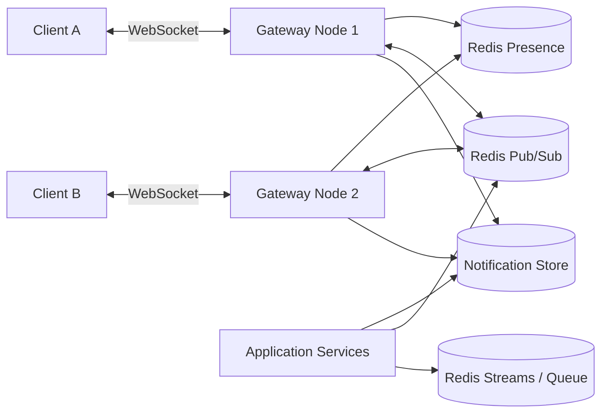
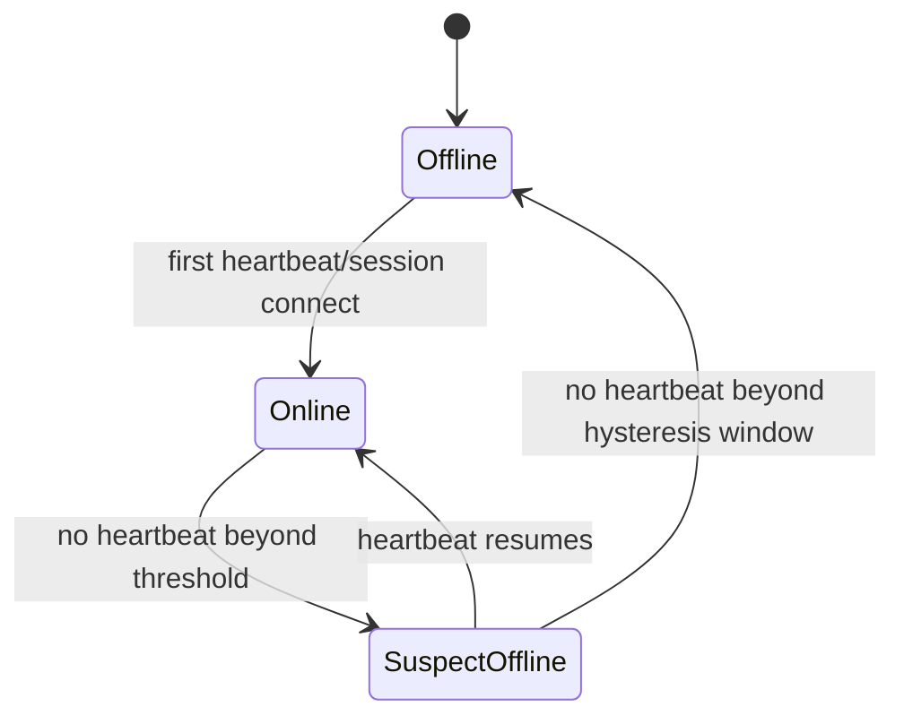
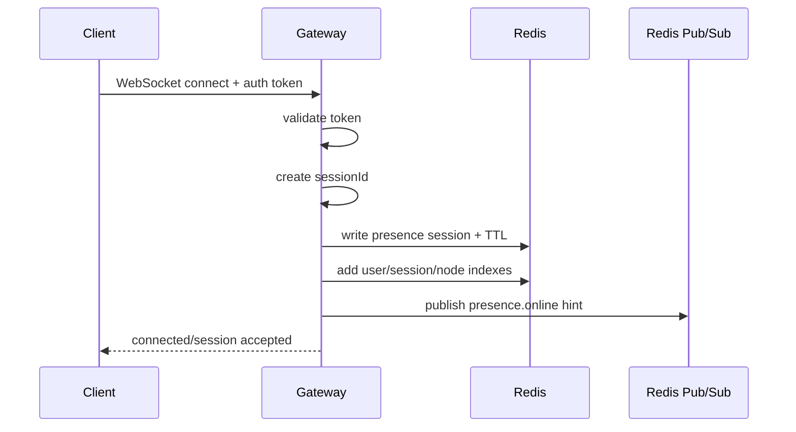
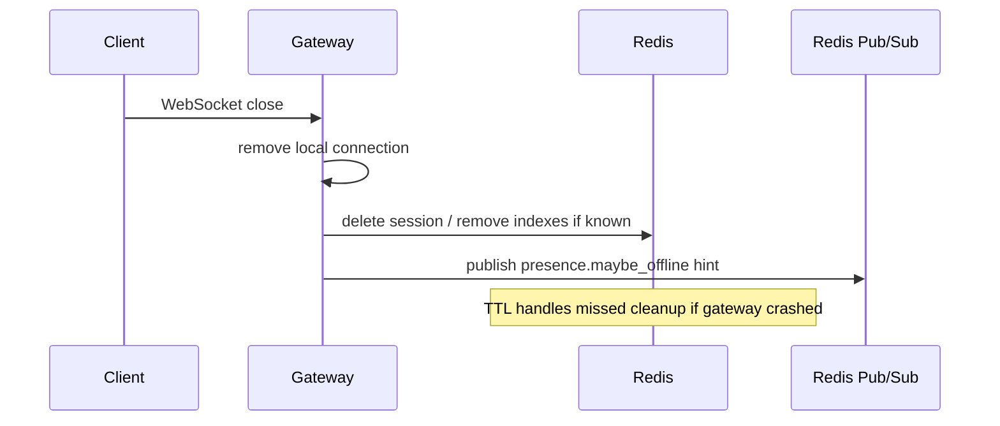
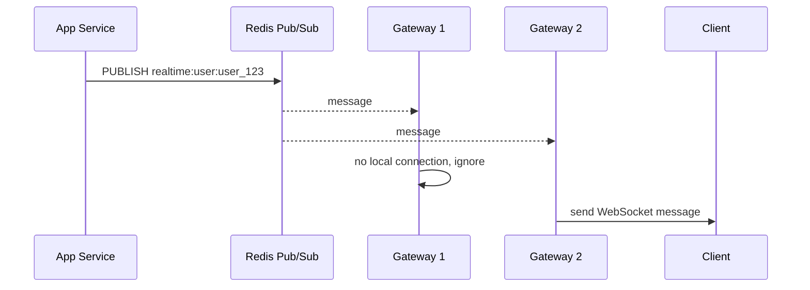
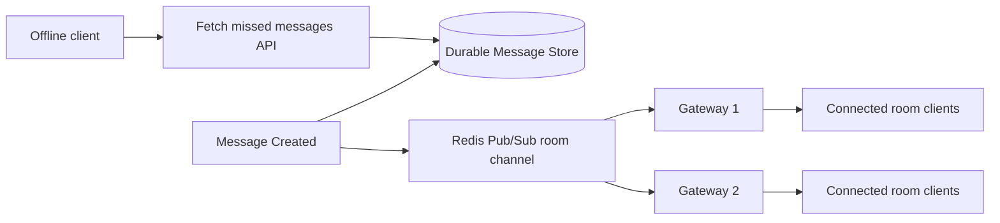
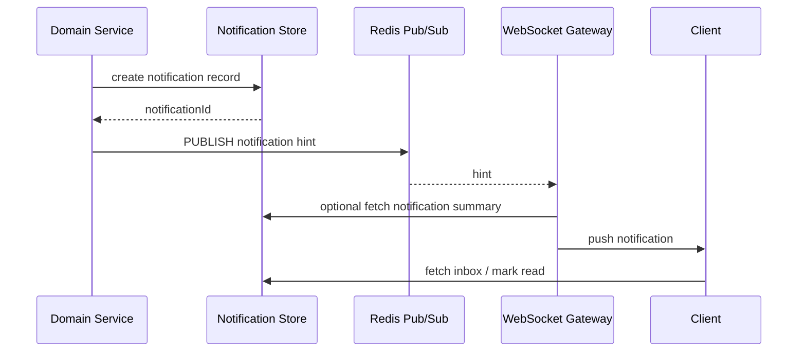
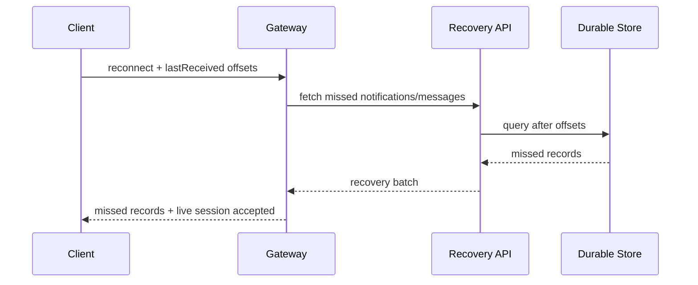
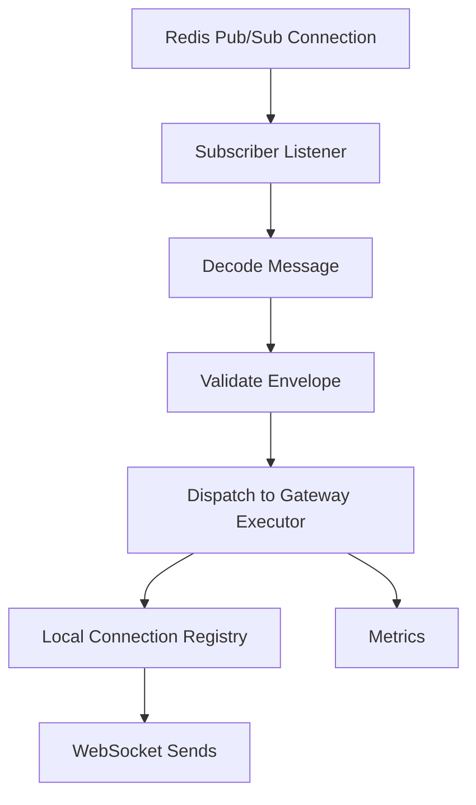

# Part 020 — Real-Time Features: Presence, WebSocket Fanout, and Notifications

Part 019 covered Redis-backed work queues, delayed jobs, retry, and worker pipelines.
Now we move to a different class of runtime feature:

> Real-time user experience built on Redis.

This includes:

- online/offline presence
- last-seen tracking
- multi-device sessions
- WebSocket gateway fanout
- room/channel membership
- live notifications
- unread counters
- ephemeral signals
- durable notification inboxes
- reconnect recovery

Redis is commonly used here because it is fast, simple, and well suited to shared runtime state.
But real-time systems are easy to misdesign.
The most common mistake is treating all real-time messages as equally durable.
They are not.

The central distinction:

> Presence and fanout are often ephemeral signals. Notification history and business state are durable records.

Redis can support both, but the design must separate them.

---

## 1. Kaufman Skill Decomposition

The skill is not “publish a message”.
The real skill is:

> Design a real-time delivery system where ephemeral connection state, durable notification state, fanout routing, reconnect behavior, and user-visible consistency are explicitly modeled.

Breakdown:

| Sub-skill | What you must be able to do |
|---|---|
| Delivery classification | Decide which messages may be lost and which require durable recovery |
| Presence modeling | Represent user, device, connection, heartbeat, expiry, and last-seen |
| Gateway routing | Route messages to the right WebSocket nodes and local connections |
| Fanout design | Choose direct channels, room channels, sharded Pub/Sub, Streams, or queues |
| Notification durability | Separate live push from notification inbox and unread state |
| Reconnect recovery | Allow clients to catch up after disconnect |
| Cluster behavior | Understand normal Pub/Sub vs sharded Pub/Sub and channel hot spots |
| Expiry handling | Use TTL/keyspace notifications as hints, not correctness sources |
| Backpressure | Protect gateways, Redis, and clients from fanout storms |
| Observability | Measure connected users, sessions, publish latency, dropped signals, and delivery lag |

Kaufman practice goal:

> In 20 hours, build a small Java WebSocket gateway backed by Redis presence state, Pub/Sub fanout, and a durable notification inbox. Then test disconnects, node restarts, Redis restart, duplicate sessions, mobile reconnect, and offline catch-up.

---

## 2. Mental Model: Signal vs State

Real-time architecture has two different things:

1. **State** — what must remain true after failures.
2. **Signal** — what helps systems react quickly when online.

Example:

| Feature | Durable state? | Ephemeral signal? |
|---|---:|---:|
| User has 5 unread notifications | Yes | Optional |
| User is currently typing | No | Yes |
| User is online | Soft state | Yes |
| A payment was approved | Yes | Optional live push |
| A chat message exists | Yes | Live push is signal |
| WebSocket connection exists on node A | Soft state | Yes |
| User joined room | Often durable or soft depending feature | Yes |

The dangerous design is to store critical facts only in Pub/Sub.

Bad:

```text
Payment service -> PUBLISH user:123 payment-approved
WebSocket node -> sends to browser
```

If the user is offline or the WebSocket node disconnects, the message is gone.

Better:

```text
Payment service -> durable notification row / stream / outbox
Payment service -> PUBLISH notification hint
WebSocket node -> sends if user online
Client reconnect -> fetch durable inbox after last seen notification id
```

Redis Pub/Sub is a signal bus.
It is not a durable notification store.

---

## 3. Reference Architecture



Main components:

| Component | Responsibility |
|---|---|
| WebSocket gateway | Owns client TCP/WebSocket connections |
| Local connection registry | Maps user/session to local channel objects inside one JVM |
| Redis presence store | Shared soft state: users, devices, node ownership, last heartbeat |
| Pub/Sub bus | Fast fanout signal across gateway nodes |
| Durable notification store | Source of truth for inbox, read state, audit state |
| Redis Stream/queue | Optional durable-ish event pipeline for gateway delivery/retry |
| Client recovery API | Fetch missed durable notifications after reconnect |

The gateway owns live sockets.
Redis helps gateways discover and signal each other.

---

## 4. Presence Data Model

Presence is soft state.
It must expire automatically if a gateway dies.

Model presence at three levels:

```text
user -> device/session -> connection
```

Suggested keys:

```text
presence:user:{userId}:sessions            set of sessionId
presence:session:{sessionId}               hash metadata
presence:node:{nodeId}:sessions            set of sessionId
presence:last-seen                         zset userId -> lastSeenEpochMs
presence:online-users                      zset userId -> lastHeartbeatEpochMs
```

Session hash:

```text
HSET presence:session:{sessionId}
  userId user_123
  nodeId ws-node-07
  deviceId device_abc
  connectedAt 1782972000000
  lastHeartbeatAt 1782972060000
  clientVersion 4.13.0
  ipHash sha256:...
  userAgentHash sha256:...
EXPIRE presence:session:{sessionId} 90
```

Heartbeat update:

```text
HSET presence:session:{sessionId} lastHeartbeatAt <now>
EXPIRE presence:session:{sessionId} 90
ZADD presence:online-users <now> user_123
ZADD presence:last-seen <now> user_123
SADD presence:user:{userId}:sessions <sessionId>
SADD presence:node:{nodeId}:sessions <sessionId>
EXPIRE presence:user:{userId}:sessions 120
EXPIRE presence:node:{nodeId}:sessions 120
```

For cluster-safe multi-key atomic scripts, use a hash tag around the user or session partition.
Do not accidentally force all presence keys into one slot unless that is intentional.

---

## 5. Online/Offline Is a Derived State

Do not model online as a permanent boolean.
Model it as recent activity.

A user is online if:

```text
ZSCORE presence:online-users user_123 >= now - onlineThresholdMs
```

Example threshold:

```text
heartbeat interval: 30s
session TTL:        90s
online threshold:   75s
offline hysteresis: 120s
```

Why hysteresis matters:

- mobile networks drop temporarily
- browser tabs pause timers
- gateways restart
- load balancers rebalance connections
- clients reconnect quickly

Without hysteresis, users flicker online/offline.



User-visible presence should often be eventually consistent.
A few seconds of delay is better than flicker.

---

## 6. Connection Registry in Java

Redis should not store actual WebSocket objects.
The JVM process owns those.

Inside each gateway:

```java
public final class LocalConnectionRegistry {
    private final ConcurrentMap<String, Set<WebSocketConnection>> byUserId = new ConcurrentHashMap<>();
    private final ConcurrentMap<String, WebSocketConnection> bySessionId = new ConcurrentHashMap<>();

    public void register(String userId, String sessionId, WebSocketConnection connection) {
        bySessionId.put(sessionId, connection);
        byUserId.computeIfAbsent(userId, ignored -> ConcurrentHashMap.newKeySet()).add(connection);
    }

    public void unregister(String userId, String sessionId) {
        WebSocketConnection connection = bySessionId.remove(sessionId);
        if (connection == null) {
            return;
        }
        Set<WebSocketConnection> connections = byUserId.get(userId);
        if (connections != null) {
            connections.remove(connection);
            if (connections.isEmpty()) {
                byUserId.remove(userId, connections);
            }
        }
    }

    public int sendToUser(String userId, RealtimeMessage message) {
        Set<WebSocketConnection> connections = byUserId.getOrDefault(userId, Set.of());
        int delivered = 0;
        for (WebSocketConnection connection : connections) {
            if (connection.trySend(message)) {
                delivered++;
            }
        }
        return delivered;
    }
}
```

Design principles:

- local registry must be thread-safe
- sending must not block event-loop threads
- slow clients need bounded buffers
- closing a socket must clean local and Redis state
- gateway crash cleanup relies on TTL
- multiple sessions per user must be supported

---

## 7. Presence Connect and Disconnect Flow

### Connect



### Disconnect



Disconnect cleanup can be best-effort because TTL is the safety net.

---

## 8. Keyspace Notifications: Hint, Not Source of Truth

Redis keyspace notifications can publish events when keys expire or are modified.
They are useful for presence cleanup hints.

Example idea:

```text
subscribe to __keyevent@0__:expired
if key matches presence:session:*:
  schedule cleanup / recompute user presence
```

But do not depend on keyspace notifications for correctness.
They are delivered over Pub/Sub.
If the subscriber is down, the event is missed.

Correct model:

- TTL expiration removes stale session keys
- periodic reconciliation repairs indexes
- keyspace notification only accelerates reaction

Periodic reconciliation example:

```text
for sessionId in presence:node:{nodeId}:sessions:
  if EXISTS presence:session:{sessionId} == 0:
    SREM presence:node:{nodeId}:sessions sessionId
```

For user presence:

```text
for sessionId in presence:user:{userId}:sessions:
  if EXISTS presence:session:{sessionId} == 0:
    SREM presence:user:{userId}:sessions sessionId
if SCARD presence:user:{userId}:sessions == 0:
  consider user offline after hysteresis
```

---

## 9. Pub/Sub Fanout Model

Redis Pub/Sub is useful for sending live messages to gateway nodes.

Basic model:

```text
Application service publishes:
PUBLISH realtime:user:user_123 <message>

All gateway nodes subscribed to relevant channels receive signal.
Only nodes with local connections for user_123 send to sockets.
```



This is simple but can waste work if every gateway receives every user message.

---

## 10. Routing-Aware Fanout

To reduce broadcast waste, track which node owns which sessions.

Presence session hash includes:

```text
nodeId ws-node-07
```

Application can route to node channel:

```text
PUBLISH realtime:node:ws-node-07 <message for user_123>
```

But this introduces lookup complexity:

```text
SMEMBERS presence:user:{userId}:sessions
HGET presence:session:{sessionId} nodeId
PUBLISH realtime:node:{nodeId} <message>
```

This is better for high-volume direct messages.
It is worse for simple low-volume systems.

Design options:

| Option | Pros | Cons |
|---|---|---|
| Broadcast to all gateways | Simple | Wasteful at scale |
| Route by node ID | Efficient | Requires presence lookup |
| Route by shard/channel | Balanced | Requires consistent routing |
| Use Streams per shard | Durable-ish | More operational complexity |

---

## 11. Redis Cluster and Sharded Pub/Sub

In Redis Cluster, normal Pub/Sub can become expensive because messages may need to propagate across the cluster bus.
Redis 7 introduced sharded Pub/Sub commands such as `SPUBLISH` and `SSUBSCRIBE`, where channels are assigned to hash slots.

Use sharded Pub/Sub when:

- running Redis Cluster
- Pub/Sub throughput is high
- channels can be distributed by shard key
- consumers can subscribe to shard channels intentionally

Channel examples:

```text
realtime:user:{user_123}
realtime:room:{room_456}
realtime:node:{ws-node-07}
realtime:shard:{17}
```

Hash tags let you control slot placement.
But do not put all channels under one hash tag unless you want one hot shard.

---

## 12. Room and Channel Membership

For chat rooms, collaboration spaces, live dashboards, or case rooms, you need membership.

Keys:

```text
room:{roomId}:members             set userId
room:{roomId}:sessions            set sessionId
presence:user:{userId}:rooms      set roomId
```

For soft membership based on active sockets:

```text
room:{roomId}:active-sessions     set sessionId with TTL-backed session keys
```

Message flow:



Again, Pub/Sub is live delivery.
The durable message store is recovery.

---

## 13. Notification Architecture

A notification has two lives:

1. **Durable notification** in an inbox.
2. **Live push signal** to connected devices.

Do not merge them into one Pub/Sub event.

Recommended flow:



Durable store can be:

- PostgreSQL notification table
- Cassandra/DynamoDB style inbox
- Redis Stream with retention if requirements allow
- hybrid: DB for source of truth, Redis for unread count and live hint

For important notifications, prefer a database/outbox as source of truth.

---

## 14. Notification Redis Key Model

Redis can accelerate notification state:

```text
notif:unread:{userId}              string counter
notif:recent:{userId}              list or sorted set of recent notification ids
notif:delivery:{notificationId}    hash delivery metadata
notif:seen:{userId}                zset notificationId -> seenEpochMs
```

Use Redis for:

- unread count cache
- recent notification cache
- live delivery dedupe
- delivery attempt telemetry
- online push routing

Use durable store for:

- notification source of truth
- read/unread authoritative state
- audit history
- compliance retention
- cross-device recovery

### Unread Count Pattern

On notification create:

```text
INCR notif:unread:{userId}
LPUSH notif:recent:{userId} notificationId
LTRIM notif:recent:{userId} 0 99
PUBLISH realtime:user:{userId} <notification-created>
```

On mark read:

```text
DECRBY notif:unread:{userId} <count-read>
```

But authoritative mark-read must be in durable store if correctness matters.
Redis counter can be rebuilt.

---

## 15. Reconnect Recovery

Clients disconnect.
Networks fail.
Browsers sleep.
Mobile devices pause apps.

A real-time system must define reconnect recovery.

Client state:

```json
{
  "sessionId": "sess_abc",
  "lastReceivedNotificationId": "notif_10021",
  "lastReceivedMessageIdByRoom": {
    "room_1": "msg_778",
    "room_2": "msg_991"
  }
}
```

Reconnect flow:



Pub/Sub cannot provide this recovery.
Streams can help if you keep per-user or per-shard retention, but you still need offset management and retention guarantees.

---

## 16. Streams for Durable-ish Real-Time Delivery

For stronger delivery tracking, use Redis Streams.

Example per-user stream:

```text
XADD notifstream:{userId} * notificationId notif_123 type CASE_ASSIGNED summary "..."
XREAD BLOCK 5000 STREAMS notifstream:{userId} <lastId>
```

But per-user streams can create many keys.
Alternative per-shard streams:

```text
notifstream:{shard_00}
notifstream:{shard_01}
...
notifstream:{shard_63}
```

Each entry includes `userId`.
Gateways filter for connected users.

Trade-offs:

| Stream model | Pros | Cons |
|---|---|---|
| Per-user stream | Simple recovery per user | Many keys, many readers |
| Per-room stream | Natural for chat/collaboration | Room explosion, retention management |
| Per-shard stream | Fewer keys, scalable | Filtering complexity |
| Single global stream | Simple ingestion | Hotspot and fanout overhead |

Streams are useful when:

- clients need missed event recovery
- retention window is bounded
- event volume is manageable
- Redis memory budget is explicit
- stream trimming is disciplined

For long retention, use a durable database or log.

---

## 17. Delivery Semantics

Real-time systems usually combine semantics:

| Message type | Recommended semantics |
|---|---|
| typing indicator | best-effort, no recovery |
| cursor movement | best-effort, no recovery |
| presence online hint | best-effort + periodic recompute |
| notification badge update | at-least-eventual, can recompute |
| notification content | durable store + live hint |
| chat message | durable store + live hint/recovery |
| system alert | durable inbox + retry/push |
| regulatory notice | durable workflow, not Pub/Sub-only |

Do not over-engineer ephemeral messages.
Do not under-engineer durable messages.

---

## 18. Slow Client and Backpressure Handling

A WebSocket server can be killed by slow clients.

Rules:

- never let one client have an unbounded outgoing queue
- drop or coalesce ephemeral messages
- preserve durable notifications in store, not only in socket buffer
- close clients that cannot keep up
- separate high-priority and low-priority messages

Example per-connection policy:

```java
public final class WebSocketConnection {
    private final BlockingQueue<RealtimeMessage> outbound = new ArrayBlockingQueue<>(1_000);

    public boolean trySend(RealtimeMessage message) {
        if (message.isEphemeral()) {
            return outbound.offer(message);
        }

        boolean accepted = outbound.offer(message);
        if (!accepted) {
            // durable messages can be recovered by API, so signal reconnect/recovery needed
            closeWithReason("CLIENT_TOO_SLOW");
        }
        return accepted;
    }
}
```

For high-frequency events, coalesce:

```text
presence updates: keep latest per user
cursor updates: keep latest per document/user
badge count: keep latest count
progress update: keep latest percentage
```

---

## 19. Fanout Storm Control

Fanout storms happen when one event turns into too many socket sends.

Examples:

- broadcasting to 1 million users
- room message in a huge room
- repeated presence updates
- retrying live notifications too aggressively
- reconnect storm after gateway restart

Controls:

- rate limit publish per tenant/channel
- shard large rooms
- batch messages where possible
- coalesce state updates
- sample non-critical telemetry
- use durable inbox instead of forcing live delivery
- cap per-gateway sends per second
- apply circuit breaker for overloaded gateway nodes
- use backpressure from gateway to publisher

Metric to watch:

```text
publish rate << socket send rate << client receive rate
```

If publish rate is small but socket send rate is enormous, fanout is the multiplier.

---

## 20. Java Pub/Sub Subscriber Architecture

Redis Pub/Sub connections are special: a subscribed connection is dedicated to subscription traffic.
Do not share it with normal commands.

Architecture:



Java concerns:

- dedicate connection for subscription
- decode defensively
- avoid blocking Redis listener thread
- hand off to bounded executor
- protect against malformed messages
- include message type/version
- record dropped/invalid message metrics

Example envelope:

```json
{
  "messageId": "rt_01JZ4W4P4M2NSFMG1RXMWJQJ45",
  "messageType": "notification.created",
  "messageVersion": 2,
  "targetType": "USER",
  "targetId": "user_123",
  "createdAtEpochMs": 1782972000000,
  "traceId": "0af7651916cd43dd8448eb211c80319c",
  "payload": {
    "notificationId": "notif_987",
    "summary": "New case assignment"
  }
}
```

---

## 21. Message Versioning

Real-time message contracts evolve.
Clients may be old.
Gateways may be deployed before services.
Services may publish v2 while some clients only understand v1.

Rules:

- include `messageType`
- include `messageVersion`
- keep payload backward-compatible when possible
- allow gateway-side down-conversion for important messages
- use capability negotiation at connection time
- do not remove fields abruptly

Client connect metadata:

```json
{
  "clientVersion": "4.13.0",
  "supportedRealtimeMessages": {
    "notification.created": [1, 2],
    "presence.changed": [1],
    "case.updated": [2, 3]
  }
}
```

Gateway can decide whether to:

- send v2
- downgrade to v1
- send generic refresh hint
- ask client to refresh via API

---

## 22. Security and Privacy

Real-time systems can leak data quickly.

Rules:

- authenticate WebSocket connection before registration
- authorize room subscription
- validate tenant boundary on every fanout
- never trust client-supplied userId
- avoid sensitive payloads in Pub/Sub if Redis admins/logging/tools can inspect them
- encrypt transport with TLS
- avoid storing raw IP/user-agent unless required
- hash or truncate privacy-sensitive metadata
- expire presence keys aggressively
- avoid broadcasting to channels that unauthorized nodes/consumers can subscribe to

Channel naming is not access control.
Do not assume obscure channel names protect data.

---

## 23. Failure Modes

| Failure | Expected behavior |
|---|---|
| Gateway crashes | Local sockets gone; presence expires by TTL |
| Gateway loses Redis connection | Stop accepting or degrade presence/fanout depending policy |
| Redis Pub/Sub message missed | Durable state recovered via API/store if important |
| Client disconnects | Presence eventually offline; missed durable messages fetched later |
| Slow client | Drop ephemeral messages or close connection |
| Duplicate session | Support multi-session or replace explicitly |
| Network partition | Presence may be stale until TTL/hysteresis clears |
| Keyspace notification missed | Periodic reconciliation repairs indexes |
| Redis restart | Soft presence may be rebuilt from reconnects |
| Fanout storm | Rate limit, coalesce, degrade low-priority signals |

Failure-aware presence design accepts that presence is approximate.
Failure-aware notification design ensures important messages are recoverable.

---

## 24. Observability

Metrics:

| Metric | Type | Meaning |
|---|---|---|
| `ws_connections` | gauge | active WebSocket connections |
| `ws_users_online` | gauge | derived online users |
| `ws_sessions_per_user` | histogram | multi-device/session distribution |
| `redis_presence_sessions` | gauge | active presence session keys/index size |
| `realtime_pubsub_received_total` | counter | messages consumed from Redis |
| `realtime_pubsub_invalid_total` | counter | decode/validation failures |
| `realtime_socket_send_total` | counter | socket sends attempted |
| `realtime_socket_send_failed_total` | counter | send failures |
| `realtime_dropped_ephemeral_total` | counter | dropped coalescible messages |
| `realtime_client_slow_closed_total` | counter | slow clients closed |
| `notification_live_push_total` | counter | live notification pushes |
| `notification_recovery_fetch_total` | counter | reconnect recovery fetches |
| `presence_reconciliation_removed_total` | counter | stale index cleanup |

Logs should include:

- nodeId
- sessionId
- userId or privacy-safe hash
- tenantId
- messageId
- messageType
- channel
- traceId
- delivery result

Dashboards should show:

- connections by gateway node
- publish rate vs socket send rate
- dropped messages by type
- reconnect rate
- presence index drift
- notification recovery rate
- slow client closures
- Redis command latency
- Redis Pub/Sub message rate

---

## 25. Testing Strategy

### Unit Tests

- presence key naming
- heartbeat TTL calculation
- online threshold/hysteresis logic
- message envelope version parsing
- authorization decisions
- coalescing behavior
- local registry concurrency

### Integration Tests

- gateway registers presence on connect
- heartbeat extends TTL
- disconnect removes local and Redis state
- TTL expiry makes user offline
- Pub/Sub routes to correct local user
- missed notification recovered from store
- slow client buffer closes connection
- duplicate sessions handled correctly

### Failure Tests

| Test | What to verify |
|---|---|
| kill gateway process | presence expires without explicit disconnect |
| stop Redis temporarily | gateway degradation behavior is explicit |
| disconnect client mid-send | socket cleanup works |
| publish malformed message | subscriber does not die |
| flood room channel | backpressure/coalescing works |
| restart client after missed messages | recovery API returns gap |
| miss keyspace notification | reconciliation removes stale indexes |

### Load Tests

Measure:

- max connected sockets per node
- heartbeat write rate
- Redis CPU under heartbeat load
- Pub/Sub throughput
- socket send throughput
- p99 fanout latency
- reconnect storm behavior
- memory growth of presence indexes
- effect of slow clients

---

## 26. Real-Time Design Patterns

### Pattern A — Best-Effort Typing Indicator

```text
Client -> Gateway -> PUBLISH typing:room:{roomId}
Other gateways -> send to connected room clients
```

No durable state.
No recovery.
Drop under pressure.

### Pattern B — Durable Notification + Live Hint

```text
Domain event -> Notification DB row -> Redis PUBLISH hint -> WebSocket push
Client reconnect -> fetch DB inbox after last notification id
```

This is the default for important notifications.

### Pattern C — Presence with TTL + Reconciliation

```text
connect/heartbeat -> session key with TTL + indexes
expired key notification -> cleanup hint
periodic reconciliation -> correctness repair
```

Presence is approximate but self-healing.

### Pattern D — Room Broadcast with Durable Message Store

```text
write message to DB
publish room hint
connected clients receive live message
reconnecting clients fetch messages after last seen id
```

Pub/Sub optimizes latency.
The store provides correctness.

### Pattern E — Gateway Node Routing

```text
presence lookup user sessions -> node IDs
publish to realtime:node:{nodeId}
node sends only to local sockets
```

Use when direct user notifications are high-volume.

---

## 27. Production Anti-Patterns

### Anti-Pattern 1 — Pub/Sub as Notification Database

Bad:

```text
PUBLISH notif:user_123 "your case was assigned"
```

If user is offline, message disappears.

Better:

```text
INSERT notification
PUBLISH notification-created hint
```

### Anti-Pattern 2 — Presence Without TTL

Bad:

```text
SADD online-users user_123
```

If gateway crashes, user stays online forever.

Better:

```text
session key with TTL + heartbeat + last-seen zset
```

### Anti-Pattern 3 — One Global Channel for Everything

Bad:

```text
PUBLISH realtime:all <every message>
```

Every gateway parses every message.

Better:

- per-node channel
- per-room channel
- per-shard channel
- sharded Pub/Sub in Redis Cluster

### Anti-Pattern 4 — Unbounded Socket Buffers

Bad:

```text
queue.add(message) forever
```

A slow mobile client can exhaust gateway memory.

Better:

- bounded buffers
- drop/coalesce ephemeral messages
- close slow clients
- rely on durable recovery for important messages

### Anti-Pattern 5 — Online/Offline Flicker

Bad:

```text
if heartbeat missed once -> offline
```

Better:

- heartbeat threshold
- hysteresis
- last-seen
- delayed offline transition

---

## 28. Operational Checklist

Before shipping Redis-backed real-time features, answer:

- Which messages are ephemeral?
- Which messages require durable recovery?
- What is the source of truth for notifications?
- How does reconnect recovery work?
- What offset does the client send on reconnect?
- What is the presence heartbeat interval?
- What is the session TTL?
- What is the offline hysteresis window?
- How are stale presence indexes cleaned?
- Are keyspace notifications only hints?
- How are WebSocket connections mapped locally?
- What happens when Redis is unavailable?
- What happens when a gateway crashes?
- How are slow clients handled?
- What is the maximum outbound buffer per connection?
- How are messages versioned?
- How are tenants authorized for channels/rooms?
- Does channel naming leak sensitive information?
- Is normal Pub/Sub enough or is sharded Pub/Sub needed?
- What metrics indicate fanout storms?
- Can unread counts be rebuilt from durable state?

---

## 29. 20-Hour Practice Plan

### Hours 1–4 — Presence Basics

Build:

- WebSocket connect/disconnect
- local registry
- Redis session key with TTL
- heartbeat update
- online query

Break:

- kill gateway without disconnect
- verify TTL cleans presence eventually

### Hours 5–8 — Pub/Sub Fanout

Build:

- gateway subscription
- publish to user channel
- local routing by userId
- bounded socket send queue

Break:

- publish malformed messages
- publish while user offline
- publish during gateway restart

### Hours 9–12 — Durable Notifications

Build:

- notification store table/mock
- live notification hint
- unread counter cache
- reconnect recovery after last ID

Break:

- disconnect before notification
- reconnect and fetch missed notification

### Hours 13–15 — Room Broadcast

Build:

- room membership
- room Pub/Sub channel
- durable message store
- client last seen offset

Break:

- send messages during client disconnect
- recover missed messages

### Hours 16–18 — Backpressure

Build:

- bounded outgoing buffer
- ephemeral coalescing
- slow client close
- fanout metrics

Break:

- simulate slow client
- flood room channel

### Hours 19–20 — Operations

Create:

- dashboard sketch
- alert rules
- failure runbook
- capacity notes

Lesson:

> Real-time correctness is not about never dropping a socket message. It is about knowing which messages can be dropped and how important state is recovered.

---

## 30. Summary

Redis is excellent for real-time runtime state and signaling when used carefully.

The core principles:

- Separate durable state from ephemeral signals.
- Use Pub/Sub for live hints, not critical history.
- Use TTL-backed presence, not permanent online flags.
- Derive online/offline from recent heartbeat and hysteresis.
- Keep WebSocket connection objects local to gateway nodes.
- Use Redis presence indexes for routing and discovery.
- Treat keyspace notifications as hints, not correctness mechanisms.
- Use Streams or durable stores for reconnect recovery.
- Use bounded buffers and coalescing to survive slow clients.
- Protect tenant boundaries and avoid sensitive Pub/Sub payloads.
- Measure fanout multiplier, dropped messages, reconnects, and recovery fetches.

The top 1% engineer does not ask:

> How do I send a WebSocket message with Redis?

They ask:

> Which facts must survive disconnects, and which Redis mechanisms are only fast-path signals?

Next: Part 021 will cover Redis Search, JSON, document modeling, secondary indexes, query patterns, and how Java services should treat Redis as an index/document acceleration layer without confusing it with the system of record.
