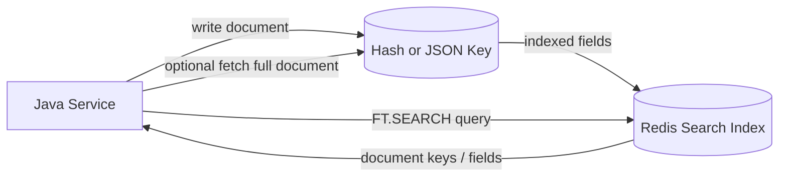
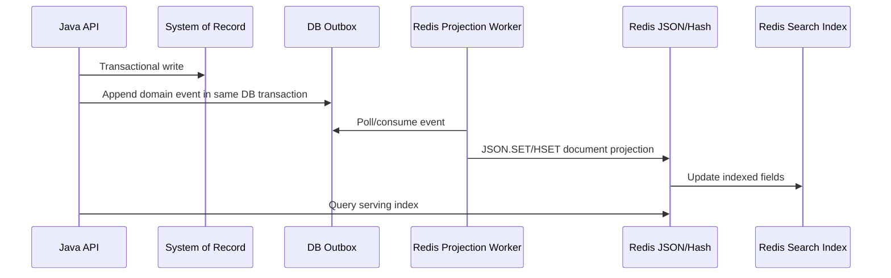
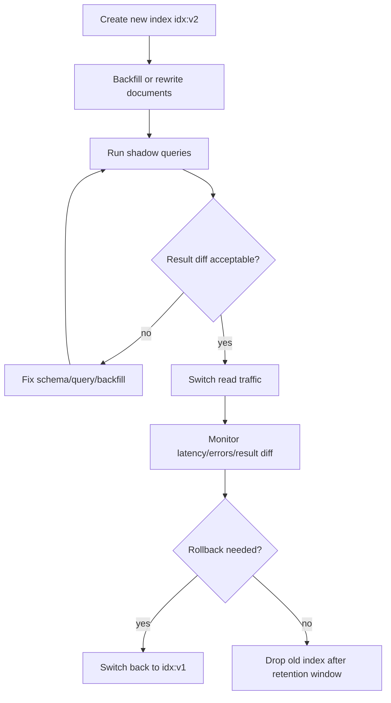

# Part 021 — Search, JSON, Document, and Secondary Index Patterns

Part 020 covered real-time delivery: presence, WebSocket fanout, notifications, and the difference between ephemeral signal and durable state.
Now we move to a different Redis capability:

> Redis as a low-latency document lookup and secondary-index engine.

This part is not about replacing Elasticsearch, PostgreSQL, or a data warehouse.
It is about using Redis Search and Redis JSON deliberately when your application needs fast lookup, filtering, full-text search, document enrichment, personalization, or serving-time retrieval close to the application path.

The mental shift:

> A Redis key gives you primary-key lookup. Redis Search gives you secondary access paths over Hash or JSON documents.

That distinction matters.
Most Redis mistakes in search-like systems happen because engineers blur these roles.
They store a document, build an index, query the index, and then forget which part is source of truth, which part is derived, and which consistency guarantee the user actually sees.

---

## 1. Kaufman Skill Decomposition

The skill is not “run `FT.SEARCH`”.
The real skill is:

> Design Redis-backed document retrieval where data shape, index schema, query access patterns, consistency envelope, memory cost, Java integration, and operational limits are explicit.

Break it down:

| Sub-skill | What you must be able to do |
|---|---|
| Document modeling | Decide whether a document should be a Redis Hash, Redis JSON document, separate keys, or not in Redis at all |
| Access-path design | Identify primary-key, secondary-key, full-text, tag, numeric, geo, and vector access paths |
| Index schema design | Choose `TEXT`, `TAG`, `NUMERIC`, `GEO`, `VECTOR`, and other field types intentionally |
| Query contract design | Define which queries are supported, bounded, paginated, sorted, and safe under load |
| Java command integration | Execute search/document operations safely through a Java client or framework abstraction |
| Consistency modeling | Understand when document write, index update, index creation, reindexing, and cache refresh are visible |
| Memory modeling | Estimate document memory, index memory, result memory, and network payload |
| Cluster modeling | Design key prefixes and hash tags with cluster constraints in mind |
| Failure modeling | Handle stale indexes, missing documents, schema drift, partial write, rebuilds, and query overload |
| Testing | Build golden documents, query fixtures, ranking tests, and migration/reindex tests |

Kaufman practice goal:

> In 20 hours, build a Java service that stores case/product/customer-like documents in Redis JSON, indexes them with Redis Search, supports exact filters, numeric ranges, text search, pagination, and stale-safe fallback. Then run tests for schema migration, partial update, index rebuild, large result sets, and Redis restart.

---

## 2. The Redis Search Mental Model

A normal Redis lookup is primary-key access:

```text
GET user:123
HGETALL product:sku-9001
JSON.GET case:2026:ID-100 $.status
```

This is fast, direct, and predictable.
But it only works when you already know the key.

A secondary index answers questions such as:

```text
Find all active users in tenant A.
Find all products in category laptop with price between 800 and 1200.
Find cases assigned to officer X where severity is high and status is open.
Find documents whose title contains "fraud".
Find nearby stores within a geo radius.
Find embeddings semantically close to this query vector.
```

The index is a derived access structure.
It is not the document itself.



Production rule:

> Treat the index as an optimized query path, not as the only durable record of business truth.

This keeps you honest when you handle rebuilds, migrations, stale reads, and disaster recovery.

---

## 3. Where Redis Search Fits

Redis Search is strong when the query is close to the serving path and latency matters.

Good use cases:

| Use case | Why Redis fits |
|---|---|
| Product/catalog serving | Fast filter + sort + fetch for hot catalog slices |
| Session/user lookup | Query active sessions/users by status, tenant, role, or device |
| Case/task worklist | Filter operational work by status, assignee, severity, SLA, tenant |
| Feature flag targeting | Query target rules and metadata with low latency |
| Notification inbox search | Filter by user, unread state, category, timestamp |
| API gateway metadata lookup | Match route/service/policy documents quickly |
| Personalization context | Retrieve profile/features/documents near request time |
| RAG document metadata | Filter documents by tenant, source, type, time, and vector similarity |

Weak use cases:

| Use case | Better default |
|---|---|
| System of record for complex relational data | PostgreSQL or another transactional database |
| Large-scale analytical queries | OLAP engine, warehouse, lakehouse, ClickHouse, BigQuery, etc. |
| Complex joins | Relational database or search system with denormalized documents |
| Massive full-text search product with advanced relevance tuning | Dedicated search platform may be better |
| Unbounded ad-hoc user queries | Dangerous unless heavily controlled |
| Legal/audit canonical store | Append-only database/event store/object storage, not Redis alone |

A top-tier engineer asks:

> Is Redis Search the serving index, the canonical store, or a temporary acceleration structure?

Most of the time, it should be the serving index.

---

## 4. Manual Secondary Indexes vs Redis Search

Before Redis Search, engineers often built manual indexes using Sets and Sorted Sets.
That is still useful.

### 4.1 Manual Index Example

Suppose we model tasks:

```text
task:{tenant}:{taskId} -> hash/json document
idx:task:{tenant}:status:open -> set of task IDs
idx:task:{tenant}:assignee:u123 -> set of task IDs
idx:task:{tenant}:sla -> sorted set task ID scored by due time
```

Query:

```text
Open tasks assigned to u123 due before now
```

Implementation:

1. `SINTER idx:task:t1:status:open idx:task:t1:assignee:u123`
2. `ZRANGEBYSCORE idx:task:t1:sla -inf now`
3. Intersect client-side or with temporary keys.
4. Fetch documents.

Manual indexes are good when:

- access patterns are tiny and fixed
- field cardinality is predictable
- you need exact membership only
- you can own index mutation logic
- query complexity is low

Manual indexes are risky when:

- you have many fields
- combinations grow quickly
- you need full-text search
- you need numeric range + tag + sort + text together
- you cannot tolerate index drift from application bugs
- reindexing logic becomes complex

### 4.2 Redis Search Index Example

With Redis Search, you define an index over key prefixes and fields:

```text
FT.CREATE idx:task:t1
  ON JSON
  PREFIX 1 task:t1:
  SCHEMA
    $.taskId AS taskId TAG
    $.status AS status TAG
    $.assigneeId AS assigneeId TAG
    $.severity AS severity TAG
    $.dueAtEpochMs AS dueAt NUMERIC SORTABLE
    $.title AS title TEXT
    $.description AS description TEXT
```

Query:

```text
FT.SEARCH idx:task:t1 '@status:{open} @assigneeId:{u123} @dueAt:[-inf 1780000000000]'
```

You move from manually maintaining many side indexes to declaring queryable fields.

Trade-off:

> Redis Search reduces application-side index maintenance, but it introduces index schema, query syntax, memory cost, and search-specific operational behavior.

---

## 5. Redis Hash vs Redis JSON

Redis Search can index Hash and JSON documents.
Choosing between them is a modeling decision.

### 5.1 Redis Hash

Use Hash when:

- object is mostly flat
- fields are scalar strings/numbers
- partial updates are simple
- you want low ceremony
- you do not need nested document paths
- Java mapping is straightforward

Example:

```text
HSET task:t1:9001 \
  taskId 9001 \
  tenantId t1 \
  status open \
  assigneeId u123 \
  severity high \
  dueAtEpochMs 1780000000000 \
  title "Review suspicious account"
```

Index:

```text
FT.CREATE idx:task:t1
  ON HASH
  PREFIX 1 task:t1:
  SCHEMA
    taskId TAG
    status TAG
    assigneeId TAG
    severity TAG
    dueAtEpochMs NUMERIC SORTABLE
    title TEXT
```

Advantages:

- simple
- compact for flat objects
- easy to inspect with CLI
- simple partial field mutation
- natural fit for operational work items

Disadvantages:

- no natural nested structure
- arrays require encoding conventions
- type semantics are mostly application-owned
- complex documents become awkward

### 5.2 Redis JSON

Use JSON when:

- object has nested structure
- arrays matter
- client/server exchange is already JSON
- you need path-based updates
- document shape evolves
- Search needs JSONPath fields

Example:

```text
JSON.SET task:t1:9001 $ '{
  "taskId": "9001",
  "tenantId": "t1",
  "status": "open",
  "assigneeId": "u123",
  "severity": "high",
  "dueAtEpochMs": 1780000000000,
  "title": "Review suspicious account",
  "tags": ["fraud", "kyc"],
  "customer": {
    "id": "c123",
    "riskTier": "high"
  }
}'
```

Index:

```text
FT.CREATE idx:task:t1
  ON JSON
  PREFIX 1 task:t1:
  SCHEMA
    $.taskId AS taskId TAG
    $.status AS status TAG
    $.assigneeId AS assigneeId TAG
    $.severity AS severity TAG
    $.dueAtEpochMs AS dueAt NUMERIC SORTABLE
    $.title AS title TEXT
    $.tags[*] AS tags TAG
    $.customer.riskTier AS customerRiskTier TAG
```

Advantages:

- expressive document model
- natural nested/array representation
- path updates
- aligns with HTTP API payloads
- easier for document-centric use cases

Disadvantages:

- large documents can become expensive
- deeply nested fields increase indexing/retrieval cost
- schema drift can silently weaken queries
- partial updates need discipline
- canonical domain invariants still belong in the application/database

Production default:

> Prefer Hash for flat operational objects. Prefer JSON for nested document read models. Avoid storing huge aggregate objects as one Redis JSON document.

---

## 6. Index Field Types

Index schema is where you declare how Redis should interpret fields.

Common field types:

| Field type | Use for | Example |
|---|---|---|
| `TAG` | exact match, enums, IDs, categories | status, tenantId, assigneeId, sku, country |
| `TEXT` | tokenized full-text search | title, description, comment body |
| `NUMERIC` | range queries, numeric filters | price, dueAt, score, amount |
| `GEO` | geospatial filtering | store location, device location |
| `VECTOR` | embedding similarity search | semantic document retrieval |
| `GEOSHAPE` | shape-based geo queries where supported | polygons, regions |

### 6.1 TAG Fields

Use `TAG` for exact values.

Examples:

```text
@status:{open}
@tenantId:{t1}
@assigneeId:{u123}
@category:{laptop}
```

Design rule:

> IDs, enums, and low-to-medium cardinality categories should usually be `TAG`, not `TEXT`.

Common mistake:

```text
status TEXT
```

Then you accidentally rely on tokenization and text semantics for an enum.
That creates weird behavior.

### 6.2 TEXT Fields

Use `TEXT` for human language.

Examples:

```text
@title:fraud
@description:("identity mismatch")
```

Use cases:

- title search
- description search
- note/comment search
- product name search
- policy text search

Avoid using `TEXT` for:

- IDs
- status values
- tenant IDs
- exact categories
- timestamps

### 6.3 NUMERIC Fields

Use `NUMERIC` for range filters:

```text
@price:[100 500]
@dueAt:[-inf 1780000000000]
@riskScore:[80 100]
```

Important:

> Store time as epoch milliseconds or epoch seconds consistently. Do not mix formats across documents.

### 6.4 SORTABLE Fields

A field can be indexed for sorting.
Sorting adds cost.
Only mark fields sortable if the query contract needs them.

Good candidates:

- createdAt
- updatedAt
- dueAt
- price
- score
- priority

Bad candidates:

- huge text
- rarely used fields
- high-cardinality fields without sort use case

---

## 7. Key Prefix and Index Boundary

Redis Search indexes keys by prefix.
Prefix design becomes part of your schema.

Good:

```text
task:{tenantId}:{taskId}
product:{catalogId}:{sku}
session:{tenantId}:{sessionId}
case:{tenantId}:{caseId}
```

Index per tenant:

```text
FT.CREATE idx:task:t1 ON JSON PREFIX 1 task:t1: SCHEMA ...
```

Index across tenants:

```text
FT.CREATE idx:task ON JSON PREFIX 1 task: SCHEMA $.tenantId AS tenantId TAG ...
```

Trade-off:

| Model | Pros | Cons |
|---|---|---|
| Index per tenant | isolation, small blast radius, easier delete/rebuild | many indexes, operational overhead |
| Shared index with tenant field | fewer indexes, easier global query | strict tenant filter required, bigger index, noisy neighbor risk |
| Index per domain/version | clean migration boundary | more index lifecycle work |

Production rule:

> Tenant isolation should not rely only on the application remembering to add `@tenantId:{...}` to every query if the data has strong isolation requirements.

For strict isolation, prefer separate prefixes, separate indexes, separate Redis logical DBs where appropriate, or separate deployments for high-risk tenants.

---

## 8. Query Contract Design

Search queries must be bounded.
A Redis Search API should not expose arbitrary user query power directly to callers.

Bad API:

```http
GET /tasks/search?q=<raw Redis query>
```

Better API:

```http
GET /tasks?status=open&assigneeId=u123&dueBefore=2026-07-02T00:00:00Z&limit=50&cursor=...
```

Application builds a safe query:

```text
@status:{open} @assigneeId:{u123} @dueAt:[-inf 1780000000000]
```

The service owns:

- allowed fields
- allowed operators
- maximum limit
- default sort
- tenant filter
- escaping rules
- timeout
- fallback behavior

### 8.1 Query Builder Boundary

Do not concatenate raw user input into query strings without escaping.

Create a small internal builder:

```java
public final class RedisSearchQueryBuilder {
    private final List<String> clauses = new ArrayList<>();

    public RedisSearchQueryBuilder tag(String field, String value) {
        if (value == null || value.isBlank()) return this;
        clauses.add("@" + safeField(field) + ":{" + escapeTag(value) + "}");
        return this;
    }

    public RedisSearchQueryBuilder numericMax(String field, long maxInclusive) {
        clauses.add("@" + safeField(field) + ":[-inf " + maxInclusive + "]");
        return this;
    }

    public RedisSearchQueryBuilder text(String field, String phrase) {
        if (phrase == null || phrase.isBlank()) return this;
        clauses.add("@" + safeField(field) + ":" + escapeText(phrase));
        return this;
    }

    public String build() {
        return clauses.isEmpty() ? "*" : String.join(" ", clauses);
    }
}
```

The escaping functions are not optional.
They are part of the security and correctness boundary.

### 8.2 Pagination

Avoid deep offset pagination.

Bad:

```text
LIMIT 100000 50
```

Why:

- Redis still has to walk/score/skip a large result set
- result latency grows
- memory and CPU pressure increase
- page drift occurs when data changes

Better:

- limit result windows
- use sortable cursor field where possible
- use stable ordering
- use time/ID seek pagination
- expose continuation token owned by the service

Example seek-style API:

```http
GET /tasks?status=open&beforeDueAt=1780000000000&limit=50
```

Next page uses last returned dueAt/taskId.

---

## 9. Document Retrieval Patterns

There are several retrieval patterns.

### 9.1 Search Returns Full Fields

```text
FT.SEARCH idx:task:t1 '@status:{open}' RETURN 4 $.taskId $.title $.status $.dueAtEpochMs LIMIT 0 50
```

Good for list screens.

Pros:

- one round-trip
- smaller payload if you return only needed fields
- simple list rendering

Cons:

- fields must be in index/document response
- not always enough for detail view
- returned data may not match application DTO exactly

### 9.2 Search Returns Keys, Then Fetch Documents

```text
FT.SEARCH idx:task:t1 '@status:{open}' NOCONTENT LIMIT 0 50
JSON.MGET task:t1:1 task:t1:2 task:t1:3 $
```

Good when:

- detail payload is needed
- application owns DTO conversion
- you want a stable document fetch path

Pros:

- index used only for candidate selection
- document fetch path remains explicit
- easier to handle missing docs

Cons:

- second round-trip unless pipelined
- possible document/index race
- more client-side logic

### 9.3 Hybrid Projection

Use Redis Search for list projection, then fetch detail on click.

This is usually the cleanest UI pattern:

- search result: small projection
- detail view: canonical document fetch
- edit/update: write to primary database, then update Redis read model

---

## 10. Write Path Design

Search-backed Redis documents are often read models.
That means the write path may start elsewhere.

Common production flow:



This separates correctness from serving speed.

Important:

> If Redis is a projection, missing Redis data should be rebuildable from the source of truth.

Direct write to Redis may be acceptable when Redis itself is the operational state store, such as sessions, presence, temporary worklists, feature targeting cache, or ephemeral metadata.

For durable business records, prefer source-of-truth first.

---

## 11. Consistency Envelope

A Redis Search index is updated as documents change, but you still need to model consistency.

Cases:

| Scenario | Risk | Mitigation |
|---|---|---|
| New index over existing documents | Backfill/index build may take time | expose readiness check before switching traffic |
| Document write succeeds but app times out | caller may retry and duplicate side effects | idempotent write model |
| Query returns key but document missing | delete/write race, TTL, manual deletion | tolerate missing docs and repair index/key lifecycle |
| Document exists but not found | wrong prefix/schema/field type or index build lag | schema tests and index readiness checks |
| Field format changes | query silently stops matching | versioned schema and golden fixtures |
| Large result set | CPU/network pressure | strict limits and query budgets |

Production read rule:

> Search results are candidates. The application still validates tenant, visibility, authorization, and document existence.

Never rely on index filters alone for authorization.

---

## 12. Schema Versioning

Your index schema will change.
Plan for it.

### 12.1 Versioned Key Prefix

```text
task:v1:{tenant}:{taskId}
task:v2:{tenant}:{taskId}
```

Pros:

- clean separation
- easy rebuild
- old/new can run side by side

Cons:

- duplicate memory during migration
- application must route correctly

### 12.2 Versioned Index Name

```text
idx:task:v1
idx:task:v2
```

Migration plan:

1. Create `idx:task:v2`.
2. Backfill/rewrite documents if needed.
3. Run shadow queries.
4. Compare result sets.
5. Switch read traffic.
6. Keep rollback path.
7. Drop old index after confidence window.

### 12.3 Document Envelope

```json
{
  "schemaVersion": 2,
  "id": "9001",
  "tenantId": "t1",
  "status": "open",
  "payload": {
    "title": "Review suspicious account"
  }
}
```

Index `schemaVersion` when mixed versions may coexist.

---

## 13. Java Integration Options

You have several integration paths.

### 13.1 Direct Redis Commands

Direct command execution gives maximum control.

Pseudocode with a low-level command interface:

```java
public interface RedisCommandExecutor {
    Object execute(String command, String... args);
}
```

Usage:

```java
executor.execute(
    "FT.SEARCH",
    "idx:task:t1",
    "@status:{open} @assigneeId:{u123}",
    "SORTBY", "dueAt", "ASC",
    "LIMIT", "0", "50"
);
```

Pros:

- no abstraction mismatch
- all Redis Search features accessible
- easy to reason about actual commands

Cons:

- result parsing is manual
- escaping/query building is your responsibility
- testing must be stronger

### 13.2 Jedis / Redis Stack APIs

Jedis includes APIs for Redis core and modern data types in Redis client documentation examples.
This is often practical for synchronous Java services.

Pattern:

```java
public final class TaskSearchRepository {
    private final UnifiedJedis jedis;
    private final RedisSearchQueryBuilder queryBuilder;

    public List<TaskSummary> findOpenTasks(TaskFilter filter) {
        String query = queryBuilder
            .tag("tenantId", filter.tenantId())
            .tag("status", "open")
            .tag("assigneeId", filter.assigneeId())
            .numericMax("dueAt", filter.dueBeforeEpochMs())
            .build();

        // Use the client's search command support or execute raw FT.SEARCH.
        // Keep the actual command mapping isolated in this repository.
        return executeTaskSearch(query, filter.limit());
    }
}
```

Design rule:

> Hide Redis Search result parsing inside a repository/adapter. Do not leak raw search response shape into business services.

### 13.3 Spring Data Redis

Spring Data Redis is useful for:

- connection factory
- RedisTemplate
- serializers
- cache integration
- simple operations

But search/document modules may require direct command execution, a Redis-specific extension, or a specialized library depending on your stack version.

Production advice:

> Use Spring for wiring and lifecycle. Keep Redis Search command semantics visible in a focused adapter.

Do not bury query correctness inside magic annotations unless your team fully understands generated indexes, query behavior, and migration path.

### 13.4 Redis OM Spring

Redis OM Spring can map Java objects to Redis Hash/JSON documents and indexes using a Spring Data-like style.
This can be productive for CRUD/search applications.

Use it when:

- the team accepts framework conventions
- generated schema is reviewed
- query use cases are relatively straightforward
- performance tests cover the generated behavior

Be cautious when:

- query patterns are highly customized
- you need exact command-level control
- index lifecycle is complex
- schema migrations are frequent and business-critical

---

## 14. Example: Operational Task Search Service

Imagine a Java service for operational task worklists.

Requirements:

- filter by tenant
- filter by status
- filter by assignee
- filter by severity
- due-before filter
- title search
- stable sort by due date
- max page size 100
- hide closed tasks by default

### 14.1 Document Shape

```json
{
  "taskId": "9001",
  "tenantId": "t1",
  "status": "open",
  "assigneeId": "u123",
  "severity": "high",
  "dueAtEpochMs": 1780000000000,
  "title": "Review suspicious account",
  "description": "KYC mismatch and repeated failed verification attempts",
  "createdAtEpochMs": 1779900000000,
  "updatedAtEpochMs": 1779950000000
}
```

### 14.2 Key

```text
task:t1:9001
```

### 14.3 Index

```text
FT.CREATE idx:task:t1
  ON JSON
  PREFIX 1 task:t1:
  SCHEMA
    $.taskId AS taskId TAG
    $.tenantId AS tenantId TAG
    $.status AS status TAG
    $.assigneeId AS assigneeId TAG
    $.severity AS severity TAG
    $.dueAtEpochMs AS dueAt NUMERIC SORTABLE
    $.createdAtEpochMs AS createdAt NUMERIC SORTABLE
    $.updatedAtEpochMs AS updatedAt NUMERIC SORTABLE
    $.title AS title TEXT
    $.description AS description TEXT
```

### 14.4 Query Object

```java
public record TaskSearchFilter(
    String tenantId,
    String status,
    String assigneeId,
    String severity,
    Long dueBeforeEpochMs,
    String text,
    int limit
) {
    public TaskSearchFilter {
        if (tenantId == null || tenantId.isBlank()) {
            throw new IllegalArgumentException("tenantId is required");
        }
        if (limit <= 0 || limit > 100) {
            throw new IllegalArgumentException("limit must be between 1 and 100");
        }
    }
}
```

### 14.5 Query Builder

```java
public String toRedisQuery(TaskSearchFilter f) {
    RedisSearchQueryBuilder q = new RedisSearchQueryBuilder()
        .tag("tenantId", f.tenantId());

    q.tag("status", f.status() == null ? "open" : f.status());
    q.tag("assigneeId", f.assigneeId());
    q.tag("severity", f.severity());

    if (f.dueBeforeEpochMs() != null) {
        q.numericMax("dueAt", f.dueBeforeEpochMs());
    }

    if (f.text() != null && !f.text().isBlank()) {
        q.text("title", f.text());
    }

    return q.build();
}
```

### 14.6 Repository Contract

```java
public interface TaskSearchRepository {
    List<TaskSummary> search(TaskSearchFilter filter);
    Optional<TaskDocument> getById(String tenantId, String taskId);
    void upsert(TaskDocument document);
    void delete(String tenantId, String taskId);
}
```

Separate the repository from domain service logic.
That makes it testable and replaceable.

---

## 15. Index Rebuild Playbook

Index rebuilds are normal.
You need a repeatable playbook.



Rebuild checklist:

- index name versioned
- query contract versioned
- representative query fixtures exist
- sample result diff is measured
- traffic switch is controlled
- rollback path exists
- index memory budget is checked
- slow query monitoring enabled
- old index removal is scheduled

---

## 16. Memory and Performance Engineering

Redis Search adds memory cost.
Every indexed field is not free.

Cost drivers:

| Driver | Why it matters |
|---|---|
| Number of documents | more entries in index structures |
| Number of indexed fields | more metadata and inverted structures |
| Text field size | tokenization and term index growth |
| Sortable fields | additional sort structures |
| High-cardinality tags | large tag dictionaries/posting lists |
| Large JSON documents | memory, CPU, network, indexing overhead |
| Deep JSON paths | path traversal and indexing cost |
| Large result sets | response memory and network pressure |

Rules of thumb:

- index only fields needed by query contract
- do not index fields “just in case”
- keep list projections small
- avoid huge documents
- flatten frequently queried fields
- put cold detail fields elsewhere if needed
- cap result size
- benchmark realistic query mix

The most expensive query is usually not the clever one.
It is the one someone forgot to bound.

---

## 17. Cluster Considerations

Redis Cluster distributes keys by hash slot.
Redis Search adds more topology considerations.

Design questions:

- Is your Redis deployment standalone, Sentinel, Cluster, or managed service?
- Are Search/JSON commands supported in that deployment?
- Does the Java client route Search commands correctly?
- Are indexes local or distributed in your product/deployment mode?
- Are multi-key fetches cross-slot?
- Do your key prefixes align with tenant/domain boundaries?

Cluster-safe key naming still matters:

```text
task:{t1}:9001
task:{t1}:9002
```

Hash tags can colocate keys for a tenant, but overusing them can create hot shards.

Production warning:

> Do not solve every multi-key concern with one giant hash tag. You may accidentally concentrate a tenant, category, or workload on one shard.

---

## 18. Security and Authorization

Search is dangerous if exposed carelessly.

Security rules:

- never expose raw query syntax to untrusted callers
- always enforce tenant scope in service logic
- validate result document authorization after query
- escape user input
- cap limits
- restrict sortable fields
- restrict searchable fields
- avoid leaking document existence across tenants
- use ACLs with least privilege
- separate admin index operations from application query operations

Bad:

```java
String query = request.getParameter("q");
redis.ftSearch("idx:cases", query);
```

Better:

```java
TaskSearchFilter filter = parseAndValidate(request);
String query = safeQueryBuilder.from(filter, authenticatedTenantId);
List<TaskSummary> results = repository.search(query);
return results.stream()
    .filter(authz::canView)
    .toList();
```

Index query is not authorization.
It is candidate retrieval.

---

## 19. Failure Modes

| Failure | Symptom | Root cause | Mitigation |
|---|---|---|---|
| Missing search result | document exists but not found | wrong prefix, schema mismatch, index not ready | schema tests, index readiness, backfill validation |
| Ghost result | query returns deleted document | TTL/delete race, stale result, manual side index drift | fetch/validate doc, cleanup job |
| Slow query | p99 spikes | unbounded query, sort, huge result, large docs | query budgets, limits, projections, monitoring |
| Memory explosion | Redis memory climbs after index | over-indexing, large text fields, sortable abuse | memory budget, schema review |
| Tenant leak | user sees other tenant data | missing tenant filter or shared index bug | hard tenant boundary, authz validation |
| Schema drift | field no longer matches | application changed JSON field name/type | versioned schema and golden payload tests |
| Rebuild outage | queries return inconsistent results | index switched before ready | shadow queries and cutover gate |
| Client parser failure | runtime exception | raw result shape changed | adapter tests with real Redis |

---

## 20. Testing Strategy

### 20.1 Golden Documents

Create fixture documents that represent:

- minimal document
- full document
- unknown optional fields
- nested fields
- array fields
- old schema version
- new schema version
- special characters
- multi-tenant cases

### 20.2 Query Fixtures

For each supported API filter, define expected IDs:

```text
status=open -> [9001, 9002]
status=open + assignee=u123 -> [9001]
dueBefore=1780000000000 -> [9001, 9003]
text="fraud" -> [9001, 9010]
tenant=t2 must never return t1 documents
```

### 20.3 Migration Tests

Test:

- v1 documents are indexed correctly
- v2 documents are indexed correctly
- v1 and v2 side-by-side queries behave as expected
- index rebuild produces expected count
- old index rollback still works

### 20.4 Performance Tests

Test with realistic:

- document count
- field cardinality
- text size
- query mix
- sort fields
- pagination style
- concurrent writes
- concurrent reads

Measure:

- p50/p95/p99 query latency
- Redis CPU
- command stats
- memory used by dataset + index
- response payload size
- Java client latency
- timeouts and retries

---

## 21. Production Checklist

Before using Redis Search in production:

- [ ] Is Redis a projection, cache, or source of truth?
- [ ] Is the key prefix strategy explicit?
- [ ] Are tenant boundaries enforced outside the query too?
- [ ] Is the index schema versioned?
- [ ] Are only necessary fields indexed?
- [ ] Are large/deep JSON documents avoided?
- [ ] Are query limits enforced?
- [ ] Is raw query syntax hidden from external callers?
- [ ] Are user values escaped?
- [ ] Is pagination bounded?
- [ ] Is result authorization validated?
- [ ] Is index rebuild tested?
- [ ] Is rollback tested?
- [ ] Are slow queries observable?
- [ ] Is memory budget validated under production-like data?
- [ ] Is Java result parsing isolated and tested?

---

## 22. Kaufman 20-Hour Practice Plan

| Hour | Practice |
|---:|---|
| 1 | Model 5 query use cases and decide Hash vs JSON |
| 2 | Design key prefixes and index schema |
| 3 | Create local Redis with Search/JSON support |
| 4 | Insert fixture documents |
| 5 | Create `FT.CREATE` indexes |
| 6 | Run exact TAG queries |
| 7 | Run NUMERIC range queries |
| 8 | Run TEXT search queries |
| 9 | Implement Java query builder |
| 10 | Implement repository adapter |
| 11 | Add result projection DTO |
| 12 | Add safe input escaping and validation |
| 13 | Add tenant isolation tests |
| 14 | Add schema drift tests |
| 15 | Add pagination limits |
| 16 | Add index rebuild v1/v2 test |
| 17 | Add performance dataset generator |
| 18 | Measure memory and p99 latency |
| 19 | Simulate missing doc/ghost result |
| 20 | Write production readiness review |

---

## 23. Key Takeaways

- Redis primary keys give direct lookup; Redis Search gives secondary access paths.
- Indexes are derived structures, not a replacement for explicit business truth.
- Hash is usually better for flat operational records; JSON is better for nested document read models.
- `TAG`, `TEXT`, and `NUMERIC` fields have different semantics. Do not use them interchangeably.
- Query APIs should expose business filters, not raw Redis query strings.
- Search results are candidates. Validate document existence, tenant, and authorization.
- Index schema must be versioned and rebuildable.
- Memory grows with documents, fields, text, sortability, and result size.
- The best Redis Search systems are boring: bounded queries, small projections, tested migrations, observable latency, and clear ownership of source-of-truth vs serving index.

Next part:

> Part 022 — Time Series, Metrics, Probabilistic Structures, and Approximation
