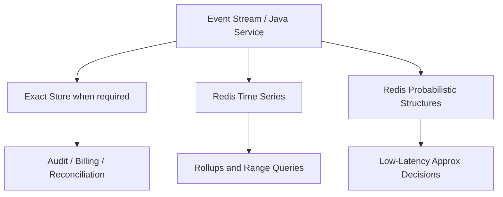
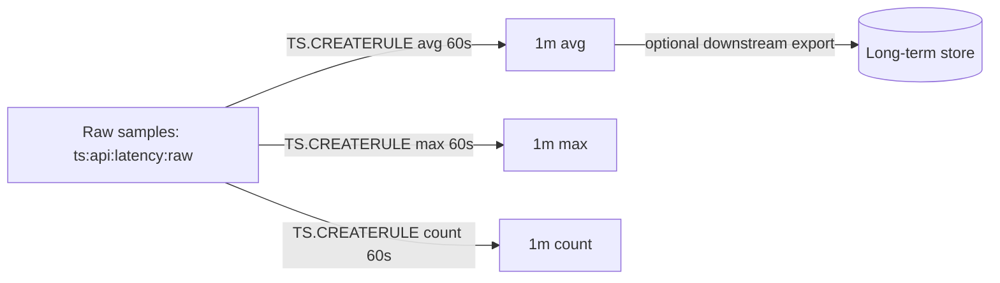
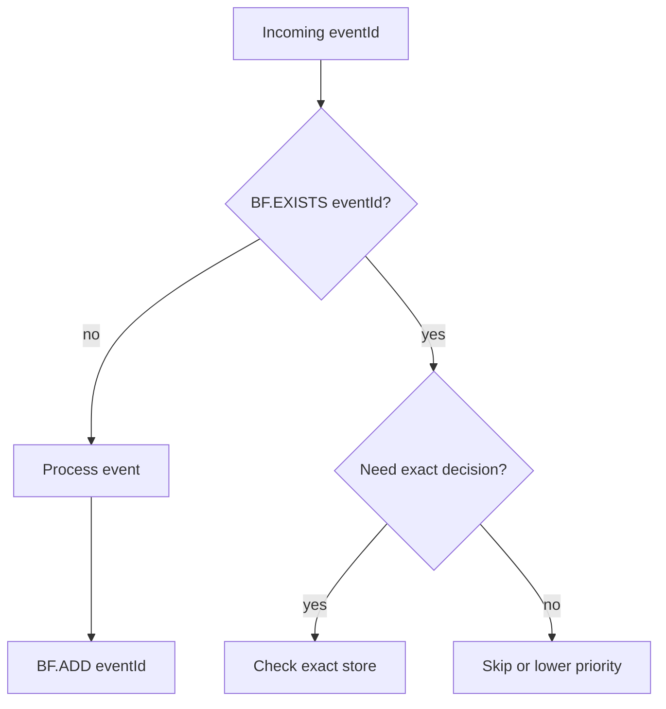
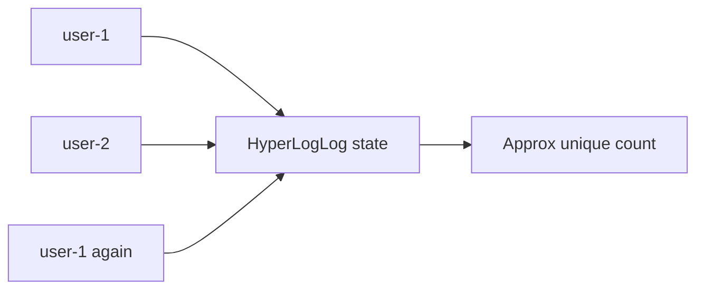
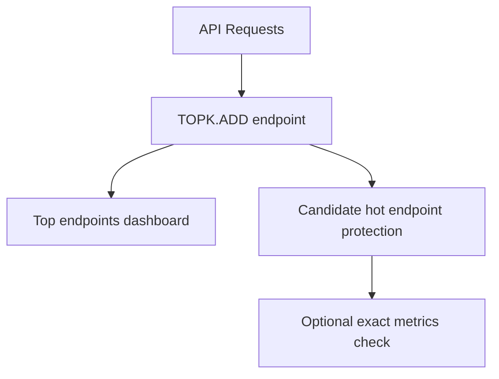
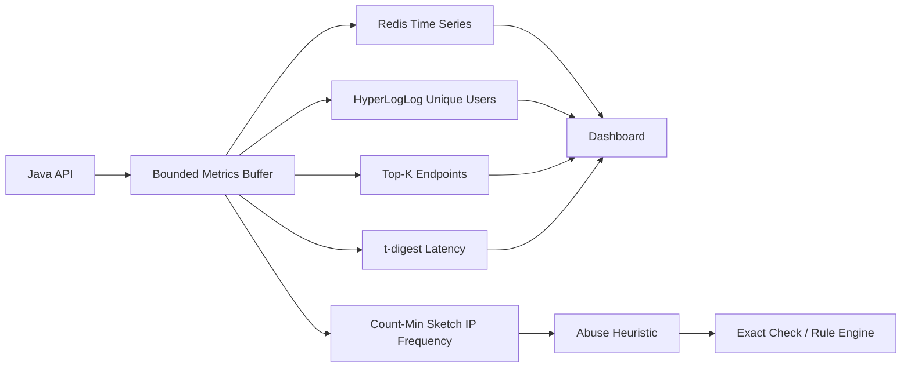
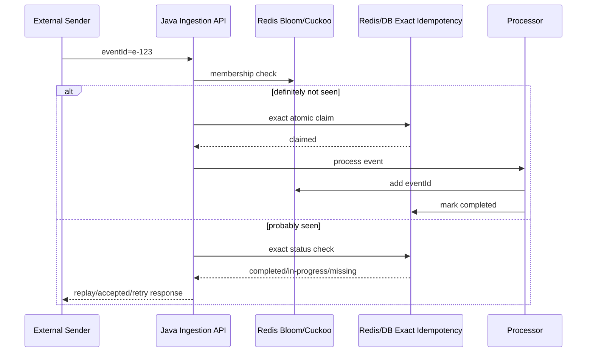
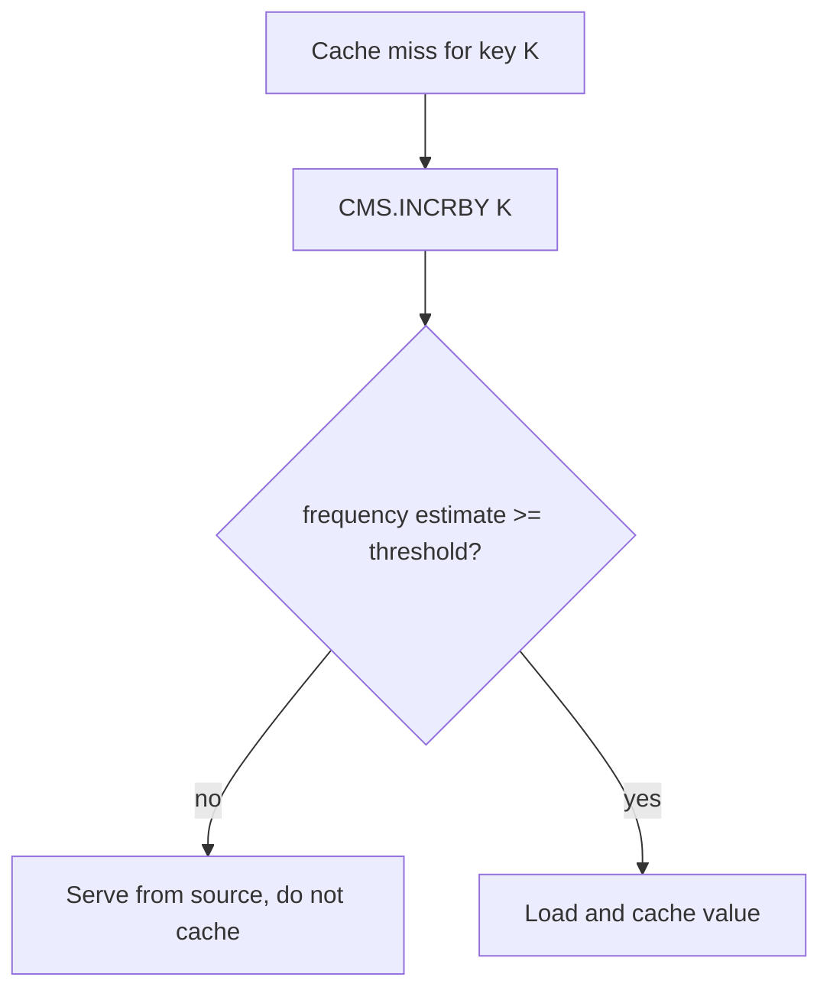

# Part 022 — Time Series, Metrics, Probabilistic Structures, and Approximation

Part 021 covered Redis Search, JSON, document modeling, and secondary indexes.
Now we move to Redis capabilities that are easy to underestimate:

> Time series and probabilistic data structures.

These are not just “extra modules”.
In modern Redis, they are part of a broader serving-time data platform story:

- record values over time
- query recent measurements quickly
- compact raw events into rollups
- count approximate uniques
- test approximate membership
- estimate frequencies
- find heavy hitters
- estimate percentiles

The important mental model:

> Not every production question needs exact relational truth. Some questions need bounded, low-latency, memory-efficient approximation.

This is a major mark of senior engineering judgment.
Junior engineers often default to exactness everywhere.
Strong engineers ask:

- What decision will this number drive?
- What error is tolerable?
- What latency is required?
- What memory budget is available?
- Is the result user-visible, billing-visible, audit-visible, or only operational?
- Can approximation reduce system cost without compromising correctness?

---

## 1. Kaufman Skill Decomposition

The skill is not “use `TS.ADD` or `BF.ADD`”.
The real skill is:

> Design low-latency measurement and approximation systems where retention, aggregation, cardinality, error bounds, memory, and decision impact are explicit.

Breakdown:

| Sub-skill | What you must be able to do |
|---|---|
| Measurement modeling | Decide what value is measured, at what timestamp, with what labels and units |
| Retention design | Decide how long raw samples and rollups should live |
| Compaction design | Convert raw samples into aggregates without exploding memory |
| Label design | Make time series discoverable without creating unbounded cardinality |
| Query design | Support range, latest, multi-series query, and rollup lookup safely |
| Approximation design | Choose Bloom, Cuckoo, HyperLogLog, Count-Min Sketch, Top-K, or t-digest appropriately |
| Error reasoning | Explain false positives, over-counting, standard error, percentile approximation, and deletion constraints |
| Java integration | Ingest and query from Java safely with batching, retries, and bounded payloads |
| Operational safety | Monitor memory, key cardinality, ingestion lag, compaction, and query cost |
| Correctness boundary | Know when approximation is unacceptable |

Kaufman practice goal:

> In 20 hours, build a Java Redis metrics/analytics service that records API latency and request count as time series, builds rollups, estimates unique users with HyperLogLog, rejects likely duplicate event IDs with Bloom/Cuckoo filters, estimates top endpoints with Top-K, and estimates latency percentiles with t-digest. Then document where each approximation is allowed and where exact data remains required.

---

## 2. Two Classes of Redis Analytics Data

Redis is useful for two broad classes of analytics-like serving data.

### 2.1 Time-Indexed Measurements

Examples:

- API latency per endpoint per minute
- active sessions per tenant over time
- order attempts per payment provider
- queue depth by worker group
- fraud score average by rule version
- CPU/memory/application metrics
- rate limiter counters over time
- number of open tasks by severity

These need a timestamp and a value.
Redis Time Series is designed for this.

### 2.2 Approximate Stream Summaries

Examples:

- approximate unique users today
- whether an event ID has likely been seen
- most common error codes
- top products viewed in the last hour
- frequency estimate for a suspicious IP
- p95/p99 latency from a stream of observations

These do not necessarily need every raw event stored forever.
Probabilistic structures fit here.



Production rule:

> Approximate structures accelerate decisions. They should not replace exact audit or billing records unless the domain explicitly accepts approximation.

---

## 3. Redis Time Series Mental Model

A time series is a sequence of samples:

```text
(timestamp, value)
```

Example:

```text
api.latency:tenant:t1:endpoint:/orders:p95
  2026-07-02T10:00:00Z -> 142.0
  2026-07-02T10:01:00Z -> 151.0
  2026-07-02T10:02:00Z -> 139.0
```

Redis Time Series adds:

- retention
- labels
- range queries
- latest sample query
- multi-series queries by label filter
- compaction rules
- aggregation over time buckets
- duplicate timestamp policy

Core commands conceptually:

```text
TS.CREATE key RETENTION retentionMs LABELS tenant t1 endpoint /orders metric latency
TS.ADD key timestamp value
TS.GET key
TS.RANGE key fromTimestamp toTimestamp AGGREGATION avg bucketMs
TS.MGET FILTER tenant=t1 metric=latency
TS.MRANGE from to FILTER tenant=t1 metric=latency
TS.CREATERULE rawKey rollupKey AGGREGATION avg bucketMs
```

The server stores time-indexed samples and can aggregate them by time bucket.

---

## 4. Time Series Key and Label Design

You need both key naming and labels.

Key naming gives direct lookup.
Labels give discovery/query.

Example key:

```text
ts:api:latency:{tenant:t1}:endpoint:orders:create
```

Labels:

```text
tenant=t1
service=order-api
endpoint=/orders
method=POST
metric=latency_ms
stat=raw
```

### 4.1 Key Design Rules

Good keys:

```text
ts:{tenant}:api:{service}:{metric}:{endpointHash}
ts:{tenant}:queue:{queueName}:depth
ts:{tenant}:payment:{provider}:attempts
ts:{tenant}:case:{severity}:open_count
```

Avoid:

```text
ts:latency:random-user-id:full-url-with-query-string
```

Why:

- unbounded user IDs explode cardinality
- raw URLs create huge keyspace
- query strings introduce accidental high cardinality
- labels become unusable

### 4.2 Label Cardinality

Labels are powerful, but they can create operational pain.

Good labels:

- tenant
- service
- environment
- endpoint template
- metric name
- provider
- status class
- region
- version

Dangerous labels:

- user ID
- request ID
- session ID
- raw URL
- arbitrary error message
- full stack trace hash
- unbounded customer-provided values

Rule:

> Labels should describe dimensions you intentionally query, not every attribute attached to an event.

---

## 5. Retention and Rollup Design

Time series without retention becomes memory leak with timestamps.

### 5.1 Retention Layers

Typical design:

| Layer | Resolution | Retention | Use |
|---|---:|---:|---|
| Raw | per event or per second | 1-6 hours | debugging recent spikes |
| 1-minute rollup | 60 seconds | 7-30 days | dashboards and alerting |
| 1-hour rollup | 1 hour | 90-400 days | trends and capacity planning |
| Daily rollup | 1 day | years if needed | reporting, but maybe better in warehouse |

Redis is strongest for hot/recent operational windows.
For long-term analytics, export to durable analytical storage.

### 5.2 Compaction Rule Mental Model

Compaction converts raw series into aggregated series.



Example:

```text
TS.CREATE ts:api:orders:latency:raw RETENTION 21600000 LABELS tenant t1 metric latency_ms stat raw
TS.CREATE ts:api:orders:latency:avg:1m RETENTION 2592000000 LABELS tenant t1 metric latency_ms stat avg window 1m
TS.CREATERULE ts:api:orders:latency:raw ts:api:orders:latency:avg:1m AGGREGATION avg 60000
```

Design advice:

> Rollups should be created from raw series when possible. Do not make every service independently compute incompatible rollups.

---

## 6. Java Time Series Ingestion

A service should not perform one blocking Redis round-trip per metric under heavy traffic.

### 6.1 Simple Ingestion API

```java
public record MetricSample(
    String tenantId,
    String service,
    String metric,
    String dimension,
    long timestampMs,
    double value
) {}

public interface TimeSeriesWriter {
    void add(MetricSample sample);
    void addBatch(List<MetricSample> samples);
}
```

### 6.2 Key Resolver

```java
public final class TimeSeriesKeyResolver {
    public String key(MetricSample sample) {
        String safeDimension = stableDimension(sample.dimension());
        return "ts:{" + sample.tenantId() + "}:" +
               sample.service() + ":" +
               sample.metric() + ":" +
               safeDimension;
    }

    private String stableDimension(String dimension) {
        // Convert endpoint templates or known dimensions into safe key segments.
        // Hash high-cardinality strings if absolutely necessary, but do not hide bad cardinality.
        return dimension.replace('/', '_').replace(':', '_');
    }
}
```

### 6.3 Batch Writes

For high-volume services:

- buffer samples briefly
- use `TS.MADD` where available
- pipeline writes
- drop non-critical metrics under pressure if policy allows
- never let optional metrics take down core business request path

Pseudocode:

```java
public final class BufferedRedisTimeSeriesWriter implements TimeSeriesWriter {
    private final BlockingQueue<MetricSample> queue = new ArrayBlockingQueue<>(50_000);
    private final RedisTimeSeriesClient client;
    private final TimeSeriesKeyResolver keyResolver;

    @Override
    public void add(MetricSample sample) {
        boolean accepted = queue.offer(sample);
        if (!accepted) {
            // Metrics are operational signals, not business state.
            // Count drops locally and expose a health metric.
            Metrics.droppedRedisTimeSeriesSamples.increment();
        }
    }

    public void flushLoop() {
        List<MetricSample> batch = new ArrayList<>(1000);
        while (!Thread.currentThread().isInterrupted()) {
            drainBatch(batch, 1000);
            if (!batch.isEmpty()) {
                client.madd(batch.stream()
                    .map(s -> new TsAdd(keyResolver.key(s), s.timestampMs(), s.value()))
                    .toList());
                batch.clear();
            }
        }
    }
}
```

The exact client API depends on your Redis Java client.
The architectural point is stable:

> Metrics ingestion should be buffered, bounded, observable, and failure-isolated from critical business execution.

---

## 7. Query Patterns for Time Series

### 7.1 Latest Value

Use for current state dashboards:

```text
TS.GET ts:{t1}:queue:payment:depth
```

Examples:

- current queue depth
- current active users
- latest success rate
- latest risk score average

### 7.2 Range Query

Use for graphs:

```text
TS.RANGE ts:{t1}:api:order-api:latency_ms:create_order 1780000000000 1780003600000
```

Add aggregation for chart resolution:

```text
TS.RANGE key from to AGGREGATION avg 60000
```

Never return millions of raw samples to a UI.
Choose resolution based on display width.

### 7.3 Multi-Series Query

Use labels:

```text
TS.MRANGE 1780000000000 1780003600000
  FILTER tenant=t1 service=order-api metric=latency_ms stat=avg
```

Useful for:

- all endpoints in a service
- all providers in a tenant
- all severity counts
- all regions for a metric

But label queries depend on label cardinality discipline.

---

## 8. Time Series Failure Modes

| Failure | Symptom | Root cause | Mitigation |
|---|---|---|---|
| Key explosion | memory grows rapidly | high-cardinality dimensions | dimension allowlist, template URLs, cardinality alerts |
| Missing samples | gaps in chart | dropped metrics, Redis outage, client backpressure | expose drop count, tolerate gaps, export critical metrics elsewhere |
| Duplicate timestamp conflict | write errors or overwritten values | multiple writers same timestamp/key | define duplicate policy and aggregation model |
| Wrong units | graph nonsense | ms vs seconds, count vs rate | unit in metric name/label, schema registry |
| Rollup mismatch | inconsistent dashboards | services compute different aggregation | centralize rollup rules |
| Long query latency | dashboard slow | raw query over huge range | use rollups, cap windows |
| Metrics impact business path | request latency spikes | synchronous metric writes | buffer/async/fail-open metrics path |

Production rule:

> Redis metrics should help you operate the system. They should not become a new reason the system fails.

---

## 9. Probabilistic Structures: Why They Matter

Probabilistic structures trade exactness for memory and speed.

This sounds dangerous until you classify the decision.

Approximation is acceptable for:

- prefiltering
- recommendation candidate reduction
- anomaly hints
- approximate unique counts
- rough popularity ranking
- capacity dashboards
- abuse detection signals
- cache admission decisions

Approximation is usually unacceptable for:

- billing
- legal/audit evidence
- exact entitlement checks
- financial ledger mutation
- regulatory deadlines
- irreversible account closure
- final fraud verdict without review

The principle:

> Approximation can inform a decision. It should not silently become the decision when the domain requires exactness.

---

## 10. Bloom Filter

A Bloom filter answers:

> Have we probably seen this item before?

It has:

- no false negatives, assuming correct use and no corruption
- possible false positives
- very efficient memory usage
- no normal deletion in standard Bloom filter model

Meaning:

| Result | Interpretation |
|---|---|
| says “not present” | definitely not present |
| says “present” | probably present |

Use cases:

- duplicate event prefilter
- known bad token/card/IP precheck
- cache penetration protection
- URL/crawl dedup hint
- username/model-name duplicate check before exact DB check
- feature exposure “seen before” check

### 10.1 Bloom Filter Pattern



Design rule:

> Bloom filter is excellent as a prefilter. For correctness-critical deduplication, pair it with an exact idempotency record.

### 10.2 Sizing

Bloom filters require explicit error-rate thinking.

Example target:

```text
Expected capacity: 10,000,000 event IDs/day
False positive rate: 0.1%
Retention: daily filter, keep 3 days
```

If a false positive means “we skip a legitimate payment event,” the rate is not acceptable.
If a false positive means “we perform an exact DB check,” it may be very acceptable.

---

## 11. Cuckoo Filter

A Cuckoo filter also answers membership-like questions.
Compared with Bloom filters, Cuckoo filters typically support deletion and can be faster for lookups in some cases.

Use Cuckoo filter when:

- you need approximate membership
- you need deletion
- the dataset is dynamic
- false positives are acceptable

Use Bloom filter when:

- insertion-heavy workload
- deletion not needed
- simple scalable membership test is enough

Example:

```text
CF.ADD seen:user:t1 user-123
CF.EXISTS seen:user:t1 user-123
CF.DEL seen:user:t1 user-123
```

Caution:

> Deletion support does not make Cuckoo filters exact. False positives are still part of the contract.

---

## 12. HyperLogLog

HyperLogLog answers:

> Approximately how many unique elements have appeared?

It does not remember the elements.
It estimates cardinality.

Use cases:

- daily active users
- unique IPs per endpoint
- unique products viewed
- unique devices per tenant
- unique customers per campaign

Commands conceptually:

```text
PFADD hll:active-users:2026-07-02 user-1 user-2 user-3
PFCOUNT hll:active-users:2026-07-02
PFMERGE hll:active-users:week-2026-W27 hll:active-users:2026-07-01 hll:active-users:2026-07-02
```

Mental model:



Advantages:

- tiny memory relative to exact Sets
- mergeable across time/windows
- good for dashboards and capacity estimates

Disadvantages:

- cannot list members
- approximate count only
- not suitable for exact entitlement/billing

Production rule:

> If someone asks “which users?”, HyperLogLog is the wrong structure. If they ask “roughly how many unique users?”, it may be perfect.

---

## 13. Count-Min Sketch

Count-Min Sketch answers:

> Approximately how often has this item occurred?

It can over-count due to collisions.
It generally does not under-count in the standard model.

Use cases:

- frequency estimate per IP
- endpoint hit estimates
- fraud rule hit counts
- product view frequencies
- API key usage estimation
- cache admission policy

Example:

```text
CMS.INCRBY cms:endpoints /orders 1 /payments 1 /orders 1
CMS.QUERY cms:endpoints /orders /payments
```

Interpretation:

```text
/orders -> maybe 2 or more
/payments -> maybe 1 or more
```

The value is an estimate.

Use Count-Min Sketch when:

- exact per-item counters would be too many
- approximate frequency is enough
- over-count is acceptable
- you need very low memory growth

Do not use it for:

- exact quota enforcement
- billing counters
- compliance counters
- final fraud decisions without exact verification

---

## 14. Top-K

Top-K answers:

> Which items are probably among the most frequent?

Use cases:

- top endpoints
- top error codes
- top products
- top search terms
- top suspicious IPs
- top rule hits
- top tenants by traffic

Example:

```text
TOPK.RESERVE topk:endpoints 20
TOPK.ADD topk:endpoints /orders /payments /orders /orders /login
TOPK.LIST topk:endpoints
```

This is useful for hot-path observability and adaptive controls.

Example architecture:



Caution:

> Top-K is for candidate discovery. If you need exact ranking, compute exact ranking from exact data.

---

## 15. t-digest

`t-digest` answers percentile-like questions:

> What is the approximate p50, p95, p99, or distribution boundary of observed values?

Use cases:

- API latency percentiles
- payment authorization time
- queue wait time
- document indexing latency
- fraud rule score distribution
- payload size distribution

Example concept:

```text
TDIGEST.CREATE td:latency:order-api
TDIGEST.ADD td:latency:order-api 12 15 18 30 200 450
TDIGEST.QUANTILE td:latency:order-api 0.5 0.95 0.99
```

Why not just average?

Because latency is usually skewed.
Average can hide tail pain.

```text
Samples: 10ms, 12ms, 13ms, 15ms, 5000ms
Average: 1010ms
Median: 13ms
p99: close to the tail
```

Average alone tells the wrong story.

Production rule:

> Percentiles are approximations of distribution. Use them for operational insight, not exact billing/accounting.

---

## 16. Choosing the Right Structure

| Question | Redis structure |
|---|---|
| What was the value over time? | Time Series |
| What is the latest measurement? | Time Series `TS.GET` |
| What is the one-minute average/max/count? | Time Series compaction |
| Have we definitely never seen this item? | Bloom/Cuckoo negative result |
| Have we probably seen this item? | Bloom/Cuckoo positive result |
| Roughly how many unique users? | HyperLogLog |
| Roughly how often did this item occur? | Count-Min Sketch |
| Which items are probably hottest? | Top-K |
| What are approximate p95/p99 values? | t-digest |
| Do we need exact list of members? | Redis Set or database, not HLL |
| Do we need exact quota/billing? | Exact counters/database, not CMS |

---

## 17. Composite Pattern: API Observability in Redis

Requirements:

- current request rate per endpoint
- latency p95/p99
- unique users per day
- top endpoints
- likely abusive IPs

Architecture:



Flow per request:

1. Add latency sample to time series or aggregate buffer.
2. Add user ID to daily HyperLogLog.
3. Add endpoint to Top-K.
4. Add latency to t-digest.
5. Increment IP in Count-Min Sketch.
6. If CMS estimate exceeds threshold, trigger exact/richer check.

This is strong because Redis handles hot summaries.
The exact system handles final decisions.

---

## 18. Composite Pattern: Duplicate Event Defense

For webhook/event ingestion:



Important:

> Bloom/Cuckoo filter reduces unnecessary exact checks. It does not replace idempotency state.

---

## 19. Composite Pattern: Cache Admission

Problem:

A cache gets polluted by one-time keys.

Solution:

Use approximate frequency before admitting objects into cache.



This helps when:

- keyspace is huge
- many keys are requested once
- cache memory is expensive
- hot keys should be prioritized

Approximation is acceptable because cache admission is an optimization.
A false positive may cache a less-hot item.
A false negative may delay caching a hot item.
Neither violates business correctness.

---

## 20. Java Approximation Adapter

Avoid scattering probabilistic commands across the codebase.
Create focused ports.

```java
public interface ApproximateMembership {
    boolean mightContain(String namespace, String value);
    void add(String namespace, String value);
}

public interface ApproximateCardinality {
    void observe(String namespace, String value);
    long estimate(String namespace);
}

public interface ApproximateFrequency {
    void increment(String namespace, String item, long count);
    long estimate(String namespace, String item);
}
```

Implementation names should reveal semantics:

```java
public final class RedisBloomApproximateMembership implements ApproximateMembership { }
public final class RedisHyperLogLogCardinality implements ApproximateCardinality { }
public final class RedisCountMinFrequency implements ApproximateFrequency { }
```

Do not name them:

```java
DuplicateChecker
UniqueUserCounter
QuotaCounter
```

Those names hide approximation.

Better:

```java
ProbablySeenEventFilter
ApproxDailyUniqueUserCounter
EstimatedEndpointFrequency
```

Semantic naming prevents misuse.

---

## 21. Error Budget Thinking

Approximate data structures require error budgets.

Questions:

- What happens on false positive?
- What happens on false negative?
- Does the structure have false negatives?
- Can it over-count?
- Can it under-count?
- Can it delete?
- Can it merge?
- Can it list members?
- What is the memory/error trade-off?
- What is the business impact of being wrong?

Example:

| Use case | Error tolerance |
|---|---|
| “May skip expensive DB check?” | Low, must verify exact before skipping critical work |
| “Should prefetch recommendation candidates?” | High, approximation is fine |
| “Should block payment?” | Very low, exact/risk workflow required |
| “Show dashboard unique users?” | Moderate, HLL likely fine |
| “Charge customer per unique user?” | No, exact billing data required |
| “Find hot endpoints?” | High, Top-K good |
| “Enforce contractual API quota?” | Low, exact counter recommended |

---

## 22. Operational Monitoring

For time series:

- number of series keys
- samples per second
- Redis memory
- compaction rule count
- ingestion errors
- dropped local buffer samples
- `TS.INFO` samples/chunks for representative keys
- query latency by range/window

For probabilistic structures:

- number of filters/sketches
- expected capacity vs actual traffic
- false-positive impact sample
- memory per namespace
- daily/weekly rotation health
- reset/rollover correctness
- exact spot-check comparison

For Java services:

- Redis write latency
- batch size
- buffer utilization
- dropped metrics
- retry count
- timeout count
- event loop/thread pool pressure

---

## 23. Rotation and Retention

Probabilistic structures often need time windows.

Examples:

```text
bf:seen-events:2026-07-02
hll:active-users:2026-07-02
topk:endpoints:2026-07-02:10
cms:ip-frequency:2026-07-02:10
```

Rotation model:

- create new daily/hourly key
- expire old keys after retention
- query current + previous window if needed
- merge where supported and meaningful

Example:

```text
PFMERGE hll:active-users:week-2026-W27 \
  hll:active-users:2026-07-01 \
  hll:active-users:2026-07-02 \
  hll:active-users:2026-07-03
```

Caution:

> Not every probabilistic structure supports useful merge semantics in the way your use case needs. Validate before designing cross-window queries.

---

## 24. Failure Modes

| Failure | Symptom | Root cause | Mitigation |
|---|---|---|---|
| Cardinality explosion | too many time series keys | unbounded dimensions | allowlist labels, endpoint templates, alerts |
| Memory blowup | Redis evicts or OOMs | too much retention, no rollups, too many filters | retention budget, capacity planning |
| Wrong approximation used for correctness | customer-visible wrong decision | semantic misuse | naming, code review, exact fallback |
| Bloom false positive hurts user | valid event skipped | filter used as final dedup | exact idempotency check |
| CMS over-count blocks user | false abuse signal | estimate treated as exact | threshold + exact verification |
| HLL used for billing | inaccurate invoices | approximate count in billing path | exact billing ledger |
| Metrics data loss | dashboard gaps | buffer drop, Redis outage | failure-isolated metrics, durable metrics pipeline if required |
| Rollup gaps | missing chart segments | raw series missing or compaction misconfigured | health checks and synthetic samples |
| Time mismatch | weird graph order | clock skew or wrong timestamp unit | server timestamp policy, unit tests |

---

## 25. Production Checklist

Before using Redis Time Series:

- [ ] Is every metric unit explicit?
- [ ] Are key dimensions bounded?
- [ ] Are label dimensions bounded?
- [ ] Is retention configured?
- [ ] Are rollups defined?
- [ ] Are duplicate timestamp policies understood?
- [ ] Are query windows capped?
- [ ] Is metrics ingestion failure-isolated?
- [ ] Are dropped samples observable?
- [ ] Is long-term export required?

Before using probabilistic structures:

- [ ] Is approximation acceptable for this decision?
- [ ] Is false positive impact understood?
- [ ] Is false negative behavior understood?
- [ ] Is exact fallback required?
- [ ] Is capacity/error rate sized?
- [ ] Is key rotation designed?
- [ ] Are names explicit about approximation?
- [ ] Are exact spot-checks run periodically?
- [ ] Is this excluded from billing/audit if exactness is required?

---

## 26. Kaufman 20-Hour Practice Plan

| Hour | Practice |
|---:|---|
| 1 | Define metrics and approximate questions for a Java API |
| 2 | Design time series keys and labels |
| 3 | Create raw and rollup time series |
| 4 | Write Java buffered ingestion adapter |
| 5 | Add `TS.ADD`/batch ingestion |
| 6 | Add range and latest queries |
| 7 | Add dashboard-oriented aggregation windows |
| 8 | Simulate high-cardinality dimension mistake |
| 9 | Add retention and verify memory behavior |
| 10 | Implement HLL daily active user counter |
| 11 | Implement Bloom/Cuckoo probably-seen filter |
| 12 | Pair filter with exact idempotency check |
| 13 | Implement Count-Min endpoint frequency estimator |
| 14 | Implement Top-K endpoint tracker |
| 15 | Implement t-digest latency percentile tracker |
| 16 | Write error semantics documentation |
| 17 | Compare approximate vs exact sample data |
| 18 | Add rotation/TTL for daily/hourly keys |
| 19 | Add observability for drops/timeouts/memory |
| 20 | Write production readiness review |

---

## 27. Key Takeaways

- Redis Time Series is for timestamped measurements with retention, labels, range queries, and aggregation.
- Time series label cardinality must be controlled as carefully as key cardinality.
- Rollups are mandatory for practical long-window dashboards.
- Metrics ingestion should be buffered, bounded, and failure-isolated.
- Probabilistic structures trade exactness for memory and speed.
- Bloom/Cuckoo filters answer approximate membership; HyperLogLog estimates unique count; Count-Min Sketch estimates frequency; Top-K estimates heavy hitters; t-digest estimates percentiles.
- Approximation is powerful when used for hints, dashboards, prefilters, and candidate generation.
- Approximation is dangerous when silently used for billing, legal/audit, entitlement, or irreversible business decisions.
- Strong engineering is not always choosing exactness. It is choosing the right error model for the decision.

Next part:

> Part 023 — Vector Search and AI-Oriented Redis Patterns
