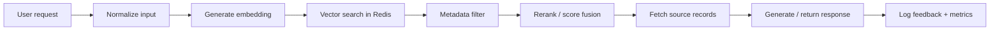
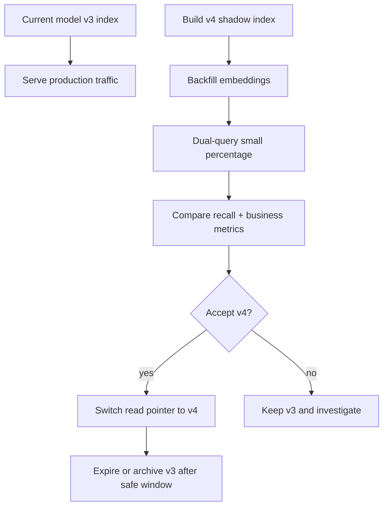
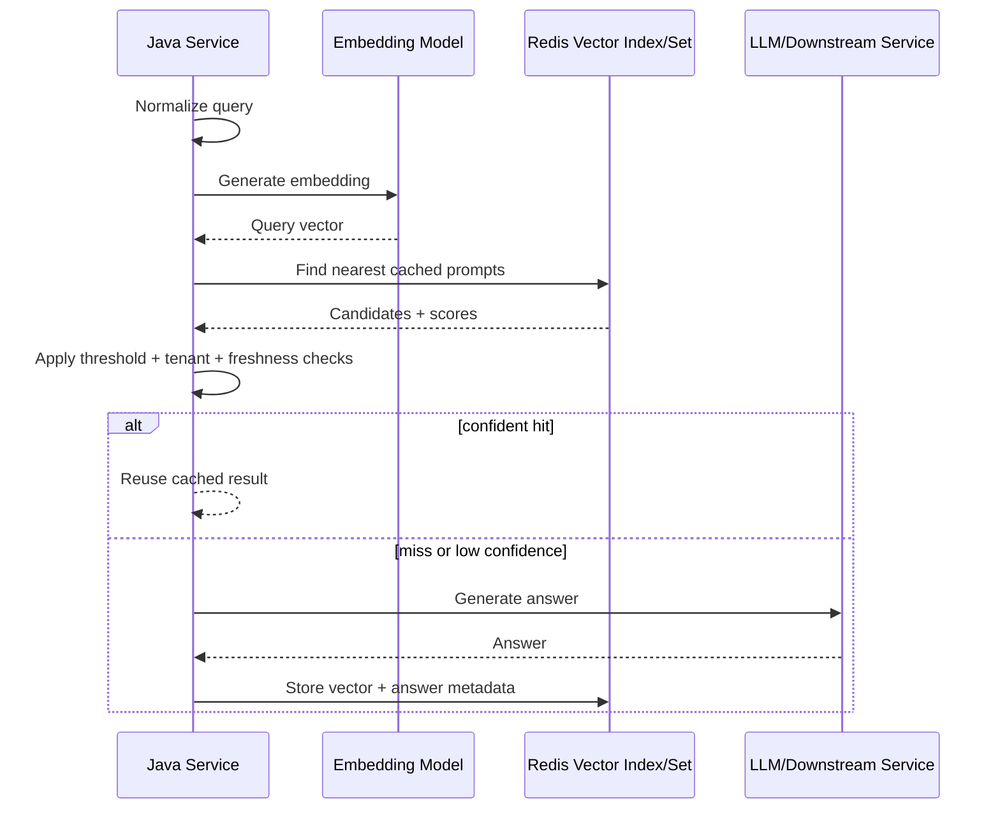
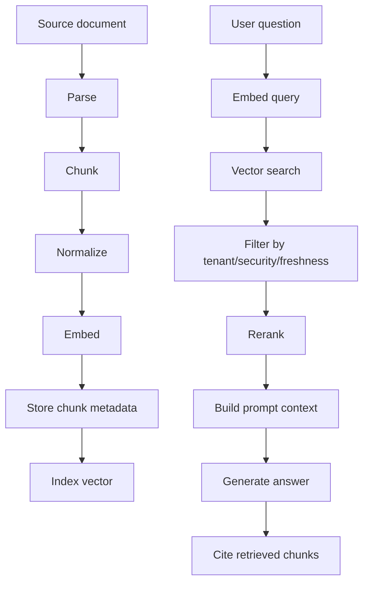
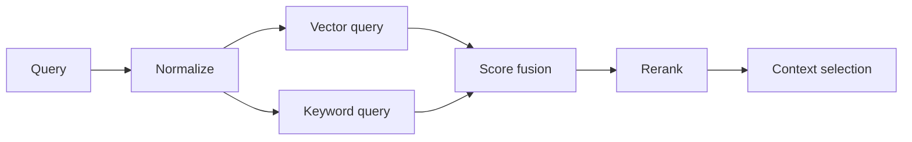
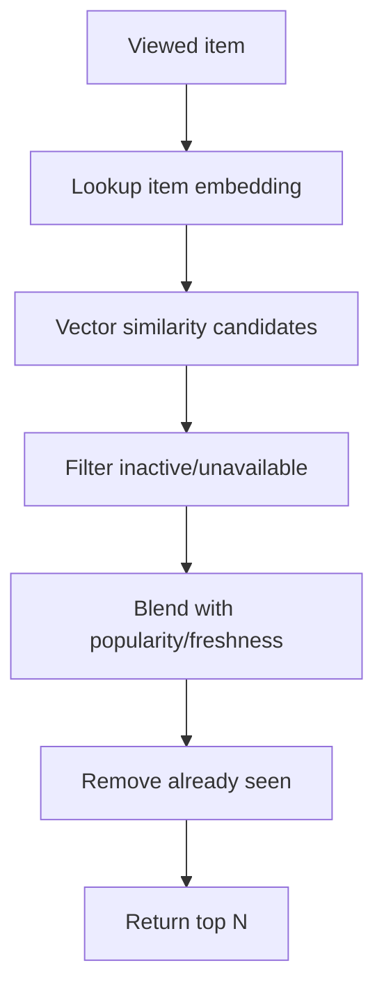
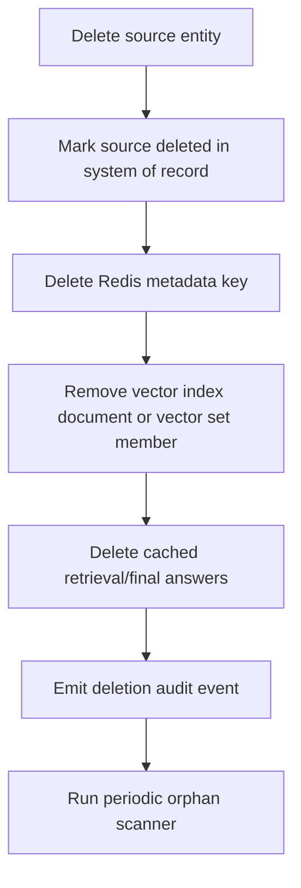
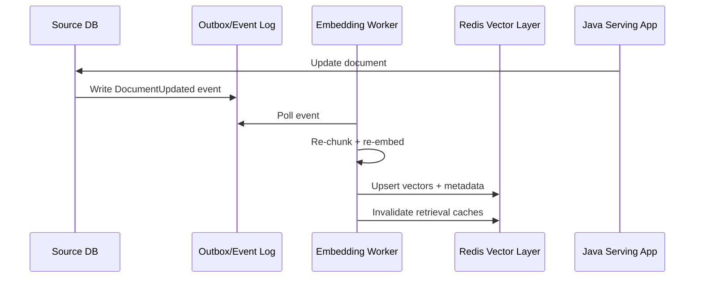

# Part 023 — Vector Search and AI-Oriented Redis Patterns

Part 022 covered Time Series and probabilistic structures: bounded approximation for low-latency decisions.
This part moves into a newer Redis capability area:

> Redis as a low-latency vector and AI-serving layer.

Do not frame this as “Redis replaces every vector database”.
That is the wrong mental model.

A better framing:

> Redis is useful when vector similarity is part of a latency-sensitive serving path, especially when you also need cache semantics, metadata filters, TTL, counters, feature state, and Java application integration close to the request path.

Redis now has two broad vector-oriented shapes you need to understand:

1. **Redis Query Engine vector indexes** over Hash or JSON documents.
2. **Redis 8 Vector Sets**, a native vector set data type with commands such as `VADD`, `VSIM`, and membership/inspection commands.

They solve overlapping but not identical problems.
A senior engineer must be able to choose between them without hype.

---

## 1. Kaufman Skill Decomposition

The skill is not “run a vector query”.
The real skill is:

> Design a bounded, observable, version-aware semantic serving path where embeddings, metadata, cache state, model versions, and retrieval correctness are explicit.

Breakdown:

| Sub-skill | What you must be able to do |
|---|---|
| Embedding mental model | Explain vectors, dimensions, distance metrics, normalization, model versioning, and drift |
| Redis vector options | Choose between Vector Sets and Query Engine vector indexes |
| Data modeling | Decide key structure, metadata shape, TTL, tenant boundary, and deletion strategy |
| Java integration | Encode vectors safely, batch writes, run queries, and hide client-specific API churn |
| Semantic cache design | Cache LLM/query results by semantic similarity without serving wrong answers |
| RAG retrieval design | Store chunk metadata, retrieve candidates, filter by tenant/security, and rerank safely |
| Recommendation design | Use similarity, co-occurrence, sorted sets, and metadata filters together |
| Consistency | Handle document updates, embedding re-generation, stale vectors, and model migration |
| Performance | Budget embedding generation, vector indexing, query latency, memory, payload, and result count |
| Operations | Monitor recall, hit rate, drift, memory, index build time, hot tenants, and fallback behavior |

Kaufman-style target for this part:

> After this part, you should be able to design and implement a Redis-backed semantic lookup or RAG retrieval path in Java, explain why Redis was chosen, and state the correctness/performance boundary clearly.

---

## 2. Core Mental Model: Vector Search Is Approximate Meaning Lookup

Traditional lookup:

```text
key = exact identifier
value = exact object
```

Vector lookup:

```text
query text/image/item -> embedding vector -> nearest vectors -> candidate objects
```

The key difference:

> Vector search does not prove truth. It returns nearby representations.

This matters because Redis may return the nearest item in embedding space, but:

- nearest does not mean correct
- similar does not mean authorized
- semantically close does not mean up to date
- embedding model changes can invalidate previous similarity behavior
- approximate nearest-neighbor indexes can trade recall for speed
- metadata filters can drastically change candidate quality

For production systems, vector search is usually one stage in a pipeline:



Redis is strongest when the query path needs to be fast, stateful, and close to the Java service.

---

## 3. Redis Vector Capability Map

### 3.1 Redis Query Engine Vector Index

Use this when you need:

- vector fields inside Hash or JSON documents
- metadata filtering
- text search + vector search hybrid queries
- numeric/tag/geospatial filters
- document-style indexing
- richer query syntax
- more explicit schema/index management

Example conceptual document:

```text
Key: doc:{tenantId}:{docId}:{chunkId}
Type: Hash or JSON
Fields:
  tenant_id      = acme
  doc_id         = policy-2026-001
  chunk_id       = 017
  content        = "Refund requests older than 90 days..."
  embedding      = <float32 vector bytes or JSON array>
  model_version  = text-embedding-v4
  security_scope = compliance-team
  updated_at     = 2026-07-02T12:00:00Z
```

Query Engine style is closer to “search database”.
It asks you to define indexes, fields, vector dimensions, distance metric, and query expression.

### 3.2 Redis 8 Vector Sets

Use this when you need:

- simpler native vector collection semantics
- nearest-neighbor lookup by vector set member
- low-friction vector similarity for online features
- item-to-item recommendation style lookup
- semantic matching where metadata filtering is simple or external
- embedding collections that behave like a Redis-native structure

Conceptual shape:

```text
Key: vset:tenant:{tenantId}:product-embedding:model:{modelVersion}
Type: Vector Set
Members:
  product:1001 -> [0.021, -0.44, ...]
  product:1002 -> [0.019, -0.39, ...]
  product:1003 -> [0.70,  0.02, ...]
```

Vector Set is simpler, but you still need metadata elsewhere:

```text
vset:tenant:acme:product:model:v4       -> vector set
product:tenant:acme:1001                -> product hash/json
z:tenant:acme:product:popularity        -> sorted set
set:tenant:acme:product:active          -> active product ids
```

### 3.3 Decision Matrix

| Need | Prefer |
|---|---|
| Vector + rich metadata filtering | Query Engine vector index |
| Vector + text search hybrid | Query Engine vector index |
| JSON/Hash document search | Query Engine vector index |
| Simple item-to-item nearest neighbors | Vector Set |
| Online recommendation candidate generation | Vector Set or Query Engine depending on filters |
| RAG chunk retrieval with security filters | Query Engine vector index |
| Semantic cache with bounded candidates | Vector Set can be enough |
| Strict audit/reporting truth | Neither alone; pair with durable source of truth |

The rule:

> If metadata filtering determines correctness, keep filtering inside the index or strictly enforce it immediately after retrieval.

---

## 4. Embedding Model Versioning Is Not Optional

A vector is not just a number array.
It is an output of:

- model provider
- model name/version
- preprocessing rules
- language handling
- normalization policy
- dimension count
- distance metric assumption
- chunking strategy
- content version

That means this is dangerous:

```text
doc:{id}:embedding
```

This is better:

```text
embedding:{tenantId}:{entityType}:{modelVersion}:{entityId}
```

For RAG chunks:

```text
rag:chunk:{tenantId}:{corpusId}:{modelVersion}:{docId}:{chunkNo}
```

For semantic cache:

```text
semcache:{tenantId}:{intent}:{modelVersion}:{bucket}:{cacheId}
```

For Vector Sets:

```text
vset:{tenantId}:{entityType}:{modelVersion}
```

Model version must be part of your key/index boundary because similarity from model A is not guaranteed to be comparable with similarity from model B.

### Bad migration

```text
Same vector index
Old and new embeddings mixed
No model_version filter
Similarity quality slowly degrades
No obvious exception thrown
```

### Better migration



Key pattern:

```text
config:tenant:{tenantId}:semantic-search:active-model -> v4
```

Do not hard-code active model version in application code if you expect controlled rollout.

---

## 5. Pattern 1 — Embedding Cache

Embedding generation is often slower and more expensive than Redis lookup.
So a simple, high-value Redis use case is:

> Cache normalized input → embedding vector.

### 5.1 Key Design

```text
embcache:{tenantId}:{modelVersion}:{sha256(normalizedInput)}
```

Value envelope:

```json
{
  "modelVersion": "text-embedding-v4",
  "dimension": 1536,
  "normalization": "lowercase-trim-collapse-space-v2",
  "inputHash": "...",
  "createdAt": "2026-07-02T12:00:00Z",
  "vectorEncoding": "float32-base64",
  "vector": "..."
}
```

For binary efficiency, store only the vector bytes plus minimal metadata in a Hash:

```text
HSET embcache:tenant:v4:hash \
  model_version text-embedding-v4 \
  dimension 1536 \
  created_at 2026-07-02T12:00:00Z \
  vector <binary bytes>
EXPIRE embcache:tenant:v4:hash 2592000
```

### 5.2 Correctness Rules

Embedding cache is safe when:

- the normalized input is deterministic
- model version is part of the key
- preprocessing version is part of the key or metadata
- cache miss falls back to model generation
- TTL is aligned with provider/model migration policy

Embedding cache is unsafe when:

- user-specific context changes meaning but is not in the key
- language detection is nondeterministic and not recorded
- model aliases change silently
- sensitive input is cached without governance
- vector bytes are not dimension-checked before reuse

### 5.3 Java Interface

Keep embedding cache behind a narrow interface:

```java
public interface EmbeddingCache {
    Optional<float[]> get(EmbeddingRequest request);
    void put(EmbeddingRequest request, float[] vector, Duration ttl);
}

public record EmbeddingRequest(
        String tenantId,
        String modelVersion,
        String preprocessingVersion,
        String normalizedInputHash,
        int expectedDimension
) {}
```

Dimension validation is mandatory:

```java
static void validateVector(float[] vector, int expectedDimension) {
    if (vector == null) {
        throw new IllegalArgumentException("vector is null");
    }
    if (vector.length != expectedDimension) {
        throw new IllegalArgumentException(
            "Embedding dimension mismatch: expected " + expectedDimension + " but got " + vector.length
        );
    }
}
```

### 5.4 Failure Model

| Failure | Impact | Mitigation |
|---|---|---|
| Cache miss | Higher latency/cost | Generate embedding and populate cache |
| Redis unavailable | Higher latency or degraded feature | Bypass cache; rate-limit model calls |
| Wrong model version reused | Bad similarity | Include model version in key and validate metadata |
| Large vectors increase memory | Eviction/cost | TTL, compression, binary encoding, max payload policy |
| Sensitive text stored | Compliance risk | Store hash as key, avoid raw text, encrypt where required |

---

## 6. Pattern 2 — Semantic Cache

A semantic cache stores answers or intermediate results for semantically similar inputs.

Exact cache:

```text
same text -> same result
```

Semantic cache:

```text
similar meaning -> maybe reuse result
```

This is powerful and dangerous.

### 6.1 Suitable Use Cases

Good candidates:

- FAQ answers
- product search query expansion
- support macro suggestions
- non-sensitive summarization hints
- expensive classification where false reuse is tolerable
- retrieval candidate cache

Poor candidates:

- legal/regulatory final decision
- payment authorization
- medical advice
- personalized account state
- time-sensitive facts
- permission-sensitive answers

The core question:

> If we reuse an answer for a similar query, what harm happens when similarity is wrong?

### 6.2 Semantic Cache Flow



### 6.3 Cache Entry Model

```text
semcache:answer:{tenantId}:{modelVersion}:{answerId}
```

Fields:

```text
query_hash
query_normalized_preview
answer_payload_ref
embedding_model_version
answer_model_version
created_at
expires_at
tenant_id
security_scope
source_snapshot_version
quality_score
```

Vector index member points to `answerId`.
Actual large payload can be stored separately:

```text
semcache:payload:{tenantId}:{answerId}
```

### 6.4 Thresholds

Never use one global threshold blindly.

| Domain | Threshold policy |
|---|---|
| FAQ | Moderate threshold may be acceptable |
| Support suggestion | Lower threshold if human reviews suggestion |
| Automatic answer | Higher threshold |
| Security-sensitive answer | Exact scope match + high threshold + freshness check |
| Regulatory explanation | Prefer retrieval reuse, not final answer reuse |

A semantic hit requires all checks:

```text
same tenant
same security scope
compatible language
same model family/version
fresh enough
similarity above threshold
answer type compatible
source snapshot still valid
```

### 6.5 Java Guardrail

```java
public record SemanticCacheCandidate(
        String answerId,
        double similarity,
        String tenantId,
        String securityScope,
        String sourceSnapshotVersion,
        Instant createdAt,
        Instant expiresAt
) {
    boolean reusableFor(SemanticCacheRequest request, Instant now) {
        return tenantId.equals(request.tenantId())
                && securityScope.equals(request.securityScope())
                && sourceSnapshotVersion.equals(request.sourceSnapshotVersion())
                && similarity >= request.minSimilarity()
                && now.isBefore(expiresAt);
    }
}
```

This guardrail is more important than the vector query itself.

---

## 7. Pattern 3 — RAG Retrieval Index

RAG retrieval is one of the most common vector use cases.

The core pipeline:



### 7.1 Chunk Key Design

```text
rag:chunk:{tenantId}:{corpusId}:{modelVersion}:{docId}:{chunkNo}
```

Metadata fields:

```text
tenant_id
corpus_id
doc_id
chunk_no
source_uri
source_version
content_hash
language
security_scope
created_at
updated_at
embedding_model_version
chunking_version
text
embedding
```

### 7.2 Index Design

For Query Engine, index fields typically include:

| Field | Type | Why |
|---|---|---|
| `embedding` | VECTOR | Similarity search |
| `tenant_id` | TAG | Mandatory isolation filter |
| `corpus_id` | TAG | Restrict corpus |
| `security_scope` | TAG | Authorization boundary |
| `doc_id` | TAG | Debug/citation grouping |
| `source_version` | TAG | Staleness control |
| `language` | TAG | Query-language matching |
| `updated_at_epoch` | NUMERIC | Freshness filter |
| `text` | TEXT | Hybrid search or debug |

### 7.3 Query Rule

A RAG vector query is not complete until authorization and freshness are enforced.

Bad:

```text
Find top 10 nearest chunks globally.
```

Better:

```text
Find top 50 nearest chunks where:
  tenant_id = request tenant
  corpus_id in allowed corpora
  security_scope in user scopes
  source_version is active
Then rerank and select top 5.
```

### 7.4 Candidate Count

Do not retrieve only the final number of chunks.

Typical flow:

```text
vector topK = 50
filter/rerank
prompt topK = 5-12
```

Reason:

- ANN retrieval may not return perfectly ranked results
- metadata filters may remove many candidates
- reranker needs enough candidates
- prompt construction may need diversity by source document

### 7.5 Retrieval Quality Metrics

Track:

- retrieval hit rate
- no-result rate
- average similarity of selected chunks
- answer-with-citation rate
- citation source diversity
- stale chunk rate
- user feedback by source
- hallucination incidents tied to retrieval misses
- reranker rejection rate

RAG quality is not only LLM quality.
Bad retrieval creates bad generation.

---

## 8. Pattern 4 — Hybrid Search: Keyword + Vector

Vector search is good at semantic similarity.
Keyword search is good at exact terms, identifiers, error codes, product SKUs, law references, names, and acronyms.

Hybrid search combines both.

Example query:

```text
"ORA-00060 deadlock graph retry policy"
```

A pure vector query may retrieve broad database deadlock content.
A keyword query may retrieve exact error-code references.
Hybrid is often better.

### 8.1 Hybrid Architecture



### 8.2 Score Fusion

A simple reciprocal-rank fusion style approach:

```text
score(doc) = 1 / (k + rank_vector) + 1 / (k + rank_keyword)
```

Then apply:

- tenant filter
- source freshness
- security scope
- diversity limit per document
- max total token budget

Do not assume Redis alone must do all ranking logic.
Often Redis retrieves candidates; Java service applies domain-specific ranking.

---

## 9. Pattern 5 — Recommendation Candidate Generation

Redis can support low-latency recommendation candidate generation:

- similar product by embedding
- similar content by embedding
- users with similar preferences
- item-to-item nearest neighbors
- freshness/popularity blending with Sorted Sets
- availability filtering with Sets/Hashes

### 9.1 Candidate Flow



### 9.2 Redis Structures

```text
vset:tenant:{tenant}:item:model:{modelVersion}        -> item vectors
z:tenant:{tenant}:item:popularity:7d                  -> popularity score
z:tenant:{tenant}:item:freshness                      -> freshness score
set:tenant:{tenant}:item:active                       -> active item ids
set:user:{userId}:item:seen                           -> dedup seen items
hash:item:{itemId}:metadata                           -> category, price, stock, etc.
```

### 9.3 Score Blend

```text
finalScore =
  0.65 * semanticSimilarity
+ 0.20 * normalizedPopularity
+ 0.10 * freshnessScore
+ 0.05 * businessBoost
- penaltyIfAlreadySeen
```

For high-scale systems, do not compute everything online.
Use Redis for serving:

- precomputed candidate lists
- active filters
- short-term session signals
- fast exclusion sets
- recent popularity

---

## 10. Pattern 6 — LLM Response Guard and Prompt Fragment Cache

Redis can cache prompt fragments or retrieval bundles, not only final answers.

Useful cache levels:

| Level | Key idea | Risk |
|---|---|---|
| Embedding cache | Input → vector | Low if versioned |
| Retrieval cache | Query intent → chunk ids | Medium; source freshness matters |
| Prompt fragment cache | Chunk ids → formatted context | Medium; token budget/model changes matter |
| Final answer cache | Query → answer | High; personalization/freshness/security matter |

A safer RAG cache is often:

```text
query -> retrieved chunk ids
```

not:

```text
query -> final generated answer
```

Because retrieved chunks can still be revalidated before generation.

---

## 11. Java Vector Encoding

Vector encoding must be deterministic.

### 11.1 Float Array to Little-Endian Bytes

Many Redis vector examples for Hash vector fields use binary float32 encoding.
Keep this conversion isolated and tested.

```java
import java.nio.ByteBuffer;
import java.nio.ByteOrder;

public final class VectorEncoding {
    private VectorEncoding() {}

    public static byte[] float32LittleEndian(float[] vector) {
        if (vector == null) {
            throw new IllegalArgumentException("vector is null");
        }
        ByteBuffer buffer = ByteBuffer.allocate(vector.length * Float.BYTES)
                .order(ByteOrder.LITTLE_ENDIAN);
        for (float value : vector) {
            if (!Float.isFinite(value)) {
                throw new IllegalArgumentException("vector contains non-finite value: " + value);
            }
            buffer.putFloat(value);
        }
        return buffer.array();
    }

    public static float[] fromFloat32LittleEndian(byte[] bytes) {
        if (bytes.length % Float.BYTES != 0) {
            throw new IllegalArgumentException("invalid float32 byte length: " + bytes.length);
        }
        ByteBuffer buffer = ByteBuffer.wrap(bytes).order(ByteOrder.LITTLE_ENDIAN);
        float[] result = new float[bytes.length / Float.BYTES];
        for (int i = 0; i < result.length; i++) {
            result[i] = buffer.getFloat();
        }
        return result;
    }
}
```

### 11.2 Dimension Guard

```java
public final class VectorGuard {
    public static void requireDimension(float[] vector, int expected) {
        if (vector.length != expected) {
            throw new IllegalArgumentException(
                    "Expected vector dimension " + expected + " but got " + vector.length);
        }
    }

    public static void requireNormalizedIfCosine(float[] vector, double tolerance) {
        double sum = 0;
        for (float value : vector) {
            sum += (double) value * value;
        }
        double norm = Math.sqrt(sum);
        if (Math.abs(norm - 1.0d) > tolerance) {
            throw new IllegalArgumentException("Expected normalized vector; norm=" + norm);
        }
    }
}
```

Do not hide dimension mismatch.
It indicates model/config drift.

---

## 12. Java Integration Boundary

Because vector APIs can evolve faster than common Redis primitives, design your app with a narrow adapter.

```java
public interface VectorSearchPort {
    List<VectorMatch> search(VectorSearchRequest request);
    void upsert(VectorDocument document);
    void delete(VectorDocumentId id);
}

public record VectorSearchRequest(
        String tenantId,
        String indexOrSetName,
        String modelVersion,
        float[] queryVector,
        int topK,
        Map<String, String> requiredTags,
        double minSimilarity
) {}

public record VectorMatch(
        String id,
        double score,
        Map<String, String> metadata
) {}
```

Benefits:

- hide Jedis/Lettuce command details
- support Query Engine today and Vector Sets later
- make integration tests stable
- centralize dimension checking
- centralize model version enforcement
- add tracing and metrics once

Do not scatter raw vector commands across services.

---

## 13. Query Engine vs Vector Set Adapter Shape

### 13.1 Query Engine Adapter

Best for document retrieval:

```java
public final class RedisQueryEngineVectorSearch implements VectorSearchPort {
    @Override
    public List<VectorMatch> search(VectorSearchRequest request) {
        VectorGuard.requireDimension(request.queryVector(), 1536);

        // Conceptual steps:
        // 1. Encode query vector.
        // 2. Build parameterized Redis Query Engine vector query.
        // 3. Include tenant/security/model filters.
        // 4. Return ids + scores + metadata.
        //
        // Keep concrete command construction in this adapter, not in domain services.
        throw new UnsupportedOperationException("implementation-specific");
    }

    @Override
    public void upsert(VectorDocument document) {
        // Store Hash/JSON document and rely on index update.
        throw new UnsupportedOperationException("implementation-specific");
    }

    @Override
    public void delete(VectorDocumentId id) {
        // Delete source key and optionally cleanup auxiliary metadata.
        throw new UnsupportedOperationException("implementation-specific");
    }
}
```

### 13.2 Vector Set Adapter

Best for item-to-item matching or semantic cache candidates:

```java
public final class RedisVectorSetSearch implements VectorSearchPort {
    @Override
    public List<VectorMatch> search(VectorSearchRequest request) {
        // Conceptual steps:
        // 1. Send VSIM against vset key.
        // 2. Ask for scores where supported.
        // 3. Apply minSimilarity in Java if needed.
        // 4. Hydrate metadata from Hash/JSON keys.
        throw new UnsupportedOperationException("implementation-specific");
    }

    @Override
    public void upsert(VectorDocument document) {
        // Conceptual VADD + metadata upsert.
        throw new UnsupportedOperationException("implementation-specific");
    }

    @Override
    public void delete(VectorDocumentId id) {
        // Conceptual vector member delete + metadata delete.
        throw new UnsupportedOperationException("implementation-specific");
    }
}
```

The design point:

> Domain services should not know whether Redis is using a vector index or native Vector Set.

---

## 14. Multi-Tenant Safety

Never build a global semantic index unless your authorization model proves it is safe.

Safer patterns:

### 14.1 Tenant-Scoped Index/Set

```text
idx:rag:{tenantId}:{modelVersion}
vset:{tenantId}:item:{modelVersion}
```

Pros:

- strong isolation
- simpler reasoning
- easier tenant deletion
- lower blast radius

Cons:

- many indexes/sets
- more operational objects
- uneven tenant sizes

### 14.2 Shared Index with Tenant Filter

```text
idx:rag:shared:{modelVersion}
```

Required filter:

```text
tenant_id = request.tenantId
security_scope in request.allowedScopes
```

Pros:

- fewer indexes
- simpler global operations
- better for many small tenants

Cons:

- every query must enforce filters
- filter bugs become data leaks
- hot tenants can affect others
- tenant deletion needs careful cleanup

For regulatory/case-management platforms, prefer tenant or domain partitioning unless there is a clear operational reason not to.

---

## 15. Deletion and Right-to-Be-Forgotten

Vector data is derived data.
It still may be sensitive.

When a source document is deleted:



Checklist:

- delete source metadata
- delete vector representation
- delete semantic cache entries derived from source
- delete prompt fragments containing source text
- expire stale retrieval caches
- log deletion job result
- scan for orphan vectors

Do not assume deleting the relational document automatically deletes its embedding.

---

## 16. Freshness and Drift

Vector systems rot quietly.

Common drift cases:

| Drift | Example | Mitigation |
|---|---|---|
| Source drift | Document changed but vector not updated | Source version hash; re-embed on update |
| Model drift | New embedding model deployed | Model-versioned index |
| Chunking drift | Chunk boundaries changed | Chunking version in key |
| Vocabulary drift | New product/domain terms | Periodic quality evaluation |
| Business drift | Popularity/availability changed | Blend vector score with current Redis state |
| Access drift | User permissions changed | Runtime authorization filter |

A candidate result must be validated against current metadata.

---

## 17. Performance Budget

A vector request has multiple latency components:

```text
T_total = T_normalize
        + T_embedding_model
        + T_redis_query
        + T_metadata_hydration
        + T_rerank
        + T_downstream_generation_or_response
```

Redis query may be fast, but embedding generation may dominate.
So optimize the whole path, not only Redis.

### 17.1 Typical Optimization Levers

| Bottleneck | Lever |
|---|---|
| Embedding generation latency | Embedding cache, batch embedding, local model, provider timeout |
| Redis vector query latency | Lower topK, better filters, index tuning, smaller vectors |
| Metadata hydration | Pipeline `HMGET`/JSON fetch, store required metadata in index result |
| Reranking cost | Rerank fewer candidates, cache rerank results |
| Payload size | Store references, not huge text in hot keys |
| Tenant hot spot | Tenant partitioning, rate limit, dedicated Redis DB/cluster |

---

## 18. Memory Budgeting

Approximate vector memory:

```text
raw_vector_bytes = dimension * 4 bytes
```

For 1 million 1536-dim float32 vectors:

```text
1,000,000 * 1536 * 4 = ~6.14 GB raw vector bytes
```

Index overhead can be significant.
Metadata and key overhead also matter.

Questions before launch:

- How many vectors per tenant?
- What dimension?
- How many model versions retained?
- What metadata fields are indexed?
- What TTL or retention policy exists?
- How often do documents update?
- What is the deletion SLA?
- What is the expected query QPS and topK?
- What is the memory headroom after replicas/persistence overhead?

Do not store every embedding forever without an explicit retention model.

---

## 19. Consistency Envelope

Vector search is rarely the system of record.

A robust system separates:

| Layer | Role |
|---|---|
| Source DB/object store | Authoritative document/content state |
| Redis vector index/set | Serving-time semantic candidate lookup |
| Redis metadata/cache | Hot retrieval state and derived values |
| Event pipeline | Re-embedding/update/delete propagation |
| Audit log | Explainability and compliance trail |

Update flow:



Serving reads must tolerate temporary lag.

Expose this as product behavior:

```text
Search index freshness target: under 2 minutes for normal updates.
```

For compliance-critical workflows, do not let vector index lag drive final truth.

---

## 20. Observability

Metrics:

```text
vector.query.count
vector.query.latency.p50/p95/p99
vector.query.top_k
vector.query.result_count
vector.query.no_result_rate
vector.query.avg_similarity
vector.query.min_similarity_pass_rate
vector.embedding.cache.hit_rate
vector.embedding.model.latency
vector.index.upsert.count
vector.index.delete.count
vector.index.update_lag_seconds
vector.index.memory_bytes
vector.semantic_cache.hit_rate
vector.semantic_cache.false_hit_reported
rag.retrieval.selected_chunk_count
rag.retrieval.stale_chunk_rejected
```

Logs should include:

- tenant id
- corpus id
- model version
- topK
- min similarity
- result count
- selected ids
- source versions
- query latency
- fallback reason

Do not log raw user text or raw vectors by default.

---

## 21. Testing Strategy

### 21.1 Unit Tests

- vector dimension validation
- float encoding round trip
- key naming
- model version selection
- min similarity filter
- authorization filter
- cache hit/miss rules

### 21.2 Integration Tests

- create index/set
- insert sample vectors
- query nearest neighbors
- update vector
- delete vector
- metadata hydration
- tenant isolation
- stale model rejection

### 21.3 Golden Retrieval Tests

Create a dataset:

```text
query -> expected relevant document ids
```

Track:

- recall@k
- precision@k
- mean reciprocal rank
- no-result rate
- latency

Example:

```text
Query: "refund after ninety days"
Expected: policy-refund-90-days
Acceptable: refund-policy-summary
Rejected: shipping-policy
```

Vector systems need quality tests, not just API tests.

---

## 22. Failure Modes

| Failure mode | Symptom | Mitigation |
|---|---|---|
| Wrong dimension | command error or silent adapter failure | Validate dimension before Redis call |
| Mixed model versions | degraded relevance | versioned index/set; active pointer |
| Missing tenant filter | data leak | mandatory query builder guard; tests |
| Stale deleted content | old docs appear | deletion pipeline + TTL + orphan scanner |
| Low recall | relevant docs missing | increase topK, tune index, rerank, improve chunking |
| High latency | p99 breach | embedding cache, lower topK, batch hydration |
| Over-cached final answers | wrong answers | cache retrieval candidates instead |
| Memory growth | eviction/OOM | retention, capacity budget, per-tenant quota |
| Hot tenant | noisy neighbor | rate limit, partition, dedicated index |
| Provider outage | no embeddings | fallback exact search, cached embeddings, degrade feature |

---

## 23. Production Checklist

Before launch:

- [ ] Vector use case has explicit correctness boundary.
- [ ] Model version is part of key/index/set naming.
- [ ] Dimension and distance metric are configured explicitly.
- [ ] Tenant/security filters are mandatory.
- [ ] Source version/freshness is checked.
- [ ] Deletion path removes vectors and derived caches.
- [ ] Embedding cache has TTL and sensitive-data policy.
- [ ] Vector query has topK limit.
- [ ] Metadata hydration is pipelined or minimized.
- [ ] Retrieval quality dataset exists.
- [ ] Drift/migration plan exists.
- [ ] Metrics cover latency, hit rate, no-result rate, and update lag.
- [ ] Fallback path is defined.

---

## 24. Practice Exercise

Build a Java service module with this interface:

```java
public interface SemanticKnowledgeSearch {
    SearchResponse search(SearchRequest request);
}
```

Requirements:

1. Normalize query text.
2. Generate or retrieve embedding from Redis embedding cache.
3. Query Redis vector layer.
4. Enforce tenant and security scope.
5. Reject stale source versions.
6. Return top chunks with source metadata.
7. Record metrics.
8. Support model version switch through Redis config key.

Then write tests for:

- wrong dimension
- stale model version
- tenant leakage attempt
- deleted document
- semantic cache false hit
- Redis timeout fallback

The goal is not to build a demo.
The goal is to make correctness boundaries executable.

---

## 25. Summary

Redis vector capabilities are useful when semantic lookup belongs in the low-latency serving path.
But vector search must be treated as candidate generation, not truth.

The senior-engineering rules:

1. Version everything: model, preprocessing, chunking, source snapshot.
2. Keep tenant/security filters mandatory.
3. Prefer retrieval/prompt-fragment caches over final-answer caches for sensitive workflows.
4. Validate vector dimension before Redis calls.
5. Budget memory explicitly.
6. Test retrieval quality with golden queries.
7. Monitor update lag and stale-result rejection.
8. Keep Redis as serving state unless you intentionally choose it as a primary store.

Part 024 will move from capability design into the performance model that underlies all Redis production engineering: latency, throughput, pipelining, batching, command cost, payload size, and Java client behavior.

---

## References

- Redis vector sets: https://redis.io/docs/latest/develop/data-types/vector-sets/
- Redis `VADD`: https://redis.io/docs/latest/commands/vadd/
- Redis `VSIM`: https://redis.io/docs/latest/commands/vsim/
- Redis vector search concepts: https://redis.io/docs/latest/develop/ai/search-and-query/vectors/
- Redis Jedis vector search guide: https://redis.io/docs/latest/develop/clients/jedis/vecsearch/
- Redis as a vector database quickstart: https://redis.io/docs/latest/develop/get-started/vector-database/
