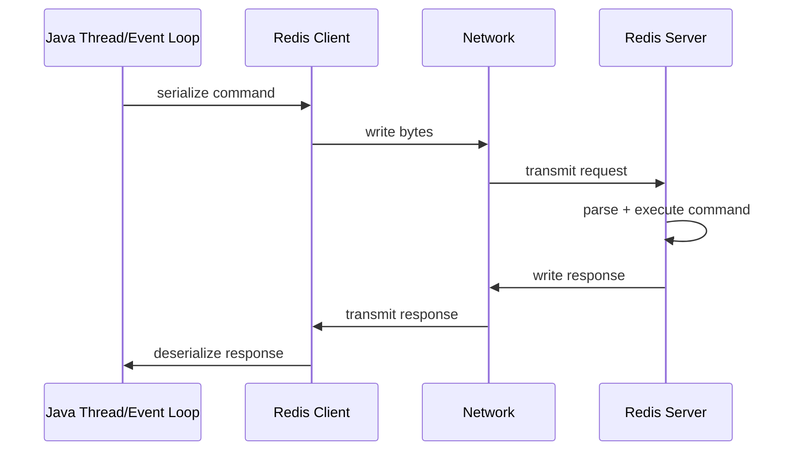
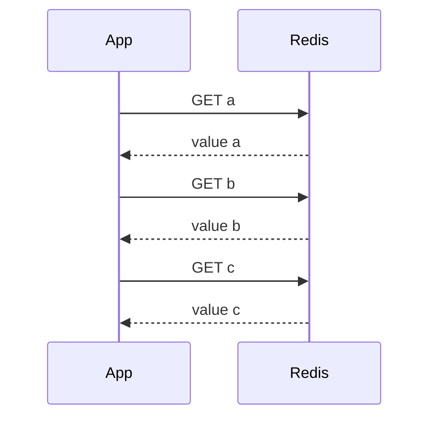
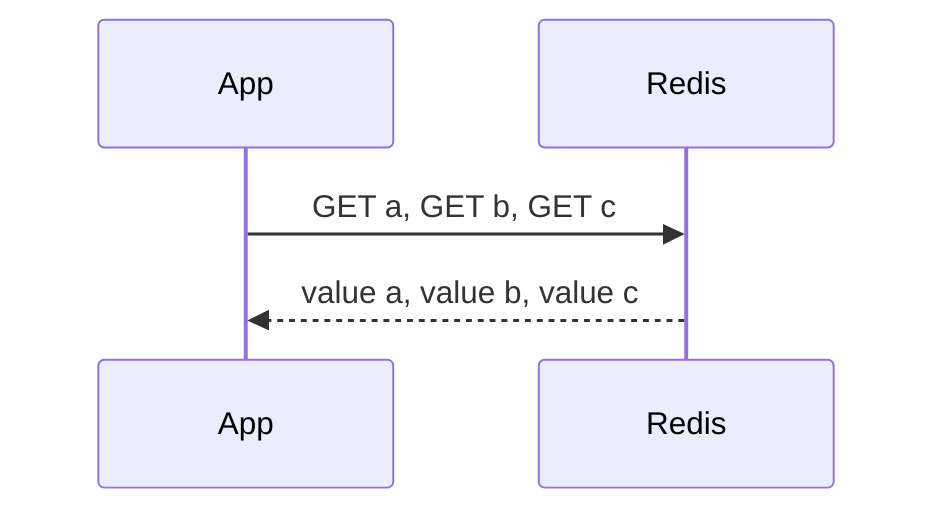
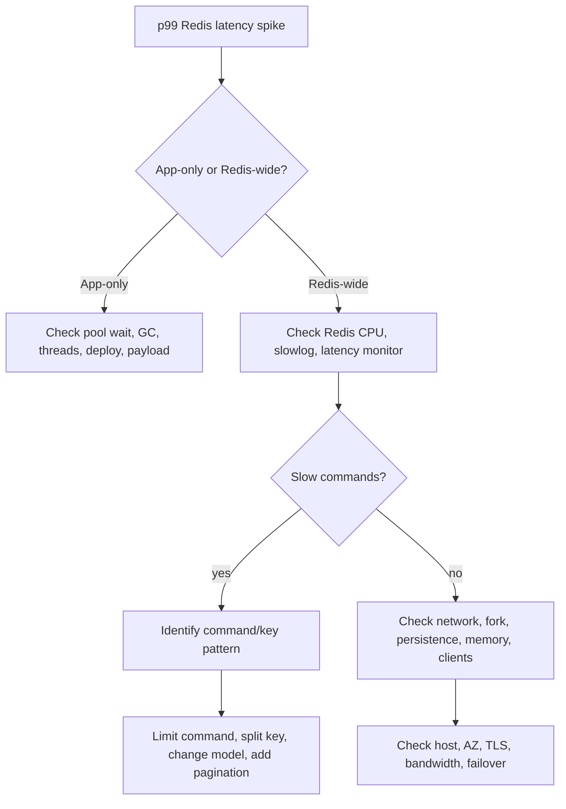

# Part 024 — Redis Performance Model: Latency, Throughput, Pipelining, and Batching

Part 023 covered vector search and AI-oriented Redis patterns.
Now we step back into a foundation that affects every Redis design:

> Redis performance engineering.

Redis often feels fast enough that teams stop thinking.
That is dangerous.
Redis performance issues rarely start as obvious CPU saturation.
They often start as:

- too many round trips
- too many tiny commands
- huge values
- hot keys
- slow commands hidden in rare paths
- blocking client usage
- unbounded pipelines
- network saturation
- GC pauses in Java client processes
- failover/reconnect behavior that amplifies load

The core mental model:

> Redis performance is a system property across command complexity, network round trip, payload size, client concurrency, server CPU, memory behavior, topology, and operational limits.

---

## 1. Kaufman Skill Decomposition

The skill is not “use pipeline”.
The real skill is:

> Design Redis access paths where p50/p95/p99 latency, command count, payload size, batch size, connection behavior, and failure amplification are intentional.

Breakdown:

| Sub-skill | What you must be able to do |
|---|---|
| Latency decomposition | Break request latency into client, network, Redis, serialization, and downstream work |
| Command cost reasoning | Understand command complexity and avoid slow paths on hot requests |
| Round-trip optimization | Reduce sequential command chains through pipelining, batching, scripts, or data-model changes |
| Payload discipline | Keep values small enough for predictable latency and memory behavior |
| Client concurrency | Configure Jedis/Lettuce connections safely for workload shape |
| Benchmarking | Measure realistic access patterns, not artificial best-case numbers |
| Hot key detection | Identify keys that concentrate QPS or memory pressure |
| Backpressure | Prevent async/pipeline overload from becoming memory explosion |
| Operational diagnosis | Use Redis latency tools, slowlog, command stats, client metrics, and app traces |
| Trade-off selection | Choose between fewer round trips, larger batches, Lua, data duplication, and eventual consistency |

Kaufman-style outcome:

> After this part, you should be able to look at a Java Redis call path and explain its expected latency, command count, network behavior, batching opportunity, and failure mode.

---

## 2. Redis Latency Is Not One Thing

A request to Redis includes many components:



So:

```text
T_total = T_app_wait
        + T_serialize
        + T_client_queue
        + T_network_rtt
        + T_redis_execute
        + T_response_transfer
        + T_deserialize
        + T_thread_scheduling
```

When people say “Redis latency”, they may mean any of these.

### 2.1 Practical Categories

| Latency source | Example |
|---|---|
| Network latency | App and Redis are in different AZ/region |
| Command latency | `SMEMBERS` on huge set, `KEYS`, large `ZRANGE` |
| Payload latency | multi-MB values or large result sets |
| Client queueing | too few Jedis pool connections, async queue overload |
| Server CPU | many expensive commands or Lua scripts |
| Memory behavior | fork, eviction, fragmentation, swapping |
| Java runtime | GC pause, blocked Netty event loop, thread pool starvation |
| Topology | cluster redirects, failover, stale topology cache |

The first diagnostic task is to locate the latency, not randomly tune Redis.

---

## 3. Throughput vs Latency

Throughput:

```text
operations per second
```

Latency:

```text
time per operation/request
```

They are related but not identical.

You can increase throughput by batching commands, but that may increase individual command waiting time.
You can reduce latency for one request by avoiding batch queues, but that may lower total throughput.

### 3.1 Performance Envelope

```text
If Redis execution time is tiny but RTT is 1 ms:
  1 sequential command chain of 10 commands ~= 10 ms minimum network wait

If commands are pipelined:
  10 commands can fit into ~1 RTT + server processing + response transfer
```

This is why pipelining is so powerful.
Redis pipelining sends multiple commands without waiting for each individual response.

---

## 4. Round Trip Is the First Enemy

Bad access path:

```java
String userId = redis.get("session:" + token);
String userJson = redis.get("user:" + userId);
String tenantJson = redis.get("tenant:" + tenantId);
String permissions = redis.get("perm:" + userId + ":" + tenantId);
```

This is four sequential network waits.
Even if every command is O(1), latency stacks.

Better options:

1. Pipeline independent commands.
2. Use `MGET` if keys are compatible and in same slot for Cluster.
3. Store read-optimized aggregate object.
4. Use Lua/Function for server-side composition if atomicity or network reduction matters.
5. Re-evaluate data model.

The senior question:

> Are these commands logically sequential, or did we accidentally serialize independent work?

---

## 5. Pipelining Mental Model

Without pipeline:



With pipeline:



Pipelining reduces round-trip waiting.
It does not make expensive commands cheap.
It does not make huge payloads small.
It does not guarantee atomicity.

### 5.1 Pipeline Is Not Transaction

| Feature | Pipeline | Transaction `MULTI/EXEC` | Lua/Function |
|---|---|---|---|
| Reduces RTT | Yes | Usually yes if pipelined | Yes |
| Atomic execution | No | Yes for queued command execution | Yes for script execution |
| Conditional logic server-side | No | Limited with `WATCH` | Yes |
| Large batch risk | Client/server memory | Queued command memory | Script runtime/blocking risk |
| Best for | independent commands | grouped writes | read-decide-write atomic workflow |

Pipeline is a transport optimization, not a correctness primitive.

---

## 6. Java Pipelining Patterns

### 6.1 Jedis Pipeline Pattern

Conceptual Jedis pattern:

```java
try (Jedis jedis = pool.getResource()) {
    Pipeline p = jedis.pipelined();

    Response<String> user = p.get("user:" + userId);
    Response<String> tenant = p.get("tenant:" + tenantId);
    Response<String> permissions = p.get("perm:" + userId + ":" + tenantId);

    p.sync();

    User u = decodeUser(user.get());
    Tenant t = decodeTenant(tenant.get());
    Permissions perms = decodePermissions(permissions.get());
}
```

Rules:

- keep pipeline bounded
- do not pipeline unlimited user input
- ensure responses are consumed
- avoid mixing blocking commands
- do not share Jedis connection across threads
- measure payload size, not only command count

### 6.2 Lettuce Async Pattern

Conceptual Lettuce async pattern:

```java
RedisAsyncCommands<String, String> async = connection.async();

RedisFuture<String> userFuture = async.get("user:" + userId);
RedisFuture<String> tenantFuture = async.get("tenant:" + tenantId);
RedisFuture<String> permissionsFuture = async.get("perm:" + userId + ":" + tenantId);

CompletableFuture<UserContext> result = CompletableFuture
        .allOf(userFuture, tenantFuture, permissionsFuture)
        .thenApply(ignored -> new UserContext(
                decodeUser(userFuture.join()),
                decodeTenant(tenantFuture.join()),
                decodePermissions(permissionsFuture.join())
        ));
```

Rules:

- bound outstanding futures
- do not block Netty event loop
- set command timeout
- cancel or ignore late results safely
- propagate trace context
- avoid unbounded `CompletableFuture` fan-out

### 6.3 Reactive Pattern

Reactive Redis is useful only when your entire path respects backpressure.

Bad:

```java
Flux.fromIterable(hugeList)
    .flatMap(id -> redis.get("key:" + id)) // unbounded by default if not configured carefully
```

Better:

```java
Flux.fromIterable(ids)
    .flatMap(id -> redis.get("key:" + id), 64) // bounded concurrency
    .timeout(Duration.ofMillis(100));
```

Reactive code without concurrency bounds becomes a load generator.

---

## 7. Batching Strategy

Batching means grouping work intentionally.

Pipelining means sending multiple commands without waiting.

They often appear together, but they are not the same.

### 7.1 Batch Size Trade-Off

Small batch:

- lower queue time
- less memory pressure
- less tail latency
- lower throughput improvement

Large batch:

- better throughput
- fewer RTTs
- more memory pressure
- higher tail latency
- greater retry ambiguity

### 7.2 Batch Size Starting Points

There is no universal batch size.
Start with:

| Workload | Initial batch size |
|---|---:|
| Small GET/MGET | 50–500 keys |
| Small HGET/HMGET | 50–300 commands |
| Writes with small payloads | 50–200 commands |
| Large payload reads | 5–50 commands |
| Cluster cross-slot scatter | per-slot grouping |
| Latency-critical request path | smallest batch that meets p99 |
| Offline migration/backfill | larger batches with rate limit |

Then measure p95/p99 and server/client memory.

### 7.3 Bounded Batch Helper

```java
public final class Batches {
    public static <T> List<List<T>> partition(List<T> items, int batchSize) {
        if (batchSize <= 0) {
            throw new IllegalArgumentException("batchSize must be positive");
        }
        List<List<T>> result = new ArrayList<>();
        for (int i = 0; i < items.size(); i += batchSize) {
            result.add(items.subList(i, Math.min(items.size(), i + batchSize)));
        }
        return result;
    }
}
```

Use this for backfills, not necessarily for request path.

---

## 8. Command Complexity

Redis commands have documented complexity.
You must read it.

Examples:

| Pattern | Risk |
|---|---|
| `GET small-key` | usually cheap |
| `HGET one field` | usually cheap |
| `HGETALL large hash` | payload and O(N) risk |
| `SMEMBERS large set` | O(N), dangerous on hot path |
| `ZRANGE huge range` | large output risk |
| `KEYS pattern` | blocking keyspace scan risk |
| `SCAN` with huge result processing | safer than KEYS but still workload |
| Lua script iterating many keys | blocks server during execution |

The rule:

> A command that is safe for 100 elements may be unsafe for 10 million elements.

### 8.1 Avoid Unbounded Result Commands

Bad:

```text
SMEMBERS tenant:acme:all-users
HGETALL user-profile-huge
ZRANGE leaderboard 0 -1 WITHSCORES
```

Better:

```text
SSCAN tenant:acme:all-users cursor COUNT 500
HMGET user-profile name email status
ZREVRANGE leaderboard 0 99 WITHSCORES
```

But even `SCAN` is not magic.
It spreads work over time; it does not eliminate work.

---

## 9. Payload Size Discipline

Redis latency is affected by response size.
A fast command returning 5 MB is not fast in practice.

### 9.1 Value Size Rules of Thumb

| Payload | Interpretation |
|---|---|
| < 1 KB | usually comfortable |
| 1–10 KB | common, monitor carefully |
| 10–100 KB | can be acceptable but watch p99/network |
| 100 KB–1 MB | suspicious for hot path |
| > 1 MB | usually a design smell for request path |

These are not hard Redis limits.
They are engineering guardrails.

### 9.2 Large Value Problems

Large values cause:

- network transfer latency
- client deserialization cost
- Java heap pressure
- GC pressure
- eviction inefficiency
- replication bandwidth pressure
- AOF/RDB persistence overhead
- slow failover warmup

Instead of one huge value:

```text
report:{id} -> 5 MB JSON
```

Consider:

```text
report:{id}:meta
report:{id}:section:{sectionId}
report:{id}:summary
```

or store large body in object storage and keep Redis as index/cache:

```text
report:{id}:pointer -> s3://bucket/key + hash + metadata
```

---

## 10. Hot Keys

A hot key receives disproportionate QPS or stores disproportionate data.

Examples:

```text
config:global
feature-flag:all
rate-limit:public-api:global
leaderboard:global
stock:product:123
session:celebrity-user
```

Hot keys cause:

- single-thread CPU concentration
- shard imbalance in Cluster
- replica read pressure
- p99 spikes
- noisy neighbor effects

### 10.1 Mitigation Patterns

| Pattern | Use when |
|---|---|
| Local in-process cache | value is small and changes infrequently |
| Client-side caching | server-assisted invalidation is acceptable |
| Key sharding | counter or set can be merged |
| Read replicas | stale reads acceptable |
| Precomputed replicas | same value duplicated under multiple keys |
| Rate limiting | hot key caused by abuse |
| Data model split | large key is overloaded |

### 10.2 Sharded Counter

```text
counter:api:20260702:{shardNo}
```

Write:

```text
INCR counter:api:20260702:17
```

Read approximate/current total:

```text
MGET counter:api:20260702:0 ... counter:api:20260702:63
sum in Java
```

This trades exact single-key atomicity for distributed write throughput.

---

## 11. N+1 Redis Calls

N+1 is not only a database problem.

Bad:

```java
List<OrderId> ids = getOrderIds();
for (OrderId id : ids) {
    redis.get("order-summary:" + id.value());
}
```

Better:

```java
List<String> keys = ids.stream()
        .map(id -> "order-summary:" + id.value())
        .toList();

List<String> values = redis.mget(keys.toArray(String[]::new));
```

In Cluster, `MGET` across slots may not work the same way depending on client support.
Use hash tags when multi-key access is required:

```text
order:{tenant123}:summary:001
order:{tenant123}:summary:002
```

But do not overuse hash tags to force all tenant data into one slot if it creates shard imbalance.

---

## 12. Lua and Redis Functions for Performance

Lua/Functions reduce network round trips and provide atomic server-side logic.

Good use:

- rate limiter read-decide-write
- idempotency claim/complete
- lock safe release
- bounded queue state transitions
- small multi-key checks in same cluster slot

Bad use:

- scanning large datasets
- long loops over huge collections
- external calls
- heavy computation
- unbounded JSON processing

### 12.1 Server-Side Atomicity Cost

While a script runs, Redis executes it atomically relative to other commands.
That is a correctness benefit.
It is also a latency risk if the script is slow.

Rule:

> Lua should make a small state transition atomic, not become an application server.

---

## 13. Connection Engineering

### 13.1 Jedis Pool

Pool too small:

- threads wait for Redis connection
- app p99 increases
- Redis may be idle while app is blocked

Pool too large:

- too many connections
- more server/client overhead
- thundering herd during reconnect
- harder backpressure

Start from workload:

```text
required_concurrency ~= request_rate * redis_time_per_request
```

Example:

```text
2,000 requests/sec
average Redis time held per request = 5 ms
needed active connections ~= 2000 * 0.005 = 10
```

Then add headroom and validate p99.

### 13.2 Lettuce Shared Connection

Lettuce connections can be thread-safe for many non-blocking operations.
But avoid sharing a connection for:

- blocking commands
- transactions
- Pub/Sub
- long-running scripts
- commands requiring strict connection affinity

Use dedicated connections for those.

### 13.3 Timeout Policy

Timeout must be shorter than your upstream request budget.

Example:

```text
HTTP endpoint budget: 200 ms p99
Redis cache lookup budget: 20 ms
DB fallback budget: 120 ms
response composition: 30 ms
buffer: 30 ms
```

Do not set Redis timeout to 5 seconds for a 200 ms endpoint.
That hides failure until the user already timed out.

---

## 14. Retry Policy

Retries can improve transient reliability.
They can also multiply load during incidents.

Safe retry candidates:

- idempotent reads
- idempotent writes with idempotency key
- operations guarded by request token
- connection failure before command was written, if client can know that

Dangerous retry candidates:

- non-idempotent `INCR`
- queue pop without visibility model
- lock acquire/release without token
- payment/order state transition without idempotency
- pipeline where partial execution is unknown

Rule:

> Retry policy belongs to the correctness model, not only the client config.

---

## 15. Benchmarking Discipline

Do not benchmark Redis with unrealistic assumptions and then design production based on that.

### 15.1 Bad Benchmark

```text
redis-benchmark on same machine
1-byte values
single command type
no TLS
no serialization
no Java
no cluster redirects
no failover
no p99 analysis
```

This measures a toy path.

### 15.2 Better Benchmark

Measure:

- same network/AZ topology as production
- same client library
- same serialization format
- realistic payload size
- realistic command mix
- realistic concurrency
- TLS if production uses TLS
- Cluster/Sentinel if production uses it
- p50/p95/p99/p99.9
- CPU, memory, network, command stats
- app GC and thread pool metrics

### 15.3 Workload Definition

Example workload table:

| Access path | QPS | Commands | Payload | SLO |
|---|---:|---|---:|---:|
| session lookup | 5,000 | `GET` | 800 B | p99 < 10 ms |
| permission context | 2,000 | pipeline 4 `GET` | 4 KB total | p99 < 20 ms |
| rate limiter | 8,000 | Lua | tiny | p99 < 5 ms |
| leaderboard top 100 | 200 | `ZREVRANGE WITHSCORES` | 20 KB | p99 < 30 ms |
| semantic cache | 100 | vector query + hydrate | 50 KB | p99 < 150 ms |

Benchmark what you will run.

---

## 16. Observability for Performance

At minimum:

### 16.1 Redis-Side

- `INFO commandstats`
- `INFO stats`
- `INFO memory`
- `INFO clients`
- `SLOWLOG GET`
- latency monitor events
- keyspace hit/miss
- eviction count
- connected clients
- rejected connections
- network input/output
- replication backlog
- Cluster redirects

### 16.2 Java-Side

- command latency by operation
- timeout count
- retry count
- pool wait time
- active/idle pool connections
- Lettuce command queue depth if exposed
- async outstanding futures
- serialization/deserialization latency
- payload size histogram
- Redis call count per HTTP request
- p95/p99 per endpoint
- GC pause time

### 16.3 Trace Attributes

```text
redis.command = GET
redis.key_pattern = session:{tokenHash}
redis.batch_size = 1
redis.payload_bytes = 812
redis.timeout_ms = 20
redis.client = lettuce
redis.topology = cluster
redis.slot = 1234
```

Never put raw sensitive keys or values into traces.
Use key patterns.

---

## 17. Diagnosing a Redis p99 Incident

When p99 spikes:



### 17.1 First Questions

- Did QPS increase?
- Did payload size increase?
- Did command mix change?
- Did a deployment change serialization or cache key pattern?
- Did a hot key appear?
- Did Redis start evicting?
- Did fork/AOF rewrite happen?
- Did client pool wait increase?
- Did Java GC pause increase?
- Did Cluster topology change?
- Did the app start retrying more?

Do not start by increasing hardware.
Find the load shape first.

---

## 18. Common Performance Anti-Patterns

### 18.1 Cache Object Too Large

Symptom:

```text
GET cache:dashboard:user:123 p99 = 300 ms
```

Cause:

```text
value = 3 MB JSON
```

Fix:

- split dashboard sections
- cache summary separately
- compress only if CPU budget allows
- store object body outside Redis
- reduce hydration fanout

### 18.2 Unbounded Leaderboard Read

Bad:

```text
ZREVRANGE leaderboard 0 -1 WITHSCORES
```

Fix:

```text
ZREVRANGE leaderboard 0 99 WITHSCORES
```

For user rank:

```text
ZREVRANK leaderboard user:123
```

Do not read the universe to show a page.

### 18.3 Reactive Flood

Symptom:

- Redis timeouts
- Java heap growth
- event loop pressure
- downstream retry storm

Cause:

```java
flatMap(redisCall) // unbounded concurrency
```

Fix:

```java
flatMap(redisCall, 64)
```

Add timeout, fallback, bulkhead.

### 18.4 Pipeline Too Large

Symptom:

- command latency spikes
- memory pressure
- response handling delay

Cause:

```text
pipeline 1,000,000 commands
```

Fix:

- partition into bounded batches
- rate limit producer
- monitor output buffer/memory
- use migration tooling/backpressure

---

## 19. Performance Design Patterns

### 19.1 Read-Optimized Aggregate

Instead of:

```text
GET user
GET tenant
GET permissions
GET preferences
GET feature flags
```

Use:

```text
GET user-context:{tenant}:{user}
```

Trade-off:

- faster read
- more complex invalidation
- possible staleness

Use when read path dominates and staleness is acceptable.

### 19.2 Slot-Aware Key Co-Location

For Cluster multi-key operations:

```text
cart:{user123}:items
cart:{user123}:summary
cart:{user123}:coupon
```

The `{user123}` hash tag forces same slot.

Risk:

- all keys for a hot user/entity share one slot
- tenant-level hash tags can overload one shard

Use hash tags for bounded groups, not huge tenants.

### 19.3 Read Replica Routing

Use when:

- stale reads acceptable
- read QPS dominates
- consistency envelope is explicit

Avoid when:

- read-after-write correctness is required
- replication lag is unknown
- failover behavior is not tested

### 19.4 Local Near Cache

Use for:

- feature flags
- small config
- public metadata
- low-cardinality reference data

Requires:

- TTL
- invalidation strategy
- max size
- metrics
- fallback to Redis

---

## 20. Capacity Planning

Capacity is not just memory.

Plan for:

```text
memory = data + overhead + fragmentation + replication backlog + persistence overhead + headroom
network = request bytes + response bytes + replication bytes + persistence/backup traffic
cpu = command execution + TLS + persistence + eviction + scripts
connections = clients + pools + replicas + monitoring
```

### 20.1 Request Path Budget

Example:

```text
Endpoint: POST /quotes/{id}/price-preview
SLO: p99 < 250 ms
Redis contribution budget: p99 < 25 ms
Allowed Redis calls: <= 2 logical operations
Max payload: <= 64 KB total
Timeout: 30 ms
Fallback: continue with DB/cache-miss path if non-critical
```

This should be written before implementation.

---

## 21. Java Code Review Checklist

For every Redis access path, ask:

- [ ] How many Redis commands per request?
- [ ] Are commands sequential or independent?
- [ ] Can independent commands be pipelined or modeled as one object?
- [ ] What is the expected payload size?
- [ ] Is any command O(N) on unbounded N?
- [ ] Does it work in Redis Cluster?
- [ ] What is the timeout?
- [ ] Is retry safe?
- [ ] What happens when Redis is unavailable?
- [ ] Does this path create hot keys?
- [ ] Are keys tenant-bounded?
- [ ] Are metrics/traces attached?
- [ ] Are values versioned/serializable safely?
- [ ] Is the batch size bounded?
- [ ] Is async concurrency bounded?

This checklist catches most production Redis performance bugs early.

---

## 22. Practice Exercise

Take one existing service flow and create a Redis performance profile:

```text
Flow name:
Endpoint/job:
QPS:
SLO:
Redis commands per request:
Sequential round trips:
Pipeline opportunities:
Payload size estimate:
Command complexity risks:
Hot key risks:
Cluster slot risks:
Timeout:
Retry policy:
Fallback behavior:
Metrics:
```

Then refactor it to reduce either:

- round trips
- unbounded command cost
- payload size
- hot key concentration
- unsafe retries

Write before/after diagrams.

---

## 23. Summary

Redis performance is not magic.
It comes from disciplined control over:

1. round trips
2. command complexity
3. payload size
4. batching/pipelining
5. client concurrency
6. timeouts and retries
7. hot key distribution
8. memory/network/CPU headroom
9. observability

The most common senior-level Redis performance move is not adding hardware.
It is changing the access path:

```text
many sequential tiny calls -> bounded pipeline or aggregate key
unbounded collection read -> paginated/bounded read
huge payload -> split or pointer model
hot key -> sharded/replicated/read-through model
unsafe retry -> idempotent state machine
```

Part 025 will build on this and cover transactions, Lua scripts, Redis Functions, and atomic workflows: when server-side execution improves correctness and performance, and when it becomes a blocking liability.

---

## References

- Redis pipelining: https://redis.io/docs/latest/develop/using-commands/pipelining/
- Redis latency diagnosis: https://redis.io/docs/latest/operate/oss_and_stack/management/optimization/latency/
- Redis benchmark guidance: https://redis.io/docs/latest/operate/oss_and_stack/management/optimization/benchmarks/
- Redis command reference and complexity notes: https://redis.io/docs/latest/commands/
- Lettuce reference guide: https://redis.github.io/lettuce/
- Redis Lettuce Java guide: https://redis.io/docs/latest/develop/clients/lettuce/
- Redis Jedis Java guide: https://redis.io/docs/latest/develop/clients/jedis/
