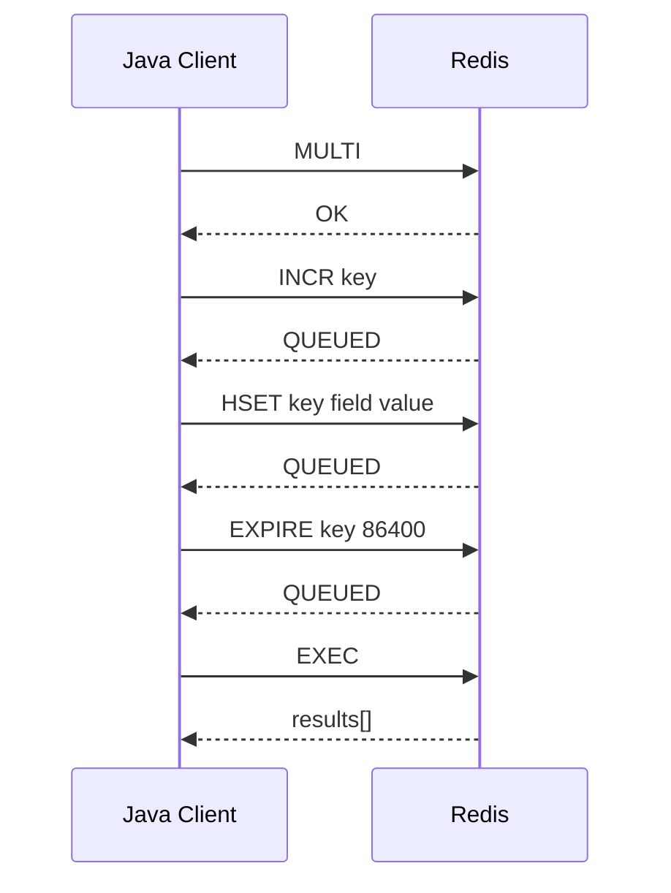
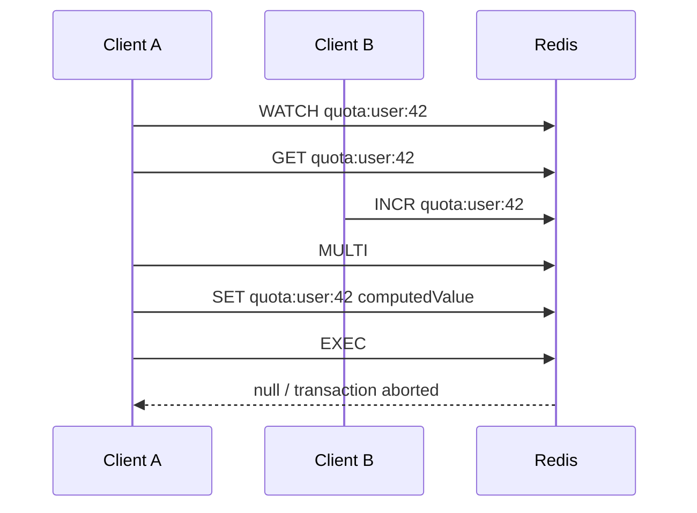
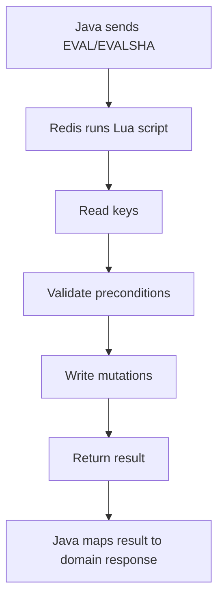
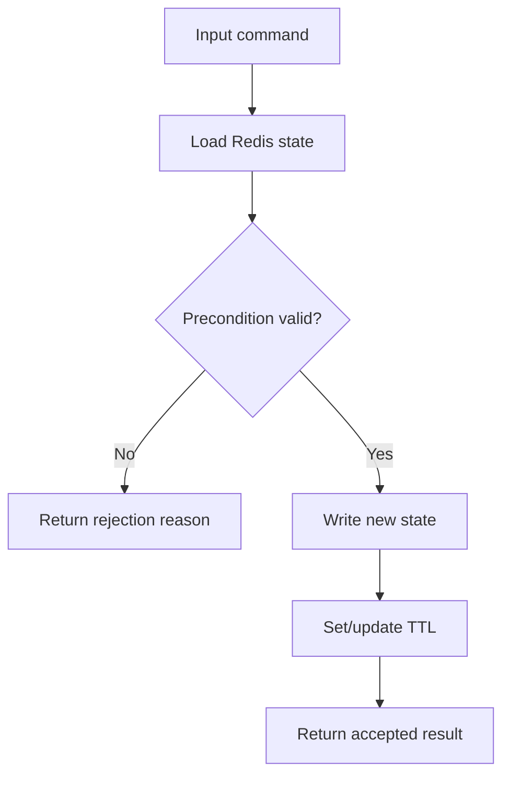

# Part 025 — Transactions, Lua Scripts, Functions, and Atomic Workflows

Part 024 covered Redis performance: latency, throughput, pipelining, batching, payload size, and benchmark discipline.
Now we move into one of the most misunderstood Redis topics:

> How to build correct multi-step workflows on top of Redis.

Redis makes single commands atomic.
That does **not** automatically make an application workflow atomic.
A workflow usually contains:

- read current state
- validate precondition
- compute next state
- write one or more keys
- set TTL
- publish or enqueue a side effect
- return an externally meaningful result

If those steps are executed as multiple round trips from Java, concurrency can interleave between them.
The result can be duplicate processing, lost update, inconsistent TTL, broken quota, incorrect lock ownership, or replayed requests that observe partial state.

The core mental model:

> Redis atomic workflow design is about moving the read-decide-write critical section either into Redis transaction semantics, optimistic concurrency, Lua scripting, or Redis Functions — while keeping the correctness boundary explicit.

---

## 1. Kaufman Skill Decomposition

The skill is not “know MULTI” or “write Lua”.
The real skill is:

> Given a Redis-backed business invariant, choose the weakest atomicity mechanism that preserves that invariant under concurrency, timeout, retry, failover, and Cluster topology.

Breakdown:

| Sub-skill | What you must be able to do |
|---|---|
| Atomicity boundary design | Identify which operations must be indivisible and which can be eventually consistent |
| Command-level atomicity | Know when a native Redis command is already enough |
| Transaction use | Use `MULTI`/`EXEC` safely for queued writes and optimistic CAS with `WATCH` |
| Lua scripting | Move read-decide-write logic into Redis for atomic server-side execution |
| Redis Functions | Package server-side logic as versioned, persistent functions instead of ad-hoc scripts |
| Cluster key design | Keep all keys in an atomic operation in the same hash slot |
| Java integration | Execute scripts/functions through Lettuce, Jedis, or Spring Data Redis without SHA-cache fragility |
| Retry safety | Distinguish retryable transport failures from unsafe duplicate writes |
| Operational safety | Avoid long-running scripts, unbounded loops, dynamic key discovery, and hidden blocking |
| Testing | Prove atomicity with concurrent tests, deterministic fixtures, and invariant checks |

Kaufman-style outcome:

> After this part, you should be able to design and review Redis-backed atomic workflows such as idempotency, rate limiting, session mutation, delayed queue claiming, lock release, and quota update without relying on accidental timing.

---

## 2. The Redis Atomicity Ladder

Do not start with Lua.
Use the simplest mechanism that protects the invariant.

| Level | Mechanism | Use when | Avoid when |
|---|---|---|---|
| 1 | Single command | Redis already has the exact atomic primitive | You need conditional logic across multiple values |
| 2 | Single command with options | `SET NX PX`, `HSETNX`, `ZADD NX`, `EXPIRE NX/XX/GT/LT` expresses the rule | You need read-modify-write based on current value |
| 3 | Pipeline | You only need fewer round trips, not atomicity | You require all-or-nothing or no interleaving |
| 4 | `MULTI`/`EXEC` | You need commands executed together without interleaving | You need to branch based on intermediate results inside the transaction |
| 5 | `WATCH` + `MULTI`/`EXEC` | You need optimistic compare-and-set from the client | High contention would cause many retries |
| 6 | Lua script | You need read-decide-write atomically in one server-side operation | Logic is long, slow, non-deterministic, or operationally hard to manage |
| 7 | Redis Function | You need reusable, deployed, versioned server-side logic | You only need a tiny one-off conditional update |
| 8 | External transactional system | Redis cannot safely own the invariant | Correctness requires consensus, durable transactions, or cross-partition ACID |

Important:

> Pipelining is not atomicity. It is network optimization.

A pipeline reduces round trips.
A transaction controls interleaving.
A script moves logic to the server.
A function packages server-side logic as a manageable unit.

---

## 3. Single-Command Atomicity First

Redis commands execute atomically with respect to other commands.
Many production workflows can be solved with one command plus options.

Examples:

| Workflow | Command shape | Why it works |
|---|---|---|
| Claim idempotency key | `SET key value NX PX ttl` | only first claimant succeeds |
| Increment quota counter | `INCR key` | counter update is atomic |
| Create object if absent | `HSETNX key field value` | field is only written once |
| Add unique event id | `SADD dedup eventId` | membership mutation is atomic |
| Insert leaderboard score only if new | `ZADD NX board score member` | avoids overwriting existing score |
| Extend TTL only when key exists | `EXPIRE key seconds XX` | avoids resurrecting absent state |
| Extend TTL only forward | `EXPIRE key seconds GT` | avoids accidentally shortening lifetime |

When a single command exists, prefer it.
It is faster, simpler, easier to observe, and easier to reason about than Lua.

### Java example: idempotency claim with Lettuce

```java
import io.lettuce.core.SetArgs;
import io.lettuce.core.api.sync.RedisCommands;

public final class IdempotencyClaimStore {
    private final RedisCommands<String, String> redis;

    public IdempotencyClaimStore(RedisCommands<String, String> redis) {
        this.redis = redis;
    }

    public boolean claim(String idempotencyKey, String ownerId, long ttlMillis) {
        String redisKey = "idem:v1:" + idempotencyKey;

        String result = redis.set(
            redisKey,
            ownerId,
            SetArgs.Builder.nx().px(ttlMillis)
        );

        return "OK".equals(result);
    }
}
```

This is a complete atomic claim.
No `GET` is required before the `SET`.

Bad version:

```java
if (redis.get(key) == null) {
    redis.setex(key, ttlSeconds, ownerId);
}
```

That version has a race between `GET` and `SETEX`.
Two clients can observe absence and both write.

---

## 4. MULTI/EXEC Mental Model

Redis transactions are centered around:

- `MULTI`
- queued commands
- `EXEC`
- `DISCARD`
- optionally `WATCH`

A basic transaction:

```redis
MULTI
INCR account:123:debit-count
HSET account:123:last-debit amount 100 currency USD
EXPIRE account:123:last-debit 86400
EXEC
```

Mental model:



Important properties:

1. Commands are queued after `MULTI`.
2. Commands are executed at `EXEC`.
3. Other clients do not interleave while the queued transaction executes.
4. Redis transactions are not SQL transactions.
5. There is no rollback of already executed commands in the SQL sense.
6. You cannot read a value inside the transaction and branch client-side before queuing the next command.

### What MULTI/EXEC is good for

Use it when:

- you already know all commands before execution
- you need commands executed as a contiguous unit
- you do not need server-side branching
- you want cheaper correctness than Lua
- command results are not needed to decide subsequent commands

Example: write object + index + TTL together.

```redis
MULTI
HSET user:123 name "Ari" status "ACTIVE"
SADD users:by-status:ACTIVE 123
EXPIRE user:123 3600
EXEC
```

This avoids an observer seeing only part of the write due to interleaving during transaction execution.

### What MULTI/EXEC is not good for

Avoid it when the logic is:

```text
value = GET key
if value < limit:
    INCR key
    return allowed
else:
    return denied
```

With `MULTI`, the `GET` result is not available until `EXEC`.
So you cannot branch inside the transaction from Java.
For this, use `WATCH` or Lua.

---

## 5. WATCH as Optimistic Concurrency Control

`WATCH` turns a transaction into a compare-and-set workflow.

Pattern:

1. `WATCH key`
2. `GET key`
3. compute new value in Java
4. `MULTI`
5. write new value
6. `EXEC`
7. if `EXEC` returns null/empty conflict indicator, retry



Use `WATCH` when:

- contention is low
- logic is easier in Java than Lua
- conflicting updates can retry
- keys are few
- you can tolerate extra round trips

Avoid `WATCH` when:

- key is hot
- high QPS causes repeated aborts
- branch logic is small enough for Lua
- retry storms are likely
- the value is large and expensive to deserialize repeatedly

### Java CAS example with Jedis-style pseudocode

```java
public boolean updateQuotaWithWatch(String userId, int limit) {
    String key = "quota:v1:{" + userId + "}:minute";

    for (int attempt = 0; attempt < 5; attempt++) {
        jedis.watch(key);

        String raw = jedis.get(key);
        int current = raw == null ? 0 : Integer.parseInt(raw);

        if (current >= limit) {
            jedis.unwatch();
            return false;
        }

        Transaction tx = jedis.multi();
        tx.set(key, Integer.toString(current + 1));
        tx.expire(key, 60);

        List<Object> result = tx.exec();
        if (result != null) {
            return true;
        }

        // Another client modified the watched key.
        // Retry with bounded attempts and jitter in real systems.
    }

    throw new TooMuchContentionException("quota update contention");
}
```

This is correct under low contention.
It is not necessarily efficient under high contention.

### WATCH and business invariants

`WATCH` protects keys, not abstract business concepts.
If the invariant depends on multiple keys, watch all relevant keys.
If the invariant depends on external database state, Redis cannot protect it alone.

Example:

```text
Invariant:
A tenant cannot have more than 10 active exports.

Redis keys:
- export:tenant:{tenantId}:active-count
- export:{exportId}:status
```

Watching only the count key may not protect against races involving status repair, manual cancellation, or delayed worker cleanup.
The model must be explicit.

---

## 6. Lua Scripting Mental Model

Lua scripting lets you execute logic inside Redis.
A script can:

- read keys
- branch based on values
- write keys
- set TTL
- return structured results

All within one atomic server-side execution.



The big benefit:

> Lua eliminates the race between read, decision, and write.

The big danger:

> Lua can hide complex, blocking, hard-to-debug application logic inside Redis.

Use it for small critical sections, not full business services.

---

## 7. Lua Script Anatomy

Example: fixed-window rate limiter.

```lua
-- KEYS[1] = rate-limit key
-- ARGV[1] = max requests
-- ARGV[2] = ttl seconds

local current = redis.call('INCR', KEYS[1])

if current == 1 then
  redis.call('EXPIRE', KEYS[1], tonumber(ARGV[2]))
end

if current > tonumber(ARGV[1]) then
  return {0, current}
end

return {1, current}
```

Call shape:

```redis
EVAL "...script..." 1 rl:v1:{tenant-123}:api:2026-07-02T14:00 100 60
```

Rules:

| Rule | Reason |
|---|---|
| Put key names in `KEYS` | Redis Cluster and command routing need key visibility |
| Put values/config in `ARGV` | Avoid treating non-key values as keys |
| Keep scripts short | Redis is blocked while script runs |
| Avoid unbounded loops | One slow script can damage global latency |
| Return small structured values | Java mapping should be predictable |
| Do not generate dynamic key names inside Lua | Cluster correctness and reviewability suffer |
| Version scripts | Return contracts and semantics evolve over time |

---

## 8. Lua Pattern: Safe Lock Release

The classic lock release bug:

```java
redis.del(lockKey);
```

This can delete another client's lock if the lease expired and was reacquired.

Correct pattern:

```lua
-- KEYS[1] = lock key
-- ARGV[1] = expected owner token

if redis.call('GET', KEYS[1]) == ARGV[1] then
  return redis.call('DEL', KEYS[1])
end

return 0
```

Java wrapper:

```java
public boolean releaseLock(String lockKey, String ownerToken) {
    String script = """
        if redis.call('GET', KEYS[1]) == ARGV[1] then
          return redis.call('DEL', KEYS[1])
        end
        return 0
        """;

    Long result = redis.eval(script, ScriptOutputType.INTEGER, new String[] { lockKey }, ownerToken);
    return result != null && result == 1L;
}
```

Invariant:

> Only the current owner token can release the lock.

This still does not solve stale owner writes to an external resource.
For that, use fencing tokens as discussed in Part 018.

---

## 9. Lua Pattern: Idempotency State Machine

A robust idempotency key often needs more than `SET NX`.
It may need states:

- `IN_PROGRESS`
- `COMPLETED`
- `FAILED_RETRYABLE`
- `FAILED_FINAL`

Claim script:

```lua
-- KEYS[1] = idempotency hash key
-- ARGV[1] = owner token
-- ARGV[2] = now millis
-- ARGV[3] = in-progress ttl seconds

local state = redis.call('HGET', KEYS[1], 'state')

if not state then
  redis.call('HSET', KEYS[1],
    'state', 'IN_PROGRESS',
    'owner', ARGV[1],
    'startedAt', ARGV[2]
  )
  redis.call('EXPIRE', KEYS[1], tonumber(ARGV[3]))
  return {'CLAIMED'}
end

if state == 'COMPLETED' then
  local status = redis.call('HGET', KEYS[1], 'status')
  local body = redis.call('HGET', KEYS[1], 'body')
  return {'REPLAY', status or '', body or ''}
end

return {'BUSY', state}
```

Complete script:

```lua
-- KEYS[1] = idempotency hash key
-- ARGV[1] = expected owner token
-- ARGV[2] = response status
-- ARGV[3] = response body
-- ARGV[4] = completed ttl seconds

local owner = redis.call('HGET', KEYS[1], 'owner')
local state = redis.call('HGET', KEYS[1], 'state')

if owner ~= ARGV[1] or state ~= 'IN_PROGRESS' then
  return 0
end

redis.call('HSET', KEYS[1],
  'state', 'COMPLETED',
  'status', ARGV[2],
  'body', ARGV[3]
)
redis.call('EXPIRE', KEYS[1], tonumber(ARGV[4]))
return 1
```

Why Lua helps:

- claim is atomic
- replay detection is atomic
- owner validation is atomic
- TTL is attached in the same critical section
- Java does not interpret partial state between commands

Failure boundary:

> Redis can make the idempotency state atomic. It cannot make your downstream database write and Redis completion marker one atomic distributed transaction.

You still need outbox, reconciliation, or recovery if the process crashes between DB commit and Redis completion update.

---

## 10. Lua Pattern: Sliding Window Rate Limit

Sorted-set sliding window:

```lua
-- KEYS[1] = zset key
-- ARGV[1] = now millis
-- ARGV[2] = window millis
-- ARGV[3] = limit
-- ARGV[4] = request id
-- ARGV[5] = ttl seconds

local now = tonumber(ARGV[1])
local window = tonumber(ARGV[2])
local limit = tonumber(ARGV[3])
local requestId = ARGV[4]

redis.call('ZREMRANGEBYSCORE', KEYS[1], 0, now - window)
local count = redis.call('ZCARD', KEYS[1])

if count >= limit then
  local oldest = redis.call('ZRANGE', KEYS[1], 0, 0, 'WITHSCORES')
  return {0, count, oldest[2] or ''}
end

redis.call('ZADD', KEYS[1], now, requestId)
redis.call('EXPIRE', KEYS[1], tonumber(ARGV[5]))

return {1, count + 1, ''}
```

Atomic invariant:

> No two clients can both observe capacity and insert beyond the limit without the script serializing their decisions.

Trade-offs:

| Dimension | Impact |
|---|---|
| Accuracy | High; tracks individual requests |
| Memory | O(number of requests in window) |
| CPU | `ZREMRANGEBYSCORE`, `ZCARD`, `ZADD` per request |
| Hot key risk | High for very active tenant/global limits |
| Cluster | All keys for one limiter must be in the same slot |

For extreme QPS, use sliding-window counter or token bucket to reduce cardinality.

---

## 11. Lua Pattern: Atomic Multi-Structure Update

Example: write session state and update reverse index.

```lua
-- KEYS[1] = session hash
-- KEYS[2] = user session set
-- ARGV[1] = session id
-- ARGV[2] = user id
-- ARGV[3] = now millis
-- ARGV[4] = ttl seconds

redis.call('HSET', KEYS[1],
  'sessionId', ARGV[1],
  'userId', ARGV[2],
  'lastSeenAt', ARGV[3]
)
redis.call('EXPIRE', KEYS[1], tonumber(ARGV[4]))

redis.call('SADD', KEYS[2], ARGV[1])
redis.call('EXPIRE', KEYS[2], tonumber(ARGV[4]) + 60)

return 1
```

Cluster-safe key design:

```text
session:v1:{user-42}:sess-abc
user-session:v1:{user-42}
```

The hash tag `{user-42}` ensures both keys map to the same hash slot.

Bad key design:

```text
session:v1:sess-abc
user-session:v1:user-42
```

Those may be in different slots in Redis Cluster.
A single script cannot atomically update them in Cluster mode.

---

## 12. Redis Cluster Constraints for Atomic Workflows

In Redis Cluster, multi-key atomic operations must respect hash slots.

Design rule:

> Every key touched by one transaction/script/function must be known up front and must belong to the same hash slot.

Use hash tags intentionally:

```text
quota:v1:{tenant-123}:api:minute:202607021400
quota:v1:{tenant-123}:api:day:20260702
quota:v1:{tenant-123}:meta
```

This allows tenant-scoped multi-key atomic logic.

Do not use hash tags casually:

```text
cache:{global}:product:1
cache:{global}:product:2
cache:{global}:product:3
```

That creates a global hot slot.

Good hash tag selection:

| Invariant scope | Hash tag |
|---|---|
| Per user | `{userId}` |
| Per tenant | `{tenantId}` |
| Per order | `{orderId}` |
| Per account | `{accountId}` |
| Per API client | `{clientId}` |

Bad hash tag selection:

| Hash tag | Problem |
|---|---|
| `{global}` | destroys sharding |
| `{cache}` | puts unrelated cache keys in one slot |
| `{today}` | creates time-window hot slot |
| `{status}` | concentrates by low-cardinality dimension |

---

## 13. EVAL, EVALSHA, and Script Cache

`EVAL` sends the full script source.
`EVALSHA` sends a hash of a script that Redis already has in its script cache.

Operational pattern:

1. load script at application startup using `SCRIPT LOAD`
2. keep SHA in memory
3. execute using `EVALSHA`
4. fallback to `EVAL` or reload on `NOSCRIPT`

But there is a caveat:

> `NOSCRIPT` handling is harder inside pipelines because responses are returned later.

For simple systems, using client libraries' script abstraction is often safer than hand-rolling SHA lifecycle.
For large systems, package scripts or functions as versioned deployment artifacts.

### Versioned script naming

Even though Redis identifies scripts by SHA, humans need names:

```text
rate_limit_sliding_window_v3.lua
idempotency_claim_v2.lua
lock_release_v1.lua
session_touch_v4.lua
```

Store metadata in code:

```java
public enum RedisScriptName {
    RATE_LIMIT_SLIDING_WINDOW_V3("rate_limit_sliding_window_v3"),
    IDEMPOTENCY_CLAIM_V2("idempotency_claim_v2"),
    LOCK_RELEASE_V1("lock_release_v1");

    private final String logicalName;

    RedisScriptName(String logicalName) {
        this.logicalName = logicalName;
    }
}
```

Do not let random inline script strings spread across service code.

---

## 14. Redis Functions Mental Model

Redis Functions are server-side libraries loaded into Redis and called by name.
They are operationally different from ad-hoc scripts:

| Aspect | Lua script via EVAL | Redis Function |
|---|---|---|
| Deployment | application sends script | function library loaded into Redis |
| Invocation | `EVAL` / `EVALSHA` | `FCALL` / `FCALL_RO` |
| Lifecycle | script cache can be flushed | library/function managed as database asset |
| Reuse | per application convention | named reusable function |
| Versioning | app-level naming | library-level deployment strategy |
| Operational fit | small app-owned logic | shared server-side primitives |

Use Redis Functions when:

- multiple services need the same primitive
- script logic is stable and reusable
- you want explicit server-side deployment
- you need cleaner operational lifecycle than script cache
- functions are part of platform infrastructure

Avoid Redis Functions when:

- logic changes frequently with one application
- deployment coordination is weak
- different services need incompatible versions
- the logic belongs in application/domain layer
- rollback strategy is unclear

Example function library shape:

```lua
#!lua name=quota_lib

redis.register_function('fixed_window_allow', function(keys, args)
  local current = redis.call('INCR', keys[1])
  if current == 1 then
    redis.call('EXPIRE', keys[1], tonumber(args[2]))
  end

  if current > tonumber(args[1]) then
    return {0, current}
  end

  return {1, current}
end)
```

Invocation:

```redis
FCALL fixed_window_allow 1 quota:v1:{tenant-123}:api:minute 100 60
```

Platform rule:

> Treat Redis Functions like database migrations: reviewed, versioned, deployed, tested, and rollback-aware.

---

## 15. Java Integration Patterns

### Pattern A: Script wrapper class

Do not call raw script strings from business services.
Wrap them.

```java
public final class RedisRateLimiterScripts {
    private final RedisCommands<String, String> redis;
    private final String slidingWindowScript;

    public RedisRateLimiterScripts(RedisCommands<String, String> redis, String slidingWindowScript) {
        this.redis = redis;
        this.slidingWindowScript = slidingWindowScript;
    }

    public RateLimitDecision allow(String key, long nowMillis, long windowMillis, int limit, String requestId) {
        @SuppressWarnings("unchecked")
        List<Object> result = redis.eval(
            slidingWindowScript,
            ScriptOutputType.MULTI,
            new String[] { key },
            Long.toString(nowMillis),
            Long.toString(windowMillis),
            Integer.toString(limit),
            requestId,
            Long.toString((windowMillis / 1000) + 5)
        );

        boolean allowed = "1".equals(String.valueOf(result.get(0)));
        long count = Long.parseLong(String.valueOf(result.get(1)));
        String oldest = String.valueOf(result.get(2));

        return new RateLimitDecision(allowed, count, oldest);
    }
}
```

Business service calls a domain method:

```java
RateLimitDecision decision = limiter.allowApiRequest(tenantId, apiName, requestId);

if (!decision.allowed()) {
    throw new RateLimitExceededException(decision.retryAfterMillis());
}
```

### Pattern B: Stable return envelope

Avoid return values like:

```lua
return 1
```

if future versions may need more detail.

Prefer:

```lua
return {'ALLOWED', current, resetAt}
```

or:

```lua
return cjson.encode({
  decision = 'ALLOWED',
  count = current,
  resetAt = resetAt
})
```

Trade-off:

| Return format | Pros | Cons |
|---|---|---|
| Array | fast, compact | positional, brittle |
| JSON string | self-describing | serialization overhead |
| Integer code | compact | hard to evolve |
| Status + fields | balanced | needs mapping discipline |

For hot paths, arrays are fine if wrapped tightly.
For platform scripts, self-describing results may be worth the cost.

### Pattern C: Typed domain response

```java
public record AtomicWorkflowResult(
    String status,
    Map<String, String> fields
) {
    public boolean isAllowed() {
        return "ALLOWED".equals(status);
    }
}
```

Do not leak raw Redis script arrays beyond the infrastructure boundary.

---

## 16. Error and Timeout Semantics

Atomic operation wrappers must define what happens on:

- Redis timeout
- connection reset
- script error
- `NOSCRIPT`
- MOVED/ASK redirect
- READONLY during failover
- cluster slot migration
- response mapping error
- Java thread interruption

Critical distinction:

> A client timeout does not prove Redis did not execute the operation.

Example:

```text
Client sends script.
Redis executes script and writes state.
Network stalls before response reaches client.
Client times out.
Client retries.
```

If the script is not idempotent, retry may duplicate mutation.

Therefore:

- make atomic scripts idempotent where possible
- include request ids for mutation workflows
- store result markers for replay
- use owner tokens for lock-like operations
- avoid blind retry of non-idempotent scripts
- distinguish read-only scripts/functions from mutating ones

### Timeout classification

| Operation | Safe blind retry? | Reason |
|---|---:|---|
| `GET key` | Usually yes | read-only |
| `SET key value` | Sometimes | overwrites may be safe if value deterministic |
| `INCR key` | No | duplicate increment changes state |
| idempotency claim script | Usually yes | if keyed by request id and returns existing state |
| lock release script | Usually yes | owner-token compare makes it stable |
| queue claim script | No unless request/worker idempotent | may move jobs or update attempts |
| rate limiter script | Usually no | retry consumes extra quota unless request id dedup is included |

---

## 17. Atomic Workflow Design Templates

### Template 1: Read-decide-write

Use Lua when all state is Redis-owned.



Examples:

- quota allow/deny
- idempotency claim
- sliding window insertion
- lock release
- session touch with max idle

### Template 2: Compare owner token

Use for leases and owned state transitions.

```text
if currentOwner != expectedOwner:
    return NOT_OWNER
else:
    mutate
    return OK
```

Examples:

- lock release
- worker heartbeat
- job completion
- in-progress idempotency completion

### Template 3: Monotonic version/fencing

Use for ordered mutation.

```text
version = INCR version-key
write state with version
return version
```

Consumers must reject stale versions.
Redis can generate the token.
The external resource must enforce it.

### Template 4: Request-id dedup inside mutating script

Use for retry-safe mutation.

```text
if requestId already seen:
    return previous result
else:
    perform mutation
    remember requestId/result
    return result
```

This is how you make `INCR`-like semantics retry-safe.

---

## 18. Anti-Patterns

### Anti-pattern 1: GET then SET for conditional updates

Bad:

```java
String current = redis.get(key);
if (current == null) {
    redis.setex(key, 60, value);
}
```

Use:

```redis
SET key value NX EX 60
```

or Lua if condition is more complex.

### Anti-pattern 2: Lua as business process engine

Bad script responsibilities:

- parse complex domain JSON
- implement long state machine
- scan thousands of keys
- generate reports
- call large aggregations on request path
- encode business policy that changes weekly

Redis scripts should protect small invariants.
They should not become a hidden microservice.

### Anti-pattern 3: Dynamic key discovery inside script

Bad:

```lua
local keys = redis.call('KEYS', 'tenant:*:quota')
for i, key in ipairs(keys) do
  redis.call('DEL', key)
end
```

Problems:

- blocks Redis
- breaks Cluster key-slot reasoning
- unsafe at scale
- hard to test
- unpredictable latency

### Anti-pattern 4: Huge result payloads

Bad:

```lua
return redis.call('HGETALL', KEYS[1])
```

inside a hot path for a large hash.

Prefer returning only fields required by the decision.

### Anti-pattern 5: Treating transaction as rollback-capable SQL transaction

Redis transaction errors and rollback semantics are different from relational transactions.
Design commands so partial semantic assumptions do not depend on SQL-style rollback.

### Anti-pattern 6: No script versioning

Bad:

```java
redis.eval("if redis.call('GET', KEYS[1]) then ...", ...)
```

spammed across codebase.

Better:

```text
scripts/
  idempotency_claim_v1.lua
  idempotency_complete_v1.lua
  rate_limit_sliding_window_v2.lua
  lock_release_v1.lua
```

with tests and checksums.

---

## 19. Testing Atomic Workflows

Atomicity bugs are concurrency bugs.
Unit tests alone are not enough.

### Test layers

| Layer | Purpose |
|---|---|
| Lua unit fixture | Validate return values for known Redis states |
| Integration test | Execute against real Redis using Testcontainers |
| Concurrent stress test | Many threads/processes hit same key and assert invariant |
| Retry simulation | Timeout/retry duplicate request id and assert no duplicate mutation |
| Cluster test | Validate hash slot key design and MOVED/ASK behavior |
| Failover test | Observe behavior during connection reset and primary switch |
| Property test | Generate random interleavings and assert invariant |

### Example invariant test: rate limit never exceeds limit

```java
@Test
void slidingWindowLimiterNeverAllowsMoreThanLimit() throws Exception {
    int limit = 100;
    String key = "rl:v1:{tenant-42}:api:test";

    ExecutorService pool = Executors.newFixedThreadPool(32);
    CountDownLatch start = new CountDownLatch(1);
    AtomicInteger allowed = new AtomicInteger();

    List<Future<?>> futures = IntStream.range(0, 1000)
        .mapToObj(i -> pool.submit(() -> {
            start.await();
            RateLimitDecision decision = limiter.allow(key, "req-" + i);
            if (decision.allowed()) {
                allowed.incrementAndGet();
            }
            return null;
        }))
        .toList();

    start.countDown();

    for (Future<?> future : futures) {
        future.get(10, TimeUnit.SECONDS);
    }

    assertThat(allowed.get()).isLessThanOrEqualTo(limit);
}
```

Do not only test happy path with sequential calls.

---

## 20. Observability for Atomic Workflows

You need visibility at four levels:

| Level | Signal |
|---|---|
| Application | operation name, status, business result, latency, retry count |
| Redis command | `EVAL`, `EVALSHA`, `FCALL`, command latency, errors |
| Script/function | logical script name/version, input key count, return status |
| System | slowlog, latency spikes, CPU, memory, blocked clients, cluster redirects |

Recommended app metrics:

```text
redis.atomic.operation.count{operation,status}
redis.atomic.operation.latency{operation}
redis.atomic.operation.retry.count{operation,reason}
redis.atomic.operation.timeout.count{operation}
redis.atomic.script.noscript.count{script}
redis.atomic.script.error.count{script,errorType}
redis.atomic.result.count{operation,result}
```

Log fields:

```json
{
  "event": "redis_atomic_workflow",
  "operation": "rate_limit_sliding_window",
  "version": "v3",
  "keyHashTag": "tenant-123",
  "result": "DENIED",
  "latencyMs": 3,
  "attempt": 1
}
```

Do not log full Redis keys when they contain user identifiers or secrets.
Hash or redact sensitive dimensions.

---

## 21. Operational Safety

### Keep scripts bounded

Every loop must have a clear maximum.

Bad:

```lua
while true do
  -- keep scanning
end
```

Better:

```lua
local maxItems = tonumber(ARGV[1])
for i = 1, maxItems do
  -- bounded work
end
```

### Avoid heavy commands in scripts

Be careful with:

- `KEYS`
- large `HGETALL`
- large `SMEMBERS`
- large `ZRANGE`
- unbounded `SCAN`-like loops
- deleting huge keys synchronously

### Prefer small critical sections

A good Lua script often does:

- 1–5 reads
- 1–5 writes
- simple branching
- simple numeric/string comparisons
- small return envelope

If the script needs a design document to understand business semantics, it may belong in application code.

### Plan rollout and rollback

For each script/function:

| Deployment question | Required answer |
|---|---|
| How is it versioned? | filename/function name/version field |
| Who loads it? | app startup, migration job, platform bootstrap |
| How is SHA cached? | client abstraction or explicit registry |
| What happens on NOSCRIPT? | reload/fallback policy |
| Can old and new app versions coexist? | stable return contract or dual scripts |
| How is rollback performed? | keep old function/script until consumers migrate |
| How is it tested? | fixture + integration + concurrency |

---

## 22. Decision Matrix

| Problem | Preferred mechanism | Why |
|---|---|---|
| Set value only if absent with TTL | `SET NX EX/PX` | native atomic primitive |
| Increment counter | `INCR` | native atomic primitive |
| Write several known values together | `MULTI`/`EXEC` | no branch needed |
| Optimistic object update under low contention | `WATCH` + `MULTI` | easier in Java |
| Rate limit read-count-insert | Lua | read-decide-write atomicity |
| Lock release by owner token | Lua | compare-and-delete must be atomic |
| Shared platform quota primitive | Redis Function | reusable server-side logic |
| Cross-tenant/global invariant in Cluster | External system or redesigned keying | cross-slot atomicity problem |
| Money/accounting correctness | Database transaction/ledger system | Redis can assist but should not own ledger invariant |
| Long workflow with side effects | Application saga/outbox/workflow engine | Redis script is too narrow |

---

## 23. Production Checklist

Before shipping a Redis atomic workflow:

- [ ] The invariant is written in one sentence.
- [ ] The keys participating in the invariant are listed.
- [ ] The atomicity mechanism is justified.
- [ ] Cluster hash slot behavior is verified.
- [ ] The operation is safe or explicitly unsafe to retry after timeout.
- [ ] Script/function return contract is versioned.
- [ ] No unbounded loops exist.
- [ ] No large unbounded reads are used.
- [ ] TTL behavior is part of the atomic section if required.
- [ ] Owner/request tokens are used where duplicate/retry risk exists.
- [ ] Concurrent tests assert the invariant.
- [ ] Application metrics expose result, latency, retry, timeout, and errors.
- [ ] Rollout and rollback plan exists.

---

## 24. 20-Hour Practice Block

Use this part as deliberate practice, not passive reading.

### Hour 1–3: Native atomic primitives

Implement:

- idempotency claim with `SET NX PX`
- unique event dedup with `SADD`
- fixed counter with `INCR` + TTL
- safe TTL extension with `EXPIRE GT`

Write concurrency tests.

### Hour 4–6: MULTI/EXEC and WATCH

Implement:

- profile update + secondary index in one transaction
- optimistic quota update with `WATCH`
- retry limit with jitter

Measure abort rate under contention.

### Hour 7–11: Lua scripts

Implement scripts for:

- safe lock release
- idempotency claim/complete
- sliding window limiter
- worker heartbeat with owner token

Write fixture tests and integration tests.

### Hour 12–15: Cluster-safe key design

For each workflow:

- list keys
- choose hash tag
- verify same slot
- identify hot-slot risk

### Hour 16–18: Failure simulation

Inject:

- client timeout
- duplicate retry
- Redis restart
- script cache flush
- connection reset

Record which operations are retry-safe.

### Hour 19–20: Review and playbook

Create a one-page decision guide:

- invariant
- mechanism
- retry policy
- key design
- test coverage
- operational metrics

---

## 25. Part Summary

Redis atomic workflow engineering is about choosing the correct place for the critical section.

Use this ladder:

```text
single command
→ command with options
→ MULTI/EXEC
→ WATCH + MULTI
→ Lua script
→ Redis Function
→ external transactional/consensus system
```

The key lessons:

- Pipelining is not atomicity.
- `MULTI`/`EXEC` queues commands but does not provide SQL-style rollback.
- `WATCH` is optimistic concurrency control and works best under low contention.
- Lua is excellent for small read-decide-write critical sections.
- Redis Functions are better for shared, versioned server-side primitives.
- In Cluster, all keys in one atomic operation must be in the same hash slot.
- Client timeout does not prove the operation did not execute.
- Atomic Redis state does not make external database or side-effect workflows atomic.

Top 1% Redis engineers do not ask, “Can I write this in Lua?”
They ask:

> What invariant am I protecting, where is the critical section, what happens on retry, and what is the weakest mechanism that preserves correctness?

---

## References

- Redis Docs — Transactions: https://redis.io/docs/latest/develop/using-commands/transactions/
- Redis Docs — Scripting with Lua: https://redis.io/docs/latest/develop/programmability/eval-intro/
- Redis Docs — EVAL command: https://redis.io/docs/latest/commands/eval/
- Redis Docs — Redis Functions: https://redis.io/docs/latest/develop/programmability/functions-intro/
- Redis Docs — Redis Cluster specification and key hash tags: https://redis.io/docs/latest/operate/oss_and_stack/reference/cluster-spec/
- Redis Docs — Distributed locks: https://redis.io/docs/latest/develop/clients/patterns/distributed-locks/
