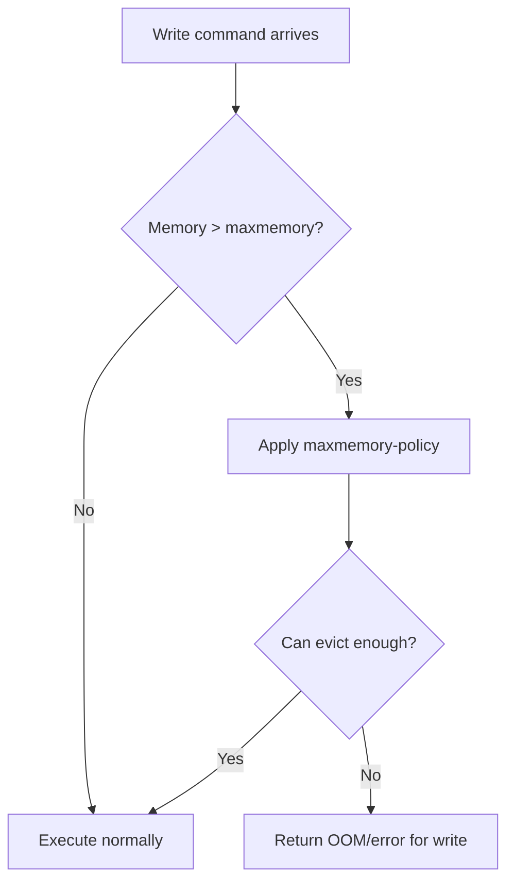
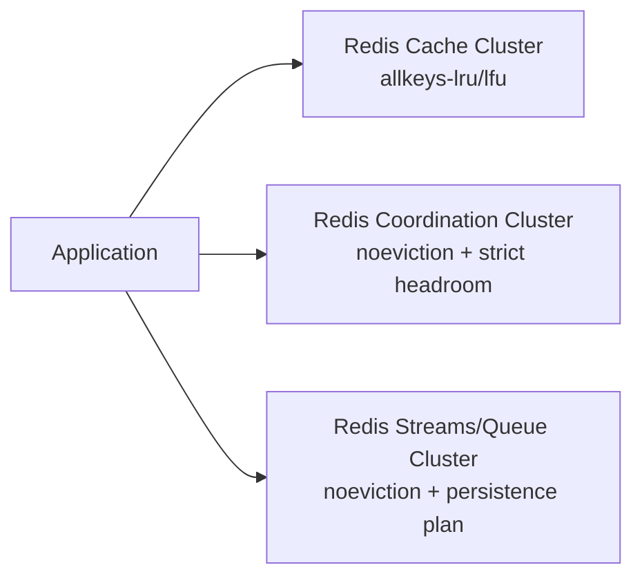
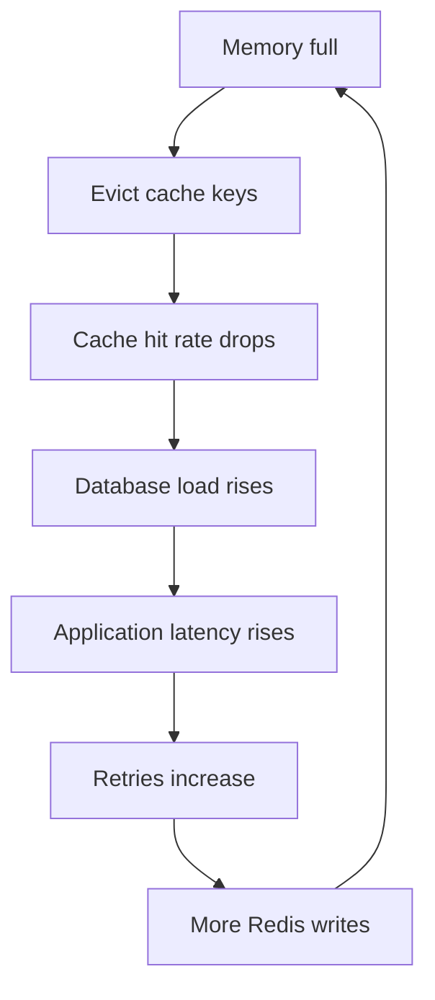

# Part 026 — Memory Engineering: Encoding, Eviction, TTL, Fragmentation, and Hot Keys

Part 025 covered transactions, Lua scripts, Redis Functions, and atomic workflows.
Now we shift to the resource that defines Redis more than anything else:

> Memory.

Redis is fast because your working data is primarily in memory.
That means memory is not merely a storage concern.
It is also:

- a latency concern
- a reliability concern
- a cost concern
- a scaling concern
- a data modeling concern
- an eviction correctness concern
- a Java serialization concern

The core mental model:

> Redis memory engineering is the discipline of designing key count, value size, data structure encoding, TTL distribution, eviction policy, replication overhead, and hot-key behavior so memory pressure remains predictable under normal load, spikes, failover, and data growth.

---

## 1. Kaufman Skill Decomposition

The skill is not “set maxmemory”.
The real skill is:

> Given a Redis workload, estimate memory growth, choose structures and TTLs intentionally, prevent hot/large key pathologies, configure eviction safely, and operate with enough headroom for persistence, replication, failover, and fragmentation.

Breakdown:

| Sub-skill | What you must be able to do |
|---|---|
| Memory mental model | Understand used memory, RSS, overhead, allocator fragmentation, and dataset size |
| Data structure sizing | Estimate key/value overhead and cardinality-driven memory growth |
| Encoding awareness | Know how small hashes/lists/sets/zsets can use compact encodings and when they expand |
| TTL engineering | Design expiration semantics, jitter, cleanup, and lifecycle ownership |
| Eviction policy | Select `noeviction`, LRU/LFU/random/TTL policies based on correctness |
| Capacity planning | Budget dataset, overhead, replicas, buffers, persistence, and growth headroom |
| Hot key mitigation | Detect and reduce concentrated QPS on individual keys or hash slots |
| Large key mitigation | Avoid huge values/memberships that cause latency, memory, and migration issues |
| Java payload discipline | Measure serialized size, compression trade-offs, and schema overhead |
| Operational response | Diagnose memory spikes, fragmentation, eviction storms, and OOM risk |

Kaufman-style outcome:

> After this part, you should be able to review a Redis schema and predict whether it will fail by memory growth, hot keys, eviction semantics, fragmentation, or serialization bloat.

---

## 2. Redis Memory Is Not Just Your Values

A common beginner estimate:

```text
memory = sum(serialized value sizes)
```

This is wrong.

A better model:

```text
Redis memory ≈
  key bytes
+ value bytes
+ object metadata
+ data structure overhead
+ allocator overhead
+ expiration metadata
+ client buffers
+ replication backlog/buffers
+ AOF/RDB rewrite overhead
+ fragmentation
+ temporary command/result memory
+ module/index memory
```

For Redis Search/JSON/Time Series/probabilistic/vector features, add:

```text
+ index structures
+ token dictionaries
+ posting lists
+ vector index memory
+ labels/metadata
+ compaction/downsampled series
```

The practical consequence:

> Small keys and small values are not free. High key count can be expensive even when each value is tiny.

---

## 3. Memory Observability Vocabulary

You cannot engineer what you cannot name.

Important signals from `INFO MEMORY` and related tooling:

| Signal | Meaning | Why it matters |
|---|---|---|
| `used_memory` | Memory allocated by Redis allocator | Main application-level memory signal |
| `used_memory_human` | Human-readable version | Quick inspection |
| `used_memory_rss` | Memory seen by OS resident set | Includes fragmentation/allocator behavior |
| `mem_fragmentation_ratio` | RSS divided by allocator-used memory approximation | High ratio may indicate fragmentation |
| `maxmemory` | Configured memory ceiling for data | Controls eviction/OOM behavior |
| `maxmemory_policy` | Eviction behavior | Defines correctness under pressure |
| `evicted_keys` | Count of evicted keys | Indicates pressure and possible data loss for cache keys |
| `expired_keys` | Count of expired keys | Indicates TTL lifecycle activity |
| `keyspace_hits/misses` | Cache efficiency | Helps reason about memory usefulness |
| `mem_clients_normal` | Client buffer memory | Spikes can indicate slow clients or huge responses |
| `mem_replication_backlog` | Replication backlog memory | Needed for replica partial resync |
| `allocator_frag_ratio` | Allocator fragmentation detail | More precise fragmentation signal |

Do not use one number alone.
Use a narrative:

```text
Dataset grew 18% week over week.
used_memory is at 76% of maxmemory.
RSS is 1.35x allocator-used memory.
Evictions started after traffic spike.
Top key pattern is session hash with 20M keys.
Average serialized payload increased after release 2026.07.02.
```

That is engineering.

---

## 4. Key Count vs Value Size

Two Redis systems can use the same total value bytes but behave very differently.

### System A: many tiny keys

```text
10,000,000 keys × 40-byte values
```

Risks:

- key metadata overhead dominates
- expiration metadata if TTL exists
- dictionary resizing cost
- keyspace scanning is expensive
- cluster slot distribution matters
- backup/restore contains huge key count

### System B: fewer larger structures

```text
100,000 hashes × 100 fields
```

Risks:

- large hash access can become heavy
- partial TTL may be harder unless using field expiration features
- hot parent key risk
- eviction removes entire parent key
- rebalancing/migration can be heavier

### Decision principle

| Requirement | Prefer |
|---|---|
| independent TTL per item | separate keys or field-expiration-aware design |
| atomic group update | one hash or same-slot keys |
| frequent partial field update | hash |
| huge per-user collection | shard into buckets |
| independent eviction | separate keys |
| low key overhead | grouped structure |
| avoid hot parent | separate/sharded keys |

There is no universally correct shape.
The shape follows lifecycle, access pattern, and failure model.

---

## 5. Key Naming Memory Discipline

Readable keys are good.
Excessively verbose keys are expensive at scale.

Bad at high cardinality:

```text
production:identity-service:tenant:tenant-123456789:user:user-987654321:session:session-abcdef:metadata:v1
```

Better:

```text
sess:v1:{tenant-123456789}:user-987654321:session-abcdef
```

Even better if the tenant/user context is in the value and the key only needs uniqueness:

```text
sess:v1:{tenant-123456789}:session-abcdef
```

Trade-off:

| Key property | Benefit | Cost |
|---|---|---|
| Human-readable | easier debugging | more bytes |
| Short prefix | memory efficient | less self-documenting |
| Hash tag | Cluster atomicity/routing | hot slot risk if low-cardinality |
| Version marker | migration control | extra bytes |
| Multi-dimension key | direct lookup | cardinality explosion |

Rule:

> A key format should be short enough for scale and structured enough for operations.

---

## 6. Value Size Discipline in Java

Java engineers often accidentally bloat Redis values through serialization.

Common causes:

- storing full DTOs instead of read-model slices
- including null/default fields
- serializing class metadata
- using Java native serialization
- storing nested object graphs
- storing debug fields in hot keys
- storing duplicated text labels in millions of entries
- gzip-compressing tiny values and increasing size
- JSON field names repeated in every object

Example:

```json
{
  "customerIdentifier": "cust-123",
  "customerLifecycleStatus": "ACTIVE",
  "customerSegmentationTier": "GOLD",
  "customerRiskAssessmentSummary": {
    "currentRiskLevel": "LOW",
    "lastRiskEvaluationTimestamp": "2026-07-02T14:00:00Z"
  }
}
```

For a hot read model, maybe this is enough:

```json
{"id":"cust-123","st":"A","tier":"G","risk":"L","rev":42}
```

Do not blindly minify everything.
But for millions of keys, payload envelope matters.

### Java payload measurement test

```java
@Test
void serializedCustomerCachePayloadMustStaySmall() throws Exception {
    CustomerCacheEntry entry = sampleEntry();

    byte[] bytes = objectMapper.writeValueAsBytes(entry);

    assertThat(bytes.length)
        .as("customer cache payload size")
        .isLessThanOrEqualTo(512);
}
```

This is a production-grade practice:

> Treat serialized Redis payload size as an API contract.

---

## 7. Encoding Awareness

Redis internally uses optimized encodings for small data structures.
You do not usually control the exact encoding directly in application code, but you must understand the pattern:

> Small compact structures are efficient until thresholds are crossed; after that Redis may use a less compact representation optimized for larger operations.

Examples of encoding-aware thinking:

| Structure | Compact when | Risk when it grows |
|---|---|---|
| Hash | few/small fields | many fields or large values increase overhead |
| List | compact sequential values | huge lists create latency and migration issues |
| Set | small integer-like members may be compact | arbitrary strings/many members require hash table representation |
| Sorted Set | small compact representation possible | large zsets maintain score ordering with more overhead |
| JSON | expressive document | nested documents and indexes can multiply memory |
| Search index | fast query | index memory can exceed source document memory |
| Vector index | semantic retrieval | embeddings and index structures are memory-heavy |

Do not memorize internal thresholds as architecture.
They can change by Redis version/config.
Instead, measure with production-like data using:

```redis
MEMORY USAGE key
OBJECT ENCODING key
INFO MEMORY
```

### Practical workflow

1. Generate 100k realistic keys.
2. Load into Redis.
3. Measure total memory.
4. Measure representative `MEMORY USAGE`.
5. Increase field count/value size.
6. Observe memory slope.
7. Repeat with alternative modeling.

Architecture should be based on measured slope, not intuition.

---

## 8. TTL Engineering

TTL is not just cleanup.
TTL is part of correctness.

Questions:

| Question | Why it matters |
|---|---|
| Who owns the lifecycle? | DB row, session, event, cache writer, worker? |
| Is expiry correctness-sensitive? | lock/idempotency/session semantics depend on it |
| Is TTL absolute or sliding? | impacts refresh traffic and memory growth |
| Should TTL have jitter? | avoids synchronized expiration storm |
| What happens if TTL is missing? | memory leak or durable state? |
| What happens if key expires early? | duplicate processing or stale denial? |
| What happens if key never expires? | unbounded memory growth |

### TTL types

| Type | Example | Risk |
|---|---|---|
| Fixed TTL | cache product for 10 minutes | stampede at boundary |
| Sliding TTL | extend session on access | write amplification |
| Logical TTL | store expiry timestamp in value | requires app enforcement |
| Jittered TTL | 10 min ± random 60 sec | harder exact debugging |
| No TTL | durable Redis-owned state | must have explicit cleanup/capacity plan |

### TTL jitter

Bad:

```java
redis.setex(key, 3600, value);
```

for millions of keys written by the same batch.

Better:

```java
int baseSeconds = 3600;
int jitter = ThreadLocalRandom.current().nextInt(-300, 301);
redis.setex(key, baseSeconds + jitter, value);
```

Jitter prevents synchronized expiration causing load spikes.

### TTL invariant test

```java
@Test
void cacheWriterMustAttachTtl() {
    productCache.put(productId, payload);

    long ttl = redis.ttl("product:v1:" + productId);

    assertThat(ttl).isGreaterThan(0);
}
```

For cache keys, missing TTL is usually a bug.
For durable Redis-owned indexes, TTL might be wrong.
Make it explicit.

---

## 9. Expiration Is Not Deletion Scheduling Precision

Redis expiration should not be modeled as an exact scheduler.

Key expiry means:

> Redis will make the key unavailable after TTL semantics are met, but operational deletion timing and memory reclamation are implementation concerns.

Implications:

- expired keys can be removed passively when accessed
- active expiration also samples and cleans keys
- memory pressure and workload shape affect observed cleanup behavior
- keyspace notifications for expiry are signals, not durable events
- expiration should not be the only trigger for critical workflows

Bad design:

```text
When payment hold key expires, treat that as the official cancellation event.
```

Better:

```text
Payment hold has expiresAt in durable database.
Scheduler scans due holds.
Redis TTL is acceleration/cache cleanup only.
```

TTL is great for lifecycle cleanup.
It is not a replacement for durable scheduling when correctness matters.

---

## 10. Eviction Policy Mental Model

`maxmemory` defines memory ceiling.
`maxmemory-policy` defines what Redis does when memory is full and a write needs more memory.

Eviction is not cleanup.
Eviction is pressure response.



Common policies:

| Policy | Candidate keys | Selection |
|---|---|---|
| `noeviction` | none | writes fail when memory is full |
| `allkeys-lru` | all keys | approximated least recently used |
| `volatile-lru` | keys with TTL | approximated least recently used |
| `allkeys-lfu` | all keys | approximated least frequently used |
| `volatile-lfu` | keys with TTL | approximated least frequently used |
| `allkeys-random` | all keys | random |
| `volatile-random` | keys with TTL | random among expiring keys |
| `volatile-ttl` | keys with TTL | keys nearest expiration first |

### Correctness selection

| Workload | Safer policy |
|---|---|
| Pure cache, all keys discardable | `allkeys-lru` or `allkeys-lfu` |
| Cache where only TTL keys are discardable | `volatile-lru` / `volatile-lfu` |
| Redis as durable-ish state store | `noeviction` plus alerting |
| Mixed durable state and cache in same Redis | Prefer separate Redis instances; if not, use volatile policy carefully |
| Lock/idempotency/session critical enough to not randomly disappear | avoid eviction-based correctness; reserve memory or separate deployment |

Important principle:

> Eviction is acceptable only for data whose disappearance is part of the design.

If a key disappearing breaks correctness, it must not be subject to eviction.

---

## 11. Cache Eviction vs Business State Loss

Consider these keys:

```text
cache:v1:product:123
idem:v1:payment:req-abc
lock:v1:invoice:inv-9
session:v1:user:u-1
quota:v1:tenant:t-1:minute
```

If memory pressure evicts them:

| Key | Impact of eviction |
|---|---|
| product cache | cache miss, usually OK |
| idempotency marker | duplicate payment risk |
| lock key | concurrent processing risk |
| session | user logout or security issue |
| quota key | limit bypass or reset |

This is why mixing Redis roles is dangerous.

Recommended separation:



When cost forces sharing, tag and monitor key groups separately and choose volatile policies with discipline.
But for high-risk systems, separate the blast radius.

---

## 12. Capacity Planning Model

A useful Redis capacity estimate:

```text
required_memory =
  measured_dataset_memory
× growth_factor
× peak_factor
× replication_factor_overhead
× fragmentation_factor
+ operational_headroom
```

But do not blindly multiply guesses.
Measure.

### Capacity worksheet

| Dimension | Example |
|---|---:|
| current key count | 25,000,000 |
| average key bytes | 42 |
| average value bytes | 380 |
| measured average memory/key | 680 bytes |
| current dataset memory | ~17 GB |
| 90-day growth | 1.4x |
| peak batch load | 1.2x |
| fragmentation/headroom | 1.3x |
| operational reserve | 25% |
| target memory | ~37 GB |

Formula:

```text
17 GB × 1.4 × 1.2 × 1.3 = 37.1 GB
```

If maxmemory is 32 GB, the system is already on a collision course.

### Headroom categories

| Headroom | Why needed |
|---|---|
| traffic spike | hot period creates more temporary data |
| release growth | new fields/keys after deployment |
| retry storm | duplicate request state grows |
| replication | backlog/buffers need space |
| persistence | rewrite/copy-on-write can increase memory pressure |
| fragmentation | allocator/OS memory behavior |
| failover | topology changes and client reconnection |

Top 1% engineers plan for these before the incident.

---

## 13. Large Key Pathology

A large key is not only a memory problem.
It is also a latency and operations problem.

Examples:

```text
SET tenant:all-users -> 5 million members
HASH tenant:profile-cache -> 20 million fields
ZSET global:leaderboard -> 100 million members
STRING report:latest -> 80 MB JSON
```

Risks:

- slow command execution
- huge network responses
- client memory spikes
- blocking deletes unless lazy deletion is used
- replication overhead
- cluster migration pain
- backup/restore cost
- eviction removes too much at once
- impossible per-member TTL unless explicitly modeled

### Large key detection

Use operational tools and command patterns:

```redis
MEMORY USAGE key
HLEN key
SCARD key
ZCARD key
LLEN key
STRLEN key
```

For broad inspection, use sampling tools rather than full blocking scans on production hot paths.

### Mitigation patterns

| Problem | Mitigation |
|---|---|
| huge set per tenant | shard by bucket: `set:{tenant}:bucket:{n}` |
| huge sorted set leaderboard | partition by region/time/tier; keep top-N materialized |
| huge JSON blob | split into fields or read-model slices |
| huge hash | shard by field hash or lifecycle boundary |
| huge delete | use `UNLINK` instead of `DEL` where appropriate |
| huge read | paginate with `HSCAN`/`SSCAN`/`ZSCAN` or maintain smaller indexes |

### Bucketed set example

```java
int bucket = Math.floorMod(userId.hashCode(), 128);
String key = "tenant-users:v1:{" + tenantId + "}:b" + bucket;
redis.sadd(key, userId);
```

Read all users requires querying all buckets.
But hot writes and memory operations become more distributed.

---

## 14. Hot Key Pathology

A hot key is a key receiving disproportionate traffic.

Examples:

```text
config:v1:global
feature-flags:v1:all
tenant:v1:{mega-tenant}:quota
leaderboard:v1:global
feed:v1:celebrity-user
```

Hot keys create:

- server CPU concentration
- cluster slot concentration
- network bottleneck
- increased p99 latency
- failover amplification
- client-side retry storms

### Hot key is not always high memory

A 20-byte key can be hot.
A 50 MB key can be cold.
Treat hotness and size as separate dimensions.

```mermaid
quadrantChart
    title Key Risk Matrix
    x-axis Low QPS --> High QPS
    y-axis Small Memory --> Large Memory
    quadrant-1 Hot and large: urgent redesign
    quadrant-2 Large but cold: operational risk
    quadrant-3 Small and cold: normal
    quadrant-4 Hot but small: load risk
```

### Hot key mitigation

| Use case | Mitigation |
|---|---|
| global config | local in-process cache + pub/sub invalidation hint |
| global counter | sharded counters + periodic aggregation |
| global leaderboard | partition + top-N merge |
| celebrity feed | fanout-on-write or precomputed shards |
| per-mega-tenant quota | sub-shard by route/user/client then aggregate |
| session touch hotness | coalesce writes, sliding TTL threshold |

### Sharded counter

```text
counter:v1:{tenant-123}:shard:0
counter:v1:{tenant-123}:shard:1
...
counter:v1:{tenant-123}:shard:63
```

Increment:

```java
int shard = ThreadLocalRandom.current().nextInt(64);
redis.incr("counter:v1:{tenant-123}:shard:" + shard);
```

Read:

```java
long total = LongStream.range(0, 64)
    .map(i -> Long.parseLong(redis.get("counter:v1:{tenant-123}:shard:" + i)))
    .sum();
```

Trade-off:

| Benefit | Cost |
|---|---|
| spreads write load | read requires aggregation |
| reduces hot key pressure | exact real-time limit harder |
| improves Cluster distribution if hash tags vary | multi-key atomicity harder |

Careful: if all shards use the same hash tag, they remain in the same Cluster slot.
That may be required for atomicity, but it does not distribute across shards.
Choose based on the invariant.

---

## 15. Fragmentation and RSS

Redis memory fragmentation means the OS resident memory can be higher than Redis logical allocated memory.

Simplified model:

```text
used_memory = memory Redis allocator believes it uses
used_memory_rss = memory pages resident in OS
fragmentation = rss / used_memory-ish
```

High fragmentation can happen after:

- many keys expire/delete
- workload shifts from large to small values
- allocator cannot return pages quickly
- large temporary allocations
- persistence rewrite/copy-on-write behavior

Symptoms:

- `used_memory` drops but RSS stays high
- container memory limit gets pressured
- host-level memory alert fires while Redis logical memory looks fine
- fragmentation ratio rises after mass expiration/deletion

Mitigations:

| Mitigation | Notes |
|---|---|
| avoid massive synchronized deletes | spread deletion over time |
| use TTL jitter | reduces simultaneous expiration |
| use lazy deletion where appropriate | avoids blocking large synchronous free |
| enable/tune active defragmentation when suitable | operational setting; test first |
| restart during maintenance if necessary | last-resort memory compaction |
| avoid huge value churn | redesign large payload lifecycle |

Do not assume memory returned to Redis is instantly returned to the OS.
Containers make this more visible because cgroup limits are strict.

---

## 16. Persistence and Memory Pressure

Persistence can increase memory risk.

During RDB snapshot or AOF rewrite, copy-on-write behavior can cause additional memory usage when pages are modified while the child process writes data.

Practical implication:

> A Redis instance that is safe at 90% memory during normal operation may be unsafe during persistence rewrite or heavy write load.

Operational rules:

- keep memory headroom for persistence operations
- avoid massive write spikes during rewrite windows
- test snapshot/rewrite under realistic write load
- monitor fork time and copy-on-write memory
- avoid running at the edge of container memory limits

If Redis is pure cache and persistence is disabled, this pressure may be lower.
If Redis owns recoverable state, persistence headroom is part of correctness.

---

## 17. Eviction Storms

An eviction storm occurs when Redis continuously evicts keys but incoming writes keep exceeding memory.

Symptoms:

- `evicted_keys` rises quickly
- hit rate drops
- DB load increases due to cache misses
- application latency increases
- Redis CPU rises
- retry traffic increases
- more keys are regenerated
- more writes trigger more eviction



Response:

1. Identify key patterns causing growth.
2. Temporarily reduce write amplification if possible.
3. Increase memory or scale out if capacity is truly insufficient.
4. Shorten TTL for low-value cache groups.
5. Disable/regulate batch jobs writing cache.
6. Protect critical Redis clusters from cache churn.
7. Review release that changed payload size/cardinality.

Do not only “flush Redis” unless you understand the downstream blast radius.
A full flush may create a database stampede.

---

## 18. Memory Policy by Redis Role

Different Redis roles need different memory policies.

| Redis role | Memory strategy |
|---|---|
| read cache | high memory utilization allowed; LRU/LFU eviction acceptable |
| session store | noeviction or strict volatile policy; missing session is user-visible/security relevant |
| idempotency store | noeviction or reserved memory; eviction can cause duplicate side effects |
| rate limiter | enough headroom; eviction can bypass limits |
| lock/lease store | avoid eviction; lock disappearance changes coordination semantics |
| delayed queue | noeviction; eviction loses scheduled work |
| stream processing | noeviction plus trim policy; eviction is not queue management |
| search/vector | capacity plan index memory; eviction may corrupt expected query completeness |
| metrics/time series | retention/compaction; eviction only if approximate/optional |

This is why one shared Redis for everything is easy at first and painful later.

---

## 19. Java Client Memory Behavior

Redis memory is not the only memory in the system.
Java clients can also blow up.

Common client-side issues:

- unbounded async command futures
- huge pipeline result accumulation
- large `MGET` responses
- deserializing huge values into object graphs
- reactive stream without backpressure discipline
- connection output buffer growth during slow server/network
- retry queues during Redis outage
- logging large payloads

### Bounded pipelining

Bad:

```java
for (String key : millionKeys) {
    async.get(key);
}
```

This creates a huge number of outstanding futures.

Better:

```java
int batchSize = 500;

for (List<String> batch : Lists.partition(keys, batchSize)) {
    List<RedisFuture<String>> futures = new ArrayList<>();
    for (String key : batch) {
        futures.add(async.get(key));
    }

    for (RedisFuture<String> future : futures) {
        process(future.get(200, TimeUnit.MILLISECONDS));
    }
}
```

Still not perfect, but bounded.

### Payload guardrail

At infrastructure boundary:

```java
public byte[] serializeForRedis(Object value, int maxBytes) {
    byte[] bytes = serializer.serialize(value);
    if (bytes.length > maxBytes) {
        throw new RedisPayloadTooLargeException(bytes.length, maxBytes);
    }
    return bytes;
}
```

Do not let accidental large objects enter Redis silently.

---

## 20. Compression Trade-offs

Compression can save memory but costs CPU and latency.

Use compression when:

- values are large enough to benefit
- data is compressible
- Redis memory is more constrained than CPU
- p99 latency budget can absorb compression/decompression
- payload is not frequently partially updated

Avoid compression when:

- values are tiny
- QPS is extremely high
- CPU is already saturated
- you need field-level updates
- compression hides schema bloat instead of fixing it

Decision pattern:

```java
if (bytes.length >= compressionThresholdBytes) {
    return compress(bytes);
}
return bytes;
```

Test with realistic data.
Do not assume JSON compresses enough to justify CPU cost on hot paths.

---

## 21. Memory-Safe Data Modeling Examples

### Example 1: Session store

Naive:

```text
session:{sessionId} -> huge JSON containing profile, permissions, preferences, cart, risk state
```

Better:

```text
session:v1:{tenantId}:sid:{sessionId} -> small auth/session core
session-perm:v1:{tenantId}:sid:{sessionId} -> permission snapshot if needed
session-risk:v1:{tenantId}:sid:{sessionId} -> risk snapshot if needed
```

Rationale:

- session touch does not rewrite huge object
- different TTLs possible
- memory growth is visible by group
- fewer large value spikes

### Example 2: Product cache

Naive:

```text
product:v1:{productId} -> full catalog aggregate with all attributes and relationships
```

Better:

```text
product-summary:v1:{productId} -> list/search result projection
product-detail:v1:{productId} -> detail projection
product-price:v1:{productId}:{currency} -> pricing slice
```

Rationale:

- read path payload matches use case
- price invalidation does not evict detail cache
- hot summary reads avoid detail bloat

### Example 3: Tenant quota

Naive:

```text
quota:v1:all-tenants -> one huge hash
```

Better:

```text
quota:v1:{tenantId}:minute:{yyyyMMddHHmm}
quota:v1:{tenantId}:day:{yyyyMMdd}
```

Rationale:

- per-tenant lifecycle
- Cluster slot based on tenant
- avoids global hot key
- TTL per window

---

## 22. Operational Runbook: Memory Spike

When Redis memory spikes:

### Step 1: Establish scope

Ask:

- Which Redis instance/cluster?
- Which role: cache, session, queue, search, vector?
- Did `used_memory` rise, RSS rise, or both?
- Did evictions start?
- Did hit rate drop?
- Was there a recent deployment/batch/import?

### Step 2: Inspect Redis signals

```redis
INFO MEMORY
INFO STATS
INFO KEYSPACE
CONFIG GET maxmemory
CONFIG GET maxmemory-policy
SLOWLOG GET 20
```

Also inspect application metrics:

- Redis write QPS by operation
- payload size histogram
- cache put rate
- TTL distribution
- error/retry rate
- deployment timeline

### Step 3: Find growth pattern

Use safe sampling and known key prefixes.

Check representative keys:

```redis
MEMORY USAGE some:key
TTL some:key
TYPE some:key
HLEN some:hash
SCARD some:set
ZCARD some:zset
STRLEN some:string
```

### Step 4: Stabilize

Options:

| Action | Use when | Risk |
|---|---|---|
| increase memory | real capacity shortage | cost, hides leak |
| scale/shard | hot slot or dataset growth | migration complexity |
| shorten TTL | low-value cache | hit rate drop |
| stop batch writer | runaway import/cache warmup | stale data |
| disable non-critical cache writes | pressure relief | more DB load |
| delete specific bad prefix | known accidental keys | stampede or data loss |
| flush all | last resort | major downstream blast radius |

### Step 5: Prevent recurrence

Create follow-up tasks:

- payload size regression test
- key cardinality alert
- TTL missing alert
- memory budget per key prefix
- release checklist update
- cache warmup throttle
- eviction/hit-rate SLO

---

## 23. Operational Runbook: Eviction Started

Eviction is not always an outage.
For pure cache, it may be expected.
For coordination/idempotency/session, it may be severe.

Triage:

1. Identify `maxmemory-policy`.
2. Identify whether evicted keys are discardable.
3. Check hit rate and downstream load.
4. Check whether critical keyspaces share the instance.
5. Check if a release increased payload/cardinality.
6. Check if TTL is missing on cache keys.
7. Check if hot keys are being regenerated repeatedly.

Decision:

| Observation | Interpretation |
|---|---|
| evictions + stable hit rate + pure cache | acceptable pressure behavior |
| evictions + DB spike | cache too small or churn too high |
| evictions in mixed-state Redis | correctness risk |
| evictions after release | payload/cardinality regression likely |
| evictions with many no-TTL cache keys | lifecycle bug |

---

## 24. Operational Runbook: Hot Key Incident

Symptoms:

- one shard has much higher CPU/QPS
- p99 spikes for specific operation
- Cluster slot imbalance
- client timeouts for one route/tenant
- Redis `commandstats` shows high call volume for simple command

Triage:

1. Identify operation causing load.
2. Identify key pattern and cardinality.
3. Determine if key is hot due to global dimension or mega tenant.
4. Check if local caching is possible.
5. Check if sharding breaks correctness.
6. Apply immediate throttle/coalescing if needed.

Mitigation ladder:

```text
local in-process cache
→ request coalescing
→ TTL/stale-while-revalidate
→ sharded key
→ precomputed materialized views
→ topology split
→ product/API redesign
```

---

## 25. Alerts and SLOs

Recommended Redis memory alerts:

| Alert | Signal |
|---|---|
| high memory usage | `used_memory / maxmemory` |
| fast memory growth | derivative over 5/30/60 minutes |
| evictions started | `evicted_keys` rate > 0 for critical roles |
| hit rate drop | cache hit ratio below SLO |
| fragmentation high | fragmentation ratio above expected baseline |
| no-TTL cache keys | sampled cache keys with `TTL = -1` |
| payload regression | application payload histogram p95/p99 increase |
| large key | sampled `MEMORY USAGE`/cardinality above threshold |
| hot key/slot | shard CPU/QPS imbalance |
| client buffer growth | client memory/buffer metrics rising |

SLO examples:

```text
Cache cluster:
- p99 Redis command latency < 10 ms
- hit rate > 92%
- evictions allowed but DB fallback must stay within SLO

Coordination cluster:
- evicted_keys rate must be 0
- used_memory < 70% maxmemory sustained
- write OOM must be 0

Queue/stream cluster:
- evicted_keys rate must be 0
- pending/lag bounded
- persistence rewrite memory headroom maintained
```

---

## 26. Review Checklist

Before approving a Redis schema or feature:

- [ ] Key cardinality estimate exists.
- [ ] Value size estimate exists using real serializer.
- [ ] TTL policy is explicit.
- [ ] Missing TTL behavior is intentional.
- [ ] Eviction impact is classified.
- [ ] Redis role and eviction policy are compatible.
- [ ] Large key risk is assessed.
- [ ] Hot key risk is assessed.
- [ ] Cluster hash tag does not create accidental hot slots.
- [ ] Serialization payload has a guardrail.
- [ ] Memory growth alert exists.
- [ ] Eviction alert matches Redis role.
- [ ] Persistence/replication headroom is considered.
- [ ] Recovery plan exists for runaway key prefix.

---

## 27. 20-Hour Practice Block

### Hour 1–3: Measure payloads

Take three real DTOs:

- session
- product cache
- idempotency record

Serialize them with your actual Redis serializer.
Measure p50/p95/p99 size.
Add regression tests.

### Hour 4–6: Load realistic data

Using Testcontainers or a local Redis:

- generate 100k realistic keys
- load them
- measure `INFO MEMORY`
- measure `MEMORY USAGE` for samples
- compare string vs hash vs JSON modeling

### Hour 7–9: TTL lifecycle

Implement:

- fixed TTL cache
- jittered TTL cache
- sliding session TTL with refresh threshold
- missing TTL detector for cache prefix

### Hour 10–12: Eviction simulation

Set small `maxmemory`.
Try:

- `allkeys-lru`
- `allkeys-lfu`
- `volatile-lru`
- `noeviction`

Observe application behavior.
Document what breaks.

### Hour 13–15: Large key experiment

Create:

- one huge set
- bucketed sets
- one huge JSON string
- split projection keys

Measure latency and memory.

### Hour 16–18: Hot key experiment

Simulate:

- one global counter
- sharded counter
- local cache + Redis refresh

Measure p99 and Redis QPS.

### Hour 19–20: Memory review doc

Create a memory budget for one feature:

```text
feature:
key patterns:
cardinality:
value size:
ttl:
eviction impact:
hot key risk:
large key risk:
maxmemory impact:
alerts:
rollback:
```

---

## 28. Part Summary

Redis memory engineering is not just capacity.
It is correctness and performance design.

Key lessons:

- Redis memory includes keys, values, metadata, indexes, buffers, fragmentation, replication, and persistence overhead.
- High key count can be expensive even when values are tiny.
- Large keys damage latency, migration, deletion, and operational safety.
- Hot keys damage throughput and p99 even if they are small.
- TTL is lifecycle semantics, not just cleanup.
- Expiration is not a durable scheduler.
- Eviction is acceptable only for data whose disappearance is part of the design.
- Mixed-role Redis deployments increase blast radius.
- Java serialization can silently multiply memory usage.
- Payload size, TTL, key count, and cardinality should have tests and alerts.

Top 1% Redis engineers do not ask only, “How much RAM do we need?”
They ask:

> What memory growth curve are we creating, what disappears under pressure, what gets hot, what gets large, and what downstream system fails when Redis memory policy activates?

---

## References

- Redis Docs — Key eviction: https://redis.io/docs/latest/develop/reference/eviction/
- Redis Docs — Memory optimization: https://redis.io/docs/latest/operate/oss_and_stack/management/optimization/memory-optimization/
- Redis Docs — EXPIRE command and TTL options: https://redis.io/docs/latest/commands/expire/
- Redis Docs — MEMORY USAGE command: https://redis.io/docs/latest/commands/memory-usage/
- Redis Docs — INFO command: https://redis.io/docs/latest/commands/info/
- Redis Docs — Pipelining and request/response behavior: https://redis.io/docs/latest/develop/using-commands/pipelining/
- Redis Docs — Persistence: https://redis.io/docs/latest/operate/oss_and_stack/management/persistence/
