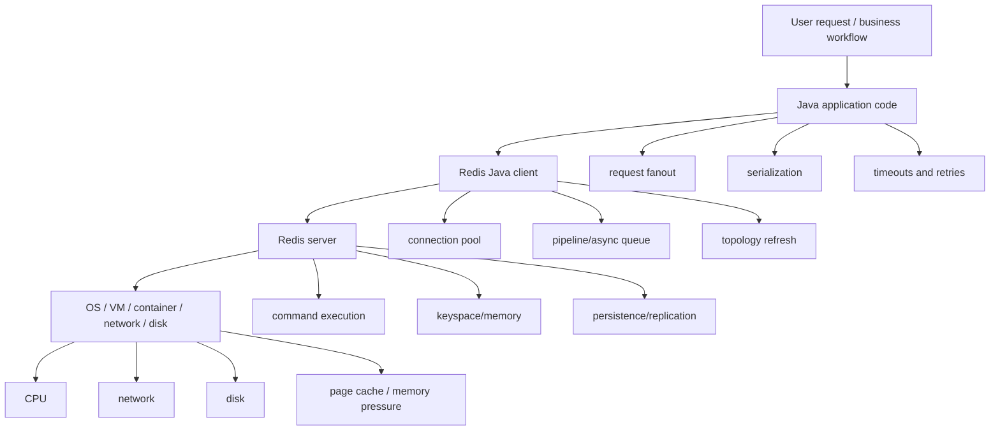
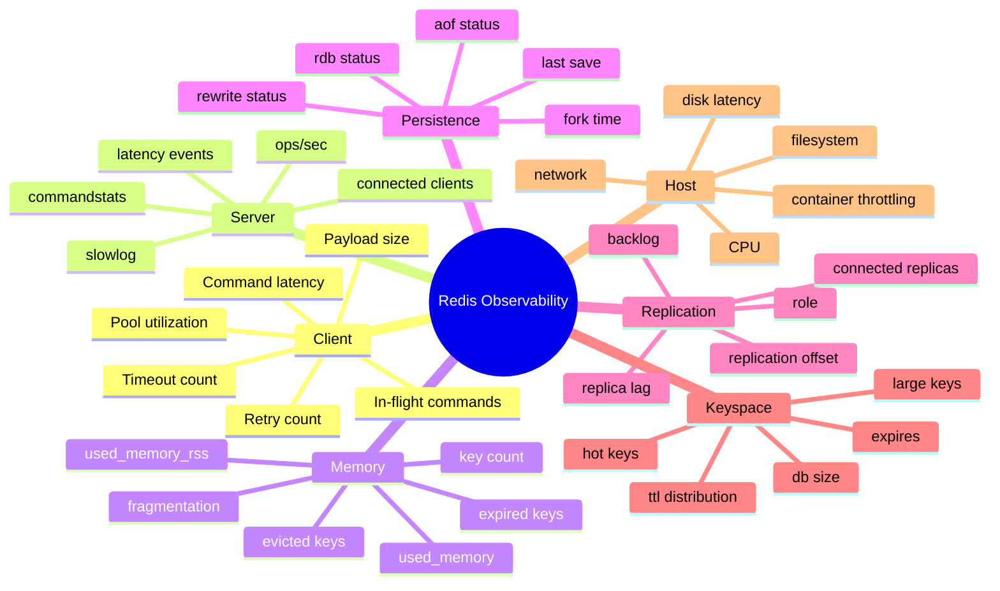
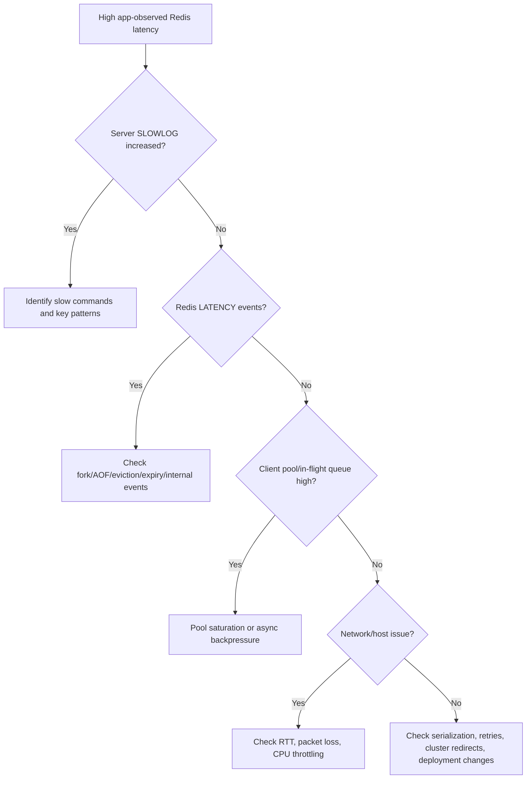

# Part 027 — Observability and Debugging: Metrics, Slowlog, MONITOR, and Tracing

Part 026 covered memory engineering: encoding, eviction, TTL, fragmentation, hot keys, and large keys.
Now we move to the operational skill that separates Redis users from Redis production engineers:

> Can you explain why Redis is slow, unstable, memory-heavy, inconsistent, or expensive while the incident is happening?

Redis is usually introduced as “fast”.
That statement is useful but dangerous.
Redis can still become slow because of:

- network round trips
- large payloads
- slow commands
- huge keys
- hot keys
- blocking operations
- fork pressure during persistence
- eviction storms
- expiration storms
- connection storms
- replica lag
- cluster slot movement
- client retries
- bad serialization
- noisy neighbors on shared infrastructure
- application code that turns one business request into hundreds of Redis calls

The core mental model:

> Redis observability is not just monitoring the Redis process. It is correlating application-level intent, Java client behavior, Redis command execution, keyspace shape, memory lifecycle, persistence events, replication state, and host resources into one debuggable story.

---

## 1. Kaufman Skill Decomposition

The skill is not “open Redis Insight” or “check INFO”.
The real skill is:

> Given a production symptom, identify which layer is responsible, prove it with measurements, reduce blast radius, and implement a fix that prevents recurrence.

Breakdown:

| Sub-skill | What you must be able to do |
|---|---|
| Signal design | Define Redis SLIs and metrics that match actual user-visible behavior |
| Client instrumentation | Measure Java command latency, timeout, retry, pool pressure, and payload size |
| Server metrics | Interpret `INFO`, `SLOWLOG`, `LATENCY`, commandstats, memory, persistence, replication, and keyspace metrics |
| Keyspace diagnosis | Detect hot keys, large keys, bad TTL distribution, and cardinality explosions |
| Incident triage | Move from symptom to likely cause without random guessing |
| Alert design | Alert on burn-rate and actionable risk, not noisy one-off spikes |
| Tracing | Correlate HTTP/API calls with Redis command groups and downstream effects |
| Safe debugging | Know when not to use expensive tools such as `MONITOR` in production |
| Runbook execution | Apply repeatable steps for latency, memory, eviction, replication, and client incidents |
| Feedback loop | Convert incidents into dashboards, tests, limits, and design changes |

Kaufman-style outcome:

> After this part, you should be able to design a Redis observability baseline and debug common production Redis incidents without guessing.

---

## 2. Four Layers of Redis Observability

A Redis incident is rarely only a Redis incident.
A Java application can generate Redis pain long before Redis itself is “broken”.

Use this layered model:



When debugging, do not start with a command.
Start with a question:

> Which layer changed, and which signal proves it?

Examples:

| Symptom | Possible application cause | Possible Redis cause | Possible infrastructure cause |
|---|---|---|---|
| API p99 increased | N+1 Redis calls | slow command / large key | network packet loss |
| Redis CPU high | sudden traffic fanout | expensive command | CPU throttling |
| Timeouts | retry storm | blocked event loop | network congestion |
| Cache hit rate dropped | key version mismatch | eviction storm | memory limit too low |
| Replica stale | read routing mistake | replication lag | network/disk saturation |
| Memory rising | payload bloat | expired keys not reclaimed fast enough | fragmentation |
| Sudden command volume | application deploy | hot key workload | autoscaling burst |

A mature team does not rely on Redis metrics alone.
It collects correlated signals from all layers.

---

## 3. What “Good Redis Observability” Must Answer

At minimum, your Redis observability must answer these questions quickly:

### 3.1 Availability

- Is Redis reachable from the application?
- Are commands timing out?
- Are connection attempts failing?
- Are clients reconnecting repeatedly?
- Is Sentinel/Cluster topology stable?

### 3.2 Latency

- What is application-observed Redis latency?
- What is server-side command execution time?
- Is latency dominated by server CPU, network round trip, client queuing, or retries?
- Which commands contribute most to p95/p99 latency?

### 3.3 Throughput

- How many commands per second are executed?
- Which command families dominate traffic?
- Is throughput increasing because user traffic increased or because application fanout/retry increased?

### 3.4 Memory

- How much memory is used by dataset vs overhead?
- Is memory growing by key count, value size, fragmentation, clients, replication buffers, or AOF buffers?
- Are evictions happening?
- Are expired keys accumulating?

### 3.5 Correctness

- Are cache hit rates behaving as expected?
- Are idempotency keys expiring too early?
- Are locks timing out or being renewed incorrectly?
- Are stream pending entries accumulating?
- Are queues stuck?

### 3.6 Durability and Recovery

- Are RDB/AOF persistence operations succeeding?
- Is the last save time acceptable?
- Are AOF rewrites failing?
- Is replication lag within budget?
- Can backup restore be proven?

The dangerous dashboard is one that says “Redis is green” while users are still experiencing timeouts.
The useful dashboard shows both Redis internal state and application-observed behavior.

---

## 4. Metric Taxonomy

Use a stable taxonomy so dashboards, alerts, and incident reviews do not become random metric collections.



---

## 5. Redis Server-Side Tools

Redis gives several built-in tools.
Each answers a different question.

| Tool | Primary use | Safe for continuous production use? | Notes |
|---|---|---:|---|
| `INFO` | broad server metrics | yes | foundation for exporters/dashboards |
| `SLOWLOG` | server-side slow command execution | yes, with sane config | does not include network/client I/O time |
| `LATENCY` | latency event diagnosis | yes, if enabled intentionally | useful for internal latency spikes |
| `COMMAND STATS` via `INFO commandstats` | command volume and CPU-ish distribution | yes | good for workload shifts |
| `CLIENT LIST` | connected client diagnosis | careful | useful during connection storms |
| `MEMORY STATS` | memory breakdown | yes, occasional | useful for capacity diagnosis |
| `MEMORY USAGE` | per-key memory estimate | sample only | do not scan blindly in hot prod path |
| `SCAN` | incremental keyspace inspection | careful | safer than `KEYS`, still workload-sensitive |
| `MONITOR` | live command stream | no for normal production | can be extremely expensive/noisy |

Important distinction:

> Redis server-side execution time and Java-observed command latency are not the same metric.

A command can be fast in `SLOWLOG` but slow to the Java caller because of:

- connection pool wait
- queued async commands
- network latency
- TLS overhead
- retry delay
- cluster redirect
- serialization/deserialization
- overloaded application threads

---

## 6. INFO: The Production Baseline

`INFO` is the default observability surface.
It returns sections such as server, clients, memory, persistence, stats, replication, CPU, commandstats, cluster, and keyspace.

Useful commands:

```bash
redis-cli INFO
redis-cli INFO memory
redis-cli INFO stats
redis-cli INFO commandstats
redis-cli INFO persistence
redis-cli INFO replication
redis-cli INFO clients
redis-cli INFO keyspace
```

### 6.1 Memory Fields to Watch

Commonly useful fields:

```text
used_memory
used_memory_human
used_memory_rss
used_memory_peak
used_memory_dataset
mem_fragmentation_ratio
maxmemory
maxmemory_policy
evicted_keys
expired_keys
```

Interpretation:

| Field | Meaning | Common issue |
|---|---|---|
| `used_memory` | memory allocated by Redis allocator | dataset or buffer growth |
| `used_memory_rss` | memory seen by OS | fragmentation / allocator / fork effects |
| `used_memory_peak` | highest memory reached | capacity planning signal |
| `used_memory_dataset` | approximate dataset memory | actual data footprint |
| `mem_fragmentation_ratio` | RSS vs allocated memory relationship | high fragmentation or RSS overhead |
| `evicted_keys` | keys evicted due to maxmemory | correctness risk if unexpected |
| `expired_keys` | keys expired by TTL | TTL lifecycle behavior |

Do not alert on `mem_fragmentation_ratio` alone without context.
Low absolute memory with a high ratio can be harmless.
High RSS near host limit can be dangerous even if Redis used memory seems acceptable.

### 6.2 Stats Fields to Watch

Useful fields:

```text
total_commands_processed
instantaneous_ops_per_sec
total_net_input_bytes
total_net_output_bytes
keyspace_hits
keyspace_misses
expired_keys
evicted_keys
rejected_connections
sync_full
sync_partial_ok
sync_partial_err
```

Cache hit rate:

```text
hit_rate = keyspace_hits / (keyspace_hits + keyspace_misses)
```

But hit rate must be interpreted by use case.
A session store may need a very high hit rate.
A negative cache may intentionally produce misses.
A write-heavy queue may not use cache hits meaningfully.

### 6.3 Commandstats

`INFO commandstats` shows per-command usage and accumulated microseconds.

Example:

```bash
redis-cli INFO commandstats
```

You may see fields like:

```text
cmdstat_get:calls=1000000,usec=900000,usec_per_call=0.90
cmdstat_hgetall:calls=50000,usec=700000,usec_per_call=14.00
cmdstat_zrange:calls=20000,usec=600000,usec_per_call=30.00
```

Questions to ask:

- Did command mix change after deploy?
- Are expensive commands used more often than expected?
- Are multi-element reads such as `HGETALL`, `SMEMBERS`, `LRANGE`, or wide `ZRANGE` dominating?
- Are Lua scripts consuming disproportionate time?
- Are deletes of large keys causing spikes?

Commandstats is especially useful when application metrics say “Redis is slow” but slowlog is not obvious.
It helps reveal volume-driven issues.

---

## 7. SLOWLOG: Server-Side Command Execution Diagnosis

`SLOWLOG` records commands whose server-side execution time exceeds a configured threshold.
It is not a full query log.
It does not include time spent sending responses to the client.

Common commands:

```bash
redis-cli CONFIG GET slowlog-log-slower-than
redis-cli CONFIG GET slowlog-max-len
redis-cli SLOWLOG LEN
redis-cli SLOWLOG GET 10
redis-cli SLOWLOG RESET
```

Example configuration idea:

```bash
# microseconds; 10000 = 10ms
CONFIG SET slowlog-log-slower-than 10000
CONFIG SET slowlog-max-len 1024
```

Production guidance:

| Environment | Starting threshold |
|---|---:|
| low-latency cache | 1ms–5ms |
| general app cache | 5ms–10ms |
| search / JSON / vector workload | depends on expected query profile |
| batch/admin Redis | higher, but separate from online path |

Do not blindly set threshold to `0` in production.
That logs every command and can become noise and overhead.

### 7.1 What SLOWLOG Can Reveal

Typical findings:

- `KEYS *` executed by admin script
- `HGETALL` on a huge hash
- `SMEMBERS` on a huge set
- `LRANGE 0 -1` on an unbounded list
- `ZRANGE`/`ZREVRANGE` over large ranges
- long-running Lua script
- mass delete of huge key
- expensive search query
- many commands from a maintenance job

### 7.2 What SLOWLOG Cannot Reveal

SLOWLOG does not directly show:

- Java connection pool wait time
- client-side queueing
- network round-trip latency
- TLS overhead
- deserialization cost
- blocked application threads
- retry backoff
- cluster redirect delay
- response payload transfer time

That is why Java client metrics are mandatory.

---

## 8. LATENCY: Event-Level Latency Diagnosis

The `LATENCY` command family is useful for diagnosing latency spikes inside Redis.

Common commands:

```bash
redis-cli LATENCY LATEST
redis-cli LATENCY HISTORY command
redis-cli LATENCY DOCTOR
redis-cli LATENCY GRAPH command
```

Enable threshold intentionally:

```bash
CONFIG SET latency-monitor-threshold 100
```

The threshold is in milliseconds.
Choose it based on the workload.

`LATENCY DOCTOR` can provide human-readable hints, but do not treat it as a substitute for analysis.
Use it as a starting point.

Events may involve:

- command execution
- fork operation
- AOF fsync/rewrite
- eviction
- expiration
- active defragmentation
- module/query behavior

A good incident workflow compares:

```text
Java observed latency
vs Redis SLOWLOG
vs Redis LATENCY events
vs host CPU/network/disk
```

If Java latency is high but Redis SLOWLOG/LATENCY are clean, suspect client/network/application path.
If Redis LATENCY shows fork or AOF spikes, suspect persistence/disk/fork pressure.
If SLOWLOG shows commands, inspect key size and command usage.

---

## 9. MONITOR: Powerful, Dangerous, Rarely the First Tool

`MONITOR` streams every command processed by Redis.
It can be useful in a controlled debugging session, but it is not a normal production observability mechanism.

Problems:

- very high output volume
- potential performance impact
- sensitive data exposure
- hard to aggregate meaningfully
- encourages debugging by watching noise instead of metrics

Safer alternatives:

| Need | Prefer |
|---|---|
| Find slow commands | `SLOWLOG`, `INFO commandstats` |
| Find workload shift | app metrics + commandstats |
| Find key pattern | sampled instrumentation at app layer |
| Find key expiry behavior | keyspace metrics / sampled SCAN / application events |
| Debug one staging issue | `MONITOR` in isolated environment |

Production rule:

> Do not use `MONITOR` on a busy production Redis unless you understand the blast radius and have a specific short-lived reason.

---

## 10. Java Client Observability

Redis server metrics cannot tell you how your Java caller experienced Redis.
You need client-side instrumentation.

### 10.1 Minimum Java Client Metrics

For every Redis operation group, collect:

| Metric | Why it matters |
|---|---|
| command latency | user-visible Redis dependency cost |
| timeout count | reliability and saturation signal |
| exception count by type | topology/network/auth/client bug diagnosis |
| retry count | hidden traffic amplification |
| pool wait time | blocking synchronous client pressure |
| active/idle connections | pool sizing and leaks |
| in-flight async commands | backpressure risk |
| payload size | serialization and network cost |
| cache hit/miss by use case | business correctness signal |
| operation cardinality | N+1 and batch opportunity |

Avoid metric labels with raw keys or user IDs.
Use low-cardinality operation names:

```text
redis.operation = session.get
redis.operation = product-cache.mget
redis.operation = quota.consume
redis.operation = idempotency.claim
redis.operation = order-stream.ack
```

Bad labels:

```text
key=user:123456:profile
email=customer@example.com
tenant=every-tenant-id-as-label
```

High-cardinality labels can break your metrics system.

### 10.2 Operation Wrapper Pattern

Wrap Redis calls by business operation, not just by command.

```java
public final class ObservedRedisCache {
    private final RedisCommands<String, String> redis;
    private final MeterRegistry meters;

    public ObservedRedisCache(RedisCommands<String, String> redis, MeterRegistry meters) {
        this.redis = redis;
        this.meters = meters;
    }

    public Optional<String> getProductSnapshot(String productId) {
        String operation = "product-cache.get";
        Timer.Sample sample = Timer.start(meters);
        try {
            String key = "product:v3:{" + productId + "}:snapshot";
            String value = redis.get(key);

            meters.counter("redis.cache.lookup",
                    "operation", operation,
                    "result", value == null ? "miss" : "hit")
                    .increment();

            return Optional.ofNullable(value);
        } catch (RedisCommandTimeoutException ex) {
            meters.counter("redis.errors",
                    "operation", operation,
                    "type", "timeout")
                    .increment();
            throw ex;
        } catch (RedisException ex) {
            meters.counter("redis.errors",
                    "operation", operation,
                    "type", ex.getClass().getSimpleName())
                    .increment();
            throw ex;
        } finally {
            sample.stop(Timer.builder("redis.operation.latency")
                    .tag("operation", operation)
                    .register(meters));
        }
    }
}
```

This wrapper gives you:

- business operation name
- latency distribution
- hit/miss semantics
- exception type
- low-cardinality metrics
- a place to add tracing spans

### 10.3 Trace Spans

For distributed tracing, create spans around logical Redis operations.
Do not create a separate span for every command in high-volume batch workflows unless sampling and cardinality are controlled.

Good span attributes:

```text
db.system=redis
redis.operation=quota.consume
redis.command_family=lua
redis.keyspace=quota
redis.batch_size=1
redis.cluster_slot_known=true
```

Avoid storing full keys or values in spans.
Keys may contain PII, tenant IDs, tokens, or security-sensitive data.

### 10.4 CLIENT SETNAME

Set client names to identify application sources:

```bash
CLIENT SETNAME order-service-api-1
CLIENT LIST
```

In Java, configure client name where supported or execute it after connection initialization.
This helps during connection storms:

```text
name=order-service-api-1 addr=10.1.2.3:50123 cmd=get age=120 idle=0
```

Use names like:

```text
<service>-<component>-<environment>
order-api-cache-prod
order-worker-stream-prod
pricing-engine-rate-limit-prod
```

Do not encode pod IDs as metric labels unless necessary.
They are high-cardinality.

---

## 11. Redis Dashboard Design

A dashboard should tell a story.
Do not make a wall of graphs.

### 11.1 Top-Level Redis Health Dashboard

Recommended sections:

1. **Availability**
   - client error rate
   - client timeout rate
   - Redis up/down
   - rejected connections

2. **Latency**
   - app-observed Redis p50/p95/p99
   - server slowlog count
   - latency events
   - network RTT if available

3. **Traffic**
   - ops/sec
   - command mix
   - input/output bandwidth
   - request-to-command fanout

4. **Memory**
   - used memory
   - RSS
   - fragmentation
   - evictions
   - expired keys
   - key count

5. **Correctness/Domain**
   - cache hit rate per cache
   - idempotency claim conflict rate
   - rate limiter allow/deny rate
   - queue depth
   - stream lag/pending entries

6. **Persistence/Replication**
   - RDB/AOF status
   - last save age
   - fork time
   - replication lag
   - role/failover events

7. **Host**
   - CPU
   - memory pressure
   - disk latency
   - network throughput/errors
   - container throttling

### 11.2 Dashboard Anti-Patterns

| Anti-pattern | Why it fails |
|---|---|
| Only Redis server metrics | misses app/client/network pain |
| Only average latency | hides p99 tail latency |
| One global cache hit rate | hides broken critical cache |
| Raw key labels | cardinality explosion and sensitive data leak |
| No deployment markers | cannot correlate incidents with changes |
| No command mix | cannot detect N+1 or expensive command shift |
| No business metrics | cannot tell if Redis issue affects users |

---

## 12. Alert Design

Alerts must be actionable.
A Redis alert should imply a decision.

### 12.1 Good Alerts

Examples:

```text
Redis client timeout rate > 1% for 5 minutes on order-api prod
```

Action:

- check Redis latency dashboard
- check pool wait/in-flight queue
- check recent deploy
- check slowlog and commandstats

```text
Redis evicted_keys increasing for non-evictable workload
```

Action:

- determine impacted keyspace
- scale memory or reduce dataset
- disable unsafe eviction for correctness-critical store

```text
Stream pending entries growing for consumer group order-worker
```

Action:

- inspect consumer health
- claim idle entries
- check poison messages

```text
AOF rewrite failed or RDB last save age exceeds RPO budget
```

Action:

- check disk space
- check persistence config
- initiate backup risk response

### 12.2 Bad Alerts

```text
Redis CPU > 70% once
```

Not always bad.
Could be normal load.
Needs context.

```text
Cache hit rate < 90% globally
```

Too generic.
Some caches are intentionally low-hit.
Some critical caches need much higher.

```text
Memory fragmentation ratio > 1.5
```

Can be misleading without absolute memory and RSS pressure.

### 12.3 Alert Severity Mapping

| Severity | Redis example | User impact |
|---|---|---|
| Sev1 | Redis unavailable for critical path | checkout/login/order down |
| Sev2 | p99 Redis latency causing API SLO breach | degraded user experience |
| Sev3 | memory growth will breach limit within hours | risk but not immediate impact |
| Sev4 | slowlog has occasional admin command in off-peak | investigate during business hours |

---

## 13. Runbook: High Redis Latency

Symptom:

```text
API p99 increased and Redis appears in traces.
```

Follow this decision tree:



Commands:

```bash
redis-cli INFO stats
redis-cli INFO commandstats
redis-cli SLOWLOG GET 20
redis-cli LATENCY LATEST
redis-cli INFO clients
redis-cli INFO memory
```

Java checks:

- Redis operation p95/p99 by business operation
- timeout count by exception type
- pool wait time
- active/idle connection count
- in-flight async command count
- retry count
- request fanout count
- payload size distribution

Typical root causes:

| Evidence | Likely cause | Fix direction |
|---|---|---|
| slowlog shows `HGETALL` huge hash | large key read | field-specific reads / split hash |
| slowlog shows `SMEMBERS` | unbounded set read | page/scan/index differently |
| commandstats `GET` calls doubled | N+1 or retry storm | batch with `MGET` / reduce retries |
| app latency high, slowlog clean | client/network/pool | inspect pool/RTT/in-flight queue |
| latency event fork | persistence snapshot/rewrite | memory headroom/disk tuning/schedule |
| CPU high + commandstats expensive | workload issue | command redesign / shard / limit range |

---

## 14. Runbook: Memory Growth

Symptom:

```text
used_memory increasing faster than forecast.
```

Check:

```bash
redis-cli INFO memory
redis-cli INFO keyspace
redis-cli INFO stats
redis-cli MEMORY STATS
```

Questions:

1. Did key count increase?
2. Did value size increase?
3. Did TTL disappear from new keys?
4. Did a deployment change serializer format?
5. Did a queue/stream stop being consumed?
6. Did cache misses cause more negative cache entries?
7. Did retention change for time series/search/vector data?
8. Is RSS growth fragmentation or actual dataset growth?

Sample keyspace carefully:

```bash
redis-cli --scan --pattern 'session:*' | head -100
redis-cli MEMORY USAGE some:key
redis-cli TTL some:key
```

Do not run `KEYS *` in production.
Use `SCAN` carefully and rate-limit inspection scripts.

Memory incident classification:

| Class | Description | Response |
|---|---|---|
| forecasted growth | expected traffic/data growth | scale or optimize |
| lifecycle leak | keys missing TTL or cleanup | fix writer and backfill cleanup |
| payload bloat | serializer/schema changed | reduce payload, compress, migrate |
| queue buildup | consumers down/slow | restore consumers, drain backlog |
| eviction storm | maxmemory reached | protect correctness, scale, tune policy |
| fragmentation | RSS high vs used memory | restart/defrag/headroom depending risk |

---

## 15. Runbook: Evictions Happening

Evictions are not inherently wrong.
They are wrong when Redis contains data that must not disappear.

Check:

```bash
redis-cli INFO memory
redis-cli INFO stats | grep evicted_keys
redis-cli CONFIG GET maxmemory
redis-cli CONFIG GET maxmemory-policy
```

Decision table:

| Workload | Eviction acceptable? | Policy direction |
|---|---:|---|
| pure cache | yes | `allkeys-lru` / `allkeys-lfu` depending behavior |
| session store | usually no | prefer `noeviction`, scale memory |
| lock/idempotency | dangerous | prefer `noeviction` or separate Redis |
| queue/stream | dangerous | no eviction for durable-ish semantics |
| rate limiter | sometimes | depends on fail-open/fail-closed policy |

If evictions happen unexpectedly:

1. identify workload sharing same Redis
2. split correctness-critical keys from cache keys
3. increase memory or reduce payload/cardinality
4. add TTL jitter for cache waves
5. tune maxmemory policy only after correctness review

---

## 16. Runbook: Connection Storm

Symptoms:

- high connected clients
- rejected connections
- app timeouts
- CPU increase
- many reconnect logs

Check:

```bash
redis-cli INFO clients
redis-cli CLIENT LIST
redis-cli CONFIG GET maxclients
```

Root causes:

- each request creates new Redis connection
- pool not reused
- autoscaling created too many pods
- retry/reconnect loop
- health checks open connections too frequently
- client topology refresh bug/misconfig
- connection leak

Java-specific fixes:

- reuse client/connection factory
- bound pool size
- set connection timeout and command timeout
- add jittered reconnect/backoff
- avoid creating Redis client per request
- separate blocking connections from normal commands
- monitor active/idle/borrow wait

---

## 17. Runbook: Cache Hit Rate Collapse

Symptom:

```text
Database load increased and Redis hit rate dropped.
```

Check:

- hit/miss by cache name, not global only
- deploy that changed key format/version
- TTL distribution
- invalidation traffic
- eviction count
- serialization errors
- backend errors causing cache fill failures

Common causes:

| Evidence | Likely cause |
|---|---|
| misses only for one service version | key version mismatch |
| misses after deploy | serializer/key namespace change |
| misses plus evictions | memory pressure |
| misses plus backend errors | cache fill failing |
| synchronized misses | TTL avalanche |
| negative cache missing | cache penetration |

Correct response depends on cause.
Do not simply increase TTL.
That can hide bugs and increase staleness.

---

## 18. Runbook: Stream/Queue Stuck

For Redis Streams:

```bash
redis-cli XINFO STREAM order-events
redis-cli XINFO GROUPS order-events
redis-cli XPENDING order-events order-consumers
redis-cli XPENDING order-events order-consumers - + 10
```

Questions:

- Is producer still writing?
- Are consumers connected?
- Is pending count increasing?
- Are the same messages retrying?
- Is one consumer owning too many pending entries?
- Is trimming deleting data too early?
- Is a poison message blocking progress?

Fix direction:

- restart failed consumers
- use `XAUTOCLAIM` for idle pending entries
- move poison messages to DLQ
- reduce batch size if processing is too slow
- add consumer-level metrics
- review ack placement

For list/sorted-set queues:

- inspect ready queue depth
- inspect processing queue depth
- inspect delayed zset min score
- inspect retry counters
- inspect worker heartbeats

---

## 19. Runbook: Replication Lag or Stale Reads

Symptoms:

- reads from replica return old data
- failover causes unexpected data loss
- replica offset lag increases

Check:

```bash
redis-cli INFO replication
```

Important fields:

```text
role
connected_slaves / connected_replicas
master_repl_offset
slave_repl_offset / replica offset
master_link_status
repl_backlog_active
```

Application questions:

- Are correctness-sensitive reads routed to replica?
- Does application expect read-your-write?
- Is `WAIT` used anywhere, and with what timeout?
- Is failover tested under write load?

Design rule:

> Replica reads are a latency/scaling optimization, not a default correctness mechanism.

Use replica reads only when stale reads are acceptable or explicitly handled.

---

## 20. Debugging Keyspace Shape

Redis keyspace shape affects latency and memory.
You need to understand:

- number of keys by namespace
- TTL distribution
- value size distribution
- large keys
- hot keys
- per-tenant cardinality
- cluster slot distribution

### 20.1 Safe Sampling Script Idea

Use `SCAN`, not `KEYS`.
Rate-limit it.
Run from admin environment.
Do not export sensitive key names unnecessarily.

Pseudo-flow:

```text
for key in SCAN pattern namespace:* count 100:
    sample ttl
    sample memory usage
    infer namespace
    aggregate counts and percentiles
```

Output example:

| Namespace | Key count | p50 TTL | p99 memory | Large key count |
|---|---:|---:|---:|---:|
| `session` | 12M | 21m | 3KB | 20 |
| `product-cache` | 2M | 5h | 120KB | 4,200 |
| `quota` | 80M | 58s | 120B | 0 |
| `stream` | 48 | n/a | 200MB | 48 |

This data drives capacity planning.
Without it, Redis scaling decisions are guesses.

---

## 21. Observability for Redis Patterns

Each Redis pattern needs specific metrics.

### 21.1 Cache Metrics

Per cache:

- hit count
- miss count
- load success/failure
- load latency
- stale serve count
- refresh lock contention
- negative cache hit/miss
- invalidation count
- evicted-key impact estimate

### 21.2 Rate Limiter Metrics

Per limiter, low-cardinality dimension:

- allow count
- deny count
- Redis error count
- fail-open/fail-closed count
- Lua latency
- quota key cardinality estimate
- top noisy dimensions, sampled not labeled fully

### 21.3 Idempotency Metrics

- claim success
- duplicate replay
- in-progress conflict
- expired in-progress recovery
- fingerprint mismatch
- result replay failure
- Redis timeout during claim/finalize

### 21.4 Lock Metrics

- acquire success/failure
- acquire wait time
- lease renewal success/failure
- lock hold duration
- release mismatch
- fencing token monotonicity failure
- critical section timeout

### 21.5 Streams Metrics

- stream length
- add rate
- read rate
- ack rate
- pending entries
- oldest pending age
- consumer count
- DLQ count
- trim count

### 21.6 Search/JSON/Vector Metrics

- query count by query type
- query latency
- result count
- timeout/error count
- index size
- index update rate
- payload size
- stale index detection metric if source of truth is elsewhere

---

## 22. Incident Review Template

After a Redis incident, write a review that answers:

```md
# Redis Incident Review

## User impact
- What user journey was affected?
- Duration?
- Error rate / latency impact?

## Timeline
- First signal
- Detection
- Mitigation
- Recovery

## Redis symptom
- Latency?
- Memory?
- Eviction?
- Replication?
- Persistence?
- Connection?
- Command mix?

## Root cause
- Application behavior?
- Redis config?
- Data model?
- Infrastructure?
- Operational process?

## Why existing controls failed
- Missing metric?
- Missing alert?
- Bad threshold?
- Missing load test?
- Missing runbook?

## Permanent fixes
- Code change
- Config change
- Capacity change
- Dashboard/alert change
- Test/change management change

## Follow-up validation
- How do we know it is fixed?
```

The best Redis teams treat incidents as training data for better design.

---

## 23. Minimal Production Checklist

Before launching Redis-backed functionality:

- [ ] Operation-level Java metrics exist
- [ ] Redis timeouts are explicit
- [ ] Retry policy is bounded and safe
- [ ] Redis key namespaces are known
- [ ] TTL behavior is observable
- [ ] Cache hit/miss metrics are per cache
- [ ] Slowlog threshold is configured
- [ ] `INFO` metrics are collected
- [ ] Commandstats are visible
- [ ] Memory/eviction alerts exist
- [ ] Persistence/replication alerts exist if data matters
- [ ] Queue/stream depth alerts exist if Redis is used for workflow
- [ ] Dashboard includes deployment markers
- [ ] Sensitive keys/values are not exported in logs/metrics/traces
- [ ] Runbook exists for latency, memory, eviction, connection, and queue incidents

---

## 24. Deliberate Practice

### Exercise 1 — Build an Observability Baseline

For one Redis-backed feature, define:

- operation name
- commands used
- expected QPS
- expected payload size
- expected latency budget
- hit/miss expectation
- failure policy
- dashboard panels
- alerts

### Exercise 2 — Diagnose a Synthetic Latency Incident

In staging:

1. create a large hash
2. call `HGETALL` repeatedly
3. observe Java latency
4. observe `SLOWLOG`
5. observe commandstats
6. replace with field reads or pagination
7. compare metrics

### Exercise 3 — Simulate a Cache Hit Collapse

1. deploy key version `v1`
2. warm cache
3. deploy code using `v2`
4. observe miss spike
5. add dashboard by cache namespace
6. document rollback/migration strategy

### Exercise 4 — Stream Pending Entries

1. create stream consumer group
2. read without ack
3. inspect `XPENDING`
4. use `XAUTOCLAIM`
5. define oldest-pending-age alert

---

## 25. Mental Compression

A top-tier Redis engineer thinks like this:

> Redis latency is not one number. It is a chain from Java request fanout, client connection behavior, network round trip, server command execution, key/value shape, persistence side effects, replication topology, and host resource pressure.

When debugging:

1. start from user impact
2. compare app-observed latency with server-side execution
3. inspect command mix and keyspace shape
4. check memory, eviction, persistence, replication
5. correlate with deploys and traffic changes
6. mitigate safely
7. convert finding into metric, alert, test, or design change

---

## 26. References

- Redis observability tutorial: `https://redis.io/tutorials/operate/redis-at-scale/observability/`
- Redis latency diagnosis: `https://redis.io/docs/latest/operate/oss_and_stack/management/optimization/latency/`
- Redis SLOWLOG command: `https://redis.io/docs/latest/commands/slowlog/`
- Redis INFO command: `https://redis.io/docs/latest/commands/info/`
- Redis CLIENT command family: `https://redis.io/docs/latest/commands/client-list/`
- Redis memory optimization and eviction references: `https://redis.io/docs/latest/develop/reference/eviction/`
- Lettuce reference: `https://redis.github.io/lettuce/`
- Micrometer documentation: `https://docs.micrometer.io/`

---

## 27. Next Part

Part 028 moves from observing Redis to protecting data:

> Persistence and Durability: RDB, AOF, Hybrid, Backup, and Restore.
