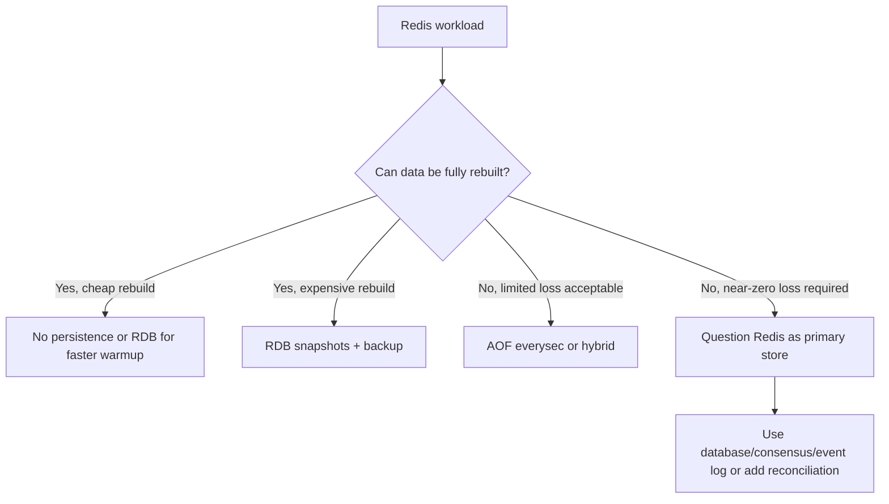
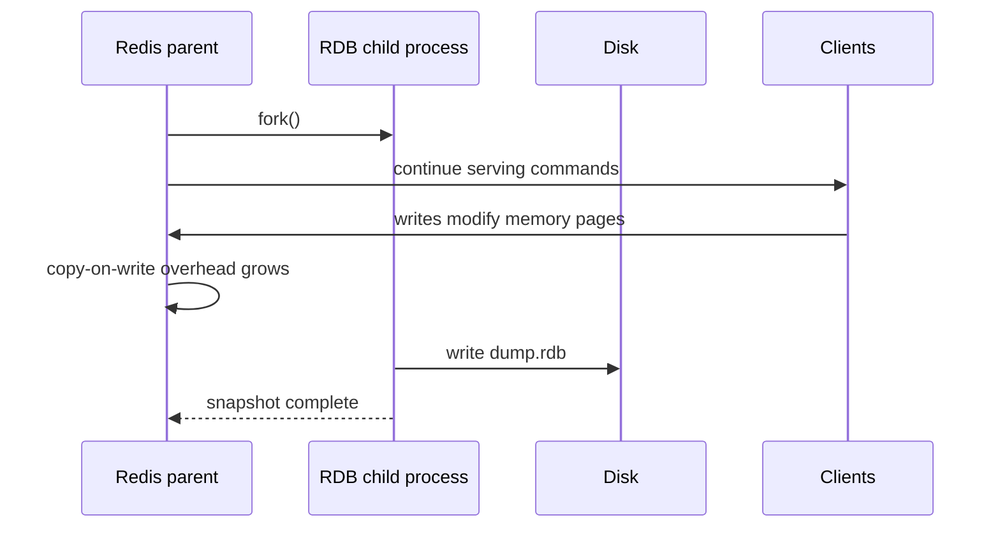
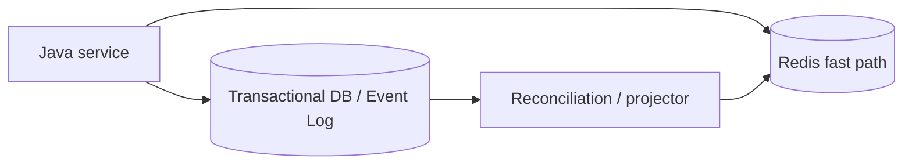

# Part 028 — Persistence and Durability: RDB, AOF, Hybrid, Backup, and Restore

Part 027 covered Redis observability and debugging.
Now we move to one of the most commonly misunderstood Redis production topics:

> What does it actually mean for Redis data to be durable?

Redis is memory-first.
That does not mean Redis cannot persist data.
It means durability is a configuration and operations discipline, not an automatic property of every Redis deployment.

The core mental model:

> Redis persistence is about defining acceptable data loss, restart time, backup recovery, disk behavior, and failover semantics for each Redis workload. It is not a substitute for a transactional database or a consensus system.

This distinction matters because Redis is used for many different data classes:

| Redis workload | Can data be lost? | Persistence need |
|---|---:|---|
| pure derived cache | yes | often none or minimal |
| session store | maybe not | persistence or external session fallback |
| idempotency keys | dangerous if lost | persistence + careful TTL/RPO |
| distributed locks | persistence usually not enough | leases/fencing/coordination semantics matter more |
| delayed jobs | dangerous if lost | persistence + recovery scan |
| streams/events | depends | persistence + trimming/RPO policy |
| leaderboard | maybe reconstructable | snapshot or rebuild pipeline |
| search index | often rebuildable | backup may reduce rebuild time |
| vector cache | often rebuildable | persistence depends on cost/rebuild SLA |
| rate limiter | usually tolerates loss | fail-open/closed policy defines risk |

---

## 1. Kaufman Skill Decomposition

The skill is not “turn on AOF”.
The real skill is:

> Given a Redis workload, choose persistence mode, quantify RPO/RTO, understand crash/restart behavior, validate backup/restore, and design the Java application so Redis durability limitations do not become hidden correctness bugs.

Breakdown:

| Sub-skill | What you must be able to do |
|---|---|
| Durability classification | Decide whether Redis data is source, derived, temporary, or reconstructable |
| RPO/RTO design | Define acceptable data loss and restore time per workload |
| RDB understanding | Use snapshots for compact backup and faster restart with known data-loss window |
| AOF understanding | Use append-only persistence with fsync trade-offs and rewrite behavior |
| Hybrid understanding | Combine RDB base snapshot with AOF tail for practical production durability |
| Fork pressure | Budget memory and latency effects of background save/rewrite |
| Backup strategy | Produce, store, encrypt, retain, and verify backups |
| Restore drill | Prove recovery with actual restored Redis instances |
| Java behavior | Design writes, retries, idempotency, and replay around persistence semantics |
| Incident response | Recover from failed persistence, corrupted files, disk full, and restart issues |

Kaufman-style outcome:

> After this part, you should be able to review a Redis deployment and say exactly what data can be lost, how much, why, and how recovery will work.

---

## 2. Persistence Is a Product Decision, Not Only an Infra Setting

Before choosing RDB or AOF, classify the data.

### 2.1 Data Classes

| Class | Description | Example | Redis durability stance |
|---|---|---|---|
| Derived cache | can be recomputed from source of truth | product cache | no persistence or low durability |
| Temporary coordination | only valid for short time | lock lease | persistence does not solve correctness |
| Time-window control | value matters only within TTL | rate limiter | small data loss may be acceptable |
| Recoverable workflow | can be replayed from another system | Kafka offset cache | persistence optional if replay exists |
| Redis-primary workflow | Redis is primary state for workflow | delayed jobs only in Redis | strong persistence/backup required |
| User-visible state | loss affects users directly | session/cart/leaderboard | persistence + backup + validation |
| Index/read model | derived but expensive to rebuild | search/vector index | backup for RTO reduction |

Bad design smell:

> The team says “it is just Redis”, but the business cannot tolerate losing the data.

If Redis is storing business-critical state, treat it as a database operationally.
If it is only a cache, avoid overengineering persistence and focus on safe rebuild.

---

## 3. RPO and RTO

Durability discussion must use two terms.

| Term | Meaning | Redis question |
|---|---|---|
| RPO | Recovery Point Objective: maximum acceptable data loss | how many writes can we lose? |
| RTO | Recovery Time Objective: maximum acceptable downtime/recovery time | how fast must Redis come back? |

Examples:

| Workload | RPO | RTO | Implication |
|---|---:|---:|---|
| product cache | hours | minutes | rebuild acceptable |
| login sessions | seconds/minutes | minutes | persistence or fallback needed |
| idempotency records | near-zero for payment window | minutes | Redis alone may not be enough |
| rate limiter | seconds | seconds | loss may reset quota; define abuse risk |
| delayed jobs | seconds | minutes | AOF/hybrid + DLQ/reconciliation |
| search index | hours | tens of minutes | snapshot/rebuild plan |

Do not say “AOF gives durability” without saying which RPO.
The fsync policy defines data-loss exposure.

---

## 4. Redis Persistence Modes

Redis supports several persistence options:

| Mode | Description | Strength | Weakness |
|---|---|---|---|
| no persistence | memory only | fastest/simple for pure cache | data lost on restart |
| RDB | point-in-time snapshots | compact, faster restart, good backup artifact | can lose writes since last snapshot |
| AOF | append write commands to log | better durability window | larger files, rewrite/disk concerns |
| RDB + AOF / hybrid | snapshot base plus append tail | practical balance | more operational complexity |

Decision model:



---

## 5. RDB Snapshots

RDB persistence stores point-in-time snapshots of the dataset.
It is often used for:

- backups
- disaster recovery artifact
- faster restart than replaying huge AOF
- cache warm restart
- compact dataset export

Typical configuration pattern:

```conf
save 900 1
save 300 10
save 60 10000

dbfilename dump.rdb
dir /var/lib/redis
```

This means Redis will trigger background snapshots when configured write thresholds are met.
Exact configuration should be tuned to workload and RPO.

### 5.1 RDB Strengths

- compact single-file representation
- efficient for backups
- usually faster startup than huge AOF replay
- lower steady-state disk write overhead than AOF
- useful for moving data between environments when safe

### 5.2 RDB Weaknesses

- can lose writes since last snapshot
- background save uses fork on many deployments
- copy-on-write can increase memory pressure
- disk write spikes can affect latency
- snapshot frequency is a trade-off

### 5.3 RDB Fork and Copy-on-Write

When Redis creates a background snapshot, it may fork a child process.
The child writes the snapshot while the parent continues serving traffic.
Modified pages can cause copy-on-write memory overhead.

Mental model:



Operational implication:

> You need memory headroom during snapshot/rewrite operations, especially under write-heavy workloads.

If Redis memory is already close to host/container limit, persistence operations can become dangerous.

---

## 6. AOF: Append Only File

AOF persistence logs write operations so Redis can replay them on restart.

Basic configuration:

```conf
appendonly yes
appendfilename "appendonly.aof"
appendfsync everysec
```

Common fsync policies:

| Policy | Behavior | Durability | Performance |
|---|---|---|---|
| `always` | fsync every write | strongest Redis AOF setting | highest overhead |
| `everysec` | fsync about once per second | may lose about recent seconds of writes | common practical choice |
| `no` | OS decides fsync | weakest | fastest but risky |

Do not memorize one default as “correct”.
Pick based on RPO and write rate.

### 6.1 AOF Strengths

- better durability window than periodic RDB
- human-readable-ish command log historically, though modern multi-part AOF changes operational details
- append pattern is conceptually simple
- good fit when Redis holds non-reconstructable short-lived state

### 6.2 AOF Weaknesses

- file can grow until rewrite
- rewrite consumes CPU/memory/disk bandwidth
- restart may be slower if AOF is large
- disk full can become an application incident
- fsync latency can affect tail latency depending environment

### 6.3 AOF Rewrite

AOF rewrite compacts the append log into a smaller representation.
It removes redundant history.

Example:

```text
SET cart:1 A
SET cart:1 B
SET cart:1 C
```

Can be rewritten effectively as:

```text
SET cart:1 C
```

But the rewrite process has operational cost.
Monitor:

```bash
redis-cli INFO persistence
```

Important fields include status around RDB/AOF operations, rewrite progress, last bgsave status, last rewrite status, and related timings.

---

## 7. Hybrid Persistence

A practical production configuration often combines the benefits of RDB and AOF.
Modern Redis can use an RDB preamble in AOF so restart can load a compact base and then replay newer commands.

Conceptually:

```text
AOF file = compact RDB-like base + append-only tail
```

Benefits:

- faster restart than replaying a huge command log
- better durability window than RDB alone
- practical backup/recovery story

Trade-offs:

- more moving parts
- rewrite behavior must be monitored
- disk and memory headroom are still required
- operational familiarity is required before relying on it

Config direction:

```conf
appendonly yes
appendfsync everysec
aof-use-rdb-preamble yes
```

Exact defaults and support depend on Redis version/distribution.
Validate against your deployed version.

---

## 8. Persistence Does Not Equal Strong Consistency

Important:

> Persistence protects data on disk for a Redis instance. It does not automatically make Redis a strongly consistent distributed database.

Persistence does not solve:

- async replication data loss during failover
- stale replica reads
- concurrent writers without application semantics
- lost lock correctness without fencing
- idempotency correctness if TTL expires early
- event ordering across systems
- cross-key transaction across cluster slots

Example failure:

```text
1. Client writes to primary.
2. Primary acknowledges write.
3. Write is not replicated yet.
4. Primary crashes.
5. Replica is promoted.
6. Acknowledged write is missing on new primary.
```

Persistence on the old primary may not help if failover promotes a replica missing that write.
Replication semantics are covered in Part 029.

---

## 9. Java Application Implications

Redis persistence choices must be visible in Java application design.

### 9.1 Write Acknowledgement Is Not Always Durable Acknowledgement

A successful Redis command usually means Redis accepted/executed it in memory.
Depending on AOF fsync policy and replication, that does not necessarily mean:

- flushed to disk
- replicated to another node
- safe from failover loss
- included in backup

For correctness-critical workflows, design explicitly.

### 9.2 Idempotency Records

If idempotency keys are stored only in Redis:

| Failure | Risk |
|---|---|
| Redis loses recent key | duplicate request may execute again |
| Redis restores old completed result | stale replay risk if key design bad |
| TTL too short | legitimate retry becomes new request |
| failover loses key | duplicate protection broken |

Better design for high-value operations:

- store final idempotency result in source-of-truth DB
- use Redis as fast guard/cache
- reconcile after Redis recovery
- include request fingerprint
- use durable event log for external side effects

### 9.3 Delayed Jobs

If Redis is the only place where delayed jobs live, persistence matters.
But persistence alone is not enough.

You also need:

- worker heartbeat
- visibility timeout
- retry count
- DLQ
- reconciliation job
- duplicate-safe job handler
- restore process that can resume delayed and processing jobs

### 9.4 Cache Warmup

For large caches, persistence can reduce cold-start impact.
But if cache values are stale after restart, the app must validate TTL/version/source freshness.

A cache snapshot is not always safe to reuse after a deployment that changes:

- key schema
- value schema
- business rules
- source-of-truth version
- authorization model

---

## 10. Backup Strategy

Persistence writes local durable files.
Backup makes them recoverable after node loss, disk loss, operator error, or region failure.

A backup strategy must define:

| Dimension | Question |
|---|---|
| source | primary or replica? |
| frequency | how often? |
| retention | how long? |
| encryption | at rest and in transit? |
| isolation | can ransomware/operator error delete backups? |
| validation | are backups restored and tested? |
| consistency | what data loss window is acceptable? |
| ownership | who runs restore? |
| automation | is restore documented and automated? |

### 10.1 Backing Up RDB

RDB files are natural backup artifacts.
A common approach:

1. trigger or wait for background save
2. copy `dump.rdb` from disk
3. store in object storage
4. verify checksum
5. tag with Redis version, dataset, environment, timestamp
6. periodically restore into test Redis

Safer pattern:

> Prefer taking backups from a replica when possible, so backup I/O does not compete with primary traffic.

But confirm replica freshness.
A stale replica backup may violate RPO.

### 10.2 Backing Up AOF

AOF backup requires care because files may be actively written and rewritten.
Use supported operational procedures for your Redis version/distribution.
In managed Redis, use provider-supported backup mechanisms.

If self-managed:

- understand AOF file layout
- avoid copying partially rewritten files incorrectly
- check persistence status before backup
- validate restore
- automate consistency checks

### 10.3 Backup Metadata

Store metadata next to backup:

```json
{
  "service": "order-platform",
  "redis_role": "replica",
  "redis_version": "8.x",
  "persistence_mode": "aof-everysec-hybrid",
  "dataset": "order-redis-prod",
  "created_at": "2026-07-02T10:00:00Z",
  "rpo_class": "seconds",
  "contains_pii": true,
  "encryption": "kms-key-id",
  "checksum": "sha256:...",
  "restore_tested_at": "2026-07-02T11:00:00Z"
}
```

Backups without metadata become dangerous during incidents.

---

## 11. Restore Strategy

A backup that has never been restored is an assumption.
A restore drill converts it into evidence.

### 11.1 Restore Drill Checklist

- [ ] choose backup artifact
- [ ] verify checksum
- [ ] start Redis with same compatible version
- [ ] load backup
- [ ] check startup logs
- [ ] run `INFO persistence`
- [ ] run keyspace sanity checks
- [ ] validate critical namespaces
- [ ] run application smoke test
- [ ] measure restore time
- [ ] document actual RTO
- [ ] compare restored data age to RPO

### 11.2 Restore Runbook Example

```bash
# 1. stop redis
systemctl stop redis

# 2. backup current broken files before replacing
mkdir -p /var/lib/redis/recovery-$(date +%Y%m%d%H%M%S)
cp /var/lib/redis/dump.rdb /var/lib/redis/recovery-*/ 2>/dev/null || true
cp -r /var/lib/redis/appendonlydir /var/lib/redis/recovery-*/ 2>/dev/null || true

# 3. place restored persistence files
cp /restore/dump.rdb /var/lib/redis/dump.rdb
chown redis:redis /var/lib/redis/dump.rdb

# 4. start redis
systemctl start redis

# 5. verify
redis-cli PING
redis-cli INFO persistence
redis-cli INFO keyspace
```

For containers/Kubernetes, adapt to persistent volume semantics and operator/provider workflows.

### 11.3 Application-Level Restore Validation

Redis may start successfully while application state is semantically wrong.
Validate at domain level:

| Workload | Validation |
|---|---|
| sessions | can known test session be read? TTL reasonable? |
| idempotency | completed marker shape valid? fingerprint present? |
| queue | ready/processing/delayed counts sane? |
| stream | consumer group exists? pending entries expected? |
| cache | values match current schema version? |
| search index | query known document? count reasonable? |
| vector index | similarity query returns plausible result? |

---

## 12. Persistence Configuration Patterns

### 12.1 Pure Cache

```conf
save ""
appendonly no
maxmemory-policy allkeys-lfu
```

Only when data is fully reconstructable and cold start is acceptable.

Risk:

- restart causes cache cold load
- backend may be overloaded

Mitigation:

- warmup strategy
- request coalescing
- stale fallback if available
- backend protection

### 12.2 Cache With Warm Restart

```conf
save 900 1
save 300 10
save 60 10000
appendonly no
```

Good when snapshot reduces warmup time but data loss is acceptable.

### 12.3 Session Store / Workflow State With Limited RPO

```conf
appendonly yes
appendfsync everysec
aof-use-rdb-preamble yes
```

Need:

- backup
- restore drill
- memory headroom
- no unsafe eviction
- failover data-loss analysis

### 12.4 Strict Data Loss Requirement

If the business requires near-zero data loss and strong consistency, Redis alone may not be the right primary store.

Better architecture:



Redis becomes fast path/read model/cache/guard.
The durable system remains the source of truth.

---

## 13. Disk and Filesystem Considerations

Redis persistence makes disk part of your latency and reliability story.

Watch:

- disk free space
- disk write latency
- fsync latency
- filesystem errors
- container volume behavior
- noisy neighbor I/O
- snapshot/rewrite duration
- backup copy duration

Failure modes:

| Failure | Effect |
|---|---|
| disk full | AOF/RDB failures, possible write safety issues |
| slow disk | AOF fsync/rewrite latency, tail spikes |
| volume detached | Redis crash or persistence failure |
| backup copy saturates disk | latency increase |
| insufficient permissions | Redis cannot write persistence files |
| ephemeral container storage | data lost on pod/node restart |

Production rule:

> If Redis persistence matters, Redis storage must be treated as production storage, not disposable container filesystem.

---

## 14. Persistence and Memory Headroom

Persistence can temporarily increase memory pressure because of fork/copy-on-write.

Capacity formula direction:

```text
required_host_memory >= redis_used_memory
                      + replication/client buffers
                      + allocator fragmentation
                      + fork copy-on-write headroom
                      + OS/page cache headroom
                      + safety margin
```

If write rate is high during `BGSAVE` or AOF rewrite, copy-on-write overhead can be significant.

Operational safeguards:

- do not run at near 100% memory
- avoid colocating memory-heavy processes
- monitor fork duration
- monitor latest bgsave/rewrite status
- schedule heavy background operations if possible
- test persistence under write load, not idle load

---

## 15. Observability for Persistence

Collect and alert on `INFO persistence` fields.

Useful categories:

- last RDB save status
- last RDB save time
- last successful save timestamp
- current background save in progress
- AOF enabled status
- AOF rewrite in progress
- last AOF rewrite status
- AOF current size/base size
- AOF pending fsync/write indicators
- fork time

Example commands:

```bash
redis-cli INFO persistence
redis-cli CONFIG GET save
redis-cli CONFIG GET appendonly
redis-cli CONFIG GET appendfsync
redis-cli CONFIG GET aof-use-rdb-preamble
```

Alert examples:

```text
RDB last save failed
AOF last write status failed
AOF rewrite failed
Last successful save age > RPO budget
Disk free < 20%
Fork duration p99 above baseline
```

---

## 16. Persistence Incident Runbooks

### 16.1 RDB Save Failing

Symptoms:

- `rdb_last_bgsave_status:err`
- logs show write error
- backup job missing artifacts

Check:

```bash
redis-cli INFO persistence
redis-cli CONFIG GET dir
redis-cli CONFIG GET dbfilename
df -h
ls -lah /var/lib/redis
```

Likely causes:

- disk full
- permission issue
- filesystem error
- memory/fork failure
- container volume issue

Response:

1. protect current process
2. check disk and permissions
3. verify memory headroom
4. trigger controlled `BGSAVE` only when safe
5. validate new backup
6. update alert/runbook

### 16.2 AOF Rewrite Failing

Symptoms:

- AOF size growing
- rewrite status error
- disk pressure

Check:

```bash
redis-cli INFO persistence
redis-cli BGREWRITEAOF
```

Only trigger rewrite manually after checking disk/memory headroom.

Response:

1. confirm disk space
2. confirm memory headroom
3. inspect logs
4. run rewrite during safe window if possible
5. validate restart test on backup/staging

### 16.3 Redis Restart Too Slow

Causes:

- huge AOF replay
- huge dataset
- slow disk
- old persistence format/config
- large search/vector/time-series indexes

Mitigation:

- use hybrid persistence where appropriate
- reduce dataset size
- shard
- improve disk
- test restart time regularly
- use warm standby/replica strategy

### 16.4 Corrupted Persistence File

Response depends on RPO and backup availability.

General approach:

1. stop writes if needed
2. preserve corrupted files for analysis
3. restore last known good backup
4. validate domain state
5. reconcile with source-of-truth/event log if available
6. document data loss window

Do not overwrite broken artifacts before copying them.
They may be needed for forensic recovery.

---

## 17. Backup and Restore in Kubernetes/Containers

Redis in containers is safe only if persistence is mapped to durable volumes.

Bad:

```yaml
# Redis data stored only in container filesystem
```

Better:

```yaml
volumeMounts:
  - name: redis-data
    mountPath: /data
volumes:
  - name: redis-data
    persistentVolumeClaim:
      claimName: redis-data-pvc
```

But a PVC alone is not a backup.
You still need:

- backup schedule
- snapshot policy
- cross-zone/region strategy if needed
- restore drill
- operator/provider documented workflow
- security/encryption

Kubernetes-specific risks:

- pod rescheduled with wrong volume
- storage class latency too high
- eviction due to node pressure
- backup sidecar saturates disk/network
- liveness probe restarts Redis during long load
- resource limits too tight for fork/COW

---

## 18. Managed Redis Considerations

Managed Redis services may hide details but not eliminate design responsibility.

Ask your provider:

- what persistence modes are supported?
- how often are snapshots taken?
- what is backup retention?
- is point-in-time recovery available?
- how does failover affect acknowledged writes?
- are replicas asynchronous?
- how are backups encrypted?
- how long does restore take for our dataset size?
- can we test restore into isolated environment?
- what metrics/logs expose persistence failures?

Do not assume provider backup equals application-level recovery.
Run restore drills.

---

## 19. Security and Compliance

Persistence files may contain sensitive data.

Treat RDB/AOF as production data:

- encrypt at rest
- encrypt in transit during backup copy
- restrict access
- rotate credentials
- classify PII/secrets
- define retention and deletion
- audit restore access
- avoid copying production backups into insecure dev environments

Dangerous anti-pattern:

> “It is only Redis cache, so copying dump.rdb to local machine is fine.”

Redis caches often contain user data, tokens, session state, pricing data, risk decisions, and internal identifiers.

---

## 20. Java Testing Strategy for Durability Semantics

You can test persistence behavior at integration level.

### 20.1 Crash/Restart Test

Test flow:

1. start Redis with chosen persistence config
2. write representative keys
3. wait according to fsync/snapshot policy
4. kill Redis process abruptly
5. restart Redis
6. verify expected keys
7. measure data loss window

Pseudo-test outline:

```java
@Test
void idempotencyRecordSurvivesRedisRestartWithinRpo() {
    String key = "idem:v1:{tenant-a}:payment:abc";

    idempotencyStore.markCompleted(key, "fingerprint", "result-json");

    redisTestHarness.forcePersistenceWindow();
    redisTestHarness.killAndRestart();

    Optional<IdempotencyRecord> restored = idempotencyStore.find(key);

    assertThat(restored).isPresent();
    assertThat(restored.get().state()).isEqualTo("COMPLETED");
}
```

In real tests, be honest about timing.
If using `appendfsync everysec`, an immediate crash after write can lose that write.
The test should reflect actual RPO.

### 20.2 Restore Compatibility Test

When changing serializers or key schema:

1. take backup from old version
2. start new application version against restored Redis
3. verify it can read or intentionally invalidate old data
4. test migration/cleanup

This prevents persisted cache/session data from breaking new deploys.

---

## 21. Common Anti-Patterns

| Anti-pattern | Why it is dangerous | Better approach |
|---|---|---|
| Redis stores critical state with no persistence | restart loses state | classify data and set RPO |
| AOF enabled, no restore drill | false confidence | scheduled restore validation |
| backup only on primary during peak | production latency risk | use replica/provider snapshots |
| no disk alerts | persistence silently fails | alert on disk and persistence status |
| maxmemory eviction for queues | jobs disappear | separate Redis/noeviction |
| one Redis for cache and idempotency | eviction/capacity conflict | split workloads |
| relying on persistence for lock correctness | stale lock/owner issues | leases + fencing or stronger coordinator |
| copying production dump to dev | data leak | sanitized backup process |
| ignoring restart time | RTO fantasy | regular restart/restore benchmark |
| no serializer compatibility test | restored data unreadable | golden payload/restore test |

---

## 22. Decision Matrix

| Requirement | Suggested direction |
|---|---|
| pure cache, easy rebuild | no persistence or RDB snapshot |
| cache, expensive warmup | RDB snapshot + warmup plan |
| session with tolerable small loss | AOF everysec/hybrid + backup |
| delayed jobs only in Redis | AOF/hybrid + DLQ/reconciliation |
| idempotency for high-value payment | Redis fast path + DB durable record |
| strong read-after-write across failover | Redis alone likely insufficient |
| large search/vector read model | snapshot/backup to reduce rebuild time |
| compliance-sensitive data | encryption/access/retention controls |
| strict RTO | restore benchmark + sharding/standby |

---

## 23. Production Checklist

Before relying on Redis persistence:

- [ ] data classes are documented
- [ ] RPO/RTO defined per Redis workload
- [ ] persistence mode chosen intentionally
- [ ] eviction policy reviewed against durability needs
- [ ] disk capacity alert exists
- [ ] persistence status alerts exist
- [ ] backup schedule exists
- [ ] backup retention exists
- [ ] backup encryption/access policy exists
- [ ] restore drill completed
- [ ] restart time measured
- [ ] Java serializer compatibility tested
- [ ] failover data-loss behavior understood
- [ ] source-of-truth/reconciliation exists for critical workflows
- [ ] runbook exists for RDB/AOF failure and corrupted backup

---

## 24. Deliberate Practice

### Exercise 1 — Classify Redis Data

For every key namespace in your Redis deployment, fill:

| Namespace | Data class | Source of truth | RPO | RTO | Persistence need | Eviction allowed? |
|---|---|---|---:|---:|---|---:|
| `session:*` | user-visible temporary state | Redis? DB? | ? | ? | ? | ? |
| `cache:product:*` | derived cache | PostgreSQL | ? | ? | ? | ? |
| `idem:*` | correctness guard | Redis/DB | ? | ? | ? | ? |

### Exercise 2 — Measure Restart Time

1. create realistic Redis dataset size
2. enable RDB
3. measure restart
4. enable AOF everysec/hybrid
5. measure restart
6. compare with RTO

### Exercise 3 — Prove Backup Restore

1. take backup
2. restore into isolated Redis
3. run domain validation
4. record actual RTO
5. update runbook

### Exercise 4 — Crash Window Test

1. write keys
2. immediately kill Redis
3. restart
4. measure lost writes
5. repeat with different fsync settings
6. document actual behavior

---

## 25. Mental Compression

A senior Redis engineer does not ask only:

> “Is persistence enabled?”

They ask:

> “For this workload, what data can be lost, after which failure, within what window, how do we detect it, how do we restore it, and what does the Java application do when restored data is stale, missing, duplicated, or incompatible?”

Persistence is not a checkbox.
It is a contract between:

- workload semantics
- Redis configuration
- disk behavior
- backup process
- restore validation
- failover model
- Java retry/idempotency logic
- business tolerance for loss

---

## 26. References

- Redis persistence documentation: `https://redis.io/docs/latest/operate/oss_and_stack/management/persistence/`
- Redis persistence and durability tutorial: `https://redis.io/tutorials/operate/redis-at-scale/persistence-and-durability/`
- Redis replication documentation: `https://redis.io/docs/latest/operate/oss_and_stack/management/replication/`
- Redis eviction reference: `https://redis.io/docs/latest/develop/reference/eviction/`
- Redis INFO command: `https://redis.io/docs/latest/commands/info/`
- Redis configuration reference: `https://redis.io/docs/latest/operate/oss_and_stack/management/config/`

---

## 27. Next Part

Part 029 covers the distributed side of durability:

> Replication and Read Scaling: Async Replication, WAIT, Replica Reads, and Stale Read Design.
