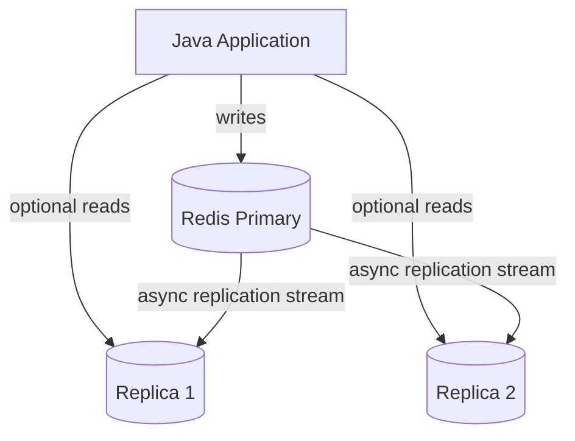
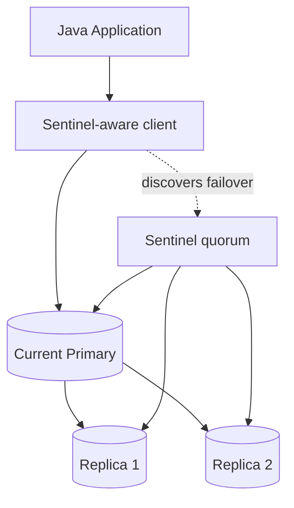
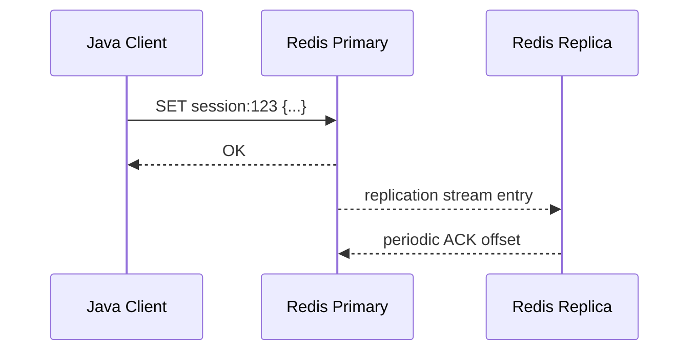
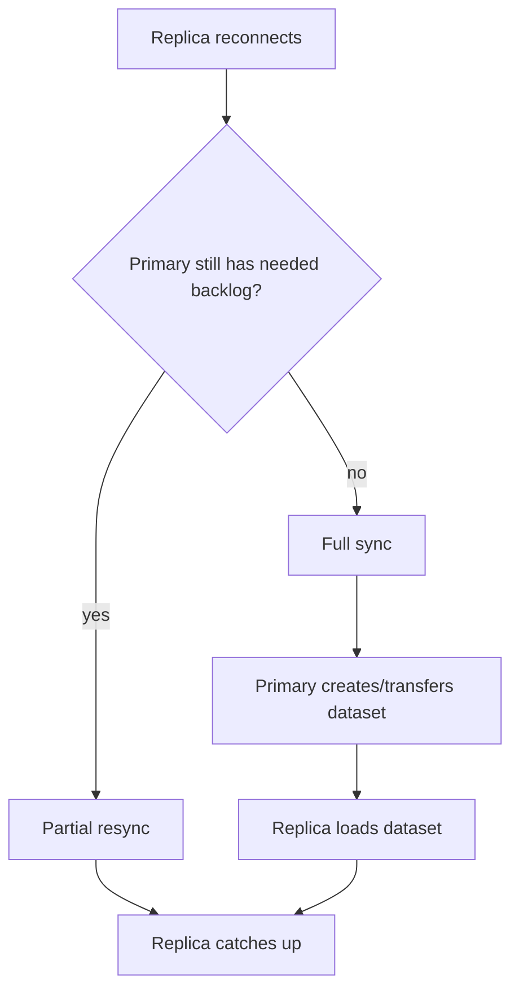
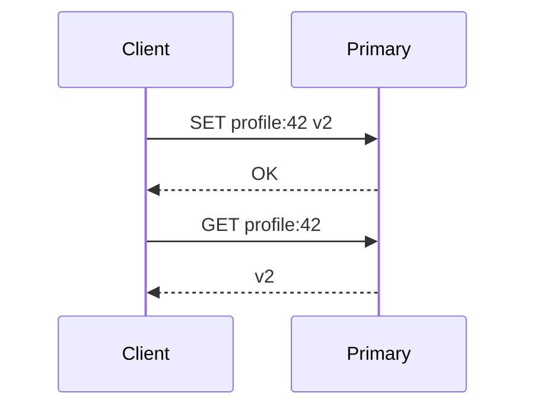
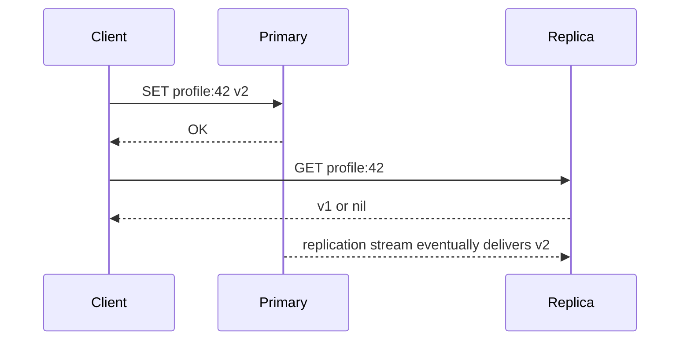
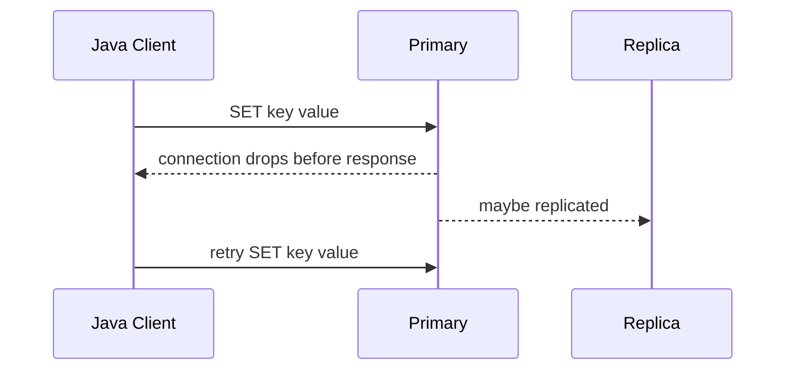
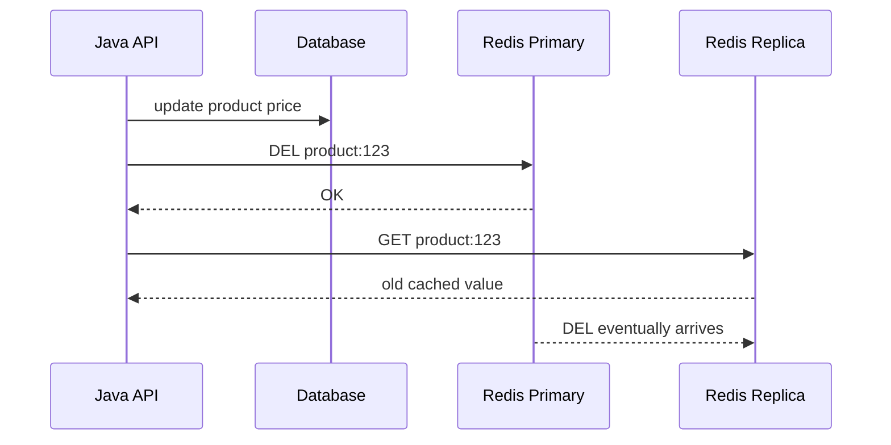
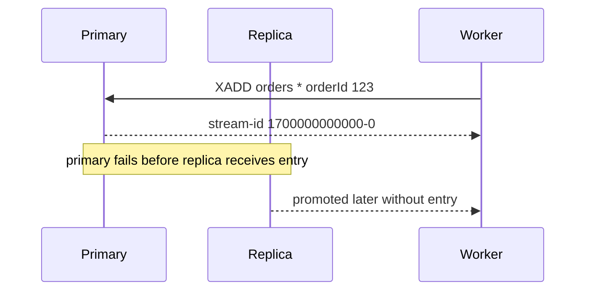

# Part 029 — Replication and Read Scaling: Async Replication, WAIT, Replica Reads, and Stale-Read Control

Part 028 covered persistence and durability.
Now we move to Redis replication.

Replication is often introduced as “copy data to replicas”.
That description is correct, but insufficient for production engineering.

The real question is:

> What consistency, availability, read-scaling, and data-loss behavior does Redis replication actually give to a Java application?

The answer is subtle:

- Redis replication is primarily asynchronous.
- Replicas can serve reads, but those reads may be stale.
- Replication improves availability and read capacity, but does not make Redis a strongly consistent database.
- `WAIT` and `WAITAOF` can improve real-world safety, but they do not transform Redis into a CP replicated state machine.
- Failover can still lose acknowledged writes depending on lag, topology, persistence, and which replica is promoted.

The senior-engineering mental model:

> Redis replication is a performance and availability mechanism with bounded-but-not-eliminated data-loss risk. Treat it as an explicit consistency contract, not as invisible magic.

---

## 1. Kaufman Skill Decomposition

The target skill is not “configure `replicaof`”.
The target skill is:

> Given a Redis workload, decide whether replication should be used for HA, read scaling, data-safety improvement, or operational maintenance; then design Java clients and data access semantics so stale reads, lag, failover, and partial replication do not create hidden correctness bugs.

Break it down:

| Sub-skill | What you must be able to do |
|---|---|
| Replication mental model | Explain asynchronous primary-replica behavior and what replicas acknowledge |
| Topology design | Choose primary + N replicas, cascading replicas, or no replica reads |
| Read routing | Decide whether Java reads can go to replicas or must hit the primary |
| Staleness control | Define stale-read tolerance per use case |
| `WAIT` usage | Use synchronous acknowledgement when it improves data safety without overclaiming strong consistency |
| `WAITAOF` usage | Understand AOF fsync acknowledgement semantics where available |
| Lag monitoring | Detect replica lag, disconnected replicas, backlog pressure, and unsafe reads |
| Failover reasoning | Explain which writes can be lost during failover |
| Java client config | Configure Lettuce/Spring/Jedis safely for primary/replica topology |
| Runbook design | Validate replication health, perform replica promotion drills, and handle degraded replica states |

Kaufman-style practice goal:

> Within a few hours, you should be able to build a Java service that writes to Redis primary, optionally reads from replicas, measures lag, uses `WAIT` for selected writes, and demonstrates stale reads under controlled conditions.

---

## 2. What Redis Replication Solves

Redis replication can solve several different problems.
Do not collapse them into one.

| Goal | Does replication help? | Caveat |
|---|---:|---|
| Read scaling | yes | reads may be stale |
| High availability | yes, with failover orchestration | replication alone does not fail over clients |
| Backup source | yes | replica can be used for backups, but lag matters |
| Data safety | partially | async replication can still lose acknowledged writes |
| Maintenance | yes | replica can be promoted or used during primary maintenance |
| Geo-local reads | sometimes | stale reads and network partitions become harder |
| Strong consistency | no | requires consensus-style system semantics Redis replication does not provide |
| Linearizable reads | no by default | primary reads after write are safer; replica reads need explicit contract |

Replication should be tied to a workload class:

| Workload | Replica read safe? | Reason |
|---|---:|---|
| product catalog cache | usually yes | stale reads often acceptable |
| user session | maybe | depends on login/logout correctness |
| authorization policy | dangerous | stale grants/revocations can be security issue |
| idempotency result | dangerous | stale miss can duplicate side effect |
| rate limiter | usually yes/no depending design | stale state can under-limit or over-limit |
| leaderboard | usually yes | slight lag acceptable in many systems |
| notification unread count | maybe | UX tolerance matters |
| payment/order state | usually no | source of truth should be transactional database |

The production rule:

> Replica reads are a business-level consistency decision, not just a throughput optimization.

---

## 3. Basic Topology

A simple Redis replication topology:



A high availability topology adds Sentinel or an external failover system:



Replication alone does not make clients switch primary.
A client connected to a dead primary does not magically discover the new primary unless the client uses Sentinel, Cluster, managed-service endpoint behavior, or another discovery layer.

---

## 4. Redis Replication Mechanics

At a high level, Redis primary sends a replication stream to replicas.
Replicas process that stream and periodically acknowledge how much they processed.

Important properties:

| Property | Meaning |
|---|---|
| asynchronous by default | primary does not wait for replicas on every write |
| non-blocking primary side | primary can keep serving commands while replicas sync |
| replicas can accept connections | clients can connect and read from replicas |
| replicas can cascade | a replica can replicate from another replica |
| partial resync exists | replicas can catch up from backlog if possible |
| full resync can happen | if backlog is insufficient, replica receives full dataset again |
| failover is best effort | promotion prefers better replicas, but not all acknowledged writes are guaranteed |

The replication path:



Notice the key detail:

> The client receives `OK` before the replica necessarily has the write.

That is the root of stale reads and possible failover write loss.

---

## 5. Full Sync, Partial Resync, and Replication Backlog

A replica can become disconnected.
When it reconnects, Redis attempts partial resynchronization if the primary still has the required replication backlog.
If not, Redis performs full synchronization.

Conceptually:



Why this matters:

| Condition | Consequence |
|---|---|
| backlog too small | frequent full resync under network instability |
| large dataset | full sync can cause heavy disk/network/CPU/memory pressure |
| replica used for reads during resync | may return stale data or error depending config |
| slow replica | lag grows; failover safety decreases |
| too many replicas | primary network bandwidth becomes bottleneck |

Engineering implication:

> Replication backlog is part of your resilience budget. If it is too small for your write rate and expected outage window, replicas will full-sync more often during ordinary network instability.

Approximate backlog sizing:

```text
required_backlog_bytes >= peak_write_replication_bytes_per_second * expected_disconnect_seconds * safety_factor
```

Example:

```text
peak replication stream = 15 MB/s
expected temporary disconnect = 60 s
safety factor = 2
required backlog >= 15 * 60 * 2 = 1800 MB
```

This is not exact because command payloads, allocator overhead, and workload shape vary.
But it gives a reviewable starting point.

---

## 6. Read Scaling: The Attractive Trap

Replica reads look easy:

```text
writes -> primary
reads  -> replicas
```

But this changes application semantics.

Without replica reads:



With replica reads:



The read-after-write guarantee changed.

Common bug:

```java
redisPrimary.set("order:123:state", "CONFIRMED");
String state = redisReplica.get("order:123:state");
// state may still be PENDING
```

This is not a Redis bug.
It is a consistency contract violation in your application design.

---

## 7. Read Consistency Classes

Before enabling replica reads, classify each access pattern.

| Consistency class | Redis routing | Example |
|---|---|---|
| must read own write | primary read after write | login/logout, idempotency result |
| monotonic per user | sticky primary or version-aware reads | profile update confirmation |
| stale within seconds OK | replica preferred | catalog cache, leaderboard |
| stale within minutes OK | any replica/cache | analytics, approximate counters |
| stale forbidden for safety | do not use replica read | authorization, payment side-effect guard |

A practical Java repository can expose this explicitly:

```java
public enum RedisReadConsistency {
    PRIMARY_ONLY,
    REPLICA_PREFERRED,
    REPLICA_ONLY_STALE_OK
}

public interface RedisReadRouter {
    RedisCommands<String, String> commandsFor(RedisReadConsistency consistency);
}
```

Avoid burying read routing inside a global connection factory without workload-level review.

Bad abstraction:

```java
redis.get(key); // nobody knows if this hits primary or replica
```

Better abstraction:

```java
sessionStore.getSession(sessionId, RedisReadConsistency.PRIMARY_ONLY);
leaderboardStore.getRank(userId, RedisReadConsistency.REPLICA_PREFERRED);
```

---

## 8. Replica Lag as a First-Class Signal

Replica lag is not only a metric.
It is part of correctness.

Key lag indicators:

| Signal | Meaning |
|---|---|
| replica connected/disconnected | whether replica receives stream |
| replication offset delta | how far behind replica is |
| last IO seconds ago | whether replica has recent communication |
| backlog usage | whether partial resync remains possible |
| sync in progress | replica may be stale or unavailable |
| replica read latency | replica may be overloaded by read traffic |

A simple safety rule:

> Only route stale-tolerant reads to replicas whose lag is within the use case's tolerance.

Example policy:

| Use case | Max acceptable lag |
|---|---:|
| product recommendation cache | 5 seconds |
| leaderboard | 2 seconds |
| inventory display hint | 1 second or primary only depending business |
| user authorization | 0 seconds; primary/source only |
| idempotency state | 0 seconds; primary only |

You can expose lag through operational metrics rather than application-per-command checks.
But the routing decision must be based on an explicit contract.

---

## 9. `WAIT`: Better Data Safety, Not Strong Consistency

`WAIT numreplicas timeout` blocks the current client until previous writes from that same connection have been acknowledged by at least the requested number of replicas, or until timeout.

Example:

```text
SET idempotency:payment:abc COMPLETED EX 86400
WAIT 1 100
```

Meaning:

- Redis waits up to 100 ms.
- If one replica acknowledged receiving the previous write, return value is at least `1`.
- If no replica acknowledged within the timeout, return value may be `0`.

Java-style usage with Lettuce sync commands:

```java
public final class ReplicatedWriteRedisStore {
    private final RedisCommands<String, String> commands;

    public ReplicatedWriteRedisStore(RedisCommands<String, String> commands) {
        this.commands = commands;
    }

    public void setWithReplicaAck(String key, String value, long ttlSeconds) {
        commands.setex(key, ttlSeconds, value);

        Long ackedReplicas = commands.waitForReplication(1, 100);
        if (ackedReplicas == null || ackedReplicas < 1) {
            // Decide per workload:
            // - fail request?
            // - accept but emit warning?
            // - degrade to source-of-truth replay?
            throw new RedisReplicationInsufficientException(key, ackedReplicas);
        }
    }
}
```

Depending on client API version, the method name may differ.
The conceptual command is `WAIT`.

Important `WAIT` rules:

| Rule | Reason |
|---|---|
| call on same connection after the write | `WAIT` is about previous writes from current connection |
| set finite timeout | avoid unbounded user request blocking |
| check return value | timeout still returns number of acknowledged replicas |
| do not claim strong consistency | failover can still lose acknowledged writes in edge cases |
| use selectively | extra round trip and blocking can hurt throughput |

Bad usage:

```java
commands.set(key, value);
commands.waitForReplication(1, 0); // can block forever under replica outage
```

Better:

```java
commands.set(key, value);
long acked = commands.waitForReplication(1, 50);
if (acked < 1) {
    metrics.counter("redis.replication.wait.insufficient").increment();
    // workload-specific decision
}
```

---

## 10. When to Use `WAIT`

`WAIT` is useful when losing recent writes during failover is materially worse than adding latency.

Good candidates:

| Workload | Why `WAIT` may help |
|---|---|
| idempotency result | reduces chance of duplicate side effect after failover |
| delayed job enqueue | reduces chance of losing recently enqueued work |
| session login/logout | reduces chance of session state disappearing immediately after failover |
| critical invalidation marker | reduces chance of stale cache surviving failover |
| stream append with Redis as queue | improves probability promoted replica has entry |

Weak candidates:

| Workload | Why usually not worth it |
|---|---|
| pure cache fill | value can be recomputed |
| high-QPS rate limiter | latency overhead may dominate; state loss often tolerable |
| analytics counters | approximate loss may be acceptable |
| frequently updated presence | ephemeral by design |

Rule of thumb:

> Use `WAIT` for selected correctness-adjacent writes, not every Redis command by default.

---

## 11. `WAITAOF`: Fsync Acknowledgement Where AOF Is Part of the Contract

Redis 7.2 introduced `WAITAOF`.
It waits for previous writes from the current connection to be fsynced to local AOF and/or replica AOF, depending on arguments.

Conceptually:

```text
SET job:123 {...}
WAITAOF 1 1 100
```

Meaning:

- wait for local AOF fsync count `1`, if local AOF is enabled;
- wait for one replica AOF fsync;
- wait at most 100 ms;
- return actual counts so the client must verify.

Why it matters:

| Command | Confirms |
|---|---|
| `WAIT` | replicas received and acknowledged replication offset |
| `WAITAOF` | local/replica AOF fsync acknowledgement |

But do not overclaim:

> `WAITAOF`, like `WAIT`, improves real-world safety but does not make Redis a strongly consistent replicated database.

Use `WAITAOF` only when:

- AOF is enabled and part of the workload's durability model.
- Extra latency is acceptable.
- The Java client can execute the command and inspect the returned counts.
- Operations understand the failure behavior under timeout.

If your Redis client does not expose `WAITAOF`, you may use raw command execution if supported, but do not hide it in generic cache code.

---

## 12. `min-replicas-to-write` and `min-replicas-max-lag`

Redis can be configured to stop accepting writes if it cannot communicate with enough replicas within a lag threshold.

Typical config:

```conf
min-replicas-to-write 1
min-replicas-max-lag 10
```

Meaning:

- primary must have at least one sufficiently fresh replica;
- if not, writes are rejected;
- this bounds divergence during partitions but reduces availability.

Trade-off:

| Without min replicas | With min replicas |
|---|---|
| primary accepts writes during replica outage | primary may reject writes |
| higher write availability | lower write availability |
| more data-loss window during failover | bounded divergence window |
| suitable for cache-like workloads | suitable for store-like Redis workloads |

This is not a free improvement.
For cache workloads, rejecting writes may be worse than accepting possible loss.
For idempotency/job/session workloads, bounding divergence may be worth it.

Java behavior must handle the rejection path:

```java
try {
    commands.set(key, value);
} catch (RedisCommandExecutionException e) {
    if (e.getMessage() != null && e.getMessage().contains("NOREPLICAS")) {
        // Redis is protecting itself because replication is insufficient.
        throw new RedisReplicationUnavailableException("Redis primary rejected write due to replica lag", e);
    }
    throw e;
}
```

The exact exception type and message depend on client.
Do not parse message text as your only control plane if your client exposes structured errors.

---

## 13. Java Client Read Routing with Lettuce

Lettuce supports read routing strategies for master/replica connections.
Common strategies include primary-only, replica-only, replica-preferred, and nearest-like policies depending on client capabilities/version.

Example concept:

```java
RedisClient client = RedisClient.create();

RedisURI primary = RedisURI.Builder.redis("redis-primary", 6379).build();
RedisURI replica1 = RedisURI.Builder.redis("redis-replica-1", 6379).build();
RedisURI replica2 = RedisURI.Builder.redis("redis-replica-2", 6379).build();

StatefulRedisMasterReplicaConnection<String, String> connection =
    MasterReplica.connect(
        client,
        StringCodec.UTF8,
        List.of(primary, replica1, replica2)
    );

connection.setReadFrom(ReadFrom.REPLICA_PREFERRED);
RedisCommands<String, String> commands = connection.sync();
```

Production concerns:

| Concern | Recommendation |
|---|---|
| topology discovery | verify addresses returned by Redis are reachable from application network |
| cloud/NAT | prefer static master-replica config if INFO exposes private/unroutable addresses |
| Pub/Sub | do not assume Pub/Sub propagates across independent servers in static master-replica config |
| stale reads | bind routing to explicit repository method contract |
| failover | standalone master/replica routing is not the same as Sentinel-aware failover |

Avoid this:

```java
connection.setReadFrom(ReadFrom.REPLICA_PREFERRED);
// Then use this globally for sessions, auth, idempotency, and cache.
```

Better:

```java
public final class RedisAccessPolicy {
    public static final RedisReadConsistency CACHE = RedisReadConsistency.REPLICA_PREFERRED;
    public static final RedisReadConsistency SESSION_AFTER_LOGIN = RedisReadConsistency.PRIMARY_ONLY;
    public static final RedisReadConsistency IDEMPOTENCY = RedisReadConsistency.PRIMARY_ONLY;
}
```

---

## 14. Spring Data Redis Read from Replica

Spring Data Redis with Lettuce can configure read-from-replica behavior.

Conceptual configuration:

```java
@Configuration
class RedisReadReplicaConfiguration {

    @Bean
    LettuceConnectionFactory redisConnectionFactory() {
        LettuceClientConfiguration clientConfig = LettuceClientConfiguration.builder()
            .readFrom(ReadFrom.REPLICA_PREFERRED)
            .build();

        RedisStandaloneConfiguration serverConfig =
            new RedisStandaloneConfiguration("redis-primary", 6379);

        return new LettuceConnectionFactory(serverConfig, clientConfig);
    }
}
```

But be careful: if your `RedisTemplate` is shared globally, every operation may inherit the same routing behavior.

Safer pattern:

```java
@Configuration
class RedisTemplates {

    @Bean("primaryRedisTemplate")
    RedisTemplate<String, String> primaryRedisTemplate(
        @Qualifier("primaryConnectionFactory") RedisConnectionFactory cf
    ) {
        RedisTemplate<String, String> template = new RedisTemplate<>();
        template.setConnectionFactory(cf);
        template.afterPropertiesSet();
        return template;
    }

    @Bean("replicaPreferredRedisTemplate")
    RedisTemplate<String, String> replicaPreferredRedisTemplate(
        @Qualifier("replicaPreferredConnectionFactory") RedisConnectionFactory cf
    ) {
        RedisTemplate<String, String> template = new RedisTemplate<>();
        template.setConnectionFactory(cf);
        template.afterPropertiesSet();
        return template;
    }
}
```

Then inject by intent:

```java
public final class ProductCacheRepository {
    private final RedisTemplate<String, String> replicaPreferredRedis;

    public ProductCacheRepository(
        @Qualifier("replicaPreferredRedisTemplate") RedisTemplate<String, String> replicaPreferredRedis
    ) {
        this.replicaPreferredRedis = replicaPreferredRedis;
    }
}
```

For critical writes/reads:

```java
public final class IdempotencyRepository {
    private final RedisTemplate<String, String> primaryRedis;

    public IdempotencyRepository(
        @Qualifier("primaryRedisTemplate") RedisTemplate<String, String> primaryRedis
    ) {
        this.primaryRedis = primaryRedis;
    }
}
```

The point is not the exact bean structure.
The point is making consistency visible in dependency wiring.

---

## 15. Jedis Considerations

Jedis is synchronous and straightforward.
In master-replica setups, you generally need to be explicit about which node a connection/pool targets unless using Sentinel or Cluster support.

Example conceptual separation:

```java
public final class JedisPrimaryReplicaRedis {
    private final JedisPool primaryPool;
    private final List<JedisPool> replicaPools;
    private final AtomicInteger nextReplica = new AtomicInteger();

    public JedisPrimaryReplicaRedis(JedisPool primaryPool, List<JedisPool> replicaPools) {
        this.primaryPool = primaryPool;
        this.replicaPools = List.copyOf(replicaPools);
    }

    public String getPrimary(String key) {
        try (Jedis jedis = primaryPool.getResource()) {
            return jedis.get(key);
        }
    }

    public String getReplicaPreferred(String key) {
        if (replicaPools.isEmpty()) {
            return getPrimary(key);
        }
        int index = Math.floorMod(nextReplica.getAndIncrement(), replicaPools.size());
        try (Jedis jedis = replicaPools.get(index).getResource()) {
            return jedis.get(key);
        } catch (RuntimeException replicaFailure) {
            // Whether fallback to primary is safe depends on workload.
            return getPrimary(key);
        }
    }

    public void setPrimary(String key, String value) {
        try (Jedis jedis = primaryPool.getResource()) {
            jedis.set(key, value);
        }
    }
}
```

Operational concerns:

| Concern | Jedis-specific caution |
|---|---|
| pool exhaustion | replica reads can hide overloaded replica pools |
| stale topology | manual pools do not auto-discover promoted primary |
| failover | prefer Sentinel-aware Jedis for Sentinel topology |
| `WAIT` | must run on same connection after write |
| blocking calls | pool sizing must account for `WAIT`, `BLPOP`, streams blocking reads |

Do not implement your own failover if Sentinel/managed endpoint/Cluster already provides the control plane.
Manual routing is acceptable only for simple, explicit topologies.

---

## 16. Replication and Java Retry Semantics

Replication introduces new retry questions.

Scenario:



For idempotent writes, retry may be fine.
For non-idempotent writes, retry can duplicate effects.

Redis commands are often individually atomic, but the business operation around them may not be idempotent.

Examples:

| Operation | Retry risk |
|---|---|
| `SET key value` | usually safe if same value/TTL semantics acceptable |
| `INCR counter` | duplicate increment |
| `LPUSH queue job` | duplicate job |
| `XADD stream * ...` | duplicate event |
| `ZADD score member` | often idempotent if same score/member |
| Lua claim operation | depends on token/result semantics |

Production pattern:

```java
public interface RedisWriteOperation<T> {
    T execute(RedisCommands<String, String> commands);
    boolean safeToRetryAfterUnknownOutcome();
}
```

Better: encode idempotency at the Redis data-model level.

```text
SET job-dedup:{jobId} 1 NX EX 86400
XADD jobs * jobId {jobId} payload {...}
```

Or use a Lua script to claim and enqueue atomically.

---

## 17. Read-Your-Write Strategies

If a workflow writes and immediately reads, do not blindly use replica reads.

Options:

| Strategy | Description | Cost |
|---|---|---|
| primary read after write | route immediate read to primary | more primary load |
| sticky primary window | read primary for N ms after write | more routing complexity |
| version-aware read | read replica only if version >= required version | extra metadata |
| `WAIT` then replica read | wait for replica acknowledgement before reading | still not universal; adds latency |
| avoid read after write | return write result directly | best when possible |

Version-aware pattern:

```json
{
  "version": 42,
  "payload": { "status": "CONFIRMED" }
}
```

Client writes version 42, then if reading from replica:

```java
CachedOrder order = orderCache.getReplicaPreferred(orderId);
if (order == null || order.version() < requiredVersion) {
    order = orderCache.getPrimary(orderId);
}
```

This is a powerful pattern when replica reads are desired but read-your-write matters for a subset of flows.

---

## 18. Monotonic Reads

Monotonic reads mean a client should not observe time moving backward.

Bad UX:

1. User sees profile name “Alicia”.
2. Next page reads from a lagging replica.
3. User sees old name “Alice”.

Options:

| Option | How |
|---|---|
| session-level primary stickiness | after mutation, route user's reads to primary for a short window |
| version token in response | frontend/API passes minimum version on subsequent reads |
| client-side cache | retain newest observed value for request/session |
| no replica for user-owned mutable views | simplest correctness path |

Example API token pattern:

```http
POST /profile/name
X-Observed-Version: 103
```

Then:

```http
GET /profile
X-Min-Version: 103
```

Repository logic:

```java
public Profile getProfile(String userId, long minVersion) {
    Profile replica = readReplica(userId);
    if (replica != null && replica.version() >= minVersion) {
        return replica;
    }
    return readPrimary(userId);
}
```

This is more work than replica reads by default.
That is the point: consistency is not free.

---

## 19. Replica Reads and Cache Invalidation

Replica reads can break invalidation assumptions.

Example:



If invalidation must be immediate for the requester, read primary after invalidation.
If staleness is acceptable, document the window.

Pattern:

```java
public Product getAfterMutation(String productId) {
    return productCache.get(productId, RedisReadConsistency.PRIMARY_ONLY);
}

public Product getForBrowse(String productId) {
    return productCache.get(productId, RedisReadConsistency.REPLICA_PREFERRED);
}
```

Do not configure global replica reads and then assume cache invalidation is immediate.

---

## 20. Replica Reads and Negative Cache

Negative cache values are especially dangerous with replication lag.

Scenario:

1. Primary writes `user:42`.
2. Replica has not received it.
3. Application reads replica, gets `nil`.
4. Application writes negative cache `user:42:not-found`.
5. Real user exists, but negative cache now suppresses it.

Mitigation:

| Mitigation | Description |
|---|---|
| negative cache primary-only | only create negative cache after primary/source check |
| short TTL | reduce damage window |
| versioned namespace | avoid old negative values after creation events |
| source-of-truth confirmation | DB check before negative cache write |
| no replica reads for existence checks | safest |

Pattern:

```java
public Optional<User> findUser(String userId) {
    String value = primaryRedis.get("user:" + userId);
    if (value != null) {
        return Optional.of(parse(value));
    }

    Optional<User> dbUser = userRepository.findById(userId);
    if (dbUser.isEmpty()) {
        primaryRedis.setex("user-not-found:" + userId, 30, "1");
    }
    return dbUser;
}
```

---

## 21. Replication and Eviction

If primary and replicas have different memory pressure, eviction can cause surprising behavior.

Rules:

- Replicas generally follow primary write stream.
- But if replicas have different `maxmemory`, policies, or extra read load, operational symptoms differ.
- Replica reads can fail or return missing values if the replica is not configured equivalently or is unhealthy.

Production checklist:

| Check | Why |
|---|---|
| same Redis version | avoid behavior differences |
| same maxmemory policy | avoid inconsistent data retention semantics |
| same persistence mode where required | avoid failover durability mismatch |
| replica capacity >= primary effective capacity | replica should not be a smaller accidental bottleneck |
| monitor evicted keys per node | replica eviction is a correctness smell for read scaling |
| monitor memory fragmentation per node | replica may have different allocator behavior under read traffic |

A replica is not “just a copy” operationally.
It is a live server with its own CPU, memory, network, disk, and latency profile.

---

## 22. Replication and Streams

Redis Streams are often used for durable-ish event workflows.
Replication improves survivability but does not eliminate failure cases.

Potential loss window:



Mitigation options:

| Option | Helps with |
|---|---|
| `WAIT 1 timeout` after `XADD` | increases chance promoted replica has stream entry |
| source-of-truth outbox | stronger recoverability from database |
| idempotent consumers | tolerate duplicate/replay |
| periodic reconciliation | repair missed events |
| backup/restore | recover after catastrophic loss |

If Redis Stream is the only system of record for business-critical events, you must define the data-loss budget explicitly.
For many enterprise systems, database outbox + Redis Stream as low-latency delivery layer is safer.

---

## 23. Replication and Locks

Replication does not automatically make Redis locks safe.

Problem:

1. Client acquires lock on primary.
2. Primary acknowledges lock.
3. Primary fails before replica receives lock.
4. Replica is promoted.
5. Another client acquires same lock.

This is why lock correctness needs fencing tokens or stronger coordination.

Pattern reminder:

```text
lock acquire -> lease + owner token + fencing token
resource write must reject stale fencing token
```

Replication can reduce probability of losing lock state, but correctness must not depend solely on async replication.

---

## 24. Replication and Distributed Rate Limiting

Rate limiter state often tolerates some loss or staleness.
But replica reads can undercount.

Bad pattern:

```text
INCR limiter:user:42 on primary
GET limiter:user:42 from replica
```

The `GET` may return an older count.
For rate limit decisions, the decision usually must be made on primary in the same atomic operation.

Correct pattern:

```text
Lua on primary:
  read current count
  increment if allowed
  set expiry
  return allow/deny
```

Replica reads can be used for dashboards, not enforcement.

---

## 25. Failure Scenarios to Practice

### Scenario A — Replica Disconnects

Expected symptoms:

- `connected_slaves` decreases.
- replication lag grows or replica disappears.
- `WAIT 1 100` starts returning `0`.
- `min-replicas-to-write` may reject writes if configured.

Practice:

```bash
# On replica host/container
redis-cli SHUTDOWN NOSAVE
```

Observe Java behavior:

- Does request latency increase?
- Do writes fail or continue?
- Does alert fire?
- Does the application emit clear error classification?

### Scenario B — Replica Lag Under Load

Generate write load on primary and CPU/network pressure on replica.

Expected symptoms:

- offset delta grows;
- stale reads become observable;
- read replica latency increases;
- full sync risk rises if disconnect occurs.

Practice assertion:

```java
long version = writeNewVersionToPrimary("profile:42");
Profile fromReplica = readReplica("profile:42");
assertThat(fromReplica.version()).isLessThanOrEqualTo(version);
```

Then implement primary fallback when version is too old.

### Scenario C — Primary Fails Before Replication

Hard to reproduce deterministically, but you can approximate:

1. Pause network between primary and replica.
2. Write to primary.
3. Kill primary.
4. Promote replica.
5. Observe missing write.

Lesson:

> A write acknowledged by Redis primary is not necessarily present on promoted replica.

---

## 26. Operational Metrics

Minimum dashboard for replicated Redis:

| Metric | Alert idea |
|---|---|
| connected replicas | below expected count |
| replication offset lag | above workload tolerance |
| last IO seconds ago | above threshold |
| sync in progress | sustained too long |
| backlog histlen/utilization | close to configured backlog limit |
| full sync count | unexpected increase |
| partial sync success/fail | repeated failures |
| rejected writes due min replicas | any for critical workload |
| `WAIT` insufficient ack count | above baseline |
| replica command latency | above SLO |
| replica CPU/network | saturated |

Application metrics:

| Metric | Labels |
|---|---|
| `redis.read.route` | `primary`, `replica`, `fallback` |
| `redis.replica.fallback.count` | use case, reason |
| `redis.wait.ack.count` | required, returned |
| `redis.wait.timeout.count` | use case |
| `redis.stale_read.detected.count` | entity, repository |
| `redis.primary_only.read.count` | use case |

Do not rely only on Redis server metrics.
The application needs to reveal which consistency path it used.

---

## 27. Java Observability Wrapper

Example wrapper around `WAIT`:

```java
public final class RedisReplicationGuard {
    private final RedisCommands<String, String> commands;
    private final MeterRegistry meterRegistry;

    public RedisReplicationGuard(
        RedisCommands<String, String> commands,
        MeterRegistry meterRegistry
    ) {
        this.commands = commands;
        this.meterRegistry = meterRegistry;
    }

    public boolean waitForReplica(String useCase, int replicas, long timeoutMillis) {
        long startNanos = System.nanoTime();
        Long acked = commands.waitForReplication(replicas, timeoutMillis);
        long durationNanos = System.nanoTime() - startNanos;

        meterRegistry.timer("redis.wait.duration", "useCase", useCase)
            .record(durationNanos, TimeUnit.NANOSECONDS);

        meterRegistry.counter(
            "redis.wait.result",
            "useCase", useCase,
            "required", Integer.toString(replicas),
            "acked", Long.toString(acked == null ? -1 : acked)
        ).increment();

        return acked != null && acked >= replicas;
    }
}
```

Do not emit high-cardinality key names as labels.
Use stable use-case names.

---

## 28. Choosing a Replication Strategy by Workload

### Cache-only Redis

Recommended:

- replicas for read scaling if stale values acceptable;
- no `WAIT` by default;
- fail open to database/source if Redis unavailable;
- persistence optional;
- `min-replicas-to-write` usually unnecessary.

### Session Redis

Recommended:

- primary reads for login/logout paths;
- replica reads only for low-risk session metadata;
- persistence or fallback session strategy;
- consider `WAIT` for login/session creation;
- define logout staleness policy carefully.

### Idempotency Redis

Recommended:

- primary-only reads/writes;
- atomic claim scripts;
- `WAIT` for completed result if failover risk matters;
- persistence enabled;
- reconciliation with durable source if side effects are critical.

### Job Queue Redis

Recommended:

- primary-only enqueue/dequeue;
- Streams or reliable queue pattern;
- `WAIT` for critical enqueue;
- persistence enabled;
- DLQ and reconciliation.

### Leaderboard Redis

Recommended:

- writes primary;
- reads replica-preferred if lag acceptable;
- rebuild path from source events;
- no `WAIT` unless user-facing ranking loss is unacceptable.

---

## 29. Configuration Example: Primary + Replica

Minimal primary config fragments:

```conf
port 6379
appendonly yes
repl-backlog-size 512mb
repl-backlog-ttl 3600
```

Replica config fragment:

```conf
port 6379
replicaof redis-primary 6379
replica-read-only yes
appendonly yes
```

Optional stricter primary config:

```conf
min-replicas-to-write 1
min-replicas-max-lag 10
```

Important:

- The right values depend on workload and capacity.
- Do not copy these values blindly.
- Test failover and network partitions before production.

---

## 30. Local Docker Compose Practice Lab

A small local lab:

```yaml
services:
  redis-primary:
    image: redis:8
    command:
      - redis-server
      - --appendonly
      - "yes"
      - --repl-backlog-size
      - 128mb
    ports:
      - "6379:6379"

  redis-replica-1:
    image: redis:8
    command:
      - redis-server
      - --replicaof
      - redis-primary
      - "6379"
      - --appendonly
      - "yes"
    depends_on:
      - redis-primary
    ports:
      - "6380:6379"

  redis-replica-2:
    image: redis:8
    command:
      - redis-server
      - --replicaof
      - redis-primary
      - "6379"
      - --appendonly
      - "yes"
    depends_on:
      - redis-primary
    ports:
      - "6381:6379"
```

Practice commands:

```bash
redis-cli -p 6379 SET demo:v 1
redis-cli -p 6379 WAIT 1 1000
redis-cli -p 6380 GET demo:v
redis-cli -p 6379 INFO replication
redis-cli -p 6380 INFO replication
```

Observe:

- `role:master` vs `role:slave`/replica terminology in output;
- connected replica count;
- replication offsets;
- read behavior from replica.

Redis command output may still use historical terms such as master/slave in some places.
In architecture discussions, use primary/replica when possible.

---

## 31. Testing Stale Reads in Java

You can simulate stale reads by pausing replica replication.
In a local environment, one crude method is pausing/stopping the replica container.

Test idea:

```java
@Test
void replicaReadMayBeStaleAfterPrimaryWrite() {
    String key = "test:profile:" + UUID.randomUUID();

    primary.set(key, "v1");
    waitForReplicaEventually(key, "v1");

    pauseReplicaNetwork();

    primary.set(key, "v2");
    String fromReplica = replica.get(key);

    assertThat(fromReplica).isEqualTo("v1");
}
```

Do not rely on timing sleeps alone.
For deterministic tests, control the replica network or use a test harness that can block replication traffic.

The point of the test is educational:

> It should prove to your team that replica reads are stale by design.

---

## 32. Review Checklist

Before enabling Redis replica reads in production, ask:

1. Which repositories will read from replicas?
2. What is each repository's stale-read tolerance?
3. Does any operation require read-your-write?
4. Does any operation perform existence checks or negative caching?
5. What is the maximum tolerated replica lag?
6. How is lag measured and alerted?
7. Does the Java client fallback to primary? When?
8. Are fallback events observable?
9. What happens if all replicas are down?
10. What happens if primary is up but replicas are lagging?
11. Is `min-replicas-to-write` configured? Why or why not?
12. Are `WAIT` or `WAITAOF` used for selected writes?
13. What is the latency budget for `WAIT`?
14. Does failover preserve enough data for the workload's risk profile?
15. Has stale-read behavior been demonstrated in tests?

---

## 33. Common Anti-Patterns

### Anti-pattern 1 — Global replica-preferred reads

```java
ReadFrom.REPLICA_PREFERRED
```

applied to all Redis usage without workload review.

Why bad:

- idempotency reads may be stale;
- session logout may be stale;
- negative cache may be wrong;
- invalidation may appear broken.

### Anti-pattern 2 — `WAIT` everywhere

Why bad:

- adds latency to every write;
- reduces throughput;
- still does not give strong consistency;
- may create failure amplification during replica outage.

### Anti-pattern 3 — no lag SLO

Why bad:

- “replica reads are acceptable” is meaningless without a lag budget.

### Anti-pattern 4 — assuming failover is lossless

Why bad:

- async replication means acknowledged writes can be lost.

### Anti-pattern 5 — replica as cheaper primary

Why bad:

- replicas must have production-grade capacity and monitoring.

---

## 34. Mental Model Summary

Redis replication gives you:

- asynchronous data copies;
- read scaling possibility;
- better availability with Sentinel/Cluster/managed failover;
- improved data safety when combined with persistence, `WAIT`, `WAITAOF`, and operational discipline.

Redis replication does not give you:

- strong consistency;
- automatic application failover by itself;
- read-your-write from replicas;
- guaranteed no-loss failover;
- safe distributed locks by itself;
- free capacity.

The practical engineering rule:

> Use Redis replication deliberately. Route reads by consistency requirement, monitor lag as a correctness signal, and use `WAIT`/`WAITAOF` only for selected writes where the extra latency buys meaningful risk reduction.

---

## 35. Practice Tasks

1. Create a local primary + two replicas with Docker Compose.
2. Write a Java program that writes to primary and reads from replica.
3. Demonstrate stale read after pausing replication.
4. Add primary fallback when a version is too old.
5. Add `WAIT 1 100` after selected writes.
6. Measure p50/p95/p99 latency with and without `WAIT`.
7. Configure `min-replicas-to-write 1` and stop replicas.
8. Confirm Java receives write errors.
9. Add metrics for read route and `WAIT` result.
10. Write a short consistency contract for three workloads: cache, session, idempotency.

---

## 36. References

- Redis documentation — Replication: `https://redis.io/docs/latest/operate/oss_and_stack/management/replication/`
- Redis command documentation — `WAIT`: `https://redis.io/docs/latest/commands/wait/`
- Redis command documentation — `WAITAOF`: `https://redis.io/docs/latest/commands/waitaof/`
- Redis documentation — Persistence: `https://redis.io/docs/latest/operate/oss_and_stack/management/persistence/`
- Spring Data Redis documentation — Connection Modes: `https://docs.spring.io/spring-data/redis/reference/redis/connection-modes.html`
- Lettuce documentation: `https://redis.github.io/lettuce/`

---

## 37. What Comes Next

Part 030 covers Redis Sentinel.

Replication gives you copies.
Sentinel gives you monitoring, discovery, and automatic failover for non-clustered Redis deployments.
But Sentinel also introduces new correctness questions: quorum, failover timing, split brain, client reconnection, and the unavoidable data-loss window caused by asynchronous replication.
