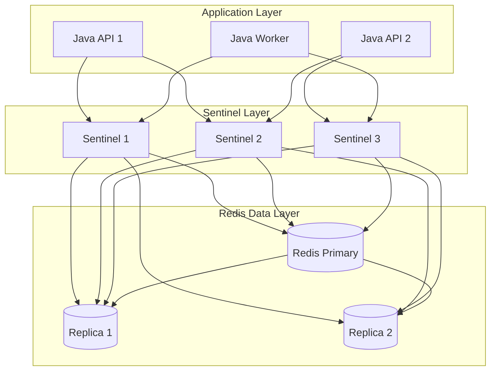
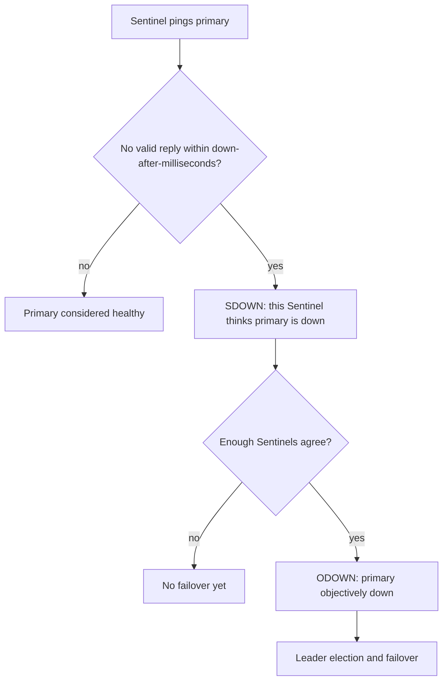
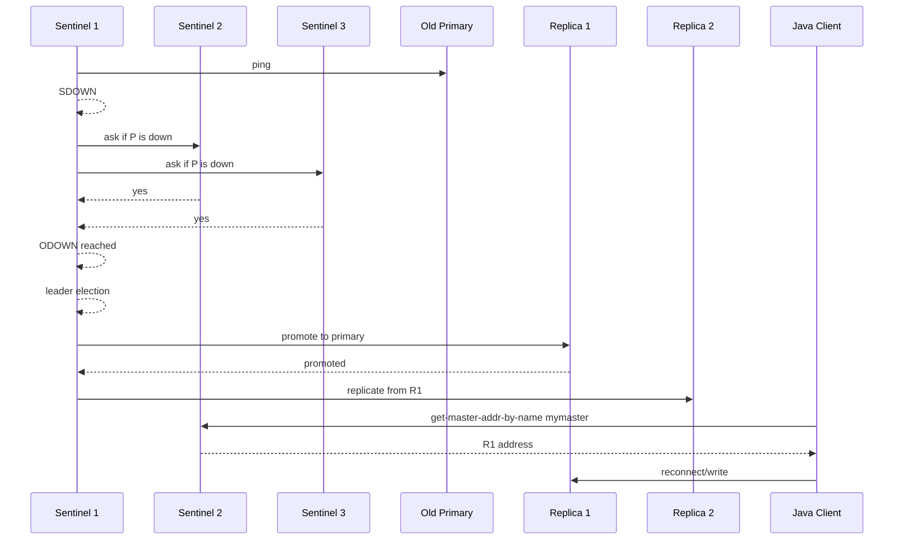
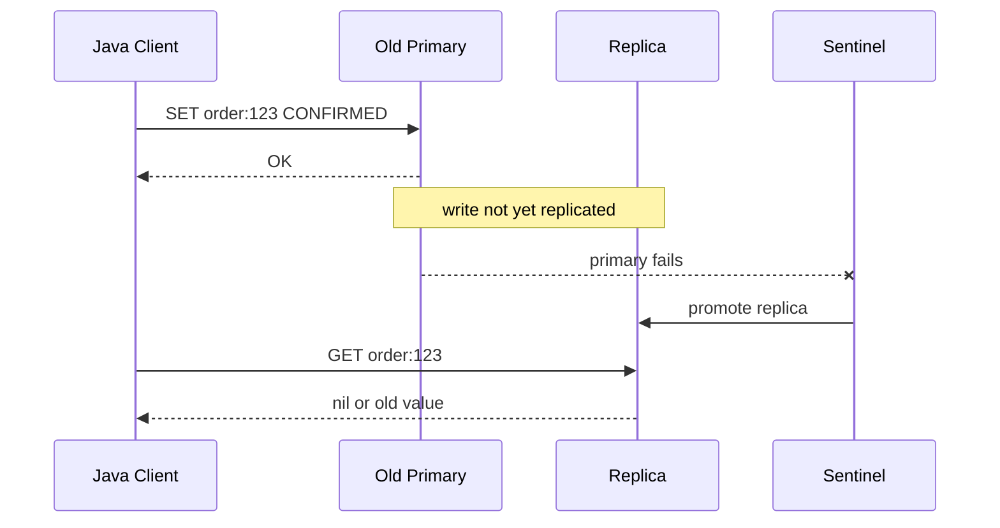
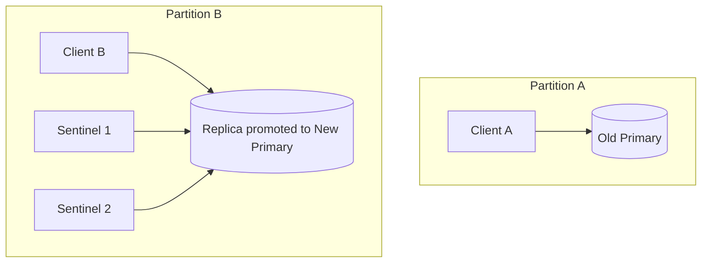
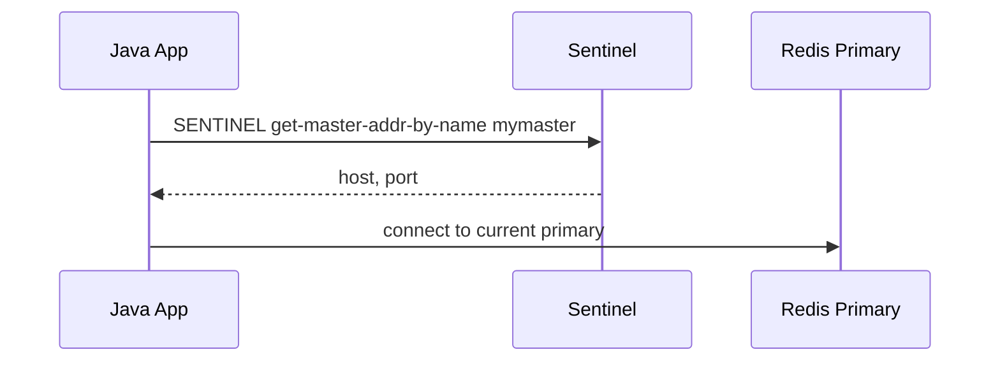
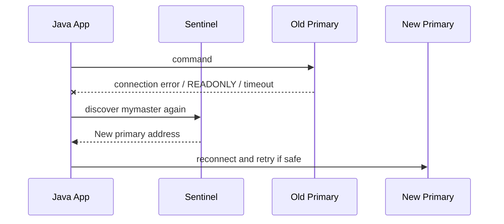

# Part 030 — Sentinel High Availability: Failover, Client Discovery, Quorum, and Split-Brain Risk

Part 029 covered Redis replication and read scaling.
Replication gives Redis copies of data.
But copies alone are not enough for high availability.

If the primary fails, something must:

1. detect that the primary is unhealthy;
2. agree that failover should happen;
3. select a replica to promote;
4. reconfigure the remaining replicas;
5. tell clients where the new primary is.

For non-clustered Redis Open Source deployments, Redis Sentinel provides this control plane.

The senior-engineering mental model:

> Sentinel is not “replication with magic failover”. Sentinel is a distributed monitoring and failover coordination system around asynchronous Redis replication. It improves availability, but it does not remove stale reads, split-brain risk windows, or acknowledged-write loss windows.

---

## 1. Kaufman Skill Decomposition

The target skill is not “run three Sentinel containers”.
The target skill is:

> Given a Redis primary-replica deployment, design Sentinel topology, quorum, client configuration, failover behavior, application retry policy, and operational tests so Redis remains available under expected failures without misleading the business about data-loss semantics.

Breakdown:

| Sub-skill | What you must be able to do |
|---|---|
| Sentinel role | Explain monitoring, notification, discovery, and failover responsibilities |
| Quorum design | Choose Sentinel count and quorum for failure domains |
| Failure detection | Understand SDOWN, ODOWN, down-after, and false positives |
| Failover flow | Explain replica selection, promotion, reconfiguration, and convergence |
| Client discovery | Configure Java clients to ask Sentinel for the current primary |
| Data-loss reasoning | Explain why async replication can still lose acknowledged writes |
| Split-brain mitigation | Use topology, quorum, min replicas, and client behavior to reduce divergence |
| Operational testing | Run failover, partition, and restart drills |
| Observability | Monitor Sentinel state, Redis role, failover events, and client reconnects |
| Incident response | Recover from failed failover, old-primary return, and bad client configuration |

Kaufman-style outcome:

> After this part, you should be able to deploy a small Sentinel lab, configure a Java application to survive primary failover, explain what data may be lost, and write a runbook for failover incidents.

---

## 2. What Sentinel Does

Sentinel provides four major capabilities:

| Capability | Meaning |
|---|---|
| monitoring | Sentinels check whether primary and replicas are reachable |
| notification | Sentinels publish events about role changes and failures |
| automatic failover | Sentinels promote a replica when primary is objectively down |
| configuration provider | clients ask Sentinels for the current primary address |

A typical topology:



Important:

> Applications should not hard-code the primary Redis node in a Sentinel deployment. They should connect using Sentinel-aware clients or a managed endpoint that performs equivalent discovery.

---

## 3. What Sentinel Does Not Do

Sentinel does not:

- make Redis strongly consistent;
- make asynchronous replication lossless;
- remove stale replica reads;
- merge divergent writes from old and new primaries;
- guarantee failover is instantaneous;
- protect against every network partition;
- replace application idempotency;
- replace persistence/backups;
- replace careful client timeout/retry design.

The most dangerous misunderstanding:

> “We use Sentinel, so acknowledged writes cannot be lost.”

Wrong.
Sentinel coordinates failover, but Redis replication is still asynchronous.
If the primary acknowledges a write and fails before the promoted replica receives it, that write may be absent after failover.

---

## 4. Sentinel Terminology

| Term | Meaning |
|---|---|
| primary/master | Redis node currently accepting writes |
| replica | Redis node replicating from primary |
| monitored master | Sentinel name for a Redis primary group, e.g. `mymaster` |
| Sentinel | process that monitors Redis and coordinates failover |
| quorum | number of Sentinels that must agree a primary is down |
| SDOWN | subjectively down; one Sentinel thinks node is down |
| ODOWN | objectively down; enough Sentinels agree node is down |
| failover | promotion of a replica to new primary |
| config epoch | logical version of failover configuration |
| tilt mode | Sentinel protective mode when timing assumptions are unreliable |

Redis documentation and config may still use the term `master` in command names and settings.
In architecture language, use primary/replica where possible, but preserve actual command/config terms.

---

## 5. Failure Detection: SDOWN and ODOWN

Sentinel detection is two-stage.



### SDOWN

Subjective down means:

> One Sentinel believes the node is unreachable or unhealthy.

This can happen because:

- Redis process is down;
- network path from Sentinel to Redis is broken;
- Redis is overloaded and not responding in time;
- Sentinel host has network issues;
- DNS/service discovery is broken;
- TLS/auth/config mismatch causes failed checks.

### ODOWN

Objective down means:

> Enough Sentinels agree that the primary is down according to quorum.

Only then can failover proceed.

The design implication:

> Quorum is about agreement, not absolute truth. Network partitions can cause different observers to see different realities.

---

## 6. Basic Sentinel Configuration

A minimal Sentinel config:

```conf
port 26379
sentinel monitor mymaster redis-primary 6379 2
sentinel down-after-milliseconds mymaster 5000
sentinel failover-timeout mymaster 60000
sentinel parallel-syncs mymaster 1
```

Meaning:

| Setting | Meaning |
|---|---|
| `port 26379` | Sentinel listens on this port |
| `sentinel monitor mymaster redis-primary 6379 2` | monitor primary named `mymaster`, quorum `2` |
| `down-after-milliseconds` | time before one Sentinel marks SDOWN |
| `failover-timeout` | timeout/control window for failover operations |
| `parallel-syncs` | number of replicas reconfigured to sync with new primary at a time |

Run three Sentinels on different failure domains when possible.

Bad topology:

```text
host-1: primary + replica + sentinel-1 + sentinel-2 + sentinel-3
```

Better:

```text
host-1 / zone-a: redis-primary + sentinel-1
host-2 / zone-b: redis-replica-1 + sentinel-2
host-3 / zone-c: redis-replica-2 + sentinel-3
```

Even better for larger systems:

- separate Sentinel placement from Redis data nodes where operationally justified;
- avoid putting all Sentinels behind the same single network device or host failure domain;
- ensure applications can reach multiple Sentinels.

---

## 7. Why Three Sentinels Is Common

With one Sentinel:

- no real agreement;
- false positive can trigger bad decisions;
- Sentinel failure loses control plane.

With two Sentinels:

- tie situations are awkward;
- one failure can prevent safe majority decisions;
- partitions are harder to handle.

With three Sentinels:

- quorum 2 is practical;
- one Sentinel can fail while two still agree;
- majority logic is more robust.

Common baseline:

```text
3 Sentinels, quorum 2
```

But quorum is not a magic number.
Design it from failure domains.

| Sentinel count | Common quorum | Notes |
|---:|---:|---|
| 1 | 1 | dev only, not production HA |
| 2 | 2 | fragile; no tolerance for one Sentinel loss |
| 3 | 2 | common minimum production baseline |
| 5 | 3 | better for larger/failure-domain-rich deployments |

---

## 8. Failover Flow

A simplified failover:



The real flow includes more detail: leader election, config epochs, replica selection, reconfiguration, and convergence across Sentinels.
But the simplified model is enough for application design.

Application-level fact:

> During failover, Java clients will see connection errors, timeouts, `READONLY` errors, or command failures. Your code must treat failover as a normal operational event.

---

## 9. Replica Selection During Failover

Sentinel attempts to promote a suitable replica.
Selection considers factors such as:

- replica health;
- replica priority;
- replication offset/freshness;
- whether replica is disconnected or too stale;
- tie-breaking rules.

Engineering implication:

> The best failover outcome depends on replica health before failure, not only on Sentinel configuration.

If all replicas are lagging, disconnected, underprovisioned, or misconfigured, Sentinel cannot promote a perfect node.

Design checklist:

| Check | Why |
|---|---|
| replicas have enough CPU/memory/network | promotion should not overload instantly |
| replicas use compatible persistence | promoted node should meet durability expectations |
| replica lag is monitored | stale replica promotion increases data loss |
| replica priority is intentional | some replicas should not be promoted |
| replicas are in proper failure domains | avoid losing primary and best replica together |

---

## 10. Data Loss Window

Sentinel failover is built on asynchronous replication.
Therefore acknowledged writes can be lost.

Failure sequence:



This is the unavoidable lesson:

> Sentinel improves availability. It does not guarantee zero data loss.

Mitigations:

| Mitigation | Helps | Does not guarantee |
|---|---|---|
| `WAIT` | replica received write | strong consistency |
| `WAITAOF` | AOF fsync acknowledgement | strong consistency |
| `min-replicas-to-write` | bounds divergence during replica loss | availability during replica outage |
| persistence | restart recovery | no-loss failover |
| durable source of truth | business recovery | Redis-only low-latency semantics |
| idempotency/reconciliation | repair duplicate/lost effects | no failure ever occurs |

---

## 11. Split Brain and Old Primary Writes

A network partition can create a dangerous shape:



If Client A can still write to old primary while Sentinels promote a new primary elsewhere, divergence occurs.
When the partition heals, the old primary is reconfigured as replica of the new primary, and writes accepted only by the old primary may be discarded.

Mitigation:

```conf
min-replicas-to-write 1
min-replicas-max-lag 10
```

This can make an isolated old primary stop accepting writes once it cannot talk to enough replicas.
But the trade-off is reduced availability when replicas are unavailable.

Production rule:

> If Redis stores business-critical state, use `min-replicas-to-write` or an equivalent managed-service safety mechanism, and still design for reconciliation.

---

## 12. Java Client Discovery

In Sentinel mode, clients should connect to Sentinels and ask for the current primary by monitored master name.

Conceptual flow:



After failover:



The client must know:

- Sentinel addresses;
- monitored master name, e.g. `mymaster`;
- Sentinel authentication if enabled;
- Redis data node authentication if enabled;
- TLS settings if enabled;
- timeouts and reconnect strategy.

Do not configure only one Sentinel address in production.
Clients should have multiple Sentinel endpoints.

---

## 13. Spring Data Redis Sentinel Configuration

Spring Data Redis supports Sentinel configuration.

Conceptual Java configuration:

```java
@Configuration
class RedisSentinelConfig {

    @Bean
    RedisConnectionFactory redisConnectionFactory() {
        RedisSentinelConfiguration sentinel = new RedisSentinelConfiguration()
            .master("mymaster")
            .sentinel("redis-sentinel-1", 26379)
            .sentinel("redis-sentinel-2", 26379)
            .sentinel("redis-sentinel-3", 26379);

        return new LettuceConnectionFactory(sentinel);
    }
}
```

Property-style configuration is often preferable:

```yaml
spring:
  data:
    redis:
      sentinel:
        master: mymaster
        nodes:
          - redis-sentinel-1:26379
          - redis-sentinel-2:26379
          - redis-sentinel-3:26379
      timeout: 500ms
      lettuce:
        shutdown-timeout: 100ms
```

Depending on Spring Boot/Spring Data version, property prefixes may be `spring.redis.*` or `spring.data.redis.*`.
Verify against your runtime version.

Security-aware config may include distinct Sentinel and data-node credentials:

```yaml
spring:
  data:
    redis:
      sentinel:
        master: mymaster
        nodes:
          - redis-sentinel-1:26379
          - redis-sentinel-2:26379
          - redis-sentinel-3:26379
        username: sentinel-user
        password: ${REDIS_SENTINEL_PASSWORD}
        data-node:
          username: app-user
          password: ${REDIS_DATA_PASSWORD}
```

The exact properties depend on Spring Data version.
The production principle does not:

> Sentinel credentials and Redis data-node credentials are separate concerns.

---

## 14. Lettuce Sentinel Configuration

Conceptual Lettuce URI:

```java
RedisURI uri = RedisURI.Builder
    .sentinel("redis-sentinel-1", 26379, "mymaster")
    .withSentinel("redis-sentinel-2", 26379)
    .withSentinel("redis-sentinel-3", 26379)
    .withTimeout(Duration.ofMillis(500))
    .build();

RedisClient client = RedisClient.create(uri);
StatefulRedisConnection<String, String> connection = client.connect();
RedisCommands<String, String> commands = connection.sync();
```

If authentication is enabled, configure it explicitly for the relevant nodes.
Lettuce versions differ in exact API details for Sentinel and data-node authentication.
Do not assume a blog snippet matches your version.

Operational concerns:

| Concern | Recommendation |
|---|---|
| timeout | short enough to fail over quickly, long enough for network reality |
| reconnect | enable and observe reconnect behavior |
| command timeout | do not let user requests hang through long failover windows |
| retry | retry only idempotent or idempotency-protected commands |
| topology refresh | verify client rediscovers new primary after failover |
| metrics | record reconnects, command errors, failover event correlation |

---

## 15. Jedis Sentinel Configuration

Jedis supports Sentinel through Sentinel-aware pools.

Conceptual example:

```java
Set<String> sentinels = Set.of(
    "redis-sentinel-1:26379",
    "redis-sentinel-2:26379",
    "redis-sentinel-3:26379"
);

JedisPoolConfig poolConfig = new JedisPoolConfig();
poolConfig.setMaxTotal(64);
poolConfig.setMaxIdle(16);
poolConfig.setMinIdle(4);

try (JedisSentinelPool pool = new JedisSentinelPool(
    "mymaster",
    sentinels,
    poolConfig,
    500,
    "redis-data-password"
)) {
    try (Jedis jedis = pool.getResource()) {
        jedis.set("demo", "value");
    }
}
```

Exact constructors vary across Jedis versions, especially with ACL username/password and TLS.
Use version-specific documentation.

Production concerns:

| Concern | Recommendation |
|---|---|
| pool validation | validate resources after failover |
| stale pooled connections | expect failures during failover and reconnect |
| safe retry | do not blindly retry `INCR`, `LPUSH`, `XADD` without idempotency |
| pool sizing | failover can create connection churn |
| Sentinel reachability | configure multiple Sentinels |

---

## 16. Application Behavior During Failover

During failover, Java services may observe:

| Symptom | Possible cause |
|---|---|
| connection refused | old primary down |
| socket timeout | network partition or overloaded node |
| `READONLY` error | client connected to a node that became replica |
| `LOADING` error | promoted/restarted node loading data |
| `NOREPLICAS` error | min replicas protection rejecting writes |
| command timeout | Sentinel discovery/reconnect in progress |
| stale reads | reading replica before convergence |

Application policy must be explicit.

Example classification:

```java
public enum RedisFailureClass {
    TRANSIENT_FAILOVER,
    READONLY_AFTER_FAILOVER,
    REPLICATION_INSUFFICIENT,
    AUTH_OR_CONFIG_ERROR,
    TIMEOUT,
    UNKNOWN
}
```

Then route handling:

```java
public final class RedisFailoverClassifier {
    public RedisFailureClass classify(Throwable error) {
        String message = error.getMessage();
        if (message != null && message.contains("READONLY")) {
            return RedisFailureClass.READONLY_AFTER_FAILOVER;
        }
        if (message != null && message.contains("NOREPLICAS")) {
            return RedisFailureClass.REPLICATION_INSUFFICIENT;
        }
        if (error instanceof TimeoutException) {
            return RedisFailureClass.TIMEOUT;
        }
        return RedisFailureClass.UNKNOWN;
    }
}
```

Use structured exception types where available.
Message parsing is shown only as conceptual fallback.

---

## 17. Retry Policy Under Sentinel Failover

A failover-aware retry policy is not the same as “retry everything”.

| Operation | Retry after failover? | Requirement |
|---|---:|---|
| `GET` | usually yes | route to new primary/allowed replica |
| `SET key value` | maybe | safe if idempotent value semantics |
| `SET NX` claim | maybe | understand unknown outcome |
| `INCR` | dangerous | duplicate increment possible |
| `LPUSH` job | dangerous | duplicate job possible |
| `XADD` event | dangerous | duplicate event possible |
| Lua idempotency script | usually yes | if script is designed for replay |
| cache delete | usually yes | duplicate delete is safe |

Pattern:

```java
public <T> T executeRedisOperation(
    String useCase,
    boolean safeToRetry,
    Supplier<T> operation
) {
    try {
        return operation.get();
    } catch (RuntimeException first) {
        RedisFailureClass failure = classifier.classify(first);
        metrics.counter("redis.operation.failure", "useCase", useCase, "class", failure.name()).increment();

        if (!safeToRetry || !isTransientFailover(failure)) {
            throw first;
        }

        reconnectHint();
        return operation.get();
    }
}
```

Business-safe retry usually means:

- operation is idempotent;
- operation has idempotency key;
- operation can tolerate duplicate result;
- operation can be reconciled with source of truth.

---

## 18. Sentinel and `WAIT`

Using `WAIT` with Sentinel can reduce data-loss probability during failover.

Example:

```java
commands.setex("idempotency:payment:abc", 86_400, completedPayload);
long acked = commands.waitForReplication(1, 100);
if (acked < 1) {
    // choose fail/continue per workload risk
}
```

But there is still a subtlety:

- `WAIT` confirms that one or more replicas acknowledged receiving the write.
- Sentinel will make a best-effort promotion choice.
- The promoted replica may still not be the one that received the write in every failure scenario.

Therefore:

> `WAIT` improves the odds. It is not a proof of linearizable durability.

If the workload requires no-loss semantics, put the source of truth in a transactional/consensus-backed store and use Redis as acceleration/delivery layer.

---

## 19. Sentinel and `min-replicas-to-write`

`min-replicas-to-write` can reduce split-brain divergence.

Example:

```conf
min-replicas-to-write 1
min-replicas-max-lag 10
```

During a partition, an isolated old primary may stop accepting writes if it cannot communicate with a fresh replica.

Trade-off matrix:

| Workload | Use min replicas? | Reason |
|---|---:|---|
| pure cache | often no | availability more valuable than write durability |
| sessions | often yes/maybe | losing login/logout can hurt |
| idempotency | yes if Redis is critical | duplicate side effects can be expensive |
| rate limiter | maybe no | limiter can fail open/closed by policy |
| job queue | often yes | losing jobs is serious |
| search index | maybe no | rebuildable derived data |

Do not enable this without application handling.
When Redis rejects writes, Java code must surface the correct degradation path.

---

## 20. Sentinel Event Observability

Sentinel emits useful events.
Examples include:

- subjective down;
- objective down;
- failover start;
- new epoch;
- selected replica;
- promotion;
- switch master;
- failover end;
- failover abort.

Operationally, capture:

| Event | Why |
|---|---|
| `+sdown` | early signal of node/network issue |
| `+odown` | quorum reached; failover likely |
| `+failover-state-*` | failover progress |
| `+promoted-slave` / promoted replica | which node became primary |
| `+switch-master` | client discovery should now change |
| `-sdown` / `-odown` | recovery/convergence |

You can inspect via Sentinel commands:

```bash
redis-cli -p 26379 SENTINEL masters
redis-cli -p 26379 SENTINEL replicas mymaster
redis-cli -p 26379 SENTINEL sentinels mymaster
redis-cli -p 26379 SENTINEL get-master-addr-by-name mymaster
```

Production monitoring should not depend on manual CLI inspection.
Export Sentinel and Redis node metrics to your monitoring stack.

---

## 21. Minimum Metrics for Sentinel HA

Redis node metrics:

| Metric | Alert idea |
|---|---|
| role | unexpected primary/replica count |
| connected replicas | below expected |
| replication lag | above tolerance |
| rejected writes | any for critical workloads |
| uptime after restart | unexpected restart |
| loading state | prolonged loading |
| memory/CPU/network | saturation |

Sentinel metrics/events:

| Signal | Alert idea |
|---|---|
| number of reachable Sentinels | below quorum/majority margin |
| current primary address | unexpected change |
| SDOWN/ODOWN events | page or high-priority alert depending environment |
| failover started | page for production |
| failover failed/aborted | urgent page |
| tilt mode | urgent investigation |

Application metrics:

| Metric | Meaning |
|---|---|
| Redis reconnect count | failover or network instability |
| command timeout count | degraded Redis path |
| `READONLY` errors | stale connection after role change |
| retry attempts | failover impact on workload |
| request latency during failover | user-visible impact |
| fallback path count | Redis unavailable or uncertain |
| idempotency replay count | retry/failover safety behavior |

---

## 22. Deployment Failure Domains

Bad HA topology can look redundant but fail as one unit.

Bad:

```text
VM-1:
  Redis primary
  Redis replica
  Sentinel 1
  Sentinel 2
  Sentinel 3
```

This is not HA.

Better:

```text
Zone A:
  Redis primary
  Sentinel 1

Zone B:
  Redis replica 1
  Sentinel 2

Zone C:
  Redis replica 2
  Sentinel 3
```

But multi-zone has latency trade-offs.
Redis is latency-sensitive.
You must balance:

| Factor | Higher availability design | Cost |
|---|---|---|
| multi-zone replicas | survive zone failure | replication latency |
| multi-zone Sentinels | better quorum resilience | detection complexity under partition |
| min replicas | less divergence | lower write availability |
| `WAIT` | better data safety | write latency |
| persistence | restart recovery | disk/fork overhead |

There is no universally correct topology.
There is only a topology with explicit trade-offs.

---

## 23. Docker Compose Sentinel Lab

A local lab is essential.

```yaml
services:
  redis-primary:
    image: redis:8
    command:
      - redis-server
      - --appendonly
      - "yes"
      - --min-replicas-to-write
      - "1"
      - --min-replicas-max-lag
      - "10"
    ports:
      - "6379:6379"

  redis-replica-1:
    image: redis:8
    command:
      - redis-server
      - --replicaof
      - redis-primary
      - "6379"
      - --appendonly
      - "yes"
    depends_on:
      - redis-primary
    ports:
      - "6380:6379"

  redis-replica-2:
    image: redis:8
    command:
      - redis-server
      - --replicaof
      - redis-primary
      - "6379"
      - --appendonly
      - "yes"
    depends_on:
      - redis-primary
    ports:
      - "6381:6379"

  sentinel-1:
    image: redis:8
    command: redis-sentinel /etc/redis/sentinel.conf
    volumes:
      - ./sentinel-1.conf:/etc/redis/sentinel.conf
    ports:
      - "26379:26379"
    depends_on:
      - redis-primary
      - redis-replica-1
      - redis-replica-2

  sentinel-2:
    image: redis:8
    command: redis-sentinel /etc/redis/sentinel.conf
    volumes:
      - ./sentinel-2.conf:/etc/redis/sentinel.conf
    ports:
      - "26380:26379"
    depends_on:
      - redis-primary
      - redis-replica-1
      - redis-replica-2

  sentinel-3:
    image: redis:8
    command: redis-sentinel /etc/redis/sentinel.conf
    volumes:
      - ./sentinel-3.conf:/etc/redis/sentinel.conf
    ports:
      - "26381:26379"
    depends_on:
      - redis-primary
      - redis-replica-1
      - redis-replica-2
```

Sentinel config template:

```conf
port 26379
sentinel monitor mymaster redis-primary 6379 2
sentinel down-after-milliseconds mymaster 5000
sentinel failover-timeout mymaster 60000
sentinel parallel-syncs mymaster 1
```

Note:

- Docker networking names must resolve inside the Docker network.
- Host-mapped ports are for your local CLI/app access.
- In real production, Sentinel config files are rewritten by Sentinel as state changes occur, so filesystem permissions matter.

---

## 24. Manual Failover Practice

Check current primary:

```bash
redis-cli -p 26379 SENTINEL get-master-addr-by-name mymaster
```

Trigger manual failover:

```bash
redis-cli -p 26379 SENTINEL failover mymaster
```

Watch roles:

```bash
redis-cli -p 6379 INFO replication | grep role
redis-cli -p 6380 INFO replication | grep role
redis-cli -p 6381 INFO replication | grep role
```

Application expectations:

- Some commands fail during transition.
- Client reconnects to new primary.
- Safe operations retry successfully.
- Unsafe operations either fail clearly or use idempotency.
- Metrics show failover impact.

Do not call Sentinel HA production-ready until this drill is automated.

---

## 25. Failure Drill: Kill Primary

```bash
docker stop redis-primary
```

Observe:

```bash
redis-cli -p 26379 SENTINEL masters
redis-cli -p 26379 SENTINEL get-master-addr-by-name mymaster
```

Expected:

- Sentinels mark old primary down.
- Quorum is reached.
- One replica is promoted.
- Other replica follows the new primary.
- Java client reconnects.

Validate:

```bash
redis-cli -p 6380 SET after-failover ok
redis-cli -p 6381 GET after-failover
```

Depending on which replica was promoted, ports differ.
Do not hard-code expectations; ask Sentinel.

---

## 26. Failure Drill: Old Primary Returns

After failover, restart old primary:

```bash
docker start redis-primary
```

Expected:

- Old primary should not remain primary.
- Sentinel should reconfigure it as replica of the current primary.
- Writes accepted only by old primary during partition may be discarded.

Check:

```bash
redis-cli -p 6379 INFO replication
redis-cli -p 26379 SENTINEL get-master-addr-by-name mymaster
```

This drill teaches an important operational truth:

> Node identity and role are not the same. A host that used to be primary may later be a replica.

Client code must follow Sentinel, not hostnames like `redis-primary` after failover unless your infrastructure remaps that name safely.

---

## 27. Failure Drill: Sentinel Loss

Stop one Sentinel:

```bash
docker stop sentinel-1
```

With three Sentinels and quorum 2, failover should still be possible.

Stop two Sentinels:

```bash
docker stop sentinel-2
```

Now the control plane is degraded.
Depending on quorum/majority requirements, automatic failover may not proceed safely.

Application may still operate against current primary, but if primary fails now, HA may be impaired.

Alerting should distinguish:

| Condition | Severity |
|---|---|
| one Sentinel down with three total | warning/high depending environment |
| below quorum or no majority margin | critical |
| no Sentinel reachable from app | critical for reconnect/failover discovery |

---

## 28. Failure Drill: Network Partition

A meaningful partition test requires network control.
In Docker, you can simulate with network disconnects or traffic control.

Test shape:

1. Keep old primary reachable from one application instance.
2. Make old primary unreachable from Sentinel majority.
3. Allow Sentinels to promote a replica.
4. Observe whether old primary continues accepting writes.
5. Test effect of `min-replicas-to-write`.

Expected learning:

- Sentinel's view and a client's view can differ.
- Old primary writes may be lost after convergence.
- `min-replicas-to-write` can bound divergence but reduces availability.

This is the drill that separates real HA understanding from template deployment.

---

## 29. Handling `READONLY` Errors

After failover, a client can remain connected to a node that is now a replica.
A write may fail with a `READONLY` error.

Correct behavior:

1. classify the error as stale primary connection;
2. close/reconnect or let client refresh topology;
3. retry only if operation is safe;
4. emit metric.

Example:

```java
public void setCacheValue(String key, String value) {
    executeRedisOperation(
        "cache-set",
        true,
        () -> {
            commands.setex(key, 300, value);
            return null;
        }
    );
}
```

For unsafe operation:

```java
public long incrementBillingCounter(String accountId) {
    return executeRedisOperation(
        "billing-counter-increment",
        false,
        () -> commands.incr("billing:counter:" + accountId)
    );
}
```

The retry decision is business-specific, not client-library-specific.

---

## 30. Sentinel and Pub/Sub

Sentinel uses Pub/Sub-like event notification internally/operationally.
But application Pub/Sub on Redis data nodes has separate semantics.

Do not assume:

- messages published to old primary are replayed after failover;
- subscribers automatically receive missed messages;
- Pub/Sub is durable;
- static master/replica setups propagate Pub/Sub across independent servers.

For durable notification, use:

- Redis Streams;
- database outbox;
- Kafka/RabbitMQ if already part of architecture;
- persistent notification inbox.

Sentinel HA does not turn Pub/Sub into a durable messaging system.

---

## 31. Sentinel Security

Secure three planes:

| Plane | Needs |
|---|---|
| Java app -> Sentinel | Sentinel auth/TLS, network ACL |
| Java app -> Redis data nodes | Redis ACL/TLS, app user permissions |
| Sentinel -> Redis data nodes | credentials for monitoring/reconfiguration |

Common mistake:

> Configuring Redis data-node password but forgetting Sentinel auth or Sentinel-to-Redis auth.

Another mistake:

> Giving the app broad Redis admin permissions because Sentinel is involved.

The app usually needs data commands, not Sentinel administrative commands.
Operations tooling may need Sentinel commands.
Separate users.

Example conceptual ACL separation:

```text
app-user:
  allowed commands: GET SET DEL EVAL XADD XREADGROUP ... per workload
  allowed keys: application prefix only

sentinel-user:
  allowed to monitor/reconfigure Redis nodes as required by Sentinel setup

ops-user:
  allowed SENTINEL inspection/admin commands through controlled channel
```

Actual ACL categories and command names must be validated against your Redis version.

---

## 32. Sentinel in Kubernetes

Sentinel can run in Kubernetes, but Kubernetes adds complexity:

| Concern | Why it matters |
|---|---|
| stable network identity | Redis/Sentinel advertise addresses clients must reach |
| pod restarts | Sentinel config/state rewriting needs persistence/permissions |
| readiness probes | wrong probes can kill nodes during transient lag |
| service abstraction | clients may discover pod IPs not reachable outside cluster |
| anti-affinity | all Sentinels on same node defeats quorum resilience |
| persistent volumes | Redis data durability depends on storage class behavior |

Do not blindly deploy a Helm chart and assume HA.
Validate:

- failover when primary pod dies;
- failover when node dies;
- failover when zone/network partition occurs;
- app reconnect behavior;
- address advertisement correctness;
- old primary rejoin behavior.

If using managed Redis, understand whether Sentinel is exposed to clients or hidden behind provider endpoints.
Managed services may implement failover differently.

---

## 33. Production Runbook

### Normal checks

```bash
redis-cli -p 26379 SENTINEL get-master-addr-by-name mymaster
redis-cli -p 26379 SENTINEL masters
redis-cli -p 26379 SENTINEL replicas mymaster
redis-cli -p 6379 INFO replication
```

### During incident

1. Identify current primary from Sentinel majority.
2. Confirm application is using Sentinel discovery, not stale hard-coded primary.
3. Check whether failover is in progress.
4. Check Redis node roles.
5. Check replication lag and replica health.
6. Check application errors: timeout, readonly, rejected writes.
7. Determine whether data loss window matters for affected workloads.
8. Trigger reconciliation if needed.
9. Avoid manual role changes unless runbook says so.
10. Record failover timeline.

### After incident

1. Verify old primary became replica or was safely removed.
2. Check data reconciliation for critical keys/streams/jobs.
3. Review `WAIT`/`min-replicas` behavior.
4. Review client retry behavior.
5. Update test harness if a new failure mode appeared.

---

## 34. Launch Checklist

Before production launch:

- [ ] At least three Sentinels for production baseline.
- [ ] Sentinels placed across failure domains.
- [ ] Quorum chosen deliberately.
- [ ] Java clients configured with multiple Sentinel nodes.
- [ ] Client uses monitored master name, not fixed primary host.
- [ ] Redis node auth/TLS configured.
- [ ] Sentinel auth/TLS configured where required.
- [ ] Sentinel-to-Redis credentials configured.
- [ ] Application handles `READONLY`, timeout, reconnect, and rejected writes.
- [ ] Unsafe Redis operations are not blindly retried.
- [ ] Idempotency exists for side-effecting operations.
- [ ] `min-replicas-to-write` decision documented.
- [ ] `WAIT`/`WAITAOF` decision documented for critical writes.
- [ ] Failover drill automated.
- [ ] Partition behavior tested.
- [ ] Old primary return tested.
- [ ] Alerts exist for Sentinel quorum loss.
- [ ] Alerts exist for Redis role mismatch.
- [ ] Alerts exist for replication lag.
- [ ] Recovery/reconciliation runbook exists.

---

## 35. Common Anti-Patterns

### Anti-pattern 1 — One Sentinel in production

This gives discovery convenience, not real HA control-plane resilience.

### Anti-pattern 2 — Sentinels all on one host

Looks like quorum, fails like one process group.

### Anti-pattern 3 — Client points to Redis primary directly

Failover happens, but app keeps using dead or demoted node.

### Anti-pattern 4 — Blind retries through failover

Duplicates increments, queue pushes, stream appends, and side effects.

### Anti-pattern 5 — No stale/loss contract

Team says “Redis is HA”, but nobody can say what data can be lost.

### Anti-pattern 6 — Ignoring old primary return

Old primary rejoining is one of the most important correctness events.

### Anti-pattern 7 — Sentinel as durable messaging solution

Sentinel failover does not make Pub/Sub durable and does not make Redis Streams lossless under all failures.

---

## 36. Decision Matrix: Sentinel vs Cluster vs Managed Redis

| Need | Sentinel | Redis Cluster | Managed Redis |
|---|---:|---:|---:|
| automatic failover | yes | yes | yes, provider-specific |
| horizontal sharding | no | yes | provider-specific |
| simple primary-replica HA | yes | more complex | yes |
| multi-key same-node simplicity | yes | limited by slots | depends |
| client complexity | moderate | higher | lower/hidden |
| control over failover | high | medium/high | provider-specific |
| operational burden | high | high | lower |
| scale beyond one primary memory/CPU | no | yes | provider-specific |

Use Sentinel when:

- one Redis primary can handle the dataset/write load;
- you need HA but not sharding;
- you want direct operational control;
- your Java clients support Sentinel well.

Use Cluster when:

- one primary is not enough;
- sharding is required;
- application can handle hash-slot constraints.

Use managed Redis when:

- operational burden is not your differentiator;
- provider HA semantics are acceptable;
- you understand endpoint/failover behavior.

---

## 37. Mental Model Summary

Sentinel gives you:

- Redis primary monitoring;
- quorum-based failure agreement;
- automatic replica promotion;
- client discovery of current primary;
- operational events around failover.

Sentinel does not give you:

- strong consistency;
- no-loss failover;
- durable Pub/Sub;
- automatic business reconciliation;
- safe retries for non-idempotent operations;
- protection from bad topology.

The production rule:

> Sentinel is an HA control plane around asynchronous replication. It must be combined with persistence, lag monitoring, deliberate Java retry semantics, workload-specific consistency contracts, and regular failover drills.

---

## 38. Practice Tasks

1. Build the Docker Compose Sentinel lab.
2. Configure a Java app with Spring Data Redis Sentinel.
3. Write a health endpoint that reports current Redis primary from Sentinel.
4. Kill the primary and observe client errors.
5. Verify the client reconnects to the new primary.
6. Add metrics for `READONLY`, reconnect, timeout, and retry.
7. Add one safe retry operation and one explicitly non-retried operation.
8. Enable `min-replicas-to-write` and test replica loss.
9. Use `WAIT` on a critical write and measure latency impact.
10. Simulate old primary return and verify role convergence.
11. Write a failover runbook with exact commands.
12. Write a business-facing data-loss statement for each Redis workload.

---

## 39. References

- Redis documentation — Sentinel: `https://redis.io/docs/latest/operate/oss_and_stack/management/sentinel/`
- Redis documentation — Replication: `https://redis.io/docs/latest/operate/oss_and_stack/management/replication/`
- Redis command documentation — `WAIT`: `https://redis.io/docs/latest/commands/wait/`
- Redis command documentation — `WAITAOF`: `https://redis.io/docs/latest/commands/waitaof/`
- Spring Data Redis documentation — Connection Modes and Sentinel: `https://docs.spring.io/spring-data/redis/reference/redis/connection-modes.html`
- Lettuce documentation: `https://redis.github.io/lettuce/`
- Jedis documentation: `https://redis.io/docs/latest/develop/clients/jedis/`

---

## 40. What Comes Next

Part 031 covers Redis Cluster.

Sentinel gives high availability for a single-primary Redis deployment.
Redis Cluster changes the problem: it shards data across 16,384 hash slots, introduces MOVED/ASK redirects, constrains multi-key operations, and forces key design to become topology-aware.
