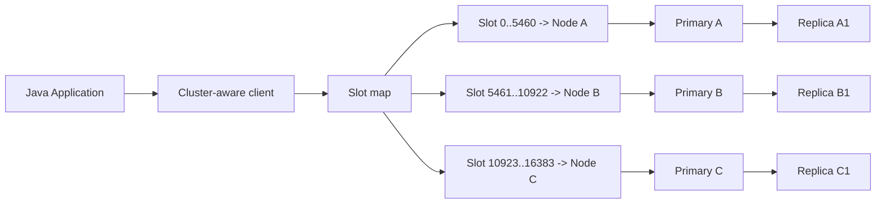
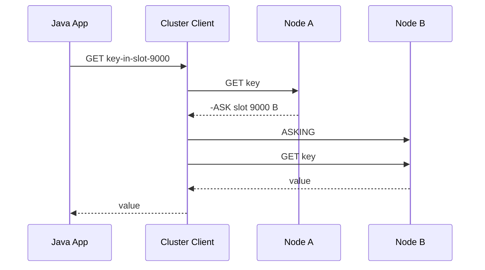
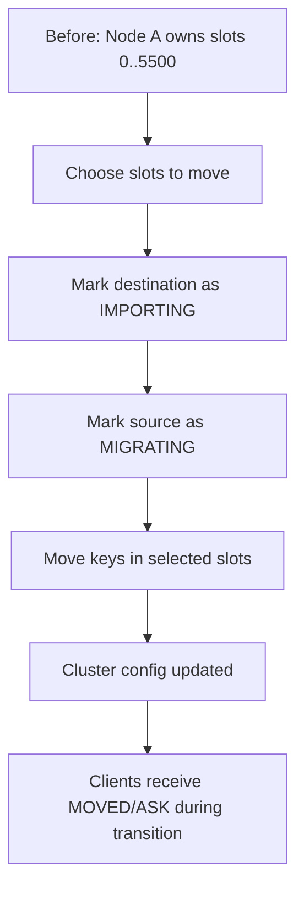
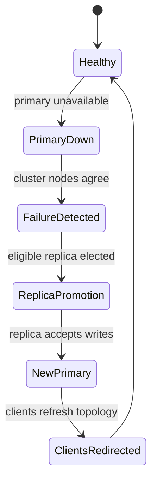
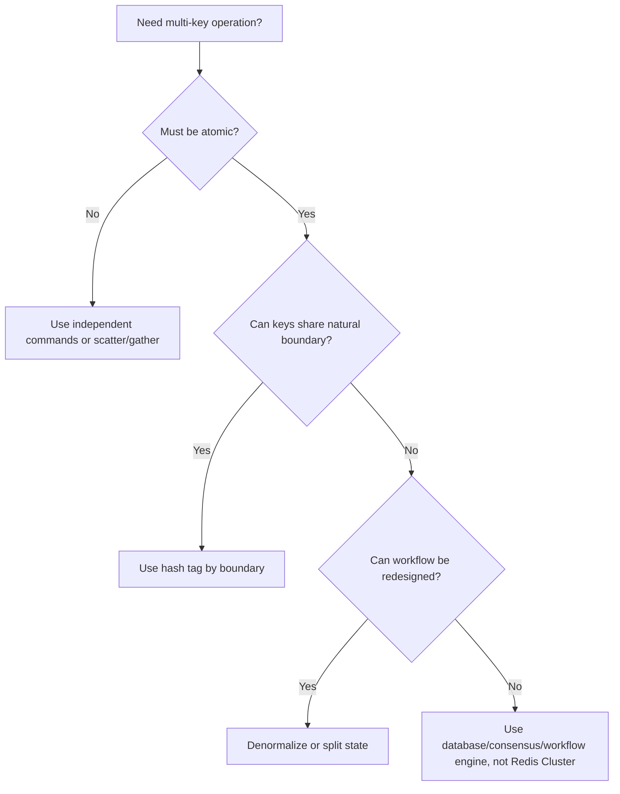

------
title: Learn Java Redis In Action - Part 031
description: Redis Cluster untuk Java engineer: hash slots, sharding, replica, MOVED/ASK redirection, hash tags, multi-key constraints, resharding, failover, observability, dan production design rules.
series: learn-java-redis
seriesTitle: Learn Java Redis In Action
order: 31
partTitle: Redis Cluster: Hash Slots, Sharding, Resharding, and Multi-Key Constraints
tags:
- java
- redis
- redis-cluster
- sharding
- distributed-systems
- production
date: 2026-07-02
------

# Redis Cluster: Hash Slots, Sharding, Resharding, and Multi-Key Constraints

Redis Cluster is not "Redis with more RAM". It is a different operating model.

In standalone Redis, the application thinks there is one keyspace, one primary writer, and one local set of operational risks. In Redis Cluster, the keyspace is partitioned into **16,384 hash slots**, each slot is owned by one primary node, and replicas follow primaries for availability. A production Java application must therefore become **topology-aware**, either directly through a Cluster-aware Redis client or indirectly through a proxy/managed service.

This part focuses on engineering judgment:

- how Redis Cluster distributes keys,
- how Java clients route commands,
- why multi-key commands can fail,
- how hash tags solve only some problems,
- what happens during failover and resharding,
- how to model data so cluster constraints do not leak everywhere,
- how to test and operate Redis Cluster safely.

We will avoid generic distributed-systems repetition. The target is practical Redis Cluster design.

---

## 1. Kaufman Objective

After this part, you should be able to:

1. Explain why Redis Cluster has 16,384 hash slots.
2. Predict whether two keys can be used in one multi-key operation.
3. Design Redis key names that work in Cluster without accidentally creating hot shards.
4. Configure Java Redis clients for Cluster routing, topology refresh, timeouts, and failover.
5. Reason through `MOVED`, `ASK`, `CROSSSLOT`, `TRYAGAIN`, and failover windows.
6. Plan resharding and capacity expansion without treating it as a magic operation.
7. Decide when Redis Cluster is the wrong abstraction.

---

## 2. The Core Mental Model

Redis Cluster partitions the keyspace by slot:

```txt
key -> hash slot -> primary node -> replica set
```

A key does not belong to the cluster as a whole. It belongs to one hash slot. The slot belongs to one primary node at a given moment.



The application should not randomly send commands to any node. A Cluster-aware client keeps a slot map and sends each command to the node that owns the target slot.

This is why Redis Cluster requires client support. A non-Cluster-aware client may work for a single node but will break under redirection, failover, or multi-key operations.

---

## 3. Redis Cluster Is AP-ish, Not a Strong Consistency Database

Redis Cluster is designed for availability and horizontal scaling. It does not turn Redis into a strongly consistent distributed database.

Important properties:

| Property | Redis Cluster Behavior |
|---|---|
| Data partitioning | By hash slot |
| Number of slots | 16,384 |
| Write target | Primary owning the slot |
| Replica model | Asynchronous replication |
| Failover | Replica can be promoted |
| Multi-key operations | Allowed only when all keys are in the same slot |
| Cross-slot transaction | Not supported as general distributed transaction |
| Consistency | Eventual under replication/failover |
| Scaling | Move slots between nodes |

The practical implication: Redis Cluster is excellent when each operation can be scoped to a **small slot-local key family**. It becomes awkward when your workflow needs atomic operations across unrelated keys.

---

## 4. Hash Slot Calculation

Redis Cluster maps keys to slots using CRC16 modulo 16,384.

Conceptually:

```java
slot = CRC16(key) % 16384;
```

You do not normally implement this yourself. Java clients do it for routing. But you must understand it for data modeling.

Example:

```txt
user:1001:profile  -> slot X
user:1001:session  -> slot Y
user:1001:quota    -> slot Z
```

Without a hash tag, these keys may land on different slots.

With hash tag:

```txt
user:{1001}:profile  -> slot K
user:{1001}:session  -> slot K
user:{1001}:quota    -> slot K
```

Only the substring inside `{...}` is hashed. This allows related keys to colocate.

---

## 5. Hash Tags: Powerful, Dangerous, Necessary

Hash tags are the main modeling tool for multi-key workflows in Redis Cluster.

### 5.1 Good Hash Tag

```txt
tenant:{t-123}:user:1001:profile
tenant:{t-123}:quota:api
tenant:{t-123}:settings
```

This colocates all tenant-level keys for tenant `t-123`.

But this may be dangerous if one tenant is huge. You may create a tenant hot shard.

### 5.2 Better Hash Tag for User-Scoped Workflow

```txt
user:{1001}:profile
user:{1001}:sessions
user:{1001}:rate:login
```

This colocates only the user-specific keys needed for atomic user workflows.

### 5.3 Bad Hash Tag: Global Hot Slot

```txt
cache:{global}:product:123
cache:{global}:product:456
cache:{global}:product:789
```

This forces many unrelated keys into one slot. It destroys cluster distribution.

### 5.4 Bad Hash Tag: High-Cardinality But Wrong Boundary

```txt
order:{status:OPEN}:2026-07-02:page:1
order:{status:OPEN}:2026-07-02:page:2
```

This groups by status. If most orders are open, one slot becomes hot.

### 5.5 Rule

Use hash tags for **atomicity boundaries**, not for aesthetic grouping.

Ask:

> Which keys must participate in the same Redis atomic operation?

Only those keys should share the same hash tag.

---

## 6. Multi-Key Constraints

In Redis Cluster, commands involving multiple keys generally require all keys to belong to the same slot.

Examples:

```txt
MGET user:{1001}:profile user:{1001}:settings
```

Works if both keys use `{1001}`.

```txt
MGET user:1001:profile user:1001:settings
```

May fail with `CROSSSLOT`.

```txt
SUNION user:{1001}:roles user:{1001}:temporary-roles
```

Works if both sets are in the same slot.

```txt
SUNION user:{1001}:roles user:{2002}:roles
```

Fails unless the hash tag is the same, which would usually be wrong.

### 6.1 Common Error: CROSSSLOT

`CROSSSLOT` means Redis cannot execute a command because the keys are not colocated.

The correct response is not "retry harder". It is usually one of:

1. Redesign keys.
2. Split the operation into per-key commands.
3. Move computation to application code.
4. Denormalize data.
5. Use a different storage system for cross-entity query/transaction.

### 6.2 Decision Table

| Need | Redis Cluster Design |
|---|---|
| Atomic update for one user | Hash tag by user ID |
| Atomic update for one order | Hash tag by order ID |
| Tenant-wide quota | Hash tag by tenant only if tenant load is bounded |
| Global leaderboard | Single key; naturally one slot; must manage hot key |
| Cross-user ranking | Sorted set key; one slot; not distributed by member |
| Cross-tenant analytics | Do not force into one slot; use stream/search/OLAP pipeline |
| MGET many unrelated cache keys | Use client scatter/gather or avoid multi-key command |
| Transfer between accounts | Redis Cluster is usually wrong unless both accounts share a shard key by design |

---

## 7. Java Client Routing

A Cluster-aware Java client keeps a topology map.

### 7.1 Lettuce Cluster Client

Conceptual configuration:

```java
RedisURI node1 = RedisURI.create("redis://redis-a:6379");
RedisURI node2 = RedisURI.create("redis://redis-b:6379");
RedisURI node3 = RedisURI.create("redis://redis-c:6379");

RedisClusterClient client = RedisClusterClient.create(List.of(node1, node2, node3));

ClusterTopologyRefreshOptions topologyRefresh =
        ClusterTopologyRefreshOptions.builder()
                .enablePeriodicRefresh(Duration.ofSeconds(30))
                .enableAllAdaptiveRefreshTriggers()
                .build();

client.setOptions(ClusterClientOptions.builder()
        .topologyRefreshOptions(topologyRefresh)
        .autoReconnect(true)
        .timeoutOptions(TimeoutOptions.enabled(Duration.ofMillis(500)))
        .build());

StatefulRedisClusterConnection<String, String> connection = client.connect();
RedisAdvancedClusterCommands<String, String> commands = connection.sync();
```

Production note: choose timeouts based on your service SLO. Do not leave unbounded waits.

### 7.2 Jedis Cluster Client

Conceptual configuration:

```java
Set<HostAndPort> nodes = Set.of(
        new HostAndPort("redis-a", 6379),
        new HostAndPort("redis-b", 6379),
        new HostAndPort("redis-c", 6379)
);

DefaultJedisClientConfig clientConfig = DefaultJedisClientConfig.builder()
        .connectionTimeoutMillis(500)
        .socketTimeoutMillis(500)
        .user("app_user")
        .password("secret")
        .build();

try (JedisCluster cluster = new JedisCluster(nodes, clientConfig, 16)) {
    cluster.set("user:{1001}:profile", "{...}");
}
```

Production note: validate redirect handling, pool settings, and retry behavior under resharding.

---

## 8. Redirections: MOVED and ASK

Redis Cluster uses redirections to guide clients.

### 8.1 MOVED

`MOVED` means:

> The slot now belongs to a different node. Update your slot map.

This is common after resharding or topology changes.

### 8.2 ASK

`ASK` means:

> The slot is temporarily being migrated. Send this command to the target node with `ASKING`, but do not permanently update the slot map yet.

This is common during live slot migration.



A correct Cluster client handles this automatically. Your job is to configure and test it.

---

## 9. Resharding Mental Model

Resharding moves slots from one node to another.

It does not move "tables". It moves hash slots. Each slot may contain many keys.



During resharding:

- clients may see `ASK`,
- clients may see `MOVED`,
- some commands may return `TRYAGAIN`,
- latency can increase,
- hot slots may move slowly,
- large keys can make migration painful.

Operationally, resharding is not free. It competes for CPU, network, and memory.

---

## 10. Cluster Failover

A Redis Cluster primary can fail. A replica can be promoted.



Application-level consequences:

1. In-flight commands may fail.
2. Acknowledged writes can be lost because replication is asynchronous.
3. Clients need reconnect and topology refresh.
4. Operations must be retry-safe.
5. Idempotency is still required.

Do not treat Redis Cluster failover as invisible. It is survivable, not nonexistent.

---

## 11. Read Scaling in Cluster

Redis Cluster replicas can be used for reads if the client supports replica routing.

But replica reads introduce staleness.

| Read Mode | Benefit | Risk |
|---|---|---|
| Primary-only reads | Stronger read-after-write behavior per primary | More primary load |
| Replica reads | Read scaling | Stale reads |
| Local replica preference | Lower latency | Region/replication lag risk |
| Random replica reads | Load distribution | Non-monotonic reads |

Use replica reads for:

- cacheable data,
- stale-tolerant reads,
- dashboards,
- approximate status,
- non-critical personalization.

Avoid replica reads for:

- idempotency state,
- locks/leases,
- quota enforcement,
- payment/order state machine checks,
- authorization decisions requiring fresh data.

---

## 12. Key Design Patterns for Cluster

### 12.1 Entity-Scoped Atomicity

```txt
order:{ord-20260702-0001}:state
order:{ord-20260702-0001}:items
order:{ord-20260702-0001}:idempotency:create
```

Good when one order's workflow needs atomic operations across multiple keys.

### 12.2 User-Scoped Quota

```txt
quota:{user-1001}:api:20260702T10
quota:{user-1001}:login:20260702T10
quota:{user-1001}:password-reset:20260702
```

Good if rate decisions are user-local.

### 12.3 Tenant With Shard Suffix

For large tenants, avoid one tenant slot:

```txt
tenant:{t-123:00}:session:...
tenant:{t-123:01}:session:...
tenant:{t-123:02}:session:...
tenant:{t-123:03}:session:...
```

This distributes a tenant over multiple hash tags while preserving bounded atomicity per bucket.

### 12.4 Composite Hash Tag

```txt
cart:{tenant-9:user-1001}:items
cart:{tenant-9:user-1001}:coupon
cart:{tenant-9:user-1001}:version
```

Good for workflows scoped by both tenant and user.

### 12.5 Search Index and Cluster

Search/index features may have their own cluster behavior depending on Redis edition/deployment. Do not assume arbitrary cross-slot atomicity for document workflows. Keep write model and query model separate:

- Redis keys for operational state,
- Search/JSON indexes for query,
- Streams or change events for index repair.

---

## 13. Anti-Patterns

### 13.1 Treating Cluster as a Distributed Transaction Engine

Bad:

```txt
DECR account:{A}:balance
INCR account:{B}:balance
```

If A and B are different slots, you cannot make this a single Redis atomic operation.

Better:

- use a database transaction,
- use saga with durable state,
- use ledger model,
- use Redis only for acceleration or idempotency.

### 13.2 Forcing All Keys Into One Hash Tag

Bad:

```txt
app:{all}:...
```

You now have a one-shard system disguised as a cluster.

### 13.3 Ignoring Large Keys

One giant sorted set or hash can dominate one slot and one node. Redis Cluster distributes keys, not fields/members inside a single key.

Example:

```txt
leaderboard:global
```

This key lives on one slot. If it is too hot, Redis Cluster will not split it automatically.

Possible mitigations:

- shard leaderboard by region/category/time bucket,
- use top-K approximation,
- maintain per-bucket leaderboards and merge at read time,
- use different technology for massive global ranking.

### 13.4 Client-Side Scatter/Gather Without Budget

Scatter/gather MGET across many slots can create fan-out:

```txt
100 keys -> 30 nodes -> 30 network operations
```

This may still be acceptable, but it must be measured.

---

## 14. Multi-Key Design Decision

Before using a multi-key command, ask:



Atomicity boundary should come from domain invariants, not Redis convenience.

---

## 15. Handling Errors in Java

A production Redis Cluster integration should classify errors:

| Error | Meaning | Response |
|---|---|---|
| `MOVED` | Slot owner changed | Refresh topology; retry if safe |
| `ASK` | Slot migrating | Follow ASKING flow |
| `CROSSSLOT` | Keys not colocated | Fix key design; do not blind retry |
| `TRYAGAIN` | Temporary migration/unavailable state | Short bounded retry if idempotent |
| Timeout | Network/server/client delay | Bounded retry only for safe commands |
| Connection failure | Node/client path issue | Reconnect/topology refresh; circuit break |
| READONLY | Sent write to replica | Refresh topology; client config issue |
| CLUSTERDOWN | Cluster cannot serve | Fail fast or degrade |

### 15.1 Retry Envelope

Safe retry:

- `GET`,
- `MGET` if idempotent and no side effect,
- `SET key value` if overwriting is acceptable,
- Lua script designed with idempotency key,
- rate-limit read-only inspection.

Dangerous retry:

- `INCR`,
- `LPUSH`,
- `XADD`,
- `ZINCRBY`,
- job claim,
- lock acquire without token discipline.

For non-idempotent commands, make the command idempotent first.

---

## 16. Java Pattern: Slot-Aware Key Builder

Do not scatter string concatenation across code.

```java
public final class RedisKeys {
    private RedisKeys() {}

    public static String userProfile(String userId) {
        return "user:{" + sanitize(userId) + "}:profile";
    }

    public static String userSessions(String userId) {
        return "user:{" + sanitize(userId) + "}:sessions";
    }

    public static String userQuota(String userId, String api, String window) {
        return "quota:{" + sanitize(userId) + "}:" + sanitize(api) + ":" + sanitize(window);
    }

    private static String sanitize(String value) {
        if (value == null || value.isBlank()) {
            throw new IllegalArgumentException("Redis key segment is blank");
        }
        if (value.contains("{") || value.contains("}")) {
            throw new IllegalArgumentException("Redis key segment must not contain hash tag braces");
        }
        return value;
    }
}
```

### 16.1 Test Slot Compatibility

Use client utilities where available, or call `CLUSTER KEYSLOT` in integration tests.

```java
@Test
void userKeysMustShareSlot() {
    String profile = RedisKeys.userProfile("1001");
    String sessions = RedisKeys.userSessions("1001");

    int slotA = cluster.sync().clusterKeyslot(profile).intValue();
    int slotB = cluster.sync().clusterKeyslot(sessions).intValue();

    assertEquals(slotA, slotB);
}
```

This turns cluster compatibility into a testable invariant.

---

## 17. Java Pattern: Scatter/Gather Reads

For unrelated cache keys, do not force hash tags. Use controlled scatter/gather.

Pseudo-pattern:

```java
public Map<String, String> getManyUnrelated(List<String> keys) {
    if (keys.isEmpty()) {
        return Map.of();
    }

    // Cluster client may internally group keys by node for efficiency.
    // Still impose limits to avoid accidental fan-out storms.
    if (keys.size() > 200) {
        throw new IllegalArgumentException("Too many Redis keys in one batch");
    }

    return cluster.async()
            .mget(keys.toArray(String[]::new))
            .thenApply(values -> toMap(keys, values))
            .toCompletableFuture()
            .join();
}
```

Design rules:

- set max keys per call,
- measure p95/p99 latency,
- avoid scatter/gather on hot paths unless justified,
- use local aggregation where possible.

---

## 18. Capacity Planning by Slot and Node

Cluster capacity planning is not only total memory.

Track:

1. memory per node,
2. ops/sec per node,
3. network per node,
4. hot keys per node,
5. hot slots,
6. large keys,
7. replica lag,
8. failover headroom.

Example:

```txt
Node A:
  memory used: 70%
  p99 latency: 2ms
  top hot key: leaderboard:global
  top slot: 9123
  replica lag: 30ms

Node B:
  memory used: 45%
  p99 latency: 0.8ms

Node C:
  memory used: 44%
  p99 latency: 0.9ms
```

The cluster is not balanced just because key count is balanced.

---

## 19. Resharding Playbook

### 19.1 Before Resharding

Checklist:

- identify hot nodes and hot slots,
- inspect large keys,
- confirm backup/snapshot posture,
- confirm replica health,
- lower non-critical traffic if needed,
- enable client topology refresh,
- validate application retry behavior,
- define rollback plan,
- define success metrics.

### 19.2 During Resharding

Watch:

- p95/p99 latency,
- timeout rate,
- `MOVED`/`ASK`/`TRYAGAIN`,
- CPU,
- network,
- memory fragmentation,
- replication lag,
- application error budget burn.

### 19.3 After Resharding

Validate:

- slot distribution,
- memory distribution,
- traffic distribution,
- no abnormal client redirect loops,
- no spike in business errors,
- no DLQ/backlog growth,
- benchmark critical paths again.

---

## 20. Cluster and Lua/Functions

Lua scripts and Redis Functions in Cluster must obey key-slot rules.

If a script operates on multiple keys, those keys must be in the same slot. This is why script wrappers should validate key tags before execution.

Example idempotency script keys:

```txt
idempotency:{request-123}:state
idempotency:{request-123}:result
```

Good: same request boundary.

Bad:

```txt
idempotency:{request-123}:state
quota:{user-1001}:api
```

Different business boundaries; different slots.

Do not hide cross-slot behavior inside a script. It will fail at runtime.

---

## 21. Cluster and Streams

Redis Streams are keys. A stream key belongs to one slot.

```txt
stream:orders
```

This is one key, one slot, one primary. It may become a hot key.

Cluster-friendly stream designs:

### 21.1 Partition by Tenant/User/Region

```txt
stream:orders:{region-apac}
stream:orders:{region-eu}
stream:orders:{region-us}
```

### 21.2 Partition by Bucket

```txt
stream:orders:{00}
stream:orders:{01}
...
stream:orders:{63}
```

### 21.3 Routing Rule

Producer chooses partition based on stable hash:

```java
int bucket = Math.floorMod(orderId.hashCode(), 64);
String stream = "stream:orders:{" + String.format("%02d", bucket) + "}";
```

Trade-off:

- more streams increase operational complexity,
- fewer streams increase hot-key risk,
- consumer group management becomes per stream,
- ordering is only per stream, not global.

---

## 22. Cluster and Rate Limiting

Rate limit keys usually need atomic update for one subject.

Good:

```txt
rl:{user-1001}:api:20260702T1030
```

Bad:

```txt
rl:{api-login}:user-1001:20260702T1030
```

The first groups by user. The second groups all login rate-limit keys in one slot.

But for global API protection, one key may be intentional:

```txt
rl:global:api-login:20260702T1030
```

That key is a deliberate hot control point. Make sure it can handle load.

---

## 23. Cluster and Session Storage

Session keys are naturally distributed:

```txt
session:{sid-abc}:data
session:{sid-def}:data
session:{sid-ghi}:data
```

But if user-level operations need all sessions:

```txt
user:{user-1001}:sessions
session:{sid-abc}:data
```

These do not share slot unless session ID includes user boundary:

```txt
session:{user-1001}:sid-abc
user:{user-1001}:sessions
```

Trade-off:

- grouping by user enables user-level atomicity,
- grouping by session distributes better if users may have many sessions,
- use domain constraints to decide.

---

## 24. Production Testing Strategy

### 24.1 Integration Tests

Test:

- slot compatibility for multi-key operations,
- `CROSSSLOT` behavior,
- Lua script with same-slot keys,
- client retry on `MOVED`,
- failover behavior,
- read-only replica behavior,
- topology refresh.

### 24.2 Chaos Tests

Inject:

- primary kill,
- replica kill,
- network delay,
- resharding during traffic,
- DNS change,
- cluster node restart,
- hot key traffic spike.

Validate:

- application does not hang,
- timeouts are bounded,
- retries are safe,
- degraded mode is explicit,
- business invariants hold.

---

## 25. Observability Checklist

Metrics to track:

| Layer | Metrics |
|---|---|
| Redis node | CPU, memory, fragmentation, connected clients, blocked clients |
| Cluster | slots assigned, fail state, node count, link status |
| Command | ops/sec, commandstats, slowlog |
| Client | command latency, timeout, reconnect, redirects |
| Application | cache hit ratio, business error, queue backlog |
| Replication | lag, offset, partial/full resync |
| Resharding | moved slots, migration duration, ASK/TRYAGAIN count |

Log with context:

- Redis command category,
- key pattern, not full sensitive key,
- slot if available,
- timeout,
- node endpoint,
- attempt count,
- business correlation ID.

---

## 26. Production Design Rules

1. Model hash tags around atomicity boundaries.
2. Never use one global hash tag unless you intentionally want one shard.
3. Test slot compatibility as an invariant.
4. Treat `CROSSSLOT` as design feedback, not transient failure.
5. Use Cluster-aware clients only.
6. Configure topology refresh and bounded timeouts.
7. Make retries idempotent.
8. Avoid massive single keys; Redis Cluster shards keys, not key internals.
9. Track hot slots, not only hot nodes.
10. Plan resharding as a production change.
11. Do not use Redis Cluster for arbitrary cross-entity transactions.
12. Use managed Redis features carefully; still understand the model.

---

## 27. Mini Case Study: Order Workflow Cache

Requirement:

- cache order summary,
- maintain idempotency for order mutation,
- maintain retry count,
- all scoped to one order.

Keys:

```txt
order:{ord-123}:summary
order:{ord-123}:version
order:{ord-123}:idempotency:create:req-789
order:{ord-123}:retry:payment-capture
```

This works because all order mutation-related keys share `{ord-123}`.

But do not put customer quota inside the same script:

```txt
customer:{cust-456}:quota
```

That belongs to a different atomicity boundary.

Correct design:

- order mutation state in Redis Cluster by order slot,
- customer quota checked separately by customer slot,
- durable transaction in database for final authority,
- idempotency token protects retries,
- business workflow reconciles eventual mismatch.

---

## 28. Mini Case Study: Multi-Tenant SaaS Cache

Requirement:

- tenant-scoped configuration,
- user sessions,
- per-user quota,
- tenant-wide feature flags.

Do not put all tenant data under `{tenant}` by default.

Better:

```txt
tenant:{t-123}:config
tenant:{t-123}:feature-flags

session:{sid-abc}:data
user:{u-1001}:quota:api
user:{u-1001}:profile-cache
```

Only tenant configuration shares tenant slot. User activity distributes by user/session.

If tenant-wide quota is required:

```txt
quota:tenant:{t-123}:api:20260702T10
```

This may be hot for large tenants. Consider bucketed quota:

```txt
quota:tenant:{t-123:00}:api:20260702T10
quota:tenant:{t-123:01}:api:20260702T10
...
```

Then aggregate decisions with a bounded approximation or periodic reconciliation.

---

## 29. What Top Engineers Notice

Average Redis usage asks:

> How do I connect to the cluster?

Strong production Redis engineering asks:

> What is my atomicity boundary, shard key, failure behavior, and operational migration path?

A top-level Redis Cluster design has four explicit maps:

1. **Domain boundary map**: user, tenant, order, account, region.
2. **Key-slot map**: which keys must share hash tags.
3. **Traffic map**: which keys/slots can become hot.
4. **Failure map**: what breaks during failover, resharding, timeout, or stale reads.

If these are implicit, the system will eventually reveal them during an incident.

---

## 30. Practice

### Exercise 1: Slot Design

Given these operations:

1. Update user profile and user cache version atomically.
2. Add order event and update order retry counter atomically.
3. Read product cache for 200 product IDs.
4. Maintain global API rate limit.
5. Maintain per-tenant quota for tenants with highly uneven sizes.

Design key names and explain hash tags.

### Exercise 2: CROSSSLOT Review

Find the bug:

```txt
MGET user:{1001}:profile user:{1002}:profile
```

This is not same-slot even though both have hash tags. The hash tag values differ.

### Exercise 3: Hot Slot Drill

You observe:

```txt
leaderboard:global
```

is the hottest key in the cluster.

Propose three alternatives and explain what correctness or ranking quality each one sacrifices.

---

## 31. Production Readiness Checklist

Before using Redis Cluster in production:

- [ ] Every multi-key operation has documented hash tag boundary.
- [ ] Cross-slot operations are either removed or intentionally scatter/gathered.
- [ ] Java client is Cluster-aware.
- [ ] Topology refresh is configured.
- [ ] Timeouts are bounded.
- [ ] Retry policy is command-aware.
- [ ] Failover has been tested.
- [ ] Resharding has been tested under traffic.
- [ ] Hot keys and large keys are monitored.
- [ ] Replica read policy is explicit.
- [ ] Backup/restore posture is understood.
- [ ] Security/ACL/TLS are configured, not assumed.

---

## 32. References

- Redis Cluster specification: https://redis.io/docs/latest/operate/oss_and_stack/reference/cluster-spec/
- Scale with Redis Cluster: https://redis.io/docs/latest/operate/oss_and_stack/management/scaling/
- Redis multi-key operations: https://redis.io/docs/latest/develop/using-commands/multi-key-operations/
- `CLUSTER SLOTS`: https://redis.io/docs/latest/commands/cluster-slots/
- `CLUSTER KEYSLOT`: https://redis.io/docs/latest/commands/cluster-keyslot/
- `ASKING`: https://redis.io/docs/latest/commands/asking/
- `CLUSTER SETSLOT`: https://redis.io/docs/latest/commands/cluster-setslot/
