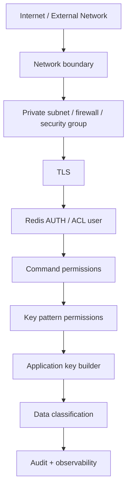
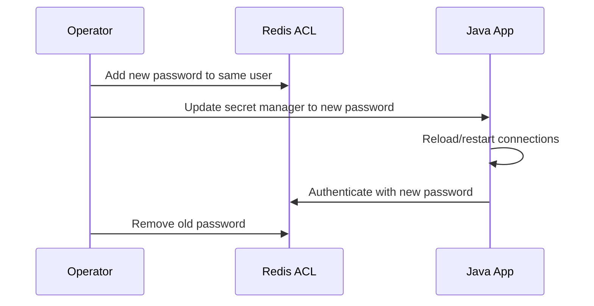

------
title: Learn Java Redis In Action - Part 032
description: Redis security dan governance untuk production Java systems: ACL, TLS, protected mode, network boundary, secrets, rotation, least privilege, multi-tenant isolation, audit, compliance, dan operational controls.
series: learn-java-redis
seriesTitle: Learn Java Redis In Action
order: 32
partTitle: Security and Governance: ACL, TLS, Secrets, and Multi-Tenant Isolation
tags:
- java
- redis
- security
- acl
- tls
- governance
- production
date: 2026-07-02
------

# Security and Governance: ACL, TLS, Secrets, and Multi-Tenant Isolation

Redis security is often underestimated because Redis is fast, simple, and commonly deployed as "internal infrastructure".

That mindset is dangerous.

Redis frequently stores:

- session data,
- tokens,
- user profile cache,
- entitlement cache,
- rate-limit decisions,
- idempotency records,
- workflow hints,
- temporary business state,
- search/index documents,
- real-time presence,
- operational metadata.

A compromised Redis instance can become a compromised application.

This part is about building Redis security as an engineering system: network boundary, authentication, ACL, TLS, client configuration, secret rotation, operational governance, and multi-tenant isolation.

---

## 1. Kaufman Objective

After this part, you should be able to:

1. Explain the Redis security boundary clearly.
2. Configure users with least-privilege ACLs.
3. Avoid dangerous command categories in application users.
4. Configure Java clients with TLS and credentials.
5. Rotate Redis credentials without application downtime.
6. Design tenant-safe key patterns.
7. Prevent data leaks through logs, key names, serialization, and operational tooling.
8. Build a Redis governance checklist suitable for production review.

---

## 2. Security Mental Model

Redis security should be layered:



No single layer is enough.

A strong design assumes one layer may fail and another layer must still reduce blast radius.

---

## 3. Redis Protected Mode Is Not a Production Security Plan

Redis has protected mode to reduce accidental exposure in unsafe default configurations. But protected mode is not a substitute for:

- private networking,
- firewall/security group,
- authentication,
- ACL,
- TLS,
- secret rotation,
- monitoring,
- backup protection,
- least privilege.

A production Redis instance should not be reachable from arbitrary networks.

Minimum baseline:

```txt
Redis reachable only from application network
Redis requires authentication
Application uses non-default ACL user
Dangerous commands blocked for application user
TLS enabled where network trust is insufficient or compliance requires it
Secrets loaded from secret manager, not source code
```

---

## 4. Redis Authentication and ACL

Redis ACL lets you define users with command permissions and key access patterns.

A user is not just a password. It is a policy.

Conceptually:

```txt
user app_cache on >password ~cache:* +get +set +del +expire
```

This means:

- `app_cache`: username,
- `on`: enabled,
- `>password`: password,
- `~cache:*`: allowed key pattern,
- `+get +set +del +expire`: allowed commands.

Production ACL should answer:

1. Which service is connecting?
2. What keyspace can it access?
3. What commands can it execute?
4. Does it need admin commands?
5. Does it need scripting?
6. Does it need Pub/Sub?
7. Does it need Streams?
8. Can it delete keys?
9. Can it inspect keys?
10. Can it change configuration?

---

## 5. Command Categories and Least Privilege

Redis commands are grouped into categories such as read, write, admin, dangerous, slow, scripting, connection, pubsub, stream, sortedset, and more.

Do not grant broad categories casually.

### 5.1 Bad Application User

```txt
user app on >secret allcommands allkeys
```

This user can do almost everything. A bug, injection, or compromised service can damage the entire Redis instance.

### 5.2 Better Cache User

```txt
user catalog_cache on >secret   ~cache:catalog:*   +get +mget +set +del +unlink +expire +ttl +pttl +exists
```

This user cannot run `FLUSHALL`, `CONFIG`, `KEYS`, or arbitrary admin commands.

### 5.3 Rate Limiter User

```txt
user rate_limiter on >secret   ~rl:*   +eval +evalsha +script|load +get +set +incr +expire +ttl +pttl +zadd +zremrangebyscore +zcard +zcount
```

If rate limiter uses Lua, scripting permissions must be explicit. But do not grant all scripting capability to every service.

### 5.4 Stream Consumer User

```txt
user order_stream_worker on >secret   ~stream:orders:* ~consumer:orders:*   +xadd +xreadgroup +xack +xpending +xclaim +xautoclaim +xdel +xtrim
```

Grant only stream commands the worker needs.

---

## 6. Dangerous Commands

Application users usually should not be allowed to run:

| Command / Category | Why Dangerous |
|---|---|
| `FLUSHALL`, `FLUSHDB` | Deletes large amounts of data |
| `CONFIG` | Changes server behavior |
| `SHUTDOWN` | Availability impact |
| `KEYS` | Can block production Redis on large keyspace |
| `MONITOR` | Massive output; data exposure |
| `CLIENT KILL` | Availability impact |
| `ACL` | Privilege escalation |
| `SAVE`, `BGSAVE` | Operational impact |
| `MIGRATE`, `RESTORE` | Data movement/injection risk |
| `EVAL` | Powerful; safe only with controlled scripts |
| `MODULE` | Server extension risk |
| `DEBUG` | Dangerous diagnostic behavior |

Use a separate admin/operator identity for operational tasks. Do not share it with applications.

---

## 7. Key Pattern Governance

ACL key patterns protect only if key naming is disciplined.

Bad:

```txt
user:{tenantId}:profile
session:{sessionId}
```

If services use inconsistent namespaces, ACL becomes hard to enforce.

Better:

```txt
svc:identity:tenant:{t-123}:user:{u-456}:profile
svc:gateway:session:{sid}:data
svc:billing:idempotency:{requestId}
```

Now ACL can restrict by service prefix:

```txt
~svc:identity:*
~svc:gateway:*
~svc:billing:*
```

### 7.1 Tenant Isolation

For multi-tenant systems, key names should include tenant boundary where data is tenant-scoped.

```txt
tenant:{t-123}:user:{u-456}:profile
tenant:{t-123}:entitlement:{u-456}
tenant:{t-123}:quota:{api}:20260702T10
```

However, do not assume key naming alone is strong tenant isolation if one application user can access all tenant keys.

Stronger options:

| Isolation Level | Description | Trade-off |
|---|---|---|
| Shared Redis, shared ACL user | Simple | Weak tenant blast-radius control |
| Shared Redis, service-level ACL | Good service isolation | Not per-tenant |
| Shared Redis, tenant-pattern ACL | Possible for few tenants | Operationally heavy for many tenants |
| Separate logical DB | Not available in Redis Cluster; limited in standalone |
| Separate Redis database/cluster per tenant tier | Stronger isolation | Higher cost/ops complexity |
| Managed Redis with database-level isolation | Strong if supported | Vendor/edition-specific |

For high-risk tenants, use stronger isolation than key prefixes.

---

## 8. Data Classification

Before putting data in Redis, classify it.

| Data Type | Redis Risk | Guidance |
|---|---|---|
| Session ID | Account takeover risk | Store opaque IDs; short TTL; TLS; ACL |
| Access token | High risk | Prefer not storing raw token; hash if possible |
| Refresh token | Very high risk | Avoid if possible; encrypt/hash; strict TTL |
| Entitlement cache | Authorization risk | Short TTL; versioned invalidation |
| Payment state | Financial risk | Redis should not be source of truth |
| PII cache | Privacy risk | Minimize fields; encrypt sensitive values |
| Search document | Data leak risk | Field-level minimization |
| Vector embedding | Possible privacy inference | Track source/version; classify |
| Idempotency result | May contain business data | Store minimal response or pointer |

Rule:

> Redis is fast, not automatically safe. Minimize what you store.

---

## 9. TLS

Redis supports TLS for client connections, replication links, and the Cluster bus when enabled/configured appropriately.

Use TLS when:

- traffic crosses untrusted network boundaries,
- compliance requires encryption in transit,
- Redis is managed service with TLS endpoint,
- applications run in shared infrastructure,
- data classification requires protection,
- credentials should not travel in plaintext.

Java client TLS should be explicit.

### 9.1 Lettuce TLS Example

```java
RedisURI redisUri = RedisURI.builder()
        .withHost("redis.example.internal")
        .withPort(6380)
        .withSsl(true)
        .withVerifyPeer(true)
        .withAuthentication("app_cache", "secret".toCharArray())
        .withTimeout(Duration.ofMillis(500))
        .build();

RedisClient client = RedisClient.create(redisUri);
StatefulRedisConnection<String, String> connection = client.connect();
```

### 9.2 Jedis TLS Example

```java
DefaultJedisClientConfig config = DefaultJedisClientConfig.builder()
        .user("app_cache")
        .password("secret")
        .ssl(true)
        .connectionTimeoutMillis(500)
        .socketTimeoutMillis(500)
        .build();

try (JedisPooled jedis = new JedisPooled(
        new HostAndPort("redis.example.internal", 6380),
        config
)) {
    jedis.set("cache:catalog:sku-123", "...");
}
```

### 9.3 TLS Operational Concerns

TLS adds operational questions:

- certificate authority,
- certificate rotation,
- hostname verification,
- trust store configuration,
- mutual TLS if supported/required,
- connection pool reload behavior,
- latency overhead,
- monitoring expiry dates,
- consistency between app and Redis endpoints.

Do not enable TLS without testing certificate rotation.

---

## 10. Secrets Management

Bad:

```java
String password = "redis-prod-password";
```

Better:

```java
String password = secretProvider.get("redis/prod/app-cache/password");
```

Production rules:

1. Redis credentials must not be committed to source control.
2. Credentials must not appear in logs.
3. Use separate users per service/workload.
4. Rotate credentials periodically.
5. Support dual credentials during rotation.
6. Store secrets in secret manager.
7. Avoid passing secrets through command-line args if process inspection is possible.
8. Mask connection strings in exceptions and logs.

### 10.1 Credential Rotation Pattern

Redis ACL users can have multiple passwords. This enables no-downtime rotation.



Do not rotate by deleting the old password first unless downtime is acceptable.

---

## 11. Java Secret Reloading

If applications keep long-lived Redis connections, secret rotation requires connection refresh.

Approaches:

| Approach | Behavior |
|---|---|
| Rolling restart | Simple, reliable |
| Connection factory refresh | More complex |
| Short-lived pools | Easier credential pickup, more overhead |
| Dual-password window | Recommended |
| Blue/green service deployment | Clean rotation boundary |

For Lettuce/Spring Data Redis, rotating credentials usually means refreshing connection factories or restarting application instances. Make this an explicit operational procedure.

---

## 12. ACL Design by Service

### 12.1 API Gateway Rate Limiter

Needs:

- read/write rate limit keys,
- Lua script if atomic algorithm,
- no admin,
- no broad key access.

Pattern:

```txt
user api_gateway_rate on >secret   ~svc:gateway:rl:*   +eval +evalsha +script|load   +get +set +incr +expire +ttl +pttl   +zadd +zremrangebyscore +zcard +zcount
```

### 12.2 Catalog Cache Service

Needs:

- get/set/delete catalog cache,
- no script,
- no stream,
- no pubsub.

```txt
user catalog_service on >secret   ~svc:catalog:cache:*   +get +mget +set +del +unlink +expire +ttl +pttl +exists
```

### 12.3 Order Event Stream Worker

Needs:

- XREADGROUP/XACK/XADD,
- stream keys,
- consumer metadata keys,
- no arbitrary keys.

```txt
user order_worker on >secret   ~svc:order:stream:* ~svc:order:consumer:*   +xadd +xreadgroup +xack +xpending +xclaim +xautoclaim +xtrim
```

### 12.4 Admin Operator

Separate from application:

```txt
user redis_operator on >very-secret allcommands allkeys
```

Use sparingly, audited, ideally from restricted network and bastion/access workflow.

---

## 13. Spring Data Redis Security Configuration

A secure Spring configuration should make Redis credentials and TLS explicit.

Example:

```java
@Configuration
public class RedisConfig {

    @Bean
    LettuceConnectionFactory redisConnectionFactory(RedisProperties props) {
        RedisStandaloneConfiguration standalone =
                new RedisStandaloneConfiguration(props.host(), props.port());

        standalone.setUsername(props.username());
        standalone.setPassword(RedisPassword.of(props.password()));

        LettuceClientConfiguration clientConfig =
                LettuceClientConfiguration.builder()
                        .useSsl()
                        .and()
                        .commandTimeout(Duration.ofMillis(500))
                        .shutdownTimeout(Duration.ofSeconds(2))
                        .build();

        return new LettuceConnectionFactory(standalone, clientConfig);
    }
}
```

Rules:

- do not log `RedisProperties`,
- do not expose Redis URL in actuator/env endpoints,
- mask password fields,
- prefer username/password over default user,
- define timeout,
- verify TLS where possible.

---

## 14. Preventing Key Injection

If user-controlled values enter Redis keys, sanitize them.

Bad:

```java
String key = "tenant:" + tenantId + ":user:" + userId;
```

If `tenantId` or `userId` contains unexpected delimiter or hash-tag braces, it can break routing or ACL assumptions.

Better:

```java
public final class SafeKey {
    public static String segment(String raw) {
        if (raw == null || raw.isBlank()) {
            throw new IllegalArgumentException("Blank Redis key segment");
        }
        if (raw.contains("{") || raw.contains("}") || raw.contains(" ") || raw.contains("\n")) {
            throw new IllegalArgumentException("Unsafe Redis key segment");
        }
        return raw;
    }
}
```

For external identifiers, consider encoding:

```java
Base64.getUrlEncoder().withoutPadding()
        .encodeToString(raw.getBytes(StandardCharsets.UTF_8));
```

But remember: encoded IDs are not encrypted.

---

## 15. Value-Level Protection

ACL protects commands and keys. It does not protect fields inside values.

If a service can `GET` a key, it can read the whole value.

For sensitive data:

1. Minimize stored fields.
2. Use opaque references instead of full data.
3. Encrypt sensitive fields before Redis if required.
4. Use short TTLs.
5. Avoid storing raw tokens.
6. Avoid storing secrets in JSON documents.
7. Scrub payloads in logs and traces.

### 15.1 Token Storage

Bad:

```json
{
  "accessToken": "eyJhbGciOi...",
  "refreshToken": "...",
  "userId": "1001"
}
```

Better:

```json
{
  "tokenHash": "sha256:...",
  "userId": "1001",
  "issuedAt": "2026-07-02T10:00:00Z",
  "expiresAt": "2026-07-02T10:15:00Z"
}
```

Even better: store only revocation marker or session pointer.

---

## 16. Logging and Observability Safety

Redis observability can leak data.

Do not log:

- full keys if they contain PII,
- values,
- tokens,
- connection URLs with passwords,
- raw Lua arguments if they include business data,
- full search queries with sensitive terms,
- full JSON documents.

Prefer structured logs:

```json
{
  "event": "redis_command_failed",
  "command": "GET",
  "keyPattern": "svc:catalog:cache:<sku>",
  "slot": 1234,
  "durationMs": 18,
  "errorClass": "RedisCommandTimeoutException",
  "correlationId": "..."
}
```

Key pattern is usually enough for debugging.

---

## 17. Redis in Regulated Systems

If Redis participates in regulated workflows, clarify whether it is:

1. cache,
2. derived read model,
3. temporary coordination state,
4. durable workflow input,
5. system of record.

For compliance and auditability:

| Role | Governance Need |
|---|---|
| Cache | TTL, invalidation, source-of-truth pointer |
| Read model | Rebuild path, consistency window |
| Idempotency store | Retention policy, replay policy |
| Queue/stream | Delivery semantics, DLQ, audit trail |
| Session store | authentication controls, expiry |
| Search index | data classification, deletion propagation |
| Decision cache | explanation/recalculation source |

Redis should rarely be the only audit trail for regulated business decisions.

---

## 18. Multi-Tenant Isolation Patterns

### 18.1 Shared Cluster, Shared Service User

```txt
tenant:{t-1}:...
tenant:{t-2}:...
tenant:{t-3}:...
```

Simple but broad blast radius. A bug in one service can access all tenant keys allowed to that user.

### 18.2 Shared Cluster, Service-Level Users

```txt
user identity_service ~svc:identity:*
user billing_service  ~svc:billing:*
user gateway_service  ~svc:gateway:*
```

Good baseline for microservices.

### 18.3 Tenant-Tier Isolation

High-tier tenants get dedicated Redis database/cluster:

```txt
standard tenants -> shared Redis
enterprise tenant A -> dedicated Redis
enterprise tenant B -> dedicated Redis
```

This is often better than trying to express thousands of tenant ACLs.

### 18.4 Per-Tenant ACL

Useful for small number of tenants or admin tooling:

```txt
user tenant_t123_app on >secret ~tenant:{t-123}:* +get +set +expire
```

Operationally heavy at scale. Automate lifecycle if used.

---

## 19. Pub/Sub and Security

Pub/Sub permissions must be explicit.

Risks:

- leaking messages across tenants,
- subscribing to broad channels,
- publishing control messages,
- channel name injection,
- operational commands triggered by messages.

Channel naming should mirror key naming:

```txt
tenant:t-123:notification:user:u-456
svc:gateway:invalidate:catalog
```

Do not publish sensitive payloads if subscribers are broad. Prefer payload IDs and fetch details through authorized service path.

---

## 20. Streams and Governance

Streams can become semi-durable business records. Govern them.

Questions:

1. What is retention?
2. Is stream data sensitive?
3. Who can produce?
4. Who can consume?
5. Can consumers read old entries?
6. Is trimming policy compliant?
7. Is DLQ protected?
8. Are payloads encrypted/minimized?
9. Is replay audited?
10. What is the source of truth?

Example:

```txt
svc:payment:stream:events:{00}
svc:payment:stream:dlq:{00}
```

Payment event stream should not be readable by unrelated services.

---

## 21. Search/JSON Governance

Redis JSON and Search can expose broad query surfaces.

Security concerns:

- indexing sensitive fields,
- broad full-text search over PII,
- returning documents outside tenant scope,
- query injection,
- unintended fields in JSON,
- stale deletion from index,
- vector search leaking semantic similarity.

Rules:

1. Index only fields needed for query.
2. Include tenant filter in every query.
3. Use service-side query builders.
4. Avoid exposing raw RediSearch query syntax to users.
5. Test deletion propagation.
6. Separate public searchable documents from sensitive operational documents.

---

## 22. Command Injection and Lua

If Lua scripts accept arbitrary keys/ARGV from user input, they can become a privilege amplification path within the ACL scope.

Rules:

- fixed script source,
- validated key count,
- validated key prefixes,
- validated hash tags,
- typed ARGV parsing,
- no dynamic command construction from user text,
- no broad application scripting permission unless needed,
- script SHA loaded at startup by controlled code.

Example guard:

```java
public RateLimitDecision check(String subject, String api) {
    String safeSubject = SafeKey.segment(subject);
    String safeApi = SafeKey.segment(api);

    String key = "svc:gateway:rl:{" + safeSubject + "}:" + safeApi;
    return executeKnownScript(key);
}
```

---

## 23. Backup Security

Redis backups may contain sensitive data.

Govern:

- backup encryption,
- backup access control,
- backup retention,
- restore authorization,
- backup location,
- cross-region replication policy,
- test restore data masking,
- deletion compliance.

If Redis stores PII or token-like data, backups inherit the same classification.

Do not secure the live Redis instance and leave RDB/AOF files exposed.

---

## 24. Admin Access

Admin access should be rare and controlled.

Recommended:

- separate operator user,
- restricted source network,
- MFA/bastion for shell access,
- audited command execution,
- no shared credentials,
- break-glass process,
- short-lived credentials where possible,
- production command checklist.

Dangerous production command example:

```txt
KEYS *
```

Use `SCAN` instead, and even `SCAN` must be controlled in large keyspaces.

---

## 25. Network Boundary

Redis should usually run in a private network.

Controls:

| Control | Purpose |
|---|---|
| Private subnet | Avoid public exposure |
| Security group/firewall | Restrict source services |
| No public IP | Reduce attack surface |
| TLS | Protect traffic in transit |
| Service mesh / mTLS | Optional broader platform control |
| Bastion/operator path | Controlled admin access |
| Egress control | Prevent unexpected clients |
| DNS governance | Avoid accidental cross-env access |

Do not let staging apps connect to production Redis.

Use environment-specific credentials and endpoints.

---

## 26. Environment Separation

Never share Redis between environments unless intentionally designed.

Bad:

```txt
dev app -> production Redis
staging app -> production Redis
load test -> production Redis
```

Production-like test data should use isolated Redis.

Environment key prefix alone is not enough if credentials/network are shared.

```txt
dev:...
staging:...
prod:...
```

Prefixes reduce accidental collisions but do not enforce strong isolation.

---

## 27. Security Testing

### 27.1 ACL Negative Tests

For each service user, test blocked commands:

```java
assertThrows(Exception.class, () -> redis.sync().flushall());
assertThrows(Exception.class, () -> redis.sync().configGet("*"));
assertThrows(Exception.class, () -> redis.sync().keys("*"));
```

### 27.2 Key Pattern Tests

```java
assertCanAccess("svc:catalog:cache:sku-123");
assertCannotAccess("svc:billing:idempotency:req-1");
```

### 27.3 TLS Tests

Validate:

- TLS required,
- plaintext connection rejected,
- wrong CA rejected,
- expired certificate detected,
- hostname verification works,
- certificate rotation procedure works.

### 27.4 Secret Rotation Drill

Run:

1. add new password,
2. update secret,
3. rotate app connections,
4. remove old password,
5. verify old password fails,
6. verify no error-budget spike.

---

## 28. Incident Response

### 28.1 Suspected Redis Credential Leak

Immediate actions:

1. identify affected ACL user,
2. add replacement password,
3. rotate application secret,
4. remove compromised password,
5. inspect ACL logs/connection sources if available,
6. review command usage,
7. invalidate sensitive sessions/tokens if needed,
8. rotate downstream secrets if exposed,
9. write incident timeline.

### 28.2 Suspected Data Leak

Ask:

- what key patterns were accessible?
- which services/users had permissions?
- did backups/logs contain same data?
- was data encrypted?
- what TTL/retention applied?
- which tenants/users affected?
- do indexes/search documents duplicate data?
- do streams/DLQs contain the data?

Redis data may exist in multiple places: primary keys, indexes, streams, backups, metrics, logs.

---

## 29. Governance Review Template

Before production launch, answer:

```txt
Redis purpose:
Data classification:
System of record? yes/no:
Persistence enabled? yes/no:
Backup classification:
Network exposure:
TLS required:
ACL users:
Allowed key patterns:
Allowed command categories:
Dangerous commands blocked:
Secret storage:
Rotation procedure:
Tenant isolation model:
Observability data exposure:
Incident runbook:
Restore drill completed:
Security test completed:
Owner team:
```

This template turns Redis from hidden infrastructure into an auditable component.

---

## 30. Production Checklist

- [ ] Redis is not publicly exposed.
- [ ] Application uses named ACL user, not default superuser.
- [ ] Password is stored in secret manager.
- [ ] TLS is enabled where required.
- [ ] Java clients verify TLS certificates where possible.
- [ ] ACL restricts key patterns.
- [ ] ACL restricts commands.
- [ ] Dangerous commands are blocked for app users.
- [ ] Key builder sanitizes user-controlled segments.
- [ ] Sensitive values are minimized or encrypted.
- [ ] Logs do not include full values or credentials.
- [ ] Backups are encrypted and access-controlled.
- [ ] Secret rotation has been tested.
- [ ] Admin access is separate and audited.
- [ ] Tenant isolation model is documented.
- [ ] Search/JSON indexes exclude unnecessary sensitive fields.
- [ ] Streams/DLQs have retention and access control.
- [ ] Security negative tests exist.
- [ ] Incident playbook exists.

---

## 31. What Top Engineers Notice

Average Redis security asks:

> Is Redis inside the private network?

Strong Redis security asks:

> If this service is compromised, which commands, keys, tenants, values, streams, indexes, backups, and logs become exposed?

The second question reveals real blast radius.

A production Redis security design is good when:

- access is service-specific,
- permissions are minimal,
- data is classified,
- secrets can rotate without panic,
- logs do not leak,
- backups are protected,
- tenant isolation is intentional,
- dangerous commands require a different identity,
- operational procedures are tested.

---

## 32. Practice

### Exercise 1: ACL Design

Design ACL users for:

1. API gateway rate limiter.
2. Catalog cache service.
3. Order stream worker.
4. Admin operator.
5. Analytics read-only service.

For each, define key pattern and command set.

### Exercise 2: Sensitive Value Review

Given this Redis JSON document:

```json
{
  "userId": "1001",
  "email": "alice@example.com",
  "accessToken": "raw-token",
  "roles": ["ADMIN"],
  "lastLoginIp": "192.0.2.10"
}
```

Decide what should be removed, hashed, encrypted, or moved to source-of-truth.

### Exercise 3: Rotation Drill

Write a runbook for rotating Redis password in a Java service using connection pooling.

### Exercise 4: Tenant Boundary

A SaaS platform stores all tenant entitlements in:

```txt
entitlements:{tenantId}:{userId}
```

The same ACL user can access `entitlements:*`.

Assess risk and propose stronger isolation.

---

## 33. References

- Redis security: https://redis.io/docs/latest/operate/oss_and_stack/management/security/
- Redis ACL: https://redis.io/docs/latest/operate/oss_and_stack/management/security/acl/
- Redis TLS: https://redis.io/docs/latest/operate/oss_and_stack/management/security/encryption/
- Redis keyspace: https://redis.io/docs/latest/develop/using-commands/keyspace/
- Redis `KEYS` warning: https://redis.io/docs/latest/commands/keys/
- Redis `SCAN`: https://redis.io/docs/latest/commands/scan/
