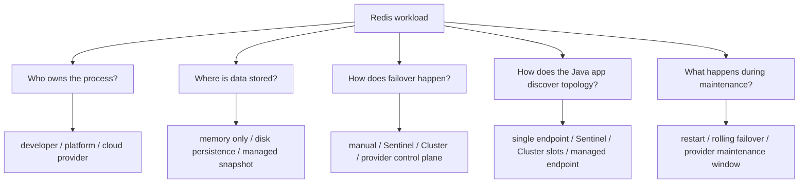
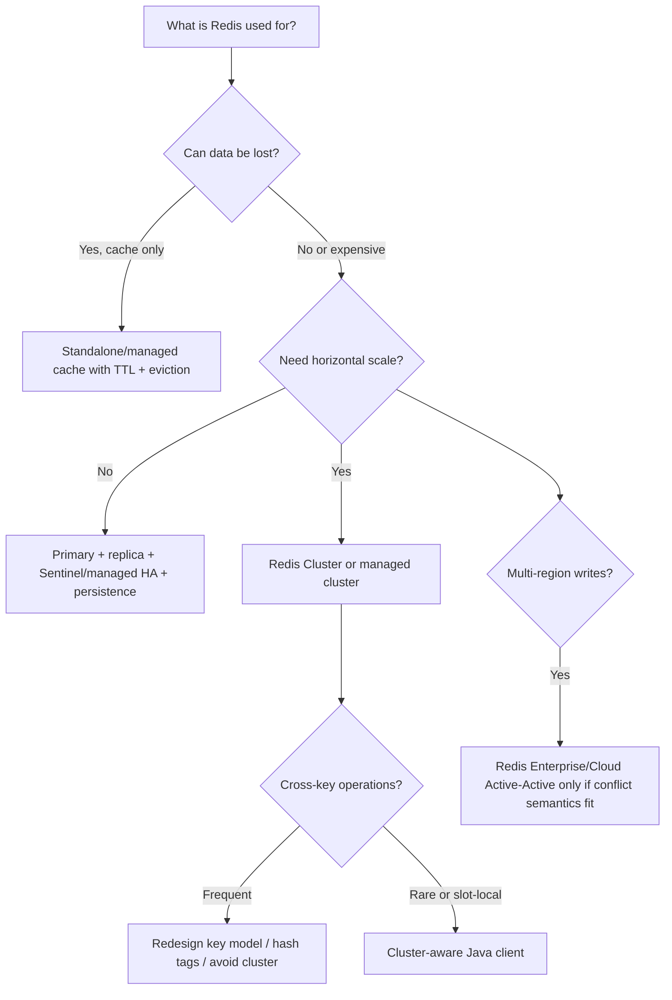
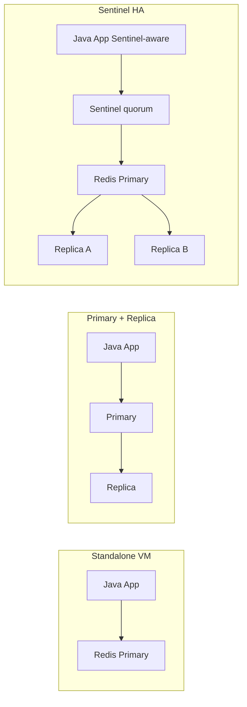
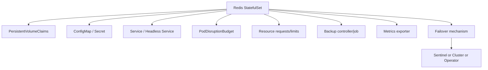
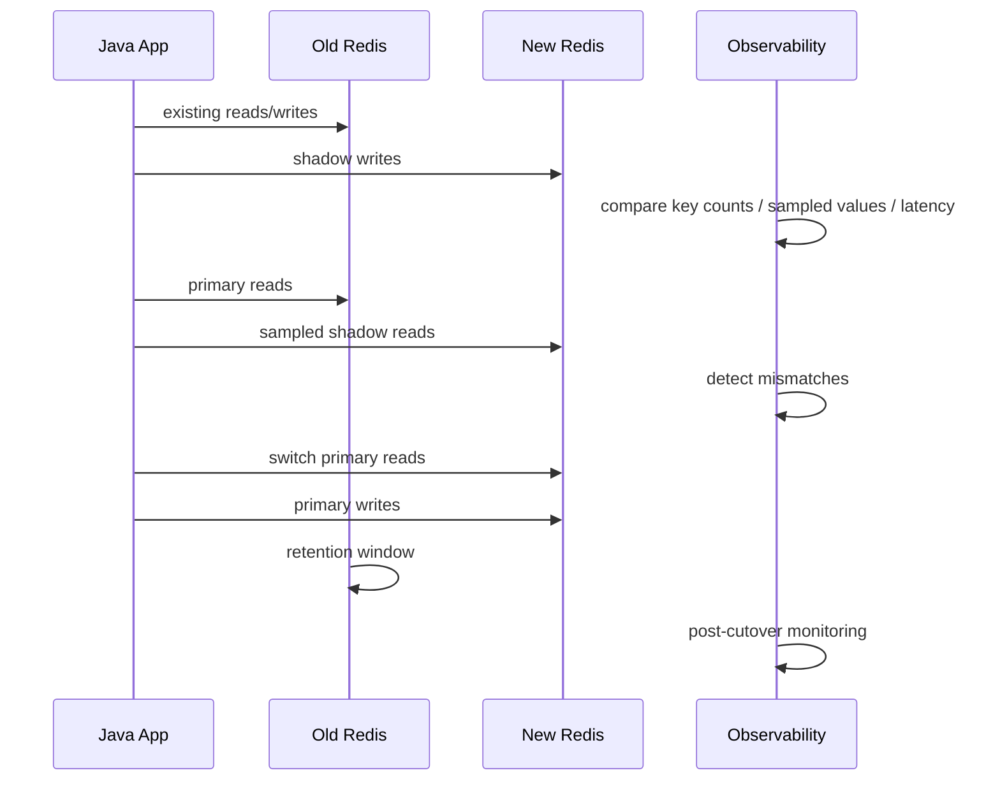

------
title: Learn Java Redis In Action - Part 033
description: Deployment models Redis untuk Java production systems: local, Docker, VM, Kubernetes, managed Redis, topology choice, configuration contract, operational readiness, migration, dan runbook.
series: learn-java-redis
seriesTitle: Learn Java Redis In Action
order: 33
partTitle: Deployment Models: Local, Docker, VM, Kubernetes, and Managed Redis
tags:
- java
- redis
- deployment
- docker
- kubernetes
- managed-redis
- production
- operations
date: 2026-07-02
------

# Deployment Models: Local, Docker, VM, Kubernetes, and Managed Redis

Redis deployment is not a packaging detail.

It defines:

- the failure envelope,
- the durability envelope,
- the consistency envelope,
- the latency envelope,
- the operational ownership model,
- the Java client configuration model,
- the incident response model.

A Redis architecture that is correct in code can still fail in production because the deployment model does not support the assumptions made by the application.

This part is about choosing and operating Redis deployment models deliberately.

We will cover local development, Docker, VM/systemd, Kubernetes, managed Redis, Redis Cloud/Enterprise, topology selection, rollout, migration, and production readiness.

---

## 1. Kaufman Objective

After this part, you should be able to:

1. Choose an appropriate Redis deployment model for a workload.
2. Explain why local Redis, container Redis, VM Redis, Kubernetes Redis, and managed Redis have different risk profiles.
3. Design environment-specific Redis configuration without changing application logic.
4. Connect Java clients safely to standalone, Sentinel, and Cluster deployments.
5. Define persistence, backup, failover, scaling, and security expectations before launch.
6. Avoid naive Kubernetes/Container Redis deployments that look healthy but lose data or availability.
7. Build a deployment review checklist for Redis-backed Java systems.
8. Plan migration between Redis deployment models without corrupting keyspace semantics.

The target skill is not "can run Redis".

The target skill is:

> Given a Java workload and its correctness requirements, choose a Redis deployment model whose failure behavior is explicit, observable, and operationally supportable.

---

## 2. Deployment Mental Model

A deployment model answers five questions:



The mistake is treating all Redis endpoints as equivalent.

They are not.

A local Redis server, a Docker container, an ElastiCache replication group, Redis Cluster, Redis Enterprise on Kubernetes, and Redis Cloud Active-Active database may all accept Redis commands, but their operational contracts are different.

---

## 3. Deployment Selection Matrix

Use this matrix before writing production code.

| Deployment Model | Best For | Avoid When | Java Client Concern | Main Operational Risk |
|---|---|---|---|---|
| Local process | learning, debugging, single-dev machine | shared environments | simple host/port | config drift from production |
| Docker Compose | integration tests, local stack, dev parity | production durability/HA | stable service name | accidental data loss if volume is wrong |
| Single VM/systemd | small internal service, deterministic ops | HA requirement, frequent scaling | standalone endpoint | manual failover and patching |
| VM + Sentinel | non-clustered HA | large keyspace/sharding need | Sentinel-aware client | failover window and async replication loss |
| Redis Cluster | horizontal scale, slot-level sharding | heavy cross-key operations | Cluster-aware client | CROSSSLOT errors, resharding complexity |
| Kubernetes OSS Redis | platform-standardized ops | team lacks Redis/K8s operational maturity | service discovery + topology | storage/failover/operator complexity |
| Redis Enterprise on Kubernetes | K8s-native enterprise Redis | simple cache with low ops budget | enterprise endpoint/CRD model | operator lifecycle and platform dependency |
| Managed Redis | most product teams | unusual config/module constraints | provider endpoint + TLS/auth | provider limitations and maintenance events |
| Redis Cloud/Enterprise Active-Active | multi-region low-latency writes | strong global serializability requirement | conflict-aware app semantics | CRDT/conflict semantics misunderstood |

The correct answer is rarely "always use Cluster".

The correct answer is workload-specific.

---

## 4. Workload-First Topology Choice

Start from the data semantics.



Ask these questions in order:

1. Is Redis a cache, coordination store, queue, index, session store, or operational data store?
2. Is data disposable, reconstructable, replayable, or authoritative?
3. What is the maximum acceptable data loss?
4. What is the maximum acceptable downtime?
5. Does the workload need sharding?
6. Does the workload rely on multi-key atomic operations?
7. Can the Java client understand topology changes?
8. Who handles patching, backup, failover, and capacity?

Do not choose topology based on fashion.

Choose topology based on failure behavior.

---

## 5. Local Development Deployment

Local Redis should optimize for learning speed and feedback loop, not production durability.

Typical local modes:

- plain Redis Open Source,
- Redis Stack / Redis 8 with Search/JSON/Time Series/vector capabilities,
- Docker container,
- Docker Compose with app + Redis,
- Testcontainers for integration tests.

### 5.1 Local Redis Contract

Local Redis should be disposable.

Define this explicitly:

```yaml
redis:
  environment: local
  persistence: disabled-or-local-volume
  auth: optional-for-dev-but-enabled-in-shared-dev
  tls: usually-disabled-locally
  modules: match-production-capability
  key-prefix: dev:${USER}:service-name
  flush-policy: safe-by-prefix-not-FLUSHALL
```

Local development must not teach bad habits:

- do not use unbounded keys,
- do not use `KEYS *` in app paths,
- do not rely on no-auth behavior,
- do not rely on single-node-only multi-key assumptions if production is Cluster,
- do not manually inspect production-like secrets in local logs.

### 5.2 Docker Compose Example

```yaml
services:
  redis:
    image: redis:8.2
    command:
      - "redis-server"
      - "--appendonly"
      - "yes"
      - "--maxmemory"
      - "512mb"
      - "--maxmemory-policy"
      - "allkeys-lru"
    ports:
      - "6379:6379"
    volumes:
      - redis-data:/data
    healthcheck:
      test: ["CMD", "redis-cli", "PING"]
      interval: 5s
      timeout: 2s
      retries: 10

volumes:
  redis-data:
```

This is not a production HA deployment.

It is a stable local feedback loop.

### 5.3 Java Local Configuration

```yaml
redis:
  mode: standalone
  endpoint: localhost:6379
  username: default
  password: ${REDIS_PASSWORD:}
  keyPrefix: dev:${USER}:catalog-service
  commandTimeout: 500ms
  connectTimeout: 2s
  clientName: catalog-service-local
```

In code, do not scatter environment assumptions.

Use a single configuration object:

```java
public record RedisRuntimeConfig(
    RedisMode mode,
    List<String> endpoints,
    Optional<String> username,
    Optional<String> password,
    Duration commandTimeout,
    Duration connectTimeout,
    String keyPrefix,
    boolean tlsEnabled
) {}
```

The Java application should not care whether Redis is local, managed, or clustered except at the connection factory boundary.

---

## 6. Docker Deployment Model

Docker is a packaging mechanism, not an HA strategy.

Redis in Docker is valid when you understand:

- container restart does not equal data recovery,
- container filesystem is ephemeral unless volume is mounted,
- memory limits must align with Redis `maxmemory`,
- host networking and DNS affect latency,
- persistence writes require reliable storage,
- container health checks can lie if they only run `PING`.

### 6.1 Docker Production Checklist

For any containerized Redis deployment, review:

| Concern | Required Decision |
|---|---|
| Image tag | exact version, not floating `latest` |
| Config | external config, reviewed and versioned |
| Persistence | named volume or persistent disk |
| Memory | container memory limit > Redis maxmemory + overhead |
| Security | AUTH/ACL, network isolation, no public port |
| Backup | volume snapshot or Redis-level export |
| Restart | controlled restart policy |
| Metrics | exporter or Redis-native metrics |
| Upgrade | rehearsed version upgrade |
| Restore | restore drill performed |

### 6.2 Health Check Trap

`PING` only tells you the process responds.

It does not prove:

- replication is healthy,
- persistence is healthy,
- memory headroom is safe,
- latency is acceptable,
- keyspace is not corrupted,
- Java serialization compatibility is intact.

A better readiness check for application startup is:

```java
public final class RedisReadinessProbe {
    private final RedisCommands<String, String> redis;
    private final String probeKey;

    public RedisReadinessProbe(RedisCommands<String, String> redis, String serviceName) {
        this.redis = redis;
        this.probeKey = "health:{" + serviceName + "}:redis-readiness";
    }

    public boolean isReady() {
        String token = Long.toString(System.nanoTime());
        redis.setex(probeKey, 5, token);
        return token.equals(redis.get(probeKey));
    }
}
```

Even this does not prove HA.

It proves the application can perform a basic read/write path.

---

## 7. VM/Systemd Deployment

A VM-based deployment can be excellent when the team wants low abstraction and deterministic control.

It is also unforgiving.

You own:

- OS patching,
- disk layout,
- Redis config,
- systemd unit,
- backup jobs,
- failover automation,
- metrics collection,
- TLS/ACL config,
- capacity planning,
- upgrade procedure.

### 7.1 When VM Redis Makes Sense

VM Redis can be reasonable when:

- workload is simple,
- team has strong Linux/Redis operations capability,
- data size is predictable,
- HA requirement is moderate,
- cloud managed service constraints are unacceptable,
- latency path benefits from tight network placement.

It is not automatically inferior to managed Redis.

But the hidden cost is operational responsibility.

### 7.2 Minimal VM Topology Options



Standalone VM is simplest, but failover is manual.

Primary/replica improves read scaling and backup options, but does not automatically fail over unless you add Sentinel or another control plane.

Sentinel improves HA for non-clustered Redis, but the application and operations team must understand failover windows and asynchronous replication loss.

---

## 8. Sentinel Deployment Model

Sentinel is useful when:

- you do not need sharding,
- you want automatic failover,
- your Java client supports Sentinel discovery,
- you can tolerate async replication semantics,
- you want open-source HA without Redis Cluster complexity.

### 8.1 Sentinel Contract

A Sentinel-backed Redis service contract should specify:

```yaml
redis:
  mode: sentinel
  masterName: mymaster
  sentinels:
    - redis-sentinel-1.internal:26379
    - redis-sentinel-2.internal:26379
    - redis-sentinel-3.internal:26379
  replication: asynchronous
  expectedFailoverSeconds: 10-60
  acknowledgedWriteLossPossible: true
  javaClient: sentinel-aware
```

The dangerous mistake is connecting Java applications directly to the primary host.

In Sentinel mode, the Java app should discover the current primary through Sentinel-aware client configuration.

### 8.2 Sentinel Readiness Questions

Before production:

1. What is the Sentinel quorum?
2. Are Sentinel nodes placed across failure domains?
3. Does the Java client reconnect to the promoted primary?
4. Are old-primary writes rejected after failover?
5. What happens to in-flight transactions or Lua scripts during failover?
6. Is replica lag monitored?
7. Was failover tested during load?
8. Does the app use idempotency for retry after connection reset?

---

## 9. Redis Cluster Deployment Model

Redis Cluster is for horizontal scaling and higher availability through sharding.

It changes the application contract.

Cluster is not simply "Redis but bigger".

It introduces:

- hash slots,
- key-to-slot mapping,
- `MOVED` and `ASK` redirects,
- slot migration,
- multi-key restrictions,
- hash tags,
- topology refresh,
- shard-level failover,
- per-slot hot spots.

### 9.1 Java Implication

The Java client must be Cluster-aware.

For Lettuce, this typically means `RedisClusterClient` rather than `RedisClient`.

For Jedis, this means `JedisCluster` rather than a simple `JedisPool`.

Your repository code should avoid hiding Cluster errors too late.

Bad:

```java
public List<String> getMany(List<String> keys) {
    return redis.mget(keys.toArray(String[]::new));
}
```

This may work locally and fail in Cluster if keys map to different slots.

Better:

```java
public List<String> getManySameAggregate(String tenantId, List<String> itemIds) {
    // Hash tag keeps aggregate-related keys in the same slot.
    List<String> keys = itemIds.stream()
        .map(itemId -> "tenant:{" + tenantId + "}:item:" + itemId)
        .toList();

    return redis.mget(keys.toArray(String[]::new));
}
```

Even better: make the slot-locality rule explicit in the key builder.

```java
public final class RedisKeyBuilder {
    public String itemKey(String tenantId, String itemId) {
        return "tenant:{" + tenantId + "}:item:" + itemId;
    }

    public String tenantQuotaKey(String tenantId) {
        return "tenant:{" + tenantId + "}:quota";
    }
}
```

### 9.2 Cluster Decision Rule

Use Cluster when:

- data volume exceeds single-node capacity,
- throughput needs exceed single-primary capacity,
- workload can be partitioned cleanly,
- multi-key operations are slot-local or avoidable,
- Java client and operational team are Cluster-ready.

Avoid Cluster when:

- workload depends heavily on arbitrary multi-key operations,
- key model is unstable,
- hot key dominates throughput,
- team cannot handle topology/debug complexity,
- managed non-clustered HA is sufficient.

---

## 10. Kubernetes Redis Deployment

Kubernetes does not automatically make Redis safer.

Redis is stateful.

Kubernetes is excellent at restarting containers.

Those are different problems.

For Redis, Kubernetes must handle:

- persistent volumes,
- node/pod disruption,
- network identity,
- failover control plane,
- config rollout,
- backup/restore,
- metrics,
- upgrades,
- security policy,
- resource isolation.

### 10.1 OSS Redis on Kubernetes

A naive StatefulSet can run Redis.

But production readiness needs more than that:



If your team cannot clearly explain how failover works, the deployment is not production-ready.

### 10.2 Redis Enterprise Operator

Redis Enterprise for Kubernetes uses an operator and Kubernetes custom resources to manage Redis Enterprise clusters and databases.

The operator model is valuable because Redis failover/scaling/reconciliation is encoded in a Redis-aware control plane, not just generic container orchestration.

Use it when:

- the platform standard is Kubernetes,
- Redis Enterprise capabilities are needed,
- team wants K8s-native declarative management,
- multiple Redis databases need lifecycle governance,
- operations team accepts operator lifecycle ownership.

Do not use it just because Kubernetes is available.

Every operator becomes part of your platform's failure model.

### 10.3 Kubernetes Readiness Checklist

Before running Redis on Kubernetes, answer:

1. What happens if the node hosting the primary dies?
2. What happens if a PersistentVolume becomes unavailable?
3. What happens during cluster autoscaling?
4. What happens during Kubernetes version upgrade?
5. What happens during Redis version upgrade?
6. How are backups created and restored?
7. How is replica lag monitored?
8. How are secrets rotated?
9. How do Java clients discover topology after failover?
10. How are noisy neighbors prevented?

If answers are vague, prefer managed Redis.

---

## 11. Managed Redis Deployment

Managed Redis is often the best default for product teams.

It does not eliminate engineering responsibility.

It moves part of the operational burden to the provider.

You still own:

- data modeling,
- TTL/eviction correctness,
- client behavior,
- serialization compatibility,
- capacity selection,
- alerts,
- security configuration,
- backup validation,
- failover testing,
- cost control.

### 11.1 Managed Provider Questions

Ask these before committing:

| Question | Why It Matters |
|---|---|
| Is Cluster mode supported? | Determines sharding and multi-key constraints |
| Is TLS mandatory/supported? | Security and client configuration |
| Are ACLs supported? | Least-privilege design |
| Is persistence supported? | RPO and recovery |
| Are backups restorable to another instance? | Disaster recovery |
| How does failover work? | RTO and retry behavior |
| Is maintenance window configurable? | Change management |
| Which Redis version/features are supported? | JSON/Search/Time Series/vector availability |
| Are commands restricted? | Production compatibility |
| What metrics are exposed? | Observability |
| How is scaling performed? | Downtime/cost implications |
| Is private networking supported? | Security boundary |

### 11.2 AWS ElastiCache for Redis OSS / Valkey

AWS ElastiCache provides managed Redis OSS/Valkey deployment models including cluster mode disabled and cluster mode enabled.

Important design points:

- cluster mode disabled means one shard with optional replicas,
- cluster mode enabled partitions data across shards,
- Multi-AZ with automatic failover changes availability behavior,
- parameter groups define configurable settings,
- node type affects CPU, network, and memory,
- failover still causes connection disruption,
- Java clients need endpoint/topology behavior aligned with cluster mode.

For Cluster mode enabled, design key slotting early.

Retrofitting hash tags after launch is painful.

### 11.3 Google Cloud Memorystore

Google Cloud has Memorystore offerings for Redis-compatible workloads, including standard Redis-compatible instances and Redis Cluster-oriented deployments.

Important design points:

- check supported Redis version and command subset,
- understand whether you are using non-clustered Redis or Redis Cluster,
- validate private networking and IAM/network controls,
- understand maintenance and failover behavior,
- verify whether persistence/backups meet your RPO/RTO.

Do not assume every Redis Open Source feature is available in every managed tier.

### 11.4 Azure Redis Options

Azure has Redis-related managed options, including Azure Cache for Redis and Azure Managed Redis/Enterprise-oriented services.

Important design points:

- check current product lifecycle and retirement notices,
- choose tier based on HA, clustering, persistence, and Enterprise features,
- validate zone redundancy availability by region,
- test client behavior during failover,
- confirm TLS, firewall/private endpoint, and authentication model.

Cloud product names and lifecycle change over time.

Treat provider documentation as source of truth during architecture review.

### 11.5 Redis Cloud / Redis Enterprise

Redis Cloud and Redis Enterprise are strong candidates when you need:

- Redis-native enterprise features,
- managed Search/JSON/Time Series/vector capability,
- Active-Active geo-distributed databases,
- Redis-aware operational support,
- stronger enterprise governance.

But Active-Active requires careful application design.

Multi-region write availability does not mean global serializability.

You must understand conflict semantics, data types, and business invariants.

---

## 12. Environment Configuration Contract

A production-grade Java system should define Redis runtime mode explicitly.

```yaml
redis:
  mode: cluster # standalone | sentinel | cluster | managed-single-endpoint
  endpoints:
    - redis-cluster.example.internal:6379
  sentinel:
    masterName: ""
    endpoints: []
  security:
    tls: true
    username: app-order-service
    passwordSecretRef: redis/order-service/password
  keyspace:
    globalPrefix: prod:order-service
    tenantMode: required
  timeouts:
    connect: 2s
    command: 500ms
    shutdown: 5s
  behavior:
    failOpenForCache: false
    retryMaxAttempts: 2
    circuitBreaker: true
  observability:
    clientName: order-service
    metricsEnabled: true
    slowCommandThreshold: 20ms
```

Then map mode to client factory.

```java
public interface RedisConnectionFactoryProvider {
    RedisFacade create(RedisRuntimeConfig config);
}

public final class ModeAwareRedisConnectionFactoryProvider implements RedisConnectionFactoryProvider {
    @Override
    public RedisFacade create(RedisRuntimeConfig config) {
        return switch (config.mode()) {
            case STANDALONE -> createStandalone(config);
            case SENTINEL -> createSentinel(config);
            case CLUSTER -> createCluster(config);
            case MANAGED_SINGLE_ENDPOINT -> createManagedSingleEndpoint(config);
        };
    }
}
```

The rest of the application should depend on a Redis domain facade, not raw client topology.

---

## 13. Deployment-Specific Java Behavior

### 13.1 Standalone

Use standalone mode when topology is a single endpoint.

Risk:

- no automatic failover unless provider endpoint abstracts it,
- single-primary limit,
- local assumptions may hide production Cluster issues.

### 13.2 Sentinel

Use Sentinel mode when Java client must discover current primary.

Risk:

- failover causes connection reset,
- writes near failover may be lost,
- client must handle master switch.

### 13.3 Cluster

Use Cluster mode when sharding is explicit.

Risk:

- cross-slot operations,
- stale topology cache,
- resharding redirects,
- per-slot hot spots,
- Lua scripts limited by key slot locality.

### 13.4 Managed Single Endpoint

Some managed services provide a stable endpoint that hides internal failover.

Risk:

- endpoint stability does not mean zero connection disruption,
- command availability may be restricted,
- maintenance can cause latency spikes.

---

## 14. Deployment Readiness Review

Before launching a Redis-backed Java service, create a Redis readiness document.

### 14.1 Required Sections

```md
# Redis Readiness Review

## Workload
- Workload type:
- Criticality:
- Data ownership:
- Rebuild strategy:

## Topology
- Deployment model:
- Redis version:
- Cluster/Sentinel/standalone:
- Provider/tier:

## Data Model
- Key prefixes:
- TTL policy:
- Eviction policy:
- Large key controls:
- Multi-key operations:

## Java Client
- Library:
- Mode:
- Timeout:
- Retry:
- Circuit breaker:
- Serialization:

## Durability
- Persistence:
- Backup:
- Restore drill:
- RPO:
- RTO:

## Availability
- Failover behavior:
- Replica lag monitoring:
- Client reconnect tested:
- Maintenance window:

## Security
- Network boundary:
- TLS:
- ACL user:
- Secret rotation:
- Tenant isolation:

## Observability
- Metrics:
- Logs:
- Alerts:
- Dashboards:
- Slow command tracking:

## Incident Runbook
- High latency:
- Memory pressure:
- Failover:
- Connection storm:
- Data inconsistency:
```

If a section is blank, the system is not ready.

### 14.2 Go/No-Go Criteria

Go when:

- deployment topology is explicit,
- Java client mode matches topology,
- keyspace model is reviewed,
- timeout/retry behavior is tested,
- persistence/backup decision is documented,
- failover is tested,
- dashboards and alerts exist,
- security boundary is enforced,
- rollback is possible.

No-go when:

- Redis is treated as an invisible dependency,
- TTL/eviction policy is unknown,
- Cluster compatibility is untested,
- failover behavior is assumed,
- backup restore is never tested,
- app uses broad ACL user,
- production debugging requires `KEYS *`,
- Redis outage behavior is undefined.

---

## 15. Migration Between Deployment Models

Migration is not only data copy.

It is contract migration.

### 15.1 Common Migrations

| From | To | Main Risk |
|---|---|---|
| Local/Docker | Managed standalone | auth/TLS/config drift |
| Standalone | Sentinel | client discovery/failover behavior |
| Standalone | Cluster | cross-slot operations/key model |
| Self-managed | Managed | unsupported commands/config differences |
| Non-persistent cache | Persistent Redis | old keys becoming semantically dangerous |
| Single-region | Active-Active | conflict semantics |

### 15.2 Migration Plan



### 15.3 Migration Checklist

1. Freeze key naming changes before migration.
2. Document all key prefixes.
3. Identify all Lua scripts and multi-key operations.
4. Verify Cluster compatibility if target is Cluster.
5. Validate serialization compatibility.
6. Test shadow writes.
7. Test read comparison on sampled keys.
8. Define rollback endpoint switch.
9. Monitor latency, errors, memory, key count, evictions.
10. Keep old Redis for a retention window.

Do not migrate Redis blindly with `DUMP`/`RESTORE` or RDB copy unless the semantic contract is unchanged.

---

## 16. Cost Engineering

Redis cost is mostly memory, CPU, network, availability tier, persistence, and operational labor.

### 16.1 Cost Drivers

- payload size,
- key count,
- object overhead,
- replica count,
- persistence storage,
- cross-zone traffic,
- managed tier premium,
- backup retention,
- observability volume,
- idle over-provisioning,
- hot key mitigation infrastructure.

### 16.2 Cost Controls

Use:

- short payloads,
- deliberate TTL,
- compression only when payload is large enough,
- eviction policy aligned with workload,
- cardinality limits,
- key count dashboards,
- large key detection,
- per-tenant quota,
- environment cleanup automation,
- capacity review before traffic events.

Cost optimization must not violate correctness.

For example, compressing idempotency result payloads may save memory, but if it makes incident debugging impossible, the operational cost may be worse.

---

## 17. Production Deployment Anti-Patterns

Avoid these:

1. Running Redis publicly accessible.
2. Using no ACL or one global admin user for all apps.
3. Using `latest` Docker tag in production.
4. Running Redis in Kubernetes without clear failover and storage design.
5. Treating `PING` as complete health verification.
6. Using standalone client against Cluster endpoint.
7. Assuming managed Redis supports every Redis command/version/module.
8. Ignoring cross-slot constraints until production.
9. Forgetting that failover breaks connections.
10. Using persistence without restore drills.
11. Using replica reads for read-your-write flows.
12. Scaling memory without fixing unbounded key growth.
13. Choosing Active-Active without conflict model review.
14. Making Redis outage equivalent to full application outage for non-critical cache.
15. Hiding Redis behind generic cache abstraction when workflow correctness depends on Redis-specific semantics.

---

## 18. Hands-On Practice

### Exercise 1: Local to Managed Config Parity

Create three configurations:

1. local Docker standalone,
2. staging managed standalone with TLS,
3. production Cluster.

Your application code must not change outside connection factory configuration.

### Exercise 2: Cluster Compatibility Audit

List all Redis operations in your service.

Classify each as:

- single-key,
- multi-key same-slot,
- multi-key arbitrary-slot,
- Lua script,
- transaction,
- Pub/Sub,
- Stream consumer.

Any arbitrary multi-key operation is a migration risk.

### Exercise 3: Failover Drill

During load test:

1. trigger failover,
2. record Java client errors,
3. measure recovery time,
4. verify retry idempotency,
5. inspect duplicate side effects,
6. validate business correctness.

### Exercise 4: Restore Drill

Restore Redis backup to a new instance.

Then verify:

- app can connect,
- key prefixes exist,
- sampled values deserialize,
- TTLs make sense,
- application can run read-only checks,
- rollback path is documented.

---

## 19. Summary

Deployment is where Redis assumptions become real.

A good Redis deployment design states:

- what Redis stores,
- whether data can be lost,
- how Redis scales,
- how failover happens,
- how Java discovers topology,
- how timeouts/retries behave,
- how data is secured,
- how backups are restored,
- how incidents are diagnosed.

For a Java engineer, Redis deployment skill means connecting application semantics to infrastructure behavior.

Do not ask only:

> Can the app connect to Redis?

Ask:

> When Redis fails, migrates, evicts, restarts, reshardes, or loses a replica, does the application still preserve the business invariant it promised?

That is production Redis deployment thinking.

---

## 20. References

Primary references for this part:

- Redis Docs — Run Redis Open Source on Docker: https://redis.io/docs/latest/operate/oss_and_stack/install/install-stack/docker/
- Redis Docs — Redis Enterprise for Kubernetes: https://redis.io/docs/latest/operate/kubernetes/
- Redis Docs — Redis Enterprise for Kubernetes deployment: https://redis.io/docs/latest/operate/kubernetes/deployment/
- Redis Docs — Redis Cluster scaling: https://redis.io/docs/latest/operate/oss_and_stack/management/scaling/
- Redis Docs — Redis Sentinel: https://redis.io/docs/latest/operate/oss_and_stack/management/sentinel/
- Redis Docs — Persistence: https://redis.io/docs/latest/operate/oss_and_stack/management/persistence/
- AWS Docs — ElastiCache Multi-AZ with automatic failover: https://docs.aws.amazon.com/AmazonElastiCache/latest/dg/AutoFailover.html
- AWS Docs — ElastiCache Redis OSS cluster mode disabled vs enabled: https://docs.aws.amazon.com/AmazonElastiCache/latest/dg/Replication.Redis-RedisCluster.html
- Google Cloud Docs — Memorystore for Redis Cluster: https://docs.cloud.google.com/memorystore/docs/cluster
- Microsoft Learn — Azure Cache for Redis high availability: https://learn.microsoft.com/en-us/azure/azure-cache-for-redis/cache-high-availability
- Microsoft Learn — Azure Managed Redis overview: https://learn.microsoft.com/en-us/azure/redis/overview
