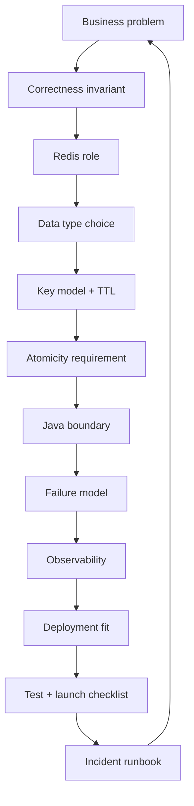
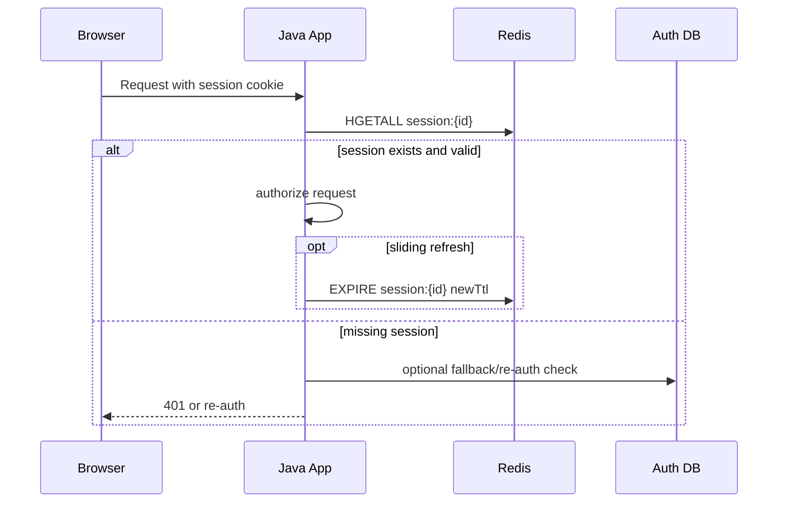
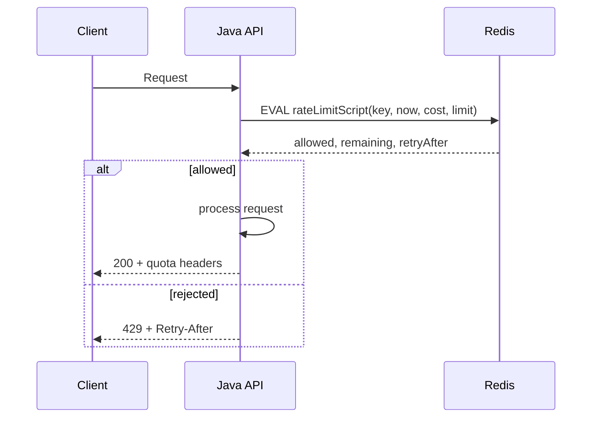
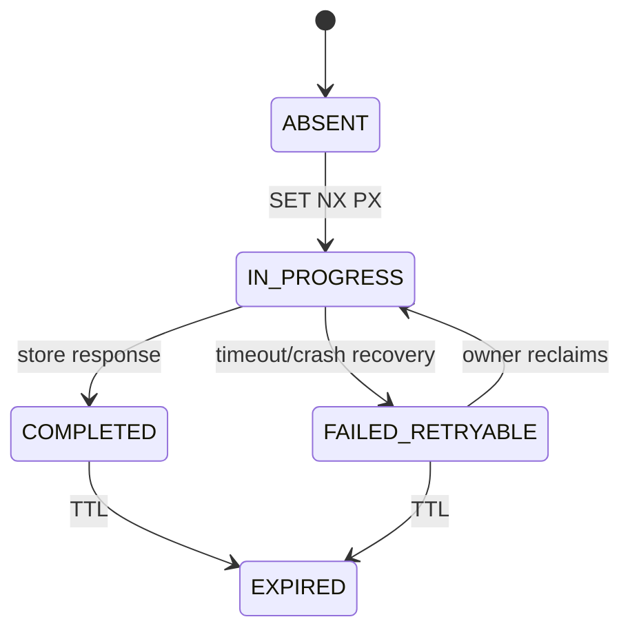
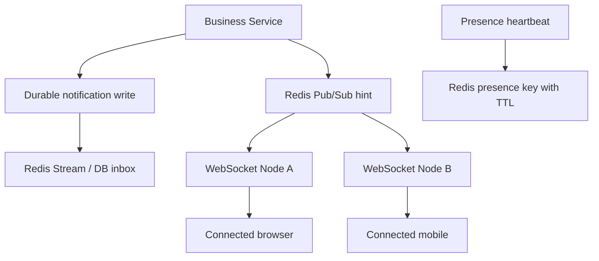
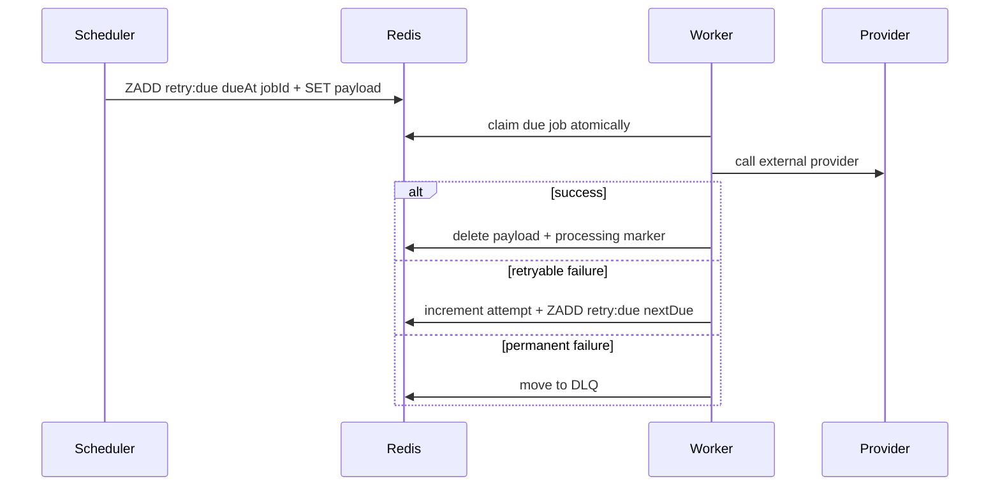
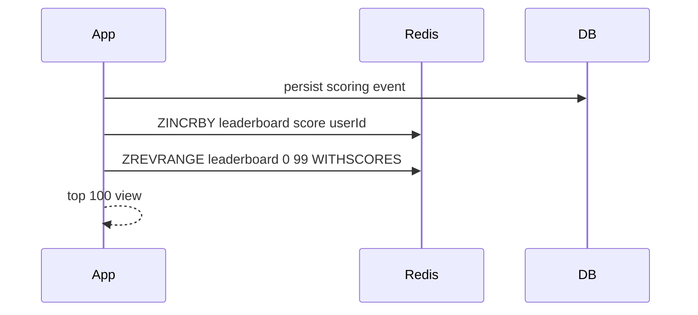
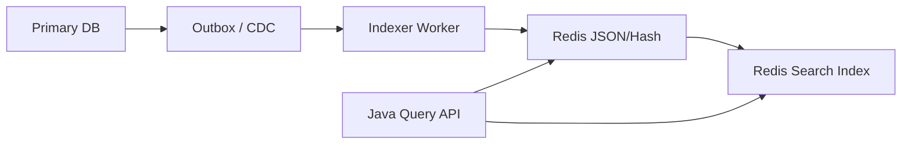

------
title: Learn Java Redis In Action - Part 034
description: Production case studies dan Redis engineering playbook untuk Java systems: session, rate limit, idempotency, realtime notification, retry pipeline, leaderboard, search lookup, launch checklist, incident runbook, dan mastery plan.
series: learn-java-redis
seriesTitle: Learn Java Redis In Action
order: 34
partTitle: Production Case Studies and Engineering Playbook
tags:
- java
- redis
- case-study
- playbook
- production
- architecture
- reliability
- series-final
date: 2026-07-02
------

# Production Case Studies and Engineering Playbook

This is the final part of the series.

The goal is synthesis.

Redis mastery is not remembering commands.

Redis mastery is being able to take a business problem, identify the data structure, define the correctness envelope, design the Java integration, model failure, operate the deployment, and know when Redis is the wrong tool.

This part converts the previous 33 parts into production case studies and a reusable engineering playbook.

---

## 1. Kaufman Objective

After this part, you should be able to:

1. Design Redis-backed features from problem statement to production rollout.
2. Choose the right Redis data type and deployment envelope.
3. Define key model, TTL, serialization, ownership, and failure behavior.
4. Implement Java-facing boundaries that do not leak raw Redis everywhere.
5. Create launch checklists for Redis-heavy features.
6. Diagnose Redis incidents using structured runbooks.
7. Evaluate Redis usage like a senior/staff engineer.
8. Continue deliberate practice after the first 20 hours.

This final part is intentionally case-driven.

---

## 2. The Redis Production Design Loop

Use this loop for every Redis-backed feature.



The loop prevents cargo-cult Redis usage.

It forces you to answer:

- What must never be violated?
- Is Redis cache, source of truth, queue, lock, index, signal, or approximation layer?
- What happens when Redis is stale, unavailable, slow, full, restarted, or failed over?
- How does Java retry without duplicating side effects?

---

## 3. Case Study 1: Session Store for Java Services

### 3.1 Problem

A Java web platform needs shared session state across horizontally scaled application instances.

Requirements:

- low latency session lookup,
- TTL-based expiry,
- logout invalidation,
- optional sliding expiration,
- secure storage of session metadata,
- predictable behavior during Redis outage.

### 3.2 Correctness Invariant

A revoked session must not continue to authorize sensitive operations after revocation is confirmed.

This means Redis outage behavior matters.

For sensitive authorization, fail-closed may be required.

### 3.3 Redis Model

Use Redis Hash or JSON-like serialized value.

Recommended simple key model:

```text
session:{sessionId} -> Hash
  userId
  tenantId
  issuedAt
  expiresAt
  authLevel
  version
  revoked
```

TTL should match session expiry.

For sliding sessions, update TTL on validated activity, but avoid extending TTL on every request if traffic is high.

### 3.4 Flow



### 3.5 Java Boundary

Do not expose raw Redis commands to controllers.

```java
public interface SessionStore {
    Optional<SessionRecord> find(SessionId sessionId);
    void save(SessionRecord session, Duration ttl);
    void revoke(SessionId sessionId);
    boolean refresh(SessionId sessionId, Duration ttl);
}
```

Implementation can use Hash, JSON, or serialized value.

The domain boundary stays stable.

### 3.6 Failure Modes

| Failure | Impact | Mitigation |
|---|---|---|
| Redis unavailable | cannot validate session | fail-closed for sensitive paths; limited degraded mode for non-sensitive paths |
| TTL accidentally missing | session never expires | write contract test; scan by prefix in staging; alert on keys without TTL |
| Key prefix collision | cross-service data corruption | central key builder |
| Huge session payload | memory pressure | payload budget and compression threshold |
| Replica stale read | revoked session may appear valid | read auth sessions from primary |
| Serialization change | session unreadable | versioned envelope |

### 3.7 Metrics

Track:

- session lookup latency,
- hit/miss rate,
- active session count,
- no-TTL session count sample,
- revoke latency,
- Redis connection errors,
- deserialization failures,
- memory by prefix estimate.

### 3.8 Production Verdict

Redis is a good fit for session storage if:

- TTL is mandatory,
- reads are primary for sensitive flows,
- outage behavior is explicit,
- key payload is bounded,
- revocation invariant is tested.

---

## 4. Case Study 2: API Rate Limiting and Quota

### 4.1 Problem

A public API needs per-tenant and per-user rate limits.

Requirements:

- enforce requests per minute,
- support weighted operations,
- return remaining quota,
- avoid DB write per request,
- work across multiple Java app instances.

### 4.2 Correctness Invariant

A tenant must not exceed purchased quota beyond an acceptable burst tolerance.

### 4.3 Redis Model

For simple limits:

```text
rl:{tenantId}:{windowStartEpochMinute} -> counter with TTL
```

For smoother limits:

```text
rl:{tenantId}:sliding -> Sorted Set of request timestamps
```

For token bucket:

```text
tb:{tenantId} -> Hash
  tokens
  lastRefillMillis
```

Use Lua for atomic read-decide-update.

### 4.4 Flow



### 4.5 Java Boundary

```java
public interface RateLimiter {
    RateLimitDecision checkAndConsume(RateLimitSubject subject, RateLimitCost cost);
}

public record RateLimitDecision(
    boolean allowed,
    long remaining,
    Duration retryAfter,
    String policyId
) {}
```

The API layer should not know whether Redis uses fixed window, sliding window, or token bucket.

### 4.6 Failure Policy

Rate limiter failure policy must be explicit:

- fail-open: preserve availability but risk abuse,
- fail-closed: preserve quota but risk outage,
- fail-soft: allow trusted tenants, reject suspicious traffic,
- local fallback: temporary in-process limiter during Redis outage.

For public API abuse prevention, fail-open is often dangerous.

For internal best-effort throttling, fail-open may be acceptable.

### 4.7 Tests

Test:

- boundary at exact limit,
- concurrent requests,
- weighted cost,
- clock skew assumptions,
- TTL cleanup,
- failover retry,
- Lua script reload,
- Redis Cluster key slotting,
- returned `Retry-After` correctness.

---

## 5. Case Study 3: Idempotency for Payment or Order APIs

### 5.1 Problem

An order/payment endpoint may receive duplicate requests because of client retry, network timeout, gateway retry, or event replay.

Requirements:

- process same idempotency key once,
- return same result for duplicate request,
- detect key reuse with different payload,
- avoid duplicate business side effects,
- handle worker crash mid-processing.

### 5.2 Correctness Invariant

For a given idempotency key and request fingerprint, external side effects must happen at most once from the perspective of the business operation.

Redis helps but does not magically create exactly-once behavior.

The database/payment provider must also support uniqueness or idempotency.

### 5.3 Redis Model

```text
idem:{tenantId}:{idempotencyKey} -> JSON/String envelope
```

Envelope:

```json
{
  "state": "IN_PROGRESS",
  "requestHash": "sha256:...",
  "owner": "worker-123",
  "createdAt": "2026-07-02T08:00:00Z",
  "expiresAt": "2026-07-03T08:00:00Z",
  "statusCode": null,
  "responseBody": null
}
```

States:



### 5.4 Java Boundary

```java
public interface IdempotencyStore {
    ClaimResult claim(IdempotencyKey key, RequestFingerprint fingerprint, Duration ttl);
    void complete(IdempotencyKey key, StoredHttpResponse response);
    Optional<StoredHttpResponse> findCompleted(IdempotencyKey key, RequestFingerprint fingerprint);
}
```

### 5.5 Critical Failure Modes

| Failure | Risk | Control |
|---|---|---|
| Java process crashes after side effect before Redis complete | duplicate side effect on retry | DB unique constraint / provider idempotency / outbox |
| Same key different payload | replay confusion | request hash comparison |
| Redis evicts idempotency key too early | duplicate allowed | no-eviction policy or sufficient TTL/memory |
| TTL too long | memory growth | retention policy by business SLA |
| Concurrent same key | double processing | `SET NX PX` or Lua claim |
| Redis failover loses claim | duplicate processing | durable backing invariant required |

### 5.6 Production Verdict

Redis is excellent as a fast idempotency coordination layer.

Redis should not be the only correctness boundary for irreversible side effects.

For top-tier engineering, combine:

- Redis claim for low-latency duplicate suppression,
- database unique constraint for durable invariant,
- provider idempotency key for external side effect,
- outbox/event log for reliable post-processing.

---

## 6. Case Study 4: Real-Time Presence and Notifications

### 6.1 Problem

A chat/collaboration system needs online presence and near-real-time notifications.

Requirements:

- show online/offline state,
- fan out events to WebSocket nodes,
- store durable notification inbox,
- avoid losing critical notifications,
- clean up stale presence.

### 6.2 Correctness Invariant

Presence may be approximate.

Durable notifications must not rely only on Pub/Sub.

### 6.3 Redis Model

Presence:

```text
presence:user:{userId} -> string node/session marker with TTL
presence:room:{roomId} -> Set of user IDs
```

Notification signal:

```text
pubsub channel: notify:{tenantId}
```

Durable inbox:

```text
notif:inbox:{userId} -> Stream or Sorted Set
```

### 6.4 Architecture



Pub/Sub wakes up real-time delivery.

The durable inbox preserves correctness.

### 6.5 Java Boundary

```java
public interface PresenceService {
    void heartbeat(UserId userId, SessionId sessionId, Duration ttl);
    PresenceView getPresence(UserId userId);
    void disconnect(UserId userId, SessionId sessionId);
}

public interface NotificationSignalBus {
    void publishHint(NotificationHint hint);
    void subscribe(Consumer<NotificationHint> consumer);
}
```

### 6.6 Failure Modes

| Failure | Impact | Mitigation |
|---|---|---|
| Pub/Sub subscriber disconnected | signal lost | durable inbox + client polling/reconciliation |
| WebSocket node dies | presence stale until TTL | short heartbeat TTL |
| Room set not cleaned | incorrect online count | derive from session TTL or periodic reconciliation |
| Redis outage | presence unavailable | show unknown/offline gracefully |
| Notification duplicated | duplicate UI event | notification ID dedup on client/server |

### 6.7 Production Verdict

Redis is strong for presence and real-time hints.

Do not use Redis Pub/Sub alone for critical business delivery.

Use durable state plus ephemeral signal.

---

## 7. Case Study 5: Delayed Retry Pipeline

### 7.1 Problem

A Java service calls external providers and needs delayed retries with backoff.

Requirements:

- schedule retry in the future,
- avoid duplicate concurrent processing,
- track retry count,
- move exhausted jobs to DLQ,
- recover jobs after worker crash.

### 7.2 Redis Model Options

Option A: Sorted Set delay queue.

```text
retry:due -> ZSET(jobId -> dueAtMillis)
retry:payload:{jobId} -> JSON payload
retry:processing -> ZSET(jobId -> visibilityDeadline)
retry:dlq -> Stream/List
```

Option B: Redis Streams with consumer group and retry metadata.

Choose Streams when you need consumer group semantics and replay.

Choose Sorted Set when scheduling by due time is central and job count is manageable.

### 7.3 Flow



### 7.4 Java Boundary

```java
public interface RetryScheduler<T> {
    void schedule(String jobId, T payload, Instant dueAt);
    Optional<ClaimedJob<T>> claimDue(Instant now);
    void complete(String jobId);
    void retry(String jobId, Instant nextDue, String reason);
    void deadLetter(String jobId, String reason);
}
```

### 7.5 Failure Modes

| Failure | Risk | Mitigation |
|---|---|---|
| Worker crashes after claim | stuck processing | visibility timeout + reaper |
| Provider succeeds but worker crashes before complete | duplicate provider call | provider idempotency key |
| Redis evicts payload | orphan job ID | no-eviction policy for queue or monitor payload existence |
| Claim script not atomic | duplicate workers | Lua claim |
| Backoff bug | retry storm | max attempts + jitter + global circuit breaker |
| DLQ ignored | silent data loss | DLQ dashboard and alert |

### 7.6 Production Verdict

Redis can implement a strong retry pipeline when:

- jobs are not massive,
- payloads are bounded,
- visibility timeout exists,
- external side effects are idempotent,
- DLQ is operationally monitored.

If job durability and replay become central business requirements, compare with Kafka, RabbitMQ, SQS, or a workflow engine.

---

## 8. Case Study 6: Leaderboard and Ranking

### 8.1 Problem

A gaming, sales, or gamification system needs near-real-time ranking.

Requirements:

- update score quickly,
- read top N,
- read user rank,
- support time-bounded leaderboard,
- prevent unbounded memory growth.

### 8.2 Redis Model

Sorted Set:

```text
leaderboard:{tenantId}:{seasonId} -> ZSET(userId -> score)
```

Commands conceptually:

- increment score,
- get reverse rank,
- get top N,
- get score,
- remove old season.

### 8.3 Flow



Persist scoring events in a durable store if scores matter for audit or rewards.

Redis can be serving/index layer.

### 8.4 Failure Modes

| Failure | Risk | Mitigation |
|---|---|---|
| Redis loses leaderboard | ranking lost | rebuild from scoring event log |
| Score update before DB commit | phantom score | update Redis after durable event commit/outbox |
| Unbounded season key | memory growth | season TTL/archive |
| Large top range | latency spike | cap query range |
| Cross-region leaderboard | inconsistent global order | define region/season aggregation semantics |

### 8.5 Production Verdict

Redis Sorted Sets are one of the best Redis fits.

But for regulated/audited outcomes, Redis should usually serve leaderboard views, not be the only system of record.

---

## 9. Case Study 7: Search-Backed Document Lookup

### 9.1 Problem

A Java service needs fast lookup over product/configuration/policy documents using field filters and text search.

Requirements:

- fetch document by ID,
- search by tags/status/tenant/category,
- filter numeric ranges,
- update index quickly,
- avoid heavy DB query path.

### 9.2 Redis Model

Use Redis JSON or Hash as document storage plus Redis Search index.

Key:

```text
doc:{tenantId}:{docId}
```

Fields:

```json
{
  "tenantId": "t1",
  "docId": "p123",
  "status": "ACTIVE",
  "category": "MOBILE_PLAN",
  "price": 150000,
  "tags": ["prepaid", "promo"],
  "updatedAt": "2026-07-02T08:00:00Z"
}
```

### 9.3 Architecture



### 9.4 Correctness Envelope

Search index is usually eventually consistent.

Define:

- maximum indexing lag,
- read-after-write expectation,
- fallback path for critical lookup,
- delete/tombstone behavior,
- index rebuild strategy.

### 9.5 Failure Modes

| Failure | Risk | Mitigation |
|---|---|---|
| Index lag | stale search result | expose freshness or fallback for critical reads |
| Partial update | document/index mismatch | atomic document write or rebuild from source |
| Delete missed | ghost result | tombstone and reconciliation |
| Unsupported query grows | Redis Search abused as OLAP | query budget and review |
| Large document | memory pressure | store projection only |

### 9.6 Production Verdict

Redis Search/JSON is powerful for low-latency serving indexes.

Keep source-of-truth ownership clear.

Search-backed Redis should usually store serving projections, not every field from the primary domain model.

---

## 10. Case Study 8: AI/Embedding Cache and Semantic Lookup

### 10.1 Problem

A Java platform uses LLM or embedding models and wants to reduce repeated embedding calls and serve semantic lookup.

Requirements:

- cache embedding results,
- version keys by model,
- invalidate when source text changes,
- search similar vectors,
- filter by tenant/status/type.

### 10.2 Redis Model

Embedding cache:

```text
emb:{modelVersion}:{sha256(normalizedText)} -> vector bytes / JSON envelope
```

Semantic document:

```text
vector-doc:{tenantId}:{docId} -> JSON/Hash with vector field and metadata
```

### 10.3 Critical Invariant

Embedding cache must be model-version-aware.

A vector from one embedding model/version must not be mixed with another model/version unless explicitly compatible.

### 10.4 Failure Modes

| Failure | Risk | Mitigation |
|---|---|---|
| Model version not in key | semantic corruption | model-aware key builder |
| Source text update missed | stale vector | content hash and indexer reconciliation |
| Tenant filter missing | data leak | mandatory tenant filter in query abstraction |
| Vector dimension mismatch | query failure | startup validation |
| Over-caching | memory blowup | TTL and admission control |

### 10.5 Production Verdict

Redis can be a strong low-latency vector serving layer.

But vector search must be governed like any other index: versioned, filtered, monitored, rebuildable.

---

## 11. Redis Launch Checklist

Use this checklist before launching any Redis-backed feature.

### 11.1 Problem and Ownership

- [ ] Redis role is declared: cache, queue, index, lock, session store, signal bus, rate limiter, idempotency layer, approximate analytics.
- [ ] Source of truth is declared.
- [ ] Business invariant is written down.
- [ ] Data loss tolerance is defined.
- [ ] Staleness tolerance is defined.
- [ ] Owning team is clear.

### 11.2 Keyspace

- [ ] All key prefixes documented.
- [ ] Key builder exists.
- [ ] Tenant boundary is encoded.
- [ ] TTL policy is explicit.
- [ ] No unbounded key family without cardinality limit.
- [ ] Large key budget defined.
- [ ] Cluster hash tags reviewed if Cluster is possible.

### 11.3 Java Client

- [ ] Client library selected deliberately.
- [ ] Timeout is configured.
- [ ] Retry policy is safe for command semantics.
- [ ] Circuit breaker or degradation policy exists.
- [ ] Serialization is versioned.
- [ ] Connection lifecycle is managed.
- [ ] Topology mode matches deployment.
- [ ] Metrics are emitted.

### 11.4 Atomicity and Consistency

- [ ] Race conditions identified.
- [ ] Lua/transaction/script use reviewed.
- [ ] Idempotency exists for retrying side effects.
- [ ] Cache invalidation path tested.
- [ ] Replica read risk reviewed.
- [ ] Failover behavior tested.

### 11.5 Operations

- [ ] Deployment model documented.
- [ ] Persistence/backup policy documented.
- [ ] Restore drill completed if data matters.
- [ ] Memory capacity reviewed.
- [ ] Eviction policy selected.
- [ ] Alerts created.
- [ ] Dashboards created.
- [ ] Incident runbook exists.

### 11.6 Security

- [ ] Redis is not publicly exposed.
- [ ] TLS decision documented.
- [ ] ACL user is least privilege.
- [ ] Secrets are rotated safely.
- [ ] Logs do not leak sensitive keys/values.
- [ ] Tenant isolation tested.

---

## 12. Incident Playbook

### 12.1 High Redis Latency

Symptoms:

- API latency increases,
- Redis command timeout,
- connection pool saturation,
- slowlog entries,
- CPU/network spike.

Diagnosis:

1. Check application latency by Redis operation.
2. Check Redis `SLOWLOG`.
3. Check command stats.
4. Check network latency.
5. Check payload size.
6. Check hot keys.
7. Check memory pressure and eviction.
8. Check persistence fork/AOF rewrite activity.

Immediate mitigations:

- reduce expensive operations,
- disable non-critical Redis feature flags,
- increase timeout only if safe,
- shed traffic,
- bypass cache refresh path,
- split hot key if identified,
- scale if bottleneck is capacity.

Do not blindly increase Redis timeout.

That often converts fast failure into thread/connection exhaustion.

### 12.2 Redis Memory Pressure

Symptoms:

- rising `used_memory`,
- evictions,
- OOM errors,
- latency spikes,
- key growth.

Diagnosis:

1. Identify top key families.
2. Check TTL distribution.
3. Check large keys.
4. Check payload size regression.
5. Check traffic change.
6. Check new feature rollout.

Mitigations:

- stop offending writer,
- reduce TTL,
- apply cardinality limits,
- compress or shrink payload,
- increase memory only after key growth cause is understood,
- restore correct eviction policy.

### 12.3 Redis Failover

Symptoms:

- connection reset,
- `READONLY` errors,
- timeout burst,
- write failure,
- stale reads.

Diagnosis:

1. Confirm topology event.
2. Check Java client reconnect behavior.
3. Check retry storm.
4. Check duplicate side effects.
5. Check replication lag/loss window.

Mitigations:

- allow client topology refresh,
- throttle retries,
- rely on idempotency,
- temporarily disable non-critical Redis writes,
- verify primary endpoint after failover.

### 12.4 Cache Inconsistency

Symptoms:

- user sees stale data,
- inconsistent API response,
- invalidation misses,
- DB and Redis disagree.

Diagnosis:

1. Identify key family.
2. Compare DB version and cache version.
3. Inspect invalidation event path.
4. Check TTL and logical expiry.
5. Check replica reads.
6. Check serialization version.

Mitigations:

- invalidate by prefix if bounded and safe,
- bump versioned key namespace,
- disable cache for affected entity,
- rebuild affected cache from source of truth,
- add mismatch metric.

### 12.5 Redis Connection Storm

Symptoms:

- many client connections,
- app restarts amplify load,
- Redis CPU/network spike,
- connection pool exhaustion.

Diagnosis:

1. Count connections by client name.
2. Check deployment rollout/restart.
3. Check client pooling configuration.
4. Check reconnect backoff.
5. Check DNS/provider endpoint behavior.

Mitigations:

- stagger app rollout,
- add reconnect backoff and jitter,
- reduce pool size,
- reuse connections correctly,
- stop misconfigured clients.

---

## 13. Redis Design Review Questions

Use these in architecture reviews.

### 13.1 Data Semantics

1. Is Redis source of truth or serving layer?
2. Can data be rebuilt?
3. How stale can it be?
4. What happens if key is missing?
5. What happens if key exists but is stale?
6. What happens if Redis returns timeout after command may have executed?

### 13.2 Structure Choice

1. Why this Redis data type?
2. What is the command complexity?
3. How large can this key grow?
4. Is TTL attached to the right level?
5. Is partial update safe?
6. Is serialization versioned?

### 13.3 Concurrency

1. Can two requests update the same key concurrently?
2. Is read-decide-write atomic?
3. Does retry duplicate side effects?
4. Are locks used for correctness or efficiency?
5. Is fencing required?

### 13.4 Operations

1. What is max memory?
2. What is eviction policy?
3. What dashboard shows this feature's health?
4. What alert fires before users notice?
5. How do we restore or rebuild?
6. What is the rollback switch?

### 13.5 Security

1. Does key name leak sensitive data?
2. Can app user access only required commands?
3. Can tenant A read tenant B's keys?
4. Are values logged anywhere?
5. Is TLS required?
6. How are secrets rotated?

---

## 14. What Top 1% Redis Engineers Do Differently

They do not ask, "Which Redis command solves this?"

They ask:

1. What invariant am I protecting?
2. What data structure gives the right operational shape?
3. What is the bounded lifetime of this data?
4. How does this fail under concurrency?
5. What does retry mean after timeout?
6. What is the source of truth?
7. What is the rebuild path?
8. What happens during failover?
9. How will I observe this in production?
10. How can I remove this Redis dependency later if needed?

They keep Redis usage boring where possible.

They reserve clever Lua/scripts/locks for places where the complexity is justified.

They understand that Redis speed is easy to obtain and easy to abuse.

---

## 15. The 20-Hour Deliberate Practice Plan

This series is large, but Kaufman's principle remains: decompose, learn enough to self-correct, remove friction, and practice deliberately.

Here is a practical 20-hour plan after reading the series.

### Hour 1-2: Mental Model and Key Design

Build:

- key builder,
- TTL policy table,
- Redis operation inventory for a fake order service.

Deliverable:

```text
order-service Redis keyspace contract
```

### Hour 3-4: Java Client Setup

Build:

- Lettuce or Jedis connection factory,
- timeout config,
- serialization envelope,
- local Docker Redis.

Deliverable:

```text
RedisFacade with integration tests
```

### Hour 5-6: Cache Pattern

Build:

- cache-aside product lookup,
- negative cache,
- TTL jitter,
- stale fallback.

Deliverable:

```text
cache consistency notes + tests
```

### Hour 7-8: Idempotency

Build:

- idempotency claim,
- request hash validation,
- completed response replay.

Deliverable:

```text
idempotent POST /orders prototype
```

### Hour 9-10: Rate Limiter

Build:

- token bucket or sliding window with Lua,
- HTTP 429 response,
- concurrent test.

Deliverable:

```text
tenant-aware Redis rate limiter
```

### Hour 11-12: Queue/Retry

Build:

- delayed retry with Sorted Set,
- worker claim,
- visibility timeout,
- DLQ.

Deliverable:

```text
provider retry worker
```

### Hour 13-14: Streams

Build:

- stream producer,
- consumer group,
- pending claim,
- replay test.

Deliverable:

```text
stream-backed event processor
```

### Hour 15-16: Observability

Add:

- command latency metrics,
- error counters,
- Redis health probe,
- Slowlog drill.

Deliverable:

```text
Redis dashboard checklist
```

### Hour 17-18: Deployment Drill

Run:

- standalone local,
- cluster-compatible key audit,
- simulated Redis restart/failover.

Deliverable:

```text
deployment readiness review
```

### Hour 19-20: Incident Simulation

Simulate:

- Redis timeout,
- duplicate retry,
- stale cache,
- memory pressure,
- lost Pub/Sub message.

Deliverable:

```text
incident notes + fixes
```

The goal is not to finish a toy project.

The goal is to build enough real feedback that your Redis decisions become grounded.

---

## 16. Final Mastery Exercises

### Exercise 1: Redis Feature Review

Pick one existing feature in your codebase.

Write:

- Redis role,
- key model,
- data type,
- TTL,
- failure behavior,
- source of truth,
- metrics,
- incident playbook.

If you cannot write it, the feature is under-designed.

### Exercise 2: Redis Outage Game Day

Disable Redis in staging.

Observe:

- which endpoints fail,
- which endpoints degrade,
- retry behavior,
- thread/connection usage,
- error messages,
- recovery time.

Then classify each dependency as:

- must fail closed,
- can fail open,
- can degrade,
- should fallback,
- should be removed.

### Exercise 3: Keyspace Audit

Run a safe keyspace audit in staging.

Find:

- keys without TTL,
- largest keys,
- highest cardinality prefixes,
- unused prefixes,
- risky names containing PII,
- cross-tenant collision risk.

### Exercise 4: Cluster Readiness Audit

Pretend you must migrate to Redis Cluster.

Find:

- multi-key commands,
- Lua scripts,
- transaction usage,
- key builder assumptions,
- arbitrary pattern scans,
- Pub/Sub assumptions.

### Exercise 5: Delete Redis

For each Redis usage, answer:

> If Redis had to be removed or replaced, what would break?

This reveals whether Redis is being used as:

- cache,
- hidden database,
- workflow engine,
- lock manager,
- message broker,
- index,
- source of truth.

Hidden roles are the dangerous ones.

---

## 17. Series Summary

Across this series, we covered:

1. Kaufman learning map.
2. Redis mental model.
3. Key design, TTL, namespace, and data modeling.
4. Strings, counters, bitmaps, hashes, lists, sets, sorted sets.
5. Streams, Pub/Sub, and keyspace notifications.
6. Java clients: Lettuce, Jedis, Spring Data Redis, Redisson positioning.
7. Serialization strategy.
8. Cache patterns and consistency.
9. Idempotency, rate limiting, locks, leases, fencing.
10. Work queues, delayed jobs, realtime presence.
11. Search, JSON, Time Series, probabilistic structures, vector search.
12. Performance, Lua, functions, memory engineering.
13. Observability and debugging.
14. Persistence, replication, Sentinel, Cluster.
15. Security, governance, deployment.
16. Production case studies and playbook.

The main lesson:

> Redis is not a magic low-latency box. Redis is a set of data structures with specific atomicity, memory, durability, consistency, and topology behavior. Production skill is matching those behaviors to business invariants.

---

## 18. Recommended Next Series

After this Redis series, the strongest next topics are:

1. **Build From Scratch: Enterprise Caching Platform for Java Microservices**
   - cache policy engine,
   - invalidation bus,
   - cache observability,
   - multi-tenant quota,
   - stale data governance.

2. **In Action: Java Distributed Coordination and Concurrency Patterns**
   - leases,
   - fencing,
   - leader election,
   - consensus boundaries,
   - workflow correctness.

3. **Build From Scratch: Production-Grade Search Platform with Redis/OpenSearch/PostgreSQL**
   - indexing pipeline,
   - query model,
   - freshness,
   - relevance,
   - rebuild and backfill.

4. **In Action: Java High-Performance Data Access Layer**
   - DB + cache + queue integration,
   - latency budgeting,
   - batching,
   - backpressure,
   - read/write model.

5. **Build From Scratch: Enforcement Lifecycle Case Management Platform**
   - state machines,
   - escalation logic,
   - SLA timers,
   - auditability,
   - Redis/Kafka/PostgreSQL workflow support.

---

## 19. Final Note

The Redis series is complete at Part 034.

Do not measure success by how many Redis commands you can list.

Measure success by whether you can design, review, operate, debug, and safely evolve Redis-backed Java systems under real production constraints.

That is the difference between using Redis and engineering with Redis.

---

## 20. References

Primary references for this part:

- Redis Docs — Data types: https://redis.io/docs/latest/develop/data-types/
- Redis Docs — Pub/Sub: https://redis.io/docs/latest/develop/pubsub/
- Redis Docs — Streams: https://redis.io/docs/latest/develop/data-types/streams/
- Redis Docs — Pipelining: https://redis.io/docs/latest/develop/using-commands/pipelining/
- Redis Docs — Transactions: https://redis.io/docs/latest/develop/using-commands/transactions/
- Redis Docs — Distributed locks: https://redis.io/docs/latest/develop/clients/patterns/distributed-locks/
- Redis Docs — Eviction: https://redis.io/docs/latest/develop/reference/eviction/
- Redis Docs — Persistence: https://redis.io/docs/latest/operate/oss_and_stack/management/persistence/
- Redis Docs — Replication: https://redis.io/docs/latest/operate/oss_and_stack/management/replication/
- Redis Docs — Sentinel: https://redis.io/docs/latest/operate/oss_and_stack/management/sentinel/
- Redis Docs — Redis Cluster scaling: https://redis.io/docs/latest/operate/oss_and_stack/management/scaling/
- Redis Docs — Security and ACL: https://redis.io/docs/latest/operate/oss_and_stack/management/security/acl/
