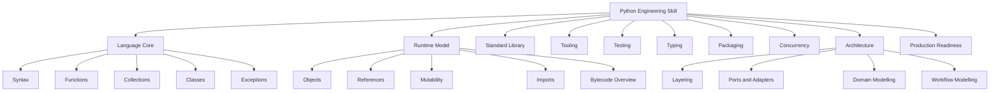
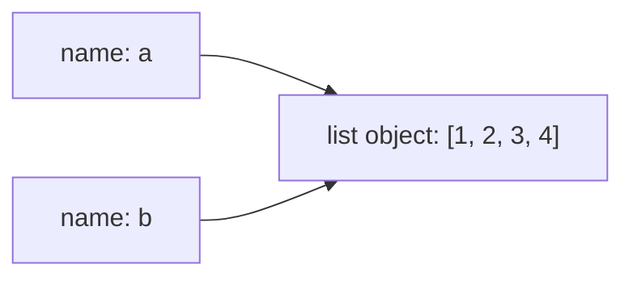
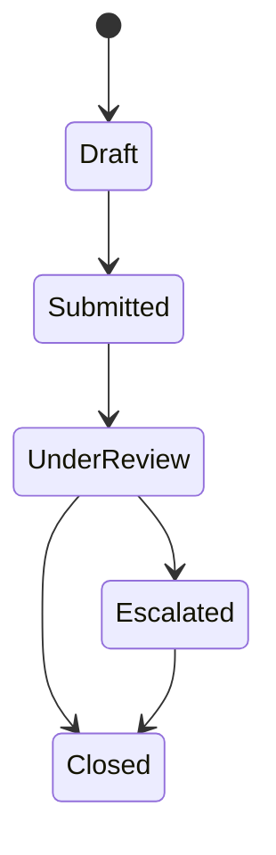
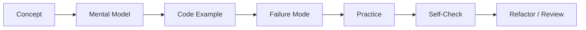

# Part 001 — Target Performance, Scope, dan 20-Hour Learning Contract

## 1. Tujuan Part Ini

Part ini bukan tentang syntax Python dulu.

Part ini menjawab pertanyaan yang lebih penting:

> “Dalam 20 jam pertama, Python seperti apa yang harus saya kuasai agar saya tidak hanya bisa menulis script, tetapi mulai berpikir seperti engineer Python yang efektif?”

Untuk software engineer berpengalaman, risiko terbesar ketika belajar Python bukan “tidak paham programming”. Risiko terbesarnya adalah membawa mental model dari bahasa lain secara mentah-mentah:

- menulis Python seperti Java;
- menulis Python seperti C#;
- menulis Python seperti Go;
- menganggap Python hanya scripting language;
- terlalu cepat masuk FastAPI, Django, data science, atau automation tanpa memahami object model;
- mengabaikan packaging, testing, typing, dependency isolation, dan runtime behavior;
- mengira “bisa menjalankan kode” berarti “menguasai bahasa”.

Kita akan memakai framework Josh Kaufman dari *The First 20 Hours* sebagai struktur belajar. Intinya sederhana:

1. Pilih skill yang spesifik.
2. Definisikan target performa.
3. Pecah skill menjadi sub-skill kecil.
4. Pelajari teori secukupnya untuk bisa self-correct.
5. Hilangkan hambatan praktik.
6. Praktik terarah minimal 20 jam.
7. Buat feedback loop cepat.
8. Jangan tertipu oleh ilusi produktivitas dari membaca terlalu banyak.

Dalam konteks Python, “20 jam pertama” bukan berarti menjadi expert. Itu berarti melewati fase friksi awal sampai bisa:

- membaca kode Python non-trivial;
- menulis program kecil yang benar;
- memahami error dasar;
- membuat fungsi dan modul yang rapi;
- memakai collection dengan tepat;
- menjalankan test;
- mengelola environment;
- mulai membedakan Pythonic code dari sekadar code yang kebetulan jalan.

Setelah 20 jam, seri ini tetap lanjut ke level engineering mastery. Tetapi part ini membangun landasan supaya perjalanan berikutnya tidak acak.

---

## 2. Premis Utama: Python untuk Software Engineer Berbeda dari Python untuk Pemula

Python sering dipasarkan sebagai bahasa yang “mudah”. Itu benar hanya pada lapisan pertama.

Contoh program Python sederhana:

```python
print("Hello, Python")
```

Mudah.

Tetapi Python yang dipakai di production system melibatkan banyak lapisan:

```python
from dataclasses import dataclass
from typing import Protocol
from uuid import UUID


@dataclass(frozen=True)
class CaseId:
    value: UUID


class CaseRepository(Protocol):
    def exists(self, case_id: CaseId) -> bool:
        ...


def ensure_case_exists(case_id: CaseId, repository: CaseRepository) -> None:
    if not repository.exists(case_id):
        raise CaseNotFoundError(case_id)
```

Kode di atas terlihat sederhana, tetapi mengandung banyak konsep:

- `dataclass`;
- immutability;
- value object;
- type hints;
- protocol;
- dependency inversion;
- domain error;
- object identity vs value equality;
- runtime vs static typing;
- boundary design.

Maka target kita bukan “bisa syntax Python”. Target kita adalah membangun *engineering judgment* dalam Python.

---

## 3. Apa yang Dimaksud “Top-Tier Python Engineer”?

Kita perlu hati-hati dengan istilah “top 1%”. Itu bukan klaim yang bisa dicapai hanya dengan membaca materi. Tetapi kita bisa mendefinisikan kualitas engineer Python yang sangat kuat.

Seorang Python engineer yang kuat biasanya mampu:

1. **Menulis kode Python yang idiomatik**
   - sederhana;
   - eksplisit;
   - mudah dibaca;
   - tidak over-engineered;
   - tidak membawa style bahasa lain secara mentah.

2. **Memahami runtime model**
   - object;
   - reference;
   - mutability;
   - identity;
   - import system;
   - exception propagation;
   - interpreter cost;
   - GIL dan concurrency trade-off.

3. **Mendesain boundary yang sehat**
   - module boundary;
   - domain boundary;
   - framework boundary;
   - persistence boundary;
   - external service boundary.

4. **Memakai typing secara pragmatis**
   - type hints untuk desain;
   - gradual typing;
   - protocol;
   - generics;
   - strict typing pada area penting;
   - sadar bahwa type hints tidak otomatis enforced saat runtime.

5. **Membangun test suite yang memberi confidence**
   - unit test;
   - integration test;
   - contract test;
   - property-based test;
   - test untuk failure path.

6. **Menguasai packaging dan dependency**
   - virtual environment;
   - `pyproject.toml`;
   - lock file;
   - dependency group;
   - build artifact;
   - CLI entry point;
   - reproducible setup.

7. **Memahami concurrency dan performance**
   - sync vs threaded vs async vs multiprocessing;
   - workload classification;
   - backpressure;
   - profiling;
   - memory awareness.

8. **Production-ready**
   - logging;
   - metrics;
   - traces;
   - graceful shutdown;
   - configuration;
   - security baseline;
   - deployment constraints;
   - operational runbook.

9. **Mampu membaca kode orang lain**
   - standard library;
   - framework internals;
   - open-source library;
   - legacy codebase;
   - kode yang “Pythonic” maupun yang buruk.

10. **Mampu memilih kapan Python bukan pilihan terbaik**
    - CPU-heavy workloads;
    - low-latency systems;
    - hard real-time systems;
    - memory-constrained systems;
    - situations where ecosystem mismatch matters.

Seri ini tidak hanya mengajari “fitur”. Seri ini membangun *decision framework*.

---

## 4. Performance Target

Dalam framework Kaufman, kita tidak mulai dengan “saya ingin belajar Python”. Itu terlalu luas.

Kita mulai dengan target performa yang bisa diuji.

### 4.1 Target 20 Jam Pertama

Setelah 20 jam pertama, kamu harus bisa:

1. Membuat project Python kecil dengan `.venv`.
2. Menjalankan program dari CLI.
3. Memecah kode menjadi fungsi dan modul.
4. Memakai `list`, `tuple`, `dict`, `set` secara tepat.
5. Membaca traceback dan memperbaiki error dasar.
6. Menulis minimal 10 unit test dengan `pytest`.
7. Memahami bedanya mutation dan rebinding.
8. Menghindari mutable default argument.
9. Membuat simple domain model dengan `dataclass`.
10. Membuat program CLI kecil yang menyimpan data ke file JSON.
11. Menulis error handling yang tidak menelan exception sembarangan.
12. Menjalankan formatter/linter/type-checker minimal.
13. Membaca dokumentasi resmi untuk syntax atau library dasar.
14. Menjelaskan alur eksekusi program sendiri.

Target ini sengaja realistis. Bukan FastAPI dulu. Bukan async dulu. Bukan machine learning dulu.

Tujuannya adalah fluency awal.

### 4.2 Target 100 Jam

Setelah 100 jam deliberate practice, kamu harus mulai bisa:

1. Membuat Python package installable.
2. Mendesain service boundary.
3. Menggunakan type hints secara konsisten.
4. Membuat test suite yang mencakup happy path dan failure path.
5. Menggunakan standard library secara produktif.
6. Membuat API kecil dengan FastAPI atau framework setara.
7. Mengakses database dengan transaction boundary jelas.
8. Mengelola dependency dengan lock file.
9. Menulis structured logging.
10. Mengukur performance sebelum optimasi.
11. Memilih concurrency model berdasarkan workload.
12. Membaca dan memodifikasi codebase Python existing.

### 4.3 Target Engineering Mastery

Dalam jangka panjang, kamu harus mampu:

1. Mendesain Python service yang maintainable.
2. Membuat internal library yang ergonomis.
3. Melakukan modernization terhadap legacy Python.
4. Menulis architecture decision record.
5. Menganalisis failure mode.
6. Mendesain observability dan operational readiness.
7. Memahami CPython internals secukupnya untuk debugging performa.
8. Mengetahui kapan dynamic typing menjadi risiko dan kapan menjadi leverage.
9. Menjadi reviewer yang bisa membedakan:
   - kode sederhana yang baik;
   - kode clever yang rapuh;
   - kode over-engineered;
   - kode yang terlihat Pythonic tetapi gagal secara domain.

---

## 5. Skill Tree Python

Python bukan satu skill. Python adalah gabungan banyak sub-skill.



Untuk 20 jam pertama, kita tidak mempelajari semua cabang dengan kedalaman sama. Kita memprioritaskan cabang yang menjadi prasyarat untuk self-correction.

---

## 6. Deconstruction: Sub-Skill Paling Penting di Awal

Berikut urutan sub-skill yang memberi leverage terbesar.

| Urutan | Sub-skill | Kenapa Penting |
|---:|---|---|
| 1 | Menjalankan kode | Tanpa ini tidak ada feedback loop |
| 2 | Membaca traceback | Error adalah guru tercepat |
| 3 | Name binding | Mencegah salah paham variable |
| 4 | Mutability | Sumber bug Python pemula-menengah |
| 5 | Collections | Mayoritas program Python memanipulasi struktur data |
| 6 | Functions | Unit desain paling dasar |
| 7 | Modules/imports | Membuat kode tidak menjadi satu file besar |
| 8 | Exceptions | Membuat failure semantics jelas |
| 9 | Tests | Membuat feedback cepat |
| 10 | Tooling | Mengurangi friksi dan menjaga kualitas |

Yang belum menjadi prioritas 20 jam pertama:

- metaclass;
- descriptor secara mendalam;
- async internals;
- multiprocessing kompleks;
- C extension;
- framework besar;
- distributed task queue;
- advanced packaging;
- CPython source code;
- full web framework architecture.

Bukan berarti tidak penting. Hanya belum tepat di jam pertama.

---

## 7. Apa yang Harus Dipelajari “Secukupnya” Dulu?

Kaufman menekankan “learn enough to self-correct”. Ini sangat penting.

Banyak engineer gagal belajar skill baru karena salah satu dari dua ekstrem:

1. **Terlalu sedikit teori**
   - langsung copy-paste;
   - tidak bisa menjelaskan error;
   - tidak tahu kenapa kode jalan;
   - debugging hanya trial-and-error.

2. **Terlalu banyak teori**
   - membaca dokumentasi berhari-hari;
   - menonton banyak tutorial;
   - merasa produktif padahal belum membangun apa pun;
   - menunda praktik karena belum “siap”.

Untuk Python, teori minimum sebelum praktik adalah:

- cara menjalankan file;
- indentation dan block;
- variable binding;
- tipe dasar;
- function;
- collection;
- exception dasar;
- import dasar;
- virtual environment;
- cara menjalankan test.

Setelah itu, praktik harus dimulai.

---

## 8. Mental Model Awal: Python adalah Runtime yang Mengeksekusi Object Graph

Banyak bahasa memperlakukan variable seolah-olah “kotak berisi nilai”. Mental model itu berbahaya untuk Python.

Lebih tepat:

> Nama mengarah ke object. Object memiliki identity, type, dan value/state.

Contoh:

```python
a = [1, 2, 3]
b = a
b.append(4)

print(a)
```

Output:

```text
[1, 2, 3, 4]
```

Kenapa?

Karena `a` dan `b` mengarah ke object list yang sama.



Ini bukan detail akademis. Ini akan memengaruhi:

- desain function;
- default argument;
- caching;
- test isolation;
- data model;
- repository behavior;
- concurrency bug;
- API mutability contract.

Kita akan membahas ini lebih dalam di part 006, tetapi sejak awal kamu harus tahu bahwa Python bukan bahasa “variable sebagai kotak”.

---

## 9. Pythonic Tidak Berarti Pendek

Ada miskonsepsi bahwa kode Pythonic adalah kode yang paling pendek.

Salah.

Kode Pythonic adalah kode yang:

- jelas;
- eksplisit;
- menggunakan idiom bahasa dengan wajar;
- memanfaatkan standard library;
- tidak clever tanpa alasan;
- mudah diuji;
- mudah dibaca oleh engineer lain;
- memperjelas intent.

Contoh kurang baik:

```python
result = [x.id for x in cases if x.status in {"OPEN", "ESCALATED"} and not x.deleted]
```

Kode ini bisa baik jika konteksnya sederhana. Tetapi jika rule-nya domain-critical, lebih baik:

```python
def is_actionable(case: Case) -> bool:
    return case.status in {CaseStatus.OPEN, CaseStatus.ESCALATED} and not case.deleted


actionable_case_ids = [case.id for case in cases if is_actionable(case)]
```

Kode kedua lebih panjang, tetapi intent domain lebih jelas.

Dalam sistem regulatori, readability bukan estetika. Readability adalah bagian dari defensibility.

---

## 10. Hambatan Praktik yang Harus Dihilangkan

Kaufman sangat menekankan friction removal. Dalam programming, friksi sering terlihat kecil tetapi membunuh konsistensi.

### 10.1 Friksi Environment

Contoh friksi:

- tidak tahu Python mana yang dipakai;
- global package berantakan;
- dependency konflik;
- command berbeda-beda;
- test sulit dijalankan;
- formatter tidak otomatis;
- editor tidak mengenali interpreter.

Solusi:

- satu project punya satu `.venv`;
- dependency dideklarasikan;
- command dibuat konsisten;
- test bisa jalan satu command;
- lint bisa jalan satu command;
- format bisa jalan satu command.

### 10.2 Friksi Cognitive

Contoh:

- belajar dari terlalu banyak sumber;
- membuka 20 tab dokumentasi;
- mencoba framework sebelum memahami core;
- mencampur syntax baru tanpa mental model;
- tidak punya target harian.

Solusi:

- satu roadmap;
- satu mini project;
- satu learning log;
- satu checklist per sesi;
- praktik 45–90 menit.

### 10.3 Friksi Emotional

Ini sering diremehkan oleh engineer senior.

Saat sudah mahir Java, Go, atau C#, menjadi pemula lagi terasa tidak nyaman. Kode Python pertama mungkin terasa “aneh”, “terlalu bebas”, atau “kurang strict”.

Itu normal.

Jangan langsung menyimpulkan bahasanya buruk hanya karena mental model lama tidak cocok.

---

## 11. Kontrak Belajar 20 Jam

Gunakan kontrak berikut.

### 11.1 Komitmen

Saya akan belajar Python selama minimal 20 jam praktik terarah.

Saya tidak akan menilai kemampuan saya dari jumlah tutorial yang ditonton, tetapi dari program yang bisa saya baca, tulis, uji, dan perbaiki.

Saya akan mengutamakan feedback loop pendek.

Saya akan menulis learning log setelah setiap sesi.

Saya akan menghindari framework besar sampai core language cukup stabil.

### 11.2 Jadwal Praktik

Pilihan jadwal yang realistis:

| Pola | Durasi | Total |
|---|---:|---:|
| 45 menit per hari | 27 hari | ±20 jam |
| 60 menit per hari | 20 hari | 20 jam |
| 90 menit, 4x per minggu | 4 minggu | 24 jam |
| 2 jam, 3x per minggu | 4 minggu | 24 jam |

Untuk software engineer yang bekerja penuh waktu, pola terbaik biasanya:

```text
60–90 menit per sesi, 4–5 sesi per minggu
```

Lebih penting konsisten daripada maraton panjang.

### 11.3 Aturan Sesi

Setiap sesi harus punya:

1. tujuan kecil;
2. aktivitas coding;
3. error/debugging;
4. catatan hal yang dipelajari;
5. satu commit atau snapshot.

Contoh sesi buruk:

> “Hari ini saya nonton video Python 2 jam.”

Contoh sesi baik:

> “Hari ini saya membuat parser input CLI, menulis 3 test, menemukan bug mutable list, dan memperbaikinya.”

---

## 12. 20-Hour Practice Plan

Berikut rencana 20 jam pertama.

| Jam | Fokus | Output |
|---:|---|---|
| 1 | Setup environment | Python jalan, `.venv`, editor siap |
| 2 | Syntax survival | File Python kecil, condition, loop |
| 3 | Functions | 5 fungsi kecil |
| 4 | Collections | Transformasi `list`, `dict`, `set` |
| 5 | Traceback/debugging | Memperbaiki 5 error sengaja |
| 6 | Mini project skeleton | CLI case tracker mulai |
| 7 | Domain model awal | Case, status, priority |
| 8 | File persistence | Save/load JSON |
| 9 | Error handling | Custom error dasar |
| 10 | Tests dasar | 5 test pytest |
| 11 | Refactor functions | Pisah command/domain/storage |
| 12 | Modules/imports | Struktur package sederhana |
| 13 | Mutability review | Fix bug shared state |
| 14 | Dataclass | Domain model lebih jelas |
| 15 | CLI behavior | Add/list/update cases |
| 16 | Filtering/search | Query sederhana |
| 17 | More tests | 10–15 test |
| 18 | Tooling | Formatter/linter/type-check minimal |
| 19 | README dan usage | Dokumentasi singkat |
| 20 | Review | Self-assessment dan refactor |

Ini bukan jadwal kaku. Ini adalah baseline.

---

## 13. Mini Project 20 Jam: Case Tracker CLI

Kita butuh project yang cukup kecil untuk selesai, tetapi cukup realistis untuk melatih engineering skill.

Project:

> Command-line case tracker untuk mengelola lifecycle kasus sederhana.

Fitur minimum:

1. Membuat case.
2. Melihat daftar case.
3. Mengubah status case.
4. Menambahkan catatan.
5. Menyimpan data ke JSON file.
6. Memuat data dari JSON file.
7. Menolak transition invalid.
8. Menulis test untuk rule penting.

Domain sederhana:

```text
DRAFT -> SUBMITTED -> UNDER_REVIEW -> CLOSED
                         |
                         v
                     ESCALATED
                         |
                         v
                      CLOSED
```

Diagram:



Kenapa project ini bagus?

Karena ia melatih:

- data modelling;
- state transition;
- validation;
- failure semantics;
- file I/O;
- CLI;
- testing;
- refactoring;
- domain thinking.

Tidak terlalu besar, tetapi tidak main-main.

---

## 14. Struktur Project Awal

Kita akan mulai dari struktur sederhana:

```text
case-tracker/
  pyproject.toml
  README.md
  src/
    case_tracker/
      __init__.py
      cli.py
      domain.py
      storage.py
      service.py
  tests/
    test_domain.py
    test_service.py
```

Penjelasan:

| Path | Fungsi |
|---|---|
| `pyproject.toml` | Metadata project, dependency, config tooling |
| `README.md` | Cara menjalankan project |
| `src/case_tracker/cli.py` | Boundary CLI |
| `src/case_tracker/domain.py` | Model domain |
| `src/case_tracker/storage.py` | Persistence |
| `src/case_tracker/service.py` | Use case/application logic |
| `tests/` | Test suite |

Kenapa pakai `src/` layout?

Karena ini membantu mencegah import yang tidak sengaja berhasil hanya karena current working directory. Untuk project serius, `src/` layout sering lebih aman.

Untuk 20 jam pertama, kita tidak perlu terlalu dalam membahas packaging. Tapi kita ingin kebiasaan yang benar sejak awal.

---

## 15. Definisi Done untuk 20 Jam Pertama

Kamu tidak selesai hanya karena “sudah membaca”.

Kamu selesai fase 20 jam jika bisa menunjukkan:

1. Repository project berjalan.
2. `python -m case_tracker` atau command setara bisa dijalankan.
3. Ada minimal 3 command CLI:
   - create;
   - list;
   - transition.
4. Data tersimpan ke JSON.
5. Ada minimal 10 test.
6. Ada minimal 1 custom exception.
7. Ada model domain dengan `dataclass`.
8. Ada enum status.
9. Ada transition rule.
10. Ada README.
11. Ada command untuk test.
12. Kamu bisa menjelaskan:
    - bagaimana program start;
    - bagaimana input masuk;
    - bagaimana rule divalidasi;
    - bagaimana data disimpan;
    - bagaimana error dipropagasi.

---

## 16. Rubric Self-Assessment

Gunakan rubric ini setelah 20 jam.

| Area | Level 1 | Level 2 | Level 3 | Level 4 |
|---|---|---|---|---|
| Syntax | Banyak copy-paste | Bisa baca | Bisa tulis | Bisa refactor |
| Functions | Fungsi besar | Fungsi kecil tapi acak | Fungsi jelas | Fungsi sebagai design boundary |
| Collections | Trial-error | Tahu API dasar | Pilih struktur tepat | Pertimbangkan complexity |
| Errors | Bingung traceback | Bisa baca error | Bisa desain exception | Bisa taxonomy failure |
| Testing | Tidak ada | Test happy path | Test failure path | Test sebagai design feedback |
| Modules | Satu file | Beberapa file acak | Struktur jelas | Dependency direction sadar |
| Typing | Tidak ada | Basic hints | Konsisten | Typing membantu desain |
| Tooling | Manual | Bisa run test | Lint/format | Quality gate otomatis |

Target 20 jam:

- mayoritas area minimal level 2;
- beberapa area level 3;
- belum perlu level 4.

---

## 17. Anti-Pattern Belajar Python untuk Engineer Senior

### 17.1 “Saya Sudah Bisa Programming, Jadi Python Tinggal Syntax”

Sebagian benar, tetapi berbahaya.

Kamu sudah punya kemampuan:

- abstraction;
- decomposition;
- debugging;
- testing;
- architecture;
- concurrency thinking.

Namun Python punya perbedaan penting:

- dynamic runtime;
- object model berbeda;
- import side effects;
- packaging ecosystem historis;
- concurrency limitation;
- duck typing;
- optional static typing;
- indentation-based block;
- exception idiom berbeda.

Mengabaikan ini membuat kode Python terasa seperti translasi bahasa lain.

### 17.2 “Saya Langsung Belajar Framework”

Framework mempercepat jika fondasi sudah ada. Tetapi framework juga menyembunyikan mekanisme dasar.

Jika kamu mulai dari FastAPI tanpa memahami:

- function signature;
- decorator;
- type hints;
- dependency injection;
- exception handling;
- module import;
- async;

kamu akan bisa menjalankan endpoint, tetapi kesulitan saat debugging.

### 17.3 “Saya Belajar dari Snippet”

Snippet baik untuk referensi cepat. Buruk untuk mastery.

Mastery butuh:

- project;
- failure;
- debugging;
- refactor;
- review;
- repetition.

### 17.4 “Python Tidak Butuh Type”

Python tidak mewajibkan type hints, tetapi production code sering sangat terbantu oleh type hints.

Tanpa typing, risiko meningkat ketika:

- codebase besar;
- banyak contributor;
- domain kompleks;
- refactoring sering;
- service boundary banyak;
- contract antar modul tidak jelas.

Type hints bukan sekadar dokumentasi. Type hints adalah alat desain dan alat komunikasi.

### 17.5 “Python Lambat, Jadi Tidak Cocok”

Pernyataan ini terlalu kasar.

Pertanyaan yang lebih tepat:

- workload CPU-bound atau I/O-bound?
- bottleneck ada di Python atau database/network?
- latency target berapa?
- throughput target berapa?
- apakah bisa pakai vectorized library/native extension?
- apakah bottleneck bisa dipindahkan ke queue/process?
- apakah Python dipakai di orchestration layer?

Banyak production system sukses memakai Python karena bottleneck sebenarnya bukan interpreter.

---

## 18. Learning Loop yang Akan Dipakai di Tiap Part

Setiap part dalam seri ini akan mengikuti pola:



Penjelasan:

1. **Concept**  
   Apa fitur atau prinsipnya.

2. **Mental Model**  
   Bagaimana memikirkannya secara benar.

3. **Code Example**  
   Contoh minimal, bukan hanya snippet dekoratif.

4. **Failure Mode**  
   Bagaimana fitur ini biasa disalahgunakan.

5. **Practice**  
   Latihan yang menghasilkan kode.

6. **Self-Check**  
   Pertanyaan untuk mendeteksi apakah kamu benar-benar paham.

7. **Refactor/Review**  
   Menguatkan judgment, bukan sekadar syntax.

---

## 19. Baseline Commands yang Akan Sering Dipakai

Nanti di part 003 kita bahas setup detail. Untuk sekarang, kamu cukup tahu bentuk workflow akhirnya.

```bash
python --version
python -m venv .venv
python -m pip install --upgrade pip
python -m pip install pytest
python -m pytest
```

Jika memakai tooling modern seperti `uv`, workflow bisa lebih cepat. Namun untuk fondasi, penting tetap memahami `python`, `venv`, dan `pip`.

---

## 20. Cara Membaca Dokumentasi Python

Dokumentasi Python punya beberapa jenis:

1. **Tutorial**  
   Cocok untuk pengantar konsep.

2. **Language Reference**  
   Cocok untuk aturan semantik yang presisi.

3. **Library Reference**  
   Cocok untuk standard library.

4. **HOWTO**  
   Cocok untuk topik praktis tertentu.

5. **PEP**  
   Cocok untuk memahami rationale desain fitur.

Untuk 20 jam pertama, jangan membaca semuanya.

Gunakan dokumentasi seperti ini:

| Kebutuhan | Sumber |
|---|---|
| Belajar konsep dasar | Tutorial |
| Memastikan aturan bahasa | Language Reference |
| Memakai modul standard library | Library Reference |
| Memahami style | PEP 8 |
| Memahami fitur baru | What's New / PEP terkait |

Strategi:

- baca cukup untuk mulai coding;
- ketika error, cari bagian relevan;
- catat pola error;
- kembali ke kode.

---

## 21. Engineering Notes: Kenapa Python Banyak Dipakai?

Python populer bukan karena paling cepat atau paling strict.

Python kuat karena:

1. Syntax relatif ringan.
2. Standard library luas.
3. Ecosystem besar.
4. Integrasi mudah dengan sistem lain.
5. Cocok untuk automation.
6. Cocok untuk backend I/O-heavy.
7. Cocok untuk data processing.
8. Cocok sebagai orchestration layer.
9. Mudah dibaca lintas tim.
10. Produktif untuk prototyping dan production jika disiplin engineering diterapkan.

Tetapi kekuatan ini punya konsekuensi:

- karena mudah mulai, mudah juga membuat codebase berantakan;
- karena dynamic, contract harus dijaga lewat test/type/design;
- karena ecosystem besar, dependency risk harus dikelola;
- karena syntax ringan, kompleksitas bisa tersembunyi.

---

## 22. Prinsip Utama Seri Ini

Kita akan memakai prinsip berikut sepanjang seri.

### 22.1 Simple Is Not Naive

Kode sederhana bukan berarti kode pemula.

Kode sederhana berarti:

- abstraction tepat;
- rule terlihat;
- dependency jelas;
- failure path eksplisit;
- testable;
- tidak menambah layer tanpa kebutuhan.

### 22.2 Explicit Boundary Over Clever Abstraction

Python memudahkan abstraction. Tetapi tidak semua abstraction layak dibuat.

Sebelum membuat abstraction, tanyakan:

- apa variasi yang sedang distabilkan?
- apakah ada dua implementasi nyata?
- apakah abstraction memperjelas domain?
- apakah abstraction hanya memindahkan kompleksitas?
- apakah reviewer bisa memahami dalam 30 detik?

### 22.3 Tests Are Design Feedback

Test bukan hanya safety net. Test menunjukkan desain.

Jika test sulit ditulis, mungkin:

- function terlalu besar;
- side effect terlalu tersebar;
- dependency terlalu implicit;
- boundary tidak jelas;
- domain logic bercampur framework;
- time/randomness tidak diinjeksi.

### 22.4 Runtime Matters

Python adalah bahasa high-level, tetapi runtime tetap penting.

Kamu perlu memahami:

- object allocation;
- reference semantics;
- import cost;
- function call cost;
- attribute lookup;
- GIL;
- I/O blocking;
- memory overhead.

Tidak semua harus dipelajari di awal, tetapi jangan menganggapnya tidak ada.

---

## 23. Praktik: Learning Contract

Buat file `LEARNING_CONTRACT.md` di repository belajarmu.

Isi:

```markdown
# Python Learning Contract

## Target 20 Jam

Saya ingin bisa membangun Python CLI kecil yang:
- punya domain model sederhana;
- memakai fungsi dan module dengan rapi;
- menyimpan data ke JSON;
- punya test suite;
- punya error handling yang jelas;
- bisa dijelaskan alur eksekusinya.

## Batas Scope

Dalam 20 jam pertama saya tidak akan fokus pada:
- framework web besar;
- async kompleks;
- metaclass;
- CPython internals mendalam;
- machine learning;
- distributed system.

## Jadwal

Saya akan praktik Python selama:
- [isi durasi per sesi]
- [isi jumlah sesi per minggu]

## Definition of Done

Saya selesai 20 jam pertama jika:
- project berjalan;
- test berjalan;
- minimal 10 test;
- minimal 3 command CLI;
- data tersimpan;
- saya bisa menjelaskan desainnya.
```

Ini bukan formalitas. Ini mengurangi scope creep.

---

## 24. Praktik: Skill Inventory

Buat tabel seperti ini.

| Skill | Sudah Bisa? | Bukti | Gap |
|---|---|---|---|
| Menjalankan Python | Ya/Tidak | Command berhasil | ... |
| Virtual environment | Ya/Tidak | `.venv` aktif | ... |
| Function | Ya/Tidak | 5 fungsi | ... |
| Collection | Ya/Tidak | transform data | ... |
| Exception | Ya/Tidak | custom error | ... |
| Test | Ya/Tidak | pytest jalan | ... |
| Module | Ya/Tidak | import antar file | ... |
| Typing | Ya/Tidak | annotations | ... |

Aturan:

- jangan isi “bisa” tanpa bukti;
- bukti harus berupa kode, test, atau command yang jalan.

---

## 25. Praktik: First Tiny Program

Buat file:

```text
scratch/hello_case.py
```

Isi:

```python
case = {
    "id": "CASE-001",
    "title": "Late reporting",
    "status": "DRAFT",
    "priority": "HIGH",
}

if case["status"] == "DRAFT":
    print(f"{case['id']} is not submitted yet")
else:
    print(f"{case['id']} is already in workflow")
```

Jalankan:

```bash
python scratch/hello_case.py
```

Lalu ubah:

- status menjadi `SUBMITTED`;
- priority menjadi `LOW`;
- tambahkan field `assigned_to`;
- buat function `describe_case(case)`.

Versi function:

```python
def describe_case(case: dict) -> str:
    return f"{case['id']} [{case['status']}] {case['title']}"


print(describe_case(case))
```

Ini sangat sederhana, tetapi mulai membangun loop:

```text
edit -> run -> observe -> adjust
```

---

## 26. Praktik: Error Reading

Sengaja buat error:

```python
case = {
    "id": "CASE-001",
    "title": "Late reporting",
}

print(case["status"])
```

Kamu akan melihat `KeyError`.

Tugas:

1. Baca traceback dari bawah ke atas.
2. Temukan line yang error.
3. Jelaskan kenapa error terjadi.
4. Perbaiki dengan salah satu strategi:
   - pastikan field wajib ada;
   - gunakan default;
   - validasi input;
   - ubah data model.

Contoh perbaikan sederhana:

```python
status = case.get("status", "UNKNOWN")
print(status)
```

Namun jangan menganggap `.get()` selalu solusi. Dalam domain tertentu, missing status mungkin harus dianggap data corruption.

Ini contoh awal bahwa error handling adalah keputusan domain, bukan sekadar syntax.

---

## 27. Learning Log Template

Setelah setiap sesi, isi:

```markdown
# Learning Log

## Tanggal
2026-06-26

## Durasi
60 menit

## Fokus
Contoh: function dan dictionary

## Yang Saya Bangun
- ...

## Error yang Muncul
- ...

## Penyebab Error
- ...

## Perbaikan
- ...

## Hal yang Masih Membingungkan
- ...

## Rencana Sesi Berikutnya
- ...
```

Learning log membantu kamu melihat pola.

Jika kamu sering error di import, berarti perlu belajar module system.
Jika sering error di mutation, berarti perlu belajar object model.
Jika test sulit, berarti desain perlu diperbaiki.

---

## 28. Checklist Part 001

Sebelum lanjut ke part 002, pastikan kamu bisa menjawab:

1. Apa target performa 20 jam pertama?
2. Apa yang sengaja tidak dipelajari dulu?
3. Apa mini project yang akan dibangun?
4. Apa definition of done?
5. Apa sub-skill paling penting?
6. Kenapa Python untuk engineer senior tetap perlu mental model baru?
7. Apa perbedaan membaca tutorial dan deliberate practice?
8. Apa learning log yang akan dipakai?
9. Apa bukti bahwa kamu sudah belajar, bukan hanya membaca?
10. Apa hambatan praktik yang harus dihilangkan?

---

## 29. Ringkasan

Part ini membangun fondasi proses belajar.

Kamu belum perlu menguasai syntax lengkap. Yang kamu butuhkan sekarang adalah arah yang benar:

- target performa jelas;
- scope dibatasi;
- sub-skill dideconstruct;
- practice loop dibuat;
- mini project dipilih;
- feedback loop dipercepat;
- definisi selesai dibuat.

Dalam framework Kaufman, ini adalah tahap yang mencegah belajar menjadi aktivitas pasif.

Mulai part berikutnya, kita akan membedah Python sebagai bahasa, runtime, dan ekosistem agar kamu tidak sekadar menghafal syntax, tetapi memahami bentuk sistem yang sedang kamu pakai.

---

## 30. Referensi

- Josh Kaufman, *The First 20 Hours: How to Learn Anything... Fast*.
- Python Documentation — Tutorial.
- Python Documentation — Language Reference.
- Python Documentation — Data Model.
- Python Packaging User Guide.
- PEP 8 — Style Guide for Python Code.
