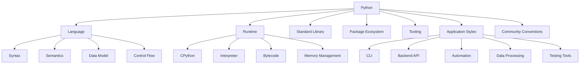
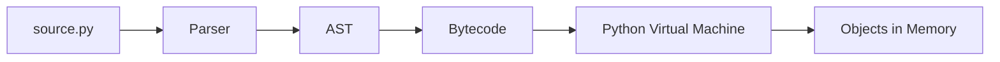
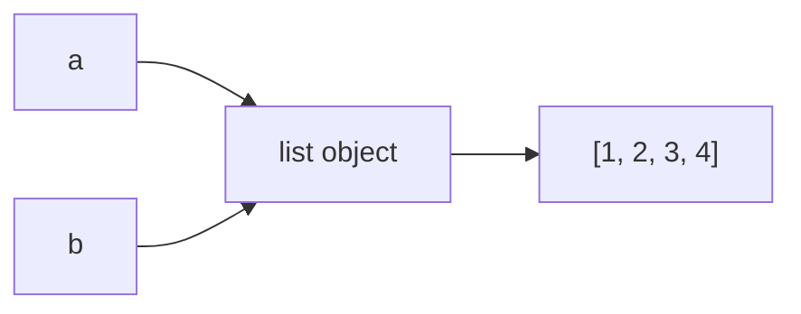
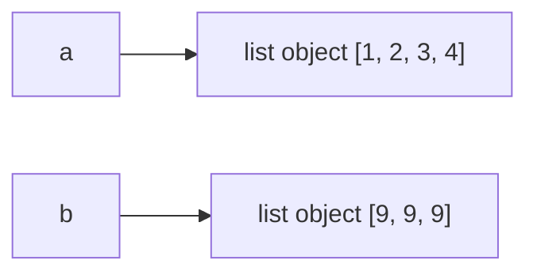
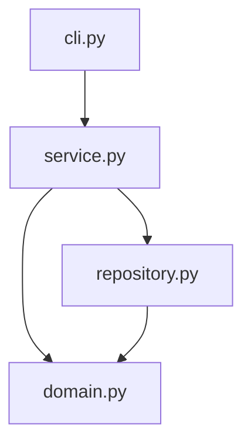
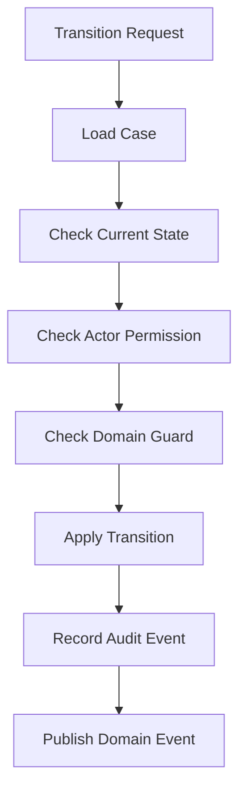
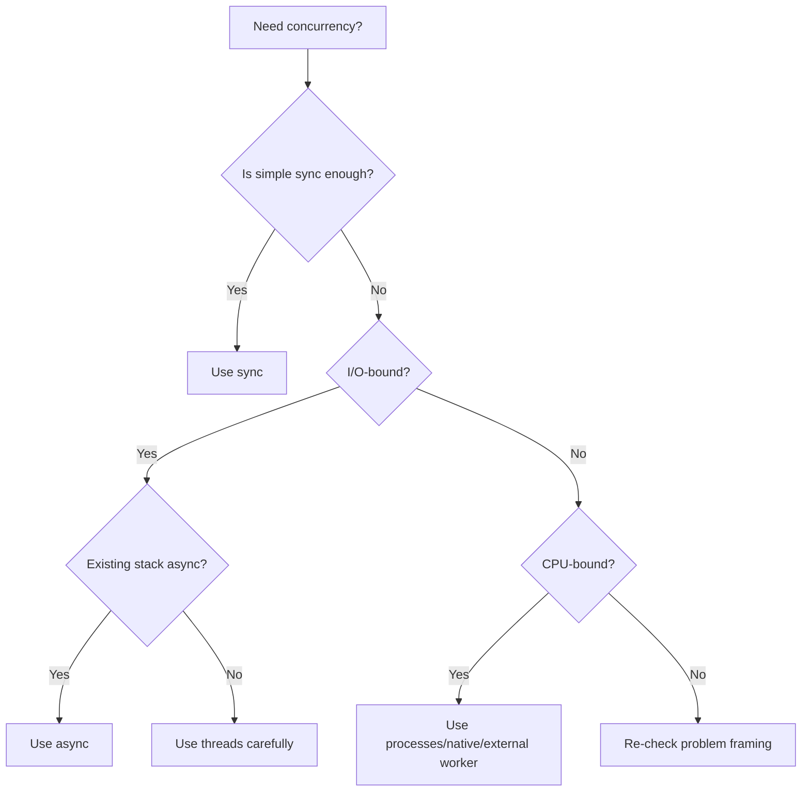
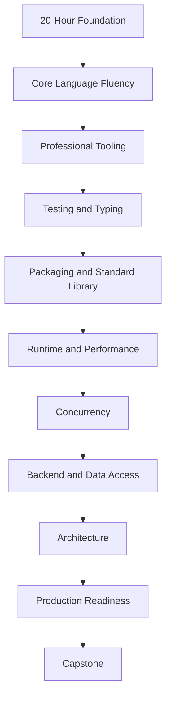

# Part 002 — Deconstructing Python: Dari Bahasa ke Sistem Berpikir

## 1. Tujuan Part Ini

Part ini membangun mental model.

Kita belum masuk detail syntax secara penuh. Kita akan memahami Python sebagai sistem:

- bahasa;
- runtime;
- object model;
- ekosistem;
- tooling;
- standard library;
- platform engineering;
- cara berpikir.

Software engineer yang kuat tidak belajar bahasa hanya dengan daftar fitur. Ia bertanya:

- Apa model eksekusinya?
- Bagaimana data direpresentasikan?
- Bagaimana dependency dimuat?
- Bagaimana error berjalan?
- Apa boundary natural bahasa ini?
- Apa idiom yang membuat kode mudah dipelihara?
- Apa trade-off utama?
- Bagaimana bahasa ini gagal di production?

Python terlihat sederhana karena syntax-nya ringan. Tetapi di bawahnya ada banyak mekanisme yang perlu dipahami secara bertahap.

---

## 2. Python Bukan Satu Hal

Saat orang berkata “belajar Python”, mereka bisa bermaksud banyak hal.



Kalau kamu hanya belajar syntax, kamu baru menyentuh satu bagian kecil.

---

## 3. Python sebagai Bahasa

Sebagai bahasa, Python menyediakan:

- expression;
- statement;
- function;
- class;
- module;
- exception;
- collection literal;
- comprehension;
- generator;
- decorator;
- context manager;
- async syntax;
- pattern matching;
- type annotation syntax.

Contoh:

```python
def active_case_ids(cases: list[dict]) -> list[str]:
    return [
        case["id"]
        for case in cases
        if case["status"] in {"SUBMITTED", "UNDER_REVIEW", "ESCALATED"}
    ]
```

Di permukaan, ini hanya fungsi.

Tetapi fitur yang terlibat:

- function definition;
- type annotation;
- list generic syntax;
- list comprehension;
- dictionary access;
- set literal;
- membership testing;
- return value.

Bahasa Python dirancang untuk readability. Namun readability bukan otomatis. Engineer tetap perlu memilih struktur yang baik.

---

## 4. Python sebagai Runtime

Python code tidak berjalan di ruang hampa. Ia dieksekusi oleh runtime.

Mayoritas penggunaan Python berarti CPython, implementasi referensi Python yang paling umum digunakan.

Secara kasar, prosesnya:



Model ini tidak perlu kamu kuasai detail di awal. Tetapi kamu perlu memahami konsekuensinya:

- Python bukan compiled language dalam cara yang sama seperti Go atau Rust.
- Banyak hal terjadi saat runtime.
- Import dapat menjalankan kode.
- Type hints tidak otomatis membuat runtime strict.
- Function dan class adalah object.
- Module juga object.
- Error sering muncul saat kode dieksekusi, bukan saat compile.
- Performance dipengaruhi interpreter overhead.

Contoh:

```python
def greet(name: str) -> str:
    return "Hello, " + name
```

Annotation `name: str` tidak otomatis mencegah ini:

```python
print(greet(123))
```

Kode tersebut baru gagal saat runtime ketika Python mencoba menggabungkan string dan integer.

Inilah alasan test dan type-checker penting.

---

## 5. Python sebagai Object System

Python punya prinsip penting:

> Semua data direpresentasikan sebagai object atau relasi antar-object.

Contoh:

```python
x = 10
name = "Ayu"
items = [1, 2, 3]
handler = print
```

`10`, `"Ayu"`, `[1, 2, 3]`, dan `print` adalah object.

Function juga object:

```python
def approve(case_id: str) -> None:
    print(f"Approving {case_id}")


action = approve
action("CASE-001")
```

Class juga object:

```python
class Case:
    pass


factory = Case
case = factory()
```

Konsekuensinya besar:

- function bisa dikirim sebagai argument;
- class bisa dibuat/dipilih secara dinamis;
- module bisa diinspect;
- object bisa diberi behavior melalui protocol;
- dependency injection bisa sederhana;
- terlalu banyak magic juga mudah dibuat.

Python memberi fleksibilitas besar. Engineering discipline menentukan apakah fleksibilitas itu menjadi leverage atau kekacauan.

---

## 6. Name Binding: Variable Bukan Kotak

Dalam banyak bahasa, orang sering membayangkan variable sebagai kotak yang berisi nilai.

Di Python, model yang lebih tepat:

> Nama di-bind ke object.

Contoh:

```python
a = [1, 2, 3]
b = a
b.append(4)

print(a)
```

`a` dan `b` mengarah ke object yang sama.



Jika kamu melakukan rebinding:

```python
b = [9, 9, 9]
```

Maka `b` sekarang mengarah ke object baru. `a` tetap mengarah ke list lama.



Ini menjadi penting saat:

- passing object ke function;
- membuat default argument;
- menggunakan cache;
- menyimpan state di object;
- menulis tests;
- berbagi data antar-thread;
- membuat API contract.

---

## 7. Mutability: Sumber Banyak Bug

Beberapa object bisa berubah setelah dibuat. Ini disebut mutable.

Mutable:

- `list`;
- `dict`;
- `set`;
- sebagian besar object custom.

Immutable:

- `int`;
- `float`;
- `bool`;
- `str`;
- `tuple` jika isinya immutable;
- `frozenset`;
- dataclass frozen.

Contoh mutation:

```python
statuses = ["DRAFT", "SUBMITTED"]
statuses.append("UNDER_REVIEW")
```

Contoh rebinding:

```python
status = "DRAFT"
status = "SUBMITTED"
```

Mutation mengubah object. Rebinding mengubah nama agar menunjuk ke object lain.

Bug klasik:

```python
def add_note(note: str, notes: list[str] = []) -> list[str]:
    notes.append(note)
    return notes
```

Masalahnya: default argument dievaluasi sekali saat function didefinisikan, bukan setiap kali function dipanggil.

Perbaikan:

```python
def add_note(note: str, notes: list[str] | None = None) -> list[str]:
    if notes is None:
        notes = []

    notes.append(note)
    return notes
```

Ini bukan sekadar trivia. Ini contoh bahwa Python punya runtime semantics yang perlu dipahami.

---

## 8. Python sebagai Protocol-Oriented Language

Python sering disebut mendukung duck typing:

> Jika object berperilaku seperti yang dibutuhkan, ia bisa dipakai.

Contoh:

```python
def print_all(items) -> None:
    for item in items:
        print(item)
```

Function ini tidak peduli apakah `items` adalah:

- list;
- tuple;
- set;
- generator;
- custom iterable.

Yang penting object tersebut iterable.

Ini lebih tepat dipahami sebagai protocol-oriented thinking.

Python sering menggunakan protocol informal:

- iterable protocol;
- iterator protocol;
- context manager protocol;
- sequence protocol;
- mapping protocol;
- descriptor protocol;
- async iterator protocol.

Contoh context manager:

```python
with open("cases.txt", "w", encoding="utf-8") as file:
    file.write("CASE-001")
```

`with` bekerja karena object dari `open()` mendukung context manager protocol, yaitu behavior `__enter__` dan `__exit__`.

Kamu tidak perlu menghafal semua magic method sekarang. Tetapi kamu perlu memahami bahwa banyak fitur Python berjalan karena object mengikuti protocol tertentu.

---

## 9. Python sebagai “Executable Pseudocode” — Kelebihan dan Bahayanya

Python sering terasa seperti pseudocode yang bisa dijalankan.

Contoh:

```python
for case in cases:
    if case.is_overdue():
        escalate(case)
```

Kelebihannya:

- cepat dibaca;
- cepat ditulis;
- cocok untuk business logic;
- cocok untuk automation;
- cocok untuk prototyping.

Bahayanya:

- terlalu mudah menulis logic tanpa boundary;
- terlalu mudah menumpuk side effect;
- terlalu mudah membuat script menjadi sistem kritikal tanpa architecture;
- terlalu mudah menyembunyikan kompleksitas di function kecil yang tidak diuji.

Kode yang mudah ditulis belum tentu mudah dioperasikan.

---

## 10. Python dan Dynamic Typing

Python adalah dynamically typed language.

Artinya type melekat pada object, bukan pada nama variable secara statis.

Contoh:

```python
value = 10
value = "ten"
value = ["t", "e", "n"]
```

Ini valid.

Kelebihan:

- fleksibel;
- cepat untuk prototyping;
- mudah membuat generic behavior;
- tidak banyak ceremony.

Risiko:

- contract antar function bisa kabur;
- refactor bisa berbahaya;
- bug type muncul saat runtime;
- onboarding codebase besar lebih sulit;
- IDE/static tooling butuh annotation untuk akurasi.

Modern Python mengatasi sebagian risiko dengan type hints.

```python
def transition_case(case_id: str, target_status: str) -> None:
    ...
```

Tetapi type hints bukan runtime enforcement secara default.

Untuk production system, strategi yang sehat:

- gunakan type hints di public boundary;
- gunakan type hints di domain model;
- gunakan type-checker;
- jangan mengejar 100% typing di area yang belum stabil;
- jangan memakai `Any` sebagai pelarian permanen;
- gunakan tests untuk runtime behavior.

---

## 11. Python sebagai Standard Library Platform

Python punya standard library besar. Ini salah satu alasan Python produktif.

Beberapa modul penting:

| Modul | Fungsi |
|---|---|
| `pathlib` | Path file system modern |
| `datetime` | Date/time |
| `zoneinfo` | Time zone database |
| `json` | JSON serialization |
| `csv` | CSV processing |
| `sqlite3` | SQLite embedded database |
| `logging` | Logging |
| `argparse` | CLI argument parsing |
| `subprocess` | Menjalankan process |
| `concurrent.futures` | Thread/process pool |
| `contextlib` | Context manager utilities |
| `functools` | Higher-order function utilities |
| `collections` | Specialized containers |
| `dataclasses` | Data class generation |
| `enum` | Enumerations |
| `typing` | Type hints |

Engineering rule:

> Jangan menambah dependency eksternal sebelum mengecek apakah standard library cukup.

Ini bukan anti-library. Ini dependency discipline.

Setiap dependency eksternal membawa:

- version risk;
- security risk;
- transitive dependency;
- upgrade cost;
- operational compatibility;
- license concern;
- supply-chain surface.

---

## 12. Python sebagai Ecosystem

Di luar standard library, Python punya ekosistem besar:

- web/API: FastAPI, Django, Flask, Starlette;
- data: pandas, NumPy, Polars;
- testing: pytest, Hypothesis;
- packaging: build, hatch, poetry, uv;
- linting/formatting: Ruff, Black;
- typing: mypy, pyright;
- validation: Pydantic;
- ORM/database: SQLAlchemy, Django ORM;
- task queue: Celery, RQ, Dramatiq;
- CLI: Typer, Click, Rich;
- observability: OpenTelemetry SDK, structlog;
- automation: invoke, nox, tox.

Kekuatan ecosystem ini luar biasa, tetapi bisa menciptakan kebingungan.

Untuk 20 jam pertama, kita hanya butuh:

- Python;
- venv;
- pip atau uv;
- pytest;
- formatter/linter dasar;
- editor yang benar.

Framework lain datang setelah fondasi kuat.

---

## 13. Python sebagai Glue Language

Python sangat kuat sebagai “glue” antar sistem.

Contoh:

- membaca file;
- memanggil HTTP API;
- menjalankan command;
- mengubah data;
- menghasilkan laporan;
- menghubungkan database ke queue;
- automation CI/CD;
- migrasi data;
- operational scripts.

Contoh pseudo-realistic:

```python
def export_overdue_cases(repository: CaseRepository, writer: CaseWriter) -> None:
    overdue_cases = repository.find_overdue_cases()

    for case in overdue_cases:
        writer.write(case)
```

Python cocok untuk glue karena syntax ringan dan ecosystem luas.

Namun glue code sering berevolusi menjadi critical system. Maka sejak awal kita harus:

- menulis test;
- membuat boundary;
- mengelola error;
- log dengan benar;
- dokumentasi asumsi;
- hindari script global yang tidak bisa diuji.

---

## 14. Python sebagai Backend Platform

Python banyak dipakai untuk backend service, terutama I/O-heavy service.

Contoh area:

- REST API;
- GraphQL API;
- internal admin tools;
- orchestration service;
- integration service;
- ML model serving;
- workflow service;
- compliance/reporting service.

Namun backend Python butuh disiplin:

- request lifecycle jelas;
- validation boundary jelas;
- domain logic tidak bercampur router;
- database transaction boundary jelas;
- timeout/retry/circuit breaker;
- logging/metrics/tracing;
- typed DTO/domain model;
- test pyramid;
- deployment config.

FastAPI bisa membuat API sangat cepat. Tetapi kecepatan membuat endpoint bukan pengganti architecture.

---

## 15. Python sebagai Data Platform

Python dominan di data ecosystem karena library seperti NumPy, pandas, Polars, PyTorch, dan lainnya.

Namun ini bukan fokus awal seri.

Kenapa?

Karena data Python sering punya mental model tambahan:

- vectorized computation;
- columnar data;
- dataframe semantics;
- native extension;
- memory layout;
- lazy execution;
- numerical stability.

Jika targetmu backend/software engineering, kuasai core Python dulu. Setelah itu, masuk data Python akan lebih mudah dan lebih aman.

---

## 16. Python sebagai Automation Layer

Automation adalah area pertama yang sering membuat Python berguna.

Contoh task:

- rename file massal;
- generate report;
- parse log;
- call API;
- create migration helper;
- generate test data;
- validate config;
- automate deployment check.

Automation code terlihat kecil, tetapi tetap punya failure mode:

- destructive file operation;
- wrong environment;
- partial execution;
- missing idempotency;
- poor logging;
- no dry-run mode;
- no rollback;
- hidden credentials;
- hardcoded paths.

Rule:

> Script yang bisa merusak data harus diperlakukan seperti production code kecil.

---

## 17. Python dan Readability

Python memiliki filosofi eksplisit terhadap readability.

Kode Python baik biasanya:

- memakai nama jelas;
- menghindari nesting berlebihan;
- menggunakan standard idiom;
- tidak overuse lambda;
- tidak overuse metaprogramming;
- memisahkan domain logic dari I/O;
- memanfaatkan exception dengan tepat;
- memakai collection dengan natural.

Contoh buruk:

```python
def f(x):
    return [i for i in x if i[2] == 1 and i[5] != "x"]
```

Contoh lebih baik:

```python
def is_actionable_case(row: CaseRow) -> bool:
    return row.status == CaseStatus.OPEN and not row.is_deleted


def actionable_cases(rows: list[CaseRow]) -> list[CaseRow]:
    return [row for row in rows if is_actionable_case(row)]
```

Pythonic code bukan berarti “satu baris”. Pythonic berarti intent terbaca.

---

## 18. Python dan Explicitness

Salah satu prinsip budaya Python adalah explicit lebih baik daripada implicit.

Namun Python juga punya banyak mekanisme implicit:

- special methods;
- decorators;
- context managers;
- descriptors;
- dataclass generation;
- framework magic;
- dependency injection framework;
- Pydantic validation;
- ORM lazy loading.

Maka prinsip engineering-nya:

> Magic boleh dipakai jika mengurangi noise tanpa menyembunyikan rule kritikal.

Contoh acceptable magic:

```python
@dataclass(frozen=True)
class CaseId:
    value: str
```

`dataclass` menghasilkan `__init__`, `__repr__`, dan equality behavior. Ini cukup eksplisit karena decorator-nya jelas.

Contoh magic yang perlu hati-hati:

```python
case.status = "CLOSED"
session.commit()
```

Jika `case` adalah ORM entity, assignment sederhana bisa memicu behavior kompleks:

- dirty tracking;
- lazy loading;
- flush;
- transaction;
- database constraint;
- event hooks.

Untuk domain-critical code, jangan biarkan magic menyembunyikan invariant.

---

## 19. Python dan Error Philosophy

Python menggunakan exception secara luas.

Contoh:

```python
def find_case(case_id: str) -> Case:
    if case_id not in cases:
        raise CaseNotFoundError(case_id)

    return cases[case_id]
```

Exception cocok untuk kondisi yang tidak bisa diproses secara normal di level tersebut.

Tetapi exception design butuh disiplin:

- jangan `except Exception` tanpa alasan jelas;
- jangan menelan error;
- jangan mengubah error menjadi `None` tanpa contract;
- jangan kehilangan traceback;
- jangan mencampur domain error dan infrastructure error;
- jangan membuat caller menebak-nebak.

Contoh buruk:

```python
def load_case(case_id: str):
    try:
        return repository.get(case_id)
    except Exception:
        return None
```

Masalah:

- database down menjadi sama dengan case tidak ditemukan;
- permission error tersembunyi;
- data corruption tersembunyi;
- observability hilang.

Contoh lebih baik:

```python
def load_case(case_id: str) -> Case:
    try:
        return repository.get(case_id)
    except RepositoryUnavailableError:
        raise
    except RecordNotFoundError as exc:
        raise CaseNotFoundError(case_id) from exc
```

Error translation harus mempertahankan makna.

---

## 20. Python dan Module Boundary

Python code diorganisasi dalam module dan package.

Contoh:

```text
case_tracker/
  domain.py
  service.py
  repository.py
  cli.py
```

Boundary sederhana:



Rule penting:

- domain tidak bergantung ke CLI;
- domain tidak bergantung ke database;
- service mengorkestrasi use case;
- repository menyembunyikan persistence;
- CLI hanya menerjemahkan input/output.

Python tidak memaksa architecture. Tidak ada compiler yang melarang import sembarangan. Maka discipline ada di engineer dan tooling.

---

## 21. Import-Time Side Effects

Salah satu jebakan Python:

> Import menjalankan top-level code.

Contoh buruk:

```python
# reports.py
print("Generating report...")
generate_report()
```

Jika file ini di-import:

```python
import reports
```

Maka report langsung dibuat.

Lebih baik:

```python
def generate_report() -> None:
    ...


if __name__ == "__main__":
    generate_report()
```

Prinsip:

- top-level module sebaiknya hanya mendefinisikan object/function/class/config ringan;
- jangan membuka koneksi database saat import kecuali sangat disengaja;
- jangan menjalankan side effect berat saat import;
- gunakan entry point yang jelas.

Ini sangat penting untuk testability.

---

## 22. Python dan Application Entry Point

Ada perbedaan antara file yang di-import dan file yang dijalankan sebagai script.

Pattern umum:

```python
def main() -> int:
    print("Hello")
    return 0


if __name__ == "__main__":
    raise SystemExit(main())
```

Kenapa `main()` mengembalikan `int`?

Karena CLI process punya exit code.

Kenapa `raise SystemExit(main())`?

Karena itu cara eksplisit mengakhiri program dengan status code.

Ini lebih baik daripada seluruh program berada di top-level file.

---

## 23. Python dan Testing Culture

Python punya testing ecosystem yang sangat kuat.

Minimal tools:

- `pytest`;
- `unittest.mock`;
- temporary file utilities;
- fixtures;
- monkeypatch;
- parametrization.

Testing di Python penting karena:

- runtime dynamic;
- type hints optional;
- refactor mudah tetapi bisa berisiko;
- framework sering punya magic;
- boundary perlu diverifikasi.

Contoh test sederhana:

```python
def test_transition_from_draft_to_submitted_is_allowed():
    case = Case(status=CaseStatus.DRAFT)

    case.transition_to(CaseStatus.SUBMITTED)

    assert case.status == CaseStatus.SUBMITTED
```

Test seperti ini bukan hanya validasi. Ini mendokumentasikan rule domain.

---

## 24. Python dan Tooling Discipline

Python ecosystem historically punya banyak tools. Ini bisa membingungkan.

Kategori tooling:

| Kategori | Contoh |
|---|---|
| Formatter | Black, Ruff formatter |
| Linter | Ruff |
| Type checker | mypy, pyright |
| Test runner | pytest |
| Package/build | build, hatch, poetry, uv |
| Environment | venv, virtualenv, uv |
| Task runner | make, nox, tox, just |
| Security | pip-audit, bandit |
| Coverage | coverage.py, pytest-cov |

Untuk awal, jangan pasang semuanya.

Baseline cukup:

- environment isolation;
- test runner;
- formatter/linter;
- type checker minimal.

Tujuan tooling bukan membuat project terlihat keren. Tujuan tooling adalah:

- mengurangi error manual;
- mempercepat feedback;
- membuat quality gate konsisten;
- mengurangi debat style;
- meningkatkan confidence saat refactor.

---

## 25. Python dan Architecture: Bahasa Tidak Menyelamatkan Desain Buruk

Python memudahkan menulis file kecil. Tetapi sistem besar tetap butuh architecture.

Contoh struktur buruk:

```text
app.py
```

Berisi:

- route API;
- validation;
- database query;
- business rule;
- logging;
- email sending;
- retry;
- serialization;
- config;
- global state.

Ini cepat di awal, lambat di masa depan.

Struktur lebih baik:

```text
src/
  case_mgmt/
    api/
      routes.py
      schemas.py
    application/
      services.py
      commands.py
    domain/
      models.py
      rules.py
      errors.py
    infrastructure/
      database.py
      repositories.py
      email.py
```

Tidak semua project butuh struktur sebesar ini. Tetapi rule-nya:

> Struktur harus tumbuh mengikuti kompleksitas, bukan mengikuti ego architecture.

---

## 26. Python dan Domain Modelling

Python bisa dipakai untuk domain modelling yang jelas.

Contoh buruk:

```python
case = {
    "id": "CASE-001",
    "status": "SUBMITTED",
    "priority": "HIGH",
}
```

Ini cukup untuk prototype. Tapi untuk domain penting, dictionary raw lemah:

- key bisa typo;
- status bisa invalid;
- invariant tersebar;
- IDE kurang membantu;
- refactor sulit.

Model lebih baik:

```python
from dataclasses import dataclass
from enum import Enum


class CaseStatus(Enum):
    DRAFT = "DRAFT"
    SUBMITTED = "SUBMITTED"
    UNDER_REVIEW = "UNDER_REVIEW"
    ESCALATED = "ESCALATED"
    CLOSED = "CLOSED"


@dataclass
class Case:
    id: str
    status: CaseStatus
    priority: str
```

Nanti kita akan memperbaiki lagi dengan value object, transition method, custom error, dan validation.

---

## 27. Python dan Workflow Modelling

Karena kamu sebagai software engineer tertarik pada state machines, escalation logic, dan case lifecycle, Python bisa menjadi bahasa yang sangat expressive untuk workflow.

Contoh transition rule:

```python
ALLOWED_TRANSITIONS = {
    CaseStatus.DRAFT: {CaseStatus.SUBMITTED},
    CaseStatus.SUBMITTED: {CaseStatus.UNDER_REVIEW},
    CaseStatus.UNDER_REVIEW: {CaseStatus.ESCALATED, CaseStatus.CLOSED},
    CaseStatus.ESCALATED: {CaseStatus.CLOSED},
    CaseStatus.CLOSED: set(),
}
```

Validasi:

```python
def can_transition(from_status: CaseStatus, to_status: CaseStatus) -> bool:
    return to_status in ALLOWED_TRANSITIONS[from_status]
```

Ini sederhana, testable, dan defensible.

Namun di sistem nyata, transition bisa bergantung pada:

- actor role;
- time window;
- evidence completeness;
- jurisdiction;
- prior decision;
- external approval;
- risk score;
- audit requirement.

Maka model berkembang:



Python cocok untuk mengekspresikan rule seperti ini selama boundary dijaga.

---

## 28. Python dan Performance Trade-Off

Python sering lebih lambat dibanding compiled languages untuk CPU-bound pure-Python loops.

Namun performance engineering tidak boleh dimulai dari asumsi kasar.

Pertanyaan yang benar:

1. Apa bottleneck sebenarnya?
2. Apakah workload CPU-bound atau I/O-bound?
3. Apakah waktu habis di database/network?
4. Apakah bisa mengurangi algorithmic complexity?
5. Apakah bisa memakai standard library/native library?
6. Apakah bisa batch operation?
7. Apakah bisa cache?
8. Apakah bisa stream data?
9. Apakah concurrency membantu atau memperburuk?
10. Apakah Python berada di hot path?

Contoh:

```python
for record in records:
    enrich(record)
    repository.save(record)
```

Jika `repository.save()` melakukan network/database call per record, bottleneck mungkin bukan Python loop, melainkan round-trip database.

Solusi mungkin batch write, bukan rewrite ke Go.

---

## 29. Python dan Concurrency Trade-Off

Python punya beberapa model concurrency:

| Model | Cocok Untuk | Catatan |
|---|---|---|
| Synchronous | Banyak aplikasi biasa | Paling sederhana |
| Threading | I/O-bound blocking tasks | Shared state perlu hati-hati |
| Async | Banyak I/O concurrent | Butuh async-compatible stack |
| Multiprocessing | CPU-bound | Serialization dan process overhead |
| Native extension | Hot numeric/CPU work | Kompleksitas build/deploy |
| External worker | Background jobs | Operational complexity |

Decision rule awal:



Jangan belajar async terlalu awal hanya karena terlihat modern. Async yang buruk lebih sulit daripada sync yang baik.

---

## 30. Python dan Security

Python code sering berinteraksi dengan:

- file system;
- shell command;
- HTTP;
- database;
- serialized data;
- user input;
- secrets;
- third-party packages.

Security baseline:

- jangan `eval()` input;
- jangan deserialize data tidak dipercaya dengan `pickle`;
- jangan build SQL pakai string interpolation;
- jangan pass user input mentah ke shell;
- validasi path;
- kelola secret di environment/secret manager;
- redact sensitive log;
- audit dependency;
- pin/lock dependency;
- gunakan least privilege.

Contoh berbahaya:

```python
import os

os.system(f"cat {user_input}")
```

Lebih aman:

```python
import subprocess

subprocess.run(["cat", user_input], check=True)
```

Tetap perlu validasi path, tetapi minimal tidak memberi shell kesempatan mengeksekusi command tambahan.

---

## 31. Python dan Observability

Production Python perlu terlihat dari luar.

Minimal:

- structured logs;
- error logs dengan traceback;
- correlation/request id;
- metrics;
- health check;
- timeout logging;
- dependency call latency;
- deployment version;
- config visibility;
- audit event untuk domain penting.

Untuk sistem case management/regulatory, observability bukan hanya technical debugging. Ia juga mendukung:

- auditability;
- explainability;
- investigation;
- compliance evidence;
- operational accountability.

---

## 32. Python dan Maintainability

Maintainability Python bergantung pada beberapa kebiasaan:

1. Module kecil.
2. Function jelas.
3. Domain language eksplisit.
4. Type hints pada boundary.
5. Tests untuk rule.
6. Dependency direction dijaga.
7. Side effect diisolasi.
8. Framework tidak bocor ke domain.
9. Error taxonomy jelas.
10. Documentation dekat dengan keputusan penting.

Contoh domain leakage:

```python
from fastapi import HTTPException


def approve_case(case: Case) -> None:
    if case.status != "SUBMITTED":
        raise HTTPException(status_code=400, detail="Invalid status")
```

Masalah:

- domain layer bergantung pada FastAPI;
- rule domain bercampur HTTP response;
- sulit dipakai dari CLI/worker;
- test domain butuh framework concept.

Lebih baik:

```python
def approve_case(case: Case) -> None:
    if case.status != CaseStatus.SUBMITTED:
        raise InvalidCaseTransition(case.status, CaseStatus.APPROVED)
```

Lalu API layer menerjemahkan domain error menjadi HTTP response.

---

## 33. Python Learning Path Berdasarkan Deconstruction

Kita akan belajar Python dengan urutan berikut:



Urutan ini sengaja tidak langsung ke framework.

Framework akan lebih mudah jika kamu sudah paham:

- functions;
- type hints;
- decorators;
- imports;
- exceptions;
- async basics;
- validation;
- testing.

---

## 34. Mapping untuk Engineer dari Bahasa Lain

### 34.1 Jika Kamu dari Java/C#

Kamu mungkin terbiasa dengan:

- class sebagai default unit;
- compile-time type checking;
- interface eksplisit;
- package namespace rigid;
- dependency injection framework;
- visibility modifier;
- build tooling kuat.

Di Python:

- function sering cukup;
- protocol bisa informal;
- visibility bersifat convention;
- runtime lebih dinamis;
- type checker optional;
- dependency injection sering cukup dengan parameter;
- module boundary penting tetapi tidak dipaksa compiler.

Jangan over-classing.

### 34.2 Jika Kamu dari Go

Kamu mungkin terbiasa dengan:

- explicit error return;
- simple composition;
- interface structural;
- static binary;
- goroutine/channel;
- strict formatting;
- simple build.

Di Python:

- error utama via exception;
- interface bisa via Protocol/duck typing;
- deployment bukan single binary secara default;
- concurrency model berbeda;
- formatting/linting perlu dipilih;
- packaging lebih historis/berlapis.

Jangan memaksakan error-as-return di semua tempat.

### 34.3 Jika Kamu dari JavaScript/TypeScript

Kamu mungkin terbiasa dengan:

- event loop;
- async/await;
- package ecosystem besar;
- structural typing TypeScript;
- runtime flexibility;
- frontend/backend split.

Di Python:

- async ada tetapi tidak universal;
- type hints tidak sama dengan TypeScript;
- package/env model berbeda;
- module import behavior berbeda;
- synchronous code masih sangat umum dan sering benar.

Jangan menganggap semua I/O Python harus async.

---

## 35. Apa yang Harus Masuk Kepala Sejak Awal?

Sebelum masuk syntax detail, simpan mental model berikut:

1. Python names bind to objects.
2. Objects punya identity, type, dan value/state.
3. Mutation berbeda dari rebinding.
4. Function dan class adalah object.
5. Import menjalankan top-level module code.
6. Type hints membantu tooling, bukan runtime enforcement default.
7. Exception adalah failure propagation mechanism utama.
8. Protocol lebih penting daripada inheritance dalam banyak kasus.
9. Standard library sering cukup untuk problem awal.
10. Test dan tooling menutup risiko dynamic runtime.
11. Pythonic berarti clear, explicit, maintainable.
12. Framework tidak boleh mengambil alih domain model.
13. Performance harus diukur.
14. Async bukan default jawaban.
15. Simplicity adalah keputusan desain, bukan kekurangan desain.

---

## 36. Praktik: Jelaskan Program Python sebagai Object Graph

Ambil kode ini:

```python
statuses = ["DRAFT", "SUBMITTED"]
allowed = statuses
allowed.append("UNDER_REVIEW")

print(statuses)
```

Jawab:

1. Object apa saja yang dibuat?
2. Nama apa saja yang di-bind?
3. Apakah `statuses` dan `allowed` menunjuk object sama?
4. Kenapa output berubah?
5. Bagaimana membuat copy agar tidak berbagi object?

Perbaikan:

```python
statuses = ["DRAFT", "SUBMITTED"]
allowed = list(statuses)
allowed.append("UNDER_REVIEW")

print(statuses)
print(allowed)
```

---

## 37. Praktik: Pisahkan Domain dan I/O

Kode awal:

```python
case = {"id": "CASE-001", "status": "DRAFT"}

new_status = input("New status: ")
case["status"] = new_status

print(case)
```

Masalah:

- input bercampur domain mutation;
- status tidak divalidasi;
- tidak bisa ditest tanpa input manual;
- output langsung print.

Refactor:

```python
ALLOWED_STATUSES = {"DRAFT", "SUBMITTED", "UNDER_REVIEW", "ESCALATED", "CLOSED"}


def transition_case(case: dict, new_status: str) -> dict:
    if new_status not in ALLOWED_STATUSES:
        raise ValueError(f"Invalid status: {new_status}")

    updated_case = dict(case)
    updated_case["status"] = new_status
    return updated_case


def main() -> None:
    case = {"id": "CASE-001", "status": "DRAFT"}
    new_status = input("New status: ")
    updated_case = transition_case(case, new_status)
    print(updated_case)


if __name__ == "__main__":
    main()
```

Sekarang `transition_case()` bisa ditest tanpa CLI.

---

## 38. Praktik: Buat Import Aman

Kode buruk:

```python
# case_report.py
print("Loading cases...")
cases = load_cases_from_disk()
print(generate_report(cases))
```

Refactor:

```python
def generate_report(cases: list[dict]) -> str:
    return "\n".join(case["id"] for case in cases)


def main() -> int:
    print("Loading cases...")
    cases = load_cases_from_disk()
    print(generate_report(cases))
    return 0


if __name__ == "__main__":
    raise SystemExit(main())
```

Pertanyaan:

1. Apa yang terjadi saat module di-import?
2. Apa yang terjadi saat file dijalankan?
3. Bagian mana yang mudah ditest?
4. Bagian mana yang punya side effect?

---

## 39. Praktik: Pilih Model Data

Diberikan data:

```python
case = {
    "id": "CASE-001",
    "status": "SUBMITTED",
    "priority": "HIGH",
}
```

Buat tiga versi:

### Versi 1 — Raw Dict

```python
def is_submitted(case: dict) -> bool:
    return case["status"] == "SUBMITTED"
```

### Versi 2 — Dataclass

```python
from dataclasses import dataclass


@dataclass
class Case:
    id: str
    status: str
    priority: str


def is_submitted(case: Case) -> bool:
    return case.status == "SUBMITTED"
```

### Versi 3 — Enum + Dataclass

```python
from dataclasses import dataclass
from enum import Enum


class CaseStatus(Enum):
    DRAFT = "DRAFT"
    SUBMITTED = "SUBMITTED"
    UNDER_REVIEW = "UNDER_REVIEW"
    ESCALATED = "ESCALATED"
    CLOSED = "CLOSED"


@dataclass
class Case:
    id: str
    status: CaseStatus
    priority: str


def is_submitted(case: Case) -> bool:
    return case.status is CaseStatus.SUBMITTED
```

Bandingkan:

| Model | Kelebihan | Kekurangan |
|---|---|---|
| Dict | Cepat, fleksibel | Rentan typo, contract kabur |
| Dataclass | Lebih eksplisit | Status masih string bebas |
| Enum + Dataclass | Lebih aman dan domain-friendly | Sedikit lebih banyak struktur |

Kesimpulan:

- dict cocok untuk boundary atau data mentah;
- dataclass cocok untuk domain object sederhana;
- enum cocok untuk finite states;
- jangan over-modeling untuk script kecil;
- jangan under-modeling untuk rule penting.

---

## 40. Checklist Part 002

Pastikan kamu bisa menjawab:

1. Apa bedanya Python sebagai bahasa dan Python sebagai runtime?
2. Kenapa “everything is an object” penting?
3. Apa itu name binding?
4. Apa beda mutation dan rebinding?
5. Kenapa import bisa punya side effect?
6. Kenapa type hints bukan runtime enforcement default?
7. Apa itu protocol-oriented thinking?
8. Kenapa standard library harus dicek sebelum dependency eksternal?
9. Kenapa framework tidak boleh bocor ke domain?
10. Kapan Python cocok sebagai glue language?
11. Kapan async bukan jawaban yang tepat?
12. Kenapa testing sangat penting dalam Python?
13. Apa risiko raw dictionary untuk domain model?
14. Apa prinsip boundary sederhana untuk project Python?
15. Apa mental model paling penting sebelum lanjut ke syntax?

---

## 41. Ringkasan

Part ini membedah Python sebagai sistem, bukan hanya bahasa.

Mental model yang harus dibawa:

- Python adalah bahasa high-level dengan runtime dinamis.
- Object model adalah fondasi.
- Name binding dan mutability menentukan banyak bug.
- Protocol lebih penting daripada inheritance di banyak desain Python.
- Type hints membantu static reasoning, tetapi runtime tetap dynamic.
- Standard library adalah leverage besar.
- Ecosystem besar harus dipakai dengan dependency discipline.
- Python sangat kuat sebagai glue, backend, automation, dan domain modelling language.
- Architecture tetap tanggung jawab engineer, bukan bahasa.
- Simplicity harus dijaga secara aktif.

Part berikutnya akan masuk ke environment, toolchain, dan friction removal agar praktik Python bisa dilakukan dengan feedback loop cepat dan konsisten.

---

## 42. Referensi

- Josh Kaufman, *The First 20 Hours: How to Learn Anything... Fast*.
- Python Documentation — The Python Tutorial.
- Python Documentation — The Python Language Reference.
- Python Documentation — Data Model.
- Python Documentation — Standard Library.
- Python Packaging User Guide.
- PEP 8 — Style Guide for Python Code.
- PEP 20 — The Zen of Python.
