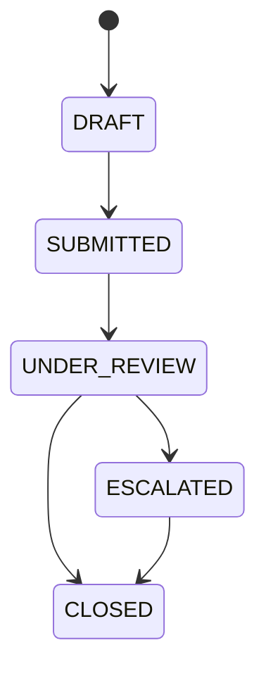
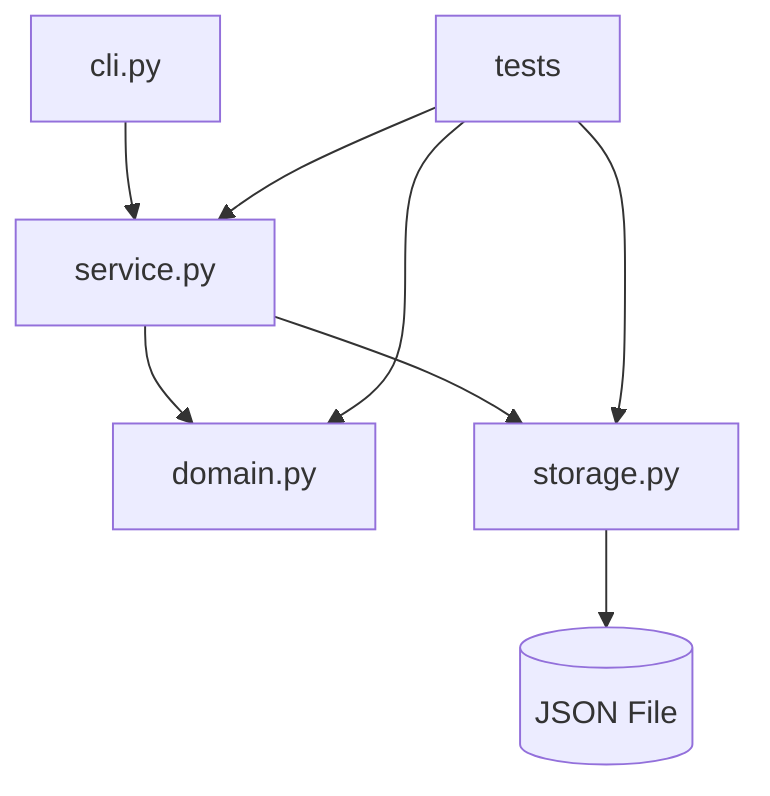
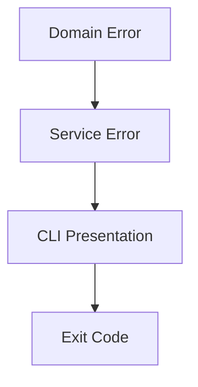

# Part 005 — First 20 Hours Practice Loop: Mini Project Pertama

## 1. Tujuan Part Ini

Part ini mengubah pembelajaran dari teori menjadi praktik.

Sampai sekarang kita sudah punya:

- kontrak belajar;
- mental model Python;
- environment;
- syntax survival.

Sekarang kita membutuhkan proyek kecil yang cukup realistis untuk melatih skill engineering, tetapi tidak terlalu besar sehingga menghambat 20 jam pertama.

Mini project kita:

> `case-tracker`: command-line application untuk membuat, melihat, dan mengubah status kasus sederhana.

Kenapa mini project ini?

Karena ia memaksa kita menyentuh aspek penting Python tanpa masuk framework besar:

- data modelling;
- function design;
- module boundary;
- validation;
- state transition;
- error handling;
- JSON persistence;
- command-line interface;
- testing;
- refactoring;
- traceback reading;
- project structure;
- tooling.

Dalam framework Kaufman, ini adalah deliberate practice:

```text
skill kecil -> praktik cepat -> error -> feedback -> perbaikan -> ulangi
```

Bukan membaca pasif.

---

## 2. Scope Mini Project

Kita akan membangun versi kecil dulu.

Fitur minimum:

1. Membuat case baru.
2. Melihat daftar case.
3. Melihat detail case.
4. Mengubah status case.
5. Menambahkan note.
6. Menyimpan data ke file JSON.
7. Membaca data dari file JSON.
8. Menolak status invalid.
9. Menolak transition invalid.
10. Menulis test untuk domain rule dan service behavior.

Bukan target awal:

- database SQL;
- FastAPI;
- authentication;
- authorization;
- multi-user concurrency;
- async;
- ORM;
- UI web;
- event sourcing penuh;
- deployment production.

Hal-hal itu nanti. Sekarang kita butuh fondasi.

---

## 3. Domain Mini Project

Kita pakai domain case lifecycle sederhana.

State:

```text
DRAFT
SUBMITTED
UNDER_REVIEW
ESCALATED
CLOSED
```

Transition:



Rule:

| From | To yang Diizinkan |
|---|---|
| `DRAFT` | `SUBMITTED` |
| `SUBMITTED` | `UNDER_REVIEW` |
| `UNDER_REVIEW` | `ESCALATED`, `CLOSED` |
| `ESCALATED` | `CLOSED` |
| `CLOSED` | tidak ada |

Contoh invalid:

- `DRAFT -> CLOSED`;
- `SUBMITTED -> CLOSED`;
- `CLOSED -> UNDER_REVIEW`;
- `ESCALATED -> SUBMITTED`.

Kenapa state machine sederhana ini bagus?

Karena ia melatih invariant.

Dalam sistem nyata, workflow bug sering bukan syntax bug. Workflow bug muncul ketika:

- transition ilegal diterima;
- state bisa dilewati tanpa audit;
- rule berubah tapi test tidak menangkap;
- status direpresentasikan sebagai string bebas;
- side effect terjadi sebelum validasi;
- retry membuat transition ganda;
- close case tidak idempotent.

Mini project ini memperkenalkan pola itu secara kecil.

---

## 4. Target 20 Jam Pertama dalam Project

Target bukan membuat aplikasi sempurna.

Target 20 jam:

| Area | Target |
|---|---|
| CLI | Bisa menjalankan command dasar |
| Domain | Case punya status dan transition rule |
| Persistence | Data tersimpan sebagai JSON |
| Error | Error invalid transition jelas |
| Test | Minimal 10 test |
| Tooling | pytest dan Ruff jalan |
| Structure | Source code dipisah ke module |
| Documentation | README menjelaskan setup/run/test |
| Review | Bisa menjelaskan alur program |

Definition of Done:

```text
Saya bisa membuat case, list case, transition case, menambahkan note, menyimpan ke JSON, menjalankan test, dan menjelaskan desainnya.
```

---

## 5. Project Layout

Gunakan struktur dari part 003.

```text
case-tracker/
  pyproject.toml
  README.md
  .gitignore
  src/
    case_tracker/
      __init__.py
      __main__.py
      cli.py
      domain.py
      storage.py
      service.py
  tests/
    test_domain.py
    test_service.py
    test_storage.py
```

Boundary:



Rule dependency:

- `domain.py` tidak import `cli.py`;
- `domain.py` tidak import `storage.py`;
- `service.py` boleh mengorkestrasi domain dan storage;
- `cli.py` hanya menerjemahkan command-line input menjadi service call;
- `storage.py` hanya menangani persistence;
- tests boleh mengakses semua layer sesuai kebutuhan.

---

## 6. Development Plan per Jam

Rencana ini tidak kaku, tetapi membantu menjaga scope.

| Jam | Fokus | Output |
|---:|---|---|
| 1 | Baseline project | Struktur folder, `pyproject.toml`, smoke test |
| 2 | Domain status | `CaseStatus`, allowed transitions |
| 3 | Case model | `Case`, `Note`, factory function |
| 4 | Domain validation | Invalid status/transition error |
| 5 | Domain tests | Test transition valid/invalid |
| 6 | Storage JSON | Save/load cases |
| 7 | Storage tests | Temporary file tests |
| 8 | Service create/list | Service layer awal |
| 9 | Service transition | Transition use case |
| 10 | Service note | Add note use case |
| 11 | CLI create/list | argparse dasar |
| 12 | CLI transition/note | Command tambahan |
| 13 | Error presentation | User-friendly CLI error |
| 14 | Refactor module | Bersihkan boundary |
| 15 | Type hints | Tambahkan annotations konsisten |
| 16 | Edge cases | Missing file, empty store, duplicate id |
| 17 | Test expansion | Minimal 10–15 test |
| 18 | Tooling | Ruff, format, check |
| 19 | README | Setup/run/test/examples |
| 20 | Review | Self-assessment dan improvement list |

Setiap sesi harus menghasilkan kode yang bisa dijalankan.

---

## 7. Baseline `pyproject.toml`

Gunakan baseline berikut.

```toml
[project]
name = "case-tracker"
version = "0.1.0"
description = "A small CLI case tracker for learning Python engineering fundamentals."
readme = "README.md"
requires-python = ">=3.12"
dependencies = []

[project.scripts]
case-tracker = "case_tracker.cli:main"

[dependency-groups]
dev = [
    "pytest",
    "ruff",
]

[tool.pytest.ini_options]
testpaths = ["tests"]
pythonpath = ["src"]

[tool.ruff]
line-length = 100
target-version = "py312"

[tool.ruff.lint]
select = [
    "E",
    "F",
    "I",
    "B",
    "UP",
    "SIM",
]
```

Jika tool yang kamu pakai belum mendukung `[dependency-groups]`, tidak masalah. Untuk belajar awal, kamu tetap bisa install:

```bash
python -m pip install -e .
python -m pip install pytest ruff
```

Yang penting workflow jalan.

---

## 8. Domain Layer Versi Awal

Buat:

```text
src/case_tracker/domain.py
```

Isi awal:

```python
from dataclasses import dataclass, field
from enum import Enum
from uuid import uuid4


class CaseStatus(Enum):
    DRAFT = "DRAFT"
    SUBMITTED = "SUBMITTED"
    UNDER_REVIEW = "UNDER_REVIEW"
    ESCALATED = "ESCALATED"
    CLOSED = "CLOSED"


ALLOWED_TRANSITIONS: dict[CaseStatus, set[CaseStatus]] = {
    CaseStatus.DRAFT: {CaseStatus.SUBMITTED},
    CaseStatus.SUBMITTED: {CaseStatus.UNDER_REVIEW},
    CaseStatus.UNDER_REVIEW: {CaseStatus.ESCALATED, CaseStatus.CLOSED},
    CaseStatus.ESCALATED: {CaseStatus.CLOSED},
    CaseStatus.CLOSED: set(),
}


class InvalidCaseTransitionError(Exception):
    def __init__(self, from_status: CaseStatus, to_status: CaseStatus) -> None:
        super().__init__(f"Cannot transition case from {from_status.value} to {to_status.value}")
        self.from_status = from_status
        self.to_status = to_status


@dataclass
class Case:
    id: str
    title: str
    status: CaseStatus = CaseStatus.DRAFT
    notes: list[str] = field(default_factory=list)

    def transition_to(self, target_status: CaseStatus) -> None:
        allowed_targets = ALLOWED_TRANSITIONS[self.status]

        if target_status not in allowed_targets:
            raise InvalidCaseTransitionError(self.status, target_status)

        self.status = target_status

    def add_note(self, note: str) -> None:
        normalized_note = note.strip()

        if not normalized_note:
            raise ValueError("Note cannot be empty")

        self.notes.append(normalized_note)


def create_case(title: str) -> Case:
    normalized_title = title.strip()

    if not normalized_title:
        raise ValueError("Case title cannot be empty")

    return Case(
        id=f"CASE-{uuid4()}",
        title=normalized_title,
    )
```

### 8.1 Hal Penting di Kode Ini

#### Enum untuk finite state

```python
class CaseStatus(Enum):
    DRAFT = "DRAFT"
```

Kita tidak memakai string bebas karena status adalah finite set.

#### Transition table

```python
ALLOWED_TRANSITIONS
```

Rule diletakkan sebagai data. Ini mudah dibaca, diuji, dan divisualisasikan.

#### Custom exception

```python
class InvalidCaseTransitionError(Exception):
```

Invalid transition adalah domain error, bukan sekadar `ValueError` umum.

#### `field(default_factory=list)`

Ini penting.

Jangan tulis:

```python
notes: list[str] = []
```

Karena mutable default bisa dibagi antar instance. Dengan `default_factory=list`, setiap `Case` mendapat list baru.

#### Method melakukan mutation

```python
self.status = target_status
```

Untuk project awal, mutable entity acceptable. Nanti kita akan bahas immutable modelling dan trade-off-nya.

---

## 9. Domain Tests

Buat:

```text
tests/test_domain.py
```

Isi:

```python
import pytest

from case_tracker.domain import Case, CaseStatus, InvalidCaseTransitionError, create_case


def test_new_case_starts_as_draft():
    case = create_case("Late reporting")

    assert case.status is CaseStatus.DRAFT


def test_case_title_cannot_be_empty():
    with pytest.raises(ValueError, match="Case title cannot be empty"):
        create_case("   ")


def test_can_transition_from_draft_to_submitted():
    case = Case(id="CASE-001", title="Late reporting")

    case.transition_to(CaseStatus.SUBMITTED)

    assert case.status is CaseStatus.SUBMITTED


def test_cannot_transition_from_draft_to_closed():
    case = Case(id="CASE-001", title="Late reporting")

    with pytest.raises(InvalidCaseTransitionError):
        case.transition_to(CaseStatus.CLOSED)


def test_can_add_note():
    case = Case(id="CASE-001", title="Late reporting")

    case.add_note("Created during intake")

    assert case.notes == ["Created during intake"]


def test_note_cannot_be_empty():
    case = Case(id="CASE-001", title="Late reporting")

    with pytest.raises(ValueError, match="Note cannot be empty"):
        case.add_note("   ")


def test_cases_do_not_share_notes():
    first = Case(id="CASE-001", title="First")
    second = Case(id="CASE-002", title="Second")

    first.add_note("Only first")

    assert first.notes == ["Only first"]
    assert second.notes == []
```

Jalankan:

```bash
python -m pytest tests/test_domain.py
```

### 9.1 Kenapa Test `test_cases_do_not_share_notes()` Penting?

Karena ia menangkap bug mutable default.

Jika kamu salah menulis model seperti ini:

```python
@dataclass
class Case:
    notes: list[str] = []
```

Python/dataclass akan menolak beberapa mutable default, tetapi konsepnya tetap penting. Di banyak situasi lain, shared mutable default bisa lolos dan menjadi bug serius.

Test ini mengunci invariant:

> Notes milik satu case tidak boleh bocor ke case lain.

---

## 10. Serialization: Domain Object ke JSON

JSON tidak tahu apa itu `Enum` atau `dataclass`. Kita perlu mapping.

Tambahkan ke `domain.py`:

```python
def case_to_dict(case: Case) -> dict:
    return {
        "id": case.id,
        "title": case.title,
        "status": case.status.value,
        "notes": list(case.notes),
    }


def case_from_dict(data: dict) -> Case:
    return Case(
        id=data["id"],
        title=data["title"],
        status=CaseStatus(data["status"]),
        notes=list(data.get("notes", [])),
    )
```

### 10.1 Kenapa Mapping Manual?

Untuk project kecil, mapping manual lebih jelas.

Alternatif seperti Pydantic atau dataclass serialization library bisa membantu, tetapi di 20 jam pertama kita ingin memahami boundary.

Manual mapping membuat kamu sadar:

- domain model tidak sama dengan JSON representation;
- enum harus dikonversi;
- list harus dicopy;
- field missing perlu keputusan;
- backward compatibility nanti perlu dipikirkan.

### 10.2 Test Serialization

Tambahkan:

```python
from case_tracker.domain import case_from_dict, case_to_dict


def test_case_can_round_trip_through_dict():
    case = Case(
        id="CASE-001",
        title="Late reporting",
        status=CaseStatus.SUBMITTED,
        notes=["Created"],
    )

    data = case_to_dict(case)
    restored = case_from_dict(data)

    assert restored == case
```

---

## 11. Storage Layer

Buat:

```text
src/case_tracker/storage.py
```

Isi:

```python
import json
from pathlib import Path

from case_tracker.domain import Case, case_from_dict, case_to_dict


def load_cases(path: Path) -> list[Case]:
    if not path.exists():
        return []

    raw_content = path.read_text(encoding="utf-8")

    if not raw_content.strip():
        return []

    data = json.loads(raw_content)
    return [case_from_dict(item) for item in data]


def save_cases(path: Path, cases: list[Case]) -> None:
    data = [case_to_dict(case) for case in cases]
    path.write_text(json.dumps(data, indent=2), encoding="utf-8")
```

### 11.1 Boundary Design

`storage.py` melakukan:

- membaca file;
- menulis file;
- JSON parse;
- JSON dump;
- mapping ke/dari domain.

Ia tidak melakukan:

- validasi transition;
- interpretasi command;
- printing;
- user input;
- business workflow.

### 11.2 Missing File

Jika file belum ada, `load_cases()` mengembalikan list kosong.

Ini domain decision kecil:

- missing file bukan error;
- artinya store kosong.

Untuk production system, keputusan ini perlu eksplisit. Untuk CLI belajar, ini cukup.

---

## 12. Storage Tests

Buat:

```text
tests/test_storage.py
```

Isi:

```python
from case_tracker.domain import Case, CaseStatus
from case_tracker.storage import load_cases, save_cases


def test_load_cases_returns_empty_list_when_file_does_not_exist(tmp_path):
    path = tmp_path / "cases.json"

    assert load_cases(path) == []


def test_save_and_load_cases(tmp_path):
    path = tmp_path / "cases.json"
    cases = [
        Case(
            id="CASE-001",
            title="Late reporting",
            status=CaseStatus.SUBMITTED,
            notes=["Created"],
        )
    ]

    save_cases(path, cases)
    loaded_cases = load_cases(path)

    assert loaded_cases == cases
```

`tmp_path` adalah pytest fixture yang menyediakan temporary directory.

Keuntungannya:

- test tidak mencemari working directory;
- test isolated;
- test bisa dijalankan berulang;
- path unik per test.

---

## 13. Service Layer

Service layer mengorkestrasi use case.

Buat:

```text
src/case_tracker/service.py
```

Isi:

```python
from pathlib import Path

from case_tracker.domain import Case, CaseStatus, create_case
from case_tracker.storage import load_cases, save_cases


class CaseNotFoundError(Exception):
    def __init__(self, case_id: str) -> None:
        super().__init__(f"Case not found: {case_id}")
        self.case_id = case_id


class DuplicateCaseIdError(Exception):
    def __init__(self, case_id: str) -> None:
        super().__init__(f"Duplicate case id: {case_id}")
        self.case_id = case_id


def list_cases(path: Path) -> list[Case]:
    return load_cases(path)


def get_case(path: Path, case_id: str) -> Case:
    cases = load_cases(path)

    for case in cases:
        if case.id == case_id:
            return case

    raise CaseNotFoundError(case_id)


def create_new_case(path: Path, title: str) -> Case:
    cases = load_cases(path)
    case = create_case(title)
    cases.append(case)
    save_cases(path, cases)
    return case


def transition_case(path: Path, case_id: str, target_status: CaseStatus) -> Case:
    cases = load_cases(path)

    for case in cases:
        if case.id == case_id:
            case.transition_to(target_status)
            save_cases(path, cases)
            return case

    raise CaseNotFoundError(case_id)


def add_case_note(path: Path, case_id: str, note: str) -> Case:
    cases = load_cases(path)

    for case in cases:
        if case.id == case_id:
            case.add_note(note)
            save_cases(path, cases)
            return case

    raise CaseNotFoundError(case_id)
```

### 13.1 Kenapa Service Layer?

Karena use case berbeda dari domain object.

Domain object tahu:

- status saat ini;
- transition valid;
- notes;
- invariant internal.

Service tahu:

- data di-load dari mana;
- case mana yang dicari;
- kapan save dilakukan;
- error jika case tidak ditemukan.

Ini memisahkan domain rule dari orchestration.

### 13.2 Trade-off

Untuk project kecil, service ini mungkin terasa “terlalu banyak layer”. Itu normal.

Tetapi kita sengaja melatih boundary karena tujuan seri ini engineering-level, bukan script tercepat.

---

## 14. Service Tests

Buat:

```text
tests/test_service.py
```

Isi:

```python
import pytest

from case_tracker.domain import CaseStatus
from case_tracker.service import (
    CaseNotFoundError,
    add_case_note,
    create_new_case,
    get_case,
    list_cases,
    transition_case,
)


def test_create_new_case_persists_case(tmp_path):
    path = tmp_path / "cases.json"

    created = create_new_case(path, "Late reporting")

    cases = list_cases(path)

    assert len(cases) == 1
    assert cases[0] == created


def test_get_case_returns_matching_case(tmp_path):
    path = tmp_path / "cases.json"
    created = create_new_case(path, "Late reporting")

    found = get_case(path, created.id)

    assert found == created


def test_get_case_raises_when_missing(tmp_path):
    path = tmp_path / "cases.json"

    with pytest.raises(CaseNotFoundError):
        get_case(path, "CASE-MISSING")


def test_transition_case_persists_new_status(tmp_path):
    path = tmp_path / "cases.json"
    created = create_new_case(path, "Late reporting")

    transition_case(path, created.id, CaseStatus.SUBMITTED)

    found = get_case(path, created.id)
    assert found.status is CaseStatus.SUBMITTED


def test_add_case_note_persists_note(tmp_path):
    path = tmp_path / "cases.json"
    created = create_new_case(path, "Late reporting")

    add_case_note(path, created.id, "Created during intake")

    found = get_case(path, created.id)
    assert found.notes == ["Created during intake"]
```

Sekarang jalankan semua test:

```bash
python -m pytest
```

---

## 15. CLI Layer

Untuk CLI awal, gunakan standard library `argparse`.

Buat:

```text
src/case_tracker/cli.py
```

Isi:

```python
import argparse
from pathlib import Path

from case_tracker.domain import CaseStatus, InvalidCaseTransitionError
from case_tracker.service import (
    CaseNotFoundError,
    add_case_note,
    create_new_case,
    list_cases,
    transition_case,
)


DEFAULT_STORE_PATH = Path("cases.json")


def build_parser() -> argparse.ArgumentParser:
    parser = argparse.ArgumentParser(prog="case-tracker")
    parser.add_argument(
        "--store",
        type=Path,
        default=DEFAULT_STORE_PATH,
        help="Path to the JSON case store.",
    )

    subparsers = parser.add_subparsers(dest="command", required=True)

    create_parser = subparsers.add_parser("create", help="Create a new case.")
    create_parser.add_argument("title")

    subparsers.add_parser("list", help="List cases.")

    transition_parser = subparsers.add_parser("transition", help="Transition a case.")
    transition_parser.add_argument("case_id")
    transition_parser.add_argument("status")

    note_parser = subparsers.add_parser("note", help="Add a note to a case.")
    note_parser.add_argument("case_id")
    note_parser.add_argument("note")

    return parser


def main() -> int:
    parser = build_parser()
    args = parser.parse_args()

    try:
        if args.command == "create":
            case = create_new_case(args.store, args.title)
            print(f"Created {case.id}: {case.title}")
            return 0

        if args.command == "list":
            cases = list_cases(args.store)
            for case in cases:
                print(f"{case.id} [{case.status.value}] {case.title}")
            return 0

        if args.command == "transition":
            target_status = CaseStatus(args.status.upper())
            case = transition_case(args.store, args.case_id, target_status)
            print(f"{case.id} transitioned to {case.status.value}")
            return 0

        if args.command == "note":
            case = add_case_note(args.store, args.case_id, args.note)
            print(f"Added note to {case.id}")
            return 0

    except ValueError as error:
        print(f"Invalid input: {error}")
        return 1
    except CaseNotFoundError as error:
        print(error)
        return 1
    except InvalidCaseTransitionError as error:
        print(error)
        return 1

    parser.error("Unknown command")
    return 2
```

`__main__.py`:

```python
from case_tracker.cli import main

raise SystemExit(main())
```

Jalankan:

```bash
python -m case_tracker create "Late reporting"
python -m case_tracker list
```

Jika sudah editable install:

```bash
case-tracker create "Late reporting"
case-tracker list
```

---

## 16. CLI Examples

### 16.1 Create

```bash
python -m case_tracker create "Late reporting"
```

Output:

```text
Created CASE-...: Late reporting
```

### 16.2 List

```bash
python -m case_tracker list
```

Output:

```text
CASE-... [DRAFT] Late reporting
```

### 16.3 Transition

```bash
python -m case_tracker transition CASE-... SUBMITTED
```

Output:

```text
CASE-... transitioned to SUBMITTED
```

### 16.4 Add Note

```bash
python -m case_tracker note CASE-... "Initial intake completed"
```

Output:

```text
Added note to CASE-...
```

### 16.5 Custom Store Path

```bash
python -m case_tracker --store /tmp/cases.json create "Late reporting"
python -m case_tracker --store /tmp/cases.json list
```

Custom store path berguna untuk test manual tanpa mencemari file default.

---

## 17. CLI Test Minimal

CLI lebih sulit dites karena melibatkan parsing argument dan output. Untuk awal, jangan over-invest. Fokus test domain dan service dulu.

Namun `build_parser()` bisa dites sederhana.

```python
from pathlib import Path

from case_tracker.cli import build_parser


def test_parser_accepts_create_command():
    parser = build_parser()

    args = parser.parse_args(["--store", "test.json", "create", "Late reporting"])

    assert args.store == Path("test.json")
    assert args.command == "create"
    assert args.title == "Late reporting"
```

Nanti kita bisa test `main()` dengan monkeypatch, tetapi jangan membuat 20 jam pertama terlalu berat.

---

## 18. Error Handling Strategy

Layer error:



Contoh:

- `InvalidCaseTransitionError` muncul dari domain.
- `CaseNotFoundError` muncul dari service.
- CLI menangkap dan menampilkan pesan.
- CLI mengembalikan exit code `1`.

Rule:

- Domain tidak print.
- Service tidak print.
- Storage tidak print.
- CLI boleh print.
- Lower layer raise error.
- Boundary layer menerjemahkan error ke user-facing output.

---

## 19. Data File Example

Setelah beberapa command, `cases.json` bisa terlihat seperti:

```json
[
  {
    "id": "CASE-1d581f4c-8fd9-4d8f-b5ce-c5bfc1f1a81b",
    "title": "Late reporting",
    "status": "SUBMITTED",
    "notes": [
      "Initial intake completed"
    ]
  }
]
```

Ini bukan format final production. Tetapi cukup untuk belajar:

- JSON serialization;
- mapping enum;
- persistence;
- file boundary;
- schema assumptions.

---

## 20. Review Code Smells dalam Mini Project

### 20.1 Domain Print

Buruk:

```python
class Case:
    def transition_to(self, target_status):
        print("Transitioning...")
```

Domain tidak seharusnya tahu output mechanism.

### 20.2 CLI Mengubah JSON Langsung

Buruk:

```python
# cli.py
data = json.loads(path.read_text())
data[0]["status"] = "SUBMITTED"
path.write_text(json.dumps(data))
```

CLI melewati domain rule.

### 20.3 Status sebagai String Bebas

Buruk:

```python
case["status"] = "whatever"
```

Lebih baik enum dan validation.

### 20.4 Error Ditelan

Buruk:

```python
try:
    transition_case(...)
except Exception:
    print("failed")
```

Terlalu luas dan kehilangan makna.

### 20.5 Test Hanya Happy Path

Kurang:

```python
def test_can_create_case():
    ...
```

Harus ada failure path:

- empty title;
- missing case;
- invalid transition;
- empty note.

---

## 21. Practice Loop per Sesi

Setiap sesi gunakan format:

```text
1. Pilih satu target kecil.
2. Tulis test atau contoh manual.
3. Implementasi minimal.
4. Jalankan test.
5. Baca error.
6. Perbaiki.
7. Refactor.
8. Catat learning log.
```

Contoh sesi:

```markdown
## Sesi 7 — Storage JSON

Target:
- save/load cases ke JSON.

Langkah:
- buat `storage.py`;
- buat test temporary file;
- implement `load_cases`;
- implement `save_cases`.

Error:
- `TypeError: Object of type CaseStatus is not JSON serializable`.

Penyebab:
- enum tidak otomatis bisa di-dump ke JSON.

Perbaikan:
- buat `case_to_dict()` dan pakai `case.status.value`.
```

Error seperti ini adalah materi belajar utama.

---

## 22. Common Error yang Akan Muncul

### 22.1 `TypeError: Object of type CaseStatus is not JSON serializable`

Penyebab:

```python
json.dumps(case.__dict__)
```

`CaseStatus` bukan JSON primitive.

Solusi:

```python
"status": case.status.value
```

### 22.2 `ValueError: 'INVALID' is not a valid CaseStatus`

Penyebab:

```python
CaseStatus("INVALID")
```

Solusi:

- validasi input;
- tangkap `ValueError` di CLI;
- tampilkan status valid.

### 22.3 `ModuleNotFoundError`

Penyebab:

- package belum installed;
- path salah;
- environment salah.

Solusi:

```bash
python -m pip install -e .
python -m pytest
```

### 22.4 Test Mengubah File Nyata

Penyebab:

- test memakai `cases.json` default.

Solusi:

- gunakan `tmp_path`;
- inject path ke service.

### 22.5 Transition Tidak Persist

Penyebab:

- lupa `save_cases()` setelah mutation.

Solusi:

- test service harus reload data setelah transition.

---

## 23. Improving the CLI Error Message

Versi awal:

```text
Invalid input: 'WAITING' is not a valid CaseStatus
```

Lebih baik:

```text
Invalid status: WAITING. Allowed statuses: DRAFT, SUBMITTED, UNDER_REVIEW, ESCALATED, CLOSED
```

Tambahkan helper:

```python
def parse_case_status(raw_status: str) -> CaseStatus:
    normalized_status = raw_status.strip().upper()

    try:
        return CaseStatus(normalized_status)
    except ValueError as error:
        allowed = ", ".join(status.value for status in CaseStatus)
        raise ValueError(f"Invalid status: {raw_status}. Allowed statuses: {allowed}") from error
```

Gunakan di CLI:

```python
target_status = parse_case_status(args.status)
```

Ini contoh kecil error design:

- pesan jelas;
- input asli disebut;
- opsi valid ditampilkan;
- exception chaining dipertahankan.

---

## 24. README Minimal

Isi `README.md`:

```markdown
# Case Tracker

A small CLI case tracker built as a Python learning project.

## Setup

```bash
python -m venv .venv
source .venv/bin/activate
python -m pip install --upgrade pip
python -m pip install -e .
python -m pip install pytest ruff
```

## Run

```bash
python -m case_tracker create "Late reporting"
python -m case_tracker list
python -m case_tracker transition CASE-... SUBMITTED
python -m case_tracker note CASE-... "Initial intake completed"
```

## Test

```bash
python -m pytest
```

## Lint

```bash
python -m ruff check .
```

## Format

```bash
python -m ruff format .
```

## Domain Rules

Allowed transitions:

```text
DRAFT -> SUBMITTED
SUBMITTED -> UNDER_REVIEW
UNDER_REVIEW -> ESCALATED
UNDER_REVIEW -> CLOSED
ESCALATED -> CLOSED
```
```

README bukan dekorasi. README adalah interface untuk manusia.

---

## 25. Review Rubric

Setelah mini project berjalan, review dengan rubric ini.

### 25.1 Correctness

- Apakah invalid transition ditolak?
- Apakah missing case menghasilkan error?
- Apakah empty title ditolak?
- Apakah note kosong ditolak?
- Apakah status disimpan benar?
- Apakah data bisa di-load ulang?

### 25.2 Maintainability

- Apakah domain logic terpisah dari CLI?
- Apakah storage terpisah?
- Apakah function kecil dan jelas?
- Apakah nama mencerminkan domain?
- Apakah duplicate logic minim?

### 25.3 Testability

- Apakah domain bisa dites tanpa file?
- Apakah service bisa dites dengan `tmp_path`?
- Apakah CLI parsing bisa dites?
- Apakah failure path dites?

### 25.4 Operational Clarity

- Apakah error message cukup jelas?
- Apakah file path bisa dikonfigurasi?
- Apakah README cukup untuk menjalankan?
- Apakah exit code masuk akal?

### 25.5 Python Fluency

- Apakah memakai `Enum` untuk finite state?
- Apakah memakai `dataclass` dengan benar?
- Apakah menghindari mutable default?
- Apakah type hints cukup membantu?
- Apakah import direction bersih?

---

## 26. Refactoring Opportunities

Setelah versi awal selesai, jangan langsung menambah fitur. Refactor dulu.

Potensi refactor:

1. Tambahkan `CaseId` value object.
2. Tambahkan `Priority`.
3. Pisahkan parser helper.
4. Buat `CaseStore` class.
5. Buat repository protocol.
6. Ubah domain entity menjadi immutable.
7. Tambahkan audit event.
8. Tambahkan timestamp.
9. Tambahkan transition reason.
10. Tambahkan JSON schema version.

Namun jangan lakukan semua sekaligus.

Refactor rule:

> Satu refactor, satu alasan, test tetap hijau.

---

## 27. Extension Ideas Setelah 20 Jam

Jika 20 jam pertama selesai, lanjutkan fitur kecil:

### 27.1 Priority

Status priority:

```text
LOW
MEDIUM
HIGH
CRITICAL
```

Use case:

```bash
case-tracker create "Late reporting" --priority HIGH
```

### 27.2 Assignment

Field:

```text
assigned_to
```

Command:

```bash
case-tracker assign CASE-... reviewer-1
```

### 27.3 Audit Trail

Setiap transition membuat audit event:

```json
{
  "type": "CASE_TRANSITIONED",
  "from": "DRAFT",
  "to": "SUBMITTED",
  "reason": "Intake completed"
}
```

### 27.4 Search

Command:

```bash
case-tracker list --status UNDER_REVIEW
```

### 27.5 Export

Command:

```bash
case-tracker export --format csv
```

Pilih satu per satu. Jangan semua langsung.

---

## 28. 20-Hour Learning Log untuk Project

Gunakan template:

```markdown
# Learning Log — Case Tracker

## Session
Session 01

## Duration
60 minutes

## Target
Set up project and run smoke test.

## Code Written
- `pyproject.toml`
- `src/case_tracker/cli.py`
- `tests/test_smoke.py`

## Commands Run
```bash
python -m pytest
python -m ruff check .
```

## Errors
- ...

## Root Cause
- ...

## Fix
- ...

## What I Understand Better Now
- ...

## Next Session
- ...
```

Setelah 20 jam, learning log lebih berharga daripada perasaan “saya sudah belajar”.

---

## 29. Checklist Part 005

Sebelum lanjut ke part 006, pastikan kamu bisa menjawab:

1. Apa fitur minimum `case-tracker`?
2. Apa state yang tersedia?
3. Apa transition yang valid?
4. Kenapa status sebaiknya enum, bukan string bebas?
5. Apa peran `domain.py`?
6. Apa peran `storage.py`?
7. Apa peran `service.py`?
8. Apa peran `cli.py`?
9. Kenapa domain tidak boleh print?
10. Kenapa CLI tidak boleh langsung edit JSON?
11. Kenapa `tmp_path` berguna untuk test storage?
12. Kenapa enum harus dimapping ke `.value` saat JSON serialization?
13. Apa error jika case tidak ditemukan?
14. Apa error jika transition invalid?
15. Apa definition of done untuk 20 jam pertama?

---

## 30. Ringkasan

Part ini membangun mini project pertama sebagai deliberate practice.

Yang penting bukan fitur banyak. Yang penting:

- project nyata;
- feedback loop cepat;
- domain rule eksplisit;
- boundary sederhana;
- test untuk rule penting;
- error jelas;
- persistence sederhana;
- CLI sebagai interface;
- refactor bertahap.

Dengan `case-tracker`, kamu sekarang punya arena praktik untuk seluruh part berikutnya.

Part berikutnya akan membahas fondasi yang sangat penting untuk memahami bug dan desain Python: object, identity, equality, dan mutability.

---

## 31. Referensi

- Josh Kaufman, *The First 20 Hours: How to Learn Anything... Fast*.
- Python Documentation — `dataclasses`.
- Python Documentation — `enum`.
- Python Documentation — `json`.
- Python Documentation — `argparse`.
- Python Documentation — `pathlib`.
- pytest Documentation — Temporary directories and files.
