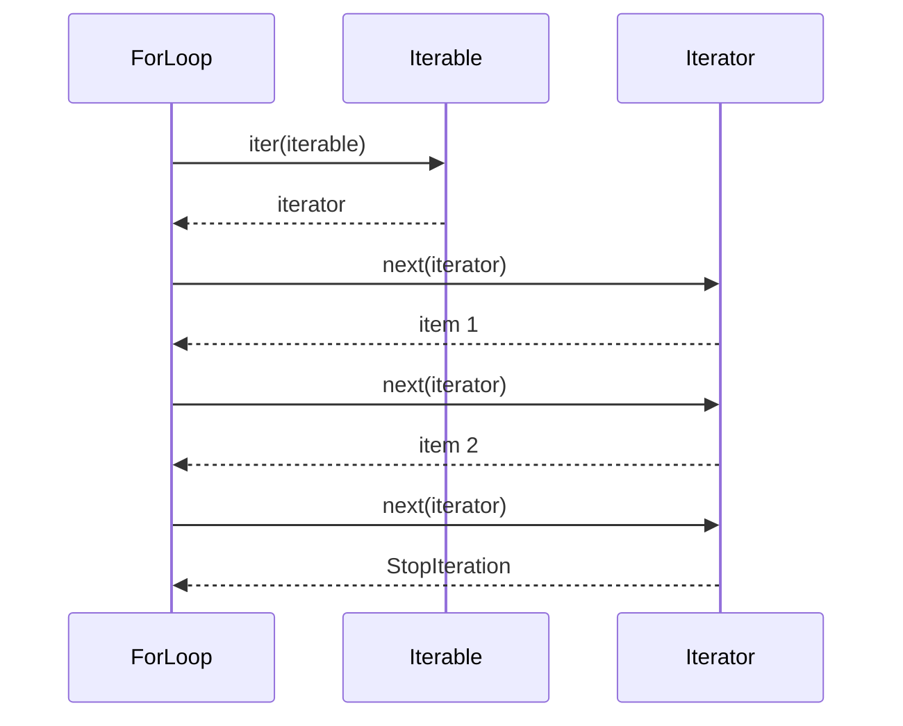

# Part 011 — Iteration, Comprehension, Generator, dan Lazy Thinking

## 1. Tujuan Part Ini

Iteration adalah salah satu pusat kekuatan Python.

Banyak kode Python yang baik tidak ditulis sebagai indeks manual:

```python
for i in range(len(cases)):
    ...
```

Tetapi sebagai operasi terhadap aliran item:

```python
for case in cases:
    ...
```

Atau sebagai transformasi:

```python
open_case_ids = [case.id for case in cases if case.is_open()]
```

Atau sebagai pipeline lazy:

```python
overdue_cases = (
    case
    for case in stream_cases()
    if case.is_overdue()
)
```

Part ini membahas cara Python memodelkan iteration:

- iterable;
- iterator;
- `iter()`;
- `next()`;
- `for` loop protocol;
- comprehension;
- generator function;
- generator expression;
- lazy evaluation;
- streaming data;
- `itertools`;
- trade-off memory dan readability.

Target setelah part ini:

1. Memahami perbedaan iterable dan iterator.
2. Bisa menjelaskan bagaimana `for` loop bekerja.
3. Bisa memakai list/dict/set comprehension dengan jelas.
4. Bisa membuat generator function.
5. Bisa memakai generator expression.
6. Bisa memilih eager vs lazy processing.
7. Bisa menghindari generator footguns.
8. Bisa membuat pipeline data sederhana.
9. Bisa menerapkan iteration model ke `case-tracker`.
10. Bisa menulis transformasi data yang readable dan memory-aware.

---

## 2. Kenapa Iteration Penting?

Banyak domain logic berbentuk:

- filter data;
- transform data;
- group data;
- aggregate data;
- stream file;
- validasi setiap item;
- mencari item pertama;
- menghentikan proses saat kondisi tertentu;
- membuat report;
- memproses batch.

Contoh:

```python
def actionable_cases(cases: list[Case]) -> list[Case]:
    return [
        case
        for case in cases
        if case.status in {CaseStatus.SUBMITTED, CaseStatus.UNDER_REVIEW, CaseStatus.ESCALATED}
    ]
```

Ini bukan hanya syntax singkat. Ini cara berpikir:

```text
input collection -> filter -> output collection
```

Python sangat kuat untuk menyatakan transformasi seperti ini.

---

## 3. Iterable vs Iterator

Dua konsep ini sering tertukar.

### 3.1 Iterable

Iterable adalah object yang bisa menghasilkan iterator.

Contoh iterable:

- `list`;
- `tuple`;
- `dict`;
- `set`;
- `str`;
- file object;
- generator object;
- custom object dengan `__iter__`.

```python
cases = ["CASE-001", "CASE-002"]

for case_id in cases:
    print(case_id)
```

`cases` adalah iterable.

### 3.2 Iterator

Iterator adalah object yang menghasilkan item satu per satu dengan `next()`.

Iterator punya:

- `__iter__()`;
- `__next__()`.

Contoh:

```python
cases = ["CASE-001", "CASE-002"]
iterator = iter(cases)

print(next(iterator))
print(next(iterator))
```

Output:

```text
CASE-001
CASE-002
```

Jika dipanggil lagi:

```python
print(next(iterator))
```

Muncul:

```text
StopIteration
```

---

## 4. `for` Loop Protocol

`for` loop kira-kira bekerja seperti ini:

```python
iterator = iter(iterable)

while True:
    try:
        item = next(iterator)
    except StopIteration:
        break

    # loop body
```

Diagram:



Ini menjelaskan kenapa banyak object bisa dipakai dalam `for`. Yang penting object tersebut iterable.

---

## 5. Iterable Bisa Diulang, Iterator Sering Sekali Pakai

List bisa diiterasi berkali-kali:

```python
cases = ["CASE-001", "CASE-002"]

for case_id in cases:
    print(case_id)

for case_id in cases:
    print(case_id)
```

Iterator bisa habis:

```python
cases = ["CASE-001", "CASE-002"]
iterator = iter(cases)

for case_id in iterator:
    print(case_id)

for case_id in iterator:
    print(case_id)
```

Loop kedua tidak mencetak apa pun karena iterator sudah exhausted.

### 5.1 Generator Juga Iterator

Generator object adalah iterator. Ia habis setelah dikonsumsi.

```python
case_ids = (case_id for case_id in ["CASE-001", "CASE-002"])

print(list(case_ids))
print(list(case_ids))
```

Output:

```text
['CASE-001', 'CASE-002']
[]
```

Ini footgun umum.

Rule:

> Jika data perlu dipakai berkali-kali, jangan simpan sebagai iterator sekali pakai kecuali memang sadar. Materialize ke list/tuple jika perlu.

---

## 6. `range` sebagai Iterable Lazy

```python
numbers = range(1_000_000)
```

`range` tidak membuat list sejuta angka. Ia menghasilkan angka sesuai kebutuhan.

```python
for number in range(3):
    print(number)
```

Output:

```text
0
1
2
```

`range` adalah contoh lazy sequence.

Gunakan:

```python
for index in range(10):
    ...
```

Tetapi jangan gunakan `range(len(items))` jika kamu hanya butuh item.

Kurang Pythonic:

```python
for i in range(len(cases)):
    print(cases[i])
```

Lebih baik:

```python
for case in cases:
    print(case)
```

Jika butuh index dan item:

```python
for index, case in enumerate(cases, start=1):
    print(index, case)
```

---

## 7. `enumerate`

`enumerate` memberi index dan item.

```python
cases = ["CASE-001", "CASE-002"]

for index, case_id in enumerate(cases, start=1):
    print(index, case_id)
```

Output:

```text
1 CASE-001
2 CASE-002
```

Gunakan `enumerate`, bukan manual counter:

```python
index = 1
for case in cases:
    print(index, case)
    index += 1
```

`enumerate` lebih jelas dan mengurangi bug.

---

## 8. `zip`

`zip` menggabungkan beberapa iterable.

```python
case_ids = ["CASE-001", "CASE-002"]
titles = ["Late reporting", "Missing evidence"]

for case_id, title in zip(case_ids, titles):
    print(case_id, title)
```

Output:

```text
CASE-001 Late reporting
CASE-002 Missing evidence
```

Hati-hati: `zip` berhenti pada iterable terpendek.

```python
list(zip([1, 2, 3], ["a"]))
```

Output:

```text
[(1, 'a')]
```

Jika panjang harus sama, gunakan `strict=True` di Python modern:

```python
for case_id, title in zip(case_ids, titles, strict=True):
    ...
```

Jika panjang berbeda, akan raise `ValueError`.

---

## 9. Basic Loop Patterns

### 9.1 Filter

```python
open_cases = []

for case in cases:
    if case.status is not CaseStatus.CLOSED:
        open_cases.append(case)
```

Comprehension:

```python
open_cases = [case for case in cases if case.status is not CaseStatus.CLOSED]
```

### 9.2 Transform

```python
case_ids = []

for case in cases:
    case_ids.append(case.id)
```

Comprehension:

```python
case_ids = [case.id for case in cases]
```

### 9.3 Find First

```python
found_case = None

for case in cases:
    if case.id == case_id:
        found_case = case
        break
```

Helper:

```python
def find_case(cases: list[Case], case_id: str) -> Case | None:
    for case in cases:
        if case.id == case_id:
            return case

    return None
```

### 9.4 Aggregate

```python
count = 0

for case in cases:
    if case.status is CaseStatus.CLOSED:
        count += 1
```

Generator expression:

```python
closed_count = sum(1 for case in cases if case.status is CaseStatus.CLOSED)
```

---

## 10. Comprehensions

Python punya beberapa comprehension:

- list comprehension;
- dict comprehension;
- set comprehension;
- generator expression.

### 10.1 List Comprehension

```python
case_ids = [case.id for case in cases]
```

Filter:

```python
active_cases = [case for case in cases if case.status is not CaseStatus.CLOSED]
```

### 10.2 Dict Comprehension

```python
case_by_id = {case.id: case for case in cases}
```

Dengan transform:

```python
status_by_case_id = {case.id: case.status for case in cases}
```

### 10.3 Set Comprehension

```python
statuses = {case.status for case in cases}
```

### 10.4 Generator Expression

```python
case_ids = (case.id for case in cases)
```

Generator expression lazy. Ia tidak membuat list langsung.

---

## 11. Kapan Comprehension Baik?

Comprehension baik jika:

- expression singkat;
- filter singkat;
- tidak ada side effect;
- tidak nested kompleks;
- intent langsung terlihat;
- output collection memang dibutuhkan.

Baik:

```python
closed_case_ids = [case.id for case in cases if case.status is CaseStatus.CLOSED]
```

Kurang baik:

```python
result = [
    render(transform(validate(case)))
    for case in cases
    if case.status in allowed and user.can_view(case) and not case.is_deleted
]
```

Lebih baik:

```python
def is_visible_actionable_case(case: Case, user: User) -> bool:
    return case.status in ACTIONABLE_STATUSES and user.can_view(case) and not case.is_deleted


result = [
    render(transform(validate(case)))
    for case in cases
    if is_visible_actionable_case(case, user)
]
```

Jika transform juga kompleks, pecah lagi.

---

## 12. Jangan Pakai Comprehension untuk Side Effect

Buruk:

```python
[print(case.id) for case in cases]
```

Ini membuat list berisi `None` hanya demi side effect.

Lebih baik:

```python
for case in cases:
    print(case.id)
```

Buruk:

```python
[repository.save(case) for case in cases]
```

Lebih baik:

```python
for case in cases:
    repository.save(case)
```

Rule:

> Comprehension untuk membuat value baru. Loop biasa untuk side effect.

---

## 13. Nested Comprehension

Bisa, tetapi hati-hati.

```python
all_notes = [note for case in cases for note in case.notes]
```

Ini berarti:

```python
all_notes = []

for case in cases:
    for note in case.notes:
        all_notes.append(note)
```

Jika nested lebih dari dua level atau ada filter kompleks, gunakan loop biasa.

Readability lebih penting daripada kependekan.

---

## 14. Generator Function

Generator function memakai `yield`.

```python
def iter_open_cases(cases: list[Case]):
    for case in cases:
        if case.status is not CaseStatus.CLOSED:
            yield case
```

Pakai:

```python
for case in iter_open_cases(cases):
    print(case.id)
```

Generator function tidak langsung menjalankan seluruh body saat dipanggil. Ia mengembalikan generator object.

```python
open_cases = iter_open_cases(cases)
```

Body berjalan saat generator diiterasi.

---

## 15. Generator Execution Model

Contoh:

```python
def numbers():
    print("start")
    yield 1
    print("middle")
    yield 2
    print("end")


items = numbers()
print("created")

print(next(items))
print(next(items))
```

Output:

```text
created
start
1
middle
2
```

`end` baru muncul jika generator dilanjutkan sampai habis.

Generator menunda eksekusi.

---

## 16. Lazy Evaluation

Lazy evaluation berarti data diproses saat dibutuhkan, bukan dibuat semua di depan.

Eager:

```python
open_cases = [case for case in cases if case.status is not CaseStatus.CLOSED]
```

Lazy:

```python
open_cases = (case for case in cases if case.status is not CaseStatus.CLOSED)
```

Atau:

```python
def iter_open_cases(cases: Iterable[Case]) -> Iterator[Case]:
    for case in cases:
        if case.status is not CaseStatus.CLOSED:
            yield case
```

### 16.1 Kapan Lazy Berguna?

Lazy berguna jika:

- data besar;
- data streaming;
- tidak semua item pasti dibutuhkan;
- pipeline terdiri dari banyak tahap;
- ingin menghemat memory;
- ingin early termination.

Contoh early termination:

```python
def first_escalated_case(cases: Iterable[Case]) -> Case | None:
    for case in cases:
        if case.status is CaseStatus.ESCALATED:
            return case

    return None
```

Tidak perlu scan setelah menemukan item pertama.

---

## 17. Eager vs Lazy Trade-Off

| Aspek | Eager List | Lazy Generator |
|---|---|---|
| Memory | Lebih besar | Lebih kecil |
| Bisa diulang | Ya | Biasanya tidak |
| Debugging | Lebih mudah lihat isi | Perlu materialize |
| Early termination | Tidak selalu | Bagus |
| Simplicity | Sering lebih sederhana | Butuh mental model |
| Side effect timing | Langsung | Saat dikonsumsi |

Rule:

- gunakan list jika data kecil dan perlu dipakai berkali-kali;
- gunakan generator jika data besar, streaming, atau pipeline;
- jangan memakai generator hanya agar terlihat advanced.

---

## 18. Generator Footgun: Deferred Errors

Karena generator lazy, error muncul saat dikonsumsi, bukan saat dibuat.

```python
def iter_status_values(cases: list[dict]):
    for case in cases:
        yield case["status"]


values = iter_status_values([{"id": "CASE-001"}])
print("generator created")
print(list(values))
```

`KeyError` muncul saat `list(values)`, bukan saat `iter_status_values(...)`.

Ini bisa membingungkan jika generator dibuat di satu tempat dan dikonsumsi jauh di tempat lain.

Rule:

> Untuk pipeline lazy, jaga jarak antara generator creation dan consumption tetap jelas.

---

## 19. Generator Footgun: One-Shot Consumption

```python
open_cases = (case for case in cases if case.status is not CaseStatus.CLOSED)

count = sum(1 for _ in open_cases)
ids = [case.id for case in open_cases]
```

`ids` akan kosong karena `open_cases` sudah habis.

Jika butuh dua kali:

```python
open_cases = [case for case in cases if case.status is not CaseStatus.CLOSED]

count = len(open_cases)
ids = [case.id for case in open_cases]
```

Atau buat generator baru dari source iterable jika source bisa diulang.

---

## 20. `yield from`

`yield from` mendelegasikan yield ke iterable lain.

```python
def iter_all_notes(cases: Iterable[Case]) -> Iterator[str]:
    for case in cases:
        yield from case.notes
```

Setara dengan:

```python
def iter_all_notes(cases: Iterable[Case]) -> Iterator[str]:
    for case in cases:
        for note in case.notes:
            yield note
```

Gunakan jika membuat flattening sederhana.

---

## 21. Type Hints untuk Iteration

Import dari `collections.abc`:

```python
from collections.abc import Iterable, Iterator, Sequence
```

### 21.1 Iterable Parameter

Jika function hanya butuh iterasi:

```python
def count_closed_cases(cases: Iterable[Case]) -> int:
    return sum(1 for case in cases if case.status is CaseStatus.CLOSED)
```

Lebih fleksibel daripada `list[Case]`.

### 21.2 Sequence Parameter

Jika butuh length atau index:

```python
from collections.abc import Sequence


def first_case(cases: Sequence[Case]) -> Case | None:
    if not cases:
        return None

    return cases[0]
```

### 21.3 Iterator Return

Generator function biasanya return `Iterator[T]`.

```python
from collections.abc import Iterator


def iter_open_cases(cases: Iterable[Case]) -> Iterator[Case]:
    for case in cases:
        if case.status is not CaseStatus.CLOSED:
            yield case
```

---

## 22. `itertools`

`itertools` adalah standard library untuk building blocks iteration.

Beberapa yang penting:

- `chain`;
- `islice`;
- `groupby`;
- `takewhile`;
- `dropwhile`;
- `product`;
- `combinations`;
- `pairwise`;
- `batched` pada versi Python modern.

### 22.1 `chain`

Gabungkan iterable:

```python
from itertools import chain

all_cases = chain(open_cases, closed_cases)
```

### 22.2 `islice`

Ambil sebagian dari iterable tanpa materialize semua.

```python
from itertools import islice

first_ten = list(islice(stream_cases(), 10))
```

### 22.3 `pairwise`

Membandingkan item bersebelahan.

```python
from itertools import pairwise

workflow = [
    CaseStatus.DRAFT,
    CaseStatus.SUBMITTED,
    CaseStatus.UNDER_REVIEW,
    CaseStatus.CLOSED,
]

for current_status, next_status in pairwise(workflow):
    print(current_status, "->", next_status)
```

### 22.4 `groupby`

`groupby` mengelompokkan item berurutan dengan key sama. Data biasanya harus disortir dulu.

```python
from itertools import groupby

sorted_cases = sorted(cases, key=lambda case: case.status.value)

for status, group in groupby(sorted_cases, key=lambda case: case.status):
    print(status, list(group))
```

Hati-hati: group adalah iterator. Jika perlu disimpan, materialize.

---

## 23. Streaming File Lines

File object iterable per line.

```python
from pathlib import Path

path = Path("cases.jsonl")

with path.open("r", encoding="utf-8") as file:
    for line in file:
        process(line)
```

Ini lebih memory-efficient daripada:

```python
lines = path.read_text(encoding="utf-8").splitlines()
```

Untuk file kecil, `read_text` OK. Untuk file besar, stream line by line.

---

## 24. JSON Lines untuk Streaming

JSON array perlu dibaca sebagai keseluruhan untuk parsing standard:

```json
[
  {"id": "CASE-001"},
  {"id": "CASE-002"}
]
```

JSON Lines menyimpan satu JSON per line:

```json
{"id": "CASE-001"}
{"id": "CASE-002"}
```

Generator:

```python
import json
from collections.abc import Iterator
from pathlib import Path


def iter_case_dicts_from_jsonl(path: Path) -> Iterator[dict]:
    with path.open("r", encoding="utf-8") as file:
        for line in file:
            if line.strip():
                yield json.loads(line)
```

Ini cocok untuk streaming data besar.

Untuk mini project awal, JSON array cukup. Tetapi untuk data besar, JSONL lebih streaming-friendly.

---

## 25. Pipeline Design

Pipeline adalah rangkaian transformasi.

```python
def iter_cases(path: Path) -> Iterator[Case]:
    for data in iter_case_dicts_from_jsonl(path):
        yield case_from_dict(data)


def iter_open_cases(cases: Iterable[Case]) -> Iterator[Case]:
    for case in cases:
        if case.status is not CaseStatus.CLOSED:
            yield case


def iter_case_ids(cases: Iterable[Case]) -> Iterator[str]:
    for case in cases:
        yield case.id
```

Compose:

```python
case_ids = iter_case_ids(iter_open_cases(iter_cases(path)))

for case_id in case_ids:
    print(case_id)
```

Diagram:


Pipeline bagus jika:

- data besar;
- tahap jelas;
- setiap stage pure-ish;
- error boundary jelas;
- consumption dekat.

Pipeline buruk jika terlalu abstrak dan sulit dilacak.

---

## 26. Sorting Breaks Laziness

Beberapa operasi membutuhkan semua data:

- sorting;
- grouping global;
- counting all;
- converting to list;
- converting to set;
- `len()` pada generator tidak bisa tanpa consuming.

Contoh:

```python
sorted_cases = sorted(iter_cases(path), key=lambda case: case.id)
```

`sorted` membaca semua item ke memory.

Itu bukan salah. Tetapi sadar bahwa laziness berhenti di situ.

---

## 27. `any` dan `all`

`any` berhenti saat menemukan truthy pertama.

```python
has_escalated = any(case.status is CaseStatus.ESCALATED for case in cases)
```

`all` berhenti saat menemukan falsy pertama.

```python
all_closed = all(case.status is CaseStatus.CLOSED for case in cases)
```

Ini lazy dan expressive.

Buruk:

```python
has_escalated = len([case for case in cases if case.status is CaseStatus.ESCALATED]) > 0
```

Lebih boros dan kurang jelas.

---

## 28. `next` dengan Default

Cari item pertama:

```python
first_escalated = next(
    (case for case in cases if case.status is CaseStatus.ESCALATED),
    None,
)
```

Ini compact dan lazy.

Untuk rule domain penting, function lebih jelas:

```python
def find_first_escalated_case(cases: Iterable[Case]) -> Case | None:
    return next(
        (case for case in cases if case.status is CaseStatus.ESCALATED),
        None,
    )
```

---

## 29. Case Tracker: Iteration Helpers

Tambahkan ke `service.py` atau module reporting:

```python
from collections.abc import Iterable, Iterator

from case_tracker.domain import Case, CaseStatus


ACTIONABLE_STATUSES = {
    CaseStatus.SUBMITTED,
    CaseStatus.UNDER_REVIEW,
    CaseStatus.ESCALATED,
}


def iter_actionable_cases(cases: Iterable[Case]) -> Iterator[Case]:
    for case in cases:
        if case.status in ACTIONABLE_STATUSES:
            yield case


def iter_case_summaries(cases: Iterable[Case]) -> Iterator[str]:
    for case in cases:
        yield f"{case.id} [{case.status.value}] {case.title}"
```

Use:

```python
for summary in iter_case_summaries(iter_actionable_cases(cases)):
    print(summary)
```

For small data, list version is also fine:

```python
def actionable_cases(cases: Iterable[Case]) -> list[Case]:
    return [case for case in cases if case.status in ACTIONABLE_STATUSES]
```

Choose intentionally.

---

## 30. Case Tracker: Find and Count

```python
def find_case(cases: Iterable[Case], case_id: str) -> Case | None:
    return next((case for case in cases if case.id == case_id), None)


def count_cases_by_status(cases: Iterable[Case], status: CaseStatus) -> int:
    return sum(1 for case in cases if case.status is status)
```

Caveat:

If `cases` is a generator, calling both functions on the same generator will consume it.

```python
case_stream = iter_cases(path)

found = find_case(case_stream, "CASE-001")
closed_count = count_cases_by_status(case_stream, CaseStatus.CLOSED)
```

`closed_count` only sees remaining cases after `find_case` stopped.

If you need multiple passes:

```python
cases = list(iter_cases(path))
```

---

## 31. Iterator Classes

Most of the time, generator functions are enough.

But custom iterator classes exist.

```python
class Countdown:
    def __init__(self, start: int) -> None:
        self.current = start

    def __iter__(self):
        return self

    def __next__(self) -> int:
        if self.current <= 0:
            raise StopIteration

        value = self.current
        self.current -= 1
        return value
```

Use:

```python
for number in Countdown(3):
    print(number)
```

Output:

```text
3
2
1
```

For application code, prefer generator function unless class state/lifecycle matters.

---

## 32. Custom Iterable Class

A custom iterable returns a new iterator each time.

```python
class CaseBook:
    def __init__(self, cases: list[Case]) -> None:
        self._cases = list(cases)

    def __iter__(self):
        return iter(self._cases)
```

Now:

```python
case_book = CaseBook(cases)

for case in case_book:
    ...

for case in case_book:
    ...
```

Both loops work because each call to `__iter__` returns a fresh iterator over list.

This differs from an iterator object that returns itself and can be exhausted.

---

## 33. Mutation During Iteration

Avoid mutating a collection while iterating over it.

Buruk:

```python
for case in cases:
    if case.status is CaseStatus.CLOSED:
        cases.remove(case)
```

Better:

```python
cases = [case for case in cases if case.status is not CaseStatus.CLOSED]
```

Or collect to remove:

```python
closed_cases = [case for case in cases if case.status is CaseStatus.CLOSED]

for case in closed_cases:
    cases.remove(case)
```

For dict:

```python
for key in list(case_by_id):
    if should_remove(key):
        del case_by_id[key]
```

Do not mutate dict size while iterating directly over it.

---

## 34. Iteration and Side Effects

Pipeline with side effects can be confusing.

```python
def iter_saved_cases(cases: Iterable[Case]) -> Iterator[Case]:
    for case in cases:
        repository.save(case)
        yield case
```

The save happens only when consumed.

```python
saved_cases = iter_saved_cases(cases)
```

Nothing saved yet.

```python
list(saved_cases)
```

Now saves happen.

This deferred side effect can surprise readers.

Rule:

> Prefer eager explicit loops for side effects. Use lazy generators primarily for value transformation/filtering.

---

## 35. Iteration in Tests

Testing generator:

```python
def test_iter_actionable_cases_returns_matching_cases():
    submitted = Case(id="CASE-001", title="Submitted", status=CaseStatus.SUBMITTED)
    closed = Case(id="CASE-002", title="Closed", status=CaseStatus.CLOSED)

    result = list(iter_actionable_cases([submitted, closed]))

    assert result == [submitted]
```

Materialize generator in tests when asserting full output.

Testing one-shot behavior:

```python
def test_generator_is_consumed_once():
    items = (item for item in [1, 2])

    assert list(items) == [1, 2]
    assert list(items) == []
```

This test is educational, not usually needed in production code.

---

## 36. Performance Notes

Iteration performance tips:

1. Prefer direct iteration over index loops.
2. Use set/dict for membership-heavy operations.
3. Use generator expressions for `sum`, `any`, `all`.
4. Avoid materializing large intermediate lists unnecessarily.
5. But do not sacrifice readability prematurely.
6. Measure before optimizing hot paths.
7. Remember database/network often dominate performance.
8. Sorting/grouping usually require materializing data.
9. Streaming can reduce memory but complicates error timing.
10. Lazy pipeline can be harder to debug if overused.

Example:

```python
closed_count = sum(1 for case in cases if case.status is CaseStatus.CLOSED)
```

Better than:

```python
closed_count = len([case for case in cases if case.status is CaseStatus.CLOSED])
```

Because the first avoids building intermediate list.

---

## 37. Practice: Iterable vs Iterator

Run:

```python
cases = ["CASE-001", "CASE-002"]
iterator = iter(cases)

print(iter(cases) is iter(cases))
print(iter(iterator) is iterator)

print(next(iterator))
print(list(iterator))
print(list(iterator))
```

Answer:

1. Why does `iter(cases) is iter(cases)` usually return `False`?
2. Why does `iter(iterator) is iterator` return `True`?
3. Why is the final list empty?
4. Which object is reusable?
5. Which object is one-shot?

---

## 38. Practice: Refactor Index Loop

Code:

```python
for i in range(len(cases)):
    print(i, cases[i].id)
```

Refactor:

```python
for index, case in enumerate(cases):
    print(index, case.id)
```

Then with human numbering:

```python
for index, case in enumerate(cases, start=1):
    print(index, case.id)
```

---

## 39. Practice: Replace List with Generator

Code:

```python
closed_cases = [case for case in cases if case.status is CaseStatus.CLOSED]
closed_count = len(closed_cases)
```

Refactor:

```python
closed_count = sum(1 for case in cases if case.status is CaseStatus.CLOSED)
```

Question:

1. Which version materializes closed cases?
2. Which version only counts?
3. Which version is clearer if you also need closed case IDs?
4. Which version uses less memory?

---

## 40. Practice: Build Case Pipeline

Implement:

```python
def iter_cases_with_notes(cases: Iterable[Case]) -> Iterator[Case]:
    ...


def iter_case_ids(cases: Iterable[Case]) -> Iterator[str]:
    ...
```

Expected:

```python
cases_with_notes = iter_cases_with_notes(cases)
case_ids = list(iter_case_ids(cases_with_notes))
```

Test:

- empty cases;
- case without notes excluded;
- case with notes included.

---

## 41. Practice: Use `any`

Implement:

```python
def has_escalated_case(cases: Iterable[Case]) -> bool:
    ...
```

Expected:

```python
return any(case.status is CaseStatus.ESCALATED for case in cases)
```

Test:

- empty input false;
- no escalated false;
- one escalated true.

---

## 42. Practice: Streaming JSONL

Create:

```python
def iter_case_dicts_from_jsonl(path: Path) -> Iterator[dict]:
    ...
```

Use:

```python
with path.open("r", encoding="utf-8") as file:
    for line in file:
        if line.strip():
            yield json.loads(line)
```

Test with `tmp_path`.

---

## 43. Self-Check

Answer without looking:

1. What is an iterable?
2. What is an iterator?
3. What does `iter()` do?
4. What does `next()` do?
5. What exception ends iteration?
6. Why can a list be iterated multiple times?
7. Why is a generator often one-shot?
8. What does `enumerate` solve?
9. What does `zip` do?
10. What does `zip(..., strict=True)` protect against?
11. When is list comprehension good?
12. Why should comprehension not be used for side effects?
13. What is a generator function?
14. What does `yield` do?
15. What is lazy evaluation?
16. What is a deferred error?
17. Why can sorting break laziness?
18. When should you materialize a generator?
19. What does `any` short-circuit?
20. Why can mutation during iteration be dangerous?

---

## 44. Definition of Done Part 011

You are done with this part if you can:

1. Explain iterable vs iterator.
2. Manually describe `for` loop protocol.
3. Use `enumerate`.
4. Use `zip` safely.
5. Write list/dict/set comprehensions.
6. Write generator expressions.
7. Write generator functions.
8. Explain one-shot consumption.
9. Explain lazy vs eager trade-off.
10. Use `any`, `all`, and `next(..., default)`.
11. Use `itertools.islice` or `chain`.
12. Stream file lines.
13. Build simple case pipeline.
14. Test a generator by materializing it.
15. Avoid comprehension for side effects.

---

## 45. Ringkasan

Iteration adalah cara Python memproses data secara natural.

Inti part ini:

- iterable menghasilkan iterator;
- iterator menghasilkan item dengan `next`;
- `StopIteration` mengakhiri iteration;
- `for` loop memakai protocol ini;
- list/tuple/dict/set/string adalah iterable;
- generator adalah iterator lazy dan one-shot;
- comprehension bagus untuk transformasi jelas;
- loop biasa lebih baik untuk side effect;
- lazy pipeline menghemat memory tetapi menunda eksekusi dan error;
- `any`, `all`, dan `next` mendukung short-circuit;
- `itertools` menyediakan building blocks powerful;
- streaming penting untuk file/data besar;
- materialize ke list jika perlu multiple passes atau debugging lebih mudah.

Part berikutnya akan membahas object-oriented Python: class, dataclass, protocol, inheritance, composition, dan bagaimana mendesain domain model tanpa menulis Python seperti Java.

---

## 46. Referensi

- Python Documentation — Iterators.
- Python Documentation — Data Structures.
- Python Documentation — Generator expressions.
- Python Documentation — `itertools`.
- Python Documentation — `collections.abc`.
- Python Tutorial — More Control Flow Tools.
