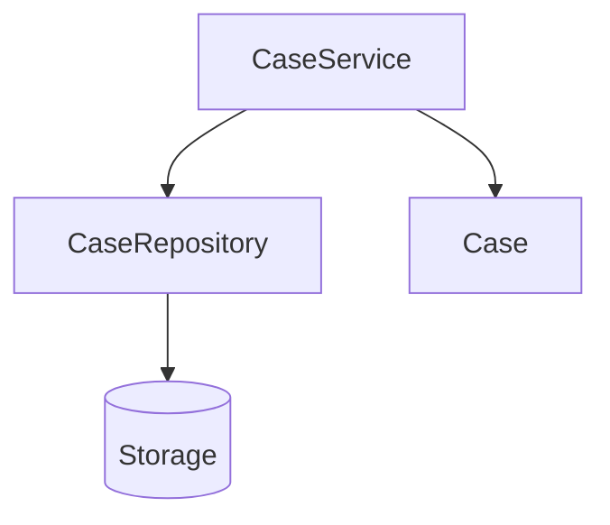

# Part 012 — Object-Oriented Python: Class, Dataclass, Protocol, dan Composition

## 1. Tujuan Part Ini

Python mendukung object-oriented programming, tetapi OOP Python tidak sama dengan OOP Java/C#.

Kesalahan umum engineer berpengalaman:

- membuat class untuk semua hal;
- membuat inheritance hierarchy terlalu awal;
- membuat getter/setter seperti Java;
- memakai abstract base class sebelum ada kebutuhan nyata;
- membuat service class stateless yang seharusnya function;
- mencampur domain entity dengan persistence framework;
- memakai dict terlalu lama padahal domain butuh invariant;
- memakai dataclass tanpa memahami equality/mutability;
- menganggap Protocol sama dengan interface tradisional;
- menulis “Python syntax, Java architecture”.

Part ini membahas OOP Python dengan fokus engineering:

- kapan function cukup;
- kapan class berguna;
- bagaimana membuat domain object;
- bagaimana memakai dataclass;
- bagaimana membedakan value object dan entity;
- bagaimana memakai composition;
- kapan inheritance masuk akal;
- bagaimana Protocol mendukung structural typing;
- bagaimana menjaga domain model tetap bersih.

Target setelah part ini:

1. Memahami class dan instance.
2. Memahami attribute dan method.
3. Memakai dataclass dengan tepat.
4. Membedakan entity dan value object.
5. Mendesain class invariant.
6. Menghindari over-inheritance.
7. Memakai composition sebagai default.
8. Memahami duck typing dan Protocol.
9. Memahami ABC secara praktis.
10. Menerapkan OOP Python ke `case-tracker`.

---

## 2. Class sebagai Template Object

Class mendefinisikan bentuk dan behavior object.

```python
class Case:
    pass
```

Membuat instance:

```python
case = Case()
```

`case` adalah instance dari `Case`.

```python
print(type(case))
```

Output:

```text
<class '__main__.Case'>
```

Dalam Python, class juga object.

```python
factory = Case
another_case = factory()
```

Ini penting karena Python sangat runtime-dynamic.

---

## 3. `__init__` dan Instance Attributes

```python
class Case:
    def __init__(self, case_id: str, title: str) -> None:
        self.id = case_id
        self.title = title
        self.status = "DRAFT"
```

Create:

```python
case = Case("CASE-001", "Late reporting")

print(case.id)
print(case.title)
print(case.status)
```

`self` adalah reference ke instance.

```python
self.id = case_id
```

Membuat/menetapkan attribute `id` pada instance.

### 3.1 `self` Eksplisit

Python mewajibkan `self` eksplisit di method definition.

```python
def transition_to(self, target_status):
    ...
```

Saat dipanggil:

```python
case.transition_to("SUBMITTED")
```

Python secara otomatis mengirim `case` sebagai `self`.

---

## 4. Methods

Method adalah function yang menjadi attribute class dan biasanya menerima `self`.

```python
class Case:
    def __init__(self, case_id: str, title: str) -> None:
        self.id = case_id
        self.title = title
        self.status = "DRAFT"

    def transition_to(self, target_status: str) -> None:
        self.status = target_status
```

Call:

```python
case = Case("CASE-001", "Late reporting")
case.transition_to("SUBMITTED")
```

Method cocok jika behavior sangat terkait dengan state object.

Jika behavior tidak memakai state instance, function biasa mungkin lebih tepat.

---

## 5. Class Attributes vs Instance Attributes

Class attribute berada di class, bukan instance.

```python
class Case:
    default_status = "DRAFT"

    def __init__(self, case_id: str, title: str) -> None:
        self.id = case_id
        self.title = title
        self.status = self.default_status
```

Access:

```python
print(Case.default_status)
print(case.default_status)
```

### 5.1 Mutable Class Attribute Trap

Buruk:

```python
class Case:
    notes = []

    def add_note(self, note: str) -> None:
        self.notes.append(note)
```

Semua instance berbagi `notes`.

```python
a = Case()
b = Case()

a.add_note("Created")

print(b.notes)
```

Output:

```text
['Created']
```

Perbaikan:

```python
class Case:
    def __init__(self) -> None:
        self.notes: list[str] = []
```

Untuk dataclass:

```python
from dataclasses import dataclass, field


@dataclass
class Case:
    notes: list[str] = field(default_factory=list)
```

---

## 6. Dataclass

Dataclass mengurangi boilerplate class yang terutama menyimpan data.

```python
from dataclasses import dataclass


@dataclass
class Case:
    id: str
    title: str
    status: str = "DRAFT"
```

Dataclass otomatis membuat:

- `__init__`;
- `__repr__`;
- `__eq__` secara default;
- behavior lain sesuai parameter.

Create:

```python
case = Case(id="CASE-001", title="Late reporting")
```

Print:

```python
print(case)
```

Output:

```text
Case(id='CASE-001', title='Late reporting', status='DRAFT')
```

### 6.1 Dataclass Bukan “Anemic Model” Secara Otomatis

Dataclass boleh punya method.

```python
@dataclass
class Case:
    id: str
    title: str
    status: CaseStatus = CaseStatus.DRAFT
    notes: list[str] = field(default_factory=list)

    def add_note(self, note: str) -> None:
        normalized_note = note.strip()

        if not normalized_note:
            raise ValueError("Note cannot be empty")

        self.notes.append(normalized_note)
```

Dataclass cocok untuk domain model sederhana, value object, DTO, config, command, dan event.

---

## 7. Dataclass Options

### 7.1 `frozen=True`

```python
@dataclass(frozen=True)
class CaseId:
    value: str
```

Mencegah assignment field:

```python
case_id.value = "OTHER"
```

Akan error.

Cocok untuk value object.

### 7.2 `eq=False`

```python
@dataclass(eq=False)
class Case:
    id: CaseId
    status: CaseStatus
```

Mematikan generated equality.

Berguna jika entity equality tidak seharusnya membandingkan semua field.

### 7.3 `slots=True`

```python
@dataclass(slots=True)
class Case:
    id: str
    title: str
```

`slots=True` bisa mengurangi memory overhead dan mencegah attribute arbitrary. Dibahas lebih dalam di memory/performance part.

Untuk awal, jangan pakai `slots` kecuali punya alasan.

### 7.4 `kw_only=True`

```python
@dataclass(kw_only=True)
class CreateCaseCommand:
    title: str
    priority: CasePriority
    assigned_to: str | None = None
```

Create:

```python
command = CreateCaseCommand(
    title="Late reporting",
    priority=CasePriority.HIGH,
)
```

Keyword-only dapat meningkatkan readability.

---

## 8. Value Object

Value object ditentukan oleh value-nya dan biasanya immutable.

Contoh:

```python
from dataclasses import dataclass


@dataclass(frozen=True)
class CaseId:
    value: str

    def __post_init__(self) -> None:
        normalized = self.value.strip()

        if not normalized:
            raise ValueError("Case id cannot be empty")

        object.__setattr__(self, "value", normalized)
```

Karena `frozen=True`, assignment normal tidak boleh. Dalam `__post_init__`, jika perlu normalisasi, gunakan `object.__setattr__`.

Namun pattern ini harus dipakai hati-hati. Alternatif: gunakan factory.

```python
@dataclass(frozen=True)
class CaseId:
    value: str


def create_case_id(raw_value: str) -> CaseId:
    normalized = raw_value.strip()

    if not normalized:
        raise ValueError("Case id cannot be empty")

    return CaseId(normalized)
```

### 8.1 Kapan Value Object Berguna?

Gunakan value object untuk:

- identifier;
- money;
- email;
- date range;
- status reason;
- regulatory reference;
- tenant id;
- external case number.

Manfaat:

- mencegah string mix-up;
- memberi tempat validasi;
- type hints lebih kuat;
- domain lebih eksplisit.

Contoh bug dengan raw string:

```python
def get_case(tenant_id: str, case_id: str) -> Case:
    ...
```

Caller bisa tertukar:

```python
get_case(case_id, tenant_id)
```

Dengan value object:

```python
def get_case(tenant_id: TenantId, case_id: CaseId) -> Case:
    ...
```

Type checker bisa membantu.

---

## 9. Entity

Entity punya identity yang bertahan meski state berubah.

```python
@dataclass(eq=False)
class Case:
    id: CaseId
    title: str
    status: CaseStatus = CaseStatus.DRAFT
    notes: list[str] = field(default_factory=list)

    def same_identity_as(self, other: "Case") -> bool:
        return self.id == other.id
```

Kenapa `eq=False`?

Karena dua snapshot case dengan id sama tetapi status berbeda mungkin tetap merepresentasikan entity yang sama.

Dataclass default equality membandingkan semua field. Itu cocok untuk value object, tetapi perlu dipertimbangkan untuk entity.

### 9.1 Mutable Entity

Case lifecycle biasanya mutable:

```python
case.transition_to(CaseStatus.SUBMITTED)
case.add_note("Submitted during intake")
```

Ini natural.

Tetapi mutable entity butuh:

- invariant dijaga method;
- state tidak diubah sembarangan dari luar;
- audit trail jika domain kritikal;
- transaction boundary;
- test failure path.

---

## 10. Encapsulation di Python

Python tidak punya private modifier yang enforced seperti Java.

Konvensi:

```python
class Case:
    def __init__(self) -> None:
        self._notes: list[str] = []
```

Prefix `_` berarti internal.

Tetapi caller masih bisa:

```python
case._notes.append("bad")
```

Python mengandalkan convention dan discipline.

### 10.1 Property

Gunakan property untuk read-only access atau computed attribute.

```python
class Case:
    def __init__(self) -> None:
        self._notes: list[str] = []

    @property
    def notes(self) -> tuple[str, ...]:
        return tuple(self._notes)

    def add_note(self, note: str) -> None:
        self._notes.append(note)
```

Sekarang caller tidak bisa append langsung ke `notes` karena mendapat tuple.

Namun jangan membuat property/getter/setter untuk semua field seperti Java.

Python style:

- public attribute OK untuk data sederhana;
- method/property jika perlu invariant, validation, computed value, atau read-only view.

---

## 11. `__post_init__`

Dataclass menyediakan `__post_init__` untuk validasi setelah generated `__init__`.

```python
@dataclass
class Case:
    id: str
    title: str

    def __post_init__(self) -> None:
        if not self.title.strip():
            raise ValueError("Case title cannot be empty")
```

Untuk normalisasi:

```python
@dataclass
class Case:
    id: str
    title: str

    def __post_init__(self) -> None:
        self.title = self.title.strip()

        if not self.title:
            raise ValueError("Case title cannot be empty")
```

Untuk frozen dataclass, assignment butuh `object.__setattr__`, atau pakai factory agar lebih jelas.

---

## 12. Class Method dan Static Method

### 12.1 Class Method

`@classmethod` menerima class sebagai `cls`.

```python
@dataclass
class Case:
    id: str
    title: str
    status: CaseStatus = CaseStatus.DRAFT

    @classmethod
    def create(cls, title: str) -> "Case":
        return cls(id=f"CASE-{uuid4()}", title=title.strip())
```

Gunakan classmethod untuk alternative constructor.

### 12.2 Static Method

`@staticmethod` tidak menerima `self` atau `cls`.

```python
class CaseId:
    @staticmethod
    def normalize(value: str) -> str:
        return value.strip().upper()
```

Namun sering function module-level lebih baik:

```python
def normalize_case_id(value: str) -> str:
    return value.strip().upper()
```

Rule:

- gunakan `classmethod` untuk constructor alternatif yang perlu `cls`;
- gunakan `staticmethod` jarang;
- function module-level sering lebih Pythonic.

---

## 13. Inheritance

Inheritance membuat class mengambil behavior dari parent.

```python
class CaseTrackerError(Exception):
    pass


class DomainError(CaseTrackerError):
    pass


class InvalidCaseTransitionError(DomainError):
    pass
```

Ini contoh inheritance yang baik: taxonomy.

Inheritance juga bisa dipakai untuk polymorphism, tetapi jangan terlalu cepat.

Buruk:

```python
class Case:
    ...


class DraftCase(Case):
    ...


class SubmittedCase(Case):
    ...


class EscalatedCase(Case):
    ...
```

Untuk state machine sederhana, enum + transition table sering lebih jelas daripada subclass per state.

### 13.1 Inheritance Smell

Waspadai:

- subclass hanya mengubah satu boolean;
- inheritance hierarchy dalam sebelum requirement stabil;
- parent class tahu terlalu banyak child;
- override method dengan behavior incompatible;
- inheritance dipakai hanya untuk code reuse;
- “is-a” relationship tidak benar.

Prefer composition by default.

---

## 14. Composition

Composition berarti object menyimpan object lain untuk membentuk behavior.

```python
class CaseService:
    def __init__(self, repository: CaseRepository) -> None:
        self._repository = repository

    def transition_case(self, case_id: CaseId, target_status: CaseStatus) -> Case:
        case = self._repository.get(case_id)
        case.transition_to(target_status)
        self._repository.save(case)
        return case
```

`CaseService` composed with `repository`.

Composition lebih fleksibel daripada inheritance.

Diagram:



Rule:

> Gunakan inheritance untuk taxonomy/substitutability. Gunakan composition untuk assembling behavior dan dependency.

---

## 15. Duck Typing

Duck typing:

> Jika object mendukung behavior yang dibutuhkan, kita bisa memakainya.

Contoh:

```python
def render_lines(lines) -> str:
    return "\n".join(lines)
```

`lines` bisa:

- list of strings;
- tuple of strings;
- generator of strings.

Function tidak peduli concrete type.

Lebih explicit dengan typing:

```python
from collections.abc import Iterable


def render_lines(lines: Iterable[str]) -> str:
    return "\n".join(lines)
```

Kita mengetik behavior, bukan implementation.

---

## 16. Protocol

`Protocol` mendefinisikan structural interface untuk type checker.

```python
from typing import Protocol


class CaseRepository(Protocol):
    def get(self, case_id: CaseId) -> Case:
        ...

    def save(self, case: Case) -> None:
        ...
```

Class tidak perlu inherit secara eksplisit.

```python
class JsonCaseRepository:
    def get(self, case_id: CaseId) -> Case:
        ...

    def save(self, case: Case) -> None:
        ...
```

Jika method cocok, type checker menganggap compatible.

Ini mirip structural typing.

### 16.1 Protocol vs ABC

Protocol bagus untuk static structural typing.

ABC bagus jika ingin nominal inheritance atau runtime checks tertentu.

---

## 17. Abstract Base Class

ABC memakai inheritance eksplisit.

```python
from abc import ABC, abstractmethod


class CaseRepository(ABC):
    @abstractmethod
    def get(self, case_id: CaseId) -> Case:
        ...

    @abstractmethod
    def save(self, case: Case) -> None:
        ...
```

Implementation:

```python
class JsonCaseRepository(CaseRepository):
    def get(self, case_id: CaseId) -> Case:
        ...

    def save(self, case: Case) -> None:
        ...
```

ABC cocok jika:

- kamu ingin nominal contract;
- runtime `isinstance` matters;
- framework membutuhkan base class;
- shared partial implementation masuk akal.

Protocol cocok jika:

- kamu ingin loose coupling;
- structural compatibility cukup;
- test fake tidak perlu inherit;
- dependency inversion tanpa ceremony.

---

## 18. Repository Protocol untuk Case Tracker

Saat service mulai kompleks, ubah dari path-based function menjadi repository dependency.

Protocol:

```python
from typing import Protocol


class CaseRepository(Protocol):
    def list(self) -> list[Case]:
        ...

    def save_all(self, cases: list[Case]) -> None:
        ...
```

Implementation:

```python
class JsonCaseRepository:
    def __init__(self, path: Path) -> None:
        self._path = path

    def list(self) -> list[Case]:
        return load_cases(self._path)

    def save_all(self, cases: list[Case]) -> None:
        save_cases(self._path, cases)
```

Service:

```python
class CaseService:
    def __init__(self, repository: CaseRepository) -> None:
        self._repository = repository

    def create_new_case(self, title: str) -> Case:
        cases = self._repository.list()
        case = create_case(title)
        cases.append(case)
        self._repository.save_all(cases)
        return case
```

Test fake:

```python
class FakeCaseRepository:
    def __init__(self, cases: list[Case] | None = None) -> None:
        self.cases = list(cases or [])

    def list(self) -> list[Case]:
        return list(self.cases)

    def save_all(self, cases: list[Case]) -> None:
        self.cases = list(cases)
```

No inheritance needed. It satisfies the Protocol structurally.

---

## 19. Service Class vs Service Functions

Current simple function:

```python
def transition_case(path: Path, case_id: str, target_status: CaseStatus) -> Case:
    cases = load_cases(path)
    ...
```

This is fine.

Service class becomes useful when:

- multiple functions share dependency;
- dependency injection matters;
- transaction boundary is explicit;
- test fake should be passed once;
- service has cohesive use cases;
- configuration is shared.

Example:

```python
class CaseService:
    def __init__(self, repository: CaseRepository) -> None:
        self._repository = repository

    def transition_case(self, case_id: CaseId, target_status: CaseStatus) -> Case:
        ...
```

Do not create class only to group static methods.

Buruk:

```python
class CaseUtils:
    @staticmethod
    def normalize_status(...):
        ...
```

Use module-level function.

---

## 20. Rich Domain Model vs Anemic Domain Model

Anemic:

```python
@dataclass
class Case:
    id: str
    status: CaseStatus
```

All rules elsewhere:

```python
def transition_case(case: Case, target: CaseStatus) -> None:
    ...
```

Rich model:

```python
@dataclass
class Case:
    id: str
    status: CaseStatus

    def transition_to(self, target: CaseStatus) -> None:
        ...
```

Which is better?

It depends.

Use rich domain model when:

- invariant belongs to entity;
- behavior is naturally tied to state;
- multiple use cases must respect same rule;
- you want illegal state transitions prevented at object level.

Use service/policy function when:

- rule depends on external dependency;
- rule is cross-entity;
- rule is application workflow;
- behavior does not belong to one object.

For `case-tracker`, `Case.transition_to()` is reasonable because transition invariant belongs to case.

---

## 21. Avoid Framework Leakage

Buruk:

```python
from fastapi import HTTPException


@dataclass
class Case:
    status: CaseStatus

    def transition_to(self, target: CaseStatus) -> None:
        if not can_transition(self.status, target):
            raise HTTPException(status_code=409)
```

Domain now depends on HTTP framework.

Better:

```python
@dataclass
class Case:
    status: CaseStatus

    def transition_to(self, target: CaseStatus) -> None:
        if not can_transition(self.status, target):
            raise InvalidCaseTransitionError(self.status, target)
```

API boundary maps:

```python
except InvalidCaseTransitionError as error:
    raise HTTPException(status_code=409, detail=str(error)) from error
```

Domain should speak domain language, not transport language.

---

## 22. Invariants

Invariant adalah kondisi yang harus selalu benar.

Contoh Case invariant:

- title tidak boleh empty;
- status harus `CaseStatus`;
- closed case tidak boleh transition lagi;
- note tidak boleh empty;
- case id tidak boleh empty.

Class method harus menjaga invariant.

```python
@dataclass
class Case:
    id: CaseId
    title: str
    status: CaseStatus = CaseStatus.DRAFT
    notes: list[str] = field(default_factory=list)

    def __post_init__(self) -> None:
        if not self.title.strip():
            raise ValueError("Case title cannot be empty")

        self.title = self.title.strip()

    def add_note(self, note: str) -> None:
        normalized = note.strip()

        if not normalized:
            raise ValueError("Note cannot be empty")

        self.notes.append(normalized)
```

Do not expose raw mutation if it bypasses invariant.

---

## 23. Read-Only Views

If notes must be added only via method:

```python
class Case:
    def __init__(self, case_id: CaseId, title: str) -> None:
        self.id = case_id
        self.title = title
        self._notes: list[str] = []

    @property
    def notes(self) -> tuple[str, ...]:
        return tuple(self._notes)

    def add_note(self, note: str) -> None:
        normalized = note.strip()

        if not normalized:
            raise ValueError("Note cannot be empty")

        self._notes.append(normalized)
```

Now caller cannot directly append to internal list via public API.

Trade-off:

- more boilerplate;
- stronger encapsulation;
- better invariant control.

For early project, public `notes: list[str]` is acceptable. For regulatory/audit-critical model, stronger encapsulation may be warranted.

---

## 24. `repr` and Debuggability

Dataclass gives useful `repr`.

```python
Case(id='CASE-001', title='Late reporting', status=<CaseStatus.DRAFT: 'DRAFT'>)
```

For custom class, implement `__repr__` if useful.

```python
class CaseId:
    def __init__(self, value: str) -> None:
        self.value = value

    def __repr__(self) -> str:
        return f"CaseId(value={self.value!r})"
```

Good `repr` helps debugging and tests.

Do not include secrets in `repr`.

---

## 25. `__str__` vs `__repr__`

`__repr__` is for developer-facing representation.

`__str__` is for user-friendly string.

```python
@dataclass(frozen=True)
class CaseId:
    value: str

    def __str__(self) -> str:
        return self.value
```

Now:

```python
case_id = CaseId("CASE-001")

print(str(case_id))
print(repr(case_id))
```

Potential output:

```text
CASE-001
CaseId(value='CASE-001')
```

For many dataclasses, default `repr` is enough.

---

## 26. Equality Control

Value object:

```python
@dataclass(frozen=True)
class CaseId:
    value: str
```

Default equality good:

```python
CaseId("CASE-001") == CaseId("CASE-001")
```

Entity:

```python
@dataclass(eq=False)
class Case:
    id: CaseId
    status: CaseStatus
```

Custom identity comparison:

```python
def same_identity_as(self, other: "Case") -> bool:
    return self.id == other.id
```

Alternative custom equality:

```python
def __eq__(self, other: object) -> bool:
    if not isinstance(other, Case):
        return NotImplemented

    return self.id == other.id
```

Be cautious with hashing mutable entities. Do not make mutable entities hashable casually.

---

## 27. Case Tracker Domain Model v2

Example:

```python
from dataclasses import dataclass, field
from enum import Enum
from uuid import uuid4


class CaseStatus(Enum):
    DRAFT = "DRAFT"
    SUBMITTED = "SUBMITTED"
    UNDER_REVIEW = "UNDER_REVIEW"
    ESCALATED = "ESCALATED"
    CLOSED = "CLOSED"


@dataclass(frozen=True)
class CaseId:
    value: str

    def __post_init__(self) -> None:
        normalized = self.value.strip()

        if not normalized:
            raise ValueError("Case id cannot be empty")

        object.__setattr__(self, "value", normalized)

    def __str__(self) -> str:
        return self.value


ALLOWED_TRANSITIONS: dict[CaseStatus, set[CaseStatus]] = {
    CaseStatus.DRAFT: {CaseStatus.SUBMITTED},
    CaseStatus.SUBMITTED: {CaseStatus.UNDER_REVIEW},
    CaseStatus.UNDER_REVIEW: {CaseStatus.ESCALATED, CaseStatus.CLOSED},
    CaseStatus.ESCALATED: {CaseStatus.CLOSED},
    CaseStatus.CLOSED: set(),
}


def can_transition(from_status: CaseStatus, to_status: CaseStatus) -> bool:
    return to_status in ALLOWED_TRANSITIONS[from_status]


@dataclass(eq=False)
class Case:
    id: CaseId
    title: str
    status: CaseStatus = CaseStatus.DRAFT
    notes: list[str] = field(default_factory=list)

    def __post_init__(self) -> None:
        normalized_title = self.title.strip()

        if not normalized_title:
            raise ValueError("Case title cannot be empty")

        self.title = normalized_title

    def transition_to(self, target_status: CaseStatus) -> None:
        if not can_transition(self.status, target_status):
            raise InvalidCaseTransitionError(self.status, target_status)

        self.status = target_status

    def add_note(self, note: str) -> None:
        normalized_note = note.strip()

        if not normalized_note:
            raise ValueError("Note cannot be empty")

        self.notes.append(normalized_note)

    def same_identity_as(self, other: "Case") -> bool:
        return self.id == other.id


def create_case(title: str) -> Case:
    return Case(
        id=CaseId(f"CASE-{uuid4()}"),
        title=title,
    )
```

This is more domain-explicit than raw string ids.

---

## 28. Serialization with Value Objects

Update mapping:

```python
def case_to_dict(case: Case) -> dict:
    return {
        "id": case.id.value,
        "title": case.title,
        "status": case.status.value,
        "notes": list(case.notes),
    }


def case_from_dict(data: dict) -> Case:
    return Case(
        id=CaseId(data["id"]),
        title=data["title"],
        status=CaseStatus(data["status"]),
        notes=list(data.get("notes", [])),
    )
```

Boundary converts between primitive representation and domain object.

This is good.

Do not let JSON representation dictate domain model blindly.

---

## 29. Service with Repository Protocol

`repository.py`:

```python
from typing import Protocol

from case_tracker.domain import Case


class CaseRepository(Protocol):
    def list(self) -> list[Case]:
        ...

    def save_all(self, cases: list[Case]) -> None:
        ...
```

`json_repository.py`:

```python
from pathlib import Path

from case_tracker.domain import Case
from case_tracker.repository import CaseRepository
from case_tracker.storage import load_cases, save_cases


class JsonCaseRepository:
    def __init__(self, path: Path) -> None:
        self._path = path

    def list(self) -> list[Case]:
        return load_cases(self._path)

    def save_all(self, cases: list[Case]) -> None:
        save_cases(self._path, cases)
```

`service.py`:

```python
class CaseService:
    def __init__(self, repository: CaseRepository) -> None:
        self._repository = repository

    def list_cases(self) -> list[Case]:
        return self._repository.list()

    def create_new_case(self, title: str) -> Case:
        cases = self._repository.list()
        case = create_case(title)
        cases.append(case)
        self._repository.save_all(cases)
        return case
```

This is a more object-oriented application layer.

But for 20-hour version, service functions are also fine. This is an evolution path.

---

## 30. Test Fake with Protocol

```python
class FakeCaseRepository:
    def __init__(self, cases: list[Case] | None = None) -> None:
        self._cases = list(cases or [])

    def list(self) -> list[Case]:
        return list(self._cases)

    def save_all(self, cases: list[Case]) -> None:
        self._cases = list(cases)
```

Test:

```python
def test_case_service_creates_case():
    repository = FakeCaseRepository()
    service = CaseService(repository)

    created = service.create_new_case("Late reporting")

    assert repository.list() == [created]
```

No inheritance required. It satisfies the Protocol by shape.

---

## 31. Multiple Inheritance and Mixins

Python supports multiple inheritance.

```python
class Auditable:
    ...


class Serializable:
    ...


class Case(Auditable, Serializable):
    ...
```

Use with caution.

Mixins can be useful if:

- behavior is truly reusable;
- no complex state assumptions;
- method resolution order understood;
- naming conflicts controlled.

For most application code, composition is clearer.

Avoid clever multiple inheritance in domain model unless there is a strong reason.

---

## 32. Method Resolution Order

Python resolves methods using MRO.

```python
print(Case.__mro__)
```

For single inheritance, simple. For multiple inheritance, MRO can be subtle.

This series will not go deep into MRO now. Practical rule:

> If understanding behavior requires inspecting complex inheritance order, design is probably too clever for application code.

---

## 33. Properties and Validation

Property setter can validate assignment.

```python
class Case:
    def __init__(self, title: str) -> None:
        self.title = title

    @property
    def title(self) -> str:
        return self._title

    @title.setter
    def title(self, value: str) -> None:
        normalized = value.strip()

        if not normalized:
            raise ValueError("Title cannot be empty")

        self._title = normalized
```

This lets:

```python
case.title = "Updated title"
```

while preserving validation.

Use property setters sparingly. Explicit methods can be clearer for domain changes:

```python
case.rename("Updated title")
```

A method captures intent better than generic assignment.

---

## 34. Domain Methods Should Express Intent

Less good:

```python
case.status = CaseStatus.CLOSED
```

Better:

```python
case.close()
```

Or:

```python
case.transition_to(CaseStatus.CLOSED)
```

Why?

Because method can enforce:

- valid transition;
- reason required;
- audit event creation;
- invariant;
- domain language.

For simple data object, public assignment is fine. For domain-critical lifecycle, method is safer.

---

## 35. Avoid Over-Engineering

Do not turn every concept into a class.

Bad early design:

```text
CaseIdFactory
CaseTitleFactory
CaseStatusManager
CaseTransitionExecutor
CaseNoteAppender
CaseListProvider
```

If there is no state and no polymorphism, function is often better.

Good simple design:

```python
def can_transition(...): ...
def create_case(...): ...
@dataclass class Case: ...
```

Engineering judgment is knowing when not to abstract.

---

## 36. OOP Smell Checklist

Watch for:

1. Class with only one static method.
2. Class name ending in `Manager` with unclear responsibility.
3. Inheritance used only for code reuse.
4. Subclass per enum value.
5. Getter/setter for every field without invariant.
6. Domain class importing framework.
7. Entity equality accidentally comparing all mutable fields.
8. Mutable class attributes.
9. Dataclass used for complex lifecycle without methods.
10. Protocol created before there are multiple implementations or test need.
11. ABC used when Protocol/function would do.
12. Deep inheritance hierarchy in application logic.
13. Service class with no dependencies and no state.
14. Object exposing internal mutable list.
15. Class hiding simple function logic.

---

## 37. Practice: Convert Dict to Dataclass

Start:

```python
case = {
    "id": "CASE-001",
    "title": "Late reporting",
    "status": "DRAFT",
}
```

Convert:

```python
@dataclass
class Case:
    id: str
    title: str
    status: CaseStatus = CaseStatus.DRAFT
```

Then add:

```python
def transition_to(self, target_status: CaseStatus) -> None:
    ...
```

Questions:

1. What bugs does dataclass prevent?
2. What bugs remain?
3. Should `id` be a value object?
4. Should status be enum?
5. Should equality compare all fields?

---

## 38. Practice: Value Object

Implement:

```python
@dataclass(frozen=True)
class ReviewerId:
    value: str
```

Rules:

- cannot be empty;
- trim whitespace;
- string representation returns value.

Test:

```python
def test_reviewer_id_normalizes_value():
    assert ReviewerId(" reviewer-1 ").value == "reviewer-1"


def test_reviewer_id_rejects_empty_value():
    with pytest.raises(ValueError):
        ReviewerId(" ")
```

Use `object.__setattr__` or factory. Compare both styles.

---

## 39. Practice: Protocol

Define:

```python
class Clock(Protocol):
    def now(self) -> datetime:
        ...
```

Implementation:

```python
class SystemClock:
    def now(self) -> datetime:
        return datetime.now(UTC)
```

Fake:

```python
class FixedClock:
    def __init__(self, fixed_time: datetime) -> None:
        self._fixed_time = fixed_time

    def now(self) -> datetime:
        return self._fixed_time
```

Use:

```python
def create_audit_event(case_id: CaseId, clock: Clock) -> AuditEvent:
    return AuditEvent(case_id=case_id, occurred_at=clock.now())
```

This makes time-dependent code testable.

---

## 40. Practice: Composition

Build:

```python
class CaseService:
    def __init__(self, repository: CaseRepository, clock: Clock) -> None:
        self._repository = repository
        self._clock = clock
```

Use clock when adding audit event.

Questions:

1. Why pass dependencies into constructor?
2. Why not use global clock?
3. How does this improve tests?
4. Does this need a DI framework?
5. When would function parameter be enough?

---

## 41. Practice: Avoid Framework Leakage

Given:

```python
class Case:
    def transition_to(self, target_status: CaseStatus) -> None:
        if not can_transition(self.status, target_status):
            raise HTTPException(status_code=409, detail="Invalid transition")
```

Refactor:

```python
class Case:
    def transition_to(self, target_status: CaseStatus) -> None:
        if not can_transition(self.status, target_status):
            raise InvalidCaseTransitionError(self.status, target_status)
```

Then boundary maps error.

---

## 42. Self-Check

Answer without looking:

1. What is a class?
2. What is an instance?
3. What does `self` refer to?
4. What is the difference between class and instance attributes?
5. Why are mutable class attributes dangerous?
6. What does dataclass generate?
7. When should you use `field(default_factory=list)`?
8. What is a value object?
9. What is an entity?
10. Why might `eq=False` be useful for entity?
11. What is a domain invariant?
12. When should you use property?
13. When is function better than class?
14. When is class better than function?
15. Why prefer composition over inheritance?
16. What is duck typing?
17. What is Protocol?
18. How is Protocol different from ABC?
19. Why should domain not import framework?
20. What is an OOP smell in Python?

---

## 43. Definition of Done Part 012

You are done with this part if you can:

1. Write a basic class with `__init__`.
2. Write instance methods.
3. Explain `self`.
4. Explain class vs instance attributes.
5. Avoid mutable class attribute bugs.
6. Use dataclass correctly.
7. Use `field(default_factory=list)`.
8. Create a frozen value object.
9. Explain entity vs value object.
10. Control equality with dataclass options.
11. Write a domain method that enforces invariant.
12. Use composition for service dependencies.
13. Define a Protocol.
14. Implement a fake satisfying Protocol.
15. Explain when not to use a class.

---

## 44. Ringkasan

OOP Python is powerful, but it should be used with Pythonic judgment.

Core ideas:

- class models state + behavior;
- function is often enough for stateless behavior;
- dataclass reduces boilerplate but does not remove design responsibility;
- value object is usually immutable and equality-by-value;
- entity has identity across state changes;
- mutable class attributes are dangerous;
- property is for invariant/computed/read-only access, not Java-style boilerplate;
- inheritance is useful for taxonomy and substitutability, but composition is default;
- Protocol supports structural typing and lightweight dependency inversion;
- ABC is useful for nominal runtime contracts;
- domain model should not depend on framework/persistence boundary;
- method names should express domain intent;
- over-engineering is as harmful as under-modelling.

Part berikutnya akan masuk ke type hints: bagaimana Python yang dynamic bisa diberi static reasoning secara gradual dan pragmatis untuk codebase production.

---

## 45. Referensi

- Python Documentation — Classes.
- Python Documentation — Data Model.
- Python Documentation — `dataclasses`.
- Python Documentation — `typing.Protocol`.
- Python Documentation — `abc`.
- Python Documentation — `enum`.
- PEP 557 — Data Classes.
- PEP 544 — Protocols: Structural subtyping.
