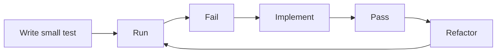
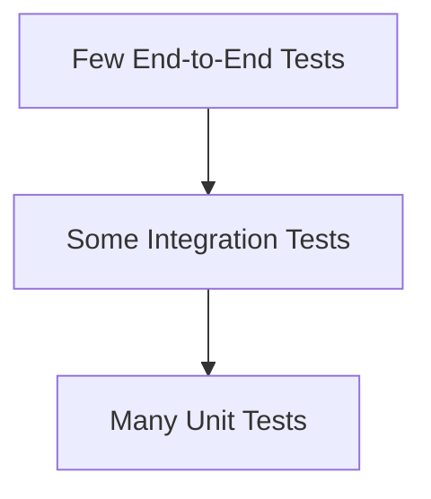

# Part 014 — Testing with pytest: Dari Confidence ke Design Feedback

## 1. Tujuan Part Ini

Testing bukan aktivitas setelah coding selesai.

Testing adalah feedback loop desain.

Di Python, testing sangat penting karena:

- runtime dynamic;
- type hints tidak enforce runtime secara default;
- refactor bisa cepat tetapi berisiko;
- framework sering menggunakan magic;
- boundary eksternal perlu divalidasi;
- domain rule perlu defensible;
- failure path harus eksplisit;
- codebase besar butuh regression safety.

Part ini membahas pytest sebagai test runner utama.

Target setelah part ini:

1. Memahami test discovery pytest.
2. Menulis assertion yang jelas.
3. Menulis test untuk domain rule.
4. Menulis test untuk exception.
5. Memakai fixture.
6. Memakai `tmp_path`.
7. Memakai parametrization.
8. Memakai monkeypatch secara wajar.
9. Mengetes CLI parsing dan boundary.
10. Menyusun test structure yang maintainable.
11. Memakai test sebagai design feedback.
12. Memperkuat `case-tracker`.

---

## 2. Testing sebagai Feedback Loop

Testing bukan hanya bertanya:

> “Apakah kode benar?”

Testing juga bertanya:

> “Apakah desain ini mudah digunakan, mudah dipahami, dan mudah diverifikasi?”

Jika test sulit ditulis, itu sinyal:

- function terlalu besar;
- side effect terlalu tersebar;
- dependency tersembunyi;
- global state terlalu banyak;
- domain bercampur I/O;
- boundary tidak jelas;
- error semantics kabur;
- model terlalu mentah;
- abstraction salah.

Loop yang sehat:



Tidak semua kode harus test-first. Tetapi test harus menjadi feedback cepat.

---

## 3. Installing and Running pytest

Install:

```bash
python -m pip install pytest
```

Run:

```bash
python -m pytest
```

Run verbose:

```bash
python -m pytest -v
```

Run one file:

```bash
python -m pytest tests/test_domain.py
```

Run one test:

```bash
python -m pytest tests/test_domain.py::test_can_transition_from_draft_to_submitted
```

Use `python -m pytest` to ensure pytest runs from the active interpreter/environment.

---

## 4. Test Discovery

pytest finds tests by convention.

Common conventions:

```text
tests/
  test_domain.py
  test_service.py
  test_storage.py
```

Test functions:

```python
def test_something():
    ...
```

Test class:

```python
class TestCaseTransitions:
    def test_can_submit_draft(self):
        ...
```

For this series, prefer simple test functions first.

---

## 5. Basic Assertion

pytest uses normal `assert`.

```python
def test_addition():
    assert 1 + 1 == 2
```

pytest improves assertion output.

Example:

```python
def test_case_title():
    case = Case(id="CASE-001", title="Late reporting")

    assert case.title == "Missing evidence"
```

Failure output shows actual vs expected.

### 5.1 Assertion Should Express Behavior

Weak:

```python
assert case is not None
```

Stronger:

```python
assert case.status is CaseStatus.DRAFT
assert case.title == "Late reporting"
```

Test should verify meaningful observable behavior.

---

## 6. Test Naming

Good test name describes behavior.

Good:

```python
def test_new_case_starts_as_draft():
    ...
```

Bad:

```python
def test_case_1():
    ...
```

Good pattern:

```text
test_<unit>_<expected_behavior>_<condition>
```

Examples:

```python
def test_case_title_cannot_be_empty():
    ...


def test_transition_from_draft_to_submitted_is_allowed():
    ...


def test_transition_from_draft_to_closed_is_rejected():
    ...
```

Readable tests are documentation.

---

## 7. Arrange, Act, Assert

Structure:

```python
def test_can_add_note():
    # Arrange
    case = Case(id="CASE-001", title="Late reporting")

    # Act
    case.add_note("Created during intake")

    # Assert
    assert case.notes == ["Created during intake"]
```

Comments are optional if test is short.

Pattern:

```text
given state -> when action -> then observable result
```

Avoid mixing many actions in one test unless behavior is a scenario.

---

## 8. Testing Domain Rules

Example:

```python
def test_new_case_starts_as_draft():
    case = create_case("Late reporting")

    assert case.status is CaseStatus.DRAFT
```

Invalid input:

```python
import pytest


def test_case_title_cannot_be_empty():
    with pytest.raises(ValueError, match="Case title cannot be empty"):
        create_case("   ")
```

Transition:

```python
def test_can_transition_from_draft_to_submitted():
    case = Case(id="CASE-001", title="Late reporting")

    case.transition_to(CaseStatus.SUBMITTED)

    assert case.status is CaseStatus.SUBMITTED
```

Invalid transition:

```python
def test_cannot_transition_from_draft_to_closed():
    case = Case(id="CASE-001", title="Late reporting")

    with pytest.raises(InvalidCaseTransitionError):
        case.transition_to(CaseStatus.CLOSED)
```

Domain tests should be fast and isolated.

---

## 9. Testing Exceptions

Use `pytest.raises`.

```python
with pytest.raises(ValueError):
    create_case(" ")
```

Check message:

```python
with pytest.raises(ValueError, match="Case title cannot be empty"):
    create_case(" ")
```

Check attributes:

```python
with pytest.raises(InvalidCaseTransitionError) as exc_info:
    case.transition_to(CaseStatus.CLOSED)

assert exc_info.value.from_status is CaseStatus.DRAFT
assert exc_info.value.to_status is CaseStatus.CLOSED
```

Important: code after the raise inside `with` block does not run.

Bad:

```python
with pytest.raises(ValueError):
    create_case(" ")
    assert something
```

The assert is unreachable if exception is raised.

---

## 10. Fixture Basics

Fixture provides reusable setup.

```python
import pytest


@pytest.fixture
def draft_case() -> Case:
    return Case(id="CASE-001", title="Late reporting")
```

Use by parameter name:

```python
def test_can_add_note(draft_case: Case):
    draft_case.add_note("Created")

    assert draft_case.notes == ["Created"]
```

pytest injects fixture by name.

### 10.1 Fixture Should Not Hide Too Much

Bad fixture:

```python
@pytest.fixture
def everything():
    ...
```

If test reader cannot see important setup, fixture hides intent.

Good fixture:

```python
@pytest.fixture
def draft_case() -> Case:
    return Case(id="CASE-001", title="Late reporting")
```

Specific and obvious.

---

## 11. Fixture Scope

Default fixture scope is function: new fixture value per test.

Other scopes:

- `function`;
- `class`;
- `module`;
- `package`;
- `session`.

For most unit tests, use default function scope.

Be careful with wider scope if fixture is mutable.

Bad:

```python
@pytest.fixture(scope="session")
def mutable_case() -> Case:
    return Case(...)
```

Tests can mutate shared object and affect each other.

Rule:

> Mutable fixture should usually be function-scoped.

---

## 12. `tmp_path`

`tmp_path` is a built-in pytest fixture that provides a temporary directory as `Path`.

Example:

```python
def test_save_and_load_cases(tmp_path):
    path = tmp_path / "cases.json"
    cases = [Case(id="CASE-001", title="Late reporting")]

    save_cases(path, cases)
    loaded_cases = load_cases(path)

    assert loaded_cases == cases
```

Benefits:

- isolated per test;
- no manual cleanup;
- avoids writing to real project files;
- works cross-platform.

Use `tmp_path` for file I/O tests.

---

## 13. Parametrized Tests

Parametrization runs same test with multiple inputs.

```python
import pytest


@pytest.mark.parametrize(
    ("from_status", "to_status"),
    [
        (CaseStatus.DRAFT, CaseStatus.SUBMITTED),
        (CaseStatus.SUBMITTED, CaseStatus.UNDER_REVIEW),
        (CaseStatus.UNDER_REVIEW, CaseStatus.ESCALATED),
        (CaseStatus.UNDER_REVIEW, CaseStatus.CLOSED),
        (CaseStatus.ESCALATED, CaseStatus.CLOSED),
    ],
)
def test_allowed_transitions(from_status: CaseStatus, to_status: CaseStatus):
    assert can_transition(from_status, to_status)
```

Invalid:

```python
@pytest.mark.parametrize(
    ("from_status", "to_status"),
    [
        (CaseStatus.DRAFT, CaseStatus.CLOSED),
        (CaseStatus.CLOSED, CaseStatus.DRAFT),
        (CaseStatus.SUBMITTED, CaseStatus.CLOSED),
    ],
)
def test_rejected_transitions(from_status: CaseStatus, to_status: CaseStatus):
    assert not can_transition(from_status, to_status)
```

Parametrization reduces duplication while keeping cases visible.

---

## 14. Testing Collections and Ordering

Be precise about ordering.

If order matters:

```python
assert [case.id for case in cases] == ["CASE-001", "CASE-002"]
```

If order does not matter:

```python
assert {case.id for case in cases} == {"CASE-001", "CASE-002"}
```

Do not write order-sensitive tests for unordered behavior.

---

## 15. Testing Mutability

Test that instances do not share state.

```python
def test_cases_do_not_share_notes():
    first = Case(id="CASE-001", title="First")
    second = Case(id="CASE-002", title="Second")

    first.add_note("Only first")

    assert first.notes == ["Only first"]
    assert second.notes == []
```

This catches shared mutable default/class attribute bugs.

Test non-mutating function:

```python
def test_case_to_dict_does_not_share_notes_list():
    case = Case(id="CASE-001", title="Late reporting")
    case.add_note("Created")

    data = case_to_dict(case)
    data["notes"].append("Injected")

    assert case.notes == ["Created"]
```

Boundary copy matters.

---

## 16. Testing Service Layer

Service function:

```python
def transition_case(path: Path, case_id: str, target_status: CaseStatus) -> Case:
    ...
```

Test:

```python
def test_transition_case_persists_new_status(tmp_path):
    path = tmp_path / "cases.json"
    created = create_new_case(path, "Late reporting")

    transition_case(path, created.id, CaseStatus.SUBMITTED)

    found = get_case(path, created.id)
    assert found.status is CaseStatus.SUBMITTED
```

Important detail: reload after transition. This verifies persistence, not just in-memory mutation.

---

## 17. Testing Storage Corruption

```python
def test_load_cases_raises_when_json_is_invalid(tmp_path):
    path = tmp_path / "cases.json"
    path.write_text("{invalid json", encoding="utf-8")

    with pytest.raises(CaseStoreCorruptedError):
        load_cases(path)
```

If exception chaining is required:

```python
import json


def test_load_cases_preserves_json_decode_cause(tmp_path):
    path = tmp_path / "cases.json"
    path.write_text("{invalid json", encoding="utf-8")

    with pytest.raises(CaseStoreCorruptedError) as exc_info:
        load_cases(path)

    assert isinstance(exc_info.value.__cause__, json.JSONDecodeError)
```

Testing failure path is as important as happy path.

---

## 18. Monkeypatch

`monkeypatch` safely changes attributes, environment variables, dictionary items, or import path during a test and restores after.

Example environment:

```python
def test_store_path_from_environment(monkeypatch):
    monkeypatch.setenv("CASE_TRACKER_STORE", "/tmp/cases.json")

    assert get_default_store_path() == Path("/tmp/cases.json")
```

Example patch attribute:

```python
def test_create_case_uses_fixed_id(monkeypatch):
    monkeypatch.setattr("case_tracker.domain.uuid4", lambda: "fixed-id")

    case = create_case("Late reporting")

    assert case.id == "CASE-fixed-id"
```

Be careful patching. Prefer dependency injection when possible.

### 18.1 Monkeypatch vs Dependency Injection

Monkeypatch is useful for:

- environment variables;
- legacy code;
- module-level functions;
- external library calls.

Dependency injection is often cleaner for new code:

```python
def create_case(title: str, id_factory: Callable[[], str]) -> Case:
    ...
```

Do not overuse monkeypatch to compensate for poor design.

---

## 19. Testing CLI Parser

Parser function:

```python
def build_parser() -> argparse.ArgumentParser:
    ...
```

Test:

```python
from pathlib import Path


def test_parser_accepts_create_command():
    parser = build_parser()

    args = parser.parse_args(["--store", "test.json", "create", "Late reporting"])

    assert args.store == Path("test.json")
    assert args.command == "create"
    assert args.title == "Late reporting"
```

This avoids running full process.

---

## 20. Testing CLI Output with `capsys`

`capsys` captures stdout/stderr.

```python
def test_main_lists_cases(tmp_path, capsys, monkeypatch):
    path = tmp_path / "cases.json"
    create_new_case(path, "Late reporting")

    monkeypatch.setattr(
        "sys.argv",
        ["case-tracker", "--store", str(path), "list"],
    )

    exit_code = main()
    captured = capsys.readouterr()

    assert exit_code == 0
    assert "Late reporting" in captured.out
```

However, this test is more integrated and can be brittle.

Keep most logic tested in domain/service. Use fewer CLI tests to verify boundary wiring.

---

## 21. Testing `main()` Without Patching `sys.argv`

Alternative: design `main` to accept `argv`.

```python
def main(argv: list[str] | None = None) -> int:
    parser = build_parser()
    args = parser.parse_args(argv)
    ...
```

Then test:

```python
def test_main_lists_cases(tmp_path, capsys):
    path = tmp_path / "cases.json"
    create_new_case(path, "Late reporting")

    exit_code = main(["--store", str(path), "list"])
    captured = capsys.readouterr()

    assert exit_code == 0
    assert "Late reporting" in captured.out
```

This is better design: less monkeypatch, clearer dependency.

---

## 22. Test Isolation

Tests should not depend on:

- execution order;
- real filesystem path;
- global mutable state;
- environment variables unless patched;
- external network;
- current time unless controlled;
- random values unless controlled;
- existing local files;
- user machine configuration.

Bad:

```python
def test_create_case():
    create_new_case(Path("cases.json"), "Late reporting")
```

This writes to real file.

Good:

```python
def test_create_case(tmp_path):
    path = tmp_path / "cases.json"
    create_new_case(path, "Late reporting")
```

---

## 23. Time-Dependent Tests

Bad:

```python
def create_event() -> Event:
    return Event(created_at=datetime.now(UTC))
```

Test becomes hard to assert.

Better:

```python
class Clock(Protocol):
    def now(self) -> datetime:
        ...


def create_event(clock: Clock) -> Event:
    return Event(created_at=clock.now())
```

Fake clock:

```python
class FixedClock:
    def __init__(self, value: datetime) -> None:
        self._value = value

    def now(self) -> datetime:
        return self._value
```

Test:

```python
def test_create_event_uses_clock():
    fixed_time = datetime(2026, 6, 26, tzinfo=UTC)
    event = create_event(FixedClock(fixed_time))

    assert event.created_at == fixed_time
```

Design for testability.

---

## 24. Randomness in Tests

If function generates random/UUID internally:

```python
def create_case(title: str) -> Case:
    return Case(id=f"CASE-{uuid4()}", title=title)
```

Test can assert prefix or type:

```python
assert case.id.startswith("CASE-")
```

But if exact id matters, inject id factory:

```python
def create_case(title: str, id_factory: Callable[[], str] = default_case_id_factory) -> Case:
    return Case(id=id_factory(), title=title)
```

Test:

```python
def test_create_case_uses_id_factory():
    case = create_case("Late reporting", id_factory=lambda: "CASE-001")

    assert case.id == "CASE-001"
```

Do not patch randomness everywhere if injection is simple.

---

## 25. Unit vs Integration Tests

### 25.1 Unit Test

Tests small unit with minimal dependencies.

```python
def test_can_transition_from_draft_to_submitted():
    assert can_transition(CaseStatus.DRAFT, CaseStatus.SUBMITTED)
```

### 25.2 Integration Test

Tests multiple components together.

```python
def test_transition_case_persists_to_json_file(tmp_path):
    ...
```

### 25.3 End-to-End Test

Tests full application path.

```python
def test_cli_create_then_list(tmp_path, capsys):
    ...
```

For `case-tracker`, good distribution:

- many domain unit tests;
- several service/storage integration tests;
- few CLI boundary tests.

---

## 26. Test Pyramid



Text version:

```text
        E2E
     Integration
        Unit
```

Unit tests are fast and precise.
Integration tests verify boundaries.
E2E tests verify wiring but are slower/brittle.

Do not put all confidence in E2E tests.

---

## 27. Testing Error Messages

Error messages are part of user/developer experience.

```python
def test_parse_case_status_lists_allowed_values():
    with pytest.raises(ValueError, match="Allowed statuses"):
        parse_case_status("waiting")
```

Do not over-specify entire message unless important.

Too brittle:

```python
match="Invalid status: waiting. Allowed statuses: DRAFT, SUBMITTED, UNDER_REVIEW, ESCALATED, CLOSED"
```

Better:

```python
match="Invalid status"
```

and maybe:

```python
match="Allowed statuses"
```

Balance specificity and maintainability.

---

## 28. Testing Logs

Later we will use logging. Basic pattern:

```python
def test_logs_warning(caplog):
    with caplog.at_level("WARNING"):
        run_something()

    assert "something happened" in caplog.text
```

For now, focus on return values, state changes, exceptions, and output.

Do not assert logs unless logs are part of behavior/observability requirement.

---

## 29. Test Data Builders

When object setup gets repetitive, use builder functions.

```python
def make_case(
    *,
    case_id: str = "CASE-001",
    title: str = "Late reporting",
    status: CaseStatus = CaseStatus.DRAFT,
    notes: list[str] | None = None,
) -> Case:
    return Case(
        id=case_id,
        title=title,
        status=status,
        notes=list(notes or []),
    )
```

Use:

```python
def test_closed_case_is_not_actionable():
    case = make_case(status=CaseStatus.CLOSED)

    assert not is_actionable(case)
```

Builder should be simple and explicit.

Avoid huge magical factories.

---

## 30. Parametrize Domain State Machine

Good for transition table.

```python
@pytest.mark.parametrize(
    ("from_status", "to_status"),
    [
        (CaseStatus.DRAFT, CaseStatus.SUBMITTED),
        (CaseStatus.SUBMITTED, CaseStatus.UNDER_REVIEW),
        (CaseStatus.UNDER_REVIEW, CaseStatus.ESCALATED),
        (CaseStatus.UNDER_REVIEW, CaseStatus.CLOSED),
        (CaseStatus.ESCALATED, CaseStatus.CLOSED),
    ],
)
def test_allowed_transitions(from_status: CaseStatus, to_status: CaseStatus):
    case = Case(id="CASE-001", title="Late reporting", status=from_status)

    case.transition_to(to_status)

    assert case.status is to_status
```

Invalid:

```python
@pytest.mark.parametrize(
    ("from_status", "to_status"),
    [
        (CaseStatus.DRAFT, CaseStatus.CLOSED),
        (CaseStatus.SUBMITTED, CaseStatus.CLOSED),
        (CaseStatus.CLOSED, CaseStatus.DRAFT),
    ],
)
def test_invalid_transitions_are_rejected(from_status: CaseStatus, to_status: CaseStatus):
    case = Case(id="CASE-001", title="Late reporting", status=from_status)

    with pytest.raises(InvalidCaseTransitionError):
        case.transition_to(to_status)
```

This makes state machine rules visible in tests.

---

## 31. Avoid Over-Mocking

Mocking too much can make tests verify implementation, not behavior.

Bad:

```python
def test_service_calls_load_and_save(mocker):
    load = mocker.patch(...)
    save = mocker.patch(...)
    ...
    save.assert_called_once()
```

Sometimes useful, but for simple file-backed service, `tmp_path` integration test may be better:

```python
def test_transition_case_persists_new_status(tmp_path):
    ...
```

Prefer fakes and real simple dependencies when cheap.

Mock external boundaries:

- network;
- email;
- payment;
- slow services;
- nondeterministic dependencies.

Do not mock your own simple domain model unnecessarily.

---

## 32. Test Smells

Watch for:

1. Test name vague.
2. Test has many unrelated asserts.
3. Test depends on order.
4. Test writes real file.
5. Test depends on current time.
6. Test depends on random value.
7. Test uses too much monkeypatch.
8. Test mocks implementation details.
9. Test fixture hides important setup.
10. Test only covers happy path.
11. Test catches broad exception.
12. Test asserts no exception by doing nothing meaningful.
13. Test is hard to read.
14. Test data irrelevant/noisy.
15. Test requires network.

Test code is production-adjacent code. Maintain it.

---

## 33. Coverage

Coverage tells which lines ran during tests. It does not prove correctness.

Useful:

```bash
python -m pip install coverage
coverage run -m pytest
coverage report
```

or plugin:

```bash
python -m pip install pytest-cov
python -m pytest --cov=case_tracker
```

But do not chase coverage percentage blindly.

High-value coverage:

- domain rules;
- failure paths;
- boundary parsing;
- serialization/deserialization;
- state transitions;
- edge cases.

Low-value coverage:

- trivial property access;
- generated code;
- framework wiring with little logic;
- tests that execute lines without assertions.

---

## 34. Running Tests in Quality Gate

Recommended local command:

```bash
python -m pytest
python -m ruff check .
python -m ruff format --check .
```

If using type checker:

```bash
pyright
```

or:

```bash
python -m mypy src tests
```

In CI, run the same commands.

Tests should be cheap enough to run often.

---

## 35. Case Tracker Test Suite Target

Minimum for current stage:

```text
tests/
  test_domain.py
  test_storage.py
  test_service.py
  test_cli.py
```

### `test_domain.py`

- new case starts draft;
- empty title rejected;
- valid transitions allowed;
- invalid transitions rejected;
- note added;
- empty note rejected;
- cases do not share notes;
- `case_to_dict` copies notes;
- `case_from_dict` restores case.

### `test_storage.py`

- missing file returns empty list;
- empty file returns empty list;
- save/load round trip;
- invalid JSON raises;
- exception cause preserved.

### `test_service.py`

- create persists case;
- get existing case;
- missing case raises;
- transition persists;
- add note persists;
- duplicate id handling if implemented.

### `test_cli.py`

- parser accepts create;
- parser accepts transition;
- parse status normalizes;
- invalid status message includes allowed statuses;
- main returns success for list with temp store.

---

## 36. Practice: Domain Test File

Create:

```python
# tests/test_domain.py
import pytest

from case_tracker.domain import (
    Case,
    CaseStatus,
    InvalidCaseTransitionError,
    can_transition,
    create_case,
)


def test_new_case_starts_as_draft() -> None:
    case = create_case("Late reporting")

    assert case.status is CaseStatus.DRAFT


def test_case_title_cannot_be_empty() -> None:
    with pytest.raises(ValueError, match="Case title cannot be empty"):
        create_case("   ")


@pytest.mark.parametrize(
    ("from_status", "to_status"),
    [
        (CaseStatus.DRAFT, CaseStatus.SUBMITTED),
        (CaseStatus.SUBMITTED, CaseStatus.UNDER_REVIEW),
        (CaseStatus.UNDER_REVIEW, CaseStatus.ESCALATED),
        (CaseStatus.UNDER_REVIEW, CaseStatus.CLOSED),
        (CaseStatus.ESCALATED, CaseStatus.CLOSED),
    ],
)
def test_allowed_transitions(from_status: CaseStatus, to_status: CaseStatus) -> None:
    assert can_transition(from_status, to_status)


def test_invalid_transition_raises_error() -> None:
    case = Case(id="CASE-001", title="Late reporting")

    with pytest.raises(InvalidCaseTransitionError):
        case.transition_to(CaseStatus.CLOSED)
```

---

## 37. Practice: Storage Test File

```python
# tests/test_storage.py
import json

import pytest

from case_tracker.domain import Case, CaseStatus
from case_tracker.storage import CaseStoreCorruptedError, load_cases, save_cases


def test_load_cases_returns_empty_list_when_file_missing(tmp_path) -> None:
    path = tmp_path / "cases.json"

    assert load_cases(path) == []


def test_save_and_load_cases(tmp_path) -> None:
    path = tmp_path / "cases.json"
    cases = [
        Case(
            id="CASE-001",
            title="Late reporting",
            status=CaseStatus.SUBMITTED,
            notes=["Created"],
        )
    ]

    save_cases(path, cases)

    assert load_cases(path) == cases


def test_load_cases_raises_when_json_is_invalid(tmp_path) -> None:
    path = tmp_path / "cases.json"
    path.write_text("{invalid json", encoding="utf-8")

    with pytest.raises(CaseStoreCorruptedError) as exc_info:
        load_cases(path)

    assert isinstance(exc_info.value.__cause__, json.JSONDecodeError)
```

---

## 38. Practice: CLI Main with `argv`

Refactor:

```python
def main(argv: list[str] | None = None) -> int:
    parser = build_parser()
    args = parser.parse_args(argv)
    ...
```

Test:

```python
def test_main_create_command(tmp_path, capsys) -> None:
    path = tmp_path / "cases.json"

    exit_code = main(["--store", str(path), "create", "Late reporting"])
    captured = capsys.readouterr()

    assert exit_code == 0
    assert "Created" in captured.out
```

This is cleaner than patching `sys.argv`.

---

## 39. Practice: Fixture

```python
@pytest.fixture
def draft_case() -> Case:
    return Case(id="CASE-001", title="Late reporting")
```

Use:

```python
def test_add_note(draft_case: Case) -> None:
    draft_case.add_note("Created")

    assert draft_case.notes == ["Created"]
```

Add one more fixture:

```python
@pytest.fixture
def case_store_path(tmp_path) -> Path:
    return tmp_path / "cases.json"
```

Use in service tests.

---

## 40. Practice: Test Builder

Create:

```python
def make_case(
    *,
    case_id: str = "CASE-001",
    title: str = "Late reporting",
    status: CaseStatus = CaseStatus.DRAFT,
    notes: list[str] | None = None,
) -> Case:
    return Case(
        id=case_id,
        title=title,
        status=status,
        notes=list(notes or []),
    )
```

Use in tests:

```python
def test_closed_case_is_not_actionable() -> None:
    case = make_case(status=CaseStatus.CLOSED)

    assert not is_actionable(case)
```

---

## 41. Self-Check

Answer without looking:

1. Why is testing design feedback?
2. How does pytest discover tests?
3. Why use `python -m pytest`?
4. What is a good test name?
5. What are Arrange, Act, Assert?
6. How do you test exceptions?
7. How do you check exception attributes?
8. What is a fixture?
9. What is fixture scope?
10. Why is `tmp_path` useful?
11. What is parametrization?
12. When should you use monkeypatch?
13. Why is dependency injection often better than monkeypatch?
14. How do you test CLI parser?
15. How do you capture stdout?
16. Why should `main(argv=None)` be preferred?
17. What is test isolation?
18. What is the test pyramid?
19. What is over-mocking?
20. Why is coverage not equal to correctness?

---

## 42. Definition of Done Part 014

You are done with this part if you can:

1. Run pytest.
2. Write basic assertions.
3. Test domain behavior.
4. Test exceptions with `pytest.raises`.
5. Test exception messages.
6. Test exception attributes.
7. Use fixtures.
8. Use `tmp_path`.
9. Use parametrized tests.
10. Use `capsys`.
11. Use monkeypatch for env/argv only when appropriate.
12. Refactor `main` to accept `argv`.
13. Write service persistence tests.
14. Write storage corruption tests.
15. Explain how tests reveal design problems.

---

## 43. Ringkasan

pytest gives Python projects a fast feedback loop.

Core ideas:

- tests are design feedback;
- good test names document behavior;
- domain tests should be fast and isolated;
- failure paths are first-class;
- fixtures reduce duplication but should not hide intent;
- `tmp_path` makes file tests safe;
- parametrization makes state-machine tests concise;
- monkeypatch is useful but dependency injection is often cleaner;
- CLI should be designed for testability;
- test pyramid helps distribute confidence;
- coverage is a signal, not proof;
- over-mocking can make tests brittle;
- if tests are hard to write, inspect the design.

Part berikutnya akan membahas test architecture lebih lanjut: mocking, fakes, property-based testing, contract testing, golden files, deterministic tests, dan flaky test prevention.

---

## 44. Referensi

- pytest Documentation — How to invoke pytest.
- pytest Documentation — Assertions.
- pytest Documentation — Fixtures.
- pytest Documentation — Parametrizing tests.
- pytest Documentation — `tmp_path`.
- pytest Documentation — `monkeypatch`.
- Python Documentation — `unittest.mock`.
