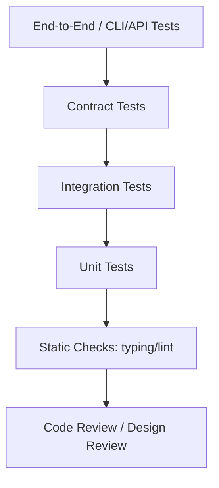

# Part 015 — Test Architecture: Mocking, Property Testing, Contract Testing

## 1. Tujuan Part Ini

Part sebelumnya membahas dasar pytest. Part ini membahas arsitektur testing.

Testing yang baik bukan hanya banyak test. Testing yang baik punya struktur yang sesuai dengan risiko sistem.

Masalah umum pada test suite Python:

- terlalu banyak mock;
- test menguji implementasi, bukan behavior;
- test rapuh saat refactor;
- fixture terlalu magic;
- integration test lambat;
- unit test tidak menangkap bug boundary;
- property penting tidak diuji;
- fake tidak sesuai behavior real implementation;
- contract antar layer tidak eksplisit;
- test flaky karena waktu, random, network, urutan, atau global state;
- test data terlalu rumit;
- test suite tidak memberi confidence saat refactor.

Part ini membahas beberapa teknik:

1. Fakes.
2. Stubs.
3. Mocks.
4. Monkeypatch.
5. Contract tests.
6. Property-based testing.
7. Golden file tests.
8. Snapshot-like testing.
9. Deterministic tests.
10. Flaky test prevention.
11. Test architecture untuk `case-tracker`.

Target setelah part ini:

- bisa memilih fake vs mock;
- bisa memakai `unittest.mock` dengan aman;
- bisa menulis contract tests untuk repository;
- bisa memahami property-based testing dengan Hypothesis;
- bisa menguji invariants state machine;
- bisa menghindari flaky tests;
- bisa menyusun test suite yang mendukung refactor.

---

## 2. Testing Pyramid Lebih Detail

Model sederhana:

```text
        E2E
     Integration
        Unit
```

Untuk Python application, kita bisa pecah lebih detail:



Peran:

| Layer | Tujuan |
|---|---|
| Static checks | Menangkap bug cepat sebelum runtime |
| Unit tests | Rule kecil, pure logic, domain invariant |
| Integration tests | Boundary nyata seperti file/database |
| Contract tests | Semua implementation memenuhi behavior sama |
| E2E tests | Wiring aplikasi dari luar |
| Review | Menilai desain, bukan hanya behavior |

Tidak semua project perlu semua layer secara formal. Tetapi sistem serius harus sadar risiko yang ditutup tiap layer.

---

## 3. Test Double Vocabulary

Test double adalah object pengganti dependency dalam test.

Istilah umum:

| Istilah | Fungsi |
|---|---|
| Dummy | Dikirim hanya untuk memenuhi signature, tidak dipakai |
| Stub | Mengembalikan response terkontrol |
| Fake | Implementasi sederhana tapi working |
| Spy | Merekam pemanggilan untuk diperiksa |
| Mock | Object dengan expectation interaksi |
| Monkeypatch | Mengubah attribute/env/module selama test |

Contoh dependency:

```python
class CaseRepository(Protocol):
    def list(self) -> list[Case]:
        ...

    def save_all(self, cases: list[Case]) -> None:
        ...
```

Kita bisa menggantinya dengan fake repository saat test service.

---

## 4. Fake Lebih Sering Lebih Baik daripada Mock

Fake adalah implementation sederhana yang behavior-nya masuk akal.

```python
class FakeCaseRepository:
    def __init__(self, cases: list[Case] | None = None) -> None:
        self._cases = list(cases or [])

    def list(self) -> list[Case]:
        return list(self._cases)

    def save_all(self, cases: list[Case]) -> None:
        self._cases = list(cases)
```

Test:

```python
def test_case_service_creates_case() -> None:
    repository = FakeCaseRepository()
    service = CaseService(repository)

    created = service.create_new_case("Late reporting")

    assert repository.list() == [created]
```

Kelebihan fake:

- behavior lebih dekat ke real dependency;
- test lebih fokus pada outcome;
- tidak terlalu tied ke internal call sequence;
- refactor internal service lebih aman;
- mudah dipakai di banyak test.

Kekurangan fake:

- bisa diverge dari real implementation;
- perlu contract test;
- jika fake terlalu kompleks, bisa jadi sistem kedua.

---

## 5. Stub

Stub mengembalikan value terkontrol.

```python
class StubClock:
    def now(self) -> datetime:
        return datetime(2026, 6, 26, tzinfo=UTC)
```

Use:

```python
def test_create_audit_event_uses_clock() -> None:
    event = create_audit_event(case_id=CaseId("CASE-001"), clock=StubClock())

    assert event.occurred_at == datetime(2026, 6, 26, tzinfo=UTC)
```

Stub cocok untuk:

- time;
- config;
- deterministic external value;
- simple read-only dependency.

---

## 6. Spy

Spy merekam apa yang terjadi.

```python
class SpyNotifier:
    def __init__(self) -> None:
        self.sent_messages: list[str] = []

    def send(self, message: str) -> None:
        self.sent_messages.append(message)
```

Test:

```python
def test_transition_sends_notification() -> None:
    notifier = SpyNotifier()

    service = CaseService(repository=FakeCaseRepository([...]), notifier=notifier)
    service.transition_case(CaseId("CASE-001"), CaseStatus.SUBMITTED)

    assert notifier.sent_messages == ["CASE-001 transitioned to SUBMITTED"]
```

Spy cocok ketika output utama adalah interaction dengan dependency.

Namun hati-hati. Terlalu banyak spy membuat test mengikat implementasi.

---

## 7. Mock dengan `unittest.mock`

Python standard library punya `unittest.mock`.

```python
from unittest.mock import Mock


def test_service_saves_cases_with_mock() -> None:
    repository = Mock()
    repository.list.return_value = []

    service = CaseService(repository)
    created = service.create_new_case("Late reporting")

    repository.save_all.assert_called_once_with([created])
```

Ini powerful, tetapi mudah disalahgunakan.

### 7.1 Risiko Mock

Mock bisa membuat test lulus walau interface salah.

```python
repository = Mock()
repository.lits.return_value = []
```

Typo `lits` bisa tidak langsung ketahuan karena `Mock` membuat attribute dinamis.

Gunakan `spec` atau `autospec`.

```python
repository = Mock(spec=CaseRepository)
```

Namun Protocol tidak selalu ideal untuk runtime spec. Untuk class concrete, `autospec` lebih berguna.

### 7.2 Kapan Mock Tepat?

Mock tepat untuk:

- external API client;
- email sender;
- payment gateway;
- expensive dependency;
- interaction yang memang behavior utama;
- memastikan callback dipanggil;
- legacy code yang sulit diinjeksi.

Mock kurang tepat untuk:

- domain object sederhana;
- repository fake mudah dibuat;
- pure function;
- testing internal call sequence tanpa alasan;
- mengganti semua dependency hanya karena “unit test harus isolated”.

---

## 8. Monkeypatch

`monkeypatch` adalah fixture pytest untuk patch attribute/env safely.

Contoh environment:

```python
def test_default_store_path_uses_environment(monkeypatch) -> None:
    monkeypatch.setenv("CASE_TRACKER_STORE", "/tmp/cases.json")

    assert get_default_store_path() == Path("/tmp/cases.json")
```

Contoh patch function:

```python
def test_create_case_uses_fixed_uuid(monkeypatch) -> None:
    monkeypatch.setattr("case_tracker.domain.uuid4", lambda: "fixed")

    case = create_case("Late reporting")

    assert str(case.id).startswith("CASE-fixed")
```

Gunakan monkeypatch jika:

- dependency global/legacy;
- environment variable;
- third-party function;
- module-level function belum diinjeksi.

Tetapi untuk code baru, dependency injection sering lebih bersih.

---

## 9. Dependency Injection Mengurangi Mocking

Buruk:

```python
def create_case(title: str) -> Case:
    return Case(id=CaseId(f"CASE-{uuid4()}"), title=title)
```

Test exact id butuh monkeypatch.

Lebih testable:

```python
from collections.abc import Callable

CaseIdFactory = Callable[[], CaseId]


def default_case_id_factory() -> CaseId:
    return CaseId(f"CASE-{uuid4()}")


def create_case(
    title: str,
    *,
    id_factory: CaseIdFactory = default_case_id_factory,
) -> Case:
    return Case(id=id_factory(), title=title)
```

Test:

```python
def test_create_case_uses_id_factory() -> None:
    case = create_case(
        "Late reporting",
        id_factory=lambda: CaseId("CASE-001"),
    )

    assert case.id == CaseId("CASE-001")
```

Tidak perlu monkeypatch.

Rule:

> Jika dependency adalah bagian dari desain, inject. Jika dependency adalah detail legacy/global, monkeypatch bisa membantu.

---

## 10. Contract Tests

Fake bisa diverge dari real implementation. Contract test mencegah itu.

Misal contract untuk repository:

```python
class CaseRepository(Protocol):
    def list(self) -> list[Case]:
        ...

    def save_all(self, cases: list[Case]) -> None:
        ...
```

Behavior yang harus dipenuhi semua implementation:

1. Awal kosong jika belum ada data.
2. Setelah `save_all`, `list` mengembalikan data yang sama.
3. `list` tidak mengekspos internal list mutable.
4. Save mengganti seluruh data.
5. Duplicate behavior sesuai keputusan.
6. Error behavior sesuai contract.

### 10.1 Repository Contract Test Function

```python
from collections.abc import Callable

RepositoryFactory = Callable[[], CaseRepository]


def assert_repository_contract(repository_factory: RepositoryFactory) -> None:
    repository = repository_factory()

    assert repository.list() == []

    case = Case(id=CaseId("CASE-001"), title="Late reporting")
    repository.save_all([case])

    assert repository.list() == [case]

    listed_cases = repository.list()
    listed_cases.clear()

    assert repository.list() == [case]
```

Test fake:

```python
def test_fake_repository_contract() -> None:
    assert_repository_contract(lambda: FakeCaseRepository())
```

Test JSON repository:

```python
def test_json_repository_contract(tmp_path) -> None:
    path = tmp_path / "cases.json"
    assert_repository_contract(lambda: JsonCaseRepository(path))
```

Now fake and real implementation share contract.

---

## 11. Contract Tests vs Unit Tests

Unit test:

```python
def test_json_repository_returns_empty_when_file_missing(tmp_path):
    ...
```

Contract test:

```python
def test_json_repository_satisfies_case_repository_contract(tmp_path):
    ...
```

Difference:

- unit test verifies implementation detail/edge case;
- contract test verifies shared expected behavior.

Use contract tests when:

- multiple implementations exist;
- fake used heavily in service tests;
- repository/client abstraction matters;
- plugin architecture;
- compatibility across backends.

---

## 12. Property-Based Testing

Example-based test:

```python
def test_normalize_status_strips_and_uppercases():
    assert normalize_status(" draft ") == "DRAFT"
```

Property-based test asks:

> For many generated inputs, what property should always hold?

Using Hypothesis:

```python
from hypothesis import given
from hypothesis import strategies as st


@given(st.text())
def test_normalize_title_is_idempotent(title: str) -> None:
    try:
        normalized_once = normalize_title(title)
        normalized_twice = normalize_title(normalized_once)
    except ValueError:
        return

    assert normalized_once == normalized_twice
```

Property:

```text
normalizing an already normalized valid title should not change it
```

Hypothesis generates many inputs, including edge cases.

---

## 13. When Property-Based Testing Helps

Good candidates:

- parsers;
- serializers/deserializers;
- normalization;
- state machines;
- validators;
- sorting/grouping invariants;
- encode/decode round trip;
- idempotency;
- mathematical/business invariants;
- permission rules;
- transition rules.

Poor candidates:

- simple one-off rendering;
- heavily mocked interaction tests;
- tests where property is unclear;
- external I/O heavy behavior;
- implementation details.

Property-based testing is powerful when you can state invariant clearly.

---

## 14. Round-Trip Property

For `case_to_dict` and `case_from_dict`:

```python
@given(
    title=st.text(min_size=1).filter(lambda value: bool(value.strip())),
    notes=st.lists(st.text(min_size=1).filter(lambda value: bool(value.strip()))),
)
def test_case_round_trips_through_dict(title: str, notes: list[str]) -> None:
    case = Case(
        id=CaseId("CASE-001"),
        title=title,
        status=CaseStatus.SUBMITTED,
        notes=notes,
    )

    restored = case_from_dict(case_to_dict(case))

    assert restored == case
```

Caveat: if `Case` normalizes title or notes, equality may need expected normalization.

Better property:

```python
restored = case_from_dict(case_to_dict(case))

assert restored.id == case.id
assert restored.status == case.status
assert restored.notes == case.notes
```

Adjust property to real semantics.

---

## 15. State Machine Property

For case transitions, property can verify allowed table.

Generate statuses:

```python
@given(
    from_status=st.sampled_from(list(CaseStatus)),
    to_status=st.sampled_from(list(CaseStatus)),
)
def test_transition_behavior_matches_transition_table(
    from_status: CaseStatus,
    to_status: CaseStatus,
) -> None:
    case = Case(id=CaseId("CASE-001"), title="Late reporting", status=from_status)

    if can_transition(from_status, to_status):
        case.transition_to(to_status)
        assert case.status is to_status
    else:
        with pytest.raises(InvalidCaseTransitionError):
            case.transition_to(to_status)
```

This checks the method against the policy table for all status combinations.

---

## 16. Hypothesis Strategies

Common strategies:

```python
st.text()
st.integers()
st.booleans()
st.lists(st.text())
st.dictionaries(st.text(), st.integers())
st.sampled_from(list(CaseStatus))
st.none()
st.one_of(st.text(), st.none())
```

Custom strategy:

```python
valid_title_strategy = st.text().filter(lambda value: bool(value.strip()))
```

Be careful with `.filter()`. Too much filtering can make generation inefficient.

Better:

```python
valid_title_strategy = st.text(min_size=1).map(lambda value: value if value.strip() else "x")
```

Or define a known alphabet/constraints.

---

## 17. Property Tests Should Be Readable

Bad property:

```python
@given(st.recursive(... huge ...))
def test_thing(x):
    ...
```

If nobody understands the property, it becomes noise.

Good property name:

```python
def test_case_serialization_round_trip_preserves_domain_fields(...):
    ...
```

Property tests should document invariants.

---

## 18. Golden File Tests

Golden file test compares output to an approved file.

Example: report rendering.

```python
def render_case_report(cases: list[Case]) -> str:
    ...
```

Test:

```python
def test_render_case_report_matches_golden_file() -> None:
    cases = [...]
    expected = Path("tests/golden/case_report.txt").read_text(encoding="utf-8")

    assert render_case_report(cases) == expected
```

Good for:

- reports;
- generated config;
- code generation;
- CLI output;
- serialization output.

Risks:

- golden file updated blindly;
- large diffs hard to review;
- output includes nondeterministic data like time/order;
- test locks formatting too tightly.

Golden file should be reviewed like code.

---

## 19. Snapshot-Style Testing

Snapshot testing is similar to golden files: compare output to stored expected output.

Use carefully.

Good:

- stable textual output;
- structured JSON with deterministic ordering;
- generated docs.

Bad:

- huge snapshots nobody reviews;
- snapshots of implementation details;
- UI/API output with nondeterministic fields;
- snapshots updated automatically without review.

Rule:

> Snapshot/golden tests verify output contract. They should not become a dumping ground.

---

## 20. Deterministic Tests

Tests should produce same result every run.

Sources of nondeterminism:

- current time;
- random/UUID;
- iteration order if not guaranteed;
- concurrency;
- network;
- filesystem state;
- environment variables;
- timezone;
- locale;
- test order;
- global mutable state;
- external service.

Strategies:

| Source | Control |
|---|---|
| Time | Inject clock |
| UUID/random | Inject factory or seed |
| Files | `tmp_path` |
| Env | `monkeypatch.setenv` |
| Network | fake client |
| Order | sort or compare sets |
| Global state | reset per test |
| Timezone | explicit timezone |
| Concurrency | avoid timing sleeps |

---

## 21. Flaky Test Prevention

Flaky test sometimes passes, sometimes fails.

Common causes:

### 21.1 Sleep-Based Tests

Bad:

```python
time.sleep(1)
assert job.done
```

Better:

- inject scheduler;
- poll with timeout only in integration tests;
- make operation synchronous in unit tests;
- use fake clock.

### 21.2 Order Dependency

Bad:

```python
def test_a():
    global_state.append("x")


def test_b():
    assert global_state == []
```

Tests should isolate state.

### 21.3 External Network

Bad:

```python
requests.get("https://example.com")
```

Unit tests should not hit network.

### 21.4 Real Current Time

Bad:

```python
assert created_at.date() == date.today()
```

Use fixed clock.

---

## 22. Testing Failure Paths Systematically

For each use case, ask:

1. Happy path?
2. Missing entity?
3. Invalid input?
4. Invalid state?
5. Dependency failure?
6. Duplicate request?
7. Empty input?
8. Boundary parsing failure?
9. Persistence failure?
10. Partial side effect?

Example `transition_case`:

| Scenario | Test |
|---|---|
| Valid transition | status persisted |
| Case missing | raises `CaseNotFoundError` |
| Invalid transition | raises `InvalidCaseTransitionError` |
| Store corrupt | raises storage error |
| Save fails | propagates infra error |
| Input status invalid | parser raises `ValueError` |

This table helps design test coverage.

---

## 23. Test Data Minimalism

Bad test data:

```python
case = Case(
    id=CaseId("CASE-001"),
    title="Late reporting in compliance workflow for department X involving jurisdiction Y",
    status=CaseStatus.UNDER_REVIEW,
    notes=["a", "b", "c"],
    assigned_to="reviewer-1",
    priority=CasePriority.HIGH,
    created_at=...,
    updated_at=...,
)
```

If test only checks title normalization, most fields are noise.

Better:

```python
case = make_case(title=" Late reporting ")
```

Test data should include only what matters.

---

## 24. Test Builders vs Fixtures

Use fixture when many tests need same setup.

Use builder when tests need variations.

Fixture:

```python
@pytest.fixture
def draft_case() -> Case:
    return make_case()
```

Builder:

```python
def make_case(*, status: CaseStatus = CaseStatus.DRAFT) -> Case:
    ...
```

Combining:

```python
@pytest.fixture
def case_factory():
    return make_case
```

But avoid over-abstracting test setup.

---

## 25. Testing CLI with Fakes

Instead of testing CLI with real file every time, you can design CLI handler to accept service.

```python
def handle_list_command(service: CaseService) -> int:
    for case in service.list_cases():
        print(render_case_summary(case))
    return 0
```

Test:

```python
def test_handle_list_command_outputs_cases(capsys) -> None:
    repository = FakeCaseRepository([make_case(title="Late reporting")])
    service = CaseService(repository)

    exit_code = handle_list_command(service)
    captured = capsys.readouterr()

    assert exit_code == 0
    assert "Late reporting" in captured.out
```

Boundary becomes testable without parsing every time.

---

## 26. Testing Persistence Contract with Corruption Cases

For JSON repository, contract plus specific tests:

```python
def test_json_repository_raises_on_corrupt_store(tmp_path) -> None:
    path = tmp_path / "cases.json"
    path.write_text("{invalid json", encoding="utf-8")

    repository = JsonCaseRepository(path)

    with pytest.raises(CaseStoreCorruptedError):
        repository.list()
```

Fake repository should not mimic corrupt JSON behavior because it has no JSON. That is implementation-specific, not repository contract.

---

## 27. Test Suite Organization

Suggested:

```text
tests/
  unit/
    test_domain.py
    test_policies.py
  integration/
    test_json_repository.py
    test_storage.py
  contract/
    test_case_repository_contract.py
  cli/
    test_parser.py
    test_main.py
  builders.py
```

For small project, flat structure is fine:

```text
tests/
  test_domain.py
  test_storage.py
  test_service.py
  test_cli.py
```

Move to folders when test count grows.

---

## 28. Naming Test Layers

You can use pytest markers.

```python
import pytest


@pytest.mark.integration
def test_json_repository_contract(tmp_path) -> None:
    ...
```

Configure markers in `pyproject.toml`:

```toml
[tool.pytest.ini_options]
markers = [
    "integration: tests that touch real infrastructure boundary",
    "contract: shared behavior tests for implementations",
]
```

Run excluding integration:

```bash
python -m pytest -m "not integration"
```

Use markers only if they help workflow. Do not create taxonomy nobody uses.

---

## 29. CI Test Strategy

Recommended stages:

1. Format check.
2. Lint.
3. Type check.
4. Unit tests.
5. Integration tests.
6. Coverage report if useful.

For small project:

```bash
python -m ruff format --check .
python -m ruff check .
pyright
python -m pytest
```

or:

```bash
python -m mypy src tests
```

Keep CI aligned with local commands.

---

## 30. Mutation Testing Preview

Mutation testing modifies code and checks whether tests fail.

Example mutation:

```python
return target_status in ALLOWED_TRANSITIONS[from_status]
```

Changed to:

```python
return target_status not in ALLOWED_TRANSITIONS[from_status]
```

Good tests should fail.

Mutation testing tools exist, but we will not use them yet. Conceptually, mutation testing asks:

> Would my tests catch wrong logic?

Useful for critical domain rules.

---

## 31. Review: What Should Be Tested?

Test:

- domain invariants;
- state transitions;
- serialization round trips;
- parsing boundaries;
- error mapping;
- persistence behavior;
- permission/policy logic;
- edge cases;
- regression bugs;
- public API contracts.

Do not over-test:

- implementation details;
- trivial getters;
- framework internals;
- Python standard library behavior;
- exact call sequence unless it is contract.

---

## 32. Practice: Fake Repository

Implement:

```python
class FakeCaseRepository:
    def __init__(self, cases: list[Case] | None = None) -> None:
        self._cases = list(cases or [])

    def list(self) -> list[Case]:
        return list(self._cases)

    def save_all(self, cases: list[Case]) -> None:
        self._cases = list(cases)
```

Test service:

```python
def test_case_service_creates_case_with_fake_repository() -> None:
    repository = FakeCaseRepository()
    service = CaseService(repository)

    created = service.create_new_case("Late reporting")

    assert repository.list() == [created]
```

---

## 33. Practice: Repository Contract

Implement:

```python
def assert_case_repository_contract(repository: CaseRepository) -> None:
    assert repository.list() == []

    case = make_case(case_id=CaseId("CASE-001"))
    repository.save_all([case])

    assert repository.list() == [case]

    listed = repository.list()
    listed.clear()

    assert repository.list() == [case]
```

Test fake:

```python
def test_fake_case_repository_contract() -> None:
    assert_case_repository_contract(FakeCaseRepository())
```

Test JSON:

```python
def test_json_case_repository_contract(tmp_path) -> None:
    assert_case_repository_contract(JsonCaseRepository(tmp_path / "cases.json"))
```

---

## 34. Practice: Property Test for Transition Table

```python
from hypothesis import given
from hypothesis import strategies as st


@given(
    from_status=st.sampled_from(list(CaseStatus)),
    to_status=st.sampled_from(list(CaseStatus)),
)
def test_transition_behavior_matches_transition_table(
    from_status: CaseStatus,
    to_status: CaseStatus,
) -> None:
    case = make_case(status=from_status)

    if can_transition(from_status, to_status):
        case.transition_to(to_status)
        assert case.status is to_status
    else:
        with pytest.raises(InvalidCaseTransitionError):
            case.transition_to(to_status)
```

---

## 35. Practice: Deterministic Clock

Define:

```python
class Clock(Protocol):
    def now(self) -> datetime:
        ...
```

Fake:

```python
class FixedClock:
    def __init__(self, value: datetime) -> None:
        self._value = value

    def now(self) -> datetime:
        return self._value
```

Test audit event:

```python
def test_audit_event_uses_fixed_clock() -> None:
    fixed_time = datetime(2026, 6, 26, tzinfo=UTC)
    event = create_audit_event(CaseId("CASE-001"), FixedClock(fixed_time))

    assert event.occurred_at == fixed_time
```

---

## 36. Practice: Golden Report

Function:

```python
def render_status_summary(counts: dict[CaseStatus, int]) -> str:
    lines = []

    for status in CaseStatus:
        lines.append(f"{status.value}: {counts.get(status, 0)}")

    return "\n".join(lines) + "\n"
```

Golden file:

```text
DRAFT: 1
SUBMITTED: 2
UNDER_REVIEW: 0
ESCALATED: 0
CLOSED: 3
```

Test:

```python
def test_render_status_summary_matches_golden_file() -> None:
    counts = {
        CaseStatus.DRAFT: 1,
        CaseStatus.SUBMITTED: 2,
        CaseStatus.CLOSED: 3,
    }

    expected = Path("tests/golden/status_summary.txt").read_text(encoding="utf-8")

    assert render_status_summary(counts) == expected
```

---

## 37. Self-Check

Jawab tanpa melihat materi:

1. Apa bedanya dummy, stub, fake, spy, mock?
2. Kapan fake lebih baik daripada mock?
3. Kapan mock tepat?
4. Apa risiko mock tanpa spec?
5. Kapan monkeypatch tepat?
6. Kenapa dependency injection mengurangi monkeypatch?
7. Apa itu contract test?
8. Kenapa fake perlu contract test?
9. Apa itu property-based testing?
10. Kapan property-based testing berguna?
11. Apa contoh property round-trip?
12. Apa contoh property state machine?
13. Apa itu golden file test?
14. Apa risiko snapshot/golden test?
15. Apa sumber flaky test?
16. Bagaimana mengontrol time dalam test?
17. Bagaimana mengontrol randomness?
18. Kenapa test data harus minimal?
19. Apa peran pytest markers?
20. Apa pertanyaan utama mutation testing?

---

## 38. Definition of Done Part 015

Kamu selesai part ini jika bisa:

1. Membuat fake repository.
2. Membuat stub clock.
3. Membuat spy notifier sederhana.
4. Memakai mock dengan sadar.
5. Menjelaskan risiko over-mocking.
6. Menulis contract test repository.
7. Menulis property-based test sederhana.
8. Menulis property state-machine.
9. Menulis golden file test.
10. Mengidentifikasi flaky test source.
11. Mengganti current time dengan injected clock.
12. Mengganti UUID random dengan factory.
13. Menyusun test folder sederhana.
14. Menandai integration test dengan marker.
15. Menjelaskan test architecture untuk `case-tracker`.

---

## 39. Ringkasan

Test architecture menentukan apakah test suite membantu atau menghambat.

Inti part ini:

- fake sering lebih maintainable daripada mock;
- mock tepat untuk interaction dengan dependency mahal/eksternal;
- monkeypatch berguna, tetapi dependency injection sering lebih baik;
- contract tests memastikan fake dan real implementation punya behavior sama;
- property-based testing menguji invariant lintas banyak input;
- state machine cocok untuk property testing;
- golden files berguna untuk output stabil, tetapi harus direview;
- deterministic tests membutuhkan kontrol waktu, random, env, filesystem, dan network;
- flaky tests adalah trust killer;
- test data harus minimal dan relevan;
- test suite harus mendukung refactor, bukan mengunci implementasi tanpa alasan.

Part berikutnya akan membahas code quality tooling: Ruff, formatting, linting, type checking, import sorting, pre-commit, dan CI quality gate.

---

## 40. Referensi

- pytest Documentation — Fixtures, parametrization, monkeypatch.
- Python Documentation — `unittest.mock`.
- Hypothesis Documentation — Property-based testing for Python.
- Python Documentation — `typing.Protocol`.
