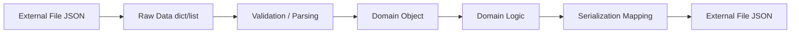

# Part 019 — File I/O, Serialization, dan Data Boundaries

## 1. Tujuan Part Ini

Banyak aplikasi Python terlihat sederhana sampai data masuk dari luar.

Data dari luar bisa datang dari:

- file JSON;
- CSV upload;
- config file;
- command-line argument;
- environment variable;
- database row;
- API response;
- message queue;
- cache;
- user input;
- spreadsheet export;
- legacy system.

Di titik itu, masalah muncul:

- encoding salah;
- file tidak ada;
- file kosong;
- JSON corrupt;
- field missing;
- field type salah;
- schema berubah;
- enum value tidak dikenal;
- data duplicate;
- write terputus dan file rusak;
- partial write;
- race condition;
- CSV quoting aneh;
- timezone hilang;
- data boundary bocor ke domain;
- domain model menjadi dict mentah;
- error message tidak actionable.

Part ini membahas file I/O dan serialization sebagai boundary engineering.

Target setelah part ini:

1. Memahami text vs binary I/O.
2. Memahami encoding.
3. Memakai `pathlib` untuk file.
4. Mendesain JSON serialization boundary.
5. Mendesain CSV boundary.
6. Memvalidasi data eksternal.
7. Menangani missing/corrupt file.
8. Melakukan atomic write sederhana.
9. Memahami schema evolution.
10. Mendesain repository layer yang tidak membocorkan format storage.
11. Menerapkan semua ke `case-tracker`.

---

## 2. Mental Model: Data Boundary

Data boundary adalah tempat data berubah bentuk.

Contoh:

```text
JSON file -> dict -> domain object -> dict -> JSON file
```

Diagram:



Rule utama:

> Jangan biarkan data eksternal mentah menguasai domain model.

Raw dict cocok di boundary. Domain logic sebaiknya memakai object/enum/value object yang valid.

---

## 3. Text vs Binary I/O

Text file:

```python
from pathlib import Path

path = Path("cases.json")
content = path.read_text(encoding="utf-8")
```

Binary file:

```python
data = path.read_bytes()
```

Write text:

```python
path.write_text("hello", encoding="utf-8")
```

Write bytes:

```python
path.write_bytes(b"hello")
```

Gunakan text untuk:

- JSON;
- CSV;
- logs;
- config;
- markdown;
- plain text.

Gunakan binary untuk:

- images;
- PDFs;
- compressed files;
- encrypted data;
- arbitrary byte streams.

---

## 4. Encoding

Selalu explicit encoding saat membaca/menulis text.

Baik:

```python
content = path.read_text(encoding="utf-8")
```

Kurang baik:

```python
content = path.read_text()
```

Kenapa?

Default encoding bisa bergantung platform/environment.

Gunakan UTF-8 sebagai default modern untuk project baru.

CSV juga:

```python
with path.open("r", encoding="utf-8", newline="") as file:
    ...
```

---

## 5. Newline Handling

Untuk CSV, gunakan `newline=""`.

```python
with path.open("w", encoding="utf-8", newline="") as file:
    writer = csv.writer(file)
    ...
```

Ini direkomendasikan agar modul `csv` mengelola newline dengan benar lintas platform.

Untuk plain text biasa, `read_text`/`write_text` cukup.

---

## 6. File Path as Dependency

Jangan hard-code path jauh di dalam domain logic.

Buruk:

```python
def create_case(title: str) -> Case:
    path = Path("cases.json")
    ...
```

Lebih baik:

```python
def create_new_case(path: Path, title: str) -> Case:
    cases = load_cases(path)
    ...
```

Lebih baik lagi saat service tumbuh:

```python
class CaseService:
    def __init__(self, repository: CaseRepository) -> None:
        self._repository = repository
```

Path adalah infrastructure detail. Domain tidak perlu tahu.

---

## 7. JSON Serialization Boundary

Domain object:

```python
@dataclass
class Case:
    id: CaseId
    title: str
    status: CaseStatus
    notes: list[str] = field(default_factory=list)
```

JSON-compatible dict:

```python
def case_to_dict(case: Case) -> dict[str, object]:
    return {
        "id": case.id.value,
        "title": case.title,
        "status": case.status.value,
        "notes": list(case.notes),
    }
```

Back:

```python
def case_from_dict(data: dict[str, object]) -> Case:
    return Case(
        id=CaseId(require_str(data, "id")),
        title=require_str(data, "title"),
        status=CaseStatus(require_str(data, "status")),
        notes=require_str_list(data, "notes", default=[]),
    )
```

Kenapa mapping manual?

- enum harus dikonversi;
- value object harus dikonversi;
- list perlu copy;
- validation bisa dilakukan;
- schema evolution bisa dikontrol;
- domain tidak bergantung pada JSON shape secara buta.

---

## 8. Runtime Validation Helpers

Contoh helper:

```python
def require_str(data: dict[str, object], key: str) -> str:
    value = data.get(key)

    if not isinstance(value, str):
        raise ValueError(f"Field {key!r} must be a string")

    return value
```

List string:

```python
def require_str_list(
    data: dict[str, object],
    key: str,
    *,
    default: list[str] | None = None,
) -> list[str]:
    value = data.get(key, default)

    if value is None:
        raise ValueError(f"Field {key!r} is required")

    if not isinstance(value, list):
        raise ValueError(f"Field {key!r} must be a list")

    if not all(isinstance(item, str) for item in value):
        raise ValueError(f"Field {key!r} must contain only strings")

    return list(value)
```

This is verbose. For bigger projects, validation libraries can help. But manual validation teaches the boundary model.

---

## 9. `json.loads` Returns Untyped Data

```python
data = json.loads(raw_content)
```

At runtime, `data` can be:

- dict;
- list;
- str;
- int/float;
- bool;
- None.

Do not assume shape.

```python
if not isinstance(data, list):
    raise CaseStoreCorruptedError(path, "Root JSON value must be a list")
```

Then validate each item:

```python
cases = []

for item in data:
    if not isinstance(item, dict):
        raise CaseStoreCorruptedError(path, "Each case must be an object")

    cases.append(case_from_dict(item))
```

Boundary validation prevents weird errors later.

---

## 10. Storage Error Design

Define errors:

```python
class CaseStoreError(Exception):
    pass


class CaseStoreCorruptedError(CaseStoreError):
    def __init__(self, path: Path, reason: str) -> None:
        super().__init__(f"Case store is corrupted: {path}. Reason: {reason}")
        self.path = path
        self.reason = reason
```

Use:

```python
try:
    data = json.loads(raw_content)
except json.JSONDecodeError as error:
    raise CaseStoreCorruptedError(path, "Invalid JSON") from error
```

Add context but preserve cause.

---

## 11. Missing File, Empty File, Corrupt File

Decide semantics explicitly.

For `case-tracker`:

| Condition | Semantics |
|---|---|
| Missing file | Empty store |
| Empty file | Empty store |
| Invalid JSON | Corrupted store error |
| Root not list | Corrupted store error |
| Item not object | Corrupted store error |
| Missing required field | Corrupted store error |
| Unknown status | Corrupted store error or migration case |

Implementation:

```python
def load_cases(path: Path) -> list[Case]:
    if not path.exists():
        return []

    raw_content = path.read_text(encoding="utf-8")

    if not raw_content.strip():
        return []

    try:
        data = json.loads(raw_content)
    except json.JSONDecodeError as error:
        raise CaseStoreCorruptedError(path, "Invalid JSON") from error

    if not isinstance(data, list):
        raise CaseStoreCorruptedError(path, "Root JSON value must be a list")

    cases: list[Case] = []

    for item in data:
        if not isinstance(item, dict):
            raise CaseStoreCorruptedError(path, "Each case must be an object")

        try:
            cases.append(case_from_dict(item))
        except (ValueError, KeyError, TypeError) as error:
            raise CaseStoreCorruptedError(path, "Invalid case object") from error

    return cases
```

---

## 12. Writing JSON

```python
def save_cases(path: Path, cases: list[Case]) -> None:
    data = [case_to_dict(case) for case in cases]
    content = json.dumps(data, indent=2)
    path.write_text(content, encoding="utf-8")
```

Better:

```python
content = json.dumps(data, indent=2, ensure_ascii=False)
```

`ensure_ascii=False` keeps non-ASCII readable.

Add newline:

```python
path.write_text(content + "\n", encoding="utf-8")
```

Files with trailing newline are generally nicer for text tools.

---

## 13. Atomic Write

Direct write can corrupt file if process crashes mid-write.

Simple atomic-ish write:

```python
def atomic_write_text(path: Path, content: str) -> None:
    temp_path = path.with_name(f"{path.name}.tmp")
    temp_path.write_text(content, encoding="utf-8")
    temp_path.replace(path)
```

Use:

```python
def save_cases(path: Path, cases: list[Case]) -> None:
    data = [case_to_dict(case) for case in cases]
    content = json.dumps(data, indent=2, ensure_ascii=False) + "\n"
    atomic_write_text(path, content)
```

Caveats:

- same filesystem matters;
- permissions may differ;
- concurrency not solved;
- fsync not handled;
- Windows behavior has details;
- still much better than naive overwrite for many cases.

---

## 14. Directory Creation

If path parent may not exist:

```python
path.parent.mkdir(parents=True, exist_ok=True)
```

In save:

```python
def save_cases(path: Path, cases: list[Case]) -> None:
    path.parent.mkdir(parents=True, exist_ok=True)
    ...
```

Be careful if `path` is relative with no parent concept:

```python
Path("cases.json").parent
```

is `Path(".")`, so `mkdir` is harmless.

---

## 15. Concurrency and File Storage

File JSON storage is not safe for concurrent writers.

Scenario:

```text
Process A loads cases
Process B loads cases
Process A saves case A
Process B saves case B
```

Process B may overwrite Process A’s change.

Solutions:

- file locking;
- SQLite;
- database;
- append-only log;
- single writer process;
- optimistic concurrency;
- transaction system.

For `case-tracker` learning project, JSON file is acceptable. But document limitation:

> Not safe for concurrent writers.

---

## 16. Schema Evolution

Data schema changes over time.

Version 1:

```json
{
  "id": "CASE-001",
  "title": "Late reporting",
  "status": "DRAFT",
  "notes": []
}
```

Version 2 adds priority:

```json
{
  "id": "CASE-001",
  "title": "Late reporting",
  "status": "DRAFT",
  "priority": "MEDIUM",
  "notes": []
}
```

Deserializer must decide default:

```python
priority = CasePriority(data.get("priority", "MEDIUM"))
```

Better include schema version at store root:

```json
{
  "schema_version": 1,
  "cases": []
}
```

Then migration can be explicit.

---

## 17. Store Envelope

Instead of root list:

```json
[
  {...}
]
```

Use envelope:

```json
{
  "schema_version": 1,
  "cases": [
    {
      "id": "CASE-001",
      "title": "Late reporting",
      "status": "DRAFT",
      "notes": []
    }
  ]
}
```

Benefits:

- schema version;
- metadata;
- created_at;
- export info;
- future migration;
- root structure extensible.

Trade-off:

- slightly more verbose;
- migration from old root list needed.

For learning, root list is simpler. For long-lived data, envelope is better.

---

## 18. Migration Function

Example:

```python
CURRENT_SCHEMA_VERSION = 2


def migrate_store(data: dict[str, object]) -> dict[str, object]:
    version = data.get("schema_version", 1)

    if version == 1:
        data = migrate_v1_to_v2(data)
        version = 2

    if version != CURRENT_SCHEMA_VERSION:
        raise ValueError(f"Unsupported schema version: {version}")

    return data
```

Migration v1 to v2:

```python
def migrate_v1_to_v2(data: dict[str, object]) -> dict[str, object]:
    cases = data["cases"]

    if not isinstance(cases, list):
        raise ValueError("cases must be a list")

    for item in cases:
        if isinstance(item, dict):
            item.setdefault("priority", "MEDIUM")

    return {
        **data,
        "schema_version": 2,
    }
```

Migrations need tests.

---

## 19. CSV as Boundary

CSV is tabular. It does not preserve nested structures naturally.

Good for:

- exports;
- spreadsheet-compatible reports;
- simple imports;
- flat records.

Bad for:

- nested notes;
- complex domain object;
- schema-rich data;
- preserving types.

Export cases:

```python
def export_cases_to_csv(path: Path, cases: list[Case]) -> None:
    with path.open("w", encoding="utf-8", newline="") as file:
        writer = csv.DictWriter(file, fieldnames=["id", "title", "status"])
        writer.writeheader()

        for case in cases:
            writer.writerow(
                {
                    "id": case.id.value,
                    "title": case.title,
                    "status": case.status.value,
                }
            )
```

Import CSV must validate:

```python
def import_cases_from_csv(path: Path) -> list[Case]:
    cases: list[Case] = []

    with path.open("r", encoding="utf-8", newline="") as file:
        reader = csv.DictReader(file)

        for row_number, row in enumerate(reader, start=2):
            try:
                cases.append(
                    Case(
                        id=CaseId(row["id"]),
                        title=row["title"],
                        status=CaseStatus(row["status"]),
                    )
                )
            except Exception as error:
                raise ValueError(f"Invalid CSV row {row_number}") from error

    return cases
```

---

## 20. Row-Level Error Reporting

For CSV imports, error should include row number.

```python
class CaseImportError(Exception):
    def __init__(self, row_number: int, reason: str) -> None:
        super().__init__(f"Invalid case import row {row_number}: {reason}")
        self.row_number = row_number
        self.reason = reason
```

Use:

```python
except KeyError as error:
    raise CaseImportError(row_number, f"Missing column: {error}") from error
```

This makes import errors actionable.

---

## 21. Boundary Types

Define separate types:

```python
class CaseData(TypedDict):
    id: str
    title: str
    status: str
    notes: list[str]
```

Domain:

```python
@dataclass
class Case:
    id: CaseId
    title: str
    status: CaseStatus
    notes: list[str]
```

Why separate?

- external data shape may differ from domain;
- boundary can include schema version;
- domain can use value objects/enums;
- serialization can copy mutable data;
- migration can happen before domain construction.

---

## 22. Avoid Domain Leakage into Storage

Bad:

```python
def load_cases(path: Path) -> list[dict]:
    ...
```

Then service uses dict:

```python
case["status"] = "SUBMITTED"
```

This bypasses domain model.

Better:

```python
def load_cases(path: Path) -> list[Case]:
    ...
```

Storage returns valid domain objects or raises error.

For very large data, streaming raw data may be necessary, but then conversion boundary must still be explicit.

---

## 23. Streaming Serialization

For large JSON arrays, standard `json.load` loads all data.

For line-oriented streaming, use JSON Lines:

```python
def iter_cases_from_jsonl(path: Path) -> Iterator[Case]:
    with path.open("r", encoding="utf-8") as file:
        for line_number, line in enumerate(file, start=1):
            if not line.strip():
                continue

            try:
                data = json.loads(line)
                if not isinstance(data, dict):
                    raise ValueError("line must contain object")
                yield case_from_dict(data)
            except Exception as error:
                raise ValueError(f"Invalid JSONL line {line_number}") from error
```

JSONL is good for:

- logs;
- event streams;
- append-only data;
- large datasets.

For simple `case-tracker`, JSON array is fine.

---

## 24. Binary Serialization Warning

Python has `pickle`, but:

> Do not unpickle untrusted data.

Pickle can execute arbitrary code during loading.

Use pickle only for trusted internal data and even then carefully.

For data interchange, prefer:

- JSON;
- CSV;
- SQLite;
- protocol buffers/avro/parquet with appropriate libraries if needed;
- domain-specific formats.

---

## 25. Config Files

For config:

- environment variables;
- TOML;
- INI;
- JSON;
- YAML via external dependency if needed.

Standard library can read TOML with `tomllib` and INI with `configparser`.

Example TOML:

```toml
store_path = "cases.json"
log_level = "INFO"
```

Read:

```python
import tomllib

def load_config(path: Path) -> AppConfig:
    data = tomllib.loads(path.read_text(encoding="utf-8"))
    ...
```

Do not let raw config dict spread everywhere. Parse into config object.

---

## 26. Repository Pattern for File Storage

Protocol:

```python
class CaseRepository(Protocol):
    def list(self) -> list[Case]:
        ...

    def save_all(self, cases: list[Case]) -> None:
        ...
```

JSON repository:

```python
class JsonCaseRepository:
    def __init__(self, path: Path) -> None:
        self._path = path

    def list(self) -> list[Case]:
        return load_cases(self._path)

    def save_all(self, cases: list[Case]) -> None:
        save_cases(self._path, cases)
```

Service no longer knows JSON:

```python
class CaseService:
    def __init__(self, repository: CaseRepository) -> None:
        self._repository = repository
```

Benefits:

- test with fake repository;
- swap JSON to SQLite later;
- boundary localized;
- contract test possible.

---

## 27. Data Integrity Checks

When loading, verify invariants:

- duplicate case ids;
- invalid status;
- missing required field;
- notes list valid;
- closed case has closed timestamp if required;
- title non-empty;
- schema version supported.

Example duplicate check:

```python
def ensure_unique_case_ids(cases: list[Case]) -> None:
    seen: set[CaseId] = set()

    for case in cases:
        if case.id in seen:
            raise ValueError(f"Duplicate case id: {case.id}")

        seen.add(case.id)
```

Call after loading:

```python
cases = [...]
ensure_unique_case_ids(cases)
return cases
```

---

## 28. Partial Failure and Backup

Before migration/write, consider backup.

```python
def backup_file(path: Path) -> Path | None:
    if not path.exists():
        return None

    backup_path = path.with_suffix(path.suffix + ".bak")
    backup_path.write_bytes(path.read_bytes())
    return backup_path
```

For critical data, better practices include:

- transactional database;
- append-only log;
- backups;
- checksums;
- schema migrations;
- recovery plan.

For learning project, simple backup illustrates concept.

---

## 29. Checksums

Use hash to detect changes/corruption in some contexts.

```python
import hashlib

def sha256_file(path: Path) -> str:
    digest = hashlib.sha256()

    with path.open("rb") as file:
        for chunk in iter(lambda: file.read(1024 * 1024), b""):
            digest.update(chunk)

    return digest.hexdigest()
```

Use cases:

- artifact verification;
- backup integrity;
- cache keys;
- change detection.

Do not confuse checksum with security/authentication unless using proper threat model.

---

## 30. Case Tracker Storage v2 Sketch

```python
import json
from pathlib import Path

CURRENT_SCHEMA_VERSION = 1


def load_store(path: Path) -> list[Case]:
    if not path.exists():
        return []

    raw_content = path.read_text(encoding="utf-8")

    if not raw_content.strip():
        return []

    try:
        root = json.loads(raw_content)
    except json.JSONDecodeError as error:
        raise CaseStoreCorruptedError(path, "Invalid JSON") from error

    if isinstance(root, list):
        # Backward compatibility for v0 root-list format.
        cases = parse_case_list(root, path)
        ensure_unique_case_ids(cases)
        return cases

    if not isinstance(root, dict):
        raise CaseStoreCorruptedError(path, "Root must be object or list")

    version = root.get("schema_version")

    if version != CURRENT_SCHEMA_VERSION:
        raise CaseStoreCorruptedError(path, f"Unsupported schema version: {version}")

    raw_cases = root.get("cases")

    if not isinstance(raw_cases, list):
        raise CaseStoreCorruptedError(path, "cases must be a list")

    cases = parse_case_list(raw_cases, path)
    ensure_unique_case_ids(cases)
    return cases
```

Save envelope:

```python
def save_store(path: Path, cases: list[Case]) -> None:
    root = {
        "schema_version": CURRENT_SCHEMA_VERSION,
        "cases": [case_to_dict(case) for case in cases],
    }

    content = json.dumps(root, indent=2, ensure_ascii=False) + "\n"
    path.parent.mkdir(parents=True, exist_ok=True)
    atomic_write_text(path, content)
```

---

## 31. Testing File I/O

Use `tmp_path`.

```python
def test_load_cases_returns_empty_when_file_missing(tmp_path: Path) -> None:
    assert load_cases(tmp_path / "cases.json") == []
```

Invalid JSON:

```python
def test_load_cases_rejects_invalid_json(tmp_path: Path) -> None:
    path = tmp_path / "cases.json"
    path.write_text("{bad", encoding="utf-8")

    with pytest.raises(CaseStoreCorruptedError):
        load_cases(path)
```

Atomic write:

```python
def test_save_cases_creates_parent_directory(tmp_path: Path) -> None:
    path = tmp_path / "nested" / "cases.json"

    save_cases(path, [])

    assert path.exists()
```

---

## 32. Testing Serialization Copy

```python
def test_case_to_dict_copies_notes() -> None:
    case = Case(id=CaseId("CASE-001"), title="Late reporting")
    case.add_note("Created")

    data = case_to_dict(case)
    data["notes"].append("Injected")

    assert case.notes == ["Created"]
```

This protects against aliasing bugs.

---

## 33. Testing Schema Evolution

Old format:

```python
def test_load_cases_supports_legacy_root_list(tmp_path: Path) -> None:
    path = tmp_path / "cases.json"
    path.write_text(
        """
        [
          {
            "id": "CASE-001",
            "title": "Late reporting",
            "status": "DRAFT",
            "notes": []
          }
        ]
        """,
        encoding="utf-8",
    )

    cases = load_cases(path)

    assert cases[0].id == CaseId("CASE-001")
```

Unsupported version:

```python
def test_load_cases_rejects_unknown_schema_version(tmp_path: Path) -> None:
    path = tmp_path / "cases.json"
    path.write_text('{"schema_version": 999, "cases": []}', encoding="utf-8")

    with pytest.raises(CaseStoreCorruptedError):
        load_cases(path)
```

---

## 34. File I/O Smell Checklist

Watch for:

1. No explicit encoding.
2. Domain logic reading files directly.
3. Raw dict spreading into service/domain.
4. Missing file and corrupt file treated same.
5. `except Exception: return []`.
6. JSON enum not mapped explicitly.
7. Dataclass dumped via `__dict__` blindly.
8. Mutable list shared between domain and serialized dict.
9. No schema version for long-lived data.
10. Direct overwrite without atomic strategy.
11. Tests writing real project files.
12. CSV import without row numbers.
13. Hard-coded current working directory.
14. Pickle used for untrusted data.
15. External data trusted without validation.

---

## 35. Practice: Add Atomic Write

Implement:

```python
def atomic_write_text(path: Path, content: str) -> None:
    path.parent.mkdir(parents=True, exist_ok=True)
    temp_path = path.with_name(f"{path.name}.tmp")
    temp_path.write_text(content, encoding="utf-8")
    temp_path.replace(path)
```

Use in `save_cases`.

Test parent directory creation.

---

## 36. Practice: Add Store Envelope

Change file format to:

```json
{
  "schema_version": 1,
  "cases": []
}
```

Keep backward compatibility with root list.

Test:

- missing file;
- empty file;
- root list legacy;
- envelope current;
- unsupported version;
- root not list/object;
- duplicate id.

---

## 37. Practice: CSV Export

Implement:

```python
def export_cases_to_csv(path: Path, cases: Iterable[Case]) -> None:
    ...
```

Test:

- header exists;
- one case row;
- status value serialized;
- parent directory creation if desired.

---

## 38. Practice: CSV Import

Implement:

```python
def import_cases_from_csv(path: Path) -> list[Case]:
    ...
```

Test:

- valid row;
- missing column;
- invalid status;
- row number included in error.

---

## 39. Practice: Config Boundary

Create:

```python
@dataclass(frozen=True)
class AppConfig:
    store_path: Path
    log_level: str = "INFO"
```

Parse from env:

```python
def load_config_from_env(environ: Mapping[str, str]) -> AppConfig:
    return AppConfig(
        store_path=Path(environ.get("CASE_TRACKER_STORE", "cases.json")),
        log_level=environ.get("CASE_TRACKER_LOG_LEVEL", "INFO"),
    )
```

Test with plain dict, not real environment.

---

## 40. Self-Check

Jawab tanpa melihat materi:

1. Apa itu data boundary?
2. Kenapa domain tidak sebaiknya memakai raw dict?
3. Kenapa encoding harus explicit?
4. Apa beda missing file dan corrupt file?
5. Kenapa `json.loads` perlu validation?
6. Kenapa enum perlu `.value` saat serialization?
7. Kenapa `case_to_dict` perlu copy list?
8. Apa itu atomic write?
9. Apa limitation atomic write sederhana?
10. Kenapa JSON file storage tidak safe untuk concurrent writers?
11. Apa itu schema evolution?
12. Apa manfaat store envelope?
13. Kapan CSV cocok?
14. Kenapa CSV import error perlu row number?
15. Kenapa pickle berbahaya untuk untrusted data?
16. Apa fungsi repository pattern di storage?
17. Apa integrity check yang penting?
18. Kapan backup sebelum migration berguna?
19. Bagaimana test file I/O dengan pytest?
20. Apa smell paling berbahaya dalam file I/O code?

---

## 41. Definition of Done Part 019

Kamu selesai part ini jika bisa:

1. Membaca/menulis text dengan encoding explicit.
2. Mendesain JSON mapping domain-to-dict.
3. Mendesain dict-to-domain validation.
4. Membedakan missing/empty/corrupt file.
5. Membuat custom storage error.
6. Memakai exception chaining untuk JSON decode.
7. Menulis atomic write sederhana.
8. Menambahkan parent directory creation.
9. Menjelaskan schema evolution.
10. Menambahkan store envelope.
11. Menulis CSV export.
12. Menulis CSV import dengan row-level error.
13. Menjelaskan repository boundary.
14. Menulis tests dengan `tmp_path`.
15. Menghindari raw dict leakage ke domain.

---

## 42. Ringkasan

File I/O dan serialization adalah boundary yang harus didesain.

Inti part ini:

- file data eksternal tidak boleh dipercaya begitu saja;
- encoding harus explicit;
- JSON data harus divalidasi sebelum menjadi domain object;
- domain object harus dimapping eksplisit ke representation;
- missing file, empty file, dan corrupt file punya semantics berbeda;
- atomic write mengurangi risiko file corrupt;
- JSON file storage punya batas concurrency;
- schema version membantu evolusi data;
- CSV cocok untuk data tabular tetapi butuh validation;
- row-level error membuat import actionable;
- repository pattern menyembunyikan format storage dari service/domain;
- tests harus mencakup boundary dan failure path.

Part berikutnya akan membahas logging, diagnostics, dan runtime visibility: bagaimana membuat aplikasi Python bisa dipahami saat berjalan, saat gagal, dan saat dioperasikan.

---

## 43. Referensi

- Python Documentation — `pathlib`.
- Python Documentation — `json`.
- Python Documentation — `csv`.
- Python Documentation — `tempfile`.
- Python Documentation — `hashlib`.
- Python Documentation — `pickle`.
- Python Documentation — `tomllib`.
