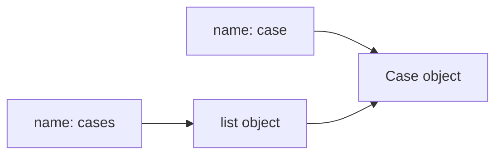
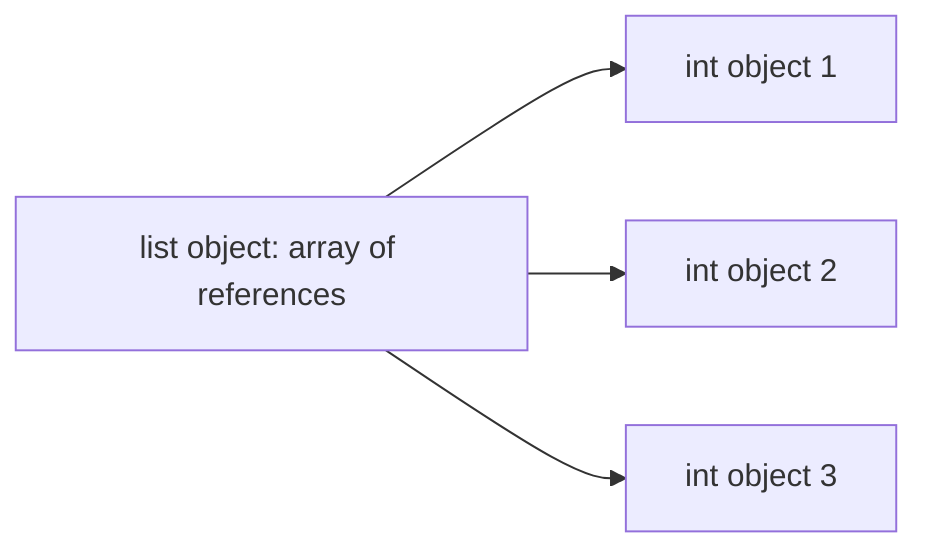

# Part 024 — Memory Model, Object Overhead, dan Data-Oriented Python

## 1. Tujuan Part Ini

Python membuat banyak hal mudah karena hampir semua adalah object. Tetapi kemudahan itu punya biaya memory.

Untuk banyak aplikasi, biaya ini tidak masalah. Untuk workload besar, biaya memory bisa menjadi bottleneck:

- jutaan object domain;
- parsing file besar;
- batch processing;
- data import/export;
- in-memory cache;
- high-throughput API;
- background worker;
- ETL;
- analytics preprocessing;
- repeated allocation;
- container nested.

Part ini membahas memory bukan sebagai trivia internal, tetapi sebagai engineering skill:

- memahami reference;
- memahami object overhead;
- memahami container overhead;
- memakai `sys.getsizeof` dengan benar;
- memakai `tracemalloc`;
- menghindari allocation churn;
- memakai streaming;
- memahami `__slots__`;
- memakai dataclass slots;
- memilih representation yang lebih data-oriented;
- menjaga readability dan correctness.

Target setelah part ini:

1. Memahami object/reference memory model.
2. Memahami why Python object overhead exists.
3. Memahami list/dict/set memory behavior secara praktis.
4. Memakai `sys.getsizeof` tanpa salah interpretasi.
5. Memakai `tracemalloc` untuk allocation profiling.
6. Mengenali memory smell.
7. Mengurangi intermediate collections.
8. Memakai generator/streaming untuk memory.
9. Memahami `__slots__` dan dataclass `slots=True`.
10. Mendesain representation yang sesuai ukuran data.
11. Menerapkan memory thinking ke `case-tracker`.

---

## 2. Mental Model: Names, References, Objects

Dari part sebelumnya:

```python
case = Case(id="CASE-001", title="Late reporting")
cases = [case]
```

Mental model:



List menyimpan references ke object, bukan object embedded secara langsung.

Jika object berubah:

```python
case.title = "Updated"
```

List melihat object yang sama.

Memory model ini penting karena:

- container overhead terpisah dari object contents;
- copy sering shallow;
- aliasing bisa menyebabkan mutation bug;
- `sys.getsizeof(list)` tidak termasuk semua object di dalamnya secara rekursif;
- banyak object kecil bisa mahal.

---

## 3. Python Object Overhead

Setiap object Python membawa metadata runtime seperti:

- reference count;
- type pointer;
- object-specific fields;
- optional dict untuk attributes;
- GC tracking overhead untuk sebagian object;
- alignment/padding.

Kamu tidak perlu menghafal byte tepatnya karena bergantung build/platform/version. Yang penting:

> Object Python tidak hanya menyimpan value. Ia juga menyimpan metadata runtime.

Contoh conceptual:

```text
int object:
  header metadata
  integer value

str object:
  header metadata
  length/hash/cache/encoding details
  character data

custom object:
  header metadata
  pointer to __dict__
  attribute dict
```

Untuk sedikit object, overhead tidak penting. Untuk jutaan object, overhead dominan.

---

## 4. References in Containers

List of ints:

```python
numbers = [1, 2, 3]
```

Conceptual:



List stores references. It is not a packed C array of integers.

This is why numeric-heavy workloads often benefit from specialized arrays or libraries.

Standard library options:

- `array.array`;
- `memoryview`;
- `struct`;
- `sqlite3`;
- external libraries like NumPy when justified.

---

## 5. `sys.getsizeof`

```python
import sys

size = sys.getsizeof([1, 2, 3])
```

`sys.getsizeof(obj)` returns size of the object itself in bytes, including GC overhead if applicable.

Important caveat:

> For containers, `sys.getsizeof(container)` does not recursively include the sizes of contained objects.

Example:

```python
items = ["a" * 1000 for _ in range(1000)]
print(sys.getsizeof(items))
```

This mostly measures list object/reference array, not all strings.

To estimate deep size, you need recursive traversal or specialized tools. Even then, shared references make it tricky.

---

## 6. Shallow vs Deep Memory

Example:

```python
a = "x" * 1000
items = [a, a, a]
```

Deep size should not count `a` three times if measuring actual memory footprint.

But conceptual data size might count three logical entries.

This distinction matters:

- actual memory footprint;
- serialized size;
- logical data size;
- memory retained due to references.

Memory measurement requires defining what you mean.

---

## 7. `tracemalloc`

`tracemalloc` traces Python memory allocations.

Basic:

```python
import tracemalloc

tracemalloc.start()

run_workload()

current, peak = tracemalloc.get_traced_memory()
print(f"current={current / 1024 / 1024:.2f} MiB")
print(f"peak={peak / 1024 / 1024:.2f} MiB")

tracemalloc.stop()
```

Snapshot:

```python
snapshot = tracemalloc.take_snapshot()
top_stats = snapshot.statistics("lineno")

for stat in top_stats[:10]:
    print(stat)
```

It helps answer:

- where allocations happen;
- current/peak traced memory;
- which lines allocate most;
- before/after allocation differences.

---

## 8. Comparing Snapshots

```python
tracemalloc.start()

before = tracemalloc.take_snapshot()
run_workload()
after = tracemalloc.take_snapshot()

stats = after.compare_to(before, "lineno")

for stat in stats[:10]:
    print(stat)
```

This shows allocation differences by line.

Use it to find:

- unexpected large allocations;
- intermediate lists;
- caches retaining data;
- repeated object creation.

Caveat: `tracemalloc` traces Python allocations, not every byte of native memory used by extensions.

---

## 9. Process Memory vs Python Allocations

Process RSS memory from OS may differ from `tracemalloc`.

Reasons:

- Python allocator arenas;
- memory fragmentation;
- native extensions;
- mmap;
- shared libraries;
- freed memory not immediately returned to OS;
- OS page behavior.

Use:

- `tracemalloc` for Python allocation source;
- OS/container metrics for process memory;
- specialized profilers for production.

Do not expect `tracemalloc` number to equal process RSS.

---

## 10. Container Overhead

### 10.1 List

List is dynamic array of references.

Characteristics:

- ordered;
- fast index;
- append amortized O(1);
- over-allocates capacity to make append efficient;
- inserting/removing middle shifts references.

Memory issue:

- list of many objects stores many references;
- contained objects memory separate;
- intermediate lists can spike memory.

### 10.2 Dict

Dict is hash table.

Characteristics:

- fast average lookup;
- preserves insertion order in modern Python;
- more memory overhead than list;
- keys must be hashable.

Dict is excellent for lookup, but not free.

### 10.3 Set

Set is hash table of unique keys.

Characteristics:

- fast membership;
- memory overhead similar family to dict;
- order not semantic.

Use set for membership/uniqueness, but do not store giant sets unnecessarily if streaming would do.

---

## 11. Custom Object Attribute Dict

Normal custom objects usually have `__dict__`.

```python
class Case:
    def __init__(self, case_id: str, title: str) -> None:
        self.id = case_id
        self.title = title
        self.status = "DRAFT"
```

Each instance can have arbitrary attributes:

```python
case.anything = "allowed"
```

This flexibility costs memory because per-instance attribute dictionary is needed.

For many instances, this can matter.

---

## 12. `__slots__`

`__slots__` declares fixed attributes and can remove per-instance `__dict__`.

```python
class Case:
    __slots__ = ("id", "title", "status")

    def __init__(self, case_id: str, title: str) -> None:
        self.id = case_id
        self.title = title
        self.status = "DRAFT"
```

Now arbitrary attributes fail:

```python
case.extra = "nope"
```

Benefits:

- lower memory per instance;
- attribute typo can be caught;
- sometimes faster attribute access;
- useful for many small objects.

Costs:

- less dynamic;
- inheritance complexity;
- no `__dict__` unless included;
- some libraries expect `__dict__`;
- premature use can hurt ergonomics.

---

## 13. Dataclass `slots=True`

```python
from dataclasses import dataclass


@dataclass(slots=True)
class Case:
    id: str
    title: str
    status: str = "DRAFT"
```

This combines dataclass convenience with slots.

Also possible:

```python
@dataclass(slots=True, frozen=True)
class CaseId:
    value: str
```

Use when:

- many instances;
- fields stable;
- memory matters;
- dynamic attributes not needed.

Do not use blindly for every dataclass. But for value objects and large datasets, it is worth considering.

---

## 14. Measuring Slots

Example experiment:

```python
import sys
from dataclasses import dataclass


@dataclass
class NormalCase:
    id: str
    title: str


@dataclass(slots=True)
class SlottedCase:
    id: str
    title: str


normal = NormalCase("CASE-001", "Late reporting")
slotted = SlottedCase("CASE-001", "Late reporting")

print(sys.getsizeof(normal))
print(sys.getsizeof(slotted))
```

Caveat:

- `sys.getsizeof(normal)` may not include `normal.__dict__`;
- measure many objects with `tracemalloc` for more realistic view.

Better:

```python
def make_normal(count: int) -> list[NormalCase]:
    return [NormalCase(str(index), "title") for index in range(count)]


def make_slotted(count: int) -> list[SlottedCase]:
    return [SlottedCase(str(index), "title") for index in range(count)]
```

Compare peak with `tracemalloc`.

---

## 15. Allocation Churn

Allocation churn means repeatedly creating short-lived objects.

Example:

```python
for case in cases:
    row = {
        "id": case.id.value,
        "title": case.title,
        "status": case.status.value,
    }
    process(row)
```

If `process` could accept tuple or direct fields, dict allocation may be unnecessary.

But clarity matters. Avoid optimizing away useful structure unless measured.

Common churn sources:

- intermediate lists;
- dict per row;
- repeated string concatenation;
- repeated parsing;
- repeated regex compilation;
- copying data at every layer;
- converting list/set repeatedly.

---

## 16. String Concatenation

Bad in loop:

```python
output = ""

for line in lines:
    output += line + "\n"
```

Better:

```python
output = "\n".join(lines) + "\n"
```

Or streaming:

```python
for line in lines:
    file.write(line)
    file.write("\n")
```

For few strings, irrelevant. For many strings, use join or streaming.

---

## 17. Large Intermediate Lists

Bad:

```python
open_cases = [case for case in cases if case.is_open()]
open_case_ids = [case.id for case in open_cases]
return open_case_ids
```

If only ids needed:

```python
return [case.id for case in cases if case.is_open()]
```

If huge and consumer can stream:

```python
def iter_open_case_ids(cases: Iterable[Case]) -> Iterator[CaseId]:
    for case in cases:
        if case.is_open():
            yield case.id
```

---

## 18. Generators and Memory

Generator avoids materializing intermediate list.

```python
case_ids = (case.id for case in cases if case.is_open())
```

But generators are one-shot and can defer errors.

Use generator when:

- data large;
- single pass;
- consumer can stream;
- memory matters.

Use list when:

- data small;
- need multiple passes;
- debugging/readability;
- random access/length needed.

---

## 19. Streaming File Processing

Memory-heavy:

```python
content = path.read_text(encoding="utf-8")
for line in content.splitlines():
    process(line)
```

Streaming:

```python
with path.open("r", encoding="utf-8") as file:
    for line in file:
        process(line)
```

For huge files, streaming matters.

For JSON array, standard `json.load` loads whole structure. Consider JSON Lines for streaming.

---

## 20. Representation Choice

Domain-rich representation:

```python
@dataclass
class Case:
    id: CaseId
    title: str
    status: CaseStatus
    notes: list[str]
```

Data-oriented representation:

```python
case_ids: list[str]
titles: list[str]
statuses: list[str]
```

Or row tuples:

```python
CaseRow = tuple[str, str, str]
```

Trade-off:

| Representation | Pros | Cons |
|---|---|---|
| Domain objects | readable, invariant, behavior | overhead |
| dicts | flexible, JSON-like | typo risk, overhead |
| tuples | compact-ish, fast | less self-documenting |
| parallel lists | memory efficient for some ops | harder invariants |
| arrays/native libs | compact numeric data | less general |
| SQLite | offload memory to DB | query/persistence complexity |

Rule:

> Use domain objects for core business logic. Use data-oriented representation for large-scale processing boundaries when measured.

---

## 21. Data-Oriented Python

Data-oriented does not mean abandoning design. It means choosing representation based on access pattern.

Questions:

1. Do we need behavior per object?
2. Are we processing millions of rows?
3. Do we mostly filter/sort/group?
4. Are fields fixed?
5. Is memory the bottleneck?
6. Can validation happen once at boundary?
7. Can database handle operation better?
8. Can streaming avoid object creation?
9. Is readability still acceptable?

Example:

For CLI listing 1 million cases, maybe you do not need full `Case` objects. You could stream raw validated summaries.

For transition of one case, domain object is good.

---

## 22. Case Tracker Memory Scenario

Scenario:

> `case-tracker list` loads 1 million cases and prints summaries.

Naive:

```python
cases = load_cases(path)
summaries = [render_case_summary(case) for case in cases]

for summary in summaries:
    print(summary)
```

Memory issues:

- full JSON parsed;
- full domain objects;
- full summaries list;
- print output.

Better:

1. Use JSONL store for streaming.
2. Iterate case rows.
3. Render one summary at a time.
4. Avoid storing summaries.

```python
for case in iter_cases_from_jsonl(path):
    print(render_case_summary(case))
```

Even better for huge output: support filtering/pagination/summary count.

---

## 23. Memory and JSON

JSON array requires parsing the whole document with standard `json`.

For big data:

- JSONL streaming;
- SQLite;
- database;
- chunked format;
- compressed streaming;
- external parsing library if justified.

If file size grows large, JSON file may stop being the right storage format.

For multi-writer or large datasets, SQLite is often better than custom JSON.

---

## 24. SQLite as Memory Strategy

Instead of loading all cases:

```python
cases = load_cases(path)
```

Query only what you need:

```sql
SELECT id, title, status FROM cases WHERE status = ?
```

Benefits:

- avoids loading all data;
- uses indexes;
- persistence atomicity;
- query engine optimized;
- can handle larger data than memory.

Trade-off:

- schema/migrations;
- SQL;
- connection management;
- transaction semantics.

For case management beyond toy level, SQLite/database is often more appropriate than giant JSON file.

---

## 25. `array.array`

For numeric homogeneous data:

```python
from array import array

values = array("i", [1, 2, 3, 4])
```

More compact than list of Python ints for large numeric arrays.

Use cases:

- binary numeric data;
- compact storage;
- interop with buffers.

For serious numeric computing, NumPy may be justified.

---

## 26. `memoryview`

`memoryview` lets you view binary data without copying.

```python
data = b"abcdef"
view = memoryview(data)

print(view[1:4])
```

Useful for binary protocols, parsing, zero-copy slices.

Most application developers rarely need it, but knowing it exists helps for performance-sensitive binary work.

---

## 27. `struct`

Pack/unpack binary data:

```python
import struct

data = struct.pack("!I", 42)
value = struct.unpack("!I", data)[0]
```

Use for binary formats/protocols, not normal JSON/CSV apps.

---

## 28. Object Pools?

Object pooling is common in some languages, but usually not needed in Python application code.

Reasons:

- Python allocator already optimizes many small allocations;
- pools add complexity;
- stale state bugs;
- often slower than simple allocation;
- GC/reference cycles can complicate.

Use object pools only with strong measurement and clear lifecycle.

---

## 29. Garbage Collection

CPython primarily uses reference counting, plus cyclic garbage collector for reference cycles.

Practical implications:

- objects often freed when refcount drops to zero;
- cycles need GC;
- `__del__` can complicate cleanup;
- context managers are better for external resources;
- memory may not return to OS immediately;
- high allocation churn can trigger GC overhead.

You usually do not need to tune GC early.

If memory/GC is suspected:

- measure first;
- inspect object retention;
- use `tracemalloc`;
- avoid cycles if possible;
- close resources deterministically.

---

## 30. Reference Cycles

Example:

```python
class Node:
    def __init__(self) -> None:
        self.parent: Node | None = None
        self.children: list[Node] = []


parent = Node()
child = Node()
child.parent = parent
parent.children.append(child)
```

This creates cycle:

```text
parent -> child -> parent
```

Python GC can collect cycles if no external references, but cycles with finalizers/resources can be tricky.

For resource cleanup, use context managers.

---

## 31. Retained References

Memory “leak” in Python often means references are still retained.

Example:

```python
cache: dict[str, Case] = {}

def process(case: Case) -> None:
    cache[case.id.value] = case
```

Cache grows forever.

Or:

```python
all_results.append(result)
```

in long-running worker.

Use bounded caches:

```python
@lru_cache(maxsize=1024)
```

or explicit eviction.

---

## 32. Weak References

`weakref` allows references that do not keep object alive.

```python
import weakref

ref = weakref.ref(case)
maybe_case = ref()
```

Use cases:

- caches;
- observer patterns;
- avoiding cycles.

Most application code does not need weakref. Use only when lifecycle requires it.

---

## 33. Memory and Logging

Bad:

```python
logger.debug("cases=%s", cases)
```

For huge list, formatting/logging can allocate large strings and expose data.

Better:

```python
logger.debug("case_count=%d", len(cases))
```

If expensive rendering:

```python
if logger.isEnabledFor(logging.DEBUG):
    logger.debug("cases=%s", render_cases(cases))
```

Log metadata, not huge payloads.

---

## 34. Memory and Exceptions

Exception tracebacks hold references to stack frames and local variables.

If you store exception objects globally, you may retain large objects accidentally.

Bad:

```python
LAST_ERROR = None

try:
    process_huge_data()
except Exception as error:
    LAST_ERROR = error
```

Traceback may retain locals from `process_huge_data`.

If storing error info, store string/summary or clear traceback if needed.

Usually just log exception and let it go.

---

## 35. Case Tracker: Memory Measurement Script

```python
from pathlib import Path
import tracemalloc

from case_tracker.storage import load_cases


def main() -> None:
    path = Path("cases-large.json")

    tracemalloc.start()

    cases = load_cases(path)

    current, peak = tracemalloc.get_traced_memory()
    print(f"Loaded {len(cases)} cases")
    print(f"current={current / 1024 / 1024:.2f} MiB")
    print(f"peak={peak / 1024 / 1024:.2f} MiB")

    snapshot = tracemalloc.take_snapshot()

    for stat in snapshot.statistics("lineno")[:10]:
        print(stat)


if __name__ == "__main__":
    main()
```

Run after generating large dataset.

---

## 36. Case Tracker: Slotted Domain Experiment

```python
@dataclass(slots=True, frozen=True)
class CaseId:
    value: str


@dataclass(slots=True)
class Case:
    id: CaseId
    title: str
    status: CaseStatus = CaseStatus.DRAFT
    notes: list[str] = field(default_factory=list)
```

Measure:

1. Load 100k cases with normal dataclass.
2. Load 100k cases with slotted dataclass.
3. Compare peak memory.
4. Run tests.
5. Evaluate library compatibility.
6. Decide if trade-off worth it.

Do not change based on ideology. Measure.

---

## 37. Case Tracker: Avoid Summary List

Before:

```python
summaries = [render_case_summary(case) for case in cases]
write_lines(summaries)
```

After:

```python
write_lines(render_case_summary(case) for case in cases)
```

`write_lines`:

```python
def write_lines(lines: Iterable[str]) -> None:
    for line in lines:
        print(line)
```

This avoids storing summaries.

---

## 38. Case Tracker: Streaming JSONL Store

For huge dataset:

```python
def iter_cases_from_jsonl(path: Path) -> Iterator[Case]:
    with path.open("r", encoding="utf-8") as file:
        for line in file:
            if not line.strip():
                continue

            data = json.loads(line)

            if not isinstance(data, dict):
                raise ValueError("Each JSONL line must be an object")

            yield case_from_dict(data)
```

Now list command can stream:

```python
for case in iter_cases_from_jsonl(path):
    print(render_case_summary(case))
```

But transition operation needs update. JSONL append-only/event log or database may be better.

---

## 39. Case Tracker: Data-Oriented Report

If reporting only counts by status, do not build all objects if not needed.

For JSONL:

```python
from collections import Counter


def count_statuses_from_jsonl(path: Path) -> Counter[str]:
    counts: Counter[str] = Counter()

    with path.open("r", encoding="utf-8") as file:
        for line in file:
            if not line.strip():
                continue

            data = json.loads(line)

            if isinstance(data, dict):
                status = data.get("status")

                if isinstance(status, str):
                    counts[status] += 1

    return counts
```

This is less domain-rich but more memory-efficient for a report. Validate according to risk.

Data-oriented shortcut should be localized and documented.

---

## 40. Memory Optimization Decision Framework

Ask:

1. Is memory actually a bottleneck?
2. What is peak memory?
3. Where are allocations?
4. Are we loading more data than needed?
5. Are intermediate lists avoidable?
6. Are many custom objects needed?
7. Could streaming solve it?
8. Could database query solve it?
9. Could `slots` help?
10. Is representation too rich for this workload?
11. Will optimization harm readability?
12. Are tests protecting behavior?
13. Is memory saved worth complexity?
14. Is object lifetime longer than necessary?
15. Is cache bounded?

---

## 41. Memory Smell Checklist

Watch for:

1. Loading entire huge file unnecessarily.
2. Building multiple full-size intermediate lists.
3. Dict per row for millions of rows.
4. Domain object per row when only one field needed.
5. Unbounded cache.
6. Global list of processed results.
7. Logging huge payloads.
8. Storing exception objects.
9. Repeated string concatenation.
10. Copying nested structures at every layer.
11. Reading JSON array for streaming workload.
12. No pagination/limit.
13. Retaining references in closures/callbacks.
14. Holding all futures/results for huge task set.
15. Using memory optimization before measuring.

---

## 42. Practice: `sys.getsizeof`

Run:

```python
import sys

items = ["x" * 1000 for _ in range(1000)]

print(sys.getsizeof(items))
print(sys.getsizeof(items[0]))
print(sum(sys.getsizeof(item) for item in items))
```

Questions:

1. What does list size include?
2. What does it exclude?
3. Are strings all distinct?
4. What if all entries reference same string?
5. Why is deep size hard?

---

## 43. Practice: `tracemalloc` Peak

Create:

```python
def allocate_many_cases(count: int) -> list[Case]:
    return [
        Case(id=CaseId(f"CASE-{index:06d}"), title=f"Case {index}")
        for index in range(count)
    ]
```

Measure current and peak with `tracemalloc`.

Then delete reference:

```python
cases = allocate_many_cases(100_000)
del cases
```

Check current again. Discuss why OS RSS may not drop.

---

## 44. Practice: Slots Experiment

Create normal and slotted dataclasses. Allocate 100k of each. Compare peak traced memory.

Questions:

1. How much memory changed?
2. Did tests still pass?
3. Did code need dynamic attributes?
4. Is complexity worth it?
5. Would this matter at 1k objects?

---

## 45. Practice: Remove Intermediate List

Before:

```python
closed_cases = [case for case in cases if case.status is CaseStatus.CLOSED]
closed_ids = [case.id for case in closed_cases]
```

After:

```python
closed_ids = [
    case.id
    for case in cases
    if case.status is CaseStatus.CLOSED
]
```

Streaming:

```python
def iter_closed_case_ids(cases: Iterable[Case]) -> Iterator[CaseId]:
    for case in cases:
        if case.status is CaseStatus.CLOSED:
            yield case.id
```

Test same output.

---

## 46. Practice: JSONL Streaming

Implement:

```python
def write_cases_jsonl(path: Path, cases: Iterable[Case]) -> None:
    ...


def iter_cases_jsonl(path: Path) -> Iterator[Case]:
    ...
```

Test:

- empty file;
- one case;
- multiple cases;
- invalid line;
- line number in error.

Compare memory vs JSON array for large input.

---

## 47. Practice: Status Count Without Domain Objects

Write two versions:

```python
def count_statuses_domain(path: Path) -> Counter[CaseStatus]:
    cases = load_cases(path)
    return Counter(case.status for case in cases)


def count_statuses_raw_jsonl(path: Path) -> Counter[str]:
    ...
```

Compare:

- correctness risk;
- validation strength;
- memory use;
- speed;
- readability.

---

## 48. Self-Check

Jawab tanpa melihat materi:

1. Kenapa Python object punya overhead?
2. Apa yang disimpan list?
3. Kenapa list of ints bukan packed int array?
4. Apa yang diukur `sys.getsizeof`?
5. Kenapa `sys.getsizeof(container)` tidak cukup untuk deep size?
6. Apa fungsi `tracemalloc`?
7. Kenapa `tracemalloc` berbeda dari RSS?
8. Apa itu allocation churn?
9. Kapan generator menghemat memory?
10. Kapan generator kurang cocok?
11. Apa fungsi `__slots__`?
12. Apa trade-off `__slots__`?
13. Apa manfaat dataclass `slots=True`?
14. Kapan JSON array tidak cocok?
15. Kapan SQLite lebih baik dari JSON?
16. Apa itu retained reference?
17. Kenapa exception object bisa menahan memory?
18. Kenapa logging huge payload buruk?
19. Apa itu data-oriented representation?
20. Apa memory smell paling umum?

---

## 49. Definition of Done Part 024

Kamu selesai part ini jika bisa:

1. Menjelaskan names/references/objects.
2. Menjelaskan object overhead.
3. Menjelaskan container references.
4. Memakai `sys.getsizeof` dengan caveat.
5. Memakai `tracemalloc`.
6. Membandingkan snapshots.
7. Menjelaskan process RSS vs Python allocation.
8. Mengenali allocation churn.
9. Menghapus intermediate list.
10. Memakai generator untuk streaming.
11. Menjelaskan `__slots__`.
12. Membuat dataclass `slots=True`.
13. Mengukur slotted vs normal dataclass.
14. Mendesain JSONL streaming.
15. Menjelaskan kapan data-oriented representation layak.

---

## 50. Ringkasan

Memory engineering di Python dimulai dari memahami object dan reference.

Inti part ini:

- Python object membawa metadata runtime;
- container menyimpan references;
- banyak object kecil bisa mahal;
- `sys.getsizeof` hanya mengukur object langsung;
- deep size sulit karena nested/shared references;
- `tracemalloc` membantu menemukan allocation source;
- process memory tidak selalu sama dengan traced Python allocations;
- intermediate lists dan allocation churn bisa menyebabkan memory spike;
- generators/streaming mengurangi materialization;
- `__slots__` dan dataclass `slots=True` bisa mengurangi per-instance overhead;
- data-oriented representation berguna untuk large-scale processing;
- domain objects tetap penting untuk business logic;
- memory optimization harus diukur dan diuji.

Part berikutnya akan membahas CPython internals for practical engineers: interpreter, bytecode, object model, reference counting, garbage collection, GIL internals, and what you actually need to know without becoming VM engineer.

---

## 51. Referensi

- Python Documentation — Data model.
- Python Documentation — `sys.getsizeof`.
- Python Documentation — `tracemalloc`.
- Python Documentation — `gc`.
- Python Documentation — `dataclasses`.
- Python Documentation — `array`.
- Python Documentation — `memoryview`.
- Python Documentation — `struct`.
- Python Documentation — `sqlite3`.
