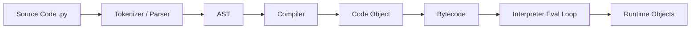
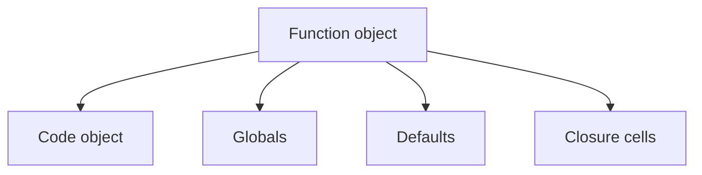

# Part 025 — CPython Internals for Practical Engineers

## 1. Tujuan Part Ini

Kamu tidak perlu menjadi VM engineer untuk menjadi Python engineer yang kuat. Tetapi kamu perlu cukup memahami CPython agar bisa mengambil keputusan engineering yang lebih tajam.

Banyak pertanyaan production Python berakar pada internals:

- Kenapa `is` dan `==` berbeda?
- Kenapa list menyimpan reference?
- Kenapa object kecil bisa banyak overhead?
- Kenapa reference cycle bisa membuat memory tidak langsung bebas?
- Kenapa `__del__` berbahaya?
- Kenapa thread CPU-bound tidak selalu mempercepat program?
- Kenapa `dis` bisa menunjukkan bytecode tetapi tidak boleh dijadikan kontrak stabil?
- Kenapa function call overhead penting di hot path?
- Kenapa `dict` lookup cepat tetapi memory-nya tidak kecil?
- Kenapa global/local variable access punya biaya berbeda?
- Kenapa C extension/native library bisa lebih cepat?
- Kenapa CPython implementation detail tidak selalu berlaku di PyPy/Jython/GraalPy?
- Apa dampak free-threaded Python terhadap asumsi lama?

Part ini membahas CPython internals sebatas yang praktis untuk desain, debugging, performance, dan operability.

Target setelah part ini:

1. Memahami beda Python language dan CPython implementation.
2. Memahami pipeline source code ke bytecode.
3. Memakai `dis` untuk insight, bukan kontrak.
4. Memahami frame, code object, function object secara praktis.
5. Memahami object identity, type, value di CPython.
6. Memahami reference counting.
7. Memahami cyclic garbage collector.
8. Memahami GIL secara lebih internal.
9. Memahami free-threaded Python secara praktis.
10. Memahami memory allocator secara konseptual.
11. Memahami konsekuensi internals terhadap performance.
12. Menerapkan insight ke `case-tracker`.

---

## 2. Python Language vs CPython

Python adalah bahasa. CPython adalah implementasi utama Python.

```text
Python language specification
        ↓
CPython interpreter implementation
```

Ada implementasi lain:

- PyPy;
- Jython;
- IronPython;
- GraalPy;
- MicroPython;
- RustPython.

Sebagian behavior adalah bahasa Python. Sebagian adalah implementation detail CPython.

Contoh bahasa:

```python
a == b
```

memanggil equality semantics sesuai data model.

Contoh CPython detail:

- reference counting sebagai mekanisme memory utama;
- bytecode tertentu;
- object layout;
- small object allocator;
- GIL implementation;
- `id(obj)` sering berupa memory address pada CPython, tetapi jangan jadikan asumsi portable.

Rule:

> Gunakan internals untuk reasoning dan performance insight, bukan untuk membuat kode aplikasi bergantung pada detail yang tidak dijamin.

---

## 3. CPython Execution Pipeline

Secara konseptual:



Langkah praktis:

1. Source code dibaca.
2. Python membuat AST.
3. AST dikompilasi menjadi code object.
4. Code object berisi bytecode dan metadata.
5. Interpreter mengeksekusi bytecode.
6. Runtime memanipulasi object.

Kamu bisa melihat beberapa layer ini dengan standard library:

- `ast`;
- `compile`;
- `dis`;
- `inspect`.

---

## 4. Bytecode dengan `dis`

Contoh:

```python
def add(a: int, b: int) -> int:
    return a + b
```

Inspect:

```python
import dis

dis.dis(add)
```

Output akan menunjukkan instruksi bytecode.

Bytecode membantu memahami:

- function call;
- attribute lookup;
- loop;
- local/global access;
- comprehension;
- exception handling;
- pattern matching;
- interpreter specialization.

Namun bytecode adalah implementation detail CPython. Instruksi bisa berubah antar versi Python.

Rule:

> `dis` bagus untuk belajar dan investigasi performa lokal. Jangan menulis aplikasi yang bergantung pada bentuk bytecode tertentu.

---

## 5. Code Object

Function memiliki code object.

```python
def greet(name: str) -> str:
    message = f"Hello, {name}"
    return message


print(greet.__code__)
print(greet.__code__.co_varnames)
print(greet.__code__.co_consts)
```

Code object berisi metadata seperti:

- nama local variable;
- constants;
- bytecode;
- jumlah argument;
- filename;
- first line number.

Function object membungkus code object plus environment seperti globals/defaults/closure.

Conceptual:



---

## 6. Frame Object

Saat function dipanggil, Python membuat frame untuk eksekusi.

Frame menyimpan:

- local variables;
- global namespace;
- instruction pointer;
- stack;
- reference ke code object;
- exception state.

Traceback berisi chain of frames.

Ini menjelaskan kenapa exception traceback bisa menahan reference ke local variables. Jika kamu menyimpan exception object terlalu lama, traceback-nya bisa menahan object besar.

Contoh risk:

```python
LAST_ERROR = None


def run() -> None:
    huge_data = ["x" * 1000 for _ in range(1_000_000)]

    try:
        raise RuntimeError("boom")
    except RuntimeError as error:
        global LAST_ERROR
        LAST_ERROR = error
```

`LAST_ERROR` dapat menahan traceback dan frame yang punya `huge_data`.

Practical rule:

> Log exception, ambil ringkasan yang perlu, lalu jangan simpan exception object besar tanpa alasan.

---

## 7. Function Call Overhead

Python function call relatif mahal dibanding operasi primitive di C/native code.

Contoh:

```python
def identity(value):
    return value


for item in items:
    identity(item)
```

Jika loop jutaan kali, function call overhead bisa muncul di profile.

Tetapi jangan inline semua function karena takut overhead. Clarity lebih penting sampai profiler membuktikan function call adalah bottleneck.

Optimization path:

1. Ukur dengan profiler.
2. Jika function kecil dipanggil jutaan kali, pertimbangkan:
   - combine operations;
   - use built-ins;
   - move repeated validation out of hot loop;
   - use local variable binding;
   - use data structure change;
   - use native/vectorized library if appropriate.

---

## 8. Python Object Model

Semua value Python adalah object.

Object punya:

- identity;
- type;
- value.

```python
value = [1, 2, 3]

print(id(value))
print(type(value))
print(value)
```

Dalam CPython, object punya header runtime dan type pointer.

Conceptual:

```text
PyObject
  reference count
  type pointer
  object-specific payload
```

Untuk variable-size object seperti list/str/dict, layout lebih kompleks.

Practical implication:

- object punya overhead;
- type diketahui runtime;
- dynamic dispatch fleksibel tapi ada biaya;
- attribute lookup perlu runtime lookup;
- operations call methods/protocols.

---

## 9. Identity and `id`

```python
a = []
b = a

print(a is b)
print(id(a), id(b))
```

`is` memeriksa identity.

Di CPython, `id(obj)` sering berkaitan dengan memory address object. Tetapi bahasa Python hanya menjamin `id` unik selama object hidup.

Jangan gunakan `id` untuk business identity.

Buruk:

```python
case_identity = id(case)
```

Baik:

```python
case.id
```

Domain identity harus explicit.

---

## 10. Reference Counting

CPython secara historis memakai reference counting sebagai mekanisme memory utama.

Setiap object punya jumlah reference.

```python
case = Case(...)
cases = [case]
```

Object `case` direferensikan oleh:

- name `case`;
- list `cases`.

Saat reference count turun ke nol, CPython dapat membebaskan object.

Kamu bisa melihat refcount untuk belajar:

```python
import sys

obj = []
print(sys.getrefcount(obj))
```

Caveat:

`sys.getrefcount(obj)` sendiri menambah temporary reference saat dipanggil, jadi angka terlihat lebih tinggi.

---

## 11. Reference Counting Implications

Manfaat:

- object sering dibebaskan segera saat tidak ada reference;
- resource cleanup bisa terlihat deterministik di CPython untuk object sederhana.

Tetapi jangan bergantung pada refcount untuk resource management.

Gunakan context manager:

```python
with path.open("r", encoding="utf-8") as file:
    content = file.read()
```

Jangan:

```python
file = open("data.txt")
content = file.read()
# berharap destructor menutup file
```

Implementation lain mungkin tidak membebaskan secepat CPython. Context manager adalah kontrak yang jelas.

---

## 12. Reference Cycles

Reference counting tidak bisa membebaskan cycle sendiri.

Example:

```python
class Node:
    def __init__(self) -> None:
        self.parent: Node | None = None
        self.children: list[Node] = []


parent = Node()
child = Node()
parent.children.append(child)
child.parent = parent
```

Cycle:


Jika tidak ada external reference, reference counts tetap saling menahan. Cyclic garbage collector mendeteksi dan membersihkan cycles.

---

## 13. Cyclic Garbage Collector

Module `gc` memberi interface ke garbage collector.

```python
import gc

print(gc.isenabled())
print(gc.get_count())
```

Kamu bisa memaksa collection:

```python
gc.collect()
```

Tetapi dalam aplikasi normal, jangan sering memanggil `gc.collect()` tanpa bukti. Itu bisa memperburuk performa.

Practical uses:

- debugging memory leaks;
- investigating cycles;
- tests for cleanup;
- measuring allocation behavior;
- special long-running workloads.

---

## 14. `__del__` and Finalizers

`__del__` adalah finalizer yang dipanggil saat object akan dihancurkan.

```python
class Resource:
    def __del__(self) -> None:
        print("cleanup")
```

Avoid relying on `__del__` for important cleanup.

Problems:

- timing not portable;
- cycles with finalizers can be tricky;
- exceptions in `__del__` are problematic;
- interpreter shutdown order can surprise;
- resource cleanup should be explicit.

Use:

- context manager;
- `try/finally`;
- explicit `close`;
- `weakref.finalize` for advanced cases.

---

## 15. CPython Memory Allocator

CPython has specialized memory allocators for small objects. You do not need implementation details for daily work, but understand:

- creating many small objects has overhead;
- freed memory may be kept by Python allocator for reuse;
- process RSS may not drop immediately;
- allocation patterns affect performance;
- object pools are usually unnecessary in app code;
- `tracemalloc` can show Python allocation sources.

Practical rule:

> Reduce unnecessary object churn before trying allocator-level tricks.

---

## 16. Attribute Lookup

Attribute access:

```python
case.status
```

requires runtime lookup. For normal objects, Python may look in:

- instance dict;
- class dict;
- descriptors;
- MRO;
- `__getattr__`/`__getattribute__`.

This flexibility enables dynamic behavior, properties, descriptors, ORMs, frameworks.

Cost implications:

- attribute access has overhead;
- property may run code;
- dynamic `__getattr__` can be expensive;
- repeated lookup in hot loop can matter.

Example micro-optimization only if profiled:

```python
status = CaseStatus.CLOSED
for case in cases:
    if case.status is status:
        ...
```

But do not write weird code unless profiler proves need.

---

## 17. Local vs Global Lookup

Local variable access is generally faster than global lookup.

Example:

```python
def count_closed(cases: list[Case]) -> int:
    closed = CaseStatus.CLOSED
    return sum(1 for case in cases if case.status is closed)
```

This can be faster than resolving `CaseStatus.CLOSED` repeatedly in a hot loop.

But this is a small optimization. Use only when code stays clear and path is hot.

---

## 18. Descriptors and Properties

Property is descriptor-based.

```python
class Case:
    @property
    def is_closed(self) -> bool:
        return self.status is CaseStatus.CLOSED
```

Access:

```python
case.is_closed
```

looks like attribute but runs method.

Good for computed read-only value.

Performance implication:

- property call has function overhead;
- if accessed millions of times, maybe cache or compute differently;
- but clarity usually wins.

---

## 19. Method Binding

When you access:

```python
case.transition_to
```

Python creates bound method object connecting function and instance.

In hot loops, repeated method lookup/binding can cost.

Example:

```python
for case in cases:
    case.add_note("x")
```

Usually fine.

If profiling shows method binding overhead in extreme loop, alternatives exist, but rarely needed in application code.

---

## 20. The GIL Internals, Practically

In traditional CPython builds, the Global Interpreter Lock protects interpreter internals so only one thread executes Python bytecode at a time.

It simplifies:

- reference counting;
- object memory safety;
- C extension assumptions;
- interpreter state management.

It affects:

- CPU-bound threading;
- parallelism;
- extension design;
- performance tuning.

It does not prevent all race conditions. Logical race conditions still occur because operations can interleave across bytecode instructions or around I/O/await.

---

## 21. Free-Threaded CPython

Modern CPython includes support for builds that can run with the GIL disabled.

Practical implications:

- more true parallelism for Python threads on supported builds;
- more internal synchronization complexity;
- possible memory/performance trade-offs;
- C extension compatibility considerations;
- code with shared mutable state needs even more discipline;
- target runtime matters.

Do not assume every deployment uses free-threaded build. Do not assume free-threading automatically improves every workload.

Decision remains:

- classify workload;
- minimize shared mutable state;
- measure on target Python build;
- design synchronization explicitly.

---

## 22. Bytecode Specialization

Modern CPython includes adaptive/specializing interpreter optimizations. The interpreter may specialize common bytecode operations at runtime.

Practical takeaway:

- simple idiomatic Python can get faster across versions;
- micro-optimizations from old blog posts may become obsolete;
- bytecode/performance behavior changes between versions;
- measure on the Python version you deploy.

Do not cargo-cult old performance tricks.

---

## 23. Implementation Detail Warnings

Avoid depending on:

- exact bytecode instruction names;
- exact object sizes;
- exact refcount timing for cleanup;
- exact dict internal layout;
- small integer/string interning behavior;
- CPython-specific identity quirks;
- GC thresholds;
- memory address meaning of `id`;
- GIL presence/absence as app correctness mechanism.

Use internals to understand, not to create fragile business logic.

---

## 24. Interning and Small Object Caches

CPython may intern/cache some objects such as small integers or strings.

Example confusing behavior:

```python
a = 256
b = 256
print(a is b)
```

May be true in CPython for small ints.

But do not rely on this.

Always compare values with `==` unless identity is intended:

```python
status == CaseStatus.CLOSED
```

For singleton checks:

```python
value is None
```

Use `is` for singletons like `None`, `True`, `False` when appropriate, or enum identity if using same enum class.

---

## 25. List Internals Practically

List is dynamic array of references.

Implications:

- append amortized fast;
- index access fast;
- insert/delete at front/middle shifts references;
- membership scan O(n);
- list over-allocates capacity;
- slicing creates new list of references.

Example:

```python
subset = cases[:100]
```

This creates new list, but `Case` objects are shared references.

Understanding this prevents both performance and mutation bugs.

---

## 26. Dict Internals Practically

Dict is hash table.

Implications:

- average lookup fast;
- key must be hashable;
- memory overhead larger than list;
- collision handling exists;
- insertion order preserved in modern Python;
- mutating keys after insertion breaks logic if possible.

For domain:

```python
case_by_id = {case.id: case for case in cases}
```

Good for repeated lookup.

But if `CaseId` is mutable/hash changes, disaster. Use frozen value object:

```python
@dataclass(frozen=True)
class CaseId:
    value: str
```

---

## 27. Hash and Equality Contract

If object is hashable, hash/equality contract must hold:

- if `a == b`, then `hash(a) == hash(b)`;
- hash should not change while object is in dict/set;
- mutable objects should usually not be hashable.

Dataclass:

```python
@dataclass(frozen=True)
class CaseId:
    value: str
```

is hashable if fields are hashable.

Mutable dataclass usually not hashable by default.

This is good.

---

## 28. Exceptions Internals Practically

Exception carries:

- type;
- message/args;
- traceback;
- cause/context;
- custom attributes.

Exception creation and raising is not free. But do not avoid exceptions for truly exceptional/failure semantics.

Do not use exceptions for tight-loop normal control flow if avoidable.

Example okay:

```python
try:
    status = CaseStatus(raw)
except ValueError:
    ...
```

Example suspicious in hot loop if many invalid values expected:

```python
for raw in million_values:
    try:
        ...
    except ValueError:
        ...
```

If invalid values are common, pre-check or validation strategy may be better.

---

## 29. Import System Internals Practically

When you import module:

1. Python finds module via import path/meta hooks.
2. Loads source/bytecode as needed.
3. Executes module top-level code.
4. Stores module in `sys.modules`.

Implications:

- top-level side effects run at import time;
- circular imports create partially initialized modules;
- import cache means module code usually runs once;
- global state persists;
- import time matters for CLI/server cold start.

Keep import-time code light.

---

## 30. `.pyc` and `__pycache__`

CPython may write bytecode cache files:

```text
__pycache__/
  module.cpython-312.pyc
```

These speed up imports by avoiding recompilation when source unchanged.

Do not commit `__pycache__`.

`.gitignore`:

```gitignore
__pycache__/
*.py[cod]
```

Do not treat `.pyc` as source of truth.

---

## 31. Inspecting Runtime with `inspect`

```python
import inspect

print(inspect.signature(create_case))
print(inspect.getsource(create_case))
```

Frameworks use introspection:

- FastAPI reads function signatures/type hints;
- dataclasses inspect annotations;
- decorators preserve metadata with `functools.wraps`;
- dependency injection can inspect callables.

If you write decorators, preserve metadata:

```python
from functools import wraps


def my_decorator(function):
    @wraps(function)
    def wrapper(*args, **kwargs):
        return function(*args, **kwargs)

    return wrapper
```

Without `wraps`, frameworks/tools may see wrong signature/name.

---

## 32. Type Hints at Runtime

Annotations are available via introspection, but static type checking and runtime validation are different.

```python
def create_case(title: str) -> Case:
    ...
```

Runtime does not enforce `str` unless code/framework validates.

Frameworks like FastAPI/Pydantic use type hints for runtime validation at boundaries. That is framework behavior, not base Python enforcement.

---

## 33. C Extensions and Native Code

CPython can call C extensions.

Examples:

- built-in modules;
- `json` parts may use C acceleration;
- NumPy;
- compression/hash libraries;
- database drivers.

Native code can be much faster because:

- less Python object overhead in loops;
- compiled operations;
- vectorization;
- direct memory representation;
- can release GIL for long-running native operations.

But native dependencies add:

- packaging complexity;
- platform wheels;
- ABI compatibility;
- security surface;
- debugging complexity.

Use when leverage is clear.

---

## 34. CPython Internals and API Frameworks

Frameworks often rely on:

- function signatures;
- annotations;
- descriptors;
- decorators;
- async coroutine detection;
- dependency graphs;
- exception types;
- contextvars.

This means “magic” is often introspection plus conventions.

Understanding internals helps debug:

- why route parameter not recognized;
- why decorator hides signature;
- why dependency not injected;
- why async function not awaited;
- why model validation behaves differently.

---

## 35. Case Tracker: Internals-Driven Improvements

### 35.1 Avoid Import-Time Work

Bad:

```python
CASES = load_cases(Path("cases.json"))
```

Good:

```python
def main(...):
    cases = load_cases(path)
```

Because import executes top-level code.

### 35.2 Frozen Hashable IDs

```python
@dataclass(frozen=True, slots=True)
class CaseId:
    value: str
```

Good for dict keys.

### 35.3 Avoid Repeated List Scan

```python
case_by_id = {case.id: case for case in cases}
```

Uses dict internals well.

### 35.4 Use Context Managers

```python
with path.open("r", encoding="utf-8") as file:
    ...
```

Do not rely on CPython refcount cleanup.

### 35.5 Keep Tracebacks Useful

Use exception chaining:

```python
raise CaseStoreCorruptedError(path, "Invalid JSON") from error
```

---

## 36. Case Tracker: Bytecode Learning Exercise

```python
def count_closed(cases: list[Case]) -> int:
    return sum(1 for case in cases if case.status is CaseStatus.CLOSED)
```

Inspect:

```python
import dis

dis.dis(count_closed)
```

Questions:

1. Where is generator created?
2. Where are globals loaded?
3. What operations appear for attribute access?
4. Does this change how you write code?
5. Is this hot path enough to matter?

Do not optimize solely from bytecode. Use profiler.

---

## 37. Case Tracker: Refcount Exercise

```python
import sys

case = create_case("Late reporting")
print(sys.getrefcount(case))

cases = [case]
print(sys.getrefcount(case))

del case
print(sys.getrefcount(cases[0]))
```

Questions:

1. Why does refcount change?
2. Why is count higher than expected?
3. What references exist?
4. What happens after deleting list?
5. Why should app logic not depend on this?

---

## 38. Case Tracker: GC Cycle Exercise

Create cycle:

```python
@dataclass
class CaseNode:
    case: Case
    parent: "CaseNode | None" = None
    children: list["CaseNode"] = field(default_factory=list)
```

Build parent/child cycle. Delete references. Use `gc.collect()` for learning.

Question:

- Why reference counting alone is insufficient?
- How does cyclic GC help?
- Why context managers still matter for external resources?

---

## 39. Practical Internals Debugging Checklist

When debugging weird Python behavior, ask:

1. Is this Python language behavior or CPython detail?
2. Is object identity confused with equality?
3. Is there shared reference/aliasing?
4. Is mutation happening through shared container?
5. Is import-time side effect involved?
6. Is circular import causing partial initialization?
7. Is traceback preserving root cause?
8. Is exception object retaining memory?
9. Is function signature hidden by decorator?
10. Is async coroutine object not awaited?
11. Is bytecode/performance assumption version-specific?
12. Is resource cleanup relying on refcount?
13. Is dict key hash stable?
14. Is GIL assumption hiding race?
15. Is profiler showing actual bottleneck?

---

## 40. Internals Smell Checklist

Watch for:

1. Business logic using `id(obj)`.
2. `is` used for string/int comparison.
3. Code depending on small integer interning.
4. Manual cleanup relying on destructor.
5. `__del__` managing critical resource.
6. Import-time file/network access.
7. Decorator without `functools.wraps`.
8. Storing exception objects globally.
9. Mutable object used as dict key.
10. Thread correctness relying on GIL.
11. Bytecode-dependent application logic.
12. `gc.collect()` used as performance fix without measurement.
13. Overusing `__slots__` before measuring.
14. Custom object pool without evidence.
15. CPython-only trick in portable library.

---

## 41. Practice: Disassemble Functions

Disassemble:

```python
def direct_loop(cases: list[Case]) -> int:
    count = 0
    for case in cases:
        if case.status is CaseStatus.CLOSED:
            count += 1
    return count


def generator_sum(cases: list[Case]) -> int:
    return sum(1 for case in cases if case.status is CaseStatus.CLOSED)
```

Questions:

1. Which creates generator?
2. Which has more function/lambda-like overhead?
3. Which is more readable?
4. Which is faster for your workload?
5. What does profiler say?

---

## 42. Practice: Inspect Function Metadata

```python
import inspect

print(inspect.signature(create_case))
print(create_case.__annotations__)
print(create_case.__code__.co_varnames)
```

Then wrap with decorator without `wraps`. Observe signature changes.

Fix with `functools.wraps`.

---

## 43. Practice: Compare Normal and Slotted Objects

Allocate 100,000 normal dataclasses and slotted dataclasses. Measure with `tracemalloc`.

Questions:

1. What changed?
2. How much memory saved?
3. Did dynamic attributes fail?
4. Did test suite still pass?
5. Is it worth adopting?

---

## 44. Practice: Circular Import Diagnosis

Create intentionally:

```python
# domain.py imports service.py
# service.py imports domain.py
```

Observe error.

Fix by moving shared type or reversing dependency direction.

Explain with import execution model.

---

## 45. Practice: Refcount and Resource Cleanup

Open file without context manager and inspect behavior. Then rewrite with `with`.

Questions:

1. Why might CPython close quickly?
2. Why is relying on that bad?
3. What does context manager guarantee?
4. How does this apply to DB/network sessions?

---

## 46. Self-Check

Jawab tanpa melihat materi:

1. Apa beda Python language dan CPython?
2. Apa itu bytecode?
3. Kenapa bytecode bukan kontrak stabil?
4. Apa itu code object?
5. Apa itu frame object?
6. Kenapa traceback bisa menahan memory?
7. Apa itu reference counting?
8. Kenapa `sys.getrefcount` menambah reference?
9. Apa itu reference cycle?
10. Apa fungsi cyclic GC?
11. Kenapa `__del__` perlu hati-hati?
12. Apa itu attribute lookup?
13. Kenapa local lookup bisa lebih cepat dari global lookup?
14. Apa itu descriptor/property?
15. Apa GIL secara internal-praktis?
16. Apa arti free-threaded CPython untuk desain?
17. Kenapa `id` tidak boleh jadi business identity?
18. Kenapa dict key harus punya hash stabil?
19. Kenapa import-time side effect berbahaya?
20. Kenapa decorator harus memakai `functools.wraps`?

---

## 47. Definition of Done Part 025

Kamu selesai part ini jika bisa:

1. Menjelaskan Python vs CPython.
2. Menjelaskan source-to-bytecode pipeline.
3. Memakai `dis.dis`.
4. Menjelaskan code object.
5. Menjelaskan frame object.
6. Menjelaskan reference counting.
7. Menjelaskan cyclic garbage collection.
8. Menjelaskan kenapa context manager lebih baik daripada destructor.
9. Menjelaskan GIL dan free-threading secara praktis.
10. Menjelaskan attribute lookup.
11. Menjelaskan dict/list internals secara praktis.
12. Menghindari CPython-specific business logic.
13. Menjelaskan import cache dan circular import.
14. Memakai `inspect.signature`.
15. Menjelaskan decorator metadata dengan `wraps`.

---

## 48. Ringkasan

CPython internals memberi insight, bukan alasan membuat kode fragile.

Inti part ini:

- Python language berbeda dari CPython implementation;
- source dikompilasi ke code object dan bytecode;
- bytecode berguna untuk investigasi tetapi bukan kontrak stabil;
- function execution memakai frame;
- traceback menyimpan frame dan bisa menahan memory;
- CPython memakai reference counting plus cyclic GC;
- context manager lebih aman daripada mengandalkan destructor;
- object punya identity/type/value dan overhead runtime;
- list menyimpan references, dict adalah hash table;
- hash/equality contract penting untuk dict/set;
- GIL membatasi traditional CPU-bound threading tetapi tidak menghapus race;
- free-threaded Python membuat pengukuran dan thread-safety makin penting;
- import menjalankan top-level code dan memakai cache;
- introspection mendukung banyak framework modern;
- internals harus menguatkan judgment, bukan menggantikan clean design.

Part berikutnya akan membahas API development dengan FastAPI, Pydantic, dan service boundaries.

---

## 49. Referensi

- Python Documentation — Data Model.
- Python Documentation — `dis`.
- Python Documentation — `gc`.
- Python Documentation — `sys`.
- Python Documentation — `inspect`.
- Python Documentation — `functools.wraps`.
- Python Documentation — Thread states and the Global Interpreter Lock.
- Python Documentation — Glossary: Global Interpreter Lock, garbage collection.
