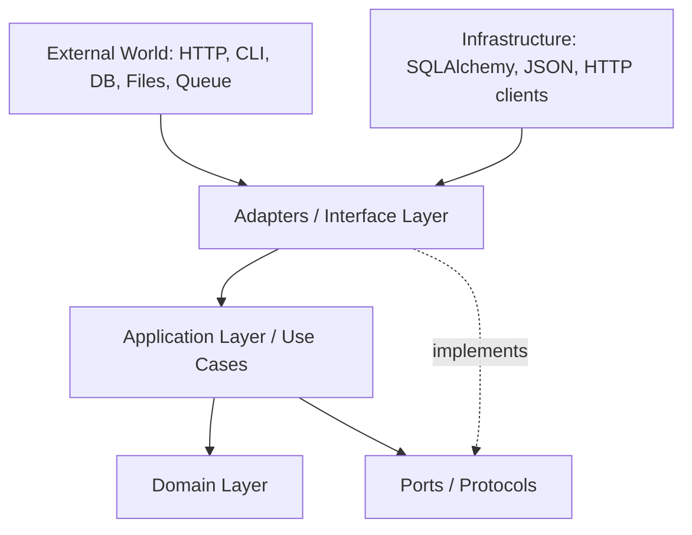
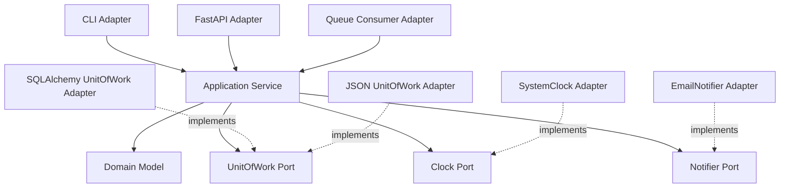
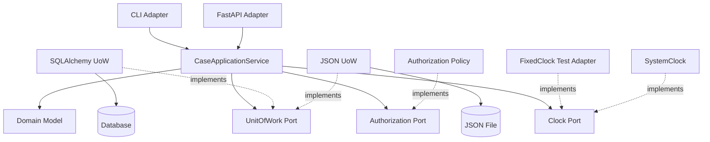
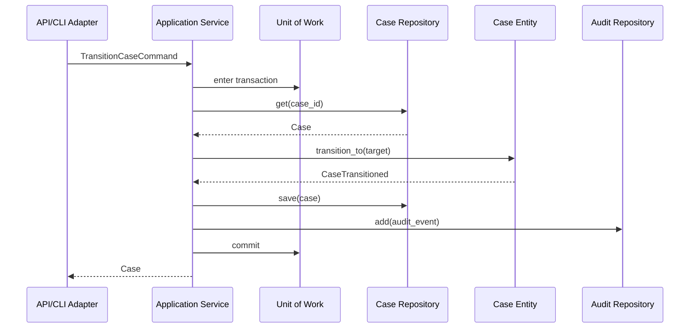
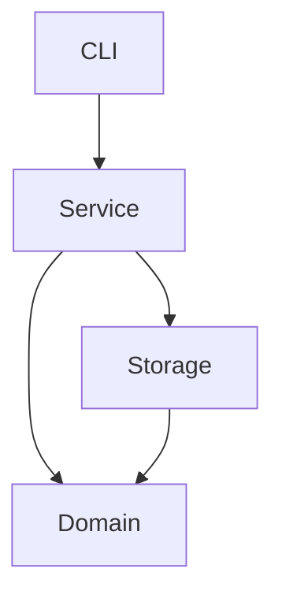
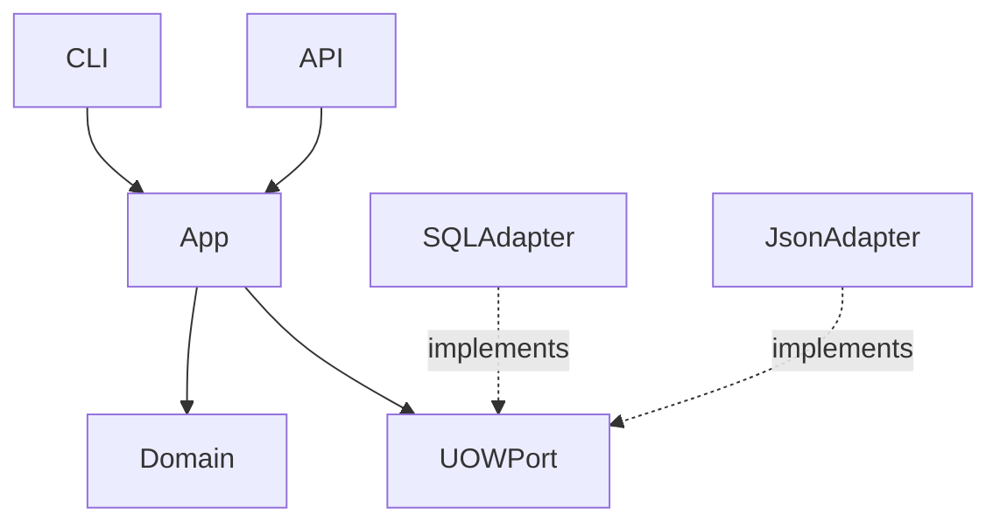

# Part 028 — Architecture in Python: Layering, Ports, Adapters, dan Domain Modelling

## 1. Tujuan Part Ini

Python memberi kebebasan besar. Kebebasan itu bisa menghasilkan codebase yang elegan atau codebase yang berantakan.

Tanpa architecture boundary, Python project sering berubah menjadi:

- route handler berisi business logic;
- ORM model menjadi domain, API schema, dan DB schema sekaligus;
- domain import FastAPI/SQLAlchemy;
- service function membaca environment variable;
- CLI langsung mutate database;
- tests perlu database untuk semua hal;
- circular import;
- “utils.py” raksasa;
- side effect saat import;
- dependency direction tidak jelas;
- business rule tersebar di API, CLI, storage, dan tests;
- perubahan kecil menyentuh banyak layer.

Architecture bukan tentang membuat folder banyak. Architecture adalah tentang mengontrol dependency, model, dan change.

Part ini membahas architecture Python yang praktis:

- layering;
- dependency rule;
- ports and adapters;
- domain model;
- application service;
- repository;
- unit of work;
- DTO/schema;
- domain events;
- module/package boundaries;
- testing strategy;
- evolutionary architecture.

Target setelah part ini:

1. Memahami kenapa architecture diperlukan.
2. Memahami layer domain/application/adapters/infrastructure.
3. Memahami dependency direction.
4. Memahami ports and adapters.
5. Mendesain domain model yang framework-agnostic.
6. Mendesain application service/use case.
7. Menggunakan Protocol sebagai port.
8. Menggunakan adapters untuk DB/API/CLI.
9. Memisahkan DTO/schema dari domain.
10. Mendesain domain events.
11. Menghindari over-engineering.
12. Menerapkan architecture ke `case-tracker`.

---

## 2. Architecture Is About Change

Architecture yang baik menjawab:

- Jika storage berubah dari JSON ke SQLite, apa yang berubah?
- Jika CLI ditambah API, apakah domain logic diduplikasi?
- Jika API schema berubah, apakah domain ikut rusak?
- Jika database migration terjadi, apakah use case berubah?
- Jika test ingin fake repository, apakah mudah?
- Jika validasi input berubah, layer mana yang berubah?
- Jika auth ditambahkan, di mana policy berada?
- Jika audit wajib, bagaimana transaction boundary dijaga?
- Jika external API gagal, apakah domain tahu HTTP?

Architecture mengontrol blast radius perubahan.

---

## 3. Layer Model

Satu model praktis:



Simpler text:

```text
Adapters -> Application -> Domain
Application -> Ports
Infrastructure Adapters implement Ports
```

Dependency direction should point inward toward domain/application.

---

## 4. Layer Responsibilities

| Layer | Responsibility | Should Not Know |
|---|---|---|
| Domain | Entities, value objects, invariants, domain rules | HTTP, SQLAlchemy, CLI, file paths |
| Application | Use cases, orchestration, transaction boundary, policy coordination | FastAPI request, SQL details |
| Ports | Interfaces/protocols required by application | Implementations |
| Adapters | Translate external world to app and app to external world | Deep domain decisions |
| Infrastructure | DB, file, HTTP client, message broker implementation | Business policy |
| Composition Root | Wire dependencies | Domain behavior |

---

## 5. Dependency Rule

Core rule:

> Source code dependencies point inward.

Good:

```text
case_tracker_api -> case_tracker.application -> case_tracker.domain
case_tracker_sqlalchemy -> case_tracker.application ports -> case_tracker.domain
```

Bad:

```text
case_tracker.domain -> fastapi
case_tracker.domain -> sqlalchemy
case_tracker.application -> case_tracker_api.schemas
```

If domain imports framework, framework becomes part of domain. That makes domain harder to test and evolve.

---

## 6. Suggested Package Structure

```text
src/
  case_tracker/
    domain/
      __init__.py
      models.py
      statuses.py
      errors.py
      policies.py
      events.py
    application/
      __init__.py
      services.py
      commands.py
      ports.py
      unit_of_work.py
    adapters/
      __init__.py
      json_repository.py
      sqlalchemy_repository.py
      sqlalchemy_models.py
      cli.py
      api/
        __init__.py
        main.py
        schemas.py
        routes.py
        dependencies.py
```

For small project, this may be too many files. You can start simpler:

```text
case_tracker/
  domain.py
  service.py
  ports.py
  json_repository.py
  cli.py
case_tracker_api/
  main.py
  schemas.py
```

Architecture is not folder count. Architecture is dependency direction.

---

## 7. Domain Layer

Domain layer contains business concepts.

For `case-tracker`:

- `Case`;
- `CaseId`;
- `CaseStatus`;
- `CasePriority`;
- `AuditEvent`;
- `InvalidCaseTransitionError`;
- transition policy;
- note validation;
- domain events;
- SLA policy maybe;
- escalation rules.

Domain should be mostly pure Python:

```python
@dataclass(eq=False)
class Case:
    id: CaseId
    title: str
    status: CaseStatus
    notes: list[str] = field(default_factory=list)

    def transition_to(self, target_status: CaseStatus) -> CaseTransitioned:
        if not can_transition(self.status, target_status):
            raise InvalidCaseTransitionError(self.status, target_status)

        from_status = self.status
        self.status = target_status

        return CaseTransitioned(
            case_id=self.id,
            from_status=from_status,
            to_status=target_status,
        )
```

No FastAPI. No SQLAlchemy. No `Path("cases.json")`.

---

## 8. Entity vs Value Object

Value object:

```python
@dataclass(frozen=True, slots=True)
class CaseId:
    value: str
```

Entity:

```python
@dataclass(eq=False)
class Case:
    id: CaseId
    ...
```

Value object equality by value. Entity identity by id.

Why it matters:

- dictionary keys;
- equality tests;
- persistence mapping;
- event payloads;
- avoiding string mix-up;
- domain clarity.

---

## 9. Domain Policy

Not every rule belongs as entity method.

Entity method good:

```python
case.transition_to(target_status)
```

Policy function good:

```python
def can_transition(from_status: CaseStatus, to_status: CaseStatus) -> bool:
    ...
```

Domain service/policy good when rule involves multiple entities or external-free calculation:

```python
def assign_reviewer(case: Case, reviewers: list[Reviewer]) -> Reviewer:
    ...
```

Application service good when orchestration needs repository/UoW/external dependencies.

---

## 10. Application Layer

Application layer implements use cases.

Examples:

- create case;
- transition case;
- add note;
- assign reviewer;
- export report;
- import cases;
- close overdue cases;
- generate audit event;
- enforce authorization policy;
- send notification after commit.

Application service coordinates:

- repositories;
- unit of work;
- domain model;
- policies;
- events;
- clocks/id factories;
- external ports.

It should not know HTTP request details.

---

## 11. Command Objects

Command objects represent use case input.

```python
@dataclass(frozen=True)
class CreateCaseCommand:
    title: str
    actor_id: ActorId


@dataclass(frozen=True)
class TransitionCaseCommand:
    case_id: CaseId
    target_status: CaseStatus
    actor_id: ActorId
    reason: str | None = None
```

Why command?

- input grows cleanly;
- service signature stable;
- easier testing;
- boundary mapping explicit;
- supports audit/idempotency metadata.

For small function, direct parameters are fine. Use command when use case input has structure.

---

## 12. Application Service Example

```python
class CaseApplicationService:
    def __init__(
        self,
        uow_factory: Callable[[], UnitOfWork],
        clock: Clock,
    ) -> None:
        self._uow_factory = uow_factory
        self._clock = clock

    def transition_case(self, command: TransitionCaseCommand) -> Case:
        with self._uow_factory() as uow:
            case = uow.cases.get(command.case_id)
            event = case.transition_to(command.target_status)

            audit_event = AuditEvent(
                id=AuditEventId.new(),
                case_id=case.id,
                event_type="case_transitioned",
                occurred_at=self._clock.now(),
                actor_id=command.actor_id,
                details={
                    "from_status": event.from_status.value,
                    "to_status": event.to_status.value,
                },
            )

            uow.cases.save(case)
            uow.audit_events.add(audit_event)
            uow.commit()

            return case
```

Use case boundary is clear.

---

## 13. Ports

Port is interface the application needs.

In Python, Protocol works well:

```python
class CaseRepository(Protocol):
    def get(self, case_id: CaseId) -> Case:
        ...

    def save(self, case: Case) -> None:
        ...


class AuditEventRepository(Protocol):
    def add(self, event: AuditEvent) -> None:
        ...


class UnitOfWork(Protocol):
    cases: CaseRepository
    audit_events: AuditEventRepository

    def __enter__(self) -> "UnitOfWork":
        ...

    def __exit__(self, exc_type, exc, tb) -> None:
        ...

    def commit(self) -> None:
        ...

    def rollback(self) -> None:
        ...
```

Ports live near application layer because they express what the app needs from outside.

---

## 14. Adapters

Adapters implement ports.

Examples:

| Port | Adapter |
|---|---|
| `CaseRepository` | `JsonCaseRepository` |
| `CaseRepository` | `SqlAlchemyCaseRepository` |
| `Clock` | `SystemClock` |
| `Clock` | `FixedClock` for tests |
| `Notifier` | `EmailNotifier` |
| `Notifier` | `FakeNotifier` |
| `CaseEnrichmentClient` | `HttpCaseEnrichmentClient` |

Adapter translates between external detail and domain/application.

SQLAlchemy adapter maps ORM records to domain objects.
FastAPI adapter maps HTTP request to command.
CLI adapter maps `argv` to command.

---

## 15. Ports and Adapters Diagram



The application does not care whether adapter is SQLAlchemy, JSON, fake, or HTTP.

---

## 16. Composition Root

Composition root wires concrete dependencies.

CLI composition:

```python
def build_service() -> CaseApplicationService:
    engine = create_engine(settings.database_url)
    session_factory = sessionmaker(bind=engine)

    return CaseApplicationService(
        uow_factory=lambda: SqlAlchemyUnitOfWork(session_factory),
        clock=SystemClock(),
    )
```

API composition:

```python
def get_case_service() -> CaseApplicationService:
    return CaseApplicationService(
        uow_factory=get_uow_factory(),
        clock=SystemClock(),
    )
```

Composition root is allowed to know everything because it wires application. Keep it at boundary.

---

## 17. DTOs and Schemas

DTO/schema belongs to boundary.

API schema:

```python
class CreateCaseRequest(BaseModel):
    title: str
```

Command:

```python
@dataclass(frozen=True)
class CreateCaseCommand:
    title: str
    actor_id: ActorId
```

Domain:

```python
@dataclass
class Case:
    ...
```

Mapping:

```python
command = CreateCaseCommand(
    title=request.title,
    actor_id=current_user.id,
)
```

Do not pass Pydantic model deep into application unless you intentionally make it application DTO. Boundary schemas tend to change with API needs.

---

## 18. Anti-Corruption Layer

External systems often have ugly concepts.

Example external status:

```json
{
  "state": "PENDING_REVIEW_EXTERNAL"
}
```

Do not spread this string through domain.

Create mapping:

```python
def external_status_to_case_status(value: str) -> CaseStatus:
    match value:
        case "PENDING_REVIEW_EXTERNAL":
            return CaseStatus.UNDER_REVIEW
        case "DONE":
            return CaseStatus.CLOSED
        case _:
            raise ExternalStatusMappingError(value)
```

This protects domain language.

Anti-corruption layer is adapter code that translates external model to internal model.

---

## 19. Domain Events

Domain event records something meaningful that happened.

```python
@dataclass(frozen=True)
class CaseTransitioned:
    case_id: CaseId
    from_status: CaseStatus
    to_status: CaseStatus
```

Entity method returns event:

```python
def transition_to(self, target_status: CaseStatus) -> CaseTransitioned:
    ...
    return CaseTransitioned(...)
```

Application handles event:

```python
event = case.transition_to(command.target_status)
uow.domain_events.add(event)
```

Events can be used for:

- audit trail;
- notification;
- projections;
- integration;
- eventual consistency.

Keep event simple and explicit.

---

## 20. Domain Events vs Integration Events

Domain event:

> Internal fact in domain model.

Integration event:

> Message published to other systems.

Example:

Domain event:

```python
CaseTransitioned(case_id=..., from_status=..., to_status=...)
```

Integration event:

```json
{
  "event_type": "case.transitioned.v1",
  "case_id": "CASE-001",
  "from_status": "DRAFT",
  "to_status": "SUBMITTED",
  "occurred_at": "..."
}
```

Do not publish domain object directly. Map to stable integration event schema.

---

## 21. Transaction + Events

Common problem:

```python
case.transition_to(...)
repository.save(case)
notifier.send(...)
commit()
```

If notifier succeeds but commit fails, external system thinks case changed but DB did not.

Better patterns:

1. Save domain state and outbox event in same transaction.
2. Commit.
3. Separate worker publishes outbox event.
4. Mark event published.

This is outbox pattern.

For learning, audit event in same transaction is enough. For integration, outbox matters.

---

## 22. Outbox Pattern Preview

Table:

```text
outbox_events
  id
  event_type
  payload_json
  occurred_at
  published_at nullable
```

Use case transaction:

```python
uow.cases.save(case)
uow.outbox.add(integration_event)
uow.commit()
```

Publisher worker:

```python
events = outbox_repository.list_unpublished()
for event in events:
    publisher.publish(event)
    outbox_repository.mark_published(event.id)
```

This improves reliability for cross-system messaging.

---

## 23. CQRS Lite

CQRS separates command and query models.

Do not overuse early.

Simple version:

- commands mutate domain through application service;
- queries can use optimized read model/repository;
- read path can return DTOs directly;
- write path protects invariants.

Example:

```python
class CaseQueryService:
    def list_case_summaries(self, filters: CaseFilters) -> list[CaseSummary]:
        ...
```

This avoids loading full domain objects for simple list views.

Use when read requirements diverge from write model.

---

## 24. Domain Model Depth

Not all apps need deep domain model.

CRUD-heavy app:

- simple entities;
- validation;
- repository;
- service maybe thin.

Complex domain:

- lifecycle;
- policies;
- state machine;
- audit;
- authorization;
- invariants;
- domain events;
- workflows;
- transaction semantics.

`case-tracker` has enough lifecycle complexity to justify richer model.

Architecture should match domain complexity.

---

## 25. Anemic vs Rich Domain

Anemic:

```python
@dataclass
class Case:
    status: CaseStatus
```

Rules elsewhere:

```python
def transition_case(case, target):
    ...
```

Rich:

```python
@dataclass
class Case:
    status: CaseStatus

    def transition_to(self, target: CaseStatus) -> CaseTransitioned:
        ...
```

Neither is always right.

Use rich domain when:

- invariants should travel with entity;
- multiple use cases share same rule;
- illegal states must be prevented close to data.

Use service/policy when:

- rule involves multiple repositories/external dependency;
- rule is orchestration not entity behavior;
- rule is cross-aggregate.

---

## 26. Aggregate Boundary

In Domain-Driven Design, aggregate is consistency boundary.

For `case-tracker`, `Case` with its notes might be one aggregate.

Rules inside aggregate:

- transition validity;
- note validation;
- status update;
- maybe audit event creation.

Rules outside aggregate:

- reviewer workload balancing;
- cross-case duplicate detection;
- reporting;
- external notification;
- SLA batch escalation.

Aggregate should be small enough for transaction and consistency.

Do not load entire world into one aggregate.

---

## 27. Application Service vs Domain Service

Domain service:

- pure domain logic;
- no DB/network;
- operates on domain objects.

Application service:

- use case orchestration;
- repositories;
- UoW;
- clock/id factory;
- authorization;
- transactions.

Example domain service:

```python
def choose_next_reviewer(case: Case, reviewers: Sequence[Reviewer]) -> Reviewer:
    ...
```

Example application service:

```python
def assign_reviewer(command: AssignReviewerCommand) -> Case:
    with uow:
        case = uow.cases.get(command.case_id)
        reviewers = uow.reviewers.list_available()
        reviewer = choose_next_reviewer(case, reviewers)
        case.assign_to(reviewer.id)
        uow.commit()
        return case
```

---

## 28. Authorization Policy

Authorization should not be scattered only in API decorators.

Example:

```python
class CaseAuthorizationPolicy(Protocol):
    def can_transition(self, actor: Actor, case: Case, target_status: CaseStatus) -> bool:
        ...
```

Application service:

```python
if not self._authorization.can_transition(actor, case, command.target_status):
    raise PermissionDeniedError(...)
```

Why application layer?

- CLI/API/worker all enforce same policy;
- domain model can stay actor-agnostic if policy external;
- tests can verify policy behavior.

Some authorization rules are domain rules. Others are application/security policy. Model intentionally.

---

## 29. Time and IDs as Ports

Bad:

```python
datetime.now(UTC)
uuid4()
```

inside deep domain if tests need determinism.

Better:

```python
class Clock(Protocol):
    def now(self) -> datetime:
        ...


class IdGenerator(Protocol):
    def new_case_id(self) -> CaseId:
        ...
```

Application service injects them.

Domain factory may receive id/time as arguments.

```python
case = Case.create(
    id=self._id_generator.new_case_id(),
    title=command.title,
    created_at=self._clock.now(),
)
```

This improves testability.

---

## 30. Error Boundaries

Domain errors:

- invalid transition;
- invalid title;
- invalid note.

Application errors:

- case not found;
- permission denied;
- duplicate command/idempotency conflict.

Infrastructure errors:

- database unavailable;
- JSON store corrupt;
- external API timeout.

Adapters map these to:

- HTTP status;
- CLI exit code;
- retry/dead-letter;
- logs;
- metrics.

Do not collapse all into `RuntimeError`.

---

## 31. Architecture Testing

Test dependency direction.

Simple grep-like test:

```python
from pathlib import Path


def test_domain_does_not_import_frameworks() -> None:
    domain_files = Path("src/case_tracker/domain").glob("*.py")

    for path in domain_files:
        source = path.read_text(encoding="utf-8")
        assert "fastapi" not in source
        assert "sqlalchemy" not in source
```

Crude but useful.

Better with import-linting tools in larger projects.

Also test application layer does not import API schemas.

---

## 32. Test Strategy by Layer

| Layer | Test Type |
|---|---|
| Domain | pure unit tests |
| Application | unit tests with fake UoW/repositories |
| Repository adapter | integration tests with DB/file |
| API adapter | TestClient with fake service/repository |
| CLI adapter | argv/capsys tests |
| Architecture | import direction tests |
| Contract | fake vs real repository behavior |

Architecture should make tests cheaper, not more expensive.

---

## 33. Fake Unit of Work

```python
class FakeUnitOfWork:
    def __init__(self) -> None:
        self.cases = FakeCaseRepository()
        self.audit_events = FakeAuditEventRepository()
        self.committed = False
        self.rolled_back = False

    def __enter__(self) -> "FakeUnitOfWork":
        return self

    def __exit__(self, exc_type, exc, tb) -> None:
        if exc_type is not None:
            self.rollback()

    def commit(self) -> None:
        self.committed = True

    def rollback(self) -> None:
        self.rolled_back = True
```

Application service test:

```python
def test_transition_case_commits() -> None:
    uow = FakeUnitOfWork()
    uow.cases.add(Case(...))

    service = CaseApplicationService(lambda: uow, clock=FixedClock(...))

    service.transition_case(...)

    assert uow.committed
```

---

## 34. Architecture and Python Protocols

Protocols make architecture lightweight.

You do not need heavy Java-style interface files for everything.

Create Protocol when:

- application needs external capability;
- fake implementation is useful;
- multiple adapters possible;
- dependency inversion matters;
- contract needs documentation.

Do not create Protocol for every helper function.

Bad:

```python
class StringStripper(Protocol):
    def strip(self, value: str) -> str:
        ...
```

Use function.

---

## 35. Over-Engineering Warning

Architecture can become ceremony.

Smells:

- 10 files for one trivial CRUD endpoint;
- abstract factory for one implementation with no test need;
- repository wrapping one ORM call with no domain value;
- command object with one field in tiny script;
- ports for pure functions;
- fake more complex than real;
- domain events with no consumer;
- outbox pattern before any integration;
- CQRS before read/write divergence.

Architecture should solve real change pressure.

For `case-tracker`, some architecture is justified because series intentionally teaches production-grade design.

---

## 36. Under-Engineering Warning

Opposite smells:

- all code in `main.py`;
- no tests without real DB;
- business rule duplicated in API and CLI;
- no transaction boundary;
- no error taxonomy;
- domain dicts everywhere;
- no module boundaries;
- direct `requests`/SQL calls in domain;
- impossible to add audit safely;
- migration breaks API.

The goal is balance.

---

## 37. Evolutionary Architecture Path

For `case-tracker`:

### Stage 1: CLI + JSON

```text
domain.py
service.py
storage.py
cli.py
```

### Stage 2: Ports

```text
ports.py
json_repository.py
service.py depends on repository protocol
```

### Stage 3: Unit of Work

```text
unit_of_work.py
application_service.py
```

### Stage 4: API Adapter

```text
case_tracker_api/
```

### Stage 5: SQLAlchemy Adapter

```text
sqlalchemy_models.py
sqlalchemy_repository.py
sqlalchemy_unit_of_work.py
```

### Stage 6: Audit/Events

```text
events.py
audit_repository.py
outbox.py
```

Do not jump to Stage 6 for a toy script unless learning objective demands it.

---

## 38. Case Tracker Target Architecture



---

## 39. Case Tracker Module Layout v2

```text
src/
  case_tracker/
    domain/
      models.py
      statuses.py
      errors.py
      events.py
      policies.py
    application/
      commands.py
      services.py
      ports.py
      unit_of_work.py
      errors.py
    adapters/
      json/
        repository.py
        unit_of_work.py
      sqlalchemy/
        models.py
        repository.py
        unit_of_work.py
      cli/
        parser.py
        main.py
      api/
        main.py
        schemas.py
        routes.py
        dependencies.py
```

For an actual repo, collapse folders until complexity justifies expansion.

---

## 40. Case Tracker Use Case Flow

Transition flow:



This is the system behavior in one diagram.

---

## 41. Boundary Mapping Example

API route:

```python
def transition_case_endpoint(
    case_id: str,
    request: TransitionCaseRequest,
    current_user: User = Depends(get_current_user),
    service: CaseApplicationService = Depends(get_case_service),
) -> CaseResponse:
    command = TransitionCaseCommand(
        case_id=CaseId(case_id),
        target_status=CaseStatus(request.target_status.value),
        actor_id=current_user.id,
        reason=request.reason,
    )

    case = service.transition_case(command)

    return case_to_response(case)
```

Route does mapping. Application does use case. Domain enforces transition.

---

## 42. Avoiding Circular Imports

Architecture helps avoid cycles.

Bad:

```text
domain.models -> application.services
application.services -> domain.models
```

Domain should not import application.

If domain needs a concept, move it to domain.

If application needs domain, import domain.

If two modules in same layer cycle, split shared concept or rethink boundaries.

---

## 43. Naming

Good names:

- `CaseApplicationService`;
- `TransitionCaseCommand`;
- `CaseRepository`;
- `UnitOfWork`;
- `CaseTransitioned`;
- `InvalidCaseTransitionError`;
- `SqlAlchemyCaseRepository`;
- `case_to_response`.

Bad names:

- `CaseManager`;
- `CaseHelper`;
- `DataService`;
- `Processor`;
- `Utils`;
- `Common`;
- `BaseService` everywhere.

Names should reveal role and layer.

---

## 44. Architecture Decision Records

For important decisions, write ADR.

Example:

```markdown
# ADR 001: Keep Domain Model Separate from SQLAlchemy ORM

## Status

Accepted

## Context

We need CLI and API adapters and want pure domain tests.

## Decision

Use dataclass domain model and separate SQLAlchemy record models.

## Consequences

Pros:
- Domain is framework-agnostic.
- Tests are faster.
- Future adapters easier.

Cons:
- Mapping code required.
- Need contract tests.
```

ADRs prevent future confusion.

---

## 45. Architecture Review Checklist

For any new feature:

1. Which layer owns this logic?
2. Does domain import framework?
3. Is use case boundary clear?
4. Is transaction boundary clear?
5. Are errors typed?
6. Is external data mapped at boundary?
7. Are domain invariants protected?
8. Are dependencies injected?
9. Can this be tested without DB/API?
10. Are integration tests covering adapters?
11. Is there duplication across CLI/API?
12. Are modules cohesive?
13. Is there a circular import risk?
14. Is this over-engineered?
15. What change does this design make easy?

---

## 46. Practice: Draw Current Architecture

Draw current `case-tracker`:



Then draw target architecture:



Write what changes.

---

## 47. Practice: Introduce Commands

Create:

```python
@dataclass(frozen=True)
class TransitionCaseCommand:
    case_id: CaseId
    target_status: CaseStatus
    actor_id: ActorId
    reason: str | None = None
```

Refactor service to accept command.

Test.

---

## 48. Practice: Introduce Unit of Work Port

Move repository access behind:

```python
class UnitOfWork(Protocol):
    cases: CaseRepository
    audit_events: AuditEventRepository
    ...
```

Create fake UoW.

Test transition use case without file/database.

---

## 49. Practice: Add Domain Event

Make `Case.transition_to` return `CaseTransitioned`.

Application converts it to `AuditEvent`.

Test:

- transition returns event;
- application saves audit event;
- invalid transition saves nothing;
- UoW rollback on exception.

---

## 50. Practice: Architecture Import Test

Add test:

```python
def test_domain_layer_does_not_import_adapters() -> None:
    for path in Path("src/case_tracker/domain").glob("*.py"):
        source = path.read_text(encoding="utf-8")
        assert "case_tracker.adapters" not in source
        assert "fastapi" not in source
        assert "sqlalchemy" not in source
```

This is simple but useful.

---

## 51. Self-Check

Jawab tanpa melihat materi:

1. Architecture mengontrol apa?
2. Apa dependency rule?
3. Apa tanggung jawab domain layer?
4. Apa tanggung jawab application layer?
5. Apa itu port?
6. Apa itu adapter?
7. Apa itu composition root?
8. Kenapa Pydantic schema bukan domain model?
9. Apa itu anti-corruption layer?
10. Apa itu domain event?
11. Apa beda domain event dan integration event?
12. Kenapa outbox pattern berguna?
13. Apa itu CQRS lite?
14. Apa beda application service dan domain service?
15. Di mana authorization policy sebaiknya berada?
16. Kenapa Clock/IdGenerator jadi port?
17. Bagaimana test application layer tanpa DB?
18. Apa tanda over-engineering?
19. Apa tanda under-engineering?
20. Apa architecture smell paling berbahaya?

---

## 52. Definition of Done Part 028

Kamu selesai part ini jika bisa:

1. Menjelaskan layer domain/application/adapters/infrastructure.
2. Menjelaskan dependency rule.
3. Mendesain domain model framework-agnostic.
4. Membuat command object.
5. Membuat application service.
6. Membuat port dengan Protocol.
7. Membuat adapter repository.
8. Membuat Unit of Work port.
9. Menjelaskan composition root.
10. Memisahkan API schema dari domain.
11. Membuat domain event.
12. Menjelaskan outbox pattern.
13. Menulis fake UoW untuk tests.
14. Menulis architecture import test.
15. Menilai over-engineering vs under-engineering.

---

## 53. Ringkasan

Architecture adalah alat untuk mengontrol perubahan dan dependency.

Inti part ini:

- architecture bukan folder, tetapi dependency direction dan boundary;
- domain harus framework-agnostic;
- application layer mengorkestrasi use case dan transaction boundary;
- ports mendefinisikan capability yang dibutuhkan aplikasi;
- adapters menerjemahkan dunia luar ke aplikasi dan sebaliknya;
- Protocol membuat ports ringan di Python;
- DTO/schema boundary tidak sama dengan domain model;
- domain events menangkap fakta domain;
- integration events butuh schema stabil;
- outbox pattern membantu reliability setelah commit;
- tests harus mengikuti layer;
- composition root boleh tahu concrete dependencies;
- over-engineering dan under-engineering sama-sama berbahaya;
- `case-tracker` bisa berevolusi dari CLI JSON sederhana ke API/database tanpa menggandakan domain logic.

Part berikutnya akan membahas state machines, workflow modelling, dan complex case lifecycle.

---

## 54. Referensi

- Alistair Cockburn — Ports and Adapters / Hexagonal Architecture.
- Martin Fowler — Unit of Work, Repository, Domain Event patterns.
- Eric Evans — Domain-Driven Design concepts.
- Python Documentation — `typing.Protocol`.
- Python Documentation — `dataclasses`.
