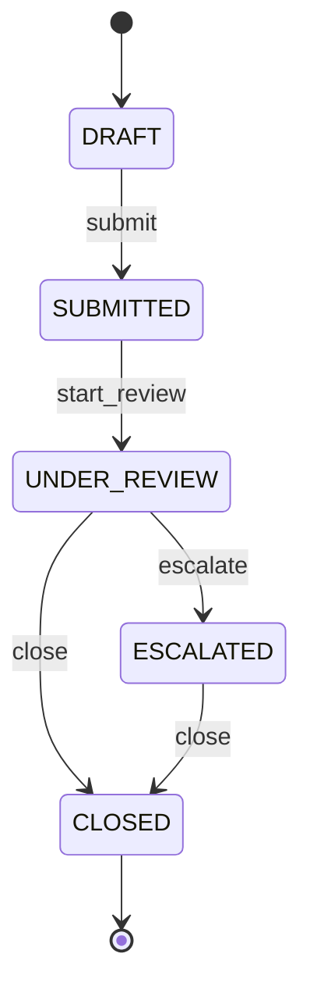
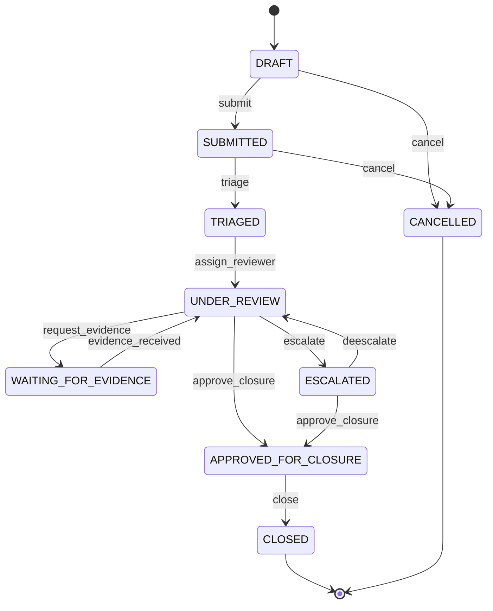

# Part 029 — State Machines, Workflow Modelling, dan Complex Case Lifecycle

## 1. Tujuan Part Ini

Banyak sistem bisnis sebenarnya adalah lifecycle system.

Contoh:

- case management;
- order processing;
- payment workflow;
- loan application;
- ticket support;
- regulatory review;
- incident management;
- document approval;
- KYC/onboarding;
- claim processing;
- deployment pipeline.

Semua punya pola yang sama:

```text
state saat ini + event/command + rule -> state berikutnya + side effects
```

Kesalahan umum:

- status hanya string tanpa rule;
- transition boleh dari mana saja ke mana saja;
- rule tersebar di route/controller/service;
- audit trail tidak lengkap;
- invalid state baru ketahuan di production;
- side effect terjadi sebelum state valid;
- retry membuat duplikasi;
- race condition membuat state tidak konsisten;
- state machine dicampur dengan UI/API status;
- workflow panjang ditulis sebagai nested `if`;
- terminal state masih bisa diubah;
- transition reason tidak diwajibkan;
- user authorization dan domain transition tercampur;
- tidak ada test matrix untuk state transitions.

Part ini membahas cara memodelkan workflow dengan Python secara eksplisit dan maintainable.

Target setelah part ini:

1. Memahami finite state machine.
2. Membedakan state, event, command, transition, guard, action.
3. Mendesain transition table.
4. Menjaga invariant lifecycle.
5. Memodelkan terminal state.
6. Memisahkan pure domain transition dan side effects.
7. Mendesain audit trail.
8. Memahami idempotency dan retry.
9. Memahami race condition dalam lifecycle.
10. Menulis test matrix dan property tests.
11. Mengembangkan `case-tracker` menjadi complex case lifecycle.

---

## 2. Mental Model: State Machine

State machine punya:

- finite set of states;
- initial state;
- terminal states;
- allowed transitions;
- transition trigger;
- optional guard;
- optional action/side effect.

Diagram sederhana:



State machine menjawab:

> Dari state ini, event apa yang valid, dan state berikutnya apa?

Bukan semua workflow perlu library state machine. Banyak domain bisa dimodelkan dengan enum + transition table + tests.

---

## 3. State vs Status String

Buruk:

```python
case.status = "closed"
```

Masalah:

- typo;
- casing inconsistent;
- transition rule tidak ada;
- status arbitrary;
- sulit dicari;
- type checker tidak membantu.

Lebih baik:

```python
class CaseStatus(Enum):
    DRAFT = "DRAFT"
    SUBMITTED = "SUBMITTED"
    UNDER_REVIEW = "UNDER_REVIEW"
    ESCALATED = "ESCALATED"
    CLOSED = "CLOSED"
```

Sekarang state finite dan eksplisit.

---

## 4. Command vs Event

Command:

> Permintaan untuk melakukan sesuatu.

Event:

> Fakta bahwa sesuatu sudah terjadi.

Example:

| Command | Event |
|---|---|
| `SubmitCase` | `CaseSubmitted` |
| `StartReview` | `CaseReviewStarted` |
| `EscalateCase` | `CaseEscalated` |
| `CloseCase` | `CaseClosed` |

Command bisa gagal karena rule tidak terpenuhi.

Event seharusnya tidak “gagal” karena event merepresentasikan fakta yang sudah terjadi.

In code:

```python
@dataclass(frozen=True)
class SubmitCase:
    case_id: CaseId
    actor_id: str


@dataclass(frozen=True)
class CaseSubmitted:
    case_id: CaseId
    actor_id: str
    occurred_at: datetime
```

Untuk project kecil, command/event class mungkin belum perlu. Tetapi mental modelnya penting.

---

## 5. Transition Table

Transition table membuat allowed transition eksplisit.

```python
ALLOWED_TRANSITIONS: dict[CaseStatus, set[CaseStatus]] = {
    CaseStatus.DRAFT: {CaseStatus.SUBMITTED},
    CaseStatus.SUBMITTED: {CaseStatus.UNDER_REVIEW},
    CaseStatus.UNDER_REVIEW: {CaseStatus.ESCALATED, CaseStatus.CLOSED},
    CaseStatus.ESCALATED: {CaseStatus.CLOSED},
    CaseStatus.CLOSED: set(),
}
```

Check:

```python
def can_transition(from_status: CaseStatus, to_status: CaseStatus) -> bool:
    return to_status in ALLOWED_TRANSITIONS[from_status]
```

Benefits:

- all transition rules visible;
- easy test matrix;
- easy documentation;
- easy diagram generation;
- easy review by domain expert.

---

## 6. Event-Based Transition Table

Sometimes transition target depends on event.

```python
class CaseEventType(Enum):
    SUBMIT = "SUBMIT"
    START_REVIEW = "START_REVIEW"
    ESCALATE = "ESCALATE"
    CLOSE = "CLOSE"
    REOPEN = "REOPEN"


TRANSITIONS: dict[tuple[CaseStatus, CaseEventType], CaseStatus] = {
    (CaseStatus.DRAFT, CaseEventType.SUBMIT): CaseStatus.SUBMITTED,
    (CaseStatus.SUBMITTED, CaseEventType.START_REVIEW): CaseStatus.UNDER_REVIEW,
    (CaseStatus.UNDER_REVIEW, CaseEventType.ESCALATE): CaseStatus.ESCALATED,
    (CaseStatus.UNDER_REVIEW, CaseEventType.CLOSE): CaseStatus.CLOSED,
    (CaseStatus.ESCALATED, CaseEventType.CLOSE): CaseStatus.CLOSED,
}
```

Apply:

```python
def next_status(current: CaseStatus, event_type: CaseEventType) -> CaseStatus:
    try:
        return TRANSITIONS[(current, event_type)]
    except KeyError as error:
        raise InvalidCaseTransitionEventError(current, event_type) from error
```

Event-based table is better when domain language is action/event oriented.

---

## 7. Guards

Guard is a condition beyond state.

Example:

- case can close only if reviewer assigned;
- escalation requires reason;
- high-risk case needs senior reviewer;
- case cannot close with unresolved findings;
- user must have permission;
- SLA breach event only applies after due date;
- duplicate submission rejected by idempotency key.

Guard example:

```python
def can_close(case: Case) -> bool:
    return case.status in {CaseStatus.UNDER_REVIEW, CaseStatus.ESCALATED} and not case.unresolved_findings
```

But be careful:

- pure domain guards can live in domain;
- authorization guards may live in policy/application layer;
- infrastructure checks should not enter domain entity method.

---

## 8. Pure Transition vs Side Effect

Pure transition:

```python
case.transition_to(CaseStatus.SUBMITTED)
```

Side effects:

- save to database;
- write audit log;
- send notification;
- publish event;
- update search index;
- call external system.

Bad:

```python
class Case:
    def transition_to(self, status: CaseStatus) -> None:
        self.status = status
        send_email(...)
        save_to_database(...)
```

Good:

```python
class Case:
    def transition_to(self, target_status: CaseStatus) -> CaseTransitioned:
        if not can_transition(self.status, target_status):
            raise InvalidCaseTransitionError(self.status, target_status)

        from_status = self.status
        self.status = target_status

        return CaseTransitioned(
            case_id=self.id,
            from_status=from_status,
            to_status=target_status,
        )
```

Service orchestrates side effects.

---

## 9. Domain Event from Transition

```python
@dataclass(frozen=True)
class CaseTransitioned:
    case_id: CaseId
    from_status: CaseStatus
    to_status: CaseStatus
```

Case method:

```python
def transition_to(self, target_status: CaseStatus) -> CaseTransitioned:
    if not can_transition(self.status, target_status):
        raise InvalidCaseTransitionError(self.status, target_status)

    from_status = self.status
    self.status = target_status

    return CaseTransitioned(
        case_id=self.id,
        from_status=from_status,
        to_status=target_status,
    )
```

Service:

```python
event = case.transition_to(target_status)
repository.save(case)
audit_repository.append(event)
notifier.notify(event)
```

This separates state change from side-effect execution.

---

## 10. Audit Trail

Workflow systems often need audit trail.

Audit event should capture:

- event id;
- case id;
- event type;
- actor;
- timestamp;
- from state;
- to state;
- reason;
- metadata;
- request id/correlation id;
- idempotency key if applicable.

Example:

```python
@dataclass(frozen=True)
class AuditEvent:
    id: str
    case_id: CaseId
    event_type: str
    actor_id: str
    occurred_at: datetime
    details: dict[str, str]
```

Transition audit:

```python
AuditEvent(
    id=str(uuid4()),
    case_id=case.id,
    event_type="CASE_TRANSITIONED",
    actor_id=actor_id,
    occurred_at=clock.now(),
    details={
        "from_status": from_status.value,
        "to_status": to_status.value,
        "reason": reason,
    },
)
```

Logs are not audit trail. Audit trail is domain/business record.

---

## 11. Terminal State

Terminal state means lifecycle ends.

Example:

```python
TERMINAL_STATUSES = {CaseStatus.CLOSED}
```

Rule:

```python
def is_terminal(status: CaseStatus) -> bool:
    return status in TERMINAL_STATUSES
```

If terminal:

```python
if self.status in TERMINAL_STATUSES:
    raise CaseAlreadyClosedError(self.id)
```

But beware reopen feature. If business later allows reopen, CLOSED is not absolute terminal. You may need:

- `CLOSED`;
- `ARCHIVED`;
- `REOPENED`;
- `CANCELLED`;
- `VOIDED`.

Do not call state terminal unless domain confirms.

---

## 12. State Explosion

Naive state modelling can create too many states.

Example flags:

- status;
- priority;
- assigned/unassigned;
- risk level;
- overdue;
- has findings;
- escalation level.

Bad state explosion:

```text
DRAFT_HIGH_RISK_ASSIGNED_OVERDUE
SUBMITTED_LOW_RISK_UNASSIGNED_NOT_OVERDUE
...
```

Better:

```python
status: CaseStatus
priority: Priority
assigned_reviewer_id: ReviewerId | None
due_at: datetime | None
findings: list[Finding]
```

State machine should model lifecycle status, not every attribute combination.

Rule:

> Use state for lifecycle phase. Use fields/guards/policies for orthogonal conditions.

---

## 13. Workflow vs State Machine

State machine:

- focuses on valid state transitions;
- finite states;
- good for lifecycle integrity.

Workflow:

- broader process orchestration;
- includes tasks, roles, approvals, timers, side effects;
- may involve multiple entities;
- may include external systems;
- may be long-running.

Example:

```text
Submit case
  -> assign reviewer
  -> perform review
  -> request evidence
  -> wait for response
  -> escalate if overdue
  -> approve closure
  -> close case
  -> notify stakeholders
```

State machine is part of workflow, not the whole workflow.

---

## 14. Long-Running Workflow

Long-running workflow cannot be one function that sleeps/waits.

Bad:

```python
def review_case(case_id: CaseId) -> None:
    submit()
    wait_for_7_days()
    escalate_if_no_response()
```

Better:

- persist state;
- schedule jobs;
- handle events;
- make each step idempotent;
- store audit events;
- use workflow engine if needed;
- use queues/schedulers/outbox.

For `case-tracker`, each command changes state and exits. That is good.

---

## 15. Time-Based Transitions

Example:

```text
UNDER_REVIEW -> ESCALATED if due_at < now and not closed
```

This transition is triggered by time/scheduler, not user.

Command:

```python
@dataclass(frozen=True)
class EscalateOverdueCases:
    now: datetime
```

Service:

```python
def escalate_overdue_cases(now: datetime) -> list[CaseTransitioned]:
    cases = repository.list_under_review_due_before(now)
    ...
```

Use injected clock for tests.

Do not call `datetime.now()` deep inside domain if deterministic testing matters.

---

## 16. Actor and Permission

Transition may require actor.

```python
def transition_case(
    case_id: CaseId,
    target_status: CaseStatus,
    actor: Actor,
    reason: str,
) -> Case:
    ...
```

Authorization policy:

```python
def can_actor_transition(actor: Actor, case: Case, target_status: CaseStatus) -> bool:
    ...
```

Keep separate:

- transition validity: domain lifecycle;
- permission: actor policy;
- request validation: API/CLI schema.

Example:

| Check | Layer |
|---|---|
| `target_status` is enum | boundary |
| `DRAFT -> CLOSED` invalid | domain |
| actor lacks reviewer role | application/security policy |
| database unavailable | infrastructure |

---

## 17. Reason Required

Some transitions require reason.

```python
REASON_REQUIRED_FOR = {
    CaseStatus.ESCALATED,
    CaseStatus.CLOSED,
}
```

But reason requirement may depend on event, not target state.

```python
class CaseAction(Enum):
    ESCALATE = "ESCALATE"
    CLOSE = "CLOSE"
```

Policy:

```python
def requires_reason(action: CaseAction) -> bool:
    return action in {CaseAction.ESCALATE, CaseAction.CLOSE}
```

Validation:

```python
if requires_reason(action) and not reason.strip():
    raise TransitionReasonRequiredError(action)
```

Reason becomes part of audit event.

---

## 18. Idempotency

Distributed/API systems retry.

Scenario:

Client sends:

```http
POST /cases/CASE-001/transitions
Idempotency-Key: abc
```

Network timeout occurs after server committed transition. Client retries.

Without idempotency, retry may:

- fail due to new state;
- create duplicate audit event;
- send duplicate notification;
- confuse client.

Idempotency record:

```python
@dataclass(frozen=True)
class IdempotencyRecord:
    key: str
    result_event_id: str
    request_hash: str
```

Service checks:

1. If key seen with same request, return same result.
2. If key seen with different request, reject.
3. If key new, process and store result atomically.

For CLI local project, not needed. For API/payment/workflow, critical.

---

## 19. Race Conditions in State Transition

Two requests:

```text
Request A: UNDER_REVIEW -> CLOSED
Request B: UNDER_REVIEW -> ESCALATED
```

Both read UNDER_REVIEW. Both think valid. Last write wins.

Solutions:

- database transaction isolation;
- optimistic locking/version column;
- `WHERE status = old_status` update condition;
- row lock;
- event sourcing conflict detection;
- single-writer queue;
- idempotency + transition checks.

Optimistic locking example:

```text
case.version = 7
update where id = ? and version = 7
set status = ?, version = 8
```

If zero rows updated, conflict.

---

## 20. Version Field

Domain:

```python
@dataclass
class Case:
    id: CaseId
    status: CaseStatus
    version: int
```

Repository update:

```python
def save_with_expected_version(case: Case, expected_version: int) -> None:
    ...
```

If expected version mismatch:

```python
raise ConcurrentModificationError(case.id)
```

This prevents silent lost updates.

For JSON file single-user project, version may be overkill. For API/database, important.

---

## 21. Event Sourcing Preview

Instead of storing current state only, store events:

```text
CaseCreated
CaseSubmitted
CaseReviewStarted
CaseEscalated
CaseClosed
```

Current state is derived by replaying events.

Benefits:

- full audit trail;
- temporal queries;
- append-only writes;
- debugging history;
- conflict detection.

Costs:

- complexity;
- event schema evolution;
- replay performance;
- projections;
- idempotency;
- tooling.

Do not jump to event sourcing unless audit/history/workflow complexity justifies it.

---

## 22. Outbox Pattern Preview

When transition must save state and publish message:

Bad:

```python
repository.save(case)
message_bus.publish(event)
```

If publish fails after save, state changed but message missing.

Outbox:

1. Save case.
2. Save event/message to outbox table in same transaction.
3. Background worker publishes outbox messages.
4. Mark message published.

This gives reliable side effects.

For JSON file project, concept only. For database-backed service, important.

---

## 23. Sagas and Compensation

Long workflows across services cannot usually use one database transaction.

Saga:

- sequence of local transactions;
- each step has compensating action if later step fails.

Example:

1. Create case.
2. Reserve reviewer capacity.
3. Notify external regulator.
4. If notification fails, release capacity or mark pending retry.

Compensation is business-specific. It is not simply rollback.

This is advanced architecture. Recognize when workflow crosses boundaries.

---

## 24. Case Lifecycle v2

More realistic states:

```python
class CaseStatus(Enum):
    DRAFT = "DRAFT"
    SUBMITTED = "SUBMITTED"
    TRIAGED = "TRIAGED"
    UNDER_REVIEW = "UNDER_REVIEW"
    WAITING_FOR_EVIDENCE = "WAITING_FOR_EVIDENCE"
    ESCALATED = "ESCALATED"
    APPROVED_FOR_CLOSURE = "APPROVED_FOR_CLOSURE"
    CLOSED = "CLOSED"
    CANCELLED = "CANCELLED"
```

Diagram:



Now transition table is more important.

---

## 25. Event Type v2

```python
class CaseAction(Enum):
    SUBMIT = "SUBMIT"
    TRIAGE = "TRIAGE"
    ASSIGN_REVIEWER = "ASSIGN_REVIEWER"
    REQUEST_EVIDENCE = "REQUEST_EVIDENCE"
    RECEIVE_EVIDENCE = "RECEIVE_EVIDENCE"
    ESCALATE = "ESCALATE"
    DEESCALATE = "DEESCALATE"
    APPROVE_CLOSURE = "APPROVE_CLOSURE"
    CLOSE = "CLOSE"
    CANCEL = "CANCEL"
```

Transition table:

```python
TRANSITIONS: dict[tuple[CaseStatus, CaseAction], CaseStatus] = {
    (CaseStatus.DRAFT, CaseAction.SUBMIT): CaseStatus.SUBMITTED,
    (CaseStatus.SUBMITTED, CaseAction.TRIAGE): CaseStatus.TRIAGED,
    (CaseStatus.TRIAGED, CaseAction.ASSIGN_REVIEWER): CaseStatus.UNDER_REVIEW,
    (CaseStatus.UNDER_REVIEW, CaseAction.REQUEST_EVIDENCE): CaseStatus.WAITING_FOR_EVIDENCE,
    (CaseStatus.WAITING_FOR_EVIDENCE, CaseAction.RECEIVE_EVIDENCE): CaseStatus.UNDER_REVIEW,
    (CaseStatus.UNDER_REVIEW, CaseAction.ESCALATE): CaseStatus.ESCALATED,
    (CaseStatus.ESCALATED, CaseAction.DEESCALATE): CaseStatus.UNDER_REVIEW,
    (CaseStatus.UNDER_REVIEW, CaseAction.APPROVE_CLOSURE): CaseStatus.APPROVED_FOR_CLOSURE,
    (CaseStatus.ESCALATED, CaseAction.APPROVE_CLOSURE): CaseStatus.APPROVED_FOR_CLOSURE,
    (CaseStatus.APPROVED_FOR_CLOSURE, CaseAction.CLOSE): CaseStatus.CLOSED,
    (CaseStatus.DRAFT, CaseAction.CANCEL): CaseStatus.CANCELLED,
    (CaseStatus.SUBMITTED, CaseAction.CANCEL): CaseStatus.CANCELLED,
}
```

---

## 26. Applying Action

```python
@dataclass(frozen=True)
class CaseTransition:
    action: CaseAction
    actor_id: str
    reason: str | None = None


def apply_transition(case: Case, transition: CaseTransition) -> CaseTransitioned:
    key = (case.status, transition.action)

    try:
        target_status = TRANSITIONS[key]
    except KeyError as error:
        raise InvalidCaseActionError(case.status, transition.action) from error

    validate_transition_guard(case, transition, target_status)

    from_status = case.status
    case.status = target_status

    return CaseTransitioned(
        case_id=case.id,
        from_status=from_status,
        to_status=target_status,
        action=transition.action,
        actor_id=transition.actor_id,
        reason=transition.reason,
    )
```

This centralizes lifecycle logic.

---

## 27. Guard Validation

```python
def validate_transition_guard(
    case: Case,
    transition: CaseTransition,
    target_status: CaseStatus,
) -> None:
    if transition.action in {CaseAction.ESCALATE, CaseAction.CANCEL}:
        if not transition.reason or not transition.reason.strip():
            raise TransitionReasonRequiredError(transition.action)

    if transition.action is CaseAction.APPROVE_CLOSURE:
        if case.unresolved_finding_count > 0:
            raise UnresolvedFindingsError(case.id)

    if case.status in {CaseStatus.CLOSED, CaseStatus.CANCELLED}:
        raise TerminalCaseError(case.id, case.status)
```

Keep guards pure if possible.

---

## 28. Application Service

```python
class CaseWorkflowService:
    def __init__(
        self,
        repository: CaseRepository,
        audit_repository: AuditRepository,
        clock: Clock,
    ) -> None:
        self._repository = repository
        self._audit_repository = audit_repository
        self._clock = clock

    def apply_action(
        self,
        case_id: CaseId,
        action: CaseAction,
        actor_id: str,
        reason: str | None,
    ) -> Case:
        case = self._repository.get(case_id)

        transition = CaseTransition(
            action=action,
            actor_id=actor_id,
            reason=reason,
        )

        event = case.apply_transition(transition)

        audit_event = transition_event_to_audit_event(event, occurred_at=self._clock.now())

        self._repository.save(case)
        self._audit_repository.append(audit_event)

        return case
```

If using database, case save and audit append should be one transaction.

---

## 29. Transaction Boundary

Important:

```python
repository.save(case)
audit_repository.append(audit_event)
```

If one succeeds and other fails, data inconsistent.

With Unit of Work:

```python
with unit_of_work:
    case = unit_of_work.cases.get(case_id)
    event = case.apply_transition(transition)
    unit_of_work.cases.save(case)
    unit_of_work.audit_events.append(to_audit_event(event))
    unit_of_work.commit()
```

For critical workflow, transaction boundary is part of correctness.

---

## 30. Workflow Testing Strategy

Test layers:

1. Transition table completeness.
2. Valid transitions.
3. Invalid transitions.
4. Guard rules.
5. Terminal states.
6. Audit event generation.
7. Service transaction behavior.
8. Idempotency behavior.
9. Concurrency conflict behavior.
10. API error mapping.

Tests should make lifecycle visible.

---

## 31. Test Transition Table

```python
@pytest.mark.parametrize(
    ("status", "action", "expected"),
    [
        (CaseStatus.DRAFT, CaseAction.SUBMIT, CaseStatus.SUBMITTED),
        (CaseStatus.SUBMITTED, CaseAction.TRIAGE, CaseStatus.TRIAGED),
    ],
)
def test_valid_transitions(status: CaseStatus, action: CaseAction, expected: CaseStatus) -> None:
    case = make_case(status=status)

    event = case.apply_transition(CaseTransition(action=action, actor_id="reviewer-1"))

    assert case.status is expected
    assert event.from_status is status
    assert event.to_status is expected
```

---

## 32. Test Invalid Transitions

```python
@pytest.mark.parametrize(
    ("status", "action"),
    [
        (CaseStatus.DRAFT, CaseAction.CLOSE),
        (CaseStatus.CLOSED, CaseAction.ESCALATE),
        (CaseStatus.CANCELLED, CaseAction.SUBMIT),
    ],
)
def test_invalid_transitions_are_rejected(status: CaseStatus, action: CaseAction) -> None:
    case = make_case(status=status)

    with pytest.raises(InvalidCaseActionError):
        case.apply_transition(CaseTransition(action=action, actor_id="reviewer-1"))
```

---

## 33. Test Guards

```python
def test_escalation_requires_reason() -> None:
    case = make_case(status=CaseStatus.UNDER_REVIEW)

    with pytest.raises(TransitionReasonRequiredError):
        case.apply_transition(
            CaseTransition(
                action=CaseAction.ESCALATE,
                actor_id="reviewer-1",
                reason=None,
            )
        )
```

Closure guard:

```python
def test_case_with_unresolved_findings_cannot_be_approved_for_closure() -> None:
    case = make_case(
        status=CaseStatus.UNDER_REVIEW,
        unresolved_finding_count=1,
    )

    with pytest.raises(UnresolvedFindingsError):
        case.apply_transition(
            CaseTransition(
                action=CaseAction.APPROVE_CLOSURE,
                actor_id="reviewer-1",
            )
        )
```

---

## 34. Property Test State Machine

Generate statuses/actions:

```python
@given(
    status=st.sampled_from(list(CaseStatus)),
    action=st.sampled_from(list(CaseAction)),
)
def test_transition_behavior_matches_transition_table(status: CaseStatus, action: CaseAction) -> None:
    case = make_case(status=status)

    key = (status, action)

    if key in TRANSITIONS:
        event = case.apply_transition(CaseTransition(action=action, actor_id="actor"))
        assert case.status is TRANSITIONS[key]
        assert event.to_status is TRANSITIONS[key]
    else:
        with pytest.raises(InvalidCaseActionError):
            case.apply_transition(CaseTransition(action=action, actor_id="actor"))
```

If guards complicate generation, use simple state/action test for table and separate guard tests.

---

## 35. Mermaid from Transition Table

You can generate diagram text from table:

```python
def transition_table_to_mermaid() -> str:
    lines = ["stateDiagram-v2"]

    for (from_status, action), to_status in TRANSITIONS.items():
        lines.append(f"    {from_status.value} --> {to_status.value}: {action.value}")

    return "\n".join(lines)
```

Use in docs to keep diagram aligned with code.

---

## 36. Workflow Smell Checklist

Watch for:

1. Status is raw string.
2. Transition logic duplicated in API and service.
3. Route directly sets status.
4. Terminal state can change accidentally.
5. Guards scattered across codebase.
6. No audit trail for lifecycle changes.
7. Reason required by policy but not enforced.
8. Retry creates duplicate side effects.
9. State save and audit save not transactional.
10. No concurrency conflict handling.
11. Transition table not tested.
12. Workflow encoded as nested if jungle.
13. Authorization mixed with enum parsing.
14. Background time transition uses real clock directly.
15. Domain event contains sensitive data unnecessarily.

---

## 37. Practice: Refactor Status Transition to Action-Based Table

Replace:

```python
case.transition_to(CaseStatus.SUBMITTED)
```

with:

```python
case.apply_transition(CaseTransition(action=CaseAction.SUBMIT, actor_id="user-1"))
```

Implement:

- `CaseAction`;
- `TRANSITIONS`;
- `InvalidCaseActionError`;
- transition event.

---

## 38. Practice: Add Reason Guard

Require reason for:

- escalate;
- cancel;
- close.

Test:

- escalation without reason fails;
- escalation with reason succeeds;
- submit without reason succeeds.

---

## 39. Practice: Add Audit Events

Create:

```python
@dataclass(frozen=True)
class AuditEvent:
    id: str
    case_id: CaseId
    actor_id: str
    event_type: str
    occurred_at: datetime
    details: dict[str, str]
```

Map transition event to audit event.

Test details include from/to/action/reason.

---

## 40. Practice: Add Version Field

Add:

```python
version: int = 0
```

Increment on transition:

```python
self.version += 1
```

Repository should later use expected version.

Test version increments once per successful transition and not on failed transition.

---

## 41. Practice: Generate State Diagram

Write function:

```python
def generate_state_diagram(transitions: Mapping[tuple[CaseStatus, CaseAction], CaseStatus]) -> str:
    ...
```

Save to docs.

Verify output contains all transition rows.

---

## 42. Self-Check

Jawab tanpa melihat materi:

1. Apa itu finite state machine?
2. Apa beda state dan status string?
3. Apa beda command dan event?
4. Apa itu transition table?
5. Apa itu guard?
6. Apa beda transition dan side effect?
7. Kenapa audit trail bukan log?
8. Apa itu terminal state?
9. Apa itu state explosion?
10. Apa beda workflow dan state machine?
11. Bagaimana time-based transition dimodelkan?
12. Apa beda validation, transition validity, dan authorization?
13. Kenapa reason harus jadi bagian audit?
14. Apa itu idempotency?
15. Apa race condition dalam state transition?
16. Apa fungsi version field?
17. Apa itu event sourcing?
18. Apa itu outbox pattern?
19. Apa test penting untuk state machine?
20. Apa workflow smell paling berbahaya?

---

## 43. Definition of Done Part 029

Kamu selesai part ini jika bisa:

1. Membuat enum state.
2. Membuat enum action.
3. Membuat transition table.
4. Mengimplementasikan `next_status`.
5. Mengimplementasikan guard.
6. Memisahkan transition dari side effect.
7. Membuat domain event.
8. Membuat audit event.
9. Menulis test valid transitions.
10. Menulis test invalid transitions.
11. Menulis test guard.
12. Menulis property test state/action.
13. Menjelaskan idempotency.
14. Menjelaskan concurrency conflict.
15. Menghasilkan Mermaid state diagram dari table.

---

## 44. Ringkasan

Workflow lifecycle harus dimodelkan eksplisit.

Inti part ini:

- state machine menjaga valid lifecycle;
- state sebaiknya enum, bukan raw string;
- command meminta perubahan, event mencatat fakta;
- transition table membuat rule terlihat;
- guard menangani kondisi tambahan;
- transition harus dipisahkan dari side effects;
- audit trail adalah business record, bukan log;
- terminal state harus dilindungi;
- hindari state explosion dengan memisahkan lifecycle state dan atribut orthogonal;
- long-running workflow harus persisted/event-driven, bukan function yang menunggu;
- idempotency mencegah retry menggandakan efek;
- concurrency conflict harus ditangani dengan version/transaction;
- workflow testing harus matrix-based dan property-aware.

Part berikutnya akan membahas security engineering in Python applications.

---

## 45. Referensi

- Python Documentation — `enum`.
- Python Documentation — `dataclasses`.
- Python Documentation — `datetime`.
- Python Documentation — `uuid`.
- Python Documentation — `typing.Protocol`.
- SQLAlchemy Documentation — transactions and unit of work concepts.
