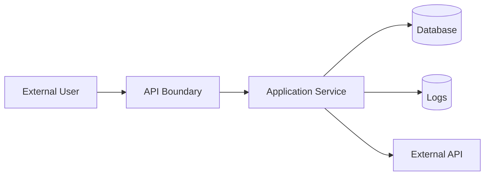

# Part 030 — Security Engineering in Python Applications

## 1. Tujuan Part Ini

Security bukan checklist di akhir project. Security adalah bagian dari desain.

Aplikasi Python sering berada di boundary kritikal:

- API menerima input user;
- service menyimpan data sensitif;
- worker memproses file upload;
- CLI membaca path dari user;
- backend mengakses database;
- sistem memakai token/API keys;
- dependency diambil dari package index;
- logs dikumpulkan ke platform observability;
- user role menentukan akses case;
- workflow transition punya konsekuensi compliance.

Kesalahan umum:

- menganggap Pydantic validation sama dengan security;
- authorization hanya dicek di frontend;
- JWT diterima tanpa verifikasi benar;
- password di-hash dengan SHA256 biasa;
- secret disimpan di repo;
- query SQL dibuat dengan f-string;
- `pickle` dipakai untuk data untrusted;
- `subprocess` memakai `shell=True` dengan input user;
- path traversal di file download/upload;
- CORS dibuka `*` tanpa paham risiko;
- error response membocorkan stack trace;
- logs berisi token/password/PII;
- dependency tidak diaudit;
- rate limiting tidak ada;
- security test tidak ada;
- threat model tidak pernah ditulis.

Part ini membahas security engineering untuk Python application secara praktis.

Target setelah part ini:

1. Memahami security mindset.
2. Membuat threat model sederhana.
3. Memahami OWASP Top 10 sebagai awareness baseline.
4. Memahami ASVS sebagai verification requirements baseline.
5. Membedakan authentication dan authorization.
6. Mendesain input validation dan output encoding.
7. Menghindari SQL/command/path injection.
8. Memahami password hashing dan secrets.
9. Menghindari insecure deserialization.
10. Mengelola dependency/supply-chain risk.
11. Mendesain secure logging/error handling.
12. Menerapkan security controls ke `case-tracker`.

---

## 2. Security Mindset

Security bertanya:

- Apa aset yang dilindungi?
- Siapa actor-nya?
- Apa trust boundary-nya?
- Input apa yang tidak dipercaya?
- Apa yang bisa disalahgunakan?
- Apa dampaknya?
- Control apa yang mencegah/mendeteksi/merespons?
- Bagaimana kita membuktikan control bekerja?

Security bukan hanya “apakah ada bug”.

Security adalah risk management.

---

## 3. Assets

Aset dalam `case-tracker` API:

- case data;
- notes/evidence;
- audit trail;
- user identity;
- role/permission;
- API tokens;
- database credentials;
- idempotency keys;
- logs;
- exported CSV files;
- configuration;
- deployment secrets.

Jika kamu tidak tahu asetnya, kamu tidak tahu apa yang harus dilindungi.

---

## 4. Trust Boundaries

Trust boundary adalah batas antara trusted dan untrusted zone.

Examples:



Untrusted:

- HTTP request body;
- query params;
- headers;
- uploaded files;
- CLI args;
- environment variables if deployment compromised;
- database content if previous bug allowed corruption;
- third-party API response;
- dependency package content.

Boundary rule:

> Validate at boundary, enforce domain invariants inside, authorize at use-case boundary, and never trust external data.

---

## 5. Threat Modelling Lite

A simple threat model document:

```markdown
# Threat Model: Case Transition API

## Assets
- Case lifecycle state
- Audit trail
- User identity
- Case notes

## Actors
- Authenticated reviewer
- Admin
- External attacker
- Malicious insider

## Trust Boundaries
- HTTP API
- Database
- External notification service

## Threats
- User transitions case they do not own
- Invalid transition bypasses domain rule
- Duplicate retry creates duplicate audit event
- Attacker injects SQL through case_id
- Logs expose sensitive notes

## Controls
- Authorization policy per transition
- Domain transition table
- Idempotency keys
- Parameterized SQL
- Log redaction

## Tests
- Unauthorized transition rejected
- Invalid transition returns 409
- SQL injection payload treated as data
- Logs do not contain note body
```

This is better than vague “we care about security”.

---

## 6. OWASP Top 10 as Awareness Baseline

OWASP Top 10 is an awareness document for critical web application security risks. It is not a complete secure engineering standard, but it is a useful shared vocabulary.

Use it to ask:

- Are access controls enforced server-side?
- Are cryptographic practices sound?
- Are injection risks mitigated?
- Is design itself secure?
- Is configuration secure?
- Are vulnerable/outdated components managed?
- Are authentication failures handled?
- Is data/software integrity protected?
- Are logs/monitoring sufficient?
- Are SSRF-like risks present?

Do not treat Top 10 as the only checklist. Use deeper standards for verification.

---

## 7. ASVS as Verification Baseline

OWASP ASVS provides security requirements for designing, developing, and testing web applications and services.

Use ASVS style thinking:

- authentication controls;
- session management;
- access control;
- validation/sanitization;
- stored cryptography;
- error handling/logging;
- data protection;
- communication security;
- malicious input handling;
- business logic controls;
- API/web service controls;
- configuration.

For a serious API, map controls to tests and review evidence.

---

## 8. Authentication vs Authorization

Authentication:

> Who are you?

Authorization:

> What are you allowed to do?

Example:

```python
current_user = get_current_user(token)
```

Authentication gives identity.

Authorization:

```python
if not can_transition_case(current_user, case, action):
    raise ForbiddenError()
```

A user can be authenticated but not authorized.

Never rely on frontend-only authorization.

---

## 9. Authorization as Policy

Policy function:

```python
def can_apply_action(user: User, case: Case, action: CaseAction) -> bool:
    if user.role is UserRole.ADMIN:
        return True

    if action is CaseAction.CLOSE:
        return user.role is UserRole.SENIOR_REVIEWER

    if action is CaseAction.ESCALATE:
        return user.role in {UserRole.REVIEWER, UserRole.SENIOR_REVIEWER}

    return user.role is UserRole.REVIEWER
```

Service:

```python
if not can_apply_action(user, case, action):
    raise ForbiddenError(user.id, action)
```

Route maps to HTTP 403.

Do not hide authorization inside UI or route-only if service can be called elsewhere.

---

## 10. Input Validation

Pydantic/FastAPI validate request shape.

Domain validates business invariants.

Examples:

- string length;
- enum values;
- date ranges;
- required fields;
- numeric ranges;
- allowed file extensions;
- content type;
- payload size;
- path normalization.

Pydantic schema:

```python
class CreateCaseRequest(BaseModel):
    title: str = Field(min_length=1, max_length=200)
```

Domain:

```python
def create_case(title: str) -> Case:
    normalized = title.strip()

    if not normalized:
        raise ValueError("Case title cannot be empty")

    return Case(...)
```

Both matter.

---

## 11. Output Encoding and XSS

If API returns JSON consumed by frontend, frontend must encode output properly in HTML context.

Backend should:

- return structured data, not prebuilt unsafe HTML;
- avoid reflecting raw input in HTML;
- set appropriate content types;
- sanitize only if accepting rich HTML;
- use safe templating if rendering server-side HTML.

In Python API-only backend, XSS usually occurs when frontend renders backend data unsafely. But backend can worsen it by storing untrusted HTML.

---

## 12. SQL Injection

Bad:

```python
query = f"SELECT * FROM cases WHERE id = '{case_id}'"
connection.execute(query)
```

If `case_id` contains SQL payload, query changes.

Good:

```python
connection.execute(
    "SELECT * FROM cases WHERE id = ?",
    (case_id,),
)
```

SQLAlchemy:

```python
session.execute(
    select(CaseRow).where(CaseRow.id == case_id)
)
```

Use parameterized queries/ORM expression APIs. Do not concatenate SQL with user input.

---

## 13. Command Injection

Bad:

```python
subprocess.run(f"convert {input_path} {output_path}", shell=True)
```

Good:

```python
subprocess.run(
    ["convert", str(input_path), str(output_path)],
    check=True,
)
```

Avoid `shell=True` with user input.

If shell is required, validate and quote carefully, but prefer no shell.

---

## 14. Path Traversal

User input:

```text
../../etc/passwd
```

Bad:

```python
path = base_dir / user_filename
return path.read_bytes()
```

Better:

```python
base_dir = Path("/safe/exports").resolve()
target = (base_dir / user_filename).resolve()

if not target.is_relative_to(base_dir):
    raise ForbiddenPathError()

content = target.read_bytes()
```

Caveats:

- symlinks;
- race conditions;
- OS-specific paths;
- upload naming;
- file permissions.

For downloads, prefer storing files by generated IDs and metadata, not direct user paths.

---

## 15. Insecure Deserialization

Do not load untrusted `pickle`.

Bad:

```python
pickle.loads(user_uploaded_bytes)
```

Pickle can execute code during deserialization.

Prefer:

- JSON;
- CSV with validation;
- typed schema formats;
- safe parsers;
- database rows;
- domain-specific parsers.

If using YAML via external dependency, use safe loader.

---

## 16. `eval` and `exec`

Do not execute untrusted strings.

Bad:

```python
result = eval(user_expression)
```

Even “limited” eval is dangerous.

For simple expressions, write parser or use safe expression language/library with strong sandboxing. Sandboxing Python code is difficult.

---

## 17. Secrets and Tokens

Use `secrets` for secure random tokens.

```python
import secrets

token = secrets.token_urlsafe(32)
```

Do not use `random` for security tokens.

Compare secrets with constant-time compare where appropriate:

```python
import hmac

if not hmac.compare_digest(provided_token, expected_token):
    raise UnauthorizedError()
```

Store secrets:

- environment/secret manager;
- not git;
- not logs;
- not error messages;
- rotate when compromised;
- scope minimally.

---

## 18. Password Hashing

Do not store plaintext passwords.

Do not hash passwords with plain SHA256:

```python
hashlib.sha256(password.encode()).hexdigest()
```

Password hashing needs:

- salt;
- adaptive cost;
- memory-hardness where appropriate;
- established algorithm/library;
- upgrade path.

Use reputable password hashing libraries/algorithms such as Argon2id, bcrypt, or PBKDF2 via vetted libraries/frameworks.

Python standard library has `hashlib.pbkdf2_hmac`, but application teams often use higher-level password hashing libraries to manage parameters and formats.

Never design your own password hashing scheme.

---

## 19. Cryptography Rule

Do not invent crypto.

Use:

- well-reviewed libraries;
- standard protocols;
- safe defaults;
- proven algorithms;
- key rotation strategy;
- separation of signing/encryption;
- authenticated encryption when encrypting.

Hashing is not encryption.
Encoding is not encryption.
Signing is not encryption.

If you are not sure, involve security expertise.

---

## 20. JWT Caveats

JWT can be useful, but common mistakes include:

- not verifying signature;
- accepting wrong algorithm;
- not checking expiration;
- not checking issuer/audience;
- storing too much sensitive data in token;
- treating token payload as encrypted;
- no revocation strategy;
- long-lived access tokens;
- insecure key management.

JWT payload is usually base64url-encoded, not encrypted by default.

Use framework/library correctly. Write tests for invalid/expired/wrong-audience tokens.

---

## 21. FastAPI Security Dependencies

FastAPI provides security utilities such as OAuth2 helpers and dependency-based auth integration.

Concept:

```python
def get_current_user(token: str = Depends(oauth2_scheme)) -> User:
    ...
```

Then:

```python
@app.post("/cases")
def create_case(
    request: CreateCaseRequest,
    current_user: User = Depends(get_current_user),
):
    ...
```

Dependency extracts/authenticates identity. Authorization policy still must check permissions for actions.

---

## 22. CORS

CORS controls which browser origins can call your API from frontend JavaScript.

Bad default for sensitive API:

```python
allow_origins=["*"]
allow_credentials=True
```

Be specific:

```python
allow_origins=["https://app.example.com"]
```

CORS is browser security policy. It is not authentication or authorization.

Do not “fix” auth issues by changing CORS.

---

## 23. CSRF

CSRF matters when browser automatically sends credentials like cookies.

If using cookie-based authentication:

- SameSite cookies;
- CSRF tokens;
- origin/referer checks;
- proper CORS;
- avoid unsafe state-changing GET.

If using Authorization bearer token manually stored by frontend, CSRF risk differs but XSS/token theft risk may rise.

Auth storage choice affects threat model.

---

## 24. SSRF

Server-Side Request Forgery occurs when attacker can make server request internal/external URLs.

Example dangerous feature:

```python
def import_case_from_url(url: str) -> Case:
    response = http_client.get(url)
```

Attacker supplies:

```text
http://localhost:8000/admin
http://169.254.169.254/
```

Controls:

- avoid arbitrary URL fetch;
- allowlist domains;
- block private/link-local IP ranges;
- resolve DNS carefully;
- set timeouts;
- limit redirects;
- restrict protocols;
- log safely.

---

## 25. File Upload Security

If accepting files:

- limit size;
- validate content type but do not trust only header;
- scan if required;
- store outside web root;
- generate server-side filename;
- avoid path traversal;
- avoid executing uploaded content;
- process in sandbox/isolated worker if risky;
- handle archive bombs/zip slip;
- validate encoding/format.

For CSV import, treat file content as untrusted.

---

## 26. Dependency and Supply Chain Security

Python dependencies can introduce risk.

Controls:

- minimize dependencies;
- pin/lock application dependencies;
- audit dependencies;
- update regularly;
- review new dependencies;
- avoid typosquatting;
- use trusted sources/indexes;
- separate dev/runtime dependencies;
- verify licenses;
- scan for secrets;
- do not install random GitHub URLs in production without review.

Tools may include:

- `pip-audit`;
- Dependabot/Renovate;
- GitHub security alerts;
- lockfile diff review;
- internal package policies.

---

## 27. Configuration Security

Risks:

- debug mode enabled in production;
- secret defaults;
- weak CORS;
- insecure cookies;
- no TLS behind proxy;
- verbose error pages;
- open admin endpoints;
- permissive file permissions;
- default credentials.

Use environment-specific config.

Validate config on startup:

```python
@dataclass(frozen=True)
class SecurityConfig:
    allowed_origins: list[str]
    debug: bool
    token_issuer: str
```

Reject unsafe production config.

---

## 28. Secure Error Handling

User response:

```json
{
  "error": "internal_error",
  "message": "Unexpected error"
}
```

Log:

```python
logger.exception("event=unexpected_error request_id=%s", request_id)
```

Do not return:

- stack trace;
- database query;
- secret values;
- internal file paths;
- full dependency errors;
- raw exception repr if sensitive.

Expected errors can be specific:

- 404 case not found;
- 403 forbidden;
- 409 invalid transition;
- 422 validation.

Unexpected errors should be generic externally and detailed internally.

---

## 29. Secure Logging

Do not log:

- password;
- token;
- API key;
- full authorization header;
- session cookie;
- sensitive notes/evidence;
- personal identifiers unless policy allows;
- raw request body;
- cryptographic keys;
- database credentials.

Log:

- request id;
- actor id if allowed;
- case id if allowed;
- action;
- status code;
- error category;
- duration;
- decision result.

Add redaction utilities for known sensitive fields.

---

## 30. Rate Limiting and Abuse

APIs need abuse controls:

- login attempts;
- token refresh;
- case creation spam;
- expensive search;
- file upload;
- export jobs;
- password reset;
- notification trigger.

Controls:

- rate limiting by user/IP/token;
- quotas;
- backoff;
- captcha for public flows if applicable;
- job queue limits;
- pagination limits;
- timeout limits;
- payload size limits.

FastAPI app may need middleware/proxy/API gateway support.

---

## 31. Authorization for Case Workflow

Policy examples:

```python
def can_apply_case_action(user: User, case: Case, action: CaseAction) -> bool:
    if user.role is UserRole.ADMIN:
        return True

    if action is CaseAction.CLOSE:
        return user.role is UserRole.SENIOR_REVIEWER and case.assigned_reviewer_id == user.id

    if action in {CaseAction.ESCALATE, CaseAction.REQUEST_EVIDENCE}:
        return user.role in {UserRole.REVIEWER, UserRole.SENIOR_REVIEWER}

    return False
```

Test matrix:

| Role | Action | Expected |
|---|---|---|
| reviewer | escalate assigned case | allow |
| reviewer | close case | deny |
| senior reviewer | close assigned case | allow |
| anonymous | any action | deny |
| admin | any action | allow |

Authorization tests are security tests.

---

## 32. Object-Level Authorization

Broken object-level authorization occurs when user can access object by changing ID.

Example:

```http
GET /cases/CASE-OTHER-TEAM
```

If API only checks authentication but not object permission, data leaks.

Service should check:

```python
case = repository.get(case_id)

if not can_view_case(user, case):
    raise ForbiddenError()
```

Not just:

```python
if user is authenticated:
    return case
```

Object-level authorization is essential in case systems.

---

## 33. Multi-Tenancy

If system has tenants:

- include tenant_id in queries;
- enforce tenant boundary in repository/service;
- do not rely on client-provided tenant only;
- validate current user's tenant;
- add database constraints/indexes;
- test cross-tenant access denial.

Bad:

```python
repository.get_case(case_id)
```

Better:

```python
repository.get_case_for_tenant(tenant_id, case_id)
```

And database query includes tenant:

```sql
WHERE tenant_id = ? AND case_id = ?
```

---

## 34. Security Testing Strategy

Test:

- invalid input rejected;
- unauthorized user rejected;
- forbidden action rejected;
- cross-tenant access rejected;
- invalid transition rejected;
- SQL injection payload treated as data;
- path traversal blocked;
- secret not logged;
- expired token rejected;
- wrong audience token rejected;
- missing auth rejected;
- rate limit behavior if implemented;
- dependency audit in CI.

Security tests should be part of regression suite.

---

## 35. Static and Dynamic Security Checks

Static:

- lint rules;
- Bandit-like checks;
- dependency audit;
- secret scanning;
- type checking for security-critical boundary objects.

Dynamic:

- integration tests;
- API tests;
- fuzz/property tests;
- DAST scanner in some environments;
- manual review;
- penetration testing for serious systems.

Tools help, but design review is still required.

---

## 36. Python-Specific Dangerous APIs

Be cautious with:

| API | Risk |
|---|---|
| `pickle.loads` | code execution on untrusted data |
| `eval`, `exec` | code execution |
| `subprocess(..., shell=True)` | command injection |
| string-built SQL | SQL injection |
| unsafe YAML loaders | code/object construction |
| `tempfile.mktemp` | race-prone temp filename |
| `random` for tokens | predictable randomness |
| logging full request body | secret/PII leak |
| `assert` for security checks | can be disabled with optimization |
| debug server in prod | information exposure |

Use safer alternatives and validate assumptions.

---

## 37. Do Not Use `assert` for Security

Bad:

```python
assert user.is_admin
delete_case(case_id)
```

Python can run with optimizations that remove assert statements.

Use explicit checks:

```python
if not user.is_admin:
    raise ForbiddenError()
```

Assertions are for developer invariants, not runtime security controls.

---

## 38. Secure Defaults

Defaults should be safe.

Bad:

```python
debug = os.getenv("DEBUG", "true") == "true"
allow_origins = ["*"]
token_expiration_minutes = 60 * 24 * 365
```

Better:

```python
debug = os.getenv("DEBUG", "false") == "true"
allow_origins = parse_allowed_origins()
token_expiration_minutes = 15
```

Fail closed if config missing for production-critical settings.

---

## 39. Case Tracker Security Baseline

For API version:

1. All endpoints require auth except health.
2. Current user injected via dependency.
3. Service checks object-level authorization.
4. Transition actions checked by policy.
5. Pydantic validates request shape.
6. Domain validates transition rule.
7. SQLAlchemy uses parameterized expressions.
8. Secrets loaded from environment/secret manager.
9. Logs exclude notes/tokens.
10. Error handlers hide internal traces.
11. CORS allowlist configured.
12. Pagination limits enforced.
13. File exports use generated filenames.
14. Dependencies locked/audited.
15. Security tests in CI.

---

## 40. Case Tracker Auth Sketch

```python
@dataclass(frozen=True)
class User:
    id: str
    role: UserRole
    tenant_id: str


def get_current_user(...) -> User:
    ...
```

Route:

```python
def transition_case_endpoint(
    case_id: str,
    request: TransitionCaseRequest,
    current_user: User = Depends(get_current_user),
    service: CaseWorkflowService = Depends(get_case_workflow_service),
) -> CaseResponse:
    case = service.apply_action(
        case_id=CaseId(case_id),
        action=CaseAction(request.action.value),
        actor=current_user,
        reason=request.reason,
    )

    return case_to_response(case)
```

Service:

```python
if not can_apply_case_action(actor, case, action):
    raise ForbiddenError(actor.id, action)
```

API maps `ForbiddenError` to 403.

---

## 41. Case Tracker Security Tests

```python
def test_reviewer_cannot_close_case() -> None:
    user = User(id="user-1", role=UserRole.REVIEWER, tenant_id="tenant-1")
    case = make_case(status=CaseStatus.APPROVED_FOR_CLOSURE)

    assert not can_apply_case_action(user, case, CaseAction.CLOSE)
```

API:

```python
def test_unauthorized_transition_returns_403(client: TestClient) -> None:
    response = client.post(
        "/cases/CASE-001/transitions",
        json={"action": "CLOSE", "reason": "done"},
        headers={"Authorization": "Bearer reviewer-token"},
    )

    assert response.status_code == 403
```

Object-level:

```python
def test_user_cannot_get_case_from_other_tenant(client: TestClient) -> None:
    response = client.get(
        "/cases/CASE-OTHER",
        headers={"Authorization": "Bearer tenant-1-token"},
    )

    assert response.status_code in {403, 404}
```

Some systems return 404 to avoid revealing object existence. Decide policy.

---

## 42. Security Review Checklist

For each endpoint:

1. Is auth required?
2. Who can call it?
3. What object-level permission applies?
4. What input is untrusted?
5. What validation applies?
6. What domain rule applies?
7. What side effect occurs?
8. Is operation idempotent?
9. What is rate limit?
10. What is logged?
11. What must not be logged?
12. What error response is returned?
13. Does it access file/network/subprocess?
14. Does it handle tenant boundary?
15. Are tests present?

---

## 43. Security Smell Checklist

Watch for:

1. `HTTPException` used instead of policy layer for authorization everywhere.
2. Authorization only in frontend.
3. `assert` used for permission.
4. Raw SQL string with user input.
5. `shell=True` with user input.
6. `pickle.loads` on uploaded data.
7. Path built from user input without resolve/allowlist.
8. JWT decoded without verification.
9. Password hashed with fast hash only.
10. Secrets in `.env` committed.
11. Full `Authorization` header logged.
12. Stack traces returned to users.
13. CORS wildcard with credentials.
14. No pagination/rate limits.
15. Dependency versions never updated.
16. Debug mode in production.
17. Multi-tenant query missing tenant condition.
18. API endpoint returns object by id without authorization.
19. Tests cover valid user but not forbidden user.
20. Security review never done.

---

## 44. Practice: Threat Model One Endpoint

Pick:

```text
PATCH /cases/{case_id}/status
```

Write:

- assets;
- actors;
- trust boundaries;
- threats;
- controls;
- tests.

Keep it one page.

---

## 45. Practice: Authorization Policy

Implement:

```python
def can_apply_case_action(user: User, case: Case, action: CaseAction) -> bool:
    ...
```

Test matrix with parametrize.

Include:

- admin;
- senior reviewer;
- reviewer;
- unrelated tenant;
- anonymous if represented.

---

## 46. Practice: Path Traversal Defense

Implement:

```python
def resolve_export_path(base_dir: Path, requested_name: str) -> Path:
    base = base_dir.resolve()
    target = (base / requested_name).resolve()

    if not target.is_relative_to(base):
        raise ForbiddenPathError(requested_name)

    return target
```

Test:

- normal filename allowed;
- `../secret.txt` rejected;
- nested allowed if policy permits.

---

## 47. Practice: SQL Injection Regression

With repository method:

```python
repository.get_case(CaseId("CASE-001' OR '1'='1"))
```

Expected:

- no SQL error;
- no unexpected case returned;
- treated as literal id.

If using SQLAlchemy expression API, this should be safe. Test anyway for confidence.

---

## 48. Practice: Secret Logging Test

Use `caplog`.

```python
def test_token_is_not_logged(caplog) -> None:
    token = "super-secret-token"

    with caplog.at_level(logging.INFO):
        authenticate_token(token)

    assert token not in caplog.text
```

Add redaction if needed.

---

## 49. Practice: Dependency Audit in CI

Add CI step:

```bash
python -m pip install pip-audit
python -m pip_audit
```

Or use your chosen dependency audit workflow.

Decide:

- fail on high severity?
- allowlist temporary CVEs?
- who reviews updates?
- how often to run?

---

## 50. Self-Check

Jawab tanpa melihat materi:

1. Apa itu asset?
2. Apa itu trust boundary?
3. Apa bedanya authentication dan authorization?
4. Kenapa authorization harus server-side?
5. Apa itu object-level authorization?
6. Apa itu multi-tenancy risk?
7. Kenapa Pydantic validation bukan security lengkap?
8. Apa itu SQL injection?
9. Bagaimana mencegah SQL injection?
10. Apa itu command injection?
11. Apa itu path traversal?
12. Kenapa pickle tidak aman untuk untrusted data?
13. Kenapa `eval` berbahaya?
14. Kenapa `secrets` lebih tepat dari `random` untuk token?
15. Kenapa SHA256 biasa tidak cukup untuk password?
16. Apa JWT caveat penting?
17. Apa CORS bukan?
18. Apa SSRF?
19. Kenapa logs bisa menjadi security risk?
20. Kenapa `assert` tidak boleh untuk security control?

---

## 51. Definition of Done Part 030

Kamu selesai part ini jika bisa:

1. Menulis threat model satu endpoint.
2. Menentukan assets dan trust boundaries.
3. Menjelaskan OWASP Top 10 sebagai awareness baseline.
4. Menjelaskan ASVS sebagai verification baseline.
5. Membedakan authn/authz.
6. Menulis authorization policy.
7. Menulis object-level authorization test.
8. Mencegah SQL injection dengan parameterized query/ORM.
9. Mencegah command injection dengan arg list/no shell.
10. Mencegah path traversal dengan resolve/allowlist.
11. Menghindari pickle/eval untuk untrusted input.
12. Menggunakan `secrets` untuk token.
13. Menjelaskan password hashing yang benar.
14. Menulis secure error/logging policy.
15. Menambahkan security checks ke CI.

---

## 52. Ringkasan

Security engineering adalah desain sistematis atas risiko.

Inti part ini:

- mulai dari assets dan trust boundaries;
- threat model membuat security konkret;
- OWASP Top 10 berguna sebagai awareness baseline;
- ASVS berguna sebagai verification requirements baseline;
- authentication dan authorization berbeda;
- object-level authorization penting untuk case systems;
- validation, business rule, dan authorization adalah layer berbeda;
- SQL/command/path injection dicegah dengan API aman dan validasi;
- jangan deserialize untrusted pickle;
- jangan gunakan `eval`/`exec` untuk input user;
- `secrets` untuk token, bukan `random`;
- password hashing butuh algorithm/library yang tepat;
- JWT harus diverifikasi lengkap;
- CORS bukan auth;
- logs dan errors harus aman;
- dependency supply chain adalah security boundary;
- security tests harus masuk regression suite.

Part berikutnya akan membahas observability, operations, dan production readiness.

---

## 53. Referensi

- OWASP Top 10.
- OWASP Application Security Verification Standard.
- FastAPI Documentation — Security.
- Python Documentation — `secrets`.
- Python Documentation — `hmac`.
- Python Documentation — `hashlib`.
- Python Documentation — `subprocess`.
- Python Documentation — `pickle`.
- Python Documentation — `pathlib`.
