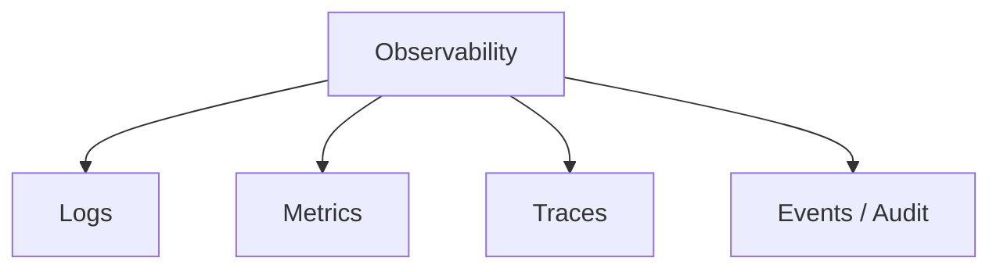
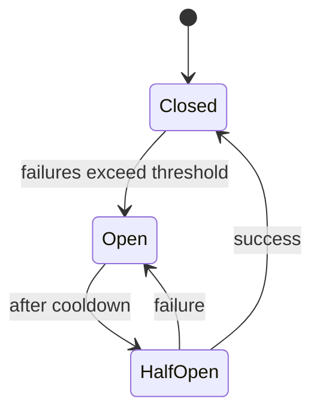

# Part 031 — Observability, Operations, dan Production Readiness

## 1. Tujuan Part Ini

Aplikasi yang bagus secara lokal belum tentu siap production.

Production readiness berarti aplikasi bisa:

- dikonfigurasi dengan aman;
- dijalankan konsisten di environment target;
- diamati saat berjalan;
- didiagnosis saat gagal;
- menerima traffic/pekerjaan sesuai kapasitas;
- shutdown dengan aman;
- recover dari dependency failure;
- memberi sinyal health;
- menghasilkan logs/metrics/traces yang berguna;
- punya alert yang actionable;
- punya runbook;
- punya deployment dan rollback path;
- punya ownership yang jelas.

Part ini membahas bagaimana Python application dibawa dari “works on my machine” menjadi “operable system”.

Target setelah part ini:

1. Memahami observability signals: logs, metrics, traces.
2. Mendesain structured logs.
3. Mendesain metrics minimal.
4. Memahami tracing dan correlation.
5. Memahami health, readiness, liveness.
6. Memahami graceful shutdown.
7. Memahami configuration management.
8. Memahami deployment readiness.
9. Memahami SLO/SLI/error budget secara praktis.
10. Membuat runbook.
11. Menerapkan production readiness ke `case-tracker` API/worker.
12. Menghindari operational anti-patterns.

---

## 2. Production Is a Different Environment

Development:

```text
one user, known machine, manual command, visible terminal
```

Production:

```text
many users/jobs, unknown timing, failures, load, restarts, deploys, alerts, partial outages
```

Perbedaan:

| Area | Development | Production |
|---|---|---|
| Input | small/manual | large/untrusted/concurrent |
| Failure | visible immediately | hidden unless instrumented |
| Config | local file/env | secrets/config service/env |
| Logs | terminal | centralized logging |
| Metrics | rarely | dashboards/alerts |
| Data | disposable | durable/regulated |
| Deployment | manual | repeatable pipeline |
| Debugging | breakpoint | logs/traces/metrics |
| Scale | tiny | variable |
| Security | relaxed | strict |
| Ownership | one person | team/on-call |

Production readiness adalah membuat sistem bisa hidup di kondisi kanan.

---

## 3. Observability Signals

Tiga signal utama:



| Signal | Menjawab |
|---|---|
| Logs | Apa yang terjadi pada event tertentu? |
| Metrics | Berapa sering/berapa besar/berapa lama? |
| Traces | Request/task melewati komponen mana dan di mana lambat? |
| Audit events | Siapa melakukan apa, kapan, dan kenapa secara business/legal? |

Logs, metrics, traces saling melengkapi.

Contoh case transition:

- log: `case_transitioned case_id=CASE-001`
- metric: `case_transition_total{status="SUBMITTED"} += 1`
- trace: request `PATCH /cases/{id}/status` span service + repository
- audit: domain event dengan actor, timestamp, reason

---

## 4. Logs: Diagnostic Narrative

Log yang baik punya:

- event name;
- severity;
- timestamp;
- logger/module;
- correlation/request id;
- entity id;
- outcome;
- duration jika relevant;
- error type/reason;
- no secret/sensitive payload.

Contoh key-value style:

```text
INFO event=case_transitioned case_id=CASE-001 from_status=DRAFT to_status=SUBMITTED request_id=abc123 duration_ms=12.4
```

Python standard library `logging` cukup untuk baseline.

```python
import logging

logger = logging.getLogger(__name__)

logger.info(
    "event=case_transitioned case_id=%s from_status=%s to_status=%s",
    case.id,
    from_status.value,
    to_status.value,
)
```

---

## 5. Structured Logging

Structured logging berarti log mudah diparse mesin.

Minimal key-value:

```text
event=case_created case_id=CASE-001 status=DRAFT
```

JSON logging:

```json
{
  "level": "INFO",
  "event": "case_created",
  "case_id": "CASE-001",
  "status": "DRAFT",
  "request_id": "abc123"
}
```

Keuntungan JSON logs:

- mudah query di log platform;
- field bisa diindex;
- alert bisa berdasarkan field;
- lebih konsisten.

Trade-off:

- perlu formatter/config;
- kurang nyaman dibaca manual;
- perlu disiplin field names.

Untuk awal, key-value logs cukup. Untuk production service, JSON logs sering lebih baik.

---

## 6. Logging Policy

Buat policy sederhana:

| Event | Level | Context |
|---|---|---|
| App start | INFO | version, env |
| App shutdown | INFO | reason |
| Request start/end | INFO/DEBUG | method, path, status, duration, request_id |
| Domain success | INFO | case_id, action |
| User/domain rejection | INFO/WARNING | case_id, reason |
| Dependency failure | ERROR/WARNING | dependency, operation, timeout |
| Unexpected exception | ERROR | traceback, request_id |
| Security event | WARNING/ERROR | actor, action, reason |
| Debug internals | DEBUG | no sensitive data |

Avoid logging:

- access tokens;
- passwords;
- full PII/regulated details;
- huge payloads;
- raw authorization headers;
- stack traces to user response.

---

## 7. Metrics: Quantified Behavior

Metrics are numeric time series.

Examples:

- request count;
- error count;
- request duration;
- queue depth;
- worker jobs processed;
- case transition count;
- storage load duration;
- DB connection pool usage;
- memory usage;
- process restart count.

Metric types:

| Type | Meaning |
|---|---|
| Counter | Monotonically increasing count |
| Gauge | Value that can go up/down |
| Histogram | Distribution of values |
| Summary | Client-side distribution summary |

Examples:

```text
http_requests_total{method="GET", route="/cases", status="200"} 12345
http_request_duration_seconds_bucket{le="0.1"} 100
case_transition_total{to_status="SUBMITTED"} 42
case_store_load_duration_seconds 0.034
```

Metrics answer trend questions better than logs.

---

## 8. What to Measure

Golden signals for services:

1. Latency.
2. Traffic.
3. Errors.
4. Saturation.

For API:

- request rate;
- p50/p95/p99 latency;
- status code rate;
- error rate;
- in-flight requests;
- DB query duration;
- dependency timeout count.

For worker:

- jobs processed;
- job duration;
- job failure count;
- retry count;
- dead-letter count;
- queue depth;
- lag.

For `case-tracker` API:

- cases created total;
- transitions total;
- invalid transitions total;
- store load/save duration;
- request duration;
- 4xx/5xx count.

---

## 9. Traces: Request Journey

Trace shows a request/task across components.

Concepts:

| Concept | Meaning |
|---|---|
| Trace | Entire request journey |
| Span | One operation inside trace |
| Parent/child span | Nested operation relationship |
| Trace ID | Correlates spans |
| Span attributes | Context fields |
| Events | Timestamped notes inside span |

Example trace:

```text
Trace: PATCH /cases/CASE-001/status
  Span: HTTP request
    Span: CaseService.transition_case
      Span: JsonCaseRepository.list
      Span: Case.transition_to
      Span: JsonCaseRepository.save_all
```

Traces help answer:

- where time is spent;
- which dependency failed;
- what path request took;
- why p95 latency increased;
- correlation across services.

---

## 10. OpenTelemetry

OpenTelemetry is a standard ecosystem for generating and collecting telemetry such as traces, metrics, and logs. In Python, OpenTelemetry provides APIs/SDKs and instrumentation paths for common libraries/frameworks.

Conceptual architecture:


Practical strategy:

1. Start with good logs.
2. Add request metrics.
3. Add tracing for API/service dependencies.
4. Use auto-instrumentation where useful.
5. Add manual spans around domain/application operations.
6. Keep business audit separate from traces/logs.

Do not add telemetry without deciding how it will be viewed and acted on.

---

## 11. Correlation IDs

Correlation ID ties logs/metrics/traces for one request/task.

HTTP:

```text
X-Request-ID: abc123
```

Middleware:

```python
from uuid import uuid4

@app.middleware("http")
async def request_id_middleware(request, call_next):
    request_id = request.headers.get("X-Request-ID", str(uuid4()))
    response = await call_next(request)
    response.headers["X-Request-ID"] = request_id
    return response
```

Logging:

```text
request_id=abc123 event=case_created case_id=CASE-001
```

Use correlation ID for:

- debugging user issue;
- tracing request across services;
- support tickets;
- incident investigation.

---

## 12. Context Propagation

In async/web apps, request context must flow through call chain.

Options:

- pass request id explicitly;
- use `contextvars`;
- framework middleware;
- OpenTelemetry context propagation.

Explicit passing is simple but can be noisy.

```python
service.create_case(title, request_context=context)
```

Context object:

```python
@dataclass(frozen=True)
class RequestContext:
    request_id: str
    actor_id: str | None = None
```

Domain should not depend on HTTP request, but application services may accept context if needed for audit/authorization/logging.

---

## 13. Health Checks

Health checks answer whether system is alive/ready.

Types:

| Check | Meaning |
|---|---|
| Liveness | Process should be restarted if failing |
| Readiness | Process can receive traffic |
| Startup | Initialization completed |

For FastAPI:

```python
@app.get("/health/live")
def liveness() -> dict[str, str]:
    return {"status": "alive"}


@app.get("/health/ready")
def readiness(service: CaseService = Depends(get_case_service)) -> dict[str, str]:
    service.check_ready()
    return {"status": "ready"}
```

Readiness may check:

- database reachable;
- migrations compatible;
- config valid;
- required dependencies available;
- storage path writable.

Avoid expensive deep checks on every health request.

---

## 14. Diagnostics Endpoint

Diagnostics endpoint is for operators, not public users.

It may include:

- version;
- Python version;
- build SHA;
- environment name;
- config summary without secrets;
- dependency status;
- schema version;
- feature flags;
- queue status.

Example:

```python
@app.get("/diagnostics")
def diagnostics() -> DiagnosticsResponse:
    return DiagnosticsResponse(
        version=get_package_version("case-tracker"),
        python_version=platform.python_version(),
        store_path=str(config.store_path),
        store_exists=config.store_path.exists(),
    )
```

Protect diagnostics in production if it reveals internal details.

---

## 15. Configuration Management

Configuration should be:

- explicit;
- environment-specific;
- validated at startup;
- separated from code;
- safe for secrets;
- documented.

Config sources:

- environment variables;
- config files;
- secret manager;
- command-line arguments;
- deployment manifests.

Config object:

```python
@dataclass(frozen=True)
class AppConfig:
    environment: str
    log_level: str
    store_path: Path
    request_timeout_seconds: float
```

Load once:

```python
def load_config(environ: Mapping[str, str]) -> AppConfig:
    return AppConfig(
        environment=environ.get("APP_ENV", "local"),
        log_level=environ.get("LOG_LEVEL", "INFO"),
        store_path=Path(environ.get("CASE_TRACKER_STORE", "cases.json")),
        request_timeout_seconds=float(environ.get("REQUEST_TIMEOUT_SECONDS", "5")),
    )
```

Validate:

```python
if config.request_timeout_seconds <= 0:
    raise ValueError("REQUEST_TIMEOUT_SECONDS must be positive")
```

---

## 16. Secrets Management

Do not hardcode secrets.

Bad:

```python
API_TOKEN = "secret-token"
```

Better:

- environment variable;
- secret manager;
- mounted secret file;
- injected runtime config.

Rules:

1. Do not log secrets.
2. Do not put secrets in git.
3. Rotate secrets.
4. Scope secrets minimally.
5. Avoid printing full config if it includes secret fields.
6. Use secret scanning in CI if possible.

For Pydantic/settings libraries, mark secrets carefully. But concept applies without library.

---

## 17. Startup Validation

Fail fast on invalid config.

At startup:

- parse config;
- validate required values;
- check log level;
- initialize dependencies;
- maybe check DB migration state;
- register routes;
- expose health.

Failing early is better than partial runtime failures.

Example:

```python
def create_app(config: AppConfig) -> FastAPI:
    validate_config(config)
    app = FastAPI(...)
    ...
    return app
```

---

## 18. Graceful Shutdown

Graceful shutdown means:

- stop accepting new work;
- finish in-flight requests/jobs if possible;
- close DB connections;
- flush logs/telemetry;
- release locks;
- stop workers;
- update readiness;
- exit within timeout.

For FastAPI, use lifespan:

```python
from contextlib import asynccontextmanager
from fastapi import FastAPI


@asynccontextmanager
async def lifespan(app: FastAPI):
    # startup
    yield
    # shutdown cleanup


app = FastAPI(lifespan=lifespan)
```

For workers, handle signals and cooperative stop.

---

## 19. Signal Handling for Workers

Worker loop:

```python
stop_requested = False


def request_stop(signum, frame):
    global stop_requested
    stop_requested = True
```

Better with `threading.Event`:

```python
stop_event = threading.Event()


def handle_signal(signum, frame):
    stop_event.set()
```

Worker:

```python
while not stop_event.is_set():
    process_one_batch()
```

Shutdown needs timeout policy.

---

## 20. Timeouts Everywhere

Any external dependency call should have timeout:

- HTTP call;
- database query/connection;
- cache;
- subprocess;
- queue receive;
- file lock acquisition;
- future result;
- async operation.

No timeout means a request/job can hang forever.

Timeout policy should define:

- duration;
- retry or not;
- user response;
- log level;
- metric counter;
- circuit breaker maybe later.

---

## 21. Retries and Backoff

Retry only transient failures.

Retryable examples:

- network timeout;
- 503 service unavailable;
- temporary connection reset;
- rate-limit with retry-after.

Not retryable examples:

- invalid input;
- unauthorized;
- forbidden;
- invalid state transition;
- data validation error.

Backoff:

```text
attempt 1: wait 100ms
attempt 2: wait 200ms
attempt 3: wait 400ms + jitter
```

Add jitter to avoid thundering herd.

Idempotency matters before retrying writes.

---

## 22. Circuit Breaker Concept

Circuit breaker prevents repeatedly calling failing dependency.

States:



For Python app, you may use library or implement carefully. Concept matters:

- protect dependency;
- fail fast;
- reduce cascading failure;
- surface degraded state.

Do not implement complex resilience patterns prematurely.

---

## 23. Backpressure and Load Shedding

If system receives more work than it can handle:

- queue grows;
- memory grows;
- latency grows;
- timeouts increase;
- system may crash.

Backpressure:

- bounded queues;
- concurrency limits;
- rate limits;
- pagination;
- request size limits;
- worker pool limits.

Load shedding:

- reject work early;
- return 429/503;
- skip optional work;
- degrade gracefully.

For `case-tracker` API:

- paginate lists;
- limit import size;
- bound concurrent background enrichment;
- avoid unbounded in-memory queues.

---

## 24. SLI, SLO, Error Budget

SLI: Service Level Indicator.

Example:

```text
p95 API latency
successful request ratio
job completion ratio
```

SLO: Target for SLI.

```text
99.9% of case lookup requests complete under 200ms over 30 days.
```

Error budget:

```text
allowed failure/slow percentage before SLO violated
```

You do not need complex SRE process for small app, but define what “good” means.

For internal tool:

```text
95% of case list requests under 1s for stores under 100k cases.
```

---

## 25. Alerting

Bad alert:

```text
CPU > 80%
```

Maybe noisy.

Better alert:

```text
API 5xx error rate > 2% for 10 minutes
```

or:

```text
Queue lag > 5 minutes for 15 minutes
```

Good alerts are:

- actionable;
- tied to user impact;
- have runbook;
- have severity;
- avoid flapping;
- include dashboard/log links.

Alert fatigue destroys operational response.

---

## 26. Runbooks

Runbook should answer:

- What does alert mean?
- What is impact?
- How to verify?
- What logs/metrics/traces to inspect?
- What common causes?
- What safe mitigation?
- How to rollback?
- Who owns it?
- When to escalate?

Example:

```markdown
# Runbook: Case Store Corruption

## Symptom

API returns 500/503 and logs `event=case_store_corrupted`.

## Impact

Case reads/writes unavailable for affected store.

## Verify

- Check `/health/ready`
- Search logs by `event=case_store_corrupted`
- Validate JSON file

## Mitigation

- Stop writers
- Restore latest backup
- Run validation command
- Restart service

## Escalation

Contact case-platform owner.
```

---

## 27. Deployment Readiness

Checklist:

1. Build artifact reproducible.
2. Config documented.
3. Secrets injected safely.
4. Health endpoints.
5. Logs structured.
6. Metrics exported.
7. Tracing configured if needed.
8. Graceful shutdown.
9. Migration strategy.
10. Rollback strategy.
11. Resource limits.
12. Dependency timeouts.
13. Security headers/CORS policy.
14. CI quality gates.
15. Runbook and owner.

---

## 28. Container Readiness

If containerized:

- do not run as root if possible;
- set working directory;
- use pinned base image;
- install only runtime dependencies;
- no dev tools in runtime image unless needed;
- expose port intentionally;
- healthcheck;
- environment variables documented;
- logs to stdout/stderr;
- graceful SIGTERM handling;
- small image size where reasonable.

For Python:

- avoid writing bytecode if desired;
- consider `PYTHONUNBUFFERED=1`;
- install wheels;
- avoid `--reload` in production.

---

## 29. Database Migration Readiness

For API with SQLAlchemy:

- migrations versioned;
- migrations run before/with deploy;
- backward-compatible migrations if rolling deploy;
- rollback plan;
- data migration tested;
- migration duration known;
- locks considered;
- app checks schema compatibility.

Never manually alter production schema without tracked migration unless emergency process exists.

---

## 30. Operational Testing

Test not just functions:

- config load failure;
- health readiness failure;
- dependency timeout;
- graceful shutdown path;
- invalid environment variable;
- migration mismatch;
- log field presence;
- metric emitted;
- runbook dry run;
- rollback rehearsal.

Production readiness requires operational tests and drills.

---

## 31. Case Tracker Production Evolution

Current CLI:

- logs;
- diagnostics command;
- JSON store.

API evolution:

- FastAPI app;
- health endpoints;
- structured logs;
- request id middleware;
- metrics endpoint/exporter;
- repository backed by SQLite/Postgres;
- migrations;
- readiness check;
- graceful shutdown;
- error handlers;
- runbook.

Worker evolution:

- bounded queue;
- retry/backoff;
- idempotency key;
- dead-letter handling;
- job metrics;
- graceful stop.

---

## 32. Case Tracker Health Check Sketch

```python
@app.get("/health/live")
def live() -> dict[str, str]:
    return {"status": "alive"}


@app.get("/health/ready")
def ready(repository: CaseRepository = Depends(get_repository)) -> dict[str, str]:
    repository.check_ready()
    return {"status": "ready"}
```

Repository:

```python
class JsonCaseRepository:
    def check_ready(self) -> None:
        self._path.parent.mkdir(parents=True, exist_ok=True)

        if self._path.exists():
            load_cases(self._path)
```

For DB repository, check connection with lightweight query.

---

## 33. Case Tracker Metrics Sketch

Pseudo interface:

```python
class Metrics(Protocol):
    def increment(self, name: str, labels: dict[str, str] | None = None) -> None:
        ...

    def observe(self, name: str, value: float, labels: dict[str, str] | None = None) -> None:
        ...
```

Service:

```python
start = perf_counter()

try:
    case = service.transition_case(...)
    metrics.increment("case_transition_total", {"to_status": case.status.value})
    return case
finally:
    metrics.observe("case_transition_duration_seconds", perf_counter() - start)
```

In real system, use metrics client/OpenTelemetry/Prometheus integration according to stack.

---

## 34. Case Tracker Request ID Middleware Sketch

```python
from uuid import uuid4


@app.middleware("http")
async def request_id_middleware(request, call_next):
    request_id = request.headers.get("X-Request-ID", str(uuid4()))
    response = await call_next(request)
    response.headers["X-Request-ID"] = request_id
    return response
```

Log request ID in access/application logs.

For deeper context, use `contextvars` or OpenTelemetry context.

---

## 35. Case Tracker Runbook Checklist

Create:

```text
docs/runbooks/
  case-store-corruption.md
  high-error-rate.md
  slow-case-list.md
  failed-deployment.md
  migration-failure.md
```

Each runbook:

- symptom;
- impact;
- dashboards/log queries;
- common causes;
- mitigation;
- rollback;
- escalation.

---

## 36. Operational Smell Checklist

Watch for:

1. No health check.
2. No readiness check.
3. Logs are unstructured and missing request id.
4. Errors logged without context.
5. Sensitive payloads in logs.
6. No metrics for errors/latency.
7. No timeout on dependency calls.
8. Unbounded queues.
9. No graceful shutdown.
10. Config parsed lazily and fails mid-request.
11. Secrets in config output.
12. No runbook for alerts.
13. Alert not tied to user impact.
14. Deployment cannot rollback.
15. Migrations manual/untracked.
16. Production uses dev server/reload.
17. No ownership.
18. Debug mode enabled in production.
19. No resource limits.
20. No operational tests.

---

## 37. Practice: Add Health Endpoints

Add:

- `/health/live`;
- `/health/ready`.

Ready should check:

- config valid;
- store parent exists/writable;
- store parseable if exists.

Tests:

- live returns 200;
- ready returns 200 on valid store;
- ready fails on corrupt store.

---

## 38. Practice: Add Request ID

Add middleware.

Test:

- response includes `X-Request-ID`;
- if request supplies header, response echoes it;
- if missing, response generates one.

---

## 39. Practice: Add Config Object

Create:

```python
@dataclass(frozen=True)
class AppConfig:
    environment: str
    log_level: str
    store_path: Path
```

Parse from `Mapping[str, str]`.

Tests:

- defaults;
- env overrides;
- invalid log level rejected;
- no secrets printed.

---

## 40. Practice: Add Runbook

Write runbook for:

```text
event=case_store_corrupted
```

Include:

- impact;
- verification steps;
- mitigation;
- rollback;
- escalation.

---

## 41. Self-Check

Jawab tanpa melihat materi:

1. Apa arti production readiness?
2. Apa tiga signal observability utama?
3. Apa beda logs, metrics, traces?
4. Apa beda log dan audit event?
5. Apa itu correlation ID?
6. Apa itu structured logging?
7. Apa metric utama API?
8. Apa metric utama worker?
9. Apa itu trace/span?
10. Apa fungsi OpenTelemetry?
11. Apa beda liveness dan readiness?
12. Kenapa config harus divalidasi saat startup?
13. Kenapa secrets tidak boleh di-log?
14. Apa itu graceful shutdown?
15. Kenapa timeout harus ada di dependency calls?
16. Kapan retry boleh dilakukan?
17. Apa itu backpressure?
18. Apa itu SLI/SLO?
19. Apa ciri alert yang baik?
20. Apa isi runbook yang baik?

---

## 42. Definition of Done Part 031

Kamu selesai part ini jika bisa:

1. Menjelaskan logs/metrics/traces.
2. Mendesain structured log fields.
3. Menambahkan request/correlation id.
4. Mendesain metrics minimal.
5. Menjelaskan trace/span.
6. Menjelaskan OpenTelemetry secara praktis.
7. Membuat liveness endpoint.
8. Membuat readiness endpoint.
9. Membuat config object tervalidasi.
10. Menjelaskan secrets management.
11. Mendesain graceful shutdown.
12. Menjelaskan timeout/retry/backoff.
13. Menjelaskan SLI/SLO.
14. Membuat runbook.
15. Mengisi deployment readiness checklist.

---

## 43. Ringkasan

Production readiness adalah kemampuan sistem untuk dioperasikan, bukan hanya dijalankan.

Inti part ini:

- observability terdiri dari logs, metrics, traces, dan domain/audit events;
- structured logs harus punya event, context, severity, request id;
- metrics menjawab trend dan alerting;
- traces menjawab journey dan bottleneck lintas komponen;
- health check harus membedakan liveness dan readiness;
- config harus explicit dan divalidasi saat startup;
- secrets tidak boleh hardcoded atau dilog;
- graceful shutdown mencegah data loss;
- timeouts, retries, backoff, backpressure, dan load shedding adalah resilience basics;
- SLI/SLO membantu mendefinisikan “good enough”;
- alert harus actionable dan punya runbook;
- deployment readiness mencakup artifact, config, logs, health, migrations, rollback, dan ownership.

Part berikutnya membahas library and framework design: bagaimana membuat Python API yang enak dipakai, stabil, extensible, dan tidak menyulitkan user.

---

## 44. Referensi

- Python Documentation — `logging`.
- Python Documentation — `warnings`.
- Python Documentation — `signal`.
- Python Documentation — `contextvars`.
- OpenTelemetry Documentation — Python.
- OpenTelemetry Documentation — Instrumentation.
- FastAPI Documentation — Lifespan Events.
